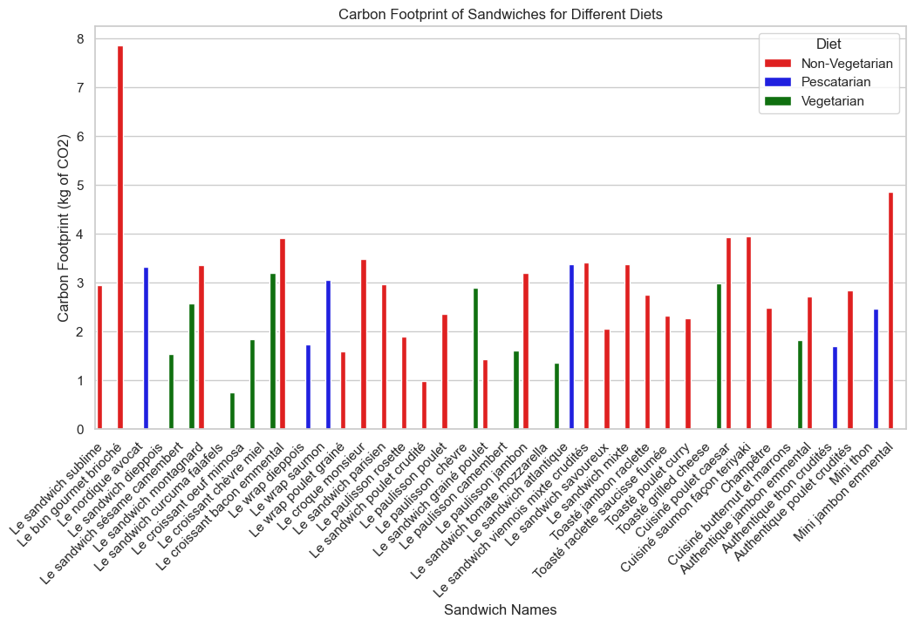
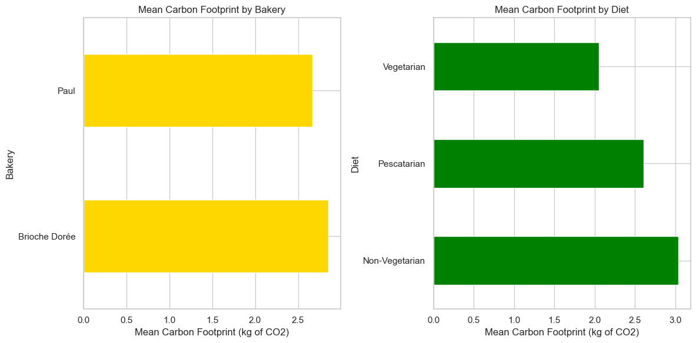
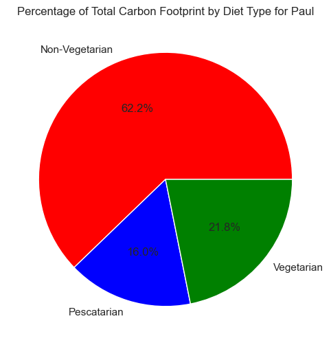
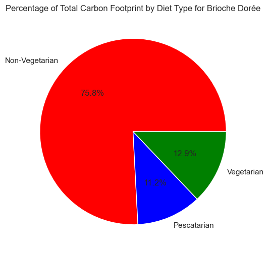
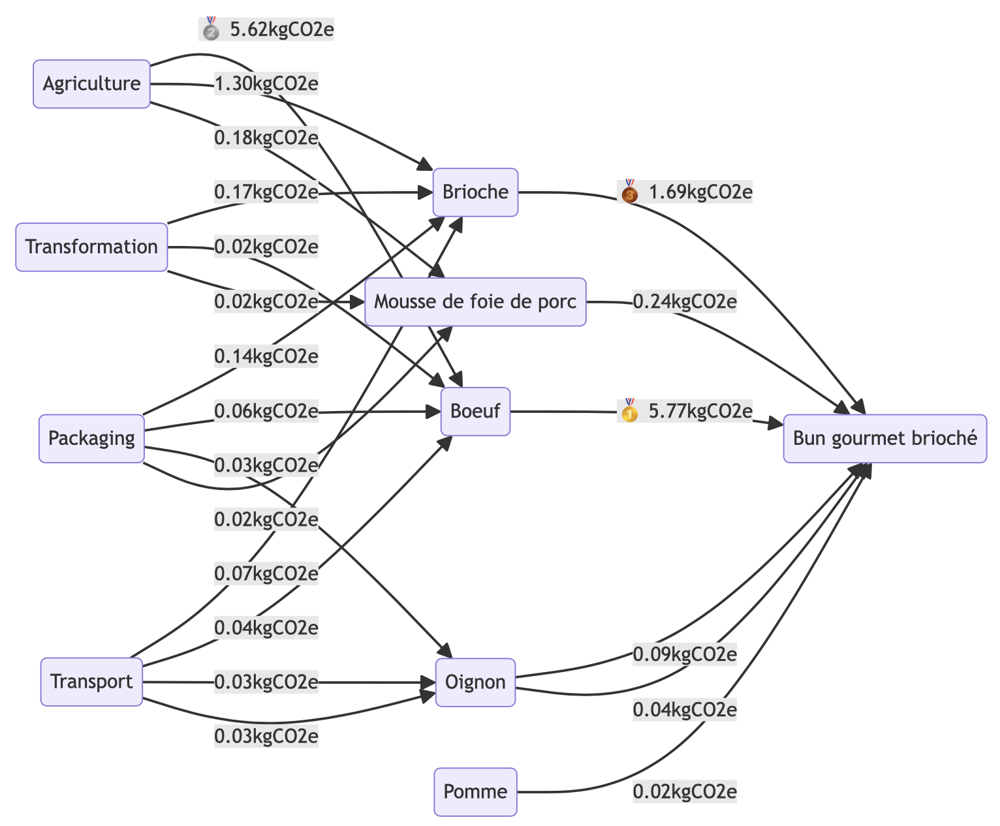
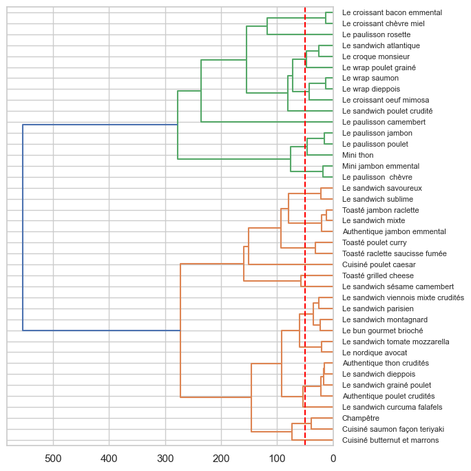

# Project 7: A menu's carbon footprint


Authors: NGUYEN Hoai-Nam & SAYETTAT Anatole

Date: 07/01/2024

## 1. Introduction

In a 2022 study conducted by 'Les Echos,' it was revealed that the sandwich stands out as the predominant choice among restauration products in France, boasting an impressive 2.61 billion units sold in 2021. In light of this data and with our project's objective to assess the carbon footprint of various menu items, we found it pertinent to delve into the environmental impact of some of the most widely consumed sandwiches in France. For this purpose, we have selected two of the most popular bakeries in the country, Paul and Brioche Dorée, based on their significant sales figures and the accessibility of their menus. Our intention is to estimate the carbon footprint associated with each sandwich listed on their respective websites.

To this end, we will scrap the web menus of the two aforementioned bakeries in order to gather their contents. Both restaurants provide information about their sandwiches, including ingredients and various nutritional information. While the nutritional group weights are available, the weights of individual ingredients are absent. To fill this gap, we turn to the CIQUAL Table, a database from the Food Observatory of the French National Agency for Food, providing percentage nutritional composition for various ingredients. Key nutritional elements considered are limited to Water, Glucide, Proteins, Lipids, Fiber, and Sodium, as other nutrients contribute minimally to overall nutient composition.

The challenge involves solving a system of equations, with ingredient weights as variables. Represented as $`A \cdot B = C`$ , where $`A`$ signifies the matrix of nutritional percentage per ingredient, $`B`$ denotes the matrix of ingredient weights, and $`C`$ embodies the matrix of nutritional weights per sandwich. However, direct solution proves impractical due to a constraint mismatch between the number of equations and variables. Therefore, we opt for estimating ingredient weights by solving a minimization problem, constrained by the requirement that all ingredient weights remain strictly positive, expressed as $`\min(A \cdot B - C)`$ subject to $`B > 0`$.

Once estimated ingredient weights are obtained, we proceed to calculate the carbon footprint for each sandwich. Using the AGRIBALYSE database, a collaborative effort between the French Ministry of Agriculture and the "Agence de la Transition Ecologique", we obtain environmental footprints for various food products. Carbon footprint measurements are in kilograms (kg), while sandwich weights are in grams. To facilitate standardized comparisons among sandwiches of the same weight scale, we scale all ingredient weights to 1 kg.

It's crucial to highlight that our approach involves virtual sandwich composition based on information sourced from restaurant websites, rather than physical assembly.

Furthermore, we delve into a deeper analysis by implementing a Mermaid flow chart to identify the sandwich composition that minimizes carbon dioxide emissions. Additionally, we explore the Skyline approach to identify sandwiches that minimize their carbon footprint (measured in kg) while maximizing their energy content (measured in kcal).

Moreover, our investigation extends to a comprehensive analysis, incorporating a Mermaid flow chart to pinpoint the sandwich compositions that yield minimal carbon dioxide emissions. Furthermore, we explore the Skyline approach to identify the sandwiches that have a minimal carbon footprint (measured in kg) while having a maximal energy content (measured in kcal). Furthermore, we construct a clustering dendrogram visualization to discern patterns in sandwich compositions, providing valuable insights into groupings based on nutritional and environmental similarities. Additionally, a Principal Component Analysis (PCA) is conducted to unveil underlying patterns and relationships within the dataset.


```python
from bs4 import BeautifulSoup
import requests
import pandas as pd
import numpy as np
import warnings
warnings.filterwarnings("ignore")
import random

random.seed(2024)
```

## 2. Menu's scrapping

As previously mentioned, we will do some web scrapping to build an initial data frame with our sandwich menus; we are interested in the sandwich names, their ingredients and nutritional contents. We will use the Python package 'bs4' and inspect the respective source code of the web menus of Paul and Brioche Dorée in order to extract the needed information.

### 2.1. Paul


```python

# Send an HTTP GET request to the URL containing the sandwich links
menu_url = "https://www.paul.fr/dejeuner/sandwichs"
menu_response = requests.get(menu_url)
menu_soup = BeautifulSoup(menu_response.content, 'html.parser')

# Find all the sandwich links and names
sandwich_all = menu_soup.find_all("a", class_="block no-underline font-book text-12 md-text-14")
sandwich_links = [sandwich['href'] for sandwich in sandwich_all]
sandwich_names = [sandwich.text.strip() for sandwich in sandwich_all]

# Create an empty DataFrame to store the combined data
paul_df = pd.DataFrame()


# Loop through the list of HTML links and sandwich names
for link, name in zip(sandwich_links, sandwich_names):
    
    # Define the URL 
    url = link
    response = requests.get(url)
    soup = BeautifulSoup(response.content, 'html.parser')
    
    content_element_desc = soup.find('div', class_='value font-book leading-26')
    if content_element_desc is None:
        # Handle cases where 'nutri_content' is missing, for example, by adding a placeholder value
        description_df = pd.DataFrame({"Description": ["Data not available"]})
    else:
        # Continue processing as before
        scraped_content_desc = content_element_desc.get_text()

        description_df = pd.DataFrame({"Description": [scraped_content_desc]})
            
    # Check if there is a 'nutri_content' element on the page
    content_element = soup.find('div', class_='nutri_content')
    
    if content_element is None:
        # Handle cases where 'nutri_content' is missing, for example, by adding a placeholder value
        ingredients_df = pd.DataFrame({"Ingredients": ["Data not available"]})
    else:
        # Continue processing as before
        scraped_content = content_element.find('span').get_text()

        ingredients_df = pd.DataFrame({"Ingredients": [scraped_content]})

        # Check if there is a 'table' element within the 'nutri_content'
        table_element = content_element.find('table')

        if table_element is not None:
            # Create an empty DataFrame
            data = []

            # Iterate through the rows of the table to extract data
            for row in table_element.find_all('tr'):
                columns = row.find_all('td')
                if columns:
                    row_data = [col.get_text(strip=True) for col in columns]
                    data.append(row_data)

            # Create a DataFrame
            df = pd.DataFrame(data, columns=['Nutrient', '100.00 g', 'Par portion'])

            # Transpose dataframe 
            df = df[df.columns.difference(["100.00 g"])].T

            df.columns = df.iloc[0]

            # Drop the first row
            df = df[1:]

            df.reset_index(drop=True, inplace=True)

            combined_df = pd.concat([description_df, ingredients_df, df], axis=1)
        else:
            # Handle cases where the table is missing, for example, by adding a placeholder value
            combined_df = pd.concat([description_df, ingredients_df, pd.DataFrame({"Nutrient": ["Data not available"], "Par portion": ["Data not available"]})], axis=1)

        # Add a new column "Name" with the sandwich name
        combined_df['Name'] = name

        # Concatenate the current combined_df with the paul.df
        paul_df = pd.concat([paul_df, combined_df], axis=0)
    
# Reset the index of the final DataFrame
paul_df.reset_index(drop=True, inplace=True)

# Reorder the column
order = ['Name', 'Description', 'Ingredients', 'Valeurs énergétiques', "Matières grasses",
       'Dont Acides Gras Saturés', 'Glucides', 'Dont sucres',
       'Fibres alimentaires', 'Protéines', 'Sel']

paul_df = paul_df[order]

paul_df['Description'] = paul_df['Description'].str.lstrip('\n')
paul_df['Description'] = paul_df['Description'].str.replace('\n', '. ')

paul_df = paul_df.loc[~paul_df['Name'].isin(['Menu Sandwich', 'Menu Végétalien'])]
paul_df['Boulangerie'] = 'Paul'
paul_df
```


<div>
<style scoped>
    .dataframe tbody tr th:only-of-type {
        vertical-align: middle;
    }

    .dataframe tbody tr th {
        vertical-align: top;
    }

    .dataframe thead th {
        text-align: right;
    }
</style>
<table border="1" class="dataframe">
  <thead>
    <tr style="text-align: right;">
      <th></th>
      <th>Name</th>
      <th>Description</th>
      <th>Ingredients</th>
      <th>Valeurs énergétiques</th>
      <th>Matières grasses</th>
      <th>Dont Acides Gras Saturés</th>
      <th>Glucides</th>
      <th>Dont sucres</th>
      <th>Fibres alimentaires</th>
      <th>Protéines</th>
      <th>Sel</th>
      <th>Boulangerie</th>
    </tr>
  </thead>
  <tbody>
    <tr>
      <th>0</th>
      <td>Le Sandwich Sublime</td>
      <td>Un sandwich sucré-salé gourmand. Testez ce san...</td>
      <td></td>
      <td>678.84 kcal</td>
      <td>29.87 g</td>
      <td>9.49 g</td>
      <td>68.93 g</td>
      <td>7.54 g</td>
      <td>7.33 g</td>
      <td>29.92 g</td>
      <td>3.34 g</td>
      <td>Paul</td>
    </tr>
    <tr>
      <th>1</th>
      <td>Le bun gourmet brioché</td>
      <td>Ce sandwich se compose d'une brioche, de rôti ...</td>
      <td></td>
      <td>538.73 kcal</td>
      <td>29.32 g</td>
      <td>14 g</td>
      <td>47.32 g</td>
      <td>15.96 g</td>
      <td>0.75 g</td>
      <td>21.01 g</td>
      <td>0.78 g</td>
      <td>Paul</td>
    </tr>
    <tr>
      <th>2</th>
      <td>Le nordique avocat</td>
      <td>Ce sandwich se compose de pain nordique, de sa...</td>
      <td></td>
      <td>565.44 kcal</td>
      <td>22.53 g</td>
      <td>7.24 g</td>
      <td>63.65 g</td>
      <td>4.2 g</td>
      <td>7.55 g</td>
      <td>23.25 g</td>
      <td>2.77 g</td>
      <td>Paul</td>
    </tr>
    <tr>
      <th>3</th>
      <td>Le sandwich dieppois</td>
      <td>Le dieppois, c’est un sandwich au thon version...</td>
      <td>Le Dieppois est fait à partir d'une baguette c...</td>
      <td>552.31 kcal</td>
      <td>17.23 g</td>
      <td>1.72 g</td>
      <td>74.97 g</td>
      <td>3.9 g</td>
      <td>4.08 g</td>
      <td>22.31 g</td>
      <td>3.47 g</td>
      <td>Paul</td>
    </tr>
    <tr>
      <th>4</th>
      <td>Le sandwich sésame camembert</td>
      <td>Pas besoin de porter le béret pour déguster ce...</td>
      <td>Un sandwich élaboré à partir d'une baguette au...</td>
      <td>668.58 kcal</td>
      <td>35.2 g</td>
      <td>20.72 g</td>
      <td>61.89 g</td>
      <td>1.45 g</td>
      <td>5.52 g</td>
      <td>23.3 g</td>
      <td>1.5 g</td>
      <td>Paul</td>
    </tr>
    <tr>
      <th>5</th>
      <td>Le sandwich montagnard</td>
      <td>Le montagnard est un sandwich généreux qui ras...</td>
      <td>Un sandwich élaboré à partir d'une baguette au...</td>
      <td>546.04 kcal</td>
      <td>20.18 g</td>
      <td>8.68 g</td>
      <td>64.5 g</td>
      <td>3.2 g</td>
      <td>5.36 g</td>
      <td>23.92 g</td>
      <td>3.09 g</td>
      <td>Paul</td>
    </tr>
    <tr>
      <th>6</th>
      <td>Le sandwich curcuma falafels</td>
      <td>Un sandwich oriental savoureux. Ce sandwich jo...</td>
      <td>Ce sandwich est composé de pain au curcuma et ...</td>
      <td>501.98 kcal</td>
      <td>12.14 g</td>
      <td>1.87 g</td>
      <td>76.21 g</td>
      <td>4.5 g</td>
      <td>10.19 g</td>
      <td>16.87 g</td>
      <td>2.29 g</td>
      <td>Paul</td>
    </tr>
    <tr>
      <th>7</th>
      <td>Le hot dog cheddar</td>
      <td>Un hot dog maxi gourmand. Vous connaissez le p...</td>
      <td>\nLe hot dog à la française fait son entrée ch...</td>
      <td>843.56 kcal</td>
      <td>47.49 g</td>
      <td>25.97 g</td>
      <td>65.5 g</td>
      <td>7.02 g</td>
      <td>3.51 g</td>
      <td>36.77 g</td>
      <td>4.16 g</td>
      <td>Paul</td>
    </tr>
    <tr>
      <th>8</th>
      <td>Le croissant oeuf mimosa</td>
      <td>Naturel et frais : le croissant bon pour la sa...</td>
      <td></td>
      <td>413.76 kcal</td>
      <td>26.06 g</td>
      <td>11.18 g</td>
      <td>30.66 g</td>
      <td>5.65 g</td>
      <td>1.76 g</td>
      <td>13.26 g</td>
      <td>1.59 g</td>
      <td>Paul</td>
    </tr>
    <tr>
      <th>9</th>
      <td>Le croissant chèvre miel</td>
      <td>Le croissant aux produits du terroir. Les boul...</td>
      <td></td>
      <td>426.94 kcal</td>
      <td>24.96 g</td>
      <td>14.5 g</td>
      <td>36.84 g</td>
      <td>12.59 g</td>
      <td>2.04 g</td>
      <td>12.71 g</td>
      <td>1.1 g</td>
      <td>Paul</td>
    </tr>
    <tr>
      <th>10</th>
      <td>Le croissant bacon emmental</td>
      <td>Un croissant plus que gourmand. Le croissant, ...</td>
      <td></td>
      <td>417.28 kcal</td>
      <td>26.18 g</td>
      <td>15.72 g</td>
      <td>30.01 g</td>
      <td>6.26 g</td>
      <td>1.43 g</td>
      <td>14.7 g</td>
      <td>1.45 g</td>
      <td>Paul</td>
    </tr>
    <tr>
      <th>11</th>
      <td>Le wrap dieppois</td>
      <td>Un wrap à la fraîcheur marine. Le wrap, on aim...</td>
      <td></td>
      <td>416.21 kcal</td>
      <td>15.54 g</td>
      <td>1.44 g</td>
      <td>51.82 g</td>
      <td>4.04 g</td>
      <td>2.72 g</td>
      <td>15.91 g</td>
      <td>2.52 g</td>
      <td>Paul</td>
    </tr>
    <tr>
      <th>12</th>
      <td>Le wrap saumon</td>
      <td>Un wrap chic et frais. Le wrap saumon PAUL se ...</td>
      <td></td>
      <td>425.84 kcal</td>
      <td>16.38 g</td>
      <td>6.01 g</td>
      <td>51.89 g</td>
      <td>4.69 g</td>
      <td>2.61 g</td>
      <td>16.42 g</td>
      <td>2.45 g</td>
      <td>Paul</td>
    </tr>
    <tr>
      <th>13</th>
      <td>Le wrap poulet grainé</td>
      <td>Un wrap attirant par ses couleurs et ses saveu...</td>
      <td></td>
      <td>462.58 kcal</td>
      <td>18.28 g</td>
      <td>1.79 g</td>
      <td>58.21 g</td>
      <td>4.53 g</td>
      <td>3.27 g</td>
      <td>14.67 g</td>
      <td>2.34 g</td>
      <td>Paul</td>
    </tr>
    <tr>
      <th>16</th>
      <td>Le croque monsieur</td>
      <td>Un monsieur qu’on adore croquer !. Est-ce un s...</td>
      <td></td>
      <td>481.89 kcal</td>
      <td>19.7 g</td>
      <td>13.61 g</td>
      <td>49.51 g</td>
      <td>4.67 g</td>
      <td>5.02 g</td>
      <td>24.13 g</td>
      <td>3.01 g</td>
      <td>Paul</td>
    </tr>
    <tr>
      <th>17</th>
      <td>Le sandwich chèvre, miel et noix</td>
      <td>Un sandwich qui explose de saveurs. Entre deux...</td>
      <td>\nCe sandwich est composé d'une paulette multi...</td>
      <td>690.91 kcal</td>
      <td>30.61 g</td>
      <td>9.97 g</td>
      <td>75.3 g</td>
      <td>12.4 g</td>
      <td>8.47 g</td>
      <td>24.32 g</td>
      <td>2.12 g</td>
      <td>Paul</td>
    </tr>
    <tr>
      <th>18</th>
      <td>Le sandwich chaud tomate mozzarella</td>
      <td>Data not available</td>
      <td></td>
      <td>550.54 kcal</td>
      <td>27.27 g</td>
      <td>14.14 g</td>
      <td>54.53 g</td>
      <td>3.9 g</td>
      <td>3.5 g</td>
      <td>19.99 g</td>
      <td>2.05 g</td>
      <td>Paul</td>
    </tr>
    <tr>
      <th>19</th>
      <td>Le sandwich chaud jambon fromage</td>
      <td>Data not available</td>
      <td></td>
      <td>623.69 kcal</td>
      <td>30.22 g</td>
      <td>19.41 g</td>
      <td>55.53 g</td>
      <td>2.94 g</td>
      <td>3.13 g</td>
      <td>30.83 g</td>
      <td>2.87 g</td>
      <td>Paul</td>
    </tr>
    <tr>
      <th>20</th>
      <td>Le sandwich chaud poulet ciboulettte</td>
      <td>Data not available</td>
      <td></td>
      <td>535.83 kcal</td>
      <td>21.19 g</td>
      <td>12.14 g</td>
      <td>61.43 g</td>
      <td>3.6 g</td>
      <td>3.75 g</td>
      <td>22.98 g</td>
      <td>2.32 g</td>
      <td>Paul</td>
    </tr>
    <tr>
      <th>21</th>
      <td>Le sandwich parisien</td>
      <td>Le sandwich jambon ou sandwich parisien est un...</td>
      <td>Le Parisien est élaboré à partir d'une baguett...</td>
      <td>541.56 kcal</td>
      <td>18.91 g</td>
      <td>12.27 g</td>
      <td>71.52 g</td>
      <td>2.01 g</td>
      <td>3.76 g</td>
      <td>19.46 g</td>
      <td>2.47 g</td>
      <td>Paul</td>
    </tr>
    <tr>
      <th>22</th>
      <td>Le paulisson rosette</td>
      <td>Un petit pain aux saveurs contrastées. Ce peti...</td>
      <td></td>
      <td>329.83 kcal</td>
      <td>17.43 g</td>
      <td>7.99 g</td>
      <td>32.13 g</td>
      <td>3.09 g</td>
      <td>1.65 g</td>
      <td>10.28 g</td>
      <td>1.62 g</td>
      <td>Paul</td>
    </tr>
    <tr>
      <th>23</th>
      <td>Le sandwich poulet crudité</td>
      <td>Le sandwich poulet crudités, c’est un sandwich...</td>
      <td></td>
      <td>448.25 kcal</td>
      <td>10.8 g</td>
      <td>1.13 g</td>
      <td>73.65 g</td>
      <td>3.23 g</td>
      <td>4.08 g</td>
      <td>12.08 g</td>
      <td>2.53 g</td>
      <td>Paul</td>
    </tr>
    <tr>
      <th>24</th>
      <td>Le paulisson poulet</td>
      <td>Un petit pain extra moelleux. Le paulisson pou...</td>
      <td></td>
      <td>233.18 kcal</td>
      <td>8.18 g</td>
      <td>2.34 g</td>
      <td>32.98 g</td>
      <td>4.16 g</td>
      <td>1.95 g</td>
      <td>5.95 g</td>
      <td>1.04 g</td>
      <td>Paul</td>
    </tr>
    <tr>
      <th>25</th>
      <td>Le paulisson  chèvre</td>
      <td>Relevé et moelleux : contrastes réussis du pau...</td>
      <td></td>
      <td>293.35 kcal</td>
      <td>12.68 g</td>
      <td>7.45 g</td>
      <td>32.97 g</td>
      <td>3.92 g</td>
      <td>1.86 g</td>
      <td>10.9 g</td>
      <td>1.08 g</td>
      <td>Paul</td>
    </tr>
    <tr>
      <th>26</th>
      <td>Le sandwich grainé poulet</td>
      <td>Le sandwich poulet grainé, c’est un pain très ...</td>
      <td>Un pain grainé composé de poulet, mayonnaise a...</td>
      <td>546.85 kcal</td>
      <td>22.6 g</td>
      <td>2.68 g</td>
      <td>65.93 g</td>
      <td>3.95 g</td>
      <td>7.93 g</td>
      <td>15.98 g</td>
      <td>2.45 g</td>
      <td>Paul</td>
    </tr>
    <tr>
      <th>27</th>
      <td>Le paulisson camembert</td>
      <td>Douceur et moelleux pour fans de fromage. Le g...</td>
      <td></td>
      <td>309.78 kcal</td>
      <td>13.54 g</td>
      <td>8.8 g</td>
      <td>32.2 g</td>
      <td>3.15 g</td>
      <td>2.46 g</td>
      <td>13.56 g</td>
      <td>0.77 g</td>
      <td>Paul</td>
    </tr>
    <tr>
      <th>28</th>
      <td>Le paulisson jambon</td>
      <td>Le petit pain incontournable. Il est tout simp...</td>
      <td></td>
      <td>246.93 kcal</td>
      <td>7.93 g</td>
      <td>5.42 g</td>
      <td>32.9 g</td>
      <td>3.79 g</td>
      <td>1.69 g</td>
      <td>10.15 g</td>
      <td>1.08 g</td>
      <td>Paul</td>
    </tr>
    <tr>
      <th>29</th>
      <td>Le sandwich tomate mozzarella</td>
      <td>C’est le sud et tous ses parfums généreux que ...</td>
      <td>Ce sandwich est élaboré à partir d'un pain pol...</td>
      <td>579.13 kcal</td>
      <td>29.77 g</td>
      <td>8.15 g</td>
      <td>58.19 g</td>
      <td>3.31 g</td>
      <td>4.64 g</td>
      <td>17.29 g</td>
      <td>2.69 g</td>
      <td>Paul</td>
    </tr>
    <tr>
      <th>30</th>
      <td>Le sandwich atlantique</td>
      <td>Ce sandwich associe délicatement le saumon, le...</td>
      <td>L'Atlantique est élaboré à partir d'une baguet...</td>
      <td>466.74 kcal</td>
      <td>12.95 g</td>
      <td>3.86 g</td>
      <td>63.92 g</td>
      <td>3.13 g</td>
      <td>4.67 g</td>
      <td>21.3 g</td>
      <td>2.71 g</td>
      <td>Paul</td>
    </tr>
    <tr>
      <th>31</th>
      <td>Le sandwich viennois mixte crudités</td>
      <td>Un pain moelleux comme un nuage, c’est déjà le...</td>
      <td>Un pain viennois compsoé de jambon blanc de qu...</td>
      <td>521.22 kcal</td>
      <td>17.03 g</td>
      <td>11.44 g</td>
      <td>65.25 g</td>
      <td>7.5 g</td>
      <td>3.72 g</td>
      <td>24.88 g</td>
      <td>2.24 g</td>
      <td>Paul</td>
    </tr>
    <tr>
      <th>32</th>
      <td>Le sandwich savoureux</td>
      <td>Être croustillant et fondant à la fois, c’est ...</td>
      <td>Le sandwich savoureux est élaboré à partir d'u...</td>
      <td>663.2 kcal</td>
      <td>30.77 g</td>
      <td>17.05 g</td>
      <td>72.53 g</td>
      <td>2.65 g</td>
      <td>3.99 g</td>
      <td>22.05 g</td>
      <td>4.05 g</td>
      <td>Paul</td>
    </tr>
    <tr>
      <th>33</th>
      <td>Le sandwich mixte</td>
      <td>Le mixte, c’est le sandwich traditionnel par e...</td>
      <td>Le sandwich mixte se trouve dans une baguette ...</td>
      <td>615.41 kcal</td>
      <td>24.51 g</td>
      <td>16.25 g</td>
      <td>71.76 g</td>
      <td>2.14 g</td>
      <td>3.76 g</td>
      <td>25.07 g</td>
      <td>2.65 g</td>
      <td>Paul</td>
    </tr>
  </tbody>
</table>
</div>


We notice that the sandwiches "Le sandwich chaud tomate mozzarella", "Le sandwich chaud jambon fromage" and "Le sandwich chaud poulet ciboulettte" have no information listed regarding their contents on the Paul website. We will remove these sandwiches. Furthermore, throughout this project we have noticed that the Paul web menu is subject to changes as items are regularly added or removed from the menu. We have decided to only keep the sandwiches that were on the menu when we conducted the carbon footprint analysis; this is why we remove "Le hot dog cheddar" and "Le sandwich chèvre, miel et noix". 

(Note: In annex to this notebook, we will also attach a file which contains the exact Paul menu we used, just in case the menu is subjects to additional changes in the future) 


```python
paul_df = paul_df[~(paul_df.Name.isin(['Le hot dog cheddar', 'Le sandwich chèvre, miel et noix',
                            'Le sandwich chaud tomate mozzarella', 'Le sandwich chaud jambon fromage',
                            'Le sandwich chaud poulet ciboulettte']))].reset_index(drop=True)
```

We also notice from our original web scrapping that the sandwiches have their ingredients listed in the form of crafted sentences. This is of no use to us and is cumbersome with regards to evaluating the weight of each ingredient in each sandwich. We wish to have, for each observation is our data frame, an ingredient column where figures a list with every ingredient is the sandwich. To do so, we will transform each cell in the "Ingredients" column so that we have only the ingredients, seperated by a comma; from this we will convert each cell in list format.

For this end, we have decided to apply a few custom functions to the "Ingredients" column:


- remove_stopwords: this function removes all French stop words that may be included in a cell. Indeed, stop words do not give us any information about the sandwich ingredients. 
    (The stop words in French are: 'au', 'aux', 'avec', 'ce', 'ces', 'dans', 'de', 'des', 'du', 'elle', 'en', 'et', 'eux', 'il', 'ils', 'je', 'la', 'le', 'les', 'leur', 'lui', 'ma', 'mais', 'me', 'même', 'mes', 'moi', 'mon', 'ne', 'nos', 'notre', 'nous', 'on', 'ou', 'par', 'pas', 'pour', 'qu', 'que', 'qui', 'sa', 'se', 'ses', 'son', 'sur', 'ta', 'te', 'tes', 'toi', 'ton', 'tu', 'un', 'une', 'vos', 'votre', 'vous', 'c', 'd', 'j', 'l', 'à', 'm', 'n', 's', 't', 'y', 'été', 'étée', 'étées', 'étés', 'étant', 'étante', 'étants', 'étantes', 'suis', 'es', 'est', 'sommes', 'êtes', 'sont', 'serai', 'seras', 'sera', 'serons', 'serez', 'seront', 'serais', 'serait', 'serions', 'seriez', 'seraient', 'étais', 'était', 'étions', 'étiez', 'étaient', 'fus', 'fut', 'fûmes', 'fûtes', 'furent', 'sois', 'soit', 'soyons', 'soyez', 'soient', 'fusse', 'fusses', 'fût', 'fussions', 'fussiez', 'fussent', 'ayant', 'ayante', 'ayantes', 'ayants', 'eu', 'eue', 'eues', 'eus', 'ai', 'as', 'avons', 'avez', 'ont', 'aurai', 'auras', 'aura', 'aurons', 'aurez', 'auront', 'aurais', 'aurait', 'aurions', 'auriez', 'auraient', 'avais', 'avait', 'avions', 'aviez', 'avaient', 'eut', 'eûmes', 'eûtes', 'eurent', 'aie', 'aies', 'ait', 'ayons', 'ayez', 'aient', 'eusse', 'eusses', 'eût', 'eussions', 'eussiez', 'eussent') 


- remove_before_baguette_or_pain: this function removes all information contained in a cell that figures before the word "pain" or "baguette". Indeed, we notice that for every cell in the "Ingredients" column, the bread is always the first ingredient listed so everything that comes before does not give us any information about the sandwich ingredients.


- replace_compose: this function replaces the words "composé d'un" and their variants like "composée d'une", "composée d'un", etc. with a comma. Indeed, we notice that every cell in the "Ingredients" column has a structure that follows the bread ingredient by "composé d'un" (or one of its grammatical variants), and then an enumeration of the ingredients. With this function, we wish to simply replace this by a comma so that each cell is closer to the list format we are after. 


- replace_last_et: this function replaces that final "et" with a comma. Indeed, after each ingredient is enumerated and separated by commas, the final ingredient is preceded by an "et" ("and") as it is a sentence. Replacing this final "et" by a comma gives us the format that we are after.


After applying these functions to the variable "Ingredients", we remove will remove any and all special characters and convert each cell in our desired list format. 


```python
import re
import nltk
nltk.download('punkt')
from nltk.corpus import stopwords
from nltk.tokenize import word_tokenize

nltk.download('stopwords')
#print(stopwords.words('french'))

def remove_stopwords(description):
    stop_words = set(stopwords.words('french'))
    words = word_tokenize(description)
    filtered_words = [word for word in words if word.lower() not in stop_words]
    return ' '.join(filtered_words)

def remove_before_baguette_or_pain(description):
    cleaned_description = re.sub(r'.*(baguette|pain)', r'\1', description, flags=re.IGNORECASE)
    return cleaned_description.strip()

def replace_compose(description):
    cleaned_description = re.sub(r'compos[éeé]* d[\'eune]*', ', ', description, flags=re.IGNORECASE)
    return cleaned_description.strip()

def replace_last_et(description):
    reversed_description = description[::-1].replace('te', ', ', 1)[::-1]
    return reversed_description


paul_df['Ingredients'] = paul_df['Ingredients'].apply(remove_before_baguette_or_pain)
paul_df['Ingredients'] = paul_df['Ingredients'].apply(replace_compose)
paul_df['Ingredients'] = paul_df['Ingredients'].apply(replace_last_et)
paul_df['Ingredients'] = paul_df['Ingredients'].apply(remove_stopwords)

paul_df['Ingredients'] = paul_df['Ingredients'].str.replace('[.\']', '')
paul_df['Ingredients'] = paul_df['Ingredients'].apply(lambda x: [i.strip() for i in x.split(',')] if x else x)
paul_df
```

    [nltk_data] Downloading package punkt to /Users/hoainam/nltk_data...
    [nltk_data]   Package punkt is already up-to-date!
    [nltk_data] Downloading package stopwords to
    [nltk_data]     /Users/hoainam/nltk_data...
    [nltk_data]   Package stopwords is already up-to-date!


<div>
<style scoped>
    .dataframe tbody tr th:only-of-type {
        vertical-align: middle;
    }

    .dataframe tbody tr th {
        vertical-align: top;
    }

    .dataframe thead th {
        text-align: right;
    }
</style>
<table border="1" class="dataframe">
  <thead>
    <tr style="text-align: right;">
      <th></th>
      <th>Name</th>
      <th>Description</th>
      <th>Ingredients</th>
      <th>Valeurs énergétiques</th>
      <th>Matières grasses</th>
      <th>Dont Acides Gras Saturés</th>
      <th>Glucides</th>
      <th>Dont sucres</th>
      <th>Fibres alimentaires</th>
      <th>Protéines</th>
      <th>Sel</th>
      <th>Boulangerie</th>
    </tr>
  </thead>
  <tbody>
    <tr>
      <th>0</th>
      <td>Le Sandwich Sublime</td>
      <td>Un sandwich sucré-salé gourmand. Testez ce san...</td>
      <td></td>
      <td>678.84 kcal</td>
      <td>29.87 g</td>
      <td>9.49 g</td>
      <td>68.93 g</td>
      <td>7.54 g</td>
      <td>7.33 g</td>
      <td>29.92 g</td>
      <td>3.34 g</td>
      <td>Paul</td>
    </tr>
    <tr>
      <th>1</th>
      <td>Le bun gourmet brioché</td>
      <td>Ce sandwich se compose d'une brioche, de rôti ...</td>
      <td></td>
      <td>538.73 kcal</td>
      <td>29.32 g</td>
      <td>14 g</td>
      <td>47.32 g</td>
      <td>15.96 g</td>
      <td>0.75 g</td>
      <td>21.01 g</td>
      <td>0.78 g</td>
      <td>Paul</td>
    </tr>
    <tr>
      <th>2</th>
      <td>Le nordique avocat</td>
      <td>Ce sandwich se compose de pain nordique, de sa...</td>
      <td></td>
      <td>565.44 kcal</td>
      <td>22.53 g</td>
      <td>7.24 g</td>
      <td>63.65 g</td>
      <td>4.2 g</td>
      <td>7.55 g</td>
      <td>23.25 g</td>
      <td>2.77 g</td>
      <td>Paul</td>
    </tr>
    <tr>
      <th>3</th>
      <td>Le sandwich dieppois</td>
      <td>Le dieppois, c’est un sandwich au thon version...</td>
      <td>[baguette, mayonnaise allégée, thon, feuilles ...</td>
      <td>552.31 kcal</td>
      <td>17.23 g</td>
      <td>1.72 g</td>
      <td>74.97 g</td>
      <td>3.9 g</td>
      <td>4.08 g</td>
      <td>22.31 g</td>
      <td>3.47 g</td>
      <td>Paul</td>
    </tr>
    <tr>
      <th>4</th>
      <td>Le sandwich sésame camembert</td>
      <td>Pas besoin de porter le béret pour déguster ce...</td>
      <td>[baguette graines sésame, beurre, camembert, ,...</td>
      <td>668.58 kcal</td>
      <td>35.2 g</td>
      <td>20.72 g</td>
      <td>61.89 g</td>
      <td>1.45 g</td>
      <td>5.52 g</td>
      <td>23.3 g</td>
      <td>1.5 g</td>
      <td>Paul</td>
    </tr>
    <tr>
      <th>5</th>
      <td>Le sandwich montagnard</td>
      <td>Le montagnard est un sandwich généreux qui ras...</td>
      <td>[baguette pavot, tomates, coppa, tartinade oli...</td>
      <td>546.04 kcal</td>
      <td>20.18 g</td>
      <td>8.68 g</td>
      <td>64.5 g</td>
      <td>3.2 g</td>
      <td>5.36 g</td>
      <td>23.92 g</td>
      <td>3.09 g</td>
      <td>Paul</td>
    </tr>
    <tr>
      <th>6</th>
      <td>Le sandwich curcuma falafels</td>
      <td>Un sandwich oriental savoureux. Ce sandwich jo...</td>
      <td>[pain curcuma sésame noir, falafels, houmous b...</td>
      <td>501.98 kcal</td>
      <td>12.14 g</td>
      <td>1.87 g</td>
      <td>76.21 g</td>
      <td>4.5 g</td>
      <td>10.19 g</td>
      <td>16.87 g</td>
      <td>2.29 g</td>
      <td>Paul</td>
    </tr>
    <tr>
      <th>7</th>
      <td>Le croissant oeuf mimosa</td>
      <td>Naturel et frais : le croissant bon pour la sa...</td>
      <td></td>
      <td>413.76 kcal</td>
      <td>26.06 g</td>
      <td>11.18 g</td>
      <td>30.66 g</td>
      <td>5.65 g</td>
      <td>1.76 g</td>
      <td>13.26 g</td>
      <td>1.59 g</td>
      <td>Paul</td>
    </tr>
    <tr>
      <th>8</th>
      <td>Le croissant chèvre miel</td>
      <td>Le croissant aux produits du terroir. Les boul...</td>
      <td></td>
      <td>426.94 kcal</td>
      <td>24.96 g</td>
      <td>14.5 g</td>
      <td>36.84 g</td>
      <td>12.59 g</td>
      <td>2.04 g</td>
      <td>12.71 g</td>
      <td>1.1 g</td>
      <td>Paul</td>
    </tr>
    <tr>
      <th>9</th>
      <td>Le croissant bacon emmental</td>
      <td>Un croissant plus que gourmand. Le croissant, ...</td>
      <td></td>
      <td>417.28 kcal</td>
      <td>26.18 g</td>
      <td>15.72 g</td>
      <td>30.01 g</td>
      <td>6.26 g</td>
      <td>1.43 g</td>
      <td>14.7 g</td>
      <td>1.45 g</td>
      <td>Paul</td>
    </tr>
    <tr>
      <th>10</th>
      <td>Le wrap dieppois</td>
      <td>Un wrap à la fraîcheur marine. Le wrap, on aim...</td>
      <td></td>
      <td>416.21 kcal</td>
      <td>15.54 g</td>
      <td>1.44 g</td>
      <td>51.82 g</td>
      <td>4.04 g</td>
      <td>2.72 g</td>
      <td>15.91 g</td>
      <td>2.52 g</td>
      <td>Paul</td>
    </tr>
    <tr>
      <th>11</th>
      <td>Le wrap saumon</td>
      <td>Un wrap chic et frais. Le wrap saumon PAUL se ...</td>
      <td></td>
      <td>425.84 kcal</td>
      <td>16.38 g</td>
      <td>6.01 g</td>
      <td>51.89 g</td>
      <td>4.69 g</td>
      <td>2.61 g</td>
      <td>16.42 g</td>
      <td>2.45 g</td>
      <td>Paul</td>
    </tr>
    <tr>
      <th>12</th>
      <td>Le wrap poulet grainé</td>
      <td>Un wrap attirant par ses couleurs et ses saveu...</td>
      <td></td>
      <td>462.58 kcal</td>
      <td>18.28 g</td>
      <td>1.79 g</td>
      <td>58.21 g</td>
      <td>4.53 g</td>
      <td>3.27 g</td>
      <td>14.67 g</td>
      <td>2.34 g</td>
      <td>Paul</td>
    </tr>
    <tr>
      <th>13</th>
      <td>Le croque monsieur</td>
      <td>Un monsieur qu’on adore croquer !. Est-ce un s...</td>
      <td></td>
      <td>481.89 kcal</td>
      <td>19.7 g</td>
      <td>13.61 g</td>
      <td>49.51 g</td>
      <td>4.67 g</td>
      <td>5.02 g</td>
      <td>24.13 g</td>
      <td>3.01 g</td>
      <td>Paul</td>
    </tr>
    <tr>
      <th>14</th>
      <td>Le sandwich parisien</td>
      <td>Le sandwich jambon ou sandwich parisien est un...</td>
      <td>[baguette, jambon, beurre]</td>
      <td>541.56 kcal</td>
      <td>18.91 g</td>
      <td>12.27 g</td>
      <td>71.52 g</td>
      <td>2.01 g</td>
      <td>3.76 g</td>
      <td>19.46 g</td>
      <td>2.47 g</td>
      <td>Paul</td>
    </tr>
    <tr>
      <th>15</th>
      <td>Le paulisson rosette</td>
      <td>Un petit pain aux saveurs contrastées. Ce peti...</td>
      <td></td>
      <td>329.83 kcal</td>
      <td>17.43 g</td>
      <td>7.99 g</td>
      <td>32.13 g</td>
      <td>3.09 g</td>
      <td>1.65 g</td>
      <td>10.28 g</td>
      <td>1.62 g</td>
      <td>Paul</td>
    </tr>
    <tr>
      <th>16</th>
      <td>Le sandwich poulet crudité</td>
      <td>Le sandwich poulet crudités, c’est un sandwich...</td>
      <td></td>
      <td>448.25 kcal</td>
      <td>10.8 g</td>
      <td>1.13 g</td>
      <td>73.65 g</td>
      <td>3.23 g</td>
      <td>4.08 g</td>
      <td>12.08 g</td>
      <td>2.53 g</td>
      <td>Paul</td>
    </tr>
    <tr>
      <th>17</th>
      <td>Le paulisson poulet</td>
      <td>Un petit pain extra moelleux. Le paulisson pou...</td>
      <td></td>
      <td>233.18 kcal</td>
      <td>8.18 g</td>
      <td>2.34 g</td>
      <td>32.98 g</td>
      <td>4.16 g</td>
      <td>1.95 g</td>
      <td>5.95 g</td>
      <td>1.04 g</td>
      <td>Paul</td>
    </tr>
    <tr>
      <th>18</th>
      <td>Le paulisson  chèvre</td>
      <td>Relevé et moelleux : contrastes réussis du pau...</td>
      <td></td>
      <td>293.35 kcal</td>
      <td>12.68 g</td>
      <td>7.45 g</td>
      <td>32.97 g</td>
      <td>3.92 g</td>
      <td>1.86 g</td>
      <td>10.9 g</td>
      <td>1.08 g</td>
      <td>Paul</td>
    </tr>
    <tr>
      <th>19</th>
      <td>Le sandwich grainé poulet</td>
      <td>Le sandwich poulet grainé, c’est un pain très ...</td>
      <td>[pain grainé, poulet, mayonnaise allégée, mout...</td>
      <td>546.85 kcal</td>
      <td>22.6 g</td>
      <td>2.68 g</td>
      <td>65.93 g</td>
      <td>3.95 g</td>
      <td>7.93 g</td>
      <td>15.98 g</td>
      <td>2.45 g</td>
      <td>Paul</td>
    </tr>
    <tr>
      <th>20</th>
      <td>Le paulisson camembert</td>
      <td>Douceur et moelleux pour fans de fromage. Le g...</td>
      <td></td>
      <td>309.78 kcal</td>
      <td>13.54 g</td>
      <td>8.8 g</td>
      <td>32.2 g</td>
      <td>3.15 g</td>
      <td>2.46 g</td>
      <td>13.56 g</td>
      <td>0.77 g</td>
      <td>Paul</td>
    </tr>
    <tr>
      <th>21</th>
      <td>Le paulisson jambon</td>
      <td>Le petit pain incontournable. Il est tout simp...</td>
      <td></td>
      <td>246.93 kcal</td>
      <td>7.93 g</td>
      <td>5.42 g</td>
      <td>32.9 g</td>
      <td>3.79 g</td>
      <td>1.69 g</td>
      <td>10.15 g</td>
      <td>1.08 g</td>
      <td>Paul</td>
    </tr>
    <tr>
      <th>22</th>
      <td>Le sandwich tomate mozzarella</td>
      <td>C’est le sud et tous ses parfums généreux que ...</td>
      <td>[pain polka flamand 2 olives, mélange pesto hu...</td>
      <td>579.13 kcal</td>
      <td>29.77 g</td>
      <td>8.15 g</td>
      <td>58.19 g</td>
      <td>3.31 g</td>
      <td>4.64 g</td>
      <td>17.29 g</td>
      <td>2.69 g</td>
      <td>Paul</td>
    </tr>
    <tr>
      <th>23</th>
      <td>Le sandwich atlantique</td>
      <td>Ce sandwich associe délicatement le saumon, le...</td>
      <td>[baguette graines sésame, tartinade citron, sa...</td>
      <td>466.74 kcal</td>
      <td>12.95 g</td>
      <td>3.86 g</td>
      <td>63.92 g</td>
      <td>3.13 g</td>
      <td>4.67 g</td>
      <td>21.3 g</td>
      <td>2.71 g</td>
      <td>Paul</td>
    </tr>
    <tr>
      <th>24</th>
      <td>Le sandwich viennois mixte crudités</td>
      <td>Un pain moelleux comme un nuage, c’est déjà le...</td>
      <td>[pain viennois compsoé jambon blanc qualité su...</td>
      <td>521.22 kcal</td>
      <td>17.03 g</td>
      <td>11.44 g</td>
      <td>65.25 g</td>
      <td>7.5 g</td>
      <td>3.72 g</td>
      <td>24.88 g</td>
      <td>2.24 g</td>
      <td>Paul</td>
    </tr>
    <tr>
      <th>25</th>
      <td>Le sandwich savoureux</td>
      <td>Être croustillant et fondant à la fois, c’est ...</td>
      <td>[baguette, beurre, rosettes, , cornichons]</td>
      <td>663.2 kcal</td>
      <td>30.77 g</td>
      <td>17.05 g</td>
      <td>72.53 g</td>
      <td>2.65 g</td>
      <td>3.99 g</td>
      <td>22.05 g</td>
      <td>4.05 g</td>
      <td>Paul</td>
    </tr>
    <tr>
      <th>26</th>
      <td>Le sandwich mixte</td>
      <td>Le mixte, c’est le sandwich traditionnel par e...</td>
      <td>[baguette, beurre, jambon qualité supérieure d...</td>
      <td>615.41 kcal</td>
      <td>24.51 g</td>
      <td>16.25 g</td>
      <td>71.76 g</td>
      <td>2.14 g</td>
      <td>3.76 g</td>
      <td>25.07 g</td>
      <td>2.65 g</td>
      <td>Paul</td>
    </tr>
  </tbody>
</table>
</div>


Finally, in the Paul web menu, some sandwiches are not given a value for the "Ingredients" variable. However, we can find the ingredients of these sandwiches in the "Description" variable. Unfortunately, the sandwich descriptions are well crafted sentences that are far more detailed and embellished than before. For the 16 sandwiches concerned, we will manually input there ingredient list based on the descriptions. As meticulous as this sounds, given the limited amount of observations concerned, we judge this method the fastest and the most reliable. 


```python
ingredients_1 = [
    "pain multigraine", "jambon cru", "poire", "parmesan", "salade Roquette", "tartinade à la truffe"
]

ingredients_2 = [
    "brioche", "rôti de bœuf origine France", "mousse de foie gras de canard", "confit d'oignon", "salade", "pomme", "oignon rouge"
]

ingredients_3 = [
    "pain nordique", "saumon fumé", "avocat", "carotte", "radis", "tartinade citron ciboulette"
]

ingredients_4 = [
    "croissant", "œufs mimosa", "pousses d'épinards"
]

ingredients_5 = [
    "croissant pur beurre", "beurre frais", "fromage de chèvre", "tomates cerises", "salade roquette", "noix", "miel d’acacia"
]

ingredients_6 = [
    "croissant pur beurre", "bacon", "emmental"
]


ingredients_7 = [
    "galette de blé", "thon citronné", "salade", "tomate", "concombre"
]

ingredients_8 = [
    "galette de blé", "saumon fumé", "salade", "tomate", "tartinade citron aneth"
]

ingredients_9 = [
    "galette de blé", "poulet grainé", "salade verte", "tomate", "mayonnaise au curcuma et à l’échalote"
]

ingredients_10 = [
    "pain de mie", "jambon", "fromage", "crème"
]


ingredients_11 = [
    "petit pain au lait", "rosette", "cornichon"
]


ingredients_12 = [
    "baguette", "poulet", "mayonnaise allégée", "salade", "tomate"
]


ingredients_13 = [
    "petit pain au lait", "poulet", "mayonnaise allégée", "salade", "tomate"
]


ingredients_14 = [
    "petit pain au lait", "fromage de chèvre", "tartinade nature", "pesto", "huile", "salade", "tomate"
]

ingredients_15 = [
    "petit pain au lait", "camembert", "salade", "moutarde"
]

ingredients_16 = [
    "petit pain au lait", "salade verte", "tartinade nature", "jambon"
]


combined_ingredients = [
    ingredients_1, ingredients_2, ingredients_3, ingredients_4,
    ingredients_5, ingredients_6, ingredients_7, ingredients_8,
    ingredients_9, ingredients_10, ingredients_11, ingredients_12,
    ingredients_13, ingredients_14, ingredients_15, ingredients_16
]

ingredient_index = 0

for index, row in paul_df.iterrows():
    if row['Ingredients'] == '':
        paul_df.at[index, 'Ingredients'] = combined_ingredients[ingredient_index]
        ingredient_index += 1
paul_df['Ingredients'] = paul_df['Ingredients'].apply(lambda x: [i for i in x if i])
```


```python
#final corrections
#putting everything in singular and removing redundancies
paul_df.loc[3, 'Ingredients'].clear()
corrected =  ['baguette', 'mayonnaise allégée', 'thon', 'salade', 'tomate']
paul_df.loc[3, 'Ingredients'].extend(corrected)

paul_df.loc[4, 'Ingredients'].clear()
corrected = ['baguette graines sésame', 'beurre', 'camembert', 'salade']
paul_df.loc[4, 'Ingredients'].extend(corrected)

paul_df.loc[19, 'Ingredients'].clear()
corrected = ['pain multigraine', 'poulet', 'mayonnaise allégée', 'moutarde', 'salade', 'tomates']
paul_df.loc[19, 'Ingredients'].extend(corrected)

paul_df.loc[22, 'Ingredients'].clear()
corrected = ['pain polka flamand 2 olives', 'pesto huile', 'tomate', 'mozzarella', 'salade']
paul_df.loc[22, 'Ingredients'].extend(corrected)

paul_df.loc[23, 'Ingredients'].clear()
corrected = ['baguette graines sésame', 'tartinade citron', 'saumon fumé', 'salade', 'tomate']
paul_df.loc[23, 'Ingredients'].extend(corrected)

paul_df.loc[24, 'Ingredients'].clear()
corrected = ['pain viennois', 'jambon blanc qualité supérieur', 'emmental', 'salade', 'tartinade nature']
paul_df.loc[24, 'Ingredients'].extend(corrected)

paul_df.loc[25, 'Ingredients'].clear() 
corrected = ['baguette', 'beurre', 'rosette', 'cornichon']
paul_df.loc[25, 'Ingredients'].extend(corrected)

paul_df.loc[26, 'Ingredients'].clear()
corrected = ['baguette', 'beurre', 'jambon qualité supérieure dégraissé', 'emmental']
paul_df.loc[26, 'Ingredients'].extend(corrected)
```


```python
paul_df
```


<div>
<style scoped>
    .dataframe tbody tr th:only-of-type {
        vertical-align: middle;
    }

    .dataframe tbody tr th {
        vertical-align: top;
    }

    .dataframe thead th {
        text-align: right;
    }
</style>
<table border="1" class="dataframe">
  <thead>
    <tr style="text-align: right;">
      <th></th>
      <th>Name</th>
      <th>Description</th>
      <th>Ingredients</th>
      <th>Valeurs énergétiques</th>
      <th>Matières grasses</th>
      <th>Dont Acides Gras Saturés</th>
      <th>Glucides</th>
      <th>Dont sucres</th>
      <th>Fibres alimentaires</th>
      <th>Protéines</th>
      <th>Sel</th>
      <th>Boulangerie</th>
    </tr>
  </thead>
  <tbody>
    <tr>
      <th>0</th>
      <td>Le Sandwich Sublime</td>
      <td>Un sandwich sucré-salé gourmand. Testez ce san...</td>
      <td>[pain multigraine, jambon cru, poire, parmesan...</td>
      <td>678.84 kcal</td>
      <td>29.87 g</td>
      <td>9.49 g</td>
      <td>68.93 g</td>
      <td>7.54 g</td>
      <td>7.33 g</td>
      <td>29.92 g</td>
      <td>3.34 g</td>
      <td>Paul</td>
    </tr>
    <tr>
      <th>1</th>
      <td>Le bun gourmet brioché</td>
      <td>Ce sandwich se compose d'une brioche, de rôti ...</td>
      <td>[brioche, rôti de bœuf origine France, mousse ...</td>
      <td>538.73 kcal</td>
      <td>29.32 g</td>
      <td>14 g</td>
      <td>47.32 g</td>
      <td>15.96 g</td>
      <td>0.75 g</td>
      <td>21.01 g</td>
      <td>0.78 g</td>
      <td>Paul</td>
    </tr>
    <tr>
      <th>2</th>
      <td>Le nordique avocat</td>
      <td>Ce sandwich se compose de pain nordique, de sa...</td>
      <td>[pain nordique, saumon fumé, avocat, carotte, ...</td>
      <td>565.44 kcal</td>
      <td>22.53 g</td>
      <td>7.24 g</td>
      <td>63.65 g</td>
      <td>4.2 g</td>
      <td>7.55 g</td>
      <td>23.25 g</td>
      <td>2.77 g</td>
      <td>Paul</td>
    </tr>
    <tr>
      <th>3</th>
      <td>Le sandwich dieppois</td>
      <td>Le dieppois, c’est un sandwich au thon version...</td>
      <td>[baguette, mayonnaise allégée, thon, salade, t...</td>
      <td>552.31 kcal</td>
      <td>17.23 g</td>
      <td>1.72 g</td>
      <td>74.97 g</td>
      <td>3.9 g</td>
      <td>4.08 g</td>
      <td>22.31 g</td>
      <td>3.47 g</td>
      <td>Paul</td>
    </tr>
    <tr>
      <th>4</th>
      <td>Le sandwich sésame camembert</td>
      <td>Pas besoin de porter le béret pour déguster ce...</td>
      <td>[baguette graines sésame, beurre, camembert, s...</td>
      <td>668.58 kcal</td>
      <td>35.2 g</td>
      <td>20.72 g</td>
      <td>61.89 g</td>
      <td>1.45 g</td>
      <td>5.52 g</td>
      <td>23.3 g</td>
      <td>1.5 g</td>
      <td>Paul</td>
    </tr>
    <tr>
      <th>5</th>
      <td>Le sandwich montagnard</td>
      <td>Le montagnard est un sandwich généreux qui ras...</td>
      <td>[baguette pavot, tomates, coppa, tartinade oli...</td>
      <td>546.04 kcal</td>
      <td>20.18 g</td>
      <td>8.68 g</td>
      <td>64.5 g</td>
      <td>3.2 g</td>
      <td>5.36 g</td>
      <td>23.92 g</td>
      <td>3.09 g</td>
      <td>Paul</td>
    </tr>
    <tr>
      <th>6</th>
      <td>Le sandwich curcuma falafels</td>
      <td>Un sandwich oriental savoureux. Ce sandwich jo...</td>
      <td>[pain curcuma sésame noir, falafels, houmous b...</td>
      <td>501.98 kcal</td>
      <td>12.14 g</td>
      <td>1.87 g</td>
      <td>76.21 g</td>
      <td>4.5 g</td>
      <td>10.19 g</td>
      <td>16.87 g</td>
      <td>2.29 g</td>
      <td>Paul</td>
    </tr>
    <tr>
      <th>7</th>
      <td>Le croissant oeuf mimosa</td>
      <td>Naturel et frais : le croissant bon pour la sa...</td>
      <td>[croissant, œufs mimosa, pousses d'épinards]</td>
      <td>413.76 kcal</td>
      <td>26.06 g</td>
      <td>11.18 g</td>
      <td>30.66 g</td>
      <td>5.65 g</td>
      <td>1.76 g</td>
      <td>13.26 g</td>
      <td>1.59 g</td>
      <td>Paul</td>
    </tr>
    <tr>
      <th>8</th>
      <td>Le croissant chèvre miel</td>
      <td>Le croissant aux produits du terroir. Les boul...</td>
      <td>[croissant pur beurre, beurre frais, fromage d...</td>
      <td>426.94 kcal</td>
      <td>24.96 g</td>
      <td>14.5 g</td>
      <td>36.84 g</td>
      <td>12.59 g</td>
      <td>2.04 g</td>
      <td>12.71 g</td>
      <td>1.1 g</td>
      <td>Paul</td>
    </tr>
    <tr>
      <th>9</th>
      <td>Le croissant bacon emmental</td>
      <td>Un croissant plus que gourmand. Le croissant, ...</td>
      <td>[croissant pur beurre, bacon, emmental]</td>
      <td>417.28 kcal</td>
      <td>26.18 g</td>
      <td>15.72 g</td>
      <td>30.01 g</td>
      <td>6.26 g</td>
      <td>1.43 g</td>
      <td>14.7 g</td>
      <td>1.45 g</td>
      <td>Paul</td>
    </tr>
    <tr>
      <th>10</th>
      <td>Le wrap dieppois</td>
      <td>Un wrap à la fraîcheur marine. Le wrap, on aim...</td>
      <td>[galette de blé, thon citronné, salade, tomate...</td>
      <td>416.21 kcal</td>
      <td>15.54 g</td>
      <td>1.44 g</td>
      <td>51.82 g</td>
      <td>4.04 g</td>
      <td>2.72 g</td>
      <td>15.91 g</td>
      <td>2.52 g</td>
      <td>Paul</td>
    </tr>
    <tr>
      <th>11</th>
      <td>Le wrap saumon</td>
      <td>Un wrap chic et frais. Le wrap saumon PAUL se ...</td>
      <td>[galette de blé, saumon fumé, salade, tomate, ...</td>
      <td>425.84 kcal</td>
      <td>16.38 g</td>
      <td>6.01 g</td>
      <td>51.89 g</td>
      <td>4.69 g</td>
      <td>2.61 g</td>
      <td>16.42 g</td>
      <td>2.45 g</td>
      <td>Paul</td>
    </tr>
    <tr>
      <th>12</th>
      <td>Le wrap poulet grainé</td>
      <td>Un wrap attirant par ses couleurs et ses saveu...</td>
      <td>[galette de blé, poulet grainé, salade verte, ...</td>
      <td>462.58 kcal</td>
      <td>18.28 g</td>
      <td>1.79 g</td>
      <td>58.21 g</td>
      <td>4.53 g</td>
      <td>3.27 g</td>
      <td>14.67 g</td>
      <td>2.34 g</td>
      <td>Paul</td>
    </tr>
    <tr>
      <th>13</th>
      <td>Le croque monsieur</td>
      <td>Un monsieur qu’on adore croquer !. Est-ce un s...</td>
      <td>[pain de mie, jambon, fromage, crème]</td>
      <td>481.89 kcal</td>
      <td>19.7 g</td>
      <td>13.61 g</td>
      <td>49.51 g</td>
      <td>4.67 g</td>
      <td>5.02 g</td>
      <td>24.13 g</td>
      <td>3.01 g</td>
      <td>Paul</td>
    </tr>
    <tr>
      <th>14</th>
      <td>Le sandwich parisien</td>
      <td>Le sandwich jambon ou sandwich parisien est un...</td>
      <td>[baguette, jambon, beurre]</td>
      <td>541.56 kcal</td>
      <td>18.91 g</td>
      <td>12.27 g</td>
      <td>71.52 g</td>
      <td>2.01 g</td>
      <td>3.76 g</td>
      <td>19.46 g</td>
      <td>2.47 g</td>
      <td>Paul</td>
    </tr>
    <tr>
      <th>15</th>
      <td>Le paulisson rosette</td>
      <td>Un petit pain aux saveurs contrastées. Ce peti...</td>
      <td>[petit pain au lait, rosette, cornichon]</td>
      <td>329.83 kcal</td>
      <td>17.43 g</td>
      <td>7.99 g</td>
      <td>32.13 g</td>
      <td>3.09 g</td>
      <td>1.65 g</td>
      <td>10.28 g</td>
      <td>1.62 g</td>
      <td>Paul</td>
    </tr>
    <tr>
      <th>16</th>
      <td>Le sandwich poulet crudité</td>
      <td>Le sandwich poulet crudités, c’est un sandwich...</td>
      <td>[baguette, poulet, mayonnaise allégée, salade,...</td>
      <td>448.25 kcal</td>
      <td>10.8 g</td>
      <td>1.13 g</td>
      <td>73.65 g</td>
      <td>3.23 g</td>
      <td>4.08 g</td>
      <td>12.08 g</td>
      <td>2.53 g</td>
      <td>Paul</td>
    </tr>
    <tr>
      <th>17</th>
      <td>Le paulisson poulet</td>
      <td>Un petit pain extra moelleux. Le paulisson pou...</td>
      <td>[petit pain au lait, poulet, mayonnaise allégé...</td>
      <td>233.18 kcal</td>
      <td>8.18 g</td>
      <td>2.34 g</td>
      <td>32.98 g</td>
      <td>4.16 g</td>
      <td>1.95 g</td>
      <td>5.95 g</td>
      <td>1.04 g</td>
      <td>Paul</td>
    </tr>
    <tr>
      <th>18</th>
      <td>Le paulisson  chèvre</td>
      <td>Relevé et moelleux : contrastes réussis du pau...</td>
      <td>[petit pain au lait, fromage de chèvre, tartin...</td>
      <td>293.35 kcal</td>
      <td>12.68 g</td>
      <td>7.45 g</td>
      <td>32.97 g</td>
      <td>3.92 g</td>
      <td>1.86 g</td>
      <td>10.9 g</td>
      <td>1.08 g</td>
      <td>Paul</td>
    </tr>
    <tr>
      <th>19</th>
      <td>Le sandwich grainé poulet</td>
      <td>Le sandwich poulet grainé, c’est un pain très ...</td>
      <td>[pain multigraine, poulet, mayonnaise allégée,...</td>
      <td>546.85 kcal</td>
      <td>22.6 g</td>
      <td>2.68 g</td>
      <td>65.93 g</td>
      <td>3.95 g</td>
      <td>7.93 g</td>
      <td>15.98 g</td>
      <td>2.45 g</td>
      <td>Paul</td>
    </tr>
    <tr>
      <th>20</th>
      <td>Le paulisson camembert</td>
      <td>Douceur et moelleux pour fans de fromage. Le g...</td>
      <td>[petit pain au lait, camembert, salade, moutarde]</td>
      <td>309.78 kcal</td>
      <td>13.54 g</td>
      <td>8.8 g</td>
      <td>32.2 g</td>
      <td>3.15 g</td>
      <td>2.46 g</td>
      <td>13.56 g</td>
      <td>0.77 g</td>
      <td>Paul</td>
    </tr>
    <tr>
      <th>21</th>
      <td>Le paulisson jambon</td>
      <td>Le petit pain incontournable. Il est tout simp...</td>
      <td>[petit pain au lait, salade verte, tartinade n...</td>
      <td>246.93 kcal</td>
      <td>7.93 g</td>
      <td>5.42 g</td>
      <td>32.9 g</td>
      <td>3.79 g</td>
      <td>1.69 g</td>
      <td>10.15 g</td>
      <td>1.08 g</td>
      <td>Paul</td>
    </tr>
    <tr>
      <th>22</th>
      <td>Le sandwich tomate mozzarella</td>
      <td>C’est le sud et tous ses parfums généreux que ...</td>
      <td>[pain polka flamand 2 olives, pesto huile, tom...</td>
      <td>579.13 kcal</td>
      <td>29.77 g</td>
      <td>8.15 g</td>
      <td>58.19 g</td>
      <td>3.31 g</td>
      <td>4.64 g</td>
      <td>17.29 g</td>
      <td>2.69 g</td>
      <td>Paul</td>
    </tr>
    <tr>
      <th>23</th>
      <td>Le sandwich atlantique</td>
      <td>Ce sandwich associe délicatement le saumon, le...</td>
      <td>[baguette graines sésame, tartinade citron, sa...</td>
      <td>466.74 kcal</td>
      <td>12.95 g</td>
      <td>3.86 g</td>
      <td>63.92 g</td>
      <td>3.13 g</td>
      <td>4.67 g</td>
      <td>21.3 g</td>
      <td>2.71 g</td>
      <td>Paul</td>
    </tr>
    <tr>
      <th>24</th>
      <td>Le sandwich viennois mixte crudités</td>
      <td>Un pain moelleux comme un nuage, c’est déjà le...</td>
      <td>[pain viennois, jambon blanc qualité supérieur...</td>
      <td>521.22 kcal</td>
      <td>17.03 g</td>
      <td>11.44 g</td>
      <td>65.25 g</td>
      <td>7.5 g</td>
      <td>3.72 g</td>
      <td>24.88 g</td>
      <td>2.24 g</td>
      <td>Paul</td>
    </tr>
    <tr>
      <th>25</th>
      <td>Le sandwich savoureux</td>
      <td>Être croustillant et fondant à la fois, c’est ...</td>
      <td>[baguette, beurre, rosette, cornichon]</td>
      <td>663.2 kcal</td>
      <td>30.77 g</td>
      <td>17.05 g</td>
      <td>72.53 g</td>
      <td>2.65 g</td>
      <td>3.99 g</td>
      <td>22.05 g</td>
      <td>4.05 g</td>
      <td>Paul</td>
    </tr>
    <tr>
      <th>26</th>
      <td>Le sandwich mixte</td>
      <td>Le mixte, c’est le sandwich traditionnel par e...</td>
      <td>[baguette, beurre, jambon qualité supérieure d...</td>
      <td>615.41 kcal</td>
      <td>24.51 g</td>
      <td>16.25 g</td>
      <td>71.76 g</td>
      <td>2.14 g</td>
      <td>3.76 g</td>
      <td>25.07 g</td>
      <td>2.65 g</td>
      <td>Paul</td>
    </tr>
  </tbody>
</table>
</div>


To adress the fact that Paul's menu is subject to changes, we save this data frame in a "csv" format.


```python
paul_df.to_csv("Paul.csv", index=False)
```

### 2.2. Brioche Dorée 

We proceed the same way to construct a data frame of Brioche Dorée's sandwich menu. This web menu is more consistent and well-bahaved compared to the Paul menu so it does not require much work past the initial web scrapping; we just convert the "Ingredients" column in list format as well as convert the sodium contents from milligrams (mg) to grams (g) while removing the unit accronym.  


```python
# Send an HTTP GET request to the URL containing the sandwich links
menu_url = "https://www.briochedoree.fr/carte/categorie/SANDWICHS/sandwichs"
menu_response = requests.get(menu_url)
menu_soup = BeautifulSoup(menu_response.content, 'html')

# Find all the sandwich names, links and descriptions
sandwich_names = menu_soup.find_all("div", class_ = "Product-name cbs-Product-name")
sandwich_desc = menu_soup.find_all("div", class_ = "Product-desc js-Product-desc")
sandwich_links = menu_soup.find_all("a", class_ = "Product-link js-product-link")

# Create an empty DataFrame to store the combined data
brido_df = pd.DataFrame()

# Loop through the list of HTML links and sandwich names
for link, description, name in zip(sandwich_links, sandwich_desc, sandwich_names):
    
    href = link['href']
    full_url = "https://www.briochedoree.fr" + href
    
    # Define the URL
    url = full_url
    response = requests.get(url)
    soup = BeautifulSoup(response.content, 'html.parser')

    # Description dataframe gives the ingredients in each sandwich
    description_df = []
    des = description.text
    description_df.append(des)

    description_df = pd.DataFrame(description_df, columns=["Ingredients"])
    
    # Nutrition dataframe gives the nutrtional weights in each sandwich
    content_element = soup.find('table', class_="ProductPage-nutrientsTable")

    table_data = []
    rows = content_element.find_all('tr')

    for row in rows:
        cells = row.find_all('td')
        if len(cells) == 2:
            nutrient = cells[0].text.strip()
            value = cells[1].text.strip()
            table_data.append((nutrient, value))

    # Create a DataFrame from the table data
    df_nutrition = pd.DataFrame(table_data, columns=["Nutrient", "Value"])

    df_nutrition = df_nutrition.T

    df_nutrition.columns = df_nutrition.iloc[0]

    # Drop the first row
    df_nutrition = df_nutrition[1:]

    df_nutrition.reset_index(drop=True, inplace=True)

    # Name dataframe gives the name of sandwich
    name_df = []
    names = name.text
    name_df.append(names)
    
    name_df = pd.DataFrame(name_df, columns=["Name"])
    
    # Combined dataframe
    combined_df = pd.concat([name_df, description_df, df_nutrition], axis=1)

    # Concatenate the current combined_df with the brido_df
    brido_df = pd.concat([brido_df, combined_df], axis=0)
    
# Reset the index of the brido_df DataFrame
brido_df.reset_index(drop=True, inplace=True)

brido_df['Boulangerie'] = 'Brioche Dorée'

brido_df['Ingredients'] = brido_df['Ingredients'].apply(lambda x: [i.strip() for i in x.split(',')] if x else x)

brido_df['sodium'] = brido_df['sodium'].str.replace('mg', '').apply(lambda x: pd.to_numeric(x, errors='coerce'))
brido_df['sodium'] = brido_df['sodium']/1000
```


```python
brido_df
```


<div>
<style scoped>
    .dataframe tbody tr th:only-of-type {
        vertical-align: middle;
    }

    .dataframe tbody tr th {
        vertical-align: top;
    }

    .dataframe thead th {
        text-align: right;
    }
</style>
<table border="1" class="dataframe">
  <thead>
    <tr style="text-align: right;">
      <th></th>
      <th>Name</th>
      <th>Ingredients</th>
      <th>energie</th>
      <th>protéines</th>
      <th>glucides</th>
      <th>dont sucres</th>
      <th>lipides</th>
      <th>dont saturés</th>
      <th>fibres</th>
      <th>sodium</th>
      <th>Boulangerie</th>
    </tr>
  </thead>
  <tbody>
    <tr>
      <th>0</th>
      <td>TOASTÉ JAMBON RACLETTE</td>
      <td>[jambon, fromage à raclette, pain ciabatta, be...</td>
      <td>606.0kcal</td>
      <td>28.9g</td>
      <td>67.0g</td>
      <td>1.38g</td>
      <td>23.9g</td>
      <td>15.0g</td>
      <td>3.78g</td>
      <td>1.1140</td>
      <td>Brioche Dorée</td>
    </tr>
    <tr>
      <th>1</th>
      <td>TOASTÉ RACLETTE SAUCISSE FUMÉE</td>
      <td>[pain ciabatta, saucisse fumée de porc*, racle...</td>
      <td>603.0kcal</td>
      <td>22.6g</td>
      <td>76.4g</td>
      <td>5.0g</td>
      <td>22.0g</td>
      <td>17.0g</td>
      <td>4.84g</td>
      <td>1.4490</td>
      <td>Brioche Dorée</td>
    </tr>
    <tr>
      <th>2</th>
      <td>TOASTÉ POULET CURRY</td>
      <td>[pain ciabatta, poulet rôti* mariné à la crème...</td>
      <td>598.0kcal</td>
      <td>19.9g</td>
      <td>75.9g</td>
      <td>4.72g</td>
      <td>22.6g</td>
      <td>10.8g</td>
      <td>5.43g</td>
      <td>1.3960</td>
      <td>Brioche Dorée</td>
    </tr>
    <tr>
      <th>3</th>
      <td>TOASTÉ GRILLED CHEESE</td>
      <td>[pain ciabatta, tome, galettes de pomme de ter...</td>
      <td>724.0kcal</td>
      <td>19.5g</td>
      <td>78.3g</td>
      <td>3.12g</td>
      <td>35.8g</td>
      <td>10.0g</td>
      <td>5.15g</td>
      <td>1.1790</td>
      <td>Brioche Dorée</td>
    </tr>
    <tr>
      <th>4</th>
      <td>CUISINÉ POULET CAESAR</td>
      <td>[pain au lin, poulet rôti*, sauce parmesan, ca...</td>
      <td>689.0kcal</td>
      <td>23.0g</td>
      <td>71.3g</td>
      <td>4.14g</td>
      <td>33.3g</td>
      <td>6.29g</td>
      <td>6.12g</td>
      <td>1.2400</td>
      <td>Brioche Dorée</td>
    </tr>
    <tr>
      <th>5</th>
      <td>CUISINÉ SAUMON façon TERIYAKI</td>
      <td>[pain au lin, saumon fumé, mayonnaise façon Te...</td>
      <td>611.0kcal</td>
      <td>18.8g</td>
      <td>26.3g</td>
      <td>0.5g</td>
      <td>29.0g</td>
      <td>36.9g</td>
      <td>2.2g</td>
      <td>0.2842</td>
      <td>Brioche Dorée</td>
    </tr>
    <tr>
      <th>6</th>
      <td>CHAMPÊTRE</td>
      <td>[pain au lin, allumettes de jambon sec, cantal...</td>
      <td>603.0kcal</td>
      <td>18.4g</td>
      <td>62.9g</td>
      <td>2.74g</td>
      <td>29.8g</td>
      <td>6.71g</td>
      <td>4.85g</td>
      <td>1.1220</td>
      <td>Brioche Dorée</td>
    </tr>
    <tr>
      <th>7</th>
      <td>CUISINÉ BUTTERNUT ET MARRONS</td>
      <td>[pain au lin, mélange épeautre butternut et oi...</td>
      <td>565.0kcal</td>
      <td>14.4g</td>
      <td>29.8g</td>
      <td>9.7g</td>
      <td>24.5g</td>
      <td>NaN</td>
      <td>1.9g</td>
      <td>0.2210</td>
      <td>Brioche Dorée</td>
    </tr>
    <tr>
      <th>8</th>
      <td>AUTHENTIQUE JAMBON EMMENTAL</td>
      <td>[pain signature, jambon supérieur*, emmental, ...</td>
      <td>625.0kcal</td>
      <td>31.7g</td>
      <td>73.2g</td>
      <td>5.96g</td>
      <td>22.0g</td>
      <td>11.8g</td>
      <td>3.92g</td>
      <td>0.1450</td>
      <td>Brioche Dorée</td>
    </tr>
    <tr>
      <th>9</th>
      <td>AUTHENTIQUE THON CRUDITÉS</td>
      <td>[pain signature, thon, œuf dur plein air, toma...</td>
      <td>553.0kcal</td>
      <td>23.5g</td>
      <td>74.8g</td>
      <td>8.16g</td>
      <td>16.7g</td>
      <td>2.11g</td>
      <td>4.71g</td>
      <td>0.3760</td>
      <td>Brioche Dorée</td>
    </tr>
    <tr>
      <th>10</th>
      <td>AUTHENTIQUE POULET CRUDITÉS</td>
      <td>[pain signature, poulet rôti*, œuf dur plein a...</td>
      <td>534.0kcal</td>
      <td>25.0g</td>
      <td>74.7g</td>
      <td>8.04g</td>
      <td>13.8g</td>
      <td>1.88g</td>
      <td>5.03g</td>
      <td>0.2920</td>
      <td>Brioche Dorée</td>
    </tr>
    <tr>
      <th>11</th>
      <td>MINI THON</td>
      <td>[pain bretzel, thon à la ciboulette et zeste d...</td>
      <td>261.0kcal</td>
      <td>11.0g</td>
      <td>34.1g</td>
      <td>3.62g</td>
      <td>8.55g</td>
      <td>9.21g</td>
      <td>2.19g</td>
      <td>0.5200</td>
      <td>Brioche Dorée</td>
    </tr>
    <tr>
      <th>12</th>
      <td>MINI JAMBON EMMENTAL</td>
      <td>[pain bretzel, jambon*, emmental, beurre léger...</td>
      <td>308.0kcal</td>
      <td>13.4g</td>
      <td>35.3g</td>
      <td>3.18g</td>
      <td>12.2g</td>
      <td>8.28g</td>
      <td>1.97g</td>
      <td>0.5890</td>
      <td>Brioche Dorée</td>
    </tr>
  </tbody>
</table>
</div>


```python
brido_df.to_csv("Brioche_Doree.csv", index=False)
```

### 2.3. Combined Menu 

Now that we have successfully constructed data frames containing the names, ingredients and nutritional contents of each sandwich, we wish to merge them together as to have one complete data frame with all the sandwiches we will use for our carbon footprint analysis. 

Before the merger takes place, we must first standardize the variable names and varaible formats. We also add a "Sandwich ID" variable so that each observation as a unique identifier. 


```python
paul_df2 = paul_df.copy()
brido_df2 = brido_df.copy()

paul_column_name_changes = {'Valeurs énergétiques': 'Énergie', 'Dont Acides Gras Saturés': 'Dont saturés', 'Fibres alimentaires': 'Fibres'}
paul_df2 = paul_df2.rename(columns=paul_column_name_changes)
brido_column_name_changes = {'energie': 'Énergie', 'dont saturés': 'Dont saturés', 'dont sucres': 'Dont sucres', 'fibres': 'Fibres', 'protéines': 'Protéines', 'glucides': 'Glucides', 'lipides': 'Matières grasses', 'sodium': 'Sel'}
brido_df2 = brido_df2.rename(columns=brido_column_name_changes)

energy_column = ['Énergie']
weight_columns_paul = ['Matières grasses', 'Glucides', 'Fibres', 'Protéines', 'Sel']
paul_df2[energy_column] = paul_df2[energy_column].apply(lambda x: pd.to_numeric(x.str.replace(' kcal',''), errors='coerce'))
paul_df2[weight_columns_paul] = paul_df2[weight_columns_paul].apply(lambda x: pd.to_numeric(x.str.replace(' g', ''), errors='coerce'))

weight_columns_brido = ['Matières grasses', 'Glucides', 'Fibres', 'Protéines']
brido_df2[energy_column] = brido_df2[energy_column].apply(lambda x: pd.to_numeric(x.str.replace('kcal',''), errors='coerce'))
brido_df2[weight_columns_brido] = brido_df2[weight_columns_brido].apply(lambda x: pd.to_numeric(x.str.replace('g', ''), errors='coerce'))
```


```python

combined_df = pd.concat([paul_df2, brido_df2], ignore_index=True)

combined_column_name_changes = {'Énergie': 'Énergie (kcal)', 'Matières grasses': 'Matières grasses (g)', 'Glucides': 'Glucides (g)', 'Fibres': 'Fibres (g)', 'Protéines': 'Protéines (g)', 'Sel': 'Sel (g)'}
combined_df = combined_df.rename(columns=combined_column_name_changes)

columns_to_drop = ['Description', 'Dont saturés', 'Dont sucres']
combined_df = combined_df.drop(columns=columns_to_drop)
combined_df.insert(0, 'Sandwich ID', [f"{i + 1:03d}" for i in range(len(combined_df))])

```

### 2.4 Nutritional Table

Before computing the weight of each ingredient per sandwich, so that we can effectively estimate the carbon footprint of every sandwich, we need to gather reliable nutritional information on each ingredient that figures in our combined table. 

For this, we will use the CIQUAL Table, a database from the Food Observatory of the French National Agency for Food, providing percentage nutritional composition for various ingredients. 


```python
flat_ingredients = [item for sublist in combined_df['Ingredients'] for item in sublist]
unique_ingredients = set(flat_ingredients)
unique_ingredients_list = list(unique_ingredients)
print(unique_ingredients_list)
print(len(unique_ingredients_list))
```

    ['tartinade à la truffe', 'batavia', 'tomates cerises', 'salade roquette', 'mousse de foie gras de canard', 'sauce barbecue et poivre', 'tome', 'noix', 'tartinade nature', 'crème', 'parmesan', 'mélange de carottes chou blanc et céleri', 'courgettes', 'salade', 'tartinade olive noire', 'pain bretzel', "jeunes pousses d'épinards * Origine France", 'jambon blanc qualité supérieur', 'sauce parmesan', 'bacon', 'cornichon', 'galette de blé', 'huile d’olive', 'huile', 'pain viennois', 'jambon cru', 'petit pain au lait', 'jambon', 'cantal AOP', 'mélange épeautre butternut et oignons rouges', "jeunes pousses d'épinards", 'pain ciabatta', 'mayonnaise façon Teriyaki', 'baguette pavot', 'poulet rôti* mariné à la crème et curry', 'pousses dépinards', 'raclette', 'tomates', 'baguette graines sésame', 'sauce fromagère', 'beurre léger', 'concombre', 'miel d’acacia', 'jambon supérieur*', 'allumettes de jambon sec', "confit d'oignon", 'tartinade citron', 'pain au lin', 'poire', 'beurre', 'poulet', 'œufs mimosa', 'galettes de pomme de terre', 'tartinade citron ciboulette', 'baguette', 'sauce grill', 'beurre léger *Origine France', "pousses d'épinards", 'graines de tournesol et de courge', 'tomate', 'rôti de bœuf origine France', 'mayonnaise allégée *origine France', 'pain de mie', 'pickles de chou rouge', 'pain curcuma sésame noir', 'brioche', 'saucisse fumée de porc*', 'beurre léger *origine France', 'mayonnaise au curcuma et à l’échalote', 'pesto huile', 'oignons frits', 'emmental', 'fromage à raclette', 'poulet rôti*', 'pain multigraine', 'coriandre', 'coppa', 'mayonnaise allégée', 'jambon*', 'moutarde', 'poulet grainé', 'saumon fumé', 'fromage', 'oignon rouge', 'rosette', 'pesto', 'pain signature', 'mozzarella', 'thon citronné', 'houmous betterave', 'pain polka flamand 2 olives', 'tartare de tomates', 'croissant', 'pain nordique', "confits d'oignons", 'falafels', 'croissant pur beurre', 'salade verte', 'radis', 'avocat', 'fromage de chèvre', 'sauce curry', 'beurre frais', 'salade Roquette', 'carotte', 'mayonnaise', 'thon à la ciboulette et zeste de citron', 'salade *origine France', 'camembert', 'roquette', 'marrons du Périgord', 'thon', 'tartinade citron aneth', 'jambon qualité supérieure dégraissé', 'comté AOP', 'pomme', 'œuf dur plein air', 'carottes', 'sauce fromagère  *Origine France']
    119


Outside of this notebook, we have constructed a comprehensive spreadsheet that contains all 119 of the ingredients found in our sandwiches collected from the Paul and Brioche Dorée menus. 

For each ingredient, we listed their nutritional contents in grams per 100 grams (g/100 g). These nutritional contents include:

- Water (French: Eau)
- Proteins (French: Protéines)
- Carbohydrates (French: Glucides) 
- Lipids (French: Lipides)
- Fibres (French: Fibres alimentaires)
- Sodium (French: Sel chlorure de sodium). 

From this, we have converted these nutritional contents in percentages which we will use to estimate the weight of each ingredient in each sandwich. The ingredient names are consistent with the ingredient names found in "combined_df", our sandwich menu, constructed above to facilitate the merging of both data frames. We also assigned ID numbers to each ingredient which we have made consistent with the Agribalyse environmental data base in anticipation of joining the tables later. As previoulsy mentioned, we used public information from the reliable CIQUAL data base to construct this new customized nutritional spreadsheet that we named 'Nutrition_full.xlsx'.


```python
nutri_df = pd.read_excel('Nutrition_full.xlsx')
nutri_df
```


<div>
<style scoped>
    .dataframe tbody tr th:only-of-type {
        vertical-align: middle;
    }

    .dataframe tbody tr th {
        vertical-align: top;
    }

    .dataframe thead th {
        text-align: right;
    }
</style>
<table border="1" class="dataframe">
  <thead>
    <tr style="text-align: right;">
      <th></th>
      <th>ID</th>
      <th>ID1</th>
      <th>ID2</th>
      <th>nom</th>
      <th>alim_nom_fr</th>
      <th>Eau (g/100 g)</th>
      <th>Protéines, N x facteur de Jones (g/100 g)</th>
      <th>Glucides (g/100 g)</th>
      <th>Lipides (g/100 g)</th>
      <th>Fibres alimentaires (g/100 g)</th>
      <th>Sel chlorure de sodium (g/100 g)</th>
      <th>Somme</th>
      <th>Pourcentage eau</th>
      <th>Pourcentage protéines</th>
      <th>Pourcentage glucides</th>
      <th>Pourcentage lipides</th>
      <th>Pourcentage fibres</th>
      <th>Pourcentage sel</th>
      <th>Colonne1</th>
    </tr>
  </thead>
  <tbody>
    <tr>
      <th>0</th>
      <td>20180</td>
      <td>NaN</td>
      <td>NaN</td>
      <td>oignons frits</td>
      <td>oignons frits</td>
      <td>3.93</td>
      <td>8.95</td>
      <td>75.00</td>
      <td>0.46</td>
      <td>9.20</td>
      <td>0.053</td>
      <td>97.593</td>
      <td>0.0393</td>
      <td>0.0895</td>
      <td>0.7500</td>
      <td>0.0046</td>
      <td>0.0920</td>
      <td>0.00053</td>
      <td>0.97593</td>
    </tr>
    <tr>
      <th>1</th>
      <td>20034</td>
      <td>NaN</td>
      <td>NaN</td>
      <td>oignon rouge</td>
      <td>Oignon, cru</td>
      <td>89.60</td>
      <td>1.10</td>
      <td>1.10</td>
      <td>6.25</td>
      <td>0.62</td>
      <td>1.700</td>
      <td>0.098</td>
      <td>0.8960</td>
      <td>0.0110</td>
      <td>0.0110</td>
      <td>0.0625</td>
      <td>0.0062</td>
      <td>0.01700</td>
      <td>1.00370</td>
    </tr>
    <tr>
      <th>2</th>
      <td>20270</td>
      <td>NaN</td>
      <td>NaN</td>
      <td>jeunes pousses d'épinards</td>
      <td>Épinard, jeunes pousses pour salades, cru</td>
      <td>93.70</td>
      <td>2.06</td>
      <td>0.85</td>
      <td>0.40</td>
      <td>2.40</td>
      <td>0.063</td>
      <td>99.473</td>
      <td>0.9370</td>
      <td>0.0206</td>
      <td>0.0085</td>
      <td>0.0040</td>
      <td>0.0240</td>
      <td>0.00063</td>
      <td>0.99473</td>
    </tr>
    <tr>
      <th>3</th>
      <td>20020</td>
      <td>NaN</td>
      <td>NaN</td>
      <td>courgettes</td>
      <td>Courgette, pulpe et peau, crue</td>
      <td>94.70</td>
      <td>1.23</td>
      <td>1.80</td>
      <td>0.26</td>
      <td>1.05</td>
      <td>0.023</td>
      <td>99.063</td>
      <td>0.9470</td>
      <td>0.0123</td>
      <td>0.0180</td>
      <td>0.0026</td>
      <td>0.0105</td>
      <td>0.00023</td>
      <td>0.99063</td>
    </tr>
    <tr>
      <th>4</th>
      <td>15039</td>
      <td>NaN</td>
      <td>NaN</td>
      <td>marrons du Périgord</td>
      <td>Châtaigne ou Marron, appertisé</td>
      <td>62.70</td>
      <td>1.96</td>
      <td>28.80</td>
      <td>1.40</td>
      <td>4.00</td>
      <td>0.130</td>
      <td>98.990</td>
      <td>0.6270</td>
      <td>0.0196</td>
      <td>0.2880</td>
      <td>0.0140</td>
      <td>0.0400</td>
      <td>0.00130</td>
      <td>0.98990</td>
    </tr>
    <tr>
      <th>...</th>
      <td>...</td>
      <td>...</td>
      <td>...</td>
      <td>...</td>
      <td>...</td>
      <td>...</td>
      <td>...</td>
      <td>...</td>
      <td>...</td>
      <td>...</td>
      <td>...</td>
      <td>...</td>
      <td>...</td>
      <td>...</td>
      <td>...</td>
      <td>...</td>
      <td>...</td>
      <td>...</td>
      <td>...</td>
    </tr>
    <tr>
      <th>119</th>
      <td>15011</td>
      <td>NaN</td>
      <td>NaN</td>
      <td>graines de tournesol et de courge</td>
      <td>graines de tournesol et de courge</td>
      <td>3.38</td>
      <td>21.30</td>
      <td>10.10</td>
      <td>55.50</td>
      <td>6.40</td>
      <td>0.014</td>
      <td>96.694</td>
      <td>0.0338</td>
      <td>0.2130</td>
      <td>0.1010</td>
      <td>0.5550</td>
      <td>0.0640</td>
      <td>0.00014</td>
      <td>0.96694</td>
    </tr>
    <tr>
      <th>120</th>
      <td>25621</td>
      <td>20003.0</td>
      <td>NaN</td>
      <td>houmous betterave</td>
      <td>houmous betterave</td>
      <td>70.05</td>
      <td>4.82</td>
      <td>7.12</td>
      <td>12.15</td>
      <td>4.24</td>
      <td>0.710</td>
      <td>99.090</td>
      <td>0.7005</td>
      <td>0.0482</td>
      <td>0.0712</td>
      <td>0.1215</td>
      <td>0.0424</td>
      <td>0.00710</td>
      <td>0.99090</td>
    </tr>
    <tr>
      <th>121</th>
      <td>20095</td>
      <td>NaN</td>
      <td>NaN</td>
      <td>pickles de chou rouge</td>
      <td>Chou rouge, bouilli/cuit à l'eau</td>
      <td>90.80</td>
      <td>1.51</td>
      <td>3.32</td>
      <td>0.09</td>
      <td>2.60</td>
      <td>0.070</td>
      <td>98.390</td>
      <td>0.9080</td>
      <td>0.0151</td>
      <td>0.0332</td>
      <td>0.0009</td>
      <td>0.0260</td>
      <td>0.00070</td>
      <td>0.98390</td>
    </tr>
    <tr>
      <th>122</th>
      <td>25174</td>
      <td>NaN</td>
      <td>NaN</td>
      <td>poulet rôti* mariné à la crème et curry</td>
      <td>Poulet au curry et au lait de coco</td>
      <td>75.20</td>
      <td>10.60</td>
      <td>10.60</td>
      <td>3.15</td>
      <td>6.90</td>
      <td>1.100</td>
      <td>1.070</td>
      <td>0.7520</td>
      <td>0.1060</td>
      <td>0.1060</td>
      <td>0.0315</td>
      <td>0.0690</td>
      <td>0.01100</td>
      <td>1.07550</td>
    </tr>
    <tr>
      <th>123</th>
      <td>8313</td>
      <td>NaN</td>
      <td>NaN</td>
      <td>mousse de foie gras de canard</td>
      <td>Mousse de foie de porc</td>
      <td>56.50</td>
      <td>12.00</td>
      <td>12.00</td>
      <td>3.39</td>
      <td>24.90</td>
      <td>0.750</td>
      <td>1.720</td>
      <td>0.5650</td>
      <td>0.1200</td>
      <td>0.1200</td>
      <td>0.0339</td>
      <td>0.2490</td>
      <td>0.00750</td>
      <td>1.09540</td>
    </tr>
  </tbody>
</table>
<p>124 rows × 19 columns</p>
</div>


We wish to add the nutritional information found in our nutritional table to its corresponding ingredient in our sandwich menu data frame "combined_df". For this we will expand the dimentions of "combined_df" so that 1 row corresponds to 1 ingredient; so 1 sandwich appears as many times as it has ingredients in its composition. 


```python
nutri_df[['ID', 'ID1', 'ID2']] = nutri_df[['ID', 'ID1', 'ID2']].astype(str)
nutri_df['nom'] = nutri_df['nom'].str.strip()
```


```python
merged_df = combined_df.explode('Ingredients')
merged_df['Ingredients'] = merged_df['Ingredients'].str.strip()

final_df = merged_df.merge(nutri_df, left_on='Ingredients', right_on='nom', how='left')
pd.set_option('display.max_columns', None)
final_df
```


<div>
<style scoped>
    .dataframe tbody tr th:only-of-type {
        vertical-align: middle;
    }

    .dataframe tbody tr th {
        vertical-align: top;
    }

    .dataframe thead th {
        text-align: right;
    }
</style>
<table border="1" class="dataframe">
  <thead>
    <tr style="text-align: right;">
      <th></th>
      <th>Sandwich ID</th>
      <th>Name</th>
      <th>Ingredients</th>
      <th>Énergie (kcal)</th>
      <th>Matières grasses (g)</th>
      <th>Glucides (g)</th>
      <th>Fibres (g)</th>
      <th>Protéines (g)</th>
      <th>Sel (g)</th>
      <th>Boulangerie</th>
      <th>ID</th>
      <th>ID1</th>
      <th>ID2</th>
      <th>nom</th>
      <th>alim_nom_fr</th>
      <th>Eau (g/100 g)</th>
      <th>Protéines, N x facteur de Jones (g/100 g)</th>
      <th>Glucides (g/100 g)</th>
      <th>Lipides (g/100 g)</th>
      <th>Fibres alimentaires (g/100 g)</th>
      <th>Sel chlorure de sodium (g/100 g)</th>
      <th>Somme</th>
      <th>Pourcentage eau</th>
      <th>Pourcentage protéines</th>
      <th>Pourcentage glucides</th>
      <th>Pourcentage lipides</th>
      <th>Pourcentage fibres</th>
      <th>Pourcentage sel</th>
      <th>Colonne1</th>
    </tr>
  </thead>
  <tbody>
    <tr>
      <th>0</th>
      <td>001</td>
      <td>Le Sandwich Sublime</td>
      <td>pain multigraine</td>
      <td>678.84</td>
      <td>29.87</td>
      <td>68.93</td>
      <td>7.33</td>
      <td>29.92</td>
      <td>3.340</td>
      <td>Paul</td>
      <td>7255</td>
      <td>nan</td>
      <td>nan</td>
      <td>pain multigraine</td>
      <td>pain multigraine</td>
      <td>33.20</td>
      <td>9.580</td>
      <td>46.90</td>
      <td>3.200</td>
      <td>5.20</td>
      <td>1.1300</td>
      <td>99.2100</td>
      <td>0.3320</td>
      <td>0.09580</td>
      <td>0.4690</td>
      <td>0.03200</td>
      <td>0.0520</td>
      <td>0.011300</td>
      <td>0.992100</td>
    </tr>
    <tr>
      <th>1</th>
      <td>001</td>
      <td>Le Sandwich Sublime</td>
      <td>jambon cru</td>
      <td>678.84</td>
      <td>29.87</td>
      <td>68.93</td>
      <td>7.33</td>
      <td>29.92</td>
      <td>3.340</td>
      <td>Paul</td>
      <td>28800</td>
      <td>nan</td>
      <td>nan</td>
      <td>jambon cru</td>
      <td>Jambon cru</td>
      <td>50.10</td>
      <td>25.900</td>
      <td>0.76</td>
      <td>13.200</td>
      <td>0.00</td>
      <td>5.6700</td>
      <td>95.6300</td>
      <td>0.5010</td>
      <td>0.25900</td>
      <td>0.0076</td>
      <td>0.13200</td>
      <td>0.0000</td>
      <td>0.056700</td>
      <td>0.956300</td>
    </tr>
    <tr>
      <th>2</th>
      <td>001</td>
      <td>Le Sandwich Sublime</td>
      <td>poire</td>
      <td>678.84</td>
      <td>29.87</td>
      <td>68.93</td>
      <td>7.33</td>
      <td>29.92</td>
      <td>3.340</td>
      <td>Paul</td>
      <td>13107</td>
      <td>nan</td>
      <td>nan</td>
      <td>poire</td>
      <td>Poire, pulpe, crue</td>
      <td>85.10</td>
      <td>0.300</td>
      <td>10.40</td>
      <td>0.100</td>
      <td>2.47</td>
      <td>0.0075</td>
      <td>98.3775</td>
      <td>0.8510</td>
      <td>0.00300</td>
      <td>0.1040</td>
      <td>0.00100</td>
      <td>0.0247</td>
      <td>0.000075</td>
      <td>0.983775</td>
    </tr>
    <tr>
      <th>3</th>
      <td>001</td>
      <td>Le Sandwich Sublime</td>
      <td>parmesan</td>
      <td>678.84</td>
      <td>29.87</td>
      <td>68.93</td>
      <td>7.33</td>
      <td>29.92</td>
      <td>3.340</td>
      <td>Paul</td>
      <td>12120</td>
      <td>nan</td>
      <td>nan</td>
      <td>parmesan</td>
      <td>parmesan</td>
      <td>30.40</td>
      <td>31.100</td>
      <td>0.00</td>
      <td>31.000</td>
      <td>0.00</td>
      <td>1.5700</td>
      <td>94.0700</td>
      <td>0.3040</td>
      <td>0.31100</td>
      <td>0.0000</td>
      <td>0.31000</td>
      <td>0.0000</td>
      <td>0.015700</td>
      <td>0.940700</td>
    </tr>
    <tr>
      <th>4</th>
      <td>001</td>
      <td>Le Sandwich Sublime</td>
      <td>salade Roquette</td>
      <td>678.84</td>
      <td>29.87</td>
      <td>68.93</td>
      <td>7.33</td>
      <td>29.92</td>
      <td>3.340</td>
      <td>Paul</td>
      <td>20217</td>
      <td>nan</td>
      <td>nan</td>
      <td>salade Roquette</td>
      <td>salade Roquette</td>
      <td>94.78</td>
      <td>1.481</td>
      <td>1.68</td>
      <td>0.268</td>
      <td>1.39</td>
      <td>0.0526</td>
      <td>99.6516</td>
      <td>0.9478</td>
      <td>0.01481</td>
      <td>0.0168</td>
      <td>0.00268</td>
      <td>0.0139</td>
      <td>0.000526</td>
      <td>0.996516</td>
    </tr>
    <tr>
      <th>...</th>
      <td>...</td>
      <td>...</td>
      <td>...</td>
      <td>...</td>
      <td>...</td>
      <td>...</td>
      <td>...</td>
      <td>...</td>
      <td>...</td>
      <td>...</td>
      <td>...</td>
      <td>...</td>
      <td>...</td>
      <td>...</td>
      <td>...</td>
      <td>...</td>
      <td>...</td>
      <td>...</td>
      <td>...</td>
      <td>...</td>
      <td>...</td>
      <td>...</td>
      <td>...</td>
      <td>...</td>
      <td>...</td>
      <td>...</td>
      <td>...</td>
      <td>...</td>
      <td>...</td>
    </tr>
    <tr>
      <th>200</th>
      <td>039</td>
      <td>MINI THON</td>
      <td>batavia</td>
      <td>261.00</td>
      <td>8.55</td>
      <td>34.10</td>
      <td>2.19</td>
      <td>11.00</td>
      <td>0.520</td>
      <td>Brioche Dorée</td>
      <td>25604</td>
      <td>nan</td>
      <td>nan</td>
      <td>batavia</td>
      <td>Salade verte, crue, sans assaisonnement</td>
      <td>96.10</td>
      <td>1.010</td>
      <td>1.50</td>
      <td>0.100</td>
      <td>1.30</td>
      <td>0.0460</td>
      <td>100.0560</td>
      <td>0.9610</td>
      <td>0.01010</td>
      <td>0.0150</td>
      <td>0.00100</td>
      <td>0.0130</td>
      <td>0.000460</td>
      <td>1.000560</td>
    </tr>
    <tr>
      <th>201</th>
      <td>040</td>
      <td>MINI JAMBON EMMENTAL</td>
      <td>pain bretzel</td>
      <td>308.00</td>
      <td>12.20</td>
      <td>35.30</td>
      <td>1.97</td>
      <td>13.40</td>
      <td>0.589</td>
      <td>Brioche Dorée</td>
      <td>7710</td>
      <td>nan</td>
      <td>nan</td>
      <td>pain bretzel</td>
      <td>Pain au lait, artisanal</td>
      <td>23.70</td>
      <td>8.550</td>
      <td>9.38</td>
      <td>50.600</td>
      <td>15.40</td>
      <td>1.5000</td>
      <td>1.1000</td>
      <td>0.2370</td>
      <td>0.08550</td>
      <td>0.0938</td>
      <td>0.50600</td>
      <td>0.1540</td>
      <td>0.015000</td>
      <td>1.091300</td>
    </tr>
    <tr>
      <th>202</th>
      <td>040</td>
      <td>MINI JAMBON EMMENTAL</td>
      <td>jambon*</td>
      <td>308.00</td>
      <td>12.20</td>
      <td>35.30</td>
      <td>1.97</td>
      <td>13.40</td>
      <td>0.589</td>
      <td>Brioche Dorée</td>
      <td>28910</td>
      <td>nan</td>
      <td>nan</td>
      <td>jambon*</td>
      <td>jambon*</td>
      <td>72.30</td>
      <td>19.500</td>
      <td>1.70</td>
      <td>4.500</td>
      <td>0.08</td>
      <td>2.1000</td>
      <td>100.1800</td>
      <td>0.7230</td>
      <td>0.19500</td>
      <td>0.0170</td>
      <td>0.04500</td>
      <td>0.0008</td>
      <td>0.021000</td>
      <td>1.001800</td>
    </tr>
    <tr>
      <th>203</th>
      <td>040</td>
      <td>MINI JAMBON EMMENTAL</td>
      <td>emmental</td>
      <td>308.00</td>
      <td>12.20</td>
      <td>35.30</td>
      <td>1.97</td>
      <td>13.40</td>
      <td>0.589</td>
      <td>Brioche Dorée</td>
      <td>12115</td>
      <td>nan</td>
      <td>nan</td>
      <td>emmental</td>
      <td>Emmental ou emmenthal</td>
      <td>39.10</td>
      <td>27.900</td>
      <td>0.00</td>
      <td>28.800</td>
      <td>0.00</td>
      <td>0.6100</td>
      <td>96.4100</td>
      <td>0.3910</td>
      <td>0.27900</td>
      <td>0.0000</td>
      <td>0.28800</td>
      <td>0.0000</td>
      <td>0.006100</td>
      <td>0.964100</td>
    </tr>
    <tr>
      <th>204</th>
      <td>040</td>
      <td>MINI JAMBON EMMENTAL</td>
      <td>beurre léger *Origine France</td>
      <td>308.00</td>
      <td>12.20</td>
      <td>35.30</td>
      <td>1.97</td>
      <td>13.40</td>
      <td>0.589</td>
      <td>Brioche Dorée</td>
      <td>16400</td>
      <td>nan</td>
      <td>nan</td>
      <td>beurre léger *Origine France</td>
      <td>beurre</td>
      <td>15.40</td>
      <td>0.700</td>
      <td>0.90</td>
      <td>82.900</td>
      <td>0.00</td>
      <td>0.0630</td>
      <td>99.9630</td>
      <td>0.1540</td>
      <td>0.00700</td>
      <td>0.0090</td>
      <td>0.82900</td>
      <td>0.0000</td>
      <td>0.000630</td>
      <td>0.999630</td>
    </tr>
  </tbody>
</table>
<p>205 rows × 29 columns</p>
</div>


```python
len(final_df[final_df['ID'].isna()])
```


    0


```python
final_df.to_csv('Combined.csv', index=False)
```

## 3. Ingredients weight computation

In this part, we created two seperate data frames.

The first is to extract nutritional distribution values for each ingredient, representing coefficients in the equation we will solve to estimate the ingredient weights. For the second, we gathered nutritional weights for each sandwich, serving as constants in the equation.

We then formulated an objective function to quantify the loss between estimated nutritional weights and the actual nutritional weights for each sandwich, utilizing Mean Squared Error (MSE) as the loss metric. To enhance the approximation, we introduced a regularization term. The regularization strength take values such as 0, 0.001, 0.005, 0.01, 0.05, 0.075, 0.1, 0.11, 0.2 and is chosen such that both following conditions are ensured:
- it minimizes the objective function
- it ensures a strictly positive solution


```python
from scipy.optimize import minimize
from sklearn.metrics import mean_squared_error
import warnings

# Set warnings to False
warnings.filterwarnings("ignore")

# Function to calculate objective with regularization
def objective_reg(x, coefficients, constants, regularization_strength):
    error_term = np.sum((np.dot(coefficients, x) - constants) ** 2)
    regularization_term = regularization_strength * np.sum(x ** 2)
    return error_term + regularization_term

# Initialize lists to store results
regularization_terms = [0, 0.001, 0.005, 0.01, 0.05, 0.075, 0.1, 0.11, 0.2]
ids = final_df['Sandwich ID'].unique()
best_solution_list = []

# Loop through sandwich IDs
for sandwich_id in ids:
    df = final_df[final_df['Sandwich ID'] == sandwich_id]
    
    ingre_const = df.groupby('Sandwich ID')['Protéines (g)', 'Glucides (g)', 'Matières grasses (g)',
                                      'Fibres (g)', 'Sel (g)'].mean().reset_index()

    ingre_coef = df[['Sandwich ID', 'Pourcentage protéines', 'Pourcentage glucides', 'Pourcentage lipides',
                     'Pourcentage fibres', 'Pourcentage sel']]
    
    # Initialize lists to store results for each sandwich_id
    solutions_list = []
    rmse_list = []
    
    # Loop through regularization terms
    for reg_strength in regularization_terms:
        # Coefficients are the nutritional percentage matrix
        coefficients = ingre_coef.iloc[:, 1:].values.T
        
        # Constants are the nutritional weights 
        constants = ingre_const.iloc[:, 1:].values.flatten()
        
        # Approximate by inequalities 
        initial_guess = np.ones(coefficients.shape[1])
        constraints = [{'type': 'ineq', 'fun': lambda x: x[i]} for i in range(coefficients.shape[1])]
        
        # Solutions satisfy two conditions: minimize risk and non-negative solutions
        result = minimize(objective_reg, initial_guess, args=(coefficients, constants, float(reg_strength)), constraints=constraints)
        solution = np.maximum(0, result.x) 
        
        # Store predicted solutions
        solutions_list.append((reg_strength, sandwich_id, solution))
        
        # Calculate RMSE
        true_nutrition = ingre_const.iloc[:, 1:].values
        predicted_nutrition = np.dot(coefficients, solution)
        rmse = np.sqrt(mean_squared_error(true_nutrition.flatten(), predicted_nutrition.flatten()))
        rmse_list.append((reg_strength, sandwich_id, rmse))

    # Find the best solution based on minimum RMSE and positive solutions
    best_solution = None
    min_rmse = float('inf')

    for reg_strength, _, rmse in rmse_list:
        if all(i > 0 for i in solutions_list[regularization_terms.index(reg_strength)][2]) and rmse < min_rmse:
            min_rmse = rmse
            best_solution = (reg_strength, sandwich_id, solutions_list[regularization_terms.index(reg_strength)][2])
    
    # Append the best solution for the current sandwich_id to the main list
    best_solution_list.append(best_solution)
    
# Convert best_solution_list to DataFrame
column_names = ["Regularization_term", "Sandwich ID", "Solution 1", "Solution 2", "Solution 3", "Solution 4", "Solution 5", "Solution 6", "Solution 7"]

df_best_solution = pd.DataFrame(best_solution_list, columns=["Regularization_term", "Sandwich ID", "Solution"])
df_best_solution[['Solution 1', 'Solution 2', 'Solution 3', 'Solution 4', 'Solution 5', 'Solution 6', 'Solution 7']] = pd.DataFrame(df_best_solution['Solution'].tolist(), index=df_best_solution.index)

df_best_solution = df_best_solution.drop(columns=['Solution'])


df_best_solution
```


<div>
<style scoped>
    .dataframe tbody tr th:only-of-type {
        vertical-align: middle;
    }

    .dataframe tbody tr th {
        vertical-align: top;
    }

    .dataframe thead th {
        text-align: right;
    }
</style>
<table border="1" class="dataframe">
  <thead>
    <tr style="text-align: right;">
      <th></th>
      <th>Regularization_term</th>
      <th>Sandwich ID</th>
      <th>Solution 1</th>
      <th>Solution 2</th>
      <th>Solution 3</th>
      <th>Solution 4</th>
      <th>Solution 5</th>
      <th>Solution 6</th>
      <th>Solution 7</th>
    </tr>
  </thead>
  <tbody>
    <tr>
      <th>0</th>
      <td>0.005</td>
      <td>001</td>
      <td>137.274754</td>
      <td>23.615951</td>
      <td>26.766531</td>
      <td>3.175584e+01</td>
      <td>3.743227e+00</td>
      <td>19.126003</td>
      <td>NaN</td>
    </tr>
    <tr>
      <th>1</th>
      <td>0.050</td>
      <td>002</td>
      <td>83.256081</td>
      <td>27.674330</td>
      <td>7.301242</td>
      <td>1.843092e+01</td>
      <td>1.113379e+00</td>
      <td>9.008717</td>
      <td>17.891273</td>
    </tr>
    <tr>
      <th>2</th>
      <td>0.001</td>
      <td>003</td>
      <td>93.447596</td>
      <td>57.823415</td>
      <td>10.301087</td>
      <td>9.282962e+00</td>
      <td>4.949082e+00</td>
      <td>11.424619</td>
      <td>NaN</td>
    </tr>
    <tr>
      <th>3</th>
      <td>0.001</td>
      <td>004</td>
      <td>123.110572</td>
      <td>19.672152</td>
      <td>69.905796</td>
      <td>2.382384e+00</td>
      <td>3.439813e+00</td>
      <td>NaN</td>
      <td>NaN</td>
    </tr>
    <tr>
      <th>4</th>
      <td>0.000</td>
      <td>005</td>
      <td>105.825777</td>
      <td>22.597846</td>
      <td>67.954618</td>
      <td>1.182879e+02</td>
      <td>NaN</td>
      <td>NaN</td>
      <td>NaN</td>
    </tr>
    <tr>
      <th>5</th>
      <td>0.050</td>
      <td>006</td>
      <td>110.378027</td>
      <td>5.671656</td>
      <td>18.253035</td>
      <td>4.303237e+00</td>
      <td>1.586270e+01</td>
      <td>3.579782</td>
      <td>NaN</td>
    </tr>
    <tr>
      <th>6</th>
      <td>0.075</td>
      <td>007</td>
      <td>4.971513</td>
      <td>107.247863</td>
      <td>32.699349</td>
      <td>4.897319e+01</td>
      <td>1.210051e+01</td>
      <td>9.729464</td>
      <td>5.992849</td>
    </tr>
    <tr>
      <th>7</th>
      <td>0.000</td>
      <td>008</td>
      <td>73.168639</td>
      <td>54.431645</td>
      <td>48.388677</td>
      <td>NaN</td>
      <td>NaN</td>
      <td>NaN</td>
      <td>NaN</td>
    </tr>
    <tr>
      <th>8</th>
      <td>0.050</td>
      <td>009</td>
      <td>22.481795</td>
      <td>3.257358</td>
      <td>20.045906</td>
      <td>3.179450e+00</td>
      <td>3.117120e+00</td>
      <td>16.387170</td>
      <td>28.689649</td>
    </tr>
    <tr>
      <th>9</th>
      <td>0.005</td>
      <td>010</td>
      <td>64.898006</td>
      <td>0.736439</td>
      <td>37.216670</td>
      <td>NaN</td>
      <td>NaN</td>
      <td>NaN</td>
      <td>NaN</td>
    </tr>
    <tr>
      <th>10</th>
      <td>0.010</td>
      <td>011</td>
      <td>94.235157</td>
      <td>48.853583</td>
      <td>1.699407</td>
      <td>3.252020e+00</td>
      <td>3.580411e+00</td>
      <td>NaN</td>
      <td>NaN</td>
    </tr>
    <tr>
      <th>11</th>
      <td>0.005</td>
      <td>012</td>
      <td>96.947091</td>
      <td>34.158876</td>
      <td>0.651962</td>
      <td>2.521792e+00</td>
      <td>7.936723e+00</td>
      <td>NaN</td>
      <td>NaN</td>
    </tr>
    <tr>
      <th>12</th>
      <td>0.005</td>
      <td>013</td>
      <td>108.969001</td>
      <td>19.125267</td>
      <td>1.266417</td>
      <td>3.382278e+00</td>
      <td>1.037763e+01</td>
      <td>NaN</td>
      <td>NaN</td>
    </tr>
    <tr>
      <th>13</th>
      <td>0.000</td>
      <td>014</td>
      <td>93.369973</td>
      <td>12.314184</td>
      <td>52.659397</td>
      <td>1.847974e+01</td>
      <td>NaN</td>
      <td>NaN</td>
      <td>NaN</td>
    </tr>
    <tr>
      <th>14</th>
      <td>0.000</td>
      <td>015</td>
      <td>121.037526</td>
      <td>47.749056</td>
      <td>18.174155</td>
      <td>NaN</td>
      <td>NaN</td>
      <td>NaN</td>
      <td>NaN</td>
    </tr>
    <tr>
      <th>15</th>
      <td>0.000</td>
      <td>016</td>
      <td>61.976164</td>
      <td>19.152869</td>
      <td>81.938989</td>
      <td>NaN</td>
      <td>NaN</td>
      <td>NaN</td>
      <td>NaN</td>
    </tr>
    <tr>
      <th>16</th>
      <td>0.000</td>
      <td>017</td>
      <td>119.773972</td>
      <td>4.996558</td>
      <td>28.884310</td>
      <td>3.202480e+01</td>
      <td>3.007515e+01</td>
      <td>NaN</td>
      <td>NaN</td>
    </tr>
    <tr>
      <th>17</th>
      <td>0.050</td>
      <td>018</td>
      <td>53.558455</td>
      <td>2.121022</td>
      <td>3.138440</td>
      <td>2.053897e+00</td>
      <td>3.056416e+00</td>
      <td>NaN</td>
      <td>NaN</td>
    </tr>
    <tr>
      <th>18</th>
      <td>0.110</td>
      <td>019</td>
      <td>45.905654</td>
      <td>9.150089</td>
      <td>0.291699</td>
      <td>7.374656e+00</td>
      <td>4.831569e-02</td>
      <td>1.789221</td>
      <td>2.540885</td>
    </tr>
    <tr>
      <th>19</th>
      <td>0.001</td>
      <td>020</td>
      <td>127.753687</td>
      <td>10.645266</td>
      <td>57.539555</td>
      <td>2.167398e+00</td>
      <td>1.292400e+01</td>
      <td>14.489387</td>
      <td>NaN</td>
    </tr>
    <tr>
      <th>20</th>
      <td>0.000</td>
      <td>021</td>
      <td>56.822083</td>
      <td>25.841439</td>
      <td>218.178404</td>
      <td>2.319650e-15</td>
      <td>NaN</td>
      <td>NaN</td>
      <td>NaN</td>
    </tr>
    <tr>
      <th>21</th>
      <td>0.100</td>
      <td>022</td>
      <td>47.526955</td>
      <td>1.844396</td>
      <td>0.244778</td>
      <td>9.688859e+00</td>
      <td>NaN</td>
      <td>NaN</td>
      <td>NaN</td>
    </tr>
    <tr>
      <th>22</th>
      <td>0.050</td>
      <td>023</td>
      <td>119.228955</td>
      <td>21.039471</td>
      <td>10.204042</td>
      <td>2.118052e+01</td>
      <td>6.839813e+00</td>
      <td>NaN</td>
      <td>NaN</td>
    </tr>
    <tr>
      <th>23</th>
      <td>0.000</td>
      <td>024</td>
      <td>111.341621</td>
      <td>10.344661</td>
      <td>54.239231</td>
      <td>5.852392e+00</td>
      <td>7.103763e+00</td>
      <td>NaN</td>
      <td>NaN</td>
    </tr>
    <tr>
      <th>24</th>
      <td>0.005</td>
      <td>025</td>
      <td>115.152289</td>
      <td>36.131204</td>
      <td>18.362160</td>
      <td>4.270978e+00</td>
      <td>3.386678e-16</td>
      <td>NaN</td>
      <td>NaN</td>
    </tr>
    <tr>
      <th>25</th>
      <td>0.000</td>
      <td>026</td>
      <td>122.094402</td>
      <td>15.759382</td>
      <td>47.170611</td>
      <td>6.792818e+01</td>
      <td>NaN</td>
      <td>NaN</td>
      <td>NaN</td>
    </tr>
    <tr>
      <th>26</th>
      <td>0.000</td>
      <td>027</td>
      <td>121.777781</td>
      <td>20.917080</td>
      <td>57.045478</td>
      <td>1.172517e+01</td>
      <td>NaN</td>
      <td>NaN</td>
      <td>NaN</td>
    </tr>
    <tr>
      <th>27</th>
      <td>0.000</td>
      <td>028</td>
      <td>3.594578</td>
      <td>80.400177</td>
      <td>126.155333</td>
      <td>8.188097e-15</td>
      <td>NaN</td>
      <td>NaN</td>
      <td>NaN</td>
    </tr>
    <tr>
      <th>28</th>
      <td>0.000</td>
      <td>029</td>
      <td>119.976328</td>
      <td>18.620102</td>
      <td>36.143530</td>
      <td>5.136715e+01</td>
      <td>1.052850e+01</td>
      <td>17.482432</td>
      <td>NaN</td>
    </tr>
    <tr>
      <th>29</th>
      <td>0.010</td>
      <td>030</td>
      <td>83.642587</td>
      <td>63.878215</td>
      <td>79.528541</td>
      <td>3.626697e+00</td>
      <td>5.145282e+01</td>
      <td>3.439620</td>
      <td>NaN</td>
    </tr>
    <tr>
      <th>30</th>
      <td>0.005</td>
      <td>031</td>
      <td>41.177204</td>
      <td>70.733654</td>
      <td>52.204580</td>
      <td>3.150795e+01</td>
      <td>5.587260e+01</td>
      <td>65.046306</td>
      <td>NaN</td>
    </tr>
    <tr>
      <th>31</th>
      <td>0.075</td>
      <td>032</td>
      <td>44.046715</td>
      <td>3.357650</td>
      <td>28.009951</td>
      <td>2.992241e+01</td>
      <td>5.861861e+01</td>
      <td>1.615941</td>
      <td>0.360525</td>
    </tr>
    <tr>
      <th>32</th>
      <td>0.010</td>
      <td>033</td>
      <td>43.879517</td>
      <td>48.344181</td>
      <td>50.893260</td>
      <td>4.140682e-01</td>
      <td>9.867529e-01</td>
      <td>0.748812</td>
      <td>NaN</td>
    </tr>
    <tr>
      <th>33</th>
      <td>0.050</td>
      <td>034</td>
      <td>108.503316</td>
      <td>9.130347</td>
      <td>10.856322</td>
      <td>5.176587e+00</td>
      <td>4.339369e+00</td>
      <td>15.720624</td>
      <td>NaN</td>
    </tr>
    <tr>
      <th>34</th>
      <td>0.075</td>
      <td>035</td>
      <td>25.762973</td>
      <td>11.941916</td>
      <td>12.958269</td>
      <td>1.018936e+00</td>
      <td>1.397011e+01</td>
      <td>34.136848</td>
      <td>0.346860</td>
    </tr>
    <tr>
      <th>35</th>
      <td>0.000</td>
      <td>036</td>
      <td>129.111625</td>
      <td>4.417893</td>
      <td>71.828319</td>
      <td>4.868279e-14</td>
      <td>NaN</td>
      <td>NaN</td>
      <td>NaN</td>
    </tr>
    <tr>
      <th>36</th>
      <td>0.005</td>
      <td>037</td>
      <td>125.099094</td>
      <td>41.655101</td>
      <td>36.670283</td>
      <td>5.443597e+00</td>
      <td>3.375779e+00</td>
      <td>21.134825</td>
      <td>NaN</td>
    </tr>
    <tr>
      <th>37</th>
      <td>0.001</td>
      <td>038</td>
      <td>126.394463</td>
      <td>43.942999</td>
      <td>21.692541</td>
      <td>7.627791e+00</td>
      <td>4.450035e+00</td>
      <td>18.511077</td>
      <td>NaN</td>
    </tr>
    <tr>
      <th>38</th>
      <td>0.200</td>
      <td>039</td>
      <td>16.118015</td>
      <td>8.757068</td>
      <td>0.249442</td>
      <td>2.796203e+00</td>
      <td>NaN</td>
      <td>NaN</td>
      <td>NaN</td>
    </tr>
    <tr>
      <th>39</th>
      <td>0.050</td>
      <td>040</td>
      <td>25.935330</td>
      <td>25.823471</td>
      <td>5.275863</td>
      <td>1.601129e-13</td>
      <td>NaN</td>
      <td>NaN</td>
      <td>NaN</td>
    </tr>
  </tbody>
</table>
</div>


```python
df_solutions = df_best_solution.drop('Regularization_term', axis = 1)
df_solutions
```


<div>
<style scoped>
    .dataframe tbody tr th:only-of-type {
        vertical-align: middle;
    }

    .dataframe tbody tr th {
        vertical-align: top;
    }

    .dataframe thead th {
        text-align: right;
    }
</style>
<table border="1" class="dataframe">
  <thead>
    <tr style="text-align: right;">
      <th></th>
      <th>Sandwich ID</th>
      <th>Solution 1</th>
      <th>Solution 2</th>
      <th>Solution 3</th>
      <th>Solution 4</th>
      <th>Solution 5</th>
      <th>Solution 6</th>
      <th>Solution 7</th>
    </tr>
  </thead>
  <tbody>
    <tr>
      <th>0</th>
      <td>001</td>
      <td>137.274754</td>
      <td>23.615951</td>
      <td>26.766531</td>
      <td>3.175584e+01</td>
      <td>3.743227e+00</td>
      <td>19.126003</td>
      <td>NaN</td>
    </tr>
    <tr>
      <th>1</th>
      <td>002</td>
      <td>83.256081</td>
      <td>27.674330</td>
      <td>7.301242</td>
      <td>1.843092e+01</td>
      <td>1.113379e+00</td>
      <td>9.008717</td>
      <td>17.891273</td>
    </tr>
    <tr>
      <th>2</th>
      <td>003</td>
      <td>93.447596</td>
      <td>57.823415</td>
      <td>10.301087</td>
      <td>9.282962e+00</td>
      <td>4.949082e+00</td>
      <td>11.424619</td>
      <td>NaN</td>
    </tr>
    <tr>
      <th>3</th>
      <td>004</td>
      <td>123.110572</td>
      <td>19.672152</td>
      <td>69.905796</td>
      <td>2.382384e+00</td>
      <td>3.439813e+00</td>
      <td>NaN</td>
      <td>NaN</td>
    </tr>
    <tr>
      <th>4</th>
      <td>005</td>
      <td>105.825777</td>
      <td>22.597846</td>
      <td>67.954618</td>
      <td>1.182879e+02</td>
      <td>NaN</td>
      <td>NaN</td>
      <td>NaN</td>
    </tr>
    <tr>
      <th>5</th>
      <td>006</td>
      <td>110.378027</td>
      <td>5.671656</td>
      <td>18.253035</td>
      <td>4.303237e+00</td>
      <td>1.586270e+01</td>
      <td>3.579782</td>
      <td>NaN</td>
    </tr>
    <tr>
      <th>6</th>
      <td>007</td>
      <td>4.971513</td>
      <td>107.247863</td>
      <td>32.699349</td>
      <td>4.897319e+01</td>
      <td>1.210051e+01</td>
      <td>9.729464</td>
      <td>5.992849</td>
    </tr>
    <tr>
      <th>7</th>
      <td>008</td>
      <td>73.168639</td>
      <td>54.431645</td>
      <td>48.388677</td>
      <td>NaN</td>
      <td>NaN</td>
      <td>NaN</td>
      <td>NaN</td>
    </tr>
    <tr>
      <th>8</th>
      <td>009</td>
      <td>22.481795</td>
      <td>3.257358</td>
      <td>20.045906</td>
      <td>3.179450e+00</td>
      <td>3.117120e+00</td>
      <td>16.387170</td>
      <td>28.689649</td>
    </tr>
    <tr>
      <th>9</th>
      <td>010</td>
      <td>64.898006</td>
      <td>0.736439</td>
      <td>37.216670</td>
      <td>NaN</td>
      <td>NaN</td>
      <td>NaN</td>
      <td>NaN</td>
    </tr>
    <tr>
      <th>10</th>
      <td>011</td>
      <td>94.235157</td>
      <td>48.853583</td>
      <td>1.699407</td>
      <td>3.252020e+00</td>
      <td>3.580411e+00</td>
      <td>NaN</td>
      <td>NaN</td>
    </tr>
    <tr>
      <th>11</th>
      <td>012</td>
      <td>96.947091</td>
      <td>34.158876</td>
      <td>0.651962</td>
      <td>2.521792e+00</td>
      <td>7.936723e+00</td>
      <td>NaN</td>
      <td>NaN</td>
    </tr>
    <tr>
      <th>12</th>
      <td>013</td>
      <td>108.969001</td>
      <td>19.125267</td>
      <td>1.266417</td>
      <td>3.382278e+00</td>
      <td>1.037763e+01</td>
      <td>NaN</td>
      <td>NaN</td>
    </tr>
    <tr>
      <th>13</th>
      <td>014</td>
      <td>93.369973</td>
      <td>12.314184</td>
      <td>52.659397</td>
      <td>1.847974e+01</td>
      <td>NaN</td>
      <td>NaN</td>
      <td>NaN</td>
    </tr>
    <tr>
      <th>14</th>
      <td>015</td>
      <td>121.037526</td>
      <td>47.749056</td>
      <td>18.174155</td>
      <td>NaN</td>
      <td>NaN</td>
      <td>NaN</td>
      <td>NaN</td>
    </tr>
    <tr>
      <th>15</th>
      <td>016</td>
      <td>61.976164</td>
      <td>19.152869</td>
      <td>81.938989</td>
      <td>NaN</td>
      <td>NaN</td>
      <td>NaN</td>
      <td>NaN</td>
    </tr>
    <tr>
      <th>16</th>
      <td>017</td>
      <td>119.773972</td>
      <td>4.996558</td>
      <td>28.884310</td>
      <td>3.202480e+01</td>
      <td>3.007515e+01</td>
      <td>NaN</td>
      <td>NaN</td>
    </tr>
    <tr>
      <th>17</th>
      <td>018</td>
      <td>53.558455</td>
      <td>2.121022</td>
      <td>3.138440</td>
      <td>2.053897e+00</td>
      <td>3.056416e+00</td>
      <td>NaN</td>
      <td>NaN</td>
    </tr>
    <tr>
      <th>18</th>
      <td>019</td>
      <td>45.905654</td>
      <td>9.150089</td>
      <td>0.291699</td>
      <td>7.374656e+00</td>
      <td>4.831569e-02</td>
      <td>1.789221</td>
      <td>2.540885</td>
    </tr>
    <tr>
      <th>19</th>
      <td>020</td>
      <td>127.753687</td>
      <td>10.645266</td>
      <td>57.539555</td>
      <td>2.167398e+00</td>
      <td>1.292400e+01</td>
      <td>14.489387</td>
      <td>NaN</td>
    </tr>
    <tr>
      <th>20</th>
      <td>021</td>
      <td>56.822083</td>
      <td>25.841439</td>
      <td>218.178404</td>
      <td>2.319650e-15</td>
      <td>NaN</td>
      <td>NaN</td>
      <td>NaN</td>
    </tr>
    <tr>
      <th>21</th>
      <td>022</td>
      <td>47.526955</td>
      <td>1.844396</td>
      <td>0.244778</td>
      <td>9.688859e+00</td>
      <td>NaN</td>
      <td>NaN</td>
      <td>NaN</td>
    </tr>
    <tr>
      <th>22</th>
      <td>023</td>
      <td>119.228955</td>
      <td>21.039471</td>
      <td>10.204042</td>
      <td>2.118052e+01</td>
      <td>6.839813e+00</td>
      <td>NaN</td>
      <td>NaN</td>
    </tr>
    <tr>
      <th>23</th>
      <td>024</td>
      <td>111.341621</td>
      <td>10.344661</td>
      <td>54.239231</td>
      <td>5.852392e+00</td>
      <td>7.103763e+00</td>
      <td>NaN</td>
      <td>NaN</td>
    </tr>
    <tr>
      <th>24</th>
      <td>025</td>
      <td>115.152289</td>
      <td>36.131204</td>
      <td>18.362160</td>
      <td>4.270978e+00</td>
      <td>3.386678e-16</td>
      <td>NaN</td>
      <td>NaN</td>
    </tr>
    <tr>
      <th>25</th>
      <td>026</td>
      <td>122.094402</td>
      <td>15.759382</td>
      <td>47.170611</td>
      <td>6.792818e+01</td>
      <td>NaN</td>
      <td>NaN</td>
      <td>NaN</td>
    </tr>
    <tr>
      <th>26</th>
      <td>027</td>
      <td>121.777781</td>
      <td>20.917080</td>
      <td>57.045478</td>
      <td>1.172517e+01</td>
      <td>NaN</td>
      <td>NaN</td>
      <td>NaN</td>
    </tr>
    <tr>
      <th>27</th>
      <td>028</td>
      <td>3.594578</td>
      <td>80.400177</td>
      <td>126.155333</td>
      <td>8.188097e-15</td>
      <td>NaN</td>
      <td>NaN</td>
      <td>NaN</td>
    </tr>
    <tr>
      <th>28</th>
      <td>029</td>
      <td>119.976328</td>
      <td>18.620102</td>
      <td>36.143530</td>
      <td>5.136715e+01</td>
      <td>1.052850e+01</td>
      <td>17.482432</td>
      <td>NaN</td>
    </tr>
    <tr>
      <th>29</th>
      <td>030</td>
      <td>83.642587</td>
      <td>63.878215</td>
      <td>79.528541</td>
      <td>3.626697e+00</td>
      <td>5.145282e+01</td>
      <td>3.439620</td>
      <td>NaN</td>
    </tr>
    <tr>
      <th>30</th>
      <td>031</td>
      <td>41.177204</td>
      <td>70.733654</td>
      <td>52.204580</td>
      <td>3.150795e+01</td>
      <td>5.587260e+01</td>
      <td>65.046306</td>
      <td>NaN</td>
    </tr>
    <tr>
      <th>31</th>
      <td>032</td>
      <td>44.046715</td>
      <td>3.357650</td>
      <td>28.009951</td>
      <td>2.992241e+01</td>
      <td>5.861861e+01</td>
      <td>1.615941</td>
      <td>0.360525</td>
    </tr>
    <tr>
      <th>32</th>
      <td>033</td>
      <td>43.879517</td>
      <td>48.344181</td>
      <td>50.893260</td>
      <td>4.140682e-01</td>
      <td>9.867529e-01</td>
      <td>0.748812</td>
      <td>NaN</td>
    </tr>
    <tr>
      <th>33</th>
      <td>034</td>
      <td>108.503316</td>
      <td>9.130347</td>
      <td>10.856322</td>
      <td>5.176587e+00</td>
      <td>4.339369e+00</td>
      <td>15.720624</td>
      <td>NaN</td>
    </tr>
    <tr>
      <th>34</th>
      <td>035</td>
      <td>25.762973</td>
      <td>11.941916</td>
      <td>12.958269</td>
      <td>1.018936e+00</td>
      <td>1.397011e+01</td>
      <td>34.136848</td>
      <td>0.346860</td>
    </tr>
    <tr>
      <th>35</th>
      <td>036</td>
      <td>129.111625</td>
      <td>4.417893</td>
      <td>71.828319</td>
      <td>4.868279e-14</td>
      <td>NaN</td>
      <td>NaN</td>
      <td>NaN</td>
    </tr>
    <tr>
      <th>36</th>
      <td>037</td>
      <td>125.099094</td>
      <td>41.655101</td>
      <td>36.670283</td>
      <td>5.443597e+00</td>
      <td>3.375779e+00</td>
      <td>21.134825</td>
      <td>NaN</td>
    </tr>
    <tr>
      <th>37</th>
      <td>038</td>
      <td>126.394463</td>
      <td>43.942999</td>
      <td>21.692541</td>
      <td>7.627791e+00</td>
      <td>4.450035e+00</td>
      <td>18.511077</td>
      <td>NaN</td>
    </tr>
    <tr>
      <th>38</th>
      <td>039</td>
      <td>16.118015</td>
      <td>8.757068</td>
      <td>0.249442</td>
      <td>2.796203e+00</td>
      <td>NaN</td>
      <td>NaN</td>
      <td>NaN</td>
    </tr>
    <tr>
      <th>39</th>
      <td>040</td>
      <td>25.935330</td>
      <td>25.823471</td>
      <td>5.275863</td>
      <td>1.601129e-13</td>
      <td>NaN</td>
      <td>NaN</td>
      <td>NaN</td>
    </tr>
  </tbody>
</table>
</div>


The obtained solutions were not expressed in terms of ingredient names; in the data frame "df_solutions" constructed above, one row corresponds to one sandwich and one colum corresponds to an ingredient. 

To rectify this, we merged the solutions with the principal data frame. This merging process ensures that the identified ingredient weights correspond accurately to their respective names.


```python
# Melt the df_solutions dataframe in preparation for merging with the final_df

melted_df = pd.melt(df_solutions, id_vars=['Sandwich ID'], 
                    value_vars=['Solution 1', 'Solution 2', 'Solution 3', 'Solution 4', 
                                'Solution 5', 'Solution 6', 'Solution 7'], 
                    var_name='Solution')
melted_df = melted_df.sort_values(by = ['Sandwich ID', 'Solution'])
melted_df = melted_df.rename(columns={'value': 'Poids_Ingredient'})
melted_df = melted_df.dropna()
melted_df['Poids_Ingredient'] = melted_df['Poids_Ingredient']
melted_df.head()
```


<div>
<style scoped>
    .dataframe tbody tr th:only-of-type {
        vertical-align: middle;
    }

    .dataframe tbody tr th {
        vertical-align: top;
    }

    .dataframe thead th {
        text-align: right;
    }
</style>
<table border="1" class="dataframe">
  <thead>
    <tr style="text-align: right;">
      <th></th>
      <th>Sandwich ID</th>
      <th>Solution</th>
      <th>Poids_Ingredient</th>
    </tr>
  </thead>
  <tbody>
    <tr>
      <th>0</th>
      <td>001</td>
      <td>Solution 1</td>
      <td>137.274754</td>
    </tr>
    <tr>
      <th>40</th>
      <td>001</td>
      <td>Solution 2</td>
      <td>23.615951</td>
    </tr>
    <tr>
      <th>80</th>
      <td>001</td>
      <td>Solution 3</td>
      <td>26.766531</td>
    </tr>
    <tr>
      <th>120</th>
      <td>001</td>
      <td>Solution 4</td>
      <td>31.755844</td>
    </tr>
    <tr>
      <th>160</th>
      <td>001</td>
      <td>Solution 5</td>
      <td>3.743227</td>
    </tr>
  </tbody>
</table>
</div>


```python
pd.set_option('display.max_rows', 273)

# Get useful columns from the principal dataframe final_df
final_df = final_df[['Sandwich ID', 'Name', 'Ingredients', 
                       'Boulangerie', 'ID', 'ID1', 'ID2', 'nom', 'alim_nom_fr']]
print(final_df.shape)

# Add columns 'Solution' so that we can merge accurately with the melted_df above
final_df.loc[:, 'Solution'] = final_df.groupby('Sandwich ID').cumcount() + 1
final_df.loc[:, 'Solution'] = 'Solution ' + final_df['Solution'].astype(str)
print(final_df.shape)

# Merge with melted_df 
final_df = pd.merge(final_df, melted_df, on = ['Sandwich ID', 'Solution'])
print(final_df.shape)
final_df
```

    (205, 9)
    (205, 10)
    (205, 11)


<div>
<style scoped>
    .dataframe tbody tr th:only-of-type {
        vertical-align: middle;
    }

    .dataframe tbody tr th {
        vertical-align: top;
    }

    .dataframe thead th {
        text-align: right;
    }
</style>
<table border="1" class="dataframe">
  <thead>
    <tr style="text-align: right;">
      <th></th>
      <th>Sandwich ID</th>
      <th>Name</th>
      <th>Ingredients</th>
      <th>Boulangerie</th>
      <th>ID</th>
      <th>ID1</th>
      <th>ID2</th>
      <th>nom</th>
      <th>alim_nom_fr</th>
      <th>Solution</th>
      <th>Poids_Ingredient</th>
    </tr>
  </thead>
  <tbody>
    <tr>
      <th>0</th>
      <td>001</td>
      <td>Le Sandwich Sublime</td>
      <td>pain multigraine</td>
      <td>Paul</td>
      <td>7255</td>
      <td>nan</td>
      <td>nan</td>
      <td>pain multigraine</td>
      <td>pain multigraine</td>
      <td>Solution 1</td>
      <td>1.372748e+02</td>
    </tr>
    <tr>
      <th>1</th>
      <td>001</td>
      <td>Le Sandwich Sublime</td>
      <td>jambon cru</td>
      <td>Paul</td>
      <td>28800</td>
      <td>nan</td>
      <td>nan</td>
      <td>jambon cru</td>
      <td>Jambon cru</td>
      <td>Solution 2</td>
      <td>2.361595e+01</td>
    </tr>
    <tr>
      <th>2</th>
      <td>001</td>
      <td>Le Sandwich Sublime</td>
      <td>poire</td>
      <td>Paul</td>
      <td>13107</td>
      <td>nan</td>
      <td>nan</td>
      <td>poire</td>
      <td>Poire, pulpe, crue</td>
      <td>Solution 3</td>
      <td>2.676653e+01</td>
    </tr>
    <tr>
      <th>3</th>
      <td>001</td>
      <td>Le Sandwich Sublime</td>
      <td>parmesan</td>
      <td>Paul</td>
      <td>12120</td>
      <td>nan</td>
      <td>nan</td>
      <td>parmesan</td>
      <td>parmesan</td>
      <td>Solution 4</td>
      <td>3.175584e+01</td>
    </tr>
    <tr>
      <th>4</th>
      <td>001</td>
      <td>Le Sandwich Sublime</td>
      <td>salade Roquette</td>
      <td>Paul</td>
      <td>20217</td>
      <td>nan</td>
      <td>nan</td>
      <td>salade Roquette</td>
      <td>salade Roquette</td>
      <td>Solution 5</td>
      <td>3.743227e+00</td>
    </tr>
    <tr>
      <th>5</th>
      <td>001</td>
      <td>Le Sandwich Sublime</td>
      <td>tartinade à la truffe</td>
      <td>Paul</td>
      <td>16615</td>
      <td>20106.0</td>
      <td>nan</td>
      <td>tartinade à la truffe</td>
      <td>tartinade à la truffe</td>
      <td>Solution 6</td>
      <td>1.912600e+01</td>
    </tr>
    <tr>
      <th>6</th>
      <td>002</td>
      <td>Le bun gourmet brioché</td>
      <td>brioche</td>
      <td>Paul</td>
      <td>7742</td>
      <td>nan</td>
      <td>nan</td>
      <td>brioche</td>
      <td>Brioche, de boulangerie traditionnelle</td>
      <td>Solution 1</td>
      <td>8.325608e+01</td>
    </tr>
    <tr>
      <th>7</th>
      <td>002</td>
      <td>Le bun gourmet brioché</td>
      <td>rôti de bœuf origine France</td>
      <td>Paul</td>
      <td>6162</td>
      <td>nan</td>
      <td>nan</td>
      <td>rôti de bœuf origine France</td>
      <td>Boeuf, tende de tranche, rôtie/cuite au four</td>
      <td>Solution 2</td>
      <td>2.767433e+01</td>
    </tr>
    <tr>
      <th>8</th>
      <td>002</td>
      <td>Le bun gourmet brioché</td>
      <td>mousse de foie gras de canard</td>
      <td>Paul</td>
      <td>8313</td>
      <td>nan</td>
      <td>nan</td>
      <td>mousse de foie gras de canard</td>
      <td>Mousse de foie de porc</td>
      <td>Solution 3</td>
      <td>7.301242e+00</td>
    </tr>
    <tr>
      <th>9</th>
      <td>002</td>
      <td>Le bun gourmet brioché</td>
      <td>confit d'oignon</td>
      <td>Paul</td>
      <td>20035</td>
      <td>nan</td>
      <td>nan</td>
      <td>confit d'oignon</td>
      <td>Oignon, cuit</td>
      <td>Solution 4</td>
      <td>1.843092e+01</td>
    </tr>
    <tr>
      <th>10</th>
      <td>002</td>
      <td>Le bun gourmet brioché</td>
      <td>salade</td>
      <td>Paul</td>
      <td>25604</td>
      <td>nan</td>
      <td>nan</td>
      <td>salade</td>
      <td>Salade verte, crue, sans assaisonnement</td>
      <td>Solution 5</td>
      <td>1.113379e+00</td>
    </tr>
    <tr>
      <th>11</th>
      <td>002</td>
      <td>Le bun gourmet brioché</td>
      <td>pomme</td>
      <td>Paul</td>
      <td>13039</td>
      <td>nan</td>
      <td>nan</td>
      <td>pomme</td>
      <td>Pomme, pulpe et peau, crue</td>
      <td>Solution 6</td>
      <td>9.008717e+00</td>
    </tr>
    <tr>
      <th>12</th>
      <td>002</td>
      <td>Le bun gourmet brioché</td>
      <td>oignon rouge</td>
      <td>Paul</td>
      <td>20034</td>
      <td>nan</td>
      <td>nan</td>
      <td>oignon rouge</td>
      <td>Oignon, cru</td>
      <td>Solution 7</td>
      <td>1.789127e+01</td>
    </tr>
    <tr>
      <th>13</th>
      <td>003</td>
      <td>Le nordique avocat</td>
      <td>pain nordique</td>
      <td>Paul</td>
      <td>7420</td>
      <td>nan</td>
      <td>nan</td>
      <td>pain nordique</td>
      <td>Pain grillé suédois au blé complet</td>
      <td>Solution 1</td>
      <td>9.344760e+01</td>
    </tr>
    <tr>
      <th>14</th>
      <td>003</td>
      <td>Le nordique avocat</td>
      <td>saumon fumé</td>
      <td>Paul</td>
      <td>26037</td>
      <td>nan</td>
      <td>nan</td>
      <td>saumon fumé</td>
      <td>Saumon fumé</td>
      <td>Solution 2</td>
      <td>5.782341e+01</td>
    </tr>
    <tr>
      <th>15</th>
      <td>003</td>
      <td>Le nordique avocat</td>
      <td>avocat</td>
      <td>Paul</td>
      <td>13004</td>
      <td>nan</td>
      <td>nan</td>
      <td>avocat</td>
      <td>avocat</td>
      <td>Solution 3</td>
      <td>1.030109e+01</td>
    </tr>
    <tr>
      <th>16</th>
      <td>003</td>
      <td>Le nordique avocat</td>
      <td>carotte</td>
      <td>Paul</td>
      <td>20009</td>
      <td>nan</td>
      <td>nan</td>
      <td>carotte</td>
      <td>Carotte, crue</td>
      <td>Solution 4</td>
      <td>9.282962e+00</td>
    </tr>
    <tr>
      <th>17</th>
      <td>003</td>
      <td>Le nordique avocat</td>
      <td>radis</td>
      <td>Paul</td>
      <td>20045</td>
      <td>nan</td>
      <td>nan</td>
      <td>radis</td>
      <td>Radis</td>
      <td>Solution 5</td>
      <td>4.949082e+00</td>
    </tr>
    <tr>
      <th>18</th>
      <td>003</td>
      <td>Le nordique avocat</td>
      <td>tartinade citron ciboulette</td>
      <td>Paul</td>
      <td>16615</td>
      <td>13125.0</td>
      <td>11003.0</td>
      <td>tartinade citron ciboulette</td>
      <td>tartinade citron ciboulette</td>
      <td>Solution 6</td>
      <td>1.142462e+01</td>
    </tr>
    <tr>
      <th>19</th>
      <td>004</td>
      <td>Le sandwich dieppois</td>
      <td>baguette</td>
      <td>Paul</td>
      <td>7001</td>
      <td>nan</td>
      <td>nan</td>
      <td>baguette</td>
      <td>Pain, baguette, courante</td>
      <td>Solution 1</td>
      <td>1.231106e+02</td>
    </tr>
    <tr>
      <th>20</th>
      <td>004</td>
      <td>Le sandwich dieppois</td>
      <td>mayonnaise allégée</td>
      <td>Paul</td>
      <td>11079</td>
      <td>nan</td>
      <td>nan</td>
      <td>mayonnaise allégée</td>
      <td>mayonnaise allégée</td>
      <td>Solution 2</td>
      <td>1.967215e+01</td>
    </tr>
    <tr>
      <th>21</th>
      <td>004</td>
      <td>Le sandwich dieppois</td>
      <td>thon</td>
      <td>Paul</td>
      <td>8082</td>
      <td>nan</td>
      <td>nan</td>
      <td>thon</td>
      <td>Rillettes de thon, préemballées</td>
      <td>Solution 3</td>
      <td>6.990580e+01</td>
    </tr>
    <tr>
      <th>22</th>
      <td>004</td>
      <td>Le sandwich dieppois</td>
      <td>salade</td>
      <td>Paul</td>
      <td>25604</td>
      <td>nan</td>
      <td>nan</td>
      <td>salade</td>
      <td>Salade verte, crue, sans assaisonnement</td>
      <td>Solution 4</td>
      <td>2.382384e+00</td>
    </tr>
    <tr>
      <th>23</th>
      <td>004</td>
      <td>Le sandwich dieppois</td>
      <td>tomate</td>
      <td>Paul</td>
      <td>20047</td>
      <td>nan</td>
      <td>nan</td>
      <td>tomate</td>
      <td>Tomate, crue</td>
      <td>Solution 5</td>
      <td>3.439813e+00</td>
    </tr>
    <tr>
      <th>24</th>
      <td>005</td>
      <td>Le sandwich sésame camembert</td>
      <td>baguette graines sésame</td>
      <td>Paul</td>
      <td>7007</td>
      <td>15010.0</td>
      <td>nan</td>
      <td>baguette graines sésame</td>
      <td>baguette graines sésame</td>
      <td>Solution 1</td>
      <td>1.058258e+02</td>
    </tr>
    <tr>
      <th>25</th>
      <td>005</td>
      <td>Le sandwich sésame camembert</td>
      <td>beurre</td>
      <td>Paul</td>
      <td>16400</td>
      <td>nan</td>
      <td>nan</td>
      <td>beurre</td>
      <td>Beurre à 82% MG, doux</td>
      <td>Solution 2</td>
      <td>2.259785e+01</td>
    </tr>
    <tr>
      <th>26</th>
      <td>005</td>
      <td>Le sandwich sésame camembert</td>
      <td>camembert</td>
      <td>Paul</td>
      <td>12001</td>
      <td>nan</td>
      <td>nan</td>
      <td>camembert</td>
      <td>camembert</td>
      <td>Solution 3</td>
      <td>6.795462e+01</td>
    </tr>
    <tr>
      <th>27</th>
      <td>005</td>
      <td>Le sandwich sésame camembert</td>
      <td>salade</td>
      <td>Paul</td>
      <td>25604</td>
      <td>nan</td>
      <td>nan</td>
      <td>salade</td>
      <td>Salade verte, crue, sans assaisonnement</td>
      <td>Solution 4</td>
      <td>1.182879e+02</td>
    </tr>
    <tr>
      <th>28</th>
      <td>006</td>
      <td>Le sandwich montagnard</td>
      <td>baguette pavot</td>
      <td>Paul</td>
      <td>7007</td>
      <td>11061.0</td>
      <td>nan</td>
      <td>baguette pavot</td>
      <td>baguette pavot</td>
      <td>Solution 1</td>
      <td>1.103780e+02</td>
    </tr>
    <tr>
      <th>29</th>
      <td>006</td>
      <td>Le sandwich montagnard</td>
      <td>tomates</td>
      <td>Paul</td>
      <td>20047</td>
      <td>nan</td>
      <td>nan</td>
      <td>tomates</td>
      <td>tomates</td>
      <td>Solution 2</td>
      <td>5.671656e+00</td>
    </tr>
    <tr>
      <th>30</th>
      <td>006</td>
      <td>Le sandwich montagnard</td>
      <td>coppa</td>
      <td>Paul</td>
      <td>28850</td>
      <td>nan</td>
      <td>nan</td>
      <td>coppa</td>
      <td>coppa</td>
      <td>Solution 3</td>
      <td>1.825303e+01</td>
    </tr>
    <tr>
      <th>31</th>
      <td>006</td>
      <td>Le sandwich montagnard</td>
      <td>tartinade olive noire</td>
      <td>Paul</td>
      <td>11043</td>
      <td>nan</td>
      <td>nan</td>
      <td>tartinade olive noire</td>
      <td>Tapenade</td>
      <td>Solution 4</td>
      <td>4.303237e+00</td>
    </tr>
    <tr>
      <th>32</th>
      <td>006</td>
      <td>Le sandwich montagnard</td>
      <td>comté AOP</td>
      <td>Paul</td>
      <td>12110</td>
      <td>nan</td>
      <td>nan</td>
      <td>comté AOP</td>
      <td>Comté</td>
      <td>Solution 5</td>
      <td>1.586270e+01</td>
    </tr>
    <tr>
      <th>33</th>
      <td>006</td>
      <td>Le sandwich montagnard</td>
      <td>salade</td>
      <td>Paul</td>
      <td>25604</td>
      <td>nan</td>
      <td>nan</td>
      <td>salade</td>
      <td>Salade verte, crue, sans assaisonnement</td>
      <td>Solution 6</td>
      <td>3.579782e+00</td>
    </tr>
    <tr>
      <th>34</th>
      <td>007</td>
      <td>Le sandwich curcuma falafels</td>
      <td>pain curcuma sésame noir</td>
      <td>Paul</td>
      <td>7002</td>
      <td>11089.0</td>
      <td>15038.0</td>
      <td>pain curcuma sésame noir</td>
      <td>Pain curcuma (sur Paul)</td>
      <td>Solution 1</td>
      <td>4.971513e+00</td>
    </tr>
    <tr>
      <th>35</th>
      <td>007</td>
      <td>Le sandwich curcuma falafels</td>
      <td>falafels</td>
      <td>Paul</td>
      <td>25571</td>
      <td>nan</td>
      <td>nan</td>
      <td>falafels</td>
      <td>falafels</td>
      <td>Solution 2</td>
      <td>1.072479e+02</td>
    </tr>
    <tr>
      <th>36</th>
      <td>007</td>
      <td>Le sandwich curcuma falafels</td>
      <td>houmous betterave</td>
      <td>Paul</td>
      <td>25621</td>
      <td>20003.0</td>
      <td>nan</td>
      <td>houmous betterave</td>
      <td>houmous betterave</td>
      <td>Solution 3</td>
      <td>3.269935e+01</td>
    </tr>
    <tr>
      <th>37</th>
      <td>007</td>
      <td>Le sandwich curcuma falafels</td>
      <td>carottes</td>
      <td>Paul</td>
      <td>20009</td>
      <td>nan</td>
      <td>nan</td>
      <td>carottes</td>
      <td>Carotte, crue</td>
      <td>Solution 4</td>
      <td>4.897319e+01</td>
    </tr>
    <tr>
      <th>38</th>
      <td>007</td>
      <td>Le sandwich curcuma falafels</td>
      <td>courgettes</td>
      <td>Paul</td>
      <td>20020</td>
      <td>nan</td>
      <td>nan</td>
      <td>courgettes</td>
      <td>Courgette, pulpe et peau, crue</td>
      <td>Solution 5</td>
      <td>1.210051e+01</td>
    </tr>
    <tr>
      <th>39</th>
      <td>007</td>
      <td>Le sandwich curcuma falafels</td>
      <td>radis</td>
      <td>Paul</td>
      <td>20045</td>
      <td>nan</td>
      <td>nan</td>
      <td>radis</td>
      <td>Radis</td>
      <td>Solution 6</td>
      <td>9.729464e+00</td>
    </tr>
    <tr>
      <th>40</th>
      <td>007</td>
      <td>Le sandwich curcuma falafels</td>
      <td>pousses dépinards</td>
      <td>Paul</td>
      <td>20270</td>
      <td>nan</td>
      <td>nan</td>
      <td>pousses dépinards</td>
      <td>Épinard, jeunes pousses pour salades, cru</td>
      <td>Solution 7</td>
      <td>5.992849e+00</td>
    </tr>
    <tr>
      <th>41</th>
      <td>008</td>
      <td>Le croissant oeuf mimosa</td>
      <td>croissant</td>
      <td>Paul</td>
      <td>7602</td>
      <td>nan</td>
      <td>nan</td>
      <td>croissant</td>
      <td>Croissant, sans précision</td>
      <td>Solution 1</td>
      <td>7.316864e+01</td>
    </tr>
    <tr>
      <th>42</th>
      <td>008</td>
      <td>Le croissant oeuf mimosa</td>
      <td>œufs mimosa</td>
      <td>Paul</td>
      <td>22010</td>
      <td>11054.0</td>
      <td>nan</td>
      <td>œufs mimosa</td>
      <td>Oeufs mimosa</td>
      <td>Solution 2</td>
      <td>5.443164e+01</td>
    </tr>
    <tr>
      <th>43</th>
      <td>008</td>
      <td>Le croissant oeuf mimosa</td>
      <td>pousses d'épinards</td>
      <td>Paul</td>
      <td>20270</td>
      <td>nan</td>
      <td>nan</td>
      <td>pousses d'épinards</td>
      <td>Épinard, jeunes pousses pour salades, cru</td>
      <td>Solution 3</td>
      <td>4.838868e+01</td>
    </tr>
    <tr>
      <th>44</th>
      <td>009</td>
      <td>Le croissant chèvre miel</td>
      <td>croissant pur beurre</td>
      <td>Paul</td>
      <td>7620</td>
      <td>nan</td>
      <td>nan</td>
      <td>croissant pur beurre</td>
      <td>Croissant au beurre, artisanal</td>
      <td>Solution 1</td>
      <td>2.248179e+01</td>
    </tr>
    <tr>
      <th>45</th>
      <td>009</td>
      <td>Le croissant chèvre miel</td>
      <td>beurre frais</td>
      <td>Paul</td>
      <td>16400</td>
      <td>nan</td>
      <td>nan</td>
      <td>beurre frais</td>
      <td>Beurre à 82% MG, doux</td>
      <td>Solution 2</td>
      <td>3.257358e+00</td>
    </tr>
    <tr>
      <th>46</th>
      <td>009</td>
      <td>Le croissant chèvre miel</td>
      <td>fromage de chèvre</td>
      <td>Paul</td>
      <td>12810</td>
      <td>nan</td>
      <td>nan</td>
      <td>fromage de chèvre</td>
      <td>Fromage de chèvre demi-sec</td>
      <td>Solution 3</td>
      <td>2.004591e+01</td>
    </tr>
    <tr>
      <th>47</th>
      <td>009</td>
      <td>Le croissant chèvre miel</td>
      <td>tomates cerises</td>
      <td>Paul</td>
      <td>20172</td>
      <td>nan</td>
      <td>nan</td>
      <td>tomates cerises</td>
      <td>tomates cerises</td>
      <td>Solution 4</td>
      <td>3.179450e+00</td>
    </tr>
    <tr>
      <th>48</th>
      <td>009</td>
      <td>Le croissant chèvre miel</td>
      <td>salade roquette</td>
      <td>Paul</td>
      <td>20217</td>
      <td>nan</td>
      <td>nan</td>
      <td>salade roquette</td>
      <td>roquette</td>
      <td>Solution 5</td>
      <td>3.117120e+00</td>
    </tr>
    <tr>
      <th>49</th>
      <td>009</td>
      <td>Le croissant chèvre miel</td>
      <td>noix</td>
      <td>Paul</td>
      <td>15005</td>
      <td>nan</td>
      <td>nan</td>
      <td>noix</td>
      <td>Noix, séchée, cerneaux</td>
      <td>Solution 6</td>
      <td>1.638717e+01</td>
    </tr>
    <tr>
      <th>50</th>
      <td>009</td>
      <td>Le croissant chèvre miel</td>
      <td>miel d’acacia</td>
      <td>Paul</td>
      <td>31008</td>
      <td>nan</td>
      <td>nan</td>
      <td>miel d’acacia</td>
      <td>miel d’acacia</td>
      <td>Solution 7</td>
      <td>2.868965e+01</td>
    </tr>
    <tr>
      <th>51</th>
      <td>010</td>
      <td>Le croissant bacon emmental</td>
      <td>croissant pur beurre</td>
      <td>Paul</td>
      <td>7620</td>
      <td>nan</td>
      <td>nan</td>
      <td>croissant pur beurre</td>
      <td>Croissant au beurre, artisanal</td>
      <td>Solution 1</td>
      <td>6.489801e+01</td>
    </tr>
    <tr>
      <th>52</th>
      <td>010</td>
      <td>Le croissant bacon emmental</td>
      <td>bacon</td>
      <td>Paul</td>
      <td>28727</td>
      <td>nan</td>
      <td>nan</td>
      <td>bacon</td>
      <td>bacon</td>
      <td>Solution 2</td>
      <td>7.364388e-01</td>
    </tr>
    <tr>
      <th>53</th>
      <td>010</td>
      <td>Le croissant bacon emmental</td>
      <td>emmental</td>
      <td>Paul</td>
      <td>12115</td>
      <td>nan</td>
      <td>nan</td>
      <td>emmental</td>
      <td>Emmental ou emmenthal</td>
      <td>Solution 3</td>
      <td>3.721667e+01</td>
    </tr>
    <tr>
      <th>54</th>
      <td>011</td>
      <td>Le wrap dieppois</td>
      <td>galette de blé</td>
      <td>Paul</td>
      <td>7815</td>
      <td>nan</td>
      <td>nan</td>
      <td>galette de blé</td>
      <td>Tortilla souple (à garnir), à base de blé</td>
      <td>Solution 1</td>
      <td>9.423516e+01</td>
    </tr>
    <tr>
      <th>55</th>
      <td>011</td>
      <td>Le wrap dieppois</td>
      <td>thon citronné</td>
      <td>Paul</td>
      <td>8082</td>
      <td>2028.0</td>
      <td>nan</td>
      <td>thon citronné</td>
      <td>thon citronné</td>
      <td>Solution 2</td>
      <td>4.885358e+01</td>
    </tr>
    <tr>
      <th>56</th>
      <td>011</td>
      <td>Le wrap dieppois</td>
      <td>salade</td>
      <td>Paul</td>
      <td>25604</td>
      <td>nan</td>
      <td>nan</td>
      <td>salade</td>
      <td>Salade verte, crue, sans assaisonnement</td>
      <td>Solution 3</td>
      <td>1.699407e+00</td>
    </tr>
    <tr>
      <th>57</th>
      <td>011</td>
      <td>Le wrap dieppois</td>
      <td>tomate</td>
      <td>Paul</td>
      <td>20047</td>
      <td>nan</td>
      <td>nan</td>
      <td>tomate</td>
      <td>Tomate, crue</td>
      <td>Solution 4</td>
      <td>3.252020e+00</td>
    </tr>
    <tr>
      <th>58</th>
      <td>011</td>
      <td>Le wrap dieppois</td>
      <td>concombre</td>
      <td>Paul</td>
      <td>20019</td>
      <td>nan</td>
      <td>nan</td>
      <td>concombre</td>
      <td>Concombre, pulpe et peau, cru</td>
      <td>Solution 5</td>
      <td>3.580411e+00</td>
    </tr>
    <tr>
      <th>59</th>
      <td>012</td>
      <td>Le wrap saumon</td>
      <td>galette de blé</td>
      <td>Paul</td>
      <td>7815</td>
      <td>nan</td>
      <td>nan</td>
      <td>galette de blé</td>
      <td>Tortilla souple (à garnir), à base de blé</td>
      <td>Solution 1</td>
      <td>9.694709e+01</td>
    </tr>
    <tr>
      <th>60</th>
      <td>012</td>
      <td>Le wrap saumon</td>
      <td>saumon fumé</td>
      <td>Paul</td>
      <td>26037</td>
      <td>nan</td>
      <td>nan</td>
      <td>saumon fumé</td>
      <td>Saumon fumé</td>
      <td>Solution 2</td>
      <td>3.415888e+01</td>
    </tr>
    <tr>
      <th>61</th>
      <td>012</td>
      <td>Le wrap saumon</td>
      <td>salade</td>
      <td>Paul</td>
      <td>25604</td>
      <td>nan</td>
      <td>nan</td>
      <td>salade</td>
      <td>Salade verte, crue, sans assaisonnement</td>
      <td>Solution 3</td>
      <td>6.519619e-01</td>
    </tr>
    <tr>
      <th>62</th>
      <td>012</td>
      <td>Le wrap saumon</td>
      <td>tomate</td>
      <td>Paul</td>
      <td>20047</td>
      <td>nan</td>
      <td>nan</td>
      <td>tomate</td>
      <td>Tomate, crue</td>
      <td>Solution 4</td>
      <td>2.521792e+00</td>
    </tr>
    <tr>
      <th>63</th>
      <td>012</td>
      <td>Le wrap saumon</td>
      <td>tartinade citron aneth</td>
      <td>Paul</td>
      <td>16615</td>
      <td>13125.0</td>
      <td>11093.0</td>
      <td>tartinade citron aneth</td>
      <td>tartinade citron aneth</td>
      <td>Solution 5</td>
      <td>7.936723e+00</td>
    </tr>
    <tr>
      <th>64</th>
      <td>013</td>
      <td>Le wrap poulet grainé</td>
      <td>galette de blé</td>
      <td>Paul</td>
      <td>7815</td>
      <td>nan</td>
      <td>nan</td>
      <td>galette de blé</td>
      <td>Tortilla souple (à garnir), à base de blé</td>
      <td>Solution 1</td>
      <td>1.089690e+02</td>
    </tr>
    <tr>
      <th>65</th>
      <td>013</td>
      <td>Le wrap poulet grainé</td>
      <td>poulet grainé</td>
      <td>Paul</td>
      <td>40054</td>
      <td>nan</td>
      <td>nan</td>
      <td>poulet grainé</td>
      <td>Coeur, poulet, cuit</td>
      <td>Solution 2</td>
      <td>1.912527e+01</td>
    </tr>
    <tr>
      <th>66</th>
      <td>013</td>
      <td>Le wrap poulet grainé</td>
      <td>salade verte</td>
      <td>Paul</td>
      <td>25604</td>
      <td>nan</td>
      <td>nan</td>
      <td>salade verte</td>
      <td>Salade verte, crue, sans assaisonnement</td>
      <td>Solution 3</td>
      <td>1.266417e+00</td>
    </tr>
    <tr>
      <th>67</th>
      <td>013</td>
      <td>Le wrap poulet grainé</td>
      <td>tomate</td>
      <td>Paul</td>
      <td>20047</td>
      <td>nan</td>
      <td>nan</td>
      <td>tomate</td>
      <td>Tomate, crue</td>
      <td>Solution 4</td>
      <td>3.382278e+00</td>
    </tr>
    <tr>
      <th>68</th>
      <td>013</td>
      <td>Le wrap poulet grainé</td>
      <td>mayonnaise au curcuma et à l’échalote</td>
      <td>Paul</td>
      <td>11054</td>
      <td>nan</td>
      <td>nan</td>
      <td>mayonnaise au curcuma et à l’échalote</td>
      <td>mayonnaise au curcuma et à l’échalote</td>
      <td>Solution 5</td>
      <td>1.037763e+01</td>
    </tr>
    <tr>
      <th>69</th>
      <td>014</td>
      <td>Le croque monsieur</td>
      <td>pain de mie</td>
      <td>Paul</td>
      <td>7200</td>
      <td>nan</td>
      <td>nan</td>
      <td>pain de mie</td>
      <td>pain de mie</td>
      <td>Solution 1</td>
      <td>9.336997e+01</td>
    </tr>
    <tr>
      <th>70</th>
      <td>014</td>
      <td>Le croque monsieur</td>
      <td>jambon</td>
      <td>Paul</td>
      <td>28910</td>
      <td>nan</td>
      <td>nan</td>
      <td>jambon</td>
      <td>jambon*</td>
      <td>Solution 2</td>
      <td>1.231418e+01</td>
    </tr>
    <tr>
      <th>71</th>
      <td>014</td>
      <td>Le croque monsieur</td>
      <td>fromage</td>
      <td>Paul</td>
      <td>12115</td>
      <td>nan</td>
      <td>nan</td>
      <td>fromage</td>
      <td>Emmental ou emmenthal</td>
      <td>Solution 3</td>
      <td>5.265940e+01</td>
    </tr>
    <tr>
      <th>72</th>
      <td>014</td>
      <td>Le croque monsieur</td>
      <td>crème</td>
      <td>Paul</td>
      <td>19430</td>
      <td>nan</td>
      <td>nan</td>
      <td>crème</td>
      <td>Crème de lait, 15 à 20% MG, légère, semi-épais...</td>
      <td>Solution 4</td>
      <td>1.847974e+01</td>
    </tr>
    <tr>
      <th>73</th>
      <td>015</td>
      <td>Le sandwich parisien</td>
      <td>baguette</td>
      <td>Paul</td>
      <td>7001</td>
      <td>nan</td>
      <td>nan</td>
      <td>baguette</td>
      <td>Pain, baguette, courante</td>
      <td>Solution 1</td>
      <td>1.210375e+02</td>
    </tr>
    <tr>
      <th>74</th>
      <td>015</td>
      <td>Le sandwich parisien</td>
      <td>jambon</td>
      <td>Paul</td>
      <td>28910</td>
      <td>nan</td>
      <td>nan</td>
      <td>jambon</td>
      <td>jambon*</td>
      <td>Solution 2</td>
      <td>4.774906e+01</td>
    </tr>
    <tr>
      <th>75</th>
      <td>015</td>
      <td>Le sandwich parisien</td>
      <td>beurre</td>
      <td>Paul</td>
      <td>16400</td>
      <td>nan</td>
      <td>nan</td>
      <td>beurre</td>
      <td>Beurre à 82% MG, doux</td>
      <td>Solution 3</td>
      <td>1.817415e+01</td>
    </tr>
    <tr>
      <th>76</th>
      <td>016</td>
      <td>Le paulisson rosette</td>
      <td>petit pain au lait</td>
      <td>Paul</td>
      <td>7710</td>
      <td>nan</td>
      <td>nan</td>
      <td>petit pain au lait</td>
      <td>Pain au lait, artisanal</td>
      <td>Solution 1</td>
      <td>6.197616e+01</td>
    </tr>
    <tr>
      <th>77</th>
      <td>016</td>
      <td>Le paulisson rosette</td>
      <td>rosette</td>
      <td>Paul</td>
      <td>30304</td>
      <td>nan</td>
      <td>nan</td>
      <td>rosette</td>
      <td>Rosette ou Fuseau</td>
      <td>Solution 2</td>
      <td>1.915287e+01</td>
    </tr>
    <tr>
      <th>78</th>
      <td>016</td>
      <td>Le paulisson rosette</td>
      <td>cornichon</td>
      <td>Paul</td>
      <td>20210</td>
      <td>nan</td>
      <td>nan</td>
      <td>cornichon</td>
      <td>Concombre, pulpe, cru</td>
      <td>Solution 3</td>
      <td>8.193899e+01</td>
    </tr>
    <tr>
      <th>79</th>
      <td>017</td>
      <td>Le sandwich poulet crudité</td>
      <td>baguette</td>
      <td>Paul</td>
      <td>7001</td>
      <td>nan</td>
      <td>nan</td>
      <td>baguette</td>
      <td>Pain, baguette, courante</td>
      <td>Solution 1</td>
      <td>1.197740e+02</td>
    </tr>
    <tr>
      <th>80</th>
      <td>017</td>
      <td>Le sandwich poulet crudité</td>
      <td>poulet</td>
      <td>Paul</td>
      <td>40054</td>
      <td>nan</td>
      <td>nan</td>
      <td>poulet</td>
      <td>Coeur, poulet, cuit</td>
      <td>Solution 2</td>
      <td>4.996558e+00</td>
    </tr>
    <tr>
      <th>81</th>
      <td>017</td>
      <td>Le sandwich poulet crudité</td>
      <td>mayonnaise allégée</td>
      <td>Paul</td>
      <td>11079</td>
      <td>nan</td>
      <td>nan</td>
      <td>mayonnaise allégée</td>
      <td>mayonnaise allégée</td>
      <td>Solution 3</td>
      <td>2.888431e+01</td>
    </tr>
    <tr>
      <th>82</th>
      <td>017</td>
      <td>Le sandwich poulet crudité</td>
      <td>salade</td>
      <td>Paul</td>
      <td>25604</td>
      <td>nan</td>
      <td>nan</td>
      <td>salade</td>
      <td>Salade verte, crue, sans assaisonnement</td>
      <td>Solution 4</td>
      <td>3.202480e+01</td>
    </tr>
    <tr>
      <th>83</th>
      <td>017</td>
      <td>Le sandwich poulet crudité</td>
      <td>tomate</td>
      <td>Paul</td>
      <td>20047</td>
      <td>nan</td>
      <td>nan</td>
      <td>tomate</td>
      <td>Tomate, crue</td>
      <td>Solution 5</td>
      <td>3.007515e+01</td>
    </tr>
    <tr>
      <th>84</th>
      <td>018</td>
      <td>Le paulisson poulet</td>
      <td>petit pain au lait</td>
      <td>Paul</td>
      <td>7710</td>
      <td>nan</td>
      <td>nan</td>
      <td>petit pain au lait</td>
      <td>Pain au lait, artisanal</td>
      <td>Solution 1</td>
      <td>5.355845e+01</td>
    </tr>
    <tr>
      <th>85</th>
      <td>018</td>
      <td>Le paulisson poulet</td>
      <td>poulet</td>
      <td>Paul</td>
      <td>40054</td>
      <td>nan</td>
      <td>nan</td>
      <td>poulet</td>
      <td>Coeur, poulet, cuit</td>
      <td>Solution 2</td>
      <td>2.121022e+00</td>
    </tr>
    <tr>
      <th>86</th>
      <td>018</td>
      <td>Le paulisson poulet</td>
      <td>mayonnaise allégée</td>
      <td>Paul</td>
      <td>11079</td>
      <td>nan</td>
      <td>nan</td>
      <td>mayonnaise allégée</td>
      <td>mayonnaise allégée</td>
      <td>Solution 3</td>
      <td>3.138440e+00</td>
    </tr>
    <tr>
      <th>87</th>
      <td>018</td>
      <td>Le paulisson poulet</td>
      <td>salade</td>
      <td>Paul</td>
      <td>25604</td>
      <td>nan</td>
      <td>nan</td>
      <td>salade</td>
      <td>Salade verte, crue, sans assaisonnement</td>
      <td>Solution 4</td>
      <td>2.053897e+00</td>
    </tr>
    <tr>
      <th>88</th>
      <td>018</td>
      <td>Le paulisson poulet</td>
      <td>tomate</td>
      <td>Paul</td>
      <td>20047</td>
      <td>nan</td>
      <td>nan</td>
      <td>tomate</td>
      <td>Tomate, crue</td>
      <td>Solution 5</td>
      <td>3.056416e+00</td>
    </tr>
    <tr>
      <th>89</th>
      <td>019</td>
      <td>Le paulisson  chèvre</td>
      <td>petit pain au lait</td>
      <td>Paul</td>
      <td>7710</td>
      <td>nan</td>
      <td>nan</td>
      <td>petit pain au lait</td>
      <td>Pain au lait, artisanal</td>
      <td>Solution 1</td>
      <td>4.590565e+01</td>
    </tr>
    <tr>
      <th>90</th>
      <td>019</td>
      <td>Le paulisson  chèvre</td>
      <td>fromage de chèvre</td>
      <td>Paul</td>
      <td>12810</td>
      <td>nan</td>
      <td>nan</td>
      <td>fromage de chèvre</td>
      <td>Fromage de chèvre demi-sec</td>
      <td>Solution 2</td>
      <td>9.150089e+00</td>
    </tr>
    <tr>
      <th>91</th>
      <td>019</td>
      <td>Le paulisson  chèvre</td>
      <td>tartinade nature</td>
      <td>Paul</td>
      <td>16615</td>
      <td>nan</td>
      <td>nan</td>
      <td>tartinade nature</td>
      <td>tartinade nature</td>
      <td>Solution 3</td>
      <td>2.916986e-01</td>
    </tr>
    <tr>
      <th>92</th>
      <td>019</td>
      <td>Le paulisson  chèvre</td>
      <td>pesto</td>
      <td>Paul</td>
      <td>11179</td>
      <td>nan</td>
      <td>nan</td>
      <td>pesto</td>
      <td>pesto</td>
      <td>Solution 4</td>
      <td>7.374656e+00</td>
    </tr>
    <tr>
      <th>93</th>
      <td>019</td>
      <td>Le paulisson  chèvre</td>
      <td>huile</td>
      <td>Paul</td>
      <td>17270</td>
      <td>nan</td>
      <td>nan</td>
      <td>huile</td>
      <td>huile d’olive</td>
      <td>Solution 5</td>
      <td>4.831569e-02</td>
    </tr>
    <tr>
      <th>94</th>
      <td>019</td>
      <td>Le paulisson  chèvre</td>
      <td>salade</td>
      <td>Paul</td>
      <td>25604</td>
      <td>nan</td>
      <td>nan</td>
      <td>salade</td>
      <td>Salade verte, crue, sans assaisonnement</td>
      <td>Solution 6</td>
      <td>1.789221e+00</td>
    </tr>
    <tr>
      <th>95</th>
      <td>019</td>
      <td>Le paulisson  chèvre</td>
      <td>tomate</td>
      <td>Paul</td>
      <td>20047</td>
      <td>nan</td>
      <td>nan</td>
      <td>tomate</td>
      <td>Tomate, crue</td>
      <td>Solution 7</td>
      <td>2.540885e+00</td>
    </tr>
    <tr>
      <th>96</th>
      <td>020</td>
      <td>Le sandwich grainé poulet</td>
      <td>pain multigraine</td>
      <td>Paul</td>
      <td>7255</td>
      <td>nan</td>
      <td>nan</td>
      <td>pain multigraine</td>
      <td>pain multigraine</td>
      <td>Solution 1</td>
      <td>1.277537e+02</td>
    </tr>
    <tr>
      <th>97</th>
      <td>020</td>
      <td>Le sandwich grainé poulet</td>
      <td>poulet</td>
      <td>Paul</td>
      <td>40054</td>
      <td>nan</td>
      <td>nan</td>
      <td>poulet</td>
      <td>Coeur, poulet, cuit</td>
      <td>Solution 2</td>
      <td>1.064527e+01</td>
    </tr>
    <tr>
      <th>98</th>
      <td>020</td>
      <td>Le sandwich grainé poulet</td>
      <td>mayonnaise allégée</td>
      <td>Paul</td>
      <td>11079</td>
      <td>nan</td>
      <td>nan</td>
      <td>mayonnaise allégée</td>
      <td>mayonnaise allégée</td>
      <td>Solution 3</td>
      <td>5.753955e+01</td>
    </tr>
    <tr>
      <th>99</th>
      <td>020</td>
      <td>Le sandwich grainé poulet</td>
      <td>moutarde</td>
      <td>Paul</td>
      <td>11013</td>
      <td>nan</td>
      <td>nan</td>
      <td>moutarde</td>
      <td>Moutarde</td>
      <td>Solution 4</td>
      <td>2.167398e+00</td>
    </tr>
    <tr>
      <th>100</th>
      <td>020</td>
      <td>Le sandwich grainé poulet</td>
      <td>salade</td>
      <td>Paul</td>
      <td>25604</td>
      <td>nan</td>
      <td>nan</td>
      <td>salade</td>
      <td>Salade verte, crue, sans assaisonnement</td>
      <td>Solution 5</td>
      <td>1.292400e+01</td>
    </tr>
    <tr>
      <th>101</th>
      <td>020</td>
      <td>Le sandwich grainé poulet</td>
      <td>tomates</td>
      <td>Paul</td>
      <td>20047</td>
      <td>nan</td>
      <td>nan</td>
      <td>tomates</td>
      <td>tomates</td>
      <td>Solution 6</td>
      <td>1.448939e+01</td>
    </tr>
    <tr>
      <th>102</th>
      <td>021</td>
      <td>Le paulisson camembert</td>
      <td>petit pain au lait</td>
      <td>Paul</td>
      <td>7710</td>
      <td>nan</td>
      <td>nan</td>
      <td>petit pain au lait</td>
      <td>Pain au lait, artisanal</td>
      <td>Solution 1</td>
      <td>5.682208e+01</td>
    </tr>
    <tr>
      <th>103</th>
      <td>021</td>
      <td>Le paulisson camembert</td>
      <td>camembert</td>
      <td>Paul</td>
      <td>12001</td>
      <td>nan</td>
      <td>nan</td>
      <td>camembert</td>
      <td>camembert</td>
      <td>Solution 2</td>
      <td>2.584144e+01</td>
    </tr>
    <tr>
      <th>104</th>
      <td>021</td>
      <td>Le paulisson camembert</td>
      <td>salade</td>
      <td>Paul</td>
      <td>25604</td>
      <td>nan</td>
      <td>nan</td>
      <td>salade</td>
      <td>Salade verte, crue, sans assaisonnement</td>
      <td>Solution 3</td>
      <td>2.181784e+02</td>
    </tr>
    <tr>
      <th>105</th>
      <td>021</td>
      <td>Le paulisson camembert</td>
      <td>moutarde</td>
      <td>Paul</td>
      <td>11013</td>
      <td>nan</td>
      <td>nan</td>
      <td>moutarde</td>
      <td>Moutarde</td>
      <td>Solution 4</td>
      <td>2.319650e-15</td>
    </tr>
    <tr>
      <th>106</th>
      <td>022</td>
      <td>Le paulisson jambon</td>
      <td>petit pain au lait</td>
      <td>Paul</td>
      <td>7710</td>
      <td>nan</td>
      <td>nan</td>
      <td>petit pain au lait</td>
      <td>Pain au lait, artisanal</td>
      <td>Solution 1</td>
      <td>4.752695e+01</td>
    </tr>
    <tr>
      <th>107</th>
      <td>022</td>
      <td>Le paulisson jambon</td>
      <td>salade verte</td>
      <td>Paul</td>
      <td>25604</td>
      <td>nan</td>
      <td>nan</td>
      <td>salade verte</td>
      <td>Salade verte, crue, sans assaisonnement</td>
      <td>Solution 2</td>
      <td>1.844396e+00</td>
    </tr>
    <tr>
      <th>108</th>
      <td>022</td>
      <td>Le paulisson jambon</td>
      <td>tartinade nature</td>
      <td>Paul</td>
      <td>16615</td>
      <td>nan</td>
      <td>nan</td>
      <td>tartinade nature</td>
      <td>tartinade nature</td>
      <td>Solution 3</td>
      <td>2.447777e-01</td>
    </tr>
    <tr>
      <th>109</th>
      <td>022</td>
      <td>Le paulisson jambon</td>
      <td>jambon</td>
      <td>Paul</td>
      <td>28910</td>
      <td>nan</td>
      <td>nan</td>
      <td>jambon</td>
      <td>jambon*</td>
      <td>Solution 4</td>
      <td>9.688859e+00</td>
    </tr>
    <tr>
      <th>110</th>
      <td>023</td>
      <td>Le sandwich tomate mozzarella</td>
      <td>pain polka flamand 2 olives</td>
      <td>Paul</td>
      <td>7002</td>
      <td>nan</td>
      <td>nan</td>
      <td>pain polka flamand 2 olives</td>
      <td>pain polka flamand 2 olives</td>
      <td>Solution 1</td>
      <td>1.192290e+02</td>
    </tr>
    <tr>
      <th>111</th>
      <td>023</td>
      <td>Le sandwich tomate mozzarella</td>
      <td>pesto huile</td>
      <td>Paul</td>
      <td>11179</td>
      <td>nan</td>
      <td>nan</td>
      <td>pesto huile</td>
      <td>Pesto huile</td>
      <td>Solution 2</td>
      <td>2.103947e+01</td>
    </tr>
    <tr>
      <th>112</th>
      <td>023</td>
      <td>Le sandwich tomate mozzarella</td>
      <td>tomate</td>
      <td>Paul</td>
      <td>20047</td>
      <td>nan</td>
      <td>nan</td>
      <td>tomate</td>
      <td>Tomate, crue</td>
      <td>Solution 3</td>
      <td>1.020404e+01</td>
    </tr>
    <tr>
      <th>113</th>
      <td>023</td>
      <td>Le sandwich tomate mozzarella</td>
      <td>mozzarella</td>
      <td>Paul</td>
      <td>19590</td>
      <td>nan</td>
      <td>nan</td>
      <td>mozzarella</td>
      <td>mozzarella</td>
      <td>Solution 4</td>
      <td>2.118052e+01</td>
    </tr>
    <tr>
      <th>114</th>
      <td>023</td>
      <td>Le sandwich tomate mozzarella</td>
      <td>salade</td>
      <td>Paul</td>
      <td>25604</td>
      <td>nan</td>
      <td>nan</td>
      <td>salade</td>
      <td>Salade verte, crue, sans assaisonnement</td>
      <td>Solution 5</td>
      <td>6.839813e+00</td>
    </tr>
    <tr>
      <th>115</th>
      <td>024</td>
      <td>Le sandwich atlantique</td>
      <td>baguette graines sésame</td>
      <td>Paul</td>
      <td>7007</td>
      <td>15010.0</td>
      <td>nan</td>
      <td>baguette graines sésame</td>
      <td>baguette graines sésame</td>
      <td>Solution 1</td>
      <td>1.113416e+02</td>
    </tr>
    <tr>
      <th>116</th>
      <td>024</td>
      <td>Le sandwich atlantique</td>
      <td>tartinade citron</td>
      <td>Paul</td>
      <td>16615</td>
      <td>13125.0</td>
      <td>nan</td>
      <td>tartinade citron</td>
      <td>tartinade citron</td>
      <td>Solution 2</td>
      <td>1.034466e+01</td>
    </tr>
    <tr>
      <th>117</th>
      <td>024</td>
      <td>Le sandwich atlantique</td>
      <td>saumon fumé</td>
      <td>Paul</td>
      <td>26037</td>
      <td>nan</td>
      <td>nan</td>
      <td>saumon fumé</td>
      <td>Saumon fumé</td>
      <td>Solution 3</td>
      <td>5.423923e+01</td>
    </tr>
    <tr>
      <th>118</th>
      <td>024</td>
      <td>Le sandwich atlantique</td>
      <td>salade</td>
      <td>Paul</td>
      <td>25604</td>
      <td>nan</td>
      <td>nan</td>
      <td>salade</td>
      <td>Salade verte, crue, sans assaisonnement</td>
      <td>Solution 4</td>
      <td>5.852392e+00</td>
    </tr>
    <tr>
      <th>119</th>
      <td>024</td>
      <td>Le sandwich atlantique</td>
      <td>tomate</td>
      <td>Paul</td>
      <td>20047</td>
      <td>nan</td>
      <td>nan</td>
      <td>tomate</td>
      <td>Tomate, crue</td>
      <td>Solution 5</td>
      <td>7.103763e+00</td>
    </tr>
    <tr>
      <th>120</th>
      <td>025</td>
      <td>Le sandwich viennois mixte crudités</td>
      <td>pain viennois</td>
      <td>Paul</td>
      <td>7225</td>
      <td>nan</td>
      <td>nan</td>
      <td>pain viennois</td>
      <td>Pain brioché ou viennois</td>
      <td>Solution 1</td>
      <td>1.151523e+02</td>
    </tr>
    <tr>
      <th>121</th>
      <td>025</td>
      <td>Le sandwich viennois mixte crudités</td>
      <td>jambon blanc qualité supérieur</td>
      <td>Paul</td>
      <td>28900</td>
      <td>nan</td>
      <td>nan</td>
      <td>jambon blanc qualité supérieur</td>
      <td>jambon blanc qualité supérieur</td>
      <td>Solution 2</td>
      <td>3.613120e+01</td>
    </tr>
    <tr>
      <th>122</th>
      <td>025</td>
      <td>Le sandwich viennois mixte crudités</td>
      <td>emmental</td>
      <td>Paul</td>
      <td>12115</td>
      <td>nan</td>
      <td>nan</td>
      <td>emmental</td>
      <td>Emmental ou emmenthal</td>
      <td>Solution 3</td>
      <td>1.836216e+01</td>
    </tr>
    <tr>
      <th>123</th>
      <td>025</td>
      <td>Le sandwich viennois mixte crudités</td>
      <td>salade</td>
      <td>Paul</td>
      <td>25604</td>
      <td>nan</td>
      <td>nan</td>
      <td>salade</td>
      <td>Salade verte, crue, sans assaisonnement</td>
      <td>Solution 4</td>
      <td>4.270978e+00</td>
    </tr>
    <tr>
      <th>124</th>
      <td>025</td>
      <td>Le sandwich viennois mixte crudités</td>
      <td>tartinade nature</td>
      <td>Paul</td>
      <td>16615</td>
      <td>nan</td>
      <td>nan</td>
      <td>tartinade nature</td>
      <td>tartinade nature</td>
      <td>Solution 5</td>
      <td>3.386678e-16</td>
    </tr>
    <tr>
      <th>125</th>
      <td>026</td>
      <td>Le sandwich savoureux</td>
      <td>baguette</td>
      <td>Paul</td>
      <td>7001</td>
      <td>nan</td>
      <td>nan</td>
      <td>baguette</td>
      <td>Pain, baguette, courante</td>
      <td>Solution 1</td>
      <td>1.220944e+02</td>
    </tr>
    <tr>
      <th>126</th>
      <td>026</td>
      <td>Le sandwich savoureux</td>
      <td>beurre</td>
      <td>Paul</td>
      <td>16400</td>
      <td>nan</td>
      <td>nan</td>
      <td>beurre</td>
      <td>Beurre à 82% MG, doux</td>
      <td>Solution 2</td>
      <td>1.575938e+01</td>
    </tr>
    <tr>
      <th>127</th>
      <td>026</td>
      <td>Le sandwich savoureux</td>
      <td>rosette</td>
      <td>Paul</td>
      <td>30304</td>
      <td>nan</td>
      <td>nan</td>
      <td>rosette</td>
      <td>Rosette ou Fuseau</td>
      <td>Solution 3</td>
      <td>4.717061e+01</td>
    </tr>
    <tr>
      <th>128</th>
      <td>026</td>
      <td>Le sandwich savoureux</td>
      <td>cornichon</td>
      <td>Paul</td>
      <td>20210</td>
      <td>nan</td>
      <td>nan</td>
      <td>cornichon</td>
      <td>Concombre, pulpe, cru</td>
      <td>Solution 4</td>
      <td>6.792818e+01</td>
    </tr>
    <tr>
      <th>129</th>
      <td>027</td>
      <td>Le sandwich mixte</td>
      <td>baguette</td>
      <td>Paul</td>
      <td>7001</td>
      <td>nan</td>
      <td>nan</td>
      <td>baguette</td>
      <td>Pain, baguette, courante</td>
      <td>Solution 1</td>
      <td>1.217778e+02</td>
    </tr>
    <tr>
      <th>130</th>
      <td>027</td>
      <td>Le sandwich mixte</td>
      <td>beurre</td>
      <td>Paul</td>
      <td>16400</td>
      <td>nan</td>
      <td>nan</td>
      <td>beurre</td>
      <td>Beurre à 82% MG, doux</td>
      <td>Solution 2</td>
      <td>2.091708e+01</td>
    </tr>
    <tr>
      <th>131</th>
      <td>027</td>
      <td>Le sandwich mixte</td>
      <td>jambon qualité supérieure dégraissé</td>
      <td>Paul</td>
      <td>28906</td>
      <td>nan</td>
      <td>nan</td>
      <td>jambon qualité supérieure dégraissé</td>
      <td>jambon qualité supérieure dégraissé</td>
      <td>Solution 3</td>
      <td>5.704548e+01</td>
    </tr>
    <tr>
      <th>132</th>
      <td>027</td>
      <td>Le sandwich mixte</td>
      <td>emmental</td>
      <td>Paul</td>
      <td>12115</td>
      <td>nan</td>
      <td>nan</td>
      <td>emmental</td>
      <td>Emmental ou emmenthal</td>
      <td>Solution 4</td>
      <td>1.172517e+01</td>
    </tr>
    <tr>
      <th>133</th>
      <td>028</td>
      <td>TOASTÉ JAMBON RACLETTE</td>
      <td>jambon</td>
      <td>Brioche Dorée</td>
      <td>28910</td>
      <td>nan</td>
      <td>nan</td>
      <td>jambon</td>
      <td>jambon*</td>
      <td>Solution 1</td>
      <td>3.594578e+00</td>
    </tr>
    <tr>
      <th>134</th>
      <td>028</td>
      <td>TOASTÉ JAMBON RACLETTE</td>
      <td>fromage à raclette</td>
      <td>Brioche Dorée</td>
      <td>12749</td>
      <td>nan</td>
      <td>nan</td>
      <td>fromage à raclette</td>
      <td>Raclette (fromage)</td>
      <td>Solution 2</td>
      <td>8.040018e+01</td>
    </tr>
    <tr>
      <th>135</th>
      <td>028</td>
      <td>TOASTÉ JAMBON RACLETTE</td>
      <td>pain ciabatta</td>
      <td>Brioche Dorée</td>
      <td>7002</td>
      <td>nan</td>
      <td>nan</td>
      <td>pain ciabatta</td>
      <td>pain ciabatta</td>
      <td>Solution 3</td>
      <td>1.261553e+02</td>
    </tr>
    <tr>
      <th>136</th>
      <td>028</td>
      <td>TOASTÉ JAMBON RACLETTE</td>
      <td>beurre léger</td>
      <td>Brioche Dorée</td>
      <td>16415</td>
      <td>nan</td>
      <td>nan</td>
      <td>beurre léger</td>
      <td>beurre léger</td>
      <td>Solution 4</td>
      <td>8.188097e-15</td>
    </tr>
    <tr>
      <th>137</th>
      <td>029</td>
      <td>TOASTÉ RACLETTE SAUCISSE FUMÉE</td>
      <td>pain ciabatta</td>
      <td>Brioche Dorée</td>
      <td>7002</td>
      <td>nan</td>
      <td>nan</td>
      <td>pain ciabatta</td>
      <td>pain ciabatta</td>
      <td>Solution 1</td>
      <td>1.199763e+02</td>
    </tr>
    <tr>
      <th>138</th>
      <td>029</td>
      <td>TOASTÉ RACLETTE SAUCISSE FUMÉE</td>
      <td>saucisse fumée de porc*</td>
      <td>Brioche Dorée</td>
      <td>30125</td>
      <td>nan</td>
      <td>nan</td>
      <td>saucisse fumée de porc*</td>
      <td>saucisse fumée de porc*</td>
      <td>Solution 2</td>
      <td>1.862010e+01</td>
    </tr>
    <tr>
      <th>139</th>
      <td>029</td>
      <td>TOASTÉ RACLETTE SAUCISSE FUMÉE</td>
      <td>raclette</td>
      <td>Brioche Dorée</td>
      <td>12749</td>
      <td>nan</td>
      <td>nan</td>
      <td>raclette</td>
      <td>Raclette (fromage)</td>
      <td>Solution 3</td>
      <td>3.614353e+01</td>
    </tr>
    <tr>
      <th>140</th>
      <td>029</td>
      <td>TOASTÉ RACLETTE SAUCISSE FUMÉE</td>
      <td>galettes de pomme de terre</td>
      <td>Brioche Dorée</td>
      <td>4027</td>
      <td>nan</td>
      <td>nan</td>
      <td>galettes de pomme de terre</td>
      <td>galettes de pomme de terre</td>
      <td>Solution 4</td>
      <td>5.136715e+01</td>
    </tr>
    <tr>
      <th>141</th>
      <td>029</td>
      <td>TOASTÉ RACLETTE SAUCISSE FUMÉE</td>
      <td>confits d'oignons</td>
      <td>Brioche Dorée</td>
      <td>20035</td>
      <td>nan</td>
      <td>nan</td>
      <td>confits d'oignons</td>
      <td>Oignon, cuit</td>
      <td>Solution 5</td>
      <td>1.052850e+01</td>
    </tr>
    <tr>
      <th>142</th>
      <td>029</td>
      <td>TOASTÉ RACLETTE SAUCISSE FUMÉE</td>
      <td>sauce fromagère  *Origine France</td>
      <td>Brioche Dorée</td>
      <td>11189</td>
      <td>nan</td>
      <td>nan</td>
      <td>sauce fromagère  *Origine France</td>
      <td>sauce fromagère</td>
      <td>Solution 6</td>
      <td>1.748243e+01</td>
    </tr>
    <tr>
      <th>143</th>
      <td>030</td>
      <td>TOASTÉ POULET CURRY</td>
      <td>pain ciabatta</td>
      <td>Brioche Dorée</td>
      <td>7002</td>
      <td>nan</td>
      <td>nan</td>
      <td>pain ciabatta</td>
      <td>pain ciabatta</td>
      <td>Solution 1</td>
      <td>8.364259e+01</td>
    </tr>
    <tr>
      <th>144</th>
      <td>030</td>
      <td>TOASTÉ POULET CURRY</td>
      <td>poulet rôti* mariné à la crème et curry</td>
      <td>Brioche Dorée</td>
      <td>25174</td>
      <td>nan</td>
      <td>nan</td>
      <td>poulet rôti* mariné à la crème et curry</td>
      <td>Poulet au curry et au lait de coco</td>
      <td>Solution 2</td>
      <td>6.387822e+01</td>
    </tr>
    <tr>
      <th>145</th>
      <td>030</td>
      <td>TOASTÉ POULET CURRY</td>
      <td>galettes de pomme de terre</td>
      <td>Brioche Dorée</td>
      <td>4027</td>
      <td>nan</td>
      <td>nan</td>
      <td>galettes de pomme de terre</td>
      <td>galettes de pomme de terre</td>
      <td>Solution 3</td>
      <td>7.952854e+01</td>
    </tr>
    <tr>
      <th>146</th>
      <td>030</td>
      <td>TOASTÉ POULET CURRY</td>
      <td>tartare de tomates</td>
      <td>Brioche Dorée</td>
      <td>20047</td>
      <td>nan</td>
      <td>nan</td>
      <td>tartare de tomates</td>
      <td>Tomate, crue</td>
      <td>Solution 4</td>
      <td>3.626697e+00</td>
    </tr>
    <tr>
      <th>147</th>
      <td>030</td>
      <td>TOASTÉ POULET CURRY</td>
      <td>sauce curry</td>
      <td>Brioche Dorée</td>
      <td>11132</td>
      <td>nan</td>
      <td>nan</td>
      <td>sauce curry</td>
      <td>Sauce au curry, préemballée</td>
      <td>Solution 5</td>
      <td>5.145282e+01</td>
    </tr>
    <tr>
      <th>148</th>
      <td>030</td>
      <td>TOASTÉ POULET CURRY</td>
      <td>jeunes pousses d'épinards * Origine France</td>
      <td>Brioche Dorée</td>
      <td>20270</td>
      <td>nan</td>
      <td>nan</td>
      <td>jeunes pousses d'épinards * Origine France</td>
      <td>Épinard, jeunes pousses pour salades, cru</td>
      <td>Solution 6</td>
      <td>3.439620e+00</td>
    </tr>
    <tr>
      <th>149</th>
      <td>031</td>
      <td>TOASTÉ GRILLED CHEESE</td>
      <td>pain ciabatta</td>
      <td>Brioche Dorée</td>
      <td>7002</td>
      <td>nan</td>
      <td>nan</td>
      <td>pain ciabatta</td>
      <td>pain ciabatta</td>
      <td>Solution 1</td>
      <td>4.117720e+01</td>
    </tr>
    <tr>
      <th>150</th>
      <td>031</td>
      <td>TOASTÉ GRILLED CHEESE</td>
      <td>tome</td>
      <td>Brioche Dorée</td>
      <td>12758</td>
      <td>nan</td>
      <td>nan</td>
      <td>tome</td>
      <td>Tomme ou tome de vache</td>
      <td>Solution 2</td>
      <td>7.073365e+01</td>
    </tr>
    <tr>
      <th>151</th>
      <td>031</td>
      <td>TOASTÉ GRILLED CHEESE</td>
      <td>galettes de pomme de terre</td>
      <td>Brioche Dorée</td>
      <td>4027</td>
      <td>nan</td>
      <td>nan</td>
      <td>galettes de pomme de terre</td>
      <td>galettes de pomme de terre</td>
      <td>Solution 3</td>
      <td>5.220458e+01</td>
    </tr>
    <tr>
      <th>152</th>
      <td>031</td>
      <td>TOASTÉ GRILLED CHEESE</td>
      <td>oignons frits</td>
      <td>Brioche Dorée</td>
      <td>20180</td>
      <td>nan</td>
      <td>nan</td>
      <td>oignons frits</td>
      <td>oignons frits</td>
      <td>Solution 4</td>
      <td>3.150795e+01</td>
    </tr>
    <tr>
      <th>153</th>
      <td>031</td>
      <td>TOASTÉ GRILLED CHEESE</td>
      <td>sauce grill</td>
      <td>Brioche Dorée</td>
      <td>11100</td>
      <td>nan</td>
      <td>nan</td>
      <td>sauce grill</td>
      <td>sauce grill</td>
      <td>Solution 5</td>
      <td>5.587260e+01</td>
    </tr>
    <tr>
      <th>154</th>
      <td>031</td>
      <td>TOASTÉ GRILLED CHEESE</td>
      <td>sauce fromagère</td>
      <td>Brioche Dorée</td>
      <td>11189</td>
      <td>nan</td>
      <td>nan</td>
      <td>sauce fromagère</td>
      <td>sauce fromagère</td>
      <td>Solution 6</td>
      <td>6.504631e+01</td>
    </tr>
    <tr>
      <th>155</th>
      <td>032</td>
      <td>CUISINÉ POULET CAESAR</td>
      <td>pain au lin</td>
      <td>Brioche Dorée</td>
      <td>7007</td>
      <td>15034.0</td>
      <td>nan</td>
      <td>pain au lin</td>
      <td>pain au lin</td>
      <td>Solution 1</td>
      <td>4.404671e+01</td>
    </tr>
    <tr>
      <th>156</th>
      <td>032</td>
      <td>CUISINÉ POULET CAESAR</td>
      <td>poulet rôti*</td>
      <td>Brioche Dorée</td>
      <td>36004</td>
      <td>nan</td>
      <td>nan</td>
      <td>poulet rôti*</td>
      <td>poulet rôti*</td>
      <td>Solution 2</td>
      <td>3.357650e+00</td>
    </tr>
    <tr>
      <th>157</th>
      <td>032</td>
      <td>CUISINÉ POULET CAESAR</td>
      <td>sauce parmesan</td>
      <td>Brioche Dorée</td>
      <td>12120</td>
      <td>nan</td>
      <td>nan</td>
      <td>sauce parmesan</td>
      <td>sauce parmesan</td>
      <td>Solution 3</td>
      <td>2.800995e+01</td>
    </tr>
    <tr>
      <th>158</th>
      <td>032</td>
      <td>CUISINÉ POULET CAESAR</td>
      <td>cantal AOP</td>
      <td>Brioche Dorée</td>
      <td>12722</td>
      <td>nan</td>
      <td>nan</td>
      <td>cantal AOP</td>
      <td>cantal AOP</td>
      <td>Solution 4</td>
      <td>2.992241e+01</td>
    </tr>
    <tr>
      <th>159</th>
      <td>032</td>
      <td>CUISINÉ POULET CAESAR</td>
      <td>oignons frits</td>
      <td>Brioche Dorée</td>
      <td>20180</td>
      <td>nan</td>
      <td>nan</td>
      <td>oignons frits</td>
      <td>oignons frits</td>
      <td>Solution 5</td>
      <td>5.861861e+01</td>
    </tr>
    <tr>
      <th>160</th>
      <td>032</td>
      <td>CUISINÉ POULET CAESAR</td>
      <td>tomate</td>
      <td>Brioche Dorée</td>
      <td>20047</td>
      <td>nan</td>
      <td>nan</td>
      <td>tomate</td>
      <td>Tomate, crue</td>
      <td>Solution 6</td>
      <td>1.615941e+00</td>
    </tr>
    <tr>
      <th>161</th>
      <td>032</td>
      <td>CUISINÉ POULET CAESAR</td>
      <td>salade *origine France</td>
      <td>Brioche Dorée</td>
      <td>25604</td>
      <td>nan</td>
      <td>nan</td>
      <td>salade *origine France</td>
      <td>Salade verte, crue, sans assaisonnement</td>
      <td>Solution 7</td>
      <td>3.605247e-01</td>
    </tr>
    <tr>
      <th>162</th>
      <td>033</td>
      <td>CUISINÉ SAUMON façon TERIYAKI</td>
      <td>pain au lin</td>
      <td>Brioche Dorée</td>
      <td>7007</td>
      <td>15034.0</td>
      <td>nan</td>
      <td>pain au lin</td>
      <td>pain au lin</td>
      <td>Solution 1</td>
      <td>4.387952e+01</td>
    </tr>
    <tr>
      <th>163</th>
      <td>033</td>
      <td>CUISINÉ SAUMON façon TERIYAKI</td>
      <td>saumon fumé</td>
      <td>Brioche Dorée</td>
      <td>26037</td>
      <td>nan</td>
      <td>nan</td>
      <td>saumon fumé</td>
      <td>Saumon fumé</td>
      <td>Solution 2</td>
      <td>4.834418e+01</td>
    </tr>
    <tr>
      <th>164</th>
      <td>033</td>
      <td>CUISINÉ SAUMON façon TERIYAKI</td>
      <td>mayonnaise façon Teriyaki</td>
      <td>Brioche Dorée</td>
      <td>11054</td>
      <td>11301.0</td>
      <td>nan</td>
      <td>mayonnaise façon Teriyaki</td>
      <td>mayonnaise façon Teriyaki</td>
      <td>Solution 3</td>
      <td>5.089326e+01</td>
    </tr>
    <tr>
      <th>165</th>
      <td>033</td>
      <td>CUISINÉ SAUMON façon TERIYAKI</td>
      <td>coriandre</td>
      <td>Brioche Dorée</td>
      <td>11094</td>
      <td>nan</td>
      <td>nan</td>
      <td>coriandre</td>
      <td>Coriandre, fraiche</td>
      <td>Solution 4</td>
      <td>4.140682e-01</td>
    </tr>
    <tr>
      <th>166</th>
      <td>033</td>
      <td>CUISINÉ SAUMON façon TERIYAKI</td>
      <td>mélange de carottes chou blanc et céleri</td>
      <td>Brioche Dorée</td>
      <td>26257</td>
      <td>20116.0</td>
      <td>20023.0</td>
      <td>mélange de carottes chou blanc et céleri</td>
      <td>mélange de carottes chou blanc et céleri</td>
      <td>Solution 5</td>
      <td>9.867529e-01</td>
    </tr>
    <tr>
      <th>167</th>
      <td>033</td>
      <td>CUISINÉ SAUMON façon TERIYAKI</td>
      <td>salade</td>
      <td>Brioche Dorée</td>
      <td>25604</td>
      <td>nan</td>
      <td>nan</td>
      <td>salade</td>
      <td>Salade verte, crue, sans assaisonnement</td>
      <td>Solution 6</td>
      <td>7.488123e-01</td>
    </tr>
    <tr>
      <th>168</th>
      <td>034</td>
      <td>CHAMPÊTRE</td>
      <td>pain au lin</td>
      <td>Brioche Dorée</td>
      <td>7007</td>
      <td>15034.0</td>
      <td>nan</td>
      <td>pain au lin</td>
      <td>pain au lin</td>
      <td>Solution 1</td>
      <td>1.085033e+02</td>
    </tr>
    <tr>
      <th>169</th>
      <td>034</td>
      <td>CHAMPÊTRE</td>
      <td>allumettes de jambon sec</td>
      <td>Brioche Dorée</td>
      <td>28812</td>
      <td>nan</td>
      <td>nan</td>
      <td>allumettes de jambon sec</td>
      <td>Jambon sec</td>
      <td>Solution 2</td>
      <td>9.130347e+00</td>
    </tr>
    <tr>
      <th>170</th>
      <td>034</td>
      <td>CHAMPÊTRE</td>
      <td>cantal AOP</td>
      <td>Brioche Dorée</td>
      <td>12722</td>
      <td>nan</td>
      <td>nan</td>
      <td>cantal AOP</td>
      <td>cantal AOP</td>
      <td>Solution 3</td>
      <td>1.085632e+01</td>
    </tr>
    <tr>
      <th>171</th>
      <td>034</td>
      <td>CHAMPÊTRE</td>
      <td>tartare de tomates</td>
      <td>Brioche Dorée</td>
      <td>20047</td>
      <td>nan</td>
      <td>nan</td>
      <td>tartare de tomates</td>
      <td>Tomate, crue</td>
      <td>Solution 4</td>
      <td>5.176587e+00</td>
    </tr>
    <tr>
      <th>172</th>
      <td>034</td>
      <td>CHAMPÊTRE</td>
      <td>roquette</td>
      <td>Brioche Dorée</td>
      <td>20217</td>
      <td>nan</td>
      <td>nan</td>
      <td>roquette</td>
      <td>roquette</td>
      <td>Solution 5</td>
      <td>4.339369e+00</td>
    </tr>
    <tr>
      <th>173</th>
      <td>034</td>
      <td>CHAMPÊTRE</td>
      <td>huile d’olive</td>
      <td>Brioche Dorée</td>
      <td>17270</td>
      <td>nan</td>
      <td>nan</td>
      <td>huile d’olive</td>
      <td>huile d’olive</td>
      <td>Solution 6</td>
      <td>1.572062e+01</td>
    </tr>
    <tr>
      <th>174</th>
      <td>035</td>
      <td>CUISINÉ BUTTERNUT ET MARRONS</td>
      <td>pain au lin</td>
      <td>Brioche Dorée</td>
      <td>7007</td>
      <td>15034.0</td>
      <td>nan</td>
      <td>pain au lin</td>
      <td>pain au lin</td>
      <td>Solution 1</td>
      <td>2.576297e+01</td>
    </tr>
    <tr>
      <th>175</th>
      <td>035</td>
      <td>CUISINÉ BUTTERNUT ET MARRONS</td>
      <td>mélange épeautre butternut et oignons rouges</td>
      <td>Brioche Dorée</td>
      <td>9480</td>
      <td>20141.0</td>
      <td>20324.0</td>
      <td>mélange épeautre butternut et oignons rouges</td>
      <td>mélange épeautre butternut et oignons rouges</td>
      <td>Solution 2</td>
      <td>1.194192e+01</td>
    </tr>
    <tr>
      <th>176</th>
      <td>035</td>
      <td>CUISINÉ BUTTERNUT ET MARRONS</td>
      <td>marrons du Périgord</td>
      <td>Brioche Dorée</td>
      <td>15039</td>
      <td>nan</td>
      <td>nan</td>
      <td>marrons du Périgord</td>
      <td>Châtaigne ou Marron, appertisé</td>
      <td>Solution 3</td>
      <td>1.295827e+01</td>
    </tr>
    <tr>
      <th>177</th>
      <td>035</td>
      <td>CUISINÉ BUTTERNUT ET MARRONS</td>
      <td>pickles de chou rouge</td>
      <td>Brioche Dorée</td>
      <td>20095</td>
      <td>nan</td>
      <td>nan</td>
      <td>pickles de chou rouge</td>
      <td>Chou rouge, bouilli/cuit à l'eau</td>
      <td>Solution 4</td>
      <td>1.018936e+00</td>
    </tr>
    <tr>
      <th>178</th>
      <td>035</td>
      <td>CUISINÉ BUTTERNUT ET MARRONS</td>
      <td>sauce barbecue et poivre</td>
      <td>Brioche Dorée</td>
      <td>11100</td>
      <td>nan</td>
      <td>nan</td>
      <td>sauce barbecue et poivre</td>
      <td>Sauce barbecue, préemballée</td>
      <td>Solution 5</td>
      <td>1.397011e+01</td>
    </tr>
    <tr>
      <th>179</th>
      <td>035</td>
      <td>CUISINÉ BUTTERNUT ET MARRONS</td>
      <td>graines de tournesol et de courge</td>
      <td>Brioche Dorée</td>
      <td>15011</td>
      <td>nan</td>
      <td>nan</td>
      <td>graines de tournesol et de courge</td>
      <td>graines de tournesol et de courge</td>
      <td>Solution 6</td>
      <td>3.413685e+01</td>
    </tr>
    <tr>
      <th>180</th>
      <td>035</td>
      <td>CUISINÉ BUTTERNUT ET MARRONS</td>
      <td>jeunes pousses d'épinards</td>
      <td>Brioche Dorée</td>
      <td>20270</td>
      <td>nan</td>
      <td>nan</td>
      <td>jeunes pousses d'épinards</td>
      <td>Épinard, jeunes pousses pour salades, cru</td>
      <td>Solution 7</td>
      <td>3.468602e-01</td>
    </tr>
    <tr>
      <th>181</th>
      <td>036</td>
      <td>AUTHENTIQUE JAMBON EMMENTAL</td>
      <td>pain signature</td>
      <td>Brioche Dorée</td>
      <td>7007</td>
      <td>nan</td>
      <td>nan</td>
      <td>pain signature</td>
      <td>pain signature</td>
      <td>Solution 1</td>
      <td>1.291116e+02</td>
    </tr>
    <tr>
      <th>182</th>
      <td>036</td>
      <td>AUTHENTIQUE JAMBON EMMENTAL</td>
      <td>jambon supérieur*</td>
      <td>Brioche Dorée</td>
      <td>28900</td>
      <td>nan</td>
      <td>nan</td>
      <td>jambon supérieur*</td>
      <td>jambon supérieur</td>
      <td>Solution 2</td>
      <td>4.417893e+00</td>
    </tr>
    <tr>
      <th>183</th>
      <td>036</td>
      <td>AUTHENTIQUE JAMBON EMMENTAL</td>
      <td>emmental</td>
      <td>Brioche Dorée</td>
      <td>12115</td>
      <td>nan</td>
      <td>nan</td>
      <td>emmental</td>
      <td>Emmental ou emmenthal</td>
      <td>Solution 3</td>
      <td>7.182832e+01</td>
    </tr>
    <tr>
      <th>184</th>
      <td>036</td>
      <td>AUTHENTIQUE JAMBON EMMENTAL</td>
      <td>beurre léger *origine France</td>
      <td>Brioche Dorée</td>
      <td>16415</td>
      <td>nan</td>
      <td>nan</td>
      <td>beurre léger *origine France</td>
      <td>beurre léger *origine France</td>
      <td>Solution 4</td>
      <td>4.868279e-14</td>
    </tr>
    <tr>
      <th>185</th>
      <td>037</td>
      <td>AUTHENTIQUE THON CRUDITÉS</td>
      <td>pain signature</td>
      <td>Brioche Dorée</td>
      <td>7007</td>
      <td>nan</td>
      <td>nan</td>
      <td>pain signature</td>
      <td>pain signature</td>
      <td>Solution 1</td>
      <td>1.250991e+02</td>
    </tr>
    <tr>
      <th>186</th>
      <td>037</td>
      <td>AUTHENTIQUE THON CRUDITÉS</td>
      <td>thon</td>
      <td>Brioche Dorée</td>
      <td>8082</td>
      <td>nan</td>
      <td>nan</td>
      <td>thon</td>
      <td>Rillettes de thon, préemballées</td>
      <td>Solution 2</td>
      <td>4.165510e+01</td>
    </tr>
    <tr>
      <th>187</th>
      <td>037</td>
      <td>AUTHENTIQUE THON CRUDITÉS</td>
      <td>œuf dur plein air</td>
      <td>Brioche Dorée</td>
      <td>22010</td>
      <td>nan</td>
      <td>nan</td>
      <td>œuf dur plein air</td>
      <td>Oeuf, dur</td>
      <td>Solution 3</td>
      <td>3.667028e+01</td>
    </tr>
    <tr>
      <th>188</th>
      <td>037</td>
      <td>AUTHENTIQUE THON CRUDITÉS</td>
      <td>tomate</td>
      <td>Brioche Dorée</td>
      <td>20047</td>
      <td>nan</td>
      <td>nan</td>
      <td>tomate</td>
      <td>Tomate, crue</td>
      <td>Solution 4</td>
      <td>5.443597e+00</td>
    </tr>
    <tr>
      <th>189</th>
      <td>037</td>
      <td>AUTHENTIQUE THON CRUDITÉS</td>
      <td>salade</td>
      <td>Brioche Dorée</td>
      <td>25604</td>
      <td>nan</td>
      <td>nan</td>
      <td>salade</td>
      <td>Salade verte, crue, sans assaisonnement</td>
      <td>Solution 5</td>
      <td>3.375779e+00</td>
    </tr>
    <tr>
      <th>190</th>
      <td>037</td>
      <td>AUTHENTIQUE THON CRUDITÉS</td>
      <td>mayonnaise allégée</td>
      <td>Brioche Dorée</td>
      <td>11079</td>
      <td>nan</td>
      <td>nan</td>
      <td>mayonnaise allégée</td>
      <td>mayonnaise allégée</td>
      <td>Solution 6</td>
      <td>2.113483e+01</td>
    </tr>
    <tr>
      <th>191</th>
      <td>038</td>
      <td>AUTHENTIQUE POULET CRUDITÉS</td>
      <td>pain signature</td>
      <td>Brioche Dorée</td>
      <td>7007</td>
      <td>nan</td>
      <td>nan</td>
      <td>pain signature</td>
      <td>pain signature</td>
      <td>Solution 1</td>
      <td>1.263945e+02</td>
    </tr>
    <tr>
      <th>192</th>
      <td>038</td>
      <td>AUTHENTIQUE POULET CRUDITÉS</td>
      <td>poulet rôti*</td>
      <td>Brioche Dorée</td>
      <td>36004</td>
      <td>nan</td>
      <td>nan</td>
      <td>poulet rôti*</td>
      <td>poulet rôti*</td>
      <td>Solution 2</td>
      <td>4.394300e+01</td>
    </tr>
    <tr>
      <th>193</th>
      <td>038</td>
      <td>AUTHENTIQUE POULET CRUDITÉS</td>
      <td>œuf dur plein air</td>
      <td>Brioche Dorée</td>
      <td>22010</td>
      <td>nan</td>
      <td>nan</td>
      <td>œuf dur plein air</td>
      <td>Oeuf, dur</td>
      <td>Solution 3</td>
      <td>2.169254e+01</td>
    </tr>
    <tr>
      <th>194</th>
      <td>038</td>
      <td>AUTHENTIQUE POULET CRUDITÉS</td>
      <td>tomate</td>
      <td>Brioche Dorée</td>
      <td>20047</td>
      <td>nan</td>
      <td>nan</td>
      <td>tomate</td>
      <td>Tomate, crue</td>
      <td>Solution 4</td>
      <td>7.627791e+00</td>
    </tr>
    <tr>
      <th>195</th>
      <td>038</td>
      <td>AUTHENTIQUE POULET CRUDITÉS</td>
      <td>salade</td>
      <td>Brioche Dorée</td>
      <td>25604</td>
      <td>nan</td>
      <td>nan</td>
      <td>salade</td>
      <td>Salade verte, crue, sans assaisonnement</td>
      <td>Solution 5</td>
      <td>4.450035e+00</td>
    </tr>
    <tr>
      <th>196</th>
      <td>038</td>
      <td>AUTHENTIQUE POULET CRUDITÉS</td>
      <td>mayonnaise allégée *origine France</td>
      <td>Brioche Dorée</td>
      <td>11079</td>
      <td>nan</td>
      <td>nan</td>
      <td>mayonnaise allégée *origine France</td>
      <td>Mayonnaise à teneur réduite en matière grasse ...</td>
      <td>Solution 6</td>
      <td>1.851108e+01</td>
    </tr>
    <tr>
      <th>197</th>
      <td>039</td>
      <td>MINI THON</td>
      <td>pain bretzel</td>
      <td>Brioche Dorée</td>
      <td>7710</td>
      <td>nan</td>
      <td>nan</td>
      <td>pain bretzel</td>
      <td>Pain au lait, artisanal</td>
      <td>Solution 1</td>
      <td>1.611802e+01</td>
    </tr>
    <tr>
      <th>198</th>
      <td>039</td>
      <td>MINI THON</td>
      <td>thon à la ciboulette et zeste de citron</td>
      <td>Brioche Dorée</td>
      <td>8082</td>
      <td>nan</td>
      <td>nan</td>
      <td>thon à la ciboulette et zeste de citron</td>
      <td>Rillettes de thon, préemballées</td>
      <td>Solution 2</td>
      <td>8.757068e+00</td>
    </tr>
    <tr>
      <th>199</th>
      <td>039</td>
      <td>MINI THON</td>
      <td>mayonnaise</td>
      <td>Brioche Dorée</td>
      <td>11054</td>
      <td>nan</td>
      <td>nan</td>
      <td>mayonnaise</td>
      <td>Mayonnaise (70% MG min.), préemballée</td>
      <td>Solution 3</td>
      <td>2.494416e-01</td>
    </tr>
    <tr>
      <th>200</th>
      <td>039</td>
      <td>MINI THON</td>
      <td>batavia</td>
      <td>Brioche Dorée</td>
      <td>25604</td>
      <td>nan</td>
      <td>nan</td>
      <td>batavia</td>
      <td>Salade verte, crue, sans assaisonnement</td>
      <td>Solution 4</td>
      <td>2.796203e+00</td>
    </tr>
    <tr>
      <th>201</th>
      <td>040</td>
      <td>MINI JAMBON EMMENTAL</td>
      <td>pain bretzel</td>
      <td>Brioche Dorée</td>
      <td>7710</td>
      <td>nan</td>
      <td>nan</td>
      <td>pain bretzel</td>
      <td>Pain au lait, artisanal</td>
      <td>Solution 1</td>
      <td>2.593533e+01</td>
    </tr>
    <tr>
      <th>202</th>
      <td>040</td>
      <td>MINI JAMBON EMMENTAL</td>
      <td>jambon*</td>
      <td>Brioche Dorée</td>
      <td>28910</td>
      <td>nan</td>
      <td>nan</td>
      <td>jambon*</td>
      <td>jambon*</td>
      <td>Solution 2</td>
      <td>2.582347e+01</td>
    </tr>
    <tr>
      <th>203</th>
      <td>040</td>
      <td>MINI JAMBON EMMENTAL</td>
      <td>emmental</td>
      <td>Brioche Dorée</td>
      <td>12115</td>
      <td>nan</td>
      <td>nan</td>
      <td>emmental</td>
      <td>Emmental ou emmenthal</td>
      <td>Solution 3</td>
      <td>5.275863e+00</td>
    </tr>
    <tr>
      <th>204</th>
      <td>040</td>
      <td>MINI JAMBON EMMENTAL</td>
      <td>beurre léger *Origine France</td>
      <td>Brioche Dorée</td>
      <td>16400</td>
      <td>nan</td>
      <td>nan</td>
      <td>beurre léger *Origine France</td>
      <td>beurre</td>
      <td>Solution 4</td>
      <td>1.601129e-13</td>
    </tr>
  </tbody>
</table>
</div>


We now have the data frame "final_df" which gives us the weight of each ingredient in each sandwich. From this, we can finally evaluate the carbon footprint of each sandwich.

## 4. Adding CO2 Datasets

We start by importing the AGRIBALYSE dataset, a comprehensive dataset made by French Ministry of Agriculture and the "Agence de la Transition Ecologique" where we can notably find the carbon footprints for various food products and ingredients. We will then join this table with "final_df" constructed previously by ingredient ID (variable "ID") that we have carefully chosen to be consistent with the ID numbers found in the AGRIBALYSE dataset.


```python
# Import the AGRIBALYSE dataset with columns providing carbon footprint's information

def process_column(column_name, level_name, co2e):
    ingredient_names = agribalyse[column_name][level_name]
    ingredient_names = ingredient_names.reset_index()
    return pd.merge(ingredient_names, co2e, on="index")

agribalyse = pd.read_excel(
    "AGRIBALYSE3.1.1_produits alimentaires.xlsx",
    sheet_name='Detail etape',
    header=[0, 1, 2],
)

co2e = agribalyse['Changement climatique']
co2e.columns = co2e.columns.get_level_values(1)
co2e = co2e.rename(columns={
    'Emballage': 'Packaging',
    'Supermarché et distribution': 'Distribution',
    'Consommation': 'Consumption',
})
co2e = co2e.reset_index()

co2e = process_column(column_name='Résultats par étape\nL\'arrondi des données peut causer des différences entre la somme des 6 étapes et la Synthèse.\nLa valeur zéro est exprimée "-"',
                      level_name="Unnamed: 5_level_1", co2e=co2e)

co2e = process_column(column_name='Résultats par étape\nL\'arrondi des données peut causer des différences entre la somme des 6 étapes et la Synthèse.\nLa valeur zéro est exprimée "-"',
                      level_name="Unnamed: 4_level_1", co2e=co2e)

co2e = process_column(column_name='Unnamed: 0_level_0', level_name="Unnamed: 0_level_1", co2e=co2e)
co2e = process_column(column_name='Unnamed: 1_level_0', level_name="Unnamed: 1_level_1", co2e=co2e)

co2e = co2e.drop(columns=['index'])

co2e = co2e.drop_duplicates(subset  = 'LCI Name')
co2e = co2e.drop_duplicates(subset  = 'Code CIQUAL')


print(co2e.shape)
co2e.head()
```

    (2503, 11)


<div>
<style scoped>
    .dataframe tbody tr th:only-of-type {
        vertical-align: middle;
    }

    .dataframe tbody tr th {
        vertical-align: top;
    }

    .dataframe thead th {
        text-align: right;
    }
</style>
<table border="1" class="dataframe">
  <thead>
    <tr style="text-align: right;">
      <th></th>
      <th>Code CIQUAL</th>
      <th>Code AGB</th>
      <th>Nom du Produit en Français</th>
      <th>LCI Name</th>
      <th>Agriculture</th>
      <th>Transformation</th>
      <th>Packaging</th>
      <th>Transport</th>
      <th>Distribution</th>
      <th>Consumption</th>
      <th>Total</th>
    </tr>
  </thead>
  <tbody>
    <tr>
      <th>0</th>
      <td>11084</td>
      <td>11084</td>
      <td>Agar (algue), cru</td>
      <td>Seaweed, agar, raw</td>
      <td>4.552813</td>
      <td>1.489605</td>
      <td>0.289878</td>
      <td>0.383530</td>
      <td>0.020039</td>
      <td>0.009940</td>
      <td>6.745805</td>
    </tr>
    <tr>
      <th>1</th>
      <td>11023</td>
      <td>11023</td>
      <td>Ail séché, poudre</td>
      <td>Garlic, powder, dried</td>
      <td>0.067956</td>
      <td>0.000000</td>
      <td>0.477823</td>
      <td>0.188819</td>
      <td>0.015676</td>
      <td>0.000000</td>
      <td>0.750274</td>
    </tr>
    <tr>
      <th>2</th>
      <td>11000</td>
      <td>11000</td>
      <td>Ail, cru</td>
      <td>Garlic, fresh</td>
      <td>0.084946</td>
      <td>0.000000</td>
      <td>0.000000</td>
      <td>0.173151</td>
      <td>0.019595</td>
      <td>0.080351</td>
      <td>0.358043</td>
    </tr>
    <tr>
      <th>3</th>
      <td>11093</td>
      <td>11093</td>
      <td>Aneth, frais</td>
      <td>Dill, fresh</td>
      <td>0.221867</td>
      <td>0.000000</td>
      <td>0.329043</td>
      <td>0.162580</td>
      <td>0.019595</td>
      <td>0.080351</td>
      <td>0.813436</td>
    </tr>
    <tr>
      <th>4</th>
      <td>20995</td>
      <td>20995</td>
      <td>Ao-nori (Enteromorpha sp.), séchée ou déshydratée</td>
      <td>Sea lettuce (Enteromorpha sp.), dried or dehyd...</td>
      <td>4.552813</td>
      <td>1.489605</td>
      <td>0.289878</td>
      <td>0.383530</td>
      <td>0.020039</td>
      <td>0.009940</td>
      <td>6.745805</td>
    </tr>
  </tbody>
</table>
</div>


```python
# Merge two dataframes about CO2 and Sandwich together on the ingredient's code. 

final_df['ID'] = final_df['ID'].astype(int)
final_df = pd.merge(final_df, co2e, left_on = 'ID', right_on = 'Code CIQUAL', how = 'left')
print(final_df.shape)

# Reorder the columns names to ease the reading
columns_order = ['Sandwich ID', 'Name', 'Boulangerie', 'Ingredients', 'Nom du Produit en Français',  'LCI Name', 'ID','ID1', 'ID2','Code CIQUAL', 'Code AGB'] + \
                 [col for col in final_df.columns if col not in ['Sandwich ID', 'Name', 'Boulangerie', 'Ingredients', 'Nom du Produit en Français', 'LCI Name', 'ID','ID1', 'ID2','Code CIQUAL', 'Code AGB']]
final_df = final_df[columns_order]

# Reorder rows ascendingly by Sandwich ID
final_df = final_df.sort_values(by='Sandwich ID')

print(final_df.shape)
final_df.head()
```

    (205, 22)
    (205, 22)


<div>
<style scoped>
    .dataframe tbody tr th:only-of-type {
        vertical-align: middle;
    }

    .dataframe tbody tr th {
        vertical-align: top;
    }

    .dataframe thead th {
        text-align: right;
    }
</style>
<table border="1" class="dataframe">
  <thead>
    <tr style="text-align: right;">
      <th></th>
      <th>Sandwich ID</th>
      <th>Name</th>
      <th>Boulangerie</th>
      <th>Ingredients</th>
      <th>Nom du Produit en Français</th>
      <th>LCI Name</th>
      <th>ID</th>
      <th>ID1</th>
      <th>ID2</th>
      <th>Code CIQUAL</th>
      <th>Code AGB</th>
      <th>nom</th>
      <th>alim_nom_fr</th>
      <th>Solution</th>
      <th>Poids_Ingredient</th>
      <th>Agriculture</th>
      <th>Transformation</th>
      <th>Packaging</th>
      <th>Transport</th>
      <th>Distribution</th>
      <th>Consumption</th>
      <th>Total</th>
    </tr>
  </thead>
  <tbody>
    <tr>
      <th>0</th>
      <td>001</td>
      <td>Le Sandwich Sublime</td>
      <td>Paul</td>
      <td>pain multigraine</td>
      <td>Pain, baguette ou boule, aux céréales et grain...</td>
      <td>Bread, French bread, (baguette or ball), multi...</td>
      <td>7255</td>
      <td>nan</td>
      <td>nan</td>
      <td>7255</td>
      <td>7255</td>
      <td>pain multigraine</td>
      <td>pain multigraine</td>
      <td>Solution 1</td>
      <td>137.274754</td>
      <td>0.646571</td>
      <td>0.230452</td>
      <td>0.013388</td>
      <td>0.141196</td>
      <td>0.004786</td>
      <td>0.000000</td>
      <td>1.036393</td>
    </tr>
    <tr>
      <th>1</th>
      <td>001</td>
      <td>Le Sandwich Sublime</td>
      <td>Paul</td>
      <td>jambon cru</td>
      <td>Jambon cru</td>
      <td>Cured ham, raw</td>
      <td>28800</td>
      <td>nan</td>
      <td>nan</td>
      <td>28800</td>
      <td>28800</td>
      <td>jambon cru</td>
      <td>Jambon cru</td>
      <td>Solution 2</td>
      <td>23.615951</td>
      <td>11.665720</td>
      <td>1.864877</td>
      <td>0.098968</td>
      <td>0.221924</td>
      <td>0.037354</td>
      <td>0.006674</td>
      <td>13.895518</td>
    </tr>
    <tr>
      <th>2</th>
      <td>001</td>
      <td>Le Sandwich Sublime</td>
      <td>Paul</td>
      <td>poire</td>
      <td>Poire, pulpe, crue</td>
      <td>Pear, peeled, raw</td>
      <td>13107</td>
      <td>nan</td>
      <td>nan</td>
      <td>13107</td>
      <td>13107</td>
      <td>poire</td>
      <td>Poire, pulpe, crue</td>
      <td>Solution 3</td>
      <td>26.766531</td>
      <td>0.076600</td>
      <td>0.000000</td>
      <td>0.000000</td>
      <td>0.249603</td>
      <td>0.005940</td>
      <td>0.032140</td>
      <td>0.364283</td>
    </tr>
    <tr>
      <th>3</th>
      <td>001</td>
      <td>Le Sandwich Sublime</td>
      <td>Paul</td>
      <td>parmesan</td>
      <td>Parmesan</td>
      <td>Parmesan cheese, from cow's milk</td>
      <td>12120</td>
      <td>nan</td>
      <td>nan</td>
      <td>12120</td>
      <td>12120</td>
      <td>parmesan</td>
      <td>parmesan</td>
      <td>Solution 4</td>
      <td>31.755844</td>
      <td>5.211150</td>
      <td>0.390442</td>
      <td>0.262333</td>
      <td>0.211003</td>
      <td>0.035970</td>
      <td>0.006674</td>
      <td>6.117571</td>
    </tr>
    <tr>
      <th>4</th>
      <td>001</td>
      <td>Le Sandwich Sublime</td>
      <td>Paul</td>
      <td>salade Roquette</td>
      <td>Roquette, crue</td>
      <td>Roman rocket, raw</td>
      <td>20217</td>
      <td>nan</td>
      <td>nan</td>
      <td>20217</td>
      <td>20217</td>
      <td>salade Roquette</td>
      <td>salade Roquette</td>
      <td>Solution 5</td>
      <td>3.743227</td>
      <td>0.300232</td>
      <td>0.000000</td>
      <td>0.000000</td>
      <td>0.364750</td>
      <td>0.061814</td>
      <td>0.214269</td>
      <td>0.941066</td>
    </tr>
  </tbody>
</table>
</div>


There are ingredients like "houmous betterave" that are comprised of multiple ingredients. Specifically "houmous betterave" is assumed to have a composition of 50% houmous and 50% betterave (for simplicity). This kind of ingredient necessitates a function to calculate carbon footprints based on the distribution of "child" ingredients within the "mother" ingredient. For example, in the case of houmous betterave, which is a 50-50 mix of houmous and betterave, the overall carbon footprint from agriculture is also a combination of half the CO2 emissions from the agriculture of houmous and half of betterave.

Here is a list of the other assumptions made regarding the composition of some "multi-ingredient" ingredients:

- 'mélange de carottes chou blanc et céleri': equal parts (1/3) "carottes", "chou blanc" and "céleri".
- 'mélange épeautre butternut et oignons rouges': equal parts (1/3) "épeautre", "butternut" and "oignons rouges".
- 'tartinade citron ciboulette': 80% "tartinade", 10% "citron" and 10% "ciboulette".
- 'tartinade citron aneth': 80% "tartinade", 10% "citron" and 10% "aneth".
- 'pain curcuma sésame noir': 70% "pain", 20% "curcuma" and 10% "sésame noir".
- 'baguette graines sésame': 80% "baguette" and 20% "graines sésame".
- 'baguette pavot': 80% "baguette" and 20% "graines de pavot".
- 'tartinade à la truffe': 80% "tartinade" and 20% "truffe".
- 'œufs mimosa': 80% "œufs" and 20% "mayonnaise".
- 'thon citronné': 80% "thon" and 20% "citron".
- 'tartinade citron': 80% "tartinade" and 20% "citron".
- 'pain au lin': 80% "pain" and 20% "graines de lin".


```python
# Process composed ingredients with more than 1 ID

# Get ingredients with more than 1 ID
composed_ingr = final_df[final_df['ID1'].isin(['20106.0', '13125.0', '15010.0', '11061.0', '11089.0',
       '20003.0', '11054.0', '2028.0', '15034.0', '20116.0', '11301.0','20141.0'])]
composed_ingr['ID2'] = composed_ingr['ID2'].replace(np.nan, 0)

# Change the type of ID1, ID2, Code CIQUAL into float to enable the merging
composed_ingr['ID1'] = composed_ingr['ID1'].astype(float)
composed_ingr['ID2'] = composed_ingr['ID2'].astype(float)
co2e['Code CIQUAL'] = co2e['Code CIQUAL'].astype(float)

# Merge on ingredient's ID
composed_ingr = pd.merge(composed_ingr, co2e[['Code CIQUAL','Agriculture', 'Transformation', 'Packaging', 'Transport',
       'Distribution', 'Consumption', 'Total']], left_on = 'ID1', right_on = 'Code CIQUAL', how = 'left')

# For some ingredients which do not have the corresponding CO2, add manually (get from Internet)
composed_ingr.loc[0, ['Code CIQUAL_y', 'Agriculture_y', 'Transformation_y', 'Packaging_y', 'Transport_y', 'Distribution_y', 'Consumption_y', 'Total_y']] = [20105.0, 0.09, 0, 0, 0.27, 0.05, 0.08, 0.49]
composed_ingr.loc[19, ['Total_y']] = [0.062]

# Rename the columns with suffix _x and _y to ease the reading
composed_ingr.columns = composed_ingr.columns.str.replace('_x', '')
composed_ingr.columns = composed_ingr.columns.str.replace('_y', '_1')

# Process the same with the ID2
composed_ingr = pd.merge(composed_ingr, co2e[['Code CIQUAL','Agriculture', 'Transformation', 'Packaging', 'Transport',
       'Distribution', 'Consumption', 'Total']], left_on = 'ID2', right_on = 'Code CIQUAL', how = 'left')
composed_ingr.loc[19, ['Code CIQUAL_y', 'Agriculture_y', 'Transformation_y', 'Packaging_y', 'Transport_y', 'Distribution_y', 'Consumption_y', 'Total_y']] = [20034.0, 0.10, 0, 0, 0.25, 0.01, 0.03, 0.39]
composed_ingr.columns = composed_ingr.columns.str.replace('_y', '_2')

print(composed_ingr.shape)
composed_ingr
```

    (20, 38)


<div>
<style scoped>
    .dataframe tbody tr th:only-of-type {
        vertical-align: middle;
    }

    .dataframe tbody tr th {
        vertical-align: top;
    }

    .dataframe thead th {
        text-align: right;
    }
</style>
<table border="1" class="dataframe">
  <thead>
    <tr style="text-align: right;">
      <th></th>
      <th>Sandwich ID</th>
      <th>Name</th>
      <th>Boulangerie</th>
      <th>Ingredients</th>
      <th>Nom du Produit en Français</th>
      <th>LCI Name</th>
      <th>ID</th>
      <th>ID1</th>
      <th>ID2</th>
      <th>Code CIQUAL_x</th>
      <th>Code AGB</th>
      <th>nom</th>
      <th>alim_nom_fr</th>
      <th>Solution</th>
      <th>Poids_Ingredient</th>
      <th>Agriculture_x</th>
      <th>Transformation_x</th>
      <th>Packaging_x</th>
      <th>Transport_x</th>
      <th>Distribution_x</th>
      <th>Consumption_x</th>
      <th>Total_x</th>
      <th>Code CIQUAL_1</th>
      <th>Agriculture_1</th>
      <th>Transformation_1</th>
      <th>Packaging_1</th>
      <th>Transport_1</th>
      <th>Distribution_1</th>
      <th>Consumption_1</th>
      <th>Total_1</th>
      <th>Code CIQUAL_2</th>
      <th>Agriculture_2</th>
      <th>Transformation_2</th>
      <th>Packaging_2</th>
      <th>Transport_2</th>
      <th>Distribution_2</th>
      <th>Consumption_2</th>
      <th>Total_2</th>
    </tr>
  </thead>
  <tbody>
    <tr>
      <th>0</th>
      <td>001</td>
      <td>Le Sandwich Sublime</td>
      <td>Paul</td>
      <td>tartinade à la truffe</td>
      <td>Matière grasse végétale ou margarine, 80% MG, ...</td>
      <td>Vegetable fat (margarine type), 80% fat, unsalted</td>
      <td>16615.0</td>
      <td>20106.0</td>
      <td>NaN</td>
      <td>16615.0</td>
      <td>16615</td>
      <td>tartinade à la truffe</td>
      <td>tartinade à la truffe</td>
      <td>Solution 6</td>
      <td>19.126003</td>
      <td>0.543107</td>
      <td>1.010014</td>
      <td>0.180317</td>
      <td>0.360474</td>
      <td>0.037462</td>
      <td>0.006674</td>
      <td>2.138047</td>
      <td>20105.0</td>
      <td>0.090000</td>
      <td>0.000000</td>
      <td>0.000000</td>
      <td>0.270000</td>
      <td>0.050000</td>
      <td>0.080000</td>
      <td>0.490000</td>
      <td>NaN</td>
      <td>NaN</td>
      <td>NaN</td>
      <td>NaN</td>
      <td>NaN</td>
      <td>NaN</td>
      <td>NaN</td>
      <td>NaN</td>
    </tr>
    <tr>
      <th>1</th>
      <td>003</td>
      <td>Le nordique avocat</td>
      <td>Paul</td>
      <td>tartinade citron ciboulette</td>
      <td>Matière grasse végétale ou margarine, 80% MG, ...</td>
      <td>Vegetable fat (margarine type), 80% fat, unsalted</td>
      <td>16615.0</td>
      <td>13125.0</td>
      <td>11003.0</td>
      <td>16615.0</td>
      <td>16615</td>
      <td>tartinade citron ciboulette</td>
      <td>tartinade citron ciboulette</td>
      <td>Solution 6</td>
      <td>11.424619</td>
      <td>0.543107</td>
      <td>1.010014</td>
      <td>0.180317</td>
      <td>0.360474</td>
      <td>0.037462</td>
      <td>0.006674</td>
      <td>2.138047</td>
      <td>13125.0</td>
      <td>0.219263</td>
      <td>0.000000</td>
      <td>0.000000</td>
      <td>0.432802</td>
      <td>0.017512</td>
      <td>0.214269</td>
      <td>0.883846</td>
      <td>11003.0</td>
      <td>0.084946</td>
      <td>0.0</td>
      <td>0.329043</td>
      <td>0.162580</td>
      <td>0.019595</td>
      <td>0.080351</td>
      <td>0.676515</td>
    </tr>
    <tr>
      <th>2</th>
      <td>005</td>
      <td>Le sandwich sésame camembert</td>
      <td>Paul</td>
      <td>baguette graines sésame</td>
      <td>Pain, baguette, de tradition française</td>
      <td>Bread, French bread, baguette, unsalted</td>
      <td>7007.0</td>
      <td>15010.0</td>
      <td>NaN</td>
      <td>7007.0</td>
      <td>7007</td>
      <td>baguette graines sésame</td>
      <td>baguette graines sésame</td>
      <td>Solution 1</td>
      <td>105.825777</td>
      <td>0.383120</td>
      <td>0.178201</td>
      <td>0.013430</td>
      <td>0.107127</td>
      <td>0.004786</td>
      <td>0.000000</td>
      <td>0.686664</td>
      <td>15010.0</td>
      <td>3.778640</td>
      <td>0.000000</td>
      <td>0.530132</td>
      <td>0.509113</td>
      <td>0.045313</td>
      <td>0.321404</td>
      <td>5.184601</td>
      <td>NaN</td>
      <td>NaN</td>
      <td>NaN</td>
      <td>NaN</td>
      <td>NaN</td>
      <td>NaN</td>
      <td>NaN</td>
      <td>NaN</td>
    </tr>
    <tr>
      <th>3</th>
      <td>006</td>
      <td>Le sandwich montagnard</td>
      <td>Paul</td>
      <td>baguette pavot</td>
      <td>Pain, baguette, de tradition française</td>
      <td>Bread, French bread, baguette, unsalted</td>
      <td>7007.0</td>
      <td>11061.0</td>
      <td>NaN</td>
      <td>7007.0</td>
      <td>7007</td>
      <td>baguette pavot</td>
      <td>baguette pavot</td>
      <td>Solution 1</td>
      <td>110.378027</td>
      <td>0.383120</td>
      <td>0.178201</td>
      <td>0.013430</td>
      <td>0.107127</td>
      <td>0.004786</td>
      <td>0.000000</td>
      <td>0.686664</td>
      <td>11061.0</td>
      <td>1.158839</td>
      <td>0.000000</td>
      <td>0.477823</td>
      <td>0.175331</td>
      <td>0.015676</td>
      <td>0.000000</td>
      <td>1.827669</td>
      <td>NaN</td>
      <td>NaN</td>
      <td>NaN</td>
      <td>NaN</td>
      <td>NaN</td>
      <td>NaN</td>
      <td>NaN</td>
      <td>NaN</td>
    </tr>
    <tr>
      <th>4</th>
      <td>007</td>
      <td>Le sandwich curcuma falafels</td>
      <td>Paul</td>
      <td>pain curcuma sésame noir</td>
      <td>Pain, baguette ou boule, au levain</td>
      <td>Bread, French bread (baguette or ball), with y...</td>
      <td>7002.0</td>
      <td>11089.0</td>
      <td>15038.0</td>
      <td>7002.0</td>
      <td>7002</td>
      <td>pain curcuma sésame noir</td>
      <td>Pain curcuma (sur Paul)</td>
      <td>Solution 1</td>
      <td>4.971513</td>
      <td>0.348235</td>
      <td>0.174571</td>
      <td>0.013407</td>
      <td>0.118930</td>
      <td>0.004786</td>
      <td>0.000000</td>
      <td>0.659928</td>
      <td>11089.0</td>
      <td>6.874372</td>
      <td>0.444808</td>
      <td>0.477823</td>
      <td>0.334189</td>
      <td>0.015676</td>
      <td>0.000000</td>
      <td>8.146867</td>
      <td>15038.0</td>
      <td>3.778640</td>
      <td>0.0</td>
      <td>0.530132</td>
      <td>0.509113</td>
      <td>0.045313</td>
      <td>0.321404</td>
      <td>5.184601</td>
    </tr>
    <tr>
      <th>5</th>
      <td>007</td>
      <td>Le sandwich curcuma falafels</td>
      <td>Paul</td>
      <td>houmous betterave</td>
      <td>Houmous</td>
      <td>Hummus</td>
      <td>25621.0</td>
      <td>20003.0</td>
      <td>NaN</td>
      <td>25621.0</td>
      <td>25621</td>
      <td>houmous betterave</td>
      <td>houmous betterave</td>
      <td>Solution 3</td>
      <td>32.699349</td>
      <td>0.307089</td>
      <td>0.157082</td>
      <td>0.170715</td>
      <td>0.272160</td>
      <td>0.037768</td>
      <td>0.006674</td>
      <td>0.951487</td>
      <td>20003.0</td>
      <td>0.095219</td>
      <td>0.000000</td>
      <td>0.357142</td>
      <td>0.296493</td>
      <td>0.012687</td>
      <td>0.128080</td>
      <td>0.889621</td>
      <td>NaN</td>
      <td>NaN</td>
      <td>NaN</td>
      <td>NaN</td>
      <td>NaN</td>
      <td>NaN</td>
      <td>NaN</td>
      <td>NaN</td>
    </tr>
    <tr>
      <th>6</th>
      <td>008</td>
      <td>Le croissant oeuf mimosa</td>
      <td>Paul</td>
      <td>œufs mimosa</td>
      <td>Oeuf, dur</td>
      <td>Egg, hard-boiled</td>
      <td>22010.0</td>
      <td>11054.0</td>
      <td>NaN</td>
      <td>22010.0</td>
      <td>22010</td>
      <td>œufs mimosa</td>
      <td>Oeufs mimosa</td>
      <td>Solution 2</td>
      <td>54.431645</td>
      <td>2.859993</td>
      <td>0.000000</td>
      <td>0.000000</td>
      <td>0.260395</td>
      <td>0.077059</td>
      <td>0.448238</td>
      <td>3.645685</td>
      <td>11054.0</td>
      <td>0.695451</td>
      <td>1.185925</td>
      <td>0.239815</td>
      <td>0.365290</td>
      <td>0.039977</td>
      <td>0.006674</td>
      <td>2.533131</td>
      <td>NaN</td>
      <td>NaN</td>
      <td>NaN</td>
      <td>NaN</td>
      <td>NaN</td>
      <td>NaN</td>
      <td>NaN</td>
      <td>NaN</td>
    </tr>
    <tr>
      <th>7</th>
      <td>011</td>
      <td>Le wrap dieppois</td>
      <td>Paul</td>
      <td>thon citronné</td>
      <td>Rillettes de thon</td>
      <td>Rillettes, tuna</td>
      <td>8082.0</td>
      <td>2028.0</td>
      <td>NaN</td>
      <td>8082.0</td>
      <td>8082</td>
      <td>thon citronné</td>
      <td>thon citronné</td>
      <td>Solution 2</td>
      <td>48.853583</td>
      <td>2.030781</td>
      <td>0.224234</td>
      <td>0.179584</td>
      <td>0.373055</td>
      <td>0.017262</td>
      <td>0.006674</td>
      <td>2.831590</td>
      <td>2028.0</td>
      <td>0.323696</td>
      <td>0.095737</td>
      <td>0.148622</td>
      <td>0.203985</td>
      <td>0.014903</td>
      <td>0.000000</td>
      <td>0.786944</td>
      <td>NaN</td>
      <td>NaN</td>
      <td>NaN</td>
      <td>NaN</td>
      <td>NaN</td>
      <td>NaN</td>
      <td>NaN</td>
      <td>NaN</td>
    </tr>
    <tr>
      <th>8</th>
      <td>012</td>
      <td>Le wrap saumon</td>
      <td>Paul</td>
      <td>tartinade citron aneth</td>
      <td>Matière grasse végétale ou margarine, 80% MG, ...</td>
      <td>Vegetable fat (margarine type), 80% fat, unsalted</td>
      <td>16615.0</td>
      <td>13125.0</td>
      <td>11093.0</td>
      <td>16615.0</td>
      <td>16615</td>
      <td>tartinade citron aneth</td>
      <td>tartinade citron aneth</td>
      <td>Solution 5</td>
      <td>7.936723</td>
      <td>0.543107</td>
      <td>1.010014</td>
      <td>0.180317</td>
      <td>0.360474</td>
      <td>0.037462</td>
      <td>0.006674</td>
      <td>2.138047</td>
      <td>13125.0</td>
      <td>0.219263</td>
      <td>0.000000</td>
      <td>0.000000</td>
      <td>0.432802</td>
      <td>0.017512</td>
      <td>0.214269</td>
      <td>0.883846</td>
      <td>11093.0</td>
      <td>0.221867</td>
      <td>0.0</td>
      <td>0.329043</td>
      <td>0.162580</td>
      <td>0.019595</td>
      <td>0.080351</td>
      <td>0.813436</td>
    </tr>
    <tr>
      <th>9</th>
      <td>024</td>
      <td>Le sandwich atlantique</td>
      <td>Paul</td>
      <td>baguette graines sésame</td>
      <td>Pain, baguette, de tradition française</td>
      <td>Bread, French bread, baguette, unsalted</td>
      <td>7007.0</td>
      <td>15010.0</td>
      <td>NaN</td>
      <td>7007.0</td>
      <td>7007</td>
      <td>baguette graines sésame</td>
      <td>baguette graines sésame</td>
      <td>Solution 1</td>
      <td>111.341621</td>
      <td>0.383120</td>
      <td>0.178201</td>
      <td>0.013430</td>
      <td>0.107127</td>
      <td>0.004786</td>
      <td>0.000000</td>
      <td>0.686664</td>
      <td>15010.0</td>
      <td>3.778640</td>
      <td>0.000000</td>
      <td>0.530132</td>
      <td>0.509113</td>
      <td>0.045313</td>
      <td>0.321404</td>
      <td>5.184601</td>
      <td>NaN</td>
      <td>NaN</td>
      <td>NaN</td>
      <td>NaN</td>
      <td>NaN</td>
      <td>NaN</td>
      <td>NaN</td>
      <td>NaN</td>
    </tr>
    <tr>
      <th>10</th>
      <td>024</td>
      <td>Le sandwich atlantique</td>
      <td>Paul</td>
      <td>tartinade citron</td>
      <td>Matière grasse végétale ou margarine, 80% MG, ...</td>
      <td>Vegetable fat (margarine type), 80% fat, unsalted</td>
      <td>16615.0</td>
      <td>13125.0</td>
      <td>NaN</td>
      <td>16615.0</td>
      <td>16615</td>
      <td>tartinade citron</td>
      <td>tartinade citron</td>
      <td>Solution 2</td>
      <td>10.344661</td>
      <td>0.543107</td>
      <td>1.010014</td>
      <td>0.180317</td>
      <td>0.360474</td>
      <td>0.037462</td>
      <td>0.006674</td>
      <td>2.138047</td>
      <td>13125.0</td>
      <td>0.219263</td>
      <td>0.000000</td>
      <td>0.000000</td>
      <td>0.432802</td>
      <td>0.017512</td>
      <td>0.214269</td>
      <td>0.883846</td>
      <td>NaN</td>
      <td>NaN</td>
      <td>NaN</td>
      <td>NaN</td>
      <td>NaN</td>
      <td>NaN</td>
      <td>NaN</td>
      <td>NaN</td>
    </tr>
    <tr>
      <th>11</th>
      <td>032</td>
      <td>CUISINÉ POULET CAESAR</td>
      <td>Brioche Dorée</td>
      <td>pain au lin</td>
      <td>Pain, baguette, de tradition française</td>
      <td>Bread, French bread, baguette, unsalted</td>
      <td>7007.0</td>
      <td>15034.0</td>
      <td>NaN</td>
      <td>7007.0</td>
      <td>7007</td>
      <td>pain au lin</td>
      <td>pain au lin</td>
      <td>Solution 1</td>
      <td>44.046715</td>
      <td>0.383120</td>
      <td>0.178201</td>
      <td>0.013430</td>
      <td>0.107127</td>
      <td>0.004786</td>
      <td>0.000000</td>
      <td>0.686664</td>
      <td>15034.0</td>
      <td>0.416756</td>
      <td>1.915245</td>
      <td>0.530132</td>
      <td>0.363040</td>
      <td>0.045313</td>
      <td>0.321404</td>
      <td>3.591891</td>
      <td>NaN</td>
      <td>NaN</td>
      <td>NaN</td>
      <td>NaN</td>
      <td>NaN</td>
      <td>NaN</td>
      <td>NaN</td>
      <td>NaN</td>
    </tr>
    <tr>
      <th>12</th>
      <td>033</td>
      <td>CUISINÉ SAUMON façon TERIYAKI</td>
      <td>Brioche Dorée</td>
      <td>mélange de carottes chou blanc et céleri</td>
      <td>Carottes râpées, avec sauce, préemballées</td>
      <td>Grated carrots</td>
      <td>26257.0</td>
      <td>20116.0</td>
      <td>20023.0</td>
      <td>26257.0</td>
      <td>26257</td>
      <td>mélange de carottes chou blanc et céleri</td>
      <td>mélange de carottes chou blanc et céleri</td>
      <td>Solution 5</td>
      <td>0.986753</td>
      <td>0.083274</td>
      <td>0.205143</td>
      <td>0.156801</td>
      <td>0.469931</td>
      <td>0.069120</td>
      <td>0.006674</td>
      <td>0.990942</td>
      <td>20116.0</td>
      <td>0.288726</td>
      <td>0.000000</td>
      <td>0.000000</td>
      <td>0.273563</td>
      <td>0.018181</td>
      <td>0.080351</td>
      <td>0.660820</td>
      <td>20023.0</td>
      <td>0.431387</td>
      <td>0.0</td>
      <td>0.000000</td>
      <td>0.225619</td>
      <td>0.010077</td>
      <td>0.009936</td>
      <td>0.677018</td>
    </tr>
    <tr>
      <th>13</th>
      <td>033</td>
      <td>CUISINÉ SAUMON façon TERIYAKI</td>
      <td>Brioche Dorée</td>
      <td>pain au lin</td>
      <td>Pain, baguette, de tradition française</td>
      <td>Bread, French bread, baguette, unsalted</td>
      <td>7007.0</td>
      <td>15034.0</td>
      <td>NaN</td>
      <td>7007.0</td>
      <td>7007</td>
      <td>pain au lin</td>
      <td>pain au lin</td>
      <td>Solution 1</td>
      <td>43.879517</td>
      <td>0.383120</td>
      <td>0.178201</td>
      <td>0.013430</td>
      <td>0.107127</td>
      <td>0.004786</td>
      <td>0.000000</td>
      <td>0.686664</td>
      <td>15034.0</td>
      <td>0.416756</td>
      <td>1.915245</td>
      <td>0.530132</td>
      <td>0.363040</td>
      <td>0.045313</td>
      <td>0.321404</td>
      <td>3.591891</td>
      <td>NaN</td>
      <td>NaN</td>
      <td>NaN</td>
      <td>NaN</td>
      <td>NaN</td>
      <td>NaN</td>
      <td>NaN</td>
      <td>NaN</td>
    </tr>
    <tr>
      <th>14</th>
      <td>033</td>
      <td>CUISINÉ SAUMON façon TERIYAKI</td>
      <td>Brioche Dorée</td>
      <td>mayonnaise façon Teriyaki</td>
      <td>Mayonnaise (70% MG min.)</td>
      <td>Mayonnaise (70% fat and more)</td>
      <td>11054.0</td>
      <td>11301.0</td>
      <td>NaN</td>
      <td>11054.0</td>
      <td>11054</td>
      <td>mayonnaise façon Teriyaki</td>
      <td>mayonnaise façon Teriyaki</td>
      <td>Solution 3</td>
      <td>50.893260</td>
      <td>0.695451</td>
      <td>1.185925</td>
      <td>0.239815</td>
      <td>0.365290</td>
      <td>0.039977</td>
      <td>0.006674</td>
      <td>2.533131</td>
      <td>NaN</td>
      <td>NaN</td>
      <td>NaN</td>
      <td>NaN</td>
      <td>NaN</td>
      <td>NaN</td>
      <td>NaN</td>
      <td>NaN</td>
      <td>NaN</td>
      <td>NaN</td>
      <td>NaN</td>
      <td>NaN</td>
      <td>NaN</td>
      <td>NaN</td>
      <td>NaN</td>
      <td>NaN</td>
    </tr>
    <tr>
      <th>15</th>
      <td>034</td>
      <td>CHAMPÊTRE</td>
      <td>Brioche Dorée</td>
      <td>pain au lin</td>
      <td>Pain, baguette, de tradition française</td>
      <td>Bread, French bread, baguette, unsalted</td>
      <td>7007.0</td>
      <td>15034.0</td>
      <td>NaN</td>
      <td>7007.0</td>
      <td>7007</td>
      <td>pain au lin</td>
      <td>pain au lin</td>
      <td>Solution 1</td>
      <td>108.503316</td>
      <td>0.383120</td>
      <td>0.178201</td>
      <td>0.013430</td>
      <td>0.107127</td>
      <td>0.004786</td>
      <td>0.000000</td>
      <td>0.686664</td>
      <td>15034.0</td>
      <td>0.416756</td>
      <td>1.915245</td>
      <td>0.530132</td>
      <td>0.363040</td>
      <td>0.045313</td>
      <td>0.321404</td>
      <td>3.591891</td>
      <td>NaN</td>
      <td>NaN</td>
      <td>NaN</td>
      <td>NaN</td>
      <td>NaN</td>
      <td>NaN</td>
      <td>NaN</td>
      <td>NaN</td>
    </tr>
    <tr>
      <th>16</th>
      <td>035</td>
      <td>CUISINÉ BUTTERNUT ET MARRONS</td>
      <td>Brioche Dorée</td>
      <td>mélange épeautre butternut et oignons rouges</td>
      <td>Farine d'épeautre (grand épeautre)</td>
      <td>Spelt flour</td>
      <td>9480.0</td>
      <td>20141.0</td>
      <td>20324.0</td>
      <td>9480.0</td>
      <td>9480</td>
      <td>mélange épeautre butternut et oignons rouges</td>
      <td>mélange épeautre butternut et oignons rouges</td>
      <td>Solution 2</td>
      <td>11.941916</td>
      <td>0.878394</td>
      <td>0.008487</td>
      <td>0.006111</td>
      <td>0.232553</td>
      <td>0.026758</td>
      <td>0.000000</td>
      <td>1.152303</td>
      <td>NaN</td>
      <td>NaN</td>
      <td>NaN</td>
      <td>NaN</td>
      <td>NaN</td>
      <td>NaN</td>
      <td>NaN</td>
      <td>NaN</td>
      <td>NaN</td>
      <td>NaN</td>
      <td>NaN</td>
      <td>NaN</td>
      <td>NaN</td>
      <td>NaN</td>
      <td>NaN</td>
      <td>NaN</td>
    </tr>
    <tr>
      <th>17</th>
      <td>035</td>
      <td>CUISINÉ BUTTERNUT ET MARRONS</td>
      <td>Brioche Dorée</td>
      <td>pain au lin</td>
      <td>Pain, baguette, de tradition française</td>
      <td>Bread, French bread, baguette, unsalted</td>
      <td>7007.0</td>
      <td>15034.0</td>
      <td>NaN</td>
      <td>7007.0</td>
      <td>7007</td>
      <td>pain au lin</td>
      <td>pain au lin</td>
      <td>Solution 1</td>
      <td>25.762973</td>
      <td>0.383120</td>
      <td>0.178201</td>
      <td>0.013430</td>
      <td>0.107127</td>
      <td>0.004786</td>
      <td>0.000000</td>
      <td>0.686664</td>
      <td>15034.0</td>
      <td>0.416756</td>
      <td>1.915245</td>
      <td>0.530132</td>
      <td>0.363040</td>
      <td>0.045313</td>
      <td>0.321404</td>
      <td>3.591891</td>
      <td>NaN</td>
      <td>NaN</td>
      <td>NaN</td>
      <td>NaN</td>
      <td>NaN</td>
      <td>NaN</td>
      <td>NaN</td>
      <td>NaN</td>
    </tr>
    <tr>
      <th>18</th>
      <td>NaN</td>
      <td>NaN</td>
      <td>NaN</td>
      <td>NaN</td>
      <td>NaN</td>
      <td>NaN</td>
      <td>NaN</td>
      <td>NaN</td>
      <td>NaN</td>
      <td>NaN</td>
      <td>NaN</td>
      <td>NaN</td>
      <td>NaN</td>
      <td>NaN</td>
      <td>NaN</td>
      <td>NaN</td>
      <td>NaN</td>
      <td>NaN</td>
      <td>NaN</td>
      <td>NaN</td>
      <td>NaN</td>
      <td>NaN</td>
      <td>NaN</td>
      <td>NaN</td>
      <td>NaN</td>
      <td>NaN</td>
      <td>NaN</td>
      <td>NaN</td>
      <td>NaN</td>
      <td>0.062000</td>
      <td>NaN</td>
      <td>NaN</td>
      <td>NaN</td>
      <td>NaN</td>
      <td>NaN</td>
      <td>NaN</td>
      <td>NaN</td>
      <td>NaN</td>
    </tr>
    <tr>
      <th>19</th>
      <td>NaN</td>
      <td>NaN</td>
      <td>NaN</td>
      <td>NaN</td>
      <td>NaN</td>
      <td>NaN</td>
      <td>NaN</td>
      <td>NaN</td>
      <td>NaN</td>
      <td>NaN</td>
      <td>NaN</td>
      <td>NaN</td>
      <td>NaN</td>
      <td>NaN</td>
      <td>NaN</td>
      <td>NaN</td>
      <td>NaN</td>
      <td>NaN</td>
      <td>NaN</td>
      <td>NaN</td>
      <td>NaN</td>
      <td>NaN</td>
      <td>NaN</td>
      <td>NaN</td>
      <td>NaN</td>
      <td>NaN</td>
      <td>NaN</td>
      <td>NaN</td>
      <td>NaN</td>
      <td>NaN</td>
      <td>20034.0</td>
      <td>0.100000</td>
      <td>0.0</td>
      <td>0.000000</td>
      <td>0.250000</td>
      <td>0.010000</td>
      <td>0.030000</td>
      <td>0.390000</td>
    </tr>
  </tbody>
</table>
</div>


```python
# Compute the CO2 for composed ingredients depending on the distribution of "child" ingredients

pd.set_option('display.max_columns', 500)
import warnings
warnings.filterwarnings('ignore')

df = composed_ingr.copy()

list_1 = ['houmous betterave']

df_1 = df[df['Ingredients'].isin(list_1)]

for category in ['Agriculture', 'Transformation', 'Packaging', 'Transport', 'Distribution', 'Consumption', 'Total']:
    df_1[category] = (df_1[f'{category}_x'] + df_1[f'{category}_1']) / 2

list_2 = ['mayonnaise façon Teriyaki']

df_2 = df[df['Ingredients'].isin(list_2)]

for category in ['Agriculture', 'Transformation', 'Packaging', 'Transport', 'Distribution', 'Consumption', 'Total']:
    df_2[category] = df_2[f'{category}_x'] 
    
    
list_3 = ['mélange de carottes chou blanc et céleri',
       'mélange épeautre butternut et oignons rouges']

df_3 = df[df['Ingredients'].isin(list_3)]

for category in ['Agriculture', 'Transformation', 'Packaging', 'Transport', 'Distribution', 'Consumption', 'Total']:
    df_3[category] = (df_3[f'{category}_x'] + df_3[f'{category}_1'] + df_3[f'{category}_2']) / 3
    
list_4 = ['tartinade citron ciboulette', 'tartinade citron aneth']

df_4 = df[df['Ingredients'].isin(list_4)]

for category in ['Agriculture', 'Transformation', 'Packaging', 'Transport', 'Distribution', 'Consumption', 'Total']:
    df_4[category] = 0.8 * df_4[f'{category}_x'] + 0.1 * df_4[f'{category}_1'] + 0.1 * df_4[f'{category}_2']

list_5 = ['pain curcuma sésame noir']

df_5 = df[df['Ingredients'].isin(list_5)]

for category in ['Agriculture', 'Transformation', 'Packaging', 'Transport', 'Distribution', 'Consumption', 'Total']:
    df_5[category] = 0.7 * df_5[f'{category}_x'] + 0.2 * df_5[f'{category}_1'] + 0.1 * df_5[f'{category}_2']
    
list_6 = ['baguette graines sésame', 'baguette pavot', 'tartinade à la truffe',
         'œufs mimosa', 'thon citronné', 'tartinade citron', 'pain au lin']

df_6 = df[df['Ingredients'].isin(list_6)]

for category in ['Agriculture', 'Transformation', 'Packaging', 'Transport', 'Distribution', 'Consumption', 'Total']:
    df_6[category] = 0.8 * df_6[f'{category}_x'] + 0.2 * df_6[f'{category}_1'] 
    
df_final = pd.concat([df_1,df_2,df_3,df_4,df_5,df_6])
print(df_final.shape)
df_final
```

    (18, 45)


<div>
<style scoped>
    .dataframe tbody tr th:only-of-type {
        vertical-align: middle;
    }

    .dataframe tbody tr th {
        vertical-align: top;
    }

    .dataframe thead th {
        text-align: right;
    }
</style>
<table border="1" class="dataframe">
  <thead>
    <tr style="text-align: right;">
      <th></th>
      <th>Sandwich ID</th>
      <th>Name</th>
      <th>Boulangerie</th>
      <th>Ingredients</th>
      <th>Nom du Produit en Français</th>
      <th>LCI Name</th>
      <th>ID</th>
      <th>ID1</th>
      <th>ID2</th>
      <th>Code CIQUAL_x</th>
      <th>Code AGB</th>
      <th>nom</th>
      <th>alim_nom_fr</th>
      <th>Solution</th>
      <th>Poids_Ingredient</th>
      <th>Agriculture_x</th>
      <th>Transformation_x</th>
      <th>Packaging_x</th>
      <th>Transport_x</th>
      <th>Distribution_x</th>
      <th>Consumption_x</th>
      <th>Total_x</th>
      <th>Code CIQUAL_1</th>
      <th>Agriculture_1</th>
      <th>Transformation_1</th>
      <th>Packaging_1</th>
      <th>Transport_1</th>
      <th>Distribution_1</th>
      <th>Consumption_1</th>
      <th>Total_1</th>
      <th>Code CIQUAL_2</th>
      <th>Agriculture_2</th>
      <th>Transformation_2</th>
      <th>Packaging_2</th>
      <th>Transport_2</th>
      <th>Distribution_2</th>
      <th>Consumption_2</th>
      <th>Total_2</th>
      <th>Agriculture</th>
      <th>Transformation</th>
      <th>Packaging</th>
      <th>Transport</th>
      <th>Distribution</th>
      <th>Consumption</th>
      <th>Total</th>
    </tr>
  </thead>
  <tbody>
    <tr>
      <th>5</th>
      <td>007</td>
      <td>Le sandwich curcuma falafels</td>
      <td>Paul</td>
      <td>houmous betterave</td>
      <td>Houmous</td>
      <td>Hummus</td>
      <td>25621.0</td>
      <td>20003.0</td>
      <td>NaN</td>
      <td>25621.0</td>
      <td>25621</td>
      <td>houmous betterave</td>
      <td>houmous betterave</td>
      <td>Solution 3</td>
      <td>32.699349</td>
      <td>0.307089</td>
      <td>0.157082</td>
      <td>0.170715</td>
      <td>0.272160</td>
      <td>0.037768</td>
      <td>0.006674</td>
      <td>0.951487</td>
      <td>20003.0</td>
      <td>0.095219</td>
      <td>0.000000</td>
      <td>0.357142</td>
      <td>0.296493</td>
      <td>0.012687</td>
      <td>0.128080</td>
      <td>0.889621</td>
      <td>NaN</td>
      <td>NaN</td>
      <td>NaN</td>
      <td>NaN</td>
      <td>NaN</td>
      <td>NaN</td>
      <td>NaN</td>
      <td>NaN</td>
      <td>0.201154</td>
      <td>0.078541</td>
      <td>0.263929</td>
      <td>0.284326</td>
      <td>0.025228</td>
      <td>0.067377</td>
      <td>0.920554</td>
    </tr>
    <tr>
      <th>14</th>
      <td>033</td>
      <td>CUISINÉ SAUMON façon TERIYAKI</td>
      <td>Brioche Dorée</td>
      <td>mayonnaise façon Teriyaki</td>
      <td>Mayonnaise (70% MG min.)</td>
      <td>Mayonnaise (70% fat and more)</td>
      <td>11054.0</td>
      <td>11301.0</td>
      <td>NaN</td>
      <td>11054.0</td>
      <td>11054</td>
      <td>mayonnaise façon Teriyaki</td>
      <td>mayonnaise façon Teriyaki</td>
      <td>Solution 3</td>
      <td>50.893260</td>
      <td>0.695451</td>
      <td>1.185925</td>
      <td>0.239815</td>
      <td>0.365290</td>
      <td>0.039977</td>
      <td>0.006674</td>
      <td>2.533131</td>
      <td>NaN</td>
      <td>NaN</td>
      <td>NaN</td>
      <td>NaN</td>
      <td>NaN</td>
      <td>NaN</td>
      <td>NaN</td>
      <td>NaN</td>
      <td>NaN</td>
      <td>NaN</td>
      <td>NaN</td>
      <td>NaN</td>
      <td>NaN</td>
      <td>NaN</td>
      <td>NaN</td>
      <td>NaN</td>
      <td>0.695451</td>
      <td>1.185925</td>
      <td>0.239815</td>
      <td>0.365290</td>
      <td>0.039977</td>
      <td>0.006674</td>
      <td>2.533131</td>
    </tr>
    <tr>
      <th>12</th>
      <td>033</td>
      <td>CUISINÉ SAUMON façon TERIYAKI</td>
      <td>Brioche Dorée</td>
      <td>mélange de carottes chou blanc et céleri</td>
      <td>Carottes râpées, avec sauce, préemballées</td>
      <td>Grated carrots</td>
      <td>26257.0</td>
      <td>20116.0</td>
      <td>20023.0</td>
      <td>26257.0</td>
      <td>26257</td>
      <td>mélange de carottes chou blanc et céleri</td>
      <td>mélange de carottes chou blanc et céleri</td>
      <td>Solution 5</td>
      <td>0.986753</td>
      <td>0.083274</td>
      <td>0.205143</td>
      <td>0.156801</td>
      <td>0.469931</td>
      <td>0.069120</td>
      <td>0.006674</td>
      <td>0.990942</td>
      <td>20116.0</td>
      <td>0.288726</td>
      <td>0.000000</td>
      <td>0.000000</td>
      <td>0.273563</td>
      <td>0.018181</td>
      <td>0.080351</td>
      <td>0.660820</td>
      <td>20023.0</td>
      <td>0.431387</td>
      <td>0.0</td>
      <td>0.000000</td>
      <td>0.225619</td>
      <td>0.010077</td>
      <td>0.009936</td>
      <td>0.677018</td>
      <td>0.267796</td>
      <td>0.068381</td>
      <td>0.052267</td>
      <td>0.323037</td>
      <td>0.032459</td>
      <td>0.032320</td>
      <td>0.776260</td>
    </tr>
    <tr>
      <th>16</th>
      <td>035</td>
      <td>CUISINÉ BUTTERNUT ET MARRONS</td>
      <td>Brioche Dorée</td>
      <td>mélange épeautre butternut et oignons rouges</td>
      <td>Farine d'épeautre (grand épeautre)</td>
      <td>Spelt flour</td>
      <td>9480.0</td>
      <td>20141.0</td>
      <td>20324.0</td>
      <td>9480.0</td>
      <td>9480</td>
      <td>mélange épeautre butternut et oignons rouges</td>
      <td>mélange épeautre butternut et oignons rouges</td>
      <td>Solution 2</td>
      <td>11.941916</td>
      <td>0.878394</td>
      <td>0.008487</td>
      <td>0.006111</td>
      <td>0.232553</td>
      <td>0.026758</td>
      <td>0.000000</td>
      <td>1.152303</td>
      <td>NaN</td>
      <td>NaN</td>
      <td>NaN</td>
      <td>NaN</td>
      <td>NaN</td>
      <td>NaN</td>
      <td>NaN</td>
      <td>NaN</td>
      <td>NaN</td>
      <td>NaN</td>
      <td>NaN</td>
      <td>NaN</td>
      <td>NaN</td>
      <td>NaN</td>
      <td>NaN</td>
      <td>NaN</td>
      <td>NaN</td>
      <td>NaN</td>
      <td>NaN</td>
      <td>NaN</td>
      <td>NaN</td>
      <td>NaN</td>
      <td>NaN</td>
    </tr>
    <tr>
      <th>1</th>
      <td>003</td>
      <td>Le nordique avocat</td>
      <td>Paul</td>
      <td>tartinade citron ciboulette</td>
      <td>Matière grasse végétale ou margarine, 80% MG, ...</td>
      <td>Vegetable fat (margarine type), 80% fat, unsalted</td>
      <td>16615.0</td>
      <td>13125.0</td>
      <td>11003.0</td>
      <td>16615.0</td>
      <td>16615</td>
      <td>tartinade citron ciboulette</td>
      <td>tartinade citron ciboulette</td>
      <td>Solution 6</td>
      <td>11.424619</td>
      <td>0.543107</td>
      <td>1.010014</td>
      <td>0.180317</td>
      <td>0.360474</td>
      <td>0.037462</td>
      <td>0.006674</td>
      <td>2.138047</td>
      <td>13125.0</td>
      <td>0.219263</td>
      <td>0.000000</td>
      <td>0.000000</td>
      <td>0.432802</td>
      <td>0.017512</td>
      <td>0.214269</td>
      <td>0.883846</td>
      <td>11003.0</td>
      <td>0.084946</td>
      <td>0.0</td>
      <td>0.329043</td>
      <td>0.162580</td>
      <td>0.019595</td>
      <td>0.080351</td>
      <td>0.676515</td>
      <td>0.464906</td>
      <td>0.808011</td>
      <td>0.177158</td>
      <td>0.347918</td>
      <td>0.033680</td>
      <td>0.034801</td>
      <td>1.866474</td>
    </tr>
    <tr>
      <th>8</th>
      <td>012</td>
      <td>Le wrap saumon</td>
      <td>Paul</td>
      <td>tartinade citron aneth</td>
      <td>Matière grasse végétale ou margarine, 80% MG, ...</td>
      <td>Vegetable fat (margarine type), 80% fat, unsalted</td>
      <td>16615.0</td>
      <td>13125.0</td>
      <td>11093.0</td>
      <td>16615.0</td>
      <td>16615</td>
      <td>tartinade citron aneth</td>
      <td>tartinade citron aneth</td>
      <td>Solution 5</td>
      <td>7.936723</td>
      <td>0.543107</td>
      <td>1.010014</td>
      <td>0.180317</td>
      <td>0.360474</td>
      <td>0.037462</td>
      <td>0.006674</td>
      <td>2.138047</td>
      <td>13125.0</td>
      <td>0.219263</td>
      <td>0.000000</td>
      <td>0.000000</td>
      <td>0.432802</td>
      <td>0.017512</td>
      <td>0.214269</td>
      <td>0.883846</td>
      <td>11093.0</td>
      <td>0.221867</td>
      <td>0.0</td>
      <td>0.329043</td>
      <td>0.162580</td>
      <td>0.019595</td>
      <td>0.080351</td>
      <td>0.813436</td>
      <td>0.478598</td>
      <td>0.808011</td>
      <td>0.177158</td>
      <td>0.347918</td>
      <td>0.033680</td>
      <td>0.034801</td>
      <td>1.880166</td>
    </tr>
    <tr>
      <th>4</th>
      <td>007</td>
      <td>Le sandwich curcuma falafels</td>
      <td>Paul</td>
      <td>pain curcuma sésame noir</td>
      <td>Pain, baguette ou boule, au levain</td>
      <td>Bread, French bread (baguette or ball), with y...</td>
      <td>7002.0</td>
      <td>11089.0</td>
      <td>15038.0</td>
      <td>7002.0</td>
      <td>7002</td>
      <td>pain curcuma sésame noir</td>
      <td>Pain curcuma (sur Paul)</td>
      <td>Solution 1</td>
      <td>4.971513</td>
      <td>0.348235</td>
      <td>0.174571</td>
      <td>0.013407</td>
      <td>0.118930</td>
      <td>0.004786</td>
      <td>0.000000</td>
      <td>0.659928</td>
      <td>11089.0</td>
      <td>6.874372</td>
      <td>0.444808</td>
      <td>0.477823</td>
      <td>0.334189</td>
      <td>0.015676</td>
      <td>0.000000</td>
      <td>8.146867</td>
      <td>15038.0</td>
      <td>3.778640</td>
      <td>0.0</td>
      <td>0.530132</td>
      <td>0.509113</td>
      <td>0.045313</td>
      <td>0.321404</td>
      <td>5.184601</td>
      <td>1.996503</td>
      <td>0.211161</td>
      <td>0.157962</td>
      <td>0.201000</td>
      <td>0.011017</td>
      <td>0.032140</td>
      <td>2.609783</td>
    </tr>
    <tr>
      <th>0</th>
      <td>001</td>
      <td>Le Sandwich Sublime</td>
      <td>Paul</td>
      <td>tartinade à la truffe</td>
      <td>Matière grasse végétale ou margarine, 80% MG, ...</td>
      <td>Vegetable fat (margarine type), 80% fat, unsalted</td>
      <td>16615.0</td>
      <td>20106.0</td>
      <td>NaN</td>
      <td>16615.0</td>
      <td>16615</td>
      <td>tartinade à la truffe</td>
      <td>tartinade à la truffe</td>
      <td>Solution 6</td>
      <td>19.126003</td>
      <td>0.543107</td>
      <td>1.010014</td>
      <td>0.180317</td>
      <td>0.360474</td>
      <td>0.037462</td>
      <td>0.006674</td>
      <td>2.138047</td>
      <td>20105.0</td>
      <td>0.090000</td>
      <td>0.000000</td>
      <td>0.000000</td>
      <td>0.270000</td>
      <td>0.050000</td>
      <td>0.080000</td>
      <td>0.490000</td>
      <td>NaN</td>
      <td>NaN</td>
      <td>NaN</td>
      <td>NaN</td>
      <td>NaN</td>
      <td>NaN</td>
      <td>NaN</td>
      <td>NaN</td>
      <td>0.452485</td>
      <td>0.808011</td>
      <td>0.144253</td>
      <td>0.342380</td>
      <td>0.039969</td>
      <td>0.021339</td>
      <td>1.808438</td>
    </tr>
    <tr>
      <th>2</th>
      <td>005</td>
      <td>Le sandwich sésame camembert</td>
      <td>Paul</td>
      <td>baguette graines sésame</td>
      <td>Pain, baguette, de tradition française</td>
      <td>Bread, French bread, baguette, unsalted</td>
      <td>7007.0</td>
      <td>15010.0</td>
      <td>NaN</td>
      <td>7007.0</td>
      <td>7007</td>
      <td>baguette graines sésame</td>
      <td>baguette graines sésame</td>
      <td>Solution 1</td>
      <td>105.825777</td>
      <td>0.383120</td>
      <td>0.178201</td>
      <td>0.013430</td>
      <td>0.107127</td>
      <td>0.004786</td>
      <td>0.000000</td>
      <td>0.686664</td>
      <td>15010.0</td>
      <td>3.778640</td>
      <td>0.000000</td>
      <td>0.530132</td>
      <td>0.509113</td>
      <td>0.045313</td>
      <td>0.321404</td>
      <td>5.184601</td>
      <td>NaN</td>
      <td>NaN</td>
      <td>NaN</td>
      <td>NaN</td>
      <td>NaN</td>
      <td>NaN</td>
      <td>NaN</td>
      <td>NaN</td>
      <td>1.062224</td>
      <td>0.142561</td>
      <td>0.116771</td>
      <td>0.187524</td>
      <td>0.012892</td>
      <td>0.064281</td>
      <td>1.586252</td>
    </tr>
    <tr>
      <th>3</th>
      <td>006</td>
      <td>Le sandwich montagnard</td>
      <td>Paul</td>
      <td>baguette pavot</td>
      <td>Pain, baguette, de tradition française</td>
      <td>Bread, French bread, baguette, unsalted</td>
      <td>7007.0</td>
      <td>11061.0</td>
      <td>NaN</td>
      <td>7007.0</td>
      <td>7007</td>
      <td>baguette pavot</td>
      <td>baguette pavot</td>
      <td>Solution 1</td>
      <td>110.378027</td>
      <td>0.383120</td>
      <td>0.178201</td>
      <td>0.013430</td>
      <td>0.107127</td>
      <td>0.004786</td>
      <td>0.000000</td>
      <td>0.686664</td>
      <td>11061.0</td>
      <td>1.158839</td>
      <td>0.000000</td>
      <td>0.477823</td>
      <td>0.175331</td>
      <td>0.015676</td>
      <td>0.000000</td>
      <td>1.827669</td>
      <td>NaN</td>
      <td>NaN</td>
      <td>NaN</td>
      <td>NaN</td>
      <td>NaN</td>
      <td>NaN</td>
      <td>NaN</td>
      <td>NaN</td>
      <td>0.538264</td>
      <td>0.142561</td>
      <td>0.106309</td>
      <td>0.120767</td>
      <td>0.006964</td>
      <td>0.000000</td>
      <td>0.914865</td>
    </tr>
    <tr>
      <th>6</th>
      <td>008</td>
      <td>Le croissant oeuf mimosa</td>
      <td>Paul</td>
      <td>œufs mimosa</td>
      <td>Oeuf, dur</td>
      <td>Egg, hard-boiled</td>
      <td>22010.0</td>
      <td>11054.0</td>
      <td>NaN</td>
      <td>22010.0</td>
      <td>22010</td>
      <td>œufs mimosa</td>
      <td>Oeufs mimosa</td>
      <td>Solution 2</td>
      <td>54.431645</td>
      <td>2.859993</td>
      <td>0.000000</td>
      <td>0.000000</td>
      <td>0.260395</td>
      <td>0.077059</td>
      <td>0.448238</td>
      <td>3.645685</td>
      <td>11054.0</td>
      <td>0.695451</td>
      <td>1.185925</td>
      <td>0.239815</td>
      <td>0.365290</td>
      <td>0.039977</td>
      <td>0.006674</td>
      <td>2.533131</td>
      <td>NaN</td>
      <td>NaN</td>
      <td>NaN</td>
      <td>NaN</td>
      <td>NaN</td>
      <td>NaN</td>
      <td>NaN</td>
      <td>NaN</td>
      <td>2.427084</td>
      <td>0.237185</td>
      <td>0.047963</td>
      <td>0.281374</td>
      <td>0.069643</td>
      <td>0.359925</td>
      <td>3.423174</td>
    </tr>
    <tr>
      <th>7</th>
      <td>011</td>
      <td>Le wrap dieppois</td>
      <td>Paul</td>
      <td>thon citronné</td>
      <td>Rillettes de thon</td>
      <td>Rillettes, tuna</td>
      <td>8082.0</td>
      <td>2028.0</td>
      <td>NaN</td>
      <td>8082.0</td>
      <td>8082</td>
      <td>thon citronné</td>
      <td>thon citronné</td>
      <td>Solution 2</td>
      <td>48.853583</td>
      <td>2.030781</td>
      <td>0.224234</td>
      <td>0.179584</td>
      <td>0.373055</td>
      <td>0.017262</td>
      <td>0.006674</td>
      <td>2.831590</td>
      <td>2028.0</td>
      <td>0.323696</td>
      <td>0.095737</td>
      <td>0.148622</td>
      <td>0.203985</td>
      <td>0.014903</td>
      <td>0.000000</td>
      <td>0.786944</td>
      <td>NaN</td>
      <td>NaN</td>
      <td>NaN</td>
      <td>NaN</td>
      <td>NaN</td>
      <td>NaN</td>
      <td>NaN</td>
      <td>NaN</td>
      <td>1.689364</td>
      <td>0.198535</td>
      <td>0.173392</td>
      <td>0.339241</td>
      <td>0.016791</td>
      <td>0.005339</td>
      <td>2.422661</td>
    </tr>
    <tr>
      <th>9</th>
      <td>024</td>
      <td>Le sandwich atlantique</td>
      <td>Paul</td>
      <td>baguette graines sésame</td>
      <td>Pain, baguette, de tradition française</td>
      <td>Bread, French bread, baguette, unsalted</td>
      <td>7007.0</td>
      <td>15010.0</td>
      <td>NaN</td>
      <td>7007.0</td>
      <td>7007</td>
      <td>baguette graines sésame</td>
      <td>baguette graines sésame</td>
      <td>Solution 1</td>
      <td>111.341621</td>
      <td>0.383120</td>
      <td>0.178201</td>
      <td>0.013430</td>
      <td>0.107127</td>
      <td>0.004786</td>
      <td>0.000000</td>
      <td>0.686664</td>
      <td>15010.0</td>
      <td>3.778640</td>
      <td>0.000000</td>
      <td>0.530132</td>
      <td>0.509113</td>
      <td>0.045313</td>
      <td>0.321404</td>
      <td>5.184601</td>
      <td>NaN</td>
      <td>NaN</td>
      <td>NaN</td>
      <td>NaN</td>
      <td>NaN</td>
      <td>NaN</td>
      <td>NaN</td>
      <td>NaN</td>
      <td>1.062224</td>
      <td>0.142561</td>
      <td>0.116771</td>
      <td>0.187524</td>
      <td>0.012892</td>
      <td>0.064281</td>
      <td>1.586252</td>
    </tr>
    <tr>
      <th>10</th>
      <td>024</td>
      <td>Le sandwich atlantique</td>
      <td>Paul</td>
      <td>tartinade citron</td>
      <td>Matière grasse végétale ou margarine, 80% MG, ...</td>
      <td>Vegetable fat (margarine type), 80% fat, unsalted</td>
      <td>16615.0</td>
      <td>13125.0</td>
      <td>NaN</td>
      <td>16615.0</td>
      <td>16615</td>
      <td>tartinade citron</td>
      <td>tartinade citron</td>
      <td>Solution 2</td>
      <td>10.344661</td>
      <td>0.543107</td>
      <td>1.010014</td>
      <td>0.180317</td>
      <td>0.360474</td>
      <td>0.037462</td>
      <td>0.006674</td>
      <td>2.138047</td>
      <td>13125.0</td>
      <td>0.219263</td>
      <td>0.000000</td>
      <td>0.000000</td>
      <td>0.432802</td>
      <td>0.017512</td>
      <td>0.214269</td>
      <td>0.883846</td>
      <td>NaN</td>
      <td>NaN</td>
      <td>NaN</td>
      <td>NaN</td>
      <td>NaN</td>
      <td>NaN</td>
      <td>NaN</td>
      <td>NaN</td>
      <td>0.478338</td>
      <td>0.808011</td>
      <td>0.144253</td>
      <td>0.374940</td>
      <td>0.033472</td>
      <td>0.048193</td>
      <td>1.887207</td>
    </tr>
    <tr>
      <th>11</th>
      <td>032</td>
      <td>CUISINÉ POULET CAESAR</td>
      <td>Brioche Dorée</td>
      <td>pain au lin</td>
      <td>Pain, baguette, de tradition française</td>
      <td>Bread, French bread, baguette, unsalted</td>
      <td>7007.0</td>
      <td>15034.0</td>
      <td>NaN</td>
      <td>7007.0</td>
      <td>7007</td>
      <td>pain au lin</td>
      <td>pain au lin</td>
      <td>Solution 1</td>
      <td>44.046715</td>
      <td>0.383120</td>
      <td>0.178201</td>
      <td>0.013430</td>
      <td>0.107127</td>
      <td>0.004786</td>
      <td>0.000000</td>
      <td>0.686664</td>
      <td>15034.0</td>
      <td>0.416756</td>
      <td>1.915245</td>
      <td>0.530132</td>
      <td>0.363040</td>
      <td>0.045313</td>
      <td>0.321404</td>
      <td>3.591891</td>
      <td>NaN</td>
      <td>NaN</td>
      <td>NaN</td>
      <td>NaN</td>
      <td>NaN</td>
      <td>NaN</td>
      <td>NaN</td>
      <td>NaN</td>
      <td>0.389847</td>
      <td>0.525610</td>
      <td>0.116771</td>
      <td>0.158309</td>
      <td>0.012892</td>
      <td>0.064281</td>
      <td>1.267710</td>
    </tr>
    <tr>
      <th>13</th>
      <td>033</td>
      <td>CUISINÉ SAUMON façon TERIYAKI</td>
      <td>Brioche Dorée</td>
      <td>pain au lin</td>
      <td>Pain, baguette, de tradition française</td>
      <td>Bread, French bread, baguette, unsalted</td>
      <td>7007.0</td>
      <td>15034.0</td>
      <td>NaN</td>
      <td>7007.0</td>
      <td>7007</td>
      <td>pain au lin</td>
      <td>pain au lin</td>
      <td>Solution 1</td>
      <td>43.879517</td>
      <td>0.383120</td>
      <td>0.178201</td>
      <td>0.013430</td>
      <td>0.107127</td>
      <td>0.004786</td>
      <td>0.000000</td>
      <td>0.686664</td>
      <td>15034.0</td>
      <td>0.416756</td>
      <td>1.915245</td>
      <td>0.530132</td>
      <td>0.363040</td>
      <td>0.045313</td>
      <td>0.321404</td>
      <td>3.591891</td>
      <td>NaN</td>
      <td>NaN</td>
      <td>NaN</td>
      <td>NaN</td>
      <td>NaN</td>
      <td>NaN</td>
      <td>NaN</td>
      <td>NaN</td>
      <td>0.389847</td>
      <td>0.525610</td>
      <td>0.116771</td>
      <td>0.158309</td>
      <td>0.012892</td>
      <td>0.064281</td>
      <td>1.267710</td>
    </tr>
    <tr>
      <th>15</th>
      <td>034</td>
      <td>CHAMPÊTRE</td>
      <td>Brioche Dorée</td>
      <td>pain au lin</td>
      <td>Pain, baguette, de tradition française</td>
      <td>Bread, French bread, baguette, unsalted</td>
      <td>7007.0</td>
      <td>15034.0</td>
      <td>NaN</td>
      <td>7007.0</td>
      <td>7007</td>
      <td>pain au lin</td>
      <td>pain au lin</td>
      <td>Solution 1</td>
      <td>108.503316</td>
      <td>0.383120</td>
      <td>0.178201</td>
      <td>0.013430</td>
      <td>0.107127</td>
      <td>0.004786</td>
      <td>0.000000</td>
      <td>0.686664</td>
      <td>15034.0</td>
      <td>0.416756</td>
      <td>1.915245</td>
      <td>0.530132</td>
      <td>0.363040</td>
      <td>0.045313</td>
      <td>0.321404</td>
      <td>3.591891</td>
      <td>NaN</td>
      <td>NaN</td>
      <td>NaN</td>
      <td>NaN</td>
      <td>NaN</td>
      <td>NaN</td>
      <td>NaN</td>
      <td>NaN</td>
      <td>0.389847</td>
      <td>0.525610</td>
      <td>0.116771</td>
      <td>0.158309</td>
      <td>0.012892</td>
      <td>0.064281</td>
      <td>1.267710</td>
    </tr>
    <tr>
      <th>17</th>
      <td>035</td>
      <td>CUISINÉ BUTTERNUT ET MARRONS</td>
      <td>Brioche Dorée</td>
      <td>pain au lin</td>
      <td>Pain, baguette, de tradition française</td>
      <td>Bread, French bread, baguette, unsalted</td>
      <td>7007.0</td>
      <td>15034.0</td>
      <td>NaN</td>
      <td>7007.0</td>
      <td>7007</td>
      <td>pain au lin</td>
      <td>pain au lin</td>
      <td>Solution 1</td>
      <td>25.762973</td>
      <td>0.383120</td>
      <td>0.178201</td>
      <td>0.013430</td>
      <td>0.107127</td>
      <td>0.004786</td>
      <td>0.000000</td>
      <td>0.686664</td>
      <td>15034.0</td>
      <td>0.416756</td>
      <td>1.915245</td>
      <td>0.530132</td>
      <td>0.363040</td>
      <td>0.045313</td>
      <td>0.321404</td>
      <td>3.591891</td>
      <td>NaN</td>
      <td>NaN</td>
      <td>NaN</td>
      <td>NaN</td>
      <td>NaN</td>
      <td>NaN</td>
      <td>NaN</td>
      <td>NaN</td>
      <td>0.389847</td>
      <td>0.525610</td>
      <td>0.116771</td>
      <td>0.158309</td>
      <td>0.012892</td>
      <td>0.064281</td>
      <td>1.267710</td>
    </tr>
  </tbody>
</table>
</div>


```python
# Get useful columns from the above df
df_final = df_final[['Sandwich ID', 'Name', 'Ingredients', 'Boulangerie',
                     'ID', 'ID1', 'ID2', 'nom', 'alim_nom_fr', 'Solution', 'Poids_Ingredient', 'Code CIQUAL_x',
       'Code AGB', 'Nom du Produit en Français', 'LCI Name', 'Agriculture', 'Transformation',
       'Packaging', 'Transport', 'Distribution', 'Consumption', 'Total']]
df_final = df_final.rename(columns={'Code CIQUAL_x': 'Code CIQUAL'})

# Concat with the final_df
final_df = pd.concat([final_df, df_final])

# Drop duplicates 
final_df.sort_values(by = 'Sandwich ID')
final_df = final_df.drop_duplicates(subset = ['Sandwich ID', 'Name', 'Boulangerie', 'Ingredients',
       'Nom du Produit en Français', 'LCI Name', 'ID'], keep = 'last')
print(final_df.shape)
final_df
```

    (205, 22)


<div>
<style scoped>
    .dataframe tbody tr th:only-of-type {
        vertical-align: middle;
    }

    .dataframe tbody tr th {
        vertical-align: top;
    }

    .dataframe thead th {
        text-align: right;
    }
</style>
<table border="1" class="dataframe">
  <thead>
    <tr style="text-align: right;">
      <th></th>
      <th>Sandwich ID</th>
      <th>Name</th>
      <th>Boulangerie</th>
      <th>Ingredients</th>
      <th>Nom du Produit en Français</th>
      <th>LCI Name</th>
      <th>ID</th>
      <th>ID1</th>
      <th>ID2</th>
      <th>Code CIQUAL</th>
      <th>Code AGB</th>
      <th>nom</th>
      <th>alim_nom_fr</th>
      <th>Solution</th>
      <th>Poids_Ingredient</th>
      <th>Agriculture</th>
      <th>Transformation</th>
      <th>Packaging</th>
      <th>Transport</th>
      <th>Distribution</th>
      <th>Consumption</th>
      <th>Total</th>
    </tr>
  </thead>
  <tbody>
    <tr>
      <th>0</th>
      <td>001</td>
      <td>Le Sandwich Sublime</td>
      <td>Paul</td>
      <td>pain multigraine</td>
      <td>Pain, baguette ou boule, aux céréales et grain...</td>
      <td>Bread, French bread, (baguette or ball), multi...</td>
      <td>7255.0</td>
      <td>nan</td>
      <td>nan</td>
      <td>7255.0</td>
      <td>7255</td>
      <td>pain multigraine</td>
      <td>pain multigraine</td>
      <td>Solution 1</td>
      <td>1.372748e+02</td>
      <td>0.646571</td>
      <td>0.230452</td>
      <td>0.013388</td>
      <td>0.141196</td>
      <td>0.004786</td>
      <td>0.000000</td>
      <td>1.036393</td>
    </tr>
    <tr>
      <th>1</th>
      <td>001</td>
      <td>Le Sandwich Sublime</td>
      <td>Paul</td>
      <td>jambon cru</td>
      <td>Jambon cru</td>
      <td>Cured ham, raw</td>
      <td>28800.0</td>
      <td>nan</td>
      <td>nan</td>
      <td>28800.0</td>
      <td>28800</td>
      <td>jambon cru</td>
      <td>Jambon cru</td>
      <td>Solution 2</td>
      <td>2.361595e+01</td>
      <td>11.665720</td>
      <td>1.864877</td>
      <td>0.098968</td>
      <td>0.221924</td>
      <td>0.037354</td>
      <td>0.006674</td>
      <td>13.895518</td>
    </tr>
    <tr>
      <th>2</th>
      <td>001</td>
      <td>Le Sandwich Sublime</td>
      <td>Paul</td>
      <td>poire</td>
      <td>Poire, pulpe, crue</td>
      <td>Pear, peeled, raw</td>
      <td>13107.0</td>
      <td>nan</td>
      <td>nan</td>
      <td>13107.0</td>
      <td>13107</td>
      <td>poire</td>
      <td>Poire, pulpe, crue</td>
      <td>Solution 3</td>
      <td>2.676653e+01</td>
      <td>0.076600</td>
      <td>0.000000</td>
      <td>0.000000</td>
      <td>0.249603</td>
      <td>0.005940</td>
      <td>0.032140</td>
      <td>0.364283</td>
    </tr>
    <tr>
      <th>3</th>
      <td>001</td>
      <td>Le Sandwich Sublime</td>
      <td>Paul</td>
      <td>parmesan</td>
      <td>Parmesan</td>
      <td>Parmesan cheese, from cow's milk</td>
      <td>12120.0</td>
      <td>nan</td>
      <td>nan</td>
      <td>12120.0</td>
      <td>12120</td>
      <td>parmesan</td>
      <td>parmesan</td>
      <td>Solution 4</td>
      <td>3.175584e+01</td>
      <td>5.211150</td>
      <td>0.390442</td>
      <td>0.262333</td>
      <td>0.211003</td>
      <td>0.035970</td>
      <td>0.006674</td>
      <td>6.117571</td>
    </tr>
    <tr>
      <th>4</th>
      <td>001</td>
      <td>Le Sandwich Sublime</td>
      <td>Paul</td>
      <td>salade Roquette</td>
      <td>Roquette, crue</td>
      <td>Roman rocket, raw</td>
      <td>20217.0</td>
      <td>nan</td>
      <td>nan</td>
      <td>20217.0</td>
      <td>20217</td>
      <td>salade Roquette</td>
      <td>salade Roquette</td>
      <td>Solution 5</td>
      <td>3.743227e+00</td>
      <td>0.300232</td>
      <td>0.000000</td>
      <td>0.000000</td>
      <td>0.364750</td>
      <td>0.061814</td>
      <td>0.214269</td>
      <td>0.941066</td>
    </tr>
    <tr>
      <th>11</th>
      <td>002</td>
      <td>Le bun gourmet brioché</td>
      <td>Paul</td>
      <td>pomme</td>
      <td>Pomme, pulpe et peau, crue</td>
      <td>Apple, pulp and peel, raw</td>
      <td>13039.0</td>
      <td>nan</td>
      <td>nan</td>
      <td>13039.0</td>
      <td>13039</td>
      <td>pomme</td>
      <td>Pomme, pulpe et peau, crue</td>
      <td>Solution 6</td>
      <td>9.008717e+00</td>
      <td>0.109919</td>
      <td>0.000000</td>
      <td>0.000000</td>
      <td>0.240735</td>
      <td>0.013720</td>
      <td>0.032140</td>
      <td>0.396515</td>
    </tr>
    <tr>
      <th>10</th>
      <td>002</td>
      <td>Le bun gourmet brioché</td>
      <td>Paul</td>
      <td>salade</td>
      <td>Salade verte, crue, sans assaisonnement</td>
      <td>Green salad, raw, without seasoning</td>
      <td>25604.0</td>
      <td>nan</td>
      <td>nan</td>
      <td>25604.0</td>
      <td>25604</td>
      <td>salade</td>
      <td>Salade verte, crue, sans assaisonnement</td>
      <td>Solution 5</td>
      <td>1.113379e+00</td>
      <td>0.300232</td>
      <td>0.000000</td>
      <td>0.000000</td>
      <td>0.364750</td>
      <td>0.061814</td>
      <td>0.214269</td>
      <td>0.941066</td>
    </tr>
    <tr>
      <th>9</th>
      <td>002</td>
      <td>Le bun gourmet brioché</td>
      <td>Paul</td>
      <td>confit d'oignon</td>
      <td>Oignon, cuit</td>
      <td>Onion, cooked</td>
      <td>20035.0</td>
      <td>nan</td>
      <td>nan</td>
      <td>20035.0</td>
      <td>20035</td>
      <td>confit d'oignon</td>
      <td>Oignon, cuit</td>
      <td>Solution 4</td>
      <td>1.843092e+01</td>
      <td>0.118033</td>
      <td>0.000000</td>
      <td>0.260411</td>
      <td>0.303162</td>
      <td>0.012995</td>
      <td>0.138206</td>
      <td>0.832808</td>
    </tr>
    <tr>
      <th>12</th>
      <td>002</td>
      <td>Le bun gourmet brioché</td>
      <td>Paul</td>
      <td>oignon rouge</td>
      <td>Oignon, cru</td>
      <td>Onion, raw</td>
      <td>20034.0</td>
      <td>nan</td>
      <td>nan</td>
      <td>20034.0</td>
      <td>20034</td>
      <td>oignon rouge</td>
      <td>Oignon, cru</td>
      <td>Solution 7</td>
      <td>1.789127e+01</td>
      <td>0.100028</td>
      <td>0.000000</td>
      <td>0.000000</td>
      <td>0.246355</td>
      <td>0.011013</td>
      <td>0.032140</td>
      <td>0.389536</td>
    </tr>
    <tr>
      <th>7</th>
      <td>002</td>
      <td>Le bun gourmet brioché</td>
      <td>Paul</td>
      <td>rôti de bœuf origine France</td>
      <td>Boeuf, tende de tranche, rôtie/cuite au four</td>
      <td>Beef, topside, roasted/baked</td>
      <td>6162.0</td>
      <td>nan</td>
      <td>nan</td>
      <td>6162.0</td>
      <td>6162</td>
      <td>rôti de bœuf origine France</td>
      <td>Boeuf, tende de tranche, rôtie/cuite au four</td>
      <td>Solution 2</td>
      <td>2.767433e+01</td>
      <td>33.445903</td>
      <td>0.145759</td>
      <td>0.347786</td>
      <td>0.256435</td>
      <td>0.047188</td>
      <td>0.094321</td>
      <td>34.337391</td>
    </tr>
    <tr>
      <th>6</th>
      <td>002</td>
      <td>Le bun gourmet brioché</td>
      <td>Paul</td>
      <td>brioche</td>
      <td>Brioche, de boulangerie traditionnelle</td>
      <td>Brioche, from bakery</td>
      <td>7742.0</td>
      <td>nan</td>
      <td>nan</td>
      <td>7742.0</td>
      <td>7742</td>
      <td>brioche</td>
      <td>Brioche, de boulangerie traditionnelle</td>
      <td>Solution 1</td>
      <td>8.325608e+01</td>
      <td>2.581212</td>
      <td>0.341845</td>
      <td>0.281266</td>
      <td>0.131150</td>
      <td>0.004786</td>
      <td>0.000000</td>
      <td>3.340259</td>
    </tr>
    <tr>
      <th>8</th>
      <td>002</td>
      <td>Le bun gourmet brioché</td>
      <td>Paul</td>
      <td>mousse de foie gras de canard</td>
      <td>Mousse de foie de porc</td>
      <td>Pork liver mousse</td>
      <td>8313.0</td>
      <td>nan</td>
      <td>nan</td>
      <td>8313.0</td>
      <td>8313</td>
      <td>mousse de foie gras de canard</td>
      <td>Mousse de foie de porc</td>
      <td>Solution 3</td>
      <td>7.301242e+00</td>
      <td>4.169283</td>
      <td>0.535018</td>
      <td>0.427777</td>
      <td>0.207977</td>
      <td>0.037768</td>
      <td>0.006674</td>
      <td>5.384497</td>
    </tr>
    <tr>
      <th>13</th>
      <td>003</td>
      <td>Le nordique avocat</td>
      <td>Paul</td>
      <td>pain nordique</td>
      <td>Pain grillé suédois au blé complet</td>
      <td>Wheat swedish toast, wholemeal</td>
      <td>7420.0</td>
      <td>nan</td>
      <td>nan</td>
      <td>7420.0</td>
      <td>7420</td>
      <td>pain nordique</td>
      <td>Pain grillé suédois au blé complet</td>
      <td>Solution 1</td>
      <td>9.344760e+01</td>
      <td>0.769298</td>
      <td>0.224454</td>
      <td>0.109897</td>
      <td>0.136040</td>
      <td>0.004786</td>
      <td>0.000000</td>
      <td>1.244475</td>
    </tr>
    <tr>
      <th>14</th>
      <td>003</td>
      <td>Le nordique avocat</td>
      <td>Paul</td>
      <td>saumon fumé</td>
      <td>Saumon fumé</td>
      <td>Salmon, smoked</td>
      <td>26037.0</td>
      <td>nan</td>
      <td>nan</td>
      <td>26037.0</td>
      <td>26037</td>
      <td>saumon fumé</td>
      <td>Saumon fumé</td>
      <td>Solution 2</td>
      <td>5.782341e+01</td>
      <td>6.128251</td>
      <td>0.309513</td>
      <td>0.520513</td>
      <td>1.001234</td>
      <td>0.022535</td>
      <td>0.006674</td>
      <td>7.988720</td>
    </tr>
    <tr>
      <th>15</th>
      <td>003</td>
      <td>Le nordique avocat</td>
      <td>Paul</td>
      <td>avocat</td>
      <td>Avocat, pulpe, cru</td>
      <td>Avocado, pulp, raw</td>
      <td>13004.0</td>
      <td>nan</td>
      <td>nan</td>
      <td>13004.0</td>
      <td>13004</td>
      <td>avocat</td>
      <td>avocat</td>
      <td>Solution 3</td>
      <td>1.030109e+01</td>
      <td>0.861392</td>
      <td>0.000000</td>
      <td>0.000000</td>
      <td>0.463698</td>
      <td>0.017811</td>
      <td>0.137570</td>
      <td>1.480470</td>
    </tr>
    <tr>
      <th>16</th>
      <td>003</td>
      <td>Le nordique avocat</td>
      <td>Paul</td>
      <td>carotte</td>
      <td>Carotte, crue</td>
      <td>Carrot, raw</td>
      <td>20009.0</td>
      <td>nan</td>
      <td>nan</td>
      <td>20009.0</td>
      <td>20009</td>
      <td>carotte</td>
      <td>Carotte, crue</td>
      <td>Solution 4</td>
      <td>9.282962e+00</td>
      <td>0.080694</td>
      <td>0.000000</td>
      <td>0.000000</td>
      <td>0.240735</td>
      <td>0.010752</td>
      <td>0.032140</td>
      <td>0.364321</td>
    </tr>
    <tr>
      <th>17</th>
      <td>003</td>
      <td>Le nordique avocat</td>
      <td>Paul</td>
      <td>radis</td>
      <td>Radis rouge, cru</td>
      <td>Radish, raw</td>
      <td>20045.0</td>
      <td>nan</td>
      <td>nan</td>
      <td>20045.0</td>
      <td>20045</td>
      <td>radis</td>
      <td>Radis</td>
      <td>Solution 5</td>
      <td>4.949082e+00</td>
      <td>0.356216</td>
      <td>0.000000</td>
      <td>0.000000</td>
      <td>0.225619</td>
      <td>0.010077</td>
      <td>0.009936</td>
      <td>0.601847</td>
    </tr>
    <tr>
      <th>19</th>
      <td>004</td>
      <td>Le sandwich dieppois</td>
      <td>Paul</td>
      <td>baguette</td>
      <td>Pain, baguette, courante</td>
      <td>Bread, French bread, baguette</td>
      <td>7001.0</td>
      <td>nan</td>
      <td>nan</td>
      <td>7001.0</td>
      <td>7001</td>
      <td>baguette</td>
      <td>Pain, baguette, courante</td>
      <td>Solution 1</td>
      <td>1.231106e+02</td>
      <td>0.383120</td>
      <td>0.178201</td>
      <td>0.013430</td>
      <td>0.107127</td>
      <td>0.004786</td>
      <td>0.000000</td>
      <td>0.686664</td>
    </tr>
    <tr>
      <th>20</th>
      <td>004</td>
      <td>Le sandwich dieppois</td>
      <td>Paul</td>
      <td>mayonnaise allégée</td>
      <td>Mayonnaise à teneur réduite en matière grasse ...</td>
      <td>Mayonnaise, reduced fat or light mayonnaise</td>
      <td>11079.0</td>
      <td>nan</td>
      <td>nan</td>
      <td>11079.0</td>
      <td>11079</td>
      <td>mayonnaise allégée</td>
      <td>mayonnaise allégée</td>
      <td>Solution 2</td>
      <td>1.967215e+01</td>
      <td>0.695451</td>
      <td>1.185925</td>
      <td>0.239815</td>
      <td>0.365290</td>
      <td>0.039977</td>
      <td>0.006674</td>
      <td>2.533131</td>
    </tr>
    <tr>
      <th>21</th>
      <td>004</td>
      <td>Le sandwich dieppois</td>
      <td>Paul</td>
      <td>thon</td>
      <td>Rillettes de thon</td>
      <td>Rillettes, tuna</td>
      <td>8082.0</td>
      <td>nan</td>
      <td>nan</td>
      <td>8082.0</td>
      <td>8082</td>
      <td>thon</td>
      <td>Rillettes de thon, préemballées</td>
      <td>Solution 3</td>
      <td>6.990580e+01</td>
      <td>2.030781</td>
      <td>0.224234</td>
      <td>0.179584</td>
      <td>0.373055</td>
      <td>0.017262</td>
      <td>0.006674</td>
      <td>2.831590</td>
    </tr>
    <tr>
      <th>22</th>
      <td>004</td>
      <td>Le sandwich dieppois</td>
      <td>Paul</td>
      <td>salade</td>
      <td>Salade verte, crue, sans assaisonnement</td>
      <td>Green salad, raw, without seasoning</td>
      <td>25604.0</td>
      <td>nan</td>
      <td>nan</td>
      <td>25604.0</td>
      <td>25604</td>
      <td>salade</td>
      <td>Salade verte, crue, sans assaisonnement</td>
      <td>Solution 4</td>
      <td>2.382384e+00</td>
      <td>0.300232</td>
      <td>0.000000</td>
      <td>0.000000</td>
      <td>0.364750</td>
      <td>0.061814</td>
      <td>0.214269</td>
      <td>0.941066</td>
    </tr>
    <tr>
      <th>23</th>
      <td>004</td>
      <td>Le sandwich dieppois</td>
      <td>Paul</td>
      <td>tomate</td>
      <td>Tomate de saison, crue</td>
      <td>Tomato, in season, raw</td>
      <td>20047.0</td>
      <td>nan</td>
      <td>nan</td>
      <td>20047.0</td>
      <td>20047_2</td>
      <td>tomate</td>
      <td>Tomate, crue</td>
      <td>Solution 5</td>
      <td>3.439813e+00</td>
      <td>0.212052</td>
      <td>0.000000</td>
      <td>0.000000</td>
      <td>0.273563</td>
      <td>0.015591</td>
      <td>0.080351</td>
      <td>0.581556</td>
    </tr>
    <tr>
      <th>27</th>
      <td>005</td>
      <td>Le sandwich sésame camembert</td>
      <td>Paul</td>
      <td>salade</td>
      <td>Salade verte, crue, sans assaisonnement</td>
      <td>Green salad, raw, without seasoning</td>
      <td>25604.0</td>
      <td>nan</td>
      <td>nan</td>
      <td>25604.0</td>
      <td>25604</td>
      <td>salade</td>
      <td>Salade verte, crue, sans assaisonnement</td>
      <td>Solution 4</td>
      <td>1.182879e+02</td>
      <td>0.300232</td>
      <td>0.000000</td>
      <td>0.000000</td>
      <td>0.364750</td>
      <td>0.061814</td>
      <td>0.214269</td>
      <td>0.941066</td>
    </tr>
    <tr>
      <th>26</th>
      <td>005</td>
      <td>Le sandwich sésame camembert</td>
      <td>Paul</td>
      <td>camembert</td>
      <td>Camembert, sans précision</td>
      <td>Camembert cheese, from cow's milk</td>
      <td>12001.0</td>
      <td>nan</td>
      <td>nan</td>
      <td>12001.0</td>
      <td>12001</td>
      <td>camembert</td>
      <td>camembert</td>
      <td>Solution 3</td>
      <td>6.795462e+01</td>
      <td>4.399209</td>
      <td>0.262460</td>
      <td>0.262333</td>
      <td>0.211003</td>
      <td>0.035970</td>
      <td>0.006674</td>
      <td>5.177648</td>
    </tr>
    <tr>
      <th>25</th>
      <td>005</td>
      <td>Le sandwich sésame camembert</td>
      <td>Paul</td>
      <td>beurre</td>
      <td>Beurre à 82% MG, doux</td>
      <td>Butter, 82% fat, unsalted</td>
      <td>16400.0</td>
      <td>nan</td>
      <td>nan</td>
      <td>16400.0</td>
      <td>16400</td>
      <td>beurre</td>
      <td>Beurre à 82% MG, doux</td>
      <td>Solution 2</td>
      <td>2.259785e+01</td>
      <td>7.284617</td>
      <td>0.049716</td>
      <td>0.180317</td>
      <td>0.231757</td>
      <td>0.039468</td>
      <td>0.006674</td>
      <td>7.792548</td>
    </tr>
    <tr>
      <th>29</th>
      <td>006</td>
      <td>Le sandwich montagnard</td>
      <td>Paul</td>
      <td>tomates</td>
      <td>Tomate de saison, crue</td>
      <td>Tomato, in season, raw</td>
      <td>20047.0</td>
      <td>nan</td>
      <td>nan</td>
      <td>20047.0</td>
      <td>20047_2</td>
      <td>tomates</td>
      <td>tomates</td>
      <td>Solution 2</td>
      <td>5.671656e+00</td>
      <td>0.212052</td>
      <td>0.000000</td>
      <td>0.000000</td>
      <td>0.273563</td>
      <td>0.015591</td>
      <td>0.080351</td>
      <td>0.581556</td>
    </tr>
    <tr>
      <th>30</th>
      <td>006</td>
      <td>Le sandwich montagnard</td>
      <td>Paul</td>
      <td>coppa</td>
      <td>Coppa</td>
      <td>Coppa</td>
      <td>28850.0</td>
      <td>nan</td>
      <td>nan</td>
      <td>28850.0</td>
      <td>28850</td>
      <td>coppa</td>
      <td>coppa</td>
      <td>Solution 3</td>
      <td>1.825303e+01</td>
      <td>14.582150</td>
      <td>2.331097</td>
      <td>0.123710</td>
      <td>0.277405</td>
      <td>0.046692</td>
      <td>0.088693</td>
      <td>17.449748</td>
    </tr>
    <tr>
      <th>31</th>
      <td>006</td>
      <td>Le sandwich montagnard</td>
      <td>Paul</td>
      <td>tartinade olive noire</td>
      <td>Tapenade</td>
      <td>Tapenade (a puree of capers, pitted black oliv...</td>
      <td>11043.0</td>
      <td>nan</td>
      <td>nan</td>
      <td>11043.0</td>
      <td>11043</td>
      <td>tartinade olive noire</td>
      <td>Tapenade</td>
      <td>Solution 4</td>
      <td>4.303237e+00</td>
      <td>0.224022</td>
      <td>0.187024</td>
      <td>0.497928</td>
      <td>0.364883</td>
      <td>0.037768</td>
      <td>0.017696</td>
      <td>1.329322</td>
    </tr>
    <tr>
      <th>32</th>
      <td>006</td>
      <td>Le sandwich montagnard</td>
      <td>Paul</td>
      <td>comté AOP</td>
      <td>Comté</td>
      <td>Comté cheese, from cow's milk</td>
      <td>12110.0</td>
      <td>nan</td>
      <td>nan</td>
      <td>12110.0</td>
      <td>12110</td>
      <td>comté AOP</td>
      <td>Comté</td>
      <td>Solution 5</td>
      <td>1.586270e+01</td>
      <td>5.324672</td>
      <td>0.379399</td>
      <td>0.262333</td>
      <td>0.211003</td>
      <td>0.035970</td>
      <td>0.006674</td>
      <td>6.220051</td>
    </tr>
    <tr>
      <th>33</th>
      <td>006</td>
      <td>Le sandwich montagnard</td>
      <td>Paul</td>
      <td>salade</td>
      <td>Salade verte, crue, sans assaisonnement</td>
      <td>Green salad, raw, without seasoning</td>
      <td>25604.0</td>
      <td>nan</td>
      <td>nan</td>
      <td>25604.0</td>
      <td>25604</td>
      <td>salade</td>
      <td>Salade verte, crue, sans assaisonnement</td>
      <td>Solution 6</td>
      <td>3.579782e+00</td>
      <td>0.300232</td>
      <td>0.000000</td>
      <td>0.000000</td>
      <td>0.364750</td>
      <td>0.061814</td>
      <td>0.214269</td>
      <td>0.941066</td>
    </tr>
    <tr>
      <th>40</th>
      <td>007</td>
      <td>Le sandwich curcuma falafels</td>
      <td>Paul</td>
      <td>pousses dépinards</td>
      <td>Épinard, jeunes pousses pour salades, cru</td>
      <td>Spinach, young leaves, raw</td>
      <td>20270.0</td>
      <td>nan</td>
      <td>nan</td>
      <td>20270.0</td>
      <td>20270</td>
      <td>pousses dépinards</td>
      <td>Épinard, jeunes pousses pour salades, cru</td>
      <td>Solution 7</td>
      <td>5.992849e+00</td>
      <td>0.117509</td>
      <td>0.000000</td>
      <td>0.000000</td>
      <td>0.225619</td>
      <td>0.038236</td>
      <td>0.009936</td>
      <td>0.391299</td>
    </tr>
    <tr>
      <th>38</th>
      <td>007</td>
      <td>Le sandwich curcuma falafels</td>
      <td>Paul</td>
      <td>courgettes</td>
      <td>Courgette, pulpe et peau, crue</td>
      <td>Courgette or zucchini, pulp and peel, raw</td>
      <td>20020.0</td>
      <td>nan</td>
      <td>nan</td>
      <td>20020.0</td>
      <td>20020</td>
      <td>courgettes</td>
      <td>Courgette, pulpe et peau, crue</td>
      <td>Solution 5</td>
      <td>1.210051e+01</td>
      <td>0.195727</td>
      <td>0.000000</td>
      <td>0.000000</td>
      <td>0.240735</td>
      <td>0.014917</td>
      <td>0.032140</td>
      <td>0.483520</td>
    </tr>
    <tr>
      <th>37</th>
      <td>007</td>
      <td>Le sandwich curcuma falafels</td>
      <td>Paul</td>
      <td>carottes</td>
      <td>Carotte, crue</td>
      <td>Carrot, raw</td>
      <td>20009.0</td>
      <td>nan</td>
      <td>nan</td>
      <td>20009.0</td>
      <td>20009</td>
      <td>carottes</td>
      <td>Carotte, crue</td>
      <td>Solution 4</td>
      <td>4.897319e+01</td>
      <td>0.080694</td>
      <td>0.000000</td>
      <td>0.000000</td>
      <td>0.240735</td>
      <td>0.010752</td>
      <td>0.032140</td>
      <td>0.364321</td>
    </tr>
    <tr>
      <th>39</th>
      <td>007</td>
      <td>Le sandwich curcuma falafels</td>
      <td>Paul</td>
      <td>radis</td>
      <td>Radis rouge, cru</td>
      <td>Radish, raw</td>
      <td>20045.0</td>
      <td>nan</td>
      <td>nan</td>
      <td>20045.0</td>
      <td>20045</td>
      <td>radis</td>
      <td>Radis</td>
      <td>Solution 6</td>
      <td>9.729464e+00</td>
      <td>0.356216</td>
      <td>0.000000</td>
      <td>0.000000</td>
      <td>0.225619</td>
      <td>0.010077</td>
      <td>0.009936</td>
      <td>0.601847</td>
    </tr>
    <tr>
      <th>35</th>
      <td>007</td>
      <td>Le sandwich curcuma falafels</td>
      <td>Paul</td>
      <td>falafels</td>
      <td>Falafel ou Boulette de pois-chiche et/ou fève,...</td>
      <td>Falafel</td>
      <td>25571.0</td>
      <td>nan</td>
      <td>nan</td>
      <td>25571.0</td>
      <td>25571</td>
      <td>falafels</td>
      <td>falafels</td>
      <td>Solution 2</td>
      <td>1.072479e+02</td>
      <td>0.194117</td>
      <td>0.155087</td>
      <td>0.185504</td>
      <td>0.245605</td>
      <td>0.037768</td>
      <td>0.017696</td>
      <td>0.835777</td>
    </tr>
    <tr>
      <th>41</th>
      <td>008</td>
      <td>Le croissant oeuf mimosa</td>
      <td>Paul</td>
      <td>croissant</td>
      <td>Croissant, sans précision</td>
      <td>Croissant</td>
      <td>7602.0</td>
      <td>nan</td>
      <td>nan</td>
      <td>7602.0</td>
      <td>7602</td>
      <td>croissant</td>
      <td>Croissant, sans précision</td>
      <td>Solution 1</td>
      <td>7.316864e+01</td>
      <td>0.735116</td>
      <td>0.416423</td>
      <td>0.287871</td>
      <td>0.161549</td>
      <td>0.004786</td>
      <td>0.000000</td>
      <td>1.605745</td>
    </tr>
    <tr>
      <th>43</th>
      <td>008</td>
      <td>Le croissant oeuf mimosa</td>
      <td>Paul</td>
      <td>pousses d'épinards</td>
      <td>Épinard, jeunes pousses pour salades, cru</td>
      <td>Spinach, young leaves, raw</td>
      <td>20270.0</td>
      <td>nan</td>
      <td>nan</td>
      <td>20270.0</td>
      <td>20270</td>
      <td>pousses d'épinards</td>
      <td>Épinard, jeunes pousses pour salades, cru</td>
      <td>Solution 3</td>
      <td>4.838868e+01</td>
      <td>0.117509</td>
      <td>0.000000</td>
      <td>0.000000</td>
      <td>0.225619</td>
      <td>0.038236</td>
      <td>0.009936</td>
      <td>0.391299</td>
    </tr>
    <tr>
      <th>50</th>
      <td>009</td>
      <td>Le croissant chèvre miel</td>
      <td>Paul</td>
      <td>miel d’acacia</td>
      <td>Miel</td>
      <td>Honey</td>
      <td>31008.0</td>
      <td>nan</td>
      <td>nan</td>
      <td>31008.0</td>
      <td>31008</td>
      <td>miel d’acacia</td>
      <td>miel d’acacia</td>
      <td>Solution 7</td>
      <td>2.868965e+01</td>
      <td>0.827820</td>
      <td>0.000000</td>
      <td>0.170715</td>
      <td>0.183400</td>
      <td>0.017263</td>
      <td>0.000000</td>
      <td>1.199199</td>
    </tr>
    <tr>
      <th>44</th>
      <td>009</td>
      <td>Le croissant chèvre miel</td>
      <td>Paul</td>
      <td>croissant pur beurre</td>
      <td>Croissant au beurre, artisanal</td>
      <td>Croissant, butter, from bakery</td>
      <td>7620.0</td>
      <td>nan</td>
      <td>nan</td>
      <td>7620.0</td>
      <td>7620</td>
      <td>croissant pur beurre</td>
      <td>Croissant au beurre, artisanal</td>
      <td>Solution 1</td>
      <td>2.248179e+01</td>
      <td>1.994430</td>
      <td>0.187653</td>
      <td>0.287847</td>
      <td>0.126016</td>
      <td>0.004786</td>
      <td>0.000000</td>
      <td>2.600732</td>
    </tr>
    <tr>
      <th>45</th>
      <td>009</td>
      <td>Le croissant chèvre miel</td>
      <td>Paul</td>
      <td>beurre frais</td>
      <td>Beurre à 82% MG, doux</td>
      <td>Butter, 82% fat, unsalted</td>
      <td>16400.0</td>
      <td>nan</td>
      <td>nan</td>
      <td>16400.0</td>
      <td>16400</td>
      <td>beurre frais</td>
      <td>Beurre à 82% MG, doux</td>
      <td>Solution 2</td>
      <td>3.257358e+00</td>
      <td>7.284617</td>
      <td>0.049716</td>
      <td>0.180317</td>
      <td>0.231757</td>
      <td>0.039468</td>
      <td>0.006674</td>
      <td>7.792548</td>
    </tr>
    <tr>
      <th>46</th>
      <td>009</td>
      <td>Le croissant chèvre miel</td>
      <td>Paul</td>
      <td>fromage de chèvre</td>
      <td>Fromage de chèvre demi-sec</td>
      <td>Cheese, semi-dry, from goat's milk</td>
      <td>12810.0</td>
      <td>nan</td>
      <td>nan</td>
      <td>12810.0</td>
      <td>12810</td>
      <td>fromage de chèvre</td>
      <td>Fromage de chèvre demi-sec</td>
      <td>Solution 3</td>
      <td>2.004591e+01</td>
      <td>5.065866</td>
      <td>0.407010</td>
      <td>0.262333</td>
      <td>0.211003</td>
      <td>0.035970</td>
      <td>0.006674</td>
      <td>5.988855</td>
    </tr>
    <tr>
      <th>47</th>
      <td>009</td>
      <td>Le croissant chèvre miel</td>
      <td>Paul</td>
      <td>tomates cerises</td>
      <td>Tomate cerise, crue</td>
      <td>Tomato, cherry, raw</td>
      <td>20172.0</td>
      <td>nan</td>
      <td>nan</td>
      <td>20172.0</td>
      <td>20172</td>
      <td>tomates cerises</td>
      <td>tomates cerises</td>
      <td>Solution 4</td>
      <td>3.179450e+00</td>
      <td>0.212052</td>
      <td>0.000000</td>
      <td>0.000000</td>
      <td>0.273563</td>
      <td>0.015591</td>
      <td>0.080351</td>
      <td>0.581556</td>
    </tr>
    <tr>
      <th>48</th>
      <td>009</td>
      <td>Le croissant chèvre miel</td>
      <td>Paul</td>
      <td>salade roquette</td>
      <td>Roquette, crue</td>
      <td>Roman rocket, raw</td>
      <td>20217.0</td>
      <td>nan</td>
      <td>nan</td>
      <td>20217.0</td>
      <td>20217</td>
      <td>salade roquette</td>
      <td>roquette</td>
      <td>Solution 5</td>
      <td>3.117120e+00</td>
      <td>0.300232</td>
      <td>0.000000</td>
      <td>0.000000</td>
      <td>0.364750</td>
      <td>0.061814</td>
      <td>0.214269</td>
      <td>0.941066</td>
    </tr>
    <tr>
      <th>49</th>
      <td>009</td>
      <td>Le croissant chèvre miel</td>
      <td>Paul</td>
      <td>noix</td>
      <td>Noix, séchée, cerneaux</td>
      <td>Walnut, dried, husked</td>
      <td>15005.0</td>
      <td>nan</td>
      <td>nan</td>
      <td>15005.0</td>
      <td>15005</td>
      <td>noix</td>
      <td>Noix, séchée, cerneaux</td>
      <td>Solution 6</td>
      <td>1.638717e+01</td>
      <td>3.005733</td>
      <td>0.000000</td>
      <td>0.530132</td>
      <td>0.262257</td>
      <td>0.045313</td>
      <td>0.321404</td>
      <td>4.164839</td>
    </tr>
    <tr>
      <th>53</th>
      <td>010</td>
      <td>Le croissant bacon emmental</td>
      <td>Paul</td>
      <td>emmental</td>
      <td>Emmental ou emmenthal</td>
      <td>Emmental cheese, from cow's milk</td>
      <td>12115.0</td>
      <td>nan</td>
      <td>nan</td>
      <td>12115.0</td>
      <td>12115</td>
      <td>emmental</td>
      <td>Emmental ou emmenthal</td>
      <td>Solution 3</td>
      <td>3.721667e+01</td>
      <td>5.217028</td>
      <td>0.389653</td>
      <td>0.262333</td>
      <td>0.211003</td>
      <td>0.035970</td>
      <td>0.006674</td>
      <td>6.122661</td>
    </tr>
    <tr>
      <th>51</th>
      <td>010</td>
      <td>Le croissant bacon emmental</td>
      <td>Paul</td>
      <td>croissant pur beurre</td>
      <td>Croissant au beurre, artisanal</td>
      <td>Croissant, butter, from bakery</td>
      <td>7620.0</td>
      <td>nan</td>
      <td>nan</td>
      <td>7620.0</td>
      <td>7620</td>
      <td>croissant pur beurre</td>
      <td>Croissant au beurre, artisanal</td>
      <td>Solution 1</td>
      <td>6.489801e+01</td>
      <td>1.994430</td>
      <td>0.187653</td>
      <td>0.287847</td>
      <td>0.126016</td>
      <td>0.004786</td>
      <td>0.000000</td>
      <td>2.600732</td>
    </tr>
    <tr>
      <th>52</th>
      <td>010</td>
      <td>Le croissant bacon emmental</td>
      <td>Paul</td>
      <td>bacon</td>
      <td>Filet de bacon</td>
      <td>Bacon, back</td>
      <td>28727.0</td>
      <td>nan</td>
      <td>nan</td>
      <td>28727.0</td>
      <td>28727</td>
      <td>bacon</td>
      <td>bacon</td>
      <td>Solution 2</td>
      <td>7.364388e-01</td>
      <td>6.156602</td>
      <td>0.311570</td>
      <td>0.275309</td>
      <td>0.206202</td>
      <td>0.037354</td>
      <td>0.006674</td>
      <td>6.993709</td>
    </tr>
    <tr>
      <th>54</th>
      <td>011</td>
      <td>Le wrap dieppois</td>
      <td>Paul</td>
      <td>galette de blé</td>
      <td>Wrap végétarien</td>
      <td>Wheat tortilla wrap, filled with soy-based, ve...</td>
      <td>7815.0</td>
      <td>nan</td>
      <td>nan</td>
      <td>7815.0</td>
      <td>7815_2</td>
      <td>galette de blé</td>
      <td>Tortilla souple (à garnir), à base de blé</td>
      <td>Solution 1</td>
      <td>9.423516e+01</td>
      <td>0.339206</td>
      <td>0.690168</td>
      <td>0.113866</td>
      <td>0.213469</td>
      <td>0.037769</td>
      <td>0.092564</td>
      <td>1.487043</td>
    </tr>
    <tr>
      <th>56</th>
      <td>011</td>
      <td>Le wrap dieppois</td>
      <td>Paul</td>
      <td>salade</td>
      <td>Salade verte, crue, sans assaisonnement</td>
      <td>Green salad, raw, without seasoning</td>
      <td>25604.0</td>
      <td>nan</td>
      <td>nan</td>
      <td>25604.0</td>
      <td>25604</td>
      <td>salade</td>
      <td>Salade verte, crue, sans assaisonnement</td>
      <td>Solution 3</td>
      <td>1.699407e+00</td>
      <td>0.300232</td>
      <td>0.000000</td>
      <td>0.000000</td>
      <td>0.364750</td>
      <td>0.061814</td>
      <td>0.214269</td>
      <td>0.941066</td>
    </tr>
    <tr>
      <th>57</th>
      <td>011</td>
      <td>Le wrap dieppois</td>
      <td>Paul</td>
      <td>tomate</td>
      <td>Tomate de saison, crue</td>
      <td>Tomato, in season, raw</td>
      <td>20047.0</td>
      <td>nan</td>
      <td>nan</td>
      <td>20047.0</td>
      <td>20047_2</td>
      <td>tomate</td>
      <td>Tomate, crue</td>
      <td>Solution 4</td>
      <td>3.252020e+00</td>
      <td>0.212052</td>
      <td>0.000000</td>
      <td>0.000000</td>
      <td>0.273563</td>
      <td>0.015591</td>
      <td>0.080351</td>
      <td>0.581556</td>
    </tr>
    <tr>
      <th>58</th>
      <td>011</td>
      <td>Le wrap dieppois</td>
      <td>Paul</td>
      <td>concombre</td>
      <td>Concombre, pulpe et peau, cru</td>
      <td>Cucumber, pulp and peel, raw</td>
      <td>20019.0</td>
      <td>nan</td>
      <td>nan</td>
      <td>20019.0</td>
      <td>20019</td>
      <td>concombre</td>
      <td>Concombre, pulpe et peau, cru</td>
      <td>Solution 5</td>
      <td>3.580411e+00</td>
      <td>0.186606</td>
      <td>0.000000</td>
      <td>0.000000</td>
      <td>0.240735</td>
      <td>0.013720</td>
      <td>0.032140</td>
      <td>0.473201</td>
    </tr>
    <tr>
      <th>59</th>
      <td>012</td>
      <td>Le wrap saumon</td>
      <td>Paul</td>
      <td>galette de blé</td>
      <td>Wrap végétarien</td>
      <td>Wheat tortilla wrap, filled with soy-based, ve...</td>
      <td>7815.0</td>
      <td>nan</td>
      <td>nan</td>
      <td>7815.0</td>
      <td>7815_2</td>
      <td>galette de blé</td>
      <td>Tortilla souple (à garnir), à base de blé</td>
      <td>Solution 1</td>
      <td>9.694709e+01</td>
      <td>0.339206</td>
      <td>0.690168</td>
      <td>0.113866</td>
      <td>0.213469</td>
      <td>0.037769</td>
      <td>0.092564</td>
      <td>1.487043</td>
    </tr>
    <tr>
      <th>60</th>
      <td>012</td>
      <td>Le wrap saumon</td>
      <td>Paul</td>
      <td>saumon fumé</td>
      <td>Saumon fumé</td>
      <td>Salmon, smoked</td>
      <td>26037.0</td>
      <td>nan</td>
      <td>nan</td>
      <td>26037.0</td>
      <td>26037</td>
      <td>saumon fumé</td>
      <td>Saumon fumé</td>
      <td>Solution 2</td>
      <td>3.415888e+01</td>
      <td>6.128251</td>
      <td>0.309513</td>
      <td>0.520513</td>
      <td>1.001234</td>
      <td>0.022535</td>
      <td>0.006674</td>
      <td>7.988720</td>
    </tr>
    <tr>
      <th>61</th>
      <td>012</td>
      <td>Le wrap saumon</td>
      <td>Paul</td>
      <td>salade</td>
      <td>Salade verte, crue, sans assaisonnement</td>
      <td>Green salad, raw, without seasoning</td>
      <td>25604.0</td>
      <td>nan</td>
      <td>nan</td>
      <td>25604.0</td>
      <td>25604</td>
      <td>salade</td>
      <td>Salade verte, crue, sans assaisonnement</td>
      <td>Solution 3</td>
      <td>6.519619e-01</td>
      <td>0.300232</td>
      <td>0.000000</td>
      <td>0.000000</td>
      <td>0.364750</td>
      <td>0.061814</td>
      <td>0.214269</td>
      <td>0.941066</td>
    </tr>
    <tr>
      <th>62</th>
      <td>012</td>
      <td>Le wrap saumon</td>
      <td>Paul</td>
      <td>tomate</td>
      <td>Tomate de saison, crue</td>
      <td>Tomato, in season, raw</td>
      <td>20047.0</td>
      <td>nan</td>
      <td>nan</td>
      <td>20047.0</td>
      <td>20047_2</td>
      <td>tomate</td>
      <td>Tomate, crue</td>
      <td>Solution 4</td>
      <td>2.521792e+00</td>
      <td>0.212052</td>
      <td>0.000000</td>
      <td>0.000000</td>
      <td>0.273563</td>
      <td>0.015591</td>
      <td>0.080351</td>
      <td>0.581556</td>
    </tr>
    <tr>
      <th>68</th>
      <td>013</td>
      <td>Le wrap poulet grainé</td>
      <td>Paul</td>
      <td>mayonnaise au curcuma et à l’échalote</td>
      <td>Mayonnaise (70% MG min.)</td>
      <td>Mayonnaise (70% fat and more)</td>
      <td>11054.0</td>
      <td>nan</td>
      <td>nan</td>
      <td>11054.0</td>
      <td>11054</td>
      <td>mayonnaise au curcuma et à l’échalote</td>
      <td>mayonnaise au curcuma et à l’échalote</td>
      <td>Solution 5</td>
      <td>1.037763e+01</td>
      <td>0.695451</td>
      <td>1.185925</td>
      <td>0.239815</td>
      <td>0.365290</td>
      <td>0.039977</td>
      <td>0.006674</td>
      <td>2.533131</td>
    </tr>
    <tr>
      <th>67</th>
      <td>013</td>
      <td>Le wrap poulet grainé</td>
      <td>Paul</td>
      <td>tomate</td>
      <td>Tomate de saison, crue</td>
      <td>Tomato, in season, raw</td>
      <td>20047.0</td>
      <td>nan</td>
      <td>nan</td>
      <td>20047.0</td>
      <td>20047_2</td>
      <td>tomate</td>
      <td>Tomate, crue</td>
      <td>Solution 4</td>
      <td>3.382278e+00</td>
      <td>0.212052</td>
      <td>0.000000</td>
      <td>0.000000</td>
      <td>0.273563</td>
      <td>0.015591</td>
      <td>0.080351</td>
      <td>0.581556</td>
    </tr>
    <tr>
      <th>64</th>
      <td>013</td>
      <td>Le wrap poulet grainé</td>
      <td>Paul</td>
      <td>galette de blé</td>
      <td>Wrap végétarien</td>
      <td>Wheat tortilla wrap, filled with soy-based, ve...</td>
      <td>7815.0</td>
      <td>nan</td>
      <td>nan</td>
      <td>7815.0</td>
      <td>7815_2</td>
      <td>galette de blé</td>
      <td>Tortilla souple (à garnir), à base de blé</td>
      <td>Solution 1</td>
      <td>1.089690e+02</td>
      <td>0.339206</td>
      <td>0.690168</td>
      <td>0.113866</td>
      <td>0.213469</td>
      <td>0.037769</td>
      <td>0.092564</td>
      <td>1.487043</td>
    </tr>
    <tr>
      <th>65</th>
      <td>013</td>
      <td>Le wrap poulet grainé</td>
      <td>Paul</td>
      <td>poulet grainé</td>
      <td>Coeur, poulet, cru</td>
      <td>Heart, chicken, raw</td>
      <td>40054.0</td>
      <td>nan</td>
      <td>nan</td>
      <td>40054.0</td>
      <td>40054</td>
      <td>poulet grainé</td>
      <td>Coeur, poulet, cuit</td>
      <td>Solution 2</td>
      <td>1.912527e+01</td>
      <td>1.104053</td>
      <td>0.219430</td>
      <td>0.275309</td>
      <td>0.200420</td>
      <td>0.037354</td>
      <td>0.006674</td>
      <td>1.843239</td>
    </tr>
    <tr>
      <th>66</th>
      <td>013</td>
      <td>Le wrap poulet grainé</td>
      <td>Paul</td>
      <td>salade verte</td>
      <td>Salade verte, crue, sans assaisonnement</td>
      <td>Green salad, raw, without seasoning</td>
      <td>25604.0</td>
      <td>nan</td>
      <td>nan</td>
      <td>25604.0</td>
      <td>25604</td>
      <td>salade verte</td>
      <td>Salade verte, crue, sans assaisonnement</td>
      <td>Solution 3</td>
      <td>1.266417e+00</td>
      <td>0.300232</td>
      <td>0.000000</td>
      <td>0.000000</td>
      <td>0.364750</td>
      <td>0.061814</td>
      <td>0.214269</td>
      <td>0.941066</td>
    </tr>
    <tr>
      <th>69</th>
      <td>014</td>
      <td>Le croque monsieur</td>
      <td>Paul</td>
      <td>pain de mie</td>
      <td>Pain de mie, courant</td>
      <td>Sandwich loaf</td>
      <td>7200.0</td>
      <td>nan</td>
      <td>nan</td>
      <td>7200.0</td>
      <td>7200</td>
      <td>pain de mie</td>
      <td>pain de mie</td>
      <td>Solution 1</td>
      <td>9.336997e+01</td>
      <td>1.036051</td>
      <td>0.313505</td>
      <td>0.281302</td>
      <td>0.117736</td>
      <td>0.004786</td>
      <td>0.000000</td>
      <td>1.753380</td>
    </tr>
    <tr>
      <th>70</th>
      <td>014</td>
      <td>Le croque monsieur</td>
      <td>Paul</td>
      <td>jambon</td>
      <td>Jambon cuit, choix</td>
      <td>Cooked ham, choice</td>
      <td>28910.0</td>
      <td>nan</td>
      <td>nan</td>
      <td>28910.0</td>
      <td>28910</td>
      <td>jambon</td>
      <td>jambon*</td>
      <td>Solution 2</td>
      <td>1.231418e+01</td>
      <td>5.716465</td>
      <td>0.480928</td>
      <td>0.478147</td>
      <td>0.205016</td>
      <td>0.037354</td>
      <td>0.006674</td>
      <td>6.924583</td>
    </tr>
    <tr>
      <th>71</th>
      <td>014</td>
      <td>Le croque monsieur</td>
      <td>Paul</td>
      <td>fromage</td>
      <td>Emmental ou emmenthal</td>
      <td>Emmental cheese, from cow's milk</td>
      <td>12115.0</td>
      <td>nan</td>
      <td>nan</td>
      <td>12115.0</td>
      <td>12115</td>
      <td>fromage</td>
      <td>Emmental ou emmenthal</td>
      <td>Solution 3</td>
      <td>5.265940e+01</td>
      <td>5.217028</td>
      <td>0.389653</td>
      <td>0.262333</td>
      <td>0.211003</td>
      <td>0.035970</td>
      <td>0.006674</td>
      <td>6.122661</td>
    </tr>
    <tr>
      <th>72</th>
      <td>014</td>
      <td>Le croque monsieur</td>
      <td>Paul</td>
      <td>crème</td>
      <td>Crème de lait, 15 à 20% MG, légère, semi-épais...</td>
      <td>Liquid cream, light, 15-20% fat, UHT</td>
      <td>19430.0</td>
      <td>nan</td>
      <td>nan</td>
      <td>19430.0</td>
      <td>19430</td>
      <td>crème</td>
      <td>Crème de lait, 15 à 20% MG, légère, semi-épais...</td>
      <td>Solution 4</td>
      <td>1.847974e+01</td>
      <td>1.992601</td>
      <td>0.129020</td>
      <td>0.180317</td>
      <td>0.102270</td>
      <td>0.015735</td>
      <td>0.000000</td>
      <td>2.419943</td>
    </tr>
    <tr>
      <th>75</th>
      <td>015</td>
      <td>Le sandwich parisien</td>
      <td>Paul</td>
      <td>beurre</td>
      <td>Beurre à 82% MG, doux</td>
      <td>Butter, 82% fat, unsalted</td>
      <td>16400.0</td>
      <td>nan</td>
      <td>nan</td>
      <td>16400.0</td>
      <td>16400</td>
      <td>beurre</td>
      <td>Beurre à 82% MG, doux</td>
      <td>Solution 3</td>
      <td>1.817415e+01</td>
      <td>7.284617</td>
      <td>0.049716</td>
      <td>0.180317</td>
      <td>0.231757</td>
      <td>0.039468</td>
      <td>0.006674</td>
      <td>7.792548</td>
    </tr>
    <tr>
      <th>73</th>
      <td>015</td>
      <td>Le sandwich parisien</td>
      <td>Paul</td>
      <td>baguette</td>
      <td>Pain, baguette, courante</td>
      <td>Bread, French bread, baguette</td>
      <td>7001.0</td>
      <td>nan</td>
      <td>nan</td>
      <td>7001.0</td>
      <td>7001</td>
      <td>baguette</td>
      <td>Pain, baguette, courante</td>
      <td>Solution 1</td>
      <td>1.210375e+02</td>
      <td>0.383120</td>
      <td>0.178201</td>
      <td>0.013430</td>
      <td>0.107127</td>
      <td>0.004786</td>
      <td>0.000000</td>
      <td>0.686664</td>
    </tr>
    <tr>
      <th>74</th>
      <td>015</td>
      <td>Le sandwich parisien</td>
      <td>Paul</td>
      <td>jambon</td>
      <td>Jambon cuit, choix</td>
      <td>Cooked ham, choice</td>
      <td>28910.0</td>
      <td>nan</td>
      <td>nan</td>
      <td>28910.0</td>
      <td>28910</td>
      <td>jambon</td>
      <td>jambon*</td>
      <td>Solution 2</td>
      <td>4.774906e+01</td>
      <td>5.716465</td>
      <td>0.480928</td>
      <td>0.478147</td>
      <td>0.205016</td>
      <td>0.037354</td>
      <td>0.006674</td>
      <td>6.924583</td>
    </tr>
    <tr>
      <th>78</th>
      <td>016</td>
      <td>Le paulisson rosette</td>
      <td>Paul</td>
      <td>cornichon</td>
      <td>Concombre, pulpe, cru</td>
      <td>Cucumber, pulp, raw</td>
      <td>20210.0</td>
      <td>nan</td>
      <td>nan</td>
      <td>20210.0</td>
      <td>20210</td>
      <td>cornichon</td>
      <td>Concombre, pulpe, cru</td>
      <td>Solution 3</td>
      <td>8.193899e+01</td>
      <td>0.186606</td>
      <td>0.000000</td>
      <td>0.000000</td>
      <td>0.240735</td>
      <td>0.013720</td>
      <td>0.032140</td>
      <td>0.473201</td>
    </tr>
    <tr>
      <th>77</th>
      <td>016</td>
      <td>Le paulisson rosette</td>
      <td>Paul</td>
      <td>rosette</td>
      <td>Rosette ou Fuseau</td>
      <td>Rosette dry sausage</td>
      <td>30304.0</td>
      <td>nan</td>
      <td>nan</td>
      <td>30304.0</td>
      <td>30304</td>
      <td>rosette</td>
      <td>Rosette ou Fuseau</td>
      <td>Solution 2</td>
      <td>1.915287e+01</td>
      <td>4.947645</td>
      <td>0.638240</td>
      <td>0.098197</td>
      <td>0.202843</td>
      <td>0.037354</td>
      <td>0.006674</td>
      <td>5.930953</td>
    </tr>
    <tr>
      <th>76</th>
      <td>016</td>
      <td>Le paulisson rosette</td>
      <td>Paul</td>
      <td>petit pain au lait</td>
      <td>Pain au lait, artisanal</td>
      <td>Milk roll, from bakery</td>
      <td>7710.0</td>
      <td>nan</td>
      <td>nan</td>
      <td>7710.0</td>
      <td>7710</td>
      <td>petit pain au lait</td>
      <td>Pain au lait, artisanal</td>
      <td>Solution 1</td>
      <td>6.197616e+01</td>
      <td>1.915791</td>
      <td>0.194217</td>
      <td>0.287875</td>
      <td>0.126482</td>
      <td>0.004786</td>
      <td>0.000000</td>
      <td>2.529152</td>
    </tr>
    <tr>
      <th>79</th>
      <td>017</td>
      <td>Le sandwich poulet crudité</td>
      <td>Paul</td>
      <td>baguette</td>
      <td>Pain, baguette, courante</td>
      <td>Bread, French bread, baguette</td>
      <td>7001.0</td>
      <td>nan</td>
      <td>nan</td>
      <td>7001.0</td>
      <td>7001</td>
      <td>baguette</td>
      <td>Pain, baguette, courante</td>
      <td>Solution 1</td>
      <td>1.197740e+02</td>
      <td>0.383120</td>
      <td>0.178201</td>
      <td>0.013430</td>
      <td>0.107127</td>
      <td>0.004786</td>
      <td>0.000000</td>
      <td>0.686664</td>
    </tr>
    <tr>
      <th>80</th>
      <td>017</td>
      <td>Le sandwich poulet crudité</td>
      <td>Paul</td>
      <td>poulet</td>
      <td>Coeur, poulet, cru</td>
      <td>Heart, chicken, raw</td>
      <td>40054.0</td>
      <td>nan</td>
      <td>nan</td>
      <td>40054.0</td>
      <td>40054</td>
      <td>poulet</td>
      <td>Coeur, poulet, cuit</td>
      <td>Solution 2</td>
      <td>4.996558e+00</td>
      <td>1.104053</td>
      <td>0.219430</td>
      <td>0.275309</td>
      <td>0.200420</td>
      <td>0.037354</td>
      <td>0.006674</td>
      <td>1.843239</td>
    </tr>
    <tr>
      <th>81</th>
      <td>017</td>
      <td>Le sandwich poulet crudité</td>
      <td>Paul</td>
      <td>mayonnaise allégée</td>
      <td>Mayonnaise à teneur réduite en matière grasse ...</td>
      <td>Mayonnaise, reduced fat or light mayonnaise</td>
      <td>11079.0</td>
      <td>nan</td>
      <td>nan</td>
      <td>11079.0</td>
      <td>11079</td>
      <td>mayonnaise allégée</td>
      <td>mayonnaise allégée</td>
      <td>Solution 3</td>
      <td>2.888431e+01</td>
      <td>0.695451</td>
      <td>1.185925</td>
      <td>0.239815</td>
      <td>0.365290</td>
      <td>0.039977</td>
      <td>0.006674</td>
      <td>2.533131</td>
    </tr>
    <tr>
      <th>82</th>
      <td>017</td>
      <td>Le sandwich poulet crudité</td>
      <td>Paul</td>
      <td>salade</td>
      <td>Salade verte, crue, sans assaisonnement</td>
      <td>Green salad, raw, without seasoning</td>
      <td>25604.0</td>
      <td>nan</td>
      <td>nan</td>
      <td>25604.0</td>
      <td>25604</td>
      <td>salade</td>
      <td>Salade verte, crue, sans assaisonnement</td>
      <td>Solution 4</td>
      <td>3.202480e+01</td>
      <td>0.300232</td>
      <td>0.000000</td>
      <td>0.000000</td>
      <td>0.364750</td>
      <td>0.061814</td>
      <td>0.214269</td>
      <td>0.941066</td>
    </tr>
    <tr>
      <th>83</th>
      <td>017</td>
      <td>Le sandwich poulet crudité</td>
      <td>Paul</td>
      <td>tomate</td>
      <td>Tomate de saison, crue</td>
      <td>Tomato, in season, raw</td>
      <td>20047.0</td>
      <td>nan</td>
      <td>nan</td>
      <td>20047.0</td>
      <td>20047_2</td>
      <td>tomate</td>
      <td>Tomate, crue</td>
      <td>Solution 5</td>
      <td>3.007515e+01</td>
      <td>0.212052</td>
      <td>0.000000</td>
      <td>0.000000</td>
      <td>0.273563</td>
      <td>0.015591</td>
      <td>0.080351</td>
      <td>0.581556</td>
    </tr>
    <tr>
      <th>84</th>
      <td>018</td>
      <td>Le paulisson poulet</td>
      <td>Paul</td>
      <td>petit pain au lait</td>
      <td>Pain au lait, artisanal</td>
      <td>Milk roll, from bakery</td>
      <td>7710.0</td>
      <td>nan</td>
      <td>nan</td>
      <td>7710.0</td>
      <td>7710</td>
      <td>petit pain au lait</td>
      <td>Pain au lait, artisanal</td>
      <td>Solution 1</td>
      <td>5.355845e+01</td>
      <td>1.915791</td>
      <td>0.194217</td>
      <td>0.287875</td>
      <td>0.126482</td>
      <td>0.004786</td>
      <td>0.000000</td>
      <td>2.529152</td>
    </tr>
    <tr>
      <th>85</th>
      <td>018</td>
      <td>Le paulisson poulet</td>
      <td>Paul</td>
      <td>poulet</td>
      <td>Coeur, poulet, cru</td>
      <td>Heart, chicken, raw</td>
      <td>40054.0</td>
      <td>nan</td>
      <td>nan</td>
      <td>40054.0</td>
      <td>40054</td>
      <td>poulet</td>
      <td>Coeur, poulet, cuit</td>
      <td>Solution 2</td>
      <td>2.121022e+00</td>
      <td>1.104053</td>
      <td>0.219430</td>
      <td>0.275309</td>
      <td>0.200420</td>
      <td>0.037354</td>
      <td>0.006674</td>
      <td>1.843239</td>
    </tr>
    <tr>
      <th>86</th>
      <td>018</td>
      <td>Le paulisson poulet</td>
      <td>Paul</td>
      <td>mayonnaise allégée</td>
      <td>Mayonnaise à teneur réduite en matière grasse ...</td>
      <td>Mayonnaise, reduced fat or light mayonnaise</td>
      <td>11079.0</td>
      <td>nan</td>
      <td>nan</td>
      <td>11079.0</td>
      <td>11079</td>
      <td>mayonnaise allégée</td>
      <td>mayonnaise allégée</td>
      <td>Solution 3</td>
      <td>3.138440e+00</td>
      <td>0.695451</td>
      <td>1.185925</td>
      <td>0.239815</td>
      <td>0.365290</td>
      <td>0.039977</td>
      <td>0.006674</td>
      <td>2.533131</td>
    </tr>
    <tr>
      <th>87</th>
      <td>018</td>
      <td>Le paulisson poulet</td>
      <td>Paul</td>
      <td>salade</td>
      <td>Salade verte, crue, sans assaisonnement</td>
      <td>Green salad, raw, without seasoning</td>
      <td>25604.0</td>
      <td>nan</td>
      <td>nan</td>
      <td>25604.0</td>
      <td>25604</td>
      <td>salade</td>
      <td>Salade verte, crue, sans assaisonnement</td>
      <td>Solution 4</td>
      <td>2.053897e+00</td>
      <td>0.300232</td>
      <td>0.000000</td>
      <td>0.000000</td>
      <td>0.364750</td>
      <td>0.061814</td>
      <td>0.214269</td>
      <td>0.941066</td>
    </tr>
    <tr>
      <th>88</th>
      <td>018</td>
      <td>Le paulisson poulet</td>
      <td>Paul</td>
      <td>tomate</td>
      <td>Tomate de saison, crue</td>
      <td>Tomato, in season, raw</td>
      <td>20047.0</td>
      <td>nan</td>
      <td>nan</td>
      <td>20047.0</td>
      <td>20047_2</td>
      <td>tomate</td>
      <td>Tomate, crue</td>
      <td>Solution 5</td>
      <td>3.056416e+00</td>
      <td>0.212052</td>
      <td>0.000000</td>
      <td>0.000000</td>
      <td>0.273563</td>
      <td>0.015591</td>
      <td>0.080351</td>
      <td>0.581556</td>
    </tr>
    <tr>
      <th>95</th>
      <td>019</td>
      <td>Le paulisson  chèvre</td>
      <td>Paul</td>
      <td>tomate</td>
      <td>Tomate de saison, crue</td>
      <td>Tomato, in season, raw</td>
      <td>20047.0</td>
      <td>nan</td>
      <td>nan</td>
      <td>20047.0</td>
      <td>20047_2</td>
      <td>tomate</td>
      <td>Tomate, crue</td>
      <td>Solution 7</td>
      <td>2.540885e+00</td>
      <td>0.212052</td>
      <td>0.000000</td>
      <td>0.000000</td>
      <td>0.273563</td>
      <td>0.015591</td>
      <td>0.080351</td>
      <td>0.581556</td>
    </tr>
    <tr>
      <th>94</th>
      <td>019</td>
      <td>Le paulisson  chèvre</td>
      <td>Paul</td>
      <td>salade</td>
      <td>Salade verte, crue, sans assaisonnement</td>
      <td>Green salad, raw, without seasoning</td>
      <td>25604.0</td>
      <td>nan</td>
      <td>nan</td>
      <td>25604.0</td>
      <td>25604</td>
      <td>salade</td>
      <td>Salade verte, crue, sans assaisonnement</td>
      <td>Solution 6</td>
      <td>1.789221e+00</td>
      <td>0.300232</td>
      <td>0.000000</td>
      <td>0.000000</td>
      <td>0.364750</td>
      <td>0.061814</td>
      <td>0.214269</td>
      <td>0.941066</td>
    </tr>
    <tr>
      <th>93</th>
      <td>019</td>
      <td>Le paulisson  chèvre</td>
      <td>Paul</td>
      <td>huile</td>
      <td>Huile d'olive vierge extra</td>
      <td>Olive oil, extra virgin</td>
      <td>17270.0</td>
      <td>nan</td>
      <td>nan</td>
      <td>17270.0</td>
      <td>17270</td>
      <td>huile</td>
      <td>huile d’olive</td>
      <td>Solution 5</td>
      <td>4.831569e-02</td>
      <td>0.474598</td>
      <td>0.074772</td>
      <td>0.177418</td>
      <td>0.239189</td>
      <td>0.017010</td>
      <td>0.000000</td>
      <td>0.982987</td>
    </tr>
    <tr>
      <th>89</th>
      <td>019</td>
      <td>Le paulisson  chèvre</td>
      <td>Paul</td>
      <td>petit pain au lait</td>
      <td>Pain au lait, artisanal</td>
      <td>Milk roll, from bakery</td>
      <td>7710.0</td>
      <td>nan</td>
      <td>nan</td>
      <td>7710.0</td>
      <td>7710</td>
      <td>petit pain au lait</td>
      <td>Pain au lait, artisanal</td>
      <td>Solution 1</td>
      <td>4.590565e+01</td>
      <td>1.915791</td>
      <td>0.194217</td>
      <td>0.287875</td>
      <td>0.126482</td>
      <td>0.004786</td>
      <td>0.000000</td>
      <td>2.529152</td>
    </tr>
    <tr>
      <th>91</th>
      <td>019</td>
      <td>Le paulisson  chèvre</td>
      <td>Paul</td>
      <td>tartinade nature</td>
      <td>Matière grasse végétale ou margarine, 80% MG, ...</td>
      <td>Vegetable fat (margarine type), 80% fat, unsalted</td>
      <td>16615.0</td>
      <td>nan</td>
      <td>nan</td>
      <td>16615.0</td>
      <td>16615</td>
      <td>tartinade nature</td>
      <td>tartinade nature</td>
      <td>Solution 3</td>
      <td>2.916986e-01</td>
      <td>0.543107</td>
      <td>1.010014</td>
      <td>0.180317</td>
      <td>0.360474</td>
      <td>0.037462</td>
      <td>0.006674</td>
      <td>2.138047</td>
    </tr>
    <tr>
      <th>90</th>
      <td>019</td>
      <td>Le paulisson  chèvre</td>
      <td>Paul</td>
      <td>fromage de chèvre</td>
      <td>Fromage de chèvre demi-sec</td>
      <td>Cheese, semi-dry, from goat's milk</td>
      <td>12810.0</td>
      <td>nan</td>
      <td>nan</td>
      <td>12810.0</td>
      <td>12810</td>
      <td>fromage de chèvre</td>
      <td>Fromage de chèvre demi-sec</td>
      <td>Solution 2</td>
      <td>9.150089e+00</td>
      <td>5.065866</td>
      <td>0.407010</td>
      <td>0.262333</td>
      <td>0.211003</td>
      <td>0.035970</td>
      <td>0.006674</td>
      <td>5.988855</td>
    </tr>
    <tr>
      <th>92</th>
      <td>019</td>
      <td>Le paulisson  chèvre</td>
      <td>Paul</td>
      <td>pesto</td>
      <td>Sauce pesto, préemballée</td>
      <td>Sauce, pesto, prepacked</td>
      <td>11179.0</td>
      <td>nan</td>
      <td>nan</td>
      <td>11179.0</td>
      <td>11179</td>
      <td>pesto</td>
      <td>pesto</td>
      <td>Solution 4</td>
      <td>7.374656e+00</td>
      <td>1.761220</td>
      <td>0.302037</td>
      <td>0.177093</td>
      <td>0.265637</td>
      <td>0.039977</td>
      <td>0.017696</td>
      <td>2.563660</td>
    </tr>
    <tr>
      <th>100</th>
      <td>020</td>
      <td>Le sandwich grainé poulet</td>
      <td>Paul</td>
      <td>salade</td>
      <td>Salade verte, crue, sans assaisonnement</td>
      <td>Green salad, raw, without seasoning</td>
      <td>25604.0</td>
      <td>nan</td>
      <td>nan</td>
      <td>25604.0</td>
      <td>25604</td>
      <td>salade</td>
      <td>Salade verte, crue, sans assaisonnement</td>
      <td>Solution 5</td>
      <td>1.292400e+01</td>
      <td>0.300232</td>
      <td>0.000000</td>
      <td>0.000000</td>
      <td>0.364750</td>
      <td>0.061814</td>
      <td>0.214269</td>
      <td>0.941066</td>
    </tr>
    <tr>
      <th>96</th>
      <td>020</td>
      <td>Le sandwich grainé poulet</td>
      <td>Paul</td>
      <td>pain multigraine</td>
      <td>Pain, baguette ou boule, aux céréales et grain...</td>
      <td>Bread, French bread, (baguette or ball), multi...</td>
      <td>7255.0</td>
      <td>nan</td>
      <td>nan</td>
      <td>7255.0</td>
      <td>7255</td>
      <td>pain multigraine</td>
      <td>pain multigraine</td>
      <td>Solution 1</td>
      <td>1.277537e+02</td>
      <td>0.646571</td>
      <td>0.230452</td>
      <td>0.013388</td>
      <td>0.141196</td>
      <td>0.004786</td>
      <td>0.000000</td>
      <td>1.036393</td>
    </tr>
    <tr>
      <th>97</th>
      <td>020</td>
      <td>Le sandwich grainé poulet</td>
      <td>Paul</td>
      <td>poulet</td>
      <td>Coeur, poulet, cru</td>
      <td>Heart, chicken, raw</td>
      <td>40054.0</td>
      <td>nan</td>
      <td>nan</td>
      <td>40054.0</td>
      <td>40054</td>
      <td>poulet</td>
      <td>Coeur, poulet, cuit</td>
      <td>Solution 2</td>
      <td>1.064527e+01</td>
      <td>1.104053</td>
      <td>0.219430</td>
      <td>0.275309</td>
      <td>0.200420</td>
      <td>0.037354</td>
      <td>0.006674</td>
      <td>1.843239</td>
    </tr>
    <tr>
      <th>98</th>
      <td>020</td>
      <td>Le sandwich grainé poulet</td>
      <td>Paul</td>
      <td>mayonnaise allégée</td>
      <td>Mayonnaise à teneur réduite en matière grasse ...</td>
      <td>Mayonnaise, reduced fat or light mayonnaise</td>
      <td>11079.0</td>
      <td>nan</td>
      <td>nan</td>
      <td>11079.0</td>
      <td>11079</td>
      <td>mayonnaise allégée</td>
      <td>mayonnaise allégée</td>
      <td>Solution 3</td>
      <td>5.753955e+01</td>
      <td>0.695451</td>
      <td>1.185925</td>
      <td>0.239815</td>
      <td>0.365290</td>
      <td>0.039977</td>
      <td>0.006674</td>
      <td>2.533131</td>
    </tr>
    <tr>
      <th>99</th>
      <td>020</td>
      <td>Le sandwich grainé poulet</td>
      <td>Paul</td>
      <td>moutarde</td>
      <td>Moutarde</td>
      <td>Mustard</td>
      <td>11013.0</td>
      <td>nan</td>
      <td>nan</td>
      <td>11013.0</td>
      <td>11013</td>
      <td>moutarde</td>
      <td>Moutarde</td>
      <td>Solution 4</td>
      <td>2.167398e+00</td>
      <td>0.720555</td>
      <td>0.236385</td>
      <td>0.623096</td>
      <td>0.217525</td>
      <td>0.019438</td>
      <td>0.000000</td>
      <td>1.816999</td>
    </tr>
    <tr>
      <th>101</th>
      <td>020</td>
      <td>Le sandwich grainé poulet</td>
      <td>Paul</td>
      <td>tomates</td>
      <td>Tomate de saison, crue</td>
      <td>Tomato, in season, raw</td>
      <td>20047.0</td>
      <td>nan</td>
      <td>nan</td>
      <td>20047.0</td>
      <td>20047_2</td>
      <td>tomates</td>
      <td>tomates</td>
      <td>Solution 6</td>
      <td>1.448939e+01</td>
      <td>0.212052</td>
      <td>0.000000</td>
      <td>0.000000</td>
      <td>0.273563</td>
      <td>0.015591</td>
      <td>0.080351</td>
      <td>0.581556</td>
    </tr>
    <tr>
      <th>105</th>
      <td>021</td>
      <td>Le paulisson camembert</td>
      <td>Paul</td>
      <td>moutarde</td>
      <td>Moutarde</td>
      <td>Mustard</td>
      <td>11013.0</td>
      <td>nan</td>
      <td>nan</td>
      <td>11013.0</td>
      <td>11013</td>
      <td>moutarde</td>
      <td>Moutarde</td>
      <td>Solution 4</td>
      <td>2.319650e-15</td>
      <td>0.720555</td>
      <td>0.236385</td>
      <td>0.623096</td>
      <td>0.217525</td>
      <td>0.019438</td>
      <td>0.000000</td>
      <td>1.816999</td>
    </tr>
    <tr>
      <th>104</th>
      <td>021</td>
      <td>Le paulisson camembert</td>
      <td>Paul</td>
      <td>salade</td>
      <td>Salade verte, crue, sans assaisonnement</td>
      <td>Green salad, raw, without seasoning</td>
      <td>25604.0</td>
      <td>nan</td>
      <td>nan</td>
      <td>25604.0</td>
      <td>25604</td>
      <td>salade</td>
      <td>Salade verte, crue, sans assaisonnement</td>
      <td>Solution 3</td>
      <td>2.181784e+02</td>
      <td>0.300232</td>
      <td>0.000000</td>
      <td>0.000000</td>
      <td>0.364750</td>
      <td>0.061814</td>
      <td>0.214269</td>
      <td>0.941066</td>
    </tr>
    <tr>
      <th>102</th>
      <td>021</td>
      <td>Le paulisson camembert</td>
      <td>Paul</td>
      <td>petit pain au lait</td>
      <td>Pain au lait, artisanal</td>
      <td>Milk roll, from bakery</td>
      <td>7710.0</td>
      <td>nan</td>
      <td>nan</td>
      <td>7710.0</td>
      <td>7710</td>
      <td>petit pain au lait</td>
      <td>Pain au lait, artisanal</td>
      <td>Solution 1</td>
      <td>5.682208e+01</td>
      <td>1.915791</td>
      <td>0.194217</td>
      <td>0.287875</td>
      <td>0.126482</td>
      <td>0.004786</td>
      <td>0.000000</td>
      <td>2.529152</td>
    </tr>
    <tr>
      <th>103</th>
      <td>021</td>
      <td>Le paulisson camembert</td>
      <td>Paul</td>
      <td>camembert</td>
      <td>Camembert, sans précision</td>
      <td>Camembert cheese, from cow's milk</td>
      <td>12001.0</td>
      <td>nan</td>
      <td>nan</td>
      <td>12001.0</td>
      <td>12001</td>
      <td>camembert</td>
      <td>camembert</td>
      <td>Solution 2</td>
      <td>2.584144e+01</td>
      <td>4.399209</td>
      <td>0.262460</td>
      <td>0.262333</td>
      <td>0.211003</td>
      <td>0.035970</td>
      <td>0.006674</td>
      <td>5.177648</td>
    </tr>
    <tr>
      <th>106</th>
      <td>022</td>
      <td>Le paulisson jambon</td>
      <td>Paul</td>
      <td>petit pain au lait</td>
      <td>Pain au lait, artisanal</td>
      <td>Milk roll, from bakery</td>
      <td>7710.0</td>
      <td>nan</td>
      <td>nan</td>
      <td>7710.0</td>
      <td>7710</td>
      <td>petit pain au lait</td>
      <td>Pain au lait, artisanal</td>
      <td>Solution 1</td>
      <td>4.752695e+01</td>
      <td>1.915791</td>
      <td>0.194217</td>
      <td>0.287875</td>
      <td>0.126482</td>
      <td>0.004786</td>
      <td>0.000000</td>
      <td>2.529152</td>
    </tr>
    <tr>
      <th>107</th>
      <td>022</td>
      <td>Le paulisson jambon</td>
      <td>Paul</td>
      <td>salade verte</td>
      <td>Salade verte, crue, sans assaisonnement</td>
      <td>Green salad, raw, without seasoning</td>
      <td>25604.0</td>
      <td>nan</td>
      <td>nan</td>
      <td>25604.0</td>
      <td>25604</td>
      <td>salade verte</td>
      <td>Salade verte, crue, sans assaisonnement</td>
      <td>Solution 2</td>
      <td>1.844396e+00</td>
      <td>0.300232</td>
      <td>0.000000</td>
      <td>0.000000</td>
      <td>0.364750</td>
      <td>0.061814</td>
      <td>0.214269</td>
      <td>0.941066</td>
    </tr>
    <tr>
      <th>108</th>
      <td>022</td>
      <td>Le paulisson jambon</td>
      <td>Paul</td>
      <td>tartinade nature</td>
      <td>Matière grasse végétale ou margarine, 80% MG, ...</td>
      <td>Vegetable fat (margarine type), 80% fat, unsalted</td>
      <td>16615.0</td>
      <td>nan</td>
      <td>nan</td>
      <td>16615.0</td>
      <td>16615</td>
      <td>tartinade nature</td>
      <td>tartinade nature</td>
      <td>Solution 3</td>
      <td>2.447777e-01</td>
      <td>0.543107</td>
      <td>1.010014</td>
      <td>0.180317</td>
      <td>0.360474</td>
      <td>0.037462</td>
      <td>0.006674</td>
      <td>2.138047</td>
    </tr>
    <tr>
      <th>109</th>
      <td>022</td>
      <td>Le paulisson jambon</td>
      <td>Paul</td>
      <td>jambon</td>
      <td>Jambon cuit, choix</td>
      <td>Cooked ham, choice</td>
      <td>28910.0</td>
      <td>nan</td>
      <td>nan</td>
      <td>28910.0</td>
      <td>28910</td>
      <td>jambon</td>
      <td>jambon*</td>
      <td>Solution 4</td>
      <td>9.688859e+00</td>
      <td>5.716465</td>
      <td>0.480928</td>
      <td>0.478147</td>
      <td>0.205016</td>
      <td>0.037354</td>
      <td>0.006674</td>
      <td>6.924583</td>
    </tr>
    <tr>
      <th>110</th>
      <td>023</td>
      <td>Le sandwich tomate mozzarella</td>
      <td>Paul</td>
      <td>pain polka flamand 2 olives</td>
      <td>Pain, baguette ou boule, au levain</td>
      <td>Bread, French bread (baguette or ball), with y...</td>
      <td>7002.0</td>
      <td>nan</td>
      <td>nan</td>
      <td>7002.0</td>
      <td>7002</td>
      <td>pain polka flamand 2 olives</td>
      <td>pain polka flamand 2 olives</td>
      <td>Solution 1</td>
      <td>1.192290e+02</td>
      <td>0.348235</td>
      <td>0.174571</td>
      <td>0.013407</td>
      <td>0.118930</td>
      <td>0.004786</td>
      <td>0.000000</td>
      <td>0.659928</td>
    </tr>
    <tr>
      <th>111</th>
      <td>023</td>
      <td>Le sandwich tomate mozzarella</td>
      <td>Paul</td>
      <td>pesto huile</td>
      <td>Sauce pesto, préemballée</td>
      <td>Sauce, pesto, prepacked</td>
      <td>11179.0</td>
      <td>nan</td>
      <td>nan</td>
      <td>11179.0</td>
      <td>11179</td>
      <td>pesto huile</td>
      <td>Pesto huile</td>
      <td>Solution 2</td>
      <td>2.103947e+01</td>
      <td>1.761220</td>
      <td>0.302037</td>
      <td>0.177093</td>
      <td>0.265637</td>
      <td>0.039977</td>
      <td>0.017696</td>
      <td>2.563660</td>
    </tr>
    <tr>
      <th>112</th>
      <td>023</td>
      <td>Le sandwich tomate mozzarella</td>
      <td>Paul</td>
      <td>tomate</td>
      <td>Tomate de saison, crue</td>
      <td>Tomato, in season, raw</td>
      <td>20047.0</td>
      <td>nan</td>
      <td>nan</td>
      <td>20047.0</td>
      <td>20047_2</td>
      <td>tomate</td>
      <td>Tomate, crue</td>
      <td>Solution 3</td>
      <td>1.020404e+01</td>
      <td>0.212052</td>
      <td>0.000000</td>
      <td>0.000000</td>
      <td>0.273563</td>
      <td>0.015591</td>
      <td>0.080351</td>
      <td>0.581556</td>
    </tr>
    <tr>
      <th>113</th>
      <td>023</td>
      <td>Le sandwich tomate mozzarella</td>
      <td>Paul</td>
      <td>mozzarella</td>
      <td>Mozzarella au lait de vache</td>
      <td>Mozzarella cheese, from cow's milk</td>
      <td>19590.0</td>
      <td>nan</td>
      <td>nan</td>
      <td>19590.0</td>
      <td>19590</td>
      <td>mozzarella</td>
      <td>mozzarella</td>
      <td>Solution 4</td>
      <td>2.118052e+01</td>
      <td>3.800200</td>
      <td>0.296888</td>
      <td>0.262333</td>
      <td>0.211003</td>
      <td>0.035970</td>
      <td>0.006674</td>
      <td>4.613067</td>
    </tr>
    <tr>
      <th>114</th>
      <td>023</td>
      <td>Le sandwich tomate mozzarella</td>
      <td>Paul</td>
      <td>salade</td>
      <td>Salade verte, crue, sans assaisonnement</td>
      <td>Green salad, raw, without seasoning</td>
      <td>25604.0</td>
      <td>nan</td>
      <td>nan</td>
      <td>25604.0</td>
      <td>25604</td>
      <td>salade</td>
      <td>Salade verte, crue, sans assaisonnement</td>
      <td>Solution 5</td>
      <td>6.839813e+00</td>
      <td>0.300232</td>
      <td>0.000000</td>
      <td>0.000000</td>
      <td>0.364750</td>
      <td>0.061814</td>
      <td>0.214269</td>
      <td>0.941066</td>
    </tr>
    <tr>
      <th>119</th>
      <td>024</td>
      <td>Le sandwich atlantique</td>
      <td>Paul</td>
      <td>tomate</td>
      <td>Tomate de saison, crue</td>
      <td>Tomato, in season, raw</td>
      <td>20047.0</td>
      <td>nan</td>
      <td>nan</td>
      <td>20047.0</td>
      <td>20047_2</td>
      <td>tomate</td>
      <td>Tomate, crue</td>
      <td>Solution 5</td>
      <td>7.103763e+00</td>
      <td>0.212052</td>
      <td>0.000000</td>
      <td>0.000000</td>
      <td>0.273563</td>
      <td>0.015591</td>
      <td>0.080351</td>
      <td>0.581556</td>
    </tr>
    <tr>
      <th>118</th>
      <td>024</td>
      <td>Le sandwich atlantique</td>
      <td>Paul</td>
      <td>salade</td>
      <td>Salade verte, crue, sans assaisonnement</td>
      <td>Green salad, raw, without seasoning</td>
      <td>25604.0</td>
      <td>nan</td>
      <td>nan</td>
      <td>25604.0</td>
      <td>25604</td>
      <td>salade</td>
      <td>Salade verte, crue, sans assaisonnement</td>
      <td>Solution 4</td>
      <td>5.852392e+00</td>
      <td>0.300232</td>
      <td>0.000000</td>
      <td>0.000000</td>
      <td>0.364750</td>
      <td>0.061814</td>
      <td>0.214269</td>
      <td>0.941066</td>
    </tr>
    <tr>
      <th>117</th>
      <td>024</td>
      <td>Le sandwich atlantique</td>
      <td>Paul</td>
      <td>saumon fumé</td>
      <td>Saumon fumé</td>
      <td>Salmon, smoked</td>
      <td>26037.0</td>
      <td>nan</td>
      <td>nan</td>
      <td>26037.0</td>
      <td>26037</td>
      <td>saumon fumé</td>
      <td>Saumon fumé</td>
      <td>Solution 3</td>
      <td>5.423923e+01</td>
      <td>6.128251</td>
      <td>0.309513</td>
      <td>0.520513</td>
      <td>1.001234</td>
      <td>0.022535</td>
      <td>0.006674</td>
      <td>7.988720</td>
    </tr>
    <tr>
      <th>120</th>
      <td>025</td>
      <td>Le sandwich viennois mixte crudités</td>
      <td>Paul</td>
      <td>pain viennois</td>
      <td>Pain brioché ou viennois</td>
      <td>Brioche or Vienna bread</td>
      <td>7225.0</td>
      <td>nan</td>
      <td>nan</td>
      <td>7225.0</td>
      <td>7225</td>
      <td>pain viennois</td>
      <td>Pain brioché ou viennois</td>
      <td>Solution 1</td>
      <td>1.151523e+02</td>
      <td>1.372605</td>
      <td>0.194506</td>
      <td>0.281294</td>
      <td>0.122249</td>
      <td>0.004786</td>
      <td>0.000000</td>
      <td>1.975441</td>
    </tr>
    <tr>
      <th>121</th>
      <td>025</td>
      <td>Le sandwich viennois mixte crudités</td>
      <td>Paul</td>
      <td>jambon blanc qualité supérieur</td>
      <td>Jambon cuit, supérieur</td>
      <td>Cooked ham, superior quality</td>
      <td>28900.0</td>
      <td>nan</td>
      <td>nan</td>
      <td>28900.0</td>
      <td>28900</td>
      <td>jambon blanc qualité supérieur</td>
      <td>jambon blanc qualité supérieur</td>
      <td>Solution 2</td>
      <td>3.613120e+01</td>
      <td>5.716465</td>
      <td>0.480928</td>
      <td>0.478147</td>
      <td>0.205016</td>
      <td>0.037354</td>
      <td>0.006674</td>
      <td>6.924583</td>
    </tr>
    <tr>
      <th>122</th>
      <td>025</td>
      <td>Le sandwich viennois mixte crudités</td>
      <td>Paul</td>
      <td>emmental</td>
      <td>Emmental ou emmenthal</td>
      <td>Emmental cheese, from cow's milk</td>
      <td>12115.0</td>
      <td>nan</td>
      <td>nan</td>
      <td>12115.0</td>
      <td>12115</td>
      <td>emmental</td>
      <td>Emmental ou emmenthal</td>
      <td>Solution 3</td>
      <td>1.836216e+01</td>
      <td>5.217028</td>
      <td>0.389653</td>
      <td>0.262333</td>
      <td>0.211003</td>
      <td>0.035970</td>
      <td>0.006674</td>
      <td>6.122661</td>
    </tr>
    <tr>
      <th>123</th>
      <td>025</td>
      <td>Le sandwich viennois mixte crudités</td>
      <td>Paul</td>
      <td>salade</td>
      <td>Salade verte, crue, sans assaisonnement</td>
      <td>Green salad, raw, without seasoning</td>
      <td>25604.0</td>
      <td>nan</td>
      <td>nan</td>
      <td>25604.0</td>
      <td>25604</td>
      <td>salade</td>
      <td>Salade verte, crue, sans assaisonnement</td>
      <td>Solution 4</td>
      <td>4.270978e+00</td>
      <td>0.300232</td>
      <td>0.000000</td>
      <td>0.000000</td>
      <td>0.364750</td>
      <td>0.061814</td>
      <td>0.214269</td>
      <td>0.941066</td>
    </tr>
    <tr>
      <th>124</th>
      <td>025</td>
      <td>Le sandwich viennois mixte crudités</td>
      <td>Paul</td>
      <td>tartinade nature</td>
      <td>Matière grasse végétale ou margarine, 80% MG, ...</td>
      <td>Vegetable fat (margarine type), 80% fat, unsalted</td>
      <td>16615.0</td>
      <td>nan</td>
      <td>nan</td>
      <td>16615.0</td>
      <td>16615</td>
      <td>tartinade nature</td>
      <td>tartinade nature</td>
      <td>Solution 5</td>
      <td>3.386678e-16</td>
      <td>0.543107</td>
      <td>1.010014</td>
      <td>0.180317</td>
      <td>0.360474</td>
      <td>0.037462</td>
      <td>0.006674</td>
      <td>2.138047</td>
    </tr>
    <tr>
      <th>128</th>
      <td>026</td>
      <td>Le sandwich savoureux</td>
      <td>Paul</td>
      <td>cornichon</td>
      <td>Concombre, pulpe, cru</td>
      <td>Cucumber, pulp, raw</td>
      <td>20210.0</td>
      <td>nan</td>
      <td>nan</td>
      <td>20210.0</td>
      <td>20210</td>
      <td>cornichon</td>
      <td>Concombre, pulpe, cru</td>
      <td>Solution 4</td>
      <td>6.792818e+01</td>
      <td>0.186606</td>
      <td>0.000000</td>
      <td>0.000000</td>
      <td>0.240735</td>
      <td>0.013720</td>
      <td>0.032140</td>
      <td>0.473201</td>
    </tr>
    <tr>
      <th>127</th>
      <td>026</td>
      <td>Le sandwich savoureux</td>
      <td>Paul</td>
      <td>rosette</td>
      <td>Rosette ou Fuseau</td>
      <td>Rosette dry sausage</td>
      <td>30304.0</td>
      <td>nan</td>
      <td>nan</td>
      <td>30304.0</td>
      <td>30304</td>
      <td>rosette</td>
      <td>Rosette ou Fuseau</td>
      <td>Solution 3</td>
      <td>4.717061e+01</td>
      <td>4.947645</td>
      <td>0.638240</td>
      <td>0.098197</td>
      <td>0.202843</td>
      <td>0.037354</td>
      <td>0.006674</td>
      <td>5.930953</td>
    </tr>
    <tr>
      <th>126</th>
      <td>026</td>
      <td>Le sandwich savoureux</td>
      <td>Paul</td>
      <td>beurre</td>
      <td>Beurre à 82% MG, doux</td>
      <td>Butter, 82% fat, unsalted</td>
      <td>16400.0</td>
      <td>nan</td>
      <td>nan</td>
      <td>16400.0</td>
      <td>16400</td>
      <td>beurre</td>
      <td>Beurre à 82% MG, doux</td>
      <td>Solution 2</td>
      <td>1.575938e+01</td>
      <td>7.284617</td>
      <td>0.049716</td>
      <td>0.180317</td>
      <td>0.231757</td>
      <td>0.039468</td>
      <td>0.006674</td>
      <td>7.792548</td>
    </tr>
    <tr>
      <th>125</th>
      <td>026</td>
      <td>Le sandwich savoureux</td>
      <td>Paul</td>
      <td>baguette</td>
      <td>Pain, baguette, courante</td>
      <td>Bread, French bread, baguette</td>
      <td>7001.0</td>
      <td>nan</td>
      <td>nan</td>
      <td>7001.0</td>
      <td>7001</td>
      <td>baguette</td>
      <td>Pain, baguette, courante</td>
      <td>Solution 1</td>
      <td>1.220944e+02</td>
      <td>0.383120</td>
      <td>0.178201</td>
      <td>0.013430</td>
      <td>0.107127</td>
      <td>0.004786</td>
      <td>0.000000</td>
      <td>0.686664</td>
    </tr>
    <tr>
      <th>129</th>
      <td>027</td>
      <td>Le sandwich mixte</td>
      <td>Paul</td>
      <td>baguette</td>
      <td>Pain, baguette, courante</td>
      <td>Bread, French bread, baguette</td>
      <td>7001.0</td>
      <td>nan</td>
      <td>nan</td>
      <td>7001.0</td>
      <td>7001</td>
      <td>baguette</td>
      <td>Pain, baguette, courante</td>
      <td>Solution 1</td>
      <td>1.217778e+02</td>
      <td>0.383120</td>
      <td>0.178201</td>
      <td>0.013430</td>
      <td>0.107127</td>
      <td>0.004786</td>
      <td>0.000000</td>
      <td>0.686664</td>
    </tr>
    <tr>
      <th>130</th>
      <td>027</td>
      <td>Le sandwich mixte</td>
      <td>Paul</td>
      <td>beurre</td>
      <td>Beurre à 82% MG, doux</td>
      <td>Butter, 82% fat, unsalted</td>
      <td>16400.0</td>
      <td>nan</td>
      <td>nan</td>
      <td>16400.0</td>
      <td>16400</td>
      <td>beurre</td>
      <td>Beurre à 82% MG, doux</td>
      <td>Solution 2</td>
      <td>2.091708e+01</td>
      <td>7.284617</td>
      <td>0.049716</td>
      <td>0.180317</td>
      <td>0.231757</td>
      <td>0.039468</td>
      <td>0.006674</td>
      <td>7.792548</td>
    </tr>
    <tr>
      <th>131</th>
      <td>027</td>
      <td>Le sandwich mixte</td>
      <td>Paul</td>
      <td>jambon qualité supérieure dégraissé</td>
      <td>Jambon cuit, supérieur, découenné dégraissé</td>
      <td>Cooked ham, superior quality, rind less and fa...</td>
      <td>28906.0</td>
      <td>nan</td>
      <td>nan</td>
      <td>28906.0</td>
      <td>28906</td>
      <td>jambon qualité supérieure dégraissé</td>
      <td>jambon qualité supérieure dégraissé</td>
      <td>Solution 3</td>
      <td>5.704548e+01</td>
      <td>5.716465</td>
      <td>0.480928</td>
      <td>0.478147</td>
      <td>0.205016</td>
      <td>0.037354</td>
      <td>0.006674</td>
      <td>6.924583</td>
    </tr>
    <tr>
      <th>132</th>
      <td>027</td>
      <td>Le sandwich mixte</td>
      <td>Paul</td>
      <td>emmental</td>
      <td>Emmental ou emmenthal</td>
      <td>Emmental cheese, from cow's milk</td>
      <td>12115.0</td>
      <td>nan</td>
      <td>nan</td>
      <td>12115.0</td>
      <td>12115</td>
      <td>emmental</td>
      <td>Emmental ou emmenthal</td>
      <td>Solution 4</td>
      <td>1.172517e+01</td>
      <td>5.217028</td>
      <td>0.389653</td>
      <td>0.262333</td>
      <td>0.211003</td>
      <td>0.035970</td>
      <td>0.006674</td>
      <td>6.122661</td>
    </tr>
    <tr>
      <th>133</th>
      <td>028</td>
      <td>TOASTÉ JAMBON RACLETTE</td>
      <td>Brioche Dorée</td>
      <td>jambon</td>
      <td>Jambon cuit, choix</td>
      <td>Cooked ham, choice</td>
      <td>28910.0</td>
      <td>nan</td>
      <td>nan</td>
      <td>28910.0</td>
      <td>28910</td>
      <td>jambon</td>
      <td>jambon*</td>
      <td>Solution 1</td>
      <td>3.594578e+00</td>
      <td>5.716465</td>
      <td>0.480928</td>
      <td>0.478147</td>
      <td>0.205016</td>
      <td>0.037354</td>
      <td>0.006674</td>
      <td>6.924583</td>
    </tr>
    <tr>
      <th>134</th>
      <td>028</td>
      <td>TOASTÉ JAMBON RACLETTE</td>
      <td>Brioche Dorée</td>
      <td>fromage à raclette</td>
      <td>Raclette (fromage)</td>
      <td>Raclette cheese, from cow's milk</td>
      <td>12749.0</td>
      <td>nan</td>
      <td>nan</td>
      <td>12749.0</td>
      <td>12749</td>
      <td>fromage à raclette</td>
      <td>Raclette (fromage)</td>
      <td>Solution 2</td>
      <td>8.040018e+01</td>
      <td>4.931787</td>
      <td>0.418838</td>
      <td>0.262333</td>
      <td>0.211003</td>
      <td>0.035970</td>
      <td>0.006674</td>
      <td>5.866604</td>
    </tr>
    <tr>
      <th>135</th>
      <td>028</td>
      <td>TOASTÉ JAMBON RACLETTE</td>
      <td>Brioche Dorée</td>
      <td>pain ciabatta</td>
      <td>Pain, baguette ou boule, au levain</td>
      <td>Bread, French bread (baguette or ball), with y...</td>
      <td>7002.0</td>
      <td>nan</td>
      <td>nan</td>
      <td>7002.0</td>
      <td>7002</td>
      <td>pain ciabatta</td>
      <td>pain ciabatta</td>
      <td>Solution 3</td>
      <td>1.261553e+02</td>
      <td>0.348235</td>
      <td>0.174571</td>
      <td>0.013407</td>
      <td>0.118930</td>
      <td>0.004786</td>
      <td>0.000000</td>
      <td>0.659928</td>
    </tr>
    <tr>
      <th>136</th>
      <td>028</td>
      <td>TOASTÉ JAMBON RACLETTE</td>
      <td>Brioche Dorée</td>
      <td>beurre léger</td>
      <td>Beurre à 39-41% MG, léger, doux</td>
      <td>Butter, light, 39-41% fat, unsalted</td>
      <td>16415.0</td>
      <td>nan</td>
      <td>nan</td>
      <td>16415.0</td>
      <td>16415</td>
      <td>beurre léger</td>
      <td>beurre léger</td>
      <td>Solution 4</td>
      <td>8.188097e-15</td>
      <td>5.612714</td>
      <td>0.077749</td>
      <td>0.180317</td>
      <td>0.258835</td>
      <td>0.039468</td>
      <td>0.006674</td>
      <td>6.175756</td>
    </tr>
    <tr>
      <th>142</th>
      <td>029</td>
      <td>TOASTÉ RACLETTE SAUCISSE FUMÉE</td>
      <td>Brioche Dorée</td>
      <td>sauce fromagère  *Origine France</td>
      <td>Sauce au fromage pour risotto ou pâtes, préemb...</td>
      <td>Cheese sauce for risotto or pasta, prepacked</td>
      <td>11189.0</td>
      <td>nan</td>
      <td>nan</td>
      <td>11189.0</td>
      <td>11189</td>
      <td>sauce fromagère  *Origine France</td>
      <td>sauce fromagère</td>
      <td>Solution 6</td>
      <td>1.748243e+01</td>
      <td>3.072562</td>
      <td>0.343214</td>
      <td>0.177093</td>
      <td>0.222317</td>
      <td>0.039977</td>
      <td>0.017696</td>
      <td>3.872859</td>
    </tr>
    <tr>
      <th>141</th>
      <td>029</td>
      <td>TOASTÉ RACLETTE SAUCISSE FUMÉE</td>
      <td>Brioche Dorée</td>
      <td>confits d'oignons</td>
      <td>Oignon, cuit</td>
      <td>Onion, cooked</td>
      <td>20035.0</td>
      <td>nan</td>
      <td>nan</td>
      <td>20035.0</td>
      <td>20035</td>
      <td>confits d'oignons</td>
      <td>Oignon, cuit</td>
      <td>Solution 5</td>
      <td>1.052850e+01</td>
      <td>0.118033</td>
      <td>0.000000</td>
      <td>0.260411</td>
      <td>0.303162</td>
      <td>0.012995</td>
      <td>0.138206</td>
      <td>0.832808</td>
    </tr>
    <tr>
      <th>140</th>
      <td>029</td>
      <td>TOASTÉ RACLETTE SAUCISSE FUMÉE</td>
      <td>Brioche Dorée</td>
      <td>galettes de pomme de terre</td>
      <td>Pomme de terre rissolée, surgelée, cuite</td>
      <td>Potato, pre-fried into cubes, frozen, cooked</td>
      <td>4027.0</td>
      <td>nan</td>
      <td>nan</td>
      <td>4027.0</td>
      <td>4027</td>
      <td>galettes de pomme de terre</td>
      <td>galettes de pomme de terre</td>
      <td>Solution 4</td>
      <td>5.136715e+01</td>
      <td>0.177828</td>
      <td>0.160503</td>
      <td>0.431579</td>
      <td>0.366128</td>
      <td>0.170621</td>
      <td>0.153985</td>
      <td>1.460643</td>
    </tr>
    <tr>
      <th>138</th>
      <td>029</td>
      <td>TOASTÉ RACLETTE SAUCISSE FUMÉE</td>
      <td>Brioche Dorée</td>
      <td>saucisse fumée de porc*</td>
      <td>Saucisse alsacienne fumée ou Gendarme</td>
      <td>Smoked Alsatian sausage or Landjäger</td>
      <td>30125.0</td>
      <td>nan</td>
      <td>nan</td>
      <td>30125.0</td>
      <td>30125</td>
      <td>saucisse fumée de porc*</td>
      <td>saucisse fumée de porc*</td>
      <td>Solution 2</td>
      <td>1.862010e+01</td>
      <td>6.154840</td>
      <td>0.798709</td>
      <td>0.572455</td>
      <td>0.207765</td>
      <td>0.037768</td>
      <td>0.092564</td>
      <td>7.864101</td>
    </tr>
    <tr>
      <th>137</th>
      <td>029</td>
      <td>TOASTÉ RACLETTE SAUCISSE FUMÉE</td>
      <td>Brioche Dorée</td>
      <td>pain ciabatta</td>
      <td>Pain, baguette ou boule, au levain</td>
      <td>Bread, French bread (baguette or ball), with y...</td>
      <td>7002.0</td>
      <td>nan</td>
      <td>nan</td>
      <td>7002.0</td>
      <td>7002</td>
      <td>pain ciabatta</td>
      <td>pain ciabatta</td>
      <td>Solution 1</td>
      <td>1.199763e+02</td>
      <td>0.348235</td>
      <td>0.174571</td>
      <td>0.013407</td>
      <td>0.118930</td>
      <td>0.004786</td>
      <td>0.000000</td>
      <td>0.659928</td>
    </tr>
    <tr>
      <th>139</th>
      <td>029</td>
      <td>TOASTÉ RACLETTE SAUCISSE FUMÉE</td>
      <td>Brioche Dorée</td>
      <td>raclette</td>
      <td>Raclette (fromage)</td>
      <td>Raclette cheese, from cow's milk</td>
      <td>12749.0</td>
      <td>nan</td>
      <td>nan</td>
      <td>12749.0</td>
      <td>12749</td>
      <td>raclette</td>
      <td>Raclette (fromage)</td>
      <td>Solution 3</td>
      <td>3.614353e+01</td>
      <td>4.931787</td>
      <td>0.418838</td>
      <td>0.262333</td>
      <td>0.211003</td>
      <td>0.035970</td>
      <td>0.006674</td>
      <td>5.866604</td>
    </tr>
    <tr>
      <th>147</th>
      <td>030</td>
      <td>TOASTÉ POULET CURRY</td>
      <td>Brioche Dorée</td>
      <td>sauce curry</td>
      <td>Sauce au curry, préemballée</td>
      <td>Curry sauce, prepacked</td>
      <td>11132.0</td>
      <td>nan</td>
      <td>nan</td>
      <td>11132.0</td>
      <td>11132</td>
      <td>sauce curry</td>
      <td>Sauce au curry, préemballée</td>
      <td>Solution 5</td>
      <td>5.145282e+01</td>
      <td>0.099872</td>
      <td>0.247525</td>
      <td>0.177103</td>
      <td>0.215136</td>
      <td>0.039977</td>
      <td>0.017696</td>
      <td>0.797308</td>
    </tr>
    <tr>
      <th>143</th>
      <td>030</td>
      <td>TOASTÉ POULET CURRY</td>
      <td>Brioche Dorée</td>
      <td>pain ciabatta</td>
      <td>Pain, baguette ou boule, au levain</td>
      <td>Bread, French bread (baguette or ball), with y...</td>
      <td>7002.0</td>
      <td>nan</td>
      <td>nan</td>
      <td>7002.0</td>
      <td>7002</td>
      <td>pain ciabatta</td>
      <td>pain ciabatta</td>
      <td>Solution 1</td>
      <td>8.364259e+01</td>
      <td>0.348235</td>
      <td>0.174571</td>
      <td>0.013407</td>
      <td>0.118930</td>
      <td>0.004786</td>
      <td>0.000000</td>
      <td>0.659928</td>
    </tr>
    <tr>
      <th>144</th>
      <td>030</td>
      <td>TOASTÉ POULET CURRY</td>
      <td>Brioche Dorée</td>
      <td>poulet rôti* mariné à la crème et curry</td>
      <td>Poulet au curry et au lait de coco</td>
      <td>Chicken with curry and coconut milk sauce</td>
      <td>25174.0</td>
      <td>nan</td>
      <td>nan</td>
      <td>25174.0</td>
      <td>25174</td>
      <td>poulet rôti* mariné à la crème et curry</td>
      <td>Poulet au curry et au lait de coco</td>
      <td>Solution 2</td>
      <td>6.387822e+01</td>
      <td>4.967012</td>
      <td>1.245532</td>
      <td>0.185498</td>
      <td>0.307029</td>
      <td>0.037768</td>
      <td>0.017696</td>
      <td>6.760535</td>
    </tr>
    <tr>
      <th>145</th>
      <td>030</td>
      <td>TOASTÉ POULET CURRY</td>
      <td>Brioche Dorée</td>
      <td>galettes de pomme de terre</td>
      <td>Pomme de terre rissolée, surgelée, cuite</td>
      <td>Potato, pre-fried into cubes, frozen, cooked</td>
      <td>4027.0</td>
      <td>nan</td>
      <td>nan</td>
      <td>4027.0</td>
      <td>4027</td>
      <td>galettes de pomme de terre</td>
      <td>galettes de pomme de terre</td>
      <td>Solution 3</td>
      <td>7.952854e+01</td>
      <td>0.177828</td>
      <td>0.160503</td>
      <td>0.431579</td>
      <td>0.366128</td>
      <td>0.170621</td>
      <td>0.153985</td>
      <td>1.460643</td>
    </tr>
    <tr>
      <th>146</th>
      <td>030</td>
      <td>TOASTÉ POULET CURRY</td>
      <td>Brioche Dorée</td>
      <td>tartare de tomates</td>
      <td>Tomate de saison, crue</td>
      <td>Tomato, in season, raw</td>
      <td>20047.0</td>
      <td>nan</td>
      <td>nan</td>
      <td>20047.0</td>
      <td>20047_2</td>
      <td>tartare de tomates</td>
      <td>Tomate, crue</td>
      <td>Solution 4</td>
      <td>3.626697e+00</td>
      <td>0.212052</td>
      <td>0.000000</td>
      <td>0.000000</td>
      <td>0.273563</td>
      <td>0.015591</td>
      <td>0.080351</td>
      <td>0.581556</td>
    </tr>
    <tr>
      <th>148</th>
      <td>030</td>
      <td>TOASTÉ POULET CURRY</td>
      <td>Brioche Dorée</td>
      <td>jeunes pousses d'épinards * Origine France</td>
      <td>Épinard, jeunes pousses pour salades, cru</td>
      <td>Spinach, young leaves, raw</td>
      <td>20270.0</td>
      <td>nan</td>
      <td>nan</td>
      <td>20270.0</td>
      <td>20270</td>
      <td>jeunes pousses d'épinards * Origine France</td>
      <td>Épinard, jeunes pousses pour salades, cru</td>
      <td>Solution 6</td>
      <td>3.439620e+00</td>
      <td>0.117509</td>
      <td>0.000000</td>
      <td>0.000000</td>
      <td>0.225619</td>
      <td>0.038236</td>
      <td>0.009936</td>
      <td>0.391299</td>
    </tr>
    <tr>
      <th>154</th>
      <td>031</td>
      <td>TOASTÉ GRILLED CHEESE</td>
      <td>Brioche Dorée</td>
      <td>sauce fromagère</td>
      <td>Sauce au fromage pour risotto ou pâtes, préemb...</td>
      <td>Cheese sauce for risotto or pasta, prepacked</td>
      <td>11189.0</td>
      <td>nan</td>
      <td>nan</td>
      <td>11189.0</td>
      <td>11189</td>
      <td>sauce fromagère</td>
      <td>sauce fromagère</td>
      <td>Solution 6</td>
      <td>6.504631e+01</td>
      <td>3.072562</td>
      <td>0.343214</td>
      <td>0.177093</td>
      <td>0.222317</td>
      <td>0.039977</td>
      <td>0.017696</td>
      <td>3.872859</td>
    </tr>
    <tr>
      <th>152</th>
      <td>031</td>
      <td>TOASTÉ GRILLED CHEESE</td>
      <td>Brioche Dorée</td>
      <td>oignons frits</td>
      <td>Oignon, séché</td>
      <td>Onion, dried</td>
      <td>20180.0</td>
      <td>nan</td>
      <td>nan</td>
      <td>20180.0</td>
      <td>20180</td>
      <td>oignons frits</td>
      <td>oignons frits</td>
      <td>Solution 4</td>
      <td>3.150795e+01</td>
      <td>1.050106</td>
      <td>2.008726</td>
      <td>0.351477</td>
      <td>0.182022</td>
      <td>0.025120</td>
      <td>0.080351</td>
      <td>3.697802</td>
    </tr>
    <tr>
      <th>153</th>
      <td>031</td>
      <td>TOASTÉ GRILLED CHEESE</td>
      <td>Brioche Dorée</td>
      <td>sauce grill</td>
      <td>Sauce barbecue, préemballée</td>
      <td>Barbecue sauce, prepacked</td>
      <td>11100.0</td>
      <td>nan</td>
      <td>nan</td>
      <td>11100.0</td>
      <td>11100</td>
      <td>sauce grill</td>
      <td>sauce grill</td>
      <td>Solution 5</td>
      <td>5.587260e+01</td>
      <td>0.479825</td>
      <td>0.213556</td>
      <td>0.258094</td>
      <td>0.257948</td>
      <td>0.039977</td>
      <td>0.006674</td>
      <td>1.256073</td>
    </tr>
    <tr>
      <th>150</th>
      <td>031</td>
      <td>TOASTÉ GRILLED CHEESE</td>
      <td>Brioche Dorée</td>
      <td>tome</td>
      <td>Tomme ou tome de vache</td>
      <td>Tomme cheese, from cow's milk</td>
      <td>12758.0</td>
      <td>nan</td>
      <td>nan</td>
      <td>12758.0</td>
      <td>12758</td>
      <td>tome</td>
      <td>Tomme ou tome de vache</td>
      <td>Solution 2</td>
      <td>7.073365e+01</td>
      <td>4.911761</td>
      <td>0.233397</td>
      <td>0.262333</td>
      <td>0.211003</td>
      <td>0.035970</td>
      <td>0.006674</td>
      <td>5.661138</td>
    </tr>
    <tr>
      <th>149</th>
      <td>031</td>
      <td>TOASTÉ GRILLED CHEESE</td>
      <td>Brioche Dorée</td>
      <td>pain ciabatta</td>
      <td>Pain, baguette ou boule, au levain</td>
      <td>Bread, French bread (baguette or ball), with y...</td>
      <td>7002.0</td>
      <td>nan</td>
      <td>nan</td>
      <td>7002.0</td>
      <td>7002</td>
      <td>pain ciabatta</td>
      <td>pain ciabatta</td>
      <td>Solution 1</td>
      <td>4.117720e+01</td>
      <td>0.348235</td>
      <td>0.174571</td>
      <td>0.013407</td>
      <td>0.118930</td>
      <td>0.004786</td>
      <td>0.000000</td>
      <td>0.659928</td>
    </tr>
    <tr>
      <th>151</th>
      <td>031</td>
      <td>TOASTÉ GRILLED CHEESE</td>
      <td>Brioche Dorée</td>
      <td>galettes de pomme de terre</td>
      <td>Pomme de terre rissolée, surgelée, cuite</td>
      <td>Potato, pre-fried into cubes, frozen, cooked</td>
      <td>4027.0</td>
      <td>nan</td>
      <td>nan</td>
      <td>4027.0</td>
      <td>4027</td>
      <td>galettes de pomme de terre</td>
      <td>galettes de pomme de terre</td>
      <td>Solution 3</td>
      <td>5.220458e+01</td>
      <td>0.177828</td>
      <td>0.160503</td>
      <td>0.431579</td>
      <td>0.366128</td>
      <td>0.170621</td>
      <td>0.153985</td>
      <td>1.460643</td>
    </tr>
    <tr>
      <th>156</th>
      <td>032</td>
      <td>CUISINÉ POULET CAESAR</td>
      <td>Brioche Dorée</td>
      <td>poulet rôti*</td>
      <td>Poulet, cuisse, viande et peau, rôtie/cuite au...</td>
      <td>Chicken, leg, meat and skin, roasted/baked</td>
      <td>36004.0</td>
      <td>nan</td>
      <td>nan</td>
      <td>36004.0</td>
      <td>36004</td>
      <td>poulet rôti*</td>
      <td>poulet rôti*</td>
      <td>Solution 2</td>
      <td>3.357650e+00</td>
      <td>6.852336</td>
      <td>1.361899</td>
      <td>0.455591</td>
      <td>0.384726</td>
      <td>0.061815</td>
      <td>0.203309</td>
      <td>9.319676</td>
    </tr>
    <tr>
      <th>157</th>
      <td>032</td>
      <td>CUISINÉ POULET CAESAR</td>
      <td>Brioche Dorée</td>
      <td>sauce parmesan</td>
      <td>Parmesan</td>
      <td>Parmesan cheese, from cow's milk</td>
      <td>12120.0</td>
      <td>nan</td>
      <td>nan</td>
      <td>12120.0</td>
      <td>12120</td>
      <td>sauce parmesan</td>
      <td>sauce parmesan</td>
      <td>Solution 3</td>
      <td>2.800995e+01</td>
      <td>5.211150</td>
      <td>0.390442</td>
      <td>0.262333</td>
      <td>0.211003</td>
      <td>0.035970</td>
      <td>0.006674</td>
      <td>6.117571</td>
    </tr>
    <tr>
      <th>158</th>
      <td>032</td>
      <td>CUISINÉ POULET CAESAR</td>
      <td>Brioche Dorée</td>
      <td>cantal AOP</td>
      <td>Cantal entre-deux</td>
      <td>Cantal cheese, half matured, from cow's milk</td>
      <td>12722.0</td>
      <td>nan</td>
      <td>nan</td>
      <td>12722.0</td>
      <td>12722</td>
      <td>cantal AOP</td>
      <td>cantal AOP</td>
      <td>Solution 4</td>
      <td>2.992241e+01</td>
      <td>4.906448</td>
      <td>0.421204</td>
      <td>0.262333</td>
      <td>0.211003</td>
      <td>0.035970</td>
      <td>0.006674</td>
      <td>5.843631</td>
    </tr>
    <tr>
      <th>159</th>
      <td>032</td>
      <td>CUISINÉ POULET CAESAR</td>
      <td>Brioche Dorée</td>
      <td>oignons frits</td>
      <td>Oignon, séché</td>
      <td>Onion, dried</td>
      <td>20180.0</td>
      <td>nan</td>
      <td>nan</td>
      <td>20180.0</td>
      <td>20180</td>
      <td>oignons frits</td>
      <td>oignons frits</td>
      <td>Solution 5</td>
      <td>5.861861e+01</td>
      <td>1.050106</td>
      <td>2.008726</td>
      <td>0.351477</td>
      <td>0.182022</td>
      <td>0.025120</td>
      <td>0.080351</td>
      <td>3.697802</td>
    </tr>
    <tr>
      <th>160</th>
      <td>032</td>
      <td>CUISINÉ POULET CAESAR</td>
      <td>Brioche Dorée</td>
      <td>tomate</td>
      <td>Tomate de saison, crue</td>
      <td>Tomato, in season, raw</td>
      <td>20047.0</td>
      <td>nan</td>
      <td>nan</td>
      <td>20047.0</td>
      <td>20047_2</td>
      <td>tomate</td>
      <td>Tomate, crue</td>
      <td>Solution 6</td>
      <td>1.615941e+00</td>
      <td>0.212052</td>
      <td>0.000000</td>
      <td>0.000000</td>
      <td>0.273563</td>
      <td>0.015591</td>
      <td>0.080351</td>
      <td>0.581556</td>
    </tr>
    <tr>
      <th>161</th>
      <td>032</td>
      <td>CUISINÉ POULET CAESAR</td>
      <td>Brioche Dorée</td>
      <td>salade *origine France</td>
      <td>Salade verte, crue, sans assaisonnement</td>
      <td>Green salad, raw, without seasoning</td>
      <td>25604.0</td>
      <td>nan</td>
      <td>nan</td>
      <td>25604.0</td>
      <td>25604</td>
      <td>salade *origine France</td>
      <td>Salade verte, crue, sans assaisonnement</td>
      <td>Solution 7</td>
      <td>3.605247e-01</td>
      <td>0.300232</td>
      <td>0.000000</td>
      <td>0.000000</td>
      <td>0.364750</td>
      <td>0.061814</td>
      <td>0.214269</td>
      <td>0.941066</td>
    </tr>
    <tr>
      <th>167</th>
      <td>033</td>
      <td>CUISINÉ SAUMON façon TERIYAKI</td>
      <td>Brioche Dorée</td>
      <td>salade</td>
      <td>Salade verte, crue, sans assaisonnement</td>
      <td>Green salad, raw, without seasoning</td>
      <td>25604.0</td>
      <td>nan</td>
      <td>nan</td>
      <td>25604.0</td>
      <td>25604</td>
      <td>salade</td>
      <td>Salade verte, crue, sans assaisonnement</td>
      <td>Solution 6</td>
      <td>7.488123e-01</td>
      <td>0.300232</td>
      <td>0.000000</td>
      <td>0.000000</td>
      <td>0.364750</td>
      <td>0.061814</td>
      <td>0.214269</td>
      <td>0.941066</td>
    </tr>
    <tr>
      <th>165</th>
      <td>033</td>
      <td>CUISINÉ SAUMON façon TERIYAKI</td>
      <td>Brioche Dorée</td>
      <td>coriandre</td>
      <td>Coriandre, fraiche</td>
      <td>Coriander, fresh</td>
      <td>11094.0</td>
      <td>nan</td>
      <td>nan</td>
      <td>11094.0</td>
      <td>11094</td>
      <td>coriandre</td>
      <td>Coriandre, fraiche</td>
      <td>Solution 4</td>
      <td>4.140682e-01</td>
      <td>0.390395</td>
      <td>0.000000</td>
      <td>0.302123</td>
      <td>0.225044</td>
      <td>0.017244</td>
      <td>0.032140</td>
      <td>0.966945</td>
    </tr>
    <tr>
      <th>163</th>
      <td>033</td>
      <td>CUISINÉ SAUMON façon TERIYAKI</td>
      <td>Brioche Dorée</td>
      <td>saumon fumé</td>
      <td>Saumon fumé</td>
      <td>Salmon, smoked</td>
      <td>26037.0</td>
      <td>nan</td>
      <td>nan</td>
      <td>26037.0</td>
      <td>26037</td>
      <td>saumon fumé</td>
      <td>Saumon fumé</td>
      <td>Solution 2</td>
      <td>4.834418e+01</td>
      <td>6.128251</td>
      <td>0.309513</td>
      <td>0.520513</td>
      <td>1.001234</td>
      <td>0.022535</td>
      <td>0.006674</td>
      <td>7.988720</td>
    </tr>
    <tr>
      <th>169</th>
      <td>034</td>
      <td>CHAMPÊTRE</td>
      <td>Brioche Dorée</td>
      <td>allumettes de jambon sec</td>
      <td>Jambon sec</td>
      <td>Dry-cured ham</td>
      <td>28812.0</td>
      <td>nan</td>
      <td>nan</td>
      <td>28812.0</td>
      <td>28812</td>
      <td>allumettes de jambon sec</td>
      <td>Jambon sec</td>
      <td>Solution 2</td>
      <td>9.130347e+00</td>
      <td>14.582150</td>
      <td>2.331097</td>
      <td>0.123710</td>
      <td>0.277405</td>
      <td>0.046692</td>
      <td>0.088693</td>
      <td>17.449748</td>
    </tr>
    <tr>
      <th>170</th>
      <td>034</td>
      <td>CHAMPÊTRE</td>
      <td>Brioche Dorée</td>
      <td>cantal AOP</td>
      <td>Cantal entre-deux</td>
      <td>Cantal cheese, half matured, from cow's milk</td>
      <td>12722.0</td>
      <td>nan</td>
      <td>nan</td>
      <td>12722.0</td>
      <td>12722</td>
      <td>cantal AOP</td>
      <td>cantal AOP</td>
      <td>Solution 3</td>
      <td>1.085632e+01</td>
      <td>4.906448</td>
      <td>0.421204</td>
      <td>0.262333</td>
      <td>0.211003</td>
      <td>0.035970</td>
      <td>0.006674</td>
      <td>5.843631</td>
    </tr>
    <tr>
      <th>171</th>
      <td>034</td>
      <td>CHAMPÊTRE</td>
      <td>Brioche Dorée</td>
      <td>tartare de tomates</td>
      <td>Tomate de saison, crue</td>
      <td>Tomato, in season, raw</td>
      <td>20047.0</td>
      <td>nan</td>
      <td>nan</td>
      <td>20047.0</td>
      <td>20047_2</td>
      <td>tartare de tomates</td>
      <td>Tomate, crue</td>
      <td>Solution 4</td>
      <td>5.176587e+00</td>
      <td>0.212052</td>
      <td>0.000000</td>
      <td>0.000000</td>
      <td>0.273563</td>
      <td>0.015591</td>
      <td>0.080351</td>
      <td>0.581556</td>
    </tr>
    <tr>
      <th>172</th>
      <td>034</td>
      <td>CHAMPÊTRE</td>
      <td>Brioche Dorée</td>
      <td>roquette</td>
      <td>Roquette, crue</td>
      <td>Roman rocket, raw</td>
      <td>20217.0</td>
      <td>nan</td>
      <td>nan</td>
      <td>20217.0</td>
      <td>20217</td>
      <td>roquette</td>
      <td>roquette</td>
      <td>Solution 5</td>
      <td>4.339369e+00</td>
      <td>0.300232</td>
      <td>0.000000</td>
      <td>0.000000</td>
      <td>0.364750</td>
      <td>0.061814</td>
      <td>0.214269</td>
      <td>0.941066</td>
    </tr>
    <tr>
      <th>173</th>
      <td>034</td>
      <td>CHAMPÊTRE</td>
      <td>Brioche Dorée</td>
      <td>huile d’olive</td>
      <td>Huile d'olive vierge extra</td>
      <td>Olive oil, extra virgin</td>
      <td>17270.0</td>
      <td>nan</td>
      <td>nan</td>
      <td>17270.0</td>
      <td>17270</td>
      <td>huile d’olive</td>
      <td>huile d’olive</td>
      <td>Solution 6</td>
      <td>1.572062e+01</td>
      <td>0.474598</td>
      <td>0.074772</td>
      <td>0.177418</td>
      <td>0.239189</td>
      <td>0.017010</td>
      <td>0.000000</td>
      <td>0.982987</td>
    </tr>
    <tr>
      <th>180</th>
      <td>035</td>
      <td>CUISINÉ BUTTERNUT ET MARRONS</td>
      <td>Brioche Dorée</td>
      <td>jeunes pousses d'épinards</td>
      <td>Épinard, jeunes pousses pour salades, cru</td>
      <td>Spinach, young leaves, raw</td>
      <td>20270.0</td>
      <td>nan</td>
      <td>nan</td>
      <td>20270.0</td>
      <td>20270</td>
      <td>jeunes pousses d'épinards</td>
      <td>Épinard, jeunes pousses pour salades, cru</td>
      <td>Solution 7</td>
      <td>3.468602e-01</td>
      <td>0.117509</td>
      <td>0.000000</td>
      <td>0.000000</td>
      <td>0.225619</td>
      <td>0.038236</td>
      <td>0.009936</td>
      <td>0.391299</td>
    </tr>
    <tr>
      <th>179</th>
      <td>035</td>
      <td>CUISINÉ BUTTERNUT ET MARRONS</td>
      <td>Brioche Dorée</td>
      <td>graines de tournesol et de courge</td>
      <td>Tournesol, graine</td>
      <td>Sunflower seed</td>
      <td>15011.0</td>
      <td>nan</td>
      <td>nan</td>
      <td>15011.0</td>
      <td>15011</td>
      <td>graines de tournesol et de courge</td>
      <td>graines de tournesol et de courge</td>
      <td>Solution 6</td>
      <td>3.413685e+01</td>
      <td>2.017263</td>
      <td>0.022397</td>
      <td>0.530132</td>
      <td>0.308816</td>
      <td>0.045313</td>
      <td>0.321404</td>
      <td>3.245325</td>
    </tr>
    <tr>
      <th>178</th>
      <td>035</td>
      <td>CUISINÉ BUTTERNUT ET MARRONS</td>
      <td>Brioche Dorée</td>
      <td>sauce barbecue et poivre</td>
      <td>Sauce barbecue, préemballée</td>
      <td>Barbecue sauce, prepacked</td>
      <td>11100.0</td>
      <td>nan</td>
      <td>nan</td>
      <td>11100.0</td>
      <td>11100</td>
      <td>sauce barbecue et poivre</td>
      <td>Sauce barbecue, préemballée</td>
      <td>Solution 5</td>
      <td>1.397011e+01</td>
      <td>0.479825</td>
      <td>0.213556</td>
      <td>0.258094</td>
      <td>0.257948</td>
      <td>0.039977</td>
      <td>0.006674</td>
      <td>1.256073</td>
    </tr>
    <tr>
      <th>176</th>
      <td>035</td>
      <td>CUISINÉ BUTTERNUT ET MARRONS</td>
      <td>Brioche Dorée</td>
      <td>marrons du Périgord</td>
      <td>Châtaigne ou Marron, appertisé</td>
      <td>Chestnut, canned</td>
      <td>15039.0</td>
      <td>nan</td>
      <td>nan</td>
      <td>15039.0</td>
      <td>15039</td>
      <td>marrons du Périgord</td>
      <td>Châtaigne ou Marron, appertisé</td>
      <td>Solution 3</td>
      <td>1.295827e+01</td>
      <td>1.029543</td>
      <td>0.128835</td>
      <td>0.171464</td>
      <td>0.132040</td>
      <td>0.015812</td>
      <td>0.000000</td>
      <td>1.477694</td>
    </tr>
    <tr>
      <th>177</th>
      <td>035</td>
      <td>CUISINÉ BUTTERNUT ET MARRONS</td>
      <td>Brioche Dorée</td>
      <td>pickles de chou rouge</td>
      <td>Chou rouge, bouilli/cuit à l'eau</td>
      <td>Red cabbage, boiled/cooked in water</td>
      <td>20095.0</td>
      <td>nan</td>
      <td>nan</td>
      <td>20095.0</td>
      <td>20095</td>
      <td>pickles de chou rouge</td>
      <td>Chou rouge, bouilli/cuit à l'eau</td>
      <td>Solution 4</td>
      <td>1.018936e+00</td>
      <td>0.427011</td>
      <td>0.000000</td>
      <td>0.314670</td>
      <td>0.333585</td>
      <td>0.021235</td>
      <td>0.205678</td>
      <td>1.302179</td>
    </tr>
    <tr>
      <th>181</th>
      <td>036</td>
      <td>AUTHENTIQUE JAMBON EMMENTAL</td>
      <td>Brioche Dorée</td>
      <td>pain signature</td>
      <td>Pain, baguette, de tradition française</td>
      <td>Bread, French bread, baguette, unsalted</td>
      <td>7007.0</td>
      <td>nan</td>
      <td>nan</td>
      <td>7007.0</td>
      <td>7007</td>
      <td>pain signature</td>
      <td>pain signature</td>
      <td>Solution 1</td>
      <td>1.291116e+02</td>
      <td>0.383120</td>
      <td>0.178201</td>
      <td>0.013430</td>
      <td>0.107127</td>
      <td>0.004786</td>
      <td>0.000000</td>
      <td>0.686664</td>
    </tr>
    <tr>
      <th>182</th>
      <td>036</td>
      <td>AUTHENTIQUE JAMBON EMMENTAL</td>
      <td>Brioche Dorée</td>
      <td>jambon supérieur*</td>
      <td>Jambon cuit, supérieur</td>
      <td>Cooked ham, superior quality</td>
      <td>28900.0</td>
      <td>nan</td>
      <td>nan</td>
      <td>28900.0</td>
      <td>28900</td>
      <td>jambon supérieur*</td>
      <td>jambon supérieur</td>
      <td>Solution 2</td>
      <td>4.417893e+00</td>
      <td>5.716465</td>
      <td>0.480928</td>
      <td>0.478147</td>
      <td>0.205016</td>
      <td>0.037354</td>
      <td>0.006674</td>
      <td>6.924583</td>
    </tr>
    <tr>
      <th>183</th>
      <td>036</td>
      <td>AUTHENTIQUE JAMBON EMMENTAL</td>
      <td>Brioche Dorée</td>
      <td>emmental</td>
      <td>Emmental ou emmenthal</td>
      <td>Emmental cheese, from cow's milk</td>
      <td>12115.0</td>
      <td>nan</td>
      <td>nan</td>
      <td>12115.0</td>
      <td>12115</td>
      <td>emmental</td>
      <td>Emmental ou emmenthal</td>
      <td>Solution 3</td>
      <td>7.182832e+01</td>
      <td>5.217028</td>
      <td>0.389653</td>
      <td>0.262333</td>
      <td>0.211003</td>
      <td>0.035970</td>
      <td>0.006674</td>
      <td>6.122661</td>
    </tr>
    <tr>
      <th>184</th>
      <td>036</td>
      <td>AUTHENTIQUE JAMBON EMMENTAL</td>
      <td>Brioche Dorée</td>
      <td>beurre léger *origine France</td>
      <td>Beurre à 39-41% MG, léger, doux</td>
      <td>Butter, light, 39-41% fat, unsalted</td>
      <td>16415.0</td>
      <td>nan</td>
      <td>nan</td>
      <td>16415.0</td>
      <td>16415</td>
      <td>beurre léger *origine France</td>
      <td>beurre léger *origine France</td>
      <td>Solution 4</td>
      <td>4.868279e-14</td>
      <td>5.612714</td>
      <td>0.077749</td>
      <td>0.180317</td>
      <td>0.258835</td>
      <td>0.039468</td>
      <td>0.006674</td>
      <td>6.175756</td>
    </tr>
    <tr>
      <th>190</th>
      <td>037</td>
      <td>AUTHENTIQUE THON CRUDITÉS</td>
      <td>Brioche Dorée</td>
      <td>mayonnaise allégée</td>
      <td>Mayonnaise à teneur réduite en matière grasse ...</td>
      <td>Mayonnaise, reduced fat or light mayonnaise</td>
      <td>11079.0</td>
      <td>nan</td>
      <td>nan</td>
      <td>11079.0</td>
      <td>11079</td>
      <td>mayonnaise allégée</td>
      <td>mayonnaise allégée</td>
      <td>Solution 6</td>
      <td>2.113483e+01</td>
      <td>0.695451</td>
      <td>1.185925</td>
      <td>0.239815</td>
      <td>0.365290</td>
      <td>0.039977</td>
      <td>0.006674</td>
      <td>2.533131</td>
    </tr>
    <tr>
      <th>188</th>
      <td>037</td>
      <td>AUTHENTIQUE THON CRUDITÉS</td>
      <td>Brioche Dorée</td>
      <td>tomate</td>
      <td>Tomate de saison, crue</td>
      <td>Tomato, in season, raw</td>
      <td>20047.0</td>
      <td>nan</td>
      <td>nan</td>
      <td>20047.0</td>
      <td>20047_2</td>
      <td>tomate</td>
      <td>Tomate, crue</td>
      <td>Solution 4</td>
      <td>5.443597e+00</td>
      <td>0.212052</td>
      <td>0.000000</td>
      <td>0.000000</td>
      <td>0.273563</td>
      <td>0.015591</td>
      <td>0.080351</td>
      <td>0.581556</td>
    </tr>
    <tr>
      <th>189</th>
      <td>037</td>
      <td>AUTHENTIQUE THON CRUDITÉS</td>
      <td>Brioche Dorée</td>
      <td>salade</td>
      <td>Salade verte, crue, sans assaisonnement</td>
      <td>Green salad, raw, without seasoning</td>
      <td>25604.0</td>
      <td>nan</td>
      <td>nan</td>
      <td>25604.0</td>
      <td>25604</td>
      <td>salade</td>
      <td>Salade verte, crue, sans assaisonnement</td>
      <td>Solution 5</td>
      <td>3.375779e+00</td>
      <td>0.300232</td>
      <td>0.000000</td>
      <td>0.000000</td>
      <td>0.364750</td>
      <td>0.061814</td>
      <td>0.214269</td>
      <td>0.941066</td>
    </tr>
    <tr>
      <th>186</th>
      <td>037</td>
      <td>AUTHENTIQUE THON CRUDITÉS</td>
      <td>Brioche Dorée</td>
      <td>thon</td>
      <td>Rillettes de thon</td>
      <td>Rillettes, tuna</td>
      <td>8082.0</td>
      <td>nan</td>
      <td>nan</td>
      <td>8082.0</td>
      <td>8082</td>
      <td>thon</td>
      <td>Rillettes de thon, préemballées</td>
      <td>Solution 2</td>
      <td>4.165510e+01</td>
      <td>2.030781</td>
      <td>0.224234</td>
      <td>0.179584</td>
      <td>0.373055</td>
      <td>0.017262</td>
      <td>0.006674</td>
      <td>2.831590</td>
    </tr>
    <tr>
      <th>185</th>
      <td>037</td>
      <td>AUTHENTIQUE THON CRUDITÉS</td>
      <td>Brioche Dorée</td>
      <td>pain signature</td>
      <td>Pain, baguette, de tradition française</td>
      <td>Bread, French bread, baguette, unsalted</td>
      <td>7007.0</td>
      <td>nan</td>
      <td>nan</td>
      <td>7007.0</td>
      <td>7007</td>
      <td>pain signature</td>
      <td>pain signature</td>
      <td>Solution 1</td>
      <td>1.250991e+02</td>
      <td>0.383120</td>
      <td>0.178201</td>
      <td>0.013430</td>
      <td>0.107127</td>
      <td>0.004786</td>
      <td>0.000000</td>
      <td>0.686664</td>
    </tr>
    <tr>
      <th>187</th>
      <td>037</td>
      <td>AUTHENTIQUE THON CRUDITÉS</td>
      <td>Brioche Dorée</td>
      <td>œuf dur plein air</td>
      <td>Oeuf, dur</td>
      <td>Egg, hard-boiled</td>
      <td>22010.0</td>
      <td>nan</td>
      <td>nan</td>
      <td>22010.0</td>
      <td>22010</td>
      <td>œuf dur plein air</td>
      <td>Oeuf, dur</td>
      <td>Solution 3</td>
      <td>3.667028e+01</td>
      <td>2.859993</td>
      <td>0.000000</td>
      <td>0.000000</td>
      <td>0.260395</td>
      <td>0.077059</td>
      <td>0.448238</td>
      <td>3.645685</td>
    </tr>
    <tr>
      <th>191</th>
      <td>038</td>
      <td>AUTHENTIQUE POULET CRUDITÉS</td>
      <td>Brioche Dorée</td>
      <td>pain signature</td>
      <td>Pain, baguette, de tradition française</td>
      <td>Bread, French bread, baguette, unsalted</td>
      <td>7007.0</td>
      <td>nan</td>
      <td>nan</td>
      <td>7007.0</td>
      <td>7007</td>
      <td>pain signature</td>
      <td>pain signature</td>
      <td>Solution 1</td>
      <td>1.263945e+02</td>
      <td>0.383120</td>
      <td>0.178201</td>
      <td>0.013430</td>
      <td>0.107127</td>
      <td>0.004786</td>
      <td>0.000000</td>
      <td>0.686664</td>
    </tr>
    <tr>
      <th>192</th>
      <td>038</td>
      <td>AUTHENTIQUE POULET CRUDITÉS</td>
      <td>Brioche Dorée</td>
      <td>poulet rôti*</td>
      <td>Poulet, cuisse, viande et peau, rôtie/cuite au...</td>
      <td>Chicken, leg, meat and skin, roasted/baked</td>
      <td>36004.0</td>
      <td>nan</td>
      <td>nan</td>
      <td>36004.0</td>
      <td>36004</td>
      <td>poulet rôti*</td>
      <td>poulet rôti*</td>
      <td>Solution 2</td>
      <td>4.394300e+01</td>
      <td>6.852336</td>
      <td>1.361899</td>
      <td>0.455591</td>
      <td>0.384726</td>
      <td>0.061815</td>
      <td>0.203309</td>
      <td>9.319676</td>
    </tr>
    <tr>
      <th>193</th>
      <td>038</td>
      <td>AUTHENTIQUE POULET CRUDITÉS</td>
      <td>Brioche Dorée</td>
      <td>œuf dur plein air</td>
      <td>Oeuf, dur</td>
      <td>Egg, hard-boiled</td>
      <td>22010.0</td>
      <td>nan</td>
      <td>nan</td>
      <td>22010.0</td>
      <td>22010</td>
      <td>œuf dur plein air</td>
      <td>Oeuf, dur</td>
      <td>Solution 3</td>
      <td>2.169254e+01</td>
      <td>2.859993</td>
      <td>0.000000</td>
      <td>0.000000</td>
      <td>0.260395</td>
      <td>0.077059</td>
      <td>0.448238</td>
      <td>3.645685</td>
    </tr>
    <tr>
      <th>194</th>
      <td>038</td>
      <td>AUTHENTIQUE POULET CRUDITÉS</td>
      <td>Brioche Dorée</td>
      <td>tomate</td>
      <td>Tomate de saison, crue</td>
      <td>Tomato, in season, raw</td>
      <td>20047.0</td>
      <td>nan</td>
      <td>nan</td>
      <td>20047.0</td>
      <td>20047_2</td>
      <td>tomate</td>
      <td>Tomate, crue</td>
      <td>Solution 4</td>
      <td>7.627791e+00</td>
      <td>0.212052</td>
      <td>0.000000</td>
      <td>0.000000</td>
      <td>0.273563</td>
      <td>0.015591</td>
      <td>0.080351</td>
      <td>0.581556</td>
    </tr>
    <tr>
      <th>195</th>
      <td>038</td>
      <td>AUTHENTIQUE POULET CRUDITÉS</td>
      <td>Brioche Dorée</td>
      <td>salade</td>
      <td>Salade verte, crue, sans assaisonnement</td>
      <td>Green salad, raw, without seasoning</td>
      <td>25604.0</td>
      <td>nan</td>
      <td>nan</td>
      <td>25604.0</td>
      <td>25604</td>
      <td>salade</td>
      <td>Salade verte, crue, sans assaisonnement</td>
      <td>Solution 5</td>
      <td>4.450035e+00</td>
      <td>0.300232</td>
      <td>0.000000</td>
      <td>0.000000</td>
      <td>0.364750</td>
      <td>0.061814</td>
      <td>0.214269</td>
      <td>0.941066</td>
    </tr>
    <tr>
      <th>196</th>
      <td>038</td>
      <td>AUTHENTIQUE POULET CRUDITÉS</td>
      <td>Brioche Dorée</td>
      <td>mayonnaise allégée *origine France</td>
      <td>Mayonnaise à teneur réduite en matière grasse ...</td>
      <td>Mayonnaise, reduced fat or light mayonnaise</td>
      <td>11079.0</td>
      <td>nan</td>
      <td>nan</td>
      <td>11079.0</td>
      <td>11079</td>
      <td>mayonnaise allégée *origine France</td>
      <td>Mayonnaise à teneur réduite en matière grasse ...</td>
      <td>Solution 6</td>
      <td>1.851108e+01</td>
      <td>0.695451</td>
      <td>1.185925</td>
      <td>0.239815</td>
      <td>0.365290</td>
      <td>0.039977</td>
      <td>0.006674</td>
      <td>2.533131</td>
    </tr>
    <tr>
      <th>200</th>
      <td>039</td>
      <td>MINI THON</td>
      <td>Brioche Dorée</td>
      <td>batavia</td>
      <td>Salade verte, crue, sans assaisonnement</td>
      <td>Green salad, raw, without seasoning</td>
      <td>25604.0</td>
      <td>nan</td>
      <td>nan</td>
      <td>25604.0</td>
      <td>25604</td>
      <td>batavia</td>
      <td>Salade verte, crue, sans assaisonnement</td>
      <td>Solution 4</td>
      <td>2.796203e+00</td>
      <td>0.300232</td>
      <td>0.000000</td>
      <td>0.000000</td>
      <td>0.364750</td>
      <td>0.061814</td>
      <td>0.214269</td>
      <td>0.941066</td>
    </tr>
    <tr>
      <th>197</th>
      <td>039</td>
      <td>MINI THON</td>
      <td>Brioche Dorée</td>
      <td>pain bretzel</td>
      <td>Pain au lait, artisanal</td>
      <td>Milk roll, from bakery</td>
      <td>7710.0</td>
      <td>nan</td>
      <td>nan</td>
      <td>7710.0</td>
      <td>7710</td>
      <td>pain bretzel</td>
      <td>Pain au lait, artisanal</td>
      <td>Solution 1</td>
      <td>1.611802e+01</td>
      <td>1.915791</td>
      <td>0.194217</td>
      <td>0.287875</td>
      <td>0.126482</td>
      <td>0.004786</td>
      <td>0.000000</td>
      <td>2.529152</td>
    </tr>
    <tr>
      <th>198</th>
      <td>039</td>
      <td>MINI THON</td>
      <td>Brioche Dorée</td>
      <td>thon à la ciboulette et zeste de citron</td>
      <td>Rillettes de thon</td>
      <td>Rillettes, tuna</td>
      <td>8082.0</td>
      <td>nan</td>
      <td>nan</td>
      <td>8082.0</td>
      <td>8082</td>
      <td>thon à la ciboulette et zeste de citron</td>
      <td>Rillettes de thon, préemballées</td>
      <td>Solution 2</td>
      <td>8.757068e+00</td>
      <td>2.030781</td>
      <td>0.224234</td>
      <td>0.179584</td>
      <td>0.373055</td>
      <td>0.017262</td>
      <td>0.006674</td>
      <td>2.831590</td>
    </tr>
    <tr>
      <th>199</th>
      <td>039</td>
      <td>MINI THON</td>
      <td>Brioche Dorée</td>
      <td>mayonnaise</td>
      <td>Mayonnaise (70% MG min.)</td>
      <td>Mayonnaise (70% fat and more)</td>
      <td>11054.0</td>
      <td>nan</td>
      <td>nan</td>
      <td>11054.0</td>
      <td>11054</td>
      <td>mayonnaise</td>
      <td>Mayonnaise (70% MG min.), préemballée</td>
      <td>Solution 3</td>
      <td>2.494416e-01</td>
      <td>0.695451</td>
      <td>1.185925</td>
      <td>0.239815</td>
      <td>0.365290</td>
      <td>0.039977</td>
      <td>0.006674</td>
      <td>2.533131</td>
    </tr>
    <tr>
      <th>202</th>
      <td>040</td>
      <td>MINI JAMBON EMMENTAL</td>
      <td>Brioche Dorée</td>
      <td>jambon*</td>
      <td>Jambon cuit, choix</td>
      <td>Cooked ham, choice</td>
      <td>28910.0</td>
      <td>nan</td>
      <td>nan</td>
      <td>28910.0</td>
      <td>28910</td>
      <td>jambon*</td>
      <td>jambon*</td>
      <td>Solution 2</td>
      <td>2.582347e+01</td>
      <td>5.716465</td>
      <td>0.480928</td>
      <td>0.478147</td>
      <td>0.205016</td>
      <td>0.037354</td>
      <td>0.006674</td>
      <td>6.924583</td>
    </tr>
    <tr>
      <th>203</th>
      <td>040</td>
      <td>MINI JAMBON EMMENTAL</td>
      <td>Brioche Dorée</td>
      <td>emmental</td>
      <td>Emmental ou emmenthal</td>
      <td>Emmental cheese, from cow's milk</td>
      <td>12115.0</td>
      <td>nan</td>
      <td>nan</td>
      <td>12115.0</td>
      <td>12115</td>
      <td>emmental</td>
      <td>Emmental ou emmenthal</td>
      <td>Solution 3</td>
      <td>5.275863e+00</td>
      <td>5.217028</td>
      <td>0.389653</td>
      <td>0.262333</td>
      <td>0.211003</td>
      <td>0.035970</td>
      <td>0.006674</td>
      <td>6.122661</td>
    </tr>
    <tr>
      <th>201</th>
      <td>040</td>
      <td>MINI JAMBON EMMENTAL</td>
      <td>Brioche Dorée</td>
      <td>pain bretzel</td>
      <td>Pain au lait, artisanal</td>
      <td>Milk roll, from bakery</td>
      <td>7710.0</td>
      <td>nan</td>
      <td>nan</td>
      <td>7710.0</td>
      <td>7710</td>
      <td>pain bretzel</td>
      <td>Pain au lait, artisanal</td>
      <td>Solution 1</td>
      <td>2.593533e+01</td>
      <td>1.915791</td>
      <td>0.194217</td>
      <td>0.287875</td>
      <td>0.126482</td>
      <td>0.004786</td>
      <td>0.000000</td>
      <td>2.529152</td>
    </tr>
    <tr>
      <th>204</th>
      <td>040</td>
      <td>MINI JAMBON EMMENTAL</td>
      <td>Brioche Dorée</td>
      <td>beurre léger *Origine France</td>
      <td>Beurre à 82% MG, doux</td>
      <td>Butter, 82% fat, unsalted</td>
      <td>16400.0</td>
      <td>nan</td>
      <td>nan</td>
      <td>16400.0</td>
      <td>16400</td>
      <td>beurre léger *Origine France</td>
      <td>beurre</td>
      <td>Solution 4</td>
      <td>1.601129e-13</td>
      <td>7.284617</td>
      <td>0.049716</td>
      <td>0.180317</td>
      <td>0.231757</td>
      <td>0.039468</td>
      <td>0.006674</td>
      <td>7.792548</td>
    </tr>
    <tr>
      <th>5</th>
      <td>007</td>
      <td>Le sandwich curcuma falafels</td>
      <td>Paul</td>
      <td>houmous betterave</td>
      <td>Houmous</td>
      <td>Hummus</td>
      <td>25621.0</td>
      <td>20003.0</td>
      <td>NaN</td>
      <td>25621.0</td>
      <td>25621</td>
      <td>houmous betterave</td>
      <td>houmous betterave</td>
      <td>Solution 3</td>
      <td>3.269935e+01</td>
      <td>0.201154</td>
      <td>0.078541</td>
      <td>0.263929</td>
      <td>0.284326</td>
      <td>0.025228</td>
      <td>0.067377</td>
      <td>0.920554</td>
    </tr>
    <tr>
      <th>14</th>
      <td>033</td>
      <td>CUISINÉ SAUMON façon TERIYAKI</td>
      <td>Brioche Dorée</td>
      <td>mayonnaise façon Teriyaki</td>
      <td>Mayonnaise (70% MG min.)</td>
      <td>Mayonnaise (70% fat and more)</td>
      <td>11054.0</td>
      <td>11301.0</td>
      <td>NaN</td>
      <td>11054.0</td>
      <td>11054</td>
      <td>mayonnaise façon Teriyaki</td>
      <td>mayonnaise façon Teriyaki</td>
      <td>Solution 3</td>
      <td>5.089326e+01</td>
      <td>0.695451</td>
      <td>1.185925</td>
      <td>0.239815</td>
      <td>0.365290</td>
      <td>0.039977</td>
      <td>0.006674</td>
      <td>2.533131</td>
    </tr>
    <tr>
      <th>12</th>
      <td>033</td>
      <td>CUISINÉ SAUMON façon TERIYAKI</td>
      <td>Brioche Dorée</td>
      <td>mélange de carottes chou blanc et céleri</td>
      <td>Carottes râpées, avec sauce, préemballées</td>
      <td>Grated carrots</td>
      <td>26257.0</td>
      <td>20116.0</td>
      <td>20023.0</td>
      <td>26257.0</td>
      <td>26257</td>
      <td>mélange de carottes chou blanc et céleri</td>
      <td>mélange de carottes chou blanc et céleri</td>
      <td>Solution 5</td>
      <td>9.867529e-01</td>
      <td>0.267796</td>
      <td>0.068381</td>
      <td>0.052267</td>
      <td>0.323037</td>
      <td>0.032459</td>
      <td>0.032320</td>
      <td>0.776260</td>
    </tr>
    <tr>
      <th>16</th>
      <td>035</td>
      <td>CUISINÉ BUTTERNUT ET MARRONS</td>
      <td>Brioche Dorée</td>
      <td>mélange épeautre butternut et oignons rouges</td>
      <td>Farine d'épeautre (grand épeautre)</td>
      <td>Spelt flour</td>
      <td>9480.0</td>
      <td>20141.0</td>
      <td>20324.0</td>
      <td>9480.0</td>
      <td>9480</td>
      <td>mélange épeautre butternut et oignons rouges</td>
      <td>mélange épeautre butternut et oignons rouges</td>
      <td>Solution 2</td>
      <td>1.194192e+01</td>
      <td>NaN</td>
      <td>NaN</td>
      <td>NaN</td>
      <td>NaN</td>
      <td>NaN</td>
      <td>NaN</td>
      <td>NaN</td>
    </tr>
    <tr>
      <th>1</th>
      <td>003</td>
      <td>Le nordique avocat</td>
      <td>Paul</td>
      <td>tartinade citron ciboulette</td>
      <td>Matière grasse végétale ou margarine, 80% MG, ...</td>
      <td>Vegetable fat (margarine type), 80% fat, unsalted</td>
      <td>16615.0</td>
      <td>13125.0</td>
      <td>11003.0</td>
      <td>16615.0</td>
      <td>16615</td>
      <td>tartinade citron ciboulette</td>
      <td>tartinade citron ciboulette</td>
      <td>Solution 6</td>
      <td>1.142462e+01</td>
      <td>0.464906</td>
      <td>0.808011</td>
      <td>0.177158</td>
      <td>0.347918</td>
      <td>0.033680</td>
      <td>0.034801</td>
      <td>1.866474</td>
    </tr>
    <tr>
      <th>8</th>
      <td>012</td>
      <td>Le wrap saumon</td>
      <td>Paul</td>
      <td>tartinade citron aneth</td>
      <td>Matière grasse végétale ou margarine, 80% MG, ...</td>
      <td>Vegetable fat (margarine type), 80% fat, unsalted</td>
      <td>16615.0</td>
      <td>13125.0</td>
      <td>11093.0</td>
      <td>16615.0</td>
      <td>16615</td>
      <td>tartinade citron aneth</td>
      <td>tartinade citron aneth</td>
      <td>Solution 5</td>
      <td>7.936723e+00</td>
      <td>0.478598</td>
      <td>0.808011</td>
      <td>0.177158</td>
      <td>0.347918</td>
      <td>0.033680</td>
      <td>0.034801</td>
      <td>1.880166</td>
    </tr>
    <tr>
      <th>4</th>
      <td>007</td>
      <td>Le sandwich curcuma falafels</td>
      <td>Paul</td>
      <td>pain curcuma sésame noir</td>
      <td>Pain, baguette ou boule, au levain</td>
      <td>Bread, French bread (baguette or ball), with y...</td>
      <td>7002.0</td>
      <td>11089.0</td>
      <td>15038.0</td>
      <td>7002.0</td>
      <td>7002</td>
      <td>pain curcuma sésame noir</td>
      <td>Pain curcuma (sur Paul)</td>
      <td>Solution 1</td>
      <td>4.971513e+00</td>
      <td>1.996503</td>
      <td>0.211161</td>
      <td>0.157962</td>
      <td>0.201000</td>
      <td>0.011017</td>
      <td>0.032140</td>
      <td>2.609783</td>
    </tr>
    <tr>
      <th>0</th>
      <td>001</td>
      <td>Le Sandwich Sublime</td>
      <td>Paul</td>
      <td>tartinade à la truffe</td>
      <td>Matière grasse végétale ou margarine, 80% MG, ...</td>
      <td>Vegetable fat (margarine type), 80% fat, unsalted</td>
      <td>16615.0</td>
      <td>20106.0</td>
      <td>NaN</td>
      <td>16615.0</td>
      <td>16615</td>
      <td>tartinade à la truffe</td>
      <td>tartinade à la truffe</td>
      <td>Solution 6</td>
      <td>1.912600e+01</td>
      <td>0.452485</td>
      <td>0.808011</td>
      <td>0.144253</td>
      <td>0.342380</td>
      <td>0.039969</td>
      <td>0.021339</td>
      <td>1.808438</td>
    </tr>
    <tr>
      <th>2</th>
      <td>005</td>
      <td>Le sandwich sésame camembert</td>
      <td>Paul</td>
      <td>baguette graines sésame</td>
      <td>Pain, baguette, de tradition française</td>
      <td>Bread, French bread, baguette, unsalted</td>
      <td>7007.0</td>
      <td>15010.0</td>
      <td>NaN</td>
      <td>7007.0</td>
      <td>7007</td>
      <td>baguette graines sésame</td>
      <td>baguette graines sésame</td>
      <td>Solution 1</td>
      <td>1.058258e+02</td>
      <td>1.062224</td>
      <td>0.142561</td>
      <td>0.116771</td>
      <td>0.187524</td>
      <td>0.012892</td>
      <td>0.064281</td>
      <td>1.586252</td>
    </tr>
    <tr>
      <th>3</th>
      <td>006</td>
      <td>Le sandwich montagnard</td>
      <td>Paul</td>
      <td>baguette pavot</td>
      <td>Pain, baguette, de tradition française</td>
      <td>Bread, French bread, baguette, unsalted</td>
      <td>7007.0</td>
      <td>11061.0</td>
      <td>NaN</td>
      <td>7007.0</td>
      <td>7007</td>
      <td>baguette pavot</td>
      <td>baguette pavot</td>
      <td>Solution 1</td>
      <td>1.103780e+02</td>
      <td>0.538264</td>
      <td>0.142561</td>
      <td>0.106309</td>
      <td>0.120767</td>
      <td>0.006964</td>
      <td>0.000000</td>
      <td>0.914865</td>
    </tr>
    <tr>
      <th>6</th>
      <td>008</td>
      <td>Le croissant oeuf mimosa</td>
      <td>Paul</td>
      <td>œufs mimosa</td>
      <td>Oeuf, dur</td>
      <td>Egg, hard-boiled</td>
      <td>22010.0</td>
      <td>11054.0</td>
      <td>NaN</td>
      <td>22010.0</td>
      <td>22010</td>
      <td>œufs mimosa</td>
      <td>Oeufs mimosa</td>
      <td>Solution 2</td>
      <td>5.443164e+01</td>
      <td>2.427084</td>
      <td>0.237185</td>
      <td>0.047963</td>
      <td>0.281374</td>
      <td>0.069643</td>
      <td>0.359925</td>
      <td>3.423174</td>
    </tr>
    <tr>
      <th>7</th>
      <td>011</td>
      <td>Le wrap dieppois</td>
      <td>Paul</td>
      <td>thon citronné</td>
      <td>Rillettes de thon</td>
      <td>Rillettes, tuna</td>
      <td>8082.0</td>
      <td>2028.0</td>
      <td>NaN</td>
      <td>8082.0</td>
      <td>8082</td>
      <td>thon citronné</td>
      <td>thon citronné</td>
      <td>Solution 2</td>
      <td>4.885358e+01</td>
      <td>1.689364</td>
      <td>0.198535</td>
      <td>0.173392</td>
      <td>0.339241</td>
      <td>0.016791</td>
      <td>0.005339</td>
      <td>2.422661</td>
    </tr>
    <tr>
      <th>9</th>
      <td>024</td>
      <td>Le sandwich atlantique</td>
      <td>Paul</td>
      <td>baguette graines sésame</td>
      <td>Pain, baguette, de tradition française</td>
      <td>Bread, French bread, baguette, unsalted</td>
      <td>7007.0</td>
      <td>15010.0</td>
      <td>NaN</td>
      <td>7007.0</td>
      <td>7007</td>
      <td>baguette graines sésame</td>
      <td>baguette graines sésame</td>
      <td>Solution 1</td>
      <td>1.113416e+02</td>
      <td>1.062224</td>
      <td>0.142561</td>
      <td>0.116771</td>
      <td>0.187524</td>
      <td>0.012892</td>
      <td>0.064281</td>
      <td>1.586252</td>
    </tr>
    <tr>
      <th>10</th>
      <td>024</td>
      <td>Le sandwich atlantique</td>
      <td>Paul</td>
      <td>tartinade citron</td>
      <td>Matière grasse végétale ou margarine, 80% MG, ...</td>
      <td>Vegetable fat (margarine type), 80% fat, unsalted</td>
      <td>16615.0</td>
      <td>13125.0</td>
      <td>NaN</td>
      <td>16615.0</td>
      <td>16615</td>
      <td>tartinade citron</td>
      <td>tartinade citron</td>
      <td>Solution 2</td>
      <td>1.034466e+01</td>
      <td>0.478338</td>
      <td>0.808011</td>
      <td>0.144253</td>
      <td>0.374940</td>
      <td>0.033472</td>
      <td>0.048193</td>
      <td>1.887207</td>
    </tr>
    <tr>
      <th>11</th>
      <td>032</td>
      <td>CUISINÉ POULET CAESAR</td>
      <td>Brioche Dorée</td>
      <td>pain au lin</td>
      <td>Pain, baguette, de tradition française</td>
      <td>Bread, French bread, baguette, unsalted</td>
      <td>7007.0</td>
      <td>15034.0</td>
      <td>NaN</td>
      <td>7007.0</td>
      <td>7007</td>
      <td>pain au lin</td>
      <td>pain au lin</td>
      <td>Solution 1</td>
      <td>4.404671e+01</td>
      <td>0.389847</td>
      <td>0.525610</td>
      <td>0.116771</td>
      <td>0.158309</td>
      <td>0.012892</td>
      <td>0.064281</td>
      <td>1.267710</td>
    </tr>
    <tr>
      <th>13</th>
      <td>033</td>
      <td>CUISINÉ SAUMON façon TERIYAKI</td>
      <td>Brioche Dorée</td>
      <td>pain au lin</td>
      <td>Pain, baguette, de tradition française</td>
      <td>Bread, French bread, baguette, unsalted</td>
      <td>7007.0</td>
      <td>15034.0</td>
      <td>NaN</td>
      <td>7007.0</td>
      <td>7007</td>
      <td>pain au lin</td>
      <td>pain au lin</td>
      <td>Solution 1</td>
      <td>4.387952e+01</td>
      <td>0.389847</td>
      <td>0.525610</td>
      <td>0.116771</td>
      <td>0.158309</td>
      <td>0.012892</td>
      <td>0.064281</td>
      <td>1.267710</td>
    </tr>
    <tr>
      <th>15</th>
      <td>034</td>
      <td>CHAMPÊTRE</td>
      <td>Brioche Dorée</td>
      <td>pain au lin</td>
      <td>Pain, baguette, de tradition française</td>
      <td>Bread, French bread, baguette, unsalted</td>
      <td>7007.0</td>
      <td>15034.0</td>
      <td>NaN</td>
      <td>7007.0</td>
      <td>7007</td>
      <td>pain au lin</td>
      <td>pain au lin</td>
      <td>Solution 1</td>
      <td>1.085033e+02</td>
      <td>0.389847</td>
      <td>0.525610</td>
      <td>0.116771</td>
      <td>0.158309</td>
      <td>0.012892</td>
      <td>0.064281</td>
      <td>1.267710</td>
    </tr>
    <tr>
      <th>17</th>
      <td>035</td>
      <td>CUISINÉ BUTTERNUT ET MARRONS</td>
      <td>Brioche Dorée</td>
      <td>pain au lin</td>
      <td>Pain, baguette, de tradition française</td>
      <td>Bread, French bread, baguette, unsalted</td>
      <td>7007.0</td>
      <td>15034.0</td>
      <td>NaN</td>
      <td>7007.0</td>
      <td>7007</td>
      <td>pain au lin</td>
      <td>pain au lin</td>
      <td>Solution 1</td>
      <td>2.576297e+01</td>
      <td>0.389847</td>
      <td>0.525610</td>
      <td>0.116771</td>
      <td>0.158309</td>
      <td>0.012892</td>
      <td>0.064281</td>
      <td>1.267710</td>
    </tr>
  </tbody>
</table>
</div>


Now, we have a comprehensive data frame from which we are able to compute the carbon footprint of each sandwich and conduct further relevant analyses.

## 5. CO2

The carbon footprint values provided by AGRIBALYSE are measured per 1 kilogram (kg) of each ingredient. However, since the weight of each sandwich varies, and is estimated in grams (g), we have done the appropriate conversions and have calculated the carbon footprint values for each ingredient based on the specific weights of the individual sandwiches.


```python
# Compute the weights for each sandwich

sandwich_weights = final_df.groupby('Sandwich ID')['Poids_Ingredient'].sum().reset_index().rename(columns={'Poids_Ingredient': 'Poids_Sandwich'})

# Merge to the final_df
final_df = pd.merge(final_df, sandwich_weights, on = 'Sandwich ID', how = 'left')
final_df
```


<div>
<style scoped>
    .dataframe tbody tr th:only-of-type {
        vertical-align: middle;
    }

    .dataframe tbody tr th {
        vertical-align: top;
    }

    .dataframe thead th {
        text-align: right;
    }
</style>
<table border="1" class="dataframe">
  <thead>
    <tr style="text-align: right;">
      <th></th>
      <th>Sandwich ID</th>
      <th>Name</th>
      <th>Boulangerie</th>
      <th>Ingredients</th>
      <th>Nom du Produit en Français</th>
      <th>LCI Name</th>
      <th>ID</th>
      <th>ID1</th>
      <th>ID2</th>
      <th>Code CIQUAL</th>
      <th>Code AGB</th>
      <th>nom</th>
      <th>alim_nom_fr</th>
      <th>Solution</th>
      <th>Poids_Ingredient</th>
      <th>Agriculture</th>
      <th>Transformation</th>
      <th>Packaging</th>
      <th>Transport</th>
      <th>Distribution</th>
      <th>Consumption</th>
      <th>Total</th>
      <th>Poids_Sandwich</th>
    </tr>
  </thead>
  <tbody>
    <tr>
      <th>0</th>
      <td>001</td>
      <td>Le Sandwich Sublime</td>
      <td>Paul</td>
      <td>pain multigraine</td>
      <td>Pain, baguette ou boule, aux céréales et grain...</td>
      <td>Bread, French bread, (baguette or ball), multi...</td>
      <td>7255.0</td>
      <td>nan</td>
      <td>nan</td>
      <td>7255.0</td>
      <td>7255</td>
      <td>pain multigraine</td>
      <td>pain multigraine</td>
      <td>Solution 1</td>
      <td>1.372748e+02</td>
      <td>0.646571</td>
      <td>0.230452</td>
      <td>0.013388</td>
      <td>0.141196</td>
      <td>0.004786</td>
      <td>0.000000</td>
      <td>1.036393</td>
      <td>242.282310</td>
    </tr>
    <tr>
      <th>1</th>
      <td>001</td>
      <td>Le Sandwich Sublime</td>
      <td>Paul</td>
      <td>jambon cru</td>
      <td>Jambon cru</td>
      <td>Cured ham, raw</td>
      <td>28800.0</td>
      <td>nan</td>
      <td>nan</td>
      <td>28800.0</td>
      <td>28800</td>
      <td>jambon cru</td>
      <td>Jambon cru</td>
      <td>Solution 2</td>
      <td>2.361595e+01</td>
      <td>11.665720</td>
      <td>1.864877</td>
      <td>0.098968</td>
      <td>0.221924</td>
      <td>0.037354</td>
      <td>0.006674</td>
      <td>13.895518</td>
      <td>242.282310</td>
    </tr>
    <tr>
      <th>2</th>
      <td>001</td>
      <td>Le Sandwich Sublime</td>
      <td>Paul</td>
      <td>poire</td>
      <td>Poire, pulpe, crue</td>
      <td>Pear, peeled, raw</td>
      <td>13107.0</td>
      <td>nan</td>
      <td>nan</td>
      <td>13107.0</td>
      <td>13107</td>
      <td>poire</td>
      <td>Poire, pulpe, crue</td>
      <td>Solution 3</td>
      <td>2.676653e+01</td>
      <td>0.076600</td>
      <td>0.000000</td>
      <td>0.000000</td>
      <td>0.249603</td>
      <td>0.005940</td>
      <td>0.032140</td>
      <td>0.364283</td>
      <td>242.282310</td>
    </tr>
    <tr>
      <th>3</th>
      <td>001</td>
      <td>Le Sandwich Sublime</td>
      <td>Paul</td>
      <td>parmesan</td>
      <td>Parmesan</td>
      <td>Parmesan cheese, from cow's milk</td>
      <td>12120.0</td>
      <td>nan</td>
      <td>nan</td>
      <td>12120.0</td>
      <td>12120</td>
      <td>parmesan</td>
      <td>parmesan</td>
      <td>Solution 4</td>
      <td>3.175584e+01</td>
      <td>5.211150</td>
      <td>0.390442</td>
      <td>0.262333</td>
      <td>0.211003</td>
      <td>0.035970</td>
      <td>0.006674</td>
      <td>6.117571</td>
      <td>242.282310</td>
    </tr>
    <tr>
      <th>4</th>
      <td>001</td>
      <td>Le Sandwich Sublime</td>
      <td>Paul</td>
      <td>salade Roquette</td>
      <td>Roquette, crue</td>
      <td>Roman rocket, raw</td>
      <td>20217.0</td>
      <td>nan</td>
      <td>nan</td>
      <td>20217.0</td>
      <td>20217</td>
      <td>salade Roquette</td>
      <td>salade Roquette</td>
      <td>Solution 5</td>
      <td>3.743227e+00</td>
      <td>0.300232</td>
      <td>0.000000</td>
      <td>0.000000</td>
      <td>0.364750</td>
      <td>0.061814</td>
      <td>0.214269</td>
      <td>0.941066</td>
      <td>242.282310</td>
    </tr>
    <tr>
      <th>5</th>
      <td>002</td>
      <td>Le bun gourmet brioché</td>
      <td>Paul</td>
      <td>pomme</td>
      <td>Pomme, pulpe et peau, crue</td>
      <td>Apple, pulp and peel, raw</td>
      <td>13039.0</td>
      <td>nan</td>
      <td>nan</td>
      <td>13039.0</td>
      <td>13039</td>
      <td>pomme</td>
      <td>Pomme, pulpe et peau, crue</td>
      <td>Solution 6</td>
      <td>9.008717e+00</td>
      <td>0.109919</td>
      <td>0.000000</td>
      <td>0.000000</td>
      <td>0.240735</td>
      <td>0.013720</td>
      <td>0.032140</td>
      <td>0.396515</td>
      <td>164.675945</td>
    </tr>
    <tr>
      <th>6</th>
      <td>002</td>
      <td>Le bun gourmet brioché</td>
      <td>Paul</td>
      <td>salade</td>
      <td>Salade verte, crue, sans assaisonnement</td>
      <td>Green salad, raw, without seasoning</td>
      <td>25604.0</td>
      <td>nan</td>
      <td>nan</td>
      <td>25604.0</td>
      <td>25604</td>
      <td>salade</td>
      <td>Salade verte, crue, sans assaisonnement</td>
      <td>Solution 5</td>
      <td>1.113379e+00</td>
      <td>0.300232</td>
      <td>0.000000</td>
      <td>0.000000</td>
      <td>0.364750</td>
      <td>0.061814</td>
      <td>0.214269</td>
      <td>0.941066</td>
      <td>164.675945</td>
    </tr>
    <tr>
      <th>7</th>
      <td>002</td>
      <td>Le bun gourmet brioché</td>
      <td>Paul</td>
      <td>confit d'oignon</td>
      <td>Oignon, cuit</td>
      <td>Onion, cooked</td>
      <td>20035.0</td>
      <td>nan</td>
      <td>nan</td>
      <td>20035.0</td>
      <td>20035</td>
      <td>confit d'oignon</td>
      <td>Oignon, cuit</td>
      <td>Solution 4</td>
      <td>1.843092e+01</td>
      <td>0.118033</td>
      <td>0.000000</td>
      <td>0.260411</td>
      <td>0.303162</td>
      <td>0.012995</td>
      <td>0.138206</td>
      <td>0.832808</td>
      <td>164.675945</td>
    </tr>
    <tr>
      <th>8</th>
      <td>002</td>
      <td>Le bun gourmet brioché</td>
      <td>Paul</td>
      <td>oignon rouge</td>
      <td>Oignon, cru</td>
      <td>Onion, raw</td>
      <td>20034.0</td>
      <td>nan</td>
      <td>nan</td>
      <td>20034.0</td>
      <td>20034</td>
      <td>oignon rouge</td>
      <td>Oignon, cru</td>
      <td>Solution 7</td>
      <td>1.789127e+01</td>
      <td>0.100028</td>
      <td>0.000000</td>
      <td>0.000000</td>
      <td>0.246355</td>
      <td>0.011013</td>
      <td>0.032140</td>
      <td>0.389536</td>
      <td>164.675945</td>
    </tr>
    <tr>
      <th>9</th>
      <td>002</td>
      <td>Le bun gourmet brioché</td>
      <td>Paul</td>
      <td>rôti de bœuf origine France</td>
      <td>Boeuf, tende de tranche, rôtie/cuite au four</td>
      <td>Beef, topside, roasted/baked</td>
      <td>6162.0</td>
      <td>nan</td>
      <td>nan</td>
      <td>6162.0</td>
      <td>6162</td>
      <td>rôti de bœuf origine France</td>
      <td>Boeuf, tende de tranche, rôtie/cuite au four</td>
      <td>Solution 2</td>
      <td>2.767433e+01</td>
      <td>33.445903</td>
      <td>0.145759</td>
      <td>0.347786</td>
      <td>0.256435</td>
      <td>0.047188</td>
      <td>0.094321</td>
      <td>34.337391</td>
      <td>164.675945</td>
    </tr>
    <tr>
      <th>10</th>
      <td>002</td>
      <td>Le bun gourmet brioché</td>
      <td>Paul</td>
      <td>brioche</td>
      <td>Brioche, de boulangerie traditionnelle</td>
      <td>Brioche, from bakery</td>
      <td>7742.0</td>
      <td>nan</td>
      <td>nan</td>
      <td>7742.0</td>
      <td>7742</td>
      <td>brioche</td>
      <td>Brioche, de boulangerie traditionnelle</td>
      <td>Solution 1</td>
      <td>8.325608e+01</td>
      <td>2.581212</td>
      <td>0.341845</td>
      <td>0.281266</td>
      <td>0.131150</td>
      <td>0.004786</td>
      <td>0.000000</td>
      <td>3.340259</td>
      <td>164.675945</td>
    </tr>
    <tr>
      <th>11</th>
      <td>002</td>
      <td>Le bun gourmet brioché</td>
      <td>Paul</td>
      <td>mousse de foie gras de canard</td>
      <td>Mousse de foie de porc</td>
      <td>Pork liver mousse</td>
      <td>8313.0</td>
      <td>nan</td>
      <td>nan</td>
      <td>8313.0</td>
      <td>8313</td>
      <td>mousse de foie gras de canard</td>
      <td>Mousse de foie de porc</td>
      <td>Solution 3</td>
      <td>7.301242e+00</td>
      <td>4.169283</td>
      <td>0.535018</td>
      <td>0.427777</td>
      <td>0.207977</td>
      <td>0.037768</td>
      <td>0.006674</td>
      <td>5.384497</td>
      <td>164.675945</td>
    </tr>
    <tr>
      <th>12</th>
      <td>003</td>
      <td>Le nordique avocat</td>
      <td>Paul</td>
      <td>pain nordique</td>
      <td>Pain grillé suédois au blé complet</td>
      <td>Wheat swedish toast, wholemeal</td>
      <td>7420.0</td>
      <td>nan</td>
      <td>nan</td>
      <td>7420.0</td>
      <td>7420</td>
      <td>pain nordique</td>
      <td>Pain grillé suédois au blé complet</td>
      <td>Solution 1</td>
      <td>9.344760e+01</td>
      <td>0.769298</td>
      <td>0.224454</td>
      <td>0.109897</td>
      <td>0.136040</td>
      <td>0.004786</td>
      <td>0.000000</td>
      <td>1.244475</td>
      <td>187.228760</td>
    </tr>
    <tr>
      <th>13</th>
      <td>003</td>
      <td>Le nordique avocat</td>
      <td>Paul</td>
      <td>saumon fumé</td>
      <td>Saumon fumé</td>
      <td>Salmon, smoked</td>
      <td>26037.0</td>
      <td>nan</td>
      <td>nan</td>
      <td>26037.0</td>
      <td>26037</td>
      <td>saumon fumé</td>
      <td>Saumon fumé</td>
      <td>Solution 2</td>
      <td>5.782341e+01</td>
      <td>6.128251</td>
      <td>0.309513</td>
      <td>0.520513</td>
      <td>1.001234</td>
      <td>0.022535</td>
      <td>0.006674</td>
      <td>7.988720</td>
      <td>187.228760</td>
    </tr>
    <tr>
      <th>14</th>
      <td>003</td>
      <td>Le nordique avocat</td>
      <td>Paul</td>
      <td>avocat</td>
      <td>Avocat, pulpe, cru</td>
      <td>Avocado, pulp, raw</td>
      <td>13004.0</td>
      <td>nan</td>
      <td>nan</td>
      <td>13004.0</td>
      <td>13004</td>
      <td>avocat</td>
      <td>avocat</td>
      <td>Solution 3</td>
      <td>1.030109e+01</td>
      <td>0.861392</td>
      <td>0.000000</td>
      <td>0.000000</td>
      <td>0.463698</td>
      <td>0.017811</td>
      <td>0.137570</td>
      <td>1.480470</td>
      <td>187.228760</td>
    </tr>
    <tr>
      <th>15</th>
      <td>003</td>
      <td>Le nordique avocat</td>
      <td>Paul</td>
      <td>carotte</td>
      <td>Carotte, crue</td>
      <td>Carrot, raw</td>
      <td>20009.0</td>
      <td>nan</td>
      <td>nan</td>
      <td>20009.0</td>
      <td>20009</td>
      <td>carotte</td>
      <td>Carotte, crue</td>
      <td>Solution 4</td>
      <td>9.282962e+00</td>
      <td>0.080694</td>
      <td>0.000000</td>
      <td>0.000000</td>
      <td>0.240735</td>
      <td>0.010752</td>
      <td>0.032140</td>
      <td>0.364321</td>
      <td>187.228760</td>
    </tr>
    <tr>
      <th>16</th>
      <td>003</td>
      <td>Le nordique avocat</td>
      <td>Paul</td>
      <td>radis</td>
      <td>Radis rouge, cru</td>
      <td>Radish, raw</td>
      <td>20045.0</td>
      <td>nan</td>
      <td>nan</td>
      <td>20045.0</td>
      <td>20045</td>
      <td>radis</td>
      <td>Radis</td>
      <td>Solution 5</td>
      <td>4.949082e+00</td>
      <td>0.356216</td>
      <td>0.000000</td>
      <td>0.000000</td>
      <td>0.225619</td>
      <td>0.010077</td>
      <td>0.009936</td>
      <td>0.601847</td>
      <td>187.228760</td>
    </tr>
    <tr>
      <th>17</th>
      <td>004</td>
      <td>Le sandwich dieppois</td>
      <td>Paul</td>
      <td>baguette</td>
      <td>Pain, baguette, courante</td>
      <td>Bread, French bread, baguette</td>
      <td>7001.0</td>
      <td>nan</td>
      <td>nan</td>
      <td>7001.0</td>
      <td>7001</td>
      <td>baguette</td>
      <td>Pain, baguette, courante</td>
      <td>Solution 1</td>
      <td>1.231106e+02</td>
      <td>0.383120</td>
      <td>0.178201</td>
      <td>0.013430</td>
      <td>0.107127</td>
      <td>0.004786</td>
      <td>0.000000</td>
      <td>0.686664</td>
      <td>218.510718</td>
    </tr>
    <tr>
      <th>18</th>
      <td>004</td>
      <td>Le sandwich dieppois</td>
      <td>Paul</td>
      <td>mayonnaise allégée</td>
      <td>Mayonnaise à teneur réduite en matière grasse ...</td>
      <td>Mayonnaise, reduced fat or light mayonnaise</td>
      <td>11079.0</td>
      <td>nan</td>
      <td>nan</td>
      <td>11079.0</td>
      <td>11079</td>
      <td>mayonnaise allégée</td>
      <td>mayonnaise allégée</td>
      <td>Solution 2</td>
      <td>1.967215e+01</td>
      <td>0.695451</td>
      <td>1.185925</td>
      <td>0.239815</td>
      <td>0.365290</td>
      <td>0.039977</td>
      <td>0.006674</td>
      <td>2.533131</td>
      <td>218.510718</td>
    </tr>
    <tr>
      <th>19</th>
      <td>004</td>
      <td>Le sandwich dieppois</td>
      <td>Paul</td>
      <td>thon</td>
      <td>Rillettes de thon</td>
      <td>Rillettes, tuna</td>
      <td>8082.0</td>
      <td>nan</td>
      <td>nan</td>
      <td>8082.0</td>
      <td>8082</td>
      <td>thon</td>
      <td>Rillettes de thon, préemballées</td>
      <td>Solution 3</td>
      <td>6.990580e+01</td>
      <td>2.030781</td>
      <td>0.224234</td>
      <td>0.179584</td>
      <td>0.373055</td>
      <td>0.017262</td>
      <td>0.006674</td>
      <td>2.831590</td>
      <td>218.510718</td>
    </tr>
    <tr>
      <th>20</th>
      <td>004</td>
      <td>Le sandwich dieppois</td>
      <td>Paul</td>
      <td>salade</td>
      <td>Salade verte, crue, sans assaisonnement</td>
      <td>Green salad, raw, without seasoning</td>
      <td>25604.0</td>
      <td>nan</td>
      <td>nan</td>
      <td>25604.0</td>
      <td>25604</td>
      <td>salade</td>
      <td>Salade verte, crue, sans assaisonnement</td>
      <td>Solution 4</td>
      <td>2.382384e+00</td>
      <td>0.300232</td>
      <td>0.000000</td>
      <td>0.000000</td>
      <td>0.364750</td>
      <td>0.061814</td>
      <td>0.214269</td>
      <td>0.941066</td>
      <td>218.510718</td>
    </tr>
    <tr>
      <th>21</th>
      <td>004</td>
      <td>Le sandwich dieppois</td>
      <td>Paul</td>
      <td>tomate</td>
      <td>Tomate de saison, crue</td>
      <td>Tomato, in season, raw</td>
      <td>20047.0</td>
      <td>nan</td>
      <td>nan</td>
      <td>20047.0</td>
      <td>20047_2</td>
      <td>tomate</td>
      <td>Tomate, crue</td>
      <td>Solution 5</td>
      <td>3.439813e+00</td>
      <td>0.212052</td>
      <td>0.000000</td>
      <td>0.000000</td>
      <td>0.273563</td>
      <td>0.015591</td>
      <td>0.080351</td>
      <td>0.581556</td>
      <td>218.510718</td>
    </tr>
    <tr>
      <th>22</th>
      <td>005</td>
      <td>Le sandwich sésame camembert</td>
      <td>Paul</td>
      <td>salade</td>
      <td>Salade verte, crue, sans assaisonnement</td>
      <td>Green salad, raw, without seasoning</td>
      <td>25604.0</td>
      <td>nan</td>
      <td>nan</td>
      <td>25604.0</td>
      <td>25604</td>
      <td>salade</td>
      <td>Salade verte, crue, sans assaisonnement</td>
      <td>Solution 4</td>
      <td>1.182879e+02</td>
      <td>0.300232</td>
      <td>0.000000</td>
      <td>0.000000</td>
      <td>0.364750</td>
      <td>0.061814</td>
      <td>0.214269</td>
      <td>0.941066</td>
      <td>314.666170</td>
    </tr>
    <tr>
      <th>23</th>
      <td>005</td>
      <td>Le sandwich sésame camembert</td>
      <td>Paul</td>
      <td>camembert</td>
      <td>Camembert, sans précision</td>
      <td>Camembert cheese, from cow's milk</td>
      <td>12001.0</td>
      <td>nan</td>
      <td>nan</td>
      <td>12001.0</td>
      <td>12001</td>
      <td>camembert</td>
      <td>camembert</td>
      <td>Solution 3</td>
      <td>6.795462e+01</td>
      <td>4.399209</td>
      <td>0.262460</td>
      <td>0.262333</td>
      <td>0.211003</td>
      <td>0.035970</td>
      <td>0.006674</td>
      <td>5.177648</td>
      <td>314.666170</td>
    </tr>
    <tr>
      <th>24</th>
      <td>005</td>
      <td>Le sandwich sésame camembert</td>
      <td>Paul</td>
      <td>beurre</td>
      <td>Beurre à 82% MG, doux</td>
      <td>Butter, 82% fat, unsalted</td>
      <td>16400.0</td>
      <td>nan</td>
      <td>nan</td>
      <td>16400.0</td>
      <td>16400</td>
      <td>beurre</td>
      <td>Beurre à 82% MG, doux</td>
      <td>Solution 2</td>
      <td>2.259785e+01</td>
      <td>7.284617</td>
      <td>0.049716</td>
      <td>0.180317</td>
      <td>0.231757</td>
      <td>0.039468</td>
      <td>0.006674</td>
      <td>7.792548</td>
      <td>314.666170</td>
    </tr>
    <tr>
      <th>25</th>
      <td>006</td>
      <td>Le sandwich montagnard</td>
      <td>Paul</td>
      <td>tomates</td>
      <td>Tomate de saison, crue</td>
      <td>Tomato, in season, raw</td>
      <td>20047.0</td>
      <td>nan</td>
      <td>nan</td>
      <td>20047.0</td>
      <td>20047_2</td>
      <td>tomates</td>
      <td>tomates</td>
      <td>Solution 2</td>
      <td>5.671656e+00</td>
      <td>0.212052</td>
      <td>0.000000</td>
      <td>0.000000</td>
      <td>0.273563</td>
      <td>0.015591</td>
      <td>0.080351</td>
      <td>0.581556</td>
      <td>158.048440</td>
    </tr>
    <tr>
      <th>26</th>
      <td>006</td>
      <td>Le sandwich montagnard</td>
      <td>Paul</td>
      <td>coppa</td>
      <td>Coppa</td>
      <td>Coppa</td>
      <td>28850.0</td>
      <td>nan</td>
      <td>nan</td>
      <td>28850.0</td>
      <td>28850</td>
      <td>coppa</td>
      <td>coppa</td>
      <td>Solution 3</td>
      <td>1.825303e+01</td>
      <td>14.582150</td>
      <td>2.331097</td>
      <td>0.123710</td>
      <td>0.277405</td>
      <td>0.046692</td>
      <td>0.088693</td>
      <td>17.449748</td>
      <td>158.048440</td>
    </tr>
    <tr>
      <th>27</th>
      <td>006</td>
      <td>Le sandwich montagnard</td>
      <td>Paul</td>
      <td>tartinade olive noire</td>
      <td>Tapenade</td>
      <td>Tapenade (a puree of capers, pitted black oliv...</td>
      <td>11043.0</td>
      <td>nan</td>
      <td>nan</td>
      <td>11043.0</td>
      <td>11043</td>
      <td>tartinade olive noire</td>
      <td>Tapenade</td>
      <td>Solution 4</td>
      <td>4.303237e+00</td>
      <td>0.224022</td>
      <td>0.187024</td>
      <td>0.497928</td>
      <td>0.364883</td>
      <td>0.037768</td>
      <td>0.017696</td>
      <td>1.329322</td>
      <td>158.048440</td>
    </tr>
    <tr>
      <th>28</th>
      <td>006</td>
      <td>Le sandwich montagnard</td>
      <td>Paul</td>
      <td>comté AOP</td>
      <td>Comté</td>
      <td>Comté cheese, from cow's milk</td>
      <td>12110.0</td>
      <td>nan</td>
      <td>nan</td>
      <td>12110.0</td>
      <td>12110</td>
      <td>comté AOP</td>
      <td>Comté</td>
      <td>Solution 5</td>
      <td>1.586270e+01</td>
      <td>5.324672</td>
      <td>0.379399</td>
      <td>0.262333</td>
      <td>0.211003</td>
      <td>0.035970</td>
      <td>0.006674</td>
      <td>6.220051</td>
      <td>158.048440</td>
    </tr>
    <tr>
      <th>29</th>
      <td>006</td>
      <td>Le sandwich montagnard</td>
      <td>Paul</td>
      <td>salade</td>
      <td>Salade verte, crue, sans assaisonnement</td>
      <td>Green salad, raw, without seasoning</td>
      <td>25604.0</td>
      <td>nan</td>
      <td>nan</td>
      <td>25604.0</td>
      <td>25604</td>
      <td>salade</td>
      <td>Salade verte, crue, sans assaisonnement</td>
      <td>Solution 6</td>
      <td>3.579782e+00</td>
      <td>0.300232</td>
      <td>0.000000</td>
      <td>0.000000</td>
      <td>0.364750</td>
      <td>0.061814</td>
      <td>0.214269</td>
      <td>0.941066</td>
      <td>158.048440</td>
    </tr>
    <tr>
      <th>30</th>
      <td>007</td>
      <td>Le sandwich curcuma falafels</td>
      <td>Paul</td>
      <td>pousses dépinards</td>
      <td>Épinard, jeunes pousses pour salades, cru</td>
      <td>Spinach, young leaves, raw</td>
      <td>20270.0</td>
      <td>nan</td>
      <td>nan</td>
      <td>20270.0</td>
      <td>20270</td>
      <td>pousses dépinards</td>
      <td>Épinard, jeunes pousses pour salades, cru</td>
      <td>Solution 7</td>
      <td>5.992849e+00</td>
      <td>0.117509</td>
      <td>0.000000</td>
      <td>0.000000</td>
      <td>0.225619</td>
      <td>0.038236</td>
      <td>0.009936</td>
      <td>0.391299</td>
      <td>221.714737</td>
    </tr>
    <tr>
      <th>31</th>
      <td>007</td>
      <td>Le sandwich curcuma falafels</td>
      <td>Paul</td>
      <td>courgettes</td>
      <td>Courgette, pulpe et peau, crue</td>
      <td>Courgette or zucchini, pulp and peel, raw</td>
      <td>20020.0</td>
      <td>nan</td>
      <td>nan</td>
      <td>20020.0</td>
      <td>20020</td>
      <td>courgettes</td>
      <td>Courgette, pulpe et peau, crue</td>
      <td>Solution 5</td>
      <td>1.210051e+01</td>
      <td>0.195727</td>
      <td>0.000000</td>
      <td>0.000000</td>
      <td>0.240735</td>
      <td>0.014917</td>
      <td>0.032140</td>
      <td>0.483520</td>
      <td>221.714737</td>
    </tr>
    <tr>
      <th>32</th>
      <td>007</td>
      <td>Le sandwich curcuma falafels</td>
      <td>Paul</td>
      <td>carottes</td>
      <td>Carotte, crue</td>
      <td>Carrot, raw</td>
      <td>20009.0</td>
      <td>nan</td>
      <td>nan</td>
      <td>20009.0</td>
      <td>20009</td>
      <td>carottes</td>
      <td>Carotte, crue</td>
      <td>Solution 4</td>
      <td>4.897319e+01</td>
      <td>0.080694</td>
      <td>0.000000</td>
      <td>0.000000</td>
      <td>0.240735</td>
      <td>0.010752</td>
      <td>0.032140</td>
      <td>0.364321</td>
      <td>221.714737</td>
    </tr>
    <tr>
      <th>33</th>
      <td>007</td>
      <td>Le sandwich curcuma falafels</td>
      <td>Paul</td>
      <td>radis</td>
      <td>Radis rouge, cru</td>
      <td>Radish, raw</td>
      <td>20045.0</td>
      <td>nan</td>
      <td>nan</td>
      <td>20045.0</td>
      <td>20045</td>
      <td>radis</td>
      <td>Radis</td>
      <td>Solution 6</td>
      <td>9.729464e+00</td>
      <td>0.356216</td>
      <td>0.000000</td>
      <td>0.000000</td>
      <td>0.225619</td>
      <td>0.010077</td>
      <td>0.009936</td>
      <td>0.601847</td>
      <td>221.714737</td>
    </tr>
    <tr>
      <th>34</th>
      <td>007</td>
      <td>Le sandwich curcuma falafels</td>
      <td>Paul</td>
      <td>falafels</td>
      <td>Falafel ou Boulette de pois-chiche et/ou fève,...</td>
      <td>Falafel</td>
      <td>25571.0</td>
      <td>nan</td>
      <td>nan</td>
      <td>25571.0</td>
      <td>25571</td>
      <td>falafels</td>
      <td>falafels</td>
      <td>Solution 2</td>
      <td>1.072479e+02</td>
      <td>0.194117</td>
      <td>0.155087</td>
      <td>0.185504</td>
      <td>0.245605</td>
      <td>0.037768</td>
      <td>0.017696</td>
      <td>0.835777</td>
      <td>221.714737</td>
    </tr>
    <tr>
      <th>35</th>
      <td>008</td>
      <td>Le croissant oeuf mimosa</td>
      <td>Paul</td>
      <td>croissant</td>
      <td>Croissant, sans précision</td>
      <td>Croissant</td>
      <td>7602.0</td>
      <td>nan</td>
      <td>nan</td>
      <td>7602.0</td>
      <td>7602</td>
      <td>croissant</td>
      <td>Croissant, sans précision</td>
      <td>Solution 1</td>
      <td>7.316864e+01</td>
      <td>0.735116</td>
      <td>0.416423</td>
      <td>0.287871</td>
      <td>0.161549</td>
      <td>0.004786</td>
      <td>0.000000</td>
      <td>1.605745</td>
      <td>175.988961</td>
    </tr>
    <tr>
      <th>36</th>
      <td>008</td>
      <td>Le croissant oeuf mimosa</td>
      <td>Paul</td>
      <td>pousses d'épinards</td>
      <td>Épinard, jeunes pousses pour salades, cru</td>
      <td>Spinach, young leaves, raw</td>
      <td>20270.0</td>
      <td>nan</td>
      <td>nan</td>
      <td>20270.0</td>
      <td>20270</td>
      <td>pousses d'épinards</td>
      <td>Épinard, jeunes pousses pour salades, cru</td>
      <td>Solution 3</td>
      <td>4.838868e+01</td>
      <td>0.117509</td>
      <td>0.000000</td>
      <td>0.000000</td>
      <td>0.225619</td>
      <td>0.038236</td>
      <td>0.009936</td>
      <td>0.391299</td>
      <td>175.988961</td>
    </tr>
    <tr>
      <th>37</th>
      <td>009</td>
      <td>Le croissant chèvre miel</td>
      <td>Paul</td>
      <td>miel d’acacia</td>
      <td>Miel</td>
      <td>Honey</td>
      <td>31008.0</td>
      <td>nan</td>
      <td>nan</td>
      <td>31008.0</td>
      <td>31008</td>
      <td>miel d’acacia</td>
      <td>miel d’acacia</td>
      <td>Solution 7</td>
      <td>2.868965e+01</td>
      <td>0.827820</td>
      <td>0.000000</td>
      <td>0.170715</td>
      <td>0.183400</td>
      <td>0.017263</td>
      <td>0.000000</td>
      <td>1.199199</td>
      <td>97.158448</td>
    </tr>
    <tr>
      <th>38</th>
      <td>009</td>
      <td>Le croissant chèvre miel</td>
      <td>Paul</td>
      <td>croissant pur beurre</td>
      <td>Croissant au beurre, artisanal</td>
      <td>Croissant, butter, from bakery</td>
      <td>7620.0</td>
      <td>nan</td>
      <td>nan</td>
      <td>7620.0</td>
      <td>7620</td>
      <td>croissant pur beurre</td>
      <td>Croissant au beurre, artisanal</td>
      <td>Solution 1</td>
      <td>2.248179e+01</td>
      <td>1.994430</td>
      <td>0.187653</td>
      <td>0.287847</td>
      <td>0.126016</td>
      <td>0.004786</td>
      <td>0.000000</td>
      <td>2.600732</td>
      <td>97.158448</td>
    </tr>
    <tr>
      <th>39</th>
      <td>009</td>
      <td>Le croissant chèvre miel</td>
      <td>Paul</td>
      <td>beurre frais</td>
      <td>Beurre à 82% MG, doux</td>
      <td>Butter, 82% fat, unsalted</td>
      <td>16400.0</td>
      <td>nan</td>
      <td>nan</td>
      <td>16400.0</td>
      <td>16400</td>
      <td>beurre frais</td>
      <td>Beurre à 82% MG, doux</td>
      <td>Solution 2</td>
      <td>3.257358e+00</td>
      <td>7.284617</td>
      <td>0.049716</td>
      <td>0.180317</td>
      <td>0.231757</td>
      <td>0.039468</td>
      <td>0.006674</td>
      <td>7.792548</td>
      <td>97.158448</td>
    </tr>
    <tr>
      <th>40</th>
      <td>009</td>
      <td>Le croissant chèvre miel</td>
      <td>Paul</td>
      <td>fromage de chèvre</td>
      <td>Fromage de chèvre demi-sec</td>
      <td>Cheese, semi-dry, from goat's milk</td>
      <td>12810.0</td>
      <td>nan</td>
      <td>nan</td>
      <td>12810.0</td>
      <td>12810</td>
      <td>fromage de chèvre</td>
      <td>Fromage de chèvre demi-sec</td>
      <td>Solution 3</td>
      <td>2.004591e+01</td>
      <td>5.065866</td>
      <td>0.407010</td>
      <td>0.262333</td>
      <td>0.211003</td>
      <td>0.035970</td>
      <td>0.006674</td>
      <td>5.988855</td>
      <td>97.158448</td>
    </tr>
    <tr>
      <th>41</th>
      <td>009</td>
      <td>Le croissant chèvre miel</td>
      <td>Paul</td>
      <td>tomates cerises</td>
      <td>Tomate cerise, crue</td>
      <td>Tomato, cherry, raw</td>
      <td>20172.0</td>
      <td>nan</td>
      <td>nan</td>
      <td>20172.0</td>
      <td>20172</td>
      <td>tomates cerises</td>
      <td>tomates cerises</td>
      <td>Solution 4</td>
      <td>3.179450e+00</td>
      <td>0.212052</td>
      <td>0.000000</td>
      <td>0.000000</td>
      <td>0.273563</td>
      <td>0.015591</td>
      <td>0.080351</td>
      <td>0.581556</td>
      <td>97.158448</td>
    </tr>
    <tr>
      <th>42</th>
      <td>009</td>
      <td>Le croissant chèvre miel</td>
      <td>Paul</td>
      <td>salade roquette</td>
      <td>Roquette, crue</td>
      <td>Roman rocket, raw</td>
      <td>20217.0</td>
      <td>nan</td>
      <td>nan</td>
      <td>20217.0</td>
      <td>20217</td>
      <td>salade roquette</td>
      <td>roquette</td>
      <td>Solution 5</td>
      <td>3.117120e+00</td>
      <td>0.300232</td>
      <td>0.000000</td>
      <td>0.000000</td>
      <td>0.364750</td>
      <td>0.061814</td>
      <td>0.214269</td>
      <td>0.941066</td>
      <td>97.158448</td>
    </tr>
    <tr>
      <th>43</th>
      <td>009</td>
      <td>Le croissant chèvre miel</td>
      <td>Paul</td>
      <td>noix</td>
      <td>Noix, séchée, cerneaux</td>
      <td>Walnut, dried, husked</td>
      <td>15005.0</td>
      <td>nan</td>
      <td>nan</td>
      <td>15005.0</td>
      <td>15005</td>
      <td>noix</td>
      <td>Noix, séchée, cerneaux</td>
      <td>Solution 6</td>
      <td>1.638717e+01</td>
      <td>3.005733</td>
      <td>0.000000</td>
      <td>0.530132</td>
      <td>0.262257</td>
      <td>0.045313</td>
      <td>0.321404</td>
      <td>4.164839</td>
      <td>97.158448</td>
    </tr>
    <tr>
      <th>44</th>
      <td>010</td>
      <td>Le croissant bacon emmental</td>
      <td>Paul</td>
      <td>emmental</td>
      <td>Emmental ou emmenthal</td>
      <td>Emmental cheese, from cow's milk</td>
      <td>12115.0</td>
      <td>nan</td>
      <td>nan</td>
      <td>12115.0</td>
      <td>12115</td>
      <td>emmental</td>
      <td>Emmental ou emmenthal</td>
      <td>Solution 3</td>
      <td>3.721667e+01</td>
      <td>5.217028</td>
      <td>0.389653</td>
      <td>0.262333</td>
      <td>0.211003</td>
      <td>0.035970</td>
      <td>0.006674</td>
      <td>6.122661</td>
      <td>102.851115</td>
    </tr>
    <tr>
      <th>45</th>
      <td>010</td>
      <td>Le croissant bacon emmental</td>
      <td>Paul</td>
      <td>croissant pur beurre</td>
      <td>Croissant au beurre, artisanal</td>
      <td>Croissant, butter, from bakery</td>
      <td>7620.0</td>
      <td>nan</td>
      <td>nan</td>
      <td>7620.0</td>
      <td>7620</td>
      <td>croissant pur beurre</td>
      <td>Croissant au beurre, artisanal</td>
      <td>Solution 1</td>
      <td>6.489801e+01</td>
      <td>1.994430</td>
      <td>0.187653</td>
      <td>0.287847</td>
      <td>0.126016</td>
      <td>0.004786</td>
      <td>0.000000</td>
      <td>2.600732</td>
      <td>102.851115</td>
    </tr>
    <tr>
      <th>46</th>
      <td>010</td>
      <td>Le croissant bacon emmental</td>
      <td>Paul</td>
      <td>bacon</td>
      <td>Filet de bacon</td>
      <td>Bacon, back</td>
      <td>28727.0</td>
      <td>nan</td>
      <td>nan</td>
      <td>28727.0</td>
      <td>28727</td>
      <td>bacon</td>
      <td>bacon</td>
      <td>Solution 2</td>
      <td>7.364388e-01</td>
      <td>6.156602</td>
      <td>0.311570</td>
      <td>0.275309</td>
      <td>0.206202</td>
      <td>0.037354</td>
      <td>0.006674</td>
      <td>6.993709</td>
      <td>102.851115</td>
    </tr>
    <tr>
      <th>47</th>
      <td>011</td>
      <td>Le wrap dieppois</td>
      <td>Paul</td>
      <td>galette de blé</td>
      <td>Wrap végétarien</td>
      <td>Wheat tortilla wrap, filled with soy-based, ve...</td>
      <td>7815.0</td>
      <td>nan</td>
      <td>nan</td>
      <td>7815.0</td>
      <td>7815_2</td>
      <td>galette de blé</td>
      <td>Tortilla souple (à garnir), à base de blé</td>
      <td>Solution 1</td>
      <td>9.423516e+01</td>
      <td>0.339206</td>
      <td>0.690168</td>
      <td>0.113866</td>
      <td>0.213469</td>
      <td>0.037769</td>
      <td>0.092564</td>
      <td>1.487043</td>
      <td>151.620579</td>
    </tr>
    <tr>
      <th>48</th>
      <td>011</td>
      <td>Le wrap dieppois</td>
      <td>Paul</td>
      <td>salade</td>
      <td>Salade verte, crue, sans assaisonnement</td>
      <td>Green salad, raw, without seasoning</td>
      <td>25604.0</td>
      <td>nan</td>
      <td>nan</td>
      <td>25604.0</td>
      <td>25604</td>
      <td>salade</td>
      <td>Salade verte, crue, sans assaisonnement</td>
      <td>Solution 3</td>
      <td>1.699407e+00</td>
      <td>0.300232</td>
      <td>0.000000</td>
      <td>0.000000</td>
      <td>0.364750</td>
      <td>0.061814</td>
      <td>0.214269</td>
      <td>0.941066</td>
      <td>151.620579</td>
    </tr>
    <tr>
      <th>49</th>
      <td>011</td>
      <td>Le wrap dieppois</td>
      <td>Paul</td>
      <td>tomate</td>
      <td>Tomate de saison, crue</td>
      <td>Tomato, in season, raw</td>
      <td>20047.0</td>
      <td>nan</td>
      <td>nan</td>
      <td>20047.0</td>
      <td>20047_2</td>
      <td>tomate</td>
      <td>Tomate, crue</td>
      <td>Solution 4</td>
      <td>3.252020e+00</td>
      <td>0.212052</td>
      <td>0.000000</td>
      <td>0.000000</td>
      <td>0.273563</td>
      <td>0.015591</td>
      <td>0.080351</td>
      <td>0.581556</td>
      <td>151.620579</td>
    </tr>
    <tr>
      <th>50</th>
      <td>011</td>
      <td>Le wrap dieppois</td>
      <td>Paul</td>
      <td>concombre</td>
      <td>Concombre, pulpe et peau, cru</td>
      <td>Cucumber, pulp and peel, raw</td>
      <td>20019.0</td>
      <td>nan</td>
      <td>nan</td>
      <td>20019.0</td>
      <td>20019</td>
      <td>concombre</td>
      <td>Concombre, pulpe et peau, cru</td>
      <td>Solution 5</td>
      <td>3.580411e+00</td>
      <td>0.186606</td>
      <td>0.000000</td>
      <td>0.000000</td>
      <td>0.240735</td>
      <td>0.013720</td>
      <td>0.032140</td>
      <td>0.473201</td>
      <td>151.620579</td>
    </tr>
    <tr>
      <th>51</th>
      <td>012</td>
      <td>Le wrap saumon</td>
      <td>Paul</td>
      <td>galette de blé</td>
      <td>Wrap végétarien</td>
      <td>Wheat tortilla wrap, filled with soy-based, ve...</td>
      <td>7815.0</td>
      <td>nan</td>
      <td>nan</td>
      <td>7815.0</td>
      <td>7815_2</td>
      <td>galette de blé</td>
      <td>Tortilla souple (à garnir), à base de blé</td>
      <td>Solution 1</td>
      <td>9.694709e+01</td>
      <td>0.339206</td>
      <td>0.690168</td>
      <td>0.113866</td>
      <td>0.213469</td>
      <td>0.037769</td>
      <td>0.092564</td>
      <td>1.487043</td>
      <td>142.216444</td>
    </tr>
    <tr>
      <th>52</th>
      <td>012</td>
      <td>Le wrap saumon</td>
      <td>Paul</td>
      <td>saumon fumé</td>
      <td>Saumon fumé</td>
      <td>Salmon, smoked</td>
      <td>26037.0</td>
      <td>nan</td>
      <td>nan</td>
      <td>26037.0</td>
      <td>26037</td>
      <td>saumon fumé</td>
      <td>Saumon fumé</td>
      <td>Solution 2</td>
      <td>3.415888e+01</td>
      <td>6.128251</td>
      <td>0.309513</td>
      <td>0.520513</td>
      <td>1.001234</td>
      <td>0.022535</td>
      <td>0.006674</td>
      <td>7.988720</td>
      <td>142.216444</td>
    </tr>
    <tr>
      <th>53</th>
      <td>012</td>
      <td>Le wrap saumon</td>
      <td>Paul</td>
      <td>salade</td>
      <td>Salade verte, crue, sans assaisonnement</td>
      <td>Green salad, raw, without seasoning</td>
      <td>25604.0</td>
      <td>nan</td>
      <td>nan</td>
      <td>25604.0</td>
      <td>25604</td>
      <td>salade</td>
      <td>Salade verte, crue, sans assaisonnement</td>
      <td>Solution 3</td>
      <td>6.519619e-01</td>
      <td>0.300232</td>
      <td>0.000000</td>
      <td>0.000000</td>
      <td>0.364750</td>
      <td>0.061814</td>
      <td>0.214269</td>
      <td>0.941066</td>
      <td>142.216444</td>
    </tr>
    <tr>
      <th>54</th>
      <td>012</td>
      <td>Le wrap saumon</td>
      <td>Paul</td>
      <td>tomate</td>
      <td>Tomate de saison, crue</td>
      <td>Tomato, in season, raw</td>
      <td>20047.0</td>
      <td>nan</td>
      <td>nan</td>
      <td>20047.0</td>
      <td>20047_2</td>
      <td>tomate</td>
      <td>Tomate, crue</td>
      <td>Solution 4</td>
      <td>2.521792e+00</td>
      <td>0.212052</td>
      <td>0.000000</td>
      <td>0.000000</td>
      <td>0.273563</td>
      <td>0.015591</td>
      <td>0.080351</td>
      <td>0.581556</td>
      <td>142.216444</td>
    </tr>
    <tr>
      <th>55</th>
      <td>013</td>
      <td>Le wrap poulet grainé</td>
      <td>Paul</td>
      <td>mayonnaise au curcuma et à l’échalote</td>
      <td>Mayonnaise (70% MG min.)</td>
      <td>Mayonnaise (70% fat and more)</td>
      <td>11054.0</td>
      <td>nan</td>
      <td>nan</td>
      <td>11054.0</td>
      <td>11054</td>
      <td>mayonnaise au curcuma et à l’échalote</td>
      <td>mayonnaise au curcuma et à l’échalote</td>
      <td>Solution 5</td>
      <td>1.037763e+01</td>
      <td>0.695451</td>
      <td>1.185925</td>
      <td>0.239815</td>
      <td>0.365290</td>
      <td>0.039977</td>
      <td>0.006674</td>
      <td>2.533131</td>
      <td>143.120588</td>
    </tr>
    <tr>
      <th>56</th>
      <td>013</td>
      <td>Le wrap poulet grainé</td>
      <td>Paul</td>
      <td>tomate</td>
      <td>Tomate de saison, crue</td>
      <td>Tomato, in season, raw</td>
      <td>20047.0</td>
      <td>nan</td>
      <td>nan</td>
      <td>20047.0</td>
      <td>20047_2</td>
      <td>tomate</td>
      <td>Tomate, crue</td>
      <td>Solution 4</td>
      <td>3.382278e+00</td>
      <td>0.212052</td>
      <td>0.000000</td>
      <td>0.000000</td>
      <td>0.273563</td>
      <td>0.015591</td>
      <td>0.080351</td>
      <td>0.581556</td>
      <td>143.120588</td>
    </tr>
    <tr>
      <th>57</th>
      <td>013</td>
      <td>Le wrap poulet grainé</td>
      <td>Paul</td>
      <td>galette de blé</td>
      <td>Wrap végétarien</td>
      <td>Wheat tortilla wrap, filled with soy-based, ve...</td>
      <td>7815.0</td>
      <td>nan</td>
      <td>nan</td>
      <td>7815.0</td>
      <td>7815_2</td>
      <td>galette de blé</td>
      <td>Tortilla souple (à garnir), à base de blé</td>
      <td>Solution 1</td>
      <td>1.089690e+02</td>
      <td>0.339206</td>
      <td>0.690168</td>
      <td>0.113866</td>
      <td>0.213469</td>
      <td>0.037769</td>
      <td>0.092564</td>
      <td>1.487043</td>
      <td>143.120588</td>
    </tr>
    <tr>
      <th>58</th>
      <td>013</td>
      <td>Le wrap poulet grainé</td>
      <td>Paul</td>
      <td>poulet grainé</td>
      <td>Coeur, poulet, cru</td>
      <td>Heart, chicken, raw</td>
      <td>40054.0</td>
      <td>nan</td>
      <td>nan</td>
      <td>40054.0</td>
      <td>40054</td>
      <td>poulet grainé</td>
      <td>Coeur, poulet, cuit</td>
      <td>Solution 2</td>
      <td>1.912527e+01</td>
      <td>1.104053</td>
      <td>0.219430</td>
      <td>0.275309</td>
      <td>0.200420</td>
      <td>0.037354</td>
      <td>0.006674</td>
      <td>1.843239</td>
      <td>143.120588</td>
    </tr>
    <tr>
      <th>59</th>
      <td>013</td>
      <td>Le wrap poulet grainé</td>
      <td>Paul</td>
      <td>salade verte</td>
      <td>Salade verte, crue, sans assaisonnement</td>
      <td>Green salad, raw, without seasoning</td>
      <td>25604.0</td>
      <td>nan</td>
      <td>nan</td>
      <td>25604.0</td>
      <td>25604</td>
      <td>salade verte</td>
      <td>Salade verte, crue, sans assaisonnement</td>
      <td>Solution 3</td>
      <td>1.266417e+00</td>
      <td>0.300232</td>
      <td>0.000000</td>
      <td>0.000000</td>
      <td>0.364750</td>
      <td>0.061814</td>
      <td>0.214269</td>
      <td>0.941066</td>
      <td>143.120588</td>
    </tr>
    <tr>
      <th>60</th>
      <td>014</td>
      <td>Le croque monsieur</td>
      <td>Paul</td>
      <td>pain de mie</td>
      <td>Pain de mie, courant</td>
      <td>Sandwich loaf</td>
      <td>7200.0</td>
      <td>nan</td>
      <td>nan</td>
      <td>7200.0</td>
      <td>7200</td>
      <td>pain de mie</td>
      <td>pain de mie</td>
      <td>Solution 1</td>
      <td>9.336997e+01</td>
      <td>1.036051</td>
      <td>0.313505</td>
      <td>0.281302</td>
      <td>0.117736</td>
      <td>0.004786</td>
      <td>0.000000</td>
      <td>1.753380</td>
      <td>176.823296</td>
    </tr>
    <tr>
      <th>61</th>
      <td>014</td>
      <td>Le croque monsieur</td>
      <td>Paul</td>
      <td>jambon</td>
      <td>Jambon cuit, choix</td>
      <td>Cooked ham, choice</td>
      <td>28910.0</td>
      <td>nan</td>
      <td>nan</td>
      <td>28910.0</td>
      <td>28910</td>
      <td>jambon</td>
      <td>jambon*</td>
      <td>Solution 2</td>
      <td>1.231418e+01</td>
      <td>5.716465</td>
      <td>0.480928</td>
      <td>0.478147</td>
      <td>0.205016</td>
      <td>0.037354</td>
      <td>0.006674</td>
      <td>6.924583</td>
      <td>176.823296</td>
    </tr>
    <tr>
      <th>62</th>
      <td>014</td>
      <td>Le croque monsieur</td>
      <td>Paul</td>
      <td>fromage</td>
      <td>Emmental ou emmenthal</td>
      <td>Emmental cheese, from cow's milk</td>
      <td>12115.0</td>
      <td>nan</td>
      <td>nan</td>
      <td>12115.0</td>
      <td>12115</td>
      <td>fromage</td>
      <td>Emmental ou emmenthal</td>
      <td>Solution 3</td>
      <td>5.265940e+01</td>
      <td>5.217028</td>
      <td>0.389653</td>
      <td>0.262333</td>
      <td>0.211003</td>
      <td>0.035970</td>
      <td>0.006674</td>
      <td>6.122661</td>
      <td>176.823296</td>
    </tr>
    <tr>
      <th>63</th>
      <td>014</td>
      <td>Le croque monsieur</td>
      <td>Paul</td>
      <td>crème</td>
      <td>Crème de lait, 15 à 20% MG, légère, semi-épais...</td>
      <td>Liquid cream, light, 15-20% fat, UHT</td>
      <td>19430.0</td>
      <td>nan</td>
      <td>nan</td>
      <td>19430.0</td>
      <td>19430</td>
      <td>crème</td>
      <td>Crème de lait, 15 à 20% MG, légère, semi-épais...</td>
      <td>Solution 4</td>
      <td>1.847974e+01</td>
      <td>1.992601</td>
      <td>0.129020</td>
      <td>0.180317</td>
      <td>0.102270</td>
      <td>0.015735</td>
      <td>0.000000</td>
      <td>2.419943</td>
      <td>176.823296</td>
    </tr>
    <tr>
      <th>64</th>
      <td>015</td>
      <td>Le sandwich parisien</td>
      <td>Paul</td>
      <td>beurre</td>
      <td>Beurre à 82% MG, doux</td>
      <td>Butter, 82% fat, unsalted</td>
      <td>16400.0</td>
      <td>nan</td>
      <td>nan</td>
      <td>16400.0</td>
      <td>16400</td>
      <td>beurre</td>
      <td>Beurre à 82% MG, doux</td>
      <td>Solution 3</td>
      <td>1.817415e+01</td>
      <td>7.284617</td>
      <td>0.049716</td>
      <td>0.180317</td>
      <td>0.231757</td>
      <td>0.039468</td>
      <td>0.006674</td>
      <td>7.792548</td>
      <td>186.960737</td>
    </tr>
    <tr>
      <th>65</th>
      <td>015</td>
      <td>Le sandwich parisien</td>
      <td>Paul</td>
      <td>baguette</td>
      <td>Pain, baguette, courante</td>
      <td>Bread, French bread, baguette</td>
      <td>7001.0</td>
      <td>nan</td>
      <td>nan</td>
      <td>7001.0</td>
      <td>7001</td>
      <td>baguette</td>
      <td>Pain, baguette, courante</td>
      <td>Solution 1</td>
      <td>1.210375e+02</td>
      <td>0.383120</td>
      <td>0.178201</td>
      <td>0.013430</td>
      <td>0.107127</td>
      <td>0.004786</td>
      <td>0.000000</td>
      <td>0.686664</td>
      <td>186.960737</td>
    </tr>
    <tr>
      <th>66</th>
      <td>015</td>
      <td>Le sandwich parisien</td>
      <td>Paul</td>
      <td>jambon</td>
      <td>Jambon cuit, choix</td>
      <td>Cooked ham, choice</td>
      <td>28910.0</td>
      <td>nan</td>
      <td>nan</td>
      <td>28910.0</td>
      <td>28910</td>
      <td>jambon</td>
      <td>jambon*</td>
      <td>Solution 2</td>
      <td>4.774906e+01</td>
      <td>5.716465</td>
      <td>0.480928</td>
      <td>0.478147</td>
      <td>0.205016</td>
      <td>0.037354</td>
      <td>0.006674</td>
      <td>6.924583</td>
      <td>186.960737</td>
    </tr>
    <tr>
      <th>67</th>
      <td>016</td>
      <td>Le paulisson rosette</td>
      <td>Paul</td>
      <td>cornichon</td>
      <td>Concombre, pulpe, cru</td>
      <td>Cucumber, pulp, raw</td>
      <td>20210.0</td>
      <td>nan</td>
      <td>nan</td>
      <td>20210.0</td>
      <td>20210</td>
      <td>cornichon</td>
      <td>Concombre, pulpe, cru</td>
      <td>Solution 3</td>
      <td>8.193899e+01</td>
      <td>0.186606</td>
      <td>0.000000</td>
      <td>0.000000</td>
      <td>0.240735</td>
      <td>0.013720</td>
      <td>0.032140</td>
      <td>0.473201</td>
      <td>163.068021</td>
    </tr>
    <tr>
      <th>68</th>
      <td>016</td>
      <td>Le paulisson rosette</td>
      <td>Paul</td>
      <td>rosette</td>
      <td>Rosette ou Fuseau</td>
      <td>Rosette dry sausage</td>
      <td>30304.0</td>
      <td>nan</td>
      <td>nan</td>
      <td>30304.0</td>
      <td>30304</td>
      <td>rosette</td>
      <td>Rosette ou Fuseau</td>
      <td>Solution 2</td>
      <td>1.915287e+01</td>
      <td>4.947645</td>
      <td>0.638240</td>
      <td>0.098197</td>
      <td>0.202843</td>
      <td>0.037354</td>
      <td>0.006674</td>
      <td>5.930953</td>
      <td>163.068021</td>
    </tr>
    <tr>
      <th>69</th>
      <td>016</td>
      <td>Le paulisson rosette</td>
      <td>Paul</td>
      <td>petit pain au lait</td>
      <td>Pain au lait, artisanal</td>
      <td>Milk roll, from bakery</td>
      <td>7710.0</td>
      <td>nan</td>
      <td>nan</td>
      <td>7710.0</td>
      <td>7710</td>
      <td>petit pain au lait</td>
      <td>Pain au lait, artisanal</td>
      <td>Solution 1</td>
      <td>6.197616e+01</td>
      <td>1.915791</td>
      <td>0.194217</td>
      <td>0.287875</td>
      <td>0.126482</td>
      <td>0.004786</td>
      <td>0.000000</td>
      <td>2.529152</td>
      <td>163.068021</td>
    </tr>
    <tr>
      <th>70</th>
      <td>017</td>
      <td>Le sandwich poulet crudité</td>
      <td>Paul</td>
      <td>baguette</td>
      <td>Pain, baguette, courante</td>
      <td>Bread, French bread, baguette</td>
      <td>7001.0</td>
      <td>nan</td>
      <td>nan</td>
      <td>7001.0</td>
      <td>7001</td>
      <td>baguette</td>
      <td>Pain, baguette, courante</td>
      <td>Solution 1</td>
      <td>1.197740e+02</td>
      <td>0.383120</td>
      <td>0.178201</td>
      <td>0.013430</td>
      <td>0.107127</td>
      <td>0.004786</td>
      <td>0.000000</td>
      <td>0.686664</td>
      <td>215.754798</td>
    </tr>
    <tr>
      <th>71</th>
      <td>017</td>
      <td>Le sandwich poulet crudité</td>
      <td>Paul</td>
      <td>poulet</td>
      <td>Coeur, poulet, cru</td>
      <td>Heart, chicken, raw</td>
      <td>40054.0</td>
      <td>nan</td>
      <td>nan</td>
      <td>40054.0</td>
      <td>40054</td>
      <td>poulet</td>
      <td>Coeur, poulet, cuit</td>
      <td>Solution 2</td>
      <td>4.996558e+00</td>
      <td>1.104053</td>
      <td>0.219430</td>
      <td>0.275309</td>
      <td>0.200420</td>
      <td>0.037354</td>
      <td>0.006674</td>
      <td>1.843239</td>
      <td>215.754798</td>
    </tr>
    <tr>
      <th>72</th>
      <td>017</td>
      <td>Le sandwich poulet crudité</td>
      <td>Paul</td>
      <td>mayonnaise allégée</td>
      <td>Mayonnaise à teneur réduite en matière grasse ...</td>
      <td>Mayonnaise, reduced fat or light mayonnaise</td>
      <td>11079.0</td>
      <td>nan</td>
      <td>nan</td>
      <td>11079.0</td>
      <td>11079</td>
      <td>mayonnaise allégée</td>
      <td>mayonnaise allégée</td>
      <td>Solution 3</td>
      <td>2.888431e+01</td>
      <td>0.695451</td>
      <td>1.185925</td>
      <td>0.239815</td>
      <td>0.365290</td>
      <td>0.039977</td>
      <td>0.006674</td>
      <td>2.533131</td>
      <td>215.754798</td>
    </tr>
    <tr>
      <th>73</th>
      <td>017</td>
      <td>Le sandwich poulet crudité</td>
      <td>Paul</td>
      <td>salade</td>
      <td>Salade verte, crue, sans assaisonnement</td>
      <td>Green salad, raw, without seasoning</td>
      <td>25604.0</td>
      <td>nan</td>
      <td>nan</td>
      <td>25604.0</td>
      <td>25604</td>
      <td>salade</td>
      <td>Salade verte, crue, sans assaisonnement</td>
      <td>Solution 4</td>
      <td>3.202480e+01</td>
      <td>0.300232</td>
      <td>0.000000</td>
      <td>0.000000</td>
      <td>0.364750</td>
      <td>0.061814</td>
      <td>0.214269</td>
      <td>0.941066</td>
      <td>215.754798</td>
    </tr>
    <tr>
      <th>74</th>
      <td>017</td>
      <td>Le sandwich poulet crudité</td>
      <td>Paul</td>
      <td>tomate</td>
      <td>Tomate de saison, crue</td>
      <td>Tomato, in season, raw</td>
      <td>20047.0</td>
      <td>nan</td>
      <td>nan</td>
      <td>20047.0</td>
      <td>20047_2</td>
      <td>tomate</td>
      <td>Tomate, crue</td>
      <td>Solution 5</td>
      <td>3.007515e+01</td>
      <td>0.212052</td>
      <td>0.000000</td>
      <td>0.000000</td>
      <td>0.273563</td>
      <td>0.015591</td>
      <td>0.080351</td>
      <td>0.581556</td>
      <td>215.754798</td>
    </tr>
    <tr>
      <th>75</th>
      <td>018</td>
      <td>Le paulisson poulet</td>
      <td>Paul</td>
      <td>petit pain au lait</td>
      <td>Pain au lait, artisanal</td>
      <td>Milk roll, from bakery</td>
      <td>7710.0</td>
      <td>nan</td>
      <td>nan</td>
      <td>7710.0</td>
      <td>7710</td>
      <td>petit pain au lait</td>
      <td>Pain au lait, artisanal</td>
      <td>Solution 1</td>
      <td>5.355845e+01</td>
      <td>1.915791</td>
      <td>0.194217</td>
      <td>0.287875</td>
      <td>0.126482</td>
      <td>0.004786</td>
      <td>0.000000</td>
      <td>2.529152</td>
      <td>63.928230</td>
    </tr>
    <tr>
      <th>76</th>
      <td>018</td>
      <td>Le paulisson poulet</td>
      <td>Paul</td>
      <td>poulet</td>
      <td>Coeur, poulet, cru</td>
      <td>Heart, chicken, raw</td>
      <td>40054.0</td>
      <td>nan</td>
      <td>nan</td>
      <td>40054.0</td>
      <td>40054</td>
      <td>poulet</td>
      <td>Coeur, poulet, cuit</td>
      <td>Solution 2</td>
      <td>2.121022e+00</td>
      <td>1.104053</td>
      <td>0.219430</td>
      <td>0.275309</td>
      <td>0.200420</td>
      <td>0.037354</td>
      <td>0.006674</td>
      <td>1.843239</td>
      <td>63.928230</td>
    </tr>
    <tr>
      <th>77</th>
      <td>018</td>
      <td>Le paulisson poulet</td>
      <td>Paul</td>
      <td>mayonnaise allégée</td>
      <td>Mayonnaise à teneur réduite en matière grasse ...</td>
      <td>Mayonnaise, reduced fat or light mayonnaise</td>
      <td>11079.0</td>
      <td>nan</td>
      <td>nan</td>
      <td>11079.0</td>
      <td>11079</td>
      <td>mayonnaise allégée</td>
      <td>mayonnaise allégée</td>
      <td>Solution 3</td>
      <td>3.138440e+00</td>
      <td>0.695451</td>
      <td>1.185925</td>
      <td>0.239815</td>
      <td>0.365290</td>
      <td>0.039977</td>
      <td>0.006674</td>
      <td>2.533131</td>
      <td>63.928230</td>
    </tr>
    <tr>
      <th>78</th>
      <td>018</td>
      <td>Le paulisson poulet</td>
      <td>Paul</td>
      <td>salade</td>
      <td>Salade verte, crue, sans assaisonnement</td>
      <td>Green salad, raw, without seasoning</td>
      <td>25604.0</td>
      <td>nan</td>
      <td>nan</td>
      <td>25604.0</td>
      <td>25604</td>
      <td>salade</td>
      <td>Salade verte, crue, sans assaisonnement</td>
      <td>Solution 4</td>
      <td>2.053897e+00</td>
      <td>0.300232</td>
      <td>0.000000</td>
      <td>0.000000</td>
      <td>0.364750</td>
      <td>0.061814</td>
      <td>0.214269</td>
      <td>0.941066</td>
      <td>63.928230</td>
    </tr>
    <tr>
      <th>79</th>
      <td>018</td>
      <td>Le paulisson poulet</td>
      <td>Paul</td>
      <td>tomate</td>
      <td>Tomate de saison, crue</td>
      <td>Tomato, in season, raw</td>
      <td>20047.0</td>
      <td>nan</td>
      <td>nan</td>
      <td>20047.0</td>
      <td>20047_2</td>
      <td>tomate</td>
      <td>Tomate, crue</td>
      <td>Solution 5</td>
      <td>3.056416e+00</td>
      <td>0.212052</td>
      <td>0.000000</td>
      <td>0.000000</td>
      <td>0.273563</td>
      <td>0.015591</td>
      <td>0.080351</td>
      <td>0.581556</td>
      <td>63.928230</td>
    </tr>
    <tr>
      <th>80</th>
      <td>019</td>
      <td>Le paulisson  chèvre</td>
      <td>Paul</td>
      <td>tomate</td>
      <td>Tomate de saison, crue</td>
      <td>Tomato, in season, raw</td>
      <td>20047.0</td>
      <td>nan</td>
      <td>nan</td>
      <td>20047.0</td>
      <td>20047_2</td>
      <td>tomate</td>
      <td>Tomate, crue</td>
      <td>Solution 7</td>
      <td>2.540885e+00</td>
      <td>0.212052</td>
      <td>0.000000</td>
      <td>0.000000</td>
      <td>0.273563</td>
      <td>0.015591</td>
      <td>0.080351</td>
      <td>0.581556</td>
      <td>67.100519</td>
    </tr>
    <tr>
      <th>81</th>
      <td>019</td>
      <td>Le paulisson  chèvre</td>
      <td>Paul</td>
      <td>salade</td>
      <td>Salade verte, crue, sans assaisonnement</td>
      <td>Green salad, raw, without seasoning</td>
      <td>25604.0</td>
      <td>nan</td>
      <td>nan</td>
      <td>25604.0</td>
      <td>25604</td>
      <td>salade</td>
      <td>Salade verte, crue, sans assaisonnement</td>
      <td>Solution 6</td>
      <td>1.789221e+00</td>
      <td>0.300232</td>
      <td>0.000000</td>
      <td>0.000000</td>
      <td>0.364750</td>
      <td>0.061814</td>
      <td>0.214269</td>
      <td>0.941066</td>
      <td>67.100519</td>
    </tr>
    <tr>
      <th>82</th>
      <td>019</td>
      <td>Le paulisson  chèvre</td>
      <td>Paul</td>
      <td>huile</td>
      <td>Huile d'olive vierge extra</td>
      <td>Olive oil, extra virgin</td>
      <td>17270.0</td>
      <td>nan</td>
      <td>nan</td>
      <td>17270.0</td>
      <td>17270</td>
      <td>huile</td>
      <td>huile d’olive</td>
      <td>Solution 5</td>
      <td>4.831569e-02</td>
      <td>0.474598</td>
      <td>0.074772</td>
      <td>0.177418</td>
      <td>0.239189</td>
      <td>0.017010</td>
      <td>0.000000</td>
      <td>0.982987</td>
      <td>67.100519</td>
    </tr>
    <tr>
      <th>83</th>
      <td>019</td>
      <td>Le paulisson  chèvre</td>
      <td>Paul</td>
      <td>petit pain au lait</td>
      <td>Pain au lait, artisanal</td>
      <td>Milk roll, from bakery</td>
      <td>7710.0</td>
      <td>nan</td>
      <td>nan</td>
      <td>7710.0</td>
      <td>7710</td>
      <td>petit pain au lait</td>
      <td>Pain au lait, artisanal</td>
      <td>Solution 1</td>
      <td>4.590565e+01</td>
      <td>1.915791</td>
      <td>0.194217</td>
      <td>0.287875</td>
      <td>0.126482</td>
      <td>0.004786</td>
      <td>0.000000</td>
      <td>2.529152</td>
      <td>67.100519</td>
    </tr>
    <tr>
      <th>84</th>
      <td>019</td>
      <td>Le paulisson  chèvre</td>
      <td>Paul</td>
      <td>tartinade nature</td>
      <td>Matière grasse végétale ou margarine, 80% MG, ...</td>
      <td>Vegetable fat (margarine type), 80% fat, unsalted</td>
      <td>16615.0</td>
      <td>nan</td>
      <td>nan</td>
      <td>16615.0</td>
      <td>16615</td>
      <td>tartinade nature</td>
      <td>tartinade nature</td>
      <td>Solution 3</td>
      <td>2.916986e-01</td>
      <td>0.543107</td>
      <td>1.010014</td>
      <td>0.180317</td>
      <td>0.360474</td>
      <td>0.037462</td>
      <td>0.006674</td>
      <td>2.138047</td>
      <td>67.100519</td>
    </tr>
    <tr>
      <th>85</th>
      <td>019</td>
      <td>Le paulisson  chèvre</td>
      <td>Paul</td>
      <td>fromage de chèvre</td>
      <td>Fromage de chèvre demi-sec</td>
      <td>Cheese, semi-dry, from goat's milk</td>
      <td>12810.0</td>
      <td>nan</td>
      <td>nan</td>
      <td>12810.0</td>
      <td>12810</td>
      <td>fromage de chèvre</td>
      <td>Fromage de chèvre demi-sec</td>
      <td>Solution 2</td>
      <td>9.150089e+00</td>
      <td>5.065866</td>
      <td>0.407010</td>
      <td>0.262333</td>
      <td>0.211003</td>
      <td>0.035970</td>
      <td>0.006674</td>
      <td>5.988855</td>
      <td>67.100519</td>
    </tr>
    <tr>
      <th>86</th>
      <td>019</td>
      <td>Le paulisson  chèvre</td>
      <td>Paul</td>
      <td>pesto</td>
      <td>Sauce pesto, préemballée</td>
      <td>Sauce, pesto, prepacked</td>
      <td>11179.0</td>
      <td>nan</td>
      <td>nan</td>
      <td>11179.0</td>
      <td>11179</td>
      <td>pesto</td>
      <td>pesto</td>
      <td>Solution 4</td>
      <td>7.374656e+00</td>
      <td>1.761220</td>
      <td>0.302037</td>
      <td>0.177093</td>
      <td>0.265637</td>
      <td>0.039977</td>
      <td>0.017696</td>
      <td>2.563660</td>
      <td>67.100519</td>
    </tr>
    <tr>
      <th>87</th>
      <td>020</td>
      <td>Le sandwich grainé poulet</td>
      <td>Paul</td>
      <td>salade</td>
      <td>Salade verte, crue, sans assaisonnement</td>
      <td>Green salad, raw, without seasoning</td>
      <td>25604.0</td>
      <td>nan</td>
      <td>nan</td>
      <td>25604.0</td>
      <td>25604</td>
      <td>salade</td>
      <td>Salade verte, crue, sans assaisonnement</td>
      <td>Solution 5</td>
      <td>1.292400e+01</td>
      <td>0.300232</td>
      <td>0.000000</td>
      <td>0.000000</td>
      <td>0.364750</td>
      <td>0.061814</td>
      <td>0.214269</td>
      <td>0.941066</td>
      <td>225.519292</td>
    </tr>
    <tr>
      <th>88</th>
      <td>020</td>
      <td>Le sandwich grainé poulet</td>
      <td>Paul</td>
      <td>pain multigraine</td>
      <td>Pain, baguette ou boule, aux céréales et grain...</td>
      <td>Bread, French bread, (baguette or ball), multi...</td>
      <td>7255.0</td>
      <td>nan</td>
      <td>nan</td>
      <td>7255.0</td>
      <td>7255</td>
      <td>pain multigraine</td>
      <td>pain multigraine</td>
      <td>Solution 1</td>
      <td>1.277537e+02</td>
      <td>0.646571</td>
      <td>0.230452</td>
      <td>0.013388</td>
      <td>0.141196</td>
      <td>0.004786</td>
      <td>0.000000</td>
      <td>1.036393</td>
      <td>225.519292</td>
    </tr>
    <tr>
      <th>89</th>
      <td>020</td>
      <td>Le sandwich grainé poulet</td>
      <td>Paul</td>
      <td>poulet</td>
      <td>Coeur, poulet, cru</td>
      <td>Heart, chicken, raw</td>
      <td>40054.0</td>
      <td>nan</td>
      <td>nan</td>
      <td>40054.0</td>
      <td>40054</td>
      <td>poulet</td>
      <td>Coeur, poulet, cuit</td>
      <td>Solution 2</td>
      <td>1.064527e+01</td>
      <td>1.104053</td>
      <td>0.219430</td>
      <td>0.275309</td>
      <td>0.200420</td>
      <td>0.037354</td>
      <td>0.006674</td>
      <td>1.843239</td>
      <td>225.519292</td>
    </tr>
    <tr>
      <th>90</th>
      <td>020</td>
      <td>Le sandwich grainé poulet</td>
      <td>Paul</td>
      <td>mayonnaise allégée</td>
      <td>Mayonnaise à teneur réduite en matière grasse ...</td>
      <td>Mayonnaise, reduced fat or light mayonnaise</td>
      <td>11079.0</td>
      <td>nan</td>
      <td>nan</td>
      <td>11079.0</td>
      <td>11079</td>
      <td>mayonnaise allégée</td>
      <td>mayonnaise allégée</td>
      <td>Solution 3</td>
      <td>5.753955e+01</td>
      <td>0.695451</td>
      <td>1.185925</td>
      <td>0.239815</td>
      <td>0.365290</td>
      <td>0.039977</td>
      <td>0.006674</td>
      <td>2.533131</td>
      <td>225.519292</td>
    </tr>
    <tr>
      <th>91</th>
      <td>020</td>
      <td>Le sandwich grainé poulet</td>
      <td>Paul</td>
      <td>moutarde</td>
      <td>Moutarde</td>
      <td>Mustard</td>
      <td>11013.0</td>
      <td>nan</td>
      <td>nan</td>
      <td>11013.0</td>
      <td>11013</td>
      <td>moutarde</td>
      <td>Moutarde</td>
      <td>Solution 4</td>
      <td>2.167398e+00</td>
      <td>0.720555</td>
      <td>0.236385</td>
      <td>0.623096</td>
      <td>0.217525</td>
      <td>0.019438</td>
      <td>0.000000</td>
      <td>1.816999</td>
      <td>225.519292</td>
    </tr>
    <tr>
      <th>92</th>
      <td>020</td>
      <td>Le sandwich grainé poulet</td>
      <td>Paul</td>
      <td>tomates</td>
      <td>Tomate de saison, crue</td>
      <td>Tomato, in season, raw</td>
      <td>20047.0</td>
      <td>nan</td>
      <td>nan</td>
      <td>20047.0</td>
      <td>20047_2</td>
      <td>tomates</td>
      <td>tomates</td>
      <td>Solution 6</td>
      <td>1.448939e+01</td>
      <td>0.212052</td>
      <td>0.000000</td>
      <td>0.000000</td>
      <td>0.273563</td>
      <td>0.015591</td>
      <td>0.080351</td>
      <td>0.581556</td>
      <td>225.519292</td>
    </tr>
    <tr>
      <th>93</th>
      <td>021</td>
      <td>Le paulisson camembert</td>
      <td>Paul</td>
      <td>moutarde</td>
      <td>Moutarde</td>
      <td>Mustard</td>
      <td>11013.0</td>
      <td>nan</td>
      <td>nan</td>
      <td>11013.0</td>
      <td>11013</td>
      <td>moutarde</td>
      <td>Moutarde</td>
      <td>Solution 4</td>
      <td>2.319650e-15</td>
      <td>0.720555</td>
      <td>0.236385</td>
      <td>0.623096</td>
      <td>0.217525</td>
      <td>0.019438</td>
      <td>0.000000</td>
      <td>1.816999</td>
      <td>300.841927</td>
    </tr>
    <tr>
      <th>94</th>
      <td>021</td>
      <td>Le paulisson camembert</td>
      <td>Paul</td>
      <td>salade</td>
      <td>Salade verte, crue, sans assaisonnement</td>
      <td>Green salad, raw, without seasoning</td>
      <td>25604.0</td>
      <td>nan</td>
      <td>nan</td>
      <td>25604.0</td>
      <td>25604</td>
      <td>salade</td>
      <td>Salade verte, crue, sans assaisonnement</td>
      <td>Solution 3</td>
      <td>2.181784e+02</td>
      <td>0.300232</td>
      <td>0.000000</td>
      <td>0.000000</td>
      <td>0.364750</td>
      <td>0.061814</td>
      <td>0.214269</td>
      <td>0.941066</td>
      <td>300.841927</td>
    </tr>
    <tr>
      <th>95</th>
      <td>021</td>
      <td>Le paulisson camembert</td>
      <td>Paul</td>
      <td>petit pain au lait</td>
      <td>Pain au lait, artisanal</td>
      <td>Milk roll, from bakery</td>
      <td>7710.0</td>
      <td>nan</td>
      <td>nan</td>
      <td>7710.0</td>
      <td>7710</td>
      <td>petit pain au lait</td>
      <td>Pain au lait, artisanal</td>
      <td>Solution 1</td>
      <td>5.682208e+01</td>
      <td>1.915791</td>
      <td>0.194217</td>
      <td>0.287875</td>
      <td>0.126482</td>
      <td>0.004786</td>
      <td>0.000000</td>
      <td>2.529152</td>
      <td>300.841927</td>
    </tr>
    <tr>
      <th>96</th>
      <td>021</td>
      <td>Le paulisson camembert</td>
      <td>Paul</td>
      <td>camembert</td>
      <td>Camembert, sans précision</td>
      <td>Camembert cheese, from cow's milk</td>
      <td>12001.0</td>
      <td>nan</td>
      <td>nan</td>
      <td>12001.0</td>
      <td>12001</td>
      <td>camembert</td>
      <td>camembert</td>
      <td>Solution 2</td>
      <td>2.584144e+01</td>
      <td>4.399209</td>
      <td>0.262460</td>
      <td>0.262333</td>
      <td>0.211003</td>
      <td>0.035970</td>
      <td>0.006674</td>
      <td>5.177648</td>
      <td>300.841927</td>
    </tr>
    <tr>
      <th>97</th>
      <td>022</td>
      <td>Le paulisson jambon</td>
      <td>Paul</td>
      <td>petit pain au lait</td>
      <td>Pain au lait, artisanal</td>
      <td>Milk roll, from bakery</td>
      <td>7710.0</td>
      <td>nan</td>
      <td>nan</td>
      <td>7710.0</td>
      <td>7710</td>
      <td>petit pain au lait</td>
      <td>Pain au lait, artisanal</td>
      <td>Solution 1</td>
      <td>4.752695e+01</td>
      <td>1.915791</td>
      <td>0.194217</td>
      <td>0.287875</td>
      <td>0.126482</td>
      <td>0.004786</td>
      <td>0.000000</td>
      <td>2.529152</td>
      <td>59.304987</td>
    </tr>
    <tr>
      <th>98</th>
      <td>022</td>
      <td>Le paulisson jambon</td>
      <td>Paul</td>
      <td>salade verte</td>
      <td>Salade verte, crue, sans assaisonnement</td>
      <td>Green salad, raw, without seasoning</td>
      <td>25604.0</td>
      <td>nan</td>
      <td>nan</td>
      <td>25604.0</td>
      <td>25604</td>
      <td>salade verte</td>
      <td>Salade verte, crue, sans assaisonnement</td>
      <td>Solution 2</td>
      <td>1.844396e+00</td>
      <td>0.300232</td>
      <td>0.000000</td>
      <td>0.000000</td>
      <td>0.364750</td>
      <td>0.061814</td>
      <td>0.214269</td>
      <td>0.941066</td>
      <td>59.304987</td>
    </tr>
    <tr>
      <th>99</th>
      <td>022</td>
      <td>Le paulisson jambon</td>
      <td>Paul</td>
      <td>tartinade nature</td>
      <td>Matière grasse végétale ou margarine, 80% MG, ...</td>
      <td>Vegetable fat (margarine type), 80% fat, unsalted</td>
      <td>16615.0</td>
      <td>nan</td>
      <td>nan</td>
      <td>16615.0</td>
      <td>16615</td>
      <td>tartinade nature</td>
      <td>tartinade nature</td>
      <td>Solution 3</td>
      <td>2.447777e-01</td>
      <td>0.543107</td>
      <td>1.010014</td>
      <td>0.180317</td>
      <td>0.360474</td>
      <td>0.037462</td>
      <td>0.006674</td>
      <td>2.138047</td>
      <td>59.304987</td>
    </tr>
    <tr>
      <th>100</th>
      <td>022</td>
      <td>Le paulisson jambon</td>
      <td>Paul</td>
      <td>jambon</td>
      <td>Jambon cuit, choix</td>
      <td>Cooked ham, choice</td>
      <td>28910.0</td>
      <td>nan</td>
      <td>nan</td>
      <td>28910.0</td>
      <td>28910</td>
      <td>jambon</td>
      <td>jambon*</td>
      <td>Solution 4</td>
      <td>9.688859e+00</td>
      <td>5.716465</td>
      <td>0.480928</td>
      <td>0.478147</td>
      <td>0.205016</td>
      <td>0.037354</td>
      <td>0.006674</td>
      <td>6.924583</td>
      <td>59.304987</td>
    </tr>
    <tr>
      <th>101</th>
      <td>023</td>
      <td>Le sandwich tomate mozzarella</td>
      <td>Paul</td>
      <td>pain polka flamand 2 olives</td>
      <td>Pain, baguette ou boule, au levain</td>
      <td>Bread, French bread (baguette or ball), with y...</td>
      <td>7002.0</td>
      <td>nan</td>
      <td>nan</td>
      <td>7002.0</td>
      <td>7002</td>
      <td>pain polka flamand 2 olives</td>
      <td>pain polka flamand 2 olives</td>
      <td>Solution 1</td>
      <td>1.192290e+02</td>
      <td>0.348235</td>
      <td>0.174571</td>
      <td>0.013407</td>
      <td>0.118930</td>
      <td>0.004786</td>
      <td>0.000000</td>
      <td>0.659928</td>
      <td>178.492803</td>
    </tr>
    <tr>
      <th>102</th>
      <td>023</td>
      <td>Le sandwich tomate mozzarella</td>
      <td>Paul</td>
      <td>pesto huile</td>
      <td>Sauce pesto, préemballée</td>
      <td>Sauce, pesto, prepacked</td>
      <td>11179.0</td>
      <td>nan</td>
      <td>nan</td>
      <td>11179.0</td>
      <td>11179</td>
      <td>pesto huile</td>
      <td>Pesto huile</td>
      <td>Solution 2</td>
      <td>2.103947e+01</td>
      <td>1.761220</td>
      <td>0.302037</td>
      <td>0.177093</td>
      <td>0.265637</td>
      <td>0.039977</td>
      <td>0.017696</td>
      <td>2.563660</td>
      <td>178.492803</td>
    </tr>
    <tr>
      <th>103</th>
      <td>023</td>
      <td>Le sandwich tomate mozzarella</td>
      <td>Paul</td>
      <td>tomate</td>
      <td>Tomate de saison, crue</td>
      <td>Tomato, in season, raw</td>
      <td>20047.0</td>
      <td>nan</td>
      <td>nan</td>
      <td>20047.0</td>
      <td>20047_2</td>
      <td>tomate</td>
      <td>Tomate, crue</td>
      <td>Solution 3</td>
      <td>1.020404e+01</td>
      <td>0.212052</td>
      <td>0.000000</td>
      <td>0.000000</td>
      <td>0.273563</td>
      <td>0.015591</td>
      <td>0.080351</td>
      <td>0.581556</td>
      <td>178.492803</td>
    </tr>
    <tr>
      <th>104</th>
      <td>023</td>
      <td>Le sandwich tomate mozzarella</td>
      <td>Paul</td>
      <td>mozzarella</td>
      <td>Mozzarella au lait de vache</td>
      <td>Mozzarella cheese, from cow's milk</td>
      <td>19590.0</td>
      <td>nan</td>
      <td>nan</td>
      <td>19590.0</td>
      <td>19590</td>
      <td>mozzarella</td>
      <td>mozzarella</td>
      <td>Solution 4</td>
      <td>2.118052e+01</td>
      <td>3.800200</td>
      <td>0.296888</td>
      <td>0.262333</td>
      <td>0.211003</td>
      <td>0.035970</td>
      <td>0.006674</td>
      <td>4.613067</td>
      <td>178.492803</td>
    </tr>
    <tr>
      <th>105</th>
      <td>023</td>
      <td>Le sandwich tomate mozzarella</td>
      <td>Paul</td>
      <td>salade</td>
      <td>Salade verte, crue, sans assaisonnement</td>
      <td>Green salad, raw, without seasoning</td>
      <td>25604.0</td>
      <td>nan</td>
      <td>nan</td>
      <td>25604.0</td>
      <td>25604</td>
      <td>salade</td>
      <td>Salade verte, crue, sans assaisonnement</td>
      <td>Solution 5</td>
      <td>6.839813e+00</td>
      <td>0.300232</td>
      <td>0.000000</td>
      <td>0.000000</td>
      <td>0.364750</td>
      <td>0.061814</td>
      <td>0.214269</td>
      <td>0.941066</td>
      <td>178.492803</td>
    </tr>
    <tr>
      <th>106</th>
      <td>024</td>
      <td>Le sandwich atlantique</td>
      <td>Paul</td>
      <td>tomate</td>
      <td>Tomate de saison, crue</td>
      <td>Tomato, in season, raw</td>
      <td>20047.0</td>
      <td>nan</td>
      <td>nan</td>
      <td>20047.0</td>
      <td>20047_2</td>
      <td>tomate</td>
      <td>Tomate, crue</td>
      <td>Solution 5</td>
      <td>7.103763e+00</td>
      <td>0.212052</td>
      <td>0.000000</td>
      <td>0.000000</td>
      <td>0.273563</td>
      <td>0.015591</td>
      <td>0.080351</td>
      <td>0.581556</td>
      <td>188.881669</td>
    </tr>
    <tr>
      <th>107</th>
      <td>024</td>
      <td>Le sandwich atlantique</td>
      <td>Paul</td>
      <td>salade</td>
      <td>Salade verte, crue, sans assaisonnement</td>
      <td>Green salad, raw, without seasoning</td>
      <td>25604.0</td>
      <td>nan</td>
      <td>nan</td>
      <td>25604.0</td>
      <td>25604</td>
      <td>salade</td>
      <td>Salade verte, crue, sans assaisonnement</td>
      <td>Solution 4</td>
      <td>5.852392e+00</td>
      <td>0.300232</td>
      <td>0.000000</td>
      <td>0.000000</td>
      <td>0.364750</td>
      <td>0.061814</td>
      <td>0.214269</td>
      <td>0.941066</td>
      <td>188.881669</td>
    </tr>
    <tr>
      <th>108</th>
      <td>024</td>
      <td>Le sandwich atlantique</td>
      <td>Paul</td>
      <td>saumon fumé</td>
      <td>Saumon fumé</td>
      <td>Salmon, smoked</td>
      <td>26037.0</td>
      <td>nan</td>
      <td>nan</td>
      <td>26037.0</td>
      <td>26037</td>
      <td>saumon fumé</td>
      <td>Saumon fumé</td>
      <td>Solution 3</td>
      <td>5.423923e+01</td>
      <td>6.128251</td>
      <td>0.309513</td>
      <td>0.520513</td>
      <td>1.001234</td>
      <td>0.022535</td>
      <td>0.006674</td>
      <td>7.988720</td>
      <td>188.881669</td>
    </tr>
    <tr>
      <th>109</th>
      <td>025</td>
      <td>Le sandwich viennois mixte crudités</td>
      <td>Paul</td>
      <td>pain viennois</td>
      <td>Pain brioché ou viennois</td>
      <td>Brioche or Vienna bread</td>
      <td>7225.0</td>
      <td>nan</td>
      <td>nan</td>
      <td>7225.0</td>
      <td>7225</td>
      <td>pain viennois</td>
      <td>Pain brioché ou viennois</td>
      <td>Solution 1</td>
      <td>1.151523e+02</td>
      <td>1.372605</td>
      <td>0.194506</td>
      <td>0.281294</td>
      <td>0.122249</td>
      <td>0.004786</td>
      <td>0.000000</td>
      <td>1.975441</td>
      <td>173.916631</td>
    </tr>
    <tr>
      <th>110</th>
      <td>025</td>
      <td>Le sandwich viennois mixte crudités</td>
      <td>Paul</td>
      <td>jambon blanc qualité supérieur</td>
      <td>Jambon cuit, supérieur</td>
      <td>Cooked ham, superior quality</td>
      <td>28900.0</td>
      <td>nan</td>
      <td>nan</td>
      <td>28900.0</td>
      <td>28900</td>
      <td>jambon blanc qualité supérieur</td>
      <td>jambon blanc qualité supérieur</td>
      <td>Solution 2</td>
      <td>3.613120e+01</td>
      <td>5.716465</td>
      <td>0.480928</td>
      <td>0.478147</td>
      <td>0.205016</td>
      <td>0.037354</td>
      <td>0.006674</td>
      <td>6.924583</td>
      <td>173.916631</td>
    </tr>
    <tr>
      <th>111</th>
      <td>025</td>
      <td>Le sandwich viennois mixte crudités</td>
      <td>Paul</td>
      <td>emmental</td>
      <td>Emmental ou emmenthal</td>
      <td>Emmental cheese, from cow's milk</td>
      <td>12115.0</td>
      <td>nan</td>
      <td>nan</td>
      <td>12115.0</td>
      <td>12115</td>
      <td>emmental</td>
      <td>Emmental ou emmenthal</td>
      <td>Solution 3</td>
      <td>1.836216e+01</td>
      <td>5.217028</td>
      <td>0.389653</td>
      <td>0.262333</td>
      <td>0.211003</td>
      <td>0.035970</td>
      <td>0.006674</td>
      <td>6.122661</td>
      <td>173.916631</td>
    </tr>
    <tr>
      <th>112</th>
      <td>025</td>
      <td>Le sandwich viennois mixte crudités</td>
      <td>Paul</td>
      <td>salade</td>
      <td>Salade verte, crue, sans assaisonnement</td>
      <td>Green salad, raw, without seasoning</td>
      <td>25604.0</td>
      <td>nan</td>
      <td>nan</td>
      <td>25604.0</td>
      <td>25604</td>
      <td>salade</td>
      <td>Salade verte, crue, sans assaisonnement</td>
      <td>Solution 4</td>
      <td>4.270978e+00</td>
      <td>0.300232</td>
      <td>0.000000</td>
      <td>0.000000</td>
      <td>0.364750</td>
      <td>0.061814</td>
      <td>0.214269</td>
      <td>0.941066</td>
      <td>173.916631</td>
    </tr>
    <tr>
      <th>113</th>
      <td>025</td>
      <td>Le sandwich viennois mixte crudités</td>
      <td>Paul</td>
      <td>tartinade nature</td>
      <td>Matière grasse végétale ou margarine, 80% MG, ...</td>
      <td>Vegetable fat (margarine type), 80% fat, unsalted</td>
      <td>16615.0</td>
      <td>nan</td>
      <td>nan</td>
      <td>16615.0</td>
      <td>16615</td>
      <td>tartinade nature</td>
      <td>tartinade nature</td>
      <td>Solution 5</td>
      <td>3.386678e-16</td>
      <td>0.543107</td>
      <td>1.010014</td>
      <td>0.180317</td>
      <td>0.360474</td>
      <td>0.037462</td>
      <td>0.006674</td>
      <td>2.138047</td>
      <td>173.916631</td>
    </tr>
    <tr>
      <th>114</th>
      <td>026</td>
      <td>Le sandwich savoureux</td>
      <td>Paul</td>
      <td>cornichon</td>
      <td>Concombre, pulpe, cru</td>
      <td>Cucumber, pulp, raw</td>
      <td>20210.0</td>
      <td>nan</td>
      <td>nan</td>
      <td>20210.0</td>
      <td>20210</td>
      <td>cornichon</td>
      <td>Concombre, pulpe, cru</td>
      <td>Solution 4</td>
      <td>6.792818e+01</td>
      <td>0.186606</td>
      <td>0.000000</td>
      <td>0.000000</td>
      <td>0.240735</td>
      <td>0.013720</td>
      <td>0.032140</td>
      <td>0.473201</td>
      <td>252.952576</td>
    </tr>
    <tr>
      <th>115</th>
      <td>026</td>
      <td>Le sandwich savoureux</td>
      <td>Paul</td>
      <td>rosette</td>
      <td>Rosette ou Fuseau</td>
      <td>Rosette dry sausage</td>
      <td>30304.0</td>
      <td>nan</td>
      <td>nan</td>
      <td>30304.0</td>
      <td>30304</td>
      <td>rosette</td>
      <td>Rosette ou Fuseau</td>
      <td>Solution 3</td>
      <td>4.717061e+01</td>
      <td>4.947645</td>
      <td>0.638240</td>
      <td>0.098197</td>
      <td>0.202843</td>
      <td>0.037354</td>
      <td>0.006674</td>
      <td>5.930953</td>
      <td>252.952576</td>
    </tr>
    <tr>
      <th>116</th>
      <td>026</td>
      <td>Le sandwich savoureux</td>
      <td>Paul</td>
      <td>beurre</td>
      <td>Beurre à 82% MG, doux</td>
      <td>Butter, 82% fat, unsalted</td>
      <td>16400.0</td>
      <td>nan</td>
      <td>nan</td>
      <td>16400.0</td>
      <td>16400</td>
      <td>beurre</td>
      <td>Beurre à 82% MG, doux</td>
      <td>Solution 2</td>
      <td>1.575938e+01</td>
      <td>7.284617</td>
      <td>0.049716</td>
      <td>0.180317</td>
      <td>0.231757</td>
      <td>0.039468</td>
      <td>0.006674</td>
      <td>7.792548</td>
      <td>252.952576</td>
    </tr>
    <tr>
      <th>117</th>
      <td>026</td>
      <td>Le sandwich savoureux</td>
      <td>Paul</td>
      <td>baguette</td>
      <td>Pain, baguette, courante</td>
      <td>Bread, French bread, baguette</td>
      <td>7001.0</td>
      <td>nan</td>
      <td>nan</td>
      <td>7001.0</td>
      <td>7001</td>
      <td>baguette</td>
      <td>Pain, baguette, courante</td>
      <td>Solution 1</td>
      <td>1.220944e+02</td>
      <td>0.383120</td>
      <td>0.178201</td>
      <td>0.013430</td>
      <td>0.107127</td>
      <td>0.004786</td>
      <td>0.000000</td>
      <td>0.686664</td>
      <td>252.952576</td>
    </tr>
    <tr>
      <th>118</th>
      <td>027</td>
      <td>Le sandwich mixte</td>
      <td>Paul</td>
      <td>baguette</td>
      <td>Pain, baguette, courante</td>
      <td>Bread, French bread, baguette</td>
      <td>7001.0</td>
      <td>nan</td>
      <td>nan</td>
      <td>7001.0</td>
      <td>7001</td>
      <td>baguette</td>
      <td>Pain, baguette, courante</td>
      <td>Solution 1</td>
      <td>1.217778e+02</td>
      <td>0.383120</td>
      <td>0.178201</td>
      <td>0.013430</td>
      <td>0.107127</td>
      <td>0.004786</td>
      <td>0.000000</td>
      <td>0.686664</td>
      <td>211.465507</td>
    </tr>
    <tr>
      <th>119</th>
      <td>027</td>
      <td>Le sandwich mixte</td>
      <td>Paul</td>
      <td>beurre</td>
      <td>Beurre à 82% MG, doux</td>
      <td>Butter, 82% fat, unsalted</td>
      <td>16400.0</td>
      <td>nan</td>
      <td>nan</td>
      <td>16400.0</td>
      <td>16400</td>
      <td>beurre</td>
      <td>Beurre à 82% MG, doux</td>
      <td>Solution 2</td>
      <td>2.091708e+01</td>
      <td>7.284617</td>
      <td>0.049716</td>
      <td>0.180317</td>
      <td>0.231757</td>
      <td>0.039468</td>
      <td>0.006674</td>
      <td>7.792548</td>
      <td>211.465507</td>
    </tr>
    <tr>
      <th>120</th>
      <td>027</td>
      <td>Le sandwich mixte</td>
      <td>Paul</td>
      <td>jambon qualité supérieure dégraissé</td>
      <td>Jambon cuit, supérieur, découenné dégraissé</td>
      <td>Cooked ham, superior quality, rind less and fa...</td>
      <td>28906.0</td>
      <td>nan</td>
      <td>nan</td>
      <td>28906.0</td>
      <td>28906</td>
      <td>jambon qualité supérieure dégraissé</td>
      <td>jambon qualité supérieure dégraissé</td>
      <td>Solution 3</td>
      <td>5.704548e+01</td>
      <td>5.716465</td>
      <td>0.480928</td>
      <td>0.478147</td>
      <td>0.205016</td>
      <td>0.037354</td>
      <td>0.006674</td>
      <td>6.924583</td>
      <td>211.465507</td>
    </tr>
    <tr>
      <th>121</th>
      <td>027</td>
      <td>Le sandwich mixte</td>
      <td>Paul</td>
      <td>emmental</td>
      <td>Emmental ou emmenthal</td>
      <td>Emmental cheese, from cow's milk</td>
      <td>12115.0</td>
      <td>nan</td>
      <td>nan</td>
      <td>12115.0</td>
      <td>12115</td>
      <td>emmental</td>
      <td>Emmental ou emmenthal</td>
      <td>Solution 4</td>
      <td>1.172517e+01</td>
      <td>5.217028</td>
      <td>0.389653</td>
      <td>0.262333</td>
      <td>0.211003</td>
      <td>0.035970</td>
      <td>0.006674</td>
      <td>6.122661</td>
      <td>211.465507</td>
    </tr>
    <tr>
      <th>122</th>
      <td>028</td>
      <td>TOASTÉ JAMBON RACLETTE</td>
      <td>Brioche Dorée</td>
      <td>jambon</td>
      <td>Jambon cuit, choix</td>
      <td>Cooked ham, choice</td>
      <td>28910.0</td>
      <td>nan</td>
      <td>nan</td>
      <td>28910.0</td>
      <td>28910</td>
      <td>jambon</td>
      <td>jambon*</td>
      <td>Solution 1</td>
      <td>3.594578e+00</td>
      <td>5.716465</td>
      <td>0.480928</td>
      <td>0.478147</td>
      <td>0.205016</td>
      <td>0.037354</td>
      <td>0.006674</td>
      <td>6.924583</td>
      <td>210.150088</td>
    </tr>
    <tr>
      <th>123</th>
      <td>028</td>
      <td>TOASTÉ JAMBON RACLETTE</td>
      <td>Brioche Dorée</td>
      <td>fromage à raclette</td>
      <td>Raclette (fromage)</td>
      <td>Raclette cheese, from cow's milk</td>
      <td>12749.0</td>
      <td>nan</td>
      <td>nan</td>
      <td>12749.0</td>
      <td>12749</td>
      <td>fromage à raclette</td>
      <td>Raclette (fromage)</td>
      <td>Solution 2</td>
      <td>8.040018e+01</td>
      <td>4.931787</td>
      <td>0.418838</td>
      <td>0.262333</td>
      <td>0.211003</td>
      <td>0.035970</td>
      <td>0.006674</td>
      <td>5.866604</td>
      <td>210.150088</td>
    </tr>
    <tr>
      <th>124</th>
      <td>028</td>
      <td>TOASTÉ JAMBON RACLETTE</td>
      <td>Brioche Dorée</td>
      <td>pain ciabatta</td>
      <td>Pain, baguette ou boule, au levain</td>
      <td>Bread, French bread (baguette or ball), with y...</td>
      <td>7002.0</td>
      <td>nan</td>
      <td>nan</td>
      <td>7002.0</td>
      <td>7002</td>
      <td>pain ciabatta</td>
      <td>pain ciabatta</td>
      <td>Solution 3</td>
      <td>1.261553e+02</td>
      <td>0.348235</td>
      <td>0.174571</td>
      <td>0.013407</td>
      <td>0.118930</td>
      <td>0.004786</td>
      <td>0.000000</td>
      <td>0.659928</td>
      <td>210.150088</td>
    </tr>
    <tr>
      <th>125</th>
      <td>028</td>
      <td>TOASTÉ JAMBON RACLETTE</td>
      <td>Brioche Dorée</td>
      <td>beurre léger</td>
      <td>Beurre à 39-41% MG, léger, doux</td>
      <td>Butter, light, 39-41% fat, unsalted</td>
      <td>16415.0</td>
      <td>nan</td>
      <td>nan</td>
      <td>16415.0</td>
      <td>16415</td>
      <td>beurre léger</td>
      <td>beurre léger</td>
      <td>Solution 4</td>
      <td>8.188097e-15</td>
      <td>5.612714</td>
      <td>0.077749</td>
      <td>0.180317</td>
      <td>0.258835</td>
      <td>0.039468</td>
      <td>0.006674</td>
      <td>6.175756</td>
      <td>210.150088</td>
    </tr>
    <tr>
      <th>126</th>
      <td>029</td>
      <td>TOASTÉ RACLETTE SAUCISSE FUMÉE</td>
      <td>Brioche Dorée</td>
      <td>sauce fromagère  *Origine France</td>
      <td>Sauce au fromage pour risotto ou pâtes, préemb...</td>
      <td>Cheese sauce for risotto or pasta, prepacked</td>
      <td>11189.0</td>
      <td>nan</td>
      <td>nan</td>
      <td>11189.0</td>
      <td>11189</td>
      <td>sauce fromagère  *Origine France</td>
      <td>sauce fromagère</td>
      <td>Solution 6</td>
      <td>1.748243e+01</td>
      <td>3.072562</td>
      <td>0.343214</td>
      <td>0.177093</td>
      <td>0.222317</td>
      <td>0.039977</td>
      <td>0.017696</td>
      <td>3.872859</td>
      <td>254.118037</td>
    </tr>
    <tr>
      <th>127</th>
      <td>029</td>
      <td>TOASTÉ RACLETTE SAUCISSE FUMÉE</td>
      <td>Brioche Dorée</td>
      <td>confits d'oignons</td>
      <td>Oignon, cuit</td>
      <td>Onion, cooked</td>
      <td>20035.0</td>
      <td>nan</td>
      <td>nan</td>
      <td>20035.0</td>
      <td>20035</td>
      <td>confits d'oignons</td>
      <td>Oignon, cuit</td>
      <td>Solution 5</td>
      <td>1.052850e+01</td>
      <td>0.118033</td>
      <td>0.000000</td>
      <td>0.260411</td>
      <td>0.303162</td>
      <td>0.012995</td>
      <td>0.138206</td>
      <td>0.832808</td>
      <td>254.118037</td>
    </tr>
    <tr>
      <th>128</th>
      <td>029</td>
      <td>TOASTÉ RACLETTE SAUCISSE FUMÉE</td>
      <td>Brioche Dorée</td>
      <td>galettes de pomme de terre</td>
      <td>Pomme de terre rissolée, surgelée, cuite</td>
      <td>Potato, pre-fried into cubes, frozen, cooked</td>
      <td>4027.0</td>
      <td>nan</td>
      <td>nan</td>
      <td>4027.0</td>
      <td>4027</td>
      <td>galettes de pomme de terre</td>
      <td>galettes de pomme de terre</td>
      <td>Solution 4</td>
      <td>5.136715e+01</td>
      <td>0.177828</td>
      <td>0.160503</td>
      <td>0.431579</td>
      <td>0.366128</td>
      <td>0.170621</td>
      <td>0.153985</td>
      <td>1.460643</td>
      <td>254.118037</td>
    </tr>
    <tr>
      <th>129</th>
      <td>029</td>
      <td>TOASTÉ RACLETTE SAUCISSE FUMÉE</td>
      <td>Brioche Dorée</td>
      <td>saucisse fumée de porc*</td>
      <td>Saucisse alsacienne fumée ou Gendarme</td>
      <td>Smoked Alsatian sausage or Landjäger</td>
      <td>30125.0</td>
      <td>nan</td>
      <td>nan</td>
      <td>30125.0</td>
      <td>30125</td>
      <td>saucisse fumée de porc*</td>
      <td>saucisse fumée de porc*</td>
      <td>Solution 2</td>
      <td>1.862010e+01</td>
      <td>6.154840</td>
      <td>0.798709</td>
      <td>0.572455</td>
      <td>0.207765</td>
      <td>0.037768</td>
      <td>0.092564</td>
      <td>7.864101</td>
      <td>254.118037</td>
    </tr>
    <tr>
      <th>130</th>
      <td>029</td>
      <td>TOASTÉ RACLETTE SAUCISSE FUMÉE</td>
      <td>Brioche Dorée</td>
      <td>pain ciabatta</td>
      <td>Pain, baguette ou boule, au levain</td>
      <td>Bread, French bread (baguette or ball), with y...</td>
      <td>7002.0</td>
      <td>nan</td>
      <td>nan</td>
      <td>7002.0</td>
      <td>7002</td>
      <td>pain ciabatta</td>
      <td>pain ciabatta</td>
      <td>Solution 1</td>
      <td>1.199763e+02</td>
      <td>0.348235</td>
      <td>0.174571</td>
      <td>0.013407</td>
      <td>0.118930</td>
      <td>0.004786</td>
      <td>0.000000</td>
      <td>0.659928</td>
      <td>254.118037</td>
    </tr>
    <tr>
      <th>131</th>
      <td>029</td>
      <td>TOASTÉ RACLETTE SAUCISSE FUMÉE</td>
      <td>Brioche Dorée</td>
      <td>raclette</td>
      <td>Raclette (fromage)</td>
      <td>Raclette cheese, from cow's milk</td>
      <td>12749.0</td>
      <td>nan</td>
      <td>nan</td>
      <td>12749.0</td>
      <td>12749</td>
      <td>raclette</td>
      <td>Raclette (fromage)</td>
      <td>Solution 3</td>
      <td>3.614353e+01</td>
      <td>4.931787</td>
      <td>0.418838</td>
      <td>0.262333</td>
      <td>0.211003</td>
      <td>0.035970</td>
      <td>0.006674</td>
      <td>5.866604</td>
      <td>254.118037</td>
    </tr>
    <tr>
      <th>132</th>
      <td>030</td>
      <td>TOASTÉ POULET CURRY</td>
      <td>Brioche Dorée</td>
      <td>sauce curry</td>
      <td>Sauce au curry, préemballée</td>
      <td>Curry sauce, prepacked</td>
      <td>11132.0</td>
      <td>nan</td>
      <td>nan</td>
      <td>11132.0</td>
      <td>11132</td>
      <td>sauce curry</td>
      <td>Sauce au curry, préemballée</td>
      <td>Solution 5</td>
      <td>5.145282e+01</td>
      <td>0.099872</td>
      <td>0.247525</td>
      <td>0.177103</td>
      <td>0.215136</td>
      <td>0.039977</td>
      <td>0.017696</td>
      <td>0.797308</td>
      <td>285.568479</td>
    </tr>
    <tr>
      <th>133</th>
      <td>030</td>
      <td>TOASTÉ POULET CURRY</td>
      <td>Brioche Dorée</td>
      <td>pain ciabatta</td>
      <td>Pain, baguette ou boule, au levain</td>
      <td>Bread, French bread (baguette or ball), with y...</td>
      <td>7002.0</td>
      <td>nan</td>
      <td>nan</td>
      <td>7002.0</td>
      <td>7002</td>
      <td>pain ciabatta</td>
      <td>pain ciabatta</td>
      <td>Solution 1</td>
      <td>8.364259e+01</td>
      <td>0.348235</td>
      <td>0.174571</td>
      <td>0.013407</td>
      <td>0.118930</td>
      <td>0.004786</td>
      <td>0.000000</td>
      <td>0.659928</td>
      <td>285.568479</td>
    </tr>
    <tr>
      <th>134</th>
      <td>030</td>
      <td>TOASTÉ POULET CURRY</td>
      <td>Brioche Dorée</td>
      <td>poulet rôti* mariné à la crème et curry</td>
      <td>Poulet au curry et au lait de coco</td>
      <td>Chicken with curry and coconut milk sauce</td>
      <td>25174.0</td>
      <td>nan</td>
      <td>nan</td>
      <td>25174.0</td>
      <td>25174</td>
      <td>poulet rôti* mariné à la crème et curry</td>
      <td>Poulet au curry et au lait de coco</td>
      <td>Solution 2</td>
      <td>6.387822e+01</td>
      <td>4.967012</td>
      <td>1.245532</td>
      <td>0.185498</td>
      <td>0.307029</td>
      <td>0.037768</td>
      <td>0.017696</td>
      <td>6.760535</td>
      <td>285.568479</td>
    </tr>
    <tr>
      <th>135</th>
      <td>030</td>
      <td>TOASTÉ POULET CURRY</td>
      <td>Brioche Dorée</td>
      <td>galettes de pomme de terre</td>
      <td>Pomme de terre rissolée, surgelée, cuite</td>
      <td>Potato, pre-fried into cubes, frozen, cooked</td>
      <td>4027.0</td>
      <td>nan</td>
      <td>nan</td>
      <td>4027.0</td>
      <td>4027</td>
      <td>galettes de pomme de terre</td>
      <td>galettes de pomme de terre</td>
      <td>Solution 3</td>
      <td>7.952854e+01</td>
      <td>0.177828</td>
      <td>0.160503</td>
      <td>0.431579</td>
      <td>0.366128</td>
      <td>0.170621</td>
      <td>0.153985</td>
      <td>1.460643</td>
      <td>285.568479</td>
    </tr>
    <tr>
      <th>136</th>
      <td>030</td>
      <td>TOASTÉ POULET CURRY</td>
      <td>Brioche Dorée</td>
      <td>tartare de tomates</td>
      <td>Tomate de saison, crue</td>
      <td>Tomato, in season, raw</td>
      <td>20047.0</td>
      <td>nan</td>
      <td>nan</td>
      <td>20047.0</td>
      <td>20047_2</td>
      <td>tartare de tomates</td>
      <td>Tomate, crue</td>
      <td>Solution 4</td>
      <td>3.626697e+00</td>
      <td>0.212052</td>
      <td>0.000000</td>
      <td>0.000000</td>
      <td>0.273563</td>
      <td>0.015591</td>
      <td>0.080351</td>
      <td>0.581556</td>
      <td>285.568479</td>
    </tr>
    <tr>
      <th>137</th>
      <td>030</td>
      <td>TOASTÉ POULET CURRY</td>
      <td>Brioche Dorée</td>
      <td>jeunes pousses d'épinards * Origine France</td>
      <td>Épinard, jeunes pousses pour salades, cru</td>
      <td>Spinach, young leaves, raw</td>
      <td>20270.0</td>
      <td>nan</td>
      <td>nan</td>
      <td>20270.0</td>
      <td>20270</td>
      <td>jeunes pousses d'épinards * Origine France</td>
      <td>Épinard, jeunes pousses pour salades, cru</td>
      <td>Solution 6</td>
      <td>3.439620e+00</td>
      <td>0.117509</td>
      <td>0.000000</td>
      <td>0.000000</td>
      <td>0.225619</td>
      <td>0.038236</td>
      <td>0.009936</td>
      <td>0.391299</td>
      <td>285.568479</td>
    </tr>
    <tr>
      <th>138</th>
      <td>031</td>
      <td>TOASTÉ GRILLED CHEESE</td>
      <td>Brioche Dorée</td>
      <td>sauce fromagère</td>
      <td>Sauce au fromage pour risotto ou pâtes, préemb...</td>
      <td>Cheese sauce for risotto or pasta, prepacked</td>
      <td>11189.0</td>
      <td>nan</td>
      <td>nan</td>
      <td>11189.0</td>
      <td>11189</td>
      <td>sauce fromagère</td>
      <td>sauce fromagère</td>
      <td>Solution 6</td>
      <td>6.504631e+01</td>
      <td>3.072562</td>
      <td>0.343214</td>
      <td>0.177093</td>
      <td>0.222317</td>
      <td>0.039977</td>
      <td>0.017696</td>
      <td>3.872859</td>
      <td>316.542291</td>
    </tr>
    <tr>
      <th>139</th>
      <td>031</td>
      <td>TOASTÉ GRILLED CHEESE</td>
      <td>Brioche Dorée</td>
      <td>oignons frits</td>
      <td>Oignon, séché</td>
      <td>Onion, dried</td>
      <td>20180.0</td>
      <td>nan</td>
      <td>nan</td>
      <td>20180.0</td>
      <td>20180</td>
      <td>oignons frits</td>
      <td>oignons frits</td>
      <td>Solution 4</td>
      <td>3.150795e+01</td>
      <td>1.050106</td>
      <td>2.008726</td>
      <td>0.351477</td>
      <td>0.182022</td>
      <td>0.025120</td>
      <td>0.080351</td>
      <td>3.697802</td>
      <td>316.542291</td>
    </tr>
    <tr>
      <th>140</th>
      <td>031</td>
      <td>TOASTÉ GRILLED CHEESE</td>
      <td>Brioche Dorée</td>
      <td>sauce grill</td>
      <td>Sauce barbecue, préemballée</td>
      <td>Barbecue sauce, prepacked</td>
      <td>11100.0</td>
      <td>nan</td>
      <td>nan</td>
      <td>11100.0</td>
      <td>11100</td>
      <td>sauce grill</td>
      <td>sauce grill</td>
      <td>Solution 5</td>
      <td>5.587260e+01</td>
      <td>0.479825</td>
      <td>0.213556</td>
      <td>0.258094</td>
      <td>0.257948</td>
      <td>0.039977</td>
      <td>0.006674</td>
      <td>1.256073</td>
      <td>316.542291</td>
    </tr>
    <tr>
      <th>141</th>
      <td>031</td>
      <td>TOASTÉ GRILLED CHEESE</td>
      <td>Brioche Dorée</td>
      <td>tome</td>
      <td>Tomme ou tome de vache</td>
      <td>Tomme cheese, from cow's milk</td>
      <td>12758.0</td>
      <td>nan</td>
      <td>nan</td>
      <td>12758.0</td>
      <td>12758</td>
      <td>tome</td>
      <td>Tomme ou tome de vache</td>
      <td>Solution 2</td>
      <td>7.073365e+01</td>
      <td>4.911761</td>
      <td>0.233397</td>
      <td>0.262333</td>
      <td>0.211003</td>
      <td>0.035970</td>
      <td>0.006674</td>
      <td>5.661138</td>
      <td>316.542291</td>
    </tr>
    <tr>
      <th>142</th>
      <td>031</td>
      <td>TOASTÉ GRILLED CHEESE</td>
      <td>Brioche Dorée</td>
      <td>pain ciabatta</td>
      <td>Pain, baguette ou boule, au levain</td>
      <td>Bread, French bread (baguette or ball), with y...</td>
      <td>7002.0</td>
      <td>nan</td>
      <td>nan</td>
      <td>7002.0</td>
      <td>7002</td>
      <td>pain ciabatta</td>
      <td>pain ciabatta</td>
      <td>Solution 1</td>
      <td>4.117720e+01</td>
      <td>0.348235</td>
      <td>0.174571</td>
      <td>0.013407</td>
      <td>0.118930</td>
      <td>0.004786</td>
      <td>0.000000</td>
      <td>0.659928</td>
      <td>316.542291</td>
    </tr>
    <tr>
      <th>143</th>
      <td>031</td>
      <td>TOASTÉ GRILLED CHEESE</td>
      <td>Brioche Dorée</td>
      <td>galettes de pomme de terre</td>
      <td>Pomme de terre rissolée, surgelée, cuite</td>
      <td>Potato, pre-fried into cubes, frozen, cooked</td>
      <td>4027.0</td>
      <td>nan</td>
      <td>nan</td>
      <td>4027.0</td>
      <td>4027</td>
      <td>galettes de pomme de terre</td>
      <td>galettes de pomme de terre</td>
      <td>Solution 3</td>
      <td>5.220458e+01</td>
      <td>0.177828</td>
      <td>0.160503</td>
      <td>0.431579</td>
      <td>0.366128</td>
      <td>0.170621</td>
      <td>0.153985</td>
      <td>1.460643</td>
      <td>316.542291</td>
    </tr>
    <tr>
      <th>144</th>
      <td>032</td>
      <td>CUISINÉ POULET CAESAR</td>
      <td>Brioche Dorée</td>
      <td>poulet rôti*</td>
      <td>Poulet, cuisse, viande et peau, rôtie/cuite au...</td>
      <td>Chicken, leg, meat and skin, roasted/baked</td>
      <td>36004.0</td>
      <td>nan</td>
      <td>nan</td>
      <td>36004.0</td>
      <td>36004</td>
      <td>poulet rôti*</td>
      <td>poulet rôti*</td>
      <td>Solution 2</td>
      <td>3.357650e+00</td>
      <td>6.852336</td>
      <td>1.361899</td>
      <td>0.455591</td>
      <td>0.384726</td>
      <td>0.061815</td>
      <td>0.203309</td>
      <td>9.319676</td>
      <td>165.931794</td>
    </tr>
    <tr>
      <th>145</th>
      <td>032</td>
      <td>CUISINÉ POULET CAESAR</td>
      <td>Brioche Dorée</td>
      <td>sauce parmesan</td>
      <td>Parmesan</td>
      <td>Parmesan cheese, from cow's milk</td>
      <td>12120.0</td>
      <td>nan</td>
      <td>nan</td>
      <td>12120.0</td>
      <td>12120</td>
      <td>sauce parmesan</td>
      <td>sauce parmesan</td>
      <td>Solution 3</td>
      <td>2.800995e+01</td>
      <td>5.211150</td>
      <td>0.390442</td>
      <td>0.262333</td>
      <td>0.211003</td>
      <td>0.035970</td>
      <td>0.006674</td>
      <td>6.117571</td>
      <td>165.931794</td>
    </tr>
    <tr>
      <th>146</th>
      <td>032</td>
      <td>CUISINÉ POULET CAESAR</td>
      <td>Brioche Dorée</td>
      <td>cantal AOP</td>
      <td>Cantal entre-deux</td>
      <td>Cantal cheese, half matured, from cow's milk</td>
      <td>12722.0</td>
      <td>nan</td>
      <td>nan</td>
      <td>12722.0</td>
      <td>12722</td>
      <td>cantal AOP</td>
      <td>cantal AOP</td>
      <td>Solution 4</td>
      <td>2.992241e+01</td>
      <td>4.906448</td>
      <td>0.421204</td>
      <td>0.262333</td>
      <td>0.211003</td>
      <td>0.035970</td>
      <td>0.006674</td>
      <td>5.843631</td>
      <td>165.931794</td>
    </tr>
    <tr>
      <th>147</th>
      <td>032</td>
      <td>CUISINÉ POULET CAESAR</td>
      <td>Brioche Dorée</td>
      <td>oignons frits</td>
      <td>Oignon, séché</td>
      <td>Onion, dried</td>
      <td>20180.0</td>
      <td>nan</td>
      <td>nan</td>
      <td>20180.0</td>
      <td>20180</td>
      <td>oignons frits</td>
      <td>oignons frits</td>
      <td>Solution 5</td>
      <td>5.861861e+01</td>
      <td>1.050106</td>
      <td>2.008726</td>
      <td>0.351477</td>
      <td>0.182022</td>
      <td>0.025120</td>
      <td>0.080351</td>
      <td>3.697802</td>
      <td>165.931794</td>
    </tr>
    <tr>
      <th>148</th>
      <td>032</td>
      <td>CUISINÉ POULET CAESAR</td>
      <td>Brioche Dorée</td>
      <td>tomate</td>
      <td>Tomate de saison, crue</td>
      <td>Tomato, in season, raw</td>
      <td>20047.0</td>
      <td>nan</td>
      <td>nan</td>
      <td>20047.0</td>
      <td>20047_2</td>
      <td>tomate</td>
      <td>Tomate, crue</td>
      <td>Solution 6</td>
      <td>1.615941e+00</td>
      <td>0.212052</td>
      <td>0.000000</td>
      <td>0.000000</td>
      <td>0.273563</td>
      <td>0.015591</td>
      <td>0.080351</td>
      <td>0.581556</td>
      <td>165.931794</td>
    </tr>
    <tr>
      <th>149</th>
      <td>032</td>
      <td>CUISINÉ POULET CAESAR</td>
      <td>Brioche Dorée</td>
      <td>salade *origine France</td>
      <td>Salade verte, crue, sans assaisonnement</td>
      <td>Green salad, raw, without seasoning</td>
      <td>25604.0</td>
      <td>nan</td>
      <td>nan</td>
      <td>25604.0</td>
      <td>25604</td>
      <td>salade *origine France</td>
      <td>Salade verte, crue, sans assaisonnement</td>
      <td>Solution 7</td>
      <td>3.605247e-01</td>
      <td>0.300232</td>
      <td>0.000000</td>
      <td>0.000000</td>
      <td>0.364750</td>
      <td>0.061814</td>
      <td>0.214269</td>
      <td>0.941066</td>
      <td>165.931794</td>
    </tr>
    <tr>
      <th>150</th>
      <td>033</td>
      <td>CUISINÉ SAUMON façon TERIYAKI</td>
      <td>Brioche Dorée</td>
      <td>salade</td>
      <td>Salade verte, crue, sans assaisonnement</td>
      <td>Green salad, raw, without seasoning</td>
      <td>25604.0</td>
      <td>nan</td>
      <td>nan</td>
      <td>25604.0</td>
      <td>25604</td>
      <td>salade</td>
      <td>Salade verte, crue, sans assaisonnement</td>
      <td>Solution 6</td>
      <td>7.488123e-01</td>
      <td>0.300232</td>
      <td>0.000000</td>
      <td>0.000000</td>
      <td>0.364750</td>
      <td>0.061814</td>
      <td>0.214269</td>
      <td>0.941066</td>
      <td>145.266592</td>
    </tr>
    <tr>
      <th>151</th>
      <td>033</td>
      <td>CUISINÉ SAUMON façon TERIYAKI</td>
      <td>Brioche Dorée</td>
      <td>coriandre</td>
      <td>Coriandre, fraiche</td>
      <td>Coriander, fresh</td>
      <td>11094.0</td>
      <td>nan</td>
      <td>nan</td>
      <td>11094.0</td>
      <td>11094</td>
      <td>coriandre</td>
      <td>Coriandre, fraiche</td>
      <td>Solution 4</td>
      <td>4.140682e-01</td>
      <td>0.390395</td>
      <td>0.000000</td>
      <td>0.302123</td>
      <td>0.225044</td>
      <td>0.017244</td>
      <td>0.032140</td>
      <td>0.966945</td>
      <td>145.266592</td>
    </tr>
    <tr>
      <th>152</th>
      <td>033</td>
      <td>CUISINÉ SAUMON façon TERIYAKI</td>
      <td>Brioche Dorée</td>
      <td>saumon fumé</td>
      <td>Saumon fumé</td>
      <td>Salmon, smoked</td>
      <td>26037.0</td>
      <td>nan</td>
      <td>nan</td>
      <td>26037.0</td>
      <td>26037</td>
      <td>saumon fumé</td>
      <td>Saumon fumé</td>
      <td>Solution 2</td>
      <td>4.834418e+01</td>
      <td>6.128251</td>
      <td>0.309513</td>
      <td>0.520513</td>
      <td>1.001234</td>
      <td>0.022535</td>
      <td>0.006674</td>
      <td>7.988720</td>
      <td>145.266592</td>
    </tr>
    <tr>
      <th>153</th>
      <td>034</td>
      <td>CHAMPÊTRE</td>
      <td>Brioche Dorée</td>
      <td>allumettes de jambon sec</td>
      <td>Jambon sec</td>
      <td>Dry-cured ham</td>
      <td>28812.0</td>
      <td>nan</td>
      <td>nan</td>
      <td>28812.0</td>
      <td>28812</td>
      <td>allumettes de jambon sec</td>
      <td>Jambon sec</td>
      <td>Solution 2</td>
      <td>9.130347e+00</td>
      <td>14.582150</td>
      <td>2.331097</td>
      <td>0.123710</td>
      <td>0.277405</td>
      <td>0.046692</td>
      <td>0.088693</td>
      <td>17.449748</td>
      <td>153.726565</td>
    </tr>
    <tr>
      <th>154</th>
      <td>034</td>
      <td>CHAMPÊTRE</td>
      <td>Brioche Dorée</td>
      <td>cantal AOP</td>
      <td>Cantal entre-deux</td>
      <td>Cantal cheese, half matured, from cow's milk</td>
      <td>12722.0</td>
      <td>nan</td>
      <td>nan</td>
      <td>12722.0</td>
      <td>12722</td>
      <td>cantal AOP</td>
      <td>cantal AOP</td>
      <td>Solution 3</td>
      <td>1.085632e+01</td>
      <td>4.906448</td>
      <td>0.421204</td>
      <td>0.262333</td>
      <td>0.211003</td>
      <td>0.035970</td>
      <td>0.006674</td>
      <td>5.843631</td>
      <td>153.726565</td>
    </tr>
    <tr>
      <th>155</th>
      <td>034</td>
      <td>CHAMPÊTRE</td>
      <td>Brioche Dorée</td>
      <td>tartare de tomates</td>
      <td>Tomate de saison, crue</td>
      <td>Tomato, in season, raw</td>
      <td>20047.0</td>
      <td>nan</td>
      <td>nan</td>
      <td>20047.0</td>
      <td>20047_2</td>
      <td>tartare de tomates</td>
      <td>Tomate, crue</td>
      <td>Solution 4</td>
      <td>5.176587e+00</td>
      <td>0.212052</td>
      <td>0.000000</td>
      <td>0.000000</td>
      <td>0.273563</td>
      <td>0.015591</td>
      <td>0.080351</td>
      <td>0.581556</td>
      <td>153.726565</td>
    </tr>
    <tr>
      <th>156</th>
      <td>034</td>
      <td>CHAMPÊTRE</td>
      <td>Brioche Dorée</td>
      <td>roquette</td>
      <td>Roquette, crue</td>
      <td>Roman rocket, raw</td>
      <td>20217.0</td>
      <td>nan</td>
      <td>nan</td>
      <td>20217.0</td>
      <td>20217</td>
      <td>roquette</td>
      <td>roquette</td>
      <td>Solution 5</td>
      <td>4.339369e+00</td>
      <td>0.300232</td>
      <td>0.000000</td>
      <td>0.000000</td>
      <td>0.364750</td>
      <td>0.061814</td>
      <td>0.214269</td>
      <td>0.941066</td>
      <td>153.726565</td>
    </tr>
    <tr>
      <th>157</th>
      <td>034</td>
      <td>CHAMPÊTRE</td>
      <td>Brioche Dorée</td>
      <td>huile d’olive</td>
      <td>Huile d'olive vierge extra</td>
      <td>Olive oil, extra virgin</td>
      <td>17270.0</td>
      <td>nan</td>
      <td>nan</td>
      <td>17270.0</td>
      <td>17270</td>
      <td>huile d’olive</td>
      <td>huile d’olive</td>
      <td>Solution 6</td>
      <td>1.572062e+01</td>
      <td>0.474598</td>
      <td>0.074772</td>
      <td>0.177418</td>
      <td>0.239189</td>
      <td>0.017010</td>
      <td>0.000000</td>
      <td>0.982987</td>
      <td>153.726565</td>
    </tr>
    <tr>
      <th>158</th>
      <td>035</td>
      <td>CUISINÉ BUTTERNUT ET MARRONS</td>
      <td>Brioche Dorée</td>
      <td>jeunes pousses d'épinards</td>
      <td>Épinard, jeunes pousses pour salades, cru</td>
      <td>Spinach, young leaves, raw</td>
      <td>20270.0</td>
      <td>nan</td>
      <td>nan</td>
      <td>20270.0</td>
      <td>20270</td>
      <td>jeunes pousses d'épinards</td>
      <td>Épinard, jeunes pousses pour salades, cru</td>
      <td>Solution 7</td>
      <td>3.468602e-01</td>
      <td>0.117509</td>
      <td>0.000000</td>
      <td>0.000000</td>
      <td>0.225619</td>
      <td>0.038236</td>
      <td>0.009936</td>
      <td>0.391299</td>
      <td>100.135912</td>
    </tr>
    <tr>
      <th>159</th>
      <td>035</td>
      <td>CUISINÉ BUTTERNUT ET MARRONS</td>
      <td>Brioche Dorée</td>
      <td>graines de tournesol et de courge</td>
      <td>Tournesol, graine</td>
      <td>Sunflower seed</td>
      <td>15011.0</td>
      <td>nan</td>
      <td>nan</td>
      <td>15011.0</td>
      <td>15011</td>
      <td>graines de tournesol et de courge</td>
      <td>graines de tournesol et de courge</td>
      <td>Solution 6</td>
      <td>3.413685e+01</td>
      <td>2.017263</td>
      <td>0.022397</td>
      <td>0.530132</td>
      <td>0.308816</td>
      <td>0.045313</td>
      <td>0.321404</td>
      <td>3.245325</td>
      <td>100.135912</td>
    </tr>
    <tr>
      <th>160</th>
      <td>035</td>
      <td>CUISINÉ BUTTERNUT ET MARRONS</td>
      <td>Brioche Dorée</td>
      <td>sauce barbecue et poivre</td>
      <td>Sauce barbecue, préemballée</td>
      <td>Barbecue sauce, prepacked</td>
      <td>11100.0</td>
      <td>nan</td>
      <td>nan</td>
      <td>11100.0</td>
      <td>11100</td>
      <td>sauce barbecue et poivre</td>
      <td>Sauce barbecue, préemballée</td>
      <td>Solution 5</td>
      <td>1.397011e+01</td>
      <td>0.479825</td>
      <td>0.213556</td>
      <td>0.258094</td>
      <td>0.257948</td>
      <td>0.039977</td>
      <td>0.006674</td>
      <td>1.256073</td>
      <td>100.135912</td>
    </tr>
    <tr>
      <th>161</th>
      <td>035</td>
      <td>CUISINÉ BUTTERNUT ET MARRONS</td>
      <td>Brioche Dorée</td>
      <td>marrons du Périgord</td>
      <td>Châtaigne ou Marron, appertisé</td>
      <td>Chestnut, canned</td>
      <td>15039.0</td>
      <td>nan</td>
      <td>nan</td>
      <td>15039.0</td>
      <td>15039</td>
      <td>marrons du Périgord</td>
      <td>Châtaigne ou Marron, appertisé</td>
      <td>Solution 3</td>
      <td>1.295827e+01</td>
      <td>1.029543</td>
      <td>0.128835</td>
      <td>0.171464</td>
      <td>0.132040</td>
      <td>0.015812</td>
      <td>0.000000</td>
      <td>1.477694</td>
      <td>100.135912</td>
    </tr>
    <tr>
      <th>162</th>
      <td>035</td>
      <td>CUISINÉ BUTTERNUT ET MARRONS</td>
      <td>Brioche Dorée</td>
      <td>pickles de chou rouge</td>
      <td>Chou rouge, bouilli/cuit à l'eau</td>
      <td>Red cabbage, boiled/cooked in water</td>
      <td>20095.0</td>
      <td>nan</td>
      <td>nan</td>
      <td>20095.0</td>
      <td>20095</td>
      <td>pickles de chou rouge</td>
      <td>Chou rouge, bouilli/cuit à l'eau</td>
      <td>Solution 4</td>
      <td>1.018936e+00</td>
      <td>0.427011</td>
      <td>0.000000</td>
      <td>0.314670</td>
      <td>0.333585</td>
      <td>0.021235</td>
      <td>0.205678</td>
      <td>1.302179</td>
      <td>100.135912</td>
    </tr>
    <tr>
      <th>163</th>
      <td>036</td>
      <td>AUTHENTIQUE JAMBON EMMENTAL</td>
      <td>Brioche Dorée</td>
      <td>pain signature</td>
      <td>Pain, baguette, de tradition française</td>
      <td>Bread, French bread, baguette, unsalted</td>
      <td>7007.0</td>
      <td>nan</td>
      <td>nan</td>
      <td>7007.0</td>
      <td>7007</td>
      <td>pain signature</td>
      <td>pain signature</td>
      <td>Solution 1</td>
      <td>1.291116e+02</td>
      <td>0.383120</td>
      <td>0.178201</td>
      <td>0.013430</td>
      <td>0.107127</td>
      <td>0.004786</td>
      <td>0.000000</td>
      <td>0.686664</td>
      <td>205.357838</td>
    </tr>
    <tr>
      <th>164</th>
      <td>036</td>
      <td>AUTHENTIQUE JAMBON EMMENTAL</td>
      <td>Brioche Dorée</td>
      <td>jambon supérieur*</td>
      <td>Jambon cuit, supérieur</td>
      <td>Cooked ham, superior quality</td>
      <td>28900.0</td>
      <td>nan</td>
      <td>nan</td>
      <td>28900.0</td>
      <td>28900</td>
      <td>jambon supérieur*</td>
      <td>jambon supérieur</td>
      <td>Solution 2</td>
      <td>4.417893e+00</td>
      <td>5.716465</td>
      <td>0.480928</td>
      <td>0.478147</td>
      <td>0.205016</td>
      <td>0.037354</td>
      <td>0.006674</td>
      <td>6.924583</td>
      <td>205.357838</td>
    </tr>
    <tr>
      <th>165</th>
      <td>036</td>
      <td>AUTHENTIQUE JAMBON EMMENTAL</td>
      <td>Brioche Dorée</td>
      <td>emmental</td>
      <td>Emmental ou emmenthal</td>
      <td>Emmental cheese, from cow's milk</td>
      <td>12115.0</td>
      <td>nan</td>
      <td>nan</td>
      <td>12115.0</td>
      <td>12115</td>
      <td>emmental</td>
      <td>Emmental ou emmenthal</td>
      <td>Solution 3</td>
      <td>7.182832e+01</td>
      <td>5.217028</td>
      <td>0.389653</td>
      <td>0.262333</td>
      <td>0.211003</td>
      <td>0.035970</td>
      <td>0.006674</td>
      <td>6.122661</td>
      <td>205.357838</td>
    </tr>
    <tr>
      <th>166</th>
      <td>036</td>
      <td>AUTHENTIQUE JAMBON EMMENTAL</td>
      <td>Brioche Dorée</td>
      <td>beurre léger *origine France</td>
      <td>Beurre à 39-41% MG, léger, doux</td>
      <td>Butter, light, 39-41% fat, unsalted</td>
      <td>16415.0</td>
      <td>nan</td>
      <td>nan</td>
      <td>16415.0</td>
      <td>16415</td>
      <td>beurre léger *origine France</td>
      <td>beurre léger *origine France</td>
      <td>Solution 4</td>
      <td>4.868279e-14</td>
      <td>5.612714</td>
      <td>0.077749</td>
      <td>0.180317</td>
      <td>0.258835</td>
      <td>0.039468</td>
      <td>0.006674</td>
      <td>6.175756</td>
      <td>205.357838</td>
    </tr>
    <tr>
      <th>167</th>
      <td>037</td>
      <td>AUTHENTIQUE THON CRUDITÉS</td>
      <td>Brioche Dorée</td>
      <td>mayonnaise allégée</td>
      <td>Mayonnaise à teneur réduite en matière grasse ...</td>
      <td>Mayonnaise, reduced fat or light mayonnaise</td>
      <td>11079.0</td>
      <td>nan</td>
      <td>nan</td>
      <td>11079.0</td>
      <td>11079</td>
      <td>mayonnaise allégée</td>
      <td>mayonnaise allégée</td>
      <td>Solution 6</td>
      <td>2.113483e+01</td>
      <td>0.695451</td>
      <td>1.185925</td>
      <td>0.239815</td>
      <td>0.365290</td>
      <td>0.039977</td>
      <td>0.006674</td>
      <td>2.533131</td>
      <td>233.378680</td>
    </tr>
    <tr>
      <th>168</th>
      <td>037</td>
      <td>AUTHENTIQUE THON CRUDITÉS</td>
      <td>Brioche Dorée</td>
      <td>tomate</td>
      <td>Tomate de saison, crue</td>
      <td>Tomato, in season, raw</td>
      <td>20047.0</td>
      <td>nan</td>
      <td>nan</td>
      <td>20047.0</td>
      <td>20047_2</td>
      <td>tomate</td>
      <td>Tomate, crue</td>
      <td>Solution 4</td>
      <td>5.443597e+00</td>
      <td>0.212052</td>
      <td>0.000000</td>
      <td>0.000000</td>
      <td>0.273563</td>
      <td>0.015591</td>
      <td>0.080351</td>
      <td>0.581556</td>
      <td>233.378680</td>
    </tr>
    <tr>
      <th>169</th>
      <td>037</td>
      <td>AUTHENTIQUE THON CRUDITÉS</td>
      <td>Brioche Dorée</td>
      <td>salade</td>
      <td>Salade verte, crue, sans assaisonnement</td>
      <td>Green salad, raw, without seasoning</td>
      <td>25604.0</td>
      <td>nan</td>
      <td>nan</td>
      <td>25604.0</td>
      <td>25604</td>
      <td>salade</td>
      <td>Salade verte, crue, sans assaisonnement</td>
      <td>Solution 5</td>
      <td>3.375779e+00</td>
      <td>0.300232</td>
      <td>0.000000</td>
      <td>0.000000</td>
      <td>0.364750</td>
      <td>0.061814</td>
      <td>0.214269</td>
      <td>0.941066</td>
      <td>233.378680</td>
    </tr>
    <tr>
      <th>170</th>
      <td>037</td>
      <td>AUTHENTIQUE THON CRUDITÉS</td>
      <td>Brioche Dorée</td>
      <td>thon</td>
      <td>Rillettes de thon</td>
      <td>Rillettes, tuna</td>
      <td>8082.0</td>
      <td>nan</td>
      <td>nan</td>
      <td>8082.0</td>
      <td>8082</td>
      <td>thon</td>
      <td>Rillettes de thon, préemballées</td>
      <td>Solution 2</td>
      <td>4.165510e+01</td>
      <td>2.030781</td>
      <td>0.224234</td>
      <td>0.179584</td>
      <td>0.373055</td>
      <td>0.017262</td>
      <td>0.006674</td>
      <td>2.831590</td>
      <td>233.378680</td>
    </tr>
    <tr>
      <th>171</th>
      <td>037</td>
      <td>AUTHENTIQUE THON CRUDITÉS</td>
      <td>Brioche Dorée</td>
      <td>pain signature</td>
      <td>Pain, baguette, de tradition française</td>
      <td>Bread, French bread, baguette, unsalted</td>
      <td>7007.0</td>
      <td>nan</td>
      <td>nan</td>
      <td>7007.0</td>
      <td>7007</td>
      <td>pain signature</td>
      <td>pain signature</td>
      <td>Solution 1</td>
      <td>1.250991e+02</td>
      <td>0.383120</td>
      <td>0.178201</td>
      <td>0.013430</td>
      <td>0.107127</td>
      <td>0.004786</td>
      <td>0.000000</td>
      <td>0.686664</td>
      <td>233.378680</td>
    </tr>
    <tr>
      <th>172</th>
      <td>037</td>
      <td>AUTHENTIQUE THON CRUDITÉS</td>
      <td>Brioche Dorée</td>
      <td>œuf dur plein air</td>
      <td>Oeuf, dur</td>
      <td>Egg, hard-boiled</td>
      <td>22010.0</td>
      <td>nan</td>
      <td>nan</td>
      <td>22010.0</td>
      <td>22010</td>
      <td>œuf dur plein air</td>
      <td>Oeuf, dur</td>
      <td>Solution 3</td>
      <td>3.667028e+01</td>
      <td>2.859993</td>
      <td>0.000000</td>
      <td>0.000000</td>
      <td>0.260395</td>
      <td>0.077059</td>
      <td>0.448238</td>
      <td>3.645685</td>
      <td>233.378680</td>
    </tr>
    <tr>
      <th>173</th>
      <td>038</td>
      <td>AUTHENTIQUE POULET CRUDITÉS</td>
      <td>Brioche Dorée</td>
      <td>pain signature</td>
      <td>Pain, baguette, de tradition française</td>
      <td>Bread, French bread, baguette, unsalted</td>
      <td>7007.0</td>
      <td>nan</td>
      <td>nan</td>
      <td>7007.0</td>
      <td>7007</td>
      <td>pain signature</td>
      <td>pain signature</td>
      <td>Solution 1</td>
      <td>1.263945e+02</td>
      <td>0.383120</td>
      <td>0.178201</td>
      <td>0.013430</td>
      <td>0.107127</td>
      <td>0.004786</td>
      <td>0.000000</td>
      <td>0.686664</td>
      <td>222.618905</td>
    </tr>
    <tr>
      <th>174</th>
      <td>038</td>
      <td>AUTHENTIQUE POULET CRUDITÉS</td>
      <td>Brioche Dorée</td>
      <td>poulet rôti*</td>
      <td>Poulet, cuisse, viande et peau, rôtie/cuite au...</td>
      <td>Chicken, leg, meat and skin, roasted/baked</td>
      <td>36004.0</td>
      <td>nan</td>
      <td>nan</td>
      <td>36004.0</td>
      <td>36004</td>
      <td>poulet rôti*</td>
      <td>poulet rôti*</td>
      <td>Solution 2</td>
      <td>4.394300e+01</td>
      <td>6.852336</td>
      <td>1.361899</td>
      <td>0.455591</td>
      <td>0.384726</td>
      <td>0.061815</td>
      <td>0.203309</td>
      <td>9.319676</td>
      <td>222.618905</td>
    </tr>
    <tr>
      <th>175</th>
      <td>038</td>
      <td>AUTHENTIQUE POULET CRUDITÉS</td>
      <td>Brioche Dorée</td>
      <td>œuf dur plein air</td>
      <td>Oeuf, dur</td>
      <td>Egg, hard-boiled</td>
      <td>22010.0</td>
      <td>nan</td>
      <td>nan</td>
      <td>22010.0</td>
      <td>22010</td>
      <td>œuf dur plein air</td>
      <td>Oeuf, dur</td>
      <td>Solution 3</td>
      <td>2.169254e+01</td>
      <td>2.859993</td>
      <td>0.000000</td>
      <td>0.000000</td>
      <td>0.260395</td>
      <td>0.077059</td>
      <td>0.448238</td>
      <td>3.645685</td>
      <td>222.618905</td>
    </tr>
    <tr>
      <th>176</th>
      <td>038</td>
      <td>AUTHENTIQUE POULET CRUDITÉS</td>
      <td>Brioche Dorée</td>
      <td>tomate</td>
      <td>Tomate de saison, crue</td>
      <td>Tomato, in season, raw</td>
      <td>20047.0</td>
      <td>nan</td>
      <td>nan</td>
      <td>20047.0</td>
      <td>20047_2</td>
      <td>tomate</td>
      <td>Tomate, crue</td>
      <td>Solution 4</td>
      <td>7.627791e+00</td>
      <td>0.212052</td>
      <td>0.000000</td>
      <td>0.000000</td>
      <td>0.273563</td>
      <td>0.015591</td>
      <td>0.080351</td>
      <td>0.581556</td>
      <td>222.618905</td>
    </tr>
    <tr>
      <th>177</th>
      <td>038</td>
      <td>AUTHENTIQUE POULET CRUDITÉS</td>
      <td>Brioche Dorée</td>
      <td>salade</td>
      <td>Salade verte, crue, sans assaisonnement</td>
      <td>Green salad, raw, without seasoning</td>
      <td>25604.0</td>
      <td>nan</td>
      <td>nan</td>
      <td>25604.0</td>
      <td>25604</td>
      <td>salade</td>
      <td>Salade verte, crue, sans assaisonnement</td>
      <td>Solution 5</td>
      <td>4.450035e+00</td>
      <td>0.300232</td>
      <td>0.000000</td>
      <td>0.000000</td>
      <td>0.364750</td>
      <td>0.061814</td>
      <td>0.214269</td>
      <td>0.941066</td>
      <td>222.618905</td>
    </tr>
    <tr>
      <th>178</th>
      <td>038</td>
      <td>AUTHENTIQUE POULET CRUDITÉS</td>
      <td>Brioche Dorée</td>
      <td>mayonnaise allégée *origine France</td>
      <td>Mayonnaise à teneur réduite en matière grasse ...</td>
      <td>Mayonnaise, reduced fat or light mayonnaise</td>
      <td>11079.0</td>
      <td>nan</td>
      <td>nan</td>
      <td>11079.0</td>
      <td>11079</td>
      <td>mayonnaise allégée *origine France</td>
      <td>Mayonnaise à teneur réduite en matière grasse ...</td>
      <td>Solution 6</td>
      <td>1.851108e+01</td>
      <td>0.695451</td>
      <td>1.185925</td>
      <td>0.239815</td>
      <td>0.365290</td>
      <td>0.039977</td>
      <td>0.006674</td>
      <td>2.533131</td>
      <td>222.618905</td>
    </tr>
    <tr>
      <th>179</th>
      <td>039</td>
      <td>MINI THON</td>
      <td>Brioche Dorée</td>
      <td>batavia</td>
      <td>Salade verte, crue, sans assaisonnement</td>
      <td>Green salad, raw, without seasoning</td>
      <td>25604.0</td>
      <td>nan</td>
      <td>nan</td>
      <td>25604.0</td>
      <td>25604</td>
      <td>batavia</td>
      <td>Salade verte, crue, sans assaisonnement</td>
      <td>Solution 4</td>
      <td>2.796203e+00</td>
      <td>0.300232</td>
      <td>0.000000</td>
      <td>0.000000</td>
      <td>0.364750</td>
      <td>0.061814</td>
      <td>0.214269</td>
      <td>0.941066</td>
      <td>27.920727</td>
    </tr>
    <tr>
      <th>180</th>
      <td>039</td>
      <td>MINI THON</td>
      <td>Brioche Dorée</td>
      <td>pain bretzel</td>
      <td>Pain au lait, artisanal</td>
      <td>Milk roll, from bakery</td>
      <td>7710.0</td>
      <td>nan</td>
      <td>nan</td>
      <td>7710.0</td>
      <td>7710</td>
      <td>pain bretzel</td>
      <td>Pain au lait, artisanal</td>
      <td>Solution 1</td>
      <td>1.611802e+01</td>
      <td>1.915791</td>
      <td>0.194217</td>
      <td>0.287875</td>
      <td>0.126482</td>
      <td>0.004786</td>
      <td>0.000000</td>
      <td>2.529152</td>
      <td>27.920727</td>
    </tr>
    <tr>
      <th>181</th>
      <td>039</td>
      <td>MINI THON</td>
      <td>Brioche Dorée</td>
      <td>thon à la ciboulette et zeste de citron</td>
      <td>Rillettes de thon</td>
      <td>Rillettes, tuna</td>
      <td>8082.0</td>
      <td>nan</td>
      <td>nan</td>
      <td>8082.0</td>
      <td>8082</td>
      <td>thon à la ciboulette et zeste de citron</td>
      <td>Rillettes de thon, préemballées</td>
      <td>Solution 2</td>
      <td>8.757068e+00</td>
      <td>2.030781</td>
      <td>0.224234</td>
      <td>0.179584</td>
      <td>0.373055</td>
      <td>0.017262</td>
      <td>0.006674</td>
      <td>2.831590</td>
      <td>27.920727</td>
    </tr>
    <tr>
      <th>182</th>
      <td>039</td>
      <td>MINI THON</td>
      <td>Brioche Dorée</td>
      <td>mayonnaise</td>
      <td>Mayonnaise (70% MG min.)</td>
      <td>Mayonnaise (70% fat and more)</td>
      <td>11054.0</td>
      <td>nan</td>
      <td>nan</td>
      <td>11054.0</td>
      <td>11054</td>
      <td>mayonnaise</td>
      <td>Mayonnaise (70% MG min.), préemballée</td>
      <td>Solution 3</td>
      <td>2.494416e-01</td>
      <td>0.695451</td>
      <td>1.185925</td>
      <td>0.239815</td>
      <td>0.365290</td>
      <td>0.039977</td>
      <td>0.006674</td>
      <td>2.533131</td>
      <td>27.920727</td>
    </tr>
    <tr>
      <th>183</th>
      <td>040</td>
      <td>MINI JAMBON EMMENTAL</td>
      <td>Brioche Dorée</td>
      <td>jambon*</td>
      <td>Jambon cuit, choix</td>
      <td>Cooked ham, choice</td>
      <td>28910.0</td>
      <td>nan</td>
      <td>nan</td>
      <td>28910.0</td>
      <td>28910</td>
      <td>jambon*</td>
      <td>jambon*</td>
      <td>Solution 2</td>
      <td>2.582347e+01</td>
      <td>5.716465</td>
      <td>0.480928</td>
      <td>0.478147</td>
      <td>0.205016</td>
      <td>0.037354</td>
      <td>0.006674</td>
      <td>6.924583</td>
      <td>57.034664</td>
    </tr>
    <tr>
      <th>184</th>
      <td>040</td>
      <td>MINI JAMBON EMMENTAL</td>
      <td>Brioche Dorée</td>
      <td>emmental</td>
      <td>Emmental ou emmenthal</td>
      <td>Emmental cheese, from cow's milk</td>
      <td>12115.0</td>
      <td>nan</td>
      <td>nan</td>
      <td>12115.0</td>
      <td>12115</td>
      <td>emmental</td>
      <td>Emmental ou emmenthal</td>
      <td>Solution 3</td>
      <td>5.275863e+00</td>
      <td>5.217028</td>
      <td>0.389653</td>
      <td>0.262333</td>
      <td>0.211003</td>
      <td>0.035970</td>
      <td>0.006674</td>
      <td>6.122661</td>
      <td>57.034664</td>
    </tr>
    <tr>
      <th>185</th>
      <td>040</td>
      <td>MINI JAMBON EMMENTAL</td>
      <td>Brioche Dorée</td>
      <td>pain bretzel</td>
      <td>Pain au lait, artisanal</td>
      <td>Milk roll, from bakery</td>
      <td>7710.0</td>
      <td>nan</td>
      <td>nan</td>
      <td>7710.0</td>
      <td>7710</td>
      <td>pain bretzel</td>
      <td>Pain au lait, artisanal</td>
      <td>Solution 1</td>
      <td>2.593533e+01</td>
      <td>1.915791</td>
      <td>0.194217</td>
      <td>0.287875</td>
      <td>0.126482</td>
      <td>0.004786</td>
      <td>0.000000</td>
      <td>2.529152</td>
      <td>57.034664</td>
    </tr>
    <tr>
      <th>186</th>
      <td>040</td>
      <td>MINI JAMBON EMMENTAL</td>
      <td>Brioche Dorée</td>
      <td>beurre léger *Origine France</td>
      <td>Beurre à 82% MG, doux</td>
      <td>Butter, 82% fat, unsalted</td>
      <td>16400.0</td>
      <td>nan</td>
      <td>nan</td>
      <td>16400.0</td>
      <td>16400</td>
      <td>beurre léger *Origine France</td>
      <td>beurre</td>
      <td>Solution 4</td>
      <td>1.601129e-13</td>
      <td>7.284617</td>
      <td>0.049716</td>
      <td>0.180317</td>
      <td>0.231757</td>
      <td>0.039468</td>
      <td>0.006674</td>
      <td>7.792548</td>
      <td>57.034664</td>
    </tr>
    <tr>
      <th>187</th>
      <td>007</td>
      <td>Le sandwich curcuma falafels</td>
      <td>Paul</td>
      <td>houmous betterave</td>
      <td>Houmous</td>
      <td>Hummus</td>
      <td>25621.0</td>
      <td>20003.0</td>
      <td>NaN</td>
      <td>25621.0</td>
      <td>25621</td>
      <td>houmous betterave</td>
      <td>houmous betterave</td>
      <td>Solution 3</td>
      <td>3.269935e+01</td>
      <td>0.201154</td>
      <td>0.078541</td>
      <td>0.263929</td>
      <td>0.284326</td>
      <td>0.025228</td>
      <td>0.067377</td>
      <td>0.920554</td>
      <td>221.714737</td>
    </tr>
    <tr>
      <th>188</th>
      <td>033</td>
      <td>CUISINÉ SAUMON façon TERIYAKI</td>
      <td>Brioche Dorée</td>
      <td>mayonnaise façon Teriyaki</td>
      <td>Mayonnaise (70% MG min.)</td>
      <td>Mayonnaise (70% fat and more)</td>
      <td>11054.0</td>
      <td>11301.0</td>
      <td>NaN</td>
      <td>11054.0</td>
      <td>11054</td>
      <td>mayonnaise façon Teriyaki</td>
      <td>mayonnaise façon Teriyaki</td>
      <td>Solution 3</td>
      <td>5.089326e+01</td>
      <td>0.695451</td>
      <td>1.185925</td>
      <td>0.239815</td>
      <td>0.365290</td>
      <td>0.039977</td>
      <td>0.006674</td>
      <td>2.533131</td>
      <td>145.266592</td>
    </tr>
    <tr>
      <th>189</th>
      <td>033</td>
      <td>CUISINÉ SAUMON façon TERIYAKI</td>
      <td>Brioche Dorée</td>
      <td>mélange de carottes chou blanc et céleri</td>
      <td>Carottes râpées, avec sauce, préemballées</td>
      <td>Grated carrots</td>
      <td>26257.0</td>
      <td>20116.0</td>
      <td>20023.0</td>
      <td>26257.0</td>
      <td>26257</td>
      <td>mélange de carottes chou blanc et céleri</td>
      <td>mélange de carottes chou blanc et céleri</td>
      <td>Solution 5</td>
      <td>9.867529e-01</td>
      <td>0.267796</td>
      <td>0.068381</td>
      <td>0.052267</td>
      <td>0.323037</td>
      <td>0.032459</td>
      <td>0.032320</td>
      <td>0.776260</td>
      <td>145.266592</td>
    </tr>
    <tr>
      <th>190</th>
      <td>035</td>
      <td>CUISINÉ BUTTERNUT ET MARRONS</td>
      <td>Brioche Dorée</td>
      <td>mélange épeautre butternut et oignons rouges</td>
      <td>Farine d'épeautre (grand épeautre)</td>
      <td>Spelt flour</td>
      <td>9480.0</td>
      <td>20141.0</td>
      <td>20324.0</td>
      <td>9480.0</td>
      <td>9480</td>
      <td>mélange épeautre butternut et oignons rouges</td>
      <td>mélange épeautre butternut et oignons rouges</td>
      <td>Solution 2</td>
      <td>1.194192e+01</td>
      <td>NaN</td>
      <td>NaN</td>
      <td>NaN</td>
      <td>NaN</td>
      <td>NaN</td>
      <td>NaN</td>
      <td>NaN</td>
      <td>100.135912</td>
    </tr>
    <tr>
      <th>191</th>
      <td>003</td>
      <td>Le nordique avocat</td>
      <td>Paul</td>
      <td>tartinade citron ciboulette</td>
      <td>Matière grasse végétale ou margarine, 80% MG, ...</td>
      <td>Vegetable fat (margarine type), 80% fat, unsalted</td>
      <td>16615.0</td>
      <td>13125.0</td>
      <td>11003.0</td>
      <td>16615.0</td>
      <td>16615</td>
      <td>tartinade citron ciboulette</td>
      <td>tartinade citron ciboulette</td>
      <td>Solution 6</td>
      <td>1.142462e+01</td>
      <td>0.464906</td>
      <td>0.808011</td>
      <td>0.177158</td>
      <td>0.347918</td>
      <td>0.033680</td>
      <td>0.034801</td>
      <td>1.866474</td>
      <td>187.228760</td>
    </tr>
    <tr>
      <th>192</th>
      <td>012</td>
      <td>Le wrap saumon</td>
      <td>Paul</td>
      <td>tartinade citron aneth</td>
      <td>Matière grasse végétale ou margarine, 80% MG, ...</td>
      <td>Vegetable fat (margarine type), 80% fat, unsalted</td>
      <td>16615.0</td>
      <td>13125.0</td>
      <td>11093.0</td>
      <td>16615.0</td>
      <td>16615</td>
      <td>tartinade citron aneth</td>
      <td>tartinade citron aneth</td>
      <td>Solution 5</td>
      <td>7.936723e+00</td>
      <td>0.478598</td>
      <td>0.808011</td>
      <td>0.177158</td>
      <td>0.347918</td>
      <td>0.033680</td>
      <td>0.034801</td>
      <td>1.880166</td>
      <td>142.216444</td>
    </tr>
    <tr>
      <th>193</th>
      <td>007</td>
      <td>Le sandwich curcuma falafels</td>
      <td>Paul</td>
      <td>pain curcuma sésame noir</td>
      <td>Pain, baguette ou boule, au levain</td>
      <td>Bread, French bread (baguette or ball), with y...</td>
      <td>7002.0</td>
      <td>11089.0</td>
      <td>15038.0</td>
      <td>7002.0</td>
      <td>7002</td>
      <td>pain curcuma sésame noir</td>
      <td>Pain curcuma (sur Paul)</td>
      <td>Solution 1</td>
      <td>4.971513e+00</td>
      <td>1.996503</td>
      <td>0.211161</td>
      <td>0.157962</td>
      <td>0.201000</td>
      <td>0.011017</td>
      <td>0.032140</td>
      <td>2.609783</td>
      <td>221.714737</td>
    </tr>
    <tr>
      <th>194</th>
      <td>001</td>
      <td>Le Sandwich Sublime</td>
      <td>Paul</td>
      <td>tartinade à la truffe</td>
      <td>Matière grasse végétale ou margarine, 80% MG, ...</td>
      <td>Vegetable fat (margarine type), 80% fat, unsalted</td>
      <td>16615.0</td>
      <td>20106.0</td>
      <td>NaN</td>
      <td>16615.0</td>
      <td>16615</td>
      <td>tartinade à la truffe</td>
      <td>tartinade à la truffe</td>
      <td>Solution 6</td>
      <td>1.912600e+01</td>
      <td>0.452485</td>
      <td>0.808011</td>
      <td>0.144253</td>
      <td>0.342380</td>
      <td>0.039969</td>
      <td>0.021339</td>
      <td>1.808438</td>
      <td>242.282310</td>
    </tr>
    <tr>
      <th>195</th>
      <td>005</td>
      <td>Le sandwich sésame camembert</td>
      <td>Paul</td>
      <td>baguette graines sésame</td>
      <td>Pain, baguette, de tradition française</td>
      <td>Bread, French bread, baguette, unsalted</td>
      <td>7007.0</td>
      <td>15010.0</td>
      <td>NaN</td>
      <td>7007.0</td>
      <td>7007</td>
      <td>baguette graines sésame</td>
      <td>baguette graines sésame</td>
      <td>Solution 1</td>
      <td>1.058258e+02</td>
      <td>1.062224</td>
      <td>0.142561</td>
      <td>0.116771</td>
      <td>0.187524</td>
      <td>0.012892</td>
      <td>0.064281</td>
      <td>1.586252</td>
      <td>314.666170</td>
    </tr>
    <tr>
      <th>196</th>
      <td>006</td>
      <td>Le sandwich montagnard</td>
      <td>Paul</td>
      <td>baguette pavot</td>
      <td>Pain, baguette, de tradition française</td>
      <td>Bread, French bread, baguette, unsalted</td>
      <td>7007.0</td>
      <td>11061.0</td>
      <td>NaN</td>
      <td>7007.0</td>
      <td>7007</td>
      <td>baguette pavot</td>
      <td>baguette pavot</td>
      <td>Solution 1</td>
      <td>1.103780e+02</td>
      <td>0.538264</td>
      <td>0.142561</td>
      <td>0.106309</td>
      <td>0.120767</td>
      <td>0.006964</td>
      <td>0.000000</td>
      <td>0.914865</td>
      <td>158.048440</td>
    </tr>
    <tr>
      <th>197</th>
      <td>008</td>
      <td>Le croissant oeuf mimosa</td>
      <td>Paul</td>
      <td>œufs mimosa</td>
      <td>Oeuf, dur</td>
      <td>Egg, hard-boiled</td>
      <td>22010.0</td>
      <td>11054.0</td>
      <td>NaN</td>
      <td>22010.0</td>
      <td>22010</td>
      <td>œufs mimosa</td>
      <td>Oeufs mimosa</td>
      <td>Solution 2</td>
      <td>5.443164e+01</td>
      <td>2.427084</td>
      <td>0.237185</td>
      <td>0.047963</td>
      <td>0.281374</td>
      <td>0.069643</td>
      <td>0.359925</td>
      <td>3.423174</td>
      <td>175.988961</td>
    </tr>
    <tr>
      <th>198</th>
      <td>011</td>
      <td>Le wrap dieppois</td>
      <td>Paul</td>
      <td>thon citronné</td>
      <td>Rillettes de thon</td>
      <td>Rillettes, tuna</td>
      <td>8082.0</td>
      <td>2028.0</td>
      <td>NaN</td>
      <td>8082.0</td>
      <td>8082</td>
      <td>thon citronné</td>
      <td>thon citronné</td>
      <td>Solution 2</td>
      <td>4.885358e+01</td>
      <td>1.689364</td>
      <td>0.198535</td>
      <td>0.173392</td>
      <td>0.339241</td>
      <td>0.016791</td>
      <td>0.005339</td>
      <td>2.422661</td>
      <td>151.620579</td>
    </tr>
    <tr>
      <th>199</th>
      <td>024</td>
      <td>Le sandwich atlantique</td>
      <td>Paul</td>
      <td>baguette graines sésame</td>
      <td>Pain, baguette, de tradition française</td>
      <td>Bread, French bread, baguette, unsalted</td>
      <td>7007.0</td>
      <td>15010.0</td>
      <td>NaN</td>
      <td>7007.0</td>
      <td>7007</td>
      <td>baguette graines sésame</td>
      <td>baguette graines sésame</td>
      <td>Solution 1</td>
      <td>1.113416e+02</td>
      <td>1.062224</td>
      <td>0.142561</td>
      <td>0.116771</td>
      <td>0.187524</td>
      <td>0.012892</td>
      <td>0.064281</td>
      <td>1.586252</td>
      <td>188.881669</td>
    </tr>
    <tr>
      <th>200</th>
      <td>024</td>
      <td>Le sandwich atlantique</td>
      <td>Paul</td>
      <td>tartinade citron</td>
      <td>Matière grasse végétale ou margarine, 80% MG, ...</td>
      <td>Vegetable fat (margarine type), 80% fat, unsalted</td>
      <td>16615.0</td>
      <td>13125.0</td>
      <td>NaN</td>
      <td>16615.0</td>
      <td>16615</td>
      <td>tartinade citron</td>
      <td>tartinade citron</td>
      <td>Solution 2</td>
      <td>1.034466e+01</td>
      <td>0.478338</td>
      <td>0.808011</td>
      <td>0.144253</td>
      <td>0.374940</td>
      <td>0.033472</td>
      <td>0.048193</td>
      <td>1.887207</td>
      <td>188.881669</td>
    </tr>
    <tr>
      <th>201</th>
      <td>032</td>
      <td>CUISINÉ POULET CAESAR</td>
      <td>Brioche Dorée</td>
      <td>pain au lin</td>
      <td>Pain, baguette, de tradition française</td>
      <td>Bread, French bread, baguette, unsalted</td>
      <td>7007.0</td>
      <td>15034.0</td>
      <td>NaN</td>
      <td>7007.0</td>
      <td>7007</td>
      <td>pain au lin</td>
      <td>pain au lin</td>
      <td>Solution 1</td>
      <td>4.404671e+01</td>
      <td>0.389847</td>
      <td>0.525610</td>
      <td>0.116771</td>
      <td>0.158309</td>
      <td>0.012892</td>
      <td>0.064281</td>
      <td>1.267710</td>
      <td>165.931794</td>
    </tr>
    <tr>
      <th>202</th>
      <td>033</td>
      <td>CUISINÉ SAUMON façon TERIYAKI</td>
      <td>Brioche Dorée</td>
      <td>pain au lin</td>
      <td>Pain, baguette, de tradition française</td>
      <td>Bread, French bread, baguette, unsalted</td>
      <td>7007.0</td>
      <td>15034.0</td>
      <td>NaN</td>
      <td>7007.0</td>
      <td>7007</td>
      <td>pain au lin</td>
      <td>pain au lin</td>
      <td>Solution 1</td>
      <td>4.387952e+01</td>
      <td>0.389847</td>
      <td>0.525610</td>
      <td>0.116771</td>
      <td>0.158309</td>
      <td>0.012892</td>
      <td>0.064281</td>
      <td>1.267710</td>
      <td>145.266592</td>
    </tr>
    <tr>
      <th>203</th>
      <td>034</td>
      <td>CHAMPÊTRE</td>
      <td>Brioche Dorée</td>
      <td>pain au lin</td>
      <td>Pain, baguette, de tradition française</td>
      <td>Bread, French bread, baguette, unsalted</td>
      <td>7007.0</td>
      <td>15034.0</td>
      <td>NaN</td>
      <td>7007.0</td>
      <td>7007</td>
      <td>pain au lin</td>
      <td>pain au lin</td>
      <td>Solution 1</td>
      <td>1.085033e+02</td>
      <td>0.389847</td>
      <td>0.525610</td>
      <td>0.116771</td>
      <td>0.158309</td>
      <td>0.012892</td>
      <td>0.064281</td>
      <td>1.267710</td>
      <td>153.726565</td>
    </tr>
    <tr>
      <th>204</th>
      <td>035</td>
      <td>CUISINÉ BUTTERNUT ET MARRONS</td>
      <td>Brioche Dorée</td>
      <td>pain au lin</td>
      <td>Pain, baguette, de tradition française</td>
      <td>Bread, French bread, baguette, unsalted</td>
      <td>7007.0</td>
      <td>15034.0</td>
      <td>NaN</td>
      <td>7007.0</td>
      <td>7007</td>
      <td>pain au lin</td>
      <td>pain au lin</td>
      <td>Solution 1</td>
      <td>2.576297e+01</td>
      <td>0.389847</td>
      <td>0.525610</td>
      <td>0.116771</td>
      <td>0.158309</td>
      <td>0.012892</td>
      <td>0.064281</td>
      <td>1.267710</td>
      <td>100.135912</td>
    </tr>
  </tbody>
</table>
</div>


```python
# Compute the CO2 per each ingredient given its weight
final_df['Poids_Ingrédient_kg'] = final_df['Poids_Ingredient'] / 1000

categories = ['Agriculture', 'Transformation', 'Packaging', 'Transport', 'Distribution', 'Consumption', 'Total']

for category in categories:
    final_df[f'{category}_byquan'] = final_df[category] * final_df['Poids_Ingrédient_kg']

```


```python
# Get the total CO2 for each sandwich. 

co2_sandwich = final_df.groupby(['Sandwich ID', 'Name', 'Boulangerie', 'Poids_Sandwich'])['Agriculture_byquan', 'Transformation_byquan',
       'Packaging_byquan', 'Transport_byquan', 'Distribution_byquan',
       'Consumption_byquan', 'Total_byquan'].sum().reset_index()
co2_sandwich
```


<div>
<style scoped>
    .dataframe tbody tr th:only-of-type {
        vertical-align: middle;
    }

    .dataframe tbody tr th {
        vertical-align: top;
    }

    .dataframe thead th {
        text-align: right;
    }
</style>
<table border="1" class="dataframe">
  <thead>
    <tr style="text-align: right;">
      <th></th>
      <th>Sandwich ID</th>
      <th>Name</th>
      <th>Boulangerie</th>
      <th>Poids_Sandwich</th>
      <th>Agriculture_byquan</th>
      <th>Transformation_byquan</th>
      <th>Packaging_byquan</th>
      <th>Transport_byquan</th>
      <th>Distribution_byquan</th>
      <th>Consumption_byquan</th>
      <th>Total_byquan</th>
    </tr>
  </thead>
  <tbody>
    <tr>
      <th>0</th>
      <td>001</td>
      <td>Le Sandwich Sublime</td>
      <td>Paul</td>
      <td>242.282310</td>
      <td>0.541568</td>
      <td>0.103529</td>
      <td>0.015265</td>
      <td>0.045919</td>
      <td>0.003836</td>
      <td>0.002440</td>
      <td>0.712556</td>
    </tr>
    <tr>
      <th>1</th>
      <td>002</td>
      <td>Le bun gourmet brioché</td>
      <td>Paul</td>
      <td>164.675945</td>
      <td>1.176225</td>
      <td>0.036401</td>
      <td>0.040965</td>
      <td>0.032104</td>
      <td>0.002609</td>
      <td>0.006309</td>
      <td>1.294613</td>
    </tr>
    <tr>
      <th>2</th>
      <td>003</td>
      <td>Le nordique avocat</td>
      <td>Paul</td>
      <td>187.228760</td>
      <td>0.442942</td>
      <td>0.048103</td>
      <td>0.042391</td>
      <td>0.082710</td>
      <td>0.002468</td>
      <td>0.002548</td>
      <td>0.621163</td>
    </tr>
    <tr>
      <th>3</th>
      <td>004</td>
      <td>Le sandwich dieppois</td>
      <td>Paul</td>
      <td>218.510718</td>
      <td>0.204255</td>
      <td>0.060943</td>
      <td>0.018925</td>
      <td>0.048263</td>
      <td>0.002783</td>
      <td>0.001385</td>
      <td>0.336555</td>
    </tr>
    <tr>
      <th>4</th>
      <td>005</td>
      <td>Le sandwich sésame camembert</td>
      <td>Paul</td>
      <td>314.666170</td>
      <td>0.611488</td>
      <td>0.034045</td>
      <td>0.034259</td>
      <td>0.082566</td>
      <td>0.012012</td>
      <td>0.032752</td>
      <td>0.807123</td>
    </tr>
    <tr>
      <th>5</th>
      <td>006</td>
      <td>Le sandwich montagnard</td>
      <td>Paul</td>
      <td>158.048440</td>
      <td>0.413286</td>
      <td>0.065108</td>
      <td>0.020296</td>
      <td>0.026168</td>
      <td>0.002664</td>
      <td>0.003024</td>
      <td>0.530546</td>
    </tr>
    <tr>
      <th>6</th>
      <td>007</td>
      <td>Le sandwich curcuma falafels</td>
      <td>Paul</td>
      <td>221.714737</td>
      <td>0.047812</td>
      <td>0.020251</td>
      <td>0.029311</td>
      <td>0.054887</td>
      <td>0.005964</td>
      <td>0.006380</td>
      <td>0.164605</td>
    </tr>
    <tr>
      <th>7</th>
      <td>008</td>
      <td>Le croissant oeuf mimosa</td>
      <td>Paul</td>
      <td>175.988961</td>
      <td>0.191584</td>
      <td>0.043379</td>
      <td>0.023674</td>
      <td>0.038053</td>
      <td>0.005991</td>
      <td>0.020072</td>
      <td>0.322754</td>
    </tr>
    <tr>
      <th>8</th>
      <td>009</td>
      <td>Le croissant chèvre miel</td>
      <td>Paul</td>
      <td>97.158448</td>
      <td>0.244732</td>
      <td>0.012540</td>
      <td>0.025902</td>
      <td>0.019384</td>
      <td>0.002437</td>
      <td>0.006346</td>
      <td>0.311341</td>
    </tr>
    <tr>
      <th>9</th>
      <td>010</td>
      <td>Le croissant bacon emmental</td>
      <td>Paul</td>
      <td>102.851115</td>
      <td>0.328129</td>
      <td>0.026909</td>
      <td>0.028647</td>
      <td>0.016183</td>
      <td>0.001677</td>
      <td>0.000253</td>
      <td>0.401798</td>
    </tr>
    <tr>
      <th>10</th>
      <td>011</td>
      <td>Le wrap dieppois</td>
      <td>Paul</td>
      <td>151.620579</td>
      <td>0.116365</td>
      <td>0.074737</td>
      <td>0.019201</td>
      <td>0.039061</td>
      <td>0.004584</td>
      <td>0.009724</td>
      <td>0.263672</td>
    </tr>
    <tr>
      <th>11</th>
      <td>012</td>
      <td>Le wrap saumon</td>
      <td>Paul</td>
      <td>142.216444</td>
      <td>0.246748</td>
      <td>0.083895</td>
      <td>0.030225</td>
      <td>0.058585</td>
      <td>0.004778</td>
      <td>0.009820</td>
      <td>0.434053</td>
    </tr>
    <tr>
      <th>12</th>
      <td>013</td>
      <td>Le wrap poulet grainé</td>
      <td>Paul</td>
      <td>143.120588</td>
      <td>0.066393</td>
      <td>0.091711</td>
      <td>0.020162</td>
      <td>0.032273</td>
      <td>0.005376</td>
      <td>0.010827</td>
      <td>0.226741</td>
    </tr>
    <tr>
      <th>13</th>
      <td>014</td>
      <td>Le croque monsieur</td>
      <td>Paul</td>
      <td>176.823296</td>
      <td>0.478678</td>
      <td>0.058097</td>
      <td>0.049300</td>
      <td>0.026519</td>
      <td>0.003092</td>
      <td>0.000434</td>
      <td>0.616119</td>
    </tr>
    <tr>
      <th>14</th>
      <td>015</td>
      <td>Le sandwich parisien</td>
      <td>Paul</td>
      <td>186.960737</td>
      <td>0.451719</td>
      <td>0.045436</td>
      <td>0.027734</td>
      <td>0.026968</td>
      <td>0.003080</td>
      <td>0.000440</td>
      <td>0.555377</td>
    </tr>
    <tr>
      <th>15</th>
      <td>016</td>
      <td>Le paulisson rosette</td>
      <td>Paul</td>
      <td>163.068021</td>
      <td>0.228785</td>
      <td>0.024261</td>
      <td>0.019722</td>
      <td>0.031449</td>
      <td>0.002136</td>
      <td>0.002761</td>
      <td>0.309116</td>
    </tr>
    <tr>
      <th>16</th>
      <td>017</td>
      <td>Le sandwich poulet crudité</td>
      <td>Paul</td>
      <td>215.754798</td>
      <td>0.087484</td>
      <td>0.056695</td>
      <td>0.009911</td>
      <td>0.044292</td>
      <td>0.004363</td>
      <td>0.009505</td>
      <td>0.212250</td>
    </tr>
    <tr>
      <th>17</th>
      <td>018</td>
      <td>Le paulisson poulet</td>
      <td>Paul</td>
      <td>63.928230</td>
      <td>0.108396</td>
      <td>0.014589</td>
      <td>0.016755</td>
      <td>0.009931</td>
      <td>0.000636</td>
      <td>0.000721</td>
      <td>0.151027</td>
    </tr>
    <tr>
      <th>18</th>
      <td>019</td>
      <td>Le paulisson  chèvre</td>
      <td>Paul</td>
      <td>67.100519</td>
      <td>0.148545</td>
      <td>0.015166</td>
      <td>0.016983</td>
      <td>0.011160</td>
      <td>0.001006</td>
      <td>0.000781</td>
      <td>0.193640</td>
    </tr>
    <tr>
      <th>19</th>
      <td>020</td>
      <td>Le sandwich grainé poulet</td>
      <td>Paul</td>
      <td>225.519292</td>
      <td>0.142885</td>
      <td>0.100527</td>
      <td>0.019790</td>
      <td>0.050340</td>
      <td>0.004376</td>
      <td>0.004389</td>
      <td>0.322307</td>
    </tr>
    <tr>
      <th>20</th>
      <td>021</td>
      <td>Le paulisson camembert</td>
      <td>Paul</td>
      <td>300.841927</td>
      <td>0.288045</td>
      <td>0.017818</td>
      <td>0.023137</td>
      <td>0.092220</td>
      <td>0.014688</td>
      <td>0.046921</td>
      <td>0.482830</td>
    </tr>
    <tr>
      <th>21</th>
      <td>022</td>
      <td>Le paulisson jambon</td>
      <td>Paul</td>
      <td>59.304987</td>
      <td>0.147124</td>
      <td>0.014137</td>
      <td>0.018359</td>
      <td>0.008759</td>
      <td>0.000713</td>
      <td>0.000461</td>
      <td>0.189553</td>
    </tr>
    <tr>
      <th>22</th>
      <td>023</td>
      <td>Le sandwich tomate mozzarella</td>
      <td>Paul</td>
      <td>178.492803</td>
      <td>0.163282</td>
      <td>0.033457</td>
      <td>0.010881</td>
      <td>0.029524</td>
      <td>0.002755</td>
      <td>0.002799</td>
      <td>0.242699</td>
    </tr>
    <tr>
      <th>23</th>
      <td>024</td>
      <td>Le sandwich atlantique</td>
      <td>Paul</td>
      <td>188.881669</td>
      <td>0.458873</td>
      <td>0.041019</td>
      <td>0.042726</td>
      <td>0.083142</td>
      <td>0.003476</td>
      <td>0.009842</td>
      <td>0.639079</td>
    </tr>
    <tr>
      <th>24</th>
      <td>025</td>
      <td>Le sandwich viennois mixte crudités</td>
      <td>Paul</td>
      <td>173.916631</td>
      <td>0.461680</td>
      <td>0.046929</td>
      <td>0.054485</td>
      <td>0.026917</td>
      <td>0.002825</td>
      <td>0.001279</td>
      <td>0.594115</td>
    </tr>
    <tr>
      <th>25</th>
      <td>026</td>
      <td>Le sandwich savoureux</td>
      <td>Paul</td>
      <td>252.952576</td>
      <td>0.407637</td>
      <td>0.052647</td>
      <td>0.009113</td>
      <td>0.042653</td>
      <td>0.003900</td>
      <td>0.002603</td>
      <td>0.518554</td>
    </tr>
    <tr>
      <th>26</th>
      <td>027</td>
      <td>Le sandwich mixte</td>
      <td>Paul</td>
      <td>211.465507</td>
      <td>0.586297</td>
      <td>0.054744</td>
      <td>0.035759</td>
      <td>0.032063</td>
      <td>0.003961</td>
      <td>0.000599</td>
      <td>0.713423</td>
    </tr>
    <tr>
      <th>27</th>
      <td>028</td>
      <td>TOASTÉ JAMBON RACLETTE</td>
      <td>Brioche Dorée</td>
      <td>210.150088</td>
      <td>0.460997</td>
      <td>0.057426</td>
      <td>0.024502</td>
      <td>0.032705</td>
      <td>0.003630</td>
      <td>0.000561</td>
      <td>0.579820</td>
    </tr>
    <tr>
      <th>28</th>
      <td>029</td>
      <td>TOASTÉ RACLETTE SAUCISSE FUMÉE</td>
      <td>Brioche Dorée</td>
      <td>254.118037</td>
      <td>0.398729</td>
      <td>0.065199</td>
      <td>0.049756</td>
      <td>0.051649</td>
      <td>0.012178</td>
      <td>0.011639</td>
      <td>0.589150</td>
    </tr>
    <tr>
      <th>29</th>
      <td>030</td>
      <td>TOASTÉ POULET CURRY</td>
      <td>Brioche Dorée</td>
      <td>285.568479</td>
      <td>0.366865</td>
      <td>0.119664</td>
      <td>0.056406</td>
      <td>0.071515</td>
      <td>0.018627</td>
      <td>0.014613</td>
      <td>0.647691</td>
    </tr>
    <tr>
      <th>30</th>
      <td>031</td>
      <td>TOASTÉ GRILLED CHEESE</td>
      <td>Brioche Dorée</td>
      <td>316.542291</td>
      <td>0.630804</td>
      <td>0.129624</td>
      <td>0.078652</td>
      <td>0.073544</td>
      <td>0.017274</td>
      <td>0.012566</td>
      <td>0.942465</td>
    </tr>
    <tr>
      <th>31</th>
      <td>032</td>
      <td>CUISINÉ POULET CAESAR</td>
      <td>Brioche Dorée</td>
      <td>165.931794</td>
      <td>0.394963</td>
      <td>0.169013</td>
      <td>0.042474</td>
      <td>0.031732</td>
      <td>0.004379</td>
      <td>0.008818</td>
      <td>0.651378</td>
    </tr>
    <tr>
      <th>32</th>
      <td>033</td>
      <td>CUISINÉ SAUMON façon TERIYAKI</td>
      <td>Brioche Dorée</td>
      <td>145.266592</td>
      <td>0.349416</td>
      <td>0.098450</td>
      <td>0.042669</td>
      <td>0.074626</td>
      <td>0.003775</td>
      <td>0.003689</td>
      <td>0.572625</td>
    </tr>
    <tr>
      <th>33</th>
      <td>034</td>
      <td>CHAMPÊTRE</td>
      <td>Brioche Dorée</td>
      <td>153.726565</td>
      <td>0.238567</td>
      <td>0.084062</td>
      <td>0.019437</td>
      <td>0.028760</td>
      <td>0.002832</td>
      <td>0.009203</td>
      <td>0.382861</td>
    </tr>
    <tr>
      <th>34</th>
      <td>035</td>
      <td>CUISINÉ BUTTERNUT ET MARRONS</td>
      <td>Brioche Dorée</td>
      <td>100.135912</td>
      <td>0.099427</td>
      <td>0.018959</td>
      <td>0.027253</td>
      <td>0.020353</td>
      <td>0.002677</td>
      <td>0.012934</td>
      <td>0.181604</td>
    </tr>
    <tr>
      <th>35</th>
      <td>036</td>
      <td>AUTHENTIQUE JAMBON EMMENTAL</td>
      <td>Brioche Dorée</td>
      <td>205.357838</td>
      <td>0.449450</td>
      <td>0.053121</td>
      <td>0.022689</td>
      <td>0.029893</td>
      <td>0.003367</td>
      <td>0.000509</td>
      <td>0.559029</td>
    </tr>
    <tr>
      <th>36</th>
      <td>037</td>
      <td>AUTHENTIQUE THON CRUDITÉS</td>
      <td>Brioche Dorée</td>
      <td>233.378680</td>
      <td>0.254263</td>
      <td>0.056698</td>
      <td>0.014229</td>
      <td>0.048931</td>
      <td>0.005282</td>
      <td>0.018017</td>
      <td>0.397419</td>
    </tr>
    <tr>
      <th>37</th>
      <td>038</td>
      <td>AUTHENTIQUE POULET CRUDITÉS</td>
      <td>Brioche Dorée</td>
      <td>222.618905</td>
      <td>0.427404</td>
      <td>0.104322</td>
      <td>0.026157</td>
      <td>0.046567</td>
      <td>0.006127</td>
      <td>0.020347</td>
      <td>0.630924</td>
    </tr>
    <tr>
      <th>38</th>
      <td>039</td>
      <td>MINI THON</td>
      <td>Brioche Dorée</td>
      <td>27.920727</td>
      <td>0.049675</td>
      <td>0.005390</td>
      <td>0.006272</td>
      <td>0.006417</td>
      <td>0.000411</td>
      <td>0.000659</td>
      <td>0.068825</td>
    </tr>
    <tr>
      <th>39</th>
      <td>040</td>
      <td>MINI JAMBON EMMENTAL</td>
      <td>Brioche Dorée</td>
      <td>57.034664</td>
      <td>0.224830</td>
      <td>0.019512</td>
      <td>0.021198</td>
      <td>0.009688</td>
      <td>0.001279</td>
      <td>0.000208</td>
      <td>0.276713</td>
    </tr>
  </tbody>
</table>
</div>


Due to the differing weights of sandwiches, making direct comparisons among them is challenging. To facilitate meaningful comparisons, we have standardized the carbon footprint values by rescaling them to represent the equivalent of 1 kg sandwiches, mirroring the composition outlined in AGRIBALYSE.


```python
# Scale all the CO2's values to 1kg sandwiches (as the same in the AGRIBALYSE)

for category in ['Agriculture_byquan', 'Transformation_byquan', 'Packaging_byquan', 
                 'Transport_byquan', 'Distribution_byquan', 'Consumption_byquan', 'Total_byquan']:
    co2_sandwich[f'{category}_1kg'] = co2_sandwich[f'{category}'] * 1000 / co2_sandwich['Poids_Sandwich']
    
co2_sandwich
```


<div>
<style scoped>
    .dataframe tbody tr th:only-of-type {
        vertical-align: middle;
    }

    .dataframe tbody tr th {
        vertical-align: top;
    }

    .dataframe thead th {
        text-align: right;
    }
</style>
<table border="1" class="dataframe">
  <thead>
    <tr style="text-align: right;">
      <th></th>
      <th>Sandwich ID</th>
      <th>Name</th>
      <th>Boulangerie</th>
      <th>Poids_Sandwich</th>
      <th>Agriculture_byquan</th>
      <th>Transformation_byquan</th>
      <th>Packaging_byquan</th>
      <th>Transport_byquan</th>
      <th>Distribution_byquan</th>
      <th>Consumption_byquan</th>
      <th>Total_byquan</th>
      <th>Agriculture_byquan_1kg</th>
      <th>Transformation_byquan_1kg</th>
      <th>Packaging_byquan_1kg</th>
      <th>Transport_byquan_1kg</th>
      <th>Distribution_byquan_1kg</th>
      <th>Consumption_byquan_1kg</th>
      <th>Total_byquan_1kg</th>
    </tr>
  </thead>
  <tbody>
    <tr>
      <th>0</th>
      <td>001</td>
      <td>Le Sandwich Sublime</td>
      <td>Paul</td>
      <td>242.282310</td>
      <td>0.541568</td>
      <td>0.103529</td>
      <td>0.015265</td>
      <td>0.045919</td>
      <td>0.003836</td>
      <td>0.002440</td>
      <td>0.712556</td>
      <td>2.235276</td>
      <td>0.427307</td>
      <td>0.063004</td>
      <td>0.189526</td>
      <td>0.015834</td>
      <td>0.010071</td>
      <td>2.941017</td>
    </tr>
    <tr>
      <th>1</th>
      <td>002</td>
      <td>Le bun gourmet brioché</td>
      <td>Paul</td>
      <td>164.675945</td>
      <td>1.176225</td>
      <td>0.036401</td>
      <td>0.040965</td>
      <td>0.032104</td>
      <td>0.002609</td>
      <td>0.006309</td>
      <td>1.294613</td>
      <td>7.142665</td>
      <td>0.221044</td>
      <td>0.248760</td>
      <td>0.194954</td>
      <td>0.015844</td>
      <td>0.038314</td>
      <td>7.861581</td>
    </tr>
    <tr>
      <th>2</th>
      <td>003</td>
      <td>Le nordique avocat</td>
      <td>Paul</td>
      <td>187.228760</td>
      <td>0.442942</td>
      <td>0.048103</td>
      <td>0.042391</td>
      <td>0.082710</td>
      <td>0.002468</td>
      <td>0.002548</td>
      <td>0.621163</td>
      <td>2.365780</td>
      <td>0.256921</td>
      <td>0.226415</td>
      <td>0.441760</td>
      <td>0.013183</td>
      <td>0.013610</td>
      <td>3.317669</td>
    </tr>
    <tr>
      <th>3</th>
      <td>004</td>
      <td>Le sandwich dieppois</td>
      <td>Paul</td>
      <td>218.510718</td>
      <td>0.204255</td>
      <td>0.060943</td>
      <td>0.018925</td>
      <td>0.048263</td>
      <td>0.002783</td>
      <td>0.001385</td>
      <td>0.336555</td>
      <td>0.934760</td>
      <td>0.278903</td>
      <td>0.086609</td>
      <td>0.220873</td>
      <td>0.012738</td>
      <td>0.006337</td>
      <td>1.540221</td>
    </tr>
    <tr>
      <th>4</th>
      <td>005</td>
      <td>Le sandwich sésame camembert</td>
      <td>Paul</td>
      <td>314.666170</td>
      <td>0.611488</td>
      <td>0.034045</td>
      <td>0.034259</td>
      <td>0.082566</td>
      <td>0.012012</td>
      <td>0.032752</td>
      <td>0.807123</td>
      <td>1.943290</td>
      <td>0.108195</td>
      <td>0.108874</td>
      <td>0.262393</td>
      <td>0.038175</td>
      <td>0.104086</td>
      <td>2.565014</td>
    </tr>
    <tr>
      <th>5</th>
      <td>006</td>
      <td>Le sandwich montagnard</td>
      <td>Paul</td>
      <td>158.048440</td>
      <td>0.413286</td>
      <td>0.065108</td>
      <td>0.020296</td>
      <td>0.026168</td>
      <td>0.002664</td>
      <td>0.003024</td>
      <td>0.530546</td>
      <td>2.614934</td>
      <td>0.411951</td>
      <td>0.128418</td>
      <td>0.165570</td>
      <td>0.016854</td>
      <td>0.019131</td>
      <td>3.356859</td>
    </tr>
    <tr>
      <th>6</th>
      <td>007</td>
      <td>Le sandwich curcuma falafels</td>
      <td>Paul</td>
      <td>221.714737</td>
      <td>0.047812</td>
      <td>0.020251</td>
      <td>0.029311</td>
      <td>0.054887</td>
      <td>0.005964</td>
      <td>0.006380</td>
      <td>0.164605</td>
      <td>0.215647</td>
      <td>0.091337</td>
      <td>0.132199</td>
      <td>0.247557</td>
      <td>0.026902</td>
      <td>0.028776</td>
      <td>0.742417</td>
    </tr>
    <tr>
      <th>7</th>
      <td>008</td>
      <td>Le croissant oeuf mimosa</td>
      <td>Paul</td>
      <td>175.988961</td>
      <td>0.191584</td>
      <td>0.043379</td>
      <td>0.023674</td>
      <td>0.038053</td>
      <td>0.005991</td>
      <td>0.020072</td>
      <td>0.322754</td>
      <td>1.088612</td>
      <td>0.246490</td>
      <td>0.134519</td>
      <td>0.216226</td>
      <td>0.034043</td>
      <td>0.114053</td>
      <td>1.833943</td>
    </tr>
    <tr>
      <th>8</th>
      <td>009</td>
      <td>Le croissant chèvre miel</td>
      <td>Paul</td>
      <td>97.158448</td>
      <td>0.244732</td>
      <td>0.012540</td>
      <td>0.025902</td>
      <td>0.019384</td>
      <td>0.002437</td>
      <td>0.006346</td>
      <td>0.311341</td>
      <td>2.518898</td>
      <td>0.129064</td>
      <td>0.266600</td>
      <td>0.199507</td>
      <td>0.025086</td>
      <td>0.065314</td>
      <td>3.204469</td>
    </tr>
    <tr>
      <th>9</th>
      <td>010</td>
      <td>Le croissant bacon emmental</td>
      <td>Paul</td>
      <td>102.851115</td>
      <td>0.328129</td>
      <td>0.026909</td>
      <td>0.028647</td>
      <td>0.016183</td>
      <td>0.001677</td>
      <td>0.000253</td>
      <td>0.401798</td>
      <td>3.190329</td>
      <td>0.261634</td>
      <td>0.278525</td>
      <td>0.157343</td>
      <td>0.016303</td>
      <td>0.002463</td>
      <td>3.906596</td>
    </tr>
    <tr>
      <th>10</th>
      <td>011</td>
      <td>Le wrap dieppois</td>
      <td>Paul</td>
      <td>151.620579</td>
      <td>0.116365</td>
      <td>0.074737</td>
      <td>0.019201</td>
      <td>0.039061</td>
      <td>0.004584</td>
      <td>0.009724</td>
      <td>0.263672</td>
      <td>0.767472</td>
      <td>0.492923</td>
      <td>0.126638</td>
      <td>0.257623</td>
      <td>0.030235</td>
      <td>0.064135</td>
      <td>1.739026</td>
    </tr>
    <tr>
      <th>11</th>
      <td>012</td>
      <td>Le wrap saumon</td>
      <td>Paul</td>
      <td>142.216444</td>
      <td>0.246748</td>
      <td>0.083895</td>
      <td>0.030225</td>
      <td>0.058585</td>
      <td>0.004778</td>
      <td>0.009820</td>
      <td>0.434053</td>
      <td>1.735019</td>
      <td>0.589914</td>
      <td>0.212529</td>
      <td>0.411944</td>
      <td>0.033599</td>
      <td>0.069052</td>
      <td>3.052056</td>
    </tr>
    <tr>
      <th>12</th>
      <td>013</td>
      <td>Le wrap poulet grainé</td>
      <td>Paul</td>
      <td>143.120588</td>
      <td>0.066393</td>
      <td>0.091711</td>
      <td>0.020162</td>
      <td>0.032273</td>
      <td>0.005376</td>
      <td>0.010827</td>
      <td>0.226741</td>
      <td>0.463894</td>
      <td>0.640793</td>
      <td>0.140873</td>
      <td>0.225493</td>
      <td>0.037562</td>
      <td>0.075647</td>
      <td>1.584263</td>
    </tr>
    <tr>
      <th>13</th>
      <td>014</td>
      <td>Le croque monsieur</td>
      <td>Paul</td>
      <td>176.823296</td>
      <td>0.478678</td>
      <td>0.058097</td>
      <td>0.049300</td>
      <td>0.026519</td>
      <td>0.003092</td>
      <td>0.000434</td>
      <td>0.616119</td>
      <td>2.707098</td>
      <td>0.328562</td>
      <td>0.278807</td>
      <td>0.149973</td>
      <td>0.017485</td>
      <td>0.002452</td>
      <td>3.484378</td>
    </tr>
    <tr>
      <th>14</th>
      <td>015</td>
      <td>Le sandwich parisien</td>
      <td>Paul</td>
      <td>186.960737</td>
      <td>0.451719</td>
      <td>0.045436</td>
      <td>0.027734</td>
      <td>0.026968</td>
      <td>0.003080</td>
      <td>0.000440</td>
      <td>0.555377</td>
      <td>2.416119</td>
      <td>0.243027</td>
      <td>0.148340</td>
      <td>0.144242</td>
      <td>0.016475</td>
      <td>0.002353</td>
      <td>2.970557</td>
    </tr>
    <tr>
      <th>15</th>
      <td>016</td>
      <td>Le paulisson rosette</td>
      <td>Paul</td>
      <td>163.068021</td>
      <td>0.228785</td>
      <td>0.024261</td>
      <td>0.019722</td>
      <td>0.031449</td>
      <td>0.002136</td>
      <td>0.002761</td>
      <td>0.309116</td>
      <td>1.403005</td>
      <td>0.148778</td>
      <td>0.120944</td>
      <td>0.192861</td>
      <td>0.013101</td>
      <td>0.016934</td>
      <td>1.895623</td>
    </tr>
    <tr>
      <th>16</th>
      <td>017</td>
      <td>Le sandwich poulet crudité</td>
      <td>Paul</td>
      <td>215.754798</td>
      <td>0.087484</td>
      <td>0.056695</td>
      <td>0.009911</td>
      <td>0.044292</td>
      <td>0.004363</td>
      <td>0.009505</td>
      <td>0.212250</td>
      <td>0.405480</td>
      <td>0.262775</td>
      <td>0.045937</td>
      <td>0.205289</td>
      <td>0.020223</td>
      <td>0.044053</td>
      <td>0.983755</td>
    </tr>
    <tr>
      <th>17</th>
      <td>018</td>
      <td>Le paulisson poulet</td>
      <td>Paul</td>
      <td>63.928230</td>
      <td>0.108396</td>
      <td>0.014589</td>
      <td>0.016755</td>
      <td>0.009931</td>
      <td>0.000636</td>
      <td>0.000721</td>
      <td>0.151027</td>
      <td>1.695588</td>
      <td>0.228214</td>
      <td>0.262087</td>
      <td>0.155346</td>
      <td>0.009943</td>
      <td>0.011275</td>
      <td>2.362453</td>
    </tr>
    <tr>
      <th>18</th>
      <td>019</td>
      <td>Le paulisson  chèvre</td>
      <td>Paul</td>
      <td>67.100519</td>
      <td>0.148545</td>
      <td>0.015166</td>
      <td>0.016983</td>
      <td>0.011160</td>
      <td>0.001006</td>
      <td>0.000781</td>
      <td>0.193640</td>
      <td>2.213761</td>
      <td>0.226012</td>
      <td>0.253093</td>
      <td>0.166322</td>
      <td>0.014987</td>
      <td>0.011640</td>
      <td>2.885815</td>
    </tr>
    <tr>
      <th>19</th>
      <td>020</td>
      <td>Le sandwich grainé poulet</td>
      <td>Paul</td>
      <td>225.519292</td>
      <td>0.142885</td>
      <td>0.100527</td>
      <td>0.019790</td>
      <td>0.050340</td>
      <td>0.004376</td>
      <td>0.004389</td>
      <td>0.322307</td>
      <td>0.633583</td>
      <td>0.445757</td>
      <td>0.087755</td>
      <td>0.223217</td>
      <td>0.019405</td>
      <td>0.019460</td>
      <td>1.429176</td>
    </tr>
    <tr>
      <th>20</th>
      <td>021</td>
      <td>Le paulisson camembert</td>
      <td>Paul</td>
      <td>300.841927</td>
      <td>0.288045</td>
      <td>0.017818</td>
      <td>0.023137</td>
      <td>0.092220</td>
      <td>0.014688</td>
      <td>0.046921</td>
      <td>0.482830</td>
      <td>0.957464</td>
      <td>0.059228</td>
      <td>0.076907</td>
      <td>0.306540</td>
      <td>0.048823</td>
      <td>0.155967</td>
      <td>1.604929</td>
    </tr>
    <tr>
      <th>21</th>
      <td>022</td>
      <td>Le paulisson jambon</td>
      <td>Paul</td>
      <td>59.304987</td>
      <td>0.147124</td>
      <td>0.014137</td>
      <td>0.018359</td>
      <td>0.008759</td>
      <td>0.000713</td>
      <td>0.000461</td>
      <td>0.189553</td>
      <td>2.480811</td>
      <td>0.238385</td>
      <td>0.309564</td>
      <td>0.147688</td>
      <td>0.012015</td>
      <td>0.007782</td>
      <td>3.196245</td>
    </tr>
    <tr>
      <th>22</th>
      <td>023</td>
      <td>Le sandwich tomate mozzarella</td>
      <td>Paul</td>
      <td>178.492803</td>
      <td>0.163282</td>
      <td>0.033457</td>
      <td>0.010881</td>
      <td>0.029524</td>
      <td>0.002755</td>
      <td>0.002799</td>
      <td>0.242699</td>
      <td>0.914784</td>
      <td>0.187441</td>
      <td>0.060959</td>
      <td>0.165408</td>
      <td>0.015438</td>
      <td>0.015682</td>
      <td>1.359711</td>
    </tr>
    <tr>
      <th>23</th>
      <td>024</td>
      <td>Le sandwich atlantique</td>
      <td>Paul</td>
      <td>188.881669</td>
      <td>0.458873</td>
      <td>0.041019</td>
      <td>0.042726</td>
      <td>0.083142</td>
      <td>0.003476</td>
      <td>0.009842</td>
      <td>0.639079</td>
      <td>2.429421</td>
      <td>0.217169</td>
      <td>0.226205</td>
      <td>0.440180</td>
      <td>0.018405</td>
      <td>0.052109</td>
      <td>3.383489</td>
    </tr>
    <tr>
      <th>24</th>
      <td>025</td>
      <td>Le sandwich viennois mixte crudités</td>
      <td>Paul</td>
      <td>173.916631</td>
      <td>0.461680</td>
      <td>0.046929</td>
      <td>0.054485</td>
      <td>0.026917</td>
      <td>0.002825</td>
      <td>0.001279</td>
      <td>0.594115</td>
      <td>2.654603</td>
      <td>0.269837</td>
      <td>0.313281</td>
      <td>0.154770</td>
      <td>0.016245</td>
      <td>0.007353</td>
      <td>3.416089</td>
    </tr>
    <tr>
      <th>25</th>
      <td>026</td>
      <td>Le sandwich savoureux</td>
      <td>Paul</td>
      <td>252.952576</td>
      <td>0.407637</td>
      <td>0.052647</td>
      <td>0.009113</td>
      <td>0.042653</td>
      <td>0.003900</td>
      <td>0.002603</td>
      <td>0.518554</td>
      <td>1.611516</td>
      <td>0.208130</td>
      <td>0.036028</td>
      <td>0.168620</td>
      <td>0.015419</td>
      <td>0.010291</td>
      <td>2.050005</td>
    </tr>
    <tr>
      <th>26</th>
      <td>027</td>
      <td>Le sandwich mixte</td>
      <td>Paul</td>
      <td>211.465507</td>
      <td>0.586297</td>
      <td>0.054744</td>
      <td>0.035759</td>
      <td>0.032063</td>
      <td>0.003961</td>
      <td>0.000599</td>
      <td>0.713423</td>
      <td>2.772544</td>
      <td>0.258881</td>
      <td>0.169102</td>
      <td>0.151621</td>
      <td>0.018731</td>
      <td>0.002830</td>
      <td>3.373710</td>
    </tr>
    <tr>
      <th>27</th>
      <td>028</td>
      <td>TOASTÉ JAMBON RACLETTE</td>
      <td>Brioche Dorée</td>
      <td>210.150088</td>
      <td>0.460997</td>
      <td>0.057426</td>
      <td>0.024502</td>
      <td>0.032705</td>
      <td>0.003630</td>
      <td>0.000561</td>
      <td>0.579820</td>
      <td>2.193654</td>
      <td>0.273264</td>
      <td>0.116591</td>
      <td>0.155628</td>
      <td>0.017274</td>
      <td>0.002667</td>
      <td>2.759078</td>
    </tr>
    <tr>
      <th>28</th>
      <td>029</td>
      <td>TOASTÉ RACLETTE SAUCISSE FUMÉE</td>
      <td>Brioche Dorée</td>
      <td>254.118037</td>
      <td>0.398729</td>
      <td>0.065199</td>
      <td>0.049756</td>
      <td>0.051649</td>
      <td>0.012178</td>
      <td>0.011639</td>
      <td>0.589150</td>
      <td>1.569070</td>
      <td>0.256572</td>
      <td>0.195799</td>
      <td>0.203249</td>
      <td>0.047921</td>
      <td>0.045802</td>
      <td>2.318411</td>
    </tr>
    <tr>
      <th>29</th>
      <td>030</td>
      <td>TOASTÉ POULET CURRY</td>
      <td>Brioche Dorée</td>
      <td>285.568479</td>
      <td>0.366865</td>
      <td>0.119664</td>
      <td>0.056406</td>
      <td>0.071515</td>
      <td>0.018627</td>
      <td>0.014613</td>
      <td>0.647691</td>
      <td>1.284685</td>
      <td>0.419039</td>
      <td>0.197521</td>
      <td>0.250431</td>
      <td>0.065228</td>
      <td>0.051171</td>
      <td>2.268074</td>
    </tr>
    <tr>
      <th>30</th>
      <td>031</td>
      <td>TOASTÉ GRILLED CHEESE</td>
      <td>Brioche Dorée</td>
      <td>316.542291</td>
      <td>0.630804</td>
      <td>0.129624</td>
      <td>0.078652</td>
      <td>0.073544</td>
      <td>0.017274</td>
      <td>0.012566</td>
      <td>0.942465</td>
      <td>1.992796</td>
      <td>0.409499</td>
      <td>0.248473</td>
      <td>0.232335</td>
      <td>0.054571</td>
      <td>0.039699</td>
      <td>2.977373</td>
    </tr>
    <tr>
      <th>31</th>
      <td>032</td>
      <td>CUISINÉ POULET CAESAR</td>
      <td>Brioche Dorée</td>
      <td>165.931794</td>
      <td>0.394963</td>
      <td>0.169013</td>
      <td>0.042474</td>
      <td>0.031732</td>
      <td>0.004379</td>
      <td>0.008818</td>
      <td>0.651378</td>
      <td>2.380271</td>
      <td>1.018567</td>
      <td>0.255971</td>
      <td>0.191236</td>
      <td>0.026392</td>
      <td>0.053141</td>
      <td>3.925577</td>
    </tr>
    <tr>
      <th>32</th>
      <td>033</td>
      <td>CUISINÉ SAUMON façon TERIYAKI</td>
      <td>Brioche Dorée</td>
      <td>145.266592</td>
      <td>0.349416</td>
      <td>0.098450</td>
      <td>0.042669</td>
      <td>0.074626</td>
      <td>0.003775</td>
      <td>0.003689</td>
      <td>0.572625</td>
      <td>2.405343</td>
      <td>0.677718</td>
      <td>0.293731</td>
      <td>0.513719</td>
      <td>0.025988</td>
      <td>0.025392</td>
      <td>3.941890</td>
    </tr>
    <tr>
      <th>33</th>
      <td>034</td>
      <td>CHAMPÊTRE</td>
      <td>Brioche Dorée</td>
      <td>153.726565</td>
      <td>0.238567</td>
      <td>0.084062</td>
      <td>0.019437</td>
      <td>0.028760</td>
      <td>0.002832</td>
      <td>0.009203</td>
      <td>0.382861</td>
      <td>1.551894</td>
      <td>0.546830</td>
      <td>0.126436</td>
      <td>0.187084</td>
      <td>0.018422</td>
      <td>0.059864</td>
      <td>2.490530</td>
    </tr>
    <tr>
      <th>34</th>
      <td>035</td>
      <td>CUISINÉ BUTTERNUT ET MARRONS</td>
      <td>Brioche Dorée</td>
      <td>100.135912</td>
      <td>0.099427</td>
      <td>0.018959</td>
      <td>0.027253</td>
      <td>0.020353</td>
      <td>0.002677</td>
      <td>0.012934</td>
      <td>0.181604</td>
      <td>0.992918</td>
      <td>0.189330</td>
      <td>0.272165</td>
      <td>0.203256</td>
      <td>0.026736</td>
      <td>0.129165</td>
      <td>1.813571</td>
    </tr>
    <tr>
      <th>35</th>
      <td>036</td>
      <td>AUTHENTIQUE JAMBON EMMENTAL</td>
      <td>Brioche Dorée</td>
      <td>205.357838</td>
      <td>0.449450</td>
      <td>0.053121</td>
      <td>0.022689</td>
      <td>0.029893</td>
      <td>0.003367</td>
      <td>0.000509</td>
      <td>0.559029</td>
      <td>2.188620</td>
      <td>0.258674</td>
      <td>0.110487</td>
      <td>0.145566</td>
      <td>0.016394</td>
      <td>0.002478</td>
      <td>2.722218</td>
    </tr>
    <tr>
      <th>36</th>
      <td>037</td>
      <td>AUTHENTIQUE THON CRUDITÉS</td>
      <td>Brioche Dorée</td>
      <td>233.378680</td>
      <td>0.254263</td>
      <td>0.056698</td>
      <td>0.014229</td>
      <td>0.048931</td>
      <td>0.005282</td>
      <td>0.018017</td>
      <td>0.397419</td>
      <td>1.089488</td>
      <td>0.242942</td>
      <td>0.060970</td>
      <td>0.209662</td>
      <td>0.022633</td>
      <td>0.077200</td>
      <td>1.702895</td>
    </tr>
    <tr>
      <th>37</th>
      <td>038</td>
      <td>AUTHENTIQUE POULET CRUDITÉS</td>
      <td>Brioche Dorée</td>
      <td>222.618905</td>
      <td>0.427404</td>
      <td>0.104322</td>
      <td>0.026157</td>
      <td>0.046567</td>
      <td>0.006127</td>
      <td>0.020347</td>
      <td>0.630924</td>
      <td>1.919891</td>
      <td>0.468614</td>
      <td>0.117496</td>
      <td>0.209176</td>
      <td>0.027522</td>
      <td>0.091400</td>
      <td>2.834099</td>
    </tr>
    <tr>
      <th>38</th>
      <td>039</td>
      <td>MINI THON</td>
      <td>Brioche Dorée</td>
      <td>27.920727</td>
      <td>0.049675</td>
      <td>0.005390</td>
      <td>0.006272</td>
      <td>0.006417</td>
      <td>0.000411</td>
      <td>0.000659</td>
      <td>0.068825</td>
      <td>1.779159</td>
      <td>0.193041</td>
      <td>0.224651</td>
      <td>0.229813</td>
      <td>0.014725</td>
      <td>0.023611</td>
      <td>2.465001</td>
    </tr>
    <tr>
      <th>39</th>
      <td>040</td>
      <td>MINI JAMBON EMMENTAL</td>
      <td>Brioche Dorée</td>
      <td>57.034664</td>
      <td>0.224830</td>
      <td>0.019512</td>
      <td>0.021198</td>
      <td>0.009688</td>
      <td>0.001279</td>
      <td>0.000208</td>
      <td>0.276713</td>
      <td>3.941988</td>
      <td>0.342109</td>
      <td>0.371662</td>
      <td>0.169858</td>
      <td>0.022416</td>
      <td>0.003639</td>
      <td>4.851672</td>
    </tr>
  </tbody>
</table>
</div>


```python
# Get the useful columns form co2_sandwich and merge with combined_df (prepare for the analysis)

combined_df = pd.merge(combined_df, co2_sandwich[['Sandwich ID', 'Poids_Sandwich', 'Agriculture_byquan_1kg', 
                                               'Transformation_byquan_1kg', 'Packaging_byquan_1kg', 
                                               'Transport_byquan_1kg', 'Distribution_byquan_1kg', 
                                               'Consumption_byquan_1kg','Total_byquan_1kg', 'Total_byquan']]
                                               , on = ['Sandwich ID'])

combined_df
```


<div>
<style scoped>
    .dataframe tbody tr th:only-of-type {
        vertical-align: middle;
    }

    .dataframe tbody tr th {
        vertical-align: top;
    }

    .dataframe thead th {
        text-align: right;
    }
</style>
<table border="1" class="dataframe">
  <thead>
    <tr style="text-align: right;">
      <th></th>
      <th>Sandwich ID</th>
      <th>Name</th>
      <th>Ingredients</th>
      <th>Énergie (kcal)</th>
      <th>Matières grasses (g)</th>
      <th>Glucides (g)</th>
      <th>Fibres (g)</th>
      <th>Protéines (g)</th>
      <th>Sel (g)</th>
      <th>Boulangerie</th>
      <th>Poids_Sandwich</th>
      <th>Agriculture_byquan_1kg</th>
      <th>Transformation_byquan_1kg</th>
      <th>Packaging_byquan_1kg</th>
      <th>Transport_byquan_1kg</th>
      <th>Distribution_byquan_1kg</th>
      <th>Consumption_byquan_1kg</th>
      <th>Total_byquan_1kg</th>
      <th>Total_byquan</th>
    </tr>
  </thead>
  <tbody>
    <tr>
      <th>0</th>
      <td>001</td>
      <td>Le Sandwich Sublime</td>
      <td>[pain multigraine, jambon cru, poire, parmesan...</td>
      <td>678.84</td>
      <td>29.87</td>
      <td>68.93</td>
      <td>7.33</td>
      <td>29.92</td>
      <td>3.3400</td>
      <td>Paul</td>
      <td>242.282310</td>
      <td>2.235276</td>
      <td>0.427307</td>
      <td>0.063004</td>
      <td>0.189526</td>
      <td>0.015834</td>
      <td>0.010071</td>
      <td>2.941017</td>
      <td>0.712556</td>
    </tr>
    <tr>
      <th>1</th>
      <td>002</td>
      <td>Le bun gourmet brioché</td>
      <td>[brioche, rôti de bœuf origine France, mousse ...</td>
      <td>538.73</td>
      <td>29.32</td>
      <td>47.32</td>
      <td>0.75</td>
      <td>21.01</td>
      <td>0.7800</td>
      <td>Paul</td>
      <td>164.675945</td>
      <td>7.142665</td>
      <td>0.221044</td>
      <td>0.248760</td>
      <td>0.194954</td>
      <td>0.015844</td>
      <td>0.038314</td>
      <td>7.861581</td>
      <td>1.294613</td>
    </tr>
    <tr>
      <th>2</th>
      <td>003</td>
      <td>Le nordique avocat</td>
      <td>[pain nordique, saumon fumé, avocat, carotte, ...</td>
      <td>565.44</td>
      <td>22.53</td>
      <td>63.65</td>
      <td>7.55</td>
      <td>23.25</td>
      <td>2.7700</td>
      <td>Paul</td>
      <td>187.228760</td>
      <td>2.365780</td>
      <td>0.256921</td>
      <td>0.226415</td>
      <td>0.441760</td>
      <td>0.013183</td>
      <td>0.013610</td>
      <td>3.317669</td>
      <td>0.621163</td>
    </tr>
    <tr>
      <th>3</th>
      <td>004</td>
      <td>Le sandwich dieppois</td>
      <td>[baguette, mayonnaise allégée, thon, salade, t...</td>
      <td>552.31</td>
      <td>17.23</td>
      <td>74.97</td>
      <td>4.08</td>
      <td>22.31</td>
      <td>3.4700</td>
      <td>Paul</td>
      <td>218.510718</td>
      <td>0.934760</td>
      <td>0.278903</td>
      <td>0.086609</td>
      <td>0.220873</td>
      <td>0.012738</td>
      <td>0.006337</td>
      <td>1.540221</td>
      <td>0.336555</td>
    </tr>
    <tr>
      <th>4</th>
      <td>005</td>
      <td>Le sandwich sésame camembert</td>
      <td>[baguette graines sésame, beurre, camembert, s...</td>
      <td>668.58</td>
      <td>35.20</td>
      <td>61.89</td>
      <td>5.52</td>
      <td>23.30</td>
      <td>1.5000</td>
      <td>Paul</td>
      <td>314.666170</td>
      <td>1.943290</td>
      <td>0.108195</td>
      <td>0.108874</td>
      <td>0.262393</td>
      <td>0.038175</td>
      <td>0.104086</td>
      <td>2.565014</td>
      <td>0.807123</td>
    </tr>
    <tr>
      <th>5</th>
      <td>006</td>
      <td>Le sandwich montagnard</td>
      <td>[baguette pavot, tomates, coppa, tartinade oli...</td>
      <td>546.04</td>
      <td>20.18</td>
      <td>64.50</td>
      <td>5.36</td>
      <td>23.92</td>
      <td>3.0900</td>
      <td>Paul</td>
      <td>158.048440</td>
      <td>2.614934</td>
      <td>0.411951</td>
      <td>0.128418</td>
      <td>0.165570</td>
      <td>0.016854</td>
      <td>0.019131</td>
      <td>3.356859</td>
      <td>0.530546</td>
    </tr>
    <tr>
      <th>6</th>
      <td>007</td>
      <td>Le sandwich curcuma falafels</td>
      <td>[pain curcuma sésame noir, falafels, houmous b...</td>
      <td>501.98</td>
      <td>12.14</td>
      <td>76.21</td>
      <td>10.19</td>
      <td>16.87</td>
      <td>2.2900</td>
      <td>Paul</td>
      <td>221.714737</td>
      <td>0.215647</td>
      <td>0.091337</td>
      <td>0.132199</td>
      <td>0.247557</td>
      <td>0.026902</td>
      <td>0.028776</td>
      <td>0.742417</td>
      <td>0.164605</td>
    </tr>
    <tr>
      <th>7</th>
      <td>008</td>
      <td>Le croissant oeuf mimosa</td>
      <td>[croissant, œufs mimosa, pousses d'épinards]</td>
      <td>413.76</td>
      <td>26.06</td>
      <td>30.66</td>
      <td>1.76</td>
      <td>13.26</td>
      <td>1.5900</td>
      <td>Paul</td>
      <td>175.988961</td>
      <td>1.088612</td>
      <td>0.246490</td>
      <td>0.134519</td>
      <td>0.216226</td>
      <td>0.034043</td>
      <td>0.114053</td>
      <td>1.833943</td>
      <td>0.322754</td>
    </tr>
    <tr>
      <th>8</th>
      <td>009</td>
      <td>Le croissant chèvre miel</td>
      <td>[croissant pur beurre, beurre frais, fromage d...</td>
      <td>426.94</td>
      <td>24.96</td>
      <td>36.84</td>
      <td>2.04</td>
      <td>12.71</td>
      <td>1.1000</td>
      <td>Paul</td>
      <td>97.158448</td>
      <td>2.518898</td>
      <td>0.129064</td>
      <td>0.266600</td>
      <td>0.199507</td>
      <td>0.025086</td>
      <td>0.065314</td>
      <td>3.204469</td>
      <td>0.311341</td>
    </tr>
    <tr>
      <th>9</th>
      <td>010</td>
      <td>Le croissant bacon emmental</td>
      <td>[croissant pur beurre, bacon, emmental]</td>
      <td>417.28</td>
      <td>26.18</td>
      <td>30.01</td>
      <td>1.43</td>
      <td>14.70</td>
      <td>1.4500</td>
      <td>Paul</td>
      <td>102.851115</td>
      <td>3.190329</td>
      <td>0.261634</td>
      <td>0.278525</td>
      <td>0.157343</td>
      <td>0.016303</td>
      <td>0.002463</td>
      <td>3.906596</td>
      <td>0.401798</td>
    </tr>
    <tr>
      <th>10</th>
      <td>011</td>
      <td>Le wrap dieppois</td>
      <td>[galette de blé, thon citronné, salade, tomate...</td>
      <td>416.21</td>
      <td>15.54</td>
      <td>51.82</td>
      <td>2.72</td>
      <td>15.91</td>
      <td>2.5200</td>
      <td>Paul</td>
      <td>151.620579</td>
      <td>0.767472</td>
      <td>0.492923</td>
      <td>0.126638</td>
      <td>0.257623</td>
      <td>0.030235</td>
      <td>0.064135</td>
      <td>1.739026</td>
      <td>0.263672</td>
    </tr>
    <tr>
      <th>11</th>
      <td>012</td>
      <td>Le wrap saumon</td>
      <td>[galette de blé, saumon fumé, salade, tomate, ...</td>
      <td>425.84</td>
      <td>16.38</td>
      <td>51.89</td>
      <td>2.61</td>
      <td>16.42</td>
      <td>2.4500</td>
      <td>Paul</td>
      <td>142.216444</td>
      <td>1.735019</td>
      <td>0.589914</td>
      <td>0.212529</td>
      <td>0.411944</td>
      <td>0.033599</td>
      <td>0.069052</td>
      <td>3.052056</td>
      <td>0.434053</td>
    </tr>
    <tr>
      <th>12</th>
      <td>013</td>
      <td>Le wrap poulet grainé</td>
      <td>[galette de blé, poulet grainé, salade verte, ...</td>
      <td>462.58</td>
      <td>18.28</td>
      <td>58.21</td>
      <td>3.27</td>
      <td>14.67</td>
      <td>2.3400</td>
      <td>Paul</td>
      <td>143.120588</td>
      <td>0.463894</td>
      <td>0.640793</td>
      <td>0.140873</td>
      <td>0.225493</td>
      <td>0.037562</td>
      <td>0.075647</td>
      <td>1.584263</td>
      <td>0.226741</td>
    </tr>
    <tr>
      <th>13</th>
      <td>014</td>
      <td>Le croque monsieur</td>
      <td>[pain de mie, jambon, fromage, crème]</td>
      <td>481.89</td>
      <td>19.70</td>
      <td>49.51</td>
      <td>5.02</td>
      <td>24.13</td>
      <td>3.0100</td>
      <td>Paul</td>
      <td>176.823296</td>
      <td>2.707098</td>
      <td>0.328562</td>
      <td>0.278807</td>
      <td>0.149973</td>
      <td>0.017485</td>
      <td>0.002452</td>
      <td>3.484378</td>
      <td>0.616119</td>
    </tr>
    <tr>
      <th>14</th>
      <td>015</td>
      <td>Le sandwich parisien</td>
      <td>[baguette, jambon, beurre]</td>
      <td>541.56</td>
      <td>18.91</td>
      <td>71.52</td>
      <td>3.76</td>
      <td>19.46</td>
      <td>2.4700</td>
      <td>Paul</td>
      <td>186.960737</td>
      <td>2.416119</td>
      <td>0.243027</td>
      <td>0.148340</td>
      <td>0.144242</td>
      <td>0.016475</td>
      <td>0.002353</td>
      <td>2.970557</td>
      <td>0.555377</td>
    </tr>
    <tr>
      <th>15</th>
      <td>016</td>
      <td>Le paulisson rosette</td>
      <td>[petit pain au lait, rosette, cornichon]</td>
      <td>329.83</td>
      <td>17.43</td>
      <td>32.13</td>
      <td>1.65</td>
      <td>10.28</td>
      <td>1.6200</td>
      <td>Paul</td>
      <td>163.068021</td>
      <td>1.403005</td>
      <td>0.148778</td>
      <td>0.120944</td>
      <td>0.192861</td>
      <td>0.013101</td>
      <td>0.016934</td>
      <td>1.895623</td>
      <td>0.309116</td>
    </tr>
    <tr>
      <th>16</th>
      <td>017</td>
      <td>Le sandwich poulet crudité</td>
      <td>[baguette, poulet, mayonnaise allégée, salade,...</td>
      <td>448.25</td>
      <td>10.80</td>
      <td>73.65</td>
      <td>4.08</td>
      <td>12.08</td>
      <td>2.5300</td>
      <td>Paul</td>
      <td>215.754798</td>
      <td>0.405480</td>
      <td>0.262775</td>
      <td>0.045937</td>
      <td>0.205289</td>
      <td>0.020223</td>
      <td>0.044053</td>
      <td>0.983755</td>
      <td>0.212250</td>
    </tr>
    <tr>
      <th>17</th>
      <td>018</td>
      <td>Le paulisson poulet</td>
      <td>[petit pain au lait, poulet, mayonnaise allégé...</td>
      <td>233.18</td>
      <td>8.18</td>
      <td>32.98</td>
      <td>1.95</td>
      <td>5.95</td>
      <td>1.0400</td>
      <td>Paul</td>
      <td>63.928230</td>
      <td>1.695588</td>
      <td>0.228214</td>
      <td>0.262087</td>
      <td>0.155346</td>
      <td>0.009943</td>
      <td>0.011275</td>
      <td>2.362453</td>
      <td>0.151027</td>
    </tr>
    <tr>
      <th>18</th>
      <td>019</td>
      <td>Le paulisson  chèvre</td>
      <td>[petit pain au lait, fromage de chèvre, tartin...</td>
      <td>293.35</td>
      <td>12.68</td>
      <td>32.97</td>
      <td>1.86</td>
      <td>10.90</td>
      <td>1.0800</td>
      <td>Paul</td>
      <td>67.100519</td>
      <td>2.213761</td>
      <td>0.226012</td>
      <td>0.253093</td>
      <td>0.166322</td>
      <td>0.014987</td>
      <td>0.011640</td>
      <td>2.885815</td>
      <td>0.193640</td>
    </tr>
    <tr>
      <th>19</th>
      <td>020</td>
      <td>Le sandwich grainé poulet</td>
      <td>[pain multigraine, poulet, mayonnaise allégée,...</td>
      <td>546.85</td>
      <td>22.60</td>
      <td>65.93</td>
      <td>7.93</td>
      <td>15.98</td>
      <td>2.4500</td>
      <td>Paul</td>
      <td>225.519292</td>
      <td>0.633583</td>
      <td>0.445757</td>
      <td>0.087755</td>
      <td>0.223217</td>
      <td>0.019405</td>
      <td>0.019460</td>
      <td>1.429176</td>
      <td>0.322307</td>
    </tr>
    <tr>
      <th>20</th>
      <td>021</td>
      <td>Le paulisson camembert</td>
      <td>[petit pain au lait, camembert, salade, moutarde]</td>
      <td>309.78</td>
      <td>13.54</td>
      <td>32.20</td>
      <td>2.46</td>
      <td>13.56</td>
      <td>0.7700</td>
      <td>Paul</td>
      <td>300.841927</td>
      <td>0.957464</td>
      <td>0.059228</td>
      <td>0.076907</td>
      <td>0.306540</td>
      <td>0.048823</td>
      <td>0.155967</td>
      <td>1.604929</td>
      <td>0.482830</td>
    </tr>
    <tr>
      <th>21</th>
      <td>022</td>
      <td>Le paulisson jambon</td>
      <td>[petit pain au lait, salade verte, tartinade n...</td>
      <td>246.93</td>
      <td>7.93</td>
      <td>32.90</td>
      <td>1.69</td>
      <td>10.15</td>
      <td>1.0800</td>
      <td>Paul</td>
      <td>59.304987</td>
      <td>2.480811</td>
      <td>0.238385</td>
      <td>0.309564</td>
      <td>0.147688</td>
      <td>0.012015</td>
      <td>0.007782</td>
      <td>3.196245</td>
      <td>0.189553</td>
    </tr>
    <tr>
      <th>22</th>
      <td>023</td>
      <td>Le sandwich tomate mozzarella</td>
      <td>[pain polka flamand 2 olives, pesto huile, tom...</td>
      <td>579.13</td>
      <td>29.77</td>
      <td>58.19</td>
      <td>4.64</td>
      <td>17.29</td>
      <td>2.6900</td>
      <td>Paul</td>
      <td>178.492803</td>
      <td>0.914784</td>
      <td>0.187441</td>
      <td>0.060959</td>
      <td>0.165408</td>
      <td>0.015438</td>
      <td>0.015682</td>
      <td>1.359711</td>
      <td>0.242699</td>
    </tr>
    <tr>
      <th>23</th>
      <td>024</td>
      <td>Le sandwich atlantique</td>
      <td>[baguette graines sésame, tartinade citron, sa...</td>
      <td>466.74</td>
      <td>12.95</td>
      <td>63.92</td>
      <td>4.67</td>
      <td>21.30</td>
      <td>2.7100</td>
      <td>Paul</td>
      <td>188.881669</td>
      <td>2.429421</td>
      <td>0.217169</td>
      <td>0.226205</td>
      <td>0.440180</td>
      <td>0.018405</td>
      <td>0.052109</td>
      <td>3.383489</td>
      <td>0.639079</td>
    </tr>
    <tr>
      <th>24</th>
      <td>025</td>
      <td>Le sandwich viennois mixte crudités</td>
      <td>[pain viennois, jambon blanc qualité supérieur...</td>
      <td>521.22</td>
      <td>17.03</td>
      <td>65.25</td>
      <td>3.72</td>
      <td>24.88</td>
      <td>2.2400</td>
      <td>Paul</td>
      <td>173.916631</td>
      <td>2.654603</td>
      <td>0.269837</td>
      <td>0.313281</td>
      <td>0.154770</td>
      <td>0.016245</td>
      <td>0.007353</td>
      <td>3.416089</td>
      <td>0.594115</td>
    </tr>
    <tr>
      <th>25</th>
      <td>026</td>
      <td>Le sandwich savoureux</td>
      <td>[baguette, beurre, rosette, cornichon]</td>
      <td>663.20</td>
      <td>30.77</td>
      <td>72.53</td>
      <td>3.99</td>
      <td>22.05</td>
      <td>4.0500</td>
      <td>Paul</td>
      <td>252.952576</td>
      <td>1.611516</td>
      <td>0.208130</td>
      <td>0.036028</td>
      <td>0.168620</td>
      <td>0.015419</td>
      <td>0.010291</td>
      <td>2.050005</td>
      <td>0.518554</td>
    </tr>
    <tr>
      <th>26</th>
      <td>027</td>
      <td>Le sandwich mixte</td>
      <td>[baguette, beurre, jambon qualité supérieure d...</td>
      <td>615.41</td>
      <td>24.51</td>
      <td>71.76</td>
      <td>3.76</td>
      <td>25.07</td>
      <td>2.6500</td>
      <td>Paul</td>
      <td>211.465507</td>
      <td>2.772544</td>
      <td>0.258881</td>
      <td>0.169102</td>
      <td>0.151621</td>
      <td>0.018731</td>
      <td>0.002830</td>
      <td>3.373710</td>
      <td>0.713423</td>
    </tr>
    <tr>
      <th>27</th>
      <td>028</td>
      <td>TOASTÉ JAMBON RACLETTE</td>
      <td>[jambon, fromage à raclette, pain ciabatta, be...</td>
      <td>606.00</td>
      <td>23.90</td>
      <td>67.00</td>
      <td>3.78</td>
      <td>28.90</td>
      <td>1.1140</td>
      <td>Brioche Dorée</td>
      <td>210.150088</td>
      <td>2.193654</td>
      <td>0.273264</td>
      <td>0.116591</td>
      <td>0.155628</td>
      <td>0.017274</td>
      <td>0.002667</td>
      <td>2.759078</td>
      <td>0.579820</td>
    </tr>
    <tr>
      <th>28</th>
      <td>029</td>
      <td>TOASTÉ RACLETTE SAUCISSE FUMÉE</td>
      <td>[pain ciabatta, saucisse fumée de porc*, racle...</td>
      <td>603.00</td>
      <td>22.00</td>
      <td>76.40</td>
      <td>4.84</td>
      <td>22.60</td>
      <td>1.4490</td>
      <td>Brioche Dorée</td>
      <td>254.118037</td>
      <td>1.569070</td>
      <td>0.256572</td>
      <td>0.195799</td>
      <td>0.203249</td>
      <td>0.047921</td>
      <td>0.045802</td>
      <td>2.318411</td>
      <td>0.589150</td>
    </tr>
    <tr>
      <th>29</th>
      <td>030</td>
      <td>TOASTÉ POULET CURRY</td>
      <td>[pain ciabatta, poulet rôti* mariné à la crème...</td>
      <td>598.00</td>
      <td>22.60</td>
      <td>75.90</td>
      <td>5.43</td>
      <td>19.90</td>
      <td>1.3960</td>
      <td>Brioche Dorée</td>
      <td>285.568479</td>
      <td>1.284685</td>
      <td>0.419039</td>
      <td>0.197521</td>
      <td>0.250431</td>
      <td>0.065228</td>
      <td>0.051171</td>
      <td>2.268074</td>
      <td>0.647691</td>
    </tr>
    <tr>
      <th>30</th>
      <td>031</td>
      <td>TOASTÉ GRILLED CHEESE</td>
      <td>[pain ciabatta, tome, galettes de pomme de ter...</td>
      <td>724.00</td>
      <td>35.80</td>
      <td>78.30</td>
      <td>5.15</td>
      <td>19.50</td>
      <td>1.1790</td>
      <td>Brioche Dorée</td>
      <td>316.542291</td>
      <td>1.992796</td>
      <td>0.409499</td>
      <td>0.248473</td>
      <td>0.232335</td>
      <td>0.054571</td>
      <td>0.039699</td>
      <td>2.977373</td>
      <td>0.942465</td>
    </tr>
    <tr>
      <th>31</th>
      <td>032</td>
      <td>CUISINÉ POULET CAESAR</td>
      <td>[pain au lin, poulet rôti*, sauce parmesan, ca...</td>
      <td>689.00</td>
      <td>33.30</td>
      <td>71.30</td>
      <td>6.12</td>
      <td>23.00</td>
      <td>1.2400</td>
      <td>Brioche Dorée</td>
      <td>165.931794</td>
      <td>2.380271</td>
      <td>1.018567</td>
      <td>0.255971</td>
      <td>0.191236</td>
      <td>0.026392</td>
      <td>0.053141</td>
      <td>3.925577</td>
      <td>0.651378</td>
    </tr>
    <tr>
      <th>32</th>
      <td>033</td>
      <td>CUISINÉ SAUMON façon TERIYAKI</td>
      <td>[pain au lin, saumon fumé, mayonnaise façon Te...</td>
      <td>611.00</td>
      <td>29.00</td>
      <td>26.30</td>
      <td>2.20</td>
      <td>18.80</td>
      <td>0.2842</td>
      <td>Brioche Dorée</td>
      <td>145.266592</td>
      <td>2.405343</td>
      <td>0.677718</td>
      <td>0.293731</td>
      <td>0.513719</td>
      <td>0.025988</td>
      <td>0.025392</td>
      <td>3.941890</td>
      <td>0.572625</td>
    </tr>
    <tr>
      <th>33</th>
      <td>034</td>
      <td>CHAMPÊTRE</td>
      <td>[pain au lin, allumettes de jambon sec, cantal...</td>
      <td>603.00</td>
      <td>29.80</td>
      <td>62.90</td>
      <td>4.85</td>
      <td>18.40</td>
      <td>1.1220</td>
      <td>Brioche Dorée</td>
      <td>153.726565</td>
      <td>1.551894</td>
      <td>0.546830</td>
      <td>0.126436</td>
      <td>0.187084</td>
      <td>0.018422</td>
      <td>0.059864</td>
      <td>2.490530</td>
      <td>0.382861</td>
    </tr>
    <tr>
      <th>34</th>
      <td>035</td>
      <td>CUISINÉ BUTTERNUT ET MARRONS</td>
      <td>[pain au lin, mélange épeautre butternut et oi...</td>
      <td>565.00</td>
      <td>24.50</td>
      <td>29.80</td>
      <td>1.90</td>
      <td>14.40</td>
      <td>0.2210</td>
      <td>Brioche Dorée</td>
      <td>100.135912</td>
      <td>0.992918</td>
      <td>0.189330</td>
      <td>0.272165</td>
      <td>0.203256</td>
      <td>0.026736</td>
      <td>0.129165</td>
      <td>1.813571</td>
      <td>0.181604</td>
    </tr>
    <tr>
      <th>35</th>
      <td>036</td>
      <td>AUTHENTIQUE JAMBON EMMENTAL</td>
      <td>[pain signature, jambon supérieur*, emmental, ...</td>
      <td>625.00</td>
      <td>22.00</td>
      <td>73.20</td>
      <td>3.92</td>
      <td>31.70</td>
      <td>0.1450</td>
      <td>Brioche Dorée</td>
      <td>205.357838</td>
      <td>2.188620</td>
      <td>0.258674</td>
      <td>0.110487</td>
      <td>0.145566</td>
      <td>0.016394</td>
      <td>0.002478</td>
      <td>2.722218</td>
      <td>0.559029</td>
    </tr>
    <tr>
      <th>36</th>
      <td>037</td>
      <td>AUTHENTIQUE THON CRUDITÉS</td>
      <td>[pain signature, thon, œuf dur plein air, toma...</td>
      <td>553.00</td>
      <td>16.70</td>
      <td>74.80</td>
      <td>4.71</td>
      <td>23.50</td>
      <td>0.3760</td>
      <td>Brioche Dorée</td>
      <td>233.378680</td>
      <td>1.089488</td>
      <td>0.242942</td>
      <td>0.060970</td>
      <td>0.209662</td>
      <td>0.022633</td>
      <td>0.077200</td>
      <td>1.702895</td>
      <td>0.397419</td>
    </tr>
    <tr>
      <th>37</th>
      <td>038</td>
      <td>AUTHENTIQUE POULET CRUDITÉS</td>
      <td>[pain signature, poulet rôti*, œuf dur plein a...</td>
      <td>534.00</td>
      <td>13.80</td>
      <td>74.70</td>
      <td>5.03</td>
      <td>25.00</td>
      <td>0.2920</td>
      <td>Brioche Dorée</td>
      <td>222.618905</td>
      <td>1.919891</td>
      <td>0.468614</td>
      <td>0.117496</td>
      <td>0.209176</td>
      <td>0.027522</td>
      <td>0.091400</td>
      <td>2.834099</td>
      <td>0.630924</td>
    </tr>
    <tr>
      <th>38</th>
      <td>039</td>
      <td>MINI THON</td>
      <td>[pain bretzel, thon à la ciboulette et zeste d...</td>
      <td>261.00</td>
      <td>8.55</td>
      <td>34.10</td>
      <td>2.19</td>
      <td>11.00</td>
      <td>0.5200</td>
      <td>Brioche Dorée</td>
      <td>27.920727</td>
      <td>1.779159</td>
      <td>0.193041</td>
      <td>0.224651</td>
      <td>0.229813</td>
      <td>0.014725</td>
      <td>0.023611</td>
      <td>2.465001</td>
      <td>0.068825</td>
    </tr>
    <tr>
      <th>39</th>
      <td>040</td>
      <td>MINI JAMBON EMMENTAL</td>
      <td>[pain bretzel, jambon*, emmental, beurre léger...</td>
      <td>308.00</td>
      <td>12.20</td>
      <td>35.30</td>
      <td>1.97</td>
      <td>13.40</td>
      <td>0.5890</td>
      <td>Brioche Dorée</td>
      <td>57.034664</td>
      <td>3.941988</td>
      <td>0.342109</td>
      <td>0.371662</td>
      <td>0.169858</td>
      <td>0.022416</td>
      <td>0.003639</td>
      <td>4.851672</td>
      <td>0.276713</td>
    </tr>
  </tbody>
</table>
</div>


The obtained results reveal the carbon footprint measured for the equivalent of 1 kg of each sandwich. Notably, the "Bun Gourmet" sandwich has the highest carbon footprint (kg CO2 / 1 kg sandwich). This aligns with expectations since it is non-vegetarian and encompasses the most extensive list of ingredients compared to the other sandwiches that were measured. On the other hand, the sandwich "Le sandwich curcuma falafels" has the lowest carbon footprint which also is consistent with expectation as it is a strictly vegetarian sandwich.


```python
# Sort values by Total_byquan_1kg (Total kg CO2 / 1 kg sandwich)

combined_df2 = combined_df[['Sandwich ID', 'Name', 'Boulangerie', 'Poids_Sandwich', 'Ingredients', 'Total_byquan_1kg']].sort_values(by = 'Total_byquan_1kg', ascending = False)
combined_df2
```


<div>
<style scoped>
    .dataframe tbody tr th:only-of-type {
        vertical-align: middle;
    }

    .dataframe tbody tr th {
        vertical-align: top;
    }

    .dataframe thead th {
        text-align: right;
    }
</style>
<table border="1" class="dataframe">
  <thead>
    <tr style="text-align: right;">
      <th></th>
      <th>Sandwich ID</th>
      <th>Name</th>
      <th>Boulangerie</th>
      <th>Poids_Sandwich</th>
      <th>Ingredients</th>
      <th>Total_byquan_1kg</th>
    </tr>
  </thead>
  <tbody>
    <tr>
      <th>1</th>
      <td>002</td>
      <td>Le bun gourmet brioché</td>
      <td>Paul</td>
      <td>164.675945</td>
      <td>[brioche, rôti de bœuf origine France, mousse ...</td>
      <td>7.861581</td>
    </tr>
    <tr>
      <th>39</th>
      <td>040</td>
      <td>MINI JAMBON EMMENTAL</td>
      <td>Brioche Dorée</td>
      <td>57.034664</td>
      <td>[pain bretzel, jambon*, emmental, beurre léger...</td>
      <td>4.851672</td>
    </tr>
    <tr>
      <th>32</th>
      <td>033</td>
      <td>CUISINÉ SAUMON façon TERIYAKI</td>
      <td>Brioche Dorée</td>
      <td>145.266592</td>
      <td>[pain au lin, saumon fumé, mayonnaise façon Te...</td>
      <td>3.941890</td>
    </tr>
    <tr>
      <th>31</th>
      <td>032</td>
      <td>CUISINÉ POULET CAESAR</td>
      <td>Brioche Dorée</td>
      <td>165.931794</td>
      <td>[pain au lin, poulet rôti*, sauce parmesan, ca...</td>
      <td>3.925577</td>
    </tr>
    <tr>
      <th>9</th>
      <td>010</td>
      <td>Le croissant bacon emmental</td>
      <td>Paul</td>
      <td>102.851115</td>
      <td>[croissant pur beurre, bacon, emmental]</td>
      <td>3.906596</td>
    </tr>
    <tr>
      <th>13</th>
      <td>014</td>
      <td>Le croque monsieur</td>
      <td>Paul</td>
      <td>176.823296</td>
      <td>[pain de mie, jambon, fromage, crème]</td>
      <td>3.484378</td>
    </tr>
    <tr>
      <th>24</th>
      <td>025</td>
      <td>Le sandwich viennois mixte crudités</td>
      <td>Paul</td>
      <td>173.916631</td>
      <td>[pain viennois, jambon blanc qualité supérieur...</td>
      <td>3.416089</td>
    </tr>
    <tr>
      <th>23</th>
      <td>024</td>
      <td>Le sandwich atlantique</td>
      <td>Paul</td>
      <td>188.881669</td>
      <td>[baguette graines sésame, tartinade citron, sa...</td>
      <td>3.383489</td>
    </tr>
    <tr>
      <th>26</th>
      <td>027</td>
      <td>Le sandwich mixte</td>
      <td>Paul</td>
      <td>211.465507</td>
      <td>[baguette, beurre, jambon qualité supérieure d...</td>
      <td>3.373710</td>
    </tr>
    <tr>
      <th>5</th>
      <td>006</td>
      <td>Le sandwich montagnard</td>
      <td>Paul</td>
      <td>158.048440</td>
      <td>[baguette pavot, tomates, coppa, tartinade oli...</td>
      <td>3.356859</td>
    </tr>
    <tr>
      <th>2</th>
      <td>003</td>
      <td>Le nordique avocat</td>
      <td>Paul</td>
      <td>187.228760</td>
      <td>[pain nordique, saumon fumé, avocat, carotte, ...</td>
      <td>3.317669</td>
    </tr>
    <tr>
      <th>8</th>
      <td>009</td>
      <td>Le croissant chèvre miel</td>
      <td>Paul</td>
      <td>97.158448</td>
      <td>[croissant pur beurre, beurre frais, fromage d...</td>
      <td>3.204469</td>
    </tr>
    <tr>
      <th>21</th>
      <td>022</td>
      <td>Le paulisson jambon</td>
      <td>Paul</td>
      <td>59.304987</td>
      <td>[petit pain au lait, salade verte, tartinade n...</td>
      <td>3.196245</td>
    </tr>
    <tr>
      <th>11</th>
      <td>012</td>
      <td>Le wrap saumon</td>
      <td>Paul</td>
      <td>142.216444</td>
      <td>[galette de blé, saumon fumé, salade, tomate, ...</td>
      <td>3.052056</td>
    </tr>
    <tr>
      <th>30</th>
      <td>031</td>
      <td>TOASTÉ GRILLED CHEESE</td>
      <td>Brioche Dorée</td>
      <td>316.542291</td>
      <td>[pain ciabatta, tome, galettes de pomme de ter...</td>
      <td>2.977373</td>
    </tr>
    <tr>
      <th>14</th>
      <td>015</td>
      <td>Le sandwich parisien</td>
      <td>Paul</td>
      <td>186.960737</td>
      <td>[baguette, jambon, beurre]</td>
      <td>2.970557</td>
    </tr>
    <tr>
      <th>0</th>
      <td>001</td>
      <td>Le Sandwich Sublime</td>
      <td>Paul</td>
      <td>242.282310</td>
      <td>[pain multigraine, jambon cru, poire, parmesan...</td>
      <td>2.941017</td>
    </tr>
    <tr>
      <th>18</th>
      <td>019</td>
      <td>Le paulisson  chèvre</td>
      <td>Paul</td>
      <td>67.100519</td>
      <td>[petit pain au lait, fromage de chèvre, tartin...</td>
      <td>2.885815</td>
    </tr>
    <tr>
      <th>37</th>
      <td>038</td>
      <td>AUTHENTIQUE POULET CRUDITÉS</td>
      <td>Brioche Dorée</td>
      <td>222.618905</td>
      <td>[pain signature, poulet rôti*, œuf dur plein a...</td>
      <td>2.834099</td>
    </tr>
    <tr>
      <th>27</th>
      <td>028</td>
      <td>TOASTÉ JAMBON RACLETTE</td>
      <td>Brioche Dorée</td>
      <td>210.150088</td>
      <td>[jambon, fromage à raclette, pain ciabatta, be...</td>
      <td>2.759078</td>
    </tr>
    <tr>
      <th>35</th>
      <td>036</td>
      <td>AUTHENTIQUE JAMBON EMMENTAL</td>
      <td>Brioche Dorée</td>
      <td>205.357838</td>
      <td>[pain signature, jambon supérieur*, emmental, ...</td>
      <td>2.722218</td>
    </tr>
    <tr>
      <th>4</th>
      <td>005</td>
      <td>Le sandwich sésame camembert</td>
      <td>Paul</td>
      <td>314.666170</td>
      <td>[baguette graines sésame, beurre, camembert, s...</td>
      <td>2.565014</td>
    </tr>
    <tr>
      <th>33</th>
      <td>034</td>
      <td>CHAMPÊTRE</td>
      <td>Brioche Dorée</td>
      <td>153.726565</td>
      <td>[pain au lin, allumettes de jambon sec, cantal...</td>
      <td>2.490530</td>
    </tr>
    <tr>
      <th>38</th>
      <td>039</td>
      <td>MINI THON</td>
      <td>Brioche Dorée</td>
      <td>27.920727</td>
      <td>[pain bretzel, thon à la ciboulette et zeste d...</td>
      <td>2.465001</td>
    </tr>
    <tr>
      <th>17</th>
      <td>018</td>
      <td>Le paulisson poulet</td>
      <td>Paul</td>
      <td>63.928230</td>
      <td>[petit pain au lait, poulet, mayonnaise allégé...</td>
      <td>2.362453</td>
    </tr>
    <tr>
      <th>28</th>
      <td>029</td>
      <td>TOASTÉ RACLETTE SAUCISSE FUMÉE</td>
      <td>Brioche Dorée</td>
      <td>254.118037</td>
      <td>[pain ciabatta, saucisse fumée de porc*, racle...</td>
      <td>2.318411</td>
    </tr>
    <tr>
      <th>29</th>
      <td>030</td>
      <td>TOASTÉ POULET CURRY</td>
      <td>Brioche Dorée</td>
      <td>285.568479</td>
      <td>[pain ciabatta, poulet rôti* mariné à la crème...</td>
      <td>2.268074</td>
    </tr>
    <tr>
      <th>25</th>
      <td>026</td>
      <td>Le sandwich savoureux</td>
      <td>Paul</td>
      <td>252.952576</td>
      <td>[baguette, beurre, rosette, cornichon]</td>
      <td>2.050005</td>
    </tr>
    <tr>
      <th>15</th>
      <td>016</td>
      <td>Le paulisson rosette</td>
      <td>Paul</td>
      <td>163.068021</td>
      <td>[petit pain au lait, rosette, cornichon]</td>
      <td>1.895623</td>
    </tr>
    <tr>
      <th>7</th>
      <td>008</td>
      <td>Le croissant oeuf mimosa</td>
      <td>Paul</td>
      <td>175.988961</td>
      <td>[croissant, œufs mimosa, pousses d'épinards]</td>
      <td>1.833943</td>
    </tr>
    <tr>
      <th>34</th>
      <td>035</td>
      <td>CUISINÉ BUTTERNUT ET MARRONS</td>
      <td>Brioche Dorée</td>
      <td>100.135912</td>
      <td>[pain au lin, mélange épeautre butternut et oi...</td>
      <td>1.813571</td>
    </tr>
    <tr>
      <th>10</th>
      <td>011</td>
      <td>Le wrap dieppois</td>
      <td>Paul</td>
      <td>151.620579</td>
      <td>[galette de blé, thon citronné, salade, tomate...</td>
      <td>1.739026</td>
    </tr>
    <tr>
      <th>36</th>
      <td>037</td>
      <td>AUTHENTIQUE THON CRUDITÉS</td>
      <td>Brioche Dorée</td>
      <td>233.378680</td>
      <td>[pain signature, thon, œuf dur plein air, toma...</td>
      <td>1.702895</td>
    </tr>
    <tr>
      <th>20</th>
      <td>021</td>
      <td>Le paulisson camembert</td>
      <td>Paul</td>
      <td>300.841927</td>
      <td>[petit pain au lait, camembert, salade, moutarde]</td>
      <td>1.604929</td>
    </tr>
    <tr>
      <th>12</th>
      <td>013</td>
      <td>Le wrap poulet grainé</td>
      <td>Paul</td>
      <td>143.120588</td>
      <td>[galette de blé, poulet grainé, salade verte, ...</td>
      <td>1.584263</td>
    </tr>
    <tr>
      <th>3</th>
      <td>004</td>
      <td>Le sandwich dieppois</td>
      <td>Paul</td>
      <td>218.510718</td>
      <td>[baguette, mayonnaise allégée, thon, salade, t...</td>
      <td>1.540221</td>
    </tr>
    <tr>
      <th>19</th>
      <td>020</td>
      <td>Le sandwich grainé poulet</td>
      <td>Paul</td>
      <td>225.519292</td>
      <td>[pain multigraine, poulet, mayonnaise allégée,...</td>
      <td>1.429176</td>
    </tr>
    <tr>
      <th>22</th>
      <td>023</td>
      <td>Le sandwich tomate mozzarella</td>
      <td>Paul</td>
      <td>178.492803</td>
      <td>[pain polka flamand 2 olives, pesto huile, tom...</td>
      <td>1.359711</td>
    </tr>
    <tr>
      <th>16</th>
      <td>017</td>
      <td>Le sandwich poulet crudité</td>
      <td>Paul</td>
      <td>215.754798</td>
      <td>[baguette, poulet, mayonnaise allégée, salade,...</td>
      <td>0.983755</td>
    </tr>
    <tr>
      <th>6</th>
      <td>007</td>
      <td>Le sandwich curcuma falafels</td>
      <td>Paul</td>
      <td>221.714737</td>
      <td>[pain curcuma sésame noir, falafels, houmous b...</td>
      <td>0.742417</td>
    </tr>
  </tbody>
</table>
</div>


We decide to add another variable "Diet" to our data frame that specifies if a sandwich is vegetarian, pescatarian or non-vegetarian so that we can classify and compare sandwitches between different dietary specificities. 


```python
VegetarianIDs = ['009', '031', '019', '005', '008', '035', '021', '004', '023', '007']
PescatarianIDs = ['024', '003', '012', '039', '011', '037'] 

conditions = [
    combined_df['Sandwich ID'].isin(VegetarianIDs),
    combined_df['Sandwich ID'].isin(PescatarianIDs)
]

choices = ['Vegetarian', 'Pescatarian']

combined_df['Diet'] = np.select(conditions, choices, default='Non-Vegetarian')
combined_df['Name'] = combined_df2['Name'].str.lower().str.capitalize()

combined_df
```


<div>
<style scoped>
    .dataframe tbody tr th:only-of-type {
        vertical-align: middle;
    }

    .dataframe tbody tr th {
        vertical-align: top;
    }

    .dataframe thead th {
        text-align: right;
    }
</style>
<table border="1" class="dataframe">
  <thead>
    <tr style="text-align: right;">
      <th></th>
      <th>Sandwich ID</th>
      <th>Name</th>
      <th>Ingredients</th>
      <th>Énergie (kcal)</th>
      <th>Matières grasses (g)</th>
      <th>Glucides (g)</th>
      <th>Fibres (g)</th>
      <th>Protéines (g)</th>
      <th>Sel (g)</th>
      <th>Boulangerie</th>
      <th>Poids_Sandwich</th>
      <th>Agriculture_byquan_1kg</th>
      <th>Transformation_byquan_1kg</th>
      <th>Packaging_byquan_1kg</th>
      <th>Transport_byquan_1kg</th>
      <th>Distribution_byquan_1kg</th>
      <th>Consumption_byquan_1kg</th>
      <th>Total_byquan_1kg</th>
      <th>Total_byquan</th>
      <th>Diet</th>
    </tr>
  </thead>
  <tbody>
    <tr>
      <th>0</th>
      <td>001</td>
      <td>Le sandwich sublime</td>
      <td>[pain multigraine, jambon cru, poire, parmesan...</td>
      <td>678.84</td>
      <td>29.87</td>
      <td>68.93</td>
      <td>7.33</td>
      <td>29.92</td>
      <td>3.3400</td>
      <td>Paul</td>
      <td>242.282310</td>
      <td>2.235276</td>
      <td>0.427307</td>
      <td>0.063004</td>
      <td>0.189526</td>
      <td>0.015834</td>
      <td>0.010071</td>
      <td>2.941017</td>
      <td>0.712556</td>
      <td>Non-Vegetarian</td>
    </tr>
    <tr>
      <th>1</th>
      <td>002</td>
      <td>Le bun gourmet brioché</td>
      <td>[brioche, rôti de bœuf origine France, mousse ...</td>
      <td>538.73</td>
      <td>29.32</td>
      <td>47.32</td>
      <td>0.75</td>
      <td>21.01</td>
      <td>0.7800</td>
      <td>Paul</td>
      <td>164.675945</td>
      <td>7.142665</td>
      <td>0.221044</td>
      <td>0.248760</td>
      <td>0.194954</td>
      <td>0.015844</td>
      <td>0.038314</td>
      <td>7.861581</td>
      <td>1.294613</td>
      <td>Non-Vegetarian</td>
    </tr>
    <tr>
      <th>2</th>
      <td>003</td>
      <td>Le nordique avocat</td>
      <td>[pain nordique, saumon fumé, avocat, carotte, ...</td>
      <td>565.44</td>
      <td>22.53</td>
      <td>63.65</td>
      <td>7.55</td>
      <td>23.25</td>
      <td>2.7700</td>
      <td>Paul</td>
      <td>187.228760</td>
      <td>2.365780</td>
      <td>0.256921</td>
      <td>0.226415</td>
      <td>0.441760</td>
      <td>0.013183</td>
      <td>0.013610</td>
      <td>3.317669</td>
      <td>0.621163</td>
      <td>Pescatarian</td>
    </tr>
    <tr>
      <th>3</th>
      <td>004</td>
      <td>Le sandwich dieppois</td>
      <td>[baguette, mayonnaise allégée, thon, salade, t...</td>
      <td>552.31</td>
      <td>17.23</td>
      <td>74.97</td>
      <td>4.08</td>
      <td>22.31</td>
      <td>3.4700</td>
      <td>Paul</td>
      <td>218.510718</td>
      <td>0.934760</td>
      <td>0.278903</td>
      <td>0.086609</td>
      <td>0.220873</td>
      <td>0.012738</td>
      <td>0.006337</td>
      <td>1.540221</td>
      <td>0.336555</td>
      <td>Vegetarian</td>
    </tr>
    <tr>
      <th>4</th>
      <td>005</td>
      <td>Le sandwich sésame camembert</td>
      <td>[baguette graines sésame, beurre, camembert, s...</td>
      <td>668.58</td>
      <td>35.20</td>
      <td>61.89</td>
      <td>5.52</td>
      <td>23.30</td>
      <td>1.5000</td>
      <td>Paul</td>
      <td>314.666170</td>
      <td>1.943290</td>
      <td>0.108195</td>
      <td>0.108874</td>
      <td>0.262393</td>
      <td>0.038175</td>
      <td>0.104086</td>
      <td>2.565014</td>
      <td>0.807123</td>
      <td>Vegetarian</td>
    </tr>
    <tr>
      <th>5</th>
      <td>006</td>
      <td>Le sandwich montagnard</td>
      <td>[baguette pavot, tomates, coppa, tartinade oli...</td>
      <td>546.04</td>
      <td>20.18</td>
      <td>64.50</td>
      <td>5.36</td>
      <td>23.92</td>
      <td>3.0900</td>
      <td>Paul</td>
      <td>158.048440</td>
      <td>2.614934</td>
      <td>0.411951</td>
      <td>0.128418</td>
      <td>0.165570</td>
      <td>0.016854</td>
      <td>0.019131</td>
      <td>3.356859</td>
      <td>0.530546</td>
      <td>Non-Vegetarian</td>
    </tr>
    <tr>
      <th>6</th>
      <td>007</td>
      <td>Le sandwich curcuma falafels</td>
      <td>[pain curcuma sésame noir, falafels, houmous b...</td>
      <td>501.98</td>
      <td>12.14</td>
      <td>76.21</td>
      <td>10.19</td>
      <td>16.87</td>
      <td>2.2900</td>
      <td>Paul</td>
      <td>221.714737</td>
      <td>0.215647</td>
      <td>0.091337</td>
      <td>0.132199</td>
      <td>0.247557</td>
      <td>0.026902</td>
      <td>0.028776</td>
      <td>0.742417</td>
      <td>0.164605</td>
      <td>Vegetarian</td>
    </tr>
    <tr>
      <th>7</th>
      <td>008</td>
      <td>Le croissant oeuf mimosa</td>
      <td>[croissant, œufs mimosa, pousses d'épinards]</td>
      <td>413.76</td>
      <td>26.06</td>
      <td>30.66</td>
      <td>1.76</td>
      <td>13.26</td>
      <td>1.5900</td>
      <td>Paul</td>
      <td>175.988961</td>
      <td>1.088612</td>
      <td>0.246490</td>
      <td>0.134519</td>
      <td>0.216226</td>
      <td>0.034043</td>
      <td>0.114053</td>
      <td>1.833943</td>
      <td>0.322754</td>
      <td>Vegetarian</td>
    </tr>
    <tr>
      <th>8</th>
      <td>009</td>
      <td>Le croissant chèvre miel</td>
      <td>[croissant pur beurre, beurre frais, fromage d...</td>
      <td>426.94</td>
      <td>24.96</td>
      <td>36.84</td>
      <td>2.04</td>
      <td>12.71</td>
      <td>1.1000</td>
      <td>Paul</td>
      <td>97.158448</td>
      <td>2.518898</td>
      <td>0.129064</td>
      <td>0.266600</td>
      <td>0.199507</td>
      <td>0.025086</td>
      <td>0.065314</td>
      <td>3.204469</td>
      <td>0.311341</td>
      <td>Vegetarian</td>
    </tr>
    <tr>
      <th>9</th>
      <td>010</td>
      <td>Le croissant bacon emmental</td>
      <td>[croissant pur beurre, bacon, emmental]</td>
      <td>417.28</td>
      <td>26.18</td>
      <td>30.01</td>
      <td>1.43</td>
      <td>14.70</td>
      <td>1.4500</td>
      <td>Paul</td>
      <td>102.851115</td>
      <td>3.190329</td>
      <td>0.261634</td>
      <td>0.278525</td>
      <td>0.157343</td>
      <td>0.016303</td>
      <td>0.002463</td>
      <td>3.906596</td>
      <td>0.401798</td>
      <td>Non-Vegetarian</td>
    </tr>
    <tr>
      <th>10</th>
      <td>011</td>
      <td>Le wrap dieppois</td>
      <td>[galette de blé, thon citronné, salade, tomate...</td>
      <td>416.21</td>
      <td>15.54</td>
      <td>51.82</td>
      <td>2.72</td>
      <td>15.91</td>
      <td>2.5200</td>
      <td>Paul</td>
      <td>151.620579</td>
      <td>0.767472</td>
      <td>0.492923</td>
      <td>0.126638</td>
      <td>0.257623</td>
      <td>0.030235</td>
      <td>0.064135</td>
      <td>1.739026</td>
      <td>0.263672</td>
      <td>Pescatarian</td>
    </tr>
    <tr>
      <th>11</th>
      <td>012</td>
      <td>Le wrap saumon</td>
      <td>[galette de blé, saumon fumé, salade, tomate, ...</td>
      <td>425.84</td>
      <td>16.38</td>
      <td>51.89</td>
      <td>2.61</td>
      <td>16.42</td>
      <td>2.4500</td>
      <td>Paul</td>
      <td>142.216444</td>
      <td>1.735019</td>
      <td>0.589914</td>
      <td>0.212529</td>
      <td>0.411944</td>
      <td>0.033599</td>
      <td>0.069052</td>
      <td>3.052056</td>
      <td>0.434053</td>
      <td>Pescatarian</td>
    </tr>
    <tr>
      <th>12</th>
      <td>013</td>
      <td>Le wrap poulet grainé</td>
      <td>[galette de blé, poulet grainé, salade verte, ...</td>
      <td>462.58</td>
      <td>18.28</td>
      <td>58.21</td>
      <td>3.27</td>
      <td>14.67</td>
      <td>2.3400</td>
      <td>Paul</td>
      <td>143.120588</td>
      <td>0.463894</td>
      <td>0.640793</td>
      <td>0.140873</td>
      <td>0.225493</td>
      <td>0.037562</td>
      <td>0.075647</td>
      <td>1.584263</td>
      <td>0.226741</td>
      <td>Non-Vegetarian</td>
    </tr>
    <tr>
      <th>13</th>
      <td>014</td>
      <td>Le croque monsieur</td>
      <td>[pain de mie, jambon, fromage, crème]</td>
      <td>481.89</td>
      <td>19.70</td>
      <td>49.51</td>
      <td>5.02</td>
      <td>24.13</td>
      <td>3.0100</td>
      <td>Paul</td>
      <td>176.823296</td>
      <td>2.707098</td>
      <td>0.328562</td>
      <td>0.278807</td>
      <td>0.149973</td>
      <td>0.017485</td>
      <td>0.002452</td>
      <td>3.484378</td>
      <td>0.616119</td>
      <td>Non-Vegetarian</td>
    </tr>
    <tr>
      <th>14</th>
      <td>015</td>
      <td>Le sandwich parisien</td>
      <td>[baguette, jambon, beurre]</td>
      <td>541.56</td>
      <td>18.91</td>
      <td>71.52</td>
      <td>3.76</td>
      <td>19.46</td>
      <td>2.4700</td>
      <td>Paul</td>
      <td>186.960737</td>
      <td>2.416119</td>
      <td>0.243027</td>
      <td>0.148340</td>
      <td>0.144242</td>
      <td>0.016475</td>
      <td>0.002353</td>
      <td>2.970557</td>
      <td>0.555377</td>
      <td>Non-Vegetarian</td>
    </tr>
    <tr>
      <th>15</th>
      <td>016</td>
      <td>Le paulisson rosette</td>
      <td>[petit pain au lait, rosette, cornichon]</td>
      <td>329.83</td>
      <td>17.43</td>
      <td>32.13</td>
      <td>1.65</td>
      <td>10.28</td>
      <td>1.6200</td>
      <td>Paul</td>
      <td>163.068021</td>
      <td>1.403005</td>
      <td>0.148778</td>
      <td>0.120944</td>
      <td>0.192861</td>
      <td>0.013101</td>
      <td>0.016934</td>
      <td>1.895623</td>
      <td>0.309116</td>
      <td>Non-Vegetarian</td>
    </tr>
    <tr>
      <th>16</th>
      <td>017</td>
      <td>Le sandwich poulet crudité</td>
      <td>[baguette, poulet, mayonnaise allégée, salade,...</td>
      <td>448.25</td>
      <td>10.80</td>
      <td>73.65</td>
      <td>4.08</td>
      <td>12.08</td>
      <td>2.5300</td>
      <td>Paul</td>
      <td>215.754798</td>
      <td>0.405480</td>
      <td>0.262775</td>
      <td>0.045937</td>
      <td>0.205289</td>
      <td>0.020223</td>
      <td>0.044053</td>
      <td>0.983755</td>
      <td>0.212250</td>
      <td>Non-Vegetarian</td>
    </tr>
    <tr>
      <th>17</th>
      <td>018</td>
      <td>Le paulisson poulet</td>
      <td>[petit pain au lait, poulet, mayonnaise allégé...</td>
      <td>233.18</td>
      <td>8.18</td>
      <td>32.98</td>
      <td>1.95</td>
      <td>5.95</td>
      <td>1.0400</td>
      <td>Paul</td>
      <td>63.928230</td>
      <td>1.695588</td>
      <td>0.228214</td>
      <td>0.262087</td>
      <td>0.155346</td>
      <td>0.009943</td>
      <td>0.011275</td>
      <td>2.362453</td>
      <td>0.151027</td>
      <td>Non-Vegetarian</td>
    </tr>
    <tr>
      <th>18</th>
      <td>019</td>
      <td>Le paulisson  chèvre</td>
      <td>[petit pain au lait, fromage de chèvre, tartin...</td>
      <td>293.35</td>
      <td>12.68</td>
      <td>32.97</td>
      <td>1.86</td>
      <td>10.90</td>
      <td>1.0800</td>
      <td>Paul</td>
      <td>67.100519</td>
      <td>2.213761</td>
      <td>0.226012</td>
      <td>0.253093</td>
      <td>0.166322</td>
      <td>0.014987</td>
      <td>0.011640</td>
      <td>2.885815</td>
      <td>0.193640</td>
      <td>Vegetarian</td>
    </tr>
    <tr>
      <th>19</th>
      <td>020</td>
      <td>Le sandwich grainé poulet</td>
      <td>[pain multigraine, poulet, mayonnaise allégée,...</td>
      <td>546.85</td>
      <td>22.60</td>
      <td>65.93</td>
      <td>7.93</td>
      <td>15.98</td>
      <td>2.4500</td>
      <td>Paul</td>
      <td>225.519292</td>
      <td>0.633583</td>
      <td>0.445757</td>
      <td>0.087755</td>
      <td>0.223217</td>
      <td>0.019405</td>
      <td>0.019460</td>
      <td>1.429176</td>
      <td>0.322307</td>
      <td>Non-Vegetarian</td>
    </tr>
    <tr>
      <th>20</th>
      <td>021</td>
      <td>Le paulisson camembert</td>
      <td>[petit pain au lait, camembert, salade, moutarde]</td>
      <td>309.78</td>
      <td>13.54</td>
      <td>32.20</td>
      <td>2.46</td>
      <td>13.56</td>
      <td>0.7700</td>
      <td>Paul</td>
      <td>300.841927</td>
      <td>0.957464</td>
      <td>0.059228</td>
      <td>0.076907</td>
      <td>0.306540</td>
      <td>0.048823</td>
      <td>0.155967</td>
      <td>1.604929</td>
      <td>0.482830</td>
      <td>Vegetarian</td>
    </tr>
    <tr>
      <th>21</th>
      <td>022</td>
      <td>Le paulisson jambon</td>
      <td>[petit pain au lait, salade verte, tartinade n...</td>
      <td>246.93</td>
      <td>7.93</td>
      <td>32.90</td>
      <td>1.69</td>
      <td>10.15</td>
      <td>1.0800</td>
      <td>Paul</td>
      <td>59.304987</td>
      <td>2.480811</td>
      <td>0.238385</td>
      <td>0.309564</td>
      <td>0.147688</td>
      <td>0.012015</td>
      <td>0.007782</td>
      <td>3.196245</td>
      <td>0.189553</td>
      <td>Non-Vegetarian</td>
    </tr>
    <tr>
      <th>22</th>
      <td>023</td>
      <td>Le sandwich tomate mozzarella</td>
      <td>[pain polka flamand 2 olives, pesto huile, tom...</td>
      <td>579.13</td>
      <td>29.77</td>
      <td>58.19</td>
      <td>4.64</td>
      <td>17.29</td>
      <td>2.6900</td>
      <td>Paul</td>
      <td>178.492803</td>
      <td>0.914784</td>
      <td>0.187441</td>
      <td>0.060959</td>
      <td>0.165408</td>
      <td>0.015438</td>
      <td>0.015682</td>
      <td>1.359711</td>
      <td>0.242699</td>
      <td>Vegetarian</td>
    </tr>
    <tr>
      <th>23</th>
      <td>024</td>
      <td>Le sandwich atlantique</td>
      <td>[baguette graines sésame, tartinade citron, sa...</td>
      <td>466.74</td>
      <td>12.95</td>
      <td>63.92</td>
      <td>4.67</td>
      <td>21.30</td>
      <td>2.7100</td>
      <td>Paul</td>
      <td>188.881669</td>
      <td>2.429421</td>
      <td>0.217169</td>
      <td>0.226205</td>
      <td>0.440180</td>
      <td>0.018405</td>
      <td>0.052109</td>
      <td>3.383489</td>
      <td>0.639079</td>
      <td>Pescatarian</td>
    </tr>
    <tr>
      <th>24</th>
      <td>025</td>
      <td>Le sandwich viennois mixte crudités</td>
      <td>[pain viennois, jambon blanc qualité supérieur...</td>
      <td>521.22</td>
      <td>17.03</td>
      <td>65.25</td>
      <td>3.72</td>
      <td>24.88</td>
      <td>2.2400</td>
      <td>Paul</td>
      <td>173.916631</td>
      <td>2.654603</td>
      <td>0.269837</td>
      <td>0.313281</td>
      <td>0.154770</td>
      <td>0.016245</td>
      <td>0.007353</td>
      <td>3.416089</td>
      <td>0.594115</td>
      <td>Non-Vegetarian</td>
    </tr>
    <tr>
      <th>25</th>
      <td>026</td>
      <td>Le sandwich savoureux</td>
      <td>[baguette, beurre, rosette, cornichon]</td>
      <td>663.20</td>
      <td>30.77</td>
      <td>72.53</td>
      <td>3.99</td>
      <td>22.05</td>
      <td>4.0500</td>
      <td>Paul</td>
      <td>252.952576</td>
      <td>1.611516</td>
      <td>0.208130</td>
      <td>0.036028</td>
      <td>0.168620</td>
      <td>0.015419</td>
      <td>0.010291</td>
      <td>2.050005</td>
      <td>0.518554</td>
      <td>Non-Vegetarian</td>
    </tr>
    <tr>
      <th>26</th>
      <td>027</td>
      <td>Le sandwich mixte</td>
      <td>[baguette, beurre, jambon qualité supérieure d...</td>
      <td>615.41</td>
      <td>24.51</td>
      <td>71.76</td>
      <td>3.76</td>
      <td>25.07</td>
      <td>2.6500</td>
      <td>Paul</td>
      <td>211.465507</td>
      <td>2.772544</td>
      <td>0.258881</td>
      <td>0.169102</td>
      <td>0.151621</td>
      <td>0.018731</td>
      <td>0.002830</td>
      <td>3.373710</td>
      <td>0.713423</td>
      <td>Non-Vegetarian</td>
    </tr>
    <tr>
      <th>27</th>
      <td>028</td>
      <td>Toasté jambon raclette</td>
      <td>[jambon, fromage à raclette, pain ciabatta, be...</td>
      <td>606.00</td>
      <td>23.90</td>
      <td>67.00</td>
      <td>3.78</td>
      <td>28.90</td>
      <td>1.1140</td>
      <td>Brioche Dorée</td>
      <td>210.150088</td>
      <td>2.193654</td>
      <td>0.273264</td>
      <td>0.116591</td>
      <td>0.155628</td>
      <td>0.017274</td>
      <td>0.002667</td>
      <td>2.759078</td>
      <td>0.579820</td>
      <td>Non-Vegetarian</td>
    </tr>
    <tr>
      <th>28</th>
      <td>029</td>
      <td>Toasté raclette saucisse fumée</td>
      <td>[pain ciabatta, saucisse fumée de porc*, racle...</td>
      <td>603.00</td>
      <td>22.00</td>
      <td>76.40</td>
      <td>4.84</td>
      <td>22.60</td>
      <td>1.4490</td>
      <td>Brioche Dorée</td>
      <td>254.118037</td>
      <td>1.569070</td>
      <td>0.256572</td>
      <td>0.195799</td>
      <td>0.203249</td>
      <td>0.047921</td>
      <td>0.045802</td>
      <td>2.318411</td>
      <td>0.589150</td>
      <td>Non-Vegetarian</td>
    </tr>
    <tr>
      <th>29</th>
      <td>030</td>
      <td>Toasté poulet curry</td>
      <td>[pain ciabatta, poulet rôti* mariné à la crème...</td>
      <td>598.00</td>
      <td>22.60</td>
      <td>75.90</td>
      <td>5.43</td>
      <td>19.90</td>
      <td>1.3960</td>
      <td>Brioche Dorée</td>
      <td>285.568479</td>
      <td>1.284685</td>
      <td>0.419039</td>
      <td>0.197521</td>
      <td>0.250431</td>
      <td>0.065228</td>
      <td>0.051171</td>
      <td>2.268074</td>
      <td>0.647691</td>
      <td>Non-Vegetarian</td>
    </tr>
    <tr>
      <th>30</th>
      <td>031</td>
      <td>Toasté grilled cheese</td>
      <td>[pain ciabatta, tome, galettes de pomme de ter...</td>
      <td>724.00</td>
      <td>35.80</td>
      <td>78.30</td>
      <td>5.15</td>
      <td>19.50</td>
      <td>1.1790</td>
      <td>Brioche Dorée</td>
      <td>316.542291</td>
      <td>1.992796</td>
      <td>0.409499</td>
      <td>0.248473</td>
      <td>0.232335</td>
      <td>0.054571</td>
      <td>0.039699</td>
      <td>2.977373</td>
      <td>0.942465</td>
      <td>Vegetarian</td>
    </tr>
    <tr>
      <th>31</th>
      <td>032</td>
      <td>Cuisiné poulet caesar</td>
      <td>[pain au lin, poulet rôti*, sauce parmesan, ca...</td>
      <td>689.00</td>
      <td>33.30</td>
      <td>71.30</td>
      <td>6.12</td>
      <td>23.00</td>
      <td>1.2400</td>
      <td>Brioche Dorée</td>
      <td>165.931794</td>
      <td>2.380271</td>
      <td>1.018567</td>
      <td>0.255971</td>
      <td>0.191236</td>
      <td>0.026392</td>
      <td>0.053141</td>
      <td>3.925577</td>
      <td>0.651378</td>
      <td>Non-Vegetarian</td>
    </tr>
    <tr>
      <th>32</th>
      <td>033</td>
      <td>Cuisiné saumon façon teriyaki</td>
      <td>[pain au lin, saumon fumé, mayonnaise façon Te...</td>
      <td>611.00</td>
      <td>29.00</td>
      <td>26.30</td>
      <td>2.20</td>
      <td>18.80</td>
      <td>0.2842</td>
      <td>Brioche Dorée</td>
      <td>145.266592</td>
      <td>2.405343</td>
      <td>0.677718</td>
      <td>0.293731</td>
      <td>0.513719</td>
      <td>0.025988</td>
      <td>0.025392</td>
      <td>3.941890</td>
      <td>0.572625</td>
      <td>Non-Vegetarian</td>
    </tr>
    <tr>
      <th>33</th>
      <td>034</td>
      <td>Champêtre</td>
      <td>[pain au lin, allumettes de jambon sec, cantal...</td>
      <td>603.00</td>
      <td>29.80</td>
      <td>62.90</td>
      <td>4.85</td>
      <td>18.40</td>
      <td>1.1220</td>
      <td>Brioche Dorée</td>
      <td>153.726565</td>
      <td>1.551894</td>
      <td>0.546830</td>
      <td>0.126436</td>
      <td>0.187084</td>
      <td>0.018422</td>
      <td>0.059864</td>
      <td>2.490530</td>
      <td>0.382861</td>
      <td>Non-Vegetarian</td>
    </tr>
    <tr>
      <th>34</th>
      <td>035</td>
      <td>Cuisiné butternut et marrons</td>
      <td>[pain au lin, mélange épeautre butternut et oi...</td>
      <td>565.00</td>
      <td>24.50</td>
      <td>29.80</td>
      <td>1.90</td>
      <td>14.40</td>
      <td>0.2210</td>
      <td>Brioche Dorée</td>
      <td>100.135912</td>
      <td>0.992918</td>
      <td>0.189330</td>
      <td>0.272165</td>
      <td>0.203256</td>
      <td>0.026736</td>
      <td>0.129165</td>
      <td>1.813571</td>
      <td>0.181604</td>
      <td>Vegetarian</td>
    </tr>
    <tr>
      <th>35</th>
      <td>036</td>
      <td>Authentique jambon emmental</td>
      <td>[pain signature, jambon supérieur*, emmental, ...</td>
      <td>625.00</td>
      <td>22.00</td>
      <td>73.20</td>
      <td>3.92</td>
      <td>31.70</td>
      <td>0.1450</td>
      <td>Brioche Dorée</td>
      <td>205.357838</td>
      <td>2.188620</td>
      <td>0.258674</td>
      <td>0.110487</td>
      <td>0.145566</td>
      <td>0.016394</td>
      <td>0.002478</td>
      <td>2.722218</td>
      <td>0.559029</td>
      <td>Non-Vegetarian</td>
    </tr>
    <tr>
      <th>36</th>
      <td>037</td>
      <td>Authentique thon crudités</td>
      <td>[pain signature, thon, œuf dur plein air, toma...</td>
      <td>553.00</td>
      <td>16.70</td>
      <td>74.80</td>
      <td>4.71</td>
      <td>23.50</td>
      <td>0.3760</td>
      <td>Brioche Dorée</td>
      <td>233.378680</td>
      <td>1.089488</td>
      <td>0.242942</td>
      <td>0.060970</td>
      <td>0.209662</td>
      <td>0.022633</td>
      <td>0.077200</td>
      <td>1.702895</td>
      <td>0.397419</td>
      <td>Pescatarian</td>
    </tr>
    <tr>
      <th>37</th>
      <td>038</td>
      <td>Authentique poulet crudités</td>
      <td>[pain signature, poulet rôti*, œuf dur plein a...</td>
      <td>534.00</td>
      <td>13.80</td>
      <td>74.70</td>
      <td>5.03</td>
      <td>25.00</td>
      <td>0.2920</td>
      <td>Brioche Dorée</td>
      <td>222.618905</td>
      <td>1.919891</td>
      <td>0.468614</td>
      <td>0.117496</td>
      <td>0.209176</td>
      <td>0.027522</td>
      <td>0.091400</td>
      <td>2.834099</td>
      <td>0.630924</td>
      <td>Non-Vegetarian</td>
    </tr>
    <tr>
      <th>38</th>
      <td>039</td>
      <td>Mini thon</td>
      <td>[pain bretzel, thon à la ciboulette et zeste d...</td>
      <td>261.00</td>
      <td>8.55</td>
      <td>34.10</td>
      <td>2.19</td>
      <td>11.00</td>
      <td>0.5200</td>
      <td>Brioche Dorée</td>
      <td>27.920727</td>
      <td>1.779159</td>
      <td>0.193041</td>
      <td>0.224651</td>
      <td>0.229813</td>
      <td>0.014725</td>
      <td>0.023611</td>
      <td>2.465001</td>
      <td>0.068825</td>
      <td>Pescatarian</td>
    </tr>
    <tr>
      <th>39</th>
      <td>040</td>
      <td>Mini jambon emmental</td>
      <td>[pain bretzel, jambon*, emmental, beurre léger...</td>
      <td>308.00</td>
      <td>12.20</td>
      <td>35.30</td>
      <td>1.97</td>
      <td>13.40</td>
      <td>0.5890</td>
      <td>Brioche Dorée</td>
      <td>57.034664</td>
      <td>3.941988</td>
      <td>0.342109</td>
      <td>0.371662</td>
      <td>0.169858</td>
      <td>0.022416</td>
      <td>0.003639</td>
      <td>4.851672</td>
      <td>0.276713</td>
      <td>Non-Vegetarian</td>
    </tr>
  </tbody>
</table>
</div>


## 6. Initial Analyses and Visualisations


```python
import matplotlib.pyplot as plt
import seaborn as sns

custom_palette = {'Vegetarian': 'green', 'Non-Vegetarian': 'red', 'Pescatarian': 'blue'}

sns.set(style="whitegrid")

plt.figure(figsize=(12, 6))  # Adjust the figure size as needed
sns.barplot(x='Name', y='Total_byquan_1kg', hue='Diet', data=combined_df, palette=custom_palette)

plt.xticks(rotation=45, ha='right')

plt.xlabel('Sandwich Names')
plt.ylabel('Carbon Footprint (kg of CO2)')
plt.title('Carbon Footprint of Sandwiches for Different Diets')

plt.legend(title='Diet', loc='upper right')
plt.show()

```


    

    


We notice on this plot that sandwiches that seem to be comprised of ham or beef have a higher carbon footprint than the ones with chicken. Similarily, the ones made out of salmon have a higher carbon footprint that the ones made of tuna. 

We also notice that, generally, non-vegetarian sandwiches seem to have a higher carbon footprint than their vegetarian and pescatarian counterparts. This is in line with our preconceptions as livestock agriculture is a carbon emitting industry. 


```python
mean_by_bakery = combined_df.groupby('Boulangerie')['Total_byquan_1kg'].mean()
print(mean_by_bakery)
mean_by_diet = combined_df.groupby('Diet')['Total_byquan_1kg'].mean()
print(mean_by_diet)

#relevant plots
fig, (ax1, ax2) = plt.subplots(1, 2, figsize=(12, 6))

#Mean footprint per bakery
mean_by_bakery.plot(kind='barh', ax=ax1, color='gold')
ax1.set_title('Mean Carbon Footprint by Bakery')
ax1.set_xlabel('Mean Carbon Footprint (kg of CO2)')
ax1.set_ylabel('Bakery')

#Mean footprint per diet
mean_by_diet.plot(kind='barh', ax=ax2, color='green')
ax2.set_title('Mean Carbon Footprint by Diet')
ax2.set_xlabel('Mean Carbon Footprint (kg of CO2)')
ax2.set_ylabel('Diet')

plt.tight_layout()
plt.show()

```

    Boulangerie
    Brioche Dorée    2.851568
    Paul             2.668188
    Name: Total_byquan_1kg, dtype: float64
    Diet
    Non-Vegetarian    3.038494
    Pescatarian       2.610023
    Vegetarian        2.052746
    Name: Total_byquan_1kg, dtype: float64


    

    


We can see that sandwiches from Paul have, on average, a lower carbon footprint that the sandwiches from Brioche Dorée, 2.89 > 2.66; This represents a difference of 230g of CO2 on average which is arguably negligeable.
Furthermore, as expected, vegetarian sandwiches emit significantly less carbon than non-vegetarian sandwiches on average with difference of about 1kg of CO2 on average, with pescatarian sandwiches somewhere in between. 


```python
import matplotlib.pyplot as plt

grouped_data = combined_df.groupby(['Boulangerie', 'Diet'])['Total_byquan_1kg'].sum().reset_index()

colors_dict = {'Vegetarian': 'green', 'Non-Vegetarian': 'red', 'Pescatarian': 'blue'}

for bakery in combined_df['Boulangerie'].unique():
    bakery_data = grouped_data[grouped_data['Boulangerie'] == bakery]

    bakery_percentage = bakery_data['Total_byquan_1kg'] / bakery_data['Total_byquan_1kg'].sum() * 100

    plt.figure(figsize=(8, 6))
    plt.pie(bakery_percentage, labels=bakery_data['Diet'], autopct='%1.1f%%', colors=[colors_dict[diet] for diet in bakery_data['Diet']])
    plt.title(f'Percentage of Total Carbon Footprint by Diet Type for {bakery}')
    plt.show()

```


    

    


    

    


For both bakeries, non-vegetarian sandwiches represent the bulk of their carbon footprint emissions.

## 7. Flow visualization 

We depicted the most environmentally impactful sandwich, the 'Bun gourmet brioché', using a Mermaid flowchart. We focused on the top 20 flows to maintain clarity and prevent visual clutter.


```python
co2e = final_df.copy()

for category in ['Agriculture_byquan', 'Transformation_byquan', 'Packaging_byquan', 
                 'Transport_byquan', 'Distribution_byquan', 'Consumption_byquan', 'Total_byquan']:
    co2e[f'{category}_1kg'] = co2e[f'{category}'] * 1000 / co2e['Poids_Sandwich']

co2e = co2e.set_index('Nom du Produit en Français')
co2e = co2e[co2e['Sandwich ID'] == '002']
```


```python
import dataclasses

@dataclasses.dataclass
class Ingredient:
    name: str

    @property
    def short_name(self):
        return self.name.split(',')[0]

    def co2e(self, stage='Total_byquan_1kg'):
        return co2e.loc[self.name][stage] 

@dataclasses.dataclass
class Recipe(Ingredient):
    ingredients: list[Ingredient] = dataclasses.field(default_factory=list)

    def co2e(self, stage='Total_byquan_1kg'):
        return sum(
            ingredient.co2e(stage)
            for ingredient in self.ingredients
        )
```


```python
bun_gourmet = Recipe('Bun gourmet brioché', 
                     ingredients = [
                          Ingredient('Oignon, cru'),
                          Ingredient('Pomme, pulpe et peau, crue'),
                          Ingredient('Oignon, cuit'),
                          Ingredient('Salade verte, crue, sans assaisonnement'),
                          Ingredient('Boeuf, tende de tranche, rôtie/cuite au four'),
                          Ingredient('Brioche, de boulangerie traditionnelle'),
                          Ingredient('Mousse de foie de porc')
                     ])
```


```python
def get_flows(item):
    stage_mapping = {
        'Agriculture_byquan_1kg': 'Agriculture',
        'Transformation_byquan_1kg': 'Transformation',
        'Packaging_byquan_1kg': 'Packaging',
        'Transport_byquan_1kg': 'Transport',
        'Distribution_byquan_1kg': 'Distribution',
        'Consumption_byquan_1kg': 'Consumption'
    }

    if isinstance(item, Recipe):
        for ingredient in item.ingredients:
            yield (ingredient.short_name, item.short_name, ingredient.co2e())
            yield from get_flows(ingredient)
    else:
        for stage in stage_mapping:
            yield (stage_mapping[stage], item.short_name, item.co2e(stage))
```


```python
bun_gourmet_flows = list(get_flows(bun_gourmet))
len(bun_gourmet_flows)
```


    49


```python
import subprocess

flowchart = "flowchart LR"
ranking = sorted(bun_gourmet_flows, key=lambda x: x[2], reverse=True)
for i, (src, dst, co2) in enumerate(ranking[:20]):
    medal = '🥇🥈🥉'[i] if i < 3 else ''
    flowchart += (
        f"\n\t{src.replace(' ', '_')}({src})"
        f'-->|"{medal} {co2:.2f}kgCO2e"|'
        f"{dst.replace(' ', '_')}({dst})"
    )

subprocess.run('pbcopy', text=True, input=flowchart)
```


    CompletedProcess(args='pbcopy', returncode=0)




As we can see, the Bun gourmet brioché's carbon footprint can be divised in many different parts. The agricultural effort it took for the bread and meats of the sandwich is by far the most CO2 emitting sector with a total of 7.1kg of CO2 for 1kg of sandwich (reminder: the total carbon footprint of this sandwich is about 7.86kg of CO2). The packing and transformation proceses follow with 0.25 and 0.21 kg of CO2 respectively. 
In reverse order of importance, here are the components of the sandwich that have the highest carbon footprint:

- The agriculture, transformation, packing and transport needed to produce the brioche in the sandwich (1.69 kg of CO2)
- The agriculture needed to produce the beef in the sandwich (5.62 kg of CO2)
- The agriculture, transformation, packing and transport needed to produce the beef in the sandwich (5.77 kg of CO2)

We also notice that the fruit and vegetable that comprise this sandwich, the onion and the apple, have negligeable carbon fottprints of 130g and 20g respectively.

## 8. Skyline: Maximize Energy and Minimize Carbon Footprint

We wish to find which sandwiches dominate other the others with regards to maximizing caloric intake, or energy, and minimizing carbon footprint. For this, we will execute a skyline implementation which iterates over our list of sandwiches and checks if the sandwich is dominated by any other with regards to our criterion (maximizing energy while minimizing carbon footprint).


```python
def a_dominates_b(a, b, to_min, to_max):

    n_better = 0

    for f in to_min:
        if a[f] > b[f]:
            return False
        n_better += a[f] < b[f]

    for f in to_max:
        if a[f] < b[f]:
            return False
        n_better += a[f] > b[f]

    if n_better > 0:
        return True
    return False


def find_skyline_brute_force(df, to_min, to_max):

    rows = df.to_dict(orient='index')
    skyline = set()

    for i in rows:
        dominated = False

        for j in rows:
            if i == j:
                continue

            if a_dominates_b(rows[j], rows[i], to_min, to_max):
                dominated = True
                break

        if not dominated:
            skyline.add(i)

    return df[df.index.isin(skyline)]

to_min = ['Total_byquan']
to_max = ['Énergie (kcal)']

skyline = find_skyline_brute_force(
    combined_df,
    to_min=to_min,
    to_max=to_max
)
skyline
```


<div>
<style scoped>
    .dataframe tbody tr th:only-of-type {
        vertical-align: middle;
    }

    .dataframe tbody tr th {
        vertical-align: top;
    }

    .dataframe thead th {
        text-align: right;
    }
</style>
<table border="1" class="dataframe">
  <thead>
    <tr style="text-align: right;">
      <th></th>
      <th>Sandwich ID</th>
      <th>Name</th>
      <th>Ingredients</th>
      <th>Énergie (kcal)</th>
      <th>Matières grasses (g)</th>
      <th>Glucides (g)</th>
      <th>Fibres (g)</th>
      <th>Protéines (g)</th>
      <th>Sel (g)</th>
      <th>Boulangerie</th>
      <th>Poids_Sandwich</th>
      <th>Agriculture_byquan_1kg</th>
      <th>Transformation_byquan_1kg</th>
      <th>Packaging_byquan_1kg</th>
      <th>Transport_byquan_1kg</th>
      <th>Distribution_byquan_1kg</th>
      <th>Consumption_byquan_1kg</th>
      <th>Total_byquan_1kg</th>
      <th>Total_byquan</th>
      <th>Diet</th>
    </tr>
  </thead>
  <tbody>
    <tr>
      <th>6</th>
      <td>007</td>
      <td>Le sandwich curcuma falafels</td>
      <td>[pain curcuma sésame noir, falafels, houmous b...</td>
      <td>501.98</td>
      <td>12.14</td>
      <td>76.21</td>
      <td>10.19</td>
      <td>16.87</td>
      <td>2.290</td>
      <td>Paul</td>
      <td>221.714737</td>
      <td>0.215647</td>
      <td>0.091337</td>
      <td>0.132199</td>
      <td>0.247557</td>
      <td>0.026902</td>
      <td>0.028776</td>
      <td>0.742417</td>
      <td>0.164605</td>
      <td>Vegetarian</td>
    </tr>
    <tr>
      <th>22</th>
      <td>023</td>
      <td>Le sandwich tomate mozzarella</td>
      <td>[pain polka flamand 2 olives, pesto huile, tom...</td>
      <td>579.13</td>
      <td>29.77</td>
      <td>58.19</td>
      <td>4.64</td>
      <td>17.29</td>
      <td>2.690</td>
      <td>Paul</td>
      <td>178.492803</td>
      <td>0.914784</td>
      <td>0.187441</td>
      <td>0.060959</td>
      <td>0.165408</td>
      <td>0.015438</td>
      <td>0.015682</td>
      <td>1.359711</td>
      <td>0.242699</td>
      <td>Vegetarian</td>
    </tr>
    <tr>
      <th>25</th>
      <td>026</td>
      <td>Le sandwich savoureux</td>
      <td>[baguette, beurre, rosette, cornichon]</td>
      <td>663.20</td>
      <td>30.77</td>
      <td>72.53</td>
      <td>3.99</td>
      <td>22.05</td>
      <td>4.050</td>
      <td>Paul</td>
      <td>252.952576</td>
      <td>1.611516</td>
      <td>0.208130</td>
      <td>0.036028</td>
      <td>0.168620</td>
      <td>0.015419</td>
      <td>0.010291</td>
      <td>2.050005</td>
      <td>0.518554</td>
      <td>Non-Vegetarian</td>
    </tr>
    <tr>
      <th>30</th>
      <td>031</td>
      <td>Toasté grilled cheese</td>
      <td>[pain ciabatta, tome, galettes de pomme de ter...</td>
      <td>724.00</td>
      <td>35.80</td>
      <td>78.30</td>
      <td>5.15</td>
      <td>19.50</td>
      <td>1.179</td>
      <td>Brioche Dorée</td>
      <td>316.542291</td>
      <td>1.992796</td>
      <td>0.409499</td>
      <td>0.248473</td>
      <td>0.232335</td>
      <td>0.054571</td>
      <td>0.039699</td>
      <td>2.977373</td>
      <td>0.942465</td>
      <td>Vegetarian</td>
    </tr>
    <tr>
      <th>31</th>
      <td>032</td>
      <td>Cuisiné poulet caesar</td>
      <td>[pain au lin, poulet rôti*, sauce parmesan, ca...</td>
      <td>689.00</td>
      <td>33.30</td>
      <td>71.30</td>
      <td>6.12</td>
      <td>23.00</td>
      <td>1.240</td>
      <td>Brioche Dorée</td>
      <td>165.931794</td>
      <td>2.380271</td>
      <td>1.018567</td>
      <td>0.255971</td>
      <td>0.191236</td>
      <td>0.026392</td>
      <td>0.053141</td>
      <td>3.925577</td>
      <td>0.651378</td>
      <td>Non-Vegetarian</td>
    </tr>
    <tr>
      <th>33</th>
      <td>034</td>
      <td>Champêtre</td>
      <td>[pain au lin, allumettes de jambon sec, cantal...</td>
      <td>603.00</td>
      <td>29.80</td>
      <td>62.90</td>
      <td>4.85</td>
      <td>18.40</td>
      <td>1.122</td>
      <td>Brioche Dorée</td>
      <td>153.726565</td>
      <td>1.551894</td>
      <td>0.546830</td>
      <td>0.126436</td>
      <td>0.187084</td>
      <td>0.018422</td>
      <td>0.059864</td>
      <td>2.490530</td>
      <td>0.382861</td>
      <td>Non-Vegetarian</td>
    </tr>
    <tr>
      <th>34</th>
      <td>035</td>
      <td>Cuisiné butternut et marrons</td>
      <td>[pain au lin, mélange épeautre butternut et oi...</td>
      <td>565.00</td>
      <td>24.50</td>
      <td>29.80</td>
      <td>1.90</td>
      <td>14.40</td>
      <td>0.221</td>
      <td>Brioche Dorée</td>
      <td>100.135912</td>
      <td>0.992918</td>
      <td>0.189330</td>
      <td>0.272165</td>
      <td>0.203256</td>
      <td>0.026736</td>
      <td>0.129165</td>
      <td>1.813571</td>
      <td>0.181604</td>
      <td>Vegetarian</td>
    </tr>
    <tr>
      <th>38</th>
      <td>039</td>
      <td>Mini thon</td>
      <td>[pain bretzel, thon à la ciboulette et zeste d...</td>
      <td>261.00</td>
      <td>8.55</td>
      <td>34.10</td>
      <td>2.19</td>
      <td>11.00</td>
      <td>0.520</td>
      <td>Brioche Dorée</td>
      <td>27.920727</td>
      <td>1.779159</td>
      <td>0.193041</td>
      <td>0.224651</td>
      <td>0.229813</td>
      <td>0.014725</td>
      <td>0.023611</td>
      <td>2.465001</td>
      <td>0.068825</td>
      <td>Pescatarian</td>
    </tr>
  </tbody>
</table>
</div>


```python
len(skyline)
```


    8


```python
len(combined_df)
```


    40


Our initial skyline effectively divides by 5 the sandwiches to consider. 

If we wish to maximize caloric intake while minimizing carbon footprint, here are the sandwiches to consider:
- 'Le sandwich curcuma falafels'
- 'Le sandwich tomate mozzarella'
- 'Le sandwich savoureux'
- 'Toasté grilled cheese'
- 'Cuisiné poulet caesar'
- 'Champêtre'
- 'Cuisiné butternut et marrons'
- 'Mini thon'

We notice an abundance of vegetarian sandwiches in the skyline. For the non-vegetarian and pescaterian options, chicken, rosette and tuna appear to be good choices.

Furthermore, for a given sandwich that is part of our skyline, here we consider 'Le sandwich curcuma falafels', here are all the sandwich that are worse than it given our criterion.


```python
all_worse = (
    (combined_df[to_min] > skyline.loc[6, to_min]).all(axis='columns') &
    (combined_df[to_max] < skyline.loc[6, to_max]).all(axis='columns')
)
combined_df[all_worse]
```


<div>
<style scoped>
    .dataframe tbody tr th:only-of-type {
        vertical-align: middle;
    }

    .dataframe tbody tr th {
        vertical-align: top;
    }

    .dataframe thead th {
        text-align: right;
    }
</style>
<table border="1" class="dataframe">
  <thead>
    <tr style="text-align: right;">
      <th></th>
      <th>Sandwich ID</th>
      <th>Name</th>
      <th>Ingredients</th>
      <th>Énergie (kcal)</th>
      <th>Matières grasses (g)</th>
      <th>Glucides (g)</th>
      <th>Fibres (g)</th>
      <th>Protéines (g)</th>
      <th>Sel (g)</th>
      <th>Boulangerie</th>
      <th>Poids_Sandwich</th>
      <th>Agriculture_byquan_1kg</th>
      <th>Transformation_byquan_1kg</th>
      <th>Packaging_byquan_1kg</th>
      <th>Transport_byquan_1kg</th>
      <th>Distribution_byquan_1kg</th>
      <th>Consumption_byquan_1kg</th>
      <th>Total_byquan_1kg</th>
      <th>Total_byquan</th>
      <th>Diet</th>
    </tr>
  </thead>
  <tbody>
    <tr>
      <th>7</th>
      <td>008</td>
      <td>Le croissant oeuf mimosa</td>
      <td>[croissant, œufs mimosa, pousses d'épinards]</td>
      <td>413.76</td>
      <td>26.06</td>
      <td>30.66</td>
      <td>1.76</td>
      <td>13.26</td>
      <td>1.590</td>
      <td>Paul</td>
      <td>175.988961</td>
      <td>1.088612</td>
      <td>0.246490</td>
      <td>0.134519</td>
      <td>0.216226</td>
      <td>0.034043</td>
      <td>0.114053</td>
      <td>1.833943</td>
      <td>0.322754</td>
      <td>Vegetarian</td>
    </tr>
    <tr>
      <th>8</th>
      <td>009</td>
      <td>Le croissant chèvre miel</td>
      <td>[croissant pur beurre, beurre frais, fromage d...</td>
      <td>426.94</td>
      <td>24.96</td>
      <td>36.84</td>
      <td>2.04</td>
      <td>12.71</td>
      <td>1.100</td>
      <td>Paul</td>
      <td>97.158448</td>
      <td>2.518898</td>
      <td>0.129064</td>
      <td>0.266600</td>
      <td>0.199507</td>
      <td>0.025086</td>
      <td>0.065314</td>
      <td>3.204469</td>
      <td>0.311341</td>
      <td>Vegetarian</td>
    </tr>
    <tr>
      <th>9</th>
      <td>010</td>
      <td>Le croissant bacon emmental</td>
      <td>[croissant pur beurre, bacon, emmental]</td>
      <td>417.28</td>
      <td>26.18</td>
      <td>30.01</td>
      <td>1.43</td>
      <td>14.70</td>
      <td>1.450</td>
      <td>Paul</td>
      <td>102.851115</td>
      <td>3.190329</td>
      <td>0.261634</td>
      <td>0.278525</td>
      <td>0.157343</td>
      <td>0.016303</td>
      <td>0.002463</td>
      <td>3.906596</td>
      <td>0.401798</td>
      <td>Non-Vegetarian</td>
    </tr>
    <tr>
      <th>10</th>
      <td>011</td>
      <td>Le wrap dieppois</td>
      <td>[galette de blé, thon citronné, salade, tomate...</td>
      <td>416.21</td>
      <td>15.54</td>
      <td>51.82</td>
      <td>2.72</td>
      <td>15.91</td>
      <td>2.520</td>
      <td>Paul</td>
      <td>151.620579</td>
      <td>0.767472</td>
      <td>0.492923</td>
      <td>0.126638</td>
      <td>0.257623</td>
      <td>0.030235</td>
      <td>0.064135</td>
      <td>1.739026</td>
      <td>0.263672</td>
      <td>Pescatarian</td>
    </tr>
    <tr>
      <th>11</th>
      <td>012</td>
      <td>Le wrap saumon</td>
      <td>[galette de blé, saumon fumé, salade, tomate, ...</td>
      <td>425.84</td>
      <td>16.38</td>
      <td>51.89</td>
      <td>2.61</td>
      <td>16.42</td>
      <td>2.450</td>
      <td>Paul</td>
      <td>142.216444</td>
      <td>1.735019</td>
      <td>0.589914</td>
      <td>0.212529</td>
      <td>0.411944</td>
      <td>0.033599</td>
      <td>0.069052</td>
      <td>3.052056</td>
      <td>0.434053</td>
      <td>Pescatarian</td>
    </tr>
    <tr>
      <th>12</th>
      <td>013</td>
      <td>Le wrap poulet grainé</td>
      <td>[galette de blé, poulet grainé, salade verte, ...</td>
      <td>462.58</td>
      <td>18.28</td>
      <td>58.21</td>
      <td>3.27</td>
      <td>14.67</td>
      <td>2.340</td>
      <td>Paul</td>
      <td>143.120588</td>
      <td>0.463894</td>
      <td>0.640793</td>
      <td>0.140873</td>
      <td>0.225493</td>
      <td>0.037562</td>
      <td>0.075647</td>
      <td>1.584263</td>
      <td>0.226741</td>
      <td>Non-Vegetarian</td>
    </tr>
    <tr>
      <th>13</th>
      <td>014</td>
      <td>Le croque monsieur</td>
      <td>[pain de mie, jambon, fromage, crème]</td>
      <td>481.89</td>
      <td>19.70</td>
      <td>49.51</td>
      <td>5.02</td>
      <td>24.13</td>
      <td>3.010</td>
      <td>Paul</td>
      <td>176.823296</td>
      <td>2.707098</td>
      <td>0.328562</td>
      <td>0.278807</td>
      <td>0.149973</td>
      <td>0.017485</td>
      <td>0.002452</td>
      <td>3.484378</td>
      <td>0.616119</td>
      <td>Non-Vegetarian</td>
    </tr>
    <tr>
      <th>15</th>
      <td>016</td>
      <td>Le paulisson rosette</td>
      <td>[petit pain au lait, rosette, cornichon]</td>
      <td>329.83</td>
      <td>17.43</td>
      <td>32.13</td>
      <td>1.65</td>
      <td>10.28</td>
      <td>1.620</td>
      <td>Paul</td>
      <td>163.068021</td>
      <td>1.403005</td>
      <td>0.148778</td>
      <td>0.120944</td>
      <td>0.192861</td>
      <td>0.013101</td>
      <td>0.016934</td>
      <td>1.895623</td>
      <td>0.309116</td>
      <td>Non-Vegetarian</td>
    </tr>
    <tr>
      <th>16</th>
      <td>017</td>
      <td>Le sandwich poulet crudité</td>
      <td>[baguette, poulet, mayonnaise allégée, salade,...</td>
      <td>448.25</td>
      <td>10.80</td>
      <td>73.65</td>
      <td>4.08</td>
      <td>12.08</td>
      <td>2.530</td>
      <td>Paul</td>
      <td>215.754798</td>
      <td>0.405480</td>
      <td>0.262775</td>
      <td>0.045937</td>
      <td>0.205289</td>
      <td>0.020223</td>
      <td>0.044053</td>
      <td>0.983755</td>
      <td>0.212250</td>
      <td>Non-Vegetarian</td>
    </tr>
    <tr>
      <th>18</th>
      <td>019</td>
      <td>Le paulisson  chèvre</td>
      <td>[petit pain au lait, fromage de chèvre, tartin...</td>
      <td>293.35</td>
      <td>12.68</td>
      <td>32.97</td>
      <td>1.86</td>
      <td>10.90</td>
      <td>1.080</td>
      <td>Paul</td>
      <td>67.100519</td>
      <td>2.213761</td>
      <td>0.226012</td>
      <td>0.253093</td>
      <td>0.166322</td>
      <td>0.014987</td>
      <td>0.011640</td>
      <td>2.885815</td>
      <td>0.193640</td>
      <td>Vegetarian</td>
    </tr>
    <tr>
      <th>20</th>
      <td>021</td>
      <td>Le paulisson camembert</td>
      <td>[petit pain au lait, camembert, salade, moutarde]</td>
      <td>309.78</td>
      <td>13.54</td>
      <td>32.20</td>
      <td>2.46</td>
      <td>13.56</td>
      <td>0.770</td>
      <td>Paul</td>
      <td>300.841927</td>
      <td>0.957464</td>
      <td>0.059228</td>
      <td>0.076907</td>
      <td>0.306540</td>
      <td>0.048823</td>
      <td>0.155967</td>
      <td>1.604929</td>
      <td>0.482830</td>
      <td>Vegetarian</td>
    </tr>
    <tr>
      <th>21</th>
      <td>022</td>
      <td>Le paulisson jambon</td>
      <td>[petit pain au lait, salade verte, tartinade n...</td>
      <td>246.93</td>
      <td>7.93</td>
      <td>32.90</td>
      <td>1.69</td>
      <td>10.15</td>
      <td>1.080</td>
      <td>Paul</td>
      <td>59.304987</td>
      <td>2.480811</td>
      <td>0.238385</td>
      <td>0.309564</td>
      <td>0.147688</td>
      <td>0.012015</td>
      <td>0.007782</td>
      <td>3.196245</td>
      <td>0.189553</td>
      <td>Non-Vegetarian</td>
    </tr>
    <tr>
      <th>23</th>
      <td>024</td>
      <td>Le sandwich atlantique</td>
      <td>[baguette graines sésame, tartinade citron, sa...</td>
      <td>466.74</td>
      <td>12.95</td>
      <td>63.92</td>
      <td>4.67</td>
      <td>21.30</td>
      <td>2.710</td>
      <td>Paul</td>
      <td>188.881669</td>
      <td>2.429421</td>
      <td>0.217169</td>
      <td>0.226205</td>
      <td>0.440180</td>
      <td>0.018405</td>
      <td>0.052109</td>
      <td>3.383489</td>
      <td>0.639079</td>
      <td>Pescatarian</td>
    </tr>
    <tr>
      <th>39</th>
      <td>040</td>
      <td>Mini jambon emmental</td>
      <td>[pain bretzel, jambon*, emmental, beurre léger...</td>
      <td>308.00</td>
      <td>12.20</td>
      <td>35.30</td>
      <td>1.97</td>
      <td>13.40</td>
      <td>0.589</td>
      <td>Brioche Dorée</td>
      <td>57.034664</td>
      <td>3.941988</td>
      <td>0.342109</td>
      <td>0.371662</td>
      <td>0.169858</td>
      <td>0.022416</td>
      <td>0.003639</td>
      <td>4.851672</td>
      <td>0.276713</td>
      <td>Non-Vegetarian</td>
    </tr>
  </tbody>
</table>
</div>


Visually, the skyline looks like this:


```python
import altair as alt

(
    alt.Chart(
        combined_df    
        .assign(is_skyline=lambda df: df.index.isin(skyline.index))
    )
    .mark_point()
    .encode(
        x='Total_byquan:Q',
        y='Énergie (kcal):Q',
        color='is_skyline:N',
        tooltip='Name'
    )
    .interactive()
)
```


<style>
  #altair-viz-fef8e82b8db34a3aa796f2e221448e3d.vega-embed {
    width: 100%;
    display: flex;
  }

  #altair-viz-fef8e82b8db34a3aa796f2e221448e3d.vega-embed details,
  #altair-viz-fef8e82b8db34a3aa796f2e221448e3d.vega-embed details summary {
    position: relative;
  }
</style>
<div id="altair-viz-fef8e82b8db34a3aa796f2e221448e3d"></div>
<script type="text/javascript">
  var VEGA_DEBUG = (typeof VEGA_DEBUG == "undefined") ? {} : VEGA_DEBUG;
  (function(spec, embedOpt){
    let outputDiv = document.currentScript.previousElementSibling;
    if (outputDiv.id !== "altair-viz-fef8e82b8db34a3aa796f2e221448e3d") {
      outputDiv = document.getElementById("altair-viz-fef8e82b8db34a3aa796f2e221448e3d");
    }
    const paths = {
      "vega": "https://cdn.jsdelivr.net/npm/vega@5?noext",
      "vega-lib": "https://cdn.jsdelivr.net/npm/vega-lib?noext",
      "vega-lite": "https://cdn.jsdelivr.net/npm/vega-lite@5.15.1?noext",
      "vega-embed": "https://cdn.jsdelivr.net/npm/vega-embed@6?noext",
    };

    function maybeLoadScript(lib, version) {
      var key = `${lib.replace("-", "")}_version`;
      return (VEGA_DEBUG[key] == version) ?
        Promise.resolve(paths[lib]) :
        new Promise(function(resolve, reject) {
          var s = document.createElement('script');
          document.getElementsByTagName("head")[0].appendChild(s);
          s.async = true;
          s.onload = () => {
            VEGA_DEBUG[key] = version;
            return resolve(paths[lib]);
          };
          s.onerror = () => reject(`Error loading script: ${paths[lib]}`);
          s.src = paths[lib];
        });
    }

    function showError(err) {
      outputDiv.innerHTML = `<div class="error" style="color:red;">${err}</div>`;
      throw err;
    }

    function displayChart(vegaEmbed) {
      vegaEmbed(outputDiv, spec, embedOpt)
        .catch(err => showError(`Javascript Error: ${err.message}<br>This usually means there's a typo in your chart specification. See the javascript console for the full traceback.`));
    }

    if(typeof define === "function" && define.amd) {
      requirejs.config({paths});
      require(["vega-embed"], displayChart, err => showError(`Error loading script: ${err.message}`));
    } else {
      maybeLoadScript("vega", "5")
        .then(() => maybeLoadScript("vega-lite", "5.15.1"))
        .then(() => maybeLoadScript("vega-embed", "6"))
        .catch(showError)
        .then(() => displayChart(vegaEmbed));
    }
  })({"config": {"view": {"continuousWidth": 300, "continuousHeight": 300}}, "data": {"name": "data-5c6b2f984b1533ee0a1a89245b2ce301"}, "mark": {"type": "point"}, "encoding": {"color": {"field": "is_skyline", "type": "nominal"}, "tooltip": {"field": "Name", "type": "nominal"}, "x": {"field": "Total_byquan", "type": "quantitative"}, "y": {"field": "\u00c9nergie (kcal)", "type": "quantitative"}}, "params": [{"name": "param_1", "select": {"type": "interval", "encodings": ["x", "y"]}, "bind": "scales"}], "$schema": "https://vega.github.io/schema/vega-lite/v5.15.1.json", "datasets": {"data-5c6b2f984b1533ee0a1a89245b2ce301": [{"Sandwich ID": "001", "Name": "Le sandwich sublime", "Ingredients": ["pain multigraine", "jambon cru", "poire", "parmesan", "salade Roquette", "tartinade \u00e0 la truffe"], "\u00c9nergie (kcal)": 678.84, "Mati\u00e8res grasses (g)": 29.87, "Glucides (g)": 68.93, "Fibres (g)": 7.33, "Prot\u00e9ines (g)": 29.92, "Sel (g)": 3.34, "Boulangerie": "Paul", "Poids_Sandwich": 242.28231004225825, "Agriculture_byquan_1kg": 2.2352757467697018, "Transformation_byquan_1kg": 0.42730676028312337, "Packaging_byquan_1kg": 0.0630038263459444, "Transport_byquan_1kg": 0.18952606350333664, "Distribution_byquan_1kg": 0.01583384691865123, "Consumption_byquan_1kg": 0.010070938986410745, "Total_byquan_1kg": 2.941017182807168, "Total_byquan": 0.7125564369244952, "Diet": "Non-Vegetarian", "is_skyline": false}, {"Sandwich ID": "002", "Name": "Le bun gourmet brioch\u00e9", "Ingredients": ["brioche", "r\u00f4ti de b\u0153uf origine France", "mousse de foie gras de canard", "confit d'oignon", "salade", "pomme", "oignon rouge"], "\u00c9nergie (kcal)": 538.73, "Mati\u00e8res grasses (g)": 29.32, "Glucides (g)": 47.32, "Fibres (g)": 0.75, "Prot\u00e9ines (g)": 21.01, "Sel (g)": 0.78, "Boulangerie": "Paul", "Poids_Sandwich": 164.67594469093498, "Agriculture_byquan_1kg": 7.14266509266985, "Transformation_byquan_1kg": 0.22104448770430726, "Packaging_byquan_1kg": 0.24875993161593052, "Transport_byquan_1kg": 0.1949536483472687, "Distribution_byquan_1kg": 0.015843774745692117, "Consumption_byquan_1kg": 0.038314120156006264, "Total_byquan_1kg": 7.861581055239054, "Total_byquan": 1.2946132870358489, "Diet": "Non-Vegetarian", "is_skyline": false}, {"Sandwich ID": "003", "Name": "Le nordique avocat", "Ingredients": ["pain nordique", "saumon fum\u00e9", "avocat", "carotte", "radis", "tartinade citron ciboulette"], "\u00c9nergie (kcal)": 565.44, "Mati\u00e8res grasses (g)": 22.53, "Glucides (g)": 63.65, "Fibres (g)": 7.55, "Prot\u00e9ines (g)": 23.25, "Sel (g)": 2.77, "Boulangerie": "Paul", "Poids_Sandwich": 187.22876044091672, "Agriculture_byquan_1kg": 2.365780327703551, "Transformation_byquan_1kg": 0.2569211722844771, "Packaging_byquan_1kg": 0.22641488794900924, "Transport_byquan_1kg": 0.441759589129798, "Distribution_byquan_1kg": 0.01318313943967651, "Consumption_byquan_1kg": 0.013609736264960112, "Total_byquan_1kg": 3.3176688527714715, "Total_byquan": 0.6211630268578409, "Diet": "Pescatarian", "is_skyline": false}, {"Sandwich ID": "004", "Name": "Le sandwich dieppois", "Ingredients": ["baguette", "mayonnaise all\u00e9g\u00e9e", "thon", "salade", "tomate"], "\u00c9nergie (kcal)": 552.31, "Mati\u00e8res grasses (g)": 17.23, "Glucides (g)": 74.97, "Fibres (g)": 4.08, "Prot\u00e9ines (g)": 22.31, "Sel (g)": 3.47, "Boulangerie": "Paul", "Poids_Sandwich": 218.5107176304009, "Agriculture_byquan_1kg": 0.9347604899903953, "Transformation_byquan_1kg": 0.27890341580054906, "Packaging_byquan_1kg": 0.08660933215833018, "Transport_byquan_1kg": 0.22087311684000177, "Distribution_byquan_1kg": 0.012737589680250712, "Consumption_byquan_1kg": 0.006336901985867001, "Total_byquan_1kg": 1.540220846455394, "Total_byquan": 0.33655476246827165, "Diet": "Vegetarian", "is_skyline": false}, {"Sandwich ID": "005", "Name": "Le sandwich s\u00e9same camembert", "Ingredients": ["baguette graines s\u00e9same", "beurre", "camembert", "salade"], "\u00c9nergie (kcal)": 668.58, "Mati\u00e8res grasses (g)": 35.2, "Glucides (g)": 61.89, "Fibres (g)": 5.52, "Prot\u00e9ines (g)": 23.3, "Sel (g)": 1.5, "Boulangerie": "Paul", "Poids_Sandwich": 314.6661700315561, "Agriculture_byquan_1kg": 1.9432904263667041, "Transformation_byquan_1kg": 0.10819542083861121, "Packaging_byquan_1kg": 0.10887357097135429, "Transport_byquan_1kg": 0.2623931211288639, "Distribution_byquan_1kg": 0.0381749076580092, "Consumption_byquan_1kg": 0.1040861179895696, "Total_byquan_1kg": 2.5650135649531123, "Total_byquan": 0.8071229945627839, "Diet": "Vegetarian", "is_skyline": false}, {"Sandwich ID": "006", "Name": "Le sandwich montagnard", "Ingredients": ["baguette pavot", "tomates", "coppa", "tartinade olive noire", "comt\u00e9 AOP", "salade"], "\u00c9nergie (kcal)": 546.04, "Mati\u00e8res grasses (g)": 20.18, "Glucides (g)": 64.5, "Fibres (g)": 5.36, "Prot\u00e9ines (g)": 23.92, "Sel (g)": 3.09, "Boulangerie": "Paul", "Poids_Sandwich": 158.04843989429247, "Agriculture_byquan_1kg": 2.6149335675795324, "Transformation_byquan_1kg": 0.4119514521211961, "Packaging_byquan_1kg": 0.1284179922897666, "Transport_byquan_1kg": 0.1655700608235063, "Distribution_byquan_1kg": 0.016854193237798715, "Consumption_byquan_1kg": 0.019131446586682276, "Total_byquan_1kg": 3.356858712638483, "Total_byquan": 0.5305462824780752, "Diet": "Non-Vegetarian", "is_skyline": false}, {"Sandwich ID": "007", "Name": "Le sandwich curcuma falafels", "Ingredients": ["pain curcuma s\u00e9same noir", "falafels", "houmous betterave", "carottes", "courgettes", "radis", "pousses d\u00e9pinards"], "\u00c9nergie (kcal)": 501.98, "Mati\u00e8res grasses (g)": 12.14, "Glucides (g)": 76.21, "Fibres (g)": 10.19, "Prot\u00e9ines (g)": 16.87, "Sel (g)": 2.29, "Boulangerie": "Paul", "Poids_Sandwich": 221.71473653061912, "Agriculture_byquan_1kg": 0.21564681048700698, "Transformation_byquan_1kg": 0.09133689709019595, "Packaging_byquan_1kg": 0.1321993125127387, "Transport_byquan_1kg": 0.24755692991123837, "Distribution_byquan_1kg": 0.026901533187953797, "Consumption_byquan_1kg": 0.028775746781716096, "Total_byquan_1kg": 0.7424172299708499, "Total_byquan": 0.16460484053877905, "Diet": "Vegetarian", "is_skyline": true}, {"Sandwich ID": "008", "Name": "Le croissant oeuf mimosa", "Ingredients": ["croissant", "\u0153ufs mimosa", "pousses d'\u00e9pinards"], "\u00c9nergie (kcal)": 413.76, "Mati\u00e8res grasses (g)": 26.06, "Glucides (g)": 30.66, "Fibres (g)": 1.76, "Prot\u00e9ines (g)": 13.26, "Sel (g)": 1.59, "Boulangerie": "Paul", "Poids_Sandwich": 175.98896050244952, "Agriculture_byquan_1kg": 1.0886122414097181, "Transformation_byquan_1kg": 0.24648985685287236, "Packaging_byquan_1kg": 0.1345186891179579, "Transport_byquan_1kg": 0.21622584634143205, "Distribution_byquan_1kg": 0.034042759752208836, "Consumption_byquan_1kg": 0.1140532233864085, "Total_byquan_1kg": 1.833942616860598, "Total_byquan": 0.32275365476243867, "Diet": "Vegetarian", "is_skyline": false}, {"Sandwich ID": "009", "Name": "Le croissant ch\u00e8vre miel", "Ingredients": ["croissant pur beurre", "beurre frais", "fromage de ch\u00e8vre", "tomates cerises", "salade roquette", "noix", "miel d\u2019acacia"], "\u00c9nergie (kcal)": 426.94, "Mati\u00e8res grasses (g)": 24.96, "Glucides (g)": 36.84, "Fibres (g)": 2.04, "Prot\u00e9ines (g)": 12.71, "Sel (g)": 1.1, "Boulangerie": "Paul", "Poids_Sandwich": 97.15844785708815, "Agriculture_byquan_1kg": 2.5188980499294424, "Transformation_byquan_1kg": 0.1290635007074329, "Packaging_byquan_1kg": 0.2666004132890044, "Transport_byquan_1kg": 0.19950748096148468, "Distribution_byquan_1kg": 0.02508572844140704, "Consumption_byquan_1kg": 0.06531392706189515, "Total_byquan_1kg": 3.204469100390667, "Total_byquan": 0.3113412439999568, "Diet": "Vegetarian", "is_skyline": false}, {"Sandwich ID": "010", "Name": "Le croissant bacon emmental", "Ingredients": ["croissant pur beurre", "bacon", "emmental"], "\u00c9nergie (kcal)": 417.28, "Mati\u00e8res grasses (g)": 26.18, "Glucides (g)": 30.01, "Fibres (g)": 1.43, "Prot\u00e9ines (g)": 14.7, "Sel (g)": 1.45, "Boulangerie": "Paul", "Poids_Sandwich": 102.85111504452871, "Agriculture_byquan_1kg": 3.190328688933573, "Transformation_byquan_1kg": 0.2616340594171337, "Packaging_byquan_1kg": 0.27852458141446595, "Transport_byquan_1kg": 0.15734308297655022, "Distribution_byquan_1kg": 0.01630319506917041, "Consumption_byquan_1kg": 0.0024626624805875515, "Total_byquan_1kg": 3.9065962702914807, "Total_byquan": 0.40179778242827585, "Diet": "Non-Vegetarian", "is_skyline": false}, {"Sandwich ID": "011", "Name": "Le wrap dieppois", "Ingredients": ["galette de bl\u00e9", "thon citronn\u00e9", "salade", "tomate", "concombre"], "\u00c9nergie (kcal)": 416.21, "Mati\u00e8res grasses (g)": 15.54, "Glucides (g)": 51.82, "Fibres (g)": 2.72, "Prot\u00e9ines (g)": 15.91, "Sel (g)": 2.52, "Boulangerie": "Paul", "Poids_Sandwich": 151.62057862070753, "Agriculture_byquan_1kg": 0.7674720171652067, "Transformation_byquan_1kg": 0.49292296586234663, "Packaging_byquan_1kg": 0.12663819232346915, "Transport_byquan_1kg": 0.25762257413763057, "Distribution_byquan_1kg": 0.03023538186858341, "Consumption_byquan_1kg": 0.06413474024019965, "Total_byquan_1kg": 1.739025871597436, "Total_byquan": 0.2636721088879835, "Diet": "Pescatarian", "is_skyline": false}, {"Sandwich ID": "012", "Name": "Le wrap saumon", "Ingredients": ["galette de bl\u00e9", "saumon fum\u00e9", "salade", "tomate", "tartinade citron aneth"], "\u00c9nergie (kcal)": 425.84, "Mati\u00e8res grasses (g)": 16.38, "Glucides (g)": 51.89, "Fibres (g)": 2.61, "Prot\u00e9ines (g)": 16.42, "Sel (g)": 2.45, "Boulangerie": "Paul", "Poids_Sandwich": 142.21644436540475, "Agriculture_byquan_1kg": 1.7350186572068633, "Transformation_byquan_1kg": 0.5899135793750379, "Packaging_byquan_1kg": 0.21252910305685704, "Transport_byquan_1kg": 0.4119443668626093, "Distribution_byquan_1kg": 0.03359869989328477, "Consumption_byquan_1kg": 0.06905202503073393, "Total_byquan_1kg": 3.0520564314253864, "Total_byquan": 0.43405261367988424, "Diet": "Pescatarian", "is_skyline": false}, {"Sandwich ID": "013", "Name": "Le wrap poulet grain\u00e9", "Ingredients": ["galette de bl\u00e9", "poulet grain\u00e9", "salade verte", "tomate", "mayonnaise au curcuma et \u00e0 l\u2019\u00e9chalote"], "\u00c9nergie (kcal)": 462.58, "Mati\u00e8res grasses (g)": 18.28, "Glucides (g)": 58.21, "Fibres (g)": 3.27, "Prot\u00e9ines (g)": 14.67, "Sel (g)": 2.34, "Boulangerie": "Paul", "Poids_Sandwich": 143.12058844827877, "Agriculture_byquan_1kg": 0.4638942686515077, "Transformation_byquan_1kg": 0.6407933001401893, "Packaging_byquan_1kg": 0.14087341951330426, "Transport_byquan_1kg": 0.22549274159621133, "Distribution_byquan_1kg": 0.037562143027836926, "Consumption_byquan_1kg": 0.07564707628549097, "Total_byquan_1kg": 1.5842629492145401, "Total_byquan": 0.22674064554839057, "Diet": "Non-Vegetarian", "is_skyline": false}, {"Sandwich ID": "014", "Name": "Le croque monsieur", "Ingredients": ["pain de mie", "jambon", "fromage", "cr\u00e8me"], "\u00c9nergie (kcal)": 481.89, "Mati\u00e8res grasses (g)": 19.7, "Glucides (g)": 49.51, "Fibres (g)": 5.02, "Prot\u00e9ines (g)": 24.13, "Sel (g)": 3.01, "Boulangerie": "Paul", "Poids_Sandwich": 176.8232962483818, "Agriculture_byquan_1kg": 2.707097572937201, "Transformation_byquan_1kg": 0.3285616319480565, "Packaging_byquan_1kg": 0.278807438211819, "Transport_byquan_1kg": 0.14997343565159985, "Distribution_byquan_1kg": 0.01748528866171983, "Consumption_byquan_1kg": 0.002452245014505942, "Total_byquan_1kg": 3.4843776124249017, "Total_byquan": 0.6161191348030377, "Diet": "Non-Vegetarian", "is_skyline": false}, {"Sandwich ID": "015", "Name": "Le sandwich parisien", "Ingredients": ["baguette", "jambon", "beurre"], "\u00c9nergie (kcal)": 541.56, "Mati\u00e8res grasses (g)": 18.91, "Glucides (g)": 71.52, "Fibres (g)": 3.76, "Prot\u00e9ines (g)": 19.46, "Sel (g)": 2.47, "Boulangerie": "Paul", "Poids_Sandwich": 186.960737098807, "Agriculture_byquan_1kg": 2.416119376839848, "Transformation_byquan_1kg": 0.24302652335157016, "Packaging_byquan_1kg": 0.14833998577877308, "Transport_byquan_1kg": 0.14424226703614348, "Distribution_byquan_1kg": 0.016475199971167132, "Consumption_byquan_1kg": 0.0023531764000412248, "Total_byquan_1kg": 2.970556529377543, "Total_byquan": 0.5553774383260993, "Diet": "Non-Vegetarian", "is_skyline": false}, {"Sandwich ID": "016", "Name": "Le paulisson rosette", "Ingredients": ["petit pain au lait", "rosette", "cornichon"], "\u00c9nergie (kcal)": 329.83, "Mati\u00e8res grasses (g)": 17.43, "Glucides (g)": 32.13, "Fibres (g)": 1.65, "Prot\u00e9ines (g)": 10.28, "Sel (g)": 1.62, "Boulangerie": "Paul", "Poids_Sandwich": 163.06802142242714, "Agriculture_byquan_1kg": 1.403005163178982, "Transformation_byquan_1kg": 0.1487781855137759, "Packaging_byquan_1kg": 0.12094447781298405, "Transport_byquan_1kg": 0.19286107732273441, "Distribution_byquan_1kg": 0.013100553954120272, "Consumption_byquan_1kg": 0.016933877440363544, "Total_byquan_1kg": 1.8956233352229603, "Total_byquan": 0.3091155466369905, "Diet": "Non-Vegetarian", "is_skyline": false}, {"Sandwich ID": "017", "Name": "Le sandwich poulet crudit\u00e9", "Ingredients": ["baguette", "poulet", "mayonnaise all\u00e9g\u00e9e", "salade", "tomate"], "\u00c9nergie (kcal)": 448.25, "Mati\u00e8res grasses (g)": 10.8, "Glucides (g)": 73.65, "Fibres (g)": 4.08, "Prot\u00e9ines (g)": 12.08, "Sel (g)": 2.53, "Boulangerie": "Paul", "Poids_Sandwich": 215.7547984535473, "Agriculture_byquan_1kg": 0.4054800786548423, "Transformation_byquan_1kg": 0.2627745351771881, "Packaging_byquan_1kg": 0.045936803667280146, "Transport_byquan_1kg": 0.20528864038578867, "Distribution_byquan_1kg": 0.020222508686925152, "Consumption_byquan_1kg": 0.044052871515571974, "Total_byquan_1kg": 0.9837554380875964, "Total_byquan": 0.21224995627217047, "Diet": "Non-Vegetarian", "is_skyline": false}, {"Sandwich ID": "018", "Name": "Le paulisson poulet", "Ingredients": ["petit pain au lait", "poulet", "mayonnaise all\u00e9g\u00e9e", "salade", "tomate"], "\u00c9nergie (kcal)": 233.18, "Mati\u00e8res grasses (g)": 8.18, "Glucides (g)": 32.98, "Fibres (g)": 1.95, "Prot\u00e9ines (g)": 5.95, "Sel (g)": 1.04, "Boulangerie": "Paul", "Poids_Sandwich": 63.928230199701794, "Agriculture_byquan_1kg": 1.6955880517415802, "Transformation_byquan_1kg": 0.2282144654186523, "Packaging_byquan_1kg": 0.2620867899853516, "Transport_byquan_1kg": 0.1553458387705514, "Distribution_byquan_1kg": 0.009943142437789551, "Consumption_byquan_1kg": 0.011274734113673567, "Total_byquan_1kg": 2.362453022467599, "Total_byquan": 0.15102744065628995, "Diet": "Non-Vegetarian", "is_skyline": false}, {"Sandwich ID": "019", "Name": "Le paulisson  ch\u00e8vre", "Ingredients": ["petit pain au lait", "fromage de ch\u00e8vre", "tartinade nature", "pesto", "huile", "salade", "tomate"], "\u00c9nergie (kcal)": 293.35, "Mati\u00e8res grasses (g)": 12.68, "Glucides (g)": 32.97, "Fibres (g)": 1.86, "Prot\u00e9ines (g)": 10.9, "Sel (g)": 1.08, "Boulangerie": "Paul", "Poids_Sandwich": 67.1005191057135, "Agriculture_byquan_1kg": 2.2137608743278676, "Transformation_byquan_1kg": 0.22601176034856463, "Packaging_byquan_1kg": 0.2530927133860894, "Transport_byquan_1kg": 0.16632245561955158, "Distribution_byquan_1kg": 0.014986777146502898, "Consumption_byquan_1kg": 0.011640059938860952, "Total_byquan_1kg": 2.885814640767437, "Total_byquan": 0.19363966043836317, "Diet": "Vegetarian", "is_skyline": false}, {"Sandwich ID": "020", "Name": "Le sandwich grain\u00e9 poulet", "Ingredients": ["pain multigraine", "poulet", "mayonnaise all\u00e9g\u00e9e", "moutarde", "salade", "tomates"], "\u00c9nergie (kcal)": 546.85, "Mati\u00e8res grasses (g)": 22.6, "Glucides (g)": 65.93, "Fibres (g)": 7.93, "Prot\u00e9ines (g)": 15.98, "Sel (g)": 2.45, "Boulangerie": "Paul", "Poids_Sandwich": 225.51929193320666, "Agriculture_byquan_1kg": 0.6335827326537463, "Transformation_byquan_1kg": 0.44575719202866126, "Packaging_byquan_1kg": 0.08775517724520575, "Transport_byquan_1kg": 0.2232165499059533, "Distribution_byquan_1kg": 0.019405306020735567, "Consumption_byquan_1kg": 0.01945953557456796, "Total_byquan_1kg": 1.42917649342887, "Total_byquan": 0.32230687084566195, "Diet": "Non-Vegetarian", "is_skyline": false}, {"Sandwich ID": "021", "Name": "Le paulisson camembert", "Ingredients": ["petit pain au lait", "camembert", "salade", "moutarde"], "\u00c9nergie (kcal)": 309.78, "Mati\u00e8res grasses (g)": 13.54, "Glucides (g)": 32.2, "Fibres (g)": 2.46, "Prot\u00e9ines (g)": 13.56, "Sel (g)": 0.77, "Boulangerie": "Paul", "Poids_Sandwich": 300.84192682917416, "Agriculture_byquan_1kg": 0.9574641840632105, "Transformation_byquan_1kg": 0.05922768104347991, "Packaging_byquan_1kg": 0.07690662613550442, "Transport_byquan_1kg": 0.30654028463824207, "Distribution_byquan_1kg": 0.04882306896029093, "Consumption_byquan_1kg": 0.15596704672901293, "Total_byquan_1kg": 1.6049288915697408, "Total_byquan": 0.48282990016365157, "Diet": "Vegetarian", "is_skyline": false}, {"Sandwich ID": "022", "Name": "Le paulisson jambon", "Ingredients": ["petit pain au lait", "salade verte", "tartinade nature", "jambon"], "\u00c9nergie (kcal)": 246.93, "Mati\u00e8res grasses (g)": 7.93, "Glucides (g)": 32.9, "Fibres (g)": 1.69, "Prot\u00e9ines (g)": 10.15, "Sel (g)": 1.08, "Boulangerie": "Paul", "Poids_Sandwich": 59.304987265911045, "Agriculture_byquan_1kg": 2.4808105558949554, "Transformation_byquan_1kg": 0.2383851490206551, "Packaging_byquan_1kg": 0.30956386411474324, "Transport_byquan_1kg": 0.14768815553154607, "Distribution_byquan_1kg": 0.012015334325161846, "Consumption_byquan_1kg": 0.007781670191424979, "Total_byquan_1kg": 3.196244729078487, "Total_byquan": 0.18955325295673497, "Diet": "Non-Vegetarian", "is_skyline": false}, {"Sandwich ID": "023", "Name": "Le sandwich tomate mozzarella", "Ingredients": ["pain polka flamand 2 olives", "pesto huile", "tomate", "mozzarella", "salade"], "\u00c9nergie (kcal)": 579.13, "Mati\u00e8res grasses (g)": 29.77, "Glucides (g)": 58.19, "Fibres (g)": 4.64, "Prot\u00e9ines (g)": 17.29, "Sel (g)": 2.69, "Boulangerie": "Paul", "Poids_Sandwich": 178.49280272845888, "Agriculture_byquan_1kg": 0.9147839935496331, "Transformation_byquan_1kg": 0.18744079076130216, "Packaging_byquan_1kg": 0.06095910373736808, "Transport_byquan_1kg": 0.16540792181272082, "Distribution_byquan_1kg": 0.015437576087116251, "Consumption_byquan_1kg": 0.015682101436535284, "Total_byquan_1kg": 1.3597114873846756, "Total_byquan": 0.24269871428537232, "Diet": "Vegetarian", "is_skyline": true}, {"Sandwich ID": "024", "Name": "Le sandwich atlantique", "Ingredients": ["baguette graines s\u00e9same", "tartinade citron", "saumon fum\u00e9", "salade", "tomate"], "\u00c9nergie (kcal)": 466.74, "Mati\u00e8res grasses (g)": 12.95, "Glucides (g)": 63.92, "Fibres (g)": 4.67, "Prot\u00e9ines (g)": 21.3, "Sel (g)": 2.71, "Boulangerie": "Paul", "Poids_Sandwich": 188.88166856432284, "Agriculture_byquan_1kg": 2.429420644897946, "Transformation_byquan_1kg": 0.21716939204194294, "Packaging_byquan_1kg": 0.22620463956916742, "Transport_byquan_1kg": 0.44018026446319763, "Distribution_byquan_1kg": 0.018405352680500742, "Consumption_byquan_1kg": 0.05210898155776822, "Total_byquan_1kg": 3.3834892752105232, "Total_byquan": 0.6390790998712549, "Diet": "Pescatarian", "is_skyline": false}, {"Sandwich ID": "025", "Name": "Le sandwich viennois mixte crudit\u00e9s", "Ingredients": ["pain viennois", "jambon blanc qualit\u00e9 sup\u00e9rieur", "emmental", "salade", "tartinade nature"], "\u00c9nergie (kcal)": 521.22, "Mati\u00e8res grasses (g)": 17.03, "Glucides (g)": 65.25, "Fibres (g)": 3.72, "Prot\u00e9ines (g)": 24.88, "Sel (g)": 2.24, "Boulangerie": "Paul", "Poids_Sandwich": 173.91663061431996, "Agriculture_byquan_1kg": 2.654602747640178, "Transformation_byquan_1kg": 0.2698374867234813, "Packaging_byquan_1kg": 0.31328052450508953, "Transport_byquan_1kg": 0.15476976500330367, "Distribution_byquan_1kg": 0.016244985321108168, "Consumption_byquan_1kg": 0.0073530201715705495, "Total_byquan_1kg": 3.4160885293647305, "Total_byquan": 0.5941146069073413, "Diet": "Non-Vegetarian", "is_skyline": false}, {"Sandwich ID": "026", "Name": "Le sandwich savoureux", "Ingredients": ["baguette", "beurre", "rosette", "cornichon"], "\u00c9nergie (kcal)": 663.2, "Mati\u00e8res grasses (g)": 30.77, "Glucides (g)": 72.53, "Fibres (g)": 3.99, "Prot\u00e9ines (g)": 22.05, "Sel (g)": 4.05, "Boulangerie": "Paul", "Poids_Sandwich": 252.95257586131135, "Agriculture_byquan_1kg": 1.611515942831462, "Transformation_byquan_1kg": 0.208129934836928, "Packaging_byquan_1kg": 0.036028406293308876, "Transport_byquan_1kg": 0.1686199175943127, "Distribution_byquan_1kg": 0.015419285584310107, "Consumption_byquan_1kg": 0.010291320160559317, "Total_byquan_1kg": 2.050004807300881, "Total_byquan": 0.5185539965348291, "Diet": "Non-Vegetarian", "is_skyline": true}, {"Sandwich ID": "027", "Name": "Le sandwich mixte", "Ingredients": ["baguette", "beurre", "jambon qualit\u00e9 sup\u00e9rieure d\u00e9graiss\u00e9", "emmental"], "\u00c9nergie (kcal)": 615.41, "Mati\u00e8res grasses (g)": 24.51, "Glucides (g)": 71.76, "Fibres (g)": 3.76, "Prot\u00e9ines (g)": 25.07, "Sel (g)": 2.65, "Boulangerie": "Paul", "Poids_Sandwich": 211.46550667826332, "Agriculture_byquan_1kg": 2.7725439884309235, "Transformation_byquan_1kg": 0.25888079724707996, "Packaging_byquan_1kg": 0.1691020082030221, "Transport_byquan_1kg": 0.15162093317930098, "Distribution_byquan_1kg": 0.01873131056725898, "Consumption_byquan_1kg": 0.002830479531996192, "Total_byquan_1kg": 3.373709517159582, "Total_byquan": 0.7134231924314302, "Diet": "Non-Vegetarian", "is_skyline": false}, {"Sandwich ID": "028", "Name": "Toast\u00e9 jambon raclette", "Ingredients": ["jambon", "fromage \u00e0 raclette", "pain ciabatta", "beurre l\u00e9ger"], "\u00c9nergie (kcal)": 606.0, "Mati\u00e8res grasses (g)": 23.9, "Glucides (g)": 67.0, "Fibres (g)": 3.78, "Prot\u00e9ines (g)": 28.9, "Sel (g)": 1.114, "Boulangerie": "Brioche Dor\u00e9e", "Poids_Sandwich": 210.1500883313463, "Agriculture_byquan_1kg": 2.193653710759358, "Transformation_byquan_1kg": 0.27326374131514813, "Packaging_byquan_1kg": 0.11659122626568681, "Transport_byquan_1kg": 0.1556279905183731, "Distribution_byquan_1kg": 0.017273648265267023, "Consumption_byquan_1kg": 0.002667406064079321, "Total_byquan_1kg": 2.7590777231879122, "Total_byquan": 0.5798204272409896, "Diet": "Non-Vegetarian", "is_skyline": false}, {"Sandwich ID": "029", "Name": "Toast\u00e9 raclette saucisse fum\u00e9e ", "Ingredients": ["pain ciabatta", "saucisse fum\u00e9e de porc*", "raclette", "galettes de pomme de terre", "confits d'oignons", "sauce fromag\u00e8re  *Origine France"], "\u00c9nergie (kcal)": 603.0, "Mati\u00e8res grasses (g)": 22.0, "Glucides (g)": 76.4, "Fibres (g)": 4.84, "Prot\u00e9ines (g)": 22.6, "Sel (g)": 1.449, "Boulangerie": "Brioche Dor\u00e9e", "Poids_Sandwich": 254.1180372847435, "Agriculture_byquan_1kg": 1.569069880296436, "Transformation_byquan_1kg": 0.25657151659306954, "Packaging_byquan_1kg": 0.19579879199360112, "Transport_byquan_1kg": 0.20324864976848736, "Distribution_byquan_1kg": 0.047921019602868584, "Consumption_byquan_1kg": 0.04580158023442525, "Total_byquan_1kg": 2.318411438488888, "Total_byquan": 0.5891501643672952, "Diet": "Non-Vegetarian", "is_skyline": false}, {"Sandwich ID": "030", "Name": "Toast\u00e9 poulet curry", "Ingredients": ["pain ciabatta", "poulet r\u00f4ti* marin\u00e9 \u00e0 la cr\u00e8me et curry", "galettes de pomme de terre", "tartare de tomates", "sauce curry", "jeunes pousses d'\u00e9pinards * Origine France"], "\u00c9nergie (kcal)": 598.0, "Mati\u00e8res grasses (g)": 22.6, "Glucides (g)": 75.9, "Fibres (g)": 5.43, "Prot\u00e9ines (g)": 19.9, "Sel (g)": 1.396, "Boulangerie": "Brioche Dor\u00e9e", "Poids_Sandwich": 285.5684791854516, "Agriculture_byquan_1kg": 1.28468457348344, "Transformation_byquan_1kg": 0.41903878986184523, "Packaging_byquan_1kg": 0.19752149594357385, "Transport_byquan_1kg": 0.25043078804189906, "Distribution_byquan_1kg": 0.06522824673782403, "Consumption_byquan_1kg": 0.051170586460343864, "Total_byquan_1kg": 2.268074480528926, "Total_byquan": 0.6476905800839786, "Diet": "Non-Vegetarian", "is_skyline": false}, {"Sandwich ID": "031", "Name": "Toast\u00e9 grilled cheese", "Ingredients": ["pain ciabatta", "tome", "galettes de pomme de terre", "oignons frits", "sauce grill", "sauce fromag\u00e8re"], "\u00c9nergie (kcal)": 724.0, "Mati\u00e8res grasses (g)": 35.8, "Glucides (g)": 78.3, "Fibres (g)": 5.15, "Prot\u00e9ines (g)": 19.5, "Sel (g)": 1.179, "Boulangerie": "Brioche Dor\u00e9e", "Poids_Sandwich": 316.54229116791504, "Agriculture_byquan_1kg": 1.9927957520578723, "Transformation_byquan_1kg": 0.4094993384819051, "Packaging_byquan_1kg": 0.2484727875295565, "Transport_byquan_1kg": 0.23233541287247497, "Distribution_byquan_1kg": 0.05457100842508447, "Consumption_byquan_1kg": 0.03969902398431538, "Total_byquan_1kg": 2.977373323351209, "Total_byquan": 0.9424645734358212, "Diet": "Vegetarian", "is_skyline": true}, {"Sandwich ID": "032", "Name": "Cuisin\u00e9 poulet caesar", "Ingredients": ["pain au lin", "poulet r\u00f4ti*", "sauce parmesan", "cantal AOP", "oignons frits", "tomate", "salade *origine France"], "\u00c9nergie (kcal)": 689.0, "Mati\u00e8res grasses (g)": 33.3, "Glucides (g)": 71.3, "Fibres (g)": 6.12, "Prot\u00e9ines (g)": 23.0, "Sel (g)": 1.24, "Boulangerie": "Brioche Dor\u00e9e", "Poids_Sandwich": 165.93179411240123, "Agriculture_byquan_1kg": 2.3802710446144713, "Transformation_byquan_1kg": 1.0185665319161106, "Packaging_byquan_1kg": 0.25597098222115294, "Transport_byquan_1kg": 0.19123612307055896, "Distribution_byquan_1kg": 0.02639161578234626, "Consumption_byquan_1kg": 0.053140997487512394, "Total_byquan_1kg": 3.925577295092153, "Total_byquan": 0.651378083501548, "Diet": "Non-Vegetarian", "is_skyline": true}, {"Sandwich ID": "033", "Name": "Cuisin\u00e9 saumon fa\u00e7on teriyaki", "Ingredients": ["pain au lin", "saumon fum\u00e9", "mayonnaise fa\u00e7on Teriyaki", "coriandre", "m\u00e9lange de carottes chou blanc et c\u00e9leri", "salade"], "\u00c9nergie (kcal)": 611.0, "Mati\u00e8res grasses (g)": 29.0, "Glucides (g)": 26.3, "Fibres (g)": 2.2, "Prot\u00e9ines (g)": 18.8, "Sel (g)": 0.2842, "Boulangerie": "Brioche Dor\u00e9e", "Poids_Sandwich": 145.26659199822632, "Agriculture_byquan_1kg": 2.405343478315291, "Transformation_byquan_1kg": 0.6777175933540868, "Packaging_byquan_1kg": 0.29373056710424, "Transport_byquan_1kg": 0.5137192713277438, "Distribution_byquan_1kg": 0.025987640386526078, "Consumption_byquan_1kg": 0.025391529408496136, "Total_byquan_1kg": 3.9418900798963836, "Total_byquan": 0.5726249379381637, "Diet": "Non-Vegetarian", "is_skyline": false}, {"Sandwich ID": "034", "Name": "Champ\u00eatre", "Ingredients": ["pain au lin", "allumettes de jambon sec", "cantal AOP", "tartare de tomates", "roquette", "huile d\u2019olive"], "\u00c9nergie (kcal)": 603.0, "Mati\u00e8res grasses (g)": 29.8, "Glucides (g)": 62.9, "Fibres (g)": 4.85, "Prot\u00e9ines (g)": 18.4, "Sel (g)": 1.122, "Boulangerie": "Brioche Dor\u00e9e", "Poids_Sandwich": 153.7265648836653, "Agriculture_byquan_1kg": 1.5518938457999505, "Transformation_byquan_1kg": 0.546830257518303, "Packaging_byquan_1kg": 0.12643622677149638, "Transport_byquan_1kg": 0.1870835383747139, "Distribution_byquan_1kg": 0.01842197633048076, "Consumption_byquan_1kg": 0.05986391325279035, "Total_byquan_1kg": 2.490529758047735, "Total_byquan": 0.38286058444522436, "Diet": "Non-Vegetarian", "is_skyline": true}, {"Sandwich ID": "035", "Name": "Cuisin\u00e9 butternut et marrons", "Ingredients": ["pain au lin", "m\u00e9lange \u00e9peautre butternut et oignons rouges", "marrons du P\u00e9rigord", "pickles de chou rouge", "sauce barbecue et poivre", "graines de tournesol et de courge", "jeunes pousses d'\u00e9pinards"], "\u00c9nergie (kcal)": 565.0, "Mati\u00e8res grasses (g)": 24.5, "Glucides (g)": 29.8, "Fibres (g)": 1.9, "Prot\u00e9ines (g)": 14.4, "Sel (g)": 0.221, "Boulangerie": "Brioche Dor\u00e9e", "Poids_Sandwich": 100.13591187857439, "Agriculture_byquan_1kg": 0.9929182684460377, "Transformation_byquan_1kg": 0.1893299548672668, "Packaging_byquan_1kg": 0.27216493684687293, "Transport_byquan_1kg": 0.20325646644669976, "Distribution_byquan_1kg": 0.02673600673548256, "Consumption_byquan_1kg": 0.12916487803644058, "Total_byquan_1kg": 1.8135705113788003, "Total_byquan": 0.18160353691300865, "Diet": "Vegetarian", "is_skyline": true}, {"Sandwich ID": "036", "Name": "Authentique jambon emmental", "Ingredients": ["pain signature", "jambon sup\u00e9rieur*", "emmental", "beurre l\u00e9ger *origine France"], "\u00c9nergie (kcal)": 625.0, "Mati\u00e8res grasses (g)": 22.0, "Glucides (g)": 73.2, "Fibres (g)": 3.92, "Prot\u00e9ines (g)": 31.7, "Sel (g)": 0.145, "Boulangerie": "Brioche Dor\u00e9e", "Poids_Sandwich": 205.35783792677677, "Agriculture_byquan_1kg": 2.1886202413791693, "Transformation_byquan_1kg": 0.25867366949503345, "Packaging_byquan_1kg": 0.11048682669453341, "Transport_byquan_1kg": 0.14556554165669053, "Distribution_byquan_1kg": 0.01639398571781799, "Consumption_byquan_1kg": 0.0024778415785650858, "Total_byquan_1kg": 2.7222181065218103, "Total_byquan": 0.559028824720443, "Diet": "Non-Vegetarian", "is_skyline": false}, {"Sandwich ID": "037", "Name": "Authentique thon crudit\u00e9s", "Ingredients": ["pain signature", "thon", "\u0153uf dur plein air", "tomate", "salade", "mayonnaise all\u00e9g\u00e9e"], "\u00c9nergie (kcal)": 553.0, "Mati\u00e8res grasses (g)": 16.7, "Glucides (g)": 74.8, "Fibres (g)": 4.71, "Prot\u00e9ines (g)": 23.5, "Sel (g)": 0.376, "Boulangerie": "Brioche Dor\u00e9e", "Poids_Sandwich": 233.37867967376772, "Agriculture_byquan_1kg": 1.0894875878139976, "Transformation_byquan_1kg": 0.242942488822751, "Packaging_byquan_1kg": 0.06097029097411933, "Transport_byquan_1kg": 0.2096620881753031, "Distribution_byquan_1kg": 0.02263297142082771, "Consumption_byquan_1kg": 0.0771997306490825, "Total_byquan_1kg": 1.7028951578560814, "Total_byquan": 0.3974194235633045, "Diet": "Pescatarian", "is_skyline": false}, {"Sandwich ID": "038", "Name": "Authentique poulet crudit\u00e9s", "Ingredients": ["pain signature", "poulet r\u00f4ti*", "\u0153uf dur plein air", "tomate", "salade", "mayonnaise all\u00e9g\u00e9e *origine France"], "\u00c9nergie (kcal)": 534.0, "Mati\u00e8res grasses (g)": 13.8, "Glucides (g)": 74.7, "Fibres (g)": 5.03, "Prot\u00e9ines (g)": 25.0, "Sel (g)": 0.292, "Boulangerie": "Brioche Dor\u00e9e", "Poids_Sandwich": 222.61890452771604, "Agriculture_byquan_1kg": 1.9198910752345484, "Transformation_byquan_1kg": 0.468613908004852, "Packaging_byquan_1kg": 0.11749584634532557, "Transport_byquan_1kg": 0.20917617880182118, "Distribution_byquan_1kg": 0.027521908087736233, "Consumption_byquan_1kg": 0.091399957868519, "Total_byquan_1kg": 2.8340988743428017, "Total_byquan": 0.6309239867294277, "Diet": "Non-Vegetarian", "is_skyline": false}, {"Sandwich ID": "039", "Name": "Mini thon", "Ingredients": ["pain bretzel", "thon \u00e0 la ciboulette et zeste de citron", "mayonnaise", "batavia"], "\u00c9nergie (kcal)": 261.0, "Mati\u00e8res grasses (g)": 8.55, "Glucides (g)": 34.1, "Fibres (g)": 2.19, "Prot\u00e9ines (g)": 11.0, "Sel (g)": 0.52, "Boulangerie": "Brioche Dor\u00e9e", "Poids_Sandwich": 27.920727085276383, "Agriculture_byquan_1kg": 1.7791594227129859, "Transformation_byquan_1kg": 0.19304110807360358, "Packaging_byquan_1kg": 0.22465144805538997, "Transport_byquan_1kg": 0.22981272369033073, "Distribution_byquan_1kg": 0.014724874006193192, "Consumption_byquan_1kg": 0.023611403600720896, "Total_byquan_1kg": 2.4650009801392243, "Total_byquan": 0.06882461963140607, "Diet": "Pescatarian", "is_skyline": true}, {"Sandwich ID": "040", "Name": "Mini jambon emmental", "Ingredients": ["pain bretzel", "jambon*", "emmental", "beurre l\u00e9ger *Origine France"], "\u00c9nergie (kcal)": 308.0, "Mati\u00e8res grasses (g)": 12.2, "Glucides (g)": 35.3, "Fibres (g)": 1.97, "Prot\u00e9ines (g)": 13.4, "Sel (g)": 0.589, "Boulangerie": "Brioche Dor\u00e9e", "Poids_Sandwich": 57.03466443493925, "Agriculture_byquan_1kg": 3.9419881179006815, "Transformation_byquan_1kg": 0.34210909117862554, "Packaging_byquan_1kg": 0.3716615876814224, "Transport_byquan_1kg": 0.16985799187782774, "Distribution_byquan_1kg": 0.02241637012427094, "Consumption_byquan_1kg": 0.0036389722405566595, "Total_byquan_1kg": 4.851672131003384, "Total_byquan": 0.2767134919401246, "Diet": "Non-Vegetarian", "is_skyline": false}]}}, {"mode": "vega-lite"});
</script>


We now wish to consider people with dietary restrictions or preferences. 

This is what the skyline with the same maximizing and minimizing criterion as before will look like if we only consider vegetarian sandwiches:


```python
combined_v = combined_df[combined_df['Diet']=='Vegetarian']
skyline_v = find_skyline_brute_force(
    combined_v,
    to_min=to_min,
    to_max=to_max
)
skyline_v
```


<div>
<style scoped>
    .dataframe tbody tr th:only-of-type {
        vertical-align: middle;
    }

    .dataframe tbody tr th {
        vertical-align: top;
    }

    .dataframe thead th {
        text-align: right;
    }
</style>
<table border="1" class="dataframe">
  <thead>
    <tr style="text-align: right;">
      <th></th>
      <th>Sandwich ID</th>
      <th>Name</th>
      <th>Ingredients</th>
      <th>Énergie (kcal)</th>
      <th>Matières grasses (g)</th>
      <th>Glucides (g)</th>
      <th>Fibres (g)</th>
      <th>Protéines (g)</th>
      <th>Sel (g)</th>
      <th>Boulangerie</th>
      <th>Poids_Sandwich</th>
      <th>Agriculture_byquan_1kg</th>
      <th>Transformation_byquan_1kg</th>
      <th>Packaging_byquan_1kg</th>
      <th>Transport_byquan_1kg</th>
      <th>Distribution_byquan_1kg</th>
      <th>Consumption_byquan_1kg</th>
      <th>Total_byquan_1kg</th>
      <th>Total_byquan</th>
      <th>Diet</th>
    </tr>
  </thead>
  <tbody>
    <tr>
      <th>4</th>
      <td>005</td>
      <td>Le sandwich sésame camembert</td>
      <td>[baguette graines sésame, beurre, camembert, s...</td>
      <td>668.58</td>
      <td>35.20</td>
      <td>61.89</td>
      <td>5.52</td>
      <td>23.30</td>
      <td>1.500</td>
      <td>Paul</td>
      <td>314.666170</td>
      <td>1.943290</td>
      <td>0.108195</td>
      <td>0.108874</td>
      <td>0.262393</td>
      <td>0.038175</td>
      <td>0.104086</td>
      <td>2.565014</td>
      <td>0.807123</td>
      <td>Vegetarian</td>
    </tr>
    <tr>
      <th>6</th>
      <td>007</td>
      <td>Le sandwich curcuma falafels</td>
      <td>[pain curcuma sésame noir, falafels, houmous b...</td>
      <td>501.98</td>
      <td>12.14</td>
      <td>76.21</td>
      <td>10.19</td>
      <td>16.87</td>
      <td>2.290</td>
      <td>Paul</td>
      <td>221.714737</td>
      <td>0.215647</td>
      <td>0.091337</td>
      <td>0.132199</td>
      <td>0.247557</td>
      <td>0.026902</td>
      <td>0.028776</td>
      <td>0.742417</td>
      <td>0.164605</td>
      <td>Vegetarian</td>
    </tr>
    <tr>
      <th>22</th>
      <td>023</td>
      <td>Le sandwich tomate mozzarella</td>
      <td>[pain polka flamand 2 olives, pesto huile, tom...</td>
      <td>579.13</td>
      <td>29.77</td>
      <td>58.19</td>
      <td>4.64</td>
      <td>17.29</td>
      <td>2.690</td>
      <td>Paul</td>
      <td>178.492803</td>
      <td>0.914784</td>
      <td>0.187441</td>
      <td>0.060959</td>
      <td>0.165408</td>
      <td>0.015438</td>
      <td>0.015682</td>
      <td>1.359711</td>
      <td>0.242699</td>
      <td>Vegetarian</td>
    </tr>
    <tr>
      <th>30</th>
      <td>031</td>
      <td>Toasté grilled cheese</td>
      <td>[pain ciabatta, tome, galettes de pomme de ter...</td>
      <td>724.00</td>
      <td>35.80</td>
      <td>78.30</td>
      <td>5.15</td>
      <td>19.50</td>
      <td>1.179</td>
      <td>Brioche Dorée</td>
      <td>316.542291</td>
      <td>1.992796</td>
      <td>0.409499</td>
      <td>0.248473</td>
      <td>0.232335</td>
      <td>0.054571</td>
      <td>0.039699</td>
      <td>2.977373</td>
      <td>0.942465</td>
      <td>Vegetarian</td>
    </tr>
    <tr>
      <th>34</th>
      <td>035</td>
      <td>Cuisiné butternut et marrons</td>
      <td>[pain au lin, mélange épeautre butternut et oi...</td>
      <td>565.00</td>
      <td>24.50</td>
      <td>29.80</td>
      <td>1.90</td>
      <td>14.40</td>
      <td>0.221</td>
      <td>Brioche Dorée</td>
      <td>100.135912</td>
      <td>0.992918</td>
      <td>0.189330</td>
      <td>0.272165</td>
      <td>0.203256</td>
      <td>0.026736</td>
      <td>0.129165</td>
      <td>1.813571</td>
      <td>0.181604</td>
      <td>Vegetarian</td>
    </tr>
  </tbody>
</table>
</div>


For a vegetarian who wishes to maximize caloric intake while minimizing carbon footprint, here are the sandwiches they should consider:
- 'Le sandwich sésame camembert'
- 'Le sandwich curcuma falafels'
- 'Le sandwich tomate mozzarella'
- 'Toasté grilled cheese'
- 'Cuisiné butternut et marrons

Visually, the vegetarian skyline looks like this:


```python
(
    alt.Chart(
        combined_v    
        .assign(is_skyline=lambda df: df.index.isin(skyline_v.index))
    )
    .mark_point()
    .encode(
        x='Total_byquan:Q',
        y='Énergie (kcal):Q',
        color='is_skyline:N',
        tooltip='Name'
    )
    .interactive()
)
```


<style>
  #altair-viz-143253bf0b5b443eb5f6e7890e9cf644.vega-embed {
    width: 100%;
    display: flex;
  }

  #altair-viz-143253bf0b5b443eb5f6e7890e9cf644.vega-embed details,
  #altair-viz-143253bf0b5b443eb5f6e7890e9cf644.vega-embed details summary {
    position: relative;
  }
</style>
<div id="altair-viz-143253bf0b5b443eb5f6e7890e9cf644"></div>
<script type="text/javascript">
  var VEGA_DEBUG = (typeof VEGA_DEBUG == "undefined") ? {} : VEGA_DEBUG;
  (function(spec, embedOpt){
    let outputDiv = document.currentScript.previousElementSibling;
    if (outputDiv.id !== "altair-viz-143253bf0b5b443eb5f6e7890e9cf644") {
      outputDiv = document.getElementById("altair-viz-143253bf0b5b443eb5f6e7890e9cf644");
    }
    const paths = {
      "vega": "https://cdn.jsdelivr.net/npm/vega@5?noext",
      "vega-lib": "https://cdn.jsdelivr.net/npm/vega-lib?noext",
      "vega-lite": "https://cdn.jsdelivr.net/npm/vega-lite@5.15.1?noext",
      "vega-embed": "https://cdn.jsdelivr.net/npm/vega-embed@6?noext",
    };

    function maybeLoadScript(lib, version) {
      var key = `${lib.replace("-", "")}_version`;
      return (VEGA_DEBUG[key] == version) ?
        Promise.resolve(paths[lib]) :
        new Promise(function(resolve, reject) {
          var s = document.createElement('script');
          document.getElementsByTagName("head")[0].appendChild(s);
          s.async = true;
          s.onload = () => {
            VEGA_DEBUG[key] = version;
            return resolve(paths[lib]);
          };
          s.onerror = () => reject(`Error loading script: ${paths[lib]}`);
          s.src = paths[lib];
        });
    }

    function showError(err) {
      outputDiv.innerHTML = `<div class="error" style="color:red;">${err}</div>`;
      throw err;
    }

    function displayChart(vegaEmbed) {
      vegaEmbed(outputDiv, spec, embedOpt)
        .catch(err => showError(`Javascript Error: ${err.message}<br>This usually means there's a typo in your chart specification. See the javascript console for the full traceback.`));
    }

    if(typeof define === "function" && define.amd) {
      requirejs.config({paths});
      require(["vega-embed"], displayChart, err => showError(`Error loading script: ${err.message}`));
    } else {
      maybeLoadScript("vega", "5")
        .then(() => maybeLoadScript("vega-lite", "5.15.1"))
        .then(() => maybeLoadScript("vega-embed", "6"))
        .catch(showError)
        .then(() => displayChart(vegaEmbed));
    }
  })({"config": {"view": {"continuousWidth": 300, "continuousHeight": 300}}, "data": {"name": "data-4aa487bf39de51415763bad56cc9cfba"}, "mark": {"type": "point"}, "encoding": {"color": {"field": "is_skyline", "type": "nominal"}, "tooltip": {"field": "Name", "type": "nominal"}, "x": {"field": "Total_byquan", "type": "quantitative"}, "y": {"field": "\u00c9nergie (kcal)", "type": "quantitative"}}, "params": [{"name": "param_2", "select": {"type": "interval", "encodings": ["x", "y"]}, "bind": "scales"}], "$schema": "https://vega.github.io/schema/vega-lite/v5.15.1.json", "datasets": {"data-4aa487bf39de51415763bad56cc9cfba": [{"Sandwich ID": "004", "Name": "Le sandwich dieppois", "Ingredients": ["baguette", "mayonnaise all\u00e9g\u00e9e", "thon", "salade", "tomate"], "\u00c9nergie (kcal)": 552.31, "Mati\u00e8res grasses (g)": 17.23, "Glucides (g)": 74.97, "Fibres (g)": 4.08, "Prot\u00e9ines (g)": 22.31, "Sel (g)": 3.47, "Boulangerie": "Paul", "Poids_Sandwich": 218.5107176304009, "Agriculture_byquan_1kg": 0.9347604899903953, "Transformation_byquan_1kg": 0.27890341580054906, "Packaging_byquan_1kg": 0.08660933215833018, "Transport_byquan_1kg": 0.22087311684000177, "Distribution_byquan_1kg": 0.012737589680250712, "Consumption_byquan_1kg": 0.006336901985867001, "Total_byquan_1kg": 1.540220846455394, "Total_byquan": 0.33655476246827165, "Diet": "Vegetarian", "is_skyline": false}, {"Sandwich ID": "005", "Name": "Le sandwich s\u00e9same camembert", "Ingredients": ["baguette graines s\u00e9same", "beurre", "camembert", "salade"], "\u00c9nergie (kcal)": 668.58, "Mati\u00e8res grasses (g)": 35.2, "Glucides (g)": 61.89, "Fibres (g)": 5.52, "Prot\u00e9ines (g)": 23.3, "Sel (g)": 1.5, "Boulangerie": "Paul", "Poids_Sandwich": 314.6661700315561, "Agriculture_byquan_1kg": 1.9432904263667041, "Transformation_byquan_1kg": 0.10819542083861121, "Packaging_byquan_1kg": 0.10887357097135429, "Transport_byquan_1kg": 0.2623931211288639, "Distribution_byquan_1kg": 0.0381749076580092, "Consumption_byquan_1kg": 0.1040861179895696, "Total_byquan_1kg": 2.5650135649531123, "Total_byquan": 0.8071229945627839, "Diet": "Vegetarian", "is_skyline": true}, {"Sandwich ID": "007", "Name": "Le sandwich curcuma falafels", "Ingredients": ["pain curcuma s\u00e9same noir", "falafels", "houmous betterave", "carottes", "courgettes", "radis", "pousses d\u00e9pinards"], "\u00c9nergie (kcal)": 501.98, "Mati\u00e8res grasses (g)": 12.14, "Glucides (g)": 76.21, "Fibres (g)": 10.19, "Prot\u00e9ines (g)": 16.87, "Sel (g)": 2.29, "Boulangerie": "Paul", "Poids_Sandwich": 221.71473653061912, "Agriculture_byquan_1kg": 0.21564681048700698, "Transformation_byquan_1kg": 0.09133689709019595, "Packaging_byquan_1kg": 0.1321993125127387, "Transport_byquan_1kg": 0.24755692991123837, "Distribution_byquan_1kg": 0.026901533187953797, "Consumption_byquan_1kg": 0.028775746781716096, "Total_byquan_1kg": 0.7424172299708499, "Total_byquan": 0.16460484053877905, "Diet": "Vegetarian", "is_skyline": true}, {"Sandwich ID": "008", "Name": "Le croissant oeuf mimosa", "Ingredients": ["croissant", "\u0153ufs mimosa", "pousses d'\u00e9pinards"], "\u00c9nergie (kcal)": 413.76, "Mati\u00e8res grasses (g)": 26.06, "Glucides (g)": 30.66, "Fibres (g)": 1.76, "Prot\u00e9ines (g)": 13.26, "Sel (g)": 1.59, "Boulangerie": "Paul", "Poids_Sandwich": 175.98896050244952, "Agriculture_byquan_1kg": 1.0886122414097181, "Transformation_byquan_1kg": 0.24648985685287236, "Packaging_byquan_1kg": 0.1345186891179579, "Transport_byquan_1kg": 0.21622584634143205, "Distribution_byquan_1kg": 0.034042759752208836, "Consumption_byquan_1kg": 0.1140532233864085, "Total_byquan_1kg": 1.833942616860598, "Total_byquan": 0.32275365476243867, "Diet": "Vegetarian", "is_skyline": false}, {"Sandwich ID": "009", "Name": "Le croissant ch\u00e8vre miel", "Ingredients": ["croissant pur beurre", "beurre frais", "fromage de ch\u00e8vre", "tomates cerises", "salade roquette", "noix", "miel d\u2019acacia"], "\u00c9nergie (kcal)": 426.94, "Mati\u00e8res grasses (g)": 24.96, "Glucides (g)": 36.84, "Fibres (g)": 2.04, "Prot\u00e9ines (g)": 12.71, "Sel (g)": 1.1, "Boulangerie": "Paul", "Poids_Sandwich": 97.15844785708815, "Agriculture_byquan_1kg": 2.5188980499294424, "Transformation_byquan_1kg": 0.1290635007074329, "Packaging_byquan_1kg": 0.2666004132890044, "Transport_byquan_1kg": 0.19950748096148468, "Distribution_byquan_1kg": 0.02508572844140704, "Consumption_byquan_1kg": 0.06531392706189515, "Total_byquan_1kg": 3.204469100390667, "Total_byquan": 0.3113412439999568, "Diet": "Vegetarian", "is_skyline": false}, {"Sandwich ID": "019", "Name": "Le paulisson  ch\u00e8vre", "Ingredients": ["petit pain au lait", "fromage de ch\u00e8vre", "tartinade nature", "pesto", "huile", "salade", "tomate"], "\u00c9nergie (kcal)": 293.35, "Mati\u00e8res grasses (g)": 12.68, "Glucides (g)": 32.97, "Fibres (g)": 1.86, "Prot\u00e9ines (g)": 10.9, "Sel (g)": 1.08, "Boulangerie": "Paul", "Poids_Sandwich": 67.1005191057135, "Agriculture_byquan_1kg": 2.2137608743278676, "Transformation_byquan_1kg": 0.22601176034856463, "Packaging_byquan_1kg": 0.2530927133860894, "Transport_byquan_1kg": 0.16632245561955158, "Distribution_byquan_1kg": 0.014986777146502898, "Consumption_byquan_1kg": 0.011640059938860952, "Total_byquan_1kg": 2.885814640767437, "Total_byquan": 0.19363966043836317, "Diet": "Vegetarian", "is_skyline": false}, {"Sandwich ID": "021", "Name": "Le paulisson camembert", "Ingredients": ["petit pain au lait", "camembert", "salade", "moutarde"], "\u00c9nergie (kcal)": 309.78, "Mati\u00e8res grasses (g)": 13.54, "Glucides (g)": 32.2, "Fibres (g)": 2.46, "Prot\u00e9ines (g)": 13.56, "Sel (g)": 0.77, "Boulangerie": "Paul", "Poids_Sandwich": 300.84192682917416, "Agriculture_byquan_1kg": 0.9574641840632105, "Transformation_byquan_1kg": 0.05922768104347991, "Packaging_byquan_1kg": 0.07690662613550442, "Transport_byquan_1kg": 0.30654028463824207, "Distribution_byquan_1kg": 0.04882306896029093, "Consumption_byquan_1kg": 0.15596704672901293, "Total_byquan_1kg": 1.6049288915697408, "Total_byquan": 0.48282990016365157, "Diet": "Vegetarian", "is_skyline": false}, {"Sandwich ID": "023", "Name": "Le sandwich tomate mozzarella", "Ingredients": ["pain polka flamand 2 olives", "pesto huile", "tomate", "mozzarella", "salade"], "\u00c9nergie (kcal)": 579.13, "Mati\u00e8res grasses (g)": 29.77, "Glucides (g)": 58.19, "Fibres (g)": 4.64, "Prot\u00e9ines (g)": 17.29, "Sel (g)": 2.69, "Boulangerie": "Paul", "Poids_Sandwich": 178.49280272845888, "Agriculture_byquan_1kg": 0.9147839935496331, "Transformation_byquan_1kg": 0.18744079076130216, "Packaging_byquan_1kg": 0.06095910373736808, "Transport_byquan_1kg": 0.16540792181272082, "Distribution_byquan_1kg": 0.015437576087116251, "Consumption_byquan_1kg": 0.015682101436535284, "Total_byquan_1kg": 1.3597114873846756, "Total_byquan": 0.24269871428537232, "Diet": "Vegetarian", "is_skyline": true}, {"Sandwich ID": "031", "Name": "Toast\u00e9 grilled cheese", "Ingredients": ["pain ciabatta", "tome", "galettes de pomme de terre", "oignons frits", "sauce grill", "sauce fromag\u00e8re"], "\u00c9nergie (kcal)": 724.0, "Mati\u00e8res grasses (g)": 35.8, "Glucides (g)": 78.3, "Fibres (g)": 5.15, "Prot\u00e9ines (g)": 19.5, "Sel (g)": 1.179, "Boulangerie": "Brioche Dor\u00e9e", "Poids_Sandwich": 316.54229116791504, "Agriculture_byquan_1kg": 1.9927957520578723, "Transformation_byquan_1kg": 0.4094993384819051, "Packaging_byquan_1kg": 0.2484727875295565, "Transport_byquan_1kg": 0.23233541287247497, "Distribution_byquan_1kg": 0.05457100842508447, "Consumption_byquan_1kg": 0.03969902398431538, "Total_byquan_1kg": 2.977373323351209, "Total_byquan": 0.9424645734358212, "Diet": "Vegetarian", "is_skyline": true}, {"Sandwich ID": "035", "Name": "Cuisin\u00e9 butternut et marrons", "Ingredients": ["pain au lin", "m\u00e9lange \u00e9peautre butternut et oignons rouges", "marrons du P\u00e9rigord", "pickles de chou rouge", "sauce barbecue et poivre", "graines de tournesol et de courge", "jeunes pousses d'\u00e9pinards"], "\u00c9nergie (kcal)": 565.0, "Mati\u00e8res grasses (g)": 24.5, "Glucides (g)": 29.8, "Fibres (g)": 1.9, "Prot\u00e9ines (g)": 14.4, "Sel (g)": 0.221, "Boulangerie": "Brioche Dor\u00e9e", "Poids_Sandwich": 100.13591187857439, "Agriculture_byquan_1kg": 0.9929182684460377, "Transformation_byquan_1kg": 0.1893299548672668, "Packaging_byquan_1kg": 0.27216493684687293, "Transport_byquan_1kg": 0.20325646644669976, "Distribution_byquan_1kg": 0.02673600673548256, "Consumption_byquan_1kg": 0.12916487803644058, "Total_byquan_1kg": 1.8135705113788003, "Total_byquan": 0.18160353691300865, "Diet": "Vegetarian", "is_skyline": true}]}}, {"mode": "vega-lite"});
</script>


Continuing to consider diferent diet types, this is what the skyline with the same maximizing and minimizing criterion as before will look like if we only consider pescatarian sandwiches:


```python
combined_p = combined_df[combined_df['Diet']=='Pescatarian']
skyline_p = find_skyline_brute_force(
    combined_p,
    to_min=to_min,
    to_max=to_max
)
skyline_p
```


<div>
<style scoped>
    .dataframe tbody tr th:only-of-type {
        vertical-align: middle;
    }

    .dataframe tbody tr th {
        vertical-align: top;
    }

    .dataframe thead th {
        text-align: right;
    }
</style>
<table border="1" class="dataframe">
  <thead>
    <tr style="text-align: right;">
      <th></th>
      <th>Sandwich ID</th>
      <th>Name</th>
      <th>Ingredients</th>
      <th>Énergie (kcal)</th>
      <th>Matières grasses (g)</th>
      <th>Glucides (g)</th>
      <th>Fibres (g)</th>
      <th>Protéines (g)</th>
      <th>Sel (g)</th>
      <th>Boulangerie</th>
      <th>Poids_Sandwich</th>
      <th>Agriculture_byquan_1kg</th>
      <th>Transformation_byquan_1kg</th>
      <th>Packaging_byquan_1kg</th>
      <th>Transport_byquan_1kg</th>
      <th>Distribution_byquan_1kg</th>
      <th>Consumption_byquan_1kg</th>
      <th>Total_byquan_1kg</th>
      <th>Total_byquan</th>
      <th>Diet</th>
    </tr>
  </thead>
  <tbody>
    <tr>
      <th>2</th>
      <td>003</td>
      <td>Le nordique avocat</td>
      <td>[pain nordique, saumon fumé, avocat, carotte, ...</td>
      <td>565.44</td>
      <td>22.53</td>
      <td>63.65</td>
      <td>7.55</td>
      <td>23.25</td>
      <td>2.770</td>
      <td>Paul</td>
      <td>187.228760</td>
      <td>2.365780</td>
      <td>0.256921</td>
      <td>0.226415</td>
      <td>0.441760</td>
      <td>0.013183</td>
      <td>0.013610</td>
      <td>3.317669</td>
      <td>0.621163</td>
      <td>Pescatarian</td>
    </tr>
    <tr>
      <th>10</th>
      <td>011</td>
      <td>Le wrap dieppois</td>
      <td>[galette de blé, thon citronné, salade, tomate...</td>
      <td>416.21</td>
      <td>15.54</td>
      <td>51.82</td>
      <td>2.72</td>
      <td>15.91</td>
      <td>2.520</td>
      <td>Paul</td>
      <td>151.620579</td>
      <td>0.767472</td>
      <td>0.492923</td>
      <td>0.126638</td>
      <td>0.257623</td>
      <td>0.030235</td>
      <td>0.064135</td>
      <td>1.739026</td>
      <td>0.263672</td>
      <td>Pescatarian</td>
    </tr>
    <tr>
      <th>36</th>
      <td>037</td>
      <td>Authentique thon crudités</td>
      <td>[pain signature, thon, œuf dur plein air, toma...</td>
      <td>553.00</td>
      <td>16.70</td>
      <td>74.80</td>
      <td>4.71</td>
      <td>23.50</td>
      <td>0.376</td>
      <td>Brioche Dorée</td>
      <td>233.378680</td>
      <td>1.089488</td>
      <td>0.242942</td>
      <td>0.060970</td>
      <td>0.209662</td>
      <td>0.022633</td>
      <td>0.077200</td>
      <td>1.702895</td>
      <td>0.397419</td>
      <td>Pescatarian</td>
    </tr>
    <tr>
      <th>38</th>
      <td>039</td>
      <td>Mini thon</td>
      <td>[pain bretzel, thon à la ciboulette et zeste d...</td>
      <td>261.00</td>
      <td>8.55</td>
      <td>34.10</td>
      <td>2.19</td>
      <td>11.00</td>
      <td>0.520</td>
      <td>Brioche Dorée</td>
      <td>27.920727</td>
      <td>1.779159</td>
      <td>0.193041</td>
      <td>0.224651</td>
      <td>0.229813</td>
      <td>0.014725</td>
      <td>0.023611</td>
      <td>2.465001</td>
      <td>0.068825</td>
      <td>Pescatarian</td>
    </tr>
  </tbody>
</table>
</div>


For a pescatarian who wishes to maximize caloric intake while minimizing carbon footprint, here are the sandwiches they should consider:
- 'Le nordique avocat'
- 'Le wrap dieppois'
- 'Authentique thon crudités'
- 'Mini Thon'

Visually, the pescatarian skyline looks like this:


```python
(
    alt.Chart(
        combined_p   
        .assign(is_skyline=lambda df: df.index.isin(skyline_p.index))
    )
    .mark_point()
    .encode(
        x='Total_byquan:Q',
        y='Énergie (kcal):Q',
        color='is_skyline:N',
        tooltip='Name'
    )
    .interactive()
)
```


<style>
  #altair-viz-841c17cdf6a64cb9bbb151438603160f.vega-embed {
    width: 100%;
    display: flex;
  }

  #altair-viz-841c17cdf6a64cb9bbb151438603160f.vega-embed details,
  #altair-viz-841c17cdf6a64cb9bbb151438603160f.vega-embed details summary {
    position: relative;
  }
</style>
<div id="altair-viz-841c17cdf6a64cb9bbb151438603160f"></div>
<script type="text/javascript">
  var VEGA_DEBUG = (typeof VEGA_DEBUG == "undefined") ? {} : VEGA_DEBUG;
  (function(spec, embedOpt){
    let outputDiv = document.currentScript.previousElementSibling;
    if (outputDiv.id !== "altair-viz-841c17cdf6a64cb9bbb151438603160f") {
      outputDiv = document.getElementById("altair-viz-841c17cdf6a64cb9bbb151438603160f");
    }
    const paths = {
      "vega": "https://cdn.jsdelivr.net/npm/vega@5?noext",
      "vega-lib": "https://cdn.jsdelivr.net/npm/vega-lib?noext",
      "vega-lite": "https://cdn.jsdelivr.net/npm/vega-lite@5.15.1?noext",
      "vega-embed": "https://cdn.jsdelivr.net/npm/vega-embed@6?noext",
    };

    function maybeLoadScript(lib, version) {
      var key = `${lib.replace("-", "")}_version`;
      return (VEGA_DEBUG[key] == version) ?
        Promise.resolve(paths[lib]) :
        new Promise(function(resolve, reject) {
          var s = document.createElement('script');
          document.getElementsByTagName("head")[0].appendChild(s);
          s.async = true;
          s.onload = () => {
            VEGA_DEBUG[key] = version;
            return resolve(paths[lib]);
          };
          s.onerror = () => reject(`Error loading script: ${paths[lib]}`);
          s.src = paths[lib];
        });
    }

    function showError(err) {
      outputDiv.innerHTML = `<div class="error" style="color:red;">${err}</div>`;
      throw err;
    }

    function displayChart(vegaEmbed) {
      vegaEmbed(outputDiv, spec, embedOpt)
        .catch(err => showError(`Javascript Error: ${err.message}<br>This usually means there's a typo in your chart specification. See the javascript console for the full traceback.`));
    }

    if(typeof define === "function" && define.amd) {
      requirejs.config({paths});
      require(["vega-embed"], displayChart, err => showError(`Error loading script: ${err.message}`));
    } else {
      maybeLoadScript("vega", "5")
        .then(() => maybeLoadScript("vega-lite", "5.15.1"))
        .then(() => maybeLoadScript("vega-embed", "6"))
        .catch(showError)
        .then(() => displayChart(vegaEmbed));
    }
  })({"config": {"view": {"continuousWidth": 300, "continuousHeight": 300}}, "data": {"name": "data-a7913ad0c5ecc2fd9c8e50e7e6ef0c3b"}, "mark": {"type": "point"}, "encoding": {"color": {"field": "is_skyline", "type": "nominal"}, "tooltip": {"field": "Name", "type": "nominal"}, "x": {"field": "Total_byquan", "type": "quantitative"}, "y": {"field": "\u00c9nergie (kcal)", "type": "quantitative"}}, "params": [{"name": "param_3", "select": {"type": "interval", "encodings": ["x", "y"]}, "bind": "scales"}], "$schema": "https://vega.github.io/schema/vega-lite/v5.15.1.json", "datasets": {"data-a7913ad0c5ecc2fd9c8e50e7e6ef0c3b": [{"Sandwich ID": "003", "Name": "Le nordique avocat", "Ingredients": ["pain nordique", "saumon fum\u00e9", "avocat", "carotte", "radis", "tartinade citron ciboulette"], "\u00c9nergie (kcal)": 565.44, "Mati\u00e8res grasses (g)": 22.53, "Glucides (g)": 63.65, "Fibres (g)": 7.55, "Prot\u00e9ines (g)": 23.25, "Sel (g)": 2.77, "Boulangerie": "Paul", "Poids_Sandwich": 187.22876044091672, "Agriculture_byquan_1kg": 2.365780327703551, "Transformation_byquan_1kg": 0.2569211722844771, "Packaging_byquan_1kg": 0.22641488794900924, "Transport_byquan_1kg": 0.441759589129798, "Distribution_byquan_1kg": 0.01318313943967651, "Consumption_byquan_1kg": 0.013609736264960112, "Total_byquan_1kg": 3.3176688527714715, "Total_byquan": 0.6211630268578409, "Diet": "Pescatarian", "is_skyline": true}, {"Sandwich ID": "011", "Name": "Le wrap dieppois", "Ingredients": ["galette de bl\u00e9", "thon citronn\u00e9", "salade", "tomate", "concombre"], "\u00c9nergie (kcal)": 416.21, "Mati\u00e8res grasses (g)": 15.54, "Glucides (g)": 51.82, "Fibres (g)": 2.72, "Prot\u00e9ines (g)": 15.91, "Sel (g)": 2.52, "Boulangerie": "Paul", "Poids_Sandwich": 151.62057862070753, "Agriculture_byquan_1kg": 0.7674720171652067, "Transformation_byquan_1kg": 0.49292296586234663, "Packaging_byquan_1kg": 0.12663819232346915, "Transport_byquan_1kg": 0.25762257413763057, "Distribution_byquan_1kg": 0.03023538186858341, "Consumption_byquan_1kg": 0.06413474024019965, "Total_byquan_1kg": 1.739025871597436, "Total_byquan": 0.2636721088879835, "Diet": "Pescatarian", "is_skyline": true}, {"Sandwich ID": "012", "Name": "Le wrap saumon", "Ingredients": ["galette de bl\u00e9", "saumon fum\u00e9", "salade", "tomate", "tartinade citron aneth"], "\u00c9nergie (kcal)": 425.84, "Mati\u00e8res grasses (g)": 16.38, "Glucides (g)": 51.89, "Fibres (g)": 2.61, "Prot\u00e9ines (g)": 16.42, "Sel (g)": 2.45, "Boulangerie": "Paul", "Poids_Sandwich": 142.21644436540475, "Agriculture_byquan_1kg": 1.7350186572068633, "Transformation_byquan_1kg": 0.5899135793750379, "Packaging_byquan_1kg": 0.21252910305685704, "Transport_byquan_1kg": 0.4119443668626093, "Distribution_byquan_1kg": 0.03359869989328477, "Consumption_byquan_1kg": 0.06905202503073393, "Total_byquan_1kg": 3.0520564314253864, "Total_byquan": 0.43405261367988424, "Diet": "Pescatarian", "is_skyline": false}, {"Sandwich ID": "024", "Name": "Le sandwich atlantique", "Ingredients": ["baguette graines s\u00e9same", "tartinade citron", "saumon fum\u00e9", "salade", "tomate"], "\u00c9nergie (kcal)": 466.74, "Mati\u00e8res grasses (g)": 12.95, "Glucides (g)": 63.92, "Fibres (g)": 4.67, "Prot\u00e9ines (g)": 21.3, "Sel (g)": 2.71, "Boulangerie": "Paul", "Poids_Sandwich": 188.88166856432284, "Agriculture_byquan_1kg": 2.429420644897946, "Transformation_byquan_1kg": 0.21716939204194294, "Packaging_byquan_1kg": 0.22620463956916742, "Transport_byquan_1kg": 0.44018026446319763, "Distribution_byquan_1kg": 0.018405352680500742, "Consumption_byquan_1kg": 0.05210898155776822, "Total_byquan_1kg": 3.3834892752105232, "Total_byquan": 0.6390790998712549, "Diet": "Pescatarian", "is_skyline": false}, {"Sandwich ID": "037", "Name": "Authentique thon crudit\u00e9s", "Ingredients": ["pain signature", "thon", "\u0153uf dur plein air", "tomate", "salade", "mayonnaise all\u00e9g\u00e9e"], "\u00c9nergie (kcal)": 553.0, "Mati\u00e8res grasses (g)": 16.7, "Glucides (g)": 74.8, "Fibres (g)": 4.71, "Prot\u00e9ines (g)": 23.5, "Sel (g)": 0.376, "Boulangerie": "Brioche Dor\u00e9e", "Poids_Sandwich": 233.37867967376772, "Agriculture_byquan_1kg": 1.0894875878139976, "Transformation_byquan_1kg": 0.242942488822751, "Packaging_byquan_1kg": 0.06097029097411933, "Transport_byquan_1kg": 0.2096620881753031, "Distribution_byquan_1kg": 0.02263297142082771, "Consumption_byquan_1kg": 0.0771997306490825, "Total_byquan_1kg": 1.7028951578560814, "Total_byquan": 0.3974194235633045, "Diet": "Pescatarian", "is_skyline": true}, {"Sandwich ID": "039", "Name": "Mini thon", "Ingredients": ["pain bretzel", "thon \u00e0 la ciboulette et zeste de citron", "mayonnaise", "batavia"], "\u00c9nergie (kcal)": 261.0, "Mati\u00e8res grasses (g)": 8.55, "Glucides (g)": 34.1, "Fibres (g)": 2.19, "Prot\u00e9ines (g)": 11.0, "Sel (g)": 0.52, "Boulangerie": "Brioche Dor\u00e9e", "Poids_Sandwich": 27.920727085276383, "Agriculture_byquan_1kg": 1.7791594227129859, "Transformation_byquan_1kg": 0.19304110807360358, "Packaging_byquan_1kg": 0.22465144805538997, "Transport_byquan_1kg": 0.22981272369033073, "Distribution_byquan_1kg": 0.014724874006193192, "Consumption_byquan_1kg": 0.023611403600720896, "Total_byquan_1kg": 2.4650009801392243, "Total_byquan": 0.06882461963140607, "Diet": "Pescatarian", "is_skyline": true}]}}, {"mode": "vega-lite"});
</script>


## 9. Clustering 

Hierarchical clustering is a method of cluster analysis that builds a hierarchy of clusters. In other words, it organizes data points into a tree-like structure where the leaves of the tree represent individual data points, and the root represents a single cluster containing all the data points. This tree-like structure is called a dendrogram. In this part, we will perform hierarchical clustering on our sandwich data and visualize the output using a dendrogram which will provide us with a visual representation of the clustering structure and relationships between data points or clusters.


```python
df_cluster = combined_df[['Name',  'Énergie (kcal)',
       'Matières grasses (g)', 'Glucides (g)', 'Fibres (g)', 'Protéines (g)',
       'Sel (g)', 'Poids_Sandwich', 'Agriculture_byquan_1kg',
       'Transformation_byquan_1kg', 'Packaging_byquan_1kg',
       'Transport_byquan_1kg', 'Distribution_byquan_1kg',
       'Consumption_byquan_1kg', 'Total_byquan_1kg', 'Total_byquan']]
df_cluster = df_cluster.set_index('Name')
df_cluster
```


<div>
<style scoped>
    .dataframe tbody tr th:only-of-type {
        vertical-align: middle;
    }

    .dataframe tbody tr th {
        vertical-align: top;
    }

    .dataframe thead th {
        text-align: right;
    }
</style>
<table border="1" class="dataframe">
  <thead>
    <tr style="text-align: right;">
      <th></th>
      <th>Énergie (kcal)</th>
      <th>Matières grasses (g)</th>
      <th>Glucides (g)</th>
      <th>Fibres (g)</th>
      <th>Protéines (g)</th>
      <th>Sel (g)</th>
      <th>Poids_Sandwich</th>
      <th>Agriculture_byquan_1kg</th>
      <th>Transformation_byquan_1kg</th>
      <th>Packaging_byquan_1kg</th>
      <th>Transport_byquan_1kg</th>
      <th>Distribution_byquan_1kg</th>
      <th>Consumption_byquan_1kg</th>
      <th>Total_byquan_1kg</th>
      <th>Total_byquan</th>
    </tr>
    <tr>
      <th>Name</th>
      <th></th>
      <th></th>
      <th></th>
      <th></th>
      <th></th>
      <th></th>
      <th></th>
      <th></th>
      <th></th>
      <th></th>
      <th></th>
      <th></th>
      <th></th>
      <th></th>
      <th></th>
    </tr>
  </thead>
  <tbody>
    <tr>
      <th>Le sandwich sublime</th>
      <td>678.84</td>
      <td>29.87</td>
      <td>68.93</td>
      <td>7.33</td>
      <td>29.92</td>
      <td>3.3400</td>
      <td>242.282310</td>
      <td>2.235276</td>
      <td>0.427307</td>
      <td>0.063004</td>
      <td>0.189526</td>
      <td>0.015834</td>
      <td>0.010071</td>
      <td>2.941017</td>
      <td>0.712556</td>
    </tr>
    <tr>
      <th>Le bun gourmet brioché</th>
      <td>538.73</td>
      <td>29.32</td>
      <td>47.32</td>
      <td>0.75</td>
      <td>21.01</td>
      <td>0.7800</td>
      <td>164.675945</td>
      <td>7.142665</td>
      <td>0.221044</td>
      <td>0.248760</td>
      <td>0.194954</td>
      <td>0.015844</td>
      <td>0.038314</td>
      <td>7.861581</td>
      <td>1.294613</td>
    </tr>
    <tr>
      <th>Le nordique avocat</th>
      <td>565.44</td>
      <td>22.53</td>
      <td>63.65</td>
      <td>7.55</td>
      <td>23.25</td>
      <td>2.7700</td>
      <td>187.228760</td>
      <td>2.365780</td>
      <td>0.256921</td>
      <td>0.226415</td>
      <td>0.441760</td>
      <td>0.013183</td>
      <td>0.013610</td>
      <td>3.317669</td>
      <td>0.621163</td>
    </tr>
    <tr>
      <th>Le sandwich dieppois</th>
      <td>552.31</td>
      <td>17.23</td>
      <td>74.97</td>
      <td>4.08</td>
      <td>22.31</td>
      <td>3.4700</td>
      <td>218.510718</td>
      <td>0.934760</td>
      <td>0.278903</td>
      <td>0.086609</td>
      <td>0.220873</td>
      <td>0.012738</td>
      <td>0.006337</td>
      <td>1.540221</td>
      <td>0.336555</td>
    </tr>
    <tr>
      <th>Le sandwich sésame camembert</th>
      <td>668.58</td>
      <td>35.20</td>
      <td>61.89</td>
      <td>5.52</td>
      <td>23.30</td>
      <td>1.5000</td>
      <td>314.666170</td>
      <td>1.943290</td>
      <td>0.108195</td>
      <td>0.108874</td>
      <td>0.262393</td>
      <td>0.038175</td>
      <td>0.104086</td>
      <td>2.565014</td>
      <td>0.807123</td>
    </tr>
    <tr>
      <th>Le sandwich montagnard</th>
      <td>546.04</td>
      <td>20.18</td>
      <td>64.50</td>
      <td>5.36</td>
      <td>23.92</td>
      <td>3.0900</td>
      <td>158.048440</td>
      <td>2.614934</td>
      <td>0.411951</td>
      <td>0.128418</td>
      <td>0.165570</td>
      <td>0.016854</td>
      <td>0.019131</td>
      <td>3.356859</td>
      <td>0.530546</td>
    </tr>
    <tr>
      <th>Le sandwich curcuma falafels</th>
      <td>501.98</td>
      <td>12.14</td>
      <td>76.21</td>
      <td>10.19</td>
      <td>16.87</td>
      <td>2.2900</td>
      <td>221.714737</td>
      <td>0.215647</td>
      <td>0.091337</td>
      <td>0.132199</td>
      <td>0.247557</td>
      <td>0.026902</td>
      <td>0.028776</td>
      <td>0.742417</td>
      <td>0.164605</td>
    </tr>
    <tr>
      <th>Le croissant oeuf mimosa</th>
      <td>413.76</td>
      <td>26.06</td>
      <td>30.66</td>
      <td>1.76</td>
      <td>13.26</td>
      <td>1.5900</td>
      <td>175.988961</td>
      <td>1.088612</td>
      <td>0.246490</td>
      <td>0.134519</td>
      <td>0.216226</td>
      <td>0.034043</td>
      <td>0.114053</td>
      <td>1.833943</td>
      <td>0.322754</td>
    </tr>
    <tr>
      <th>Le croissant chèvre miel</th>
      <td>426.94</td>
      <td>24.96</td>
      <td>36.84</td>
      <td>2.04</td>
      <td>12.71</td>
      <td>1.1000</td>
      <td>97.158448</td>
      <td>2.518898</td>
      <td>0.129064</td>
      <td>0.266600</td>
      <td>0.199507</td>
      <td>0.025086</td>
      <td>0.065314</td>
      <td>3.204469</td>
      <td>0.311341</td>
    </tr>
    <tr>
      <th>Le croissant bacon emmental</th>
      <td>417.28</td>
      <td>26.18</td>
      <td>30.01</td>
      <td>1.43</td>
      <td>14.70</td>
      <td>1.4500</td>
      <td>102.851115</td>
      <td>3.190329</td>
      <td>0.261634</td>
      <td>0.278525</td>
      <td>0.157343</td>
      <td>0.016303</td>
      <td>0.002463</td>
      <td>3.906596</td>
      <td>0.401798</td>
    </tr>
    <tr>
      <th>Le wrap dieppois</th>
      <td>416.21</td>
      <td>15.54</td>
      <td>51.82</td>
      <td>2.72</td>
      <td>15.91</td>
      <td>2.5200</td>
      <td>151.620579</td>
      <td>0.767472</td>
      <td>0.492923</td>
      <td>0.126638</td>
      <td>0.257623</td>
      <td>0.030235</td>
      <td>0.064135</td>
      <td>1.739026</td>
      <td>0.263672</td>
    </tr>
    <tr>
      <th>Le wrap saumon</th>
      <td>425.84</td>
      <td>16.38</td>
      <td>51.89</td>
      <td>2.61</td>
      <td>16.42</td>
      <td>2.4500</td>
      <td>142.216444</td>
      <td>1.735019</td>
      <td>0.589914</td>
      <td>0.212529</td>
      <td>0.411944</td>
      <td>0.033599</td>
      <td>0.069052</td>
      <td>3.052056</td>
      <td>0.434053</td>
    </tr>
    <tr>
      <th>Le wrap poulet grainé</th>
      <td>462.58</td>
      <td>18.28</td>
      <td>58.21</td>
      <td>3.27</td>
      <td>14.67</td>
      <td>2.3400</td>
      <td>143.120588</td>
      <td>0.463894</td>
      <td>0.640793</td>
      <td>0.140873</td>
      <td>0.225493</td>
      <td>0.037562</td>
      <td>0.075647</td>
      <td>1.584263</td>
      <td>0.226741</td>
    </tr>
    <tr>
      <th>Le croque monsieur</th>
      <td>481.89</td>
      <td>19.70</td>
      <td>49.51</td>
      <td>5.02</td>
      <td>24.13</td>
      <td>3.0100</td>
      <td>176.823296</td>
      <td>2.707098</td>
      <td>0.328562</td>
      <td>0.278807</td>
      <td>0.149973</td>
      <td>0.017485</td>
      <td>0.002452</td>
      <td>3.484378</td>
      <td>0.616119</td>
    </tr>
    <tr>
      <th>Le sandwich parisien</th>
      <td>541.56</td>
      <td>18.91</td>
      <td>71.52</td>
      <td>3.76</td>
      <td>19.46</td>
      <td>2.4700</td>
      <td>186.960737</td>
      <td>2.416119</td>
      <td>0.243027</td>
      <td>0.148340</td>
      <td>0.144242</td>
      <td>0.016475</td>
      <td>0.002353</td>
      <td>2.970557</td>
      <td>0.555377</td>
    </tr>
    <tr>
      <th>Le paulisson rosette</th>
      <td>329.83</td>
      <td>17.43</td>
      <td>32.13</td>
      <td>1.65</td>
      <td>10.28</td>
      <td>1.6200</td>
      <td>163.068021</td>
      <td>1.403005</td>
      <td>0.148778</td>
      <td>0.120944</td>
      <td>0.192861</td>
      <td>0.013101</td>
      <td>0.016934</td>
      <td>1.895623</td>
      <td>0.309116</td>
    </tr>
    <tr>
      <th>Le sandwich poulet crudité</th>
      <td>448.25</td>
      <td>10.80</td>
      <td>73.65</td>
      <td>4.08</td>
      <td>12.08</td>
      <td>2.5300</td>
      <td>215.754798</td>
      <td>0.405480</td>
      <td>0.262775</td>
      <td>0.045937</td>
      <td>0.205289</td>
      <td>0.020223</td>
      <td>0.044053</td>
      <td>0.983755</td>
      <td>0.212250</td>
    </tr>
    <tr>
      <th>Le paulisson poulet</th>
      <td>233.18</td>
      <td>8.18</td>
      <td>32.98</td>
      <td>1.95</td>
      <td>5.95</td>
      <td>1.0400</td>
      <td>63.928230</td>
      <td>1.695588</td>
      <td>0.228214</td>
      <td>0.262087</td>
      <td>0.155346</td>
      <td>0.009943</td>
      <td>0.011275</td>
      <td>2.362453</td>
      <td>0.151027</td>
    </tr>
    <tr>
      <th>Le paulisson  chèvre</th>
      <td>293.35</td>
      <td>12.68</td>
      <td>32.97</td>
      <td>1.86</td>
      <td>10.90</td>
      <td>1.0800</td>
      <td>67.100519</td>
      <td>2.213761</td>
      <td>0.226012</td>
      <td>0.253093</td>
      <td>0.166322</td>
      <td>0.014987</td>
      <td>0.011640</td>
      <td>2.885815</td>
      <td>0.193640</td>
    </tr>
    <tr>
      <th>Le sandwich grainé poulet</th>
      <td>546.85</td>
      <td>22.60</td>
      <td>65.93</td>
      <td>7.93</td>
      <td>15.98</td>
      <td>2.4500</td>
      <td>225.519292</td>
      <td>0.633583</td>
      <td>0.445757</td>
      <td>0.087755</td>
      <td>0.223217</td>
      <td>0.019405</td>
      <td>0.019460</td>
      <td>1.429176</td>
      <td>0.322307</td>
    </tr>
    <tr>
      <th>Le paulisson camembert</th>
      <td>309.78</td>
      <td>13.54</td>
      <td>32.20</td>
      <td>2.46</td>
      <td>13.56</td>
      <td>0.7700</td>
      <td>300.841927</td>
      <td>0.957464</td>
      <td>0.059228</td>
      <td>0.076907</td>
      <td>0.306540</td>
      <td>0.048823</td>
      <td>0.155967</td>
      <td>1.604929</td>
      <td>0.482830</td>
    </tr>
    <tr>
      <th>Le paulisson jambon</th>
      <td>246.93</td>
      <td>7.93</td>
      <td>32.90</td>
      <td>1.69</td>
      <td>10.15</td>
      <td>1.0800</td>
      <td>59.304987</td>
      <td>2.480811</td>
      <td>0.238385</td>
      <td>0.309564</td>
      <td>0.147688</td>
      <td>0.012015</td>
      <td>0.007782</td>
      <td>3.196245</td>
      <td>0.189553</td>
    </tr>
    <tr>
      <th>Le sandwich tomate mozzarella</th>
      <td>579.13</td>
      <td>29.77</td>
      <td>58.19</td>
      <td>4.64</td>
      <td>17.29</td>
      <td>2.6900</td>
      <td>178.492803</td>
      <td>0.914784</td>
      <td>0.187441</td>
      <td>0.060959</td>
      <td>0.165408</td>
      <td>0.015438</td>
      <td>0.015682</td>
      <td>1.359711</td>
      <td>0.242699</td>
    </tr>
    <tr>
      <th>Le sandwich atlantique</th>
      <td>466.74</td>
      <td>12.95</td>
      <td>63.92</td>
      <td>4.67</td>
      <td>21.30</td>
      <td>2.7100</td>
      <td>188.881669</td>
      <td>2.429421</td>
      <td>0.217169</td>
      <td>0.226205</td>
      <td>0.440180</td>
      <td>0.018405</td>
      <td>0.052109</td>
      <td>3.383489</td>
      <td>0.639079</td>
    </tr>
    <tr>
      <th>Le sandwich viennois mixte crudités</th>
      <td>521.22</td>
      <td>17.03</td>
      <td>65.25</td>
      <td>3.72</td>
      <td>24.88</td>
      <td>2.2400</td>
      <td>173.916631</td>
      <td>2.654603</td>
      <td>0.269837</td>
      <td>0.313281</td>
      <td>0.154770</td>
      <td>0.016245</td>
      <td>0.007353</td>
      <td>3.416089</td>
      <td>0.594115</td>
    </tr>
    <tr>
      <th>Le sandwich savoureux</th>
      <td>663.20</td>
      <td>30.77</td>
      <td>72.53</td>
      <td>3.99</td>
      <td>22.05</td>
      <td>4.0500</td>
      <td>252.952576</td>
      <td>1.611516</td>
      <td>0.208130</td>
      <td>0.036028</td>
      <td>0.168620</td>
      <td>0.015419</td>
      <td>0.010291</td>
      <td>2.050005</td>
      <td>0.518554</td>
    </tr>
    <tr>
      <th>Le sandwich mixte</th>
      <td>615.41</td>
      <td>24.51</td>
      <td>71.76</td>
      <td>3.76</td>
      <td>25.07</td>
      <td>2.6500</td>
      <td>211.465507</td>
      <td>2.772544</td>
      <td>0.258881</td>
      <td>0.169102</td>
      <td>0.151621</td>
      <td>0.018731</td>
      <td>0.002830</td>
      <td>3.373710</td>
      <td>0.713423</td>
    </tr>
    <tr>
      <th>Toasté jambon raclette</th>
      <td>606.00</td>
      <td>23.90</td>
      <td>67.00</td>
      <td>3.78</td>
      <td>28.90</td>
      <td>1.1140</td>
      <td>210.150088</td>
      <td>2.193654</td>
      <td>0.273264</td>
      <td>0.116591</td>
      <td>0.155628</td>
      <td>0.017274</td>
      <td>0.002667</td>
      <td>2.759078</td>
      <td>0.579820</td>
    </tr>
    <tr>
      <th>Toasté raclette saucisse fumée</th>
      <td>603.00</td>
      <td>22.00</td>
      <td>76.40</td>
      <td>4.84</td>
      <td>22.60</td>
      <td>1.4490</td>
      <td>254.118037</td>
      <td>1.569070</td>
      <td>0.256572</td>
      <td>0.195799</td>
      <td>0.203249</td>
      <td>0.047921</td>
      <td>0.045802</td>
      <td>2.318411</td>
      <td>0.589150</td>
    </tr>
    <tr>
      <th>Toasté poulet curry</th>
      <td>598.00</td>
      <td>22.60</td>
      <td>75.90</td>
      <td>5.43</td>
      <td>19.90</td>
      <td>1.3960</td>
      <td>285.568479</td>
      <td>1.284685</td>
      <td>0.419039</td>
      <td>0.197521</td>
      <td>0.250431</td>
      <td>0.065228</td>
      <td>0.051171</td>
      <td>2.268074</td>
      <td>0.647691</td>
    </tr>
    <tr>
      <th>Toasté grilled cheese</th>
      <td>724.00</td>
      <td>35.80</td>
      <td>78.30</td>
      <td>5.15</td>
      <td>19.50</td>
      <td>1.1790</td>
      <td>316.542291</td>
      <td>1.992796</td>
      <td>0.409499</td>
      <td>0.248473</td>
      <td>0.232335</td>
      <td>0.054571</td>
      <td>0.039699</td>
      <td>2.977373</td>
      <td>0.942465</td>
    </tr>
    <tr>
      <th>Cuisiné poulet caesar</th>
      <td>689.00</td>
      <td>33.30</td>
      <td>71.30</td>
      <td>6.12</td>
      <td>23.00</td>
      <td>1.2400</td>
      <td>165.931794</td>
      <td>2.380271</td>
      <td>1.018567</td>
      <td>0.255971</td>
      <td>0.191236</td>
      <td>0.026392</td>
      <td>0.053141</td>
      <td>3.925577</td>
      <td>0.651378</td>
    </tr>
    <tr>
      <th>Cuisiné saumon façon teriyaki</th>
      <td>611.00</td>
      <td>29.00</td>
      <td>26.30</td>
      <td>2.20</td>
      <td>18.80</td>
      <td>0.2842</td>
      <td>145.266592</td>
      <td>2.405343</td>
      <td>0.677718</td>
      <td>0.293731</td>
      <td>0.513719</td>
      <td>0.025988</td>
      <td>0.025392</td>
      <td>3.941890</td>
      <td>0.572625</td>
    </tr>
    <tr>
      <th>Champêtre</th>
      <td>603.00</td>
      <td>29.80</td>
      <td>62.90</td>
      <td>4.85</td>
      <td>18.40</td>
      <td>1.1220</td>
      <td>153.726565</td>
      <td>1.551894</td>
      <td>0.546830</td>
      <td>0.126436</td>
      <td>0.187084</td>
      <td>0.018422</td>
      <td>0.059864</td>
      <td>2.490530</td>
      <td>0.382861</td>
    </tr>
    <tr>
      <th>Cuisiné butternut et marrons</th>
      <td>565.00</td>
      <td>24.50</td>
      <td>29.80</td>
      <td>1.90</td>
      <td>14.40</td>
      <td>0.2210</td>
      <td>100.135912</td>
      <td>0.992918</td>
      <td>0.189330</td>
      <td>0.272165</td>
      <td>0.203256</td>
      <td>0.026736</td>
      <td>0.129165</td>
      <td>1.813571</td>
      <td>0.181604</td>
    </tr>
    <tr>
      <th>Authentique jambon emmental</th>
      <td>625.00</td>
      <td>22.00</td>
      <td>73.20</td>
      <td>3.92</td>
      <td>31.70</td>
      <td>0.1450</td>
      <td>205.357838</td>
      <td>2.188620</td>
      <td>0.258674</td>
      <td>0.110487</td>
      <td>0.145566</td>
      <td>0.016394</td>
      <td>0.002478</td>
      <td>2.722218</td>
      <td>0.559029</td>
    </tr>
    <tr>
      <th>Authentique thon crudités</th>
      <td>553.00</td>
      <td>16.70</td>
      <td>74.80</td>
      <td>4.71</td>
      <td>23.50</td>
      <td>0.3760</td>
      <td>233.378680</td>
      <td>1.089488</td>
      <td>0.242942</td>
      <td>0.060970</td>
      <td>0.209662</td>
      <td>0.022633</td>
      <td>0.077200</td>
      <td>1.702895</td>
      <td>0.397419</td>
    </tr>
    <tr>
      <th>Authentique poulet crudités</th>
      <td>534.00</td>
      <td>13.80</td>
      <td>74.70</td>
      <td>5.03</td>
      <td>25.00</td>
      <td>0.2920</td>
      <td>222.618905</td>
      <td>1.919891</td>
      <td>0.468614</td>
      <td>0.117496</td>
      <td>0.209176</td>
      <td>0.027522</td>
      <td>0.091400</td>
      <td>2.834099</td>
      <td>0.630924</td>
    </tr>
    <tr>
      <th>Mini thon</th>
      <td>261.00</td>
      <td>8.55</td>
      <td>34.10</td>
      <td>2.19</td>
      <td>11.00</td>
      <td>0.5200</td>
      <td>27.920727</td>
      <td>1.779159</td>
      <td>0.193041</td>
      <td>0.224651</td>
      <td>0.229813</td>
      <td>0.014725</td>
      <td>0.023611</td>
      <td>2.465001</td>
      <td>0.068825</td>
    </tr>
    <tr>
      <th>Mini jambon emmental</th>
      <td>308.00</td>
      <td>12.20</td>
      <td>35.30</td>
      <td>1.97</td>
      <td>13.40</td>
      <td>0.5890</td>
      <td>57.034664</td>
      <td>3.941988</td>
      <td>0.342109</td>
      <td>0.371662</td>
      <td>0.169858</td>
      <td>0.022416</td>
      <td>0.003639</td>
      <td>4.851672</td>
      <td>0.276713</td>
    </tr>
  </tbody>
</table>
</div>


```python
import scipy.cluster.hierarchy as sch
import matplotlib.pyplot as plt

linkage = sch.linkage(df_cluster, 'complete')

fig = plt.figure(figsize=(7, 7))
ax = sch.dendrogram(
    linkage,
    labels=df_cluster.index,
    orientation='left'
)
plt.tight_layout()
plt.axvline(x=50, color='red', linestyle='--')
```


    <matplotlib.lines.Line2D at 0x7fba588b9ac0>


    

    


The dendogram above allows us to visually identify natural groupings or clusters within our sandwich data. Each branch of the dendrogram represents a cluster, and the height at which branches merge indicates the distance or dissimilarity between clusters. By and large, we can identify 2 very distinct clusters from this dendogram, one is represented by green branches and the other is represented by orange branches. 

However, we can identify more grouping if we chose a smaller cut-off.


```python
clusters = sch.fcluster(linkage, t=48, criterion='distance')
clusters
```


    array([11,  6,  5,  3,  7,  6,  4, 15, 18, 18, 15, 15, 16, 16,  6, 19, 17,
           14, 13,  3, 20, 14,  5, 16,  6, 11, 10, 10,  9,  9,  8, 12,  1,  1,
            2, 10,  3,  3, 14, 13], dtype=int32)


```python
sorted(set(clusters))
```


    [1, 2, 3, 4, 5, 6, 7, 8, 9, 10, 11, 12, 13, 14, 15, 16, 17, 18, 19, 20]


```python
for cluster in sorted(set(clusters)):
    cluster_recipes = df_cluster[clusters == cluster].index.tolist()
    print(cluster_recipes)
```

    ['Cuisiné saumon façon teriyaki', 'Champêtre']
    ['Cuisiné butternut et marrons']
    ['Le sandwich dieppois', 'Le sandwich grainé poulet', 'Authentique thon crudités', 'Authentique poulet crudités']
    ['Le sandwich curcuma falafels']
    ['Le nordique avocat', 'Le sandwich tomate mozzarella']
    ['Le bun gourmet brioché', 'Le sandwich montagnard', 'Le sandwich parisien', 'Le sandwich viennois mixte crudités']
    ['Le sandwich sésame camembert']
    ['Toasté grilled cheese']
    ['Toasté raclette saucisse fumée ', 'Toasté poulet curry']
    ['Le sandwich mixte', 'Toasté jambon raclette', 'Authentique jambon emmental']
    ['Le sandwich sublime', 'Le sandwich savoureux']
    ['Cuisiné poulet caesar']
    ['Le paulisson  chèvre', 'Mini jambon emmental']
    ['Le paulisson poulet', 'Le paulisson jambon', 'Mini thon']
    ['Le croissant oeuf mimosa', 'Le wrap dieppois', 'Le wrap saumon']
    ['Le wrap poulet grainé', 'Le croque monsieur', 'Le sandwich atlantique']
    ['Le sandwich poulet crudité']
    ['Le croissant chèvre miel', 'Le croissant bacon emmental']
    ['Le paulisson rosette']
    ['Le paulisson camembert']


```python
sandwich_groups = []

for cluster in sorted(set(clusters)):
    cluster_sandwiches = df_cluster[clusters == cluster].index.tolist()
    sandwich_groups.append(', '.join(cluster_sandwiches))

sandwich_groups_txt = '\n'.join(f'- {rg}' for rg in sandwich_groups)
print(sandwich_groups_txt)
```

    - Cuisiné saumon façon teriyaki, Champêtre
    - Cuisiné butternut et marrons
    - Le sandwich dieppois, Le sandwich grainé poulet, Authentique thon crudités, Authentique poulet crudités
    - Le sandwich curcuma falafels
    - Le nordique avocat, Le sandwich tomate mozzarella
    - Le bun gourmet brioché, Le sandwich montagnard, Le sandwich parisien, Le sandwich viennois mixte crudités
    - Le sandwich sésame camembert
    - Toasté grilled cheese
    - Toasté raclette saucisse fumée , Toasté poulet curry
    - Le sandwich mixte, Toasté jambon raclette, Authentique jambon emmental
    - Le sandwich sublime, Le sandwich savoureux
    - Cuisiné poulet caesar
    - Le paulisson  chèvre, Mini jambon emmental
    - Le paulisson poulet, Le paulisson jambon, Mini thon
    - Le croissant oeuf mimosa, Le wrap dieppois, Le wrap saumon
    - Le wrap poulet grainé, Le croque monsieur, Le sandwich atlantique
    - Le sandwich poulet crudité
    - Le croissant chèvre miel, Le croissant bacon emmental
    - Le paulisson rosette
    - Le paulisson camembert


Based on our hierarchical clustering using the complete-linkage method, we can identify 21 natural groupings of our sandwiches:

- Le sandwich sésame camembert
- Toasté grilled cheese
- Le sandwich viennois mixte crudités
- Cuisiné butternut et marrons
- Le bun gourmet brioché, Le nordique avocat, Le sandwich montagnard, Le sandwich parisien, Le sandwich tomate mozzarella
- Le sandwich dieppois, Le sandwich grainé poulet, Authentique thon crudités, Authentique poulet crudités
- Le sandwich curcuma falafels
- Cuisiné saumon façon teriyaki, Champêtre
- Cuisiné poulet caesar
- Le sandwich sublime, Le sandwich savoureux
- Le sandwich mixte, Authentique jambon emmental
- Toasté jambon raclette, Toasté raclette saucisse fumée 
- Toasté poulet curry
- Le paulisson  chèvre, Mini jambon emmental
- Le paulisson poulet, Le paulisson jambon, Mini thon
- Le croissant oeuf mimosa, Le wrap dieppois, Le wrap saumon
- Le wrap poulet grainé, Le croque monsieur, Le sandwich atlantique
- Le sandwich poulet crudité
- Le croissant chèvre miel, Le croissant bacon emmental
- Le paulisson rosette
- Le paulisson camembert

## 10. PCA

This part is independent of the carbon footprint analyzed previously. This part takes into account a new AGRIBALYSE dataset where more indicators are considered than only CO2. In this part, we implemented Principal Component Analysis on different environemental indicators of our sandwiches dataset. 


```python
agribalyse = pd.read_csv("agribalyse-31-synthese.csv")

indicators = {
    'Changement climatique': 'Changement climatique',
    'Appauvrissement de la couche d\'ozone': 'Couche d\'ozone',
    'Rayonnements ionisants': 'Rayonnements',
    'Formation photochimique d\'ozone': 'Formation d\'ozone',
    'Particules fines': 'Particules fines',
    'Effets toxicologiques sur la santé humaine : substances non-cancérogènes': 'Effets non-cancéreux',
    'Effets toxicologiques sur la santé humaine : substances cancérogènes': 'Effets cancéreux',
    'Acidification terrestre et eaux douces': 'Acidification terrestre/eau douce',
    'Eutrophisation eaux douces': 'Eutrophisation eau douce',
    'Eutrophisation marine': 'Eutrophisation marine',
    'Eutrophisation terrestre': 'Eutrophisation terrestre',
    'Écotoxicité pour écosystèmes aquatiques d\'eau douce': 'Écotoxicité eau douce',
    'Utilisation du sol': 'Utilisation sol',
    'Épuisement des ressources eau': 'Épuisement ressources eau',
    'Épuisement des ressources énergétiques': 'Épuisement ressources énergétiques',
    'Épuisement des ressources minéraux': 'Épuisement ressources minéraux'
}

agribalyse.rename(columns=lambda x: 'Effets non-cancéreux' if 'non-cancérogènes' in x else x, inplace=True)
agribalyse.rename(columns=lambda x: 'Effets cancéreux' if 'cancérogènes' in x else x, inplace=True)

agribalyse = agribalyse.rename(columns=indicators)
agribalyse.head()
```


<div>
<style scoped>
    .dataframe tbody tr th:only-of-type {
        vertical-align: middle;
    }

    .dataframe tbody tr th {
        vertical-align: top;
    }

    .dataframe thead th {
        text-align: right;
    }
</style>
<table border="1" class="dataframe">
  <thead>
    <tr style="text-align: right;">
      <th></th>
      <th>Code AGB</th>
      <th>Code CIQUAL</th>
      <th>Groupe d'aliment</th>
      <th>Sous-groupe d'aliment</th>
      <th>Nom du Produit en Français</th>
      <th>LCI Name</th>
      <th>code saison</th>
      <th>code avion</th>
      <th>Livraison</th>
      <th>Matériau d'emballage</th>
      <th>Préparation</th>
      <th>DQR</th>
      <th>Score unique EF</th>
      <th>Changement climatique</th>
      <th>Couche d'ozone</th>
      <th>Rayonnements</th>
      <th>Formation d'ozone</th>
      <th>Particules fines</th>
      <th>Effets non-cancéreux</th>
      <th>Effets cancéreux</th>
      <th>Acidification terrestre/eau douce</th>
      <th>Eutrophisation eau douce</th>
      <th>Eutrophisation marine</th>
      <th>Eutrophisation terrestre</th>
      <th>Écotoxicité eau douce</th>
      <th>Utilisation sol</th>
      <th>Épuisement ressources eau</th>
      <th>Épuisement ressources énergétiques</th>
      <th>Épuisement ressources minéraux</th>
    </tr>
  </thead>
  <tbody>
    <tr>
      <th>0</th>
      <td>11084</td>
      <td>11084</td>
      <td>aides culinaires et ingrédients divers</td>
      <td>algues</td>
      <td>Agar (algue), cru</td>
      <td>Seaweed, agar, raw</td>
      <td>2</td>
      <td>0</td>
      <td>Ambiant (long)</td>
      <td>LDPE</td>
      <td>Pas de préparation</td>
      <td>2.99</td>
      <td>1.226025</td>
      <td>6.745806</td>
      <td>1.017147e-06</td>
      <td>11.050022</td>
      <td>0.038875</td>
      <td>7.172887e-07</td>
      <td>4.771949e-08</td>
      <td>6.108019e-09</td>
      <td>0.099733</td>
      <td>0.001868</td>
      <td>0.013280</td>
      <td>0.127350</td>
      <td>43.368466</td>
      <td>24.699395</td>
      <td>3.079121</td>
      <td>315.057170</td>
      <td>0.000088</td>
    </tr>
    <tr>
      <th>1</th>
      <td>11023</td>
      <td>11023</td>
      <td>aides culinaires et ingrédients divers</td>
      <td>herbes</td>
      <td>Ail séché, poudre</td>
      <td>Garlic, powder, dried</td>
      <td>2</td>
      <td>0</td>
      <td>Ambiant (long)</td>
      <td>Verre</td>
      <td>Pas de préparation</td>
      <td>4.11</td>
      <td>0.103513</td>
      <td>0.750274</td>
      <td>1.229332e-07</td>
      <td>0.172269</td>
      <td>0.002936</td>
      <td>8.262876e-08</td>
      <td>9.281982e-09</td>
      <td>4.343632e-10</td>
      <td>0.006246</td>
      <td>0.000125</td>
      <td>0.002379</td>
      <td>0.012785</td>
      <td>5.672531</td>
      <td>20.508995</td>
      <td>2.585763</td>
      <td>12.701604</td>
      <td>0.000007</td>
    </tr>
    <tr>
      <th>2</th>
      <td>11000</td>
      <td>11000</td>
      <td>aides culinaires et ingrédients divers</td>
      <td>herbes</td>
      <td>Ail, cru</td>
      <td>Garlic, fresh</td>
      <td>2</td>
      <td>0</td>
      <td>Ambiant (long)</td>
      <td>Pas d'emballage</td>
      <td>Pas de préparation</td>
      <td>3.54</td>
      <td>0.064652</td>
      <td>0.358043</td>
      <td>5.483998e-08</td>
      <td>0.143971</td>
      <td>0.001081</td>
      <td>2.344885e-08</td>
      <td>6.066248e-09</td>
      <td>2.824785e-10</td>
      <td>0.002036</td>
      <td>0.000069</td>
      <td>0.002197</td>
      <td>0.006394</td>
      <td>4.064650</td>
      <td>18.871203</td>
      <td>3.104146</td>
      <td>6.275385</td>
      <td>0.000004</td>
    </tr>
    <tr>
      <th>3</th>
      <td>11093</td>
      <td>11093</td>
      <td>aides culinaires et ingrédients divers</td>
      <td>herbes</td>
      <td>Aneth, frais</td>
      <td>Dill, fresh</td>
      <td>2</td>
      <td>0</td>
      <td>Ambiant (long)</td>
      <td>LDPE</td>
      <td>Pas de préparation</td>
      <td>3.75</td>
      <td>0.131581</td>
      <td>0.813436</td>
      <td>6.268829e-08</td>
      <td>0.141342</td>
      <td>0.002559</td>
      <td>6.896720e-08</td>
      <td>9.739990e-09</td>
      <td>5.867577e-10</td>
      <td>0.008112</td>
      <td>0.000203</td>
      <td>0.004050</td>
      <td>0.031181</td>
      <td>5.534832</td>
      <td>36.288833</td>
      <td>5.290335</td>
      <td>12.553109</td>
      <td>0.000005</td>
    </tr>
    <tr>
      <th>4</th>
      <td>20995</td>
      <td>20995</td>
      <td>aides culinaires et ingrédients divers</td>
      <td>algues</td>
      <td>Ao-nori (Enteromorpha sp.), séchée ou déshydratée</td>
      <td>Sea lettuce (Enteromorpha sp.), dried or dehyd...</td>
      <td>2</td>
      <td>0</td>
      <td>Ambiant (long)</td>
      <td>LDPE</td>
      <td>Pas de préparation</td>
      <td>2.99</td>
      <td>1.226025</td>
      <td>6.745806</td>
      <td>1.017147e-06</td>
      <td>11.050022</td>
      <td>0.038875</td>
      <td>7.172887e-07</td>
      <td>4.771949e-08</td>
      <td>6.108019e-09</td>
      <td>0.099733</td>
      <td>0.001868</td>
      <td>0.013280</td>
      <td>0.127350</td>
      <td>43.368466</td>
      <td>24.699395</td>
      <td>3.079121</td>
      <td>315.057170</td>
      <td>0.000088</td>
    </tr>
  </tbody>
</table>
</div>


```python
final_df = final_df[['Sandwich ID', 'Name', 'Boulangerie', 'Ingredients', 'ID', 'ID1', 'ID2', 'Code CIQUAL', 'nom', 'alim_nom_fr', 'Poids_Ingredient']]
final_df
```


<div>
<style scoped>
    .dataframe tbody tr th:only-of-type {
        vertical-align: middle;
    }

    .dataframe tbody tr th {
        vertical-align: top;
    }

    .dataframe thead th {
        text-align: right;
    }
</style>
<table border="1" class="dataframe">
  <thead>
    <tr style="text-align: right;">
      <th></th>
      <th>Sandwich ID</th>
      <th>Name</th>
      <th>Boulangerie</th>
      <th>Ingredients</th>
      <th>ID</th>
      <th>ID1</th>
      <th>ID2</th>
      <th>Code CIQUAL</th>
      <th>nom</th>
      <th>alim_nom_fr</th>
      <th>Poids_Ingredient</th>
    </tr>
  </thead>
  <tbody>
    <tr>
      <th>0</th>
      <td>001</td>
      <td>Le Sandwich Sublime</td>
      <td>Paul</td>
      <td>pain multigraine</td>
      <td>7255.0</td>
      <td>nan</td>
      <td>nan</td>
      <td>7255.0</td>
      <td>pain multigraine</td>
      <td>pain multigraine</td>
      <td>1.372748e+02</td>
    </tr>
    <tr>
      <th>1</th>
      <td>001</td>
      <td>Le Sandwich Sublime</td>
      <td>Paul</td>
      <td>jambon cru</td>
      <td>28800.0</td>
      <td>nan</td>
      <td>nan</td>
      <td>28800.0</td>
      <td>jambon cru</td>
      <td>Jambon cru</td>
      <td>2.361595e+01</td>
    </tr>
    <tr>
      <th>2</th>
      <td>001</td>
      <td>Le Sandwich Sublime</td>
      <td>Paul</td>
      <td>poire</td>
      <td>13107.0</td>
      <td>nan</td>
      <td>nan</td>
      <td>13107.0</td>
      <td>poire</td>
      <td>Poire, pulpe, crue</td>
      <td>2.676653e+01</td>
    </tr>
    <tr>
      <th>3</th>
      <td>001</td>
      <td>Le Sandwich Sublime</td>
      <td>Paul</td>
      <td>parmesan</td>
      <td>12120.0</td>
      <td>nan</td>
      <td>nan</td>
      <td>12120.0</td>
      <td>parmesan</td>
      <td>parmesan</td>
      <td>3.175584e+01</td>
    </tr>
    <tr>
      <th>4</th>
      <td>001</td>
      <td>Le Sandwich Sublime</td>
      <td>Paul</td>
      <td>salade Roquette</td>
      <td>20217.0</td>
      <td>nan</td>
      <td>nan</td>
      <td>20217.0</td>
      <td>salade Roquette</td>
      <td>salade Roquette</td>
      <td>3.743227e+00</td>
    </tr>
    <tr>
      <th>5</th>
      <td>002</td>
      <td>Le bun gourmet brioché</td>
      <td>Paul</td>
      <td>pomme</td>
      <td>13039.0</td>
      <td>nan</td>
      <td>nan</td>
      <td>13039.0</td>
      <td>pomme</td>
      <td>Pomme, pulpe et peau, crue</td>
      <td>9.008717e+00</td>
    </tr>
    <tr>
      <th>6</th>
      <td>002</td>
      <td>Le bun gourmet brioché</td>
      <td>Paul</td>
      <td>salade</td>
      <td>25604.0</td>
      <td>nan</td>
      <td>nan</td>
      <td>25604.0</td>
      <td>salade</td>
      <td>Salade verte, crue, sans assaisonnement</td>
      <td>1.113379e+00</td>
    </tr>
    <tr>
      <th>7</th>
      <td>002</td>
      <td>Le bun gourmet brioché</td>
      <td>Paul</td>
      <td>confit d'oignon</td>
      <td>20035.0</td>
      <td>nan</td>
      <td>nan</td>
      <td>20035.0</td>
      <td>confit d'oignon</td>
      <td>Oignon, cuit</td>
      <td>1.843092e+01</td>
    </tr>
    <tr>
      <th>8</th>
      <td>002</td>
      <td>Le bun gourmet brioché</td>
      <td>Paul</td>
      <td>oignon rouge</td>
      <td>20034.0</td>
      <td>nan</td>
      <td>nan</td>
      <td>20034.0</td>
      <td>oignon rouge</td>
      <td>Oignon, cru</td>
      <td>1.789127e+01</td>
    </tr>
    <tr>
      <th>9</th>
      <td>002</td>
      <td>Le bun gourmet brioché</td>
      <td>Paul</td>
      <td>rôti de bœuf origine France</td>
      <td>6162.0</td>
      <td>nan</td>
      <td>nan</td>
      <td>6162.0</td>
      <td>rôti de bœuf origine France</td>
      <td>Boeuf, tende de tranche, rôtie/cuite au four</td>
      <td>2.767433e+01</td>
    </tr>
    <tr>
      <th>10</th>
      <td>002</td>
      <td>Le bun gourmet brioché</td>
      <td>Paul</td>
      <td>brioche</td>
      <td>7742.0</td>
      <td>nan</td>
      <td>nan</td>
      <td>7742.0</td>
      <td>brioche</td>
      <td>Brioche, de boulangerie traditionnelle</td>
      <td>8.325608e+01</td>
    </tr>
    <tr>
      <th>11</th>
      <td>002</td>
      <td>Le bun gourmet brioché</td>
      <td>Paul</td>
      <td>mousse de foie gras de canard</td>
      <td>8313.0</td>
      <td>nan</td>
      <td>nan</td>
      <td>8313.0</td>
      <td>mousse de foie gras de canard</td>
      <td>Mousse de foie de porc</td>
      <td>7.301242e+00</td>
    </tr>
    <tr>
      <th>12</th>
      <td>003</td>
      <td>Le nordique avocat</td>
      <td>Paul</td>
      <td>pain nordique</td>
      <td>7420.0</td>
      <td>nan</td>
      <td>nan</td>
      <td>7420.0</td>
      <td>pain nordique</td>
      <td>Pain grillé suédois au blé complet</td>
      <td>9.344760e+01</td>
    </tr>
    <tr>
      <th>13</th>
      <td>003</td>
      <td>Le nordique avocat</td>
      <td>Paul</td>
      <td>saumon fumé</td>
      <td>26037.0</td>
      <td>nan</td>
      <td>nan</td>
      <td>26037.0</td>
      <td>saumon fumé</td>
      <td>Saumon fumé</td>
      <td>5.782341e+01</td>
    </tr>
    <tr>
      <th>14</th>
      <td>003</td>
      <td>Le nordique avocat</td>
      <td>Paul</td>
      <td>avocat</td>
      <td>13004.0</td>
      <td>nan</td>
      <td>nan</td>
      <td>13004.0</td>
      <td>avocat</td>
      <td>avocat</td>
      <td>1.030109e+01</td>
    </tr>
    <tr>
      <th>15</th>
      <td>003</td>
      <td>Le nordique avocat</td>
      <td>Paul</td>
      <td>carotte</td>
      <td>20009.0</td>
      <td>nan</td>
      <td>nan</td>
      <td>20009.0</td>
      <td>carotte</td>
      <td>Carotte, crue</td>
      <td>9.282962e+00</td>
    </tr>
    <tr>
      <th>16</th>
      <td>003</td>
      <td>Le nordique avocat</td>
      <td>Paul</td>
      <td>radis</td>
      <td>20045.0</td>
      <td>nan</td>
      <td>nan</td>
      <td>20045.0</td>
      <td>radis</td>
      <td>Radis</td>
      <td>4.949082e+00</td>
    </tr>
    <tr>
      <th>17</th>
      <td>004</td>
      <td>Le sandwich dieppois</td>
      <td>Paul</td>
      <td>baguette</td>
      <td>7001.0</td>
      <td>nan</td>
      <td>nan</td>
      <td>7001.0</td>
      <td>baguette</td>
      <td>Pain, baguette, courante</td>
      <td>1.231106e+02</td>
    </tr>
    <tr>
      <th>18</th>
      <td>004</td>
      <td>Le sandwich dieppois</td>
      <td>Paul</td>
      <td>mayonnaise allégée</td>
      <td>11079.0</td>
      <td>nan</td>
      <td>nan</td>
      <td>11079.0</td>
      <td>mayonnaise allégée</td>
      <td>mayonnaise allégée</td>
      <td>1.967215e+01</td>
    </tr>
    <tr>
      <th>19</th>
      <td>004</td>
      <td>Le sandwich dieppois</td>
      <td>Paul</td>
      <td>thon</td>
      <td>8082.0</td>
      <td>nan</td>
      <td>nan</td>
      <td>8082.0</td>
      <td>thon</td>
      <td>Rillettes de thon, préemballées</td>
      <td>6.990580e+01</td>
    </tr>
    <tr>
      <th>20</th>
      <td>004</td>
      <td>Le sandwich dieppois</td>
      <td>Paul</td>
      <td>salade</td>
      <td>25604.0</td>
      <td>nan</td>
      <td>nan</td>
      <td>25604.0</td>
      <td>salade</td>
      <td>Salade verte, crue, sans assaisonnement</td>
      <td>2.382384e+00</td>
    </tr>
    <tr>
      <th>21</th>
      <td>004</td>
      <td>Le sandwich dieppois</td>
      <td>Paul</td>
      <td>tomate</td>
      <td>20047.0</td>
      <td>nan</td>
      <td>nan</td>
      <td>20047.0</td>
      <td>tomate</td>
      <td>Tomate, crue</td>
      <td>3.439813e+00</td>
    </tr>
    <tr>
      <th>22</th>
      <td>005</td>
      <td>Le sandwich sésame camembert</td>
      <td>Paul</td>
      <td>salade</td>
      <td>25604.0</td>
      <td>nan</td>
      <td>nan</td>
      <td>25604.0</td>
      <td>salade</td>
      <td>Salade verte, crue, sans assaisonnement</td>
      <td>1.182879e+02</td>
    </tr>
    <tr>
      <th>23</th>
      <td>005</td>
      <td>Le sandwich sésame camembert</td>
      <td>Paul</td>
      <td>camembert</td>
      <td>12001.0</td>
      <td>nan</td>
      <td>nan</td>
      <td>12001.0</td>
      <td>camembert</td>
      <td>camembert</td>
      <td>6.795462e+01</td>
    </tr>
    <tr>
      <th>24</th>
      <td>005</td>
      <td>Le sandwich sésame camembert</td>
      <td>Paul</td>
      <td>beurre</td>
      <td>16400.0</td>
      <td>nan</td>
      <td>nan</td>
      <td>16400.0</td>
      <td>beurre</td>
      <td>Beurre à 82% MG, doux</td>
      <td>2.259785e+01</td>
    </tr>
    <tr>
      <th>25</th>
      <td>006</td>
      <td>Le sandwich montagnard</td>
      <td>Paul</td>
      <td>tomates</td>
      <td>20047.0</td>
      <td>nan</td>
      <td>nan</td>
      <td>20047.0</td>
      <td>tomates</td>
      <td>tomates</td>
      <td>5.671656e+00</td>
    </tr>
    <tr>
      <th>26</th>
      <td>006</td>
      <td>Le sandwich montagnard</td>
      <td>Paul</td>
      <td>coppa</td>
      <td>28850.0</td>
      <td>nan</td>
      <td>nan</td>
      <td>28850.0</td>
      <td>coppa</td>
      <td>coppa</td>
      <td>1.825303e+01</td>
    </tr>
    <tr>
      <th>27</th>
      <td>006</td>
      <td>Le sandwich montagnard</td>
      <td>Paul</td>
      <td>tartinade olive noire</td>
      <td>11043.0</td>
      <td>nan</td>
      <td>nan</td>
      <td>11043.0</td>
      <td>tartinade olive noire</td>
      <td>Tapenade</td>
      <td>4.303237e+00</td>
    </tr>
    <tr>
      <th>28</th>
      <td>006</td>
      <td>Le sandwich montagnard</td>
      <td>Paul</td>
      <td>comté AOP</td>
      <td>12110.0</td>
      <td>nan</td>
      <td>nan</td>
      <td>12110.0</td>
      <td>comté AOP</td>
      <td>Comté</td>
      <td>1.586270e+01</td>
    </tr>
    <tr>
      <th>29</th>
      <td>006</td>
      <td>Le sandwich montagnard</td>
      <td>Paul</td>
      <td>salade</td>
      <td>25604.0</td>
      <td>nan</td>
      <td>nan</td>
      <td>25604.0</td>
      <td>salade</td>
      <td>Salade verte, crue, sans assaisonnement</td>
      <td>3.579782e+00</td>
    </tr>
    <tr>
      <th>30</th>
      <td>007</td>
      <td>Le sandwich curcuma falafels</td>
      <td>Paul</td>
      <td>pousses dépinards</td>
      <td>20270.0</td>
      <td>nan</td>
      <td>nan</td>
      <td>20270.0</td>
      <td>pousses dépinards</td>
      <td>Épinard, jeunes pousses pour salades, cru</td>
      <td>5.992849e+00</td>
    </tr>
    <tr>
      <th>31</th>
      <td>007</td>
      <td>Le sandwich curcuma falafels</td>
      <td>Paul</td>
      <td>courgettes</td>
      <td>20020.0</td>
      <td>nan</td>
      <td>nan</td>
      <td>20020.0</td>
      <td>courgettes</td>
      <td>Courgette, pulpe et peau, crue</td>
      <td>1.210051e+01</td>
    </tr>
    <tr>
      <th>32</th>
      <td>007</td>
      <td>Le sandwich curcuma falafels</td>
      <td>Paul</td>
      <td>carottes</td>
      <td>20009.0</td>
      <td>nan</td>
      <td>nan</td>
      <td>20009.0</td>
      <td>carottes</td>
      <td>Carotte, crue</td>
      <td>4.897319e+01</td>
    </tr>
    <tr>
      <th>33</th>
      <td>007</td>
      <td>Le sandwich curcuma falafels</td>
      <td>Paul</td>
      <td>radis</td>
      <td>20045.0</td>
      <td>nan</td>
      <td>nan</td>
      <td>20045.0</td>
      <td>radis</td>
      <td>Radis</td>
      <td>9.729464e+00</td>
    </tr>
    <tr>
      <th>34</th>
      <td>007</td>
      <td>Le sandwich curcuma falafels</td>
      <td>Paul</td>
      <td>falafels</td>
      <td>25571.0</td>
      <td>nan</td>
      <td>nan</td>
      <td>25571.0</td>
      <td>falafels</td>
      <td>falafels</td>
      <td>1.072479e+02</td>
    </tr>
    <tr>
      <th>35</th>
      <td>008</td>
      <td>Le croissant oeuf mimosa</td>
      <td>Paul</td>
      <td>croissant</td>
      <td>7602.0</td>
      <td>nan</td>
      <td>nan</td>
      <td>7602.0</td>
      <td>croissant</td>
      <td>Croissant, sans précision</td>
      <td>7.316864e+01</td>
    </tr>
    <tr>
      <th>36</th>
      <td>008</td>
      <td>Le croissant oeuf mimosa</td>
      <td>Paul</td>
      <td>pousses d'épinards</td>
      <td>20270.0</td>
      <td>nan</td>
      <td>nan</td>
      <td>20270.0</td>
      <td>pousses d'épinards</td>
      <td>Épinard, jeunes pousses pour salades, cru</td>
      <td>4.838868e+01</td>
    </tr>
    <tr>
      <th>37</th>
      <td>009</td>
      <td>Le croissant chèvre miel</td>
      <td>Paul</td>
      <td>miel d’acacia</td>
      <td>31008.0</td>
      <td>nan</td>
      <td>nan</td>
      <td>31008.0</td>
      <td>miel d’acacia</td>
      <td>miel d’acacia</td>
      <td>2.868965e+01</td>
    </tr>
    <tr>
      <th>38</th>
      <td>009</td>
      <td>Le croissant chèvre miel</td>
      <td>Paul</td>
      <td>croissant pur beurre</td>
      <td>7620.0</td>
      <td>nan</td>
      <td>nan</td>
      <td>7620.0</td>
      <td>croissant pur beurre</td>
      <td>Croissant au beurre, artisanal</td>
      <td>2.248179e+01</td>
    </tr>
    <tr>
      <th>39</th>
      <td>009</td>
      <td>Le croissant chèvre miel</td>
      <td>Paul</td>
      <td>beurre frais</td>
      <td>16400.0</td>
      <td>nan</td>
      <td>nan</td>
      <td>16400.0</td>
      <td>beurre frais</td>
      <td>Beurre à 82% MG, doux</td>
      <td>3.257358e+00</td>
    </tr>
    <tr>
      <th>40</th>
      <td>009</td>
      <td>Le croissant chèvre miel</td>
      <td>Paul</td>
      <td>fromage de chèvre</td>
      <td>12810.0</td>
      <td>nan</td>
      <td>nan</td>
      <td>12810.0</td>
      <td>fromage de chèvre</td>
      <td>Fromage de chèvre demi-sec</td>
      <td>2.004591e+01</td>
    </tr>
    <tr>
      <th>41</th>
      <td>009</td>
      <td>Le croissant chèvre miel</td>
      <td>Paul</td>
      <td>tomates cerises</td>
      <td>20172.0</td>
      <td>nan</td>
      <td>nan</td>
      <td>20172.0</td>
      <td>tomates cerises</td>
      <td>tomates cerises</td>
      <td>3.179450e+00</td>
    </tr>
    <tr>
      <th>42</th>
      <td>009</td>
      <td>Le croissant chèvre miel</td>
      <td>Paul</td>
      <td>salade roquette</td>
      <td>20217.0</td>
      <td>nan</td>
      <td>nan</td>
      <td>20217.0</td>
      <td>salade roquette</td>
      <td>roquette</td>
      <td>3.117120e+00</td>
    </tr>
    <tr>
      <th>43</th>
      <td>009</td>
      <td>Le croissant chèvre miel</td>
      <td>Paul</td>
      <td>noix</td>
      <td>15005.0</td>
      <td>nan</td>
      <td>nan</td>
      <td>15005.0</td>
      <td>noix</td>
      <td>Noix, séchée, cerneaux</td>
      <td>1.638717e+01</td>
    </tr>
    <tr>
      <th>44</th>
      <td>010</td>
      <td>Le croissant bacon emmental</td>
      <td>Paul</td>
      <td>emmental</td>
      <td>12115.0</td>
      <td>nan</td>
      <td>nan</td>
      <td>12115.0</td>
      <td>emmental</td>
      <td>Emmental ou emmenthal</td>
      <td>3.721667e+01</td>
    </tr>
    <tr>
      <th>45</th>
      <td>010</td>
      <td>Le croissant bacon emmental</td>
      <td>Paul</td>
      <td>croissant pur beurre</td>
      <td>7620.0</td>
      <td>nan</td>
      <td>nan</td>
      <td>7620.0</td>
      <td>croissant pur beurre</td>
      <td>Croissant au beurre, artisanal</td>
      <td>6.489801e+01</td>
    </tr>
    <tr>
      <th>46</th>
      <td>010</td>
      <td>Le croissant bacon emmental</td>
      <td>Paul</td>
      <td>bacon</td>
      <td>28727.0</td>
      <td>nan</td>
      <td>nan</td>
      <td>28727.0</td>
      <td>bacon</td>
      <td>bacon</td>
      <td>7.364388e-01</td>
    </tr>
    <tr>
      <th>47</th>
      <td>011</td>
      <td>Le wrap dieppois</td>
      <td>Paul</td>
      <td>galette de blé</td>
      <td>7815.0</td>
      <td>nan</td>
      <td>nan</td>
      <td>7815.0</td>
      <td>galette de blé</td>
      <td>Tortilla souple (à garnir), à base de blé</td>
      <td>9.423516e+01</td>
    </tr>
    <tr>
      <th>48</th>
      <td>011</td>
      <td>Le wrap dieppois</td>
      <td>Paul</td>
      <td>salade</td>
      <td>25604.0</td>
      <td>nan</td>
      <td>nan</td>
      <td>25604.0</td>
      <td>salade</td>
      <td>Salade verte, crue, sans assaisonnement</td>
      <td>1.699407e+00</td>
    </tr>
    <tr>
      <th>49</th>
      <td>011</td>
      <td>Le wrap dieppois</td>
      <td>Paul</td>
      <td>tomate</td>
      <td>20047.0</td>
      <td>nan</td>
      <td>nan</td>
      <td>20047.0</td>
      <td>tomate</td>
      <td>Tomate, crue</td>
      <td>3.252020e+00</td>
    </tr>
    <tr>
      <th>50</th>
      <td>011</td>
      <td>Le wrap dieppois</td>
      <td>Paul</td>
      <td>concombre</td>
      <td>20019.0</td>
      <td>nan</td>
      <td>nan</td>
      <td>20019.0</td>
      <td>concombre</td>
      <td>Concombre, pulpe et peau, cru</td>
      <td>3.580411e+00</td>
    </tr>
    <tr>
      <th>51</th>
      <td>012</td>
      <td>Le wrap saumon</td>
      <td>Paul</td>
      <td>galette de blé</td>
      <td>7815.0</td>
      <td>nan</td>
      <td>nan</td>
      <td>7815.0</td>
      <td>galette de blé</td>
      <td>Tortilla souple (à garnir), à base de blé</td>
      <td>9.694709e+01</td>
    </tr>
    <tr>
      <th>52</th>
      <td>012</td>
      <td>Le wrap saumon</td>
      <td>Paul</td>
      <td>saumon fumé</td>
      <td>26037.0</td>
      <td>nan</td>
      <td>nan</td>
      <td>26037.0</td>
      <td>saumon fumé</td>
      <td>Saumon fumé</td>
      <td>3.415888e+01</td>
    </tr>
    <tr>
      <th>53</th>
      <td>012</td>
      <td>Le wrap saumon</td>
      <td>Paul</td>
      <td>salade</td>
      <td>25604.0</td>
      <td>nan</td>
      <td>nan</td>
      <td>25604.0</td>
      <td>salade</td>
      <td>Salade verte, crue, sans assaisonnement</td>
      <td>6.519619e-01</td>
    </tr>
    <tr>
      <th>54</th>
      <td>012</td>
      <td>Le wrap saumon</td>
      <td>Paul</td>
      <td>tomate</td>
      <td>20047.0</td>
      <td>nan</td>
      <td>nan</td>
      <td>20047.0</td>
      <td>tomate</td>
      <td>Tomate, crue</td>
      <td>2.521792e+00</td>
    </tr>
    <tr>
      <th>55</th>
      <td>013</td>
      <td>Le wrap poulet grainé</td>
      <td>Paul</td>
      <td>mayonnaise au curcuma et à l’échalote</td>
      <td>11054.0</td>
      <td>nan</td>
      <td>nan</td>
      <td>11054.0</td>
      <td>mayonnaise au curcuma et à l’échalote</td>
      <td>mayonnaise au curcuma et à l’échalote</td>
      <td>1.037763e+01</td>
    </tr>
    <tr>
      <th>56</th>
      <td>013</td>
      <td>Le wrap poulet grainé</td>
      <td>Paul</td>
      <td>tomate</td>
      <td>20047.0</td>
      <td>nan</td>
      <td>nan</td>
      <td>20047.0</td>
      <td>tomate</td>
      <td>Tomate, crue</td>
      <td>3.382278e+00</td>
    </tr>
    <tr>
      <th>57</th>
      <td>013</td>
      <td>Le wrap poulet grainé</td>
      <td>Paul</td>
      <td>galette de blé</td>
      <td>7815.0</td>
      <td>nan</td>
      <td>nan</td>
      <td>7815.0</td>
      <td>galette de blé</td>
      <td>Tortilla souple (à garnir), à base de blé</td>
      <td>1.089690e+02</td>
    </tr>
    <tr>
      <th>58</th>
      <td>013</td>
      <td>Le wrap poulet grainé</td>
      <td>Paul</td>
      <td>poulet grainé</td>
      <td>40054.0</td>
      <td>nan</td>
      <td>nan</td>
      <td>40054.0</td>
      <td>poulet grainé</td>
      <td>Coeur, poulet, cuit</td>
      <td>1.912527e+01</td>
    </tr>
    <tr>
      <th>59</th>
      <td>013</td>
      <td>Le wrap poulet grainé</td>
      <td>Paul</td>
      <td>salade verte</td>
      <td>25604.0</td>
      <td>nan</td>
      <td>nan</td>
      <td>25604.0</td>
      <td>salade verte</td>
      <td>Salade verte, crue, sans assaisonnement</td>
      <td>1.266417e+00</td>
    </tr>
    <tr>
      <th>60</th>
      <td>014</td>
      <td>Le croque monsieur</td>
      <td>Paul</td>
      <td>pain de mie</td>
      <td>7200.0</td>
      <td>nan</td>
      <td>nan</td>
      <td>7200.0</td>
      <td>pain de mie</td>
      <td>pain de mie</td>
      <td>9.336997e+01</td>
    </tr>
    <tr>
      <th>61</th>
      <td>014</td>
      <td>Le croque monsieur</td>
      <td>Paul</td>
      <td>jambon</td>
      <td>28910.0</td>
      <td>nan</td>
      <td>nan</td>
      <td>28910.0</td>
      <td>jambon</td>
      <td>jambon*</td>
      <td>1.231418e+01</td>
    </tr>
    <tr>
      <th>62</th>
      <td>014</td>
      <td>Le croque monsieur</td>
      <td>Paul</td>
      <td>fromage</td>
      <td>12115.0</td>
      <td>nan</td>
      <td>nan</td>
      <td>12115.0</td>
      <td>fromage</td>
      <td>Emmental ou emmenthal</td>
      <td>5.265940e+01</td>
    </tr>
    <tr>
      <th>63</th>
      <td>014</td>
      <td>Le croque monsieur</td>
      <td>Paul</td>
      <td>crème</td>
      <td>19430.0</td>
      <td>nan</td>
      <td>nan</td>
      <td>19430.0</td>
      <td>crème</td>
      <td>Crème de lait, 15 à 20% MG, légère, semi-épais...</td>
      <td>1.847974e+01</td>
    </tr>
    <tr>
      <th>64</th>
      <td>015</td>
      <td>Le sandwich parisien</td>
      <td>Paul</td>
      <td>beurre</td>
      <td>16400.0</td>
      <td>nan</td>
      <td>nan</td>
      <td>16400.0</td>
      <td>beurre</td>
      <td>Beurre à 82% MG, doux</td>
      <td>1.817415e+01</td>
    </tr>
    <tr>
      <th>65</th>
      <td>015</td>
      <td>Le sandwich parisien</td>
      <td>Paul</td>
      <td>baguette</td>
      <td>7001.0</td>
      <td>nan</td>
      <td>nan</td>
      <td>7001.0</td>
      <td>baguette</td>
      <td>Pain, baguette, courante</td>
      <td>1.210375e+02</td>
    </tr>
    <tr>
      <th>66</th>
      <td>015</td>
      <td>Le sandwich parisien</td>
      <td>Paul</td>
      <td>jambon</td>
      <td>28910.0</td>
      <td>nan</td>
      <td>nan</td>
      <td>28910.0</td>
      <td>jambon</td>
      <td>jambon*</td>
      <td>4.774906e+01</td>
    </tr>
    <tr>
      <th>67</th>
      <td>016</td>
      <td>Le paulisson rosette</td>
      <td>Paul</td>
      <td>cornichon</td>
      <td>20210.0</td>
      <td>nan</td>
      <td>nan</td>
      <td>20210.0</td>
      <td>cornichon</td>
      <td>Concombre, pulpe, cru</td>
      <td>8.193899e+01</td>
    </tr>
    <tr>
      <th>68</th>
      <td>016</td>
      <td>Le paulisson rosette</td>
      <td>Paul</td>
      <td>rosette</td>
      <td>30304.0</td>
      <td>nan</td>
      <td>nan</td>
      <td>30304.0</td>
      <td>rosette</td>
      <td>Rosette ou Fuseau</td>
      <td>1.915287e+01</td>
    </tr>
    <tr>
      <th>69</th>
      <td>016</td>
      <td>Le paulisson rosette</td>
      <td>Paul</td>
      <td>petit pain au lait</td>
      <td>7710.0</td>
      <td>nan</td>
      <td>nan</td>
      <td>7710.0</td>
      <td>petit pain au lait</td>
      <td>Pain au lait, artisanal</td>
      <td>6.197616e+01</td>
    </tr>
    <tr>
      <th>70</th>
      <td>017</td>
      <td>Le sandwich poulet crudité</td>
      <td>Paul</td>
      <td>baguette</td>
      <td>7001.0</td>
      <td>nan</td>
      <td>nan</td>
      <td>7001.0</td>
      <td>baguette</td>
      <td>Pain, baguette, courante</td>
      <td>1.197740e+02</td>
    </tr>
    <tr>
      <th>71</th>
      <td>017</td>
      <td>Le sandwich poulet crudité</td>
      <td>Paul</td>
      <td>poulet</td>
      <td>40054.0</td>
      <td>nan</td>
      <td>nan</td>
      <td>40054.0</td>
      <td>poulet</td>
      <td>Coeur, poulet, cuit</td>
      <td>4.996558e+00</td>
    </tr>
    <tr>
      <th>72</th>
      <td>017</td>
      <td>Le sandwich poulet crudité</td>
      <td>Paul</td>
      <td>mayonnaise allégée</td>
      <td>11079.0</td>
      <td>nan</td>
      <td>nan</td>
      <td>11079.0</td>
      <td>mayonnaise allégée</td>
      <td>mayonnaise allégée</td>
      <td>2.888431e+01</td>
    </tr>
    <tr>
      <th>73</th>
      <td>017</td>
      <td>Le sandwich poulet crudité</td>
      <td>Paul</td>
      <td>salade</td>
      <td>25604.0</td>
      <td>nan</td>
      <td>nan</td>
      <td>25604.0</td>
      <td>salade</td>
      <td>Salade verte, crue, sans assaisonnement</td>
      <td>3.202480e+01</td>
    </tr>
    <tr>
      <th>74</th>
      <td>017</td>
      <td>Le sandwich poulet crudité</td>
      <td>Paul</td>
      <td>tomate</td>
      <td>20047.0</td>
      <td>nan</td>
      <td>nan</td>
      <td>20047.0</td>
      <td>tomate</td>
      <td>Tomate, crue</td>
      <td>3.007515e+01</td>
    </tr>
    <tr>
      <th>75</th>
      <td>018</td>
      <td>Le paulisson poulet</td>
      <td>Paul</td>
      <td>petit pain au lait</td>
      <td>7710.0</td>
      <td>nan</td>
      <td>nan</td>
      <td>7710.0</td>
      <td>petit pain au lait</td>
      <td>Pain au lait, artisanal</td>
      <td>5.355845e+01</td>
    </tr>
    <tr>
      <th>76</th>
      <td>018</td>
      <td>Le paulisson poulet</td>
      <td>Paul</td>
      <td>poulet</td>
      <td>40054.0</td>
      <td>nan</td>
      <td>nan</td>
      <td>40054.0</td>
      <td>poulet</td>
      <td>Coeur, poulet, cuit</td>
      <td>2.121022e+00</td>
    </tr>
    <tr>
      <th>77</th>
      <td>018</td>
      <td>Le paulisson poulet</td>
      <td>Paul</td>
      <td>mayonnaise allégée</td>
      <td>11079.0</td>
      <td>nan</td>
      <td>nan</td>
      <td>11079.0</td>
      <td>mayonnaise allégée</td>
      <td>mayonnaise allégée</td>
      <td>3.138440e+00</td>
    </tr>
    <tr>
      <th>78</th>
      <td>018</td>
      <td>Le paulisson poulet</td>
      <td>Paul</td>
      <td>salade</td>
      <td>25604.0</td>
      <td>nan</td>
      <td>nan</td>
      <td>25604.0</td>
      <td>salade</td>
      <td>Salade verte, crue, sans assaisonnement</td>
      <td>2.053897e+00</td>
    </tr>
    <tr>
      <th>79</th>
      <td>018</td>
      <td>Le paulisson poulet</td>
      <td>Paul</td>
      <td>tomate</td>
      <td>20047.0</td>
      <td>nan</td>
      <td>nan</td>
      <td>20047.0</td>
      <td>tomate</td>
      <td>Tomate, crue</td>
      <td>3.056416e+00</td>
    </tr>
    <tr>
      <th>80</th>
      <td>019</td>
      <td>Le paulisson  chèvre</td>
      <td>Paul</td>
      <td>tomate</td>
      <td>20047.0</td>
      <td>nan</td>
      <td>nan</td>
      <td>20047.0</td>
      <td>tomate</td>
      <td>Tomate, crue</td>
      <td>2.540885e+00</td>
    </tr>
    <tr>
      <th>81</th>
      <td>019</td>
      <td>Le paulisson  chèvre</td>
      <td>Paul</td>
      <td>salade</td>
      <td>25604.0</td>
      <td>nan</td>
      <td>nan</td>
      <td>25604.0</td>
      <td>salade</td>
      <td>Salade verte, crue, sans assaisonnement</td>
      <td>1.789221e+00</td>
    </tr>
    <tr>
      <th>82</th>
      <td>019</td>
      <td>Le paulisson  chèvre</td>
      <td>Paul</td>
      <td>huile</td>
      <td>17270.0</td>
      <td>nan</td>
      <td>nan</td>
      <td>17270.0</td>
      <td>huile</td>
      <td>huile d’olive</td>
      <td>4.831569e-02</td>
    </tr>
    <tr>
      <th>83</th>
      <td>019</td>
      <td>Le paulisson  chèvre</td>
      <td>Paul</td>
      <td>petit pain au lait</td>
      <td>7710.0</td>
      <td>nan</td>
      <td>nan</td>
      <td>7710.0</td>
      <td>petit pain au lait</td>
      <td>Pain au lait, artisanal</td>
      <td>4.590565e+01</td>
    </tr>
    <tr>
      <th>84</th>
      <td>019</td>
      <td>Le paulisson  chèvre</td>
      <td>Paul</td>
      <td>tartinade nature</td>
      <td>16615.0</td>
      <td>nan</td>
      <td>nan</td>
      <td>16615.0</td>
      <td>tartinade nature</td>
      <td>tartinade nature</td>
      <td>2.916986e-01</td>
    </tr>
    <tr>
      <th>85</th>
      <td>019</td>
      <td>Le paulisson  chèvre</td>
      <td>Paul</td>
      <td>fromage de chèvre</td>
      <td>12810.0</td>
      <td>nan</td>
      <td>nan</td>
      <td>12810.0</td>
      <td>fromage de chèvre</td>
      <td>Fromage de chèvre demi-sec</td>
      <td>9.150089e+00</td>
    </tr>
    <tr>
      <th>86</th>
      <td>019</td>
      <td>Le paulisson  chèvre</td>
      <td>Paul</td>
      <td>pesto</td>
      <td>11179.0</td>
      <td>nan</td>
      <td>nan</td>
      <td>11179.0</td>
      <td>pesto</td>
      <td>pesto</td>
      <td>7.374656e+00</td>
    </tr>
    <tr>
      <th>87</th>
      <td>020</td>
      <td>Le sandwich grainé poulet</td>
      <td>Paul</td>
      <td>salade</td>
      <td>25604.0</td>
      <td>nan</td>
      <td>nan</td>
      <td>25604.0</td>
      <td>salade</td>
      <td>Salade verte, crue, sans assaisonnement</td>
      <td>1.292400e+01</td>
    </tr>
    <tr>
      <th>88</th>
      <td>020</td>
      <td>Le sandwich grainé poulet</td>
      <td>Paul</td>
      <td>pain multigraine</td>
      <td>7255.0</td>
      <td>nan</td>
      <td>nan</td>
      <td>7255.0</td>
      <td>pain multigraine</td>
      <td>pain multigraine</td>
      <td>1.277537e+02</td>
    </tr>
    <tr>
      <th>89</th>
      <td>020</td>
      <td>Le sandwich grainé poulet</td>
      <td>Paul</td>
      <td>poulet</td>
      <td>40054.0</td>
      <td>nan</td>
      <td>nan</td>
      <td>40054.0</td>
      <td>poulet</td>
      <td>Coeur, poulet, cuit</td>
      <td>1.064527e+01</td>
    </tr>
    <tr>
      <th>90</th>
      <td>020</td>
      <td>Le sandwich grainé poulet</td>
      <td>Paul</td>
      <td>mayonnaise allégée</td>
      <td>11079.0</td>
      <td>nan</td>
      <td>nan</td>
      <td>11079.0</td>
      <td>mayonnaise allégée</td>
      <td>mayonnaise allégée</td>
      <td>5.753955e+01</td>
    </tr>
    <tr>
      <th>91</th>
      <td>020</td>
      <td>Le sandwich grainé poulet</td>
      <td>Paul</td>
      <td>moutarde</td>
      <td>11013.0</td>
      <td>nan</td>
      <td>nan</td>
      <td>11013.0</td>
      <td>moutarde</td>
      <td>Moutarde</td>
      <td>2.167398e+00</td>
    </tr>
    <tr>
      <th>92</th>
      <td>020</td>
      <td>Le sandwich grainé poulet</td>
      <td>Paul</td>
      <td>tomates</td>
      <td>20047.0</td>
      <td>nan</td>
      <td>nan</td>
      <td>20047.0</td>
      <td>tomates</td>
      <td>tomates</td>
      <td>1.448939e+01</td>
    </tr>
    <tr>
      <th>93</th>
      <td>021</td>
      <td>Le paulisson camembert</td>
      <td>Paul</td>
      <td>moutarde</td>
      <td>11013.0</td>
      <td>nan</td>
      <td>nan</td>
      <td>11013.0</td>
      <td>moutarde</td>
      <td>Moutarde</td>
      <td>2.319650e-15</td>
    </tr>
    <tr>
      <th>94</th>
      <td>021</td>
      <td>Le paulisson camembert</td>
      <td>Paul</td>
      <td>salade</td>
      <td>25604.0</td>
      <td>nan</td>
      <td>nan</td>
      <td>25604.0</td>
      <td>salade</td>
      <td>Salade verte, crue, sans assaisonnement</td>
      <td>2.181784e+02</td>
    </tr>
    <tr>
      <th>95</th>
      <td>021</td>
      <td>Le paulisson camembert</td>
      <td>Paul</td>
      <td>petit pain au lait</td>
      <td>7710.0</td>
      <td>nan</td>
      <td>nan</td>
      <td>7710.0</td>
      <td>petit pain au lait</td>
      <td>Pain au lait, artisanal</td>
      <td>5.682208e+01</td>
    </tr>
    <tr>
      <th>96</th>
      <td>021</td>
      <td>Le paulisson camembert</td>
      <td>Paul</td>
      <td>camembert</td>
      <td>12001.0</td>
      <td>nan</td>
      <td>nan</td>
      <td>12001.0</td>
      <td>camembert</td>
      <td>camembert</td>
      <td>2.584144e+01</td>
    </tr>
    <tr>
      <th>97</th>
      <td>022</td>
      <td>Le paulisson jambon</td>
      <td>Paul</td>
      <td>petit pain au lait</td>
      <td>7710.0</td>
      <td>nan</td>
      <td>nan</td>
      <td>7710.0</td>
      <td>petit pain au lait</td>
      <td>Pain au lait, artisanal</td>
      <td>4.752695e+01</td>
    </tr>
    <tr>
      <th>98</th>
      <td>022</td>
      <td>Le paulisson jambon</td>
      <td>Paul</td>
      <td>salade verte</td>
      <td>25604.0</td>
      <td>nan</td>
      <td>nan</td>
      <td>25604.0</td>
      <td>salade verte</td>
      <td>Salade verte, crue, sans assaisonnement</td>
      <td>1.844396e+00</td>
    </tr>
    <tr>
      <th>99</th>
      <td>022</td>
      <td>Le paulisson jambon</td>
      <td>Paul</td>
      <td>tartinade nature</td>
      <td>16615.0</td>
      <td>nan</td>
      <td>nan</td>
      <td>16615.0</td>
      <td>tartinade nature</td>
      <td>tartinade nature</td>
      <td>2.447777e-01</td>
    </tr>
    <tr>
      <th>100</th>
      <td>022</td>
      <td>Le paulisson jambon</td>
      <td>Paul</td>
      <td>jambon</td>
      <td>28910.0</td>
      <td>nan</td>
      <td>nan</td>
      <td>28910.0</td>
      <td>jambon</td>
      <td>jambon*</td>
      <td>9.688859e+00</td>
    </tr>
    <tr>
      <th>101</th>
      <td>023</td>
      <td>Le sandwich tomate mozzarella</td>
      <td>Paul</td>
      <td>pain polka flamand 2 olives</td>
      <td>7002.0</td>
      <td>nan</td>
      <td>nan</td>
      <td>7002.0</td>
      <td>pain polka flamand 2 olives</td>
      <td>pain polka flamand 2 olives</td>
      <td>1.192290e+02</td>
    </tr>
    <tr>
      <th>102</th>
      <td>023</td>
      <td>Le sandwich tomate mozzarella</td>
      <td>Paul</td>
      <td>pesto huile</td>
      <td>11179.0</td>
      <td>nan</td>
      <td>nan</td>
      <td>11179.0</td>
      <td>pesto huile</td>
      <td>Pesto huile</td>
      <td>2.103947e+01</td>
    </tr>
    <tr>
      <th>103</th>
      <td>023</td>
      <td>Le sandwich tomate mozzarella</td>
      <td>Paul</td>
      <td>tomate</td>
      <td>20047.0</td>
      <td>nan</td>
      <td>nan</td>
      <td>20047.0</td>
      <td>tomate</td>
      <td>Tomate, crue</td>
      <td>1.020404e+01</td>
    </tr>
    <tr>
      <th>104</th>
      <td>023</td>
      <td>Le sandwich tomate mozzarella</td>
      <td>Paul</td>
      <td>mozzarella</td>
      <td>19590.0</td>
      <td>nan</td>
      <td>nan</td>
      <td>19590.0</td>
      <td>mozzarella</td>
      <td>mozzarella</td>
      <td>2.118052e+01</td>
    </tr>
    <tr>
      <th>105</th>
      <td>023</td>
      <td>Le sandwich tomate mozzarella</td>
      <td>Paul</td>
      <td>salade</td>
      <td>25604.0</td>
      <td>nan</td>
      <td>nan</td>
      <td>25604.0</td>
      <td>salade</td>
      <td>Salade verte, crue, sans assaisonnement</td>
      <td>6.839813e+00</td>
    </tr>
    <tr>
      <th>106</th>
      <td>024</td>
      <td>Le sandwich atlantique</td>
      <td>Paul</td>
      <td>tomate</td>
      <td>20047.0</td>
      <td>nan</td>
      <td>nan</td>
      <td>20047.0</td>
      <td>tomate</td>
      <td>Tomate, crue</td>
      <td>7.103763e+00</td>
    </tr>
    <tr>
      <th>107</th>
      <td>024</td>
      <td>Le sandwich atlantique</td>
      <td>Paul</td>
      <td>salade</td>
      <td>25604.0</td>
      <td>nan</td>
      <td>nan</td>
      <td>25604.0</td>
      <td>salade</td>
      <td>Salade verte, crue, sans assaisonnement</td>
      <td>5.852392e+00</td>
    </tr>
    <tr>
      <th>108</th>
      <td>024</td>
      <td>Le sandwich atlantique</td>
      <td>Paul</td>
      <td>saumon fumé</td>
      <td>26037.0</td>
      <td>nan</td>
      <td>nan</td>
      <td>26037.0</td>
      <td>saumon fumé</td>
      <td>Saumon fumé</td>
      <td>5.423923e+01</td>
    </tr>
    <tr>
      <th>109</th>
      <td>025</td>
      <td>Le sandwich viennois mixte crudités</td>
      <td>Paul</td>
      <td>pain viennois</td>
      <td>7225.0</td>
      <td>nan</td>
      <td>nan</td>
      <td>7225.0</td>
      <td>pain viennois</td>
      <td>Pain brioché ou viennois</td>
      <td>1.151523e+02</td>
    </tr>
    <tr>
      <th>110</th>
      <td>025</td>
      <td>Le sandwich viennois mixte crudités</td>
      <td>Paul</td>
      <td>jambon blanc qualité supérieur</td>
      <td>28900.0</td>
      <td>nan</td>
      <td>nan</td>
      <td>28900.0</td>
      <td>jambon blanc qualité supérieur</td>
      <td>jambon blanc qualité supérieur</td>
      <td>3.613120e+01</td>
    </tr>
    <tr>
      <th>111</th>
      <td>025</td>
      <td>Le sandwich viennois mixte crudités</td>
      <td>Paul</td>
      <td>emmental</td>
      <td>12115.0</td>
      <td>nan</td>
      <td>nan</td>
      <td>12115.0</td>
      <td>emmental</td>
      <td>Emmental ou emmenthal</td>
      <td>1.836216e+01</td>
    </tr>
    <tr>
      <th>112</th>
      <td>025</td>
      <td>Le sandwich viennois mixte crudités</td>
      <td>Paul</td>
      <td>salade</td>
      <td>25604.0</td>
      <td>nan</td>
      <td>nan</td>
      <td>25604.0</td>
      <td>salade</td>
      <td>Salade verte, crue, sans assaisonnement</td>
      <td>4.270978e+00</td>
    </tr>
    <tr>
      <th>113</th>
      <td>025</td>
      <td>Le sandwich viennois mixte crudités</td>
      <td>Paul</td>
      <td>tartinade nature</td>
      <td>16615.0</td>
      <td>nan</td>
      <td>nan</td>
      <td>16615.0</td>
      <td>tartinade nature</td>
      <td>tartinade nature</td>
      <td>3.386678e-16</td>
    </tr>
    <tr>
      <th>114</th>
      <td>026</td>
      <td>Le sandwich savoureux</td>
      <td>Paul</td>
      <td>cornichon</td>
      <td>20210.0</td>
      <td>nan</td>
      <td>nan</td>
      <td>20210.0</td>
      <td>cornichon</td>
      <td>Concombre, pulpe, cru</td>
      <td>6.792818e+01</td>
    </tr>
    <tr>
      <th>115</th>
      <td>026</td>
      <td>Le sandwich savoureux</td>
      <td>Paul</td>
      <td>rosette</td>
      <td>30304.0</td>
      <td>nan</td>
      <td>nan</td>
      <td>30304.0</td>
      <td>rosette</td>
      <td>Rosette ou Fuseau</td>
      <td>4.717061e+01</td>
    </tr>
    <tr>
      <th>116</th>
      <td>026</td>
      <td>Le sandwich savoureux</td>
      <td>Paul</td>
      <td>beurre</td>
      <td>16400.0</td>
      <td>nan</td>
      <td>nan</td>
      <td>16400.0</td>
      <td>beurre</td>
      <td>Beurre à 82% MG, doux</td>
      <td>1.575938e+01</td>
    </tr>
    <tr>
      <th>117</th>
      <td>026</td>
      <td>Le sandwich savoureux</td>
      <td>Paul</td>
      <td>baguette</td>
      <td>7001.0</td>
      <td>nan</td>
      <td>nan</td>
      <td>7001.0</td>
      <td>baguette</td>
      <td>Pain, baguette, courante</td>
      <td>1.220944e+02</td>
    </tr>
    <tr>
      <th>118</th>
      <td>027</td>
      <td>Le sandwich mixte</td>
      <td>Paul</td>
      <td>baguette</td>
      <td>7001.0</td>
      <td>nan</td>
      <td>nan</td>
      <td>7001.0</td>
      <td>baguette</td>
      <td>Pain, baguette, courante</td>
      <td>1.217778e+02</td>
    </tr>
    <tr>
      <th>119</th>
      <td>027</td>
      <td>Le sandwich mixte</td>
      <td>Paul</td>
      <td>beurre</td>
      <td>16400.0</td>
      <td>nan</td>
      <td>nan</td>
      <td>16400.0</td>
      <td>beurre</td>
      <td>Beurre à 82% MG, doux</td>
      <td>2.091708e+01</td>
    </tr>
    <tr>
      <th>120</th>
      <td>027</td>
      <td>Le sandwich mixte</td>
      <td>Paul</td>
      <td>jambon qualité supérieure dégraissé</td>
      <td>28906.0</td>
      <td>nan</td>
      <td>nan</td>
      <td>28906.0</td>
      <td>jambon qualité supérieure dégraissé</td>
      <td>jambon qualité supérieure dégraissé</td>
      <td>5.704548e+01</td>
    </tr>
    <tr>
      <th>121</th>
      <td>027</td>
      <td>Le sandwich mixte</td>
      <td>Paul</td>
      <td>emmental</td>
      <td>12115.0</td>
      <td>nan</td>
      <td>nan</td>
      <td>12115.0</td>
      <td>emmental</td>
      <td>Emmental ou emmenthal</td>
      <td>1.172517e+01</td>
    </tr>
    <tr>
      <th>122</th>
      <td>028</td>
      <td>TOASTÉ JAMBON RACLETTE</td>
      <td>Brioche Dorée</td>
      <td>jambon</td>
      <td>28910.0</td>
      <td>nan</td>
      <td>nan</td>
      <td>28910.0</td>
      <td>jambon</td>
      <td>jambon*</td>
      <td>3.594578e+00</td>
    </tr>
    <tr>
      <th>123</th>
      <td>028</td>
      <td>TOASTÉ JAMBON RACLETTE</td>
      <td>Brioche Dorée</td>
      <td>fromage à raclette</td>
      <td>12749.0</td>
      <td>nan</td>
      <td>nan</td>
      <td>12749.0</td>
      <td>fromage à raclette</td>
      <td>Raclette (fromage)</td>
      <td>8.040018e+01</td>
    </tr>
    <tr>
      <th>124</th>
      <td>028</td>
      <td>TOASTÉ JAMBON RACLETTE</td>
      <td>Brioche Dorée</td>
      <td>pain ciabatta</td>
      <td>7002.0</td>
      <td>nan</td>
      <td>nan</td>
      <td>7002.0</td>
      <td>pain ciabatta</td>
      <td>pain ciabatta</td>
      <td>1.261553e+02</td>
    </tr>
    <tr>
      <th>125</th>
      <td>028</td>
      <td>TOASTÉ JAMBON RACLETTE</td>
      <td>Brioche Dorée</td>
      <td>beurre léger</td>
      <td>16415.0</td>
      <td>nan</td>
      <td>nan</td>
      <td>16415.0</td>
      <td>beurre léger</td>
      <td>beurre léger</td>
      <td>8.188097e-15</td>
    </tr>
    <tr>
      <th>126</th>
      <td>029</td>
      <td>TOASTÉ RACLETTE SAUCISSE FUMÉE</td>
      <td>Brioche Dorée</td>
      <td>sauce fromagère  *Origine France</td>
      <td>11189.0</td>
      <td>nan</td>
      <td>nan</td>
      <td>11189.0</td>
      <td>sauce fromagère  *Origine France</td>
      <td>sauce fromagère</td>
      <td>1.748243e+01</td>
    </tr>
    <tr>
      <th>127</th>
      <td>029</td>
      <td>TOASTÉ RACLETTE SAUCISSE FUMÉE</td>
      <td>Brioche Dorée</td>
      <td>confits d'oignons</td>
      <td>20035.0</td>
      <td>nan</td>
      <td>nan</td>
      <td>20035.0</td>
      <td>confits d'oignons</td>
      <td>Oignon, cuit</td>
      <td>1.052850e+01</td>
    </tr>
    <tr>
      <th>128</th>
      <td>029</td>
      <td>TOASTÉ RACLETTE SAUCISSE FUMÉE</td>
      <td>Brioche Dorée</td>
      <td>galettes de pomme de terre</td>
      <td>4027.0</td>
      <td>nan</td>
      <td>nan</td>
      <td>4027.0</td>
      <td>galettes de pomme de terre</td>
      <td>galettes de pomme de terre</td>
      <td>5.136715e+01</td>
    </tr>
    <tr>
      <th>129</th>
      <td>029</td>
      <td>TOASTÉ RACLETTE SAUCISSE FUMÉE</td>
      <td>Brioche Dorée</td>
      <td>saucisse fumée de porc*</td>
      <td>30125.0</td>
      <td>nan</td>
      <td>nan</td>
      <td>30125.0</td>
      <td>saucisse fumée de porc*</td>
      <td>saucisse fumée de porc*</td>
      <td>1.862010e+01</td>
    </tr>
    <tr>
      <th>130</th>
      <td>029</td>
      <td>TOASTÉ RACLETTE SAUCISSE FUMÉE</td>
      <td>Brioche Dorée</td>
      <td>pain ciabatta</td>
      <td>7002.0</td>
      <td>nan</td>
      <td>nan</td>
      <td>7002.0</td>
      <td>pain ciabatta</td>
      <td>pain ciabatta</td>
      <td>1.199763e+02</td>
    </tr>
    <tr>
      <th>131</th>
      <td>029</td>
      <td>TOASTÉ RACLETTE SAUCISSE FUMÉE</td>
      <td>Brioche Dorée</td>
      <td>raclette</td>
      <td>12749.0</td>
      <td>nan</td>
      <td>nan</td>
      <td>12749.0</td>
      <td>raclette</td>
      <td>Raclette (fromage)</td>
      <td>3.614353e+01</td>
    </tr>
    <tr>
      <th>132</th>
      <td>030</td>
      <td>TOASTÉ POULET CURRY</td>
      <td>Brioche Dorée</td>
      <td>sauce curry</td>
      <td>11132.0</td>
      <td>nan</td>
      <td>nan</td>
      <td>11132.0</td>
      <td>sauce curry</td>
      <td>Sauce au curry, préemballée</td>
      <td>5.145282e+01</td>
    </tr>
    <tr>
      <th>133</th>
      <td>030</td>
      <td>TOASTÉ POULET CURRY</td>
      <td>Brioche Dorée</td>
      <td>pain ciabatta</td>
      <td>7002.0</td>
      <td>nan</td>
      <td>nan</td>
      <td>7002.0</td>
      <td>pain ciabatta</td>
      <td>pain ciabatta</td>
      <td>8.364259e+01</td>
    </tr>
    <tr>
      <th>134</th>
      <td>030</td>
      <td>TOASTÉ POULET CURRY</td>
      <td>Brioche Dorée</td>
      <td>poulet rôti* mariné à la crème et curry</td>
      <td>25174.0</td>
      <td>nan</td>
      <td>nan</td>
      <td>25174.0</td>
      <td>poulet rôti* mariné à la crème et curry</td>
      <td>Poulet au curry et au lait de coco</td>
      <td>6.387822e+01</td>
    </tr>
    <tr>
      <th>135</th>
      <td>030</td>
      <td>TOASTÉ POULET CURRY</td>
      <td>Brioche Dorée</td>
      <td>galettes de pomme de terre</td>
      <td>4027.0</td>
      <td>nan</td>
      <td>nan</td>
      <td>4027.0</td>
      <td>galettes de pomme de terre</td>
      <td>galettes de pomme de terre</td>
      <td>7.952854e+01</td>
    </tr>
    <tr>
      <th>136</th>
      <td>030</td>
      <td>TOASTÉ POULET CURRY</td>
      <td>Brioche Dorée</td>
      <td>tartare de tomates</td>
      <td>20047.0</td>
      <td>nan</td>
      <td>nan</td>
      <td>20047.0</td>
      <td>tartare de tomates</td>
      <td>Tomate, crue</td>
      <td>3.626697e+00</td>
    </tr>
    <tr>
      <th>137</th>
      <td>030</td>
      <td>TOASTÉ POULET CURRY</td>
      <td>Brioche Dorée</td>
      <td>jeunes pousses d'épinards * Origine France</td>
      <td>20270.0</td>
      <td>nan</td>
      <td>nan</td>
      <td>20270.0</td>
      <td>jeunes pousses d'épinards * Origine France</td>
      <td>Épinard, jeunes pousses pour salades, cru</td>
      <td>3.439620e+00</td>
    </tr>
    <tr>
      <th>138</th>
      <td>031</td>
      <td>TOASTÉ GRILLED CHEESE</td>
      <td>Brioche Dorée</td>
      <td>sauce fromagère</td>
      <td>11189.0</td>
      <td>nan</td>
      <td>nan</td>
      <td>11189.0</td>
      <td>sauce fromagère</td>
      <td>sauce fromagère</td>
      <td>6.504631e+01</td>
    </tr>
    <tr>
      <th>139</th>
      <td>031</td>
      <td>TOASTÉ GRILLED CHEESE</td>
      <td>Brioche Dorée</td>
      <td>oignons frits</td>
      <td>20180.0</td>
      <td>nan</td>
      <td>nan</td>
      <td>20180.0</td>
      <td>oignons frits</td>
      <td>oignons frits</td>
      <td>3.150795e+01</td>
    </tr>
    <tr>
      <th>140</th>
      <td>031</td>
      <td>TOASTÉ GRILLED CHEESE</td>
      <td>Brioche Dorée</td>
      <td>sauce grill</td>
      <td>11100.0</td>
      <td>nan</td>
      <td>nan</td>
      <td>11100.0</td>
      <td>sauce grill</td>
      <td>sauce grill</td>
      <td>5.587260e+01</td>
    </tr>
    <tr>
      <th>141</th>
      <td>031</td>
      <td>TOASTÉ GRILLED CHEESE</td>
      <td>Brioche Dorée</td>
      <td>tome</td>
      <td>12758.0</td>
      <td>nan</td>
      <td>nan</td>
      <td>12758.0</td>
      <td>tome</td>
      <td>Tomme ou tome de vache</td>
      <td>7.073365e+01</td>
    </tr>
    <tr>
      <th>142</th>
      <td>031</td>
      <td>TOASTÉ GRILLED CHEESE</td>
      <td>Brioche Dorée</td>
      <td>pain ciabatta</td>
      <td>7002.0</td>
      <td>nan</td>
      <td>nan</td>
      <td>7002.0</td>
      <td>pain ciabatta</td>
      <td>pain ciabatta</td>
      <td>4.117720e+01</td>
    </tr>
    <tr>
      <th>143</th>
      <td>031</td>
      <td>TOASTÉ GRILLED CHEESE</td>
      <td>Brioche Dorée</td>
      <td>galettes de pomme de terre</td>
      <td>4027.0</td>
      <td>nan</td>
      <td>nan</td>
      <td>4027.0</td>
      <td>galettes de pomme de terre</td>
      <td>galettes de pomme de terre</td>
      <td>5.220458e+01</td>
    </tr>
    <tr>
      <th>144</th>
      <td>032</td>
      <td>CUISINÉ POULET CAESAR</td>
      <td>Brioche Dorée</td>
      <td>poulet rôti*</td>
      <td>36004.0</td>
      <td>nan</td>
      <td>nan</td>
      <td>36004.0</td>
      <td>poulet rôti*</td>
      <td>poulet rôti*</td>
      <td>3.357650e+00</td>
    </tr>
    <tr>
      <th>145</th>
      <td>032</td>
      <td>CUISINÉ POULET CAESAR</td>
      <td>Brioche Dorée</td>
      <td>sauce parmesan</td>
      <td>12120.0</td>
      <td>nan</td>
      <td>nan</td>
      <td>12120.0</td>
      <td>sauce parmesan</td>
      <td>sauce parmesan</td>
      <td>2.800995e+01</td>
    </tr>
    <tr>
      <th>146</th>
      <td>032</td>
      <td>CUISINÉ POULET CAESAR</td>
      <td>Brioche Dorée</td>
      <td>cantal AOP</td>
      <td>12722.0</td>
      <td>nan</td>
      <td>nan</td>
      <td>12722.0</td>
      <td>cantal AOP</td>
      <td>cantal AOP</td>
      <td>2.992241e+01</td>
    </tr>
    <tr>
      <th>147</th>
      <td>032</td>
      <td>CUISINÉ POULET CAESAR</td>
      <td>Brioche Dorée</td>
      <td>oignons frits</td>
      <td>20180.0</td>
      <td>nan</td>
      <td>nan</td>
      <td>20180.0</td>
      <td>oignons frits</td>
      <td>oignons frits</td>
      <td>5.861861e+01</td>
    </tr>
    <tr>
      <th>148</th>
      <td>032</td>
      <td>CUISINÉ POULET CAESAR</td>
      <td>Brioche Dorée</td>
      <td>tomate</td>
      <td>20047.0</td>
      <td>nan</td>
      <td>nan</td>
      <td>20047.0</td>
      <td>tomate</td>
      <td>Tomate, crue</td>
      <td>1.615941e+00</td>
    </tr>
    <tr>
      <th>149</th>
      <td>032</td>
      <td>CUISINÉ POULET CAESAR</td>
      <td>Brioche Dorée</td>
      <td>salade *origine France</td>
      <td>25604.0</td>
      <td>nan</td>
      <td>nan</td>
      <td>25604.0</td>
      <td>salade *origine France</td>
      <td>Salade verte, crue, sans assaisonnement</td>
      <td>3.605247e-01</td>
    </tr>
    <tr>
      <th>150</th>
      <td>033</td>
      <td>CUISINÉ SAUMON façon TERIYAKI</td>
      <td>Brioche Dorée</td>
      <td>salade</td>
      <td>25604.0</td>
      <td>nan</td>
      <td>nan</td>
      <td>25604.0</td>
      <td>salade</td>
      <td>Salade verte, crue, sans assaisonnement</td>
      <td>7.488123e-01</td>
    </tr>
    <tr>
      <th>151</th>
      <td>033</td>
      <td>CUISINÉ SAUMON façon TERIYAKI</td>
      <td>Brioche Dorée</td>
      <td>coriandre</td>
      <td>11094.0</td>
      <td>nan</td>
      <td>nan</td>
      <td>11094.0</td>
      <td>coriandre</td>
      <td>Coriandre, fraiche</td>
      <td>4.140682e-01</td>
    </tr>
    <tr>
      <th>152</th>
      <td>033</td>
      <td>CUISINÉ SAUMON façon TERIYAKI</td>
      <td>Brioche Dorée</td>
      <td>saumon fumé</td>
      <td>26037.0</td>
      <td>nan</td>
      <td>nan</td>
      <td>26037.0</td>
      <td>saumon fumé</td>
      <td>Saumon fumé</td>
      <td>4.834418e+01</td>
    </tr>
    <tr>
      <th>153</th>
      <td>034</td>
      <td>CHAMPÊTRE</td>
      <td>Brioche Dorée</td>
      <td>allumettes de jambon sec</td>
      <td>28812.0</td>
      <td>nan</td>
      <td>nan</td>
      <td>28812.0</td>
      <td>allumettes de jambon sec</td>
      <td>Jambon sec</td>
      <td>9.130347e+00</td>
    </tr>
    <tr>
      <th>154</th>
      <td>034</td>
      <td>CHAMPÊTRE</td>
      <td>Brioche Dorée</td>
      <td>cantal AOP</td>
      <td>12722.0</td>
      <td>nan</td>
      <td>nan</td>
      <td>12722.0</td>
      <td>cantal AOP</td>
      <td>cantal AOP</td>
      <td>1.085632e+01</td>
    </tr>
    <tr>
      <th>155</th>
      <td>034</td>
      <td>CHAMPÊTRE</td>
      <td>Brioche Dorée</td>
      <td>tartare de tomates</td>
      <td>20047.0</td>
      <td>nan</td>
      <td>nan</td>
      <td>20047.0</td>
      <td>tartare de tomates</td>
      <td>Tomate, crue</td>
      <td>5.176587e+00</td>
    </tr>
    <tr>
      <th>156</th>
      <td>034</td>
      <td>CHAMPÊTRE</td>
      <td>Brioche Dorée</td>
      <td>roquette</td>
      <td>20217.0</td>
      <td>nan</td>
      <td>nan</td>
      <td>20217.0</td>
      <td>roquette</td>
      <td>roquette</td>
      <td>4.339369e+00</td>
    </tr>
    <tr>
      <th>157</th>
      <td>034</td>
      <td>CHAMPÊTRE</td>
      <td>Brioche Dorée</td>
      <td>huile d’olive</td>
      <td>17270.0</td>
      <td>nan</td>
      <td>nan</td>
      <td>17270.0</td>
      <td>huile d’olive</td>
      <td>huile d’olive</td>
      <td>1.572062e+01</td>
    </tr>
    <tr>
      <th>158</th>
      <td>035</td>
      <td>CUISINÉ BUTTERNUT ET MARRONS</td>
      <td>Brioche Dorée</td>
      <td>jeunes pousses d'épinards</td>
      <td>20270.0</td>
      <td>nan</td>
      <td>nan</td>
      <td>20270.0</td>
      <td>jeunes pousses d'épinards</td>
      <td>Épinard, jeunes pousses pour salades, cru</td>
      <td>3.468602e-01</td>
    </tr>
    <tr>
      <th>159</th>
      <td>035</td>
      <td>CUISINÉ BUTTERNUT ET MARRONS</td>
      <td>Brioche Dorée</td>
      <td>graines de tournesol et de courge</td>
      <td>15011.0</td>
      <td>nan</td>
      <td>nan</td>
      <td>15011.0</td>
      <td>graines de tournesol et de courge</td>
      <td>graines de tournesol et de courge</td>
      <td>3.413685e+01</td>
    </tr>
    <tr>
      <th>160</th>
      <td>035</td>
      <td>CUISINÉ BUTTERNUT ET MARRONS</td>
      <td>Brioche Dorée</td>
      <td>sauce barbecue et poivre</td>
      <td>11100.0</td>
      <td>nan</td>
      <td>nan</td>
      <td>11100.0</td>
      <td>sauce barbecue et poivre</td>
      <td>Sauce barbecue, préemballée</td>
      <td>1.397011e+01</td>
    </tr>
    <tr>
      <th>161</th>
      <td>035</td>
      <td>CUISINÉ BUTTERNUT ET MARRONS</td>
      <td>Brioche Dorée</td>
      <td>marrons du Périgord</td>
      <td>15039.0</td>
      <td>nan</td>
      <td>nan</td>
      <td>15039.0</td>
      <td>marrons du Périgord</td>
      <td>Châtaigne ou Marron, appertisé</td>
      <td>1.295827e+01</td>
    </tr>
    <tr>
      <th>162</th>
      <td>035</td>
      <td>CUISINÉ BUTTERNUT ET MARRONS</td>
      <td>Brioche Dorée</td>
      <td>pickles de chou rouge</td>
      <td>20095.0</td>
      <td>nan</td>
      <td>nan</td>
      <td>20095.0</td>
      <td>pickles de chou rouge</td>
      <td>Chou rouge, bouilli/cuit à l'eau</td>
      <td>1.018936e+00</td>
    </tr>
    <tr>
      <th>163</th>
      <td>036</td>
      <td>AUTHENTIQUE JAMBON EMMENTAL</td>
      <td>Brioche Dorée</td>
      <td>pain signature</td>
      <td>7007.0</td>
      <td>nan</td>
      <td>nan</td>
      <td>7007.0</td>
      <td>pain signature</td>
      <td>pain signature</td>
      <td>1.291116e+02</td>
    </tr>
    <tr>
      <th>164</th>
      <td>036</td>
      <td>AUTHENTIQUE JAMBON EMMENTAL</td>
      <td>Brioche Dorée</td>
      <td>jambon supérieur*</td>
      <td>28900.0</td>
      <td>nan</td>
      <td>nan</td>
      <td>28900.0</td>
      <td>jambon supérieur*</td>
      <td>jambon supérieur</td>
      <td>4.417893e+00</td>
    </tr>
    <tr>
      <th>165</th>
      <td>036</td>
      <td>AUTHENTIQUE JAMBON EMMENTAL</td>
      <td>Brioche Dorée</td>
      <td>emmental</td>
      <td>12115.0</td>
      <td>nan</td>
      <td>nan</td>
      <td>12115.0</td>
      <td>emmental</td>
      <td>Emmental ou emmenthal</td>
      <td>7.182832e+01</td>
    </tr>
    <tr>
      <th>166</th>
      <td>036</td>
      <td>AUTHENTIQUE JAMBON EMMENTAL</td>
      <td>Brioche Dorée</td>
      <td>beurre léger *origine France</td>
      <td>16415.0</td>
      <td>nan</td>
      <td>nan</td>
      <td>16415.0</td>
      <td>beurre léger *origine France</td>
      <td>beurre léger *origine France</td>
      <td>4.868279e-14</td>
    </tr>
    <tr>
      <th>167</th>
      <td>037</td>
      <td>AUTHENTIQUE THON CRUDITÉS</td>
      <td>Brioche Dorée</td>
      <td>mayonnaise allégée</td>
      <td>11079.0</td>
      <td>nan</td>
      <td>nan</td>
      <td>11079.0</td>
      <td>mayonnaise allégée</td>
      <td>mayonnaise allégée</td>
      <td>2.113483e+01</td>
    </tr>
    <tr>
      <th>168</th>
      <td>037</td>
      <td>AUTHENTIQUE THON CRUDITÉS</td>
      <td>Brioche Dorée</td>
      <td>tomate</td>
      <td>20047.0</td>
      <td>nan</td>
      <td>nan</td>
      <td>20047.0</td>
      <td>tomate</td>
      <td>Tomate, crue</td>
      <td>5.443597e+00</td>
    </tr>
    <tr>
      <th>169</th>
      <td>037</td>
      <td>AUTHENTIQUE THON CRUDITÉS</td>
      <td>Brioche Dorée</td>
      <td>salade</td>
      <td>25604.0</td>
      <td>nan</td>
      <td>nan</td>
      <td>25604.0</td>
      <td>salade</td>
      <td>Salade verte, crue, sans assaisonnement</td>
      <td>3.375779e+00</td>
    </tr>
    <tr>
      <th>170</th>
      <td>037</td>
      <td>AUTHENTIQUE THON CRUDITÉS</td>
      <td>Brioche Dorée</td>
      <td>thon</td>
      <td>8082.0</td>
      <td>nan</td>
      <td>nan</td>
      <td>8082.0</td>
      <td>thon</td>
      <td>Rillettes de thon, préemballées</td>
      <td>4.165510e+01</td>
    </tr>
    <tr>
      <th>171</th>
      <td>037</td>
      <td>AUTHENTIQUE THON CRUDITÉS</td>
      <td>Brioche Dorée</td>
      <td>pain signature</td>
      <td>7007.0</td>
      <td>nan</td>
      <td>nan</td>
      <td>7007.0</td>
      <td>pain signature</td>
      <td>pain signature</td>
      <td>1.250991e+02</td>
    </tr>
    <tr>
      <th>172</th>
      <td>037</td>
      <td>AUTHENTIQUE THON CRUDITÉS</td>
      <td>Brioche Dorée</td>
      <td>œuf dur plein air</td>
      <td>22010.0</td>
      <td>nan</td>
      <td>nan</td>
      <td>22010.0</td>
      <td>œuf dur plein air</td>
      <td>Oeuf, dur</td>
      <td>3.667028e+01</td>
    </tr>
    <tr>
      <th>173</th>
      <td>038</td>
      <td>AUTHENTIQUE POULET CRUDITÉS</td>
      <td>Brioche Dorée</td>
      <td>pain signature</td>
      <td>7007.0</td>
      <td>nan</td>
      <td>nan</td>
      <td>7007.0</td>
      <td>pain signature</td>
      <td>pain signature</td>
      <td>1.263945e+02</td>
    </tr>
    <tr>
      <th>174</th>
      <td>038</td>
      <td>AUTHENTIQUE POULET CRUDITÉS</td>
      <td>Brioche Dorée</td>
      <td>poulet rôti*</td>
      <td>36004.0</td>
      <td>nan</td>
      <td>nan</td>
      <td>36004.0</td>
      <td>poulet rôti*</td>
      <td>poulet rôti*</td>
      <td>4.394300e+01</td>
    </tr>
    <tr>
      <th>175</th>
      <td>038</td>
      <td>AUTHENTIQUE POULET CRUDITÉS</td>
      <td>Brioche Dorée</td>
      <td>œuf dur plein air</td>
      <td>22010.0</td>
      <td>nan</td>
      <td>nan</td>
      <td>22010.0</td>
      <td>œuf dur plein air</td>
      <td>Oeuf, dur</td>
      <td>2.169254e+01</td>
    </tr>
    <tr>
      <th>176</th>
      <td>038</td>
      <td>AUTHENTIQUE POULET CRUDITÉS</td>
      <td>Brioche Dorée</td>
      <td>tomate</td>
      <td>20047.0</td>
      <td>nan</td>
      <td>nan</td>
      <td>20047.0</td>
      <td>tomate</td>
      <td>Tomate, crue</td>
      <td>7.627791e+00</td>
    </tr>
    <tr>
      <th>177</th>
      <td>038</td>
      <td>AUTHENTIQUE POULET CRUDITÉS</td>
      <td>Brioche Dorée</td>
      <td>salade</td>
      <td>25604.0</td>
      <td>nan</td>
      <td>nan</td>
      <td>25604.0</td>
      <td>salade</td>
      <td>Salade verte, crue, sans assaisonnement</td>
      <td>4.450035e+00</td>
    </tr>
    <tr>
      <th>178</th>
      <td>038</td>
      <td>AUTHENTIQUE POULET CRUDITÉS</td>
      <td>Brioche Dorée</td>
      <td>mayonnaise allégée *origine France</td>
      <td>11079.0</td>
      <td>nan</td>
      <td>nan</td>
      <td>11079.0</td>
      <td>mayonnaise allégée *origine France</td>
      <td>Mayonnaise à teneur réduite en matière grasse ...</td>
      <td>1.851108e+01</td>
    </tr>
    <tr>
      <th>179</th>
      <td>039</td>
      <td>MINI THON</td>
      <td>Brioche Dorée</td>
      <td>batavia</td>
      <td>25604.0</td>
      <td>nan</td>
      <td>nan</td>
      <td>25604.0</td>
      <td>batavia</td>
      <td>Salade verte, crue, sans assaisonnement</td>
      <td>2.796203e+00</td>
    </tr>
    <tr>
      <th>180</th>
      <td>039</td>
      <td>MINI THON</td>
      <td>Brioche Dorée</td>
      <td>pain bretzel</td>
      <td>7710.0</td>
      <td>nan</td>
      <td>nan</td>
      <td>7710.0</td>
      <td>pain bretzel</td>
      <td>Pain au lait, artisanal</td>
      <td>1.611802e+01</td>
    </tr>
    <tr>
      <th>181</th>
      <td>039</td>
      <td>MINI THON</td>
      <td>Brioche Dorée</td>
      <td>thon à la ciboulette et zeste de citron</td>
      <td>8082.0</td>
      <td>nan</td>
      <td>nan</td>
      <td>8082.0</td>
      <td>thon à la ciboulette et zeste de citron</td>
      <td>Rillettes de thon, préemballées</td>
      <td>8.757068e+00</td>
    </tr>
    <tr>
      <th>182</th>
      <td>039</td>
      <td>MINI THON</td>
      <td>Brioche Dorée</td>
      <td>mayonnaise</td>
      <td>11054.0</td>
      <td>nan</td>
      <td>nan</td>
      <td>11054.0</td>
      <td>mayonnaise</td>
      <td>Mayonnaise (70% MG min.), préemballée</td>
      <td>2.494416e-01</td>
    </tr>
    <tr>
      <th>183</th>
      <td>040</td>
      <td>MINI JAMBON EMMENTAL</td>
      <td>Brioche Dorée</td>
      <td>jambon*</td>
      <td>28910.0</td>
      <td>nan</td>
      <td>nan</td>
      <td>28910.0</td>
      <td>jambon*</td>
      <td>jambon*</td>
      <td>2.582347e+01</td>
    </tr>
    <tr>
      <th>184</th>
      <td>040</td>
      <td>MINI JAMBON EMMENTAL</td>
      <td>Brioche Dorée</td>
      <td>emmental</td>
      <td>12115.0</td>
      <td>nan</td>
      <td>nan</td>
      <td>12115.0</td>
      <td>emmental</td>
      <td>Emmental ou emmenthal</td>
      <td>5.275863e+00</td>
    </tr>
    <tr>
      <th>185</th>
      <td>040</td>
      <td>MINI JAMBON EMMENTAL</td>
      <td>Brioche Dorée</td>
      <td>pain bretzel</td>
      <td>7710.0</td>
      <td>nan</td>
      <td>nan</td>
      <td>7710.0</td>
      <td>pain bretzel</td>
      <td>Pain au lait, artisanal</td>
      <td>2.593533e+01</td>
    </tr>
    <tr>
      <th>186</th>
      <td>040</td>
      <td>MINI JAMBON EMMENTAL</td>
      <td>Brioche Dorée</td>
      <td>beurre léger *Origine France</td>
      <td>16400.0</td>
      <td>nan</td>
      <td>nan</td>
      <td>16400.0</td>
      <td>beurre léger *Origine France</td>
      <td>beurre</td>
      <td>1.601129e-13</td>
    </tr>
    <tr>
      <th>187</th>
      <td>007</td>
      <td>Le sandwich curcuma falafels</td>
      <td>Paul</td>
      <td>houmous betterave</td>
      <td>25621.0</td>
      <td>20003.0</td>
      <td>NaN</td>
      <td>25621.0</td>
      <td>houmous betterave</td>
      <td>houmous betterave</td>
      <td>3.269935e+01</td>
    </tr>
    <tr>
      <th>188</th>
      <td>033</td>
      <td>CUISINÉ SAUMON façon TERIYAKI</td>
      <td>Brioche Dorée</td>
      <td>mayonnaise façon Teriyaki</td>
      <td>11054.0</td>
      <td>11301.0</td>
      <td>NaN</td>
      <td>11054.0</td>
      <td>mayonnaise façon Teriyaki</td>
      <td>mayonnaise façon Teriyaki</td>
      <td>5.089326e+01</td>
    </tr>
    <tr>
      <th>189</th>
      <td>033</td>
      <td>CUISINÉ SAUMON façon TERIYAKI</td>
      <td>Brioche Dorée</td>
      <td>mélange de carottes chou blanc et céleri</td>
      <td>26257.0</td>
      <td>20116.0</td>
      <td>20023.0</td>
      <td>26257.0</td>
      <td>mélange de carottes chou blanc et céleri</td>
      <td>mélange de carottes chou blanc et céleri</td>
      <td>9.867529e-01</td>
    </tr>
    <tr>
      <th>190</th>
      <td>035</td>
      <td>CUISINÉ BUTTERNUT ET MARRONS</td>
      <td>Brioche Dorée</td>
      <td>mélange épeautre butternut et oignons rouges</td>
      <td>9480.0</td>
      <td>20141.0</td>
      <td>20324.0</td>
      <td>9480.0</td>
      <td>mélange épeautre butternut et oignons rouges</td>
      <td>mélange épeautre butternut et oignons rouges</td>
      <td>1.194192e+01</td>
    </tr>
    <tr>
      <th>191</th>
      <td>003</td>
      <td>Le nordique avocat</td>
      <td>Paul</td>
      <td>tartinade citron ciboulette</td>
      <td>16615.0</td>
      <td>13125.0</td>
      <td>11003.0</td>
      <td>16615.0</td>
      <td>tartinade citron ciboulette</td>
      <td>tartinade citron ciboulette</td>
      <td>1.142462e+01</td>
    </tr>
    <tr>
      <th>192</th>
      <td>012</td>
      <td>Le wrap saumon</td>
      <td>Paul</td>
      <td>tartinade citron aneth</td>
      <td>16615.0</td>
      <td>13125.0</td>
      <td>11093.0</td>
      <td>16615.0</td>
      <td>tartinade citron aneth</td>
      <td>tartinade citron aneth</td>
      <td>7.936723e+00</td>
    </tr>
    <tr>
      <th>193</th>
      <td>007</td>
      <td>Le sandwich curcuma falafels</td>
      <td>Paul</td>
      <td>pain curcuma sésame noir</td>
      <td>7002.0</td>
      <td>11089.0</td>
      <td>15038.0</td>
      <td>7002.0</td>
      <td>pain curcuma sésame noir</td>
      <td>Pain curcuma (sur Paul)</td>
      <td>4.971513e+00</td>
    </tr>
    <tr>
      <th>194</th>
      <td>001</td>
      <td>Le Sandwich Sublime</td>
      <td>Paul</td>
      <td>tartinade à la truffe</td>
      <td>16615.0</td>
      <td>20106.0</td>
      <td>NaN</td>
      <td>16615.0</td>
      <td>tartinade à la truffe</td>
      <td>tartinade à la truffe</td>
      <td>1.912600e+01</td>
    </tr>
    <tr>
      <th>195</th>
      <td>005</td>
      <td>Le sandwich sésame camembert</td>
      <td>Paul</td>
      <td>baguette graines sésame</td>
      <td>7007.0</td>
      <td>15010.0</td>
      <td>NaN</td>
      <td>7007.0</td>
      <td>baguette graines sésame</td>
      <td>baguette graines sésame</td>
      <td>1.058258e+02</td>
    </tr>
    <tr>
      <th>196</th>
      <td>006</td>
      <td>Le sandwich montagnard</td>
      <td>Paul</td>
      <td>baguette pavot</td>
      <td>7007.0</td>
      <td>11061.0</td>
      <td>NaN</td>
      <td>7007.0</td>
      <td>baguette pavot</td>
      <td>baguette pavot</td>
      <td>1.103780e+02</td>
    </tr>
    <tr>
      <th>197</th>
      <td>008</td>
      <td>Le croissant oeuf mimosa</td>
      <td>Paul</td>
      <td>œufs mimosa</td>
      <td>22010.0</td>
      <td>11054.0</td>
      <td>NaN</td>
      <td>22010.0</td>
      <td>œufs mimosa</td>
      <td>Oeufs mimosa</td>
      <td>5.443164e+01</td>
    </tr>
    <tr>
      <th>198</th>
      <td>011</td>
      <td>Le wrap dieppois</td>
      <td>Paul</td>
      <td>thon citronné</td>
      <td>8082.0</td>
      <td>2028.0</td>
      <td>NaN</td>
      <td>8082.0</td>
      <td>thon citronné</td>
      <td>thon citronné</td>
      <td>4.885358e+01</td>
    </tr>
    <tr>
      <th>199</th>
      <td>024</td>
      <td>Le sandwich atlantique</td>
      <td>Paul</td>
      <td>baguette graines sésame</td>
      <td>7007.0</td>
      <td>15010.0</td>
      <td>NaN</td>
      <td>7007.0</td>
      <td>baguette graines sésame</td>
      <td>baguette graines sésame</td>
      <td>1.113416e+02</td>
    </tr>
    <tr>
      <th>200</th>
      <td>024</td>
      <td>Le sandwich atlantique</td>
      <td>Paul</td>
      <td>tartinade citron</td>
      <td>16615.0</td>
      <td>13125.0</td>
      <td>NaN</td>
      <td>16615.0</td>
      <td>tartinade citron</td>
      <td>tartinade citron</td>
      <td>1.034466e+01</td>
    </tr>
    <tr>
      <th>201</th>
      <td>032</td>
      <td>CUISINÉ POULET CAESAR</td>
      <td>Brioche Dorée</td>
      <td>pain au lin</td>
      <td>7007.0</td>
      <td>15034.0</td>
      <td>NaN</td>
      <td>7007.0</td>
      <td>pain au lin</td>
      <td>pain au lin</td>
      <td>4.404671e+01</td>
    </tr>
    <tr>
      <th>202</th>
      <td>033</td>
      <td>CUISINÉ SAUMON façon TERIYAKI</td>
      <td>Brioche Dorée</td>
      <td>pain au lin</td>
      <td>7007.0</td>
      <td>15034.0</td>
      <td>NaN</td>
      <td>7007.0</td>
      <td>pain au lin</td>
      <td>pain au lin</td>
      <td>4.387952e+01</td>
    </tr>
    <tr>
      <th>203</th>
      <td>034</td>
      <td>CHAMPÊTRE</td>
      <td>Brioche Dorée</td>
      <td>pain au lin</td>
      <td>7007.0</td>
      <td>15034.0</td>
      <td>NaN</td>
      <td>7007.0</td>
      <td>pain au lin</td>
      <td>pain au lin</td>
      <td>1.085033e+02</td>
    </tr>
    <tr>
      <th>204</th>
      <td>035</td>
      <td>CUISINÉ BUTTERNUT ET MARRONS</td>
      <td>Brioche Dorée</td>
      <td>pain au lin</td>
      <td>7007.0</td>
      <td>15034.0</td>
      <td>NaN</td>
      <td>7007.0</td>
      <td>pain au lin</td>
      <td>pain au lin</td>
      <td>2.576297e+01</td>
    </tr>
  </tbody>
</table>
</div>


```python
# Merge the co2 table and sandwich table. 

final_df['ID'] = final_df['ID'].astype(int)
final_df = pd.merge(final_df, agribalyse, on = 'Code CIQUAL')
final_df = final_df.drop_duplicates(subset = ['Name','Code CIQUAL'])
final_df
```


<div>
<style scoped>
    .dataframe tbody tr th:only-of-type {
        vertical-align: middle;
    }

    .dataframe tbody tr th {
        vertical-align: top;
    }

    .dataframe thead th {
        text-align: right;
    }
</style>
<table border="1" class="dataframe">
  <thead>
    <tr style="text-align: right;">
      <th></th>
      <th>Sandwich ID</th>
      <th>Name</th>
      <th>Boulangerie</th>
      <th>Ingredients</th>
      <th>ID</th>
      <th>ID1</th>
      <th>ID2</th>
      <th>Code CIQUAL</th>
      <th>nom</th>
      <th>alim_nom_fr</th>
      <th>Poids_Ingredient</th>
      <th>Code AGB</th>
      <th>Groupe d'aliment</th>
      <th>Sous-groupe d'aliment</th>
      <th>Nom du Produit en Français</th>
      <th>LCI Name</th>
      <th>code saison</th>
      <th>code avion</th>
      <th>Livraison</th>
      <th>Matériau d'emballage</th>
      <th>Préparation</th>
      <th>DQR</th>
      <th>Score unique EF</th>
      <th>Changement climatique</th>
      <th>Couche d'ozone</th>
      <th>Rayonnements</th>
      <th>Formation d'ozone</th>
      <th>Particules fines</th>
      <th>Effets non-cancéreux</th>
      <th>Effets cancéreux</th>
      <th>Acidification terrestre/eau douce</th>
      <th>Eutrophisation eau douce</th>
      <th>Eutrophisation marine</th>
      <th>Eutrophisation terrestre</th>
      <th>Écotoxicité eau douce</th>
      <th>Utilisation sol</th>
      <th>Épuisement ressources eau</th>
      <th>Épuisement ressources énergétiques</th>
      <th>Épuisement ressources minéraux</th>
    </tr>
  </thead>
  <tbody>
    <tr>
      <th>0</th>
      <td>001</td>
      <td>Le Sandwich Sublime</td>
      <td>Paul</td>
      <td>pain multigraine</td>
      <td>7255</td>
      <td>nan</td>
      <td>nan</td>
      <td>7255.0</td>
      <td>pain multigraine</td>
      <td>pain multigraine</td>
      <td>1.372748e+02</td>
      <td>7255</td>
      <td>produits céréaliers</td>
      <td>pains et viennoiseries</td>
      <td>Pain, baguette ou boule, aux céréales et grain...</td>
      <td>Bread, French bread, (baguette or ball), multi...</td>
      <td>2</td>
      <td>0</td>
      <td>Ambiant (court)</td>
      <td>Papier</td>
      <td>Pas de préparation</td>
      <td>2.820000</td>
      <td>0.188895</td>
      <td>1.036317</td>
      <td>1.060263e-07</td>
      <td>0.487622</td>
      <td>0.004266</td>
      <td>1.325086e-07</td>
      <td>3.679693e-08</td>
      <td>1.938455e-09</td>
      <td>0.018983</td>
      <td>0.000426</td>
      <td>0.013308</td>
      <td>0.079757</td>
      <td>11.464464</td>
      <td>171.770600</td>
      <td>0.625213</td>
      <td>17.961632</td>
      <td>0.000007</td>
    </tr>
    <tr>
      <th>1</th>
      <td>020</td>
      <td>Le sandwich grainé poulet</td>
      <td>Paul</td>
      <td>pain multigraine</td>
      <td>7255</td>
      <td>nan</td>
      <td>nan</td>
      <td>7255.0</td>
      <td>pain multigraine</td>
      <td>pain multigraine</td>
      <td>1.277537e+02</td>
      <td>7255</td>
      <td>produits céréaliers</td>
      <td>pains et viennoiseries</td>
      <td>Pain, baguette ou boule, aux céréales et grain...</td>
      <td>Bread, French bread, (baguette or ball), multi...</td>
      <td>2</td>
      <td>0</td>
      <td>Ambiant (court)</td>
      <td>Papier</td>
      <td>Pas de préparation</td>
      <td>2.820000</td>
      <td>0.188895</td>
      <td>1.036317</td>
      <td>1.060263e-07</td>
      <td>0.487622</td>
      <td>0.004266</td>
      <td>1.325086e-07</td>
      <td>3.679693e-08</td>
      <td>1.938455e-09</td>
      <td>0.018983</td>
      <td>0.000426</td>
      <td>0.013308</td>
      <td>0.079757</td>
      <td>11.464464</td>
      <td>171.770600</td>
      <td>0.625213</td>
      <td>17.961632</td>
      <td>0.000007</td>
    </tr>
    <tr>
      <th>2</th>
      <td>001</td>
      <td>Le Sandwich Sublime</td>
      <td>Paul</td>
      <td>jambon cru</td>
      <td>28800</td>
      <td>nan</td>
      <td>nan</td>
      <td>28800.0</td>
      <td>jambon cru</td>
      <td>Jambon cru</td>
      <td>2.361595e+01</td>
      <td>28800</td>
      <td>viandes, œufs, poissons</td>
      <td>charcuteries</td>
      <td>Jambon cru</td>
      <td>Cured ham, raw</td>
      <td>2</td>
      <td>0</td>
      <td>Glacé</td>
      <td>PP/PE</td>
      <td>Pas de préparation</td>
      <td>2.510000</td>
      <td>1.933622</td>
      <td>13.896515</td>
      <td>6.187871e-07</td>
      <td>5.804589</td>
      <td>0.027261</td>
      <td>1.856253e-06</td>
      <td>1.219584e-07</td>
      <td>9.613672e-09</td>
      <td>0.261989</td>
      <td>0.002182</td>
      <td>0.061991</td>
      <td>1.132184</td>
      <td>186.221197</td>
      <td>715.361780</td>
      <td>9.828095</td>
      <td>169.185510</td>
      <td>0.000044</td>
    </tr>
    <tr>
      <th>3</th>
      <td>001</td>
      <td>Le Sandwich Sublime</td>
      <td>Paul</td>
      <td>poire</td>
      <td>13107</td>
      <td>nan</td>
      <td>nan</td>
      <td>13107.0</td>
      <td>poire</td>
      <td>Poire, pulpe, crue</td>
      <td>2.676653e+01</td>
      <td>13107</td>
      <td>fruits, légumes, légumineuses et oléagineux</td>
      <td>fruits</td>
      <td>Poire, pulpe, crue</td>
      <td>Pear, peeled, raw</td>
      <td>2</td>
      <td>0</td>
      <td>Ambiant (moyen)</td>
      <td>Pas d'emballage</td>
      <td>Pas de préparation</td>
      <td>2.570000</td>
      <td>0.087690</td>
      <td>0.364283</td>
      <td>7.594182e-08</td>
      <td>0.055256</td>
      <td>0.001646</td>
      <td>2.765509e-08</td>
      <td>6.027120e-09</td>
      <td>4.429116e-10</td>
      <td>0.002742</td>
      <td>0.000048</td>
      <td>0.000902</td>
      <td>0.010813</td>
      <td>4.717339</td>
      <td>17.822139</td>
      <td>6.508308</td>
      <td>5.114472</td>
      <td>0.000003</td>
    </tr>
    <tr>
      <th>4</th>
      <td>001</td>
      <td>Le Sandwich Sublime</td>
      <td>Paul</td>
      <td>parmesan</td>
      <td>12120</td>
      <td>nan</td>
      <td>nan</td>
      <td>12120.0</td>
      <td>parmesan</td>
      <td>parmesan</td>
      <td>3.175584e+01</td>
      <td>12120</td>
      <td>lait et produits laitiers</td>
      <td>fromages</td>
      <td>Parmesan</td>
      <td>Parmesan cheese, from cow's milk</td>
      <td>2</td>
      <td>0</td>
      <td>Glacé</td>
      <td>LDPE</td>
      <td>Pas de préparation</td>
      <td>1.840000</td>
      <td>0.574785</td>
      <td>6.119573</td>
      <td>2.353877e-07</td>
      <td>0.667516</td>
      <td>0.010784</td>
      <td>4.587828e-07</td>
      <td>7.275223e-08</td>
      <td>3.232308e-09</td>
      <td>0.062920</td>
      <td>0.000839</td>
      <td>0.020904</td>
      <td>0.267419</td>
      <td>61.267453</td>
      <td>318.447560</td>
      <td>2.130494</td>
      <td>32.670102</td>
      <td>0.000015</td>
    </tr>
    <tr>
      <th>5</th>
      <td>032</td>
      <td>CUISINÉ POULET CAESAR</td>
      <td>Brioche Dorée</td>
      <td>sauce parmesan</td>
      <td>12120</td>
      <td>nan</td>
      <td>nan</td>
      <td>12120.0</td>
      <td>sauce parmesan</td>
      <td>sauce parmesan</td>
      <td>2.800995e+01</td>
      <td>12120</td>
      <td>lait et produits laitiers</td>
      <td>fromages</td>
      <td>Parmesan</td>
      <td>Parmesan cheese, from cow's milk</td>
      <td>2</td>
      <td>0</td>
      <td>Glacé</td>
      <td>LDPE</td>
      <td>Pas de préparation</td>
      <td>1.840000</td>
      <td>0.574785</td>
      <td>6.119573</td>
      <td>2.353877e-07</td>
      <td>0.667516</td>
      <td>0.010784</td>
      <td>4.587828e-07</td>
      <td>7.275223e-08</td>
      <td>3.232308e-09</td>
      <td>0.062920</td>
      <td>0.000839</td>
      <td>0.020904</td>
      <td>0.267419</td>
      <td>61.267453</td>
      <td>318.447560</td>
      <td>2.130494</td>
      <td>32.670102</td>
      <td>0.000015</td>
    </tr>
    <tr>
      <th>6</th>
      <td>001</td>
      <td>Le Sandwich Sublime</td>
      <td>Paul</td>
      <td>salade Roquette</td>
      <td>20217</td>
      <td>nan</td>
      <td>nan</td>
      <td>20217.0</td>
      <td>salade Roquette</td>
      <td>salade Roquette</td>
      <td>3.743227e+00</td>
      <td>20217</td>
      <td>fruits, légumes, légumineuses et oléagineux</td>
      <td>légumes</td>
      <td>Roquette, crue</td>
      <td>Roman rocket, raw</td>
      <td>2</td>
      <td>0</td>
      <td>Ambiant (moyen)</td>
      <td>Pas d'emballage</td>
      <td>Pas de préparation</td>
      <td>2.600000</td>
      <td>0.120577</td>
      <td>0.941066</td>
      <td>1.182321e-07</td>
      <td>0.330043</td>
      <td>0.002871</td>
      <td>6.892573e-08</td>
      <td>2.860720e-08</td>
      <td>8.316397e-10</td>
      <td>0.005113</td>
      <td>0.000125</td>
      <td>0.002360</td>
      <td>0.026994</td>
      <td>7.328455</td>
      <td>3.244893</td>
      <td>3.310329</td>
      <td>15.346496</td>
      <td>0.000006</td>
    </tr>
    <tr>
      <th>7</th>
      <td>009</td>
      <td>Le croissant chèvre miel</td>
      <td>Paul</td>
      <td>salade roquette</td>
      <td>20217</td>
      <td>nan</td>
      <td>nan</td>
      <td>20217.0</td>
      <td>salade roquette</td>
      <td>roquette</td>
      <td>3.117120e+00</td>
      <td>20217</td>
      <td>fruits, légumes, légumineuses et oléagineux</td>
      <td>légumes</td>
      <td>Roquette, crue</td>
      <td>Roman rocket, raw</td>
      <td>2</td>
      <td>0</td>
      <td>Ambiant (moyen)</td>
      <td>Pas d'emballage</td>
      <td>Pas de préparation</td>
      <td>2.600000</td>
      <td>0.120577</td>
      <td>0.941066</td>
      <td>1.182321e-07</td>
      <td>0.330043</td>
      <td>0.002871</td>
      <td>6.892573e-08</td>
      <td>2.860720e-08</td>
      <td>8.316397e-10</td>
      <td>0.005113</td>
      <td>0.000125</td>
      <td>0.002360</td>
      <td>0.026994</td>
      <td>7.328455</td>
      <td>3.244893</td>
      <td>3.310329</td>
      <td>15.346496</td>
      <td>0.000006</td>
    </tr>
    <tr>
      <th>8</th>
      <td>034</td>
      <td>CHAMPÊTRE</td>
      <td>Brioche Dorée</td>
      <td>roquette</td>
      <td>20217</td>
      <td>nan</td>
      <td>nan</td>
      <td>20217.0</td>
      <td>roquette</td>
      <td>roquette</td>
      <td>4.339369e+00</td>
      <td>20217</td>
      <td>fruits, légumes, légumineuses et oléagineux</td>
      <td>légumes</td>
      <td>Roquette, crue</td>
      <td>Roman rocket, raw</td>
      <td>2</td>
      <td>0</td>
      <td>Ambiant (moyen)</td>
      <td>Pas d'emballage</td>
      <td>Pas de préparation</td>
      <td>2.600000</td>
      <td>0.120577</td>
      <td>0.941066</td>
      <td>1.182321e-07</td>
      <td>0.330043</td>
      <td>0.002871</td>
      <td>6.892573e-08</td>
      <td>2.860720e-08</td>
      <td>8.316397e-10</td>
      <td>0.005113</td>
      <td>0.000125</td>
      <td>0.002360</td>
      <td>0.026994</td>
      <td>7.328455</td>
      <td>3.244893</td>
      <td>3.310329</td>
      <td>15.346496</td>
      <td>0.000006</td>
    </tr>
    <tr>
      <th>9</th>
      <td>002</td>
      <td>Le bun gourmet brioché</td>
      <td>Paul</td>
      <td>pomme</td>
      <td>13039</td>
      <td>nan</td>
      <td>nan</td>
      <td>13039.0</td>
      <td>pomme</td>
      <td>Pomme, pulpe et peau, crue</td>
      <td>9.008717e+00</td>
      <td>13039</td>
      <td>fruits, légumes, légumineuses et oléagineux</td>
      <td>fruits</td>
      <td>Pomme, pulpe et peau, crue</td>
      <td>Apple, pulp and peel, raw</td>
      <td>2</td>
      <td>0</td>
      <td>Ambiant (moyen)</td>
      <td>Pas d'emballage</td>
      <td>Pas de préparation</td>
      <td>2.070000</td>
      <td>0.064750</td>
      <td>0.396515</td>
      <td>8.128573e-08</td>
      <td>0.078643</td>
      <td>0.001565</td>
      <td>2.584967e-08</td>
      <td>5.073719e-09</td>
      <td>3.778356e-10</td>
      <td>0.002142</td>
      <td>0.000047</td>
      <td>0.000832</td>
      <td>0.009063</td>
      <td>9.745551</td>
      <td>16.513077</td>
      <td>3.177203</td>
      <td>5.605696</td>
      <td>0.000003</td>
    </tr>
    <tr>
      <th>10</th>
      <td>002</td>
      <td>Le bun gourmet brioché</td>
      <td>Paul</td>
      <td>salade</td>
      <td>25604</td>
      <td>nan</td>
      <td>nan</td>
      <td>25604.0</td>
      <td>salade</td>
      <td>Salade verte, crue, sans assaisonnement</td>
      <td>1.113379e+00</td>
      <td>25604</td>
      <td>fruits, légumes, légumineuses et oléagineux</td>
      <td>légumes</td>
      <td>Salade verte, crue, sans assaisonnement</td>
      <td>Green salad, raw, without seasoning</td>
      <td>2</td>
      <td>0</td>
      <td>Ambiant (moyen)</td>
      <td>Pas d'emballage</td>
      <td>Pas de préparation</td>
      <td>2.600000</td>
      <td>0.120577</td>
      <td>0.941066</td>
      <td>1.182321e-07</td>
      <td>0.330043</td>
      <td>0.002871</td>
      <td>6.892573e-08</td>
      <td>2.860720e-08</td>
      <td>8.316397e-10</td>
      <td>0.005113</td>
      <td>0.000125</td>
      <td>0.002360</td>
      <td>0.026994</td>
      <td>7.328455</td>
      <td>3.244893</td>
      <td>3.310329</td>
      <td>15.346496</td>
      <td>0.000006</td>
    </tr>
    <tr>
      <th>11</th>
      <td>004</td>
      <td>Le sandwich dieppois</td>
      <td>Paul</td>
      <td>salade</td>
      <td>25604</td>
      <td>nan</td>
      <td>nan</td>
      <td>25604.0</td>
      <td>salade</td>
      <td>Salade verte, crue, sans assaisonnement</td>
      <td>2.382384e+00</td>
      <td>25604</td>
      <td>fruits, légumes, légumineuses et oléagineux</td>
      <td>légumes</td>
      <td>Salade verte, crue, sans assaisonnement</td>
      <td>Green salad, raw, without seasoning</td>
      <td>2</td>
      <td>0</td>
      <td>Ambiant (moyen)</td>
      <td>Pas d'emballage</td>
      <td>Pas de préparation</td>
      <td>2.600000</td>
      <td>0.120577</td>
      <td>0.941066</td>
      <td>1.182321e-07</td>
      <td>0.330043</td>
      <td>0.002871</td>
      <td>6.892573e-08</td>
      <td>2.860720e-08</td>
      <td>8.316397e-10</td>
      <td>0.005113</td>
      <td>0.000125</td>
      <td>0.002360</td>
      <td>0.026994</td>
      <td>7.328455</td>
      <td>3.244893</td>
      <td>3.310329</td>
      <td>15.346496</td>
      <td>0.000006</td>
    </tr>
    <tr>
      <th>12</th>
      <td>005</td>
      <td>Le sandwich sésame camembert</td>
      <td>Paul</td>
      <td>salade</td>
      <td>25604</td>
      <td>nan</td>
      <td>nan</td>
      <td>25604.0</td>
      <td>salade</td>
      <td>Salade verte, crue, sans assaisonnement</td>
      <td>1.182879e+02</td>
      <td>25604</td>
      <td>fruits, légumes, légumineuses et oléagineux</td>
      <td>légumes</td>
      <td>Salade verte, crue, sans assaisonnement</td>
      <td>Green salad, raw, without seasoning</td>
      <td>2</td>
      <td>0</td>
      <td>Ambiant (moyen)</td>
      <td>Pas d'emballage</td>
      <td>Pas de préparation</td>
      <td>2.600000</td>
      <td>0.120577</td>
      <td>0.941066</td>
      <td>1.182321e-07</td>
      <td>0.330043</td>
      <td>0.002871</td>
      <td>6.892573e-08</td>
      <td>2.860720e-08</td>
      <td>8.316397e-10</td>
      <td>0.005113</td>
      <td>0.000125</td>
      <td>0.002360</td>
      <td>0.026994</td>
      <td>7.328455</td>
      <td>3.244893</td>
      <td>3.310329</td>
      <td>15.346496</td>
      <td>0.000006</td>
    </tr>
    <tr>
      <th>13</th>
      <td>006</td>
      <td>Le sandwich montagnard</td>
      <td>Paul</td>
      <td>salade</td>
      <td>25604</td>
      <td>nan</td>
      <td>nan</td>
      <td>25604.0</td>
      <td>salade</td>
      <td>Salade verte, crue, sans assaisonnement</td>
      <td>3.579782e+00</td>
      <td>25604</td>
      <td>fruits, légumes, légumineuses et oléagineux</td>
      <td>légumes</td>
      <td>Salade verte, crue, sans assaisonnement</td>
      <td>Green salad, raw, without seasoning</td>
      <td>2</td>
      <td>0</td>
      <td>Ambiant (moyen)</td>
      <td>Pas d'emballage</td>
      <td>Pas de préparation</td>
      <td>2.600000</td>
      <td>0.120577</td>
      <td>0.941066</td>
      <td>1.182321e-07</td>
      <td>0.330043</td>
      <td>0.002871</td>
      <td>6.892573e-08</td>
      <td>2.860720e-08</td>
      <td>8.316397e-10</td>
      <td>0.005113</td>
      <td>0.000125</td>
      <td>0.002360</td>
      <td>0.026994</td>
      <td>7.328455</td>
      <td>3.244893</td>
      <td>3.310329</td>
      <td>15.346496</td>
      <td>0.000006</td>
    </tr>
    <tr>
      <th>14</th>
      <td>011</td>
      <td>Le wrap dieppois</td>
      <td>Paul</td>
      <td>salade</td>
      <td>25604</td>
      <td>nan</td>
      <td>nan</td>
      <td>25604.0</td>
      <td>salade</td>
      <td>Salade verte, crue, sans assaisonnement</td>
      <td>1.699407e+00</td>
      <td>25604</td>
      <td>fruits, légumes, légumineuses et oléagineux</td>
      <td>légumes</td>
      <td>Salade verte, crue, sans assaisonnement</td>
      <td>Green salad, raw, without seasoning</td>
      <td>2</td>
      <td>0</td>
      <td>Ambiant (moyen)</td>
      <td>Pas d'emballage</td>
      <td>Pas de préparation</td>
      <td>2.600000</td>
      <td>0.120577</td>
      <td>0.941066</td>
      <td>1.182321e-07</td>
      <td>0.330043</td>
      <td>0.002871</td>
      <td>6.892573e-08</td>
      <td>2.860720e-08</td>
      <td>8.316397e-10</td>
      <td>0.005113</td>
      <td>0.000125</td>
      <td>0.002360</td>
      <td>0.026994</td>
      <td>7.328455</td>
      <td>3.244893</td>
      <td>3.310329</td>
      <td>15.346496</td>
      <td>0.000006</td>
    </tr>
    <tr>
      <th>15</th>
      <td>012</td>
      <td>Le wrap saumon</td>
      <td>Paul</td>
      <td>salade</td>
      <td>25604</td>
      <td>nan</td>
      <td>nan</td>
      <td>25604.0</td>
      <td>salade</td>
      <td>Salade verte, crue, sans assaisonnement</td>
      <td>6.519619e-01</td>
      <td>25604</td>
      <td>fruits, légumes, légumineuses et oléagineux</td>
      <td>légumes</td>
      <td>Salade verte, crue, sans assaisonnement</td>
      <td>Green salad, raw, without seasoning</td>
      <td>2</td>
      <td>0</td>
      <td>Ambiant (moyen)</td>
      <td>Pas d'emballage</td>
      <td>Pas de préparation</td>
      <td>2.600000</td>
      <td>0.120577</td>
      <td>0.941066</td>
      <td>1.182321e-07</td>
      <td>0.330043</td>
      <td>0.002871</td>
      <td>6.892573e-08</td>
      <td>2.860720e-08</td>
      <td>8.316397e-10</td>
      <td>0.005113</td>
      <td>0.000125</td>
      <td>0.002360</td>
      <td>0.026994</td>
      <td>7.328455</td>
      <td>3.244893</td>
      <td>3.310329</td>
      <td>15.346496</td>
      <td>0.000006</td>
    </tr>
    <tr>
      <th>16</th>
      <td>013</td>
      <td>Le wrap poulet grainé</td>
      <td>Paul</td>
      <td>salade verte</td>
      <td>25604</td>
      <td>nan</td>
      <td>nan</td>
      <td>25604.0</td>
      <td>salade verte</td>
      <td>Salade verte, crue, sans assaisonnement</td>
      <td>1.266417e+00</td>
      <td>25604</td>
      <td>fruits, légumes, légumineuses et oléagineux</td>
      <td>légumes</td>
      <td>Salade verte, crue, sans assaisonnement</td>
      <td>Green salad, raw, without seasoning</td>
      <td>2</td>
      <td>0</td>
      <td>Ambiant (moyen)</td>
      <td>Pas d'emballage</td>
      <td>Pas de préparation</td>
      <td>2.600000</td>
      <td>0.120577</td>
      <td>0.941066</td>
      <td>1.182321e-07</td>
      <td>0.330043</td>
      <td>0.002871</td>
      <td>6.892573e-08</td>
      <td>2.860720e-08</td>
      <td>8.316397e-10</td>
      <td>0.005113</td>
      <td>0.000125</td>
      <td>0.002360</td>
      <td>0.026994</td>
      <td>7.328455</td>
      <td>3.244893</td>
      <td>3.310329</td>
      <td>15.346496</td>
      <td>0.000006</td>
    </tr>
    <tr>
      <th>17</th>
      <td>017</td>
      <td>Le sandwich poulet crudité</td>
      <td>Paul</td>
      <td>salade</td>
      <td>25604</td>
      <td>nan</td>
      <td>nan</td>
      <td>25604.0</td>
      <td>salade</td>
      <td>Salade verte, crue, sans assaisonnement</td>
      <td>3.202480e+01</td>
      <td>25604</td>
      <td>fruits, légumes, légumineuses et oléagineux</td>
      <td>légumes</td>
      <td>Salade verte, crue, sans assaisonnement</td>
      <td>Green salad, raw, without seasoning</td>
      <td>2</td>
      <td>0</td>
      <td>Ambiant (moyen)</td>
      <td>Pas d'emballage</td>
      <td>Pas de préparation</td>
      <td>2.600000</td>
      <td>0.120577</td>
      <td>0.941066</td>
      <td>1.182321e-07</td>
      <td>0.330043</td>
      <td>0.002871</td>
      <td>6.892573e-08</td>
      <td>2.860720e-08</td>
      <td>8.316397e-10</td>
      <td>0.005113</td>
      <td>0.000125</td>
      <td>0.002360</td>
      <td>0.026994</td>
      <td>7.328455</td>
      <td>3.244893</td>
      <td>3.310329</td>
      <td>15.346496</td>
      <td>0.000006</td>
    </tr>
    <tr>
      <th>18</th>
      <td>018</td>
      <td>Le paulisson poulet</td>
      <td>Paul</td>
      <td>salade</td>
      <td>25604</td>
      <td>nan</td>
      <td>nan</td>
      <td>25604.0</td>
      <td>salade</td>
      <td>Salade verte, crue, sans assaisonnement</td>
      <td>2.053897e+00</td>
      <td>25604</td>
      <td>fruits, légumes, légumineuses et oléagineux</td>
      <td>légumes</td>
      <td>Salade verte, crue, sans assaisonnement</td>
      <td>Green salad, raw, without seasoning</td>
      <td>2</td>
      <td>0</td>
      <td>Ambiant (moyen)</td>
      <td>Pas d'emballage</td>
      <td>Pas de préparation</td>
      <td>2.600000</td>
      <td>0.120577</td>
      <td>0.941066</td>
      <td>1.182321e-07</td>
      <td>0.330043</td>
      <td>0.002871</td>
      <td>6.892573e-08</td>
      <td>2.860720e-08</td>
      <td>8.316397e-10</td>
      <td>0.005113</td>
      <td>0.000125</td>
      <td>0.002360</td>
      <td>0.026994</td>
      <td>7.328455</td>
      <td>3.244893</td>
      <td>3.310329</td>
      <td>15.346496</td>
      <td>0.000006</td>
    </tr>
    <tr>
      <th>19</th>
      <td>019</td>
      <td>Le paulisson  chèvre</td>
      <td>Paul</td>
      <td>salade</td>
      <td>25604</td>
      <td>nan</td>
      <td>nan</td>
      <td>25604.0</td>
      <td>salade</td>
      <td>Salade verte, crue, sans assaisonnement</td>
      <td>1.789221e+00</td>
      <td>25604</td>
      <td>fruits, légumes, légumineuses et oléagineux</td>
      <td>légumes</td>
      <td>Salade verte, crue, sans assaisonnement</td>
      <td>Green salad, raw, without seasoning</td>
      <td>2</td>
      <td>0</td>
      <td>Ambiant (moyen)</td>
      <td>Pas d'emballage</td>
      <td>Pas de préparation</td>
      <td>2.600000</td>
      <td>0.120577</td>
      <td>0.941066</td>
      <td>1.182321e-07</td>
      <td>0.330043</td>
      <td>0.002871</td>
      <td>6.892573e-08</td>
      <td>2.860720e-08</td>
      <td>8.316397e-10</td>
      <td>0.005113</td>
      <td>0.000125</td>
      <td>0.002360</td>
      <td>0.026994</td>
      <td>7.328455</td>
      <td>3.244893</td>
      <td>3.310329</td>
      <td>15.346496</td>
      <td>0.000006</td>
    </tr>
    <tr>
      <th>20</th>
      <td>020</td>
      <td>Le sandwich grainé poulet</td>
      <td>Paul</td>
      <td>salade</td>
      <td>25604</td>
      <td>nan</td>
      <td>nan</td>
      <td>25604.0</td>
      <td>salade</td>
      <td>Salade verte, crue, sans assaisonnement</td>
      <td>1.292400e+01</td>
      <td>25604</td>
      <td>fruits, légumes, légumineuses et oléagineux</td>
      <td>légumes</td>
      <td>Salade verte, crue, sans assaisonnement</td>
      <td>Green salad, raw, without seasoning</td>
      <td>2</td>
      <td>0</td>
      <td>Ambiant (moyen)</td>
      <td>Pas d'emballage</td>
      <td>Pas de préparation</td>
      <td>2.600000</td>
      <td>0.120577</td>
      <td>0.941066</td>
      <td>1.182321e-07</td>
      <td>0.330043</td>
      <td>0.002871</td>
      <td>6.892573e-08</td>
      <td>2.860720e-08</td>
      <td>8.316397e-10</td>
      <td>0.005113</td>
      <td>0.000125</td>
      <td>0.002360</td>
      <td>0.026994</td>
      <td>7.328455</td>
      <td>3.244893</td>
      <td>3.310329</td>
      <td>15.346496</td>
      <td>0.000006</td>
    </tr>
    <tr>
      <th>21</th>
      <td>021</td>
      <td>Le paulisson camembert</td>
      <td>Paul</td>
      <td>salade</td>
      <td>25604</td>
      <td>nan</td>
      <td>nan</td>
      <td>25604.0</td>
      <td>salade</td>
      <td>Salade verte, crue, sans assaisonnement</td>
      <td>2.181784e+02</td>
      <td>25604</td>
      <td>fruits, légumes, légumineuses et oléagineux</td>
      <td>légumes</td>
      <td>Salade verte, crue, sans assaisonnement</td>
      <td>Green salad, raw, without seasoning</td>
      <td>2</td>
      <td>0</td>
      <td>Ambiant (moyen)</td>
      <td>Pas d'emballage</td>
      <td>Pas de préparation</td>
      <td>2.600000</td>
      <td>0.120577</td>
      <td>0.941066</td>
      <td>1.182321e-07</td>
      <td>0.330043</td>
      <td>0.002871</td>
      <td>6.892573e-08</td>
      <td>2.860720e-08</td>
      <td>8.316397e-10</td>
      <td>0.005113</td>
      <td>0.000125</td>
      <td>0.002360</td>
      <td>0.026994</td>
      <td>7.328455</td>
      <td>3.244893</td>
      <td>3.310329</td>
      <td>15.346496</td>
      <td>0.000006</td>
    </tr>
    <tr>
      <th>22</th>
      <td>022</td>
      <td>Le paulisson jambon</td>
      <td>Paul</td>
      <td>salade verte</td>
      <td>25604</td>
      <td>nan</td>
      <td>nan</td>
      <td>25604.0</td>
      <td>salade verte</td>
      <td>Salade verte, crue, sans assaisonnement</td>
      <td>1.844396e+00</td>
      <td>25604</td>
      <td>fruits, légumes, légumineuses et oléagineux</td>
      <td>légumes</td>
      <td>Salade verte, crue, sans assaisonnement</td>
      <td>Green salad, raw, without seasoning</td>
      <td>2</td>
      <td>0</td>
      <td>Ambiant (moyen)</td>
      <td>Pas d'emballage</td>
      <td>Pas de préparation</td>
      <td>2.600000</td>
      <td>0.120577</td>
      <td>0.941066</td>
      <td>1.182321e-07</td>
      <td>0.330043</td>
      <td>0.002871</td>
      <td>6.892573e-08</td>
      <td>2.860720e-08</td>
      <td>8.316397e-10</td>
      <td>0.005113</td>
      <td>0.000125</td>
      <td>0.002360</td>
      <td>0.026994</td>
      <td>7.328455</td>
      <td>3.244893</td>
      <td>3.310329</td>
      <td>15.346496</td>
      <td>0.000006</td>
    </tr>
    <tr>
      <th>23</th>
      <td>023</td>
      <td>Le sandwich tomate mozzarella</td>
      <td>Paul</td>
      <td>salade</td>
      <td>25604</td>
      <td>nan</td>
      <td>nan</td>
      <td>25604.0</td>
      <td>salade</td>
      <td>Salade verte, crue, sans assaisonnement</td>
      <td>6.839813e+00</td>
      <td>25604</td>
      <td>fruits, légumes, légumineuses et oléagineux</td>
      <td>légumes</td>
      <td>Salade verte, crue, sans assaisonnement</td>
      <td>Green salad, raw, without seasoning</td>
      <td>2</td>
      <td>0</td>
      <td>Ambiant (moyen)</td>
      <td>Pas d'emballage</td>
      <td>Pas de préparation</td>
      <td>2.600000</td>
      <td>0.120577</td>
      <td>0.941066</td>
      <td>1.182321e-07</td>
      <td>0.330043</td>
      <td>0.002871</td>
      <td>6.892573e-08</td>
      <td>2.860720e-08</td>
      <td>8.316397e-10</td>
      <td>0.005113</td>
      <td>0.000125</td>
      <td>0.002360</td>
      <td>0.026994</td>
      <td>7.328455</td>
      <td>3.244893</td>
      <td>3.310329</td>
      <td>15.346496</td>
      <td>0.000006</td>
    </tr>
    <tr>
      <th>24</th>
      <td>024</td>
      <td>Le sandwich atlantique</td>
      <td>Paul</td>
      <td>salade</td>
      <td>25604</td>
      <td>nan</td>
      <td>nan</td>
      <td>25604.0</td>
      <td>salade</td>
      <td>Salade verte, crue, sans assaisonnement</td>
      <td>5.852392e+00</td>
      <td>25604</td>
      <td>fruits, légumes, légumineuses et oléagineux</td>
      <td>légumes</td>
      <td>Salade verte, crue, sans assaisonnement</td>
      <td>Green salad, raw, without seasoning</td>
      <td>2</td>
      <td>0</td>
      <td>Ambiant (moyen)</td>
      <td>Pas d'emballage</td>
      <td>Pas de préparation</td>
      <td>2.600000</td>
      <td>0.120577</td>
      <td>0.941066</td>
      <td>1.182321e-07</td>
      <td>0.330043</td>
      <td>0.002871</td>
      <td>6.892573e-08</td>
      <td>2.860720e-08</td>
      <td>8.316397e-10</td>
      <td>0.005113</td>
      <td>0.000125</td>
      <td>0.002360</td>
      <td>0.026994</td>
      <td>7.328455</td>
      <td>3.244893</td>
      <td>3.310329</td>
      <td>15.346496</td>
      <td>0.000006</td>
    </tr>
    <tr>
      <th>25</th>
      <td>025</td>
      <td>Le sandwich viennois mixte crudités</td>
      <td>Paul</td>
      <td>salade</td>
      <td>25604</td>
      <td>nan</td>
      <td>nan</td>
      <td>25604.0</td>
      <td>salade</td>
      <td>Salade verte, crue, sans assaisonnement</td>
      <td>4.270978e+00</td>
      <td>25604</td>
      <td>fruits, légumes, légumineuses et oléagineux</td>
      <td>légumes</td>
      <td>Salade verte, crue, sans assaisonnement</td>
      <td>Green salad, raw, without seasoning</td>
      <td>2</td>
      <td>0</td>
      <td>Ambiant (moyen)</td>
      <td>Pas d'emballage</td>
      <td>Pas de préparation</td>
      <td>2.600000</td>
      <td>0.120577</td>
      <td>0.941066</td>
      <td>1.182321e-07</td>
      <td>0.330043</td>
      <td>0.002871</td>
      <td>6.892573e-08</td>
      <td>2.860720e-08</td>
      <td>8.316397e-10</td>
      <td>0.005113</td>
      <td>0.000125</td>
      <td>0.002360</td>
      <td>0.026994</td>
      <td>7.328455</td>
      <td>3.244893</td>
      <td>3.310329</td>
      <td>15.346496</td>
      <td>0.000006</td>
    </tr>
    <tr>
      <th>26</th>
      <td>032</td>
      <td>CUISINÉ POULET CAESAR</td>
      <td>Brioche Dorée</td>
      <td>salade *origine France</td>
      <td>25604</td>
      <td>nan</td>
      <td>nan</td>
      <td>25604.0</td>
      <td>salade *origine France</td>
      <td>Salade verte, crue, sans assaisonnement</td>
      <td>3.605247e-01</td>
      <td>25604</td>
      <td>fruits, légumes, légumineuses et oléagineux</td>
      <td>légumes</td>
      <td>Salade verte, crue, sans assaisonnement</td>
      <td>Green salad, raw, without seasoning</td>
      <td>2</td>
      <td>0</td>
      <td>Ambiant (moyen)</td>
      <td>Pas d'emballage</td>
      <td>Pas de préparation</td>
      <td>2.600000</td>
      <td>0.120577</td>
      <td>0.941066</td>
      <td>1.182321e-07</td>
      <td>0.330043</td>
      <td>0.002871</td>
      <td>6.892573e-08</td>
      <td>2.860720e-08</td>
      <td>8.316397e-10</td>
      <td>0.005113</td>
      <td>0.000125</td>
      <td>0.002360</td>
      <td>0.026994</td>
      <td>7.328455</td>
      <td>3.244893</td>
      <td>3.310329</td>
      <td>15.346496</td>
      <td>0.000006</td>
    </tr>
    <tr>
      <th>27</th>
      <td>033</td>
      <td>CUISINÉ SAUMON façon TERIYAKI</td>
      <td>Brioche Dorée</td>
      <td>salade</td>
      <td>25604</td>
      <td>nan</td>
      <td>nan</td>
      <td>25604.0</td>
      <td>salade</td>
      <td>Salade verte, crue, sans assaisonnement</td>
      <td>7.488123e-01</td>
      <td>25604</td>
      <td>fruits, légumes, légumineuses et oléagineux</td>
      <td>légumes</td>
      <td>Salade verte, crue, sans assaisonnement</td>
      <td>Green salad, raw, without seasoning</td>
      <td>2</td>
      <td>0</td>
      <td>Ambiant (moyen)</td>
      <td>Pas d'emballage</td>
      <td>Pas de préparation</td>
      <td>2.600000</td>
      <td>0.120577</td>
      <td>0.941066</td>
      <td>1.182321e-07</td>
      <td>0.330043</td>
      <td>0.002871</td>
      <td>6.892573e-08</td>
      <td>2.860720e-08</td>
      <td>8.316397e-10</td>
      <td>0.005113</td>
      <td>0.000125</td>
      <td>0.002360</td>
      <td>0.026994</td>
      <td>7.328455</td>
      <td>3.244893</td>
      <td>3.310329</td>
      <td>15.346496</td>
      <td>0.000006</td>
    </tr>
    <tr>
      <th>28</th>
      <td>037</td>
      <td>AUTHENTIQUE THON CRUDITÉS</td>
      <td>Brioche Dorée</td>
      <td>salade</td>
      <td>25604</td>
      <td>nan</td>
      <td>nan</td>
      <td>25604.0</td>
      <td>salade</td>
      <td>Salade verte, crue, sans assaisonnement</td>
      <td>3.375779e+00</td>
      <td>25604</td>
      <td>fruits, légumes, légumineuses et oléagineux</td>
      <td>légumes</td>
      <td>Salade verte, crue, sans assaisonnement</td>
      <td>Green salad, raw, without seasoning</td>
      <td>2</td>
      <td>0</td>
      <td>Ambiant (moyen)</td>
      <td>Pas d'emballage</td>
      <td>Pas de préparation</td>
      <td>2.600000</td>
      <td>0.120577</td>
      <td>0.941066</td>
      <td>1.182321e-07</td>
      <td>0.330043</td>
      <td>0.002871</td>
      <td>6.892573e-08</td>
      <td>2.860720e-08</td>
      <td>8.316397e-10</td>
      <td>0.005113</td>
      <td>0.000125</td>
      <td>0.002360</td>
      <td>0.026994</td>
      <td>7.328455</td>
      <td>3.244893</td>
      <td>3.310329</td>
      <td>15.346496</td>
      <td>0.000006</td>
    </tr>
    <tr>
      <th>29</th>
      <td>038</td>
      <td>AUTHENTIQUE POULET CRUDITÉS</td>
      <td>Brioche Dorée</td>
      <td>salade</td>
      <td>25604</td>
      <td>nan</td>
      <td>nan</td>
      <td>25604.0</td>
      <td>salade</td>
      <td>Salade verte, crue, sans assaisonnement</td>
      <td>4.450035e+00</td>
      <td>25604</td>
      <td>fruits, légumes, légumineuses et oléagineux</td>
      <td>légumes</td>
      <td>Salade verte, crue, sans assaisonnement</td>
      <td>Green salad, raw, without seasoning</td>
      <td>2</td>
      <td>0</td>
      <td>Ambiant (moyen)</td>
      <td>Pas d'emballage</td>
      <td>Pas de préparation</td>
      <td>2.600000</td>
      <td>0.120577</td>
      <td>0.941066</td>
      <td>1.182321e-07</td>
      <td>0.330043</td>
      <td>0.002871</td>
      <td>6.892573e-08</td>
      <td>2.860720e-08</td>
      <td>8.316397e-10</td>
      <td>0.005113</td>
      <td>0.000125</td>
      <td>0.002360</td>
      <td>0.026994</td>
      <td>7.328455</td>
      <td>3.244893</td>
      <td>3.310329</td>
      <td>15.346496</td>
      <td>0.000006</td>
    </tr>
    <tr>
      <th>30</th>
      <td>039</td>
      <td>MINI THON</td>
      <td>Brioche Dorée</td>
      <td>batavia</td>
      <td>25604</td>
      <td>nan</td>
      <td>nan</td>
      <td>25604.0</td>
      <td>batavia</td>
      <td>Salade verte, crue, sans assaisonnement</td>
      <td>2.796203e+00</td>
      <td>25604</td>
      <td>fruits, légumes, légumineuses et oléagineux</td>
      <td>légumes</td>
      <td>Salade verte, crue, sans assaisonnement</td>
      <td>Green salad, raw, without seasoning</td>
      <td>2</td>
      <td>0</td>
      <td>Ambiant (moyen)</td>
      <td>Pas d'emballage</td>
      <td>Pas de préparation</td>
      <td>2.600000</td>
      <td>0.120577</td>
      <td>0.941066</td>
      <td>1.182321e-07</td>
      <td>0.330043</td>
      <td>0.002871</td>
      <td>6.892573e-08</td>
      <td>2.860720e-08</td>
      <td>8.316397e-10</td>
      <td>0.005113</td>
      <td>0.000125</td>
      <td>0.002360</td>
      <td>0.026994</td>
      <td>7.328455</td>
      <td>3.244893</td>
      <td>3.310329</td>
      <td>15.346496</td>
      <td>0.000006</td>
    </tr>
    <tr>
      <th>31</th>
      <td>002</td>
      <td>Le bun gourmet brioché</td>
      <td>Paul</td>
      <td>confit d'oignon</td>
      <td>20035</td>
      <td>nan</td>
      <td>nan</td>
      <td>20035.0</td>
      <td>confit d'oignon</td>
      <td>Oignon, cuit</td>
      <td>1.843092e+01</td>
      <td>20035</td>
      <td>fruits, légumes, légumineuses et oléagineux</td>
      <td>légumes</td>
      <td>Oignon, cuit</td>
      <td>Onion, cooked</td>
      <td>2</td>
      <td>0</td>
      <td>Ambiant (moyen)</td>
      <td>PP</td>
      <td>Cuisson à l'eau</td>
      <td>2.810000</td>
      <td>0.109204</td>
      <td>0.832808</td>
      <td>1.064442e-07</td>
      <td>0.280400</td>
      <td>0.002453</td>
      <td>4.009252e-08</td>
      <td>8.676015e-09</td>
      <td>4.469073e-10</td>
      <td>0.003840</td>
      <td>0.000108</td>
      <td>0.002893</td>
      <td>0.012116</td>
      <td>6.028685</td>
      <td>21.419546</td>
      <td>3.386814</td>
      <td>17.243774</td>
      <td>0.000006</td>
    </tr>
    <tr>
      <th>32</th>
      <td>029</td>
      <td>TOASTÉ RACLETTE SAUCISSE FUMÉE</td>
      <td>Brioche Dorée</td>
      <td>confits d'oignons</td>
      <td>20035</td>
      <td>nan</td>
      <td>nan</td>
      <td>20035.0</td>
      <td>confits d'oignons</td>
      <td>Oignon, cuit</td>
      <td>1.052850e+01</td>
      <td>20035</td>
      <td>fruits, légumes, légumineuses et oléagineux</td>
      <td>légumes</td>
      <td>Oignon, cuit</td>
      <td>Onion, cooked</td>
      <td>2</td>
      <td>0</td>
      <td>Ambiant (moyen)</td>
      <td>PP</td>
      <td>Cuisson à l'eau</td>
      <td>2.810000</td>
      <td>0.109204</td>
      <td>0.832808</td>
      <td>1.064442e-07</td>
      <td>0.280400</td>
      <td>0.002453</td>
      <td>4.009252e-08</td>
      <td>8.676015e-09</td>
      <td>4.469073e-10</td>
      <td>0.003840</td>
      <td>0.000108</td>
      <td>0.002893</td>
      <td>0.012116</td>
      <td>6.028685</td>
      <td>21.419546</td>
      <td>3.386814</td>
      <td>17.243774</td>
      <td>0.000006</td>
    </tr>
    <tr>
      <th>33</th>
      <td>002</td>
      <td>Le bun gourmet brioché</td>
      <td>Paul</td>
      <td>oignon rouge</td>
      <td>20034</td>
      <td>nan</td>
      <td>nan</td>
      <td>20034.0</td>
      <td>oignon rouge</td>
      <td>Oignon, cru</td>
      <td>1.789127e+01</td>
      <td>20034</td>
      <td>fruits, légumes, légumineuses et oléagineux</td>
      <td>légumes</td>
      <td>Oignon, cru</td>
      <td>Onion, raw</td>
      <td>2</td>
      <td>0</td>
      <td>Ambiant (moyen)</td>
      <td>Pas d'emballage</td>
      <td>Pas de préparation</td>
      <td>2.210000</td>
      <td>0.063479</td>
      <td>0.389536</td>
      <td>7.423105e-08</td>
      <td>0.082888</td>
      <td>0.001480</td>
      <td>2.674536e-08</td>
      <td>6.424359e-09</td>
      <td>3.030915e-10</td>
      <td>0.002542</td>
      <td>0.000066</td>
      <td>0.002298</td>
      <td>0.008821</td>
      <td>4.481321</td>
      <td>17.749324</td>
      <td>2.743802</td>
      <td>5.674641</td>
      <td>0.000004</td>
    </tr>
    <tr>
      <th>34</th>
      <td>002</td>
      <td>Le bun gourmet brioché</td>
      <td>Paul</td>
      <td>rôti de bœuf origine France</td>
      <td>6162</td>
      <td>nan</td>
      <td>nan</td>
      <td>6162.0</td>
      <td>rôti de bœuf origine France</td>
      <td>Boeuf, tende de tranche, rôtie/cuite au four</td>
      <td>2.767433e+01</td>
      <td>6162</td>
      <td>viandes, œufs, poissons</td>
      <td>viandes cuites</td>
      <td>Boeuf, tende de tranche, rôtie/cuite au four</td>
      <td>Beef, topside, roasted/baked</td>
      <td>2</td>
      <td>0</td>
      <td>Glacé</td>
      <td>PS</td>
      <td>Four</td>
      <td>2.310000</td>
      <td>3.317215</td>
      <td>34.313424</td>
      <td>7.265515e-07</td>
      <td>1.755448</td>
      <td>0.050987</td>
      <td>3.229911e-06</td>
      <td>5.123463e-07</td>
      <td>1.535819e-08</td>
      <td>0.479385</td>
      <td>0.001974</td>
      <td>0.108875</td>
      <td>2.114766</td>
      <td>163.731020</td>
      <td>2436.344600</td>
      <td>6.985921</td>
      <td>90.087333</td>
      <td>0.000054</td>
    </tr>
    <tr>
      <th>35</th>
      <td>002</td>
      <td>Le bun gourmet brioché</td>
      <td>Paul</td>
      <td>brioche</td>
      <td>7742</td>
      <td>nan</td>
      <td>nan</td>
      <td>7742.0</td>
      <td>brioche</td>
      <td>Brioche, de boulangerie traditionnelle</td>
      <td>8.325608e+01</td>
      <td>7742</td>
      <td>produits céréaliers</td>
      <td>pains et viennoiseries</td>
      <td>Brioche, de boulangerie traditionnelle</td>
      <td>Brioche, from bakery</td>
      <td>2</td>
      <td>0</td>
      <td>Ambiant (court)</td>
      <td>LDPE</td>
      <td>Pas de préparation</td>
      <td>2.130000</td>
      <td>0.382790</td>
      <td>3.340487</td>
      <td>1.543799e-07</td>
      <td>0.680468</td>
      <td>0.007020</td>
      <td>3.063121e-07</td>
      <td>4.241234e-08</td>
      <td>2.284332e-09</td>
      <td>0.043598</td>
      <td>0.000532</td>
      <td>0.014617</td>
      <td>0.185693</td>
      <td>44.715796</td>
      <td>194.552670</td>
      <td>1.926321</td>
      <td>30.178810</td>
      <td>0.000010</td>
    </tr>
    <tr>
      <th>36</th>
      <td>002</td>
      <td>Le bun gourmet brioché</td>
      <td>Paul</td>
      <td>mousse de foie gras de canard</td>
      <td>8313</td>
      <td>nan</td>
      <td>nan</td>
      <td>8313.0</td>
      <td>mousse de foie gras de canard</td>
      <td>Mousse de foie de porc</td>
      <td>7.301242e+00</td>
      <td>8313</td>
      <td>viandes, œufs, poissons</td>
      <td>charcuteries</td>
      <td>Mousse de foie de porc</td>
      <td>Pork liver mousse</td>
      <td>2</td>
      <td>0</td>
      <td>Glacé</td>
      <td>PS</td>
      <td>Pas de préparation</td>
      <td>2.780000</td>
      <td>0.773235</td>
      <td>5.384187</td>
      <td>5.993090e-07</td>
      <td>2.493650</td>
      <td>0.012121</td>
      <td>7.093434e-07</td>
      <td>5.507354e-08</td>
      <td>3.852956e-09</td>
      <td>0.098815</td>
      <td>0.000870</td>
      <td>0.024674</td>
      <td>0.422278</td>
      <td>72.334976</td>
      <td>281.193720</td>
      <td>4.282768</td>
      <td>79.514982</td>
      <td>0.000019</td>
    </tr>
    <tr>
      <th>37</th>
      <td>003</td>
      <td>Le nordique avocat</td>
      <td>Paul</td>
      <td>pain nordique</td>
      <td>7420</td>
      <td>nan</td>
      <td>nan</td>
      <td>7420.0</td>
      <td>pain nordique</td>
      <td>Pain grillé suédois au blé complet</td>
      <td>9.344760e+01</td>
      <td>7420</td>
      <td>produits céréaliers</td>
      <td>pains et viennoiseries</td>
      <td>Pain grillé suédois au blé complet</td>
      <td>Wheat swedish toast, wholemeal</td>
      <td>2</td>
      <td>0</td>
      <td>Ambiant (court)</td>
      <td>Carton</td>
      <td>Pas de préparation</td>
      <td>2.800000</td>
      <td>0.176176</td>
      <td>1.244500</td>
      <td>1.077322e-07</td>
      <td>0.516791</td>
      <td>0.003721</td>
      <td>1.208363e-07</td>
      <td>2.588192e-08</td>
      <td>1.499073e-09</td>
      <td>0.016108</td>
      <td>0.000337</td>
      <td>0.009748</td>
      <td>0.067058</td>
      <td>16.327274</td>
      <td>121.483540</td>
      <td>0.752293</td>
      <td>18.933910</td>
      <td>0.000006</td>
    </tr>
    <tr>
      <th>38</th>
      <td>003</td>
      <td>Le nordique avocat</td>
      <td>Paul</td>
      <td>saumon fumé</td>
      <td>26037</td>
      <td>nan</td>
      <td>nan</td>
      <td>26037.0</td>
      <td>saumon fumé</td>
      <td>Saumon fumé</td>
      <td>5.782341e+01</td>
      <td>26037</td>
      <td>viandes, œufs, poissons</td>
      <td>poissons cuits</td>
      <td>Saumon fumé</td>
      <td>Salmon, smoked</td>
      <td>2</td>
      <td>0</td>
      <td>Glacé</td>
      <td>Carton et LDPE</td>
      <td>Réfrigéré chez le consommateur</td>
      <td>2.530000</td>
      <td>1.032944</td>
      <td>7.988720</td>
      <td>8.649546e-07</td>
      <td>2.261613</td>
      <td>0.035073</td>
      <td>5.110487e-07</td>
      <td>1.132396e-07</td>
      <td>7.771782e-09</td>
      <td>0.059594</td>
      <td>0.002303</td>
      <td>0.098388</td>
      <td>0.227651</td>
      <td>120.266050</td>
      <td>361.071920</td>
      <td>2.021139</td>
      <td>114.375430</td>
      <td>0.000083</td>
    </tr>
    <tr>
      <th>39</th>
      <td>012</td>
      <td>Le wrap saumon</td>
      <td>Paul</td>
      <td>saumon fumé</td>
      <td>26037</td>
      <td>nan</td>
      <td>nan</td>
      <td>26037.0</td>
      <td>saumon fumé</td>
      <td>Saumon fumé</td>
      <td>3.415888e+01</td>
      <td>26037</td>
      <td>viandes, œufs, poissons</td>
      <td>poissons cuits</td>
      <td>Saumon fumé</td>
      <td>Salmon, smoked</td>
      <td>2</td>
      <td>0</td>
      <td>Glacé</td>
      <td>Carton et LDPE</td>
      <td>Réfrigéré chez le consommateur</td>
      <td>2.530000</td>
      <td>1.032944</td>
      <td>7.988720</td>
      <td>8.649546e-07</td>
      <td>2.261613</td>
      <td>0.035073</td>
      <td>5.110487e-07</td>
      <td>1.132396e-07</td>
      <td>7.771782e-09</td>
      <td>0.059594</td>
      <td>0.002303</td>
      <td>0.098388</td>
      <td>0.227651</td>
      <td>120.266050</td>
      <td>361.071920</td>
      <td>2.021139</td>
      <td>114.375430</td>
      <td>0.000083</td>
    </tr>
    <tr>
      <th>40</th>
      <td>024</td>
      <td>Le sandwich atlantique</td>
      <td>Paul</td>
      <td>saumon fumé</td>
      <td>26037</td>
      <td>nan</td>
      <td>nan</td>
      <td>26037.0</td>
      <td>saumon fumé</td>
      <td>Saumon fumé</td>
      <td>5.423923e+01</td>
      <td>26037</td>
      <td>viandes, œufs, poissons</td>
      <td>poissons cuits</td>
      <td>Saumon fumé</td>
      <td>Salmon, smoked</td>
      <td>2</td>
      <td>0</td>
      <td>Glacé</td>
      <td>Carton et LDPE</td>
      <td>Réfrigéré chez le consommateur</td>
      <td>2.530000</td>
      <td>1.032944</td>
      <td>7.988720</td>
      <td>8.649546e-07</td>
      <td>2.261613</td>
      <td>0.035073</td>
      <td>5.110487e-07</td>
      <td>1.132396e-07</td>
      <td>7.771782e-09</td>
      <td>0.059594</td>
      <td>0.002303</td>
      <td>0.098388</td>
      <td>0.227651</td>
      <td>120.266050</td>
      <td>361.071920</td>
      <td>2.021139</td>
      <td>114.375430</td>
      <td>0.000083</td>
    </tr>
    <tr>
      <th>41</th>
      <td>033</td>
      <td>CUISINÉ SAUMON façon TERIYAKI</td>
      <td>Brioche Dorée</td>
      <td>saumon fumé</td>
      <td>26037</td>
      <td>nan</td>
      <td>nan</td>
      <td>26037.0</td>
      <td>saumon fumé</td>
      <td>Saumon fumé</td>
      <td>4.834418e+01</td>
      <td>26037</td>
      <td>viandes, œufs, poissons</td>
      <td>poissons cuits</td>
      <td>Saumon fumé</td>
      <td>Salmon, smoked</td>
      <td>2</td>
      <td>0</td>
      <td>Glacé</td>
      <td>Carton et LDPE</td>
      <td>Réfrigéré chez le consommateur</td>
      <td>2.530000</td>
      <td>1.032944</td>
      <td>7.988720</td>
      <td>8.649546e-07</td>
      <td>2.261613</td>
      <td>0.035073</td>
      <td>5.110487e-07</td>
      <td>1.132396e-07</td>
      <td>7.771782e-09</td>
      <td>0.059594</td>
      <td>0.002303</td>
      <td>0.098388</td>
      <td>0.227651</td>
      <td>120.266050</td>
      <td>361.071920</td>
      <td>2.021139</td>
      <td>114.375430</td>
      <td>0.000083</td>
    </tr>
    <tr>
      <th>42</th>
      <td>003</td>
      <td>Le nordique avocat</td>
      <td>Paul</td>
      <td>avocat</td>
      <td>13004</td>
      <td>nan</td>
      <td>nan</td>
      <td>13004.0</td>
      <td>avocat</td>
      <td>avocat</td>
      <td>1.030109e+01</td>
      <td>13004</td>
      <td>fruits, légumes, légumineuses et oléagineux</td>
      <td>légumes</td>
      <td>Avocat, pulpe, cru</td>
      <td>Avocado, pulp, raw</td>
      <td>2</td>
      <td>0</td>
      <td>Ambiant (moyen)</td>
      <td>Pas d'emballage</td>
      <td>Pas de préparation</td>
      <td>2.260000</td>
      <td>0.331595</td>
      <td>1.480470</td>
      <td>1.647750e-07</td>
      <td>0.118633</td>
      <td>0.006069</td>
      <td>7.031216e-08</td>
      <td>6.293684e-08</td>
      <td>8.618113e-10</td>
      <td>0.010231</td>
      <td>0.000266</td>
      <td>0.009332</td>
      <td>0.031441</td>
      <td>17.619379</td>
      <td>85.039709</td>
      <td>23.643157</td>
      <td>13.840711</td>
      <td>0.000014</td>
    </tr>
    <tr>
      <th>43</th>
      <td>003</td>
      <td>Le nordique avocat</td>
      <td>Paul</td>
      <td>carotte</td>
      <td>20009</td>
      <td>nan</td>
      <td>nan</td>
      <td>20009.0</td>
      <td>carotte</td>
      <td>Carotte, crue</td>
      <td>9.282962e+00</td>
      <td>20009</td>
      <td>fruits, légumes, légumineuses et oléagineux</td>
      <td>légumes</td>
      <td>Carotte, crue</td>
      <td>Carrot, raw</td>
      <td>2</td>
      <td>0</td>
      <td>Ambiant (moyen)</td>
      <td>Pas d'emballage</td>
      <td>Pas de préparation</td>
      <td>2.150000</td>
      <td>0.055678</td>
      <td>0.364321</td>
      <td>6.913864e-08</td>
      <td>0.075044</td>
      <td>0.001279</td>
      <td>2.383536e-08</td>
      <td>8.567201e-09</td>
      <td>2.473148e-10</td>
      <td>0.002149</td>
      <td>0.000056</td>
      <td>0.001367</td>
      <td>0.006562</td>
      <td>17.574250</td>
      <td>9.495846</td>
      <td>1.935776</td>
      <td>5.388292</td>
      <td>0.000003</td>
    </tr>
    <tr>
      <th>44</th>
      <td>007</td>
      <td>Le sandwich curcuma falafels</td>
      <td>Paul</td>
      <td>carottes</td>
      <td>20009</td>
      <td>nan</td>
      <td>nan</td>
      <td>20009.0</td>
      <td>carottes</td>
      <td>Carotte, crue</td>
      <td>4.897319e+01</td>
      <td>20009</td>
      <td>fruits, légumes, légumineuses et oléagineux</td>
      <td>légumes</td>
      <td>Carotte, crue</td>
      <td>Carrot, raw</td>
      <td>2</td>
      <td>0</td>
      <td>Ambiant (moyen)</td>
      <td>Pas d'emballage</td>
      <td>Pas de préparation</td>
      <td>2.150000</td>
      <td>0.055678</td>
      <td>0.364321</td>
      <td>6.913864e-08</td>
      <td>0.075044</td>
      <td>0.001279</td>
      <td>2.383536e-08</td>
      <td>8.567201e-09</td>
      <td>2.473148e-10</td>
      <td>0.002149</td>
      <td>0.000056</td>
      <td>0.001367</td>
      <td>0.006562</td>
      <td>17.574250</td>
      <td>9.495846</td>
      <td>1.935776</td>
      <td>5.388292</td>
      <td>0.000003</td>
    </tr>
    <tr>
      <th>45</th>
      <td>003</td>
      <td>Le nordique avocat</td>
      <td>Paul</td>
      <td>radis</td>
      <td>20045</td>
      <td>nan</td>
      <td>nan</td>
      <td>20045.0</td>
      <td>radis</td>
      <td>Radis</td>
      <td>4.949082e+00</td>
      <td>20045</td>
      <td>fruits, légumes, légumineuses et oléagineux</td>
      <td>légumes</td>
      <td>Radis rouge, cru</td>
      <td>Radish, raw</td>
      <td>2</td>
      <td>0</td>
      <td>Ambiant (moyen)</td>
      <td>Pas d'emballage</td>
      <td>Pas de préparation</td>
      <td>2.430000</td>
      <td>0.056485</td>
      <td>0.601847</td>
      <td>7.573182e-08</td>
      <td>0.087996</td>
      <td>0.002154</td>
      <td>2.944915e-08</td>
      <td>6.300960e-09</td>
      <td>2.281837e-10</td>
      <td>0.003032</td>
      <td>0.000169</td>
      <td>0.001208</td>
      <td>0.008215</td>
      <td>3.277815</td>
      <td>4.370685</td>
      <td>0.535538</td>
      <td>8.258585</td>
      <td>0.000004</td>
    </tr>
    <tr>
      <th>46</th>
      <td>007</td>
      <td>Le sandwich curcuma falafels</td>
      <td>Paul</td>
      <td>radis</td>
      <td>20045</td>
      <td>nan</td>
      <td>nan</td>
      <td>20045.0</td>
      <td>radis</td>
      <td>Radis</td>
      <td>9.729464e+00</td>
      <td>20045</td>
      <td>fruits, légumes, légumineuses et oléagineux</td>
      <td>légumes</td>
      <td>Radis rouge, cru</td>
      <td>Radish, raw</td>
      <td>2</td>
      <td>0</td>
      <td>Ambiant (moyen)</td>
      <td>Pas d'emballage</td>
      <td>Pas de préparation</td>
      <td>2.430000</td>
      <td>0.056485</td>
      <td>0.601847</td>
      <td>7.573182e-08</td>
      <td>0.087996</td>
      <td>0.002154</td>
      <td>2.944915e-08</td>
      <td>6.300960e-09</td>
      <td>2.281837e-10</td>
      <td>0.003032</td>
      <td>0.000169</td>
      <td>0.001208</td>
      <td>0.008215</td>
      <td>3.277815</td>
      <td>4.370685</td>
      <td>0.535538</td>
      <td>8.258585</td>
      <td>0.000004</td>
    </tr>
    <tr>
      <th>47</th>
      <td>004</td>
      <td>Le sandwich dieppois</td>
      <td>Paul</td>
      <td>baguette</td>
      <td>7001</td>
      <td>nan</td>
      <td>nan</td>
      <td>7001.0</td>
      <td>baguette</td>
      <td>Pain, baguette, courante</td>
      <td>1.231106e+02</td>
      <td>7001</td>
      <td>produits céréaliers</td>
      <td>pains et viennoiseries</td>
      <td>Pain, baguette, courante</td>
      <td>Bread, French bread, baguette</td>
      <td>2</td>
      <td>0</td>
      <td>Ambiant (court)</td>
      <td>Papier</td>
      <td>Pas de préparation</td>
      <td>1.950000</td>
      <td>0.100408</td>
      <td>0.686666</td>
      <td>7.028727e-08</td>
      <td>0.485384</td>
      <td>0.001998</td>
      <td>6.066313e-08</td>
      <td>7.812171e-09</td>
      <td>8.141289e-10</td>
      <td>0.007990</td>
      <td>0.000158</td>
      <td>0.005307</td>
      <td>0.032850</td>
      <td>9.633171</td>
      <td>64.151844</td>
      <td>0.291588</td>
      <td>15.296185</td>
      <td>0.000003</td>
    </tr>
    <tr>
      <th>48</th>
      <td>015</td>
      <td>Le sandwich parisien</td>
      <td>Paul</td>
      <td>baguette</td>
      <td>7001</td>
      <td>nan</td>
      <td>nan</td>
      <td>7001.0</td>
      <td>baguette</td>
      <td>Pain, baguette, courante</td>
      <td>1.210375e+02</td>
      <td>7001</td>
      <td>produits céréaliers</td>
      <td>pains et viennoiseries</td>
      <td>Pain, baguette, courante</td>
      <td>Bread, French bread, baguette</td>
      <td>2</td>
      <td>0</td>
      <td>Ambiant (court)</td>
      <td>Papier</td>
      <td>Pas de préparation</td>
      <td>1.950000</td>
      <td>0.100408</td>
      <td>0.686666</td>
      <td>7.028727e-08</td>
      <td>0.485384</td>
      <td>0.001998</td>
      <td>6.066313e-08</td>
      <td>7.812171e-09</td>
      <td>8.141289e-10</td>
      <td>0.007990</td>
      <td>0.000158</td>
      <td>0.005307</td>
      <td>0.032850</td>
      <td>9.633171</td>
      <td>64.151844</td>
      <td>0.291588</td>
      <td>15.296185</td>
      <td>0.000003</td>
    </tr>
    <tr>
      <th>49</th>
      <td>017</td>
      <td>Le sandwich poulet crudité</td>
      <td>Paul</td>
      <td>baguette</td>
      <td>7001</td>
      <td>nan</td>
      <td>nan</td>
      <td>7001.0</td>
      <td>baguette</td>
      <td>Pain, baguette, courante</td>
      <td>1.197740e+02</td>
      <td>7001</td>
      <td>produits céréaliers</td>
      <td>pains et viennoiseries</td>
      <td>Pain, baguette, courante</td>
      <td>Bread, French bread, baguette</td>
      <td>2</td>
      <td>0</td>
      <td>Ambiant (court)</td>
      <td>Papier</td>
      <td>Pas de préparation</td>
      <td>1.950000</td>
      <td>0.100408</td>
      <td>0.686666</td>
      <td>7.028727e-08</td>
      <td>0.485384</td>
      <td>0.001998</td>
      <td>6.066313e-08</td>
      <td>7.812171e-09</td>
      <td>8.141289e-10</td>
      <td>0.007990</td>
      <td>0.000158</td>
      <td>0.005307</td>
      <td>0.032850</td>
      <td>9.633171</td>
      <td>64.151844</td>
      <td>0.291588</td>
      <td>15.296185</td>
      <td>0.000003</td>
    </tr>
    <tr>
      <th>50</th>
      <td>026</td>
      <td>Le sandwich savoureux</td>
      <td>Paul</td>
      <td>baguette</td>
      <td>7001</td>
      <td>nan</td>
      <td>nan</td>
      <td>7001.0</td>
      <td>baguette</td>
      <td>Pain, baguette, courante</td>
      <td>1.220944e+02</td>
      <td>7001</td>
      <td>produits céréaliers</td>
      <td>pains et viennoiseries</td>
      <td>Pain, baguette, courante</td>
      <td>Bread, French bread, baguette</td>
      <td>2</td>
      <td>0</td>
      <td>Ambiant (court)</td>
      <td>Papier</td>
      <td>Pas de préparation</td>
      <td>1.950000</td>
      <td>0.100408</td>
      <td>0.686666</td>
      <td>7.028727e-08</td>
      <td>0.485384</td>
      <td>0.001998</td>
      <td>6.066313e-08</td>
      <td>7.812171e-09</td>
      <td>8.141289e-10</td>
      <td>0.007990</td>
      <td>0.000158</td>
      <td>0.005307</td>
      <td>0.032850</td>
      <td>9.633171</td>
      <td>64.151844</td>
      <td>0.291588</td>
      <td>15.296185</td>
      <td>0.000003</td>
    </tr>
    <tr>
      <th>51</th>
      <td>027</td>
      <td>Le sandwich mixte</td>
      <td>Paul</td>
      <td>baguette</td>
      <td>7001</td>
      <td>nan</td>
      <td>nan</td>
      <td>7001.0</td>
      <td>baguette</td>
      <td>Pain, baguette, courante</td>
      <td>1.217778e+02</td>
      <td>7001</td>
      <td>produits céréaliers</td>
      <td>pains et viennoiseries</td>
      <td>Pain, baguette, courante</td>
      <td>Bread, French bread, baguette</td>
      <td>2</td>
      <td>0</td>
      <td>Ambiant (court)</td>
      <td>Papier</td>
      <td>Pas de préparation</td>
      <td>1.950000</td>
      <td>0.100408</td>
      <td>0.686666</td>
      <td>7.028727e-08</td>
      <td>0.485384</td>
      <td>0.001998</td>
      <td>6.066313e-08</td>
      <td>7.812171e-09</td>
      <td>8.141289e-10</td>
      <td>0.007990</td>
      <td>0.000158</td>
      <td>0.005307</td>
      <td>0.032850</td>
      <td>9.633171</td>
      <td>64.151844</td>
      <td>0.291588</td>
      <td>15.296185</td>
      <td>0.000003</td>
    </tr>
    <tr>
      <th>52</th>
      <td>004</td>
      <td>Le sandwich dieppois</td>
      <td>Paul</td>
      <td>mayonnaise allégée</td>
      <td>11079</td>
      <td>nan</td>
      <td>nan</td>
      <td>11079.0</td>
      <td>mayonnaise allégée</td>
      <td>mayonnaise allégée</td>
      <td>1.967215e+01</td>
      <td>11079</td>
      <td>aides culinaires et ingrédients divers</td>
      <td>sauces</td>
      <td>Mayonnaise à teneur réduite en matière grasse ...</td>
      <td>Mayonnaise, reduced fat or light mayonnaise</td>
      <td>2</td>
      <td>0</td>
      <td>Glacé</td>
      <td>PVC</td>
      <td>Pas de préparation</td>
      <td>2.920000</td>
      <td>0.453536</td>
      <td>2.533081</td>
      <td>3.398958e-07</td>
      <td>0.887380</td>
      <td>0.009899</td>
      <td>3.027309e-07</td>
      <td>9.386400e-08</td>
      <td>4.471699e-09</td>
      <td>0.041626</td>
      <td>0.000777</td>
      <td>0.022545</td>
      <td>0.174518</td>
      <td>59.735256</td>
      <td>367.992620</td>
      <td>5.097233</td>
      <td>39.027166</td>
      <td>0.000018</td>
    </tr>
    <tr>
      <th>53</th>
      <td>017</td>
      <td>Le sandwich poulet crudité</td>
      <td>Paul</td>
      <td>mayonnaise allégée</td>
      <td>11079</td>
      <td>nan</td>
      <td>nan</td>
      <td>11079.0</td>
      <td>mayonnaise allégée</td>
      <td>mayonnaise allégée</td>
      <td>2.888431e+01</td>
      <td>11079</td>
      <td>aides culinaires et ingrédients divers</td>
      <td>sauces</td>
      <td>Mayonnaise à teneur réduite en matière grasse ...</td>
      <td>Mayonnaise, reduced fat or light mayonnaise</td>
      <td>2</td>
      <td>0</td>
      <td>Glacé</td>
      <td>PVC</td>
      <td>Pas de préparation</td>
      <td>2.920000</td>
      <td>0.453536</td>
      <td>2.533081</td>
      <td>3.398958e-07</td>
      <td>0.887380</td>
      <td>0.009899</td>
      <td>3.027309e-07</td>
      <td>9.386400e-08</td>
      <td>4.471699e-09</td>
      <td>0.041626</td>
      <td>0.000777</td>
      <td>0.022545</td>
      <td>0.174518</td>
      <td>59.735256</td>
      <td>367.992620</td>
      <td>5.097233</td>
      <td>39.027166</td>
      <td>0.000018</td>
    </tr>
    <tr>
      <th>54</th>
      <td>018</td>
      <td>Le paulisson poulet</td>
      <td>Paul</td>
      <td>mayonnaise allégée</td>
      <td>11079</td>
      <td>nan</td>
      <td>nan</td>
      <td>11079.0</td>
      <td>mayonnaise allégée</td>
      <td>mayonnaise allégée</td>
      <td>3.138440e+00</td>
      <td>11079</td>
      <td>aides culinaires et ingrédients divers</td>
      <td>sauces</td>
      <td>Mayonnaise à teneur réduite en matière grasse ...</td>
      <td>Mayonnaise, reduced fat or light mayonnaise</td>
      <td>2</td>
      <td>0</td>
      <td>Glacé</td>
      <td>PVC</td>
      <td>Pas de préparation</td>
      <td>2.920000</td>
      <td>0.453536</td>
      <td>2.533081</td>
      <td>3.398958e-07</td>
      <td>0.887380</td>
      <td>0.009899</td>
      <td>3.027309e-07</td>
      <td>9.386400e-08</td>
      <td>4.471699e-09</td>
      <td>0.041626</td>
      <td>0.000777</td>
      <td>0.022545</td>
      <td>0.174518</td>
      <td>59.735256</td>
      <td>367.992620</td>
      <td>5.097233</td>
      <td>39.027166</td>
      <td>0.000018</td>
    </tr>
    <tr>
      <th>55</th>
      <td>020</td>
      <td>Le sandwich grainé poulet</td>
      <td>Paul</td>
      <td>mayonnaise allégée</td>
      <td>11079</td>
      <td>nan</td>
      <td>nan</td>
      <td>11079.0</td>
      <td>mayonnaise allégée</td>
      <td>mayonnaise allégée</td>
      <td>5.753955e+01</td>
      <td>11079</td>
      <td>aides culinaires et ingrédients divers</td>
      <td>sauces</td>
      <td>Mayonnaise à teneur réduite en matière grasse ...</td>
      <td>Mayonnaise, reduced fat or light mayonnaise</td>
      <td>2</td>
      <td>0</td>
      <td>Glacé</td>
      <td>PVC</td>
      <td>Pas de préparation</td>
      <td>2.920000</td>
      <td>0.453536</td>
      <td>2.533081</td>
      <td>3.398958e-07</td>
      <td>0.887380</td>
      <td>0.009899</td>
      <td>3.027309e-07</td>
      <td>9.386400e-08</td>
      <td>4.471699e-09</td>
      <td>0.041626</td>
      <td>0.000777</td>
      <td>0.022545</td>
      <td>0.174518</td>
      <td>59.735256</td>
      <td>367.992620</td>
      <td>5.097233</td>
      <td>39.027166</td>
      <td>0.000018</td>
    </tr>
    <tr>
      <th>56</th>
      <td>037</td>
      <td>AUTHENTIQUE THON CRUDITÉS</td>
      <td>Brioche Dorée</td>
      <td>mayonnaise allégée</td>
      <td>11079</td>
      <td>nan</td>
      <td>nan</td>
      <td>11079.0</td>
      <td>mayonnaise allégée</td>
      <td>mayonnaise allégée</td>
      <td>2.113483e+01</td>
      <td>11079</td>
      <td>aides culinaires et ingrédients divers</td>
      <td>sauces</td>
      <td>Mayonnaise à teneur réduite en matière grasse ...</td>
      <td>Mayonnaise, reduced fat or light mayonnaise</td>
      <td>2</td>
      <td>0</td>
      <td>Glacé</td>
      <td>PVC</td>
      <td>Pas de préparation</td>
      <td>2.920000</td>
      <td>0.453536</td>
      <td>2.533081</td>
      <td>3.398958e-07</td>
      <td>0.887380</td>
      <td>0.009899</td>
      <td>3.027309e-07</td>
      <td>9.386400e-08</td>
      <td>4.471699e-09</td>
      <td>0.041626</td>
      <td>0.000777</td>
      <td>0.022545</td>
      <td>0.174518</td>
      <td>59.735256</td>
      <td>367.992620</td>
      <td>5.097233</td>
      <td>39.027166</td>
      <td>0.000018</td>
    </tr>
    <tr>
      <th>57</th>
      <td>038</td>
      <td>AUTHENTIQUE POULET CRUDITÉS</td>
      <td>Brioche Dorée</td>
      <td>mayonnaise allégée *origine France</td>
      <td>11079</td>
      <td>nan</td>
      <td>nan</td>
      <td>11079.0</td>
      <td>mayonnaise allégée *origine France</td>
      <td>Mayonnaise à teneur réduite en matière grasse ...</td>
      <td>1.851108e+01</td>
      <td>11079</td>
      <td>aides culinaires et ingrédients divers</td>
      <td>sauces</td>
      <td>Mayonnaise à teneur réduite en matière grasse ...</td>
      <td>Mayonnaise, reduced fat or light mayonnaise</td>
      <td>2</td>
      <td>0</td>
      <td>Glacé</td>
      <td>PVC</td>
      <td>Pas de préparation</td>
      <td>2.920000</td>
      <td>0.453536</td>
      <td>2.533081</td>
      <td>3.398958e-07</td>
      <td>0.887380</td>
      <td>0.009899</td>
      <td>3.027309e-07</td>
      <td>9.386400e-08</td>
      <td>4.471699e-09</td>
      <td>0.041626</td>
      <td>0.000777</td>
      <td>0.022545</td>
      <td>0.174518</td>
      <td>59.735256</td>
      <td>367.992620</td>
      <td>5.097233</td>
      <td>39.027166</td>
      <td>0.000018</td>
    </tr>
    <tr>
      <th>58</th>
      <td>004</td>
      <td>Le sandwich dieppois</td>
      <td>Paul</td>
      <td>thon</td>
      <td>8082</td>
      <td>nan</td>
      <td>nan</td>
      <td>8082.0</td>
      <td>thon</td>
      <td>Rillettes de thon, préemballées</td>
      <td>6.990580e+01</td>
      <td>8082</td>
      <td>viandes, œufs, poissons</td>
      <td>produits à base de poissons et produits de la mer</td>
      <td>Rillettes de thon</td>
      <td>Rillettes, tuna</td>
      <td>2</td>
      <td>0</td>
      <td>Ambiant (long)</td>
      <td>Acier</td>
      <td>Pas de préparation</td>
      <td>3.100000</td>
      <td>0.429466</td>
      <td>2.831590</td>
      <td>4.383935e-07</td>
      <td>0.736745</td>
      <td>0.036129</td>
      <td>4.489823e-07</td>
      <td>2.496463e-08</td>
      <td>2.848476e-09</td>
      <td>0.058466</td>
      <td>0.000321</td>
      <td>0.015479</td>
      <td>0.169307</td>
      <td>23.344941</td>
      <td>56.933687</td>
      <td>0.704762</td>
      <td>42.238526</td>
      <td>0.000018</td>
    </tr>
    <tr>
      <th>59</th>
      <td>037</td>
      <td>AUTHENTIQUE THON CRUDITÉS</td>
      <td>Brioche Dorée</td>
      <td>thon</td>
      <td>8082</td>
      <td>nan</td>
      <td>nan</td>
      <td>8082.0</td>
      <td>thon</td>
      <td>Rillettes de thon, préemballées</td>
      <td>4.165510e+01</td>
      <td>8082</td>
      <td>viandes, œufs, poissons</td>
      <td>produits à base de poissons et produits de la mer</td>
      <td>Rillettes de thon</td>
      <td>Rillettes, tuna</td>
      <td>2</td>
      <td>0</td>
      <td>Ambiant (long)</td>
      <td>Acier</td>
      <td>Pas de préparation</td>
      <td>3.100000</td>
      <td>0.429466</td>
      <td>2.831590</td>
      <td>4.383935e-07</td>
      <td>0.736745</td>
      <td>0.036129</td>
      <td>4.489823e-07</td>
      <td>2.496463e-08</td>
      <td>2.848476e-09</td>
      <td>0.058466</td>
      <td>0.000321</td>
      <td>0.015479</td>
      <td>0.169307</td>
      <td>23.344941</td>
      <td>56.933687</td>
      <td>0.704762</td>
      <td>42.238526</td>
      <td>0.000018</td>
    </tr>
    <tr>
      <th>60</th>
      <td>039</td>
      <td>MINI THON</td>
      <td>Brioche Dorée</td>
      <td>thon à la ciboulette et zeste de citron</td>
      <td>8082</td>
      <td>nan</td>
      <td>nan</td>
      <td>8082.0</td>
      <td>thon à la ciboulette et zeste de citron</td>
      <td>Rillettes de thon, préemballées</td>
      <td>8.757068e+00</td>
      <td>8082</td>
      <td>viandes, œufs, poissons</td>
      <td>produits à base de poissons et produits de la mer</td>
      <td>Rillettes de thon</td>
      <td>Rillettes, tuna</td>
      <td>2</td>
      <td>0</td>
      <td>Ambiant (long)</td>
      <td>Acier</td>
      <td>Pas de préparation</td>
      <td>3.100000</td>
      <td>0.429466</td>
      <td>2.831590</td>
      <td>4.383935e-07</td>
      <td>0.736745</td>
      <td>0.036129</td>
      <td>4.489823e-07</td>
      <td>2.496463e-08</td>
      <td>2.848476e-09</td>
      <td>0.058466</td>
      <td>0.000321</td>
      <td>0.015479</td>
      <td>0.169307</td>
      <td>23.344941</td>
      <td>56.933687</td>
      <td>0.704762</td>
      <td>42.238526</td>
      <td>0.000018</td>
    </tr>
    <tr>
      <th>61</th>
      <td>011</td>
      <td>Le wrap dieppois</td>
      <td>Paul</td>
      <td>thon citronné</td>
      <td>8082</td>
      <td>2028.0</td>
      <td>NaN</td>
      <td>8082.0</td>
      <td>thon citronné</td>
      <td>thon citronné</td>
      <td>4.885358e+01</td>
      <td>8082</td>
      <td>viandes, œufs, poissons</td>
      <td>produits à base de poissons et produits de la mer</td>
      <td>Rillettes de thon</td>
      <td>Rillettes, tuna</td>
      <td>2</td>
      <td>0</td>
      <td>Ambiant (long)</td>
      <td>Acier</td>
      <td>Pas de préparation</td>
      <td>3.100000</td>
      <td>0.429466</td>
      <td>2.831590</td>
      <td>4.383935e-07</td>
      <td>0.736745</td>
      <td>0.036129</td>
      <td>4.489823e-07</td>
      <td>2.496463e-08</td>
      <td>2.848476e-09</td>
      <td>0.058466</td>
      <td>0.000321</td>
      <td>0.015479</td>
      <td>0.169307</td>
      <td>23.344941</td>
      <td>56.933687</td>
      <td>0.704762</td>
      <td>42.238526</td>
      <td>0.000018</td>
    </tr>
    <tr>
      <th>62</th>
      <td>004</td>
      <td>Le sandwich dieppois</td>
      <td>Paul</td>
      <td>tomate</td>
      <td>20047</td>
      <td>nan</td>
      <td>nan</td>
      <td>20047.0</td>
      <td>tomate</td>
      <td>Tomate, crue</td>
      <td>3.439813e+00</td>
      <td>20047_2</td>
      <td>fruits, légumes, légumineuses et oléagineux</td>
      <td>légumes</td>
      <td>Tomate de saison, crue</td>
      <td>Tomato, in season, raw</td>
      <td>1</td>
      <td>0</td>
      <td>Ambiant (moyen)</td>
      <td>Pas d'emballage</td>
      <td>Pas de préparation</td>
      <td>2.260000</td>
      <td>0.067171</td>
      <td>0.581556</td>
      <td>9.199652e-08</td>
      <td>0.107728</td>
      <td>0.001635</td>
      <td>3.255997e-08</td>
      <td>1.523606e-08</td>
      <td>4.980327e-10</td>
      <td>0.002825</td>
      <td>0.000072</td>
      <td>0.001408</td>
      <td>0.010045</td>
      <td>3.494790</td>
      <td>-2.305765</td>
      <td>1.892108</td>
      <td>8.724414</td>
      <td>0.000004</td>
    </tr>
    <tr>
      <th>65</th>
      <td>006</td>
      <td>Le sandwich montagnard</td>
      <td>Paul</td>
      <td>tomates</td>
      <td>20047</td>
      <td>nan</td>
      <td>nan</td>
      <td>20047.0</td>
      <td>tomates</td>
      <td>tomates</td>
      <td>5.671656e+00</td>
      <td>20047_2</td>
      <td>fruits, légumes, légumineuses et oléagineux</td>
      <td>légumes</td>
      <td>Tomate de saison, crue</td>
      <td>Tomato, in season, raw</td>
      <td>1</td>
      <td>0</td>
      <td>Ambiant (moyen)</td>
      <td>Pas d'emballage</td>
      <td>Pas de préparation</td>
      <td>2.260000</td>
      <td>0.067171</td>
      <td>0.581556</td>
      <td>9.199652e-08</td>
      <td>0.107728</td>
      <td>0.001635</td>
      <td>3.255997e-08</td>
      <td>1.523606e-08</td>
      <td>4.980327e-10</td>
      <td>0.002825</td>
      <td>0.000072</td>
      <td>0.001408</td>
      <td>0.010045</td>
      <td>3.494790</td>
      <td>-2.305765</td>
      <td>1.892108</td>
      <td>8.724414</td>
      <td>0.000004</td>
    </tr>
    <tr>
      <th>68</th>
      <td>011</td>
      <td>Le wrap dieppois</td>
      <td>Paul</td>
      <td>tomate</td>
      <td>20047</td>
      <td>nan</td>
      <td>nan</td>
      <td>20047.0</td>
      <td>tomate</td>
      <td>Tomate, crue</td>
      <td>3.252020e+00</td>
      <td>20047_2</td>
      <td>fruits, légumes, légumineuses et oléagineux</td>
      <td>légumes</td>
      <td>Tomate de saison, crue</td>
      <td>Tomato, in season, raw</td>
      <td>1</td>
      <td>0</td>
      <td>Ambiant (moyen)</td>
      <td>Pas d'emballage</td>
      <td>Pas de préparation</td>
      <td>2.260000</td>
      <td>0.067171</td>
      <td>0.581556</td>
      <td>9.199652e-08</td>
      <td>0.107728</td>
      <td>0.001635</td>
      <td>3.255997e-08</td>
      <td>1.523606e-08</td>
      <td>4.980327e-10</td>
      <td>0.002825</td>
      <td>0.000072</td>
      <td>0.001408</td>
      <td>0.010045</td>
      <td>3.494790</td>
      <td>-2.305765</td>
      <td>1.892108</td>
      <td>8.724414</td>
      <td>0.000004</td>
    </tr>
    <tr>
      <th>71</th>
      <td>012</td>
      <td>Le wrap saumon</td>
      <td>Paul</td>
      <td>tomate</td>
      <td>20047</td>
      <td>nan</td>
      <td>nan</td>
      <td>20047.0</td>
      <td>tomate</td>
      <td>Tomate, crue</td>
      <td>2.521792e+00</td>
      <td>20047_2</td>
      <td>fruits, légumes, légumineuses et oléagineux</td>
      <td>légumes</td>
      <td>Tomate de saison, crue</td>
      <td>Tomato, in season, raw</td>
      <td>1</td>
      <td>0</td>
      <td>Ambiant (moyen)</td>
      <td>Pas d'emballage</td>
      <td>Pas de préparation</td>
      <td>2.260000</td>
      <td>0.067171</td>
      <td>0.581556</td>
      <td>9.199652e-08</td>
      <td>0.107728</td>
      <td>0.001635</td>
      <td>3.255997e-08</td>
      <td>1.523606e-08</td>
      <td>4.980327e-10</td>
      <td>0.002825</td>
      <td>0.000072</td>
      <td>0.001408</td>
      <td>0.010045</td>
      <td>3.494790</td>
      <td>-2.305765</td>
      <td>1.892108</td>
      <td>8.724414</td>
      <td>0.000004</td>
    </tr>
    <tr>
      <th>74</th>
      <td>013</td>
      <td>Le wrap poulet grainé</td>
      <td>Paul</td>
      <td>tomate</td>
      <td>20047</td>
      <td>nan</td>
      <td>nan</td>
      <td>20047.0</td>
      <td>tomate</td>
      <td>Tomate, crue</td>
      <td>3.382278e+00</td>
      <td>20047_2</td>
      <td>fruits, légumes, légumineuses et oléagineux</td>
      <td>légumes</td>
      <td>Tomate de saison, crue</td>
      <td>Tomato, in season, raw</td>
      <td>1</td>
      <td>0</td>
      <td>Ambiant (moyen)</td>
      <td>Pas d'emballage</td>
      <td>Pas de préparation</td>
      <td>2.260000</td>
      <td>0.067171</td>
      <td>0.581556</td>
      <td>9.199652e-08</td>
      <td>0.107728</td>
      <td>0.001635</td>
      <td>3.255997e-08</td>
      <td>1.523606e-08</td>
      <td>4.980327e-10</td>
      <td>0.002825</td>
      <td>0.000072</td>
      <td>0.001408</td>
      <td>0.010045</td>
      <td>3.494790</td>
      <td>-2.305765</td>
      <td>1.892108</td>
      <td>8.724414</td>
      <td>0.000004</td>
    </tr>
    <tr>
      <th>77</th>
      <td>017</td>
      <td>Le sandwich poulet crudité</td>
      <td>Paul</td>
      <td>tomate</td>
      <td>20047</td>
      <td>nan</td>
      <td>nan</td>
      <td>20047.0</td>
      <td>tomate</td>
      <td>Tomate, crue</td>
      <td>3.007515e+01</td>
      <td>20047_2</td>
      <td>fruits, légumes, légumineuses et oléagineux</td>
      <td>légumes</td>
      <td>Tomate de saison, crue</td>
      <td>Tomato, in season, raw</td>
      <td>1</td>
      <td>0</td>
      <td>Ambiant (moyen)</td>
      <td>Pas d'emballage</td>
      <td>Pas de préparation</td>
      <td>2.260000</td>
      <td>0.067171</td>
      <td>0.581556</td>
      <td>9.199652e-08</td>
      <td>0.107728</td>
      <td>0.001635</td>
      <td>3.255997e-08</td>
      <td>1.523606e-08</td>
      <td>4.980327e-10</td>
      <td>0.002825</td>
      <td>0.000072</td>
      <td>0.001408</td>
      <td>0.010045</td>
      <td>3.494790</td>
      <td>-2.305765</td>
      <td>1.892108</td>
      <td>8.724414</td>
      <td>0.000004</td>
    </tr>
    <tr>
      <th>80</th>
      <td>018</td>
      <td>Le paulisson poulet</td>
      <td>Paul</td>
      <td>tomate</td>
      <td>20047</td>
      <td>nan</td>
      <td>nan</td>
      <td>20047.0</td>
      <td>tomate</td>
      <td>Tomate, crue</td>
      <td>3.056416e+00</td>
      <td>20047_2</td>
      <td>fruits, légumes, légumineuses et oléagineux</td>
      <td>légumes</td>
      <td>Tomate de saison, crue</td>
      <td>Tomato, in season, raw</td>
      <td>1</td>
      <td>0</td>
      <td>Ambiant (moyen)</td>
      <td>Pas d'emballage</td>
      <td>Pas de préparation</td>
      <td>2.260000</td>
      <td>0.067171</td>
      <td>0.581556</td>
      <td>9.199652e-08</td>
      <td>0.107728</td>
      <td>0.001635</td>
      <td>3.255997e-08</td>
      <td>1.523606e-08</td>
      <td>4.980327e-10</td>
      <td>0.002825</td>
      <td>0.000072</td>
      <td>0.001408</td>
      <td>0.010045</td>
      <td>3.494790</td>
      <td>-2.305765</td>
      <td>1.892108</td>
      <td>8.724414</td>
      <td>0.000004</td>
    </tr>
    <tr>
      <th>83</th>
      <td>019</td>
      <td>Le paulisson  chèvre</td>
      <td>Paul</td>
      <td>tomate</td>
      <td>20047</td>
      <td>nan</td>
      <td>nan</td>
      <td>20047.0</td>
      <td>tomate</td>
      <td>Tomate, crue</td>
      <td>2.540885e+00</td>
      <td>20047_2</td>
      <td>fruits, légumes, légumineuses et oléagineux</td>
      <td>légumes</td>
      <td>Tomate de saison, crue</td>
      <td>Tomato, in season, raw</td>
      <td>1</td>
      <td>0</td>
      <td>Ambiant (moyen)</td>
      <td>Pas d'emballage</td>
      <td>Pas de préparation</td>
      <td>2.260000</td>
      <td>0.067171</td>
      <td>0.581556</td>
      <td>9.199652e-08</td>
      <td>0.107728</td>
      <td>0.001635</td>
      <td>3.255997e-08</td>
      <td>1.523606e-08</td>
      <td>4.980327e-10</td>
      <td>0.002825</td>
      <td>0.000072</td>
      <td>0.001408</td>
      <td>0.010045</td>
      <td>3.494790</td>
      <td>-2.305765</td>
      <td>1.892108</td>
      <td>8.724414</td>
      <td>0.000004</td>
    </tr>
    <tr>
      <th>86</th>
      <td>020</td>
      <td>Le sandwich grainé poulet</td>
      <td>Paul</td>
      <td>tomates</td>
      <td>20047</td>
      <td>nan</td>
      <td>nan</td>
      <td>20047.0</td>
      <td>tomates</td>
      <td>tomates</td>
      <td>1.448939e+01</td>
      <td>20047_2</td>
      <td>fruits, légumes, légumineuses et oléagineux</td>
      <td>légumes</td>
      <td>Tomate de saison, crue</td>
      <td>Tomato, in season, raw</td>
      <td>1</td>
      <td>0</td>
      <td>Ambiant (moyen)</td>
      <td>Pas d'emballage</td>
      <td>Pas de préparation</td>
      <td>2.260000</td>
      <td>0.067171</td>
      <td>0.581556</td>
      <td>9.199652e-08</td>
      <td>0.107728</td>
      <td>0.001635</td>
      <td>3.255997e-08</td>
      <td>1.523606e-08</td>
      <td>4.980327e-10</td>
      <td>0.002825</td>
      <td>0.000072</td>
      <td>0.001408</td>
      <td>0.010045</td>
      <td>3.494790</td>
      <td>-2.305765</td>
      <td>1.892108</td>
      <td>8.724414</td>
      <td>0.000004</td>
    </tr>
    <tr>
      <th>89</th>
      <td>023</td>
      <td>Le sandwich tomate mozzarella</td>
      <td>Paul</td>
      <td>tomate</td>
      <td>20047</td>
      <td>nan</td>
      <td>nan</td>
      <td>20047.0</td>
      <td>tomate</td>
      <td>Tomate, crue</td>
      <td>1.020404e+01</td>
      <td>20047_2</td>
      <td>fruits, légumes, légumineuses et oléagineux</td>
      <td>légumes</td>
      <td>Tomate de saison, crue</td>
      <td>Tomato, in season, raw</td>
      <td>1</td>
      <td>0</td>
      <td>Ambiant (moyen)</td>
      <td>Pas d'emballage</td>
      <td>Pas de préparation</td>
      <td>2.260000</td>
      <td>0.067171</td>
      <td>0.581556</td>
      <td>9.199652e-08</td>
      <td>0.107728</td>
      <td>0.001635</td>
      <td>3.255997e-08</td>
      <td>1.523606e-08</td>
      <td>4.980327e-10</td>
      <td>0.002825</td>
      <td>0.000072</td>
      <td>0.001408</td>
      <td>0.010045</td>
      <td>3.494790</td>
      <td>-2.305765</td>
      <td>1.892108</td>
      <td>8.724414</td>
      <td>0.000004</td>
    </tr>
    <tr>
      <th>92</th>
      <td>024</td>
      <td>Le sandwich atlantique</td>
      <td>Paul</td>
      <td>tomate</td>
      <td>20047</td>
      <td>nan</td>
      <td>nan</td>
      <td>20047.0</td>
      <td>tomate</td>
      <td>Tomate, crue</td>
      <td>7.103763e+00</td>
      <td>20047_2</td>
      <td>fruits, légumes, légumineuses et oléagineux</td>
      <td>légumes</td>
      <td>Tomate de saison, crue</td>
      <td>Tomato, in season, raw</td>
      <td>1</td>
      <td>0</td>
      <td>Ambiant (moyen)</td>
      <td>Pas d'emballage</td>
      <td>Pas de préparation</td>
      <td>2.260000</td>
      <td>0.067171</td>
      <td>0.581556</td>
      <td>9.199652e-08</td>
      <td>0.107728</td>
      <td>0.001635</td>
      <td>3.255997e-08</td>
      <td>1.523606e-08</td>
      <td>4.980327e-10</td>
      <td>0.002825</td>
      <td>0.000072</td>
      <td>0.001408</td>
      <td>0.010045</td>
      <td>3.494790</td>
      <td>-2.305765</td>
      <td>1.892108</td>
      <td>8.724414</td>
      <td>0.000004</td>
    </tr>
    <tr>
      <th>95</th>
      <td>030</td>
      <td>TOASTÉ POULET CURRY</td>
      <td>Brioche Dorée</td>
      <td>tartare de tomates</td>
      <td>20047</td>
      <td>nan</td>
      <td>nan</td>
      <td>20047.0</td>
      <td>tartare de tomates</td>
      <td>Tomate, crue</td>
      <td>3.626697e+00</td>
      <td>20047_2</td>
      <td>fruits, légumes, légumineuses et oléagineux</td>
      <td>légumes</td>
      <td>Tomate de saison, crue</td>
      <td>Tomato, in season, raw</td>
      <td>1</td>
      <td>0</td>
      <td>Ambiant (moyen)</td>
      <td>Pas d'emballage</td>
      <td>Pas de préparation</td>
      <td>2.260000</td>
      <td>0.067171</td>
      <td>0.581556</td>
      <td>9.199652e-08</td>
      <td>0.107728</td>
      <td>0.001635</td>
      <td>3.255997e-08</td>
      <td>1.523606e-08</td>
      <td>4.980327e-10</td>
      <td>0.002825</td>
      <td>0.000072</td>
      <td>0.001408</td>
      <td>0.010045</td>
      <td>3.494790</td>
      <td>-2.305765</td>
      <td>1.892108</td>
      <td>8.724414</td>
      <td>0.000004</td>
    </tr>
    <tr>
      <th>98</th>
      <td>032</td>
      <td>CUISINÉ POULET CAESAR</td>
      <td>Brioche Dorée</td>
      <td>tomate</td>
      <td>20047</td>
      <td>nan</td>
      <td>nan</td>
      <td>20047.0</td>
      <td>tomate</td>
      <td>Tomate, crue</td>
      <td>1.615941e+00</td>
      <td>20047_2</td>
      <td>fruits, légumes, légumineuses et oléagineux</td>
      <td>légumes</td>
      <td>Tomate de saison, crue</td>
      <td>Tomato, in season, raw</td>
      <td>1</td>
      <td>0</td>
      <td>Ambiant (moyen)</td>
      <td>Pas d'emballage</td>
      <td>Pas de préparation</td>
      <td>2.260000</td>
      <td>0.067171</td>
      <td>0.581556</td>
      <td>9.199652e-08</td>
      <td>0.107728</td>
      <td>0.001635</td>
      <td>3.255997e-08</td>
      <td>1.523606e-08</td>
      <td>4.980327e-10</td>
      <td>0.002825</td>
      <td>0.000072</td>
      <td>0.001408</td>
      <td>0.010045</td>
      <td>3.494790</td>
      <td>-2.305765</td>
      <td>1.892108</td>
      <td>8.724414</td>
      <td>0.000004</td>
    </tr>
    <tr>
      <th>101</th>
      <td>034</td>
      <td>CHAMPÊTRE</td>
      <td>Brioche Dorée</td>
      <td>tartare de tomates</td>
      <td>20047</td>
      <td>nan</td>
      <td>nan</td>
      <td>20047.0</td>
      <td>tartare de tomates</td>
      <td>Tomate, crue</td>
      <td>5.176587e+00</td>
      <td>20047_2</td>
      <td>fruits, légumes, légumineuses et oléagineux</td>
      <td>légumes</td>
      <td>Tomate de saison, crue</td>
      <td>Tomato, in season, raw</td>
      <td>1</td>
      <td>0</td>
      <td>Ambiant (moyen)</td>
      <td>Pas d'emballage</td>
      <td>Pas de préparation</td>
      <td>2.260000</td>
      <td>0.067171</td>
      <td>0.581556</td>
      <td>9.199652e-08</td>
      <td>0.107728</td>
      <td>0.001635</td>
      <td>3.255997e-08</td>
      <td>1.523606e-08</td>
      <td>4.980327e-10</td>
      <td>0.002825</td>
      <td>0.000072</td>
      <td>0.001408</td>
      <td>0.010045</td>
      <td>3.494790</td>
      <td>-2.305765</td>
      <td>1.892108</td>
      <td>8.724414</td>
      <td>0.000004</td>
    </tr>
    <tr>
      <th>104</th>
      <td>037</td>
      <td>AUTHENTIQUE THON CRUDITÉS</td>
      <td>Brioche Dorée</td>
      <td>tomate</td>
      <td>20047</td>
      <td>nan</td>
      <td>nan</td>
      <td>20047.0</td>
      <td>tomate</td>
      <td>Tomate, crue</td>
      <td>5.443597e+00</td>
      <td>20047_2</td>
      <td>fruits, légumes, légumineuses et oléagineux</td>
      <td>légumes</td>
      <td>Tomate de saison, crue</td>
      <td>Tomato, in season, raw</td>
      <td>1</td>
      <td>0</td>
      <td>Ambiant (moyen)</td>
      <td>Pas d'emballage</td>
      <td>Pas de préparation</td>
      <td>2.260000</td>
      <td>0.067171</td>
      <td>0.581556</td>
      <td>9.199652e-08</td>
      <td>0.107728</td>
      <td>0.001635</td>
      <td>3.255997e-08</td>
      <td>1.523606e-08</td>
      <td>4.980327e-10</td>
      <td>0.002825</td>
      <td>0.000072</td>
      <td>0.001408</td>
      <td>0.010045</td>
      <td>3.494790</td>
      <td>-2.305765</td>
      <td>1.892108</td>
      <td>8.724414</td>
      <td>0.000004</td>
    </tr>
    <tr>
      <th>107</th>
      <td>038</td>
      <td>AUTHENTIQUE POULET CRUDITÉS</td>
      <td>Brioche Dorée</td>
      <td>tomate</td>
      <td>20047</td>
      <td>nan</td>
      <td>nan</td>
      <td>20047.0</td>
      <td>tomate</td>
      <td>Tomate, crue</td>
      <td>7.627791e+00</td>
      <td>20047_2</td>
      <td>fruits, légumes, légumineuses et oléagineux</td>
      <td>légumes</td>
      <td>Tomate de saison, crue</td>
      <td>Tomato, in season, raw</td>
      <td>1</td>
      <td>0</td>
      <td>Ambiant (moyen)</td>
      <td>Pas d'emballage</td>
      <td>Pas de préparation</td>
      <td>2.260000</td>
      <td>0.067171</td>
      <td>0.581556</td>
      <td>9.199652e-08</td>
      <td>0.107728</td>
      <td>0.001635</td>
      <td>3.255997e-08</td>
      <td>1.523606e-08</td>
      <td>4.980327e-10</td>
      <td>0.002825</td>
      <td>0.000072</td>
      <td>0.001408</td>
      <td>0.010045</td>
      <td>3.494790</td>
      <td>-2.305765</td>
      <td>1.892108</td>
      <td>8.724414</td>
      <td>0.000004</td>
    </tr>
    <tr>
      <th>110</th>
      <td>005</td>
      <td>Le sandwich sésame camembert</td>
      <td>Paul</td>
      <td>camembert</td>
      <td>12001</td>
      <td>nan</td>
      <td>nan</td>
      <td>12001.0</td>
      <td>camembert</td>
      <td>camembert</td>
      <td>6.795462e+01</td>
      <td>12001</td>
      <td>lait et produits laitiers</td>
      <td>fromages</td>
      <td>Camembert, sans précision</td>
      <td>Camembert cheese, from cow's milk</td>
      <td>2</td>
      <td>0</td>
      <td>Glacé</td>
      <td>LDPE</td>
      <td>Pas de préparation</td>
      <td>1.810000</td>
      <td>0.485206</td>
      <td>5.177126</td>
      <td>2.017143e-07</td>
      <td>0.566011</td>
      <td>0.009080</td>
      <td>3.702991e-07</td>
      <td>6.208902e-08</td>
      <td>2.716003e-09</td>
      <td>0.053172</td>
      <td>0.000733</td>
      <td>0.017679</td>
      <td>0.225449</td>
      <td>51.987246</td>
      <td>266.975670</td>
      <td>1.917760</td>
      <td>27.723687</td>
      <td>0.000013</td>
    </tr>
    <tr>
      <th>111</th>
      <td>021</td>
      <td>Le paulisson camembert</td>
      <td>Paul</td>
      <td>camembert</td>
      <td>12001</td>
      <td>nan</td>
      <td>nan</td>
      <td>12001.0</td>
      <td>camembert</td>
      <td>camembert</td>
      <td>2.584144e+01</td>
      <td>12001</td>
      <td>lait et produits laitiers</td>
      <td>fromages</td>
      <td>Camembert, sans précision</td>
      <td>Camembert cheese, from cow's milk</td>
      <td>2</td>
      <td>0</td>
      <td>Glacé</td>
      <td>LDPE</td>
      <td>Pas de préparation</td>
      <td>1.810000</td>
      <td>0.485206</td>
      <td>5.177126</td>
      <td>2.017143e-07</td>
      <td>0.566011</td>
      <td>0.009080</td>
      <td>3.702991e-07</td>
      <td>6.208902e-08</td>
      <td>2.716003e-09</td>
      <td>0.053172</td>
      <td>0.000733</td>
      <td>0.017679</td>
      <td>0.225449</td>
      <td>51.987246</td>
      <td>266.975670</td>
      <td>1.917760</td>
      <td>27.723687</td>
      <td>0.000013</td>
    </tr>
    <tr>
      <th>112</th>
      <td>005</td>
      <td>Le sandwich sésame camembert</td>
      <td>Paul</td>
      <td>beurre</td>
      <td>16400</td>
      <td>nan</td>
      <td>nan</td>
      <td>16400.0</td>
      <td>beurre</td>
      <td>Beurre à 82% MG, doux</td>
      <td>2.259785e+01</td>
      <td>16400</td>
      <td>matières grasses</td>
      <td>beurres</td>
      <td>Beurre à 82% MG, doux</td>
      <td>Butter, 82% fat, unsalted</td>
      <td>2</td>
      <td>0</td>
      <td>Glacé</td>
      <td>PP</td>
      <td>Pas de préparation</td>
      <td>2.690000</td>
      <td>0.734479</td>
      <td>7.793533</td>
      <td>2.202027e-07</td>
      <td>0.772898</td>
      <td>0.013123</td>
      <td>5.831528e-07</td>
      <td>9.899781e-08</td>
      <td>4.233231e-09</td>
      <td>0.085053</td>
      <td>0.000849</td>
      <td>0.027384</td>
      <td>0.367495</td>
      <td>83.575366</td>
      <td>438.805450</td>
      <td>2.504145</td>
      <td>32.845834</td>
      <td>0.000022</td>
    </tr>
    <tr>
      <th>113</th>
      <td>009</td>
      <td>Le croissant chèvre miel</td>
      <td>Paul</td>
      <td>beurre frais</td>
      <td>16400</td>
      <td>nan</td>
      <td>nan</td>
      <td>16400.0</td>
      <td>beurre frais</td>
      <td>Beurre à 82% MG, doux</td>
      <td>3.257358e+00</td>
      <td>16400</td>
      <td>matières grasses</td>
      <td>beurres</td>
      <td>Beurre à 82% MG, doux</td>
      <td>Butter, 82% fat, unsalted</td>
      <td>2</td>
      <td>0</td>
      <td>Glacé</td>
      <td>PP</td>
      <td>Pas de préparation</td>
      <td>2.690000</td>
      <td>0.734479</td>
      <td>7.793533</td>
      <td>2.202027e-07</td>
      <td>0.772898</td>
      <td>0.013123</td>
      <td>5.831528e-07</td>
      <td>9.899781e-08</td>
      <td>4.233231e-09</td>
      <td>0.085053</td>
      <td>0.000849</td>
      <td>0.027384</td>
      <td>0.367495</td>
      <td>83.575366</td>
      <td>438.805450</td>
      <td>2.504145</td>
      <td>32.845834</td>
      <td>0.000022</td>
    </tr>
    <tr>
      <th>114</th>
      <td>015</td>
      <td>Le sandwich parisien</td>
      <td>Paul</td>
      <td>beurre</td>
      <td>16400</td>
      <td>nan</td>
      <td>nan</td>
      <td>16400.0</td>
      <td>beurre</td>
      <td>Beurre à 82% MG, doux</td>
      <td>1.817415e+01</td>
      <td>16400</td>
      <td>matières grasses</td>
      <td>beurres</td>
      <td>Beurre à 82% MG, doux</td>
      <td>Butter, 82% fat, unsalted</td>
      <td>2</td>
      <td>0</td>
      <td>Glacé</td>
      <td>PP</td>
      <td>Pas de préparation</td>
      <td>2.690000</td>
      <td>0.734479</td>
      <td>7.793533</td>
      <td>2.202027e-07</td>
      <td>0.772898</td>
      <td>0.013123</td>
      <td>5.831528e-07</td>
      <td>9.899781e-08</td>
      <td>4.233231e-09</td>
      <td>0.085053</td>
      <td>0.000849</td>
      <td>0.027384</td>
      <td>0.367495</td>
      <td>83.575366</td>
      <td>438.805450</td>
      <td>2.504145</td>
      <td>32.845834</td>
      <td>0.000022</td>
    </tr>
    <tr>
      <th>115</th>
      <td>026</td>
      <td>Le sandwich savoureux</td>
      <td>Paul</td>
      <td>beurre</td>
      <td>16400</td>
      <td>nan</td>
      <td>nan</td>
      <td>16400.0</td>
      <td>beurre</td>
      <td>Beurre à 82% MG, doux</td>
      <td>1.575938e+01</td>
      <td>16400</td>
      <td>matières grasses</td>
      <td>beurres</td>
      <td>Beurre à 82% MG, doux</td>
      <td>Butter, 82% fat, unsalted</td>
      <td>2</td>
      <td>0</td>
      <td>Glacé</td>
      <td>PP</td>
      <td>Pas de préparation</td>
      <td>2.690000</td>
      <td>0.734479</td>
      <td>7.793533</td>
      <td>2.202027e-07</td>
      <td>0.772898</td>
      <td>0.013123</td>
      <td>5.831528e-07</td>
      <td>9.899781e-08</td>
      <td>4.233231e-09</td>
      <td>0.085053</td>
      <td>0.000849</td>
      <td>0.027384</td>
      <td>0.367495</td>
      <td>83.575366</td>
      <td>438.805450</td>
      <td>2.504145</td>
      <td>32.845834</td>
      <td>0.000022</td>
    </tr>
    <tr>
      <th>116</th>
      <td>027</td>
      <td>Le sandwich mixte</td>
      <td>Paul</td>
      <td>beurre</td>
      <td>16400</td>
      <td>nan</td>
      <td>nan</td>
      <td>16400.0</td>
      <td>beurre</td>
      <td>Beurre à 82% MG, doux</td>
      <td>2.091708e+01</td>
      <td>16400</td>
      <td>matières grasses</td>
      <td>beurres</td>
      <td>Beurre à 82% MG, doux</td>
      <td>Butter, 82% fat, unsalted</td>
      <td>2</td>
      <td>0</td>
      <td>Glacé</td>
      <td>PP</td>
      <td>Pas de préparation</td>
      <td>2.690000</td>
      <td>0.734479</td>
      <td>7.793533</td>
      <td>2.202027e-07</td>
      <td>0.772898</td>
      <td>0.013123</td>
      <td>5.831528e-07</td>
      <td>9.899781e-08</td>
      <td>4.233231e-09</td>
      <td>0.085053</td>
      <td>0.000849</td>
      <td>0.027384</td>
      <td>0.367495</td>
      <td>83.575366</td>
      <td>438.805450</td>
      <td>2.504145</td>
      <td>32.845834</td>
      <td>0.000022</td>
    </tr>
    <tr>
      <th>117</th>
      <td>040</td>
      <td>MINI JAMBON EMMENTAL</td>
      <td>Brioche Dorée</td>
      <td>beurre léger *Origine France</td>
      <td>16400</td>
      <td>nan</td>
      <td>nan</td>
      <td>16400.0</td>
      <td>beurre léger *Origine France</td>
      <td>beurre</td>
      <td>1.601129e-13</td>
      <td>16400</td>
      <td>matières grasses</td>
      <td>beurres</td>
      <td>Beurre à 82% MG, doux</td>
      <td>Butter, 82% fat, unsalted</td>
      <td>2</td>
      <td>0</td>
      <td>Glacé</td>
      <td>PP</td>
      <td>Pas de préparation</td>
      <td>2.690000</td>
      <td>0.734479</td>
      <td>7.793533</td>
      <td>2.202027e-07</td>
      <td>0.772898</td>
      <td>0.013123</td>
      <td>5.831528e-07</td>
      <td>9.899781e-08</td>
      <td>4.233231e-09</td>
      <td>0.085053</td>
      <td>0.000849</td>
      <td>0.027384</td>
      <td>0.367495</td>
      <td>83.575366</td>
      <td>438.805450</td>
      <td>2.504145</td>
      <td>32.845834</td>
      <td>0.000022</td>
    </tr>
    <tr>
      <th>118</th>
      <td>006</td>
      <td>Le sandwich montagnard</td>
      <td>Paul</td>
      <td>coppa</td>
      <td>28850</td>
      <td>nan</td>
      <td>nan</td>
      <td>28850.0</td>
      <td>coppa</td>
      <td>coppa</td>
      <td>1.825303e+01</td>
      <td>28850</td>
      <td>viandes, œufs, poissons</td>
      <td>charcuteries</td>
      <td>Coppa</td>
      <td>Coppa</td>
      <td>2</td>
      <td>0</td>
      <td>Glacé</td>
      <td>PP/PE</td>
      <td>Pas de préparation</td>
      <td>2.510000</td>
      <td>2.420214</td>
      <td>17.450995</td>
      <td>7.740604e-07</td>
      <td>7.255915</td>
      <td>0.034158</td>
      <td>2.320890e-06</td>
      <td>1.526614e-07</td>
      <td>1.202792e-08</td>
      <td>0.327537</td>
      <td>0.002741</td>
      <td>0.077582</td>
      <td>1.415445</td>
      <td>233.145595</td>
      <td>894.250820</td>
      <td>12.287906</td>
      <td>211.531900</td>
      <td>0.000055</td>
    </tr>
    <tr>
      <th>119</th>
      <td>006</td>
      <td>Le sandwich montagnard</td>
      <td>Paul</td>
      <td>tartinade olive noire</td>
      <td>11043</td>
      <td>nan</td>
      <td>nan</td>
      <td>11043.0</td>
      <td>tartinade olive noire</td>
      <td>Tapenade</td>
      <td>4.303237e+00</td>
      <td>11043</td>
      <td>aides culinaires et ingrédients divers</td>
      <td>condiments</td>
      <td>Tapenade</td>
      <td>Tapenade (a puree of capers, pitted black oliv...</td>
      <td>2</td>
      <td>0</td>
      <td>Glacé</td>
      <td>Verre</td>
      <td>Micro-onde</td>
      <td>2.500000</td>
      <td>0.318096</td>
      <td>1.329397</td>
      <td>2.496779e-07</td>
      <td>0.830791</td>
      <td>0.008412</td>
      <td>2.031349e-07</td>
      <td>8.262552e-08</td>
      <td>2.144153e-09</td>
      <td>0.022853</td>
      <td>0.000349</td>
      <td>0.009099</td>
      <td>0.078093</td>
      <td>30.293329</td>
      <td>228.120930</td>
      <td>7.657866</td>
      <td>35.491667</td>
      <td>0.000017</td>
    </tr>
    <tr>
      <th>120</th>
      <td>006</td>
      <td>Le sandwich montagnard</td>
      <td>Paul</td>
      <td>comté AOP</td>
      <td>12110</td>
      <td>nan</td>
      <td>nan</td>
      <td>12110.0</td>
      <td>comté AOP</td>
      <td>Comté</td>
      <td>1.586270e+01</td>
      <td>12110</td>
      <td>lait et produits laitiers</td>
      <td>fromages</td>
      <td>Comté</td>
      <td>Comté cheese, from cow's milk</td>
      <td>2</td>
      <td>0</td>
      <td>Glacé</td>
      <td>LDPE</td>
      <td>Pas de préparation</td>
      <td>1.810000</td>
      <td>0.583890</td>
      <td>6.221561</td>
      <td>2.359047e-07</td>
      <td>0.664197</td>
      <td>0.010934</td>
      <td>4.663508e-07</td>
      <td>7.417309e-08</td>
      <td>3.289774e-09</td>
      <td>0.064163</td>
      <td>0.000846</td>
      <td>0.021286</td>
      <td>0.272938</td>
      <td>62.510344</td>
      <td>325.115750</td>
      <td>2.161231</td>
      <td>32.618428</td>
      <td>0.000015</td>
    </tr>
    <tr>
      <th>121</th>
      <td>007</td>
      <td>Le sandwich curcuma falafels</td>
      <td>Paul</td>
      <td>pousses dépinards</td>
      <td>20270</td>
      <td>nan</td>
      <td>nan</td>
      <td>20270.0</td>
      <td>pousses dépinards</td>
      <td>Épinard, jeunes pousses pour salades, cru</td>
      <td>5.992849e+00</td>
      <td>20270</td>
      <td>fruits, légumes, légumineuses et oléagineux</td>
      <td>légumes</td>
      <td>Épinard, jeunes pousses pour salades, cru</td>
      <td>Spinach, young leaves, raw</td>
      <td>2</td>
      <td>0</td>
      <td>Ambiant (moyen)</td>
      <td>Pas d'emballage</td>
      <td>Pas de préparation</td>
      <td>2.510000</td>
      <td>0.045614</td>
      <td>0.391299</td>
      <td>6.609835e-08</td>
      <td>0.171234</td>
      <td>0.001239</td>
      <td>2.348791e-08</td>
      <td>6.775472e-09</td>
      <td>2.067537e-10</td>
      <td>0.001979</td>
      <td>0.000050</td>
      <td>0.001931</td>
      <td>0.006212</td>
      <td>12.381108</td>
      <td>-17.059760</td>
      <td>0.306417</td>
      <td>7.423131</td>
      <td>0.000004</td>
    </tr>
    <tr>
      <th>122</th>
      <td>008</td>
      <td>Le croissant oeuf mimosa</td>
      <td>Paul</td>
      <td>pousses d'épinards</td>
      <td>20270</td>
      <td>nan</td>
      <td>nan</td>
      <td>20270.0</td>
      <td>pousses d'épinards</td>
      <td>Épinard, jeunes pousses pour salades, cru</td>
      <td>4.838868e+01</td>
      <td>20270</td>
      <td>fruits, légumes, légumineuses et oléagineux</td>
      <td>légumes</td>
      <td>Épinard, jeunes pousses pour salades, cru</td>
      <td>Spinach, young leaves, raw</td>
      <td>2</td>
      <td>0</td>
      <td>Ambiant (moyen)</td>
      <td>Pas d'emballage</td>
      <td>Pas de préparation</td>
      <td>2.510000</td>
      <td>0.045614</td>
      <td>0.391299</td>
      <td>6.609835e-08</td>
      <td>0.171234</td>
      <td>0.001239</td>
      <td>2.348791e-08</td>
      <td>6.775472e-09</td>
      <td>2.067537e-10</td>
      <td>0.001979</td>
      <td>0.000050</td>
      <td>0.001931</td>
      <td>0.006212</td>
      <td>12.381108</td>
      <td>-17.059760</td>
      <td>0.306417</td>
      <td>7.423131</td>
      <td>0.000004</td>
    </tr>
    <tr>
      <th>123</th>
      <td>030</td>
      <td>TOASTÉ POULET CURRY</td>
      <td>Brioche Dorée</td>
      <td>jeunes pousses d'épinards * Origine France</td>
      <td>20270</td>
      <td>nan</td>
      <td>nan</td>
      <td>20270.0</td>
      <td>jeunes pousses d'épinards * Origine France</td>
      <td>Épinard, jeunes pousses pour salades, cru</td>
      <td>3.439620e+00</td>
      <td>20270</td>
      <td>fruits, légumes, légumineuses et oléagineux</td>
      <td>légumes</td>
      <td>Épinard, jeunes pousses pour salades, cru</td>
      <td>Spinach, young leaves, raw</td>
      <td>2</td>
      <td>0</td>
      <td>Ambiant (moyen)</td>
      <td>Pas d'emballage</td>
      <td>Pas de préparation</td>
      <td>2.510000</td>
      <td>0.045614</td>
      <td>0.391299</td>
      <td>6.609835e-08</td>
      <td>0.171234</td>
      <td>0.001239</td>
      <td>2.348791e-08</td>
      <td>6.775472e-09</td>
      <td>2.067537e-10</td>
      <td>0.001979</td>
      <td>0.000050</td>
      <td>0.001931</td>
      <td>0.006212</td>
      <td>12.381108</td>
      <td>-17.059760</td>
      <td>0.306417</td>
      <td>7.423131</td>
      <td>0.000004</td>
    </tr>
    <tr>
      <th>124</th>
      <td>035</td>
      <td>CUISINÉ BUTTERNUT ET MARRONS</td>
      <td>Brioche Dorée</td>
      <td>jeunes pousses d'épinards</td>
      <td>20270</td>
      <td>nan</td>
      <td>nan</td>
      <td>20270.0</td>
      <td>jeunes pousses d'épinards</td>
      <td>Épinard, jeunes pousses pour salades, cru</td>
      <td>3.468602e-01</td>
      <td>20270</td>
      <td>fruits, légumes, légumineuses et oléagineux</td>
      <td>légumes</td>
      <td>Épinard, jeunes pousses pour salades, cru</td>
      <td>Spinach, young leaves, raw</td>
      <td>2</td>
      <td>0</td>
      <td>Ambiant (moyen)</td>
      <td>Pas d'emballage</td>
      <td>Pas de préparation</td>
      <td>2.510000</td>
      <td>0.045614</td>
      <td>0.391299</td>
      <td>6.609835e-08</td>
      <td>0.171234</td>
      <td>0.001239</td>
      <td>2.348791e-08</td>
      <td>6.775472e-09</td>
      <td>2.067537e-10</td>
      <td>0.001979</td>
      <td>0.000050</td>
      <td>0.001931</td>
      <td>0.006212</td>
      <td>12.381108</td>
      <td>-17.059760</td>
      <td>0.306417</td>
      <td>7.423131</td>
      <td>0.000004</td>
    </tr>
    <tr>
      <th>125</th>
      <td>007</td>
      <td>Le sandwich curcuma falafels</td>
      <td>Paul</td>
      <td>courgettes</td>
      <td>20020</td>
      <td>nan</td>
      <td>nan</td>
      <td>20020.0</td>
      <td>courgettes</td>
      <td>Courgette, pulpe et peau, crue</td>
      <td>1.210051e+01</td>
      <td>20020</td>
      <td>fruits, légumes, légumineuses et oléagineux</td>
      <td>légumes</td>
      <td>Courgette, pulpe et peau, crue</td>
      <td>Courgette or zucchini, pulp and peel, raw</td>
      <td>2</td>
      <td>0</td>
      <td>Ambiant (moyen)</td>
      <td>Pas d'emballage</td>
      <td>Pas de préparation</td>
      <td>2.430000</td>
      <td>0.071620</td>
      <td>0.483520</td>
      <td>7.959558e-08</td>
      <td>0.093310</td>
      <td>0.001947</td>
      <td>3.461070e-08</td>
      <td>6.980235e-09</td>
      <td>4.386083e-10</td>
      <td>0.003378</td>
      <td>0.000073</td>
      <td>0.001815</td>
      <td>0.013792</td>
      <td>3.728169</td>
      <td>9.739012</td>
      <td>2.913844</td>
      <td>7.303214</td>
      <td>0.000003</td>
    </tr>
    <tr>
      <th>126</th>
      <td>007</td>
      <td>Le sandwich curcuma falafels</td>
      <td>Paul</td>
      <td>falafels</td>
      <td>25571</td>
      <td>nan</td>
      <td>nan</td>
      <td>25571.0</td>
      <td>falafels</td>
      <td>falafels</td>
      <td>1.072479e+02</td>
      <td>25571</td>
      <td>entrées et plats composés</td>
      <td>plats composés</td>
      <td>Falafel ou Boulette de pois-chiche et/ou fève,...</td>
      <td>Falafel</td>
      <td>2</td>
      <td>0</td>
      <td>Glacé</td>
      <td>PP</td>
      <td>Micro-onde</td>
      <td>2.450000</td>
      <td>0.147984</td>
      <td>0.835796</td>
      <td>1.096628e-07</td>
      <td>0.744552</td>
      <td>0.003413</td>
      <td>5.782459e-08</td>
      <td>2.565861e-08</td>
      <td>1.049630e-09</td>
      <td>0.007453</td>
      <td>0.000197</td>
      <td>0.006192</td>
      <td>0.026856</td>
      <td>12.206891</td>
      <td>94.467867</td>
      <td>2.277019</td>
      <td>25.825684</td>
      <td>0.000007</td>
    </tr>
    <tr>
      <th>127</th>
      <td>008</td>
      <td>Le croissant oeuf mimosa</td>
      <td>Paul</td>
      <td>croissant</td>
      <td>7602</td>
      <td>nan</td>
      <td>nan</td>
      <td>7602.0</td>
      <td>croissant</td>
      <td>Croissant, sans précision</td>
      <td>7.316864e+01</td>
      <td>7602</td>
      <td>produits céréaliers</td>
      <td>pains et viennoiseries</td>
      <td>Croissant, sans précision</td>
      <td>Croissant</td>
      <td>2</td>
      <td>0</td>
      <td>Ambiant (court)</td>
      <td>PS</td>
      <td>Pas de préparation</td>
      <td>2.760000</td>
      <td>0.206488</td>
      <td>1.605893</td>
      <td>1.156508e-07</td>
      <td>0.518164</td>
      <td>0.004627</td>
      <td>1.279862e-07</td>
      <td>2.831958e-08</td>
      <td>1.750204e-09</td>
      <td>0.017227</td>
      <td>0.000313</td>
      <td>0.010329</td>
      <td>0.070346</td>
      <td>24.377795</td>
      <td>137.614550</td>
      <td>1.457824</td>
      <td>23.478623</td>
      <td>0.000006</td>
    </tr>
    <tr>
      <th>128</th>
      <td>009</td>
      <td>Le croissant chèvre miel</td>
      <td>Paul</td>
      <td>miel d’acacia</td>
      <td>31008</td>
      <td>nan</td>
      <td>nan</td>
      <td>31008.0</td>
      <td>miel d’acacia</td>
      <td>miel d’acacia</td>
      <td>2.868965e+01</td>
      <td>31008</td>
      <td>produits sucrés</td>
      <td>sucres, miels et assimilés</td>
      <td>Miel</td>
      <td>Honey</td>
      <td>2</td>
      <td>0</td>
      <td>Ambiant (long)</td>
      <td>PVC</td>
      <td>Pas de préparation</td>
      <td>2.220000</td>
      <td>0.175484</td>
      <td>1.199199</td>
      <td>2.370733e-07</td>
      <td>0.212865</td>
      <td>0.004944</td>
      <td>1.477952e-07</td>
      <td>3.827434e-08</td>
      <td>1.093503e-09</td>
      <td>0.017825</td>
      <td>0.000250</td>
      <td>0.004236</td>
      <td>0.069715</td>
      <td>15.052215</td>
      <td>35.027704</td>
      <td>1.809605</td>
      <td>19.242375</td>
      <td>0.000011</td>
    </tr>
    <tr>
      <th>129</th>
      <td>009</td>
      <td>Le croissant chèvre miel</td>
      <td>Paul</td>
      <td>croissant pur beurre</td>
      <td>7620</td>
      <td>nan</td>
      <td>nan</td>
      <td>7620.0</td>
      <td>croissant pur beurre</td>
      <td>Croissant au beurre, artisanal</td>
      <td>2.248179e+01</td>
      <td>7620</td>
      <td>produits céréaliers</td>
      <td>pains et viennoiseries</td>
      <td>Croissant au beurre, artisanal</td>
      <td>Croissant, butter, from bakery</td>
      <td>2</td>
      <td>0</td>
      <td>Ambiant (court)</td>
      <td>PS</td>
      <td>Pas de préparation</td>
      <td>2.130000</td>
      <td>0.264039</td>
      <td>2.600938</td>
      <td>1.042665e-07</td>
      <td>0.586381</td>
      <td>0.004999</td>
      <td>1.912446e-07</td>
      <td>3.070905e-08</td>
      <td>1.557844e-09</td>
      <td>0.026780</td>
      <td>0.000297</td>
      <td>0.010230</td>
      <td>0.112671</td>
      <td>26.742669</td>
      <td>141.934040</td>
      <td>1.010634</td>
      <td>23.897509</td>
      <td>0.000007</td>
    </tr>
    <tr>
      <th>130</th>
      <td>010</td>
      <td>Le croissant bacon emmental</td>
      <td>Paul</td>
      <td>croissant pur beurre</td>
      <td>7620</td>
      <td>nan</td>
      <td>nan</td>
      <td>7620.0</td>
      <td>croissant pur beurre</td>
      <td>Croissant au beurre, artisanal</td>
      <td>6.489801e+01</td>
      <td>7620</td>
      <td>produits céréaliers</td>
      <td>pains et viennoiseries</td>
      <td>Croissant au beurre, artisanal</td>
      <td>Croissant, butter, from bakery</td>
      <td>2</td>
      <td>0</td>
      <td>Ambiant (court)</td>
      <td>PS</td>
      <td>Pas de préparation</td>
      <td>2.130000</td>
      <td>0.264039</td>
      <td>2.600938</td>
      <td>1.042665e-07</td>
      <td>0.586381</td>
      <td>0.004999</td>
      <td>1.912446e-07</td>
      <td>3.070905e-08</td>
      <td>1.557844e-09</td>
      <td>0.026780</td>
      <td>0.000297</td>
      <td>0.010230</td>
      <td>0.112671</td>
      <td>26.742669</td>
      <td>141.934040</td>
      <td>1.010634</td>
      <td>23.897509</td>
      <td>0.000007</td>
    </tr>
    <tr>
      <th>131</th>
      <td>009</td>
      <td>Le croissant chèvre miel</td>
      <td>Paul</td>
      <td>fromage de chèvre</td>
      <td>12810</td>
      <td>nan</td>
      <td>nan</td>
      <td>12810.0</td>
      <td>fromage de chèvre</td>
      <td>Fromage de chèvre demi-sec</td>
      <td>2.004591e+01</td>
      <td>12810</td>
      <td>lait et produits laitiers</td>
      <td>fromages</td>
      <td>Fromage de chèvre demi-sec</td>
      <td>Cheese, semi-dry, from goat's milk</td>
      <td>2</td>
      <td>0</td>
      <td>Glacé</td>
      <td>LDPE</td>
      <td>Pas de préparation</td>
      <td>2.450000</td>
      <td>0.875079</td>
      <td>5.993153</td>
      <td>2.897992e-07</td>
      <td>0.883945</td>
      <td>0.013019</td>
      <td>1.042219e-06</td>
      <td>5.284788e-08</td>
      <td>2.859540e-09</td>
      <td>0.143317</td>
      <td>0.000832</td>
      <td>0.027601</td>
      <td>0.619307</td>
      <td>47.439606</td>
      <td>419.580590</td>
      <td>5.129982</td>
      <td>43.780898</td>
      <td>0.000014</td>
    </tr>
    <tr>
      <th>132</th>
      <td>019</td>
      <td>Le paulisson  chèvre</td>
      <td>Paul</td>
      <td>fromage de chèvre</td>
      <td>12810</td>
      <td>nan</td>
      <td>nan</td>
      <td>12810.0</td>
      <td>fromage de chèvre</td>
      <td>Fromage de chèvre demi-sec</td>
      <td>9.150089e+00</td>
      <td>12810</td>
      <td>lait et produits laitiers</td>
      <td>fromages</td>
      <td>Fromage de chèvre demi-sec</td>
      <td>Cheese, semi-dry, from goat's milk</td>
      <td>2</td>
      <td>0</td>
      <td>Glacé</td>
      <td>LDPE</td>
      <td>Pas de préparation</td>
      <td>2.450000</td>
      <td>0.875079</td>
      <td>5.993153</td>
      <td>2.897992e-07</td>
      <td>0.883945</td>
      <td>0.013019</td>
      <td>1.042219e-06</td>
      <td>5.284788e-08</td>
      <td>2.859540e-09</td>
      <td>0.143317</td>
      <td>0.000832</td>
      <td>0.027601</td>
      <td>0.619307</td>
      <td>47.439606</td>
      <td>419.580590</td>
      <td>5.129982</td>
      <td>43.780898</td>
      <td>0.000014</td>
    </tr>
    <tr>
      <th>133</th>
      <td>009</td>
      <td>Le croissant chèvre miel</td>
      <td>Paul</td>
      <td>tomates cerises</td>
      <td>20172</td>
      <td>nan</td>
      <td>nan</td>
      <td>20172.0</td>
      <td>tomates cerises</td>
      <td>tomates cerises</td>
      <td>3.179450e+00</td>
      <td>20172</td>
      <td>fruits, légumes, légumineuses et oléagineux</td>
      <td>légumes</td>
      <td>Tomate cerise, crue</td>
      <td>Tomato, cherry, raw</td>
      <td>2</td>
      <td>0</td>
      <td>Ambiant (moyen)</td>
      <td>Pas d'emballage</td>
      <td>Pas de préparation</td>
      <td>2.600000</td>
      <td>0.067171</td>
      <td>0.581556</td>
      <td>9.199652e-08</td>
      <td>0.107728</td>
      <td>0.001635</td>
      <td>3.255997e-08</td>
      <td>1.523606e-08</td>
      <td>4.980327e-10</td>
      <td>0.002825</td>
      <td>0.000072</td>
      <td>0.001408</td>
      <td>0.010045</td>
      <td>3.494790</td>
      <td>-2.305765</td>
      <td>1.892108</td>
      <td>8.724414</td>
      <td>0.000004</td>
    </tr>
    <tr>
      <th>134</th>
      <td>009</td>
      <td>Le croissant chèvre miel</td>
      <td>Paul</td>
      <td>noix</td>
      <td>15005</td>
      <td>nan</td>
      <td>nan</td>
      <td>15005.0</td>
      <td>noix</td>
      <td>Noix, séchée, cerneaux</td>
      <td>1.638717e+01</td>
      <td>15005</td>
      <td>fruits, légumes, légumineuses et oléagineux</td>
      <td>fruits à coque et graines oléagineuses</td>
      <td>Noix, séchée, cerneaux</td>
      <td>Walnut, dried, husked</td>
      <td>2</td>
      <td>0</td>
      <td>Ambiant (long)</td>
      <td>LDPE</td>
      <td>Pas de préparation</td>
      <td>2.950000</td>
      <td>0.946985</td>
      <td>4.164839</td>
      <td>4.887103e-07</td>
      <td>0.575387</td>
      <td>0.016821</td>
      <td>2.959358e-07</td>
      <td>4.886411e-08</td>
      <td>2.162016e-09</td>
      <td>0.046677</td>
      <td>0.000770</td>
      <td>0.016464</td>
      <td>0.184884</td>
      <td>41.618347</td>
      <td>637.126920</td>
      <td>50.651305</td>
      <td>53.169004</td>
      <td>0.000085</td>
    </tr>
    <tr>
      <th>135</th>
      <td>010</td>
      <td>Le croissant bacon emmental</td>
      <td>Paul</td>
      <td>emmental</td>
      <td>12115</td>
      <td>nan</td>
      <td>nan</td>
      <td>12115.0</td>
      <td>emmental</td>
      <td>Emmental ou emmenthal</td>
      <td>3.721667e+01</td>
      <td>12115</td>
      <td>lait et produits laitiers</td>
      <td>fromages</td>
      <td>Emmental ou emmenthal</td>
      <td>Emmental cheese, from cow's milk</td>
      <td>2</td>
      <td>0</td>
      <td>Glacé</td>
      <td>LDPE</td>
      <td>Pas de préparation</td>
      <td>1.840000</td>
      <td>0.575358</td>
      <td>6.125988</td>
      <td>2.354202e-07</td>
      <td>0.667308</td>
      <td>0.010793</td>
      <td>4.592589e-07</td>
      <td>7.284160e-08</td>
      <td>3.235923e-09</td>
      <td>0.062998</td>
      <td>0.000839</td>
      <td>0.020928</td>
      <td>0.267766</td>
      <td>61.345631</td>
      <td>318.867000</td>
      <td>2.132427</td>
      <td>32.666852</td>
      <td>0.000015</td>
    </tr>
    <tr>
      <th>136</th>
      <td>014</td>
      <td>Le croque monsieur</td>
      <td>Paul</td>
      <td>fromage</td>
      <td>12115</td>
      <td>nan</td>
      <td>nan</td>
      <td>12115.0</td>
      <td>fromage</td>
      <td>Emmental ou emmenthal</td>
      <td>5.265940e+01</td>
      <td>12115</td>
      <td>lait et produits laitiers</td>
      <td>fromages</td>
      <td>Emmental ou emmenthal</td>
      <td>Emmental cheese, from cow's milk</td>
      <td>2</td>
      <td>0</td>
      <td>Glacé</td>
      <td>LDPE</td>
      <td>Pas de préparation</td>
      <td>1.840000</td>
      <td>0.575358</td>
      <td>6.125988</td>
      <td>2.354202e-07</td>
      <td>0.667308</td>
      <td>0.010793</td>
      <td>4.592589e-07</td>
      <td>7.284160e-08</td>
      <td>3.235923e-09</td>
      <td>0.062998</td>
      <td>0.000839</td>
      <td>0.020928</td>
      <td>0.267766</td>
      <td>61.345631</td>
      <td>318.867000</td>
      <td>2.132427</td>
      <td>32.666852</td>
      <td>0.000015</td>
    </tr>
    <tr>
      <th>137</th>
      <td>025</td>
      <td>Le sandwich viennois mixte crudités</td>
      <td>Paul</td>
      <td>emmental</td>
      <td>12115</td>
      <td>nan</td>
      <td>nan</td>
      <td>12115.0</td>
      <td>emmental</td>
      <td>Emmental ou emmenthal</td>
      <td>1.836216e+01</td>
      <td>12115</td>
      <td>lait et produits laitiers</td>
      <td>fromages</td>
      <td>Emmental ou emmenthal</td>
      <td>Emmental cheese, from cow's milk</td>
      <td>2</td>
      <td>0</td>
      <td>Glacé</td>
      <td>LDPE</td>
      <td>Pas de préparation</td>
      <td>1.840000</td>
      <td>0.575358</td>
      <td>6.125988</td>
      <td>2.354202e-07</td>
      <td>0.667308</td>
      <td>0.010793</td>
      <td>4.592589e-07</td>
      <td>7.284160e-08</td>
      <td>3.235923e-09</td>
      <td>0.062998</td>
      <td>0.000839</td>
      <td>0.020928</td>
      <td>0.267766</td>
      <td>61.345631</td>
      <td>318.867000</td>
      <td>2.132427</td>
      <td>32.666852</td>
      <td>0.000015</td>
    </tr>
    <tr>
      <th>138</th>
      <td>027</td>
      <td>Le sandwich mixte</td>
      <td>Paul</td>
      <td>emmental</td>
      <td>12115</td>
      <td>nan</td>
      <td>nan</td>
      <td>12115.0</td>
      <td>emmental</td>
      <td>Emmental ou emmenthal</td>
      <td>1.172517e+01</td>
      <td>12115</td>
      <td>lait et produits laitiers</td>
      <td>fromages</td>
      <td>Emmental ou emmenthal</td>
      <td>Emmental cheese, from cow's milk</td>
      <td>2</td>
      <td>0</td>
      <td>Glacé</td>
      <td>LDPE</td>
      <td>Pas de préparation</td>
      <td>1.840000</td>
      <td>0.575358</td>
      <td>6.125988</td>
      <td>2.354202e-07</td>
      <td>0.667308</td>
      <td>0.010793</td>
      <td>4.592589e-07</td>
      <td>7.284160e-08</td>
      <td>3.235923e-09</td>
      <td>0.062998</td>
      <td>0.000839</td>
      <td>0.020928</td>
      <td>0.267766</td>
      <td>61.345631</td>
      <td>318.867000</td>
      <td>2.132427</td>
      <td>32.666852</td>
      <td>0.000015</td>
    </tr>
    <tr>
      <th>139</th>
      <td>036</td>
      <td>AUTHENTIQUE JAMBON EMMENTAL</td>
      <td>Brioche Dorée</td>
      <td>emmental</td>
      <td>12115</td>
      <td>nan</td>
      <td>nan</td>
      <td>12115.0</td>
      <td>emmental</td>
      <td>Emmental ou emmenthal</td>
      <td>7.182832e+01</td>
      <td>12115</td>
      <td>lait et produits laitiers</td>
      <td>fromages</td>
      <td>Emmental ou emmenthal</td>
      <td>Emmental cheese, from cow's milk</td>
      <td>2</td>
      <td>0</td>
      <td>Glacé</td>
      <td>LDPE</td>
      <td>Pas de préparation</td>
      <td>1.840000</td>
      <td>0.575358</td>
      <td>6.125988</td>
      <td>2.354202e-07</td>
      <td>0.667308</td>
      <td>0.010793</td>
      <td>4.592589e-07</td>
      <td>7.284160e-08</td>
      <td>3.235923e-09</td>
      <td>0.062998</td>
      <td>0.000839</td>
      <td>0.020928</td>
      <td>0.267766</td>
      <td>61.345631</td>
      <td>318.867000</td>
      <td>2.132427</td>
      <td>32.666852</td>
      <td>0.000015</td>
    </tr>
    <tr>
      <th>140</th>
      <td>040</td>
      <td>MINI JAMBON EMMENTAL</td>
      <td>Brioche Dorée</td>
      <td>emmental</td>
      <td>12115</td>
      <td>nan</td>
      <td>nan</td>
      <td>12115.0</td>
      <td>emmental</td>
      <td>Emmental ou emmenthal</td>
      <td>5.275863e+00</td>
      <td>12115</td>
      <td>lait et produits laitiers</td>
      <td>fromages</td>
      <td>Emmental ou emmenthal</td>
      <td>Emmental cheese, from cow's milk</td>
      <td>2</td>
      <td>0</td>
      <td>Glacé</td>
      <td>LDPE</td>
      <td>Pas de préparation</td>
      <td>1.840000</td>
      <td>0.575358</td>
      <td>6.125988</td>
      <td>2.354202e-07</td>
      <td>0.667308</td>
      <td>0.010793</td>
      <td>4.592589e-07</td>
      <td>7.284160e-08</td>
      <td>3.235923e-09</td>
      <td>0.062998</td>
      <td>0.000839</td>
      <td>0.020928</td>
      <td>0.267766</td>
      <td>61.345631</td>
      <td>318.867000</td>
      <td>2.132427</td>
      <td>32.666852</td>
      <td>0.000015</td>
    </tr>
    <tr>
      <th>141</th>
      <td>010</td>
      <td>Le croissant bacon emmental</td>
      <td>Paul</td>
      <td>bacon</td>
      <td>28727</td>
      <td>nan</td>
      <td>nan</td>
      <td>28727.0</td>
      <td>bacon</td>
      <td>bacon</td>
      <td>7.364388e-01</td>
      <td>28727</td>
      <td>viandes, œufs, poissons</td>
      <td>charcuteries</td>
      <td>Filet de bacon</td>
      <td>Bacon, back</td>
      <td>2</td>
      <td>0</td>
      <td>Glacé</td>
      <td>PS</td>
      <td>Pas de préparation</td>
      <td>2.910000</td>
      <td>0.976492</td>
      <td>6.993968</td>
      <td>3.162615e-07</td>
      <td>2.288619</td>
      <td>0.014577</td>
      <td>9.750911e-07</td>
      <td>6.376563e-08</td>
      <td>4.979842e-09</td>
      <td>0.137670</td>
      <td>0.001039</td>
      <td>0.032132</td>
      <td>0.594577</td>
      <td>98.265989</td>
      <td>365.250700</td>
      <td>5.050240</td>
      <td>75.356287</td>
      <td>0.000023</td>
    </tr>
    <tr>
      <th>142</th>
      <td>011</td>
      <td>Le wrap dieppois</td>
      <td>Paul</td>
      <td>galette de blé</td>
      <td>7815</td>
      <td>nan</td>
      <td>nan</td>
      <td>7815.0</td>
      <td>galette de blé</td>
      <td>Tortilla souple (à garnir), à base de blé</td>
      <td>9.423516e+01</td>
      <td>7815_2</td>
      <td>entrées et plats composés</td>
      <td>sandwichs</td>
      <td>Wrap végétarien</td>
      <td>Wheat tortilla wrap, filled with soy-based, ve...</td>
      <td>2</td>
      <td>0</td>
      <td>Glacé</td>
      <td>Carton</td>
      <td>Four</td>
      <td>2.258229</td>
      <td>0.266946</td>
      <td>1.487023</td>
      <td>1.719133e-07</td>
      <td>1.933215</td>
      <td>0.004989</td>
      <td>1.307054e-07</td>
      <td>3.442782e-08</td>
      <td>1.886539e-09</td>
      <td>0.016541</td>
      <td>0.000401</td>
      <td>0.009845</td>
      <td>0.064765</td>
      <td>25.209638</td>
      <td>127.910950</td>
      <td>1.758752</td>
      <td>52.361486</td>
      <td>0.000012</td>
    </tr>
    <tr>
      <th>144</th>
      <td>012</td>
      <td>Le wrap saumon</td>
      <td>Paul</td>
      <td>galette de blé</td>
      <td>7815</td>
      <td>nan</td>
      <td>nan</td>
      <td>7815.0</td>
      <td>galette de blé</td>
      <td>Tortilla souple (à garnir), à base de blé</td>
      <td>9.694709e+01</td>
      <td>7815_2</td>
      <td>entrées et plats composés</td>
      <td>sandwichs</td>
      <td>Wrap végétarien</td>
      <td>Wheat tortilla wrap, filled with soy-based, ve...</td>
      <td>2</td>
      <td>0</td>
      <td>Glacé</td>
      <td>Carton</td>
      <td>Four</td>
      <td>2.258229</td>
      <td>0.266946</td>
      <td>1.487023</td>
      <td>1.719133e-07</td>
      <td>1.933215</td>
      <td>0.004989</td>
      <td>1.307054e-07</td>
      <td>3.442782e-08</td>
      <td>1.886539e-09</td>
      <td>0.016541</td>
      <td>0.000401</td>
      <td>0.009845</td>
      <td>0.064765</td>
      <td>25.209638</td>
      <td>127.910950</td>
      <td>1.758752</td>
      <td>52.361486</td>
      <td>0.000012</td>
    </tr>
    <tr>
      <th>146</th>
      <td>013</td>
      <td>Le wrap poulet grainé</td>
      <td>Paul</td>
      <td>galette de blé</td>
      <td>7815</td>
      <td>nan</td>
      <td>nan</td>
      <td>7815.0</td>
      <td>galette de blé</td>
      <td>Tortilla souple (à garnir), à base de blé</td>
      <td>1.089690e+02</td>
      <td>7815_2</td>
      <td>entrées et plats composés</td>
      <td>sandwichs</td>
      <td>Wrap végétarien</td>
      <td>Wheat tortilla wrap, filled with soy-based, ve...</td>
      <td>2</td>
      <td>0</td>
      <td>Glacé</td>
      <td>Carton</td>
      <td>Four</td>
      <td>2.258229</td>
      <td>0.266946</td>
      <td>1.487023</td>
      <td>1.719133e-07</td>
      <td>1.933215</td>
      <td>0.004989</td>
      <td>1.307054e-07</td>
      <td>3.442782e-08</td>
      <td>1.886539e-09</td>
      <td>0.016541</td>
      <td>0.000401</td>
      <td>0.009845</td>
      <td>0.064765</td>
      <td>25.209638</td>
      <td>127.910950</td>
      <td>1.758752</td>
      <td>52.361486</td>
      <td>0.000012</td>
    </tr>
    <tr>
      <th>148</th>
      <td>011</td>
      <td>Le wrap dieppois</td>
      <td>Paul</td>
      <td>concombre</td>
      <td>20019</td>
      <td>nan</td>
      <td>nan</td>
      <td>20019.0</td>
      <td>concombre</td>
      <td>Concombre, pulpe et peau, cru</td>
      <td>3.580411e+00</td>
      <td>20019</td>
      <td>fruits, légumes, légumineuses et oléagineux</td>
      <td>légumes</td>
      <td>Concombre, pulpe et peau, cru</td>
      <td>Cucumber, pulp and peel, raw</td>
      <td>2</td>
      <td>0</td>
      <td>Ambiant (moyen)</td>
      <td>Pas d'emballage</td>
      <td>Pas de préparation</td>
      <td>2.530000</td>
      <td>0.057581</td>
      <td>0.473201</td>
      <td>8.068020e-08</td>
      <td>0.094715</td>
      <td>0.001399</td>
      <td>2.837747e-08</td>
      <td>1.330530e-08</td>
      <td>4.330709e-10</td>
      <td>0.002462</td>
      <td>0.000057</td>
      <td>0.001194</td>
      <td>0.008736</td>
      <td>2.898252</td>
      <td>-2.052395</td>
      <td>1.663718</td>
      <td>7.653475</td>
      <td>0.000004</td>
    </tr>
    <tr>
      <th>149</th>
      <td>013</td>
      <td>Le wrap poulet grainé</td>
      <td>Paul</td>
      <td>mayonnaise au curcuma et à l’échalote</td>
      <td>11054</td>
      <td>nan</td>
      <td>nan</td>
      <td>11054.0</td>
      <td>mayonnaise au curcuma et à l’échalote</td>
      <td>mayonnaise au curcuma et à l’échalote</td>
      <td>1.037763e+01</td>
      <td>11054</td>
      <td>aides culinaires et ingrédients divers</td>
      <td>sauces</td>
      <td>Mayonnaise (70% MG min.)</td>
      <td>Mayonnaise (70% fat and more)</td>
      <td>2</td>
      <td>0</td>
      <td>Glacé</td>
      <td>PVC</td>
      <td>Pas de préparation</td>
      <td>2.490000</td>
      <td>0.453536</td>
      <td>2.533081</td>
      <td>3.398958e-07</td>
      <td>0.887380</td>
      <td>0.009899</td>
      <td>3.027309e-07</td>
      <td>9.386400e-08</td>
      <td>4.471699e-09</td>
      <td>0.041626</td>
      <td>0.000777</td>
      <td>0.022545</td>
      <td>0.174518</td>
      <td>59.735256</td>
      <td>367.992620</td>
      <td>5.097233</td>
      <td>39.027166</td>
      <td>0.000018</td>
    </tr>
    <tr>
      <th>150</th>
      <td>039</td>
      <td>MINI THON</td>
      <td>Brioche Dorée</td>
      <td>mayonnaise</td>
      <td>11054</td>
      <td>nan</td>
      <td>nan</td>
      <td>11054.0</td>
      <td>mayonnaise</td>
      <td>Mayonnaise (70% MG min.), préemballée</td>
      <td>2.494416e-01</td>
      <td>11054</td>
      <td>aides culinaires et ingrédients divers</td>
      <td>sauces</td>
      <td>Mayonnaise (70% MG min.)</td>
      <td>Mayonnaise (70% fat and more)</td>
      <td>2</td>
      <td>0</td>
      <td>Glacé</td>
      <td>PVC</td>
      <td>Pas de préparation</td>
      <td>2.490000</td>
      <td>0.453536</td>
      <td>2.533081</td>
      <td>3.398958e-07</td>
      <td>0.887380</td>
      <td>0.009899</td>
      <td>3.027309e-07</td>
      <td>9.386400e-08</td>
      <td>4.471699e-09</td>
      <td>0.041626</td>
      <td>0.000777</td>
      <td>0.022545</td>
      <td>0.174518</td>
      <td>59.735256</td>
      <td>367.992620</td>
      <td>5.097233</td>
      <td>39.027166</td>
      <td>0.000018</td>
    </tr>
    <tr>
      <th>151</th>
      <td>033</td>
      <td>CUISINÉ SAUMON façon TERIYAKI</td>
      <td>Brioche Dorée</td>
      <td>mayonnaise façon Teriyaki</td>
      <td>11054</td>
      <td>11301.0</td>
      <td>NaN</td>
      <td>11054.0</td>
      <td>mayonnaise façon Teriyaki</td>
      <td>mayonnaise façon Teriyaki</td>
      <td>5.089326e+01</td>
      <td>11054</td>
      <td>aides culinaires et ingrédients divers</td>
      <td>sauces</td>
      <td>Mayonnaise (70% MG min.)</td>
      <td>Mayonnaise (70% fat and more)</td>
      <td>2</td>
      <td>0</td>
      <td>Glacé</td>
      <td>PVC</td>
      <td>Pas de préparation</td>
      <td>2.490000</td>
      <td>0.453536</td>
      <td>2.533081</td>
      <td>3.398958e-07</td>
      <td>0.887380</td>
      <td>0.009899</td>
      <td>3.027309e-07</td>
      <td>9.386400e-08</td>
      <td>4.471699e-09</td>
      <td>0.041626</td>
      <td>0.000777</td>
      <td>0.022545</td>
      <td>0.174518</td>
      <td>59.735256</td>
      <td>367.992620</td>
      <td>5.097233</td>
      <td>39.027166</td>
      <td>0.000018</td>
    </tr>
    <tr>
      <th>152</th>
      <td>013</td>
      <td>Le wrap poulet grainé</td>
      <td>Paul</td>
      <td>poulet grainé</td>
      <td>40054</td>
      <td>nan</td>
      <td>nan</td>
      <td>40054.0</td>
      <td>poulet grainé</td>
      <td>Coeur, poulet, cuit</td>
      <td>1.912527e+01</td>
      <td>40054</td>
      <td>viandes, œufs, poissons</td>
      <td>viandes crues</td>
      <td>Coeur, poulet, cru</td>
      <td>Heart, chicken, raw</td>
      <td>2</td>
      <td>0</td>
      <td>Glacé</td>
      <td>PS</td>
      <td>Pas de préparation</td>
      <td>2.590000</td>
      <td>0.218920</td>
      <td>1.843247</td>
      <td>1.278096e-07</td>
      <td>0.299654</td>
      <td>0.004838</td>
      <td>1.808696e-07</td>
      <td>2.080976e-08</td>
      <td>1.351089e-09</td>
      <td>0.023667</td>
      <td>0.000336</td>
      <td>0.006310</td>
      <td>0.096429</td>
      <td>31.398735</td>
      <td>66.190385</td>
      <td>1.593780</td>
      <td>20.665578</td>
      <td>0.000008</td>
    </tr>
    <tr>
      <th>153</th>
      <td>017</td>
      <td>Le sandwich poulet crudité</td>
      <td>Paul</td>
      <td>poulet</td>
      <td>40054</td>
      <td>nan</td>
      <td>nan</td>
      <td>40054.0</td>
      <td>poulet</td>
      <td>Coeur, poulet, cuit</td>
      <td>4.996558e+00</td>
      <td>40054</td>
      <td>viandes, œufs, poissons</td>
      <td>viandes crues</td>
      <td>Coeur, poulet, cru</td>
      <td>Heart, chicken, raw</td>
      <td>2</td>
      <td>0</td>
      <td>Glacé</td>
      <td>PS</td>
      <td>Pas de préparation</td>
      <td>2.590000</td>
      <td>0.218920</td>
      <td>1.843247</td>
      <td>1.278096e-07</td>
      <td>0.299654</td>
      <td>0.004838</td>
      <td>1.808696e-07</td>
      <td>2.080976e-08</td>
      <td>1.351089e-09</td>
      <td>0.023667</td>
      <td>0.000336</td>
      <td>0.006310</td>
      <td>0.096429</td>
      <td>31.398735</td>
      <td>66.190385</td>
      <td>1.593780</td>
      <td>20.665578</td>
      <td>0.000008</td>
    </tr>
    <tr>
      <th>154</th>
      <td>018</td>
      <td>Le paulisson poulet</td>
      <td>Paul</td>
      <td>poulet</td>
      <td>40054</td>
      <td>nan</td>
      <td>nan</td>
      <td>40054.0</td>
      <td>poulet</td>
      <td>Coeur, poulet, cuit</td>
      <td>2.121022e+00</td>
      <td>40054</td>
      <td>viandes, œufs, poissons</td>
      <td>viandes crues</td>
      <td>Coeur, poulet, cru</td>
      <td>Heart, chicken, raw</td>
      <td>2</td>
      <td>0</td>
      <td>Glacé</td>
      <td>PS</td>
      <td>Pas de préparation</td>
      <td>2.590000</td>
      <td>0.218920</td>
      <td>1.843247</td>
      <td>1.278096e-07</td>
      <td>0.299654</td>
      <td>0.004838</td>
      <td>1.808696e-07</td>
      <td>2.080976e-08</td>
      <td>1.351089e-09</td>
      <td>0.023667</td>
      <td>0.000336</td>
      <td>0.006310</td>
      <td>0.096429</td>
      <td>31.398735</td>
      <td>66.190385</td>
      <td>1.593780</td>
      <td>20.665578</td>
      <td>0.000008</td>
    </tr>
    <tr>
      <th>155</th>
      <td>020</td>
      <td>Le sandwich grainé poulet</td>
      <td>Paul</td>
      <td>poulet</td>
      <td>40054</td>
      <td>nan</td>
      <td>nan</td>
      <td>40054.0</td>
      <td>poulet</td>
      <td>Coeur, poulet, cuit</td>
      <td>1.064527e+01</td>
      <td>40054</td>
      <td>viandes, œufs, poissons</td>
      <td>viandes crues</td>
      <td>Coeur, poulet, cru</td>
      <td>Heart, chicken, raw</td>
      <td>2</td>
      <td>0</td>
      <td>Glacé</td>
      <td>PS</td>
      <td>Pas de préparation</td>
      <td>2.590000</td>
      <td>0.218920</td>
      <td>1.843247</td>
      <td>1.278096e-07</td>
      <td>0.299654</td>
      <td>0.004838</td>
      <td>1.808696e-07</td>
      <td>2.080976e-08</td>
      <td>1.351089e-09</td>
      <td>0.023667</td>
      <td>0.000336</td>
      <td>0.006310</td>
      <td>0.096429</td>
      <td>31.398735</td>
      <td>66.190385</td>
      <td>1.593780</td>
      <td>20.665578</td>
      <td>0.000008</td>
    </tr>
    <tr>
      <th>156</th>
      <td>014</td>
      <td>Le croque monsieur</td>
      <td>Paul</td>
      <td>pain de mie</td>
      <td>7200</td>
      <td>nan</td>
      <td>nan</td>
      <td>7200.0</td>
      <td>pain de mie</td>
      <td>pain de mie</td>
      <td>9.336997e+01</td>
      <td>7200</td>
      <td>produits céréaliers</td>
      <td>pains et viennoiseries</td>
      <td>Pain de mie, courant</td>
      <td>Sandwich loaf</td>
      <td>2</td>
      <td>0</td>
      <td>Ambiant (court)</td>
      <td>LDPE</td>
      <td>Pas de préparation</td>
      <td>2.130000</td>
      <td>0.191580</td>
      <td>1.753444</td>
      <td>1.078194e-07</td>
      <td>0.554634</td>
      <td>0.003921</td>
      <td>1.185624e-07</td>
      <td>1.857200e-08</td>
      <td>1.223745e-09</td>
      <td>0.016406</td>
      <td>0.000287</td>
      <td>0.007985</td>
      <td>0.067088</td>
      <td>19.466802</td>
      <td>102.564890</td>
      <td>0.718722</td>
      <td>24.219236</td>
      <td>0.000006</td>
    </tr>
    <tr>
      <th>157</th>
      <td>014</td>
      <td>Le croque monsieur</td>
      <td>Paul</td>
      <td>jambon</td>
      <td>28910</td>
      <td>nan</td>
      <td>nan</td>
      <td>28910.0</td>
      <td>jambon</td>
      <td>jambon*</td>
      <td>1.231418e+01</td>
      <td>28910</td>
      <td>viandes, œufs, poissons</td>
      <td>charcuteries</td>
      <td>Jambon cuit, choix</td>
      <td>Cooked ham, choice</td>
      <td>2</td>
      <td>0</td>
      <td>Glacé</td>
      <td>PET</td>
      <td>Pas de préparation</td>
      <td>2.450000</td>
      <td>0.968664</td>
      <td>6.924630</td>
      <td>1.753090e-06</td>
      <td>2.584741</td>
      <td>0.014643</td>
      <td>9.260868e-07</td>
      <td>6.237795e-08</td>
      <td>4.894562e-09</td>
      <td>0.130118</td>
      <td>0.001111</td>
      <td>0.030756</td>
      <td>0.558192</td>
      <td>92.589760</td>
      <td>342.401450</td>
      <td>5.222436</td>
      <td>86.056072</td>
      <td>0.000025</td>
    </tr>
    <tr>
      <th>158</th>
      <td>015</td>
      <td>Le sandwich parisien</td>
      <td>Paul</td>
      <td>jambon</td>
      <td>28910</td>
      <td>nan</td>
      <td>nan</td>
      <td>28910.0</td>
      <td>jambon</td>
      <td>jambon*</td>
      <td>4.774906e+01</td>
      <td>28910</td>
      <td>viandes, œufs, poissons</td>
      <td>charcuteries</td>
      <td>Jambon cuit, choix</td>
      <td>Cooked ham, choice</td>
      <td>2</td>
      <td>0</td>
      <td>Glacé</td>
      <td>PET</td>
      <td>Pas de préparation</td>
      <td>2.450000</td>
      <td>0.968664</td>
      <td>6.924630</td>
      <td>1.753090e-06</td>
      <td>2.584741</td>
      <td>0.014643</td>
      <td>9.260868e-07</td>
      <td>6.237795e-08</td>
      <td>4.894562e-09</td>
      <td>0.130118</td>
      <td>0.001111</td>
      <td>0.030756</td>
      <td>0.558192</td>
      <td>92.589760</td>
      <td>342.401450</td>
      <td>5.222436</td>
      <td>86.056072</td>
      <td>0.000025</td>
    </tr>
    <tr>
      <th>159</th>
      <td>022</td>
      <td>Le paulisson jambon</td>
      <td>Paul</td>
      <td>jambon</td>
      <td>28910</td>
      <td>nan</td>
      <td>nan</td>
      <td>28910.0</td>
      <td>jambon</td>
      <td>jambon*</td>
      <td>9.688859e+00</td>
      <td>28910</td>
      <td>viandes, œufs, poissons</td>
      <td>charcuteries</td>
      <td>Jambon cuit, choix</td>
      <td>Cooked ham, choice</td>
      <td>2</td>
      <td>0</td>
      <td>Glacé</td>
      <td>PET</td>
      <td>Pas de préparation</td>
      <td>2.450000</td>
      <td>0.968664</td>
      <td>6.924630</td>
      <td>1.753090e-06</td>
      <td>2.584741</td>
      <td>0.014643</td>
      <td>9.260868e-07</td>
      <td>6.237795e-08</td>
      <td>4.894562e-09</td>
      <td>0.130118</td>
      <td>0.001111</td>
      <td>0.030756</td>
      <td>0.558192</td>
      <td>92.589760</td>
      <td>342.401450</td>
      <td>5.222436</td>
      <td>86.056072</td>
      <td>0.000025</td>
    </tr>
    <tr>
      <th>160</th>
      <td>028</td>
      <td>TOASTÉ JAMBON RACLETTE</td>
      <td>Brioche Dorée</td>
      <td>jambon</td>
      <td>28910</td>
      <td>nan</td>
      <td>nan</td>
      <td>28910.0</td>
      <td>jambon</td>
      <td>jambon*</td>
      <td>3.594578e+00</td>
      <td>28910</td>
      <td>viandes, œufs, poissons</td>
      <td>charcuteries</td>
      <td>Jambon cuit, choix</td>
      <td>Cooked ham, choice</td>
      <td>2</td>
      <td>0</td>
      <td>Glacé</td>
      <td>PET</td>
      <td>Pas de préparation</td>
      <td>2.450000</td>
      <td>0.968664</td>
      <td>6.924630</td>
      <td>1.753090e-06</td>
      <td>2.584741</td>
      <td>0.014643</td>
      <td>9.260868e-07</td>
      <td>6.237795e-08</td>
      <td>4.894562e-09</td>
      <td>0.130118</td>
      <td>0.001111</td>
      <td>0.030756</td>
      <td>0.558192</td>
      <td>92.589760</td>
      <td>342.401450</td>
      <td>5.222436</td>
      <td>86.056072</td>
      <td>0.000025</td>
    </tr>
    <tr>
      <th>161</th>
      <td>040</td>
      <td>MINI JAMBON EMMENTAL</td>
      <td>Brioche Dorée</td>
      <td>jambon*</td>
      <td>28910</td>
      <td>nan</td>
      <td>nan</td>
      <td>28910.0</td>
      <td>jambon*</td>
      <td>jambon*</td>
      <td>2.582347e+01</td>
      <td>28910</td>
      <td>viandes, œufs, poissons</td>
      <td>charcuteries</td>
      <td>Jambon cuit, choix</td>
      <td>Cooked ham, choice</td>
      <td>2</td>
      <td>0</td>
      <td>Glacé</td>
      <td>PET</td>
      <td>Pas de préparation</td>
      <td>2.450000</td>
      <td>0.968664</td>
      <td>6.924630</td>
      <td>1.753090e-06</td>
      <td>2.584741</td>
      <td>0.014643</td>
      <td>9.260868e-07</td>
      <td>6.237795e-08</td>
      <td>4.894562e-09</td>
      <td>0.130118</td>
      <td>0.001111</td>
      <td>0.030756</td>
      <td>0.558192</td>
      <td>92.589760</td>
      <td>342.401450</td>
      <td>5.222436</td>
      <td>86.056072</td>
      <td>0.000025</td>
    </tr>
    <tr>
      <th>162</th>
      <td>014</td>
      <td>Le croque monsieur</td>
      <td>Paul</td>
      <td>crème</td>
      <td>19430</td>
      <td>nan</td>
      <td>nan</td>
      <td>19430.0</td>
      <td>crème</td>
      <td>Crème de lait, 15 à 20% MG, légère, semi-épais...</td>
      <td>1.847974e+01</td>
      <td>19430</td>
      <td>lait et produits laitiers</td>
      <td>crèmes et spécialités à base de crème</td>
      <td>Crème de lait, 15 à 20% MG, légère, semi-épais...</td>
      <td>Liquid cream, light, 15-20% fat, UHT</td>
      <td>2</td>
      <td>0</td>
      <td>Ambiant (long)</td>
      <td>PP</td>
      <td>Pas de préparation</td>
      <td>4.080000</td>
      <td>0.238671</td>
      <td>2.419943</td>
      <td>8.360873e-08</td>
      <td>0.340424</td>
      <td>0.004185</td>
      <td>1.726049e-07</td>
      <td>3.088607e-08</td>
      <td>1.435061e-09</td>
      <td>0.024344</td>
      <td>0.000300</td>
      <td>0.007669</td>
      <td>0.102037</td>
      <td>24.092525</td>
      <td>121.554080</td>
      <td>0.616452</td>
      <td>16.305932</td>
      <td>0.000016</td>
    </tr>
    <tr>
      <th>163</th>
      <td>016</td>
      <td>Le paulisson rosette</td>
      <td>Paul</td>
      <td>cornichon</td>
      <td>20210</td>
      <td>nan</td>
      <td>nan</td>
      <td>20210.0</td>
      <td>cornichon</td>
      <td>Concombre, pulpe, cru</td>
      <td>8.193899e+01</td>
      <td>20210</td>
      <td>fruits, légumes, légumineuses et oléagineux</td>
      <td>légumes</td>
      <td>Concombre, pulpe, cru</td>
      <td>Cucumber, pulp, raw</td>
      <td>2</td>
      <td>0</td>
      <td>Ambiant (moyen)</td>
      <td>Pas d'emballage</td>
      <td>Pas de préparation</td>
      <td>2.530000</td>
      <td>0.057581</td>
      <td>0.473201</td>
      <td>8.068020e-08</td>
      <td>0.094715</td>
      <td>0.001399</td>
      <td>2.837747e-08</td>
      <td>1.330530e-08</td>
      <td>4.330709e-10</td>
      <td>0.002462</td>
      <td>0.000057</td>
      <td>0.001194</td>
      <td>0.008736</td>
      <td>2.898252</td>
      <td>-2.052395</td>
      <td>1.663718</td>
      <td>7.653475</td>
      <td>0.000004</td>
    </tr>
    <tr>
      <th>164</th>
      <td>026</td>
      <td>Le sandwich savoureux</td>
      <td>Paul</td>
      <td>cornichon</td>
      <td>20210</td>
      <td>nan</td>
      <td>nan</td>
      <td>20210.0</td>
      <td>cornichon</td>
      <td>Concombre, pulpe, cru</td>
      <td>6.792818e+01</td>
      <td>20210</td>
      <td>fruits, légumes, légumineuses et oléagineux</td>
      <td>légumes</td>
      <td>Concombre, pulpe, cru</td>
      <td>Cucumber, pulp, raw</td>
      <td>2</td>
      <td>0</td>
      <td>Ambiant (moyen)</td>
      <td>Pas d'emballage</td>
      <td>Pas de préparation</td>
      <td>2.530000</td>
      <td>0.057581</td>
      <td>0.473201</td>
      <td>8.068020e-08</td>
      <td>0.094715</td>
      <td>0.001399</td>
      <td>2.837747e-08</td>
      <td>1.330530e-08</td>
      <td>4.330709e-10</td>
      <td>0.002462</td>
      <td>0.000057</td>
      <td>0.001194</td>
      <td>0.008736</td>
      <td>2.898252</td>
      <td>-2.052395</td>
      <td>1.663718</td>
      <td>7.653475</td>
      <td>0.000004</td>
    </tr>
    <tr>
      <th>165</th>
      <td>016</td>
      <td>Le paulisson rosette</td>
      <td>Paul</td>
      <td>rosette</td>
      <td>30304</td>
      <td>nan</td>
      <td>nan</td>
      <td>30304.0</td>
      <td>rosette</td>
      <td>Rosette ou Fuseau</td>
      <td>1.915287e+01</td>
      <td>30304</td>
      <td>viandes, œufs, poissons</td>
      <td>charcuteries</td>
      <td>Rosette ou Fuseau</td>
      <td>Rosette dry sausage</td>
      <td>2</td>
      <td>0</td>
      <td>Glacé</td>
      <td>PP/PE</td>
      <td>Pas de préparation</td>
      <td>2.530000</td>
      <td>0.842796</td>
      <td>5.931222</td>
      <td>2.854148e-07</td>
      <td>2.711063</td>
      <td>0.012249</td>
      <td>8.036609e-07</td>
      <td>5.367820e-08</td>
      <td>4.252844e-09</td>
      <td>0.112297</td>
      <td>0.000918</td>
      <td>0.026551</td>
      <td>0.483658</td>
      <td>80.174120</td>
      <td>305.404320</td>
      <td>4.435437</td>
      <td>77.898376</td>
      <td>0.000020</td>
    </tr>
    <tr>
      <th>166</th>
      <td>026</td>
      <td>Le sandwich savoureux</td>
      <td>Paul</td>
      <td>rosette</td>
      <td>30304</td>
      <td>nan</td>
      <td>nan</td>
      <td>30304.0</td>
      <td>rosette</td>
      <td>Rosette ou Fuseau</td>
      <td>4.717061e+01</td>
      <td>30304</td>
      <td>viandes, œufs, poissons</td>
      <td>charcuteries</td>
      <td>Rosette ou Fuseau</td>
      <td>Rosette dry sausage</td>
      <td>2</td>
      <td>0</td>
      <td>Glacé</td>
      <td>PP/PE</td>
      <td>Pas de préparation</td>
      <td>2.530000</td>
      <td>0.842796</td>
      <td>5.931222</td>
      <td>2.854148e-07</td>
      <td>2.711063</td>
      <td>0.012249</td>
      <td>8.036609e-07</td>
      <td>5.367820e-08</td>
      <td>4.252844e-09</td>
      <td>0.112297</td>
      <td>0.000918</td>
      <td>0.026551</td>
      <td>0.483658</td>
      <td>80.174120</td>
      <td>305.404320</td>
      <td>4.435437</td>
      <td>77.898376</td>
      <td>0.000020</td>
    </tr>
    <tr>
      <th>167</th>
      <td>016</td>
      <td>Le paulisson rosette</td>
      <td>Paul</td>
      <td>petit pain au lait</td>
      <td>7710</td>
      <td>nan</td>
      <td>nan</td>
      <td>7710.0</td>
      <td>petit pain au lait</td>
      <td>Pain au lait, artisanal</td>
      <td>6.197616e+01</td>
      <td>7710</td>
      <td>produits céréaliers</td>
      <td>pains et viennoiseries</td>
      <td>Pain au lait, artisanal</td>
      <td>Milk roll, from bakery</td>
      <td>2</td>
      <td>0</td>
      <td>Ambiant (court)</td>
      <td>PS</td>
      <td>Pas de préparation</td>
      <td>2.130000</td>
      <td>0.287827</td>
      <td>2.529299</td>
      <td>1.135748e-07</td>
      <td>0.595333</td>
      <td>0.005373</td>
      <td>2.270370e-07</td>
      <td>3.054137e-08</td>
      <td>1.781646e-09</td>
      <td>0.031823</td>
      <td>0.000347</td>
      <td>0.011419</td>
      <td>0.134796</td>
      <td>31.553352</td>
      <td>148.282740</td>
      <td>1.371898</td>
      <td>24.939964</td>
      <td>0.000007</td>
    </tr>
    <tr>
      <th>168</th>
      <td>018</td>
      <td>Le paulisson poulet</td>
      <td>Paul</td>
      <td>petit pain au lait</td>
      <td>7710</td>
      <td>nan</td>
      <td>nan</td>
      <td>7710.0</td>
      <td>petit pain au lait</td>
      <td>Pain au lait, artisanal</td>
      <td>5.355845e+01</td>
      <td>7710</td>
      <td>produits céréaliers</td>
      <td>pains et viennoiseries</td>
      <td>Pain au lait, artisanal</td>
      <td>Milk roll, from bakery</td>
      <td>2</td>
      <td>0</td>
      <td>Ambiant (court)</td>
      <td>PS</td>
      <td>Pas de préparation</td>
      <td>2.130000</td>
      <td>0.287827</td>
      <td>2.529299</td>
      <td>1.135748e-07</td>
      <td>0.595333</td>
      <td>0.005373</td>
      <td>2.270370e-07</td>
      <td>3.054137e-08</td>
      <td>1.781646e-09</td>
      <td>0.031823</td>
      <td>0.000347</td>
      <td>0.011419</td>
      <td>0.134796</td>
      <td>31.553352</td>
      <td>148.282740</td>
      <td>1.371898</td>
      <td>24.939964</td>
      <td>0.000007</td>
    </tr>
    <tr>
      <th>169</th>
      <td>019</td>
      <td>Le paulisson  chèvre</td>
      <td>Paul</td>
      <td>petit pain au lait</td>
      <td>7710</td>
      <td>nan</td>
      <td>nan</td>
      <td>7710.0</td>
      <td>petit pain au lait</td>
      <td>Pain au lait, artisanal</td>
      <td>4.590565e+01</td>
      <td>7710</td>
      <td>produits céréaliers</td>
      <td>pains et viennoiseries</td>
      <td>Pain au lait, artisanal</td>
      <td>Milk roll, from bakery</td>
      <td>2</td>
      <td>0</td>
      <td>Ambiant (court)</td>
      <td>PS</td>
      <td>Pas de préparation</td>
      <td>2.130000</td>
      <td>0.287827</td>
      <td>2.529299</td>
      <td>1.135748e-07</td>
      <td>0.595333</td>
      <td>0.005373</td>
      <td>2.270370e-07</td>
      <td>3.054137e-08</td>
      <td>1.781646e-09</td>
      <td>0.031823</td>
      <td>0.000347</td>
      <td>0.011419</td>
      <td>0.134796</td>
      <td>31.553352</td>
      <td>148.282740</td>
      <td>1.371898</td>
      <td>24.939964</td>
      <td>0.000007</td>
    </tr>
    <tr>
      <th>170</th>
      <td>021</td>
      <td>Le paulisson camembert</td>
      <td>Paul</td>
      <td>petit pain au lait</td>
      <td>7710</td>
      <td>nan</td>
      <td>nan</td>
      <td>7710.0</td>
      <td>petit pain au lait</td>
      <td>Pain au lait, artisanal</td>
      <td>5.682208e+01</td>
      <td>7710</td>
      <td>produits céréaliers</td>
      <td>pains et viennoiseries</td>
      <td>Pain au lait, artisanal</td>
      <td>Milk roll, from bakery</td>
      <td>2</td>
      <td>0</td>
      <td>Ambiant (court)</td>
      <td>PS</td>
      <td>Pas de préparation</td>
      <td>2.130000</td>
      <td>0.287827</td>
      <td>2.529299</td>
      <td>1.135748e-07</td>
      <td>0.595333</td>
      <td>0.005373</td>
      <td>2.270370e-07</td>
      <td>3.054137e-08</td>
      <td>1.781646e-09</td>
      <td>0.031823</td>
      <td>0.000347</td>
      <td>0.011419</td>
      <td>0.134796</td>
      <td>31.553352</td>
      <td>148.282740</td>
      <td>1.371898</td>
      <td>24.939964</td>
      <td>0.000007</td>
    </tr>
    <tr>
      <th>171</th>
      <td>022</td>
      <td>Le paulisson jambon</td>
      <td>Paul</td>
      <td>petit pain au lait</td>
      <td>7710</td>
      <td>nan</td>
      <td>nan</td>
      <td>7710.0</td>
      <td>petit pain au lait</td>
      <td>Pain au lait, artisanal</td>
      <td>4.752695e+01</td>
      <td>7710</td>
      <td>produits céréaliers</td>
      <td>pains et viennoiseries</td>
      <td>Pain au lait, artisanal</td>
      <td>Milk roll, from bakery</td>
      <td>2</td>
      <td>0</td>
      <td>Ambiant (court)</td>
      <td>PS</td>
      <td>Pas de préparation</td>
      <td>2.130000</td>
      <td>0.287827</td>
      <td>2.529299</td>
      <td>1.135748e-07</td>
      <td>0.595333</td>
      <td>0.005373</td>
      <td>2.270370e-07</td>
      <td>3.054137e-08</td>
      <td>1.781646e-09</td>
      <td>0.031823</td>
      <td>0.000347</td>
      <td>0.011419</td>
      <td>0.134796</td>
      <td>31.553352</td>
      <td>148.282740</td>
      <td>1.371898</td>
      <td>24.939964</td>
      <td>0.000007</td>
    </tr>
    <tr>
      <th>172</th>
      <td>039</td>
      <td>MINI THON</td>
      <td>Brioche Dorée</td>
      <td>pain bretzel</td>
      <td>7710</td>
      <td>nan</td>
      <td>nan</td>
      <td>7710.0</td>
      <td>pain bretzel</td>
      <td>Pain au lait, artisanal</td>
      <td>1.611802e+01</td>
      <td>7710</td>
      <td>produits céréaliers</td>
      <td>pains et viennoiseries</td>
      <td>Pain au lait, artisanal</td>
      <td>Milk roll, from bakery</td>
      <td>2</td>
      <td>0</td>
      <td>Ambiant (court)</td>
      <td>PS</td>
      <td>Pas de préparation</td>
      <td>2.130000</td>
      <td>0.287827</td>
      <td>2.529299</td>
      <td>1.135748e-07</td>
      <td>0.595333</td>
      <td>0.005373</td>
      <td>2.270370e-07</td>
      <td>3.054137e-08</td>
      <td>1.781646e-09</td>
      <td>0.031823</td>
      <td>0.000347</td>
      <td>0.011419</td>
      <td>0.134796</td>
      <td>31.553352</td>
      <td>148.282740</td>
      <td>1.371898</td>
      <td>24.939964</td>
      <td>0.000007</td>
    </tr>
    <tr>
      <th>173</th>
      <td>040</td>
      <td>MINI JAMBON EMMENTAL</td>
      <td>Brioche Dorée</td>
      <td>pain bretzel</td>
      <td>7710</td>
      <td>nan</td>
      <td>nan</td>
      <td>7710.0</td>
      <td>pain bretzel</td>
      <td>Pain au lait, artisanal</td>
      <td>2.593533e+01</td>
      <td>7710</td>
      <td>produits céréaliers</td>
      <td>pains et viennoiseries</td>
      <td>Pain au lait, artisanal</td>
      <td>Milk roll, from bakery</td>
      <td>2</td>
      <td>0</td>
      <td>Ambiant (court)</td>
      <td>PS</td>
      <td>Pas de préparation</td>
      <td>2.130000</td>
      <td>0.287827</td>
      <td>2.529299</td>
      <td>1.135748e-07</td>
      <td>0.595333</td>
      <td>0.005373</td>
      <td>2.270370e-07</td>
      <td>3.054137e-08</td>
      <td>1.781646e-09</td>
      <td>0.031823</td>
      <td>0.000347</td>
      <td>0.011419</td>
      <td>0.134796</td>
      <td>31.553352</td>
      <td>148.282740</td>
      <td>1.371898</td>
      <td>24.939964</td>
      <td>0.000007</td>
    </tr>
    <tr>
      <th>174</th>
      <td>019</td>
      <td>Le paulisson  chèvre</td>
      <td>Paul</td>
      <td>huile</td>
      <td>17270</td>
      <td>nan</td>
      <td>nan</td>
      <td>17270.0</td>
      <td>huile</td>
      <td>huile d’olive</td>
      <td>4.831569e-02</td>
      <td>17270</td>
      <td>matières grasses</td>
      <td>huiles et graisses végétales</td>
      <td>Huile d'olive vierge extra</td>
      <td>Olive oil, extra virgin</td>
      <td>2</td>
      <td>0</td>
      <td>Ambiant (long)</td>
      <td>PET</td>
      <td>Pas de préparation</td>
      <td>1.610000</td>
      <td>0.590925</td>
      <td>0.983279</td>
      <td>9.826549e-07</td>
      <td>0.260790</td>
      <td>0.010871</td>
      <td>3.148077e-07</td>
      <td>2.286036e-07</td>
      <td>4.806276e-09</td>
      <td>0.043783</td>
      <td>0.000630</td>
      <td>0.019942</td>
      <td>0.180776</td>
      <td>63.891472</td>
      <td>648.476620</td>
      <td>22.158808</td>
      <td>27.133103</td>
      <td>0.000041</td>
    </tr>
    <tr>
      <th>175</th>
      <td>034</td>
      <td>CHAMPÊTRE</td>
      <td>Brioche Dorée</td>
      <td>huile d’olive</td>
      <td>17270</td>
      <td>nan</td>
      <td>nan</td>
      <td>17270.0</td>
      <td>huile d’olive</td>
      <td>huile d’olive</td>
      <td>1.572062e+01</td>
      <td>17270</td>
      <td>matières grasses</td>
      <td>huiles et graisses végétales</td>
      <td>Huile d'olive vierge extra</td>
      <td>Olive oil, extra virgin</td>
      <td>2</td>
      <td>0</td>
      <td>Ambiant (long)</td>
      <td>PET</td>
      <td>Pas de préparation</td>
      <td>1.610000</td>
      <td>0.590925</td>
      <td>0.983279</td>
      <td>9.826549e-07</td>
      <td>0.260790</td>
      <td>0.010871</td>
      <td>3.148077e-07</td>
      <td>2.286036e-07</td>
      <td>4.806276e-09</td>
      <td>0.043783</td>
      <td>0.000630</td>
      <td>0.019942</td>
      <td>0.180776</td>
      <td>63.891472</td>
      <td>648.476620</td>
      <td>22.158808</td>
      <td>27.133103</td>
      <td>0.000041</td>
    </tr>
    <tr>
      <th>176</th>
      <td>019</td>
      <td>Le paulisson  chèvre</td>
      <td>Paul</td>
      <td>tartinade nature</td>
      <td>16615</td>
      <td>nan</td>
      <td>nan</td>
      <td>16615.0</td>
      <td>tartinade nature</td>
      <td>tartinade nature</td>
      <td>2.916986e-01</td>
      <td>16615</td>
      <td>matières grasses</td>
      <td>margarines</td>
      <td>Matière grasse végétale ou margarine, 80% MG, ...</td>
      <td>Vegetable fat (margarine type), 80% fat, unsalted</td>
      <td>2</td>
      <td>0</td>
      <td>Glacé</td>
      <td>PP</td>
      <td>Pas de préparation</td>
      <td>3.310000</td>
      <td>0.346228</td>
      <td>2.138335</td>
      <td>2.226606e-07</td>
      <td>0.371655</td>
      <td>0.008489</td>
      <td>2.107369e-07</td>
      <td>7.226475e-08</td>
      <td>3.848030e-09</td>
      <td>0.029053</td>
      <td>0.000670</td>
      <td>0.020056</td>
      <td>0.121623</td>
      <td>50.729863</td>
      <td>323.652620</td>
      <td>4.039335</td>
      <td>25.366417</td>
      <td>0.000012</td>
    </tr>
    <tr>
      <th>177</th>
      <td>022</td>
      <td>Le paulisson jambon</td>
      <td>Paul</td>
      <td>tartinade nature</td>
      <td>16615</td>
      <td>nan</td>
      <td>nan</td>
      <td>16615.0</td>
      <td>tartinade nature</td>
      <td>tartinade nature</td>
      <td>2.447777e-01</td>
      <td>16615</td>
      <td>matières grasses</td>
      <td>margarines</td>
      <td>Matière grasse végétale ou margarine, 80% MG, ...</td>
      <td>Vegetable fat (margarine type), 80% fat, unsalted</td>
      <td>2</td>
      <td>0</td>
      <td>Glacé</td>
      <td>PP</td>
      <td>Pas de préparation</td>
      <td>3.310000</td>
      <td>0.346228</td>
      <td>2.138335</td>
      <td>2.226606e-07</td>
      <td>0.371655</td>
      <td>0.008489</td>
      <td>2.107369e-07</td>
      <td>7.226475e-08</td>
      <td>3.848030e-09</td>
      <td>0.029053</td>
      <td>0.000670</td>
      <td>0.020056</td>
      <td>0.121623</td>
      <td>50.729863</td>
      <td>323.652620</td>
      <td>4.039335</td>
      <td>25.366417</td>
      <td>0.000012</td>
    </tr>
    <tr>
      <th>178</th>
      <td>025</td>
      <td>Le sandwich viennois mixte crudités</td>
      <td>Paul</td>
      <td>tartinade nature</td>
      <td>16615</td>
      <td>nan</td>
      <td>nan</td>
      <td>16615.0</td>
      <td>tartinade nature</td>
      <td>tartinade nature</td>
      <td>3.386678e-16</td>
      <td>16615</td>
      <td>matières grasses</td>
      <td>margarines</td>
      <td>Matière grasse végétale ou margarine, 80% MG, ...</td>
      <td>Vegetable fat (margarine type), 80% fat, unsalted</td>
      <td>2</td>
      <td>0</td>
      <td>Glacé</td>
      <td>PP</td>
      <td>Pas de préparation</td>
      <td>3.310000</td>
      <td>0.346228</td>
      <td>2.138335</td>
      <td>2.226606e-07</td>
      <td>0.371655</td>
      <td>0.008489</td>
      <td>2.107369e-07</td>
      <td>7.226475e-08</td>
      <td>3.848030e-09</td>
      <td>0.029053</td>
      <td>0.000670</td>
      <td>0.020056</td>
      <td>0.121623</td>
      <td>50.729863</td>
      <td>323.652620</td>
      <td>4.039335</td>
      <td>25.366417</td>
      <td>0.000012</td>
    </tr>
    <tr>
      <th>179</th>
      <td>003</td>
      <td>Le nordique avocat</td>
      <td>Paul</td>
      <td>tartinade citron ciboulette</td>
      <td>16615</td>
      <td>13125.0</td>
      <td>11003.0</td>
      <td>16615.0</td>
      <td>tartinade citron ciboulette</td>
      <td>tartinade citron ciboulette</td>
      <td>1.142462e+01</td>
      <td>16615</td>
      <td>matières grasses</td>
      <td>margarines</td>
      <td>Matière grasse végétale ou margarine, 80% MG, ...</td>
      <td>Vegetable fat (margarine type), 80% fat, unsalted</td>
      <td>2</td>
      <td>0</td>
      <td>Glacé</td>
      <td>PP</td>
      <td>Pas de préparation</td>
      <td>3.310000</td>
      <td>0.346228</td>
      <td>2.138335</td>
      <td>2.226606e-07</td>
      <td>0.371655</td>
      <td>0.008489</td>
      <td>2.107369e-07</td>
      <td>7.226475e-08</td>
      <td>3.848030e-09</td>
      <td>0.029053</td>
      <td>0.000670</td>
      <td>0.020056</td>
      <td>0.121623</td>
      <td>50.729863</td>
      <td>323.652620</td>
      <td>4.039335</td>
      <td>25.366417</td>
      <td>0.000012</td>
    </tr>
    <tr>
      <th>180</th>
      <td>012</td>
      <td>Le wrap saumon</td>
      <td>Paul</td>
      <td>tartinade citron aneth</td>
      <td>16615</td>
      <td>13125.0</td>
      <td>11093.0</td>
      <td>16615.0</td>
      <td>tartinade citron aneth</td>
      <td>tartinade citron aneth</td>
      <td>7.936723e+00</td>
      <td>16615</td>
      <td>matières grasses</td>
      <td>margarines</td>
      <td>Matière grasse végétale ou margarine, 80% MG, ...</td>
      <td>Vegetable fat (margarine type), 80% fat, unsalted</td>
      <td>2</td>
      <td>0</td>
      <td>Glacé</td>
      <td>PP</td>
      <td>Pas de préparation</td>
      <td>3.310000</td>
      <td>0.346228</td>
      <td>2.138335</td>
      <td>2.226606e-07</td>
      <td>0.371655</td>
      <td>0.008489</td>
      <td>2.107369e-07</td>
      <td>7.226475e-08</td>
      <td>3.848030e-09</td>
      <td>0.029053</td>
      <td>0.000670</td>
      <td>0.020056</td>
      <td>0.121623</td>
      <td>50.729863</td>
      <td>323.652620</td>
      <td>4.039335</td>
      <td>25.366417</td>
      <td>0.000012</td>
    </tr>
    <tr>
      <th>181</th>
      <td>001</td>
      <td>Le Sandwich Sublime</td>
      <td>Paul</td>
      <td>tartinade à la truffe</td>
      <td>16615</td>
      <td>20106.0</td>
      <td>NaN</td>
      <td>16615.0</td>
      <td>tartinade à la truffe</td>
      <td>tartinade à la truffe</td>
      <td>1.912600e+01</td>
      <td>16615</td>
      <td>matières grasses</td>
      <td>margarines</td>
      <td>Matière grasse végétale ou margarine, 80% MG, ...</td>
      <td>Vegetable fat (margarine type), 80% fat, unsalted</td>
      <td>2</td>
      <td>0</td>
      <td>Glacé</td>
      <td>PP</td>
      <td>Pas de préparation</td>
      <td>3.310000</td>
      <td>0.346228</td>
      <td>2.138335</td>
      <td>2.226606e-07</td>
      <td>0.371655</td>
      <td>0.008489</td>
      <td>2.107369e-07</td>
      <td>7.226475e-08</td>
      <td>3.848030e-09</td>
      <td>0.029053</td>
      <td>0.000670</td>
      <td>0.020056</td>
      <td>0.121623</td>
      <td>50.729863</td>
      <td>323.652620</td>
      <td>4.039335</td>
      <td>25.366417</td>
      <td>0.000012</td>
    </tr>
    <tr>
      <th>182</th>
      <td>024</td>
      <td>Le sandwich atlantique</td>
      <td>Paul</td>
      <td>tartinade citron</td>
      <td>16615</td>
      <td>13125.0</td>
      <td>NaN</td>
      <td>16615.0</td>
      <td>tartinade citron</td>
      <td>tartinade citron</td>
      <td>1.034466e+01</td>
      <td>16615</td>
      <td>matières grasses</td>
      <td>margarines</td>
      <td>Matière grasse végétale ou margarine, 80% MG, ...</td>
      <td>Vegetable fat (margarine type), 80% fat, unsalted</td>
      <td>2</td>
      <td>0</td>
      <td>Glacé</td>
      <td>PP</td>
      <td>Pas de préparation</td>
      <td>3.310000</td>
      <td>0.346228</td>
      <td>2.138335</td>
      <td>2.226606e-07</td>
      <td>0.371655</td>
      <td>0.008489</td>
      <td>2.107369e-07</td>
      <td>7.226475e-08</td>
      <td>3.848030e-09</td>
      <td>0.029053</td>
      <td>0.000670</td>
      <td>0.020056</td>
      <td>0.121623</td>
      <td>50.729863</td>
      <td>323.652620</td>
      <td>4.039335</td>
      <td>25.366417</td>
      <td>0.000012</td>
    </tr>
    <tr>
      <th>183</th>
      <td>019</td>
      <td>Le paulisson  chèvre</td>
      <td>Paul</td>
      <td>pesto</td>
      <td>11179</td>
      <td>nan</td>
      <td>nan</td>
      <td>11179.0</td>
      <td>pesto</td>
      <td>pesto</td>
      <td>7.374656e+00</td>
      <td>11179</td>
      <td>aides culinaires et ingrédients divers</td>
      <td>sauces</td>
      <td>Sauce pesto, préemballée</td>
      <td>Sauce, pesto, prepacked</td>
      <td>2</td>
      <td>0</td>
      <td>Glacé</td>
      <td>PVC</td>
      <td>Micro-onde</td>
      <td>3.090000</td>
      <td>0.448653</td>
      <td>2.564091</td>
      <td>2.597720e-07</td>
      <td>0.884337</td>
      <td>0.007930</td>
      <td>2.797222e-07</td>
      <td>9.506222e-08</td>
      <td>2.979720e-09</td>
      <td>0.038454</td>
      <td>0.000628</td>
      <td>0.018529</td>
      <td>0.160788</td>
      <td>38.636760</td>
      <td>324.447610</td>
      <td>9.721937</td>
      <td>34.939938</td>
      <td>0.000017</td>
    </tr>
    <tr>
      <th>184</th>
      <td>023</td>
      <td>Le sandwich tomate mozzarella</td>
      <td>Paul</td>
      <td>pesto huile</td>
      <td>11179</td>
      <td>nan</td>
      <td>nan</td>
      <td>11179.0</td>
      <td>pesto huile</td>
      <td>Pesto huile</td>
      <td>2.103947e+01</td>
      <td>11179</td>
      <td>aides culinaires et ingrédients divers</td>
      <td>sauces</td>
      <td>Sauce pesto, préemballée</td>
      <td>Sauce, pesto, prepacked</td>
      <td>2</td>
      <td>0</td>
      <td>Glacé</td>
      <td>PVC</td>
      <td>Micro-onde</td>
      <td>3.090000</td>
      <td>0.448653</td>
      <td>2.564091</td>
      <td>2.597720e-07</td>
      <td>0.884337</td>
      <td>0.007930</td>
      <td>2.797222e-07</td>
      <td>9.506222e-08</td>
      <td>2.979720e-09</td>
      <td>0.038454</td>
      <td>0.000628</td>
      <td>0.018529</td>
      <td>0.160788</td>
      <td>38.636760</td>
      <td>324.447610</td>
      <td>9.721937</td>
      <td>34.939938</td>
      <td>0.000017</td>
    </tr>
    <tr>
      <th>185</th>
      <td>020</td>
      <td>Le sandwich grainé poulet</td>
      <td>Paul</td>
      <td>moutarde</td>
      <td>11013</td>
      <td>nan</td>
      <td>nan</td>
      <td>11013.0</td>
      <td>moutarde</td>
      <td>Moutarde</td>
      <td>2.167398e+00</td>
      <td>11013</td>
      <td>aides culinaires et ingrédients divers</td>
      <td>condiments</td>
      <td>Moutarde</td>
      <td>Mustard</td>
      <td>2</td>
      <td>0</td>
      <td>Ambiant (long)</td>
      <td>Verre</td>
      <td>Pas de préparation</td>
      <td>2.470000</td>
      <td>0.309981</td>
      <td>1.817259</td>
      <td>2.464780e-07</td>
      <td>0.663105</td>
      <td>0.007673</td>
      <td>2.077635e-07</td>
      <td>7.336867e-08</td>
      <td>3.271525e-09</td>
      <td>0.022169</td>
      <td>0.000571</td>
      <td>0.012943</td>
      <td>0.079071</td>
      <td>32.665969</td>
      <td>250.504200</td>
      <td>3.979860</td>
      <td>32.096038</td>
      <td>0.000016</td>
    </tr>
    <tr>
      <th>186</th>
      <td>021</td>
      <td>Le paulisson camembert</td>
      <td>Paul</td>
      <td>moutarde</td>
      <td>11013</td>
      <td>nan</td>
      <td>nan</td>
      <td>11013.0</td>
      <td>moutarde</td>
      <td>Moutarde</td>
      <td>2.319650e-15</td>
      <td>11013</td>
      <td>aides culinaires et ingrédients divers</td>
      <td>condiments</td>
      <td>Moutarde</td>
      <td>Mustard</td>
      <td>2</td>
      <td>0</td>
      <td>Ambiant (long)</td>
      <td>Verre</td>
      <td>Pas de préparation</td>
      <td>2.470000</td>
      <td>0.309981</td>
      <td>1.817259</td>
      <td>2.464780e-07</td>
      <td>0.663105</td>
      <td>0.007673</td>
      <td>2.077635e-07</td>
      <td>7.336867e-08</td>
      <td>3.271525e-09</td>
      <td>0.022169</td>
      <td>0.000571</td>
      <td>0.012943</td>
      <td>0.079071</td>
      <td>32.665969</td>
      <td>250.504200</td>
      <td>3.979860</td>
      <td>32.096038</td>
      <td>0.000016</td>
    </tr>
    <tr>
      <th>187</th>
      <td>023</td>
      <td>Le sandwich tomate mozzarella</td>
      <td>Paul</td>
      <td>pain polka flamand 2 olives</td>
      <td>7002</td>
      <td>nan</td>
      <td>nan</td>
      <td>7002.0</td>
      <td>pain polka flamand 2 olives</td>
      <td>pain polka flamand 2 olives</td>
      <td>1.192290e+02</td>
      <td>7002</td>
      <td>produits céréaliers</td>
      <td>pains et viennoiseries</td>
      <td>Pain, baguette ou boule, au levain</td>
      <td>Bread, French bread (baguette or ball), with y...</td>
      <td>2</td>
      <td>0</td>
      <td>Ambiant (court)</td>
      <td>Papier</td>
      <td>Pas de préparation</td>
      <td>1.950000</td>
      <td>0.098208</td>
      <td>0.659929</td>
      <td>7.176888e-08</td>
      <td>0.486298</td>
      <td>0.001979</td>
      <td>5.824798e-08</td>
      <td>1.029582e-08</td>
      <td>7.972285e-10</td>
      <td>0.007491</td>
      <td>0.000154</td>
      <td>0.005631</td>
      <td>0.030540</td>
      <td>8.979926</td>
      <td>56.825298</td>
      <td>0.272533</td>
      <td>15.389790</td>
      <td>0.000004</td>
    </tr>
    <tr>
      <th>188</th>
      <td>028</td>
      <td>TOASTÉ JAMBON RACLETTE</td>
      <td>Brioche Dorée</td>
      <td>pain ciabatta</td>
      <td>7002</td>
      <td>nan</td>
      <td>nan</td>
      <td>7002.0</td>
      <td>pain ciabatta</td>
      <td>pain ciabatta</td>
      <td>1.261553e+02</td>
      <td>7002</td>
      <td>produits céréaliers</td>
      <td>pains et viennoiseries</td>
      <td>Pain, baguette ou boule, au levain</td>
      <td>Bread, French bread (baguette or ball), with y...</td>
      <td>2</td>
      <td>0</td>
      <td>Ambiant (court)</td>
      <td>Papier</td>
      <td>Pas de préparation</td>
      <td>1.950000</td>
      <td>0.098208</td>
      <td>0.659929</td>
      <td>7.176888e-08</td>
      <td>0.486298</td>
      <td>0.001979</td>
      <td>5.824798e-08</td>
      <td>1.029582e-08</td>
      <td>7.972285e-10</td>
      <td>0.007491</td>
      <td>0.000154</td>
      <td>0.005631</td>
      <td>0.030540</td>
      <td>8.979926</td>
      <td>56.825298</td>
      <td>0.272533</td>
      <td>15.389790</td>
      <td>0.000004</td>
    </tr>
    <tr>
      <th>189</th>
      <td>029</td>
      <td>TOASTÉ RACLETTE SAUCISSE FUMÉE</td>
      <td>Brioche Dorée</td>
      <td>pain ciabatta</td>
      <td>7002</td>
      <td>nan</td>
      <td>nan</td>
      <td>7002.0</td>
      <td>pain ciabatta</td>
      <td>pain ciabatta</td>
      <td>1.199763e+02</td>
      <td>7002</td>
      <td>produits céréaliers</td>
      <td>pains et viennoiseries</td>
      <td>Pain, baguette ou boule, au levain</td>
      <td>Bread, French bread (baguette or ball), with y...</td>
      <td>2</td>
      <td>0</td>
      <td>Ambiant (court)</td>
      <td>Papier</td>
      <td>Pas de préparation</td>
      <td>1.950000</td>
      <td>0.098208</td>
      <td>0.659929</td>
      <td>7.176888e-08</td>
      <td>0.486298</td>
      <td>0.001979</td>
      <td>5.824798e-08</td>
      <td>1.029582e-08</td>
      <td>7.972285e-10</td>
      <td>0.007491</td>
      <td>0.000154</td>
      <td>0.005631</td>
      <td>0.030540</td>
      <td>8.979926</td>
      <td>56.825298</td>
      <td>0.272533</td>
      <td>15.389790</td>
      <td>0.000004</td>
    </tr>
    <tr>
      <th>190</th>
      <td>030</td>
      <td>TOASTÉ POULET CURRY</td>
      <td>Brioche Dorée</td>
      <td>pain ciabatta</td>
      <td>7002</td>
      <td>nan</td>
      <td>nan</td>
      <td>7002.0</td>
      <td>pain ciabatta</td>
      <td>pain ciabatta</td>
      <td>8.364259e+01</td>
      <td>7002</td>
      <td>produits céréaliers</td>
      <td>pains et viennoiseries</td>
      <td>Pain, baguette ou boule, au levain</td>
      <td>Bread, French bread (baguette or ball), with y...</td>
      <td>2</td>
      <td>0</td>
      <td>Ambiant (court)</td>
      <td>Papier</td>
      <td>Pas de préparation</td>
      <td>1.950000</td>
      <td>0.098208</td>
      <td>0.659929</td>
      <td>7.176888e-08</td>
      <td>0.486298</td>
      <td>0.001979</td>
      <td>5.824798e-08</td>
      <td>1.029582e-08</td>
      <td>7.972285e-10</td>
      <td>0.007491</td>
      <td>0.000154</td>
      <td>0.005631</td>
      <td>0.030540</td>
      <td>8.979926</td>
      <td>56.825298</td>
      <td>0.272533</td>
      <td>15.389790</td>
      <td>0.000004</td>
    </tr>
    <tr>
      <th>191</th>
      <td>031</td>
      <td>TOASTÉ GRILLED CHEESE</td>
      <td>Brioche Dorée</td>
      <td>pain ciabatta</td>
      <td>7002</td>
      <td>nan</td>
      <td>nan</td>
      <td>7002.0</td>
      <td>pain ciabatta</td>
      <td>pain ciabatta</td>
      <td>4.117720e+01</td>
      <td>7002</td>
      <td>produits céréaliers</td>
      <td>pains et viennoiseries</td>
      <td>Pain, baguette ou boule, au levain</td>
      <td>Bread, French bread (baguette or ball), with y...</td>
      <td>2</td>
      <td>0</td>
      <td>Ambiant (court)</td>
      <td>Papier</td>
      <td>Pas de préparation</td>
      <td>1.950000</td>
      <td>0.098208</td>
      <td>0.659929</td>
      <td>7.176888e-08</td>
      <td>0.486298</td>
      <td>0.001979</td>
      <td>5.824798e-08</td>
      <td>1.029582e-08</td>
      <td>7.972285e-10</td>
      <td>0.007491</td>
      <td>0.000154</td>
      <td>0.005631</td>
      <td>0.030540</td>
      <td>8.979926</td>
      <td>56.825298</td>
      <td>0.272533</td>
      <td>15.389790</td>
      <td>0.000004</td>
    </tr>
    <tr>
      <th>192</th>
      <td>007</td>
      <td>Le sandwich curcuma falafels</td>
      <td>Paul</td>
      <td>pain curcuma sésame noir</td>
      <td>7002</td>
      <td>11089.0</td>
      <td>15038.0</td>
      <td>7002.0</td>
      <td>pain curcuma sésame noir</td>
      <td>Pain curcuma (sur Paul)</td>
      <td>4.971513e+00</td>
      <td>7002</td>
      <td>produits céréaliers</td>
      <td>pains et viennoiseries</td>
      <td>Pain, baguette ou boule, au levain</td>
      <td>Bread, French bread (baguette or ball), with y...</td>
      <td>2</td>
      <td>0</td>
      <td>Ambiant (court)</td>
      <td>Papier</td>
      <td>Pas de préparation</td>
      <td>1.950000</td>
      <td>0.098208</td>
      <td>0.659929</td>
      <td>7.176888e-08</td>
      <td>0.486298</td>
      <td>0.001979</td>
      <td>5.824798e-08</td>
      <td>1.029582e-08</td>
      <td>7.972285e-10</td>
      <td>0.007491</td>
      <td>0.000154</td>
      <td>0.005631</td>
      <td>0.030540</td>
      <td>8.979926</td>
      <td>56.825298</td>
      <td>0.272533</td>
      <td>15.389790</td>
      <td>0.000004</td>
    </tr>
    <tr>
      <th>193</th>
      <td>023</td>
      <td>Le sandwich tomate mozzarella</td>
      <td>Paul</td>
      <td>mozzarella</td>
      <td>19590</td>
      <td>nan</td>
      <td>nan</td>
      <td>19590.0</td>
      <td>mozzarella</td>
      <td>mozzarella</td>
      <td>2.118052e+01</td>
      <td>19590</td>
      <td>lait et produits laitiers</td>
      <td>fromages</td>
      <td>Mozzarella au lait de vache</td>
      <td>Mozzarella cheese, from cow's milk</td>
      <td>2</td>
      <td>0</td>
      <td>Glacé</td>
      <td>LDPE</td>
      <td>Pas de préparation</td>
      <td>1.880000</td>
      <td>0.433991</td>
      <td>4.610604</td>
      <td>1.954852e-07</td>
      <td>0.568955</td>
      <td>0.008205</td>
      <td>3.258971e-07</td>
      <td>5.449566e-08</td>
      <td>2.398425e-09</td>
      <td>0.046475</td>
      <td>0.000691</td>
      <td>0.015596</td>
      <td>0.195857</td>
      <td>45.346787</td>
      <td>231.116320</td>
      <td>1.756910</td>
      <td>27.369552</td>
      <td>0.000012</td>
    </tr>
    <tr>
      <th>194</th>
      <td>025</td>
      <td>Le sandwich viennois mixte crudités</td>
      <td>Paul</td>
      <td>pain viennois</td>
      <td>7225</td>
      <td>nan</td>
      <td>nan</td>
      <td>7225.0</td>
      <td>pain viennois</td>
      <td>Pain brioché ou viennois</td>
      <td>1.151523e+02</td>
      <td>7225</td>
      <td>produits céréaliers</td>
      <td>pains et viennoiseries</td>
      <td>Pain brioché ou viennois</td>
      <td>Brioche or Vienna bread</td>
      <td>2</td>
      <td>0</td>
      <td>Ambiant (court)</td>
      <td>LDPE</td>
      <td>Pas de préparation</td>
      <td>2.130000</td>
      <td>0.217606</td>
      <td>1.975538</td>
      <td>9.979086e-08</td>
      <td>0.574820</td>
      <td>0.004319</td>
      <td>1.480093e-07</td>
      <td>2.224065e-08</td>
      <td>1.376939e-09</td>
      <td>0.020665</td>
      <td>0.000311</td>
      <td>0.008935</td>
      <td>0.085844</td>
      <td>20.981670</td>
      <td>115.905570</td>
      <td>0.935795</td>
      <td>23.434750</td>
      <td>0.000007</td>
    </tr>
    <tr>
      <th>195</th>
      <td>025</td>
      <td>Le sandwich viennois mixte crudités</td>
      <td>Paul</td>
      <td>jambon blanc qualité supérieur</td>
      <td>28900</td>
      <td>nan</td>
      <td>nan</td>
      <td>28900.0</td>
      <td>jambon blanc qualité supérieur</td>
      <td>jambon blanc qualité supérieur</td>
      <td>3.613120e+01</td>
      <td>28900</td>
      <td>viandes, œufs, poissons</td>
      <td>charcuteries</td>
      <td>Jambon cuit, supérieur</td>
      <td>Cooked ham, superior quality</td>
      <td>2</td>
      <td>0</td>
      <td>Glacé</td>
      <td>PET</td>
      <td>Pas de préparation</td>
      <td>2.450000</td>
      <td>0.968664</td>
      <td>6.924630</td>
      <td>1.753090e-06</td>
      <td>2.584741</td>
      <td>0.014643</td>
      <td>9.260868e-07</td>
      <td>6.237795e-08</td>
      <td>4.894562e-09</td>
      <td>0.130118</td>
      <td>0.001111</td>
      <td>0.030756</td>
      <td>0.558192</td>
      <td>92.589760</td>
      <td>342.401450</td>
      <td>5.222436</td>
      <td>86.056072</td>
      <td>0.000025</td>
    </tr>
    <tr>
      <th>196</th>
      <td>036</td>
      <td>AUTHENTIQUE JAMBON EMMENTAL</td>
      <td>Brioche Dorée</td>
      <td>jambon supérieur*</td>
      <td>28900</td>
      <td>nan</td>
      <td>nan</td>
      <td>28900.0</td>
      <td>jambon supérieur*</td>
      <td>jambon supérieur</td>
      <td>4.417893e+00</td>
      <td>28900</td>
      <td>viandes, œufs, poissons</td>
      <td>charcuteries</td>
      <td>Jambon cuit, supérieur</td>
      <td>Cooked ham, superior quality</td>
      <td>2</td>
      <td>0</td>
      <td>Glacé</td>
      <td>PET</td>
      <td>Pas de préparation</td>
      <td>2.450000</td>
      <td>0.968664</td>
      <td>6.924630</td>
      <td>1.753090e-06</td>
      <td>2.584741</td>
      <td>0.014643</td>
      <td>9.260868e-07</td>
      <td>6.237795e-08</td>
      <td>4.894562e-09</td>
      <td>0.130118</td>
      <td>0.001111</td>
      <td>0.030756</td>
      <td>0.558192</td>
      <td>92.589760</td>
      <td>342.401450</td>
      <td>5.222436</td>
      <td>86.056072</td>
      <td>0.000025</td>
    </tr>
    <tr>
      <th>197</th>
      <td>027</td>
      <td>Le sandwich mixte</td>
      <td>Paul</td>
      <td>jambon qualité supérieure dégraissé</td>
      <td>28906</td>
      <td>nan</td>
      <td>nan</td>
      <td>28906.0</td>
      <td>jambon qualité supérieure dégraissé</td>
      <td>jambon qualité supérieure dégraissé</td>
      <td>5.704548e+01</td>
      <td>28906</td>
      <td>viandes, œufs, poissons</td>
      <td>charcuteries</td>
      <td>Jambon cuit, supérieur, découenné dégraissé</td>
      <td>Cooked ham, superior quality, rind less and fa...</td>
      <td>2</td>
      <td>0</td>
      <td>Glacé</td>
      <td>PET</td>
      <td>Pas de préparation</td>
      <td>2.450000</td>
      <td>0.968664</td>
      <td>6.924630</td>
      <td>1.753090e-06</td>
      <td>2.584741</td>
      <td>0.014643</td>
      <td>9.260868e-07</td>
      <td>6.237795e-08</td>
      <td>4.894562e-09</td>
      <td>0.130118</td>
      <td>0.001111</td>
      <td>0.030756</td>
      <td>0.558192</td>
      <td>92.589760</td>
      <td>342.401450</td>
      <td>5.222436</td>
      <td>86.056072</td>
      <td>0.000025</td>
    </tr>
    <tr>
      <th>198</th>
      <td>028</td>
      <td>TOASTÉ JAMBON RACLETTE</td>
      <td>Brioche Dorée</td>
      <td>fromage à raclette</td>
      <td>12749</td>
      <td>nan</td>
      <td>nan</td>
      <td>12749.0</td>
      <td>fromage à raclette</td>
      <td>Raclette (fromage)</td>
      <td>8.040018e+01</td>
      <td>12749</td>
      <td>lait et produits laitiers</td>
      <td>fromages</td>
      <td>Raclette (fromage)</td>
      <td>Raclette cheese, from cow's milk</td>
      <td>2</td>
      <td>0</td>
      <td>Glacé</td>
      <td>LDPE</td>
      <td>Pas de préparation</td>
      <td>2.240000</td>
      <td>0.551834</td>
      <td>5.862493</td>
      <td>2.340846e-07</td>
      <td>0.675884</td>
      <td>0.010404</td>
      <td>4.397065e-07</td>
      <td>6.917067e-08</td>
      <td>3.087454e-09</td>
      <td>0.059787</td>
      <td>0.000821</td>
      <td>0.019941</td>
      <td>0.253507</td>
      <td>58.134509</td>
      <td>301.639120</td>
      <td>2.053015</td>
      <td>32.800357</td>
      <td>0.000015</td>
    </tr>
    <tr>
      <th>199</th>
      <td>029</td>
      <td>TOASTÉ RACLETTE SAUCISSE FUMÉE</td>
      <td>Brioche Dorée</td>
      <td>raclette</td>
      <td>12749</td>
      <td>nan</td>
      <td>nan</td>
      <td>12749.0</td>
      <td>raclette</td>
      <td>Raclette (fromage)</td>
      <td>3.614353e+01</td>
      <td>12749</td>
      <td>lait et produits laitiers</td>
      <td>fromages</td>
      <td>Raclette (fromage)</td>
      <td>Raclette cheese, from cow's milk</td>
      <td>2</td>
      <td>0</td>
      <td>Glacé</td>
      <td>LDPE</td>
      <td>Pas de préparation</td>
      <td>2.240000</td>
      <td>0.551834</td>
      <td>5.862493</td>
      <td>2.340846e-07</td>
      <td>0.675884</td>
      <td>0.010404</td>
      <td>4.397065e-07</td>
      <td>6.917067e-08</td>
      <td>3.087454e-09</td>
      <td>0.059787</td>
      <td>0.000821</td>
      <td>0.019941</td>
      <td>0.253507</td>
      <td>58.134509</td>
      <td>301.639120</td>
      <td>2.053015</td>
      <td>32.800357</td>
      <td>0.000015</td>
    </tr>
    <tr>
      <th>200</th>
      <td>028</td>
      <td>TOASTÉ JAMBON RACLETTE</td>
      <td>Brioche Dorée</td>
      <td>beurre léger</td>
      <td>16415</td>
      <td>nan</td>
      <td>nan</td>
      <td>16415.0</td>
      <td>beurre léger</td>
      <td>beurre léger</td>
      <td>8.188097e-15</td>
      <td>16415</td>
      <td>matières grasses</td>
      <td>beurres</td>
      <td>Beurre à 39-41% MG, léger, doux</td>
      <td>Butter, light, 39-41% fat, unsalted</td>
      <td>2</td>
      <td>0</td>
      <td>Glacé</td>
      <td>PP</td>
      <td>Pas de préparation</td>
      <td>3.650000</td>
      <td>0.593824</td>
      <td>6.180691</td>
      <td>1.942376e-07</td>
      <td>0.861853</td>
      <td>0.010753</td>
      <td>4.604147e-07</td>
      <td>7.819127e-08</td>
      <td>3.352461e-09</td>
      <td>0.066384</td>
      <td>0.000683</td>
      <td>0.021328</td>
      <td>0.285487</td>
      <td>65.078601</td>
      <td>339.499180</td>
      <td>1.987679</td>
      <td>33.062616</td>
      <td>0.000020</td>
    </tr>
    <tr>
      <th>201</th>
      <td>036</td>
      <td>AUTHENTIQUE JAMBON EMMENTAL</td>
      <td>Brioche Dorée</td>
      <td>beurre léger *origine France</td>
      <td>16415</td>
      <td>nan</td>
      <td>nan</td>
      <td>16415.0</td>
      <td>beurre léger *origine France</td>
      <td>beurre léger *origine France</td>
      <td>4.868279e-14</td>
      <td>16415</td>
      <td>matières grasses</td>
      <td>beurres</td>
      <td>Beurre à 39-41% MG, léger, doux</td>
      <td>Butter, light, 39-41% fat, unsalted</td>
      <td>2</td>
      <td>0</td>
      <td>Glacé</td>
      <td>PP</td>
      <td>Pas de préparation</td>
      <td>3.650000</td>
      <td>0.593824</td>
      <td>6.180691</td>
      <td>1.942376e-07</td>
      <td>0.861853</td>
      <td>0.010753</td>
      <td>4.604147e-07</td>
      <td>7.819127e-08</td>
      <td>3.352461e-09</td>
      <td>0.066384</td>
      <td>0.000683</td>
      <td>0.021328</td>
      <td>0.285487</td>
      <td>65.078601</td>
      <td>339.499180</td>
      <td>1.987679</td>
      <td>33.062616</td>
      <td>0.000020</td>
    </tr>
    <tr>
      <th>202</th>
      <td>029</td>
      <td>TOASTÉ RACLETTE SAUCISSE FUMÉE</td>
      <td>Brioche Dorée</td>
      <td>sauce fromagère  *Origine France</td>
      <td>11189</td>
      <td>nan</td>
      <td>nan</td>
      <td>11189.0</td>
      <td>sauce fromagère  *Origine France</td>
      <td>sauce fromagère</td>
      <td>1.748243e+01</td>
      <td>11189</td>
      <td>aides culinaires et ingrédients divers</td>
      <td>sauces</td>
      <td>Sauce au fromage pour risotto ou pâtes, préemb...</td>
      <td>Cheese sauce for risotto or pasta, prepacked</td>
      <td>2</td>
      <td>0</td>
      <td>Glacé</td>
      <td>PVC</td>
      <td>Micro-onde</td>
      <td>1.760000</td>
      <td>0.389016</td>
      <td>3.874005</td>
      <td>2.392549e-07</td>
      <td>0.996388</td>
      <td>0.006982</td>
      <td>2.835344e-07</td>
      <td>4.903824e-08</td>
      <td>2.111788e-09</td>
      <td>0.038707</td>
      <td>0.000521</td>
      <td>0.013259</td>
      <td>0.163006</td>
      <td>40.976805</td>
      <td>190.913590</td>
      <td>1.410210</td>
      <td>34.279701</td>
      <td>0.000013</td>
    </tr>
    <tr>
      <th>203</th>
      <td>031</td>
      <td>TOASTÉ GRILLED CHEESE</td>
      <td>Brioche Dorée</td>
      <td>sauce fromagère</td>
      <td>11189</td>
      <td>nan</td>
      <td>nan</td>
      <td>11189.0</td>
      <td>sauce fromagère</td>
      <td>sauce fromagère</td>
      <td>6.504631e+01</td>
      <td>11189</td>
      <td>aides culinaires et ingrédients divers</td>
      <td>sauces</td>
      <td>Sauce au fromage pour risotto ou pâtes, préemb...</td>
      <td>Cheese sauce for risotto or pasta, prepacked</td>
      <td>2</td>
      <td>0</td>
      <td>Glacé</td>
      <td>PVC</td>
      <td>Micro-onde</td>
      <td>1.760000</td>
      <td>0.389016</td>
      <td>3.874005</td>
      <td>2.392549e-07</td>
      <td>0.996388</td>
      <td>0.006982</td>
      <td>2.835344e-07</td>
      <td>4.903824e-08</td>
      <td>2.111788e-09</td>
      <td>0.038707</td>
      <td>0.000521</td>
      <td>0.013259</td>
      <td>0.163006</td>
      <td>40.976805</td>
      <td>190.913590</td>
      <td>1.410210</td>
      <td>34.279701</td>
      <td>0.000013</td>
    </tr>
    <tr>
      <th>204</th>
      <td>029</td>
      <td>TOASTÉ RACLETTE SAUCISSE FUMÉE</td>
      <td>Brioche Dorée</td>
      <td>galettes de pomme de terre</td>
      <td>4027</td>
      <td>nan</td>
      <td>nan</td>
      <td>4027.0</td>
      <td>galettes de pomme de terre</td>
      <td>galettes de pomme de terre</td>
      <td>5.136715e+01</td>
      <td>4027</td>
      <td>fruits, légumes, légumineuses et oléagineux</td>
      <td>pommes de terre et autres tubercules</td>
      <td>Pomme de terre rissolée, surgelée, cuite</td>
      <td>Potato, pre-fried into cubes, frozen, cooked</td>
      <td>2</td>
      <td>0</td>
      <td>Congelé</td>
      <td>LDPE</td>
      <td>Four</td>
      <td>2.770000</td>
      <td>0.207760</td>
      <td>1.460643</td>
      <td>1.576259e-07</td>
      <td>1.780647</td>
      <td>0.004257</td>
      <td>7.101495e-08</td>
      <td>1.713160e-08</td>
      <td>8.786444e-10</td>
      <td>0.007259</td>
      <td>0.000311</td>
      <td>0.003111</td>
      <td>0.021713</td>
      <td>10.088576</td>
      <td>34.545905</td>
      <td>1.610684</td>
      <td>53.553032</td>
      <td>0.000014</td>
    </tr>
    <tr>
      <th>205</th>
      <td>030</td>
      <td>TOASTÉ POULET CURRY</td>
      <td>Brioche Dorée</td>
      <td>galettes de pomme de terre</td>
      <td>4027</td>
      <td>nan</td>
      <td>nan</td>
      <td>4027.0</td>
      <td>galettes de pomme de terre</td>
      <td>galettes de pomme de terre</td>
      <td>7.952854e+01</td>
      <td>4027</td>
      <td>fruits, légumes, légumineuses et oléagineux</td>
      <td>pommes de terre et autres tubercules</td>
      <td>Pomme de terre rissolée, surgelée, cuite</td>
      <td>Potato, pre-fried into cubes, frozen, cooked</td>
      <td>2</td>
      <td>0</td>
      <td>Congelé</td>
      <td>LDPE</td>
      <td>Four</td>
      <td>2.770000</td>
      <td>0.207760</td>
      <td>1.460643</td>
      <td>1.576259e-07</td>
      <td>1.780647</td>
      <td>0.004257</td>
      <td>7.101495e-08</td>
      <td>1.713160e-08</td>
      <td>8.786444e-10</td>
      <td>0.007259</td>
      <td>0.000311</td>
      <td>0.003111</td>
      <td>0.021713</td>
      <td>10.088576</td>
      <td>34.545905</td>
      <td>1.610684</td>
      <td>53.553032</td>
      <td>0.000014</td>
    </tr>
    <tr>
      <th>206</th>
      <td>031</td>
      <td>TOASTÉ GRILLED CHEESE</td>
      <td>Brioche Dorée</td>
      <td>galettes de pomme de terre</td>
      <td>4027</td>
      <td>nan</td>
      <td>nan</td>
      <td>4027.0</td>
      <td>galettes de pomme de terre</td>
      <td>galettes de pomme de terre</td>
      <td>5.220458e+01</td>
      <td>4027</td>
      <td>fruits, légumes, légumineuses et oléagineux</td>
      <td>pommes de terre et autres tubercules</td>
      <td>Pomme de terre rissolée, surgelée, cuite</td>
      <td>Potato, pre-fried into cubes, frozen, cooked</td>
      <td>2</td>
      <td>0</td>
      <td>Congelé</td>
      <td>LDPE</td>
      <td>Four</td>
      <td>2.770000</td>
      <td>0.207760</td>
      <td>1.460643</td>
      <td>1.576259e-07</td>
      <td>1.780647</td>
      <td>0.004257</td>
      <td>7.101495e-08</td>
      <td>1.713160e-08</td>
      <td>8.786444e-10</td>
      <td>0.007259</td>
      <td>0.000311</td>
      <td>0.003111</td>
      <td>0.021713</td>
      <td>10.088576</td>
      <td>34.545905</td>
      <td>1.610684</td>
      <td>53.553032</td>
      <td>0.000014</td>
    </tr>
    <tr>
      <th>207</th>
      <td>029</td>
      <td>TOASTÉ RACLETTE SAUCISSE FUMÉE</td>
      <td>Brioche Dorée</td>
      <td>saucisse fumée de porc*</td>
      <td>30125</td>
      <td>nan</td>
      <td>nan</td>
      <td>30125.0</td>
      <td>saucisse fumée de porc*</td>
      <td>saucisse fumée de porc*</td>
      <td>1.862010e+01</td>
      <td>30125</td>
      <td>viandes, œufs, poissons</td>
      <td>charcuteries</td>
      <td>Saucisse alsacienne fumée ou Gendarme</td>
      <td>Smoked Alsatian sausage or Landjäger</td>
      <td>2</td>
      <td>0</td>
      <td>Glacé</td>
      <td>PS</td>
      <td>Four</td>
      <td>2.340000</td>
      <td>1.136094</td>
      <td>7.863488</td>
      <td>1.021688e-06</td>
      <td>4.157849</td>
      <td>0.017255</td>
      <td>1.024960e-06</td>
      <td>7.288208e-08</td>
      <td>5.473517e-09</td>
      <td>0.142662</td>
      <td>0.001277</td>
      <td>0.033950</td>
      <td>0.608210</td>
      <td>102.025120</td>
      <td>408.244430</td>
      <td>5.755376</td>
      <td>125.691830</td>
      <td>0.000031</td>
    </tr>
    <tr>
      <th>208</th>
      <td>030</td>
      <td>TOASTÉ POULET CURRY</td>
      <td>Brioche Dorée</td>
      <td>sauce curry</td>
      <td>11132</td>
      <td>nan</td>
      <td>nan</td>
      <td>11132.0</td>
      <td>sauce curry</td>
      <td>Sauce au curry, préemballée</td>
      <td>5.145282e+01</td>
      <td>11132</td>
      <td>aides culinaires et ingrédients divers</td>
      <td>sauces</td>
      <td>Sauce au curry, préemballée</td>
      <td>Curry sauce, prepacked</td>
      <td>2</td>
      <td>0</td>
      <td>Glacé</td>
      <td>PVC</td>
      <td>Micro-onde</td>
      <td>2.840000</td>
      <td>0.114836</td>
      <td>0.797308</td>
      <td>1.592440e-07</td>
      <td>0.777506</td>
      <td>0.002415</td>
      <td>4.570191e-08</td>
      <td>1.288628e-08</td>
      <td>8.978500e-10</td>
      <td>0.005253</td>
      <td>0.000140</td>
      <td>0.003092</td>
      <td>0.017403</td>
      <td>12.890681</td>
      <td>20.608575</td>
      <td>1.060382</td>
      <td>25.049365</td>
      <td>0.000006</td>
    </tr>
    <tr>
      <th>209</th>
      <td>030</td>
      <td>TOASTÉ POULET CURRY</td>
      <td>Brioche Dorée</td>
      <td>poulet rôti* mariné à la crème et curry</td>
      <td>25174</td>
      <td>nan</td>
      <td>nan</td>
      <td>25174.0</td>
      <td>poulet rôti* mariné à la crème et curry</td>
      <td>Poulet au curry et au lait de coco</td>
      <td>6.387822e+01</td>
      <td>25174</td>
      <td>entrées et plats composés</td>
      <td>plats composés</td>
      <td>Poulet au curry et au lait de coco</td>
      <td>Chicken with curry and coconut milk sauce</td>
      <td>2</td>
      <td>0</td>
      <td>Glacé</td>
      <td>PP</td>
      <td>Micro-onde</td>
      <td>2.470000</td>
      <td>0.888523</td>
      <td>6.760568</td>
      <td>4.334658e-07</td>
      <td>1.178883</td>
      <td>0.017974</td>
      <td>7.610072e-07</td>
      <td>9.515245e-08</td>
      <td>5.979092e-09</td>
      <td>0.103688</td>
      <td>0.001485</td>
      <td>0.029316</td>
      <td>0.431757</td>
      <td>140.273636</td>
      <td>314.126460</td>
      <td>7.082794</td>
      <td>68.018918</td>
      <td>0.000029</td>
    </tr>
    <tr>
      <th>210</th>
      <td>031</td>
      <td>TOASTÉ GRILLED CHEESE</td>
      <td>Brioche Dorée</td>
      <td>oignons frits</td>
      <td>20180</td>
      <td>nan</td>
      <td>nan</td>
      <td>20180.0</td>
      <td>oignons frits</td>
      <td>oignons frits</td>
      <td>3.150795e+01</td>
      <td>20180</td>
      <td>fruits, légumes, légumineuses et oléagineux</td>
      <td>légumes</td>
      <td>Oignon, séché</td>
      <td>Onion, dried</td>
      <td>2</td>
      <td>0</td>
      <td>Ambiant (moyen)</td>
      <td>LDPE</td>
      <td>Pas de préparation</td>
      <td>2.430000</td>
      <td>1.153103</td>
      <td>3.697989</td>
      <td>4.120647e-07</td>
      <td>13.979979</td>
      <td>0.012803</td>
      <td>2.471145e-07</td>
      <td>6.298139e-08</td>
      <td>3.343638e-09</td>
      <td>0.028074</td>
      <td>0.001022</td>
      <td>0.023982</td>
      <td>0.084259</td>
      <td>38.952080</td>
      <td>179.102320</td>
      <td>29.071427</td>
      <td>322.451640</td>
      <td>0.000047</td>
    </tr>
    <tr>
      <th>211</th>
      <td>032</td>
      <td>CUISINÉ POULET CAESAR</td>
      <td>Brioche Dorée</td>
      <td>oignons frits</td>
      <td>20180</td>
      <td>nan</td>
      <td>nan</td>
      <td>20180.0</td>
      <td>oignons frits</td>
      <td>oignons frits</td>
      <td>5.861861e+01</td>
      <td>20180</td>
      <td>fruits, légumes, légumineuses et oléagineux</td>
      <td>légumes</td>
      <td>Oignon, séché</td>
      <td>Onion, dried</td>
      <td>2</td>
      <td>0</td>
      <td>Ambiant (moyen)</td>
      <td>LDPE</td>
      <td>Pas de préparation</td>
      <td>2.430000</td>
      <td>1.153103</td>
      <td>3.697989</td>
      <td>4.120647e-07</td>
      <td>13.979979</td>
      <td>0.012803</td>
      <td>2.471145e-07</td>
      <td>6.298139e-08</td>
      <td>3.343638e-09</td>
      <td>0.028074</td>
      <td>0.001022</td>
      <td>0.023982</td>
      <td>0.084259</td>
      <td>38.952080</td>
      <td>179.102320</td>
      <td>29.071427</td>
      <td>322.451640</td>
      <td>0.000047</td>
    </tr>
    <tr>
      <th>212</th>
      <td>031</td>
      <td>TOASTÉ GRILLED CHEESE</td>
      <td>Brioche Dorée</td>
      <td>sauce grill</td>
      <td>11100</td>
      <td>nan</td>
      <td>nan</td>
      <td>11100.0</td>
      <td>sauce grill</td>
      <td>sauce grill</td>
      <td>5.587260e+01</td>
      <td>11100</td>
      <td>aides culinaires et ingrédients divers</td>
      <td>sauces</td>
      <td>Sauce barbecue, préemballée</td>
      <td>Barbecue sauce, prepacked</td>
      <td>2</td>
      <td>0</td>
      <td>Glacé</td>
      <td>PVC</td>
      <td>Pas de préparation</td>
      <td>2.250000</td>
      <td>0.222320</td>
      <td>1.256118</td>
      <td>2.409177e-07</td>
      <td>0.829525</td>
      <td>0.004928</td>
      <td>1.190534e-07</td>
      <td>5.572341e-08</td>
      <td>2.068106e-09</td>
      <td>0.014075</td>
      <td>0.000299</td>
      <td>0.006426</td>
      <td>0.052852</td>
      <td>31.889931</td>
      <td>85.798218</td>
      <td>3.322556</td>
      <td>31.503394</td>
      <td>0.000014</td>
    </tr>
    <tr>
      <th>213</th>
      <td>035</td>
      <td>CUISINÉ BUTTERNUT ET MARRONS</td>
      <td>Brioche Dorée</td>
      <td>sauce barbecue et poivre</td>
      <td>11100</td>
      <td>nan</td>
      <td>nan</td>
      <td>11100.0</td>
      <td>sauce barbecue et poivre</td>
      <td>Sauce barbecue, préemballée</td>
      <td>1.397011e+01</td>
      <td>11100</td>
      <td>aides culinaires et ingrédients divers</td>
      <td>sauces</td>
      <td>Sauce barbecue, préemballée</td>
      <td>Barbecue sauce, prepacked</td>
      <td>2</td>
      <td>0</td>
      <td>Glacé</td>
      <td>PVC</td>
      <td>Pas de préparation</td>
      <td>2.250000</td>
      <td>0.222320</td>
      <td>1.256118</td>
      <td>2.409177e-07</td>
      <td>0.829525</td>
      <td>0.004928</td>
      <td>1.190534e-07</td>
      <td>5.572341e-08</td>
      <td>2.068106e-09</td>
      <td>0.014075</td>
      <td>0.000299</td>
      <td>0.006426</td>
      <td>0.052852</td>
      <td>31.889931</td>
      <td>85.798218</td>
      <td>3.322556</td>
      <td>31.503394</td>
      <td>0.000014</td>
    </tr>
    <tr>
      <th>214</th>
      <td>031</td>
      <td>TOASTÉ GRILLED CHEESE</td>
      <td>Brioche Dorée</td>
      <td>tome</td>
      <td>12758</td>
      <td>nan</td>
      <td>nan</td>
      <td>12758.0</td>
      <td>tome</td>
      <td>Tomme ou tome de vache</td>
      <td>7.073365e+01</td>
      <td>12758</td>
      <td>lait et produits laitiers</td>
      <td>fromages</td>
      <td>Tomme ou tome de vache</td>
      <td>Tomme cheese, from cow's milk</td>
      <td>2</td>
      <td>0</td>
      <td>Glacé</td>
      <td>LDPE</td>
      <td>Pas de préparation</td>
      <td>1.850000</td>
      <td>0.528745</td>
      <td>5.658729</td>
      <td>2.070098e-07</td>
      <td>0.563508</td>
      <td>0.009823</td>
      <td>4.080455e-07</td>
      <td>6.854416e-08</td>
      <td>2.985976e-09</td>
      <td>0.058865</td>
      <td>0.000770</td>
      <td>0.019451</td>
      <td>0.250606</td>
      <td>57.632328</td>
      <td>297.459860</td>
      <td>2.054499</td>
      <td>28.024739</td>
      <td>0.000014</td>
    </tr>
    <tr>
      <th>215</th>
      <td>032</td>
      <td>CUISINÉ POULET CAESAR</td>
      <td>Brioche Dorée</td>
      <td>poulet rôti*</td>
      <td>36004</td>
      <td>nan</td>
      <td>nan</td>
      <td>36004.0</td>
      <td>poulet rôti*</td>
      <td>poulet rôti*</td>
      <td>3.357650e+00</td>
      <td>36004</td>
      <td>viandes, œufs, poissons</td>
      <td>viandes cuites</td>
      <td>Poulet, cuisse, viande et peau, rôtie/cuite au...</td>
      <td>Chicken, leg, meat and skin, roasted/baked</td>
      <td>2</td>
      <td>0</td>
      <td>Glacé</td>
      <td>PS</td>
      <td>Four</td>
      <td>2.670000</td>
      <td>1.194202</td>
      <td>9.319728</td>
      <td>5.649998e-07</td>
      <td>1.491717</td>
      <td>0.024199</td>
      <td>1.033634e-06</td>
      <td>1.212950e-07</td>
      <td>7.842288e-09</td>
      <td>0.140307</td>
      <td>0.001993</td>
      <td>0.037724</td>
      <td>0.582809</td>
      <td>188.689247</td>
      <td>404.486840</td>
      <td>9.134175</td>
      <td>90.144968</td>
      <td>0.000041</td>
    </tr>
    <tr>
      <th>216</th>
      <td>038</td>
      <td>AUTHENTIQUE POULET CRUDITÉS</td>
      <td>Brioche Dorée</td>
      <td>poulet rôti*</td>
      <td>36004</td>
      <td>nan</td>
      <td>nan</td>
      <td>36004.0</td>
      <td>poulet rôti*</td>
      <td>poulet rôti*</td>
      <td>4.394300e+01</td>
      <td>36004</td>
      <td>viandes, œufs, poissons</td>
      <td>viandes cuites</td>
      <td>Poulet, cuisse, viande et peau, rôtie/cuite au...</td>
      <td>Chicken, leg, meat and skin, roasted/baked</td>
      <td>2</td>
      <td>0</td>
      <td>Glacé</td>
      <td>PS</td>
      <td>Four</td>
      <td>2.670000</td>
      <td>1.194202</td>
      <td>9.319728</td>
      <td>5.649998e-07</td>
      <td>1.491717</td>
      <td>0.024199</td>
      <td>1.033634e-06</td>
      <td>1.212950e-07</td>
      <td>7.842288e-09</td>
      <td>0.140307</td>
      <td>0.001993</td>
      <td>0.037724</td>
      <td>0.582809</td>
      <td>188.689247</td>
      <td>404.486840</td>
      <td>9.134175</td>
      <td>90.144968</td>
      <td>0.000041</td>
    </tr>
    <tr>
      <th>217</th>
      <td>032</td>
      <td>CUISINÉ POULET CAESAR</td>
      <td>Brioche Dorée</td>
      <td>cantal AOP</td>
      <td>12722</td>
      <td>nan</td>
      <td>nan</td>
      <td>12722.0</td>
      <td>cantal AOP</td>
      <td>cantal AOP</td>
      <td>2.992241e+01</td>
      <td>12722</td>
      <td>lait et produits laitiers</td>
      <td>fromages</td>
      <td>Cantal entre-deux</td>
      <td>Cantal cheese, half matured, from cow's milk</td>
      <td>2</td>
      <td>0</td>
      <td>Glacé</td>
      <td>LDPE</td>
      <td>Pas de préparation</td>
      <td>2.240000</td>
      <td>0.549847</td>
      <td>5.840229</td>
      <td>2.339718e-07</td>
      <td>0.676608</td>
      <td>0.010371</td>
      <td>4.380545e-07</td>
      <td>6.886050e-08</td>
      <td>3.074910e-09</td>
      <td>0.059516</td>
      <td>0.000820</td>
      <td>0.019857</td>
      <td>0.252302</td>
      <td>57.863192</td>
      <td>300.183490</td>
      <td>2.046306</td>
      <td>32.811638</td>
      <td>0.000015</td>
    </tr>
    <tr>
      <th>218</th>
      <td>034</td>
      <td>CHAMPÊTRE</td>
      <td>Brioche Dorée</td>
      <td>cantal AOP</td>
      <td>12722</td>
      <td>nan</td>
      <td>nan</td>
      <td>12722.0</td>
      <td>cantal AOP</td>
      <td>cantal AOP</td>
      <td>1.085632e+01</td>
      <td>12722</td>
      <td>lait et produits laitiers</td>
      <td>fromages</td>
      <td>Cantal entre-deux</td>
      <td>Cantal cheese, half matured, from cow's milk</td>
      <td>2</td>
      <td>0</td>
      <td>Glacé</td>
      <td>LDPE</td>
      <td>Pas de préparation</td>
      <td>2.240000</td>
      <td>0.549847</td>
      <td>5.840229</td>
      <td>2.339718e-07</td>
      <td>0.676608</td>
      <td>0.010371</td>
      <td>4.380545e-07</td>
      <td>6.886050e-08</td>
      <td>3.074910e-09</td>
      <td>0.059516</td>
      <td>0.000820</td>
      <td>0.019857</td>
      <td>0.252302</td>
      <td>57.863192</td>
      <td>300.183490</td>
      <td>2.046306</td>
      <td>32.811638</td>
      <td>0.000015</td>
    </tr>
    <tr>
      <th>219</th>
      <td>033</td>
      <td>CUISINÉ SAUMON façon TERIYAKI</td>
      <td>Brioche Dorée</td>
      <td>coriandre</td>
      <td>11094</td>
      <td>nan</td>
      <td>nan</td>
      <td>11094.0</td>
      <td>coriandre</td>
      <td>Coriandre, fraiche</td>
      <td>4.140682e-01</td>
      <td>11094</td>
      <td>aides culinaires et ingrédients divers</td>
      <td>herbes</td>
      <td>Coriandre, fraiche</td>
      <td>Coriander, fresh</td>
      <td>2</td>
      <td>0</td>
      <td>Ambiant (long)</td>
      <td>LDPE</td>
      <td>Pas de préparation</td>
      <td>3.750000</td>
      <td>0.108928</td>
      <td>0.966945</td>
      <td>9.144605e-08</td>
      <td>0.138458</td>
      <td>0.003967</td>
      <td>4.537511e-08</td>
      <td>1.236453e-08</td>
      <td>4.071749e-10</td>
      <td>0.005686</td>
      <td>0.000170</td>
      <td>0.004374</td>
      <td>0.016707</td>
      <td>23.888339</td>
      <td>12.674641</td>
      <td>1.449543</td>
      <td>14.730248</td>
      <td>0.000007</td>
    </tr>
    <tr>
      <th>220</th>
      <td>034</td>
      <td>CHAMPÊTRE</td>
      <td>Brioche Dorée</td>
      <td>allumettes de jambon sec</td>
      <td>28812</td>
      <td>nan</td>
      <td>nan</td>
      <td>28812.0</td>
      <td>allumettes de jambon sec</td>
      <td>Jambon sec</td>
      <td>9.130347e+00</td>
      <td>28812</td>
      <td>viandes, œufs, poissons</td>
      <td>charcuteries</td>
      <td>Jambon sec</td>
      <td>Dry-cured ham</td>
      <td>2</td>
      <td>0</td>
      <td>Glacé</td>
      <td>PP/PE</td>
      <td>Pas de préparation</td>
      <td>2.510000</td>
      <td>2.420214</td>
      <td>17.450995</td>
      <td>7.740604e-07</td>
      <td>7.255915</td>
      <td>0.034158</td>
      <td>2.320890e-06</td>
      <td>1.526614e-07</td>
      <td>1.202792e-08</td>
      <td>0.327537</td>
      <td>0.002741</td>
      <td>0.077582</td>
      <td>1.415445</td>
      <td>233.145595</td>
      <td>894.250820</td>
      <td>12.287906</td>
      <td>211.531900</td>
      <td>0.000055</td>
    </tr>
    <tr>
      <th>221</th>
      <td>035</td>
      <td>CUISINÉ BUTTERNUT ET MARRONS</td>
      <td>Brioche Dorée</td>
      <td>graines de tournesol et de courge</td>
      <td>15011</td>
      <td>nan</td>
      <td>nan</td>
      <td>15011.0</td>
      <td>graines de tournesol et de courge</td>
      <td>graines de tournesol et de courge</td>
      <td>3.413685e+01</td>
      <td>15011</td>
      <td>fruits, légumes, légumineuses et oléagineux</td>
      <td>fruits à coque et graines oléagineuses</td>
      <td>Tournesol, graine</td>
      <td>Sunflower seed</td>
      <td>2</td>
      <td>0</td>
      <td>Ambiant (long)</td>
      <td>LDPE</td>
      <td>Pas de préparation</td>
      <td>2.710000</td>
      <td>0.400338</td>
      <td>3.246316</td>
      <td>2.211345e-07</td>
      <td>0.359539</td>
      <td>0.009289</td>
      <td>1.852054e-07</td>
      <td>3.929545e-08</td>
      <td>7.731049e-09</td>
      <td>0.022556</td>
      <td>0.001421</td>
      <td>0.028591</td>
      <td>0.103504</td>
      <td>64.513625</td>
      <td>543.072820</td>
      <td>1.797248</td>
      <td>28.362530</td>
      <td>0.000010</td>
    </tr>
    <tr>
      <th>222</th>
      <td>035</td>
      <td>CUISINÉ BUTTERNUT ET MARRONS</td>
      <td>Brioche Dorée</td>
      <td>marrons du Périgord</td>
      <td>15039</td>
      <td>nan</td>
      <td>nan</td>
      <td>15039.0</td>
      <td>marrons du Périgord</td>
      <td>Châtaigne ou Marron, appertisé</td>
      <td>1.295827e+01</td>
      <td>15039</td>
      <td>fruits, légumes, légumineuses et oléagineux</td>
      <td>fruits à coque et graines oléagineuses</td>
      <td>Châtaigne ou Marron, appertisé</td>
      <td>Chestnut, canned</td>
      <td>2</td>
      <td>0</td>
      <td>Ambiant (long)</td>
      <td>Acier</td>
      <td>Pas de préparation</td>
      <td>3.530000</td>
      <td>0.362755</td>
      <td>1.477693</td>
      <td>1.934171e-07</td>
      <td>0.943096</td>
      <td>0.006455</td>
      <td>1.181895e-07</td>
      <td>1.759940e-08</td>
      <td>1.826441e-09</td>
      <td>0.016792</td>
      <td>0.000320</td>
      <td>0.005758</td>
      <td>0.065319</td>
      <td>14.683476</td>
      <td>218.896770</td>
      <td>17.296093</td>
      <td>33.691734</td>
      <td>0.000030</td>
    </tr>
    <tr>
      <th>223</th>
      <td>035</td>
      <td>CUISINÉ BUTTERNUT ET MARRONS</td>
      <td>Brioche Dorée</td>
      <td>pickles de chou rouge</td>
      <td>20095</td>
      <td>nan</td>
      <td>nan</td>
      <td>20095.0</td>
      <td>pickles de chou rouge</td>
      <td>Chou rouge, bouilli/cuit à l'eau</td>
      <td>1.018936e+00</td>
      <td>20095</td>
      <td>fruits, légumes, légumineuses et oléagineux</td>
      <td>légumes</td>
      <td>Chou rouge, bouilli/cuit à l'eau</td>
      <td>Red cabbage, boiled/cooked in water</td>
      <td>2</td>
      <td>0</td>
      <td>Ambiant (moyen)</td>
      <td>PP</td>
      <td>Cuisson à l'eau</td>
      <td>2.750000</td>
      <td>0.122450</td>
      <td>1.302179</td>
      <td>1.254430e-07</td>
      <td>0.344154</td>
      <td>0.003467</td>
      <td>5.169088e-08</td>
      <td>1.530604e-08</td>
      <td>4.429228e-10</td>
      <td>0.005002</td>
      <td>0.000226</td>
      <td>0.003116</td>
      <td>0.013595</td>
      <td>12.310650</td>
      <td>12.216051</td>
      <td>0.808352</td>
      <td>23.063598</td>
      <td>0.000008</td>
    </tr>
    <tr>
      <th>224</th>
      <td>036</td>
      <td>AUTHENTIQUE JAMBON EMMENTAL</td>
      <td>Brioche Dorée</td>
      <td>pain signature</td>
      <td>7007</td>
      <td>nan</td>
      <td>nan</td>
      <td>7007.0</td>
      <td>pain signature</td>
      <td>pain signature</td>
      <td>1.291116e+02</td>
      <td>7007</td>
      <td>produits céréaliers</td>
      <td>pains et viennoiseries</td>
      <td>Pain, baguette, de tradition française</td>
      <td>Bread, French bread, baguette, unsalted</td>
      <td>2</td>
      <td>0</td>
      <td>Ambiant (court)</td>
      <td>Papier</td>
      <td>Pas de préparation</td>
      <td>1.950000</td>
      <td>0.100408</td>
      <td>0.686666</td>
      <td>7.028727e-08</td>
      <td>0.485384</td>
      <td>0.001998</td>
      <td>6.066313e-08</td>
      <td>7.812171e-09</td>
      <td>8.141289e-10</td>
      <td>0.007990</td>
      <td>0.000158</td>
      <td>0.005307</td>
      <td>0.032850</td>
      <td>9.633171</td>
      <td>64.151844</td>
      <td>0.291588</td>
      <td>15.296185</td>
      <td>0.000003</td>
    </tr>
    <tr>
      <th>225</th>
      <td>037</td>
      <td>AUTHENTIQUE THON CRUDITÉS</td>
      <td>Brioche Dorée</td>
      <td>pain signature</td>
      <td>7007</td>
      <td>nan</td>
      <td>nan</td>
      <td>7007.0</td>
      <td>pain signature</td>
      <td>pain signature</td>
      <td>1.250991e+02</td>
      <td>7007</td>
      <td>produits céréaliers</td>
      <td>pains et viennoiseries</td>
      <td>Pain, baguette, de tradition française</td>
      <td>Bread, French bread, baguette, unsalted</td>
      <td>2</td>
      <td>0</td>
      <td>Ambiant (court)</td>
      <td>Papier</td>
      <td>Pas de préparation</td>
      <td>1.950000</td>
      <td>0.100408</td>
      <td>0.686666</td>
      <td>7.028727e-08</td>
      <td>0.485384</td>
      <td>0.001998</td>
      <td>6.066313e-08</td>
      <td>7.812171e-09</td>
      <td>8.141289e-10</td>
      <td>0.007990</td>
      <td>0.000158</td>
      <td>0.005307</td>
      <td>0.032850</td>
      <td>9.633171</td>
      <td>64.151844</td>
      <td>0.291588</td>
      <td>15.296185</td>
      <td>0.000003</td>
    </tr>
    <tr>
      <th>226</th>
      <td>038</td>
      <td>AUTHENTIQUE POULET CRUDITÉS</td>
      <td>Brioche Dorée</td>
      <td>pain signature</td>
      <td>7007</td>
      <td>nan</td>
      <td>nan</td>
      <td>7007.0</td>
      <td>pain signature</td>
      <td>pain signature</td>
      <td>1.263945e+02</td>
      <td>7007</td>
      <td>produits céréaliers</td>
      <td>pains et viennoiseries</td>
      <td>Pain, baguette, de tradition française</td>
      <td>Bread, French bread, baguette, unsalted</td>
      <td>2</td>
      <td>0</td>
      <td>Ambiant (court)</td>
      <td>Papier</td>
      <td>Pas de préparation</td>
      <td>1.950000</td>
      <td>0.100408</td>
      <td>0.686666</td>
      <td>7.028727e-08</td>
      <td>0.485384</td>
      <td>0.001998</td>
      <td>6.066313e-08</td>
      <td>7.812171e-09</td>
      <td>8.141289e-10</td>
      <td>0.007990</td>
      <td>0.000158</td>
      <td>0.005307</td>
      <td>0.032850</td>
      <td>9.633171</td>
      <td>64.151844</td>
      <td>0.291588</td>
      <td>15.296185</td>
      <td>0.000003</td>
    </tr>
    <tr>
      <th>227</th>
      <td>005</td>
      <td>Le sandwich sésame camembert</td>
      <td>Paul</td>
      <td>baguette graines sésame</td>
      <td>7007</td>
      <td>15010.0</td>
      <td>NaN</td>
      <td>7007.0</td>
      <td>baguette graines sésame</td>
      <td>baguette graines sésame</td>
      <td>1.058258e+02</td>
      <td>7007</td>
      <td>produits céréaliers</td>
      <td>pains et viennoiseries</td>
      <td>Pain, baguette, de tradition française</td>
      <td>Bread, French bread, baguette, unsalted</td>
      <td>2</td>
      <td>0</td>
      <td>Ambiant (court)</td>
      <td>Papier</td>
      <td>Pas de préparation</td>
      <td>1.950000</td>
      <td>0.100408</td>
      <td>0.686666</td>
      <td>7.028727e-08</td>
      <td>0.485384</td>
      <td>0.001998</td>
      <td>6.066313e-08</td>
      <td>7.812171e-09</td>
      <td>8.141289e-10</td>
      <td>0.007990</td>
      <td>0.000158</td>
      <td>0.005307</td>
      <td>0.032850</td>
      <td>9.633171</td>
      <td>64.151844</td>
      <td>0.291588</td>
      <td>15.296185</td>
      <td>0.000003</td>
    </tr>
    <tr>
      <th>228</th>
      <td>006</td>
      <td>Le sandwich montagnard</td>
      <td>Paul</td>
      <td>baguette pavot</td>
      <td>7007</td>
      <td>11061.0</td>
      <td>NaN</td>
      <td>7007.0</td>
      <td>baguette pavot</td>
      <td>baguette pavot</td>
      <td>1.103780e+02</td>
      <td>7007</td>
      <td>produits céréaliers</td>
      <td>pains et viennoiseries</td>
      <td>Pain, baguette, de tradition française</td>
      <td>Bread, French bread, baguette, unsalted</td>
      <td>2</td>
      <td>0</td>
      <td>Ambiant (court)</td>
      <td>Papier</td>
      <td>Pas de préparation</td>
      <td>1.950000</td>
      <td>0.100408</td>
      <td>0.686666</td>
      <td>7.028727e-08</td>
      <td>0.485384</td>
      <td>0.001998</td>
      <td>6.066313e-08</td>
      <td>7.812171e-09</td>
      <td>8.141289e-10</td>
      <td>0.007990</td>
      <td>0.000158</td>
      <td>0.005307</td>
      <td>0.032850</td>
      <td>9.633171</td>
      <td>64.151844</td>
      <td>0.291588</td>
      <td>15.296185</td>
      <td>0.000003</td>
    </tr>
    <tr>
      <th>229</th>
      <td>024</td>
      <td>Le sandwich atlantique</td>
      <td>Paul</td>
      <td>baguette graines sésame</td>
      <td>7007</td>
      <td>15010.0</td>
      <td>NaN</td>
      <td>7007.0</td>
      <td>baguette graines sésame</td>
      <td>baguette graines sésame</td>
      <td>1.113416e+02</td>
      <td>7007</td>
      <td>produits céréaliers</td>
      <td>pains et viennoiseries</td>
      <td>Pain, baguette, de tradition française</td>
      <td>Bread, French bread, baguette, unsalted</td>
      <td>2</td>
      <td>0</td>
      <td>Ambiant (court)</td>
      <td>Papier</td>
      <td>Pas de préparation</td>
      <td>1.950000</td>
      <td>0.100408</td>
      <td>0.686666</td>
      <td>7.028727e-08</td>
      <td>0.485384</td>
      <td>0.001998</td>
      <td>6.066313e-08</td>
      <td>7.812171e-09</td>
      <td>8.141289e-10</td>
      <td>0.007990</td>
      <td>0.000158</td>
      <td>0.005307</td>
      <td>0.032850</td>
      <td>9.633171</td>
      <td>64.151844</td>
      <td>0.291588</td>
      <td>15.296185</td>
      <td>0.000003</td>
    </tr>
    <tr>
      <th>230</th>
      <td>032</td>
      <td>CUISINÉ POULET CAESAR</td>
      <td>Brioche Dorée</td>
      <td>pain au lin</td>
      <td>7007</td>
      <td>15034.0</td>
      <td>NaN</td>
      <td>7007.0</td>
      <td>pain au lin</td>
      <td>pain au lin</td>
      <td>4.404671e+01</td>
      <td>7007</td>
      <td>produits céréaliers</td>
      <td>pains et viennoiseries</td>
      <td>Pain, baguette, de tradition française</td>
      <td>Bread, French bread, baguette, unsalted</td>
      <td>2</td>
      <td>0</td>
      <td>Ambiant (court)</td>
      <td>Papier</td>
      <td>Pas de préparation</td>
      <td>1.950000</td>
      <td>0.100408</td>
      <td>0.686666</td>
      <td>7.028727e-08</td>
      <td>0.485384</td>
      <td>0.001998</td>
      <td>6.066313e-08</td>
      <td>7.812171e-09</td>
      <td>8.141289e-10</td>
      <td>0.007990</td>
      <td>0.000158</td>
      <td>0.005307</td>
      <td>0.032850</td>
      <td>9.633171</td>
      <td>64.151844</td>
      <td>0.291588</td>
      <td>15.296185</td>
      <td>0.000003</td>
    </tr>
    <tr>
      <th>231</th>
      <td>033</td>
      <td>CUISINÉ SAUMON façon TERIYAKI</td>
      <td>Brioche Dorée</td>
      <td>pain au lin</td>
      <td>7007</td>
      <td>15034.0</td>
      <td>NaN</td>
      <td>7007.0</td>
      <td>pain au lin</td>
      <td>pain au lin</td>
      <td>4.387952e+01</td>
      <td>7007</td>
      <td>produits céréaliers</td>
      <td>pains et viennoiseries</td>
      <td>Pain, baguette, de tradition française</td>
      <td>Bread, French bread, baguette, unsalted</td>
      <td>2</td>
      <td>0</td>
      <td>Ambiant (court)</td>
      <td>Papier</td>
      <td>Pas de préparation</td>
      <td>1.950000</td>
      <td>0.100408</td>
      <td>0.686666</td>
      <td>7.028727e-08</td>
      <td>0.485384</td>
      <td>0.001998</td>
      <td>6.066313e-08</td>
      <td>7.812171e-09</td>
      <td>8.141289e-10</td>
      <td>0.007990</td>
      <td>0.000158</td>
      <td>0.005307</td>
      <td>0.032850</td>
      <td>9.633171</td>
      <td>64.151844</td>
      <td>0.291588</td>
      <td>15.296185</td>
      <td>0.000003</td>
    </tr>
    <tr>
      <th>232</th>
      <td>034</td>
      <td>CHAMPÊTRE</td>
      <td>Brioche Dorée</td>
      <td>pain au lin</td>
      <td>7007</td>
      <td>15034.0</td>
      <td>NaN</td>
      <td>7007.0</td>
      <td>pain au lin</td>
      <td>pain au lin</td>
      <td>1.085033e+02</td>
      <td>7007</td>
      <td>produits céréaliers</td>
      <td>pains et viennoiseries</td>
      <td>Pain, baguette, de tradition française</td>
      <td>Bread, French bread, baguette, unsalted</td>
      <td>2</td>
      <td>0</td>
      <td>Ambiant (court)</td>
      <td>Papier</td>
      <td>Pas de préparation</td>
      <td>1.950000</td>
      <td>0.100408</td>
      <td>0.686666</td>
      <td>7.028727e-08</td>
      <td>0.485384</td>
      <td>0.001998</td>
      <td>6.066313e-08</td>
      <td>7.812171e-09</td>
      <td>8.141289e-10</td>
      <td>0.007990</td>
      <td>0.000158</td>
      <td>0.005307</td>
      <td>0.032850</td>
      <td>9.633171</td>
      <td>64.151844</td>
      <td>0.291588</td>
      <td>15.296185</td>
      <td>0.000003</td>
    </tr>
    <tr>
      <th>233</th>
      <td>035</td>
      <td>CUISINÉ BUTTERNUT ET MARRONS</td>
      <td>Brioche Dorée</td>
      <td>pain au lin</td>
      <td>7007</td>
      <td>15034.0</td>
      <td>NaN</td>
      <td>7007.0</td>
      <td>pain au lin</td>
      <td>pain au lin</td>
      <td>2.576297e+01</td>
      <td>7007</td>
      <td>produits céréaliers</td>
      <td>pains et viennoiseries</td>
      <td>Pain, baguette, de tradition française</td>
      <td>Bread, French bread, baguette, unsalted</td>
      <td>2</td>
      <td>0</td>
      <td>Ambiant (court)</td>
      <td>Papier</td>
      <td>Pas de préparation</td>
      <td>1.950000</td>
      <td>0.100408</td>
      <td>0.686666</td>
      <td>7.028727e-08</td>
      <td>0.485384</td>
      <td>0.001998</td>
      <td>6.066313e-08</td>
      <td>7.812171e-09</td>
      <td>8.141289e-10</td>
      <td>0.007990</td>
      <td>0.000158</td>
      <td>0.005307</td>
      <td>0.032850</td>
      <td>9.633171</td>
      <td>64.151844</td>
      <td>0.291588</td>
      <td>15.296185</td>
      <td>0.000003</td>
    </tr>
    <tr>
      <th>234</th>
      <td>037</td>
      <td>AUTHENTIQUE THON CRUDITÉS</td>
      <td>Brioche Dorée</td>
      <td>œuf dur plein air</td>
      <td>22010</td>
      <td>nan</td>
      <td>nan</td>
      <td>22010.0</td>
      <td>œuf dur plein air</td>
      <td>Oeuf, dur</td>
      <td>3.667028e+01</td>
      <td>22010</td>
      <td>viandes, œufs, poissons</td>
      <td>œufs</td>
      <td>Oeuf, dur</td>
      <td>Egg, hard-boiled</td>
      <td>2</td>
      <td>0</td>
      <td>Glacé</td>
      <td>Pas d'emballage</td>
      <td>Cuisson à l'eau</td>
      <td>2.420000</td>
      <td>0.604625</td>
      <td>3.645685</td>
      <td>2.352316e-07</td>
      <td>1.085768</td>
      <td>0.009637</td>
      <td>6.151243e-07</td>
      <td>5.572380e-08</td>
      <td>3.541776e-09</td>
      <td>0.086652</td>
      <td>0.000847</td>
      <td>0.019048</td>
      <td>0.375319</td>
      <td>81.575201</td>
      <td>211.599180</td>
      <td>4.722114</td>
      <td>40.786707</td>
      <td>0.000016</td>
    </tr>
    <tr>
      <th>235</th>
      <td>038</td>
      <td>AUTHENTIQUE POULET CRUDITÉS</td>
      <td>Brioche Dorée</td>
      <td>œuf dur plein air</td>
      <td>22010</td>
      <td>nan</td>
      <td>nan</td>
      <td>22010.0</td>
      <td>œuf dur plein air</td>
      <td>Oeuf, dur</td>
      <td>2.169254e+01</td>
      <td>22010</td>
      <td>viandes, œufs, poissons</td>
      <td>œufs</td>
      <td>Oeuf, dur</td>
      <td>Egg, hard-boiled</td>
      <td>2</td>
      <td>0</td>
      <td>Glacé</td>
      <td>Pas d'emballage</td>
      <td>Cuisson à l'eau</td>
      <td>2.420000</td>
      <td>0.604625</td>
      <td>3.645685</td>
      <td>2.352316e-07</td>
      <td>1.085768</td>
      <td>0.009637</td>
      <td>6.151243e-07</td>
      <td>5.572380e-08</td>
      <td>3.541776e-09</td>
      <td>0.086652</td>
      <td>0.000847</td>
      <td>0.019048</td>
      <td>0.375319</td>
      <td>81.575201</td>
      <td>211.599180</td>
      <td>4.722114</td>
      <td>40.786707</td>
      <td>0.000016</td>
    </tr>
    <tr>
      <th>236</th>
      <td>008</td>
      <td>Le croissant oeuf mimosa</td>
      <td>Paul</td>
      <td>œufs mimosa</td>
      <td>22010</td>
      <td>11054.0</td>
      <td>NaN</td>
      <td>22010.0</td>
      <td>œufs mimosa</td>
      <td>Oeufs mimosa</td>
      <td>5.443164e+01</td>
      <td>22010</td>
      <td>viandes, œufs, poissons</td>
      <td>œufs</td>
      <td>Oeuf, dur</td>
      <td>Egg, hard-boiled</td>
      <td>2</td>
      <td>0</td>
      <td>Glacé</td>
      <td>Pas d'emballage</td>
      <td>Cuisson à l'eau</td>
      <td>2.420000</td>
      <td>0.604625</td>
      <td>3.645685</td>
      <td>2.352316e-07</td>
      <td>1.085768</td>
      <td>0.009637</td>
      <td>6.151243e-07</td>
      <td>5.572380e-08</td>
      <td>3.541776e-09</td>
      <td>0.086652</td>
      <td>0.000847</td>
      <td>0.019048</td>
      <td>0.375319</td>
      <td>81.575201</td>
      <td>211.599180</td>
      <td>4.722114</td>
      <td>40.786707</td>
      <td>0.000016</td>
    </tr>
    <tr>
      <th>237</th>
      <td>007</td>
      <td>Le sandwich curcuma falafels</td>
      <td>Paul</td>
      <td>houmous betterave</td>
      <td>25621</td>
      <td>20003.0</td>
      <td>NaN</td>
      <td>25621.0</td>
      <td>houmous betterave</td>
      <td>houmous betterave</td>
      <td>3.269935e+01</td>
      <td>25621</td>
      <td>aides culinaires et ingrédients divers</td>
      <td>sauces</td>
      <td>Houmous</td>
      <td>Hummus</td>
      <td>2</td>
      <td>0</td>
      <td>Glacé</td>
      <td>PVC</td>
      <td>Pas de préparation</td>
      <td>2.950000</td>
      <td>0.168809</td>
      <td>0.951500</td>
      <td>1.836278e-07</td>
      <td>0.687103</td>
      <td>0.004251</td>
      <td>7.641942e-08</td>
      <td>2.837182e-08</td>
      <td>1.436628e-09</td>
      <td>0.010857</td>
      <td>0.000315</td>
      <td>0.008664</td>
      <td>0.040711</td>
      <td>20.849505</td>
      <td>123.721810</td>
      <td>1.727165</td>
      <td>24.096405</td>
      <td>0.000008</td>
    </tr>
    <tr>
      <th>238</th>
      <td>033</td>
      <td>CUISINÉ SAUMON façon TERIYAKI</td>
      <td>Brioche Dorée</td>
      <td>mélange de carottes chou blanc et céleri</td>
      <td>26257</td>
      <td>20116.0</td>
      <td>20023.0</td>
      <td>26257.0</td>
      <td>mélange de carottes chou blanc et céleri</td>
      <td>mélange de carottes chou blanc et céleri</td>
      <td>9.867529e-01</td>
      <td>26257</td>
      <td>fruits, légumes, légumineuses et oléagineux</td>
      <td>légumes</td>
      <td>Carottes râpées, avec sauce, préemballées</td>
      <td>Grated carrots</td>
      <td>2</td>
      <td>0</td>
      <td>Glacé</td>
      <td>PP</td>
      <td>Pas de préparation</td>
      <td>1.200000</td>
      <td>0.132167</td>
      <td>0.991515</td>
      <td>1.500190e-07</td>
      <td>0.614336</td>
      <td>0.003026</td>
      <td>6.179403e-08</td>
      <td>1.190922e-08</td>
      <td>6.216702e-10</td>
      <td>0.006369</td>
      <td>0.000144</td>
      <td>0.003112</td>
      <td>0.022349</td>
      <td>19.974105</td>
      <td>26.426470</td>
      <td>1.962986</td>
      <td>23.986350</td>
      <td>0.000007</td>
    </tr>
    <tr>
      <th>239</th>
      <td>035</td>
      <td>CUISINÉ BUTTERNUT ET MARRONS</td>
      <td>Brioche Dorée</td>
      <td>mélange épeautre butternut et oignons rouges</td>
      <td>9480</td>
      <td>20141.0</td>
      <td>20324.0</td>
      <td>9480.0</td>
      <td>mélange épeautre butternut et oignons rouges</td>
      <td>mélange épeautre butternut et oignons rouges</td>
      <td>1.194192e+01</td>
      <td>9480</td>
      <td>produits céréaliers</td>
      <td>farines et pâtes à tarte</td>
      <td>Farine d'épeautre (grand épeautre)</td>
      <td>Spelt flour</td>
      <td>2</td>
      <td>0</td>
      <td>Ambiant (long)</td>
      <td>Papier</td>
      <td>Pas de préparation</td>
      <td>3.730000</td>
      <td>0.153763</td>
      <td>1.152303</td>
      <td>1.061472e-07</td>
      <td>0.238466</td>
      <td>0.003418</td>
      <td>8.899092e-08</td>
      <td>7.149895e-09</td>
      <td>1.731228e-09</td>
      <td>0.011916</td>
      <td>0.000326</td>
      <td>0.009614</td>
      <td>0.050659</td>
      <td>7.372716</td>
      <td>127.515600</td>
      <td>2.296961</td>
      <td>12.441843</td>
      <td>0.000005</td>
    </tr>
  </tbody>
</table>
</div>


```python
# Reorder the columns names to ease the reading
columns_order = ['Sandwich ID', 'Name', 'Boulangerie', 'Ingredients', 'Nom du Produit en Français',  'LCI Name', 'ID','ID1', 'ID2','Code CIQUAL', 'Code AGB'] + \
                 [col for col in final_df.columns if col not in ['Sandwich ID', 'Name', 'Boulangerie', 'Ingredients', 'Nom du Produit en Français', 'LCI Name', 'ID','ID1', 'ID2','Code CIQUAL', 'Code AGB']]
final_df = final_df[columns_order]
final_df = final_df.sort_values(by='Sandwich ID')

print(final_df.shape)
final_df.head()
```

    (205, 39)


<div>
<style scoped>
    .dataframe tbody tr th:only-of-type {
        vertical-align: middle;
    }

    .dataframe tbody tr th {
        vertical-align: top;
    }

    .dataframe thead th {
        text-align: right;
    }
</style>
<table border="1" class="dataframe">
  <thead>
    <tr style="text-align: right;">
      <th></th>
      <th>Sandwich ID</th>
      <th>Name</th>
      <th>Boulangerie</th>
      <th>Ingredients</th>
      <th>Nom du Produit en Français</th>
      <th>LCI Name</th>
      <th>ID</th>
      <th>ID1</th>
      <th>ID2</th>
      <th>Code CIQUAL</th>
      <th>Code AGB</th>
      <th>nom</th>
      <th>alim_nom_fr</th>
      <th>Poids_Ingredient</th>
      <th>Groupe d'aliment</th>
      <th>Sous-groupe d'aliment</th>
      <th>code saison</th>
      <th>code avion</th>
      <th>Livraison</th>
      <th>Matériau d'emballage</th>
      <th>Préparation</th>
      <th>DQR</th>
      <th>Score unique EF</th>
      <th>Changement climatique</th>
      <th>Couche d'ozone</th>
      <th>Rayonnements</th>
      <th>Formation d'ozone</th>
      <th>Particules fines</th>
      <th>Effets non-cancéreux</th>
      <th>Effets cancéreux</th>
      <th>Acidification terrestre/eau douce</th>
      <th>Eutrophisation eau douce</th>
      <th>Eutrophisation marine</th>
      <th>Eutrophisation terrestre</th>
      <th>Écotoxicité eau douce</th>
      <th>Utilisation sol</th>
      <th>Épuisement ressources eau</th>
      <th>Épuisement ressources énergétiques</th>
      <th>Épuisement ressources minéraux</th>
    </tr>
  </thead>
  <tbody>
    <tr>
      <th>0</th>
      <td>001</td>
      <td>Le Sandwich Sublime</td>
      <td>Paul</td>
      <td>pain multigraine</td>
      <td>Pain, baguette ou boule, aux céréales et grain...</td>
      <td>Bread, French bread, (baguette or ball), multi...</td>
      <td>7255</td>
      <td>nan</td>
      <td>nan</td>
      <td>7255.0</td>
      <td>7255</td>
      <td>pain multigraine</td>
      <td>pain multigraine</td>
      <td>137.274754</td>
      <td>produits céréaliers</td>
      <td>pains et viennoiseries</td>
      <td>2</td>
      <td>0</td>
      <td>Ambiant (court)</td>
      <td>Papier</td>
      <td>Pas de préparation</td>
      <td>2.82</td>
      <td>0.188895</td>
      <td>1.036317</td>
      <td>1.060263e-07</td>
      <td>0.487622</td>
      <td>0.004266</td>
      <td>1.325086e-07</td>
      <td>3.679693e-08</td>
      <td>1.938455e-09</td>
      <td>0.018983</td>
      <td>0.000426</td>
      <td>0.013308</td>
      <td>0.079757</td>
      <td>11.464464</td>
      <td>171.770600</td>
      <td>0.625213</td>
      <td>17.961632</td>
      <td>0.000007</td>
    </tr>
    <tr>
      <th>2</th>
      <td>001</td>
      <td>Le Sandwich Sublime</td>
      <td>Paul</td>
      <td>jambon cru</td>
      <td>Jambon cru</td>
      <td>Cured ham, raw</td>
      <td>28800</td>
      <td>nan</td>
      <td>nan</td>
      <td>28800.0</td>
      <td>28800</td>
      <td>jambon cru</td>
      <td>Jambon cru</td>
      <td>23.615951</td>
      <td>viandes, œufs, poissons</td>
      <td>charcuteries</td>
      <td>2</td>
      <td>0</td>
      <td>Glacé</td>
      <td>PP/PE</td>
      <td>Pas de préparation</td>
      <td>2.51</td>
      <td>1.933622</td>
      <td>13.896515</td>
      <td>6.187871e-07</td>
      <td>5.804589</td>
      <td>0.027261</td>
      <td>1.856253e-06</td>
      <td>1.219584e-07</td>
      <td>9.613672e-09</td>
      <td>0.261989</td>
      <td>0.002182</td>
      <td>0.061991</td>
      <td>1.132184</td>
      <td>186.221197</td>
      <td>715.361780</td>
      <td>9.828095</td>
      <td>169.185510</td>
      <td>0.000044</td>
    </tr>
    <tr>
      <th>3</th>
      <td>001</td>
      <td>Le Sandwich Sublime</td>
      <td>Paul</td>
      <td>poire</td>
      <td>Poire, pulpe, crue</td>
      <td>Pear, peeled, raw</td>
      <td>13107</td>
      <td>nan</td>
      <td>nan</td>
      <td>13107.0</td>
      <td>13107</td>
      <td>poire</td>
      <td>Poire, pulpe, crue</td>
      <td>26.766531</td>
      <td>fruits, légumes, légumineuses et oléagineux</td>
      <td>fruits</td>
      <td>2</td>
      <td>0</td>
      <td>Ambiant (moyen)</td>
      <td>Pas d'emballage</td>
      <td>Pas de préparation</td>
      <td>2.57</td>
      <td>0.087690</td>
      <td>0.364283</td>
      <td>7.594182e-08</td>
      <td>0.055256</td>
      <td>0.001646</td>
      <td>2.765509e-08</td>
      <td>6.027120e-09</td>
      <td>4.429116e-10</td>
      <td>0.002742</td>
      <td>0.000048</td>
      <td>0.000902</td>
      <td>0.010813</td>
      <td>4.717339</td>
      <td>17.822139</td>
      <td>6.508308</td>
      <td>5.114472</td>
      <td>0.000003</td>
    </tr>
    <tr>
      <th>4</th>
      <td>001</td>
      <td>Le Sandwich Sublime</td>
      <td>Paul</td>
      <td>parmesan</td>
      <td>Parmesan</td>
      <td>Parmesan cheese, from cow's milk</td>
      <td>12120</td>
      <td>nan</td>
      <td>nan</td>
      <td>12120.0</td>
      <td>12120</td>
      <td>parmesan</td>
      <td>parmesan</td>
      <td>31.755844</td>
      <td>lait et produits laitiers</td>
      <td>fromages</td>
      <td>2</td>
      <td>0</td>
      <td>Glacé</td>
      <td>LDPE</td>
      <td>Pas de préparation</td>
      <td>1.84</td>
      <td>0.574785</td>
      <td>6.119573</td>
      <td>2.353877e-07</td>
      <td>0.667516</td>
      <td>0.010784</td>
      <td>4.587828e-07</td>
      <td>7.275223e-08</td>
      <td>3.232308e-09</td>
      <td>0.062920</td>
      <td>0.000839</td>
      <td>0.020904</td>
      <td>0.267419</td>
      <td>61.267453</td>
      <td>318.447560</td>
      <td>2.130494</td>
      <td>32.670102</td>
      <td>0.000015</td>
    </tr>
    <tr>
      <th>6</th>
      <td>001</td>
      <td>Le Sandwich Sublime</td>
      <td>Paul</td>
      <td>salade Roquette</td>
      <td>Roquette, crue</td>
      <td>Roman rocket, raw</td>
      <td>20217</td>
      <td>nan</td>
      <td>nan</td>
      <td>20217.0</td>
      <td>20217</td>
      <td>salade Roquette</td>
      <td>salade Roquette</td>
      <td>3.743227</td>
      <td>fruits, légumes, légumineuses et oléagineux</td>
      <td>légumes</td>
      <td>2</td>
      <td>0</td>
      <td>Ambiant (moyen)</td>
      <td>Pas d'emballage</td>
      <td>Pas de préparation</td>
      <td>2.60</td>
      <td>0.120577</td>
      <td>0.941066</td>
      <td>1.182321e-07</td>
      <td>0.330043</td>
      <td>0.002871</td>
      <td>6.892573e-08</td>
      <td>2.860720e-08</td>
      <td>8.316397e-10</td>
      <td>0.005113</td>
      <td>0.000125</td>
      <td>0.002360</td>
      <td>0.026994</td>
      <td>7.328455</td>
      <td>3.244893</td>
      <td>3.310329</td>
      <td>15.346496</td>
      <td>0.000006</td>
    </tr>
  </tbody>
</table>
</div>


As the previous analysis where some ingredients have their "child" ingredient, we processed the same way as before. The difference only resides in the columns to be processed


```python
# Process composed ingredients with more than 1 ID

# Get ingredients with more than 1 ID
composed_ingr = final_df[final_df['ID1'].isin([20106., 13125., 15010., 11061., 20003., 11089., 11054.,
        2028., 15034., 11301., 20116., 20141.])]

composed_ingr['ID2'] = composed_ingr['ID2'].replace(np.nan, 0)

# Change the type of ID1, ID2, Code CIQUAL so that we can merge after
# composed_ingr['ID1'] = composed_ingr['ID1'].astype(float)
# composed_ingr['ID2'] = composed_ingr['ID2'].astype(float)
agribalyse['Code CIQUAL'] = agribalyse['Code CIQUAL'].astype(float)

cols = ['Code CIQUAL','Score unique EF', 'Changement climatique', "Couche d'ozone",
       'Rayonnements', "Formation d'ozone", "Particules fines",
       'Effets non-cancéreux', 'Effets cancéreux',
       'Acidification terrestre/eau douce', 'Eutrophisation eau douce',
       'Eutrophisation marine', 'Eutrophisation terrestre',
       'Écotoxicité eau douce', 'Utilisation sol', 'Épuisement ressources eau',
       'Épuisement ressources énergétiques', 'Épuisement ressources minéraux']

# Merge two df
composed_ingr = pd.merge(composed_ingr, agribalyse[cols], left_on = 'ID1', right_on = 'Code CIQUAL', how = 'left')

# For some ingredients which do not have the corresponding CO2, drop it
# composed_ingr.loc[0, ['Code CIQUAL_y', 'Agriculture_y', 'Transformation_y', 'Packaging_y', 'Transport_y', 'Distribution_y', 'Consumption_y', 'Total_y']] = [20105.0, 0.09, 0, 0, 0.27, 0.05, 0.08, 0.49]
# composed_ingr.loc[19, ['Total_y']] = [0.062]

# Rename the columns with suffix _x and _y to ease the reading
composed_ingr.columns = composed_ingr.columns.str.replace('_x', '')
composed_ingr.columns = composed_ingr.columns.str.replace('_y', '_1')

# Process the same with the ID2
composed_ingr = pd.merge(composed_ingr, agribalyse[cols], left_on = 'ID2', right_on = 'Code CIQUAL', how = 'left')
#composed_ingr.loc[19, ['Code CIQUAL_y', 'Agriculture_y', 'Transformation_y', 'Packaging_y', 'Transport_y', 'Distribution_y', 'Consumption_y', 'Total_y']] = [20034.0, 0.10, 0, 0, 0.25, 0.01, 0.03, 0.39]
composed_ingr.columns = composed_ingr.columns.str.replace('_y', '_2')

print(composed_ingr.shape)
composed_ingr.head()

```

    (18, 75)


<div>
<style scoped>
    .dataframe tbody tr th:only-of-type {
        vertical-align: middle;
    }

    .dataframe tbody tr th {
        vertical-align: top;
    }

    .dataframe thead th {
        text-align: right;
    }
</style>
<table border="1" class="dataframe">
  <thead>
    <tr style="text-align: right;">
      <th></th>
      <th>Sandwich ID</th>
      <th>Name</th>
      <th>Boulangerie</th>
      <th>Ingredients</th>
      <th>Nom du Produit en Français</th>
      <th>LCI Name</th>
      <th>ID</th>
      <th>ID1</th>
      <th>ID2</th>
      <th>Code CIQUAL_x</th>
      <th>Code AGB</th>
      <th>nom</th>
      <th>alim_nom_fr</th>
      <th>Poids_Ingredient</th>
      <th>Groupe d'aliment</th>
      <th>Sous-groupe d'aliment</th>
      <th>code saison</th>
      <th>code avion</th>
      <th>Livraison</th>
      <th>Matériau d'emballage</th>
      <th>Préparation</th>
      <th>DQR</th>
      <th>Score unique EF_x</th>
      <th>Changement climatique_x</th>
      <th>Couche d'ozone_x</th>
      <th>Rayonnements_x</th>
      <th>Formation d'ozone_x</th>
      <th>Particules fines_x</th>
      <th>Effets non-cancéreux_x</th>
      <th>Effets cancéreux_x</th>
      <th>Acidification terrestre/eau douce_x</th>
      <th>Eutrophisation eau douce_x</th>
      <th>Eutrophisation marine_x</th>
      <th>Eutrophisation terrestre_x</th>
      <th>Écotoxicité eau douce_x</th>
      <th>Utilisation sol_x</th>
      <th>Épuisement ressources eau_x</th>
      <th>Épuisement ressources énergétiques_x</th>
      <th>Épuisement ressources minéraux_x</th>
      <th>Code CIQUAL_1</th>
      <th>Score unique EF_1</th>
      <th>Changement climatique_1</th>
      <th>Couche d'ozone_1</th>
      <th>Rayonnements_1</th>
      <th>Formation d'ozone_1</th>
      <th>Particules fines_1</th>
      <th>Effets non-cancéreux_1</th>
      <th>Effets cancéreux_1</th>
      <th>Acidification terrestre/eau douce_1</th>
      <th>Eutrophisation eau douce_1</th>
      <th>Eutrophisation marine_1</th>
      <th>Eutrophisation terrestre_1</th>
      <th>Écotoxicité eau douce_1</th>
      <th>Utilisation sol_1</th>
      <th>Épuisement ressources eau_1</th>
      <th>Épuisement ressources énergétiques_1</th>
      <th>Épuisement ressources minéraux_1</th>
      <th>Code CIQUAL_2</th>
      <th>Score unique EF_2</th>
      <th>Changement climatique_2</th>
      <th>Couche d'ozone_2</th>
      <th>Rayonnements_2</th>
      <th>Formation d'ozone_2</th>
      <th>Particules fines_2</th>
      <th>Effets non-cancéreux_2</th>
      <th>Effets cancéreux_2</th>
      <th>Acidification terrestre/eau douce_2</th>
      <th>Eutrophisation eau douce_2</th>
      <th>Eutrophisation marine_2</th>
      <th>Eutrophisation terrestre_2</th>
      <th>Écotoxicité eau douce_2</th>
      <th>Utilisation sol_2</th>
      <th>Épuisement ressources eau_2</th>
      <th>Épuisement ressources énergétiques_2</th>
      <th>Épuisement ressources minéraux_2</th>
    </tr>
  </thead>
  <tbody>
    <tr>
      <th>0</th>
      <td>001</td>
      <td>Le Sandwich Sublime</td>
      <td>Paul</td>
      <td>tartinade à la truffe</td>
      <td>Matière grasse végétale ou margarine, 80% MG, ...</td>
      <td>Vegetable fat (margarine type), 80% fat, unsalted</td>
      <td>16615</td>
      <td>20106.0</td>
      <td>0.0</td>
      <td>16615.0</td>
      <td>16615</td>
      <td>tartinade à la truffe</td>
      <td>tartinade à la truffe</td>
      <td>19.126003</td>
      <td>matières grasses</td>
      <td>margarines</td>
      <td>2</td>
      <td>0</td>
      <td>Glacé</td>
      <td>PP</td>
      <td>Pas de préparation</td>
      <td>3.31</td>
      <td>0.346228</td>
      <td>2.138335</td>
      <td>2.226606e-07</td>
      <td>0.371655</td>
      <td>0.008489</td>
      <td>2.107369e-07</td>
      <td>7.226475e-08</td>
      <td>3.848030e-09</td>
      <td>0.029053</td>
      <td>0.000670</td>
      <td>0.020056</td>
      <td>0.121623</td>
      <td>50.729863</td>
      <td>323.652620</td>
      <td>4.039335</td>
      <td>25.366417</td>
      <td>0.000012</td>
      <td>NaN</td>
      <td>NaN</td>
      <td>NaN</td>
      <td>NaN</td>
      <td>NaN</td>
      <td>NaN</td>
      <td>NaN</td>
      <td>NaN</td>
      <td>NaN</td>
      <td>NaN</td>
      <td>NaN</td>
      <td>NaN</td>
      <td>NaN</td>
      <td>NaN</td>
      <td>NaN</td>
      <td>NaN</td>
      <td>NaN</td>
      <td>NaN</td>
      <td>NaN</td>
      <td>NaN</td>
      <td>NaN</td>
      <td>NaN</td>
      <td>NaN</td>
      <td>NaN</td>
      <td>NaN</td>
      <td>NaN</td>
      <td>NaN</td>
      <td>NaN</td>
      <td>NaN</td>
      <td>NaN</td>
      <td>NaN</td>
      <td>NaN</td>
      <td>NaN</td>
      <td>NaN</td>
      <td>NaN</td>
      <td>NaN</td>
    </tr>
    <tr>
      <th>1</th>
      <td>003</td>
      <td>Le nordique avocat</td>
      <td>Paul</td>
      <td>tartinade citron ciboulette</td>
      <td>Matière grasse végétale ou margarine, 80% MG, ...</td>
      <td>Vegetable fat (margarine type), 80% fat, unsalted</td>
      <td>16615</td>
      <td>13125.0</td>
      <td>11003.0</td>
      <td>16615.0</td>
      <td>16615</td>
      <td>tartinade citron ciboulette</td>
      <td>tartinade citron ciboulette</td>
      <td>11.424619</td>
      <td>matières grasses</td>
      <td>margarines</td>
      <td>2</td>
      <td>0</td>
      <td>Glacé</td>
      <td>PP</td>
      <td>Pas de préparation</td>
      <td>3.31</td>
      <td>0.346228</td>
      <td>2.138335</td>
      <td>2.226606e-07</td>
      <td>0.371655</td>
      <td>0.008489</td>
      <td>2.107369e-07</td>
      <td>7.226475e-08</td>
      <td>3.848030e-09</td>
      <td>0.029053</td>
      <td>0.000670</td>
      <td>0.020056</td>
      <td>0.121623</td>
      <td>50.729863</td>
      <td>323.652620</td>
      <td>4.039335</td>
      <td>25.366417</td>
      <td>0.000012</td>
      <td>13125.0</td>
      <td>0.201493</td>
      <td>0.883846</td>
      <td>1.302999e-07</td>
      <td>0.096778</td>
      <td>0.003034</td>
      <td>6.282150e-08</td>
      <td>1.326945e-08</td>
      <td>5.638199e-10</td>
      <td>0.006825</td>
      <td>0.000137</td>
      <td>0.001888</td>
      <td>0.025728</td>
      <td>30.097111</td>
      <td>29.973365</td>
      <td>14.714980</td>
      <td>9.679882</td>
      <td>0.000006</td>
      <td>11003.0</td>
      <td>0.090676</td>
      <td>0.676515</td>
      <td>6.034464e-08</td>
      <td>0.176308</td>
      <td>0.001888</td>
      <td>3.141079e-08</td>
      <td>6.973578e-09</td>
      <td>3.590511e-10</td>
      <td>0.002948</td>
      <td>0.00015</td>
      <td>0.002391</td>
      <td>0.008193</td>
      <td>4.629994</td>
      <td>20.11068</td>
      <td>3.365497</td>
      <td>12.287575</td>
      <td>0.000005</td>
    </tr>
    <tr>
      <th>2</th>
      <td>005</td>
      <td>Le sandwich sésame camembert</td>
      <td>Paul</td>
      <td>baguette graines sésame</td>
      <td>Pain, baguette, de tradition française</td>
      <td>Bread, French bread, baguette, unsalted</td>
      <td>7007</td>
      <td>15010.0</td>
      <td>0.0</td>
      <td>7007.0</td>
      <td>7007</td>
      <td>baguette graines sésame</td>
      <td>baguette graines sésame</td>
      <td>105.825777</td>
      <td>produits céréaliers</td>
      <td>pains et viennoiseries</td>
      <td>2</td>
      <td>0</td>
      <td>Ambiant (court)</td>
      <td>Papier</td>
      <td>Pas de préparation</td>
      <td>1.95</td>
      <td>0.100408</td>
      <td>0.686666</td>
      <td>7.028727e-08</td>
      <td>0.485384</td>
      <td>0.001998</td>
      <td>6.066313e-08</td>
      <td>7.812171e-09</td>
      <td>8.141289e-10</td>
      <td>0.007990</td>
      <td>0.000158</td>
      <td>0.005307</td>
      <td>0.032850</td>
      <td>9.633171</td>
      <td>64.151844</td>
      <td>0.291588</td>
      <td>15.296185</td>
      <td>0.000003</td>
      <td>15010.0</td>
      <td>1.018614</td>
      <td>5.184601</td>
      <td>4.627347e-07</td>
      <td>0.398906</td>
      <td>0.026532</td>
      <td>7.814741e-07</td>
      <td>2.694320e-07</td>
      <td>1.196952e-08</td>
      <td>0.117454</td>
      <td>0.002848</td>
      <td>0.084851</td>
      <td>0.495623</td>
      <td>37.030311</td>
      <td>1106.392800</td>
      <td>3.382431</td>
      <td>48.965631</td>
      <td>0.000039</td>
      <td>NaN</td>
      <td>NaN</td>
      <td>NaN</td>
      <td>NaN</td>
      <td>NaN</td>
      <td>NaN</td>
      <td>NaN</td>
      <td>NaN</td>
      <td>NaN</td>
      <td>NaN</td>
      <td>NaN</td>
      <td>NaN</td>
      <td>NaN</td>
      <td>NaN</td>
      <td>NaN</td>
      <td>NaN</td>
      <td>NaN</td>
      <td>NaN</td>
    </tr>
    <tr>
      <th>3</th>
      <td>006</td>
      <td>Le sandwich montagnard</td>
      <td>Paul</td>
      <td>baguette pavot</td>
      <td>Pain, baguette, de tradition française</td>
      <td>Bread, French bread, baguette, unsalted</td>
      <td>7007</td>
      <td>11061.0</td>
      <td>0.0</td>
      <td>7007.0</td>
      <td>7007</td>
      <td>baguette pavot</td>
      <td>baguette pavot</td>
      <td>110.378027</td>
      <td>produits céréaliers</td>
      <td>pains et viennoiseries</td>
      <td>2</td>
      <td>0</td>
      <td>Ambiant (court)</td>
      <td>Papier</td>
      <td>Pas de préparation</td>
      <td>1.95</td>
      <td>0.100408</td>
      <td>0.686666</td>
      <td>7.028727e-08</td>
      <td>0.485384</td>
      <td>0.001998</td>
      <td>6.066313e-08</td>
      <td>7.812171e-09</td>
      <td>8.141289e-10</td>
      <td>0.007990</td>
      <td>0.000158</td>
      <td>0.005307</td>
      <td>0.032850</td>
      <td>9.633171</td>
      <td>64.151844</td>
      <td>0.291588</td>
      <td>15.296185</td>
      <td>0.000003</td>
      <td>11061.0</td>
      <td>0.455619</td>
      <td>1.827669</td>
      <td>1.746521e-07</td>
      <td>0.169762</td>
      <td>0.008597</td>
      <td>4.311230e-07</td>
      <td>1.740034e-07</td>
      <td>4.401504e-09</td>
      <td>0.056421</td>
      <td>0.001505</td>
      <td>0.029510</td>
      <td>0.233056</td>
      <td>22.371271</td>
      <td>288.590560</td>
      <td>5.075828</td>
      <td>19.305487</td>
      <td>0.000014</td>
      <td>NaN</td>
      <td>NaN</td>
      <td>NaN</td>
      <td>NaN</td>
      <td>NaN</td>
      <td>NaN</td>
      <td>NaN</td>
      <td>NaN</td>
      <td>NaN</td>
      <td>NaN</td>
      <td>NaN</td>
      <td>NaN</td>
      <td>NaN</td>
      <td>NaN</td>
      <td>NaN</td>
      <td>NaN</td>
      <td>NaN</td>
      <td>NaN</td>
    </tr>
    <tr>
      <th>4</th>
      <td>007</td>
      <td>Le sandwich curcuma falafels</td>
      <td>Paul</td>
      <td>houmous betterave</td>
      <td>Houmous</td>
      <td>Hummus</td>
      <td>25621</td>
      <td>20003.0</td>
      <td>0.0</td>
      <td>25621.0</td>
      <td>25621</td>
      <td>houmous betterave</td>
      <td>houmous betterave</td>
      <td>32.699349</td>
      <td>aides culinaires et ingrédients divers</td>
      <td>sauces</td>
      <td>2</td>
      <td>0</td>
      <td>Glacé</td>
      <td>PVC</td>
      <td>Pas de préparation</td>
      <td>2.95</td>
      <td>0.168809</td>
      <td>0.951500</td>
      <td>1.836278e-07</td>
      <td>0.687103</td>
      <td>0.004251</td>
      <td>7.641942e-08</td>
      <td>2.837182e-08</td>
      <td>1.436628e-09</td>
      <td>0.010857</td>
      <td>0.000315</td>
      <td>0.008664</td>
      <td>0.040711</td>
      <td>20.849505</td>
      <td>123.721810</td>
      <td>1.727165</td>
      <td>24.096405</td>
      <td>0.000008</td>
      <td>20003.0</td>
      <td>0.107664</td>
      <td>0.889621</td>
      <td>1.038925e-07</td>
      <td>0.234604</td>
      <td>0.002701</td>
      <td>4.017145e-08</td>
      <td>1.170502e-08</td>
      <td>4.222705e-10</td>
      <td>0.003955</td>
      <td>0.000169</td>
      <td>0.001912</td>
      <td>0.010642</td>
      <td>21.913679</td>
      <td>12.945319</td>
      <td>2.622025</td>
      <td>17.108245</td>
      <td>0.000005</td>
      <td>NaN</td>
      <td>NaN</td>
      <td>NaN</td>
      <td>NaN</td>
      <td>NaN</td>
      <td>NaN</td>
      <td>NaN</td>
      <td>NaN</td>
      <td>NaN</td>
      <td>NaN</td>
      <td>NaN</td>
      <td>NaN</td>
      <td>NaN</td>
      <td>NaN</td>
      <td>NaN</td>
      <td>NaN</td>
      <td>NaN</td>
      <td>NaN</td>
    </tr>
  </tbody>
</table>
</div>


```python
# Compute the CO2 for composed ingredients depending on the distribution of "child" ingredients

columns = ['Score unique EF', 'Changement climatique', "Couche d'ozone",
       'Rayonnements', "Formation d'ozone", "Particules fines",
       'Effets non-cancéreux', 'Effets cancéreux',
       'Acidification terrestre/eau douce', 'Eutrophisation eau douce',
       'Eutrophisation marine', 'Eutrophisation terrestre',
       'Écotoxicité eau douce', 'Utilisation sol', 'Épuisement ressources eau',
       'Épuisement ressources énergétiques', 'Épuisement ressources minéraux']
pd.set_option('display.max_columns', 500)
import warnings
warnings.filterwarnings('ignore')

df = composed_ingr.copy()

list_1 = ['houmous betterave']

df_1 = df[df['Ingredients'].isin(list_1)]

for category in columns:
    df_1[category] = (df_1[f'{category}_x'] + df_1[f'{category}_1']) / 2

list_2 = ['mayonnaise façon Teriyaki', 'tartinade à la truffe', 'mélange épeautre butternut et oignons rouges']

df_2 = df[df['Ingredients'].isin(list_2)]

for category in columns:
    df_2[category] = df_2[f'{category}_x'] 
    
    
list_3 = ['mélange de carottes chou blanc et céleri']

df_3 = df[df['Ingredients'].isin(list_3)]

for category in columns:
    df_3[category] = (df_3[f'{category}_x'] + df_3[f'{category}_1'] + df_3[f'{category}_2']) / 3
    
list_4 = ['tartinade citron ciboulette', 'tartinade citron aneth']

df_4 = df[df['Ingredients'].isin(list_4)]

for category in columns:
    df_4[category] = 0.8 * df_4[f'{category}_x'] + 0.1 * df_4[f'{category}_1'] + 0.1 * df_4[f'{category}_2']

list_5 = ['pain curcuma sésame noir']

df_5 = df[df['Ingredients'].isin(list_5)]

for category in columns:
    df_5[category] = 0.7 * df_5[f'{category}_x'] + 0.2 * df_5[f'{category}_1'] + 0.1 * df_5[f'{category}_2']
    
list_6 = ['baguette graines sésame', 'baguette pavot',
         'œufs mimosa', 'thon citronné', 'tartinade citron', 'pain au lin']

df_6 = df[df['Ingredients'].isin(list_6)]

for category in columns:
    df_6[category] = 0.8 * df_6[f'{category}_x'] + 0.2 * df_6[f'{category}_1']
        
df_ingred_child = pd.concat([df_1,df_2,df_3,df_4,df_5,df_6])
print(df_ingred_child.shape)
df_ingred_child.head()
```

    (18, 92)


<div>
<style scoped>
    .dataframe tbody tr th:only-of-type {
        vertical-align: middle;
    }

    .dataframe tbody tr th {
        vertical-align: top;
    }

    .dataframe thead th {
        text-align: right;
    }
</style>
<table border="1" class="dataframe">
  <thead>
    <tr style="text-align: right;">
      <th></th>
      <th>Sandwich ID</th>
      <th>Name</th>
      <th>Boulangerie</th>
      <th>Ingredients</th>
      <th>Nom du Produit en Français</th>
      <th>LCI Name</th>
      <th>ID</th>
      <th>ID1</th>
      <th>ID2</th>
      <th>Code CIQUAL_x</th>
      <th>Code AGB</th>
      <th>nom</th>
      <th>alim_nom_fr</th>
      <th>Poids_Ingredient</th>
      <th>Groupe d'aliment</th>
      <th>Sous-groupe d'aliment</th>
      <th>code saison</th>
      <th>code avion</th>
      <th>Livraison</th>
      <th>Matériau d'emballage</th>
      <th>Préparation</th>
      <th>DQR</th>
      <th>Score unique EF_x</th>
      <th>Changement climatique_x</th>
      <th>Couche d'ozone_x</th>
      <th>Rayonnements_x</th>
      <th>Formation d'ozone_x</th>
      <th>Particules fines_x</th>
      <th>Effets non-cancéreux_x</th>
      <th>Effets cancéreux_x</th>
      <th>Acidification terrestre/eau douce_x</th>
      <th>Eutrophisation eau douce_x</th>
      <th>Eutrophisation marine_x</th>
      <th>Eutrophisation terrestre_x</th>
      <th>Écotoxicité eau douce_x</th>
      <th>Utilisation sol_x</th>
      <th>Épuisement ressources eau_x</th>
      <th>Épuisement ressources énergétiques_x</th>
      <th>Épuisement ressources minéraux_x</th>
      <th>Code CIQUAL_1</th>
      <th>Score unique EF_1</th>
      <th>Changement climatique_1</th>
      <th>Couche d'ozone_1</th>
      <th>Rayonnements_1</th>
      <th>Formation d'ozone_1</th>
      <th>Particules fines_1</th>
      <th>Effets non-cancéreux_1</th>
      <th>Effets cancéreux_1</th>
      <th>Acidification terrestre/eau douce_1</th>
      <th>Eutrophisation eau douce_1</th>
      <th>Eutrophisation marine_1</th>
      <th>Eutrophisation terrestre_1</th>
      <th>Écotoxicité eau douce_1</th>
      <th>Utilisation sol_1</th>
      <th>Épuisement ressources eau_1</th>
      <th>Épuisement ressources énergétiques_1</th>
      <th>Épuisement ressources minéraux_1</th>
      <th>Code CIQUAL_2</th>
      <th>Score unique EF_2</th>
      <th>Changement climatique_2</th>
      <th>Couche d'ozone_2</th>
      <th>Rayonnements_2</th>
      <th>Formation d'ozone_2</th>
      <th>Particules fines_2</th>
      <th>Effets non-cancéreux_2</th>
      <th>Effets cancéreux_2</th>
      <th>Acidification terrestre/eau douce_2</th>
      <th>Eutrophisation eau douce_2</th>
      <th>Eutrophisation marine_2</th>
      <th>Eutrophisation terrestre_2</th>
      <th>Écotoxicité eau douce_2</th>
      <th>Utilisation sol_2</th>
      <th>Épuisement ressources eau_2</th>
      <th>Épuisement ressources énergétiques_2</th>
      <th>Épuisement ressources minéraux_2</th>
      <th>Score unique EF</th>
      <th>Changement climatique</th>
      <th>Couche d'ozone</th>
      <th>Rayonnements</th>
      <th>Formation d'ozone</th>
      <th>Particules fines</th>
      <th>Effets non-cancéreux</th>
      <th>Effets cancéreux</th>
      <th>Acidification terrestre/eau douce</th>
      <th>Eutrophisation eau douce</th>
      <th>Eutrophisation marine</th>
      <th>Eutrophisation terrestre</th>
      <th>Écotoxicité eau douce</th>
      <th>Utilisation sol</th>
      <th>Épuisement ressources eau</th>
      <th>Épuisement ressources énergétiques</th>
      <th>Épuisement ressources minéraux</th>
    </tr>
  </thead>
  <tbody>
    <tr>
      <th>4</th>
      <td>007</td>
      <td>Le sandwich curcuma falafels</td>
      <td>Paul</td>
      <td>houmous betterave</td>
      <td>Houmous</td>
      <td>Hummus</td>
      <td>25621</td>
      <td>20003.0</td>
      <td>0.0</td>
      <td>25621.0</td>
      <td>25621</td>
      <td>houmous betterave</td>
      <td>houmous betterave</td>
      <td>32.699349</td>
      <td>aides culinaires et ingrédients divers</td>
      <td>sauces</td>
      <td>2</td>
      <td>0</td>
      <td>Glacé</td>
      <td>PVC</td>
      <td>Pas de préparation</td>
      <td>2.95</td>
      <td>0.168809</td>
      <td>0.951500</td>
      <td>1.836278e-07</td>
      <td>0.687103</td>
      <td>0.004251</td>
      <td>7.641942e-08</td>
      <td>2.837182e-08</td>
      <td>1.436628e-09</td>
      <td>0.010857</td>
      <td>0.000315</td>
      <td>0.008664</td>
      <td>0.040711</td>
      <td>20.849505</td>
      <td>123.72181</td>
      <td>1.727165</td>
      <td>24.096405</td>
      <td>0.000008</td>
      <td>20003.0</td>
      <td>0.107664</td>
      <td>0.889621</td>
      <td>1.038925e-07</td>
      <td>0.234604</td>
      <td>0.002701</td>
      <td>4.017145e-08</td>
      <td>1.170502e-08</td>
      <td>4.222705e-10</td>
      <td>0.003955</td>
      <td>0.000169</td>
      <td>0.001912</td>
      <td>0.010642</td>
      <td>21.913679</td>
      <td>12.945319</td>
      <td>2.622025</td>
      <td>17.108245</td>
      <td>0.000005</td>
      <td>NaN</td>
      <td>NaN</td>
      <td>NaN</td>
      <td>NaN</td>
      <td>NaN</td>
      <td>NaN</td>
      <td>NaN</td>
      <td>NaN</td>
      <td>NaN</td>
      <td>NaN</td>
      <td>NaN</td>
      <td>NaN</td>
      <td>NaN</td>
      <td>NaN</td>
      <td>NaN</td>
      <td>NaN</td>
      <td>NaN</td>
      <td>NaN</td>
      <td>0.138237</td>
      <td>0.920560</td>
      <td>1.437602e-07</td>
      <td>0.460853</td>
      <td>0.003476</td>
      <td>5.829544e-08</td>
      <td>2.003842e-08</td>
      <td>9.294491e-10</td>
      <td>0.007406</td>
      <td>0.000242</td>
      <td>0.005288</td>
      <td>0.025677</td>
      <td>21.381592</td>
      <td>68.333565</td>
      <td>2.174595</td>
      <td>20.602325</td>
      <td>0.000007</td>
    </tr>
    <tr>
      <th>0</th>
      <td>001</td>
      <td>Le Sandwich Sublime</td>
      <td>Paul</td>
      <td>tartinade à la truffe</td>
      <td>Matière grasse végétale ou margarine, 80% MG, ...</td>
      <td>Vegetable fat (margarine type), 80% fat, unsalted</td>
      <td>16615</td>
      <td>20106.0</td>
      <td>0.0</td>
      <td>16615.0</td>
      <td>16615</td>
      <td>tartinade à la truffe</td>
      <td>tartinade à la truffe</td>
      <td>19.126003</td>
      <td>matières grasses</td>
      <td>margarines</td>
      <td>2</td>
      <td>0</td>
      <td>Glacé</td>
      <td>PP</td>
      <td>Pas de préparation</td>
      <td>3.31</td>
      <td>0.346228</td>
      <td>2.138335</td>
      <td>2.226606e-07</td>
      <td>0.371655</td>
      <td>0.008489</td>
      <td>2.107369e-07</td>
      <td>7.226475e-08</td>
      <td>3.848030e-09</td>
      <td>0.029053</td>
      <td>0.000670</td>
      <td>0.020056</td>
      <td>0.121623</td>
      <td>50.729863</td>
      <td>323.65262</td>
      <td>4.039335</td>
      <td>25.366417</td>
      <td>0.000012</td>
      <td>NaN</td>
      <td>NaN</td>
      <td>NaN</td>
      <td>NaN</td>
      <td>NaN</td>
      <td>NaN</td>
      <td>NaN</td>
      <td>NaN</td>
      <td>NaN</td>
      <td>NaN</td>
      <td>NaN</td>
      <td>NaN</td>
      <td>NaN</td>
      <td>NaN</td>
      <td>NaN</td>
      <td>NaN</td>
      <td>NaN</td>
      <td>NaN</td>
      <td>NaN</td>
      <td>NaN</td>
      <td>NaN</td>
      <td>NaN</td>
      <td>NaN</td>
      <td>NaN</td>
      <td>NaN</td>
      <td>NaN</td>
      <td>NaN</td>
      <td>NaN</td>
      <td>NaN</td>
      <td>NaN</td>
      <td>NaN</td>
      <td>NaN</td>
      <td>NaN</td>
      <td>NaN</td>
      <td>NaN</td>
      <td>NaN</td>
      <td>0.346228</td>
      <td>2.138335</td>
      <td>2.226606e-07</td>
      <td>0.371655</td>
      <td>0.008489</td>
      <td>2.107369e-07</td>
      <td>7.226475e-08</td>
      <td>3.848030e-09</td>
      <td>0.029053</td>
      <td>0.000670</td>
      <td>0.020056</td>
      <td>0.121623</td>
      <td>50.729863</td>
      <td>323.652620</td>
      <td>4.039335</td>
      <td>25.366417</td>
      <td>0.000012</td>
    </tr>
    <tr>
      <th>12</th>
      <td>033</td>
      <td>CUISINÉ SAUMON façon TERIYAKI</td>
      <td>Brioche Dorée</td>
      <td>mayonnaise façon Teriyaki</td>
      <td>Mayonnaise (70% MG min.)</td>
      <td>Mayonnaise (70% fat and more)</td>
      <td>11054</td>
      <td>11301.0</td>
      <td>0.0</td>
      <td>11054.0</td>
      <td>11054</td>
      <td>mayonnaise façon Teriyaki</td>
      <td>mayonnaise façon Teriyaki</td>
      <td>50.893260</td>
      <td>aides culinaires et ingrédients divers</td>
      <td>sauces</td>
      <td>2</td>
      <td>0</td>
      <td>Glacé</td>
      <td>PVC</td>
      <td>Pas de préparation</td>
      <td>2.49</td>
      <td>0.453536</td>
      <td>2.533081</td>
      <td>3.398958e-07</td>
      <td>0.887380</td>
      <td>0.009899</td>
      <td>3.027309e-07</td>
      <td>9.386400e-08</td>
      <td>4.471699e-09</td>
      <td>0.041626</td>
      <td>0.000777</td>
      <td>0.022545</td>
      <td>0.174518</td>
      <td>59.735256</td>
      <td>367.99262</td>
      <td>5.097233</td>
      <td>39.027166</td>
      <td>0.000018</td>
      <td>NaN</td>
      <td>NaN</td>
      <td>NaN</td>
      <td>NaN</td>
      <td>NaN</td>
      <td>NaN</td>
      <td>NaN</td>
      <td>NaN</td>
      <td>NaN</td>
      <td>NaN</td>
      <td>NaN</td>
      <td>NaN</td>
      <td>NaN</td>
      <td>NaN</td>
      <td>NaN</td>
      <td>NaN</td>
      <td>NaN</td>
      <td>NaN</td>
      <td>NaN</td>
      <td>NaN</td>
      <td>NaN</td>
      <td>NaN</td>
      <td>NaN</td>
      <td>NaN</td>
      <td>NaN</td>
      <td>NaN</td>
      <td>NaN</td>
      <td>NaN</td>
      <td>NaN</td>
      <td>NaN</td>
      <td>NaN</td>
      <td>NaN</td>
      <td>NaN</td>
      <td>NaN</td>
      <td>NaN</td>
      <td>NaN</td>
      <td>0.453536</td>
      <td>2.533081</td>
      <td>3.398958e-07</td>
      <td>0.887380</td>
      <td>0.009899</td>
      <td>3.027309e-07</td>
      <td>9.386400e-08</td>
      <td>4.471699e-09</td>
      <td>0.041626</td>
      <td>0.000777</td>
      <td>0.022545</td>
      <td>0.174518</td>
      <td>59.735256</td>
      <td>367.992620</td>
      <td>5.097233</td>
      <td>39.027166</td>
      <td>0.000018</td>
    </tr>
    <tr>
      <th>17</th>
      <td>035</td>
      <td>CUISINÉ BUTTERNUT ET MARRONS</td>
      <td>Brioche Dorée</td>
      <td>mélange épeautre butternut et oignons rouges</td>
      <td>Farine d'épeautre (grand épeautre)</td>
      <td>Spelt flour</td>
      <td>9480</td>
      <td>20141.0</td>
      <td>20324.0</td>
      <td>9480.0</td>
      <td>9480</td>
      <td>mélange épeautre butternut et oignons rouges</td>
      <td>mélange épeautre butternut et oignons rouges</td>
      <td>11.941916</td>
      <td>produits céréaliers</td>
      <td>farines et pâtes à tarte</td>
      <td>2</td>
      <td>0</td>
      <td>Ambiant (long)</td>
      <td>Papier</td>
      <td>Pas de préparation</td>
      <td>3.73</td>
      <td>0.153763</td>
      <td>1.152303</td>
      <td>1.061472e-07</td>
      <td>0.238466</td>
      <td>0.003418</td>
      <td>8.899092e-08</td>
      <td>7.149895e-09</td>
      <td>1.731228e-09</td>
      <td>0.011916</td>
      <td>0.000326</td>
      <td>0.009614</td>
      <td>0.050659</td>
      <td>7.372716</td>
      <td>127.51560</td>
      <td>2.296961</td>
      <td>12.441843</td>
      <td>0.000005</td>
      <td>NaN</td>
      <td>NaN</td>
      <td>NaN</td>
      <td>NaN</td>
      <td>NaN</td>
      <td>NaN</td>
      <td>NaN</td>
      <td>NaN</td>
      <td>NaN</td>
      <td>NaN</td>
      <td>NaN</td>
      <td>NaN</td>
      <td>NaN</td>
      <td>NaN</td>
      <td>NaN</td>
      <td>NaN</td>
      <td>NaN</td>
      <td>NaN</td>
      <td>NaN</td>
      <td>NaN</td>
      <td>NaN</td>
      <td>NaN</td>
      <td>NaN</td>
      <td>NaN</td>
      <td>NaN</td>
      <td>NaN</td>
      <td>NaN</td>
      <td>NaN</td>
      <td>NaN</td>
      <td>NaN</td>
      <td>NaN</td>
      <td>NaN</td>
      <td>NaN</td>
      <td>NaN</td>
      <td>NaN</td>
      <td>NaN</td>
      <td>0.153763</td>
      <td>1.152303</td>
      <td>1.061472e-07</td>
      <td>0.238466</td>
      <td>0.003418</td>
      <td>8.899092e-08</td>
      <td>7.149895e-09</td>
      <td>1.731228e-09</td>
      <td>0.011916</td>
      <td>0.000326</td>
      <td>0.009614</td>
      <td>0.050659</td>
      <td>7.372716</td>
      <td>127.515600</td>
      <td>2.296961</td>
      <td>12.441843</td>
      <td>0.000005</td>
    </tr>
    <tr>
      <th>13</th>
      <td>033</td>
      <td>CUISINÉ SAUMON façon TERIYAKI</td>
      <td>Brioche Dorée</td>
      <td>mélange de carottes chou blanc et céleri</td>
      <td>Carottes râpées, avec sauce, préemballées</td>
      <td>Grated carrots</td>
      <td>26257</td>
      <td>20116.0</td>
      <td>20023.0</td>
      <td>26257.0</td>
      <td>26257</td>
      <td>mélange de carottes chou blanc et céleri</td>
      <td>mélange de carottes chou blanc et céleri</td>
      <td>0.986753</td>
      <td>fruits, légumes, légumineuses et oléagineux</td>
      <td>légumes</td>
      <td>2</td>
      <td>0</td>
      <td>Glacé</td>
      <td>PP</td>
      <td>Pas de préparation</td>
      <td>1.20</td>
      <td>0.132167</td>
      <td>0.991515</td>
      <td>1.500190e-07</td>
      <td>0.614336</td>
      <td>0.003026</td>
      <td>6.179403e-08</td>
      <td>1.190922e-08</td>
      <td>6.216702e-10</td>
      <td>0.006369</td>
      <td>0.000144</td>
      <td>0.003112</td>
      <td>0.022349</td>
      <td>19.974105</td>
      <td>26.42647</td>
      <td>1.962986</td>
      <td>23.986350</td>
      <td>0.000007</td>
      <td>20116.0</td>
      <td>0.064906</td>
      <td>0.660820</td>
      <td>8.946356e-08</td>
      <td>0.130314</td>
      <td>0.001985</td>
      <td>3.038647e-08</td>
      <td>1.190107e-08</td>
      <td>2.738580e-10</td>
      <td>0.003006</td>
      <td>0.000167</td>
      <td>0.002287</td>
      <td>0.008680</td>
      <td>9.501966</td>
      <td>9.441400</td>
      <td>0.513673</td>
      <td>9.025584</td>
      <td>0.000004</td>
      <td>20023.0</td>
      <td>0.069254</td>
      <td>0.677018</td>
      <td>8.072254e-08</td>
      <td>0.087333</td>
      <td>0.002366</td>
      <td>3.636740e-08</td>
      <td>1.082199e-08</td>
      <td>2.897671e-10</td>
      <td>0.003803</td>
      <td>0.00018</td>
      <td>0.002693</td>
      <td>0.010635</td>
      <td>7.21487</td>
      <td>9.941228</td>
      <td>0.558089</td>
      <td>9.139353</td>
      <td>0.000005</td>
      <td>0.088776</td>
      <td>0.776451</td>
      <td>1.067350e-07</td>
      <td>0.277328</td>
      <td>0.002459</td>
      <td>4.284930e-08</td>
      <td>1.154409e-08</td>
      <td>3.950984e-10</td>
      <td>0.004393</td>
      <td>0.000164</td>
      <td>0.002697</td>
      <td>0.013888</td>
      <td>12.230314</td>
      <td>15.269699</td>
      <td>1.011583</td>
      <td>14.050429</td>
      <td>0.000005</td>
    </tr>
  </tbody>
</table>
</div>


```python
# Get useful columns from the above dataframe
df_ingred_child = df_ingred_child[['Sandwich ID', 'Name', 'Boulangerie', 'Ingredients',
       'Nom du Produit en Français', 'LCI Name', 'ID', 'ID1', 'ID2',
       'Code CIQUAL_x', 'Code AGB', 'nom', 'alim_nom_fr', 'Poids_Ingredient', 'Score unique EF',
       'Changement climatique', "Couche d'ozone", 'Rayonnements',
       "Formation d'ozone", 'Particules fines', 'Effets non-cancéreux',
       'Effets cancéreux', 'Acidification terrestre/eau douce',
       'Eutrophisation eau douce', 'Eutrophisation marine',
       'Eutrophisation terrestre', 'Écotoxicité eau douce', 'Utilisation sol',
       'Épuisement ressources eau', 'Épuisement ressources énergétiques',
       'Épuisement ressources minéraux']]
df_ingred_child = df_ingred_child.rename(columns={'Code CIQUAL_x': 'Code CIQUAL'})

# Concat with the final_df
final_df = pd.concat([final_df, df_ingred_child])

# Drop duplicates 
final_df.sort_values(by = 'Sandwich ID')
final_df = final_df.drop_duplicates(subset = ['Sandwich ID', 'Name', 'Boulangerie', 'Ingredients',
       'Nom du Produit en Français', 'LCI Name', 'ID'], keep = 'last')
print(final_df.shape)
final_df
```

    (205, 39)


<div>
<style scoped>
    .dataframe tbody tr th:only-of-type {
        vertical-align: middle;
    }

    .dataframe tbody tr th {
        vertical-align: top;
    }

    .dataframe thead th {
        text-align: right;
    }
</style>
<table border="1" class="dataframe">
  <thead>
    <tr style="text-align: right;">
      <th></th>
      <th>Sandwich ID</th>
      <th>Name</th>
      <th>Boulangerie</th>
      <th>Ingredients</th>
      <th>Nom du Produit en Français</th>
      <th>LCI Name</th>
      <th>ID</th>
      <th>ID1</th>
      <th>ID2</th>
      <th>Code CIQUAL</th>
      <th>Code AGB</th>
      <th>nom</th>
      <th>alim_nom_fr</th>
      <th>Poids_Ingredient</th>
      <th>Groupe d'aliment</th>
      <th>Sous-groupe d'aliment</th>
      <th>code saison</th>
      <th>code avion</th>
      <th>Livraison</th>
      <th>Matériau d'emballage</th>
      <th>Préparation</th>
      <th>DQR</th>
      <th>Score unique EF</th>
      <th>Changement climatique</th>
      <th>Couche d'ozone</th>
      <th>Rayonnements</th>
      <th>Formation d'ozone</th>
      <th>Particules fines</th>
      <th>Effets non-cancéreux</th>
      <th>Effets cancéreux</th>
      <th>Acidification terrestre/eau douce</th>
      <th>Eutrophisation eau douce</th>
      <th>Eutrophisation marine</th>
      <th>Eutrophisation terrestre</th>
      <th>Écotoxicité eau douce</th>
      <th>Utilisation sol</th>
      <th>Épuisement ressources eau</th>
      <th>Épuisement ressources énergétiques</th>
      <th>Épuisement ressources minéraux</th>
    </tr>
  </thead>
  <tbody>
    <tr>
      <th>0</th>
      <td>001</td>
      <td>Le Sandwich Sublime</td>
      <td>Paul</td>
      <td>pain multigraine</td>
      <td>Pain, baguette ou boule, aux céréales et grain...</td>
      <td>Bread, French bread, (baguette or ball), multi...</td>
      <td>7255</td>
      <td>nan</td>
      <td>nan</td>
      <td>7255.0</td>
      <td>7255</td>
      <td>pain multigraine</td>
      <td>pain multigraine</td>
      <td>1.372748e+02</td>
      <td>produits céréaliers</td>
      <td>pains et viennoiseries</td>
      <td>2.0</td>
      <td>0.0</td>
      <td>Ambiant (court)</td>
      <td>Papier</td>
      <td>Pas de préparation</td>
      <td>2.820000</td>
      <td>0.188895</td>
      <td>1.036317</td>
      <td>1.060263e-07</td>
      <td>0.487622</td>
      <td>0.004266</td>
      <td>1.325086e-07</td>
      <td>3.679693e-08</td>
      <td>1.938455e-09</td>
      <td>0.018983</td>
      <td>0.000426</td>
      <td>0.013308</td>
      <td>0.079757</td>
      <td>11.464464</td>
      <td>171.770600</td>
      <td>0.625213</td>
      <td>17.961632</td>
      <td>0.000007</td>
    </tr>
    <tr>
      <th>2</th>
      <td>001</td>
      <td>Le Sandwich Sublime</td>
      <td>Paul</td>
      <td>jambon cru</td>
      <td>Jambon cru</td>
      <td>Cured ham, raw</td>
      <td>28800</td>
      <td>nan</td>
      <td>nan</td>
      <td>28800.0</td>
      <td>28800</td>
      <td>jambon cru</td>
      <td>Jambon cru</td>
      <td>2.361595e+01</td>
      <td>viandes, œufs, poissons</td>
      <td>charcuteries</td>
      <td>2.0</td>
      <td>0.0</td>
      <td>Glacé</td>
      <td>PP/PE</td>
      <td>Pas de préparation</td>
      <td>2.510000</td>
      <td>1.933622</td>
      <td>13.896515</td>
      <td>6.187871e-07</td>
      <td>5.804589</td>
      <td>0.027261</td>
      <td>1.856253e-06</td>
      <td>1.219584e-07</td>
      <td>9.613672e-09</td>
      <td>0.261989</td>
      <td>0.002182</td>
      <td>0.061991</td>
      <td>1.132184</td>
      <td>186.221197</td>
      <td>715.361780</td>
      <td>9.828095</td>
      <td>169.185510</td>
      <td>0.000044</td>
    </tr>
    <tr>
      <th>3</th>
      <td>001</td>
      <td>Le Sandwich Sublime</td>
      <td>Paul</td>
      <td>poire</td>
      <td>Poire, pulpe, crue</td>
      <td>Pear, peeled, raw</td>
      <td>13107</td>
      <td>nan</td>
      <td>nan</td>
      <td>13107.0</td>
      <td>13107</td>
      <td>poire</td>
      <td>Poire, pulpe, crue</td>
      <td>2.676653e+01</td>
      <td>fruits, légumes, légumineuses et oléagineux</td>
      <td>fruits</td>
      <td>2.0</td>
      <td>0.0</td>
      <td>Ambiant (moyen)</td>
      <td>Pas d'emballage</td>
      <td>Pas de préparation</td>
      <td>2.570000</td>
      <td>0.087690</td>
      <td>0.364283</td>
      <td>7.594182e-08</td>
      <td>0.055256</td>
      <td>0.001646</td>
      <td>2.765509e-08</td>
      <td>6.027120e-09</td>
      <td>4.429116e-10</td>
      <td>0.002742</td>
      <td>0.000048</td>
      <td>0.000902</td>
      <td>0.010813</td>
      <td>4.717339</td>
      <td>17.822139</td>
      <td>6.508308</td>
      <td>5.114472</td>
      <td>0.000003</td>
    </tr>
    <tr>
      <th>4</th>
      <td>001</td>
      <td>Le Sandwich Sublime</td>
      <td>Paul</td>
      <td>parmesan</td>
      <td>Parmesan</td>
      <td>Parmesan cheese, from cow's milk</td>
      <td>12120</td>
      <td>nan</td>
      <td>nan</td>
      <td>12120.0</td>
      <td>12120</td>
      <td>parmesan</td>
      <td>parmesan</td>
      <td>3.175584e+01</td>
      <td>lait et produits laitiers</td>
      <td>fromages</td>
      <td>2.0</td>
      <td>0.0</td>
      <td>Glacé</td>
      <td>LDPE</td>
      <td>Pas de préparation</td>
      <td>1.840000</td>
      <td>0.574785</td>
      <td>6.119573</td>
      <td>2.353877e-07</td>
      <td>0.667516</td>
      <td>0.010784</td>
      <td>4.587828e-07</td>
      <td>7.275223e-08</td>
      <td>3.232308e-09</td>
      <td>0.062920</td>
      <td>0.000839</td>
      <td>0.020904</td>
      <td>0.267419</td>
      <td>61.267453</td>
      <td>318.447560</td>
      <td>2.130494</td>
      <td>32.670102</td>
      <td>0.000015</td>
    </tr>
    <tr>
      <th>6</th>
      <td>001</td>
      <td>Le Sandwich Sublime</td>
      <td>Paul</td>
      <td>salade Roquette</td>
      <td>Roquette, crue</td>
      <td>Roman rocket, raw</td>
      <td>20217</td>
      <td>nan</td>
      <td>nan</td>
      <td>20217.0</td>
      <td>20217</td>
      <td>salade Roquette</td>
      <td>salade Roquette</td>
      <td>3.743227e+00</td>
      <td>fruits, légumes, légumineuses et oléagineux</td>
      <td>légumes</td>
      <td>2.0</td>
      <td>0.0</td>
      <td>Ambiant (moyen)</td>
      <td>Pas d'emballage</td>
      <td>Pas de préparation</td>
      <td>2.600000</td>
      <td>0.120577</td>
      <td>0.941066</td>
      <td>1.182321e-07</td>
      <td>0.330043</td>
      <td>0.002871</td>
      <td>6.892573e-08</td>
      <td>2.860720e-08</td>
      <td>8.316397e-10</td>
      <td>0.005113</td>
      <td>0.000125</td>
      <td>0.002360</td>
      <td>0.026994</td>
      <td>7.328455</td>
      <td>3.244893</td>
      <td>3.310329</td>
      <td>15.346496</td>
      <td>0.000006</td>
    </tr>
    <tr>
      <th>33</th>
      <td>002</td>
      <td>Le bun gourmet brioché</td>
      <td>Paul</td>
      <td>oignon rouge</td>
      <td>Oignon, cru</td>
      <td>Onion, raw</td>
      <td>20034</td>
      <td>nan</td>
      <td>nan</td>
      <td>20034.0</td>
      <td>20034</td>
      <td>oignon rouge</td>
      <td>Oignon, cru</td>
      <td>1.789127e+01</td>
      <td>fruits, légumes, légumineuses et oléagineux</td>
      <td>légumes</td>
      <td>2.0</td>
      <td>0.0</td>
      <td>Ambiant (moyen)</td>
      <td>Pas d'emballage</td>
      <td>Pas de préparation</td>
      <td>2.210000</td>
      <td>0.063479</td>
      <td>0.389536</td>
      <td>7.423105e-08</td>
      <td>0.082888</td>
      <td>0.001480</td>
      <td>2.674536e-08</td>
      <td>6.424359e-09</td>
      <td>3.030915e-10</td>
      <td>0.002542</td>
      <td>0.000066</td>
      <td>0.002298</td>
      <td>0.008821</td>
      <td>4.481321</td>
      <td>17.749324</td>
      <td>2.743802</td>
      <td>5.674641</td>
      <td>0.000004</td>
    </tr>
    <tr>
      <th>34</th>
      <td>002</td>
      <td>Le bun gourmet brioché</td>
      <td>Paul</td>
      <td>rôti de bœuf origine France</td>
      <td>Boeuf, tende de tranche, rôtie/cuite au four</td>
      <td>Beef, topside, roasted/baked</td>
      <td>6162</td>
      <td>nan</td>
      <td>nan</td>
      <td>6162.0</td>
      <td>6162</td>
      <td>rôti de bœuf origine France</td>
      <td>Boeuf, tende de tranche, rôtie/cuite au four</td>
      <td>2.767433e+01</td>
      <td>viandes, œufs, poissons</td>
      <td>viandes cuites</td>
      <td>2.0</td>
      <td>0.0</td>
      <td>Glacé</td>
      <td>PS</td>
      <td>Four</td>
      <td>2.310000</td>
      <td>3.317215</td>
      <td>34.313424</td>
      <td>7.265515e-07</td>
      <td>1.755448</td>
      <td>0.050987</td>
      <td>3.229911e-06</td>
      <td>5.123463e-07</td>
      <td>1.535819e-08</td>
      <td>0.479385</td>
      <td>0.001974</td>
      <td>0.108875</td>
      <td>2.114766</td>
      <td>163.731020</td>
      <td>2436.344600</td>
      <td>6.985921</td>
      <td>90.087333</td>
      <td>0.000054</td>
    </tr>
    <tr>
      <th>35</th>
      <td>002</td>
      <td>Le bun gourmet brioché</td>
      <td>Paul</td>
      <td>brioche</td>
      <td>Brioche, de boulangerie traditionnelle</td>
      <td>Brioche, from bakery</td>
      <td>7742</td>
      <td>nan</td>
      <td>nan</td>
      <td>7742.0</td>
      <td>7742</td>
      <td>brioche</td>
      <td>Brioche, de boulangerie traditionnelle</td>
      <td>8.325608e+01</td>
      <td>produits céréaliers</td>
      <td>pains et viennoiseries</td>
      <td>2.0</td>
      <td>0.0</td>
      <td>Ambiant (court)</td>
      <td>LDPE</td>
      <td>Pas de préparation</td>
      <td>2.130000</td>
      <td>0.382790</td>
      <td>3.340487</td>
      <td>1.543799e-07</td>
      <td>0.680468</td>
      <td>0.007020</td>
      <td>3.063121e-07</td>
      <td>4.241234e-08</td>
      <td>2.284332e-09</td>
      <td>0.043598</td>
      <td>0.000532</td>
      <td>0.014617</td>
      <td>0.185693</td>
      <td>44.715796</td>
      <td>194.552670</td>
      <td>1.926321</td>
      <td>30.178810</td>
      <td>0.000010</td>
    </tr>
    <tr>
      <th>36</th>
      <td>002</td>
      <td>Le bun gourmet brioché</td>
      <td>Paul</td>
      <td>mousse de foie gras de canard</td>
      <td>Mousse de foie de porc</td>
      <td>Pork liver mousse</td>
      <td>8313</td>
      <td>nan</td>
      <td>nan</td>
      <td>8313.0</td>
      <td>8313</td>
      <td>mousse de foie gras de canard</td>
      <td>Mousse de foie de porc</td>
      <td>7.301242e+00</td>
      <td>viandes, œufs, poissons</td>
      <td>charcuteries</td>
      <td>2.0</td>
      <td>0.0</td>
      <td>Glacé</td>
      <td>PS</td>
      <td>Pas de préparation</td>
      <td>2.780000</td>
      <td>0.773235</td>
      <td>5.384187</td>
      <td>5.993090e-07</td>
      <td>2.493650</td>
      <td>0.012121</td>
      <td>7.093434e-07</td>
      <td>5.507354e-08</td>
      <td>3.852956e-09</td>
      <td>0.098815</td>
      <td>0.000870</td>
      <td>0.024674</td>
      <td>0.422278</td>
      <td>72.334976</td>
      <td>281.193720</td>
      <td>4.282768</td>
      <td>79.514982</td>
      <td>0.000019</td>
    </tr>
    <tr>
      <th>10</th>
      <td>002</td>
      <td>Le bun gourmet brioché</td>
      <td>Paul</td>
      <td>salade</td>
      <td>Salade verte, crue, sans assaisonnement</td>
      <td>Green salad, raw, without seasoning</td>
      <td>25604</td>
      <td>nan</td>
      <td>nan</td>
      <td>25604.0</td>
      <td>25604</td>
      <td>salade</td>
      <td>Salade verte, crue, sans assaisonnement</td>
      <td>1.113379e+00</td>
      <td>fruits, légumes, légumineuses et oléagineux</td>
      <td>légumes</td>
      <td>2.0</td>
      <td>0.0</td>
      <td>Ambiant (moyen)</td>
      <td>Pas d'emballage</td>
      <td>Pas de préparation</td>
      <td>2.600000</td>
      <td>0.120577</td>
      <td>0.941066</td>
      <td>1.182321e-07</td>
      <td>0.330043</td>
      <td>0.002871</td>
      <td>6.892573e-08</td>
      <td>2.860720e-08</td>
      <td>8.316397e-10</td>
      <td>0.005113</td>
      <td>0.000125</td>
      <td>0.002360</td>
      <td>0.026994</td>
      <td>7.328455</td>
      <td>3.244893</td>
      <td>3.310329</td>
      <td>15.346496</td>
      <td>0.000006</td>
    </tr>
    <tr>
      <th>9</th>
      <td>002</td>
      <td>Le bun gourmet brioché</td>
      <td>Paul</td>
      <td>pomme</td>
      <td>Pomme, pulpe et peau, crue</td>
      <td>Apple, pulp and peel, raw</td>
      <td>13039</td>
      <td>nan</td>
      <td>nan</td>
      <td>13039.0</td>
      <td>13039</td>
      <td>pomme</td>
      <td>Pomme, pulpe et peau, crue</td>
      <td>9.008717e+00</td>
      <td>fruits, légumes, légumineuses et oléagineux</td>
      <td>fruits</td>
      <td>2.0</td>
      <td>0.0</td>
      <td>Ambiant (moyen)</td>
      <td>Pas d'emballage</td>
      <td>Pas de préparation</td>
      <td>2.070000</td>
      <td>0.064750</td>
      <td>0.396515</td>
      <td>8.128573e-08</td>
      <td>0.078643</td>
      <td>0.001565</td>
      <td>2.584967e-08</td>
      <td>5.073719e-09</td>
      <td>3.778356e-10</td>
      <td>0.002142</td>
      <td>0.000047</td>
      <td>0.000832</td>
      <td>0.009063</td>
      <td>9.745551</td>
      <td>16.513077</td>
      <td>3.177203</td>
      <td>5.605696</td>
      <td>0.000003</td>
    </tr>
    <tr>
      <th>31</th>
      <td>002</td>
      <td>Le bun gourmet brioché</td>
      <td>Paul</td>
      <td>confit d'oignon</td>
      <td>Oignon, cuit</td>
      <td>Onion, cooked</td>
      <td>20035</td>
      <td>nan</td>
      <td>nan</td>
      <td>20035.0</td>
      <td>20035</td>
      <td>confit d'oignon</td>
      <td>Oignon, cuit</td>
      <td>1.843092e+01</td>
      <td>fruits, légumes, légumineuses et oléagineux</td>
      <td>légumes</td>
      <td>2.0</td>
      <td>0.0</td>
      <td>Ambiant (moyen)</td>
      <td>PP</td>
      <td>Cuisson à l'eau</td>
      <td>2.810000</td>
      <td>0.109204</td>
      <td>0.832808</td>
      <td>1.064442e-07</td>
      <td>0.280400</td>
      <td>0.002453</td>
      <td>4.009252e-08</td>
      <td>8.676015e-09</td>
      <td>4.469073e-10</td>
      <td>0.003840</td>
      <td>0.000108</td>
      <td>0.002893</td>
      <td>0.012116</td>
      <td>6.028685</td>
      <td>21.419546</td>
      <td>3.386814</td>
      <td>17.243774</td>
      <td>0.000006</td>
    </tr>
    <tr>
      <th>38</th>
      <td>003</td>
      <td>Le nordique avocat</td>
      <td>Paul</td>
      <td>saumon fumé</td>
      <td>Saumon fumé</td>
      <td>Salmon, smoked</td>
      <td>26037</td>
      <td>nan</td>
      <td>nan</td>
      <td>26037.0</td>
      <td>26037</td>
      <td>saumon fumé</td>
      <td>Saumon fumé</td>
      <td>5.782341e+01</td>
      <td>viandes, œufs, poissons</td>
      <td>poissons cuits</td>
      <td>2.0</td>
      <td>0.0</td>
      <td>Glacé</td>
      <td>Carton et LDPE</td>
      <td>Réfrigéré chez le consommateur</td>
      <td>2.530000</td>
      <td>1.032944</td>
      <td>7.988720</td>
      <td>8.649546e-07</td>
      <td>2.261613</td>
      <td>0.035073</td>
      <td>5.110487e-07</td>
      <td>1.132396e-07</td>
      <td>7.771782e-09</td>
      <td>0.059594</td>
      <td>0.002303</td>
      <td>0.098388</td>
      <td>0.227651</td>
      <td>120.266050</td>
      <td>361.071920</td>
      <td>2.021139</td>
      <td>114.375430</td>
      <td>0.000083</td>
    </tr>
    <tr>
      <th>37</th>
      <td>003</td>
      <td>Le nordique avocat</td>
      <td>Paul</td>
      <td>pain nordique</td>
      <td>Pain grillé suédois au blé complet</td>
      <td>Wheat swedish toast, wholemeal</td>
      <td>7420</td>
      <td>nan</td>
      <td>nan</td>
      <td>7420.0</td>
      <td>7420</td>
      <td>pain nordique</td>
      <td>Pain grillé suédois au blé complet</td>
      <td>9.344760e+01</td>
      <td>produits céréaliers</td>
      <td>pains et viennoiseries</td>
      <td>2.0</td>
      <td>0.0</td>
      <td>Ambiant (court)</td>
      <td>Carton</td>
      <td>Pas de préparation</td>
      <td>2.800000</td>
      <td>0.176176</td>
      <td>1.244500</td>
      <td>1.077322e-07</td>
      <td>0.516791</td>
      <td>0.003721</td>
      <td>1.208363e-07</td>
      <td>2.588192e-08</td>
      <td>1.499073e-09</td>
      <td>0.016108</td>
      <td>0.000337</td>
      <td>0.009748</td>
      <td>0.067058</td>
      <td>16.327274</td>
      <td>121.483540</td>
      <td>0.752293</td>
      <td>18.933910</td>
      <td>0.000006</td>
    </tr>
    <tr>
      <th>42</th>
      <td>003</td>
      <td>Le nordique avocat</td>
      <td>Paul</td>
      <td>avocat</td>
      <td>Avocat, pulpe, cru</td>
      <td>Avocado, pulp, raw</td>
      <td>13004</td>
      <td>nan</td>
      <td>nan</td>
      <td>13004.0</td>
      <td>13004</td>
      <td>avocat</td>
      <td>avocat</td>
      <td>1.030109e+01</td>
      <td>fruits, légumes, légumineuses et oléagineux</td>
      <td>légumes</td>
      <td>2.0</td>
      <td>0.0</td>
      <td>Ambiant (moyen)</td>
      <td>Pas d'emballage</td>
      <td>Pas de préparation</td>
      <td>2.260000</td>
      <td>0.331595</td>
      <td>1.480470</td>
      <td>1.647750e-07</td>
      <td>0.118633</td>
      <td>0.006069</td>
      <td>7.031216e-08</td>
      <td>6.293684e-08</td>
      <td>8.618113e-10</td>
      <td>0.010231</td>
      <td>0.000266</td>
      <td>0.009332</td>
      <td>0.031441</td>
      <td>17.619379</td>
      <td>85.039709</td>
      <td>23.643157</td>
      <td>13.840711</td>
      <td>0.000014</td>
    </tr>
    <tr>
      <th>43</th>
      <td>003</td>
      <td>Le nordique avocat</td>
      <td>Paul</td>
      <td>carotte</td>
      <td>Carotte, crue</td>
      <td>Carrot, raw</td>
      <td>20009</td>
      <td>nan</td>
      <td>nan</td>
      <td>20009.0</td>
      <td>20009</td>
      <td>carotte</td>
      <td>Carotte, crue</td>
      <td>9.282962e+00</td>
      <td>fruits, légumes, légumineuses et oléagineux</td>
      <td>légumes</td>
      <td>2.0</td>
      <td>0.0</td>
      <td>Ambiant (moyen)</td>
      <td>Pas d'emballage</td>
      <td>Pas de préparation</td>
      <td>2.150000</td>
      <td>0.055678</td>
      <td>0.364321</td>
      <td>6.913864e-08</td>
      <td>0.075044</td>
      <td>0.001279</td>
      <td>2.383536e-08</td>
      <td>8.567201e-09</td>
      <td>2.473148e-10</td>
      <td>0.002149</td>
      <td>0.000056</td>
      <td>0.001367</td>
      <td>0.006562</td>
      <td>17.574250</td>
      <td>9.495846</td>
      <td>1.935776</td>
      <td>5.388292</td>
      <td>0.000003</td>
    </tr>
    <tr>
      <th>45</th>
      <td>003</td>
      <td>Le nordique avocat</td>
      <td>Paul</td>
      <td>radis</td>
      <td>Radis rouge, cru</td>
      <td>Radish, raw</td>
      <td>20045</td>
      <td>nan</td>
      <td>nan</td>
      <td>20045.0</td>
      <td>20045</td>
      <td>radis</td>
      <td>Radis</td>
      <td>4.949082e+00</td>
      <td>fruits, légumes, légumineuses et oléagineux</td>
      <td>légumes</td>
      <td>2.0</td>
      <td>0.0</td>
      <td>Ambiant (moyen)</td>
      <td>Pas d'emballage</td>
      <td>Pas de préparation</td>
      <td>2.430000</td>
      <td>0.056485</td>
      <td>0.601847</td>
      <td>7.573182e-08</td>
      <td>0.087996</td>
      <td>0.002154</td>
      <td>2.944915e-08</td>
      <td>6.300960e-09</td>
      <td>2.281837e-10</td>
      <td>0.003032</td>
      <td>0.000169</td>
      <td>0.001208</td>
      <td>0.008215</td>
      <td>3.277815</td>
      <td>4.370685</td>
      <td>0.535538</td>
      <td>8.258585</td>
      <td>0.000004</td>
    </tr>
    <tr>
      <th>62</th>
      <td>004</td>
      <td>Le sandwich dieppois</td>
      <td>Paul</td>
      <td>tomate</td>
      <td>Tomate de saison, crue</td>
      <td>Tomato, in season, raw</td>
      <td>20047</td>
      <td>nan</td>
      <td>nan</td>
      <td>20047.0</td>
      <td>20047_2</td>
      <td>tomate</td>
      <td>Tomate, crue</td>
      <td>3.439813e+00</td>
      <td>fruits, légumes, légumineuses et oléagineux</td>
      <td>légumes</td>
      <td>1.0</td>
      <td>0.0</td>
      <td>Ambiant (moyen)</td>
      <td>Pas d'emballage</td>
      <td>Pas de préparation</td>
      <td>2.260000</td>
      <td>0.067171</td>
      <td>0.581556</td>
      <td>9.199652e-08</td>
      <td>0.107728</td>
      <td>0.001635</td>
      <td>3.255997e-08</td>
      <td>1.523606e-08</td>
      <td>4.980327e-10</td>
      <td>0.002825</td>
      <td>0.000072</td>
      <td>0.001408</td>
      <td>0.010045</td>
      <td>3.494790</td>
      <td>-2.305765</td>
      <td>1.892108</td>
      <td>8.724414</td>
      <td>0.000004</td>
    </tr>
    <tr>
      <th>58</th>
      <td>004</td>
      <td>Le sandwich dieppois</td>
      <td>Paul</td>
      <td>thon</td>
      <td>Rillettes de thon</td>
      <td>Rillettes, tuna</td>
      <td>8082</td>
      <td>nan</td>
      <td>nan</td>
      <td>8082.0</td>
      <td>8082</td>
      <td>thon</td>
      <td>Rillettes de thon, préemballées</td>
      <td>6.990580e+01</td>
      <td>viandes, œufs, poissons</td>
      <td>produits à base de poissons et produits de la mer</td>
      <td>2.0</td>
      <td>0.0</td>
      <td>Ambiant (long)</td>
      <td>Acier</td>
      <td>Pas de préparation</td>
      <td>3.100000</td>
      <td>0.429466</td>
      <td>2.831590</td>
      <td>4.383935e-07</td>
      <td>0.736745</td>
      <td>0.036129</td>
      <td>4.489823e-07</td>
      <td>2.496463e-08</td>
      <td>2.848476e-09</td>
      <td>0.058466</td>
      <td>0.000321</td>
      <td>0.015479</td>
      <td>0.169307</td>
      <td>23.344941</td>
      <td>56.933687</td>
      <td>0.704762</td>
      <td>42.238526</td>
      <td>0.000018</td>
    </tr>
    <tr>
      <th>47</th>
      <td>004</td>
      <td>Le sandwich dieppois</td>
      <td>Paul</td>
      <td>baguette</td>
      <td>Pain, baguette, courante</td>
      <td>Bread, French bread, baguette</td>
      <td>7001</td>
      <td>nan</td>
      <td>nan</td>
      <td>7001.0</td>
      <td>7001</td>
      <td>baguette</td>
      <td>Pain, baguette, courante</td>
      <td>1.231106e+02</td>
      <td>produits céréaliers</td>
      <td>pains et viennoiseries</td>
      <td>2.0</td>
      <td>0.0</td>
      <td>Ambiant (court)</td>
      <td>Papier</td>
      <td>Pas de préparation</td>
      <td>1.950000</td>
      <td>0.100408</td>
      <td>0.686666</td>
      <td>7.028727e-08</td>
      <td>0.485384</td>
      <td>0.001998</td>
      <td>6.066313e-08</td>
      <td>7.812171e-09</td>
      <td>8.141289e-10</td>
      <td>0.007990</td>
      <td>0.000158</td>
      <td>0.005307</td>
      <td>0.032850</td>
      <td>9.633171</td>
      <td>64.151844</td>
      <td>0.291588</td>
      <td>15.296185</td>
      <td>0.000003</td>
    </tr>
    <tr>
      <th>52</th>
      <td>004</td>
      <td>Le sandwich dieppois</td>
      <td>Paul</td>
      <td>mayonnaise allégée</td>
      <td>Mayonnaise à teneur réduite en matière grasse ...</td>
      <td>Mayonnaise, reduced fat or light mayonnaise</td>
      <td>11079</td>
      <td>nan</td>
      <td>nan</td>
      <td>11079.0</td>
      <td>11079</td>
      <td>mayonnaise allégée</td>
      <td>mayonnaise allégée</td>
      <td>1.967215e+01</td>
      <td>aides culinaires et ingrédients divers</td>
      <td>sauces</td>
      <td>2.0</td>
      <td>0.0</td>
      <td>Glacé</td>
      <td>PVC</td>
      <td>Pas de préparation</td>
      <td>2.920000</td>
      <td>0.453536</td>
      <td>2.533081</td>
      <td>3.398958e-07</td>
      <td>0.887380</td>
      <td>0.009899</td>
      <td>3.027309e-07</td>
      <td>9.386400e-08</td>
      <td>4.471699e-09</td>
      <td>0.041626</td>
      <td>0.000777</td>
      <td>0.022545</td>
      <td>0.174518</td>
      <td>59.735256</td>
      <td>367.992620</td>
      <td>5.097233</td>
      <td>39.027166</td>
      <td>0.000018</td>
    </tr>
    <tr>
      <th>11</th>
      <td>004</td>
      <td>Le sandwich dieppois</td>
      <td>Paul</td>
      <td>salade</td>
      <td>Salade verte, crue, sans assaisonnement</td>
      <td>Green salad, raw, without seasoning</td>
      <td>25604</td>
      <td>nan</td>
      <td>nan</td>
      <td>25604.0</td>
      <td>25604</td>
      <td>salade</td>
      <td>Salade verte, crue, sans assaisonnement</td>
      <td>2.382384e+00</td>
      <td>fruits, légumes, légumineuses et oléagineux</td>
      <td>légumes</td>
      <td>2.0</td>
      <td>0.0</td>
      <td>Ambiant (moyen)</td>
      <td>Pas d'emballage</td>
      <td>Pas de préparation</td>
      <td>2.600000</td>
      <td>0.120577</td>
      <td>0.941066</td>
      <td>1.182321e-07</td>
      <td>0.330043</td>
      <td>0.002871</td>
      <td>6.892573e-08</td>
      <td>2.860720e-08</td>
      <td>8.316397e-10</td>
      <td>0.005113</td>
      <td>0.000125</td>
      <td>0.002360</td>
      <td>0.026994</td>
      <td>7.328455</td>
      <td>3.244893</td>
      <td>3.310329</td>
      <td>15.346496</td>
      <td>0.000006</td>
    </tr>
    <tr>
      <th>110</th>
      <td>005</td>
      <td>Le sandwich sésame camembert</td>
      <td>Paul</td>
      <td>camembert</td>
      <td>Camembert, sans précision</td>
      <td>Camembert cheese, from cow's milk</td>
      <td>12001</td>
      <td>nan</td>
      <td>nan</td>
      <td>12001.0</td>
      <td>12001</td>
      <td>camembert</td>
      <td>camembert</td>
      <td>6.795462e+01</td>
      <td>lait et produits laitiers</td>
      <td>fromages</td>
      <td>2.0</td>
      <td>0.0</td>
      <td>Glacé</td>
      <td>LDPE</td>
      <td>Pas de préparation</td>
      <td>1.810000</td>
      <td>0.485206</td>
      <td>5.177126</td>
      <td>2.017143e-07</td>
      <td>0.566011</td>
      <td>0.009080</td>
      <td>3.702991e-07</td>
      <td>6.208902e-08</td>
      <td>2.716003e-09</td>
      <td>0.053172</td>
      <td>0.000733</td>
      <td>0.017679</td>
      <td>0.225449</td>
      <td>51.987246</td>
      <td>266.975670</td>
      <td>1.917760</td>
      <td>27.723687</td>
      <td>0.000013</td>
    </tr>
    <tr>
      <th>12</th>
      <td>005</td>
      <td>Le sandwich sésame camembert</td>
      <td>Paul</td>
      <td>salade</td>
      <td>Salade verte, crue, sans assaisonnement</td>
      <td>Green salad, raw, without seasoning</td>
      <td>25604</td>
      <td>nan</td>
      <td>nan</td>
      <td>25604.0</td>
      <td>25604</td>
      <td>salade</td>
      <td>Salade verte, crue, sans assaisonnement</td>
      <td>1.182879e+02</td>
      <td>fruits, légumes, légumineuses et oléagineux</td>
      <td>légumes</td>
      <td>2.0</td>
      <td>0.0</td>
      <td>Ambiant (moyen)</td>
      <td>Pas d'emballage</td>
      <td>Pas de préparation</td>
      <td>2.600000</td>
      <td>0.120577</td>
      <td>0.941066</td>
      <td>1.182321e-07</td>
      <td>0.330043</td>
      <td>0.002871</td>
      <td>6.892573e-08</td>
      <td>2.860720e-08</td>
      <td>8.316397e-10</td>
      <td>0.005113</td>
      <td>0.000125</td>
      <td>0.002360</td>
      <td>0.026994</td>
      <td>7.328455</td>
      <td>3.244893</td>
      <td>3.310329</td>
      <td>15.346496</td>
      <td>0.000006</td>
    </tr>
    <tr>
      <th>112</th>
      <td>005</td>
      <td>Le sandwich sésame camembert</td>
      <td>Paul</td>
      <td>beurre</td>
      <td>Beurre à 82% MG, doux</td>
      <td>Butter, 82% fat, unsalted</td>
      <td>16400</td>
      <td>nan</td>
      <td>nan</td>
      <td>16400.0</td>
      <td>16400</td>
      <td>beurre</td>
      <td>Beurre à 82% MG, doux</td>
      <td>2.259785e+01</td>
      <td>matières grasses</td>
      <td>beurres</td>
      <td>2.0</td>
      <td>0.0</td>
      <td>Glacé</td>
      <td>PP</td>
      <td>Pas de préparation</td>
      <td>2.690000</td>
      <td>0.734479</td>
      <td>7.793533</td>
      <td>2.202027e-07</td>
      <td>0.772898</td>
      <td>0.013123</td>
      <td>5.831528e-07</td>
      <td>9.899781e-08</td>
      <td>4.233231e-09</td>
      <td>0.085053</td>
      <td>0.000849</td>
      <td>0.027384</td>
      <td>0.367495</td>
      <td>83.575366</td>
      <td>438.805450</td>
      <td>2.504145</td>
      <td>32.845834</td>
      <td>0.000022</td>
    </tr>
    <tr>
      <th>118</th>
      <td>006</td>
      <td>Le sandwich montagnard</td>
      <td>Paul</td>
      <td>coppa</td>
      <td>Coppa</td>
      <td>Coppa</td>
      <td>28850</td>
      <td>nan</td>
      <td>nan</td>
      <td>28850.0</td>
      <td>28850</td>
      <td>coppa</td>
      <td>coppa</td>
      <td>1.825303e+01</td>
      <td>viandes, œufs, poissons</td>
      <td>charcuteries</td>
      <td>2.0</td>
      <td>0.0</td>
      <td>Glacé</td>
      <td>PP/PE</td>
      <td>Pas de préparation</td>
      <td>2.510000</td>
      <td>2.420214</td>
      <td>17.450995</td>
      <td>7.740604e-07</td>
      <td>7.255915</td>
      <td>0.034158</td>
      <td>2.320890e-06</td>
      <td>1.526614e-07</td>
      <td>1.202792e-08</td>
      <td>0.327537</td>
      <td>0.002741</td>
      <td>0.077582</td>
      <td>1.415445</td>
      <td>233.145595</td>
      <td>894.250820</td>
      <td>12.287906</td>
      <td>211.531900</td>
      <td>0.000055</td>
    </tr>
    <tr>
      <th>120</th>
      <td>006</td>
      <td>Le sandwich montagnard</td>
      <td>Paul</td>
      <td>comté AOP</td>
      <td>Comté</td>
      <td>Comté cheese, from cow's milk</td>
      <td>12110</td>
      <td>nan</td>
      <td>nan</td>
      <td>12110.0</td>
      <td>12110</td>
      <td>comté AOP</td>
      <td>Comté</td>
      <td>1.586270e+01</td>
      <td>lait et produits laitiers</td>
      <td>fromages</td>
      <td>2.0</td>
      <td>0.0</td>
      <td>Glacé</td>
      <td>LDPE</td>
      <td>Pas de préparation</td>
      <td>1.810000</td>
      <td>0.583890</td>
      <td>6.221561</td>
      <td>2.359047e-07</td>
      <td>0.664197</td>
      <td>0.010934</td>
      <td>4.663508e-07</td>
      <td>7.417309e-08</td>
      <td>3.289774e-09</td>
      <td>0.064163</td>
      <td>0.000846</td>
      <td>0.021286</td>
      <td>0.272938</td>
      <td>62.510344</td>
      <td>325.115750</td>
      <td>2.161231</td>
      <td>32.618428</td>
      <td>0.000015</td>
    </tr>
    <tr>
      <th>13</th>
      <td>006</td>
      <td>Le sandwich montagnard</td>
      <td>Paul</td>
      <td>salade</td>
      <td>Salade verte, crue, sans assaisonnement</td>
      <td>Green salad, raw, without seasoning</td>
      <td>25604</td>
      <td>nan</td>
      <td>nan</td>
      <td>25604.0</td>
      <td>25604</td>
      <td>salade</td>
      <td>Salade verte, crue, sans assaisonnement</td>
      <td>3.579782e+00</td>
      <td>fruits, légumes, légumineuses et oléagineux</td>
      <td>légumes</td>
      <td>2.0</td>
      <td>0.0</td>
      <td>Ambiant (moyen)</td>
      <td>Pas d'emballage</td>
      <td>Pas de préparation</td>
      <td>2.600000</td>
      <td>0.120577</td>
      <td>0.941066</td>
      <td>1.182321e-07</td>
      <td>0.330043</td>
      <td>0.002871</td>
      <td>6.892573e-08</td>
      <td>2.860720e-08</td>
      <td>8.316397e-10</td>
      <td>0.005113</td>
      <td>0.000125</td>
      <td>0.002360</td>
      <td>0.026994</td>
      <td>7.328455</td>
      <td>3.244893</td>
      <td>3.310329</td>
      <td>15.346496</td>
      <td>0.000006</td>
    </tr>
    <tr>
      <th>65</th>
      <td>006</td>
      <td>Le sandwich montagnard</td>
      <td>Paul</td>
      <td>tomates</td>
      <td>Tomate de saison, crue</td>
      <td>Tomato, in season, raw</td>
      <td>20047</td>
      <td>nan</td>
      <td>nan</td>
      <td>20047.0</td>
      <td>20047_2</td>
      <td>tomates</td>
      <td>tomates</td>
      <td>5.671656e+00</td>
      <td>fruits, légumes, légumineuses et oléagineux</td>
      <td>légumes</td>
      <td>1.0</td>
      <td>0.0</td>
      <td>Ambiant (moyen)</td>
      <td>Pas d'emballage</td>
      <td>Pas de préparation</td>
      <td>2.260000</td>
      <td>0.067171</td>
      <td>0.581556</td>
      <td>9.199652e-08</td>
      <td>0.107728</td>
      <td>0.001635</td>
      <td>3.255997e-08</td>
      <td>1.523606e-08</td>
      <td>4.980327e-10</td>
      <td>0.002825</td>
      <td>0.000072</td>
      <td>0.001408</td>
      <td>0.010045</td>
      <td>3.494790</td>
      <td>-2.305765</td>
      <td>1.892108</td>
      <td>8.724414</td>
      <td>0.000004</td>
    </tr>
    <tr>
      <th>119</th>
      <td>006</td>
      <td>Le sandwich montagnard</td>
      <td>Paul</td>
      <td>tartinade olive noire</td>
      <td>Tapenade</td>
      <td>Tapenade (a puree of capers, pitted black oliv...</td>
      <td>11043</td>
      <td>nan</td>
      <td>nan</td>
      <td>11043.0</td>
      <td>11043</td>
      <td>tartinade olive noire</td>
      <td>Tapenade</td>
      <td>4.303237e+00</td>
      <td>aides culinaires et ingrédients divers</td>
      <td>condiments</td>
      <td>2.0</td>
      <td>0.0</td>
      <td>Glacé</td>
      <td>Verre</td>
      <td>Micro-onde</td>
      <td>2.500000</td>
      <td>0.318096</td>
      <td>1.329397</td>
      <td>2.496779e-07</td>
      <td>0.830791</td>
      <td>0.008412</td>
      <td>2.031349e-07</td>
      <td>8.262552e-08</td>
      <td>2.144153e-09</td>
      <td>0.022853</td>
      <td>0.000349</td>
      <td>0.009099</td>
      <td>0.078093</td>
      <td>30.293329</td>
      <td>228.120930</td>
      <td>7.657866</td>
      <td>35.491667</td>
      <td>0.000017</td>
    </tr>
    <tr>
      <th>44</th>
      <td>007</td>
      <td>Le sandwich curcuma falafels</td>
      <td>Paul</td>
      <td>carottes</td>
      <td>Carotte, crue</td>
      <td>Carrot, raw</td>
      <td>20009</td>
      <td>nan</td>
      <td>nan</td>
      <td>20009.0</td>
      <td>20009</td>
      <td>carottes</td>
      <td>Carotte, crue</td>
      <td>4.897319e+01</td>
      <td>fruits, légumes, légumineuses et oléagineux</td>
      <td>légumes</td>
      <td>2.0</td>
      <td>0.0</td>
      <td>Ambiant (moyen)</td>
      <td>Pas d'emballage</td>
      <td>Pas de préparation</td>
      <td>2.150000</td>
      <td>0.055678</td>
      <td>0.364321</td>
      <td>6.913864e-08</td>
      <td>0.075044</td>
      <td>0.001279</td>
      <td>2.383536e-08</td>
      <td>8.567201e-09</td>
      <td>2.473148e-10</td>
      <td>0.002149</td>
      <td>0.000056</td>
      <td>0.001367</td>
      <td>0.006562</td>
      <td>17.574250</td>
      <td>9.495846</td>
      <td>1.935776</td>
      <td>5.388292</td>
      <td>0.000003</td>
    </tr>
    <tr>
      <th>121</th>
      <td>007</td>
      <td>Le sandwich curcuma falafels</td>
      <td>Paul</td>
      <td>pousses dépinards</td>
      <td>Épinard, jeunes pousses pour salades, cru</td>
      <td>Spinach, young leaves, raw</td>
      <td>20270</td>
      <td>nan</td>
      <td>nan</td>
      <td>20270.0</td>
      <td>20270</td>
      <td>pousses dépinards</td>
      <td>Épinard, jeunes pousses pour salades, cru</td>
      <td>5.992849e+00</td>
      <td>fruits, légumes, légumineuses et oléagineux</td>
      <td>légumes</td>
      <td>2.0</td>
      <td>0.0</td>
      <td>Ambiant (moyen)</td>
      <td>Pas d'emballage</td>
      <td>Pas de préparation</td>
      <td>2.510000</td>
      <td>0.045614</td>
      <td>0.391299</td>
      <td>6.609835e-08</td>
      <td>0.171234</td>
      <td>0.001239</td>
      <td>2.348791e-08</td>
      <td>6.775472e-09</td>
      <td>2.067537e-10</td>
      <td>0.001979</td>
      <td>0.000050</td>
      <td>0.001931</td>
      <td>0.006212</td>
      <td>12.381108</td>
      <td>-17.059760</td>
      <td>0.306417</td>
      <td>7.423131</td>
      <td>0.000004</td>
    </tr>
    <tr>
      <th>126</th>
      <td>007</td>
      <td>Le sandwich curcuma falafels</td>
      <td>Paul</td>
      <td>falafels</td>
      <td>Falafel ou Boulette de pois-chiche et/ou fève,...</td>
      <td>Falafel</td>
      <td>25571</td>
      <td>nan</td>
      <td>nan</td>
      <td>25571.0</td>
      <td>25571</td>
      <td>falafels</td>
      <td>falafels</td>
      <td>1.072479e+02</td>
      <td>entrées et plats composés</td>
      <td>plats composés</td>
      <td>2.0</td>
      <td>0.0</td>
      <td>Glacé</td>
      <td>PP</td>
      <td>Micro-onde</td>
      <td>2.450000</td>
      <td>0.147984</td>
      <td>0.835796</td>
      <td>1.096628e-07</td>
      <td>0.744552</td>
      <td>0.003413</td>
      <td>5.782459e-08</td>
      <td>2.565861e-08</td>
      <td>1.049630e-09</td>
      <td>0.007453</td>
      <td>0.000197</td>
      <td>0.006192</td>
      <td>0.026856</td>
      <td>12.206891</td>
      <td>94.467867</td>
      <td>2.277019</td>
      <td>25.825684</td>
      <td>0.000007</td>
    </tr>
    <tr>
      <th>46</th>
      <td>007</td>
      <td>Le sandwich curcuma falafels</td>
      <td>Paul</td>
      <td>radis</td>
      <td>Radis rouge, cru</td>
      <td>Radish, raw</td>
      <td>20045</td>
      <td>nan</td>
      <td>nan</td>
      <td>20045.0</td>
      <td>20045</td>
      <td>radis</td>
      <td>Radis</td>
      <td>9.729464e+00</td>
      <td>fruits, légumes, légumineuses et oléagineux</td>
      <td>légumes</td>
      <td>2.0</td>
      <td>0.0</td>
      <td>Ambiant (moyen)</td>
      <td>Pas d'emballage</td>
      <td>Pas de préparation</td>
      <td>2.430000</td>
      <td>0.056485</td>
      <td>0.601847</td>
      <td>7.573182e-08</td>
      <td>0.087996</td>
      <td>0.002154</td>
      <td>2.944915e-08</td>
      <td>6.300960e-09</td>
      <td>2.281837e-10</td>
      <td>0.003032</td>
      <td>0.000169</td>
      <td>0.001208</td>
      <td>0.008215</td>
      <td>3.277815</td>
      <td>4.370685</td>
      <td>0.535538</td>
      <td>8.258585</td>
      <td>0.000004</td>
    </tr>
    <tr>
      <th>125</th>
      <td>007</td>
      <td>Le sandwich curcuma falafels</td>
      <td>Paul</td>
      <td>courgettes</td>
      <td>Courgette, pulpe et peau, crue</td>
      <td>Courgette or zucchini, pulp and peel, raw</td>
      <td>20020</td>
      <td>nan</td>
      <td>nan</td>
      <td>20020.0</td>
      <td>20020</td>
      <td>courgettes</td>
      <td>Courgette, pulpe et peau, crue</td>
      <td>1.210051e+01</td>
      <td>fruits, légumes, légumineuses et oléagineux</td>
      <td>légumes</td>
      <td>2.0</td>
      <td>0.0</td>
      <td>Ambiant (moyen)</td>
      <td>Pas d'emballage</td>
      <td>Pas de préparation</td>
      <td>2.430000</td>
      <td>0.071620</td>
      <td>0.483520</td>
      <td>7.959558e-08</td>
      <td>0.093310</td>
      <td>0.001947</td>
      <td>3.461070e-08</td>
      <td>6.980235e-09</td>
      <td>4.386083e-10</td>
      <td>0.003378</td>
      <td>0.000073</td>
      <td>0.001815</td>
      <td>0.013792</td>
      <td>3.728169</td>
      <td>9.739012</td>
      <td>2.913844</td>
      <td>7.303214</td>
      <td>0.000003</td>
    </tr>
    <tr>
      <th>122</th>
      <td>008</td>
      <td>Le croissant oeuf mimosa</td>
      <td>Paul</td>
      <td>pousses d'épinards</td>
      <td>Épinard, jeunes pousses pour salades, cru</td>
      <td>Spinach, young leaves, raw</td>
      <td>20270</td>
      <td>nan</td>
      <td>nan</td>
      <td>20270.0</td>
      <td>20270</td>
      <td>pousses d'épinards</td>
      <td>Épinard, jeunes pousses pour salades, cru</td>
      <td>4.838868e+01</td>
      <td>fruits, légumes, légumineuses et oléagineux</td>
      <td>légumes</td>
      <td>2.0</td>
      <td>0.0</td>
      <td>Ambiant (moyen)</td>
      <td>Pas d'emballage</td>
      <td>Pas de préparation</td>
      <td>2.510000</td>
      <td>0.045614</td>
      <td>0.391299</td>
      <td>6.609835e-08</td>
      <td>0.171234</td>
      <td>0.001239</td>
      <td>2.348791e-08</td>
      <td>6.775472e-09</td>
      <td>2.067537e-10</td>
      <td>0.001979</td>
      <td>0.000050</td>
      <td>0.001931</td>
      <td>0.006212</td>
      <td>12.381108</td>
      <td>-17.059760</td>
      <td>0.306417</td>
      <td>7.423131</td>
      <td>0.000004</td>
    </tr>
    <tr>
      <th>127</th>
      <td>008</td>
      <td>Le croissant oeuf mimosa</td>
      <td>Paul</td>
      <td>croissant</td>
      <td>Croissant, sans précision</td>
      <td>Croissant</td>
      <td>7602</td>
      <td>nan</td>
      <td>nan</td>
      <td>7602.0</td>
      <td>7602</td>
      <td>croissant</td>
      <td>Croissant, sans précision</td>
      <td>7.316864e+01</td>
      <td>produits céréaliers</td>
      <td>pains et viennoiseries</td>
      <td>2.0</td>
      <td>0.0</td>
      <td>Ambiant (court)</td>
      <td>PS</td>
      <td>Pas de préparation</td>
      <td>2.760000</td>
      <td>0.206488</td>
      <td>1.605893</td>
      <td>1.156508e-07</td>
      <td>0.518164</td>
      <td>0.004627</td>
      <td>1.279862e-07</td>
      <td>2.831958e-08</td>
      <td>1.750204e-09</td>
      <td>0.017227</td>
      <td>0.000313</td>
      <td>0.010329</td>
      <td>0.070346</td>
      <td>24.377795</td>
      <td>137.614550</td>
      <td>1.457824</td>
      <td>23.478623</td>
      <td>0.000006</td>
    </tr>
    <tr>
      <th>129</th>
      <td>009</td>
      <td>Le croissant chèvre miel</td>
      <td>Paul</td>
      <td>croissant pur beurre</td>
      <td>Croissant au beurre, artisanal</td>
      <td>Croissant, butter, from bakery</td>
      <td>7620</td>
      <td>nan</td>
      <td>nan</td>
      <td>7620.0</td>
      <td>7620</td>
      <td>croissant pur beurre</td>
      <td>Croissant au beurre, artisanal</td>
      <td>2.248179e+01</td>
      <td>produits céréaliers</td>
      <td>pains et viennoiseries</td>
      <td>2.0</td>
      <td>0.0</td>
      <td>Ambiant (court)</td>
      <td>PS</td>
      <td>Pas de préparation</td>
      <td>2.130000</td>
      <td>0.264039</td>
      <td>2.600938</td>
      <td>1.042665e-07</td>
      <td>0.586381</td>
      <td>0.004999</td>
      <td>1.912446e-07</td>
      <td>3.070905e-08</td>
      <td>1.557844e-09</td>
      <td>0.026780</td>
      <td>0.000297</td>
      <td>0.010230</td>
      <td>0.112671</td>
      <td>26.742669</td>
      <td>141.934040</td>
      <td>1.010634</td>
      <td>23.897509</td>
      <td>0.000007</td>
    </tr>
    <tr>
      <th>128</th>
      <td>009</td>
      <td>Le croissant chèvre miel</td>
      <td>Paul</td>
      <td>miel d’acacia</td>
      <td>Miel</td>
      <td>Honey</td>
      <td>31008</td>
      <td>nan</td>
      <td>nan</td>
      <td>31008.0</td>
      <td>31008</td>
      <td>miel d’acacia</td>
      <td>miel d’acacia</td>
      <td>2.868965e+01</td>
      <td>produits sucrés</td>
      <td>sucres, miels et assimilés</td>
      <td>2.0</td>
      <td>0.0</td>
      <td>Ambiant (long)</td>
      <td>PVC</td>
      <td>Pas de préparation</td>
      <td>2.220000</td>
      <td>0.175484</td>
      <td>1.199199</td>
      <td>2.370733e-07</td>
      <td>0.212865</td>
      <td>0.004944</td>
      <td>1.477952e-07</td>
      <td>3.827434e-08</td>
      <td>1.093503e-09</td>
      <td>0.017825</td>
      <td>0.000250</td>
      <td>0.004236</td>
      <td>0.069715</td>
      <td>15.052215</td>
      <td>35.027704</td>
      <td>1.809605</td>
      <td>19.242375</td>
      <td>0.000011</td>
    </tr>
    <tr>
      <th>113</th>
      <td>009</td>
      <td>Le croissant chèvre miel</td>
      <td>Paul</td>
      <td>beurre frais</td>
      <td>Beurre à 82% MG, doux</td>
      <td>Butter, 82% fat, unsalted</td>
      <td>16400</td>
      <td>nan</td>
      <td>nan</td>
      <td>16400.0</td>
      <td>16400</td>
      <td>beurre frais</td>
      <td>Beurre à 82% MG, doux</td>
      <td>3.257358e+00</td>
      <td>matières grasses</td>
      <td>beurres</td>
      <td>2.0</td>
      <td>0.0</td>
      <td>Glacé</td>
      <td>PP</td>
      <td>Pas de préparation</td>
      <td>2.690000</td>
      <td>0.734479</td>
      <td>7.793533</td>
      <td>2.202027e-07</td>
      <td>0.772898</td>
      <td>0.013123</td>
      <td>5.831528e-07</td>
      <td>9.899781e-08</td>
      <td>4.233231e-09</td>
      <td>0.085053</td>
      <td>0.000849</td>
      <td>0.027384</td>
      <td>0.367495</td>
      <td>83.575366</td>
      <td>438.805450</td>
      <td>2.504145</td>
      <td>32.845834</td>
      <td>0.000022</td>
    </tr>
    <tr>
      <th>131</th>
      <td>009</td>
      <td>Le croissant chèvre miel</td>
      <td>Paul</td>
      <td>fromage de chèvre</td>
      <td>Fromage de chèvre demi-sec</td>
      <td>Cheese, semi-dry, from goat's milk</td>
      <td>12810</td>
      <td>nan</td>
      <td>nan</td>
      <td>12810.0</td>
      <td>12810</td>
      <td>fromage de chèvre</td>
      <td>Fromage de chèvre demi-sec</td>
      <td>2.004591e+01</td>
      <td>lait et produits laitiers</td>
      <td>fromages</td>
      <td>2.0</td>
      <td>0.0</td>
      <td>Glacé</td>
      <td>LDPE</td>
      <td>Pas de préparation</td>
      <td>2.450000</td>
      <td>0.875079</td>
      <td>5.993153</td>
      <td>2.897992e-07</td>
      <td>0.883945</td>
      <td>0.013019</td>
      <td>1.042219e-06</td>
      <td>5.284788e-08</td>
      <td>2.859540e-09</td>
      <td>0.143317</td>
      <td>0.000832</td>
      <td>0.027601</td>
      <td>0.619307</td>
      <td>47.439606</td>
      <td>419.580590</td>
      <td>5.129982</td>
      <td>43.780898</td>
      <td>0.000014</td>
    </tr>
    <tr>
      <th>133</th>
      <td>009</td>
      <td>Le croissant chèvre miel</td>
      <td>Paul</td>
      <td>tomates cerises</td>
      <td>Tomate cerise, crue</td>
      <td>Tomato, cherry, raw</td>
      <td>20172</td>
      <td>nan</td>
      <td>nan</td>
      <td>20172.0</td>
      <td>20172</td>
      <td>tomates cerises</td>
      <td>tomates cerises</td>
      <td>3.179450e+00</td>
      <td>fruits, légumes, légumineuses et oléagineux</td>
      <td>légumes</td>
      <td>2.0</td>
      <td>0.0</td>
      <td>Ambiant (moyen)</td>
      <td>Pas d'emballage</td>
      <td>Pas de préparation</td>
      <td>2.600000</td>
      <td>0.067171</td>
      <td>0.581556</td>
      <td>9.199652e-08</td>
      <td>0.107728</td>
      <td>0.001635</td>
      <td>3.255997e-08</td>
      <td>1.523606e-08</td>
      <td>4.980327e-10</td>
      <td>0.002825</td>
      <td>0.000072</td>
      <td>0.001408</td>
      <td>0.010045</td>
      <td>3.494790</td>
      <td>-2.305765</td>
      <td>1.892108</td>
      <td>8.724414</td>
      <td>0.000004</td>
    </tr>
    <tr>
      <th>134</th>
      <td>009</td>
      <td>Le croissant chèvre miel</td>
      <td>Paul</td>
      <td>noix</td>
      <td>Noix, séchée, cerneaux</td>
      <td>Walnut, dried, husked</td>
      <td>15005</td>
      <td>nan</td>
      <td>nan</td>
      <td>15005.0</td>
      <td>15005</td>
      <td>noix</td>
      <td>Noix, séchée, cerneaux</td>
      <td>1.638717e+01</td>
      <td>fruits, légumes, légumineuses et oléagineux</td>
      <td>fruits à coque et graines oléagineuses</td>
      <td>2.0</td>
      <td>0.0</td>
      <td>Ambiant (long)</td>
      <td>LDPE</td>
      <td>Pas de préparation</td>
      <td>2.950000</td>
      <td>0.946985</td>
      <td>4.164839</td>
      <td>4.887103e-07</td>
      <td>0.575387</td>
      <td>0.016821</td>
      <td>2.959358e-07</td>
      <td>4.886411e-08</td>
      <td>2.162016e-09</td>
      <td>0.046677</td>
      <td>0.000770</td>
      <td>0.016464</td>
      <td>0.184884</td>
      <td>41.618347</td>
      <td>637.126920</td>
      <td>50.651305</td>
      <td>53.169004</td>
      <td>0.000085</td>
    </tr>
    <tr>
      <th>7</th>
      <td>009</td>
      <td>Le croissant chèvre miel</td>
      <td>Paul</td>
      <td>salade roquette</td>
      <td>Roquette, crue</td>
      <td>Roman rocket, raw</td>
      <td>20217</td>
      <td>nan</td>
      <td>nan</td>
      <td>20217.0</td>
      <td>20217</td>
      <td>salade roquette</td>
      <td>roquette</td>
      <td>3.117120e+00</td>
      <td>fruits, légumes, légumineuses et oléagineux</td>
      <td>légumes</td>
      <td>2.0</td>
      <td>0.0</td>
      <td>Ambiant (moyen)</td>
      <td>Pas d'emballage</td>
      <td>Pas de préparation</td>
      <td>2.600000</td>
      <td>0.120577</td>
      <td>0.941066</td>
      <td>1.182321e-07</td>
      <td>0.330043</td>
      <td>0.002871</td>
      <td>6.892573e-08</td>
      <td>2.860720e-08</td>
      <td>8.316397e-10</td>
      <td>0.005113</td>
      <td>0.000125</td>
      <td>0.002360</td>
      <td>0.026994</td>
      <td>7.328455</td>
      <td>3.244893</td>
      <td>3.310329</td>
      <td>15.346496</td>
      <td>0.000006</td>
    </tr>
    <tr>
      <th>130</th>
      <td>010</td>
      <td>Le croissant bacon emmental</td>
      <td>Paul</td>
      <td>croissant pur beurre</td>
      <td>Croissant au beurre, artisanal</td>
      <td>Croissant, butter, from bakery</td>
      <td>7620</td>
      <td>nan</td>
      <td>nan</td>
      <td>7620.0</td>
      <td>7620</td>
      <td>croissant pur beurre</td>
      <td>Croissant au beurre, artisanal</td>
      <td>6.489801e+01</td>
      <td>produits céréaliers</td>
      <td>pains et viennoiseries</td>
      <td>2.0</td>
      <td>0.0</td>
      <td>Ambiant (court)</td>
      <td>PS</td>
      <td>Pas de préparation</td>
      <td>2.130000</td>
      <td>0.264039</td>
      <td>2.600938</td>
      <td>1.042665e-07</td>
      <td>0.586381</td>
      <td>0.004999</td>
      <td>1.912446e-07</td>
      <td>3.070905e-08</td>
      <td>1.557844e-09</td>
      <td>0.026780</td>
      <td>0.000297</td>
      <td>0.010230</td>
      <td>0.112671</td>
      <td>26.742669</td>
      <td>141.934040</td>
      <td>1.010634</td>
      <td>23.897509</td>
      <td>0.000007</td>
    </tr>
    <tr>
      <th>135</th>
      <td>010</td>
      <td>Le croissant bacon emmental</td>
      <td>Paul</td>
      <td>emmental</td>
      <td>Emmental ou emmenthal</td>
      <td>Emmental cheese, from cow's milk</td>
      <td>12115</td>
      <td>nan</td>
      <td>nan</td>
      <td>12115.0</td>
      <td>12115</td>
      <td>emmental</td>
      <td>Emmental ou emmenthal</td>
      <td>3.721667e+01</td>
      <td>lait et produits laitiers</td>
      <td>fromages</td>
      <td>2.0</td>
      <td>0.0</td>
      <td>Glacé</td>
      <td>LDPE</td>
      <td>Pas de préparation</td>
      <td>1.840000</td>
      <td>0.575358</td>
      <td>6.125988</td>
      <td>2.354202e-07</td>
      <td>0.667308</td>
      <td>0.010793</td>
      <td>4.592589e-07</td>
      <td>7.284160e-08</td>
      <td>3.235923e-09</td>
      <td>0.062998</td>
      <td>0.000839</td>
      <td>0.020928</td>
      <td>0.267766</td>
      <td>61.345631</td>
      <td>318.867000</td>
      <td>2.132427</td>
      <td>32.666852</td>
      <td>0.000015</td>
    </tr>
    <tr>
      <th>141</th>
      <td>010</td>
      <td>Le croissant bacon emmental</td>
      <td>Paul</td>
      <td>bacon</td>
      <td>Filet de bacon</td>
      <td>Bacon, back</td>
      <td>28727</td>
      <td>nan</td>
      <td>nan</td>
      <td>28727.0</td>
      <td>28727</td>
      <td>bacon</td>
      <td>bacon</td>
      <td>7.364388e-01</td>
      <td>viandes, œufs, poissons</td>
      <td>charcuteries</td>
      <td>2.0</td>
      <td>0.0</td>
      <td>Glacé</td>
      <td>PS</td>
      <td>Pas de préparation</td>
      <td>2.910000</td>
      <td>0.976492</td>
      <td>6.993968</td>
      <td>3.162615e-07</td>
      <td>2.288619</td>
      <td>0.014577</td>
      <td>9.750911e-07</td>
      <td>6.376563e-08</td>
      <td>4.979842e-09</td>
      <td>0.137670</td>
      <td>0.001039</td>
      <td>0.032132</td>
      <td>0.594577</td>
      <td>98.265989</td>
      <td>365.250700</td>
      <td>5.050240</td>
      <td>75.356287</td>
      <td>0.000023</td>
    </tr>
    <tr>
      <th>14</th>
      <td>011</td>
      <td>Le wrap dieppois</td>
      <td>Paul</td>
      <td>salade</td>
      <td>Salade verte, crue, sans assaisonnement</td>
      <td>Green salad, raw, without seasoning</td>
      <td>25604</td>
      <td>nan</td>
      <td>nan</td>
      <td>25604.0</td>
      <td>25604</td>
      <td>salade</td>
      <td>Salade verte, crue, sans assaisonnement</td>
      <td>1.699407e+00</td>
      <td>fruits, légumes, légumineuses et oléagineux</td>
      <td>légumes</td>
      <td>2.0</td>
      <td>0.0</td>
      <td>Ambiant (moyen)</td>
      <td>Pas d'emballage</td>
      <td>Pas de préparation</td>
      <td>2.600000</td>
      <td>0.120577</td>
      <td>0.941066</td>
      <td>1.182321e-07</td>
      <td>0.330043</td>
      <td>0.002871</td>
      <td>6.892573e-08</td>
      <td>2.860720e-08</td>
      <td>8.316397e-10</td>
      <td>0.005113</td>
      <td>0.000125</td>
      <td>0.002360</td>
      <td>0.026994</td>
      <td>7.328455</td>
      <td>3.244893</td>
      <td>3.310329</td>
      <td>15.346496</td>
      <td>0.000006</td>
    </tr>
    <tr>
      <th>142</th>
      <td>011</td>
      <td>Le wrap dieppois</td>
      <td>Paul</td>
      <td>galette de blé</td>
      <td>Wrap végétarien</td>
      <td>Wheat tortilla wrap, filled with soy-based, ve...</td>
      <td>7815</td>
      <td>nan</td>
      <td>nan</td>
      <td>7815.0</td>
      <td>7815_2</td>
      <td>galette de blé</td>
      <td>Tortilla souple (à garnir), à base de blé</td>
      <td>9.423516e+01</td>
      <td>entrées et plats composés</td>
      <td>sandwichs</td>
      <td>2.0</td>
      <td>0.0</td>
      <td>Glacé</td>
      <td>Carton</td>
      <td>Four</td>
      <td>2.258229</td>
      <td>0.266946</td>
      <td>1.487023</td>
      <td>1.719133e-07</td>
      <td>1.933215</td>
      <td>0.004989</td>
      <td>1.307054e-07</td>
      <td>3.442782e-08</td>
      <td>1.886539e-09</td>
      <td>0.016541</td>
      <td>0.000401</td>
      <td>0.009845</td>
      <td>0.064765</td>
      <td>25.209638</td>
      <td>127.910950</td>
      <td>1.758752</td>
      <td>52.361486</td>
      <td>0.000012</td>
    </tr>
    <tr>
      <th>68</th>
      <td>011</td>
      <td>Le wrap dieppois</td>
      <td>Paul</td>
      <td>tomate</td>
      <td>Tomate de saison, crue</td>
      <td>Tomato, in season, raw</td>
      <td>20047</td>
      <td>nan</td>
      <td>nan</td>
      <td>20047.0</td>
      <td>20047_2</td>
      <td>tomate</td>
      <td>Tomate, crue</td>
      <td>3.252020e+00</td>
      <td>fruits, légumes, légumineuses et oléagineux</td>
      <td>légumes</td>
      <td>1.0</td>
      <td>0.0</td>
      <td>Ambiant (moyen)</td>
      <td>Pas d'emballage</td>
      <td>Pas de préparation</td>
      <td>2.260000</td>
      <td>0.067171</td>
      <td>0.581556</td>
      <td>9.199652e-08</td>
      <td>0.107728</td>
      <td>0.001635</td>
      <td>3.255997e-08</td>
      <td>1.523606e-08</td>
      <td>4.980327e-10</td>
      <td>0.002825</td>
      <td>0.000072</td>
      <td>0.001408</td>
      <td>0.010045</td>
      <td>3.494790</td>
      <td>-2.305765</td>
      <td>1.892108</td>
      <td>8.724414</td>
      <td>0.000004</td>
    </tr>
    <tr>
      <th>148</th>
      <td>011</td>
      <td>Le wrap dieppois</td>
      <td>Paul</td>
      <td>concombre</td>
      <td>Concombre, pulpe et peau, cru</td>
      <td>Cucumber, pulp and peel, raw</td>
      <td>20019</td>
      <td>nan</td>
      <td>nan</td>
      <td>20019.0</td>
      <td>20019</td>
      <td>concombre</td>
      <td>Concombre, pulpe et peau, cru</td>
      <td>3.580411e+00</td>
      <td>fruits, légumes, légumineuses et oléagineux</td>
      <td>légumes</td>
      <td>2.0</td>
      <td>0.0</td>
      <td>Ambiant (moyen)</td>
      <td>Pas d'emballage</td>
      <td>Pas de préparation</td>
      <td>2.530000</td>
      <td>0.057581</td>
      <td>0.473201</td>
      <td>8.068020e-08</td>
      <td>0.094715</td>
      <td>0.001399</td>
      <td>2.837747e-08</td>
      <td>1.330530e-08</td>
      <td>4.330709e-10</td>
      <td>0.002462</td>
      <td>0.000057</td>
      <td>0.001194</td>
      <td>0.008736</td>
      <td>2.898252</td>
      <td>-2.052395</td>
      <td>1.663718</td>
      <td>7.653475</td>
      <td>0.000004</td>
    </tr>
    <tr>
      <th>71</th>
      <td>012</td>
      <td>Le wrap saumon</td>
      <td>Paul</td>
      <td>tomate</td>
      <td>Tomate de saison, crue</td>
      <td>Tomato, in season, raw</td>
      <td>20047</td>
      <td>nan</td>
      <td>nan</td>
      <td>20047.0</td>
      <td>20047_2</td>
      <td>tomate</td>
      <td>Tomate, crue</td>
      <td>2.521792e+00</td>
      <td>fruits, légumes, légumineuses et oléagineux</td>
      <td>légumes</td>
      <td>1.0</td>
      <td>0.0</td>
      <td>Ambiant (moyen)</td>
      <td>Pas d'emballage</td>
      <td>Pas de préparation</td>
      <td>2.260000</td>
      <td>0.067171</td>
      <td>0.581556</td>
      <td>9.199652e-08</td>
      <td>0.107728</td>
      <td>0.001635</td>
      <td>3.255997e-08</td>
      <td>1.523606e-08</td>
      <td>4.980327e-10</td>
      <td>0.002825</td>
      <td>0.000072</td>
      <td>0.001408</td>
      <td>0.010045</td>
      <td>3.494790</td>
      <td>-2.305765</td>
      <td>1.892108</td>
      <td>8.724414</td>
      <td>0.000004</td>
    </tr>
    <tr>
      <th>144</th>
      <td>012</td>
      <td>Le wrap saumon</td>
      <td>Paul</td>
      <td>galette de blé</td>
      <td>Wrap végétarien</td>
      <td>Wheat tortilla wrap, filled with soy-based, ve...</td>
      <td>7815</td>
      <td>nan</td>
      <td>nan</td>
      <td>7815.0</td>
      <td>7815_2</td>
      <td>galette de blé</td>
      <td>Tortilla souple (à garnir), à base de blé</td>
      <td>9.694709e+01</td>
      <td>entrées et plats composés</td>
      <td>sandwichs</td>
      <td>2.0</td>
      <td>0.0</td>
      <td>Glacé</td>
      <td>Carton</td>
      <td>Four</td>
      <td>2.258229</td>
      <td>0.266946</td>
      <td>1.487023</td>
      <td>1.719133e-07</td>
      <td>1.933215</td>
      <td>0.004989</td>
      <td>1.307054e-07</td>
      <td>3.442782e-08</td>
      <td>1.886539e-09</td>
      <td>0.016541</td>
      <td>0.000401</td>
      <td>0.009845</td>
      <td>0.064765</td>
      <td>25.209638</td>
      <td>127.910950</td>
      <td>1.758752</td>
      <td>52.361486</td>
      <td>0.000012</td>
    </tr>
    <tr>
      <th>39</th>
      <td>012</td>
      <td>Le wrap saumon</td>
      <td>Paul</td>
      <td>saumon fumé</td>
      <td>Saumon fumé</td>
      <td>Salmon, smoked</td>
      <td>26037</td>
      <td>nan</td>
      <td>nan</td>
      <td>26037.0</td>
      <td>26037</td>
      <td>saumon fumé</td>
      <td>Saumon fumé</td>
      <td>3.415888e+01</td>
      <td>viandes, œufs, poissons</td>
      <td>poissons cuits</td>
      <td>2.0</td>
      <td>0.0</td>
      <td>Glacé</td>
      <td>Carton et LDPE</td>
      <td>Réfrigéré chez le consommateur</td>
      <td>2.530000</td>
      <td>1.032944</td>
      <td>7.988720</td>
      <td>8.649546e-07</td>
      <td>2.261613</td>
      <td>0.035073</td>
      <td>5.110487e-07</td>
      <td>1.132396e-07</td>
      <td>7.771782e-09</td>
      <td>0.059594</td>
      <td>0.002303</td>
      <td>0.098388</td>
      <td>0.227651</td>
      <td>120.266050</td>
      <td>361.071920</td>
      <td>2.021139</td>
      <td>114.375430</td>
      <td>0.000083</td>
    </tr>
    <tr>
      <th>15</th>
      <td>012</td>
      <td>Le wrap saumon</td>
      <td>Paul</td>
      <td>salade</td>
      <td>Salade verte, crue, sans assaisonnement</td>
      <td>Green salad, raw, without seasoning</td>
      <td>25604</td>
      <td>nan</td>
      <td>nan</td>
      <td>25604.0</td>
      <td>25604</td>
      <td>salade</td>
      <td>Salade verte, crue, sans assaisonnement</td>
      <td>6.519619e-01</td>
      <td>fruits, légumes, légumineuses et oléagineux</td>
      <td>légumes</td>
      <td>2.0</td>
      <td>0.0</td>
      <td>Ambiant (moyen)</td>
      <td>Pas d'emballage</td>
      <td>Pas de préparation</td>
      <td>2.600000</td>
      <td>0.120577</td>
      <td>0.941066</td>
      <td>1.182321e-07</td>
      <td>0.330043</td>
      <td>0.002871</td>
      <td>6.892573e-08</td>
      <td>2.860720e-08</td>
      <td>8.316397e-10</td>
      <td>0.005113</td>
      <td>0.000125</td>
      <td>0.002360</td>
      <td>0.026994</td>
      <td>7.328455</td>
      <td>3.244893</td>
      <td>3.310329</td>
      <td>15.346496</td>
      <td>0.000006</td>
    </tr>
    <tr>
      <th>149</th>
      <td>013</td>
      <td>Le wrap poulet grainé</td>
      <td>Paul</td>
      <td>mayonnaise au curcuma et à l’échalote</td>
      <td>Mayonnaise (70% MG min.)</td>
      <td>Mayonnaise (70% fat and more)</td>
      <td>11054</td>
      <td>nan</td>
      <td>nan</td>
      <td>11054.0</td>
      <td>11054</td>
      <td>mayonnaise au curcuma et à l’échalote</td>
      <td>mayonnaise au curcuma et à l’échalote</td>
      <td>1.037763e+01</td>
      <td>aides culinaires et ingrédients divers</td>
      <td>sauces</td>
      <td>2.0</td>
      <td>0.0</td>
      <td>Glacé</td>
      <td>PVC</td>
      <td>Pas de préparation</td>
      <td>2.490000</td>
      <td>0.453536</td>
      <td>2.533081</td>
      <td>3.398958e-07</td>
      <td>0.887380</td>
      <td>0.009899</td>
      <td>3.027309e-07</td>
      <td>9.386400e-08</td>
      <td>4.471699e-09</td>
      <td>0.041626</td>
      <td>0.000777</td>
      <td>0.022545</td>
      <td>0.174518</td>
      <td>59.735256</td>
      <td>367.992620</td>
      <td>5.097233</td>
      <td>39.027166</td>
      <td>0.000018</td>
    </tr>
    <tr>
      <th>16</th>
      <td>013</td>
      <td>Le wrap poulet grainé</td>
      <td>Paul</td>
      <td>salade verte</td>
      <td>Salade verte, crue, sans assaisonnement</td>
      <td>Green salad, raw, without seasoning</td>
      <td>25604</td>
      <td>nan</td>
      <td>nan</td>
      <td>25604.0</td>
      <td>25604</td>
      <td>salade verte</td>
      <td>Salade verte, crue, sans assaisonnement</td>
      <td>1.266417e+00</td>
      <td>fruits, légumes, légumineuses et oléagineux</td>
      <td>légumes</td>
      <td>2.0</td>
      <td>0.0</td>
      <td>Ambiant (moyen)</td>
      <td>Pas d'emballage</td>
      <td>Pas de préparation</td>
      <td>2.600000</td>
      <td>0.120577</td>
      <td>0.941066</td>
      <td>1.182321e-07</td>
      <td>0.330043</td>
      <td>0.002871</td>
      <td>6.892573e-08</td>
      <td>2.860720e-08</td>
      <td>8.316397e-10</td>
      <td>0.005113</td>
      <td>0.000125</td>
      <td>0.002360</td>
      <td>0.026994</td>
      <td>7.328455</td>
      <td>3.244893</td>
      <td>3.310329</td>
      <td>15.346496</td>
      <td>0.000006</td>
    </tr>
    <tr>
      <th>74</th>
      <td>013</td>
      <td>Le wrap poulet grainé</td>
      <td>Paul</td>
      <td>tomate</td>
      <td>Tomate de saison, crue</td>
      <td>Tomato, in season, raw</td>
      <td>20047</td>
      <td>nan</td>
      <td>nan</td>
      <td>20047.0</td>
      <td>20047_2</td>
      <td>tomate</td>
      <td>Tomate, crue</td>
      <td>3.382278e+00</td>
      <td>fruits, légumes, légumineuses et oléagineux</td>
      <td>légumes</td>
      <td>1.0</td>
      <td>0.0</td>
      <td>Ambiant (moyen)</td>
      <td>Pas d'emballage</td>
      <td>Pas de préparation</td>
      <td>2.260000</td>
      <td>0.067171</td>
      <td>0.581556</td>
      <td>9.199652e-08</td>
      <td>0.107728</td>
      <td>0.001635</td>
      <td>3.255997e-08</td>
      <td>1.523606e-08</td>
      <td>4.980327e-10</td>
      <td>0.002825</td>
      <td>0.000072</td>
      <td>0.001408</td>
      <td>0.010045</td>
      <td>3.494790</td>
      <td>-2.305765</td>
      <td>1.892108</td>
      <td>8.724414</td>
      <td>0.000004</td>
    </tr>
    <tr>
      <th>152</th>
      <td>013</td>
      <td>Le wrap poulet grainé</td>
      <td>Paul</td>
      <td>poulet grainé</td>
      <td>Coeur, poulet, cru</td>
      <td>Heart, chicken, raw</td>
      <td>40054</td>
      <td>nan</td>
      <td>nan</td>
      <td>40054.0</td>
      <td>40054</td>
      <td>poulet grainé</td>
      <td>Coeur, poulet, cuit</td>
      <td>1.912527e+01</td>
      <td>viandes, œufs, poissons</td>
      <td>viandes crues</td>
      <td>2.0</td>
      <td>0.0</td>
      <td>Glacé</td>
      <td>PS</td>
      <td>Pas de préparation</td>
      <td>2.590000</td>
      <td>0.218920</td>
      <td>1.843247</td>
      <td>1.278096e-07</td>
      <td>0.299654</td>
      <td>0.004838</td>
      <td>1.808696e-07</td>
      <td>2.080976e-08</td>
      <td>1.351089e-09</td>
      <td>0.023667</td>
      <td>0.000336</td>
      <td>0.006310</td>
      <td>0.096429</td>
      <td>31.398735</td>
      <td>66.190385</td>
      <td>1.593780</td>
      <td>20.665578</td>
      <td>0.000008</td>
    </tr>
    <tr>
      <th>146</th>
      <td>013</td>
      <td>Le wrap poulet grainé</td>
      <td>Paul</td>
      <td>galette de blé</td>
      <td>Wrap végétarien</td>
      <td>Wheat tortilla wrap, filled with soy-based, ve...</td>
      <td>7815</td>
      <td>nan</td>
      <td>nan</td>
      <td>7815.0</td>
      <td>7815_2</td>
      <td>galette de blé</td>
      <td>Tortilla souple (à garnir), à base de blé</td>
      <td>1.089690e+02</td>
      <td>entrées et plats composés</td>
      <td>sandwichs</td>
      <td>2.0</td>
      <td>0.0</td>
      <td>Glacé</td>
      <td>Carton</td>
      <td>Four</td>
      <td>2.258229</td>
      <td>0.266946</td>
      <td>1.487023</td>
      <td>1.719133e-07</td>
      <td>1.933215</td>
      <td>0.004989</td>
      <td>1.307054e-07</td>
      <td>3.442782e-08</td>
      <td>1.886539e-09</td>
      <td>0.016541</td>
      <td>0.000401</td>
      <td>0.009845</td>
      <td>0.064765</td>
      <td>25.209638</td>
      <td>127.910950</td>
      <td>1.758752</td>
      <td>52.361486</td>
      <td>0.000012</td>
    </tr>
    <tr>
      <th>157</th>
      <td>014</td>
      <td>Le croque monsieur</td>
      <td>Paul</td>
      <td>jambon</td>
      <td>Jambon cuit, choix</td>
      <td>Cooked ham, choice</td>
      <td>28910</td>
      <td>nan</td>
      <td>nan</td>
      <td>28910.0</td>
      <td>28910</td>
      <td>jambon</td>
      <td>jambon*</td>
      <td>1.231418e+01</td>
      <td>viandes, œufs, poissons</td>
      <td>charcuteries</td>
      <td>2.0</td>
      <td>0.0</td>
      <td>Glacé</td>
      <td>PET</td>
      <td>Pas de préparation</td>
      <td>2.450000</td>
      <td>0.968664</td>
      <td>6.924630</td>
      <td>1.753090e-06</td>
      <td>2.584741</td>
      <td>0.014643</td>
      <td>9.260868e-07</td>
      <td>6.237795e-08</td>
      <td>4.894562e-09</td>
      <td>0.130118</td>
      <td>0.001111</td>
      <td>0.030756</td>
      <td>0.558192</td>
      <td>92.589760</td>
      <td>342.401450</td>
      <td>5.222436</td>
      <td>86.056072</td>
      <td>0.000025</td>
    </tr>
    <tr>
      <th>136</th>
      <td>014</td>
      <td>Le croque monsieur</td>
      <td>Paul</td>
      <td>fromage</td>
      <td>Emmental ou emmenthal</td>
      <td>Emmental cheese, from cow's milk</td>
      <td>12115</td>
      <td>nan</td>
      <td>nan</td>
      <td>12115.0</td>
      <td>12115</td>
      <td>fromage</td>
      <td>Emmental ou emmenthal</td>
      <td>5.265940e+01</td>
      <td>lait et produits laitiers</td>
      <td>fromages</td>
      <td>2.0</td>
      <td>0.0</td>
      <td>Glacé</td>
      <td>LDPE</td>
      <td>Pas de préparation</td>
      <td>1.840000</td>
      <td>0.575358</td>
      <td>6.125988</td>
      <td>2.354202e-07</td>
      <td>0.667308</td>
      <td>0.010793</td>
      <td>4.592589e-07</td>
      <td>7.284160e-08</td>
      <td>3.235923e-09</td>
      <td>0.062998</td>
      <td>0.000839</td>
      <td>0.020928</td>
      <td>0.267766</td>
      <td>61.345631</td>
      <td>318.867000</td>
      <td>2.132427</td>
      <td>32.666852</td>
      <td>0.000015</td>
    </tr>
    <tr>
      <th>156</th>
      <td>014</td>
      <td>Le croque monsieur</td>
      <td>Paul</td>
      <td>pain de mie</td>
      <td>Pain de mie, courant</td>
      <td>Sandwich loaf</td>
      <td>7200</td>
      <td>nan</td>
      <td>nan</td>
      <td>7200.0</td>
      <td>7200</td>
      <td>pain de mie</td>
      <td>pain de mie</td>
      <td>9.336997e+01</td>
      <td>produits céréaliers</td>
      <td>pains et viennoiseries</td>
      <td>2.0</td>
      <td>0.0</td>
      <td>Ambiant (court)</td>
      <td>LDPE</td>
      <td>Pas de préparation</td>
      <td>2.130000</td>
      <td>0.191580</td>
      <td>1.753444</td>
      <td>1.078194e-07</td>
      <td>0.554634</td>
      <td>0.003921</td>
      <td>1.185624e-07</td>
      <td>1.857200e-08</td>
      <td>1.223745e-09</td>
      <td>0.016406</td>
      <td>0.000287</td>
      <td>0.007985</td>
      <td>0.067088</td>
      <td>19.466802</td>
      <td>102.564890</td>
      <td>0.718722</td>
      <td>24.219236</td>
      <td>0.000006</td>
    </tr>
    <tr>
      <th>162</th>
      <td>014</td>
      <td>Le croque monsieur</td>
      <td>Paul</td>
      <td>crème</td>
      <td>Crème de lait, 15 à 20% MG, légère, semi-épais...</td>
      <td>Liquid cream, light, 15-20% fat, UHT</td>
      <td>19430</td>
      <td>nan</td>
      <td>nan</td>
      <td>19430.0</td>
      <td>19430</td>
      <td>crème</td>
      <td>Crème de lait, 15 à 20% MG, légère, semi-épais...</td>
      <td>1.847974e+01</td>
      <td>lait et produits laitiers</td>
      <td>crèmes et spécialités à base de crème</td>
      <td>2.0</td>
      <td>0.0</td>
      <td>Ambiant (long)</td>
      <td>PP</td>
      <td>Pas de préparation</td>
      <td>4.080000</td>
      <td>0.238671</td>
      <td>2.419943</td>
      <td>8.360873e-08</td>
      <td>0.340424</td>
      <td>0.004185</td>
      <td>1.726049e-07</td>
      <td>3.088607e-08</td>
      <td>1.435061e-09</td>
      <td>0.024344</td>
      <td>0.000300</td>
      <td>0.007669</td>
      <td>0.102037</td>
      <td>24.092525</td>
      <td>121.554080</td>
      <td>0.616452</td>
      <td>16.305932</td>
      <td>0.000016</td>
    </tr>
    <tr>
      <th>48</th>
      <td>015</td>
      <td>Le sandwich parisien</td>
      <td>Paul</td>
      <td>baguette</td>
      <td>Pain, baguette, courante</td>
      <td>Bread, French bread, baguette</td>
      <td>7001</td>
      <td>nan</td>
      <td>nan</td>
      <td>7001.0</td>
      <td>7001</td>
      <td>baguette</td>
      <td>Pain, baguette, courante</td>
      <td>1.210375e+02</td>
      <td>produits céréaliers</td>
      <td>pains et viennoiseries</td>
      <td>2.0</td>
      <td>0.0</td>
      <td>Ambiant (court)</td>
      <td>Papier</td>
      <td>Pas de préparation</td>
      <td>1.950000</td>
      <td>0.100408</td>
      <td>0.686666</td>
      <td>7.028727e-08</td>
      <td>0.485384</td>
      <td>0.001998</td>
      <td>6.066313e-08</td>
      <td>7.812171e-09</td>
      <td>8.141289e-10</td>
      <td>0.007990</td>
      <td>0.000158</td>
      <td>0.005307</td>
      <td>0.032850</td>
      <td>9.633171</td>
      <td>64.151844</td>
      <td>0.291588</td>
      <td>15.296185</td>
      <td>0.000003</td>
    </tr>
    <tr>
      <th>114</th>
      <td>015</td>
      <td>Le sandwich parisien</td>
      <td>Paul</td>
      <td>beurre</td>
      <td>Beurre à 82% MG, doux</td>
      <td>Butter, 82% fat, unsalted</td>
      <td>16400</td>
      <td>nan</td>
      <td>nan</td>
      <td>16400.0</td>
      <td>16400</td>
      <td>beurre</td>
      <td>Beurre à 82% MG, doux</td>
      <td>1.817415e+01</td>
      <td>matières grasses</td>
      <td>beurres</td>
      <td>2.0</td>
      <td>0.0</td>
      <td>Glacé</td>
      <td>PP</td>
      <td>Pas de préparation</td>
      <td>2.690000</td>
      <td>0.734479</td>
      <td>7.793533</td>
      <td>2.202027e-07</td>
      <td>0.772898</td>
      <td>0.013123</td>
      <td>5.831528e-07</td>
      <td>9.899781e-08</td>
      <td>4.233231e-09</td>
      <td>0.085053</td>
      <td>0.000849</td>
      <td>0.027384</td>
      <td>0.367495</td>
      <td>83.575366</td>
      <td>438.805450</td>
      <td>2.504145</td>
      <td>32.845834</td>
      <td>0.000022</td>
    </tr>
    <tr>
      <th>158</th>
      <td>015</td>
      <td>Le sandwich parisien</td>
      <td>Paul</td>
      <td>jambon</td>
      <td>Jambon cuit, choix</td>
      <td>Cooked ham, choice</td>
      <td>28910</td>
      <td>nan</td>
      <td>nan</td>
      <td>28910.0</td>
      <td>28910</td>
      <td>jambon</td>
      <td>jambon*</td>
      <td>4.774906e+01</td>
      <td>viandes, œufs, poissons</td>
      <td>charcuteries</td>
      <td>2.0</td>
      <td>0.0</td>
      <td>Glacé</td>
      <td>PET</td>
      <td>Pas de préparation</td>
      <td>2.450000</td>
      <td>0.968664</td>
      <td>6.924630</td>
      <td>1.753090e-06</td>
      <td>2.584741</td>
      <td>0.014643</td>
      <td>9.260868e-07</td>
      <td>6.237795e-08</td>
      <td>4.894562e-09</td>
      <td>0.130118</td>
      <td>0.001111</td>
      <td>0.030756</td>
      <td>0.558192</td>
      <td>92.589760</td>
      <td>342.401450</td>
      <td>5.222436</td>
      <td>86.056072</td>
      <td>0.000025</td>
    </tr>
    <tr>
      <th>165</th>
      <td>016</td>
      <td>Le paulisson rosette</td>
      <td>Paul</td>
      <td>rosette</td>
      <td>Rosette ou Fuseau</td>
      <td>Rosette dry sausage</td>
      <td>30304</td>
      <td>nan</td>
      <td>nan</td>
      <td>30304.0</td>
      <td>30304</td>
      <td>rosette</td>
      <td>Rosette ou Fuseau</td>
      <td>1.915287e+01</td>
      <td>viandes, œufs, poissons</td>
      <td>charcuteries</td>
      <td>2.0</td>
      <td>0.0</td>
      <td>Glacé</td>
      <td>PP/PE</td>
      <td>Pas de préparation</td>
      <td>2.530000</td>
      <td>0.842796</td>
      <td>5.931222</td>
      <td>2.854148e-07</td>
      <td>2.711063</td>
      <td>0.012249</td>
      <td>8.036609e-07</td>
      <td>5.367820e-08</td>
      <td>4.252844e-09</td>
      <td>0.112297</td>
      <td>0.000918</td>
      <td>0.026551</td>
      <td>0.483658</td>
      <td>80.174120</td>
      <td>305.404320</td>
      <td>4.435437</td>
      <td>77.898376</td>
      <td>0.000020</td>
    </tr>
    <tr>
      <th>163</th>
      <td>016</td>
      <td>Le paulisson rosette</td>
      <td>Paul</td>
      <td>cornichon</td>
      <td>Concombre, pulpe, cru</td>
      <td>Cucumber, pulp, raw</td>
      <td>20210</td>
      <td>nan</td>
      <td>nan</td>
      <td>20210.0</td>
      <td>20210</td>
      <td>cornichon</td>
      <td>Concombre, pulpe, cru</td>
      <td>8.193899e+01</td>
      <td>fruits, légumes, légumineuses et oléagineux</td>
      <td>légumes</td>
      <td>2.0</td>
      <td>0.0</td>
      <td>Ambiant (moyen)</td>
      <td>Pas d'emballage</td>
      <td>Pas de préparation</td>
      <td>2.530000</td>
      <td>0.057581</td>
      <td>0.473201</td>
      <td>8.068020e-08</td>
      <td>0.094715</td>
      <td>0.001399</td>
      <td>2.837747e-08</td>
      <td>1.330530e-08</td>
      <td>4.330709e-10</td>
      <td>0.002462</td>
      <td>0.000057</td>
      <td>0.001194</td>
      <td>0.008736</td>
      <td>2.898252</td>
      <td>-2.052395</td>
      <td>1.663718</td>
      <td>7.653475</td>
      <td>0.000004</td>
    </tr>
    <tr>
      <th>167</th>
      <td>016</td>
      <td>Le paulisson rosette</td>
      <td>Paul</td>
      <td>petit pain au lait</td>
      <td>Pain au lait, artisanal</td>
      <td>Milk roll, from bakery</td>
      <td>7710</td>
      <td>nan</td>
      <td>nan</td>
      <td>7710.0</td>
      <td>7710</td>
      <td>petit pain au lait</td>
      <td>Pain au lait, artisanal</td>
      <td>6.197616e+01</td>
      <td>produits céréaliers</td>
      <td>pains et viennoiseries</td>
      <td>2.0</td>
      <td>0.0</td>
      <td>Ambiant (court)</td>
      <td>PS</td>
      <td>Pas de préparation</td>
      <td>2.130000</td>
      <td>0.287827</td>
      <td>2.529299</td>
      <td>1.135748e-07</td>
      <td>0.595333</td>
      <td>0.005373</td>
      <td>2.270370e-07</td>
      <td>3.054137e-08</td>
      <td>1.781646e-09</td>
      <td>0.031823</td>
      <td>0.000347</td>
      <td>0.011419</td>
      <td>0.134796</td>
      <td>31.553352</td>
      <td>148.282740</td>
      <td>1.371898</td>
      <td>24.939964</td>
      <td>0.000007</td>
    </tr>
    <tr>
      <th>153</th>
      <td>017</td>
      <td>Le sandwich poulet crudité</td>
      <td>Paul</td>
      <td>poulet</td>
      <td>Coeur, poulet, cru</td>
      <td>Heart, chicken, raw</td>
      <td>40054</td>
      <td>nan</td>
      <td>nan</td>
      <td>40054.0</td>
      <td>40054</td>
      <td>poulet</td>
      <td>Coeur, poulet, cuit</td>
      <td>4.996558e+00</td>
      <td>viandes, œufs, poissons</td>
      <td>viandes crues</td>
      <td>2.0</td>
      <td>0.0</td>
      <td>Glacé</td>
      <td>PS</td>
      <td>Pas de préparation</td>
      <td>2.590000</td>
      <td>0.218920</td>
      <td>1.843247</td>
      <td>1.278096e-07</td>
      <td>0.299654</td>
      <td>0.004838</td>
      <td>1.808696e-07</td>
      <td>2.080976e-08</td>
      <td>1.351089e-09</td>
      <td>0.023667</td>
      <td>0.000336</td>
      <td>0.006310</td>
      <td>0.096429</td>
      <td>31.398735</td>
      <td>66.190385</td>
      <td>1.593780</td>
      <td>20.665578</td>
      <td>0.000008</td>
    </tr>
    <tr>
      <th>17</th>
      <td>017</td>
      <td>Le sandwich poulet crudité</td>
      <td>Paul</td>
      <td>salade</td>
      <td>Salade verte, crue, sans assaisonnement</td>
      <td>Green salad, raw, without seasoning</td>
      <td>25604</td>
      <td>nan</td>
      <td>nan</td>
      <td>25604.0</td>
      <td>25604</td>
      <td>salade</td>
      <td>Salade verte, crue, sans assaisonnement</td>
      <td>3.202480e+01</td>
      <td>fruits, légumes, légumineuses et oléagineux</td>
      <td>légumes</td>
      <td>2.0</td>
      <td>0.0</td>
      <td>Ambiant (moyen)</td>
      <td>Pas d'emballage</td>
      <td>Pas de préparation</td>
      <td>2.600000</td>
      <td>0.120577</td>
      <td>0.941066</td>
      <td>1.182321e-07</td>
      <td>0.330043</td>
      <td>0.002871</td>
      <td>6.892573e-08</td>
      <td>2.860720e-08</td>
      <td>8.316397e-10</td>
      <td>0.005113</td>
      <td>0.000125</td>
      <td>0.002360</td>
      <td>0.026994</td>
      <td>7.328455</td>
      <td>3.244893</td>
      <td>3.310329</td>
      <td>15.346496</td>
      <td>0.000006</td>
    </tr>
    <tr>
      <th>49</th>
      <td>017</td>
      <td>Le sandwich poulet crudité</td>
      <td>Paul</td>
      <td>baguette</td>
      <td>Pain, baguette, courante</td>
      <td>Bread, French bread, baguette</td>
      <td>7001</td>
      <td>nan</td>
      <td>nan</td>
      <td>7001.0</td>
      <td>7001</td>
      <td>baguette</td>
      <td>Pain, baguette, courante</td>
      <td>1.197740e+02</td>
      <td>produits céréaliers</td>
      <td>pains et viennoiseries</td>
      <td>2.0</td>
      <td>0.0</td>
      <td>Ambiant (court)</td>
      <td>Papier</td>
      <td>Pas de préparation</td>
      <td>1.950000</td>
      <td>0.100408</td>
      <td>0.686666</td>
      <td>7.028727e-08</td>
      <td>0.485384</td>
      <td>0.001998</td>
      <td>6.066313e-08</td>
      <td>7.812171e-09</td>
      <td>8.141289e-10</td>
      <td>0.007990</td>
      <td>0.000158</td>
      <td>0.005307</td>
      <td>0.032850</td>
      <td>9.633171</td>
      <td>64.151844</td>
      <td>0.291588</td>
      <td>15.296185</td>
      <td>0.000003</td>
    </tr>
    <tr>
      <th>53</th>
      <td>017</td>
      <td>Le sandwich poulet crudité</td>
      <td>Paul</td>
      <td>mayonnaise allégée</td>
      <td>Mayonnaise à teneur réduite en matière grasse ...</td>
      <td>Mayonnaise, reduced fat or light mayonnaise</td>
      <td>11079</td>
      <td>nan</td>
      <td>nan</td>
      <td>11079.0</td>
      <td>11079</td>
      <td>mayonnaise allégée</td>
      <td>mayonnaise allégée</td>
      <td>2.888431e+01</td>
      <td>aides culinaires et ingrédients divers</td>
      <td>sauces</td>
      <td>2.0</td>
      <td>0.0</td>
      <td>Glacé</td>
      <td>PVC</td>
      <td>Pas de préparation</td>
      <td>2.920000</td>
      <td>0.453536</td>
      <td>2.533081</td>
      <td>3.398958e-07</td>
      <td>0.887380</td>
      <td>0.009899</td>
      <td>3.027309e-07</td>
      <td>9.386400e-08</td>
      <td>4.471699e-09</td>
      <td>0.041626</td>
      <td>0.000777</td>
      <td>0.022545</td>
      <td>0.174518</td>
      <td>59.735256</td>
      <td>367.992620</td>
      <td>5.097233</td>
      <td>39.027166</td>
      <td>0.000018</td>
    </tr>
    <tr>
      <th>77</th>
      <td>017</td>
      <td>Le sandwich poulet crudité</td>
      <td>Paul</td>
      <td>tomate</td>
      <td>Tomate de saison, crue</td>
      <td>Tomato, in season, raw</td>
      <td>20047</td>
      <td>nan</td>
      <td>nan</td>
      <td>20047.0</td>
      <td>20047_2</td>
      <td>tomate</td>
      <td>Tomate, crue</td>
      <td>3.007515e+01</td>
      <td>fruits, légumes, légumineuses et oléagineux</td>
      <td>légumes</td>
      <td>1.0</td>
      <td>0.0</td>
      <td>Ambiant (moyen)</td>
      <td>Pas d'emballage</td>
      <td>Pas de préparation</td>
      <td>2.260000</td>
      <td>0.067171</td>
      <td>0.581556</td>
      <td>9.199652e-08</td>
      <td>0.107728</td>
      <td>0.001635</td>
      <td>3.255997e-08</td>
      <td>1.523606e-08</td>
      <td>4.980327e-10</td>
      <td>0.002825</td>
      <td>0.000072</td>
      <td>0.001408</td>
      <td>0.010045</td>
      <td>3.494790</td>
      <td>-2.305765</td>
      <td>1.892108</td>
      <td>8.724414</td>
      <td>0.000004</td>
    </tr>
    <tr>
      <th>18</th>
      <td>018</td>
      <td>Le paulisson poulet</td>
      <td>Paul</td>
      <td>salade</td>
      <td>Salade verte, crue, sans assaisonnement</td>
      <td>Green salad, raw, without seasoning</td>
      <td>25604</td>
      <td>nan</td>
      <td>nan</td>
      <td>25604.0</td>
      <td>25604</td>
      <td>salade</td>
      <td>Salade verte, crue, sans assaisonnement</td>
      <td>2.053897e+00</td>
      <td>fruits, légumes, légumineuses et oléagineux</td>
      <td>légumes</td>
      <td>2.0</td>
      <td>0.0</td>
      <td>Ambiant (moyen)</td>
      <td>Pas d'emballage</td>
      <td>Pas de préparation</td>
      <td>2.600000</td>
      <td>0.120577</td>
      <td>0.941066</td>
      <td>1.182321e-07</td>
      <td>0.330043</td>
      <td>0.002871</td>
      <td>6.892573e-08</td>
      <td>2.860720e-08</td>
      <td>8.316397e-10</td>
      <td>0.005113</td>
      <td>0.000125</td>
      <td>0.002360</td>
      <td>0.026994</td>
      <td>7.328455</td>
      <td>3.244893</td>
      <td>3.310329</td>
      <td>15.346496</td>
      <td>0.000006</td>
    </tr>
    <tr>
      <th>168</th>
      <td>018</td>
      <td>Le paulisson poulet</td>
      <td>Paul</td>
      <td>petit pain au lait</td>
      <td>Pain au lait, artisanal</td>
      <td>Milk roll, from bakery</td>
      <td>7710</td>
      <td>nan</td>
      <td>nan</td>
      <td>7710.0</td>
      <td>7710</td>
      <td>petit pain au lait</td>
      <td>Pain au lait, artisanal</td>
      <td>5.355845e+01</td>
      <td>produits céréaliers</td>
      <td>pains et viennoiseries</td>
      <td>2.0</td>
      <td>0.0</td>
      <td>Ambiant (court)</td>
      <td>PS</td>
      <td>Pas de préparation</td>
      <td>2.130000</td>
      <td>0.287827</td>
      <td>2.529299</td>
      <td>1.135748e-07</td>
      <td>0.595333</td>
      <td>0.005373</td>
      <td>2.270370e-07</td>
      <td>3.054137e-08</td>
      <td>1.781646e-09</td>
      <td>0.031823</td>
      <td>0.000347</td>
      <td>0.011419</td>
      <td>0.134796</td>
      <td>31.553352</td>
      <td>148.282740</td>
      <td>1.371898</td>
      <td>24.939964</td>
      <td>0.000007</td>
    </tr>
    <tr>
      <th>54</th>
      <td>018</td>
      <td>Le paulisson poulet</td>
      <td>Paul</td>
      <td>mayonnaise allégée</td>
      <td>Mayonnaise à teneur réduite en matière grasse ...</td>
      <td>Mayonnaise, reduced fat or light mayonnaise</td>
      <td>11079</td>
      <td>nan</td>
      <td>nan</td>
      <td>11079.0</td>
      <td>11079</td>
      <td>mayonnaise allégée</td>
      <td>mayonnaise allégée</td>
      <td>3.138440e+00</td>
      <td>aides culinaires et ingrédients divers</td>
      <td>sauces</td>
      <td>2.0</td>
      <td>0.0</td>
      <td>Glacé</td>
      <td>PVC</td>
      <td>Pas de préparation</td>
      <td>2.920000</td>
      <td>0.453536</td>
      <td>2.533081</td>
      <td>3.398958e-07</td>
      <td>0.887380</td>
      <td>0.009899</td>
      <td>3.027309e-07</td>
      <td>9.386400e-08</td>
      <td>4.471699e-09</td>
      <td>0.041626</td>
      <td>0.000777</td>
      <td>0.022545</td>
      <td>0.174518</td>
      <td>59.735256</td>
      <td>367.992620</td>
      <td>5.097233</td>
      <td>39.027166</td>
      <td>0.000018</td>
    </tr>
    <tr>
      <th>80</th>
      <td>018</td>
      <td>Le paulisson poulet</td>
      <td>Paul</td>
      <td>tomate</td>
      <td>Tomate de saison, crue</td>
      <td>Tomato, in season, raw</td>
      <td>20047</td>
      <td>nan</td>
      <td>nan</td>
      <td>20047.0</td>
      <td>20047_2</td>
      <td>tomate</td>
      <td>Tomate, crue</td>
      <td>3.056416e+00</td>
      <td>fruits, légumes, légumineuses et oléagineux</td>
      <td>légumes</td>
      <td>1.0</td>
      <td>0.0</td>
      <td>Ambiant (moyen)</td>
      <td>Pas d'emballage</td>
      <td>Pas de préparation</td>
      <td>2.260000</td>
      <td>0.067171</td>
      <td>0.581556</td>
      <td>9.199652e-08</td>
      <td>0.107728</td>
      <td>0.001635</td>
      <td>3.255997e-08</td>
      <td>1.523606e-08</td>
      <td>4.980327e-10</td>
      <td>0.002825</td>
      <td>0.000072</td>
      <td>0.001408</td>
      <td>0.010045</td>
      <td>3.494790</td>
      <td>-2.305765</td>
      <td>1.892108</td>
      <td>8.724414</td>
      <td>0.000004</td>
    </tr>
    <tr>
      <th>154</th>
      <td>018</td>
      <td>Le paulisson poulet</td>
      <td>Paul</td>
      <td>poulet</td>
      <td>Coeur, poulet, cru</td>
      <td>Heart, chicken, raw</td>
      <td>40054</td>
      <td>nan</td>
      <td>nan</td>
      <td>40054.0</td>
      <td>40054</td>
      <td>poulet</td>
      <td>Coeur, poulet, cuit</td>
      <td>2.121022e+00</td>
      <td>viandes, œufs, poissons</td>
      <td>viandes crues</td>
      <td>2.0</td>
      <td>0.0</td>
      <td>Glacé</td>
      <td>PS</td>
      <td>Pas de préparation</td>
      <td>2.590000</td>
      <td>0.218920</td>
      <td>1.843247</td>
      <td>1.278096e-07</td>
      <td>0.299654</td>
      <td>0.004838</td>
      <td>1.808696e-07</td>
      <td>2.080976e-08</td>
      <td>1.351089e-09</td>
      <td>0.023667</td>
      <td>0.000336</td>
      <td>0.006310</td>
      <td>0.096429</td>
      <td>31.398735</td>
      <td>66.190385</td>
      <td>1.593780</td>
      <td>20.665578</td>
      <td>0.000008</td>
    </tr>
    <tr>
      <th>174</th>
      <td>019</td>
      <td>Le paulisson  chèvre</td>
      <td>Paul</td>
      <td>huile</td>
      <td>Huile d'olive vierge extra</td>
      <td>Olive oil, extra virgin</td>
      <td>17270</td>
      <td>nan</td>
      <td>nan</td>
      <td>17270.0</td>
      <td>17270</td>
      <td>huile</td>
      <td>huile d’olive</td>
      <td>4.831569e-02</td>
      <td>matières grasses</td>
      <td>huiles et graisses végétales</td>
      <td>2.0</td>
      <td>0.0</td>
      <td>Ambiant (long)</td>
      <td>PET</td>
      <td>Pas de préparation</td>
      <td>1.610000</td>
      <td>0.590925</td>
      <td>0.983279</td>
      <td>9.826549e-07</td>
      <td>0.260790</td>
      <td>0.010871</td>
      <td>3.148077e-07</td>
      <td>2.286036e-07</td>
      <td>4.806276e-09</td>
      <td>0.043783</td>
      <td>0.000630</td>
      <td>0.019942</td>
      <td>0.180776</td>
      <td>63.891472</td>
      <td>648.476620</td>
      <td>22.158808</td>
      <td>27.133103</td>
      <td>0.000041</td>
    </tr>
    <tr>
      <th>19</th>
      <td>019</td>
      <td>Le paulisson  chèvre</td>
      <td>Paul</td>
      <td>salade</td>
      <td>Salade verte, crue, sans assaisonnement</td>
      <td>Green salad, raw, without seasoning</td>
      <td>25604</td>
      <td>nan</td>
      <td>nan</td>
      <td>25604.0</td>
      <td>25604</td>
      <td>salade</td>
      <td>Salade verte, crue, sans assaisonnement</td>
      <td>1.789221e+00</td>
      <td>fruits, légumes, légumineuses et oléagineux</td>
      <td>légumes</td>
      <td>2.0</td>
      <td>0.0</td>
      <td>Ambiant (moyen)</td>
      <td>Pas d'emballage</td>
      <td>Pas de préparation</td>
      <td>2.600000</td>
      <td>0.120577</td>
      <td>0.941066</td>
      <td>1.182321e-07</td>
      <td>0.330043</td>
      <td>0.002871</td>
      <td>6.892573e-08</td>
      <td>2.860720e-08</td>
      <td>8.316397e-10</td>
      <td>0.005113</td>
      <td>0.000125</td>
      <td>0.002360</td>
      <td>0.026994</td>
      <td>7.328455</td>
      <td>3.244893</td>
      <td>3.310329</td>
      <td>15.346496</td>
      <td>0.000006</td>
    </tr>
    <tr>
      <th>83</th>
      <td>019</td>
      <td>Le paulisson  chèvre</td>
      <td>Paul</td>
      <td>tomate</td>
      <td>Tomate de saison, crue</td>
      <td>Tomato, in season, raw</td>
      <td>20047</td>
      <td>nan</td>
      <td>nan</td>
      <td>20047.0</td>
      <td>20047_2</td>
      <td>tomate</td>
      <td>Tomate, crue</td>
      <td>2.540885e+00</td>
      <td>fruits, légumes, légumineuses et oléagineux</td>
      <td>légumes</td>
      <td>1.0</td>
      <td>0.0</td>
      <td>Ambiant (moyen)</td>
      <td>Pas d'emballage</td>
      <td>Pas de préparation</td>
      <td>2.260000</td>
      <td>0.067171</td>
      <td>0.581556</td>
      <td>9.199652e-08</td>
      <td>0.107728</td>
      <td>0.001635</td>
      <td>3.255997e-08</td>
      <td>1.523606e-08</td>
      <td>4.980327e-10</td>
      <td>0.002825</td>
      <td>0.000072</td>
      <td>0.001408</td>
      <td>0.010045</td>
      <td>3.494790</td>
      <td>-2.305765</td>
      <td>1.892108</td>
      <td>8.724414</td>
      <td>0.000004</td>
    </tr>
    <tr>
      <th>169</th>
      <td>019</td>
      <td>Le paulisson  chèvre</td>
      <td>Paul</td>
      <td>petit pain au lait</td>
      <td>Pain au lait, artisanal</td>
      <td>Milk roll, from bakery</td>
      <td>7710</td>
      <td>nan</td>
      <td>nan</td>
      <td>7710.0</td>
      <td>7710</td>
      <td>petit pain au lait</td>
      <td>Pain au lait, artisanal</td>
      <td>4.590565e+01</td>
      <td>produits céréaliers</td>
      <td>pains et viennoiseries</td>
      <td>2.0</td>
      <td>0.0</td>
      <td>Ambiant (court)</td>
      <td>PS</td>
      <td>Pas de préparation</td>
      <td>2.130000</td>
      <td>0.287827</td>
      <td>2.529299</td>
      <td>1.135748e-07</td>
      <td>0.595333</td>
      <td>0.005373</td>
      <td>2.270370e-07</td>
      <td>3.054137e-08</td>
      <td>1.781646e-09</td>
      <td>0.031823</td>
      <td>0.000347</td>
      <td>0.011419</td>
      <td>0.134796</td>
      <td>31.553352</td>
      <td>148.282740</td>
      <td>1.371898</td>
      <td>24.939964</td>
      <td>0.000007</td>
    </tr>
    <tr>
      <th>176</th>
      <td>019</td>
      <td>Le paulisson  chèvre</td>
      <td>Paul</td>
      <td>tartinade nature</td>
      <td>Matière grasse végétale ou margarine, 80% MG, ...</td>
      <td>Vegetable fat (margarine type), 80% fat, unsalted</td>
      <td>16615</td>
      <td>nan</td>
      <td>nan</td>
      <td>16615.0</td>
      <td>16615</td>
      <td>tartinade nature</td>
      <td>tartinade nature</td>
      <td>2.916986e-01</td>
      <td>matières grasses</td>
      <td>margarines</td>
      <td>2.0</td>
      <td>0.0</td>
      <td>Glacé</td>
      <td>PP</td>
      <td>Pas de préparation</td>
      <td>3.310000</td>
      <td>0.346228</td>
      <td>2.138335</td>
      <td>2.226606e-07</td>
      <td>0.371655</td>
      <td>0.008489</td>
      <td>2.107369e-07</td>
      <td>7.226475e-08</td>
      <td>3.848030e-09</td>
      <td>0.029053</td>
      <td>0.000670</td>
      <td>0.020056</td>
      <td>0.121623</td>
      <td>50.729863</td>
      <td>323.652620</td>
      <td>4.039335</td>
      <td>25.366417</td>
      <td>0.000012</td>
    </tr>
    <tr>
      <th>183</th>
      <td>019</td>
      <td>Le paulisson  chèvre</td>
      <td>Paul</td>
      <td>pesto</td>
      <td>Sauce pesto, préemballée</td>
      <td>Sauce, pesto, prepacked</td>
      <td>11179</td>
      <td>nan</td>
      <td>nan</td>
      <td>11179.0</td>
      <td>11179</td>
      <td>pesto</td>
      <td>pesto</td>
      <td>7.374656e+00</td>
      <td>aides culinaires et ingrédients divers</td>
      <td>sauces</td>
      <td>2.0</td>
      <td>0.0</td>
      <td>Glacé</td>
      <td>PVC</td>
      <td>Micro-onde</td>
      <td>3.090000</td>
      <td>0.448653</td>
      <td>2.564091</td>
      <td>2.597720e-07</td>
      <td>0.884337</td>
      <td>0.007930</td>
      <td>2.797222e-07</td>
      <td>9.506222e-08</td>
      <td>2.979720e-09</td>
      <td>0.038454</td>
      <td>0.000628</td>
      <td>0.018529</td>
      <td>0.160788</td>
      <td>38.636760</td>
      <td>324.447610</td>
      <td>9.721937</td>
      <td>34.939938</td>
      <td>0.000017</td>
    </tr>
    <tr>
      <th>132</th>
      <td>019</td>
      <td>Le paulisson  chèvre</td>
      <td>Paul</td>
      <td>fromage de chèvre</td>
      <td>Fromage de chèvre demi-sec</td>
      <td>Cheese, semi-dry, from goat's milk</td>
      <td>12810</td>
      <td>nan</td>
      <td>nan</td>
      <td>12810.0</td>
      <td>12810</td>
      <td>fromage de chèvre</td>
      <td>Fromage de chèvre demi-sec</td>
      <td>9.150089e+00</td>
      <td>lait et produits laitiers</td>
      <td>fromages</td>
      <td>2.0</td>
      <td>0.0</td>
      <td>Glacé</td>
      <td>LDPE</td>
      <td>Pas de préparation</td>
      <td>2.450000</td>
      <td>0.875079</td>
      <td>5.993153</td>
      <td>2.897992e-07</td>
      <td>0.883945</td>
      <td>0.013019</td>
      <td>1.042219e-06</td>
      <td>5.284788e-08</td>
      <td>2.859540e-09</td>
      <td>0.143317</td>
      <td>0.000832</td>
      <td>0.027601</td>
      <td>0.619307</td>
      <td>47.439606</td>
      <td>419.580590</td>
      <td>5.129982</td>
      <td>43.780898</td>
      <td>0.000014</td>
    </tr>
    <tr>
      <th>155</th>
      <td>020</td>
      <td>Le sandwich grainé poulet</td>
      <td>Paul</td>
      <td>poulet</td>
      <td>Coeur, poulet, cru</td>
      <td>Heart, chicken, raw</td>
      <td>40054</td>
      <td>nan</td>
      <td>nan</td>
      <td>40054.0</td>
      <td>40054</td>
      <td>poulet</td>
      <td>Coeur, poulet, cuit</td>
      <td>1.064527e+01</td>
      <td>viandes, œufs, poissons</td>
      <td>viandes crues</td>
      <td>2.0</td>
      <td>0.0</td>
      <td>Glacé</td>
      <td>PS</td>
      <td>Pas de préparation</td>
      <td>2.590000</td>
      <td>0.218920</td>
      <td>1.843247</td>
      <td>1.278096e-07</td>
      <td>0.299654</td>
      <td>0.004838</td>
      <td>1.808696e-07</td>
      <td>2.080976e-08</td>
      <td>1.351089e-09</td>
      <td>0.023667</td>
      <td>0.000336</td>
      <td>0.006310</td>
      <td>0.096429</td>
      <td>31.398735</td>
      <td>66.190385</td>
      <td>1.593780</td>
      <td>20.665578</td>
      <td>0.000008</td>
    </tr>
    <tr>
      <th>185</th>
      <td>020</td>
      <td>Le sandwich grainé poulet</td>
      <td>Paul</td>
      <td>moutarde</td>
      <td>Moutarde</td>
      <td>Mustard</td>
      <td>11013</td>
      <td>nan</td>
      <td>nan</td>
      <td>11013.0</td>
      <td>11013</td>
      <td>moutarde</td>
      <td>Moutarde</td>
      <td>2.167398e+00</td>
      <td>aides culinaires et ingrédients divers</td>
      <td>condiments</td>
      <td>2.0</td>
      <td>0.0</td>
      <td>Ambiant (long)</td>
      <td>Verre</td>
      <td>Pas de préparation</td>
      <td>2.470000</td>
      <td>0.309981</td>
      <td>1.817259</td>
      <td>2.464780e-07</td>
      <td>0.663105</td>
      <td>0.007673</td>
      <td>2.077635e-07</td>
      <td>7.336867e-08</td>
      <td>3.271525e-09</td>
      <td>0.022169</td>
      <td>0.000571</td>
      <td>0.012943</td>
      <td>0.079071</td>
      <td>32.665969</td>
      <td>250.504200</td>
      <td>3.979860</td>
      <td>32.096038</td>
      <td>0.000016</td>
    </tr>
    <tr>
      <th>86</th>
      <td>020</td>
      <td>Le sandwich grainé poulet</td>
      <td>Paul</td>
      <td>tomates</td>
      <td>Tomate de saison, crue</td>
      <td>Tomato, in season, raw</td>
      <td>20047</td>
      <td>nan</td>
      <td>nan</td>
      <td>20047.0</td>
      <td>20047_2</td>
      <td>tomates</td>
      <td>tomates</td>
      <td>1.448939e+01</td>
      <td>fruits, légumes, légumineuses et oléagineux</td>
      <td>légumes</td>
      <td>1.0</td>
      <td>0.0</td>
      <td>Ambiant (moyen)</td>
      <td>Pas d'emballage</td>
      <td>Pas de préparation</td>
      <td>2.260000</td>
      <td>0.067171</td>
      <td>0.581556</td>
      <td>9.199652e-08</td>
      <td>0.107728</td>
      <td>0.001635</td>
      <td>3.255997e-08</td>
      <td>1.523606e-08</td>
      <td>4.980327e-10</td>
      <td>0.002825</td>
      <td>0.000072</td>
      <td>0.001408</td>
      <td>0.010045</td>
      <td>3.494790</td>
      <td>-2.305765</td>
      <td>1.892108</td>
      <td>8.724414</td>
      <td>0.000004</td>
    </tr>
    <tr>
      <th>20</th>
      <td>020</td>
      <td>Le sandwich grainé poulet</td>
      <td>Paul</td>
      <td>salade</td>
      <td>Salade verte, crue, sans assaisonnement</td>
      <td>Green salad, raw, without seasoning</td>
      <td>25604</td>
      <td>nan</td>
      <td>nan</td>
      <td>25604.0</td>
      <td>25604</td>
      <td>salade</td>
      <td>Salade verte, crue, sans assaisonnement</td>
      <td>1.292400e+01</td>
      <td>fruits, légumes, légumineuses et oléagineux</td>
      <td>légumes</td>
      <td>2.0</td>
      <td>0.0</td>
      <td>Ambiant (moyen)</td>
      <td>Pas d'emballage</td>
      <td>Pas de préparation</td>
      <td>2.600000</td>
      <td>0.120577</td>
      <td>0.941066</td>
      <td>1.182321e-07</td>
      <td>0.330043</td>
      <td>0.002871</td>
      <td>6.892573e-08</td>
      <td>2.860720e-08</td>
      <td>8.316397e-10</td>
      <td>0.005113</td>
      <td>0.000125</td>
      <td>0.002360</td>
      <td>0.026994</td>
      <td>7.328455</td>
      <td>3.244893</td>
      <td>3.310329</td>
      <td>15.346496</td>
      <td>0.000006</td>
    </tr>
    <tr>
      <th>1</th>
      <td>020</td>
      <td>Le sandwich grainé poulet</td>
      <td>Paul</td>
      <td>pain multigraine</td>
      <td>Pain, baguette ou boule, aux céréales et grain...</td>
      <td>Bread, French bread, (baguette or ball), multi...</td>
      <td>7255</td>
      <td>nan</td>
      <td>nan</td>
      <td>7255.0</td>
      <td>7255</td>
      <td>pain multigraine</td>
      <td>pain multigraine</td>
      <td>1.277537e+02</td>
      <td>produits céréaliers</td>
      <td>pains et viennoiseries</td>
      <td>2.0</td>
      <td>0.0</td>
      <td>Ambiant (court)</td>
      <td>Papier</td>
      <td>Pas de préparation</td>
      <td>2.820000</td>
      <td>0.188895</td>
      <td>1.036317</td>
      <td>1.060263e-07</td>
      <td>0.487622</td>
      <td>0.004266</td>
      <td>1.325086e-07</td>
      <td>3.679693e-08</td>
      <td>1.938455e-09</td>
      <td>0.018983</td>
      <td>0.000426</td>
      <td>0.013308</td>
      <td>0.079757</td>
      <td>11.464464</td>
      <td>171.770600</td>
      <td>0.625213</td>
      <td>17.961632</td>
      <td>0.000007</td>
    </tr>
    <tr>
      <th>55</th>
      <td>020</td>
      <td>Le sandwich grainé poulet</td>
      <td>Paul</td>
      <td>mayonnaise allégée</td>
      <td>Mayonnaise à teneur réduite en matière grasse ...</td>
      <td>Mayonnaise, reduced fat or light mayonnaise</td>
      <td>11079</td>
      <td>nan</td>
      <td>nan</td>
      <td>11079.0</td>
      <td>11079</td>
      <td>mayonnaise allégée</td>
      <td>mayonnaise allégée</td>
      <td>5.753955e+01</td>
      <td>aides culinaires et ingrédients divers</td>
      <td>sauces</td>
      <td>2.0</td>
      <td>0.0</td>
      <td>Glacé</td>
      <td>PVC</td>
      <td>Pas de préparation</td>
      <td>2.920000</td>
      <td>0.453536</td>
      <td>2.533081</td>
      <td>3.398958e-07</td>
      <td>0.887380</td>
      <td>0.009899</td>
      <td>3.027309e-07</td>
      <td>9.386400e-08</td>
      <td>4.471699e-09</td>
      <td>0.041626</td>
      <td>0.000777</td>
      <td>0.022545</td>
      <td>0.174518</td>
      <td>59.735256</td>
      <td>367.992620</td>
      <td>5.097233</td>
      <td>39.027166</td>
      <td>0.000018</td>
    </tr>
    <tr>
      <th>111</th>
      <td>021</td>
      <td>Le paulisson camembert</td>
      <td>Paul</td>
      <td>camembert</td>
      <td>Camembert, sans précision</td>
      <td>Camembert cheese, from cow's milk</td>
      <td>12001</td>
      <td>nan</td>
      <td>nan</td>
      <td>12001.0</td>
      <td>12001</td>
      <td>camembert</td>
      <td>camembert</td>
      <td>2.584144e+01</td>
      <td>lait et produits laitiers</td>
      <td>fromages</td>
      <td>2.0</td>
      <td>0.0</td>
      <td>Glacé</td>
      <td>LDPE</td>
      <td>Pas de préparation</td>
      <td>1.810000</td>
      <td>0.485206</td>
      <td>5.177126</td>
      <td>2.017143e-07</td>
      <td>0.566011</td>
      <td>0.009080</td>
      <td>3.702991e-07</td>
      <td>6.208902e-08</td>
      <td>2.716003e-09</td>
      <td>0.053172</td>
      <td>0.000733</td>
      <td>0.017679</td>
      <td>0.225449</td>
      <td>51.987246</td>
      <td>266.975670</td>
      <td>1.917760</td>
      <td>27.723687</td>
      <td>0.000013</td>
    </tr>
    <tr>
      <th>186</th>
      <td>021</td>
      <td>Le paulisson camembert</td>
      <td>Paul</td>
      <td>moutarde</td>
      <td>Moutarde</td>
      <td>Mustard</td>
      <td>11013</td>
      <td>nan</td>
      <td>nan</td>
      <td>11013.0</td>
      <td>11013</td>
      <td>moutarde</td>
      <td>Moutarde</td>
      <td>2.319650e-15</td>
      <td>aides culinaires et ingrédients divers</td>
      <td>condiments</td>
      <td>2.0</td>
      <td>0.0</td>
      <td>Ambiant (long)</td>
      <td>Verre</td>
      <td>Pas de préparation</td>
      <td>2.470000</td>
      <td>0.309981</td>
      <td>1.817259</td>
      <td>2.464780e-07</td>
      <td>0.663105</td>
      <td>0.007673</td>
      <td>2.077635e-07</td>
      <td>7.336867e-08</td>
      <td>3.271525e-09</td>
      <td>0.022169</td>
      <td>0.000571</td>
      <td>0.012943</td>
      <td>0.079071</td>
      <td>32.665969</td>
      <td>250.504200</td>
      <td>3.979860</td>
      <td>32.096038</td>
      <td>0.000016</td>
    </tr>
    <tr>
      <th>21</th>
      <td>021</td>
      <td>Le paulisson camembert</td>
      <td>Paul</td>
      <td>salade</td>
      <td>Salade verte, crue, sans assaisonnement</td>
      <td>Green salad, raw, without seasoning</td>
      <td>25604</td>
      <td>nan</td>
      <td>nan</td>
      <td>25604.0</td>
      <td>25604</td>
      <td>salade</td>
      <td>Salade verte, crue, sans assaisonnement</td>
      <td>2.181784e+02</td>
      <td>fruits, légumes, légumineuses et oléagineux</td>
      <td>légumes</td>
      <td>2.0</td>
      <td>0.0</td>
      <td>Ambiant (moyen)</td>
      <td>Pas d'emballage</td>
      <td>Pas de préparation</td>
      <td>2.600000</td>
      <td>0.120577</td>
      <td>0.941066</td>
      <td>1.182321e-07</td>
      <td>0.330043</td>
      <td>0.002871</td>
      <td>6.892573e-08</td>
      <td>2.860720e-08</td>
      <td>8.316397e-10</td>
      <td>0.005113</td>
      <td>0.000125</td>
      <td>0.002360</td>
      <td>0.026994</td>
      <td>7.328455</td>
      <td>3.244893</td>
      <td>3.310329</td>
      <td>15.346496</td>
      <td>0.000006</td>
    </tr>
    <tr>
      <th>170</th>
      <td>021</td>
      <td>Le paulisson camembert</td>
      <td>Paul</td>
      <td>petit pain au lait</td>
      <td>Pain au lait, artisanal</td>
      <td>Milk roll, from bakery</td>
      <td>7710</td>
      <td>nan</td>
      <td>nan</td>
      <td>7710.0</td>
      <td>7710</td>
      <td>petit pain au lait</td>
      <td>Pain au lait, artisanal</td>
      <td>5.682208e+01</td>
      <td>produits céréaliers</td>
      <td>pains et viennoiseries</td>
      <td>2.0</td>
      <td>0.0</td>
      <td>Ambiant (court)</td>
      <td>PS</td>
      <td>Pas de préparation</td>
      <td>2.130000</td>
      <td>0.287827</td>
      <td>2.529299</td>
      <td>1.135748e-07</td>
      <td>0.595333</td>
      <td>0.005373</td>
      <td>2.270370e-07</td>
      <td>3.054137e-08</td>
      <td>1.781646e-09</td>
      <td>0.031823</td>
      <td>0.000347</td>
      <td>0.011419</td>
      <td>0.134796</td>
      <td>31.553352</td>
      <td>148.282740</td>
      <td>1.371898</td>
      <td>24.939964</td>
      <td>0.000007</td>
    </tr>
    <tr>
      <th>159</th>
      <td>022</td>
      <td>Le paulisson jambon</td>
      <td>Paul</td>
      <td>jambon</td>
      <td>Jambon cuit, choix</td>
      <td>Cooked ham, choice</td>
      <td>28910</td>
      <td>nan</td>
      <td>nan</td>
      <td>28910.0</td>
      <td>28910</td>
      <td>jambon</td>
      <td>jambon*</td>
      <td>9.688859e+00</td>
      <td>viandes, œufs, poissons</td>
      <td>charcuteries</td>
      <td>2.0</td>
      <td>0.0</td>
      <td>Glacé</td>
      <td>PET</td>
      <td>Pas de préparation</td>
      <td>2.450000</td>
      <td>0.968664</td>
      <td>6.924630</td>
      <td>1.753090e-06</td>
      <td>2.584741</td>
      <td>0.014643</td>
      <td>9.260868e-07</td>
      <td>6.237795e-08</td>
      <td>4.894562e-09</td>
      <td>0.130118</td>
      <td>0.001111</td>
      <td>0.030756</td>
      <td>0.558192</td>
      <td>92.589760</td>
      <td>342.401450</td>
      <td>5.222436</td>
      <td>86.056072</td>
      <td>0.000025</td>
    </tr>
    <tr>
      <th>177</th>
      <td>022</td>
      <td>Le paulisson jambon</td>
      <td>Paul</td>
      <td>tartinade nature</td>
      <td>Matière grasse végétale ou margarine, 80% MG, ...</td>
      <td>Vegetable fat (margarine type), 80% fat, unsalted</td>
      <td>16615</td>
      <td>nan</td>
      <td>nan</td>
      <td>16615.0</td>
      <td>16615</td>
      <td>tartinade nature</td>
      <td>tartinade nature</td>
      <td>2.447777e-01</td>
      <td>matières grasses</td>
      <td>margarines</td>
      <td>2.0</td>
      <td>0.0</td>
      <td>Glacé</td>
      <td>PP</td>
      <td>Pas de préparation</td>
      <td>3.310000</td>
      <td>0.346228</td>
      <td>2.138335</td>
      <td>2.226606e-07</td>
      <td>0.371655</td>
      <td>0.008489</td>
      <td>2.107369e-07</td>
      <td>7.226475e-08</td>
      <td>3.848030e-09</td>
      <td>0.029053</td>
      <td>0.000670</td>
      <td>0.020056</td>
      <td>0.121623</td>
      <td>50.729863</td>
      <td>323.652620</td>
      <td>4.039335</td>
      <td>25.366417</td>
      <td>0.000012</td>
    </tr>
    <tr>
      <th>22</th>
      <td>022</td>
      <td>Le paulisson jambon</td>
      <td>Paul</td>
      <td>salade verte</td>
      <td>Salade verte, crue, sans assaisonnement</td>
      <td>Green salad, raw, without seasoning</td>
      <td>25604</td>
      <td>nan</td>
      <td>nan</td>
      <td>25604.0</td>
      <td>25604</td>
      <td>salade verte</td>
      <td>Salade verte, crue, sans assaisonnement</td>
      <td>1.844396e+00</td>
      <td>fruits, légumes, légumineuses et oléagineux</td>
      <td>légumes</td>
      <td>2.0</td>
      <td>0.0</td>
      <td>Ambiant (moyen)</td>
      <td>Pas d'emballage</td>
      <td>Pas de préparation</td>
      <td>2.600000</td>
      <td>0.120577</td>
      <td>0.941066</td>
      <td>1.182321e-07</td>
      <td>0.330043</td>
      <td>0.002871</td>
      <td>6.892573e-08</td>
      <td>2.860720e-08</td>
      <td>8.316397e-10</td>
      <td>0.005113</td>
      <td>0.000125</td>
      <td>0.002360</td>
      <td>0.026994</td>
      <td>7.328455</td>
      <td>3.244893</td>
      <td>3.310329</td>
      <td>15.346496</td>
      <td>0.000006</td>
    </tr>
    <tr>
      <th>171</th>
      <td>022</td>
      <td>Le paulisson jambon</td>
      <td>Paul</td>
      <td>petit pain au lait</td>
      <td>Pain au lait, artisanal</td>
      <td>Milk roll, from bakery</td>
      <td>7710</td>
      <td>nan</td>
      <td>nan</td>
      <td>7710.0</td>
      <td>7710</td>
      <td>petit pain au lait</td>
      <td>Pain au lait, artisanal</td>
      <td>4.752695e+01</td>
      <td>produits céréaliers</td>
      <td>pains et viennoiseries</td>
      <td>2.0</td>
      <td>0.0</td>
      <td>Ambiant (court)</td>
      <td>PS</td>
      <td>Pas de préparation</td>
      <td>2.130000</td>
      <td>0.287827</td>
      <td>2.529299</td>
      <td>1.135748e-07</td>
      <td>0.595333</td>
      <td>0.005373</td>
      <td>2.270370e-07</td>
      <td>3.054137e-08</td>
      <td>1.781646e-09</td>
      <td>0.031823</td>
      <td>0.000347</td>
      <td>0.011419</td>
      <td>0.134796</td>
      <td>31.553352</td>
      <td>148.282740</td>
      <td>1.371898</td>
      <td>24.939964</td>
      <td>0.000007</td>
    </tr>
    <tr>
      <th>89</th>
      <td>023</td>
      <td>Le sandwich tomate mozzarella</td>
      <td>Paul</td>
      <td>tomate</td>
      <td>Tomate de saison, crue</td>
      <td>Tomato, in season, raw</td>
      <td>20047</td>
      <td>nan</td>
      <td>nan</td>
      <td>20047.0</td>
      <td>20047_2</td>
      <td>tomate</td>
      <td>Tomate, crue</td>
      <td>1.020404e+01</td>
      <td>fruits, légumes, légumineuses et oléagineux</td>
      <td>légumes</td>
      <td>1.0</td>
      <td>0.0</td>
      <td>Ambiant (moyen)</td>
      <td>Pas d'emballage</td>
      <td>Pas de préparation</td>
      <td>2.260000</td>
      <td>0.067171</td>
      <td>0.581556</td>
      <td>9.199652e-08</td>
      <td>0.107728</td>
      <td>0.001635</td>
      <td>3.255997e-08</td>
      <td>1.523606e-08</td>
      <td>4.980327e-10</td>
      <td>0.002825</td>
      <td>0.000072</td>
      <td>0.001408</td>
      <td>0.010045</td>
      <td>3.494790</td>
      <td>-2.305765</td>
      <td>1.892108</td>
      <td>8.724414</td>
      <td>0.000004</td>
    </tr>
    <tr>
      <th>184</th>
      <td>023</td>
      <td>Le sandwich tomate mozzarella</td>
      <td>Paul</td>
      <td>pesto huile</td>
      <td>Sauce pesto, préemballée</td>
      <td>Sauce, pesto, prepacked</td>
      <td>11179</td>
      <td>nan</td>
      <td>nan</td>
      <td>11179.0</td>
      <td>11179</td>
      <td>pesto huile</td>
      <td>Pesto huile</td>
      <td>2.103947e+01</td>
      <td>aides culinaires et ingrédients divers</td>
      <td>sauces</td>
      <td>2.0</td>
      <td>0.0</td>
      <td>Glacé</td>
      <td>PVC</td>
      <td>Micro-onde</td>
      <td>3.090000</td>
      <td>0.448653</td>
      <td>2.564091</td>
      <td>2.597720e-07</td>
      <td>0.884337</td>
      <td>0.007930</td>
      <td>2.797222e-07</td>
      <td>9.506222e-08</td>
      <td>2.979720e-09</td>
      <td>0.038454</td>
      <td>0.000628</td>
      <td>0.018529</td>
      <td>0.160788</td>
      <td>38.636760</td>
      <td>324.447610</td>
      <td>9.721937</td>
      <td>34.939938</td>
      <td>0.000017</td>
    </tr>
    <tr>
      <th>23</th>
      <td>023</td>
      <td>Le sandwich tomate mozzarella</td>
      <td>Paul</td>
      <td>salade</td>
      <td>Salade verte, crue, sans assaisonnement</td>
      <td>Green salad, raw, without seasoning</td>
      <td>25604</td>
      <td>nan</td>
      <td>nan</td>
      <td>25604.0</td>
      <td>25604</td>
      <td>salade</td>
      <td>Salade verte, crue, sans assaisonnement</td>
      <td>6.839813e+00</td>
      <td>fruits, légumes, légumineuses et oléagineux</td>
      <td>légumes</td>
      <td>2.0</td>
      <td>0.0</td>
      <td>Ambiant (moyen)</td>
      <td>Pas d'emballage</td>
      <td>Pas de préparation</td>
      <td>2.600000</td>
      <td>0.120577</td>
      <td>0.941066</td>
      <td>1.182321e-07</td>
      <td>0.330043</td>
      <td>0.002871</td>
      <td>6.892573e-08</td>
      <td>2.860720e-08</td>
      <td>8.316397e-10</td>
      <td>0.005113</td>
      <td>0.000125</td>
      <td>0.002360</td>
      <td>0.026994</td>
      <td>7.328455</td>
      <td>3.244893</td>
      <td>3.310329</td>
      <td>15.346496</td>
      <td>0.000006</td>
    </tr>
    <tr>
      <th>193</th>
      <td>023</td>
      <td>Le sandwich tomate mozzarella</td>
      <td>Paul</td>
      <td>mozzarella</td>
      <td>Mozzarella au lait de vache</td>
      <td>Mozzarella cheese, from cow's milk</td>
      <td>19590</td>
      <td>nan</td>
      <td>nan</td>
      <td>19590.0</td>
      <td>19590</td>
      <td>mozzarella</td>
      <td>mozzarella</td>
      <td>2.118052e+01</td>
      <td>lait et produits laitiers</td>
      <td>fromages</td>
      <td>2.0</td>
      <td>0.0</td>
      <td>Glacé</td>
      <td>LDPE</td>
      <td>Pas de préparation</td>
      <td>1.880000</td>
      <td>0.433991</td>
      <td>4.610604</td>
      <td>1.954852e-07</td>
      <td>0.568955</td>
      <td>0.008205</td>
      <td>3.258971e-07</td>
      <td>5.449566e-08</td>
      <td>2.398425e-09</td>
      <td>0.046475</td>
      <td>0.000691</td>
      <td>0.015596</td>
      <td>0.195857</td>
      <td>45.346787</td>
      <td>231.116320</td>
      <td>1.756910</td>
      <td>27.369552</td>
      <td>0.000012</td>
    </tr>
    <tr>
      <th>187</th>
      <td>023</td>
      <td>Le sandwich tomate mozzarella</td>
      <td>Paul</td>
      <td>pain polka flamand 2 olives</td>
      <td>Pain, baguette ou boule, au levain</td>
      <td>Bread, French bread (baguette or ball), with y...</td>
      <td>7002</td>
      <td>nan</td>
      <td>nan</td>
      <td>7002.0</td>
      <td>7002</td>
      <td>pain polka flamand 2 olives</td>
      <td>pain polka flamand 2 olives</td>
      <td>1.192290e+02</td>
      <td>produits céréaliers</td>
      <td>pains et viennoiseries</td>
      <td>2.0</td>
      <td>0.0</td>
      <td>Ambiant (court)</td>
      <td>Papier</td>
      <td>Pas de préparation</td>
      <td>1.950000</td>
      <td>0.098208</td>
      <td>0.659929</td>
      <td>7.176888e-08</td>
      <td>0.486298</td>
      <td>0.001979</td>
      <td>5.824798e-08</td>
      <td>1.029582e-08</td>
      <td>7.972285e-10</td>
      <td>0.007491</td>
      <td>0.000154</td>
      <td>0.005631</td>
      <td>0.030540</td>
      <td>8.979926</td>
      <td>56.825298</td>
      <td>0.272533</td>
      <td>15.389790</td>
      <td>0.000004</td>
    </tr>
    <tr>
      <th>24</th>
      <td>024</td>
      <td>Le sandwich atlantique</td>
      <td>Paul</td>
      <td>salade</td>
      <td>Salade verte, crue, sans assaisonnement</td>
      <td>Green salad, raw, without seasoning</td>
      <td>25604</td>
      <td>nan</td>
      <td>nan</td>
      <td>25604.0</td>
      <td>25604</td>
      <td>salade</td>
      <td>Salade verte, crue, sans assaisonnement</td>
      <td>5.852392e+00</td>
      <td>fruits, légumes, légumineuses et oléagineux</td>
      <td>légumes</td>
      <td>2.0</td>
      <td>0.0</td>
      <td>Ambiant (moyen)</td>
      <td>Pas d'emballage</td>
      <td>Pas de préparation</td>
      <td>2.600000</td>
      <td>0.120577</td>
      <td>0.941066</td>
      <td>1.182321e-07</td>
      <td>0.330043</td>
      <td>0.002871</td>
      <td>6.892573e-08</td>
      <td>2.860720e-08</td>
      <td>8.316397e-10</td>
      <td>0.005113</td>
      <td>0.000125</td>
      <td>0.002360</td>
      <td>0.026994</td>
      <td>7.328455</td>
      <td>3.244893</td>
      <td>3.310329</td>
      <td>15.346496</td>
      <td>0.000006</td>
    </tr>
    <tr>
      <th>92</th>
      <td>024</td>
      <td>Le sandwich atlantique</td>
      <td>Paul</td>
      <td>tomate</td>
      <td>Tomate de saison, crue</td>
      <td>Tomato, in season, raw</td>
      <td>20047</td>
      <td>nan</td>
      <td>nan</td>
      <td>20047.0</td>
      <td>20047_2</td>
      <td>tomate</td>
      <td>Tomate, crue</td>
      <td>7.103763e+00</td>
      <td>fruits, légumes, légumineuses et oléagineux</td>
      <td>légumes</td>
      <td>1.0</td>
      <td>0.0</td>
      <td>Ambiant (moyen)</td>
      <td>Pas d'emballage</td>
      <td>Pas de préparation</td>
      <td>2.260000</td>
      <td>0.067171</td>
      <td>0.581556</td>
      <td>9.199652e-08</td>
      <td>0.107728</td>
      <td>0.001635</td>
      <td>3.255997e-08</td>
      <td>1.523606e-08</td>
      <td>4.980327e-10</td>
      <td>0.002825</td>
      <td>0.000072</td>
      <td>0.001408</td>
      <td>0.010045</td>
      <td>3.494790</td>
      <td>-2.305765</td>
      <td>1.892108</td>
      <td>8.724414</td>
      <td>0.000004</td>
    </tr>
    <tr>
      <th>40</th>
      <td>024</td>
      <td>Le sandwich atlantique</td>
      <td>Paul</td>
      <td>saumon fumé</td>
      <td>Saumon fumé</td>
      <td>Salmon, smoked</td>
      <td>26037</td>
      <td>nan</td>
      <td>nan</td>
      <td>26037.0</td>
      <td>26037</td>
      <td>saumon fumé</td>
      <td>Saumon fumé</td>
      <td>5.423923e+01</td>
      <td>viandes, œufs, poissons</td>
      <td>poissons cuits</td>
      <td>2.0</td>
      <td>0.0</td>
      <td>Glacé</td>
      <td>Carton et LDPE</td>
      <td>Réfrigéré chez le consommateur</td>
      <td>2.530000</td>
      <td>1.032944</td>
      <td>7.988720</td>
      <td>8.649546e-07</td>
      <td>2.261613</td>
      <td>0.035073</td>
      <td>5.110487e-07</td>
      <td>1.132396e-07</td>
      <td>7.771782e-09</td>
      <td>0.059594</td>
      <td>0.002303</td>
      <td>0.098388</td>
      <td>0.227651</td>
      <td>120.266050</td>
      <td>361.071920</td>
      <td>2.021139</td>
      <td>114.375430</td>
      <td>0.000083</td>
    </tr>
    <tr>
      <th>195</th>
      <td>025</td>
      <td>Le sandwich viennois mixte crudités</td>
      <td>Paul</td>
      <td>jambon blanc qualité supérieur</td>
      <td>Jambon cuit, supérieur</td>
      <td>Cooked ham, superior quality</td>
      <td>28900</td>
      <td>nan</td>
      <td>nan</td>
      <td>28900.0</td>
      <td>28900</td>
      <td>jambon blanc qualité supérieur</td>
      <td>jambon blanc qualité supérieur</td>
      <td>3.613120e+01</td>
      <td>viandes, œufs, poissons</td>
      <td>charcuteries</td>
      <td>2.0</td>
      <td>0.0</td>
      <td>Glacé</td>
      <td>PET</td>
      <td>Pas de préparation</td>
      <td>2.450000</td>
      <td>0.968664</td>
      <td>6.924630</td>
      <td>1.753090e-06</td>
      <td>2.584741</td>
      <td>0.014643</td>
      <td>9.260868e-07</td>
      <td>6.237795e-08</td>
      <td>4.894562e-09</td>
      <td>0.130118</td>
      <td>0.001111</td>
      <td>0.030756</td>
      <td>0.558192</td>
      <td>92.589760</td>
      <td>342.401450</td>
      <td>5.222436</td>
      <td>86.056072</td>
      <td>0.000025</td>
    </tr>
    <tr>
      <th>25</th>
      <td>025</td>
      <td>Le sandwich viennois mixte crudités</td>
      <td>Paul</td>
      <td>salade</td>
      <td>Salade verte, crue, sans assaisonnement</td>
      <td>Green salad, raw, without seasoning</td>
      <td>25604</td>
      <td>nan</td>
      <td>nan</td>
      <td>25604.0</td>
      <td>25604</td>
      <td>salade</td>
      <td>Salade verte, crue, sans assaisonnement</td>
      <td>4.270978e+00</td>
      <td>fruits, légumes, légumineuses et oléagineux</td>
      <td>légumes</td>
      <td>2.0</td>
      <td>0.0</td>
      <td>Ambiant (moyen)</td>
      <td>Pas d'emballage</td>
      <td>Pas de préparation</td>
      <td>2.600000</td>
      <td>0.120577</td>
      <td>0.941066</td>
      <td>1.182321e-07</td>
      <td>0.330043</td>
      <td>0.002871</td>
      <td>6.892573e-08</td>
      <td>2.860720e-08</td>
      <td>8.316397e-10</td>
      <td>0.005113</td>
      <td>0.000125</td>
      <td>0.002360</td>
      <td>0.026994</td>
      <td>7.328455</td>
      <td>3.244893</td>
      <td>3.310329</td>
      <td>15.346496</td>
      <td>0.000006</td>
    </tr>
    <tr>
      <th>178</th>
      <td>025</td>
      <td>Le sandwich viennois mixte crudités</td>
      <td>Paul</td>
      <td>tartinade nature</td>
      <td>Matière grasse végétale ou margarine, 80% MG, ...</td>
      <td>Vegetable fat (margarine type), 80% fat, unsalted</td>
      <td>16615</td>
      <td>nan</td>
      <td>nan</td>
      <td>16615.0</td>
      <td>16615</td>
      <td>tartinade nature</td>
      <td>tartinade nature</td>
      <td>3.386678e-16</td>
      <td>matières grasses</td>
      <td>margarines</td>
      <td>2.0</td>
      <td>0.0</td>
      <td>Glacé</td>
      <td>PP</td>
      <td>Pas de préparation</td>
      <td>3.310000</td>
      <td>0.346228</td>
      <td>2.138335</td>
      <td>2.226606e-07</td>
      <td>0.371655</td>
      <td>0.008489</td>
      <td>2.107369e-07</td>
      <td>7.226475e-08</td>
      <td>3.848030e-09</td>
      <td>0.029053</td>
      <td>0.000670</td>
      <td>0.020056</td>
      <td>0.121623</td>
      <td>50.729863</td>
      <td>323.652620</td>
      <td>4.039335</td>
      <td>25.366417</td>
      <td>0.000012</td>
    </tr>
    <tr>
      <th>137</th>
      <td>025</td>
      <td>Le sandwich viennois mixte crudités</td>
      <td>Paul</td>
      <td>emmental</td>
      <td>Emmental ou emmenthal</td>
      <td>Emmental cheese, from cow's milk</td>
      <td>12115</td>
      <td>nan</td>
      <td>nan</td>
      <td>12115.0</td>
      <td>12115</td>
      <td>emmental</td>
      <td>Emmental ou emmenthal</td>
      <td>1.836216e+01</td>
      <td>lait et produits laitiers</td>
      <td>fromages</td>
      <td>2.0</td>
      <td>0.0</td>
      <td>Glacé</td>
      <td>LDPE</td>
      <td>Pas de préparation</td>
      <td>1.840000</td>
      <td>0.575358</td>
      <td>6.125988</td>
      <td>2.354202e-07</td>
      <td>0.667308</td>
      <td>0.010793</td>
      <td>4.592589e-07</td>
      <td>7.284160e-08</td>
      <td>3.235923e-09</td>
      <td>0.062998</td>
      <td>0.000839</td>
      <td>0.020928</td>
      <td>0.267766</td>
      <td>61.345631</td>
      <td>318.867000</td>
      <td>2.132427</td>
      <td>32.666852</td>
      <td>0.000015</td>
    </tr>
    <tr>
      <th>194</th>
      <td>025</td>
      <td>Le sandwich viennois mixte crudités</td>
      <td>Paul</td>
      <td>pain viennois</td>
      <td>Pain brioché ou viennois</td>
      <td>Brioche or Vienna bread</td>
      <td>7225</td>
      <td>nan</td>
      <td>nan</td>
      <td>7225.0</td>
      <td>7225</td>
      <td>pain viennois</td>
      <td>Pain brioché ou viennois</td>
      <td>1.151523e+02</td>
      <td>produits céréaliers</td>
      <td>pains et viennoiseries</td>
      <td>2.0</td>
      <td>0.0</td>
      <td>Ambiant (court)</td>
      <td>LDPE</td>
      <td>Pas de préparation</td>
      <td>2.130000</td>
      <td>0.217606</td>
      <td>1.975538</td>
      <td>9.979086e-08</td>
      <td>0.574820</td>
      <td>0.004319</td>
      <td>1.480093e-07</td>
      <td>2.224065e-08</td>
      <td>1.376939e-09</td>
      <td>0.020665</td>
      <td>0.000311</td>
      <td>0.008935</td>
      <td>0.085844</td>
      <td>20.981670</td>
      <td>115.905570</td>
      <td>0.935795</td>
      <td>23.434750</td>
      <td>0.000007</td>
    </tr>
    <tr>
      <th>166</th>
      <td>026</td>
      <td>Le sandwich savoureux</td>
      <td>Paul</td>
      <td>rosette</td>
      <td>Rosette ou Fuseau</td>
      <td>Rosette dry sausage</td>
      <td>30304</td>
      <td>nan</td>
      <td>nan</td>
      <td>30304.0</td>
      <td>30304</td>
      <td>rosette</td>
      <td>Rosette ou Fuseau</td>
      <td>4.717061e+01</td>
      <td>viandes, œufs, poissons</td>
      <td>charcuteries</td>
      <td>2.0</td>
      <td>0.0</td>
      <td>Glacé</td>
      <td>PP/PE</td>
      <td>Pas de préparation</td>
      <td>2.530000</td>
      <td>0.842796</td>
      <td>5.931222</td>
      <td>2.854148e-07</td>
      <td>2.711063</td>
      <td>0.012249</td>
      <td>8.036609e-07</td>
      <td>5.367820e-08</td>
      <td>4.252844e-09</td>
      <td>0.112297</td>
      <td>0.000918</td>
      <td>0.026551</td>
      <td>0.483658</td>
      <td>80.174120</td>
      <td>305.404320</td>
      <td>4.435437</td>
      <td>77.898376</td>
      <td>0.000020</td>
    </tr>
    <tr>
      <th>164</th>
      <td>026</td>
      <td>Le sandwich savoureux</td>
      <td>Paul</td>
      <td>cornichon</td>
      <td>Concombre, pulpe, cru</td>
      <td>Cucumber, pulp, raw</td>
      <td>20210</td>
      <td>nan</td>
      <td>nan</td>
      <td>20210.0</td>
      <td>20210</td>
      <td>cornichon</td>
      <td>Concombre, pulpe, cru</td>
      <td>6.792818e+01</td>
      <td>fruits, légumes, légumineuses et oléagineux</td>
      <td>légumes</td>
      <td>2.0</td>
      <td>0.0</td>
      <td>Ambiant (moyen)</td>
      <td>Pas d'emballage</td>
      <td>Pas de préparation</td>
      <td>2.530000</td>
      <td>0.057581</td>
      <td>0.473201</td>
      <td>8.068020e-08</td>
      <td>0.094715</td>
      <td>0.001399</td>
      <td>2.837747e-08</td>
      <td>1.330530e-08</td>
      <td>4.330709e-10</td>
      <td>0.002462</td>
      <td>0.000057</td>
      <td>0.001194</td>
      <td>0.008736</td>
      <td>2.898252</td>
      <td>-2.052395</td>
      <td>1.663718</td>
      <td>7.653475</td>
      <td>0.000004</td>
    </tr>
    <tr>
      <th>50</th>
      <td>026</td>
      <td>Le sandwich savoureux</td>
      <td>Paul</td>
      <td>baguette</td>
      <td>Pain, baguette, courante</td>
      <td>Bread, French bread, baguette</td>
      <td>7001</td>
      <td>nan</td>
      <td>nan</td>
      <td>7001.0</td>
      <td>7001</td>
      <td>baguette</td>
      <td>Pain, baguette, courante</td>
      <td>1.220944e+02</td>
      <td>produits céréaliers</td>
      <td>pains et viennoiseries</td>
      <td>2.0</td>
      <td>0.0</td>
      <td>Ambiant (court)</td>
      <td>Papier</td>
      <td>Pas de préparation</td>
      <td>1.950000</td>
      <td>0.100408</td>
      <td>0.686666</td>
      <td>7.028727e-08</td>
      <td>0.485384</td>
      <td>0.001998</td>
      <td>6.066313e-08</td>
      <td>7.812171e-09</td>
      <td>8.141289e-10</td>
      <td>0.007990</td>
      <td>0.000158</td>
      <td>0.005307</td>
      <td>0.032850</td>
      <td>9.633171</td>
      <td>64.151844</td>
      <td>0.291588</td>
      <td>15.296185</td>
      <td>0.000003</td>
    </tr>
    <tr>
      <th>115</th>
      <td>026</td>
      <td>Le sandwich savoureux</td>
      <td>Paul</td>
      <td>beurre</td>
      <td>Beurre à 82% MG, doux</td>
      <td>Butter, 82% fat, unsalted</td>
      <td>16400</td>
      <td>nan</td>
      <td>nan</td>
      <td>16400.0</td>
      <td>16400</td>
      <td>beurre</td>
      <td>Beurre à 82% MG, doux</td>
      <td>1.575938e+01</td>
      <td>matières grasses</td>
      <td>beurres</td>
      <td>2.0</td>
      <td>0.0</td>
      <td>Glacé</td>
      <td>PP</td>
      <td>Pas de préparation</td>
      <td>2.690000</td>
      <td>0.734479</td>
      <td>7.793533</td>
      <td>2.202027e-07</td>
      <td>0.772898</td>
      <td>0.013123</td>
      <td>5.831528e-07</td>
      <td>9.899781e-08</td>
      <td>4.233231e-09</td>
      <td>0.085053</td>
      <td>0.000849</td>
      <td>0.027384</td>
      <td>0.367495</td>
      <td>83.575366</td>
      <td>438.805450</td>
      <td>2.504145</td>
      <td>32.845834</td>
      <td>0.000022</td>
    </tr>
    <tr>
      <th>197</th>
      <td>027</td>
      <td>Le sandwich mixte</td>
      <td>Paul</td>
      <td>jambon qualité supérieure dégraissé</td>
      <td>Jambon cuit, supérieur, découenné dégraissé</td>
      <td>Cooked ham, superior quality, rind less and fa...</td>
      <td>28906</td>
      <td>nan</td>
      <td>nan</td>
      <td>28906.0</td>
      <td>28906</td>
      <td>jambon qualité supérieure dégraissé</td>
      <td>jambon qualité supérieure dégraissé</td>
      <td>5.704548e+01</td>
      <td>viandes, œufs, poissons</td>
      <td>charcuteries</td>
      <td>2.0</td>
      <td>0.0</td>
      <td>Glacé</td>
      <td>PET</td>
      <td>Pas de préparation</td>
      <td>2.450000</td>
      <td>0.968664</td>
      <td>6.924630</td>
      <td>1.753090e-06</td>
      <td>2.584741</td>
      <td>0.014643</td>
      <td>9.260868e-07</td>
      <td>6.237795e-08</td>
      <td>4.894562e-09</td>
      <td>0.130118</td>
      <td>0.001111</td>
      <td>0.030756</td>
      <td>0.558192</td>
      <td>92.589760</td>
      <td>342.401450</td>
      <td>5.222436</td>
      <td>86.056072</td>
      <td>0.000025</td>
    </tr>
    <tr>
      <th>51</th>
      <td>027</td>
      <td>Le sandwich mixte</td>
      <td>Paul</td>
      <td>baguette</td>
      <td>Pain, baguette, courante</td>
      <td>Bread, French bread, baguette</td>
      <td>7001</td>
      <td>nan</td>
      <td>nan</td>
      <td>7001.0</td>
      <td>7001</td>
      <td>baguette</td>
      <td>Pain, baguette, courante</td>
      <td>1.217778e+02</td>
      <td>produits céréaliers</td>
      <td>pains et viennoiseries</td>
      <td>2.0</td>
      <td>0.0</td>
      <td>Ambiant (court)</td>
      <td>Papier</td>
      <td>Pas de préparation</td>
      <td>1.950000</td>
      <td>0.100408</td>
      <td>0.686666</td>
      <td>7.028727e-08</td>
      <td>0.485384</td>
      <td>0.001998</td>
      <td>6.066313e-08</td>
      <td>7.812171e-09</td>
      <td>8.141289e-10</td>
      <td>0.007990</td>
      <td>0.000158</td>
      <td>0.005307</td>
      <td>0.032850</td>
      <td>9.633171</td>
      <td>64.151844</td>
      <td>0.291588</td>
      <td>15.296185</td>
      <td>0.000003</td>
    </tr>
    <tr>
      <th>138</th>
      <td>027</td>
      <td>Le sandwich mixte</td>
      <td>Paul</td>
      <td>emmental</td>
      <td>Emmental ou emmenthal</td>
      <td>Emmental cheese, from cow's milk</td>
      <td>12115</td>
      <td>nan</td>
      <td>nan</td>
      <td>12115.0</td>
      <td>12115</td>
      <td>emmental</td>
      <td>Emmental ou emmenthal</td>
      <td>1.172517e+01</td>
      <td>lait et produits laitiers</td>
      <td>fromages</td>
      <td>2.0</td>
      <td>0.0</td>
      <td>Glacé</td>
      <td>LDPE</td>
      <td>Pas de préparation</td>
      <td>1.840000</td>
      <td>0.575358</td>
      <td>6.125988</td>
      <td>2.354202e-07</td>
      <td>0.667308</td>
      <td>0.010793</td>
      <td>4.592589e-07</td>
      <td>7.284160e-08</td>
      <td>3.235923e-09</td>
      <td>0.062998</td>
      <td>0.000839</td>
      <td>0.020928</td>
      <td>0.267766</td>
      <td>61.345631</td>
      <td>318.867000</td>
      <td>2.132427</td>
      <td>32.666852</td>
      <td>0.000015</td>
    </tr>
    <tr>
      <th>116</th>
      <td>027</td>
      <td>Le sandwich mixte</td>
      <td>Paul</td>
      <td>beurre</td>
      <td>Beurre à 82% MG, doux</td>
      <td>Butter, 82% fat, unsalted</td>
      <td>16400</td>
      <td>nan</td>
      <td>nan</td>
      <td>16400.0</td>
      <td>16400</td>
      <td>beurre</td>
      <td>Beurre à 82% MG, doux</td>
      <td>2.091708e+01</td>
      <td>matières grasses</td>
      <td>beurres</td>
      <td>2.0</td>
      <td>0.0</td>
      <td>Glacé</td>
      <td>PP</td>
      <td>Pas de préparation</td>
      <td>2.690000</td>
      <td>0.734479</td>
      <td>7.793533</td>
      <td>2.202027e-07</td>
      <td>0.772898</td>
      <td>0.013123</td>
      <td>5.831528e-07</td>
      <td>9.899781e-08</td>
      <td>4.233231e-09</td>
      <td>0.085053</td>
      <td>0.000849</td>
      <td>0.027384</td>
      <td>0.367495</td>
      <td>83.575366</td>
      <td>438.805450</td>
      <td>2.504145</td>
      <td>32.845834</td>
      <td>0.000022</td>
    </tr>
    <tr>
      <th>160</th>
      <td>028</td>
      <td>TOASTÉ JAMBON RACLETTE</td>
      <td>Brioche Dorée</td>
      <td>jambon</td>
      <td>Jambon cuit, choix</td>
      <td>Cooked ham, choice</td>
      <td>28910</td>
      <td>nan</td>
      <td>nan</td>
      <td>28910.0</td>
      <td>28910</td>
      <td>jambon</td>
      <td>jambon*</td>
      <td>3.594578e+00</td>
      <td>viandes, œufs, poissons</td>
      <td>charcuteries</td>
      <td>2.0</td>
      <td>0.0</td>
      <td>Glacé</td>
      <td>PET</td>
      <td>Pas de préparation</td>
      <td>2.450000</td>
      <td>0.968664</td>
      <td>6.924630</td>
      <td>1.753090e-06</td>
      <td>2.584741</td>
      <td>0.014643</td>
      <td>9.260868e-07</td>
      <td>6.237795e-08</td>
      <td>4.894562e-09</td>
      <td>0.130118</td>
      <td>0.001111</td>
      <td>0.030756</td>
      <td>0.558192</td>
      <td>92.589760</td>
      <td>342.401450</td>
      <td>5.222436</td>
      <td>86.056072</td>
      <td>0.000025</td>
    </tr>
    <tr>
      <th>198</th>
      <td>028</td>
      <td>TOASTÉ JAMBON RACLETTE</td>
      <td>Brioche Dorée</td>
      <td>fromage à raclette</td>
      <td>Raclette (fromage)</td>
      <td>Raclette cheese, from cow's milk</td>
      <td>12749</td>
      <td>nan</td>
      <td>nan</td>
      <td>12749.0</td>
      <td>12749</td>
      <td>fromage à raclette</td>
      <td>Raclette (fromage)</td>
      <td>8.040018e+01</td>
      <td>lait et produits laitiers</td>
      <td>fromages</td>
      <td>2.0</td>
      <td>0.0</td>
      <td>Glacé</td>
      <td>LDPE</td>
      <td>Pas de préparation</td>
      <td>2.240000</td>
      <td>0.551834</td>
      <td>5.862493</td>
      <td>2.340846e-07</td>
      <td>0.675884</td>
      <td>0.010404</td>
      <td>4.397065e-07</td>
      <td>6.917067e-08</td>
      <td>3.087454e-09</td>
      <td>0.059787</td>
      <td>0.000821</td>
      <td>0.019941</td>
      <td>0.253507</td>
      <td>58.134509</td>
      <td>301.639120</td>
      <td>2.053015</td>
      <td>32.800357</td>
      <td>0.000015</td>
    </tr>
    <tr>
      <th>200</th>
      <td>028</td>
      <td>TOASTÉ JAMBON RACLETTE</td>
      <td>Brioche Dorée</td>
      <td>beurre léger</td>
      <td>Beurre à 39-41% MG, léger, doux</td>
      <td>Butter, light, 39-41% fat, unsalted</td>
      <td>16415</td>
      <td>nan</td>
      <td>nan</td>
      <td>16415.0</td>
      <td>16415</td>
      <td>beurre léger</td>
      <td>beurre léger</td>
      <td>8.188097e-15</td>
      <td>matières grasses</td>
      <td>beurres</td>
      <td>2.0</td>
      <td>0.0</td>
      <td>Glacé</td>
      <td>PP</td>
      <td>Pas de préparation</td>
      <td>3.650000</td>
      <td>0.593824</td>
      <td>6.180691</td>
      <td>1.942376e-07</td>
      <td>0.861853</td>
      <td>0.010753</td>
      <td>4.604147e-07</td>
      <td>7.819127e-08</td>
      <td>3.352461e-09</td>
      <td>0.066384</td>
      <td>0.000683</td>
      <td>0.021328</td>
      <td>0.285487</td>
      <td>65.078601</td>
      <td>339.499180</td>
      <td>1.987679</td>
      <td>33.062616</td>
      <td>0.000020</td>
    </tr>
    <tr>
      <th>188</th>
      <td>028</td>
      <td>TOASTÉ JAMBON RACLETTE</td>
      <td>Brioche Dorée</td>
      <td>pain ciabatta</td>
      <td>Pain, baguette ou boule, au levain</td>
      <td>Bread, French bread (baguette or ball), with y...</td>
      <td>7002</td>
      <td>nan</td>
      <td>nan</td>
      <td>7002.0</td>
      <td>7002</td>
      <td>pain ciabatta</td>
      <td>pain ciabatta</td>
      <td>1.261553e+02</td>
      <td>produits céréaliers</td>
      <td>pains et viennoiseries</td>
      <td>2.0</td>
      <td>0.0</td>
      <td>Ambiant (court)</td>
      <td>Papier</td>
      <td>Pas de préparation</td>
      <td>1.950000</td>
      <td>0.098208</td>
      <td>0.659929</td>
      <td>7.176888e-08</td>
      <td>0.486298</td>
      <td>0.001979</td>
      <td>5.824798e-08</td>
      <td>1.029582e-08</td>
      <td>7.972285e-10</td>
      <td>0.007491</td>
      <td>0.000154</td>
      <td>0.005631</td>
      <td>0.030540</td>
      <td>8.979926</td>
      <td>56.825298</td>
      <td>0.272533</td>
      <td>15.389790</td>
      <td>0.000004</td>
    </tr>
    <tr>
      <th>202</th>
      <td>029</td>
      <td>TOASTÉ RACLETTE SAUCISSE FUMÉE</td>
      <td>Brioche Dorée</td>
      <td>sauce fromagère  *Origine France</td>
      <td>Sauce au fromage pour risotto ou pâtes, préemb...</td>
      <td>Cheese sauce for risotto or pasta, prepacked</td>
      <td>11189</td>
      <td>nan</td>
      <td>nan</td>
      <td>11189.0</td>
      <td>11189</td>
      <td>sauce fromagère  *Origine France</td>
      <td>sauce fromagère</td>
      <td>1.748243e+01</td>
      <td>aides culinaires et ingrédients divers</td>
      <td>sauces</td>
      <td>2.0</td>
      <td>0.0</td>
      <td>Glacé</td>
      <td>PVC</td>
      <td>Micro-onde</td>
      <td>1.760000</td>
      <td>0.389016</td>
      <td>3.874005</td>
      <td>2.392549e-07</td>
      <td>0.996388</td>
      <td>0.006982</td>
      <td>2.835344e-07</td>
      <td>4.903824e-08</td>
      <td>2.111788e-09</td>
      <td>0.038707</td>
      <td>0.000521</td>
      <td>0.013259</td>
      <td>0.163006</td>
      <td>40.976805</td>
      <td>190.913590</td>
      <td>1.410210</td>
      <td>34.279701</td>
      <td>0.000013</td>
    </tr>
    <tr>
      <th>204</th>
      <td>029</td>
      <td>TOASTÉ RACLETTE SAUCISSE FUMÉE</td>
      <td>Brioche Dorée</td>
      <td>galettes de pomme de terre</td>
      <td>Pomme de terre rissolée, surgelée, cuite</td>
      <td>Potato, pre-fried into cubes, frozen, cooked</td>
      <td>4027</td>
      <td>nan</td>
      <td>nan</td>
      <td>4027.0</td>
      <td>4027</td>
      <td>galettes de pomme de terre</td>
      <td>galettes de pomme de terre</td>
      <td>5.136715e+01</td>
      <td>fruits, légumes, légumineuses et oléagineux</td>
      <td>pommes de terre et autres tubercules</td>
      <td>2.0</td>
      <td>0.0</td>
      <td>Congelé</td>
      <td>LDPE</td>
      <td>Four</td>
      <td>2.770000</td>
      <td>0.207760</td>
      <td>1.460643</td>
      <td>1.576259e-07</td>
      <td>1.780647</td>
      <td>0.004257</td>
      <td>7.101495e-08</td>
      <td>1.713160e-08</td>
      <td>8.786444e-10</td>
      <td>0.007259</td>
      <td>0.000311</td>
      <td>0.003111</td>
      <td>0.021713</td>
      <td>10.088576</td>
      <td>34.545905</td>
      <td>1.610684</td>
      <td>53.553032</td>
      <td>0.000014</td>
    </tr>
    <tr>
      <th>189</th>
      <td>029</td>
      <td>TOASTÉ RACLETTE SAUCISSE FUMÉE</td>
      <td>Brioche Dorée</td>
      <td>pain ciabatta</td>
      <td>Pain, baguette ou boule, au levain</td>
      <td>Bread, French bread (baguette or ball), with y...</td>
      <td>7002</td>
      <td>nan</td>
      <td>nan</td>
      <td>7002.0</td>
      <td>7002</td>
      <td>pain ciabatta</td>
      <td>pain ciabatta</td>
      <td>1.199763e+02</td>
      <td>produits céréaliers</td>
      <td>pains et viennoiseries</td>
      <td>2.0</td>
      <td>0.0</td>
      <td>Ambiant (court)</td>
      <td>Papier</td>
      <td>Pas de préparation</td>
      <td>1.950000</td>
      <td>0.098208</td>
      <td>0.659929</td>
      <td>7.176888e-08</td>
      <td>0.486298</td>
      <td>0.001979</td>
      <td>5.824798e-08</td>
      <td>1.029582e-08</td>
      <td>7.972285e-10</td>
      <td>0.007491</td>
      <td>0.000154</td>
      <td>0.005631</td>
      <td>0.030540</td>
      <td>8.979926</td>
      <td>56.825298</td>
      <td>0.272533</td>
      <td>15.389790</td>
      <td>0.000004</td>
    </tr>
    <tr>
      <th>32</th>
      <td>029</td>
      <td>TOASTÉ RACLETTE SAUCISSE FUMÉE</td>
      <td>Brioche Dorée</td>
      <td>confits d'oignons</td>
      <td>Oignon, cuit</td>
      <td>Onion, cooked</td>
      <td>20035</td>
      <td>nan</td>
      <td>nan</td>
      <td>20035.0</td>
      <td>20035</td>
      <td>confits d'oignons</td>
      <td>Oignon, cuit</td>
      <td>1.052850e+01</td>
      <td>fruits, légumes, légumineuses et oléagineux</td>
      <td>légumes</td>
      <td>2.0</td>
      <td>0.0</td>
      <td>Ambiant (moyen)</td>
      <td>PP</td>
      <td>Cuisson à l'eau</td>
      <td>2.810000</td>
      <td>0.109204</td>
      <td>0.832808</td>
      <td>1.064442e-07</td>
      <td>0.280400</td>
      <td>0.002453</td>
      <td>4.009252e-08</td>
      <td>8.676015e-09</td>
      <td>4.469073e-10</td>
      <td>0.003840</td>
      <td>0.000108</td>
      <td>0.002893</td>
      <td>0.012116</td>
      <td>6.028685</td>
      <td>21.419546</td>
      <td>3.386814</td>
      <td>17.243774</td>
      <td>0.000006</td>
    </tr>
    <tr>
      <th>199</th>
      <td>029</td>
      <td>TOASTÉ RACLETTE SAUCISSE FUMÉE</td>
      <td>Brioche Dorée</td>
      <td>raclette</td>
      <td>Raclette (fromage)</td>
      <td>Raclette cheese, from cow's milk</td>
      <td>12749</td>
      <td>nan</td>
      <td>nan</td>
      <td>12749.0</td>
      <td>12749</td>
      <td>raclette</td>
      <td>Raclette (fromage)</td>
      <td>3.614353e+01</td>
      <td>lait et produits laitiers</td>
      <td>fromages</td>
      <td>2.0</td>
      <td>0.0</td>
      <td>Glacé</td>
      <td>LDPE</td>
      <td>Pas de préparation</td>
      <td>2.240000</td>
      <td>0.551834</td>
      <td>5.862493</td>
      <td>2.340846e-07</td>
      <td>0.675884</td>
      <td>0.010404</td>
      <td>4.397065e-07</td>
      <td>6.917067e-08</td>
      <td>3.087454e-09</td>
      <td>0.059787</td>
      <td>0.000821</td>
      <td>0.019941</td>
      <td>0.253507</td>
      <td>58.134509</td>
      <td>301.639120</td>
      <td>2.053015</td>
      <td>32.800357</td>
      <td>0.000015</td>
    </tr>
    <tr>
      <th>207</th>
      <td>029</td>
      <td>TOASTÉ RACLETTE SAUCISSE FUMÉE</td>
      <td>Brioche Dorée</td>
      <td>saucisse fumée de porc*</td>
      <td>Saucisse alsacienne fumée ou Gendarme</td>
      <td>Smoked Alsatian sausage or Landjäger</td>
      <td>30125</td>
      <td>nan</td>
      <td>nan</td>
      <td>30125.0</td>
      <td>30125</td>
      <td>saucisse fumée de porc*</td>
      <td>saucisse fumée de porc*</td>
      <td>1.862010e+01</td>
      <td>viandes, œufs, poissons</td>
      <td>charcuteries</td>
      <td>2.0</td>
      <td>0.0</td>
      <td>Glacé</td>
      <td>PS</td>
      <td>Four</td>
      <td>2.340000</td>
      <td>1.136094</td>
      <td>7.863488</td>
      <td>1.021688e-06</td>
      <td>4.157849</td>
      <td>0.017255</td>
      <td>1.024960e-06</td>
      <td>7.288208e-08</td>
      <td>5.473517e-09</td>
      <td>0.142662</td>
      <td>0.001277</td>
      <td>0.033950</td>
      <td>0.608210</td>
      <td>102.025120</td>
      <td>408.244430</td>
      <td>5.755376</td>
      <td>125.691830</td>
      <td>0.000031</td>
    </tr>
    <tr>
      <th>190</th>
      <td>030</td>
      <td>TOASTÉ POULET CURRY</td>
      <td>Brioche Dorée</td>
      <td>pain ciabatta</td>
      <td>Pain, baguette ou boule, au levain</td>
      <td>Bread, French bread (baguette or ball), with y...</td>
      <td>7002</td>
      <td>nan</td>
      <td>nan</td>
      <td>7002.0</td>
      <td>7002</td>
      <td>pain ciabatta</td>
      <td>pain ciabatta</td>
      <td>8.364259e+01</td>
      <td>produits céréaliers</td>
      <td>pains et viennoiseries</td>
      <td>2.0</td>
      <td>0.0</td>
      <td>Ambiant (court)</td>
      <td>Papier</td>
      <td>Pas de préparation</td>
      <td>1.950000</td>
      <td>0.098208</td>
      <td>0.659929</td>
      <td>7.176888e-08</td>
      <td>0.486298</td>
      <td>0.001979</td>
      <td>5.824798e-08</td>
      <td>1.029582e-08</td>
      <td>7.972285e-10</td>
      <td>0.007491</td>
      <td>0.000154</td>
      <td>0.005631</td>
      <td>0.030540</td>
      <td>8.979926</td>
      <td>56.825298</td>
      <td>0.272533</td>
      <td>15.389790</td>
      <td>0.000004</td>
    </tr>
    <tr>
      <th>95</th>
      <td>030</td>
      <td>TOASTÉ POULET CURRY</td>
      <td>Brioche Dorée</td>
      <td>tartare de tomates</td>
      <td>Tomate de saison, crue</td>
      <td>Tomato, in season, raw</td>
      <td>20047</td>
      <td>nan</td>
      <td>nan</td>
      <td>20047.0</td>
      <td>20047_2</td>
      <td>tartare de tomates</td>
      <td>Tomate, crue</td>
      <td>3.626697e+00</td>
      <td>fruits, légumes, légumineuses et oléagineux</td>
      <td>légumes</td>
      <td>1.0</td>
      <td>0.0</td>
      <td>Ambiant (moyen)</td>
      <td>Pas d'emballage</td>
      <td>Pas de préparation</td>
      <td>2.260000</td>
      <td>0.067171</td>
      <td>0.581556</td>
      <td>9.199652e-08</td>
      <td>0.107728</td>
      <td>0.001635</td>
      <td>3.255997e-08</td>
      <td>1.523606e-08</td>
      <td>4.980327e-10</td>
      <td>0.002825</td>
      <td>0.000072</td>
      <td>0.001408</td>
      <td>0.010045</td>
      <td>3.494790</td>
      <td>-2.305765</td>
      <td>1.892108</td>
      <td>8.724414</td>
      <td>0.000004</td>
    </tr>
    <tr>
      <th>209</th>
      <td>030</td>
      <td>TOASTÉ POULET CURRY</td>
      <td>Brioche Dorée</td>
      <td>poulet rôti* mariné à la crème et curry</td>
      <td>Poulet au curry et au lait de coco</td>
      <td>Chicken with curry and coconut milk sauce</td>
      <td>25174</td>
      <td>nan</td>
      <td>nan</td>
      <td>25174.0</td>
      <td>25174</td>
      <td>poulet rôti* mariné à la crème et curry</td>
      <td>Poulet au curry et au lait de coco</td>
      <td>6.387822e+01</td>
      <td>entrées et plats composés</td>
      <td>plats composés</td>
      <td>2.0</td>
      <td>0.0</td>
      <td>Glacé</td>
      <td>PP</td>
      <td>Micro-onde</td>
      <td>2.470000</td>
      <td>0.888523</td>
      <td>6.760568</td>
      <td>4.334658e-07</td>
      <td>1.178883</td>
      <td>0.017974</td>
      <td>7.610072e-07</td>
      <td>9.515245e-08</td>
      <td>5.979092e-09</td>
      <td>0.103688</td>
      <td>0.001485</td>
      <td>0.029316</td>
      <td>0.431757</td>
      <td>140.273636</td>
      <td>314.126460</td>
      <td>7.082794</td>
      <td>68.018918</td>
      <td>0.000029</td>
    </tr>
    <tr>
      <th>205</th>
      <td>030</td>
      <td>TOASTÉ POULET CURRY</td>
      <td>Brioche Dorée</td>
      <td>galettes de pomme de terre</td>
      <td>Pomme de terre rissolée, surgelée, cuite</td>
      <td>Potato, pre-fried into cubes, frozen, cooked</td>
      <td>4027</td>
      <td>nan</td>
      <td>nan</td>
      <td>4027.0</td>
      <td>4027</td>
      <td>galettes de pomme de terre</td>
      <td>galettes de pomme de terre</td>
      <td>7.952854e+01</td>
      <td>fruits, légumes, légumineuses et oléagineux</td>
      <td>pommes de terre et autres tubercules</td>
      <td>2.0</td>
      <td>0.0</td>
      <td>Congelé</td>
      <td>LDPE</td>
      <td>Four</td>
      <td>2.770000</td>
      <td>0.207760</td>
      <td>1.460643</td>
      <td>1.576259e-07</td>
      <td>1.780647</td>
      <td>0.004257</td>
      <td>7.101495e-08</td>
      <td>1.713160e-08</td>
      <td>8.786444e-10</td>
      <td>0.007259</td>
      <td>0.000311</td>
      <td>0.003111</td>
      <td>0.021713</td>
      <td>10.088576</td>
      <td>34.545905</td>
      <td>1.610684</td>
      <td>53.553032</td>
      <td>0.000014</td>
    </tr>
    <tr>
      <th>123</th>
      <td>030</td>
      <td>TOASTÉ POULET CURRY</td>
      <td>Brioche Dorée</td>
      <td>jeunes pousses d'épinards * Origine France</td>
      <td>Épinard, jeunes pousses pour salades, cru</td>
      <td>Spinach, young leaves, raw</td>
      <td>20270</td>
      <td>nan</td>
      <td>nan</td>
      <td>20270.0</td>
      <td>20270</td>
      <td>jeunes pousses d'épinards * Origine France</td>
      <td>Épinard, jeunes pousses pour salades, cru</td>
      <td>3.439620e+00</td>
      <td>fruits, légumes, légumineuses et oléagineux</td>
      <td>légumes</td>
      <td>2.0</td>
      <td>0.0</td>
      <td>Ambiant (moyen)</td>
      <td>Pas d'emballage</td>
      <td>Pas de préparation</td>
      <td>2.510000</td>
      <td>0.045614</td>
      <td>0.391299</td>
      <td>6.609835e-08</td>
      <td>0.171234</td>
      <td>0.001239</td>
      <td>2.348791e-08</td>
      <td>6.775472e-09</td>
      <td>2.067537e-10</td>
      <td>0.001979</td>
      <td>0.000050</td>
      <td>0.001931</td>
      <td>0.006212</td>
      <td>12.381108</td>
      <td>-17.059760</td>
      <td>0.306417</td>
      <td>7.423131</td>
      <td>0.000004</td>
    </tr>
    <tr>
      <th>208</th>
      <td>030</td>
      <td>TOASTÉ POULET CURRY</td>
      <td>Brioche Dorée</td>
      <td>sauce curry</td>
      <td>Sauce au curry, préemballée</td>
      <td>Curry sauce, prepacked</td>
      <td>11132</td>
      <td>nan</td>
      <td>nan</td>
      <td>11132.0</td>
      <td>11132</td>
      <td>sauce curry</td>
      <td>Sauce au curry, préemballée</td>
      <td>5.145282e+01</td>
      <td>aides culinaires et ingrédients divers</td>
      <td>sauces</td>
      <td>2.0</td>
      <td>0.0</td>
      <td>Glacé</td>
      <td>PVC</td>
      <td>Micro-onde</td>
      <td>2.840000</td>
      <td>0.114836</td>
      <td>0.797308</td>
      <td>1.592440e-07</td>
      <td>0.777506</td>
      <td>0.002415</td>
      <td>4.570191e-08</td>
      <td>1.288628e-08</td>
      <td>8.978500e-10</td>
      <td>0.005253</td>
      <td>0.000140</td>
      <td>0.003092</td>
      <td>0.017403</td>
      <td>12.890681</td>
      <td>20.608575</td>
      <td>1.060382</td>
      <td>25.049365</td>
      <td>0.000006</td>
    </tr>
    <tr>
      <th>210</th>
      <td>031</td>
      <td>TOASTÉ GRILLED CHEESE</td>
      <td>Brioche Dorée</td>
      <td>oignons frits</td>
      <td>Oignon, séché</td>
      <td>Onion, dried</td>
      <td>20180</td>
      <td>nan</td>
      <td>nan</td>
      <td>20180.0</td>
      <td>20180</td>
      <td>oignons frits</td>
      <td>oignons frits</td>
      <td>3.150795e+01</td>
      <td>fruits, légumes, légumineuses et oléagineux</td>
      <td>légumes</td>
      <td>2.0</td>
      <td>0.0</td>
      <td>Ambiant (moyen)</td>
      <td>LDPE</td>
      <td>Pas de préparation</td>
      <td>2.430000</td>
      <td>1.153103</td>
      <td>3.697989</td>
      <td>4.120647e-07</td>
      <td>13.979979</td>
      <td>0.012803</td>
      <td>2.471145e-07</td>
      <td>6.298139e-08</td>
      <td>3.343638e-09</td>
      <td>0.028074</td>
      <td>0.001022</td>
      <td>0.023982</td>
      <td>0.084259</td>
      <td>38.952080</td>
      <td>179.102320</td>
      <td>29.071427</td>
      <td>322.451640</td>
      <td>0.000047</td>
    </tr>
    <tr>
      <th>206</th>
      <td>031</td>
      <td>TOASTÉ GRILLED CHEESE</td>
      <td>Brioche Dorée</td>
      <td>galettes de pomme de terre</td>
      <td>Pomme de terre rissolée, surgelée, cuite</td>
      <td>Potato, pre-fried into cubes, frozen, cooked</td>
      <td>4027</td>
      <td>nan</td>
      <td>nan</td>
      <td>4027.0</td>
      <td>4027</td>
      <td>galettes de pomme de terre</td>
      <td>galettes de pomme de terre</td>
      <td>5.220458e+01</td>
      <td>fruits, légumes, légumineuses et oléagineux</td>
      <td>pommes de terre et autres tubercules</td>
      <td>2.0</td>
      <td>0.0</td>
      <td>Congelé</td>
      <td>LDPE</td>
      <td>Four</td>
      <td>2.770000</td>
      <td>0.207760</td>
      <td>1.460643</td>
      <td>1.576259e-07</td>
      <td>1.780647</td>
      <td>0.004257</td>
      <td>7.101495e-08</td>
      <td>1.713160e-08</td>
      <td>8.786444e-10</td>
      <td>0.007259</td>
      <td>0.000311</td>
      <td>0.003111</td>
      <td>0.021713</td>
      <td>10.088576</td>
      <td>34.545905</td>
      <td>1.610684</td>
      <td>53.553032</td>
      <td>0.000014</td>
    </tr>
    <tr>
      <th>214</th>
      <td>031</td>
      <td>TOASTÉ GRILLED CHEESE</td>
      <td>Brioche Dorée</td>
      <td>tome</td>
      <td>Tomme ou tome de vache</td>
      <td>Tomme cheese, from cow's milk</td>
      <td>12758</td>
      <td>nan</td>
      <td>nan</td>
      <td>12758.0</td>
      <td>12758</td>
      <td>tome</td>
      <td>Tomme ou tome de vache</td>
      <td>7.073365e+01</td>
      <td>lait et produits laitiers</td>
      <td>fromages</td>
      <td>2.0</td>
      <td>0.0</td>
      <td>Glacé</td>
      <td>LDPE</td>
      <td>Pas de préparation</td>
      <td>1.850000</td>
      <td>0.528745</td>
      <td>5.658729</td>
      <td>2.070098e-07</td>
      <td>0.563508</td>
      <td>0.009823</td>
      <td>4.080455e-07</td>
      <td>6.854416e-08</td>
      <td>2.985976e-09</td>
      <td>0.058865</td>
      <td>0.000770</td>
      <td>0.019451</td>
      <td>0.250606</td>
      <td>57.632328</td>
      <td>297.459860</td>
      <td>2.054499</td>
      <td>28.024739</td>
      <td>0.000014</td>
    </tr>
    <tr>
      <th>191</th>
      <td>031</td>
      <td>TOASTÉ GRILLED CHEESE</td>
      <td>Brioche Dorée</td>
      <td>pain ciabatta</td>
      <td>Pain, baguette ou boule, au levain</td>
      <td>Bread, French bread (baguette or ball), with y...</td>
      <td>7002</td>
      <td>nan</td>
      <td>nan</td>
      <td>7002.0</td>
      <td>7002</td>
      <td>pain ciabatta</td>
      <td>pain ciabatta</td>
      <td>4.117720e+01</td>
      <td>produits céréaliers</td>
      <td>pains et viennoiseries</td>
      <td>2.0</td>
      <td>0.0</td>
      <td>Ambiant (court)</td>
      <td>Papier</td>
      <td>Pas de préparation</td>
      <td>1.950000</td>
      <td>0.098208</td>
      <td>0.659929</td>
      <td>7.176888e-08</td>
      <td>0.486298</td>
      <td>0.001979</td>
      <td>5.824798e-08</td>
      <td>1.029582e-08</td>
      <td>7.972285e-10</td>
      <td>0.007491</td>
      <td>0.000154</td>
      <td>0.005631</td>
      <td>0.030540</td>
      <td>8.979926</td>
      <td>56.825298</td>
      <td>0.272533</td>
      <td>15.389790</td>
      <td>0.000004</td>
    </tr>
    <tr>
      <th>203</th>
      <td>031</td>
      <td>TOASTÉ GRILLED CHEESE</td>
      <td>Brioche Dorée</td>
      <td>sauce fromagère</td>
      <td>Sauce au fromage pour risotto ou pâtes, préemb...</td>
      <td>Cheese sauce for risotto or pasta, prepacked</td>
      <td>11189</td>
      <td>nan</td>
      <td>nan</td>
      <td>11189.0</td>
      <td>11189</td>
      <td>sauce fromagère</td>
      <td>sauce fromagère</td>
      <td>6.504631e+01</td>
      <td>aides culinaires et ingrédients divers</td>
      <td>sauces</td>
      <td>2.0</td>
      <td>0.0</td>
      <td>Glacé</td>
      <td>PVC</td>
      <td>Micro-onde</td>
      <td>1.760000</td>
      <td>0.389016</td>
      <td>3.874005</td>
      <td>2.392549e-07</td>
      <td>0.996388</td>
      <td>0.006982</td>
      <td>2.835344e-07</td>
      <td>4.903824e-08</td>
      <td>2.111788e-09</td>
      <td>0.038707</td>
      <td>0.000521</td>
      <td>0.013259</td>
      <td>0.163006</td>
      <td>40.976805</td>
      <td>190.913590</td>
      <td>1.410210</td>
      <td>34.279701</td>
      <td>0.000013</td>
    </tr>
    <tr>
      <th>212</th>
      <td>031</td>
      <td>TOASTÉ GRILLED CHEESE</td>
      <td>Brioche Dorée</td>
      <td>sauce grill</td>
      <td>Sauce barbecue, préemballée</td>
      <td>Barbecue sauce, prepacked</td>
      <td>11100</td>
      <td>nan</td>
      <td>nan</td>
      <td>11100.0</td>
      <td>11100</td>
      <td>sauce grill</td>
      <td>sauce grill</td>
      <td>5.587260e+01</td>
      <td>aides culinaires et ingrédients divers</td>
      <td>sauces</td>
      <td>2.0</td>
      <td>0.0</td>
      <td>Glacé</td>
      <td>PVC</td>
      <td>Pas de préparation</td>
      <td>2.250000</td>
      <td>0.222320</td>
      <td>1.256118</td>
      <td>2.409177e-07</td>
      <td>0.829525</td>
      <td>0.004928</td>
      <td>1.190534e-07</td>
      <td>5.572341e-08</td>
      <td>2.068106e-09</td>
      <td>0.014075</td>
      <td>0.000299</td>
      <td>0.006426</td>
      <td>0.052852</td>
      <td>31.889931</td>
      <td>85.798218</td>
      <td>3.322556</td>
      <td>31.503394</td>
      <td>0.000014</td>
    </tr>
    <tr>
      <th>98</th>
      <td>032</td>
      <td>CUISINÉ POULET CAESAR</td>
      <td>Brioche Dorée</td>
      <td>tomate</td>
      <td>Tomate de saison, crue</td>
      <td>Tomato, in season, raw</td>
      <td>20047</td>
      <td>nan</td>
      <td>nan</td>
      <td>20047.0</td>
      <td>20047_2</td>
      <td>tomate</td>
      <td>Tomate, crue</td>
      <td>1.615941e+00</td>
      <td>fruits, légumes, légumineuses et oléagineux</td>
      <td>légumes</td>
      <td>1.0</td>
      <td>0.0</td>
      <td>Ambiant (moyen)</td>
      <td>Pas d'emballage</td>
      <td>Pas de préparation</td>
      <td>2.260000</td>
      <td>0.067171</td>
      <td>0.581556</td>
      <td>9.199652e-08</td>
      <td>0.107728</td>
      <td>0.001635</td>
      <td>3.255997e-08</td>
      <td>1.523606e-08</td>
      <td>4.980327e-10</td>
      <td>0.002825</td>
      <td>0.000072</td>
      <td>0.001408</td>
      <td>0.010045</td>
      <td>3.494790</td>
      <td>-2.305765</td>
      <td>1.892108</td>
      <td>8.724414</td>
      <td>0.000004</td>
    </tr>
    <tr>
      <th>5</th>
      <td>032</td>
      <td>CUISINÉ POULET CAESAR</td>
      <td>Brioche Dorée</td>
      <td>sauce parmesan</td>
      <td>Parmesan</td>
      <td>Parmesan cheese, from cow's milk</td>
      <td>12120</td>
      <td>nan</td>
      <td>nan</td>
      <td>12120.0</td>
      <td>12120</td>
      <td>sauce parmesan</td>
      <td>sauce parmesan</td>
      <td>2.800995e+01</td>
      <td>lait et produits laitiers</td>
      <td>fromages</td>
      <td>2.0</td>
      <td>0.0</td>
      <td>Glacé</td>
      <td>LDPE</td>
      <td>Pas de préparation</td>
      <td>1.840000</td>
      <td>0.574785</td>
      <td>6.119573</td>
      <td>2.353877e-07</td>
      <td>0.667516</td>
      <td>0.010784</td>
      <td>4.587828e-07</td>
      <td>7.275223e-08</td>
      <td>3.232308e-09</td>
      <td>0.062920</td>
      <td>0.000839</td>
      <td>0.020904</td>
      <td>0.267419</td>
      <td>61.267453</td>
      <td>318.447560</td>
      <td>2.130494</td>
      <td>32.670102</td>
      <td>0.000015</td>
    </tr>
    <tr>
      <th>217</th>
      <td>032</td>
      <td>CUISINÉ POULET CAESAR</td>
      <td>Brioche Dorée</td>
      <td>cantal AOP</td>
      <td>Cantal entre-deux</td>
      <td>Cantal cheese, half matured, from cow's milk</td>
      <td>12722</td>
      <td>nan</td>
      <td>nan</td>
      <td>12722.0</td>
      <td>12722</td>
      <td>cantal AOP</td>
      <td>cantal AOP</td>
      <td>2.992241e+01</td>
      <td>lait et produits laitiers</td>
      <td>fromages</td>
      <td>2.0</td>
      <td>0.0</td>
      <td>Glacé</td>
      <td>LDPE</td>
      <td>Pas de préparation</td>
      <td>2.240000</td>
      <td>0.549847</td>
      <td>5.840229</td>
      <td>2.339718e-07</td>
      <td>0.676608</td>
      <td>0.010371</td>
      <td>4.380545e-07</td>
      <td>6.886050e-08</td>
      <td>3.074910e-09</td>
      <td>0.059516</td>
      <td>0.000820</td>
      <td>0.019857</td>
      <td>0.252302</td>
      <td>57.863192</td>
      <td>300.183490</td>
      <td>2.046306</td>
      <td>32.811638</td>
      <td>0.000015</td>
    </tr>
    <tr>
      <th>215</th>
      <td>032</td>
      <td>CUISINÉ POULET CAESAR</td>
      <td>Brioche Dorée</td>
      <td>poulet rôti*</td>
      <td>Poulet, cuisse, viande et peau, rôtie/cuite au...</td>
      <td>Chicken, leg, meat and skin, roasted/baked</td>
      <td>36004</td>
      <td>nan</td>
      <td>nan</td>
      <td>36004.0</td>
      <td>36004</td>
      <td>poulet rôti*</td>
      <td>poulet rôti*</td>
      <td>3.357650e+00</td>
      <td>viandes, œufs, poissons</td>
      <td>viandes cuites</td>
      <td>2.0</td>
      <td>0.0</td>
      <td>Glacé</td>
      <td>PS</td>
      <td>Four</td>
      <td>2.670000</td>
      <td>1.194202</td>
      <td>9.319728</td>
      <td>5.649998e-07</td>
      <td>1.491717</td>
      <td>0.024199</td>
      <td>1.033634e-06</td>
      <td>1.212950e-07</td>
      <td>7.842288e-09</td>
      <td>0.140307</td>
      <td>0.001993</td>
      <td>0.037724</td>
      <td>0.582809</td>
      <td>188.689247</td>
      <td>404.486840</td>
      <td>9.134175</td>
      <td>90.144968</td>
      <td>0.000041</td>
    </tr>
    <tr>
      <th>26</th>
      <td>032</td>
      <td>CUISINÉ POULET CAESAR</td>
      <td>Brioche Dorée</td>
      <td>salade *origine France</td>
      <td>Salade verte, crue, sans assaisonnement</td>
      <td>Green salad, raw, without seasoning</td>
      <td>25604</td>
      <td>nan</td>
      <td>nan</td>
      <td>25604.0</td>
      <td>25604</td>
      <td>salade *origine France</td>
      <td>Salade verte, crue, sans assaisonnement</td>
      <td>3.605247e-01</td>
      <td>fruits, légumes, légumineuses et oléagineux</td>
      <td>légumes</td>
      <td>2.0</td>
      <td>0.0</td>
      <td>Ambiant (moyen)</td>
      <td>Pas d'emballage</td>
      <td>Pas de préparation</td>
      <td>2.600000</td>
      <td>0.120577</td>
      <td>0.941066</td>
      <td>1.182321e-07</td>
      <td>0.330043</td>
      <td>0.002871</td>
      <td>6.892573e-08</td>
      <td>2.860720e-08</td>
      <td>8.316397e-10</td>
      <td>0.005113</td>
      <td>0.000125</td>
      <td>0.002360</td>
      <td>0.026994</td>
      <td>7.328455</td>
      <td>3.244893</td>
      <td>3.310329</td>
      <td>15.346496</td>
      <td>0.000006</td>
    </tr>
    <tr>
      <th>211</th>
      <td>032</td>
      <td>CUISINÉ POULET CAESAR</td>
      <td>Brioche Dorée</td>
      <td>oignons frits</td>
      <td>Oignon, séché</td>
      <td>Onion, dried</td>
      <td>20180</td>
      <td>nan</td>
      <td>nan</td>
      <td>20180.0</td>
      <td>20180</td>
      <td>oignons frits</td>
      <td>oignons frits</td>
      <td>5.861861e+01</td>
      <td>fruits, légumes, légumineuses et oléagineux</td>
      <td>légumes</td>
      <td>2.0</td>
      <td>0.0</td>
      <td>Ambiant (moyen)</td>
      <td>LDPE</td>
      <td>Pas de préparation</td>
      <td>2.430000</td>
      <td>1.153103</td>
      <td>3.697989</td>
      <td>4.120647e-07</td>
      <td>13.979979</td>
      <td>0.012803</td>
      <td>2.471145e-07</td>
      <td>6.298139e-08</td>
      <td>3.343638e-09</td>
      <td>0.028074</td>
      <td>0.001022</td>
      <td>0.023982</td>
      <td>0.084259</td>
      <td>38.952080</td>
      <td>179.102320</td>
      <td>29.071427</td>
      <td>322.451640</td>
      <td>0.000047</td>
    </tr>
    <tr>
      <th>27</th>
      <td>033</td>
      <td>CUISINÉ SAUMON façon TERIYAKI</td>
      <td>Brioche Dorée</td>
      <td>salade</td>
      <td>Salade verte, crue, sans assaisonnement</td>
      <td>Green salad, raw, without seasoning</td>
      <td>25604</td>
      <td>nan</td>
      <td>nan</td>
      <td>25604.0</td>
      <td>25604</td>
      <td>salade</td>
      <td>Salade verte, crue, sans assaisonnement</td>
      <td>7.488123e-01</td>
      <td>fruits, légumes, légumineuses et oléagineux</td>
      <td>légumes</td>
      <td>2.0</td>
      <td>0.0</td>
      <td>Ambiant (moyen)</td>
      <td>Pas d'emballage</td>
      <td>Pas de préparation</td>
      <td>2.600000</td>
      <td>0.120577</td>
      <td>0.941066</td>
      <td>1.182321e-07</td>
      <td>0.330043</td>
      <td>0.002871</td>
      <td>6.892573e-08</td>
      <td>2.860720e-08</td>
      <td>8.316397e-10</td>
      <td>0.005113</td>
      <td>0.000125</td>
      <td>0.002360</td>
      <td>0.026994</td>
      <td>7.328455</td>
      <td>3.244893</td>
      <td>3.310329</td>
      <td>15.346496</td>
      <td>0.000006</td>
    </tr>
    <tr>
      <th>41</th>
      <td>033</td>
      <td>CUISINÉ SAUMON façon TERIYAKI</td>
      <td>Brioche Dorée</td>
      <td>saumon fumé</td>
      <td>Saumon fumé</td>
      <td>Salmon, smoked</td>
      <td>26037</td>
      <td>nan</td>
      <td>nan</td>
      <td>26037.0</td>
      <td>26037</td>
      <td>saumon fumé</td>
      <td>Saumon fumé</td>
      <td>4.834418e+01</td>
      <td>viandes, œufs, poissons</td>
      <td>poissons cuits</td>
      <td>2.0</td>
      <td>0.0</td>
      <td>Glacé</td>
      <td>Carton et LDPE</td>
      <td>Réfrigéré chez le consommateur</td>
      <td>2.530000</td>
      <td>1.032944</td>
      <td>7.988720</td>
      <td>8.649546e-07</td>
      <td>2.261613</td>
      <td>0.035073</td>
      <td>5.110487e-07</td>
      <td>1.132396e-07</td>
      <td>7.771782e-09</td>
      <td>0.059594</td>
      <td>0.002303</td>
      <td>0.098388</td>
      <td>0.227651</td>
      <td>120.266050</td>
      <td>361.071920</td>
      <td>2.021139</td>
      <td>114.375430</td>
      <td>0.000083</td>
    </tr>
    <tr>
      <th>219</th>
      <td>033</td>
      <td>CUISINÉ SAUMON façon TERIYAKI</td>
      <td>Brioche Dorée</td>
      <td>coriandre</td>
      <td>Coriandre, fraiche</td>
      <td>Coriander, fresh</td>
      <td>11094</td>
      <td>nan</td>
      <td>nan</td>
      <td>11094.0</td>
      <td>11094</td>
      <td>coriandre</td>
      <td>Coriandre, fraiche</td>
      <td>4.140682e-01</td>
      <td>aides culinaires et ingrédients divers</td>
      <td>herbes</td>
      <td>2.0</td>
      <td>0.0</td>
      <td>Ambiant (long)</td>
      <td>LDPE</td>
      <td>Pas de préparation</td>
      <td>3.750000</td>
      <td>0.108928</td>
      <td>0.966945</td>
      <td>9.144605e-08</td>
      <td>0.138458</td>
      <td>0.003967</td>
      <td>4.537511e-08</td>
      <td>1.236453e-08</td>
      <td>4.071749e-10</td>
      <td>0.005686</td>
      <td>0.000170</td>
      <td>0.004374</td>
      <td>0.016707</td>
      <td>23.888339</td>
      <td>12.674641</td>
      <td>1.449543</td>
      <td>14.730248</td>
      <td>0.000007</td>
    </tr>
    <tr>
      <th>175</th>
      <td>034</td>
      <td>CHAMPÊTRE</td>
      <td>Brioche Dorée</td>
      <td>huile d’olive</td>
      <td>Huile d'olive vierge extra</td>
      <td>Olive oil, extra virgin</td>
      <td>17270</td>
      <td>nan</td>
      <td>nan</td>
      <td>17270.0</td>
      <td>17270</td>
      <td>huile d’olive</td>
      <td>huile d’olive</td>
      <td>1.572062e+01</td>
      <td>matières grasses</td>
      <td>huiles et graisses végétales</td>
      <td>2.0</td>
      <td>0.0</td>
      <td>Ambiant (long)</td>
      <td>PET</td>
      <td>Pas de préparation</td>
      <td>1.610000</td>
      <td>0.590925</td>
      <td>0.983279</td>
      <td>9.826549e-07</td>
      <td>0.260790</td>
      <td>0.010871</td>
      <td>3.148077e-07</td>
      <td>2.286036e-07</td>
      <td>4.806276e-09</td>
      <td>0.043783</td>
      <td>0.000630</td>
      <td>0.019942</td>
      <td>0.180776</td>
      <td>63.891472</td>
      <td>648.476620</td>
      <td>22.158808</td>
      <td>27.133103</td>
      <td>0.000041</td>
    </tr>
    <tr>
      <th>218</th>
      <td>034</td>
      <td>CHAMPÊTRE</td>
      <td>Brioche Dorée</td>
      <td>cantal AOP</td>
      <td>Cantal entre-deux</td>
      <td>Cantal cheese, half matured, from cow's milk</td>
      <td>12722</td>
      <td>nan</td>
      <td>nan</td>
      <td>12722.0</td>
      <td>12722</td>
      <td>cantal AOP</td>
      <td>cantal AOP</td>
      <td>1.085632e+01</td>
      <td>lait et produits laitiers</td>
      <td>fromages</td>
      <td>2.0</td>
      <td>0.0</td>
      <td>Glacé</td>
      <td>LDPE</td>
      <td>Pas de préparation</td>
      <td>2.240000</td>
      <td>0.549847</td>
      <td>5.840229</td>
      <td>2.339718e-07</td>
      <td>0.676608</td>
      <td>0.010371</td>
      <td>4.380545e-07</td>
      <td>6.886050e-08</td>
      <td>3.074910e-09</td>
      <td>0.059516</td>
      <td>0.000820</td>
      <td>0.019857</td>
      <td>0.252302</td>
      <td>57.863192</td>
      <td>300.183490</td>
      <td>2.046306</td>
      <td>32.811638</td>
      <td>0.000015</td>
    </tr>
    <tr>
      <th>220</th>
      <td>034</td>
      <td>CHAMPÊTRE</td>
      <td>Brioche Dorée</td>
      <td>allumettes de jambon sec</td>
      <td>Jambon sec</td>
      <td>Dry-cured ham</td>
      <td>28812</td>
      <td>nan</td>
      <td>nan</td>
      <td>28812.0</td>
      <td>28812</td>
      <td>allumettes de jambon sec</td>
      <td>Jambon sec</td>
      <td>9.130347e+00</td>
      <td>viandes, œufs, poissons</td>
      <td>charcuteries</td>
      <td>2.0</td>
      <td>0.0</td>
      <td>Glacé</td>
      <td>PP/PE</td>
      <td>Pas de préparation</td>
      <td>2.510000</td>
      <td>2.420214</td>
      <td>17.450995</td>
      <td>7.740604e-07</td>
      <td>7.255915</td>
      <td>0.034158</td>
      <td>2.320890e-06</td>
      <td>1.526614e-07</td>
      <td>1.202792e-08</td>
      <td>0.327537</td>
      <td>0.002741</td>
      <td>0.077582</td>
      <td>1.415445</td>
      <td>233.145595</td>
      <td>894.250820</td>
      <td>12.287906</td>
      <td>211.531900</td>
      <td>0.000055</td>
    </tr>
    <tr>
      <th>8</th>
      <td>034</td>
      <td>CHAMPÊTRE</td>
      <td>Brioche Dorée</td>
      <td>roquette</td>
      <td>Roquette, crue</td>
      <td>Roman rocket, raw</td>
      <td>20217</td>
      <td>nan</td>
      <td>nan</td>
      <td>20217.0</td>
      <td>20217</td>
      <td>roquette</td>
      <td>roquette</td>
      <td>4.339369e+00</td>
      <td>fruits, légumes, légumineuses et oléagineux</td>
      <td>légumes</td>
      <td>2.0</td>
      <td>0.0</td>
      <td>Ambiant (moyen)</td>
      <td>Pas d'emballage</td>
      <td>Pas de préparation</td>
      <td>2.600000</td>
      <td>0.120577</td>
      <td>0.941066</td>
      <td>1.182321e-07</td>
      <td>0.330043</td>
      <td>0.002871</td>
      <td>6.892573e-08</td>
      <td>2.860720e-08</td>
      <td>8.316397e-10</td>
      <td>0.005113</td>
      <td>0.000125</td>
      <td>0.002360</td>
      <td>0.026994</td>
      <td>7.328455</td>
      <td>3.244893</td>
      <td>3.310329</td>
      <td>15.346496</td>
      <td>0.000006</td>
    </tr>
    <tr>
      <th>101</th>
      <td>034</td>
      <td>CHAMPÊTRE</td>
      <td>Brioche Dorée</td>
      <td>tartare de tomates</td>
      <td>Tomate de saison, crue</td>
      <td>Tomato, in season, raw</td>
      <td>20047</td>
      <td>nan</td>
      <td>nan</td>
      <td>20047.0</td>
      <td>20047_2</td>
      <td>tartare de tomates</td>
      <td>Tomate, crue</td>
      <td>5.176587e+00</td>
      <td>fruits, légumes, légumineuses et oléagineux</td>
      <td>légumes</td>
      <td>1.0</td>
      <td>0.0</td>
      <td>Ambiant (moyen)</td>
      <td>Pas d'emballage</td>
      <td>Pas de préparation</td>
      <td>2.260000</td>
      <td>0.067171</td>
      <td>0.581556</td>
      <td>9.199652e-08</td>
      <td>0.107728</td>
      <td>0.001635</td>
      <td>3.255997e-08</td>
      <td>1.523606e-08</td>
      <td>4.980327e-10</td>
      <td>0.002825</td>
      <td>0.000072</td>
      <td>0.001408</td>
      <td>0.010045</td>
      <td>3.494790</td>
      <td>-2.305765</td>
      <td>1.892108</td>
      <td>8.724414</td>
      <td>0.000004</td>
    </tr>
    <tr>
      <th>223</th>
      <td>035</td>
      <td>CUISINÉ BUTTERNUT ET MARRONS</td>
      <td>Brioche Dorée</td>
      <td>pickles de chou rouge</td>
      <td>Chou rouge, bouilli/cuit à l'eau</td>
      <td>Red cabbage, boiled/cooked in water</td>
      <td>20095</td>
      <td>nan</td>
      <td>nan</td>
      <td>20095.0</td>
      <td>20095</td>
      <td>pickles de chou rouge</td>
      <td>Chou rouge, bouilli/cuit à l'eau</td>
      <td>1.018936e+00</td>
      <td>fruits, légumes, légumineuses et oléagineux</td>
      <td>légumes</td>
      <td>2.0</td>
      <td>0.0</td>
      <td>Ambiant (moyen)</td>
      <td>PP</td>
      <td>Cuisson à l'eau</td>
      <td>2.750000</td>
      <td>0.122450</td>
      <td>1.302179</td>
      <td>1.254430e-07</td>
      <td>0.344154</td>
      <td>0.003467</td>
      <td>5.169088e-08</td>
      <td>1.530604e-08</td>
      <td>4.429228e-10</td>
      <td>0.005002</td>
      <td>0.000226</td>
      <td>0.003116</td>
      <td>0.013595</td>
      <td>12.310650</td>
      <td>12.216051</td>
      <td>0.808352</td>
      <td>23.063598</td>
      <td>0.000008</td>
    </tr>
    <tr>
      <th>222</th>
      <td>035</td>
      <td>CUISINÉ BUTTERNUT ET MARRONS</td>
      <td>Brioche Dorée</td>
      <td>marrons du Périgord</td>
      <td>Châtaigne ou Marron, appertisé</td>
      <td>Chestnut, canned</td>
      <td>15039</td>
      <td>nan</td>
      <td>nan</td>
      <td>15039.0</td>
      <td>15039</td>
      <td>marrons du Périgord</td>
      <td>Châtaigne ou Marron, appertisé</td>
      <td>1.295827e+01</td>
      <td>fruits, légumes, légumineuses et oléagineux</td>
      <td>fruits à coque et graines oléagineuses</td>
      <td>2.0</td>
      <td>0.0</td>
      <td>Ambiant (long)</td>
      <td>Acier</td>
      <td>Pas de préparation</td>
      <td>3.530000</td>
      <td>0.362755</td>
      <td>1.477693</td>
      <td>1.934171e-07</td>
      <td>0.943096</td>
      <td>0.006455</td>
      <td>1.181895e-07</td>
      <td>1.759940e-08</td>
      <td>1.826441e-09</td>
      <td>0.016792</td>
      <td>0.000320</td>
      <td>0.005758</td>
      <td>0.065319</td>
      <td>14.683476</td>
      <td>218.896770</td>
      <td>17.296093</td>
      <td>33.691734</td>
      <td>0.000030</td>
    </tr>
    <tr>
      <th>221</th>
      <td>035</td>
      <td>CUISINÉ BUTTERNUT ET MARRONS</td>
      <td>Brioche Dorée</td>
      <td>graines de tournesol et de courge</td>
      <td>Tournesol, graine</td>
      <td>Sunflower seed</td>
      <td>15011</td>
      <td>nan</td>
      <td>nan</td>
      <td>15011.0</td>
      <td>15011</td>
      <td>graines de tournesol et de courge</td>
      <td>graines de tournesol et de courge</td>
      <td>3.413685e+01</td>
      <td>fruits, légumes, légumineuses et oléagineux</td>
      <td>fruits à coque et graines oléagineuses</td>
      <td>2.0</td>
      <td>0.0</td>
      <td>Ambiant (long)</td>
      <td>LDPE</td>
      <td>Pas de préparation</td>
      <td>2.710000</td>
      <td>0.400338</td>
      <td>3.246316</td>
      <td>2.211345e-07</td>
      <td>0.359539</td>
      <td>0.009289</td>
      <td>1.852054e-07</td>
      <td>3.929545e-08</td>
      <td>7.731049e-09</td>
      <td>0.022556</td>
      <td>0.001421</td>
      <td>0.028591</td>
      <td>0.103504</td>
      <td>64.513625</td>
      <td>543.072820</td>
      <td>1.797248</td>
      <td>28.362530</td>
      <td>0.000010</td>
    </tr>
    <tr>
      <th>124</th>
      <td>035</td>
      <td>CUISINÉ BUTTERNUT ET MARRONS</td>
      <td>Brioche Dorée</td>
      <td>jeunes pousses d'épinards</td>
      <td>Épinard, jeunes pousses pour salades, cru</td>
      <td>Spinach, young leaves, raw</td>
      <td>20270</td>
      <td>nan</td>
      <td>nan</td>
      <td>20270.0</td>
      <td>20270</td>
      <td>jeunes pousses d'épinards</td>
      <td>Épinard, jeunes pousses pour salades, cru</td>
      <td>3.468602e-01</td>
      <td>fruits, légumes, légumineuses et oléagineux</td>
      <td>légumes</td>
      <td>2.0</td>
      <td>0.0</td>
      <td>Ambiant (moyen)</td>
      <td>Pas d'emballage</td>
      <td>Pas de préparation</td>
      <td>2.510000</td>
      <td>0.045614</td>
      <td>0.391299</td>
      <td>6.609835e-08</td>
      <td>0.171234</td>
      <td>0.001239</td>
      <td>2.348791e-08</td>
      <td>6.775472e-09</td>
      <td>2.067537e-10</td>
      <td>0.001979</td>
      <td>0.000050</td>
      <td>0.001931</td>
      <td>0.006212</td>
      <td>12.381108</td>
      <td>-17.059760</td>
      <td>0.306417</td>
      <td>7.423131</td>
      <td>0.000004</td>
    </tr>
    <tr>
      <th>213</th>
      <td>035</td>
      <td>CUISINÉ BUTTERNUT ET MARRONS</td>
      <td>Brioche Dorée</td>
      <td>sauce barbecue et poivre</td>
      <td>Sauce barbecue, préemballée</td>
      <td>Barbecue sauce, prepacked</td>
      <td>11100</td>
      <td>nan</td>
      <td>nan</td>
      <td>11100.0</td>
      <td>11100</td>
      <td>sauce barbecue et poivre</td>
      <td>Sauce barbecue, préemballée</td>
      <td>1.397011e+01</td>
      <td>aides culinaires et ingrédients divers</td>
      <td>sauces</td>
      <td>2.0</td>
      <td>0.0</td>
      <td>Glacé</td>
      <td>PVC</td>
      <td>Pas de préparation</td>
      <td>2.250000</td>
      <td>0.222320</td>
      <td>1.256118</td>
      <td>2.409177e-07</td>
      <td>0.829525</td>
      <td>0.004928</td>
      <td>1.190534e-07</td>
      <td>5.572341e-08</td>
      <td>2.068106e-09</td>
      <td>0.014075</td>
      <td>0.000299</td>
      <td>0.006426</td>
      <td>0.052852</td>
      <td>31.889931</td>
      <td>85.798218</td>
      <td>3.322556</td>
      <td>31.503394</td>
      <td>0.000014</td>
    </tr>
    <tr>
      <th>201</th>
      <td>036</td>
      <td>AUTHENTIQUE JAMBON EMMENTAL</td>
      <td>Brioche Dorée</td>
      <td>beurre léger *origine France</td>
      <td>Beurre à 39-41% MG, léger, doux</td>
      <td>Butter, light, 39-41% fat, unsalted</td>
      <td>16415</td>
      <td>nan</td>
      <td>nan</td>
      <td>16415.0</td>
      <td>16415</td>
      <td>beurre léger *origine France</td>
      <td>beurre léger *origine France</td>
      <td>4.868279e-14</td>
      <td>matières grasses</td>
      <td>beurres</td>
      <td>2.0</td>
      <td>0.0</td>
      <td>Glacé</td>
      <td>PP</td>
      <td>Pas de préparation</td>
      <td>3.650000</td>
      <td>0.593824</td>
      <td>6.180691</td>
      <td>1.942376e-07</td>
      <td>0.861853</td>
      <td>0.010753</td>
      <td>4.604147e-07</td>
      <td>7.819127e-08</td>
      <td>3.352461e-09</td>
      <td>0.066384</td>
      <td>0.000683</td>
      <td>0.021328</td>
      <td>0.285487</td>
      <td>65.078601</td>
      <td>339.499180</td>
      <td>1.987679</td>
      <td>33.062616</td>
      <td>0.000020</td>
    </tr>
    <tr>
      <th>196</th>
      <td>036</td>
      <td>AUTHENTIQUE JAMBON EMMENTAL</td>
      <td>Brioche Dorée</td>
      <td>jambon supérieur*</td>
      <td>Jambon cuit, supérieur</td>
      <td>Cooked ham, superior quality</td>
      <td>28900</td>
      <td>nan</td>
      <td>nan</td>
      <td>28900.0</td>
      <td>28900</td>
      <td>jambon supérieur*</td>
      <td>jambon supérieur</td>
      <td>4.417893e+00</td>
      <td>viandes, œufs, poissons</td>
      <td>charcuteries</td>
      <td>2.0</td>
      <td>0.0</td>
      <td>Glacé</td>
      <td>PET</td>
      <td>Pas de préparation</td>
      <td>2.450000</td>
      <td>0.968664</td>
      <td>6.924630</td>
      <td>1.753090e-06</td>
      <td>2.584741</td>
      <td>0.014643</td>
      <td>9.260868e-07</td>
      <td>6.237795e-08</td>
      <td>4.894562e-09</td>
      <td>0.130118</td>
      <td>0.001111</td>
      <td>0.030756</td>
      <td>0.558192</td>
      <td>92.589760</td>
      <td>342.401450</td>
      <td>5.222436</td>
      <td>86.056072</td>
      <td>0.000025</td>
    </tr>
    <tr>
      <th>139</th>
      <td>036</td>
      <td>AUTHENTIQUE JAMBON EMMENTAL</td>
      <td>Brioche Dorée</td>
      <td>emmental</td>
      <td>Emmental ou emmenthal</td>
      <td>Emmental cheese, from cow's milk</td>
      <td>12115</td>
      <td>nan</td>
      <td>nan</td>
      <td>12115.0</td>
      <td>12115</td>
      <td>emmental</td>
      <td>Emmental ou emmenthal</td>
      <td>7.182832e+01</td>
      <td>lait et produits laitiers</td>
      <td>fromages</td>
      <td>2.0</td>
      <td>0.0</td>
      <td>Glacé</td>
      <td>LDPE</td>
      <td>Pas de préparation</td>
      <td>1.840000</td>
      <td>0.575358</td>
      <td>6.125988</td>
      <td>2.354202e-07</td>
      <td>0.667308</td>
      <td>0.010793</td>
      <td>4.592589e-07</td>
      <td>7.284160e-08</td>
      <td>3.235923e-09</td>
      <td>0.062998</td>
      <td>0.000839</td>
      <td>0.020928</td>
      <td>0.267766</td>
      <td>61.345631</td>
      <td>318.867000</td>
      <td>2.132427</td>
      <td>32.666852</td>
      <td>0.000015</td>
    </tr>
    <tr>
      <th>224</th>
      <td>036</td>
      <td>AUTHENTIQUE JAMBON EMMENTAL</td>
      <td>Brioche Dorée</td>
      <td>pain signature</td>
      <td>Pain, baguette, de tradition française</td>
      <td>Bread, French bread, baguette, unsalted</td>
      <td>7007</td>
      <td>nan</td>
      <td>nan</td>
      <td>7007.0</td>
      <td>7007</td>
      <td>pain signature</td>
      <td>pain signature</td>
      <td>1.291116e+02</td>
      <td>produits céréaliers</td>
      <td>pains et viennoiseries</td>
      <td>2.0</td>
      <td>0.0</td>
      <td>Ambiant (court)</td>
      <td>Papier</td>
      <td>Pas de préparation</td>
      <td>1.950000</td>
      <td>0.100408</td>
      <td>0.686666</td>
      <td>7.028727e-08</td>
      <td>0.485384</td>
      <td>0.001998</td>
      <td>6.066313e-08</td>
      <td>7.812171e-09</td>
      <td>8.141289e-10</td>
      <td>0.007990</td>
      <td>0.000158</td>
      <td>0.005307</td>
      <td>0.032850</td>
      <td>9.633171</td>
      <td>64.151844</td>
      <td>0.291588</td>
      <td>15.296185</td>
      <td>0.000003</td>
    </tr>
    <tr>
      <th>59</th>
      <td>037</td>
      <td>AUTHENTIQUE THON CRUDITÉS</td>
      <td>Brioche Dorée</td>
      <td>thon</td>
      <td>Rillettes de thon</td>
      <td>Rillettes, tuna</td>
      <td>8082</td>
      <td>nan</td>
      <td>nan</td>
      <td>8082.0</td>
      <td>8082</td>
      <td>thon</td>
      <td>Rillettes de thon, préemballées</td>
      <td>4.165510e+01</td>
      <td>viandes, œufs, poissons</td>
      <td>produits à base de poissons et produits de la mer</td>
      <td>2.0</td>
      <td>0.0</td>
      <td>Ambiant (long)</td>
      <td>Acier</td>
      <td>Pas de préparation</td>
      <td>3.100000</td>
      <td>0.429466</td>
      <td>2.831590</td>
      <td>4.383935e-07</td>
      <td>0.736745</td>
      <td>0.036129</td>
      <td>4.489823e-07</td>
      <td>2.496463e-08</td>
      <td>2.848476e-09</td>
      <td>0.058466</td>
      <td>0.000321</td>
      <td>0.015479</td>
      <td>0.169307</td>
      <td>23.344941</td>
      <td>56.933687</td>
      <td>0.704762</td>
      <td>42.238526</td>
      <td>0.000018</td>
    </tr>
    <tr>
      <th>234</th>
      <td>037</td>
      <td>AUTHENTIQUE THON CRUDITÉS</td>
      <td>Brioche Dorée</td>
      <td>œuf dur plein air</td>
      <td>Oeuf, dur</td>
      <td>Egg, hard-boiled</td>
      <td>22010</td>
      <td>nan</td>
      <td>nan</td>
      <td>22010.0</td>
      <td>22010</td>
      <td>œuf dur plein air</td>
      <td>Oeuf, dur</td>
      <td>3.667028e+01</td>
      <td>viandes, œufs, poissons</td>
      <td>œufs</td>
      <td>2.0</td>
      <td>0.0</td>
      <td>Glacé</td>
      <td>Pas d'emballage</td>
      <td>Cuisson à l'eau</td>
      <td>2.420000</td>
      <td>0.604625</td>
      <td>3.645685</td>
      <td>2.352316e-07</td>
      <td>1.085768</td>
      <td>0.009637</td>
      <td>6.151243e-07</td>
      <td>5.572380e-08</td>
      <td>3.541776e-09</td>
      <td>0.086652</td>
      <td>0.000847</td>
      <td>0.019048</td>
      <td>0.375319</td>
      <td>81.575201</td>
      <td>211.599180</td>
      <td>4.722114</td>
      <td>40.786707</td>
      <td>0.000016</td>
    </tr>
    <tr>
      <th>104</th>
      <td>037</td>
      <td>AUTHENTIQUE THON CRUDITÉS</td>
      <td>Brioche Dorée</td>
      <td>tomate</td>
      <td>Tomate de saison, crue</td>
      <td>Tomato, in season, raw</td>
      <td>20047</td>
      <td>nan</td>
      <td>nan</td>
      <td>20047.0</td>
      <td>20047_2</td>
      <td>tomate</td>
      <td>Tomate, crue</td>
      <td>5.443597e+00</td>
      <td>fruits, légumes, légumineuses et oléagineux</td>
      <td>légumes</td>
      <td>1.0</td>
      <td>0.0</td>
      <td>Ambiant (moyen)</td>
      <td>Pas d'emballage</td>
      <td>Pas de préparation</td>
      <td>2.260000</td>
      <td>0.067171</td>
      <td>0.581556</td>
      <td>9.199652e-08</td>
      <td>0.107728</td>
      <td>0.001635</td>
      <td>3.255997e-08</td>
      <td>1.523606e-08</td>
      <td>4.980327e-10</td>
      <td>0.002825</td>
      <td>0.000072</td>
      <td>0.001408</td>
      <td>0.010045</td>
      <td>3.494790</td>
      <td>-2.305765</td>
      <td>1.892108</td>
      <td>8.724414</td>
      <td>0.000004</td>
    </tr>
    <tr>
      <th>56</th>
      <td>037</td>
      <td>AUTHENTIQUE THON CRUDITÉS</td>
      <td>Brioche Dorée</td>
      <td>mayonnaise allégée</td>
      <td>Mayonnaise à teneur réduite en matière grasse ...</td>
      <td>Mayonnaise, reduced fat or light mayonnaise</td>
      <td>11079</td>
      <td>nan</td>
      <td>nan</td>
      <td>11079.0</td>
      <td>11079</td>
      <td>mayonnaise allégée</td>
      <td>mayonnaise allégée</td>
      <td>2.113483e+01</td>
      <td>aides culinaires et ingrédients divers</td>
      <td>sauces</td>
      <td>2.0</td>
      <td>0.0</td>
      <td>Glacé</td>
      <td>PVC</td>
      <td>Pas de préparation</td>
      <td>2.920000</td>
      <td>0.453536</td>
      <td>2.533081</td>
      <td>3.398958e-07</td>
      <td>0.887380</td>
      <td>0.009899</td>
      <td>3.027309e-07</td>
      <td>9.386400e-08</td>
      <td>4.471699e-09</td>
      <td>0.041626</td>
      <td>0.000777</td>
      <td>0.022545</td>
      <td>0.174518</td>
      <td>59.735256</td>
      <td>367.992620</td>
      <td>5.097233</td>
      <td>39.027166</td>
      <td>0.000018</td>
    </tr>
    <tr>
      <th>225</th>
      <td>037</td>
      <td>AUTHENTIQUE THON CRUDITÉS</td>
      <td>Brioche Dorée</td>
      <td>pain signature</td>
      <td>Pain, baguette, de tradition française</td>
      <td>Bread, French bread, baguette, unsalted</td>
      <td>7007</td>
      <td>nan</td>
      <td>nan</td>
      <td>7007.0</td>
      <td>7007</td>
      <td>pain signature</td>
      <td>pain signature</td>
      <td>1.250991e+02</td>
      <td>produits céréaliers</td>
      <td>pains et viennoiseries</td>
      <td>2.0</td>
      <td>0.0</td>
      <td>Ambiant (court)</td>
      <td>Papier</td>
      <td>Pas de préparation</td>
      <td>1.950000</td>
      <td>0.100408</td>
      <td>0.686666</td>
      <td>7.028727e-08</td>
      <td>0.485384</td>
      <td>0.001998</td>
      <td>6.066313e-08</td>
      <td>7.812171e-09</td>
      <td>8.141289e-10</td>
      <td>0.007990</td>
      <td>0.000158</td>
      <td>0.005307</td>
      <td>0.032850</td>
      <td>9.633171</td>
      <td>64.151844</td>
      <td>0.291588</td>
      <td>15.296185</td>
      <td>0.000003</td>
    </tr>
    <tr>
      <th>28</th>
      <td>037</td>
      <td>AUTHENTIQUE THON CRUDITÉS</td>
      <td>Brioche Dorée</td>
      <td>salade</td>
      <td>Salade verte, crue, sans assaisonnement</td>
      <td>Green salad, raw, without seasoning</td>
      <td>25604</td>
      <td>nan</td>
      <td>nan</td>
      <td>25604.0</td>
      <td>25604</td>
      <td>salade</td>
      <td>Salade verte, crue, sans assaisonnement</td>
      <td>3.375779e+00</td>
      <td>fruits, légumes, légumineuses et oléagineux</td>
      <td>légumes</td>
      <td>2.0</td>
      <td>0.0</td>
      <td>Ambiant (moyen)</td>
      <td>Pas d'emballage</td>
      <td>Pas de préparation</td>
      <td>2.600000</td>
      <td>0.120577</td>
      <td>0.941066</td>
      <td>1.182321e-07</td>
      <td>0.330043</td>
      <td>0.002871</td>
      <td>6.892573e-08</td>
      <td>2.860720e-08</td>
      <td>8.316397e-10</td>
      <td>0.005113</td>
      <td>0.000125</td>
      <td>0.002360</td>
      <td>0.026994</td>
      <td>7.328455</td>
      <td>3.244893</td>
      <td>3.310329</td>
      <td>15.346496</td>
      <td>0.000006</td>
    </tr>
    <tr>
      <th>235</th>
      <td>038</td>
      <td>AUTHENTIQUE POULET CRUDITÉS</td>
      <td>Brioche Dorée</td>
      <td>œuf dur plein air</td>
      <td>Oeuf, dur</td>
      <td>Egg, hard-boiled</td>
      <td>22010</td>
      <td>nan</td>
      <td>nan</td>
      <td>22010.0</td>
      <td>22010</td>
      <td>œuf dur plein air</td>
      <td>Oeuf, dur</td>
      <td>2.169254e+01</td>
      <td>viandes, œufs, poissons</td>
      <td>œufs</td>
      <td>2.0</td>
      <td>0.0</td>
      <td>Glacé</td>
      <td>Pas d'emballage</td>
      <td>Cuisson à l'eau</td>
      <td>2.420000</td>
      <td>0.604625</td>
      <td>3.645685</td>
      <td>2.352316e-07</td>
      <td>1.085768</td>
      <td>0.009637</td>
      <td>6.151243e-07</td>
      <td>5.572380e-08</td>
      <td>3.541776e-09</td>
      <td>0.086652</td>
      <td>0.000847</td>
      <td>0.019048</td>
      <td>0.375319</td>
      <td>81.575201</td>
      <td>211.599180</td>
      <td>4.722114</td>
      <td>40.786707</td>
      <td>0.000016</td>
    </tr>
    <tr>
      <th>57</th>
      <td>038</td>
      <td>AUTHENTIQUE POULET CRUDITÉS</td>
      <td>Brioche Dorée</td>
      <td>mayonnaise allégée *origine France</td>
      <td>Mayonnaise à teneur réduite en matière grasse ...</td>
      <td>Mayonnaise, reduced fat or light mayonnaise</td>
      <td>11079</td>
      <td>nan</td>
      <td>nan</td>
      <td>11079.0</td>
      <td>11079</td>
      <td>mayonnaise allégée *origine France</td>
      <td>Mayonnaise à teneur réduite en matière grasse ...</td>
      <td>1.851108e+01</td>
      <td>aides culinaires et ingrédients divers</td>
      <td>sauces</td>
      <td>2.0</td>
      <td>0.0</td>
      <td>Glacé</td>
      <td>PVC</td>
      <td>Pas de préparation</td>
      <td>2.920000</td>
      <td>0.453536</td>
      <td>2.533081</td>
      <td>3.398958e-07</td>
      <td>0.887380</td>
      <td>0.009899</td>
      <td>3.027309e-07</td>
      <td>9.386400e-08</td>
      <td>4.471699e-09</td>
      <td>0.041626</td>
      <td>0.000777</td>
      <td>0.022545</td>
      <td>0.174518</td>
      <td>59.735256</td>
      <td>367.992620</td>
      <td>5.097233</td>
      <td>39.027166</td>
      <td>0.000018</td>
    </tr>
    <tr>
      <th>226</th>
      <td>038</td>
      <td>AUTHENTIQUE POULET CRUDITÉS</td>
      <td>Brioche Dorée</td>
      <td>pain signature</td>
      <td>Pain, baguette, de tradition française</td>
      <td>Bread, French bread, baguette, unsalted</td>
      <td>7007</td>
      <td>nan</td>
      <td>nan</td>
      <td>7007.0</td>
      <td>7007</td>
      <td>pain signature</td>
      <td>pain signature</td>
      <td>1.263945e+02</td>
      <td>produits céréaliers</td>
      <td>pains et viennoiseries</td>
      <td>2.0</td>
      <td>0.0</td>
      <td>Ambiant (court)</td>
      <td>Papier</td>
      <td>Pas de préparation</td>
      <td>1.950000</td>
      <td>0.100408</td>
      <td>0.686666</td>
      <td>7.028727e-08</td>
      <td>0.485384</td>
      <td>0.001998</td>
      <td>6.066313e-08</td>
      <td>7.812171e-09</td>
      <td>8.141289e-10</td>
      <td>0.007990</td>
      <td>0.000158</td>
      <td>0.005307</td>
      <td>0.032850</td>
      <td>9.633171</td>
      <td>64.151844</td>
      <td>0.291588</td>
      <td>15.296185</td>
      <td>0.000003</td>
    </tr>
    <tr>
      <th>29</th>
      <td>038</td>
      <td>AUTHENTIQUE POULET CRUDITÉS</td>
      <td>Brioche Dorée</td>
      <td>salade</td>
      <td>Salade verte, crue, sans assaisonnement</td>
      <td>Green salad, raw, without seasoning</td>
      <td>25604</td>
      <td>nan</td>
      <td>nan</td>
      <td>25604.0</td>
      <td>25604</td>
      <td>salade</td>
      <td>Salade verte, crue, sans assaisonnement</td>
      <td>4.450035e+00</td>
      <td>fruits, légumes, légumineuses et oléagineux</td>
      <td>légumes</td>
      <td>2.0</td>
      <td>0.0</td>
      <td>Ambiant (moyen)</td>
      <td>Pas d'emballage</td>
      <td>Pas de préparation</td>
      <td>2.600000</td>
      <td>0.120577</td>
      <td>0.941066</td>
      <td>1.182321e-07</td>
      <td>0.330043</td>
      <td>0.002871</td>
      <td>6.892573e-08</td>
      <td>2.860720e-08</td>
      <td>8.316397e-10</td>
      <td>0.005113</td>
      <td>0.000125</td>
      <td>0.002360</td>
      <td>0.026994</td>
      <td>7.328455</td>
      <td>3.244893</td>
      <td>3.310329</td>
      <td>15.346496</td>
      <td>0.000006</td>
    </tr>
    <tr>
      <th>107</th>
      <td>038</td>
      <td>AUTHENTIQUE POULET CRUDITÉS</td>
      <td>Brioche Dorée</td>
      <td>tomate</td>
      <td>Tomate de saison, crue</td>
      <td>Tomato, in season, raw</td>
      <td>20047</td>
      <td>nan</td>
      <td>nan</td>
      <td>20047.0</td>
      <td>20047_2</td>
      <td>tomate</td>
      <td>Tomate, crue</td>
      <td>7.627791e+00</td>
      <td>fruits, légumes, légumineuses et oléagineux</td>
      <td>légumes</td>
      <td>1.0</td>
      <td>0.0</td>
      <td>Ambiant (moyen)</td>
      <td>Pas d'emballage</td>
      <td>Pas de préparation</td>
      <td>2.260000</td>
      <td>0.067171</td>
      <td>0.581556</td>
      <td>9.199652e-08</td>
      <td>0.107728</td>
      <td>0.001635</td>
      <td>3.255997e-08</td>
      <td>1.523606e-08</td>
      <td>4.980327e-10</td>
      <td>0.002825</td>
      <td>0.000072</td>
      <td>0.001408</td>
      <td>0.010045</td>
      <td>3.494790</td>
      <td>-2.305765</td>
      <td>1.892108</td>
      <td>8.724414</td>
      <td>0.000004</td>
    </tr>
    <tr>
      <th>216</th>
      <td>038</td>
      <td>AUTHENTIQUE POULET CRUDITÉS</td>
      <td>Brioche Dorée</td>
      <td>poulet rôti*</td>
      <td>Poulet, cuisse, viande et peau, rôtie/cuite au...</td>
      <td>Chicken, leg, meat and skin, roasted/baked</td>
      <td>36004</td>
      <td>nan</td>
      <td>nan</td>
      <td>36004.0</td>
      <td>36004</td>
      <td>poulet rôti*</td>
      <td>poulet rôti*</td>
      <td>4.394300e+01</td>
      <td>viandes, œufs, poissons</td>
      <td>viandes cuites</td>
      <td>2.0</td>
      <td>0.0</td>
      <td>Glacé</td>
      <td>PS</td>
      <td>Four</td>
      <td>2.670000</td>
      <td>1.194202</td>
      <td>9.319728</td>
      <td>5.649998e-07</td>
      <td>1.491717</td>
      <td>0.024199</td>
      <td>1.033634e-06</td>
      <td>1.212950e-07</td>
      <td>7.842288e-09</td>
      <td>0.140307</td>
      <td>0.001993</td>
      <td>0.037724</td>
      <td>0.582809</td>
      <td>188.689247</td>
      <td>404.486840</td>
      <td>9.134175</td>
      <td>90.144968</td>
      <td>0.000041</td>
    </tr>
    <tr>
      <th>172</th>
      <td>039</td>
      <td>MINI THON</td>
      <td>Brioche Dorée</td>
      <td>pain bretzel</td>
      <td>Pain au lait, artisanal</td>
      <td>Milk roll, from bakery</td>
      <td>7710</td>
      <td>nan</td>
      <td>nan</td>
      <td>7710.0</td>
      <td>7710</td>
      <td>pain bretzel</td>
      <td>Pain au lait, artisanal</td>
      <td>1.611802e+01</td>
      <td>produits céréaliers</td>
      <td>pains et viennoiseries</td>
      <td>2.0</td>
      <td>0.0</td>
      <td>Ambiant (court)</td>
      <td>PS</td>
      <td>Pas de préparation</td>
      <td>2.130000</td>
      <td>0.287827</td>
      <td>2.529299</td>
      <td>1.135748e-07</td>
      <td>0.595333</td>
      <td>0.005373</td>
      <td>2.270370e-07</td>
      <td>3.054137e-08</td>
      <td>1.781646e-09</td>
      <td>0.031823</td>
      <td>0.000347</td>
      <td>0.011419</td>
      <td>0.134796</td>
      <td>31.553352</td>
      <td>148.282740</td>
      <td>1.371898</td>
      <td>24.939964</td>
      <td>0.000007</td>
    </tr>
    <tr>
      <th>30</th>
      <td>039</td>
      <td>MINI THON</td>
      <td>Brioche Dorée</td>
      <td>batavia</td>
      <td>Salade verte, crue, sans assaisonnement</td>
      <td>Green salad, raw, without seasoning</td>
      <td>25604</td>
      <td>nan</td>
      <td>nan</td>
      <td>25604.0</td>
      <td>25604</td>
      <td>batavia</td>
      <td>Salade verte, crue, sans assaisonnement</td>
      <td>2.796203e+00</td>
      <td>fruits, légumes, légumineuses et oléagineux</td>
      <td>légumes</td>
      <td>2.0</td>
      <td>0.0</td>
      <td>Ambiant (moyen)</td>
      <td>Pas d'emballage</td>
      <td>Pas de préparation</td>
      <td>2.600000</td>
      <td>0.120577</td>
      <td>0.941066</td>
      <td>1.182321e-07</td>
      <td>0.330043</td>
      <td>0.002871</td>
      <td>6.892573e-08</td>
      <td>2.860720e-08</td>
      <td>8.316397e-10</td>
      <td>0.005113</td>
      <td>0.000125</td>
      <td>0.002360</td>
      <td>0.026994</td>
      <td>7.328455</td>
      <td>3.244893</td>
      <td>3.310329</td>
      <td>15.346496</td>
      <td>0.000006</td>
    </tr>
    <tr>
      <th>60</th>
      <td>039</td>
      <td>MINI THON</td>
      <td>Brioche Dorée</td>
      <td>thon à la ciboulette et zeste de citron</td>
      <td>Rillettes de thon</td>
      <td>Rillettes, tuna</td>
      <td>8082</td>
      <td>nan</td>
      <td>nan</td>
      <td>8082.0</td>
      <td>8082</td>
      <td>thon à la ciboulette et zeste de citron</td>
      <td>Rillettes de thon, préemballées</td>
      <td>8.757068e+00</td>
      <td>viandes, œufs, poissons</td>
      <td>produits à base de poissons et produits de la mer</td>
      <td>2.0</td>
      <td>0.0</td>
      <td>Ambiant (long)</td>
      <td>Acier</td>
      <td>Pas de préparation</td>
      <td>3.100000</td>
      <td>0.429466</td>
      <td>2.831590</td>
      <td>4.383935e-07</td>
      <td>0.736745</td>
      <td>0.036129</td>
      <td>4.489823e-07</td>
      <td>2.496463e-08</td>
      <td>2.848476e-09</td>
      <td>0.058466</td>
      <td>0.000321</td>
      <td>0.015479</td>
      <td>0.169307</td>
      <td>23.344941</td>
      <td>56.933687</td>
      <td>0.704762</td>
      <td>42.238526</td>
      <td>0.000018</td>
    </tr>
    <tr>
      <th>150</th>
      <td>039</td>
      <td>MINI THON</td>
      <td>Brioche Dorée</td>
      <td>mayonnaise</td>
      <td>Mayonnaise (70% MG min.)</td>
      <td>Mayonnaise (70% fat and more)</td>
      <td>11054</td>
      <td>nan</td>
      <td>nan</td>
      <td>11054.0</td>
      <td>11054</td>
      <td>mayonnaise</td>
      <td>Mayonnaise (70% MG min.), préemballée</td>
      <td>2.494416e-01</td>
      <td>aides culinaires et ingrédients divers</td>
      <td>sauces</td>
      <td>2.0</td>
      <td>0.0</td>
      <td>Glacé</td>
      <td>PVC</td>
      <td>Pas de préparation</td>
      <td>2.490000</td>
      <td>0.453536</td>
      <td>2.533081</td>
      <td>3.398958e-07</td>
      <td>0.887380</td>
      <td>0.009899</td>
      <td>3.027309e-07</td>
      <td>9.386400e-08</td>
      <td>4.471699e-09</td>
      <td>0.041626</td>
      <td>0.000777</td>
      <td>0.022545</td>
      <td>0.174518</td>
      <td>59.735256</td>
      <td>367.992620</td>
      <td>5.097233</td>
      <td>39.027166</td>
      <td>0.000018</td>
    </tr>
    <tr>
      <th>173</th>
      <td>040</td>
      <td>MINI JAMBON EMMENTAL</td>
      <td>Brioche Dorée</td>
      <td>pain bretzel</td>
      <td>Pain au lait, artisanal</td>
      <td>Milk roll, from bakery</td>
      <td>7710</td>
      <td>nan</td>
      <td>nan</td>
      <td>7710.0</td>
      <td>7710</td>
      <td>pain bretzel</td>
      <td>Pain au lait, artisanal</td>
      <td>2.593533e+01</td>
      <td>produits céréaliers</td>
      <td>pains et viennoiseries</td>
      <td>2.0</td>
      <td>0.0</td>
      <td>Ambiant (court)</td>
      <td>PS</td>
      <td>Pas de préparation</td>
      <td>2.130000</td>
      <td>0.287827</td>
      <td>2.529299</td>
      <td>1.135748e-07</td>
      <td>0.595333</td>
      <td>0.005373</td>
      <td>2.270370e-07</td>
      <td>3.054137e-08</td>
      <td>1.781646e-09</td>
      <td>0.031823</td>
      <td>0.000347</td>
      <td>0.011419</td>
      <td>0.134796</td>
      <td>31.553352</td>
      <td>148.282740</td>
      <td>1.371898</td>
      <td>24.939964</td>
      <td>0.000007</td>
    </tr>
    <tr>
      <th>140</th>
      <td>040</td>
      <td>MINI JAMBON EMMENTAL</td>
      <td>Brioche Dorée</td>
      <td>emmental</td>
      <td>Emmental ou emmenthal</td>
      <td>Emmental cheese, from cow's milk</td>
      <td>12115</td>
      <td>nan</td>
      <td>nan</td>
      <td>12115.0</td>
      <td>12115</td>
      <td>emmental</td>
      <td>Emmental ou emmenthal</td>
      <td>5.275863e+00</td>
      <td>lait et produits laitiers</td>
      <td>fromages</td>
      <td>2.0</td>
      <td>0.0</td>
      <td>Glacé</td>
      <td>LDPE</td>
      <td>Pas de préparation</td>
      <td>1.840000</td>
      <td>0.575358</td>
      <td>6.125988</td>
      <td>2.354202e-07</td>
      <td>0.667308</td>
      <td>0.010793</td>
      <td>4.592589e-07</td>
      <td>7.284160e-08</td>
      <td>3.235923e-09</td>
      <td>0.062998</td>
      <td>0.000839</td>
      <td>0.020928</td>
      <td>0.267766</td>
      <td>61.345631</td>
      <td>318.867000</td>
      <td>2.132427</td>
      <td>32.666852</td>
      <td>0.000015</td>
    </tr>
    <tr>
      <th>117</th>
      <td>040</td>
      <td>MINI JAMBON EMMENTAL</td>
      <td>Brioche Dorée</td>
      <td>beurre léger *Origine France</td>
      <td>Beurre à 82% MG, doux</td>
      <td>Butter, 82% fat, unsalted</td>
      <td>16400</td>
      <td>nan</td>
      <td>nan</td>
      <td>16400.0</td>
      <td>16400</td>
      <td>beurre léger *Origine France</td>
      <td>beurre</td>
      <td>1.601129e-13</td>
      <td>matières grasses</td>
      <td>beurres</td>
      <td>2.0</td>
      <td>0.0</td>
      <td>Glacé</td>
      <td>PP</td>
      <td>Pas de préparation</td>
      <td>2.690000</td>
      <td>0.734479</td>
      <td>7.793533</td>
      <td>2.202027e-07</td>
      <td>0.772898</td>
      <td>0.013123</td>
      <td>5.831528e-07</td>
      <td>9.899781e-08</td>
      <td>4.233231e-09</td>
      <td>0.085053</td>
      <td>0.000849</td>
      <td>0.027384</td>
      <td>0.367495</td>
      <td>83.575366</td>
      <td>438.805450</td>
      <td>2.504145</td>
      <td>32.845834</td>
      <td>0.000022</td>
    </tr>
    <tr>
      <th>161</th>
      <td>040</td>
      <td>MINI JAMBON EMMENTAL</td>
      <td>Brioche Dorée</td>
      <td>jambon*</td>
      <td>Jambon cuit, choix</td>
      <td>Cooked ham, choice</td>
      <td>28910</td>
      <td>nan</td>
      <td>nan</td>
      <td>28910.0</td>
      <td>28910</td>
      <td>jambon*</td>
      <td>jambon*</td>
      <td>2.582347e+01</td>
      <td>viandes, œufs, poissons</td>
      <td>charcuteries</td>
      <td>2.0</td>
      <td>0.0</td>
      <td>Glacé</td>
      <td>PET</td>
      <td>Pas de préparation</td>
      <td>2.450000</td>
      <td>0.968664</td>
      <td>6.924630</td>
      <td>1.753090e-06</td>
      <td>2.584741</td>
      <td>0.014643</td>
      <td>9.260868e-07</td>
      <td>6.237795e-08</td>
      <td>4.894562e-09</td>
      <td>0.130118</td>
      <td>0.001111</td>
      <td>0.030756</td>
      <td>0.558192</td>
      <td>92.589760</td>
      <td>342.401450</td>
      <td>5.222436</td>
      <td>86.056072</td>
      <td>0.000025</td>
    </tr>
    <tr>
      <th>4</th>
      <td>007</td>
      <td>Le sandwich curcuma falafels</td>
      <td>Paul</td>
      <td>houmous betterave</td>
      <td>Houmous</td>
      <td>Hummus</td>
      <td>25621</td>
      <td>20003.0</td>
      <td>0.0</td>
      <td>25621.0</td>
      <td>25621</td>
      <td>houmous betterave</td>
      <td>houmous betterave</td>
      <td>3.269935e+01</td>
      <td>NaN</td>
      <td>NaN</td>
      <td>NaN</td>
      <td>NaN</td>
      <td>NaN</td>
      <td>NaN</td>
      <td>NaN</td>
      <td>NaN</td>
      <td>0.138237</td>
      <td>0.920560</td>
      <td>1.437602e-07</td>
      <td>0.460853</td>
      <td>0.003476</td>
      <td>5.829544e-08</td>
      <td>2.003842e-08</td>
      <td>9.294491e-10</td>
      <td>0.007406</td>
      <td>0.000242</td>
      <td>0.005288</td>
      <td>0.025677</td>
      <td>21.381592</td>
      <td>68.333565</td>
      <td>2.174595</td>
      <td>20.602325</td>
      <td>0.000007</td>
    </tr>
    <tr>
      <th>0</th>
      <td>001</td>
      <td>Le Sandwich Sublime</td>
      <td>Paul</td>
      <td>tartinade à la truffe</td>
      <td>Matière grasse végétale ou margarine, 80% MG, ...</td>
      <td>Vegetable fat (margarine type), 80% fat, unsalted</td>
      <td>16615</td>
      <td>20106.0</td>
      <td>0.0</td>
      <td>16615.0</td>
      <td>16615</td>
      <td>tartinade à la truffe</td>
      <td>tartinade à la truffe</td>
      <td>1.912600e+01</td>
      <td>NaN</td>
      <td>NaN</td>
      <td>NaN</td>
      <td>NaN</td>
      <td>NaN</td>
      <td>NaN</td>
      <td>NaN</td>
      <td>NaN</td>
      <td>0.346228</td>
      <td>2.138335</td>
      <td>2.226606e-07</td>
      <td>0.371655</td>
      <td>0.008489</td>
      <td>2.107369e-07</td>
      <td>7.226475e-08</td>
      <td>3.848030e-09</td>
      <td>0.029053</td>
      <td>0.000670</td>
      <td>0.020056</td>
      <td>0.121623</td>
      <td>50.729863</td>
      <td>323.652620</td>
      <td>4.039335</td>
      <td>25.366417</td>
      <td>0.000012</td>
    </tr>
    <tr>
      <th>12</th>
      <td>033</td>
      <td>CUISINÉ SAUMON façon TERIYAKI</td>
      <td>Brioche Dorée</td>
      <td>mayonnaise façon Teriyaki</td>
      <td>Mayonnaise (70% MG min.)</td>
      <td>Mayonnaise (70% fat and more)</td>
      <td>11054</td>
      <td>11301.0</td>
      <td>0.0</td>
      <td>11054.0</td>
      <td>11054</td>
      <td>mayonnaise façon Teriyaki</td>
      <td>mayonnaise façon Teriyaki</td>
      <td>5.089326e+01</td>
      <td>NaN</td>
      <td>NaN</td>
      <td>NaN</td>
      <td>NaN</td>
      <td>NaN</td>
      <td>NaN</td>
      <td>NaN</td>
      <td>NaN</td>
      <td>0.453536</td>
      <td>2.533081</td>
      <td>3.398958e-07</td>
      <td>0.887380</td>
      <td>0.009899</td>
      <td>3.027309e-07</td>
      <td>9.386400e-08</td>
      <td>4.471699e-09</td>
      <td>0.041626</td>
      <td>0.000777</td>
      <td>0.022545</td>
      <td>0.174518</td>
      <td>59.735256</td>
      <td>367.992620</td>
      <td>5.097233</td>
      <td>39.027166</td>
      <td>0.000018</td>
    </tr>
    <tr>
      <th>17</th>
      <td>035</td>
      <td>CUISINÉ BUTTERNUT ET MARRONS</td>
      <td>Brioche Dorée</td>
      <td>mélange épeautre butternut et oignons rouges</td>
      <td>Farine d'épeautre (grand épeautre)</td>
      <td>Spelt flour</td>
      <td>9480</td>
      <td>20141.0</td>
      <td>20324.0</td>
      <td>9480.0</td>
      <td>9480</td>
      <td>mélange épeautre butternut et oignons rouges</td>
      <td>mélange épeautre butternut et oignons rouges</td>
      <td>1.194192e+01</td>
      <td>NaN</td>
      <td>NaN</td>
      <td>NaN</td>
      <td>NaN</td>
      <td>NaN</td>
      <td>NaN</td>
      <td>NaN</td>
      <td>NaN</td>
      <td>0.153763</td>
      <td>1.152303</td>
      <td>1.061472e-07</td>
      <td>0.238466</td>
      <td>0.003418</td>
      <td>8.899092e-08</td>
      <td>7.149895e-09</td>
      <td>1.731228e-09</td>
      <td>0.011916</td>
      <td>0.000326</td>
      <td>0.009614</td>
      <td>0.050659</td>
      <td>7.372716</td>
      <td>127.515600</td>
      <td>2.296961</td>
      <td>12.441843</td>
      <td>0.000005</td>
    </tr>
    <tr>
      <th>13</th>
      <td>033</td>
      <td>CUISINÉ SAUMON façon TERIYAKI</td>
      <td>Brioche Dorée</td>
      <td>mélange de carottes chou blanc et céleri</td>
      <td>Carottes râpées, avec sauce, préemballées</td>
      <td>Grated carrots</td>
      <td>26257</td>
      <td>20116.0</td>
      <td>20023.0</td>
      <td>26257.0</td>
      <td>26257</td>
      <td>mélange de carottes chou blanc et céleri</td>
      <td>mélange de carottes chou blanc et céleri</td>
      <td>9.867529e-01</td>
      <td>NaN</td>
      <td>NaN</td>
      <td>NaN</td>
      <td>NaN</td>
      <td>NaN</td>
      <td>NaN</td>
      <td>NaN</td>
      <td>NaN</td>
      <td>0.088776</td>
      <td>0.776451</td>
      <td>1.067350e-07</td>
      <td>0.277328</td>
      <td>0.002459</td>
      <td>4.284930e-08</td>
      <td>1.154409e-08</td>
      <td>3.950984e-10</td>
      <td>0.004393</td>
      <td>0.000164</td>
      <td>0.002697</td>
      <td>0.013888</td>
      <td>12.230314</td>
      <td>15.269699</td>
      <td>1.011583</td>
      <td>14.050429</td>
      <td>0.000005</td>
    </tr>
    <tr>
      <th>1</th>
      <td>003</td>
      <td>Le nordique avocat</td>
      <td>Paul</td>
      <td>tartinade citron ciboulette</td>
      <td>Matière grasse végétale ou margarine, 80% MG, ...</td>
      <td>Vegetable fat (margarine type), 80% fat, unsalted</td>
      <td>16615</td>
      <td>13125.0</td>
      <td>11003.0</td>
      <td>16615.0</td>
      <td>16615</td>
      <td>tartinade citron ciboulette</td>
      <td>tartinade citron ciboulette</td>
      <td>1.142462e+01</td>
      <td>NaN</td>
      <td>NaN</td>
      <td>NaN</td>
      <td>NaN</td>
      <td>NaN</td>
      <td>NaN</td>
      <td>NaN</td>
      <td>NaN</td>
      <td>0.306199</td>
      <td>1.866704</td>
      <td>1.971930e-07</td>
      <td>0.324632</td>
      <td>0.007284</td>
      <td>1.780128e-07</td>
      <td>5.983610e-08</td>
      <td>3.170711e-09</td>
      <td>0.024220</td>
      <td>0.000564</td>
      <td>0.016473</td>
      <td>0.100691</td>
      <td>44.056601</td>
      <td>263.930501</td>
      <td>5.039516</td>
      <td>22.489879</td>
      <td>0.000011</td>
    </tr>
    <tr>
      <th>8</th>
      <td>012</td>
      <td>Le wrap saumon</td>
      <td>Paul</td>
      <td>tartinade citron aneth</td>
      <td>Matière grasse végétale ou margarine, 80% MG, ...</td>
      <td>Vegetable fat (margarine type), 80% fat, unsalted</td>
      <td>16615</td>
      <td>13125.0</td>
      <td>11093.0</td>
      <td>16615.0</td>
      <td>16615</td>
      <td>tartinade citron aneth</td>
      <td>tartinade citron aneth</td>
      <td>7.936723e+00</td>
      <td>NaN</td>
      <td>NaN</td>
      <td>NaN</td>
      <td>NaN</td>
      <td>NaN</td>
      <td>NaN</td>
      <td>NaN</td>
      <td>NaN</td>
      <td>0.310290</td>
      <td>1.880396</td>
      <td>1.974273e-07</td>
      <td>0.321136</td>
      <td>0.007351</td>
      <td>1.817684e-07</td>
      <td>6.011274e-08</td>
      <td>3.193482e-09</td>
      <td>0.024736</td>
      <td>0.000570</td>
      <td>0.016639</td>
      <td>0.102990</td>
      <td>44.147085</td>
      <td>265.548316</td>
      <td>5.232000</td>
      <td>22.516433</td>
      <td>0.000011</td>
    </tr>
    <tr>
      <th>5</th>
      <td>007</td>
      <td>Le sandwich curcuma falafels</td>
      <td>Paul</td>
      <td>pain curcuma sésame noir</td>
      <td>Pain, baguette ou boule, au levain</td>
      <td>Bread, French bread (baguette or ball), with y...</td>
      <td>7002</td>
      <td>11089.0</td>
      <td>15038.0</td>
      <td>7002.0</td>
      <td>7002</td>
      <td>pain curcuma sésame noir</td>
      <td>Pain curcuma (sur Paul)</td>
      <td>4.971513e+00</td>
      <td>NaN</td>
      <td>NaN</td>
      <td>NaN</td>
      <td>NaN</td>
      <td>NaN</td>
      <td>NaN</td>
      <td>NaN</td>
      <td>NaN</td>
      <td>0.434045</td>
      <td>2.609784</td>
      <td>2.323097e-07</td>
      <td>0.539994</td>
      <td>0.010866</td>
      <td>3.763993e-07</td>
      <td>4.897355e-08</td>
      <td>2.373113e-09</td>
      <td>0.034752</td>
      <td>0.000682</td>
      <td>0.026259</td>
      <td>0.181775</td>
      <td>42.102207</td>
      <td>289.755003</td>
      <td>4.201635</td>
      <td>30.036901</td>
      <td>0.000029</td>
    </tr>
    <tr>
      <th>2</th>
      <td>005</td>
      <td>Le sandwich sésame camembert</td>
      <td>Paul</td>
      <td>baguette graines sésame</td>
      <td>Pain, baguette, de tradition française</td>
      <td>Bread, French bread, baguette, unsalted</td>
      <td>7007</td>
      <td>15010.0</td>
      <td>0.0</td>
      <td>7007.0</td>
      <td>7007</td>
      <td>baguette graines sésame</td>
      <td>baguette graines sésame</td>
      <td>1.058258e+02</td>
      <td>NaN</td>
      <td>NaN</td>
      <td>NaN</td>
      <td>NaN</td>
      <td>NaN</td>
      <td>NaN</td>
      <td>NaN</td>
      <td>NaN</td>
      <td>0.284050</td>
      <td>1.586253</td>
      <td>1.487768e-07</td>
      <td>0.468088</td>
      <td>0.006905</td>
      <td>2.048253e-07</td>
      <td>6.013613e-08</td>
      <td>3.045206e-09</td>
      <td>0.029883</td>
      <td>0.000696</td>
      <td>0.021216</td>
      <td>0.125405</td>
      <td>15.112599</td>
      <td>272.600035</td>
      <td>0.909757</td>
      <td>22.030074</td>
      <td>0.000010</td>
    </tr>
    <tr>
      <th>3</th>
      <td>006</td>
      <td>Le sandwich montagnard</td>
      <td>Paul</td>
      <td>baguette pavot</td>
      <td>Pain, baguette, de tradition française</td>
      <td>Bread, French bread, baguette, unsalted</td>
      <td>7007</td>
      <td>11061.0</td>
      <td>0.0</td>
      <td>7007.0</td>
      <td>7007</td>
      <td>baguette pavot</td>
      <td>baguette pavot</td>
      <td>1.103780e+02</td>
      <td>NaN</td>
      <td>NaN</td>
      <td>NaN</td>
      <td>NaN</td>
      <td>NaN</td>
      <td>NaN</td>
      <td>NaN</td>
      <td>NaN</td>
      <td>0.171451</td>
      <td>0.914866</td>
      <td>9.116024e-08</td>
      <td>0.422259</td>
      <td>0.003318</td>
      <td>1.347551e-07</td>
      <td>4.105041e-08</td>
      <td>1.531604e-09</td>
      <td>0.017676</td>
      <td>0.000427</td>
      <td>0.010148</td>
      <td>0.072891</td>
      <td>12.180791</td>
      <td>109.039587</td>
      <td>1.248436</td>
      <td>16.098045</td>
      <td>0.000005</td>
    </tr>
    <tr>
      <th>6</th>
      <td>008</td>
      <td>Le croissant oeuf mimosa</td>
      <td>Paul</td>
      <td>œufs mimosa</td>
      <td>Oeuf, dur</td>
      <td>Egg, hard-boiled</td>
      <td>22010</td>
      <td>11054.0</td>
      <td>0.0</td>
      <td>22010.0</td>
      <td>22010</td>
      <td>œufs mimosa</td>
      <td>Oeufs mimosa</td>
      <td>5.443164e+01</td>
      <td>NaN</td>
      <td>NaN</td>
      <td>NaN</td>
      <td>NaN</td>
      <td>NaN</td>
      <td>NaN</td>
      <td>NaN</td>
      <td>NaN</td>
      <td>0.574407</td>
      <td>3.423164</td>
      <td>2.561645e-07</td>
      <td>1.046090</td>
      <td>0.009689</td>
      <td>5.526456e-07</td>
      <td>6.335184e-08</td>
      <td>3.727760e-09</td>
      <td>0.077647</td>
      <td>0.000833</td>
      <td>0.019747</td>
      <td>0.335158</td>
      <td>77.207212</td>
      <td>242.877868</td>
      <td>4.797138</td>
      <td>40.434799</td>
      <td>0.000017</td>
    </tr>
    <tr>
      <th>7</th>
      <td>011</td>
      <td>Le wrap dieppois</td>
      <td>Paul</td>
      <td>thon citronné</td>
      <td>Rillettes de thon</td>
      <td>Rillettes, tuna</td>
      <td>8082</td>
      <td>2028.0</td>
      <td>0.0</td>
      <td>8082.0</td>
      <td>8082</td>
      <td>thon citronné</td>
      <td>thon citronné</td>
      <td>4.885358e+01</td>
      <td>NaN</td>
      <td>NaN</td>
      <td>NaN</td>
      <td>NaN</td>
      <td>NaN</td>
      <td>NaN</td>
      <td>NaN</td>
      <td>NaN</td>
      <td>0.368758</td>
      <td>2.422661</td>
      <td>3.688837e-07</td>
      <td>0.624189</td>
      <td>0.029623</td>
      <td>3.737623e-07</td>
      <td>2.361191e-08</td>
      <td>2.441410e-09</td>
      <td>0.048646</td>
      <td>0.000290</td>
      <td>0.012812</td>
      <td>0.142551</td>
      <td>30.771156</td>
      <td>60.026394</td>
      <td>0.720669</td>
      <td>36.543751</td>
      <td>0.000016</td>
    </tr>
    <tr>
      <th>9</th>
      <td>024</td>
      <td>Le sandwich atlantique</td>
      <td>Paul</td>
      <td>baguette graines sésame</td>
      <td>Pain, baguette, de tradition française</td>
      <td>Bread, French bread, baguette, unsalted</td>
      <td>7007</td>
      <td>15010.0</td>
      <td>0.0</td>
      <td>7007.0</td>
      <td>7007</td>
      <td>baguette graines sésame</td>
      <td>baguette graines sésame</td>
      <td>1.113416e+02</td>
      <td>NaN</td>
      <td>NaN</td>
      <td>NaN</td>
      <td>NaN</td>
      <td>NaN</td>
      <td>NaN</td>
      <td>NaN</td>
      <td>NaN</td>
      <td>0.284050</td>
      <td>1.586253</td>
      <td>1.487768e-07</td>
      <td>0.468088</td>
      <td>0.006905</td>
      <td>2.048253e-07</td>
      <td>6.013613e-08</td>
      <td>3.045206e-09</td>
      <td>0.029883</td>
      <td>0.000696</td>
      <td>0.021216</td>
      <td>0.125405</td>
      <td>15.112599</td>
      <td>272.600035</td>
      <td>0.909757</td>
      <td>22.030074</td>
      <td>0.000010</td>
    </tr>
    <tr>
      <th>10</th>
      <td>024</td>
      <td>Le sandwich atlantique</td>
      <td>Paul</td>
      <td>tartinade citron</td>
      <td>Matière grasse végétale ou margarine, 80% MG, ...</td>
      <td>Vegetable fat (margarine type), 80% fat, unsalted</td>
      <td>16615</td>
      <td>13125.0</td>
      <td>0.0</td>
      <td>16615.0</td>
      <td>16615</td>
      <td>tartinade citron</td>
      <td>tartinade citron</td>
      <td>1.034466e+01</td>
      <td>NaN</td>
      <td>NaN</td>
      <td>NaN</td>
      <td>NaN</td>
      <td>NaN</td>
      <td>NaN</td>
      <td>NaN</td>
      <td>NaN</td>
      <td>0.317281</td>
      <td>1.887437</td>
      <td>2.041885e-07</td>
      <td>0.316679</td>
      <td>0.007398</td>
      <td>1.811538e-07</td>
      <td>6.046569e-08</td>
      <td>3.191188e-09</td>
      <td>0.024607</td>
      <td>0.000563</td>
      <td>0.016422</td>
      <td>0.102444</td>
      <td>46.603313</td>
      <td>264.916769</td>
      <td>6.174464</td>
      <td>22.229110</td>
      <td>0.000011</td>
    </tr>
    <tr>
      <th>11</th>
      <td>032</td>
      <td>CUISINÉ POULET CAESAR</td>
      <td>Brioche Dorée</td>
      <td>pain au lin</td>
      <td>Pain, baguette, de tradition française</td>
      <td>Bread, French bread, baguette, unsalted</td>
      <td>7007</td>
      <td>15034.0</td>
      <td>0.0</td>
      <td>7007.0</td>
      <td>7007</td>
      <td>pain au lin</td>
      <td>pain au lin</td>
      <td>4.404671e+01</td>
      <td>NaN</td>
      <td>NaN</td>
      <td>NaN</td>
      <td>NaN</td>
      <td>NaN</td>
      <td>NaN</td>
      <td>NaN</td>
      <td>NaN</td>
      <td>0.192863</td>
      <td>1.267178</td>
      <td>1.042146e-07</td>
      <td>0.457670</td>
      <td>0.004028</td>
      <td>1.249889e-07</td>
      <td>3.590629e-08</td>
      <td>2.047051e-09</td>
      <td>0.017458</td>
      <td>0.000445</td>
      <td>0.012187</td>
      <td>0.073177</td>
      <td>15.227871</td>
      <td>177.427107</td>
      <td>0.800989</td>
      <td>18.945821</td>
      <td>0.000006</td>
    </tr>
    <tr>
      <th>14</th>
      <td>033</td>
      <td>CUISINÉ SAUMON façon TERIYAKI</td>
      <td>Brioche Dorée</td>
      <td>pain au lin</td>
      <td>Pain, baguette, de tradition française</td>
      <td>Bread, French bread, baguette, unsalted</td>
      <td>7007</td>
      <td>15034.0</td>
      <td>0.0</td>
      <td>7007.0</td>
      <td>7007</td>
      <td>pain au lin</td>
      <td>pain au lin</td>
      <td>4.387952e+01</td>
      <td>NaN</td>
      <td>NaN</td>
      <td>NaN</td>
      <td>NaN</td>
      <td>NaN</td>
      <td>NaN</td>
      <td>NaN</td>
      <td>NaN</td>
      <td>0.192863</td>
      <td>1.267178</td>
      <td>1.042146e-07</td>
      <td>0.457670</td>
      <td>0.004028</td>
      <td>1.249889e-07</td>
      <td>3.590629e-08</td>
      <td>2.047051e-09</td>
      <td>0.017458</td>
      <td>0.000445</td>
      <td>0.012187</td>
      <td>0.073177</td>
      <td>15.227871</td>
      <td>177.427107</td>
      <td>0.800989</td>
      <td>18.945821</td>
      <td>0.000006</td>
    </tr>
    <tr>
      <th>15</th>
      <td>034</td>
      <td>CHAMPÊTRE</td>
      <td>Brioche Dorée</td>
      <td>pain au lin</td>
      <td>Pain, baguette, de tradition française</td>
      <td>Bread, French bread, baguette, unsalted</td>
      <td>7007</td>
      <td>15034.0</td>
      <td>0.0</td>
      <td>7007.0</td>
      <td>7007</td>
      <td>pain au lin</td>
      <td>pain au lin</td>
      <td>1.085033e+02</td>
      <td>NaN</td>
      <td>NaN</td>
      <td>NaN</td>
      <td>NaN</td>
      <td>NaN</td>
      <td>NaN</td>
      <td>NaN</td>
      <td>NaN</td>
      <td>0.192863</td>
      <td>1.267178</td>
      <td>1.042146e-07</td>
      <td>0.457670</td>
      <td>0.004028</td>
      <td>1.249889e-07</td>
      <td>3.590629e-08</td>
      <td>2.047051e-09</td>
      <td>0.017458</td>
      <td>0.000445</td>
      <td>0.012187</td>
      <td>0.073177</td>
      <td>15.227871</td>
      <td>177.427107</td>
      <td>0.800989</td>
      <td>18.945821</td>
      <td>0.000006</td>
    </tr>
    <tr>
      <th>16</th>
      <td>035</td>
      <td>CUISINÉ BUTTERNUT ET MARRONS</td>
      <td>Brioche Dorée</td>
      <td>pain au lin</td>
      <td>Pain, baguette, de tradition française</td>
      <td>Bread, French bread, baguette, unsalted</td>
      <td>7007</td>
      <td>15034.0</td>
      <td>0.0</td>
      <td>7007.0</td>
      <td>7007</td>
      <td>pain au lin</td>
      <td>pain au lin</td>
      <td>2.576297e+01</td>
      <td>NaN</td>
      <td>NaN</td>
      <td>NaN</td>
      <td>NaN</td>
      <td>NaN</td>
      <td>NaN</td>
      <td>NaN</td>
      <td>NaN</td>
      <td>0.192863</td>
      <td>1.267178</td>
      <td>1.042146e-07</td>
      <td>0.457670</td>
      <td>0.004028</td>
      <td>1.249889e-07</td>
      <td>3.590629e-08</td>
      <td>2.047051e-09</td>
      <td>0.017458</td>
      <td>0.000445</td>
      <td>0.012187</td>
      <td>0.073177</td>
      <td>15.227871</td>
      <td>177.427107</td>
      <td>0.800989</td>
      <td>18.945821</td>
      <td>0.000006</td>
    </tr>
  </tbody>
</table>
</div>


```python
# Compute the weights for each sandwich

sandwich_weights = final_df.groupby('Sandwich ID')['Poids_Ingredient'].sum().reset_index().rename(columns={'Poids_Ingredient': 'Poids_Sandwich'})

# Merge to the final_df
final_df = pd.merge(final_df, sandwich_weights, on = 'Sandwich ID', how = 'left')
final_df
```


<div>
<style scoped>
    .dataframe tbody tr th:only-of-type {
        vertical-align: middle;
    }

    .dataframe tbody tr th {
        vertical-align: top;
    }

    .dataframe thead th {
        text-align: right;
    }
</style>
<table border="1" class="dataframe">
  <thead>
    <tr style="text-align: right;">
      <th></th>
      <th>Sandwich ID</th>
      <th>Name</th>
      <th>Boulangerie</th>
      <th>Ingredients</th>
      <th>Nom du Produit en Français</th>
      <th>LCI Name</th>
      <th>ID</th>
      <th>ID1</th>
      <th>ID2</th>
      <th>Code CIQUAL</th>
      <th>Code AGB</th>
      <th>nom</th>
      <th>alim_nom_fr</th>
      <th>Poids_Ingredient</th>
      <th>Groupe d'aliment</th>
      <th>Sous-groupe d'aliment</th>
      <th>code saison</th>
      <th>code avion</th>
      <th>Livraison</th>
      <th>Matériau d'emballage</th>
      <th>Préparation</th>
      <th>DQR</th>
      <th>Score unique EF</th>
      <th>Changement climatique</th>
      <th>Couche d'ozone</th>
      <th>Rayonnements</th>
      <th>Formation d'ozone</th>
      <th>Particules fines</th>
      <th>Effets non-cancéreux</th>
      <th>Effets cancéreux</th>
      <th>Acidification terrestre/eau douce</th>
      <th>Eutrophisation eau douce</th>
      <th>Eutrophisation marine</th>
      <th>Eutrophisation terrestre</th>
      <th>Écotoxicité eau douce</th>
      <th>Utilisation sol</th>
      <th>Épuisement ressources eau</th>
      <th>Épuisement ressources énergétiques</th>
      <th>Épuisement ressources minéraux</th>
      <th>Poids_Sandwich</th>
    </tr>
  </thead>
  <tbody>
    <tr>
      <th>0</th>
      <td>001</td>
      <td>Le Sandwich Sublime</td>
      <td>Paul</td>
      <td>pain multigraine</td>
      <td>Pain, baguette ou boule, aux céréales et grain...</td>
      <td>Bread, French bread, (baguette or ball), multi...</td>
      <td>7255</td>
      <td>nan</td>
      <td>nan</td>
      <td>7255.0</td>
      <td>7255</td>
      <td>pain multigraine</td>
      <td>pain multigraine</td>
      <td>1.372748e+02</td>
      <td>produits céréaliers</td>
      <td>pains et viennoiseries</td>
      <td>2.0</td>
      <td>0.0</td>
      <td>Ambiant (court)</td>
      <td>Papier</td>
      <td>Pas de préparation</td>
      <td>2.820000</td>
      <td>0.188895</td>
      <td>1.036317</td>
      <td>1.060263e-07</td>
      <td>0.487622</td>
      <td>0.004266</td>
      <td>1.325086e-07</td>
      <td>3.679693e-08</td>
      <td>1.938455e-09</td>
      <td>0.018983</td>
      <td>0.000426</td>
      <td>0.013308</td>
      <td>0.079757</td>
      <td>11.464464</td>
      <td>171.770600</td>
      <td>0.625213</td>
      <td>17.961632</td>
      <td>0.000007</td>
      <td>242.282310</td>
    </tr>
    <tr>
      <th>1</th>
      <td>001</td>
      <td>Le Sandwich Sublime</td>
      <td>Paul</td>
      <td>jambon cru</td>
      <td>Jambon cru</td>
      <td>Cured ham, raw</td>
      <td>28800</td>
      <td>nan</td>
      <td>nan</td>
      <td>28800.0</td>
      <td>28800</td>
      <td>jambon cru</td>
      <td>Jambon cru</td>
      <td>2.361595e+01</td>
      <td>viandes, œufs, poissons</td>
      <td>charcuteries</td>
      <td>2.0</td>
      <td>0.0</td>
      <td>Glacé</td>
      <td>PP/PE</td>
      <td>Pas de préparation</td>
      <td>2.510000</td>
      <td>1.933622</td>
      <td>13.896515</td>
      <td>6.187871e-07</td>
      <td>5.804589</td>
      <td>0.027261</td>
      <td>1.856253e-06</td>
      <td>1.219584e-07</td>
      <td>9.613672e-09</td>
      <td>0.261989</td>
      <td>0.002182</td>
      <td>0.061991</td>
      <td>1.132184</td>
      <td>186.221197</td>
      <td>715.361780</td>
      <td>9.828095</td>
      <td>169.185510</td>
      <td>0.000044</td>
      <td>242.282310</td>
    </tr>
    <tr>
      <th>2</th>
      <td>001</td>
      <td>Le Sandwich Sublime</td>
      <td>Paul</td>
      <td>poire</td>
      <td>Poire, pulpe, crue</td>
      <td>Pear, peeled, raw</td>
      <td>13107</td>
      <td>nan</td>
      <td>nan</td>
      <td>13107.0</td>
      <td>13107</td>
      <td>poire</td>
      <td>Poire, pulpe, crue</td>
      <td>2.676653e+01</td>
      <td>fruits, légumes, légumineuses et oléagineux</td>
      <td>fruits</td>
      <td>2.0</td>
      <td>0.0</td>
      <td>Ambiant (moyen)</td>
      <td>Pas d'emballage</td>
      <td>Pas de préparation</td>
      <td>2.570000</td>
      <td>0.087690</td>
      <td>0.364283</td>
      <td>7.594182e-08</td>
      <td>0.055256</td>
      <td>0.001646</td>
      <td>2.765509e-08</td>
      <td>6.027120e-09</td>
      <td>4.429116e-10</td>
      <td>0.002742</td>
      <td>0.000048</td>
      <td>0.000902</td>
      <td>0.010813</td>
      <td>4.717339</td>
      <td>17.822139</td>
      <td>6.508308</td>
      <td>5.114472</td>
      <td>0.000003</td>
      <td>242.282310</td>
    </tr>
    <tr>
      <th>3</th>
      <td>001</td>
      <td>Le Sandwich Sublime</td>
      <td>Paul</td>
      <td>parmesan</td>
      <td>Parmesan</td>
      <td>Parmesan cheese, from cow's milk</td>
      <td>12120</td>
      <td>nan</td>
      <td>nan</td>
      <td>12120.0</td>
      <td>12120</td>
      <td>parmesan</td>
      <td>parmesan</td>
      <td>3.175584e+01</td>
      <td>lait et produits laitiers</td>
      <td>fromages</td>
      <td>2.0</td>
      <td>0.0</td>
      <td>Glacé</td>
      <td>LDPE</td>
      <td>Pas de préparation</td>
      <td>1.840000</td>
      <td>0.574785</td>
      <td>6.119573</td>
      <td>2.353877e-07</td>
      <td>0.667516</td>
      <td>0.010784</td>
      <td>4.587828e-07</td>
      <td>7.275223e-08</td>
      <td>3.232308e-09</td>
      <td>0.062920</td>
      <td>0.000839</td>
      <td>0.020904</td>
      <td>0.267419</td>
      <td>61.267453</td>
      <td>318.447560</td>
      <td>2.130494</td>
      <td>32.670102</td>
      <td>0.000015</td>
      <td>242.282310</td>
    </tr>
    <tr>
      <th>4</th>
      <td>001</td>
      <td>Le Sandwich Sublime</td>
      <td>Paul</td>
      <td>salade Roquette</td>
      <td>Roquette, crue</td>
      <td>Roman rocket, raw</td>
      <td>20217</td>
      <td>nan</td>
      <td>nan</td>
      <td>20217.0</td>
      <td>20217</td>
      <td>salade Roquette</td>
      <td>salade Roquette</td>
      <td>3.743227e+00</td>
      <td>fruits, légumes, légumineuses et oléagineux</td>
      <td>légumes</td>
      <td>2.0</td>
      <td>0.0</td>
      <td>Ambiant (moyen)</td>
      <td>Pas d'emballage</td>
      <td>Pas de préparation</td>
      <td>2.600000</td>
      <td>0.120577</td>
      <td>0.941066</td>
      <td>1.182321e-07</td>
      <td>0.330043</td>
      <td>0.002871</td>
      <td>6.892573e-08</td>
      <td>2.860720e-08</td>
      <td>8.316397e-10</td>
      <td>0.005113</td>
      <td>0.000125</td>
      <td>0.002360</td>
      <td>0.026994</td>
      <td>7.328455</td>
      <td>3.244893</td>
      <td>3.310329</td>
      <td>15.346496</td>
      <td>0.000006</td>
      <td>242.282310</td>
    </tr>
    <tr>
      <th>5</th>
      <td>002</td>
      <td>Le bun gourmet brioché</td>
      <td>Paul</td>
      <td>oignon rouge</td>
      <td>Oignon, cru</td>
      <td>Onion, raw</td>
      <td>20034</td>
      <td>nan</td>
      <td>nan</td>
      <td>20034.0</td>
      <td>20034</td>
      <td>oignon rouge</td>
      <td>Oignon, cru</td>
      <td>1.789127e+01</td>
      <td>fruits, légumes, légumineuses et oléagineux</td>
      <td>légumes</td>
      <td>2.0</td>
      <td>0.0</td>
      <td>Ambiant (moyen)</td>
      <td>Pas d'emballage</td>
      <td>Pas de préparation</td>
      <td>2.210000</td>
      <td>0.063479</td>
      <td>0.389536</td>
      <td>7.423105e-08</td>
      <td>0.082888</td>
      <td>0.001480</td>
      <td>2.674536e-08</td>
      <td>6.424359e-09</td>
      <td>3.030915e-10</td>
      <td>0.002542</td>
      <td>0.000066</td>
      <td>0.002298</td>
      <td>0.008821</td>
      <td>4.481321</td>
      <td>17.749324</td>
      <td>2.743802</td>
      <td>5.674641</td>
      <td>0.000004</td>
      <td>164.675945</td>
    </tr>
    <tr>
      <th>6</th>
      <td>002</td>
      <td>Le bun gourmet brioché</td>
      <td>Paul</td>
      <td>rôti de bœuf origine France</td>
      <td>Boeuf, tende de tranche, rôtie/cuite au four</td>
      <td>Beef, topside, roasted/baked</td>
      <td>6162</td>
      <td>nan</td>
      <td>nan</td>
      <td>6162.0</td>
      <td>6162</td>
      <td>rôti de bœuf origine France</td>
      <td>Boeuf, tende de tranche, rôtie/cuite au four</td>
      <td>2.767433e+01</td>
      <td>viandes, œufs, poissons</td>
      <td>viandes cuites</td>
      <td>2.0</td>
      <td>0.0</td>
      <td>Glacé</td>
      <td>PS</td>
      <td>Four</td>
      <td>2.310000</td>
      <td>3.317215</td>
      <td>34.313424</td>
      <td>7.265515e-07</td>
      <td>1.755448</td>
      <td>0.050987</td>
      <td>3.229911e-06</td>
      <td>5.123463e-07</td>
      <td>1.535819e-08</td>
      <td>0.479385</td>
      <td>0.001974</td>
      <td>0.108875</td>
      <td>2.114766</td>
      <td>163.731020</td>
      <td>2436.344600</td>
      <td>6.985921</td>
      <td>90.087333</td>
      <td>0.000054</td>
      <td>164.675945</td>
    </tr>
    <tr>
      <th>7</th>
      <td>002</td>
      <td>Le bun gourmet brioché</td>
      <td>Paul</td>
      <td>brioche</td>
      <td>Brioche, de boulangerie traditionnelle</td>
      <td>Brioche, from bakery</td>
      <td>7742</td>
      <td>nan</td>
      <td>nan</td>
      <td>7742.0</td>
      <td>7742</td>
      <td>brioche</td>
      <td>Brioche, de boulangerie traditionnelle</td>
      <td>8.325608e+01</td>
      <td>produits céréaliers</td>
      <td>pains et viennoiseries</td>
      <td>2.0</td>
      <td>0.0</td>
      <td>Ambiant (court)</td>
      <td>LDPE</td>
      <td>Pas de préparation</td>
      <td>2.130000</td>
      <td>0.382790</td>
      <td>3.340487</td>
      <td>1.543799e-07</td>
      <td>0.680468</td>
      <td>0.007020</td>
      <td>3.063121e-07</td>
      <td>4.241234e-08</td>
      <td>2.284332e-09</td>
      <td>0.043598</td>
      <td>0.000532</td>
      <td>0.014617</td>
      <td>0.185693</td>
      <td>44.715796</td>
      <td>194.552670</td>
      <td>1.926321</td>
      <td>30.178810</td>
      <td>0.000010</td>
      <td>164.675945</td>
    </tr>
    <tr>
      <th>8</th>
      <td>002</td>
      <td>Le bun gourmet brioché</td>
      <td>Paul</td>
      <td>mousse de foie gras de canard</td>
      <td>Mousse de foie de porc</td>
      <td>Pork liver mousse</td>
      <td>8313</td>
      <td>nan</td>
      <td>nan</td>
      <td>8313.0</td>
      <td>8313</td>
      <td>mousse de foie gras de canard</td>
      <td>Mousse de foie de porc</td>
      <td>7.301242e+00</td>
      <td>viandes, œufs, poissons</td>
      <td>charcuteries</td>
      <td>2.0</td>
      <td>0.0</td>
      <td>Glacé</td>
      <td>PS</td>
      <td>Pas de préparation</td>
      <td>2.780000</td>
      <td>0.773235</td>
      <td>5.384187</td>
      <td>5.993090e-07</td>
      <td>2.493650</td>
      <td>0.012121</td>
      <td>7.093434e-07</td>
      <td>5.507354e-08</td>
      <td>3.852956e-09</td>
      <td>0.098815</td>
      <td>0.000870</td>
      <td>0.024674</td>
      <td>0.422278</td>
      <td>72.334976</td>
      <td>281.193720</td>
      <td>4.282768</td>
      <td>79.514982</td>
      <td>0.000019</td>
      <td>164.675945</td>
    </tr>
    <tr>
      <th>9</th>
      <td>002</td>
      <td>Le bun gourmet brioché</td>
      <td>Paul</td>
      <td>salade</td>
      <td>Salade verte, crue, sans assaisonnement</td>
      <td>Green salad, raw, without seasoning</td>
      <td>25604</td>
      <td>nan</td>
      <td>nan</td>
      <td>25604.0</td>
      <td>25604</td>
      <td>salade</td>
      <td>Salade verte, crue, sans assaisonnement</td>
      <td>1.113379e+00</td>
      <td>fruits, légumes, légumineuses et oléagineux</td>
      <td>légumes</td>
      <td>2.0</td>
      <td>0.0</td>
      <td>Ambiant (moyen)</td>
      <td>Pas d'emballage</td>
      <td>Pas de préparation</td>
      <td>2.600000</td>
      <td>0.120577</td>
      <td>0.941066</td>
      <td>1.182321e-07</td>
      <td>0.330043</td>
      <td>0.002871</td>
      <td>6.892573e-08</td>
      <td>2.860720e-08</td>
      <td>8.316397e-10</td>
      <td>0.005113</td>
      <td>0.000125</td>
      <td>0.002360</td>
      <td>0.026994</td>
      <td>7.328455</td>
      <td>3.244893</td>
      <td>3.310329</td>
      <td>15.346496</td>
      <td>0.000006</td>
      <td>164.675945</td>
    </tr>
    <tr>
      <th>10</th>
      <td>002</td>
      <td>Le bun gourmet brioché</td>
      <td>Paul</td>
      <td>pomme</td>
      <td>Pomme, pulpe et peau, crue</td>
      <td>Apple, pulp and peel, raw</td>
      <td>13039</td>
      <td>nan</td>
      <td>nan</td>
      <td>13039.0</td>
      <td>13039</td>
      <td>pomme</td>
      <td>Pomme, pulpe et peau, crue</td>
      <td>9.008717e+00</td>
      <td>fruits, légumes, légumineuses et oléagineux</td>
      <td>fruits</td>
      <td>2.0</td>
      <td>0.0</td>
      <td>Ambiant (moyen)</td>
      <td>Pas d'emballage</td>
      <td>Pas de préparation</td>
      <td>2.070000</td>
      <td>0.064750</td>
      <td>0.396515</td>
      <td>8.128573e-08</td>
      <td>0.078643</td>
      <td>0.001565</td>
      <td>2.584967e-08</td>
      <td>5.073719e-09</td>
      <td>3.778356e-10</td>
      <td>0.002142</td>
      <td>0.000047</td>
      <td>0.000832</td>
      <td>0.009063</td>
      <td>9.745551</td>
      <td>16.513077</td>
      <td>3.177203</td>
      <td>5.605696</td>
      <td>0.000003</td>
      <td>164.675945</td>
    </tr>
    <tr>
      <th>11</th>
      <td>002</td>
      <td>Le bun gourmet brioché</td>
      <td>Paul</td>
      <td>confit d'oignon</td>
      <td>Oignon, cuit</td>
      <td>Onion, cooked</td>
      <td>20035</td>
      <td>nan</td>
      <td>nan</td>
      <td>20035.0</td>
      <td>20035</td>
      <td>confit d'oignon</td>
      <td>Oignon, cuit</td>
      <td>1.843092e+01</td>
      <td>fruits, légumes, légumineuses et oléagineux</td>
      <td>légumes</td>
      <td>2.0</td>
      <td>0.0</td>
      <td>Ambiant (moyen)</td>
      <td>PP</td>
      <td>Cuisson à l'eau</td>
      <td>2.810000</td>
      <td>0.109204</td>
      <td>0.832808</td>
      <td>1.064442e-07</td>
      <td>0.280400</td>
      <td>0.002453</td>
      <td>4.009252e-08</td>
      <td>8.676015e-09</td>
      <td>4.469073e-10</td>
      <td>0.003840</td>
      <td>0.000108</td>
      <td>0.002893</td>
      <td>0.012116</td>
      <td>6.028685</td>
      <td>21.419546</td>
      <td>3.386814</td>
      <td>17.243774</td>
      <td>0.000006</td>
      <td>164.675945</td>
    </tr>
    <tr>
      <th>12</th>
      <td>003</td>
      <td>Le nordique avocat</td>
      <td>Paul</td>
      <td>saumon fumé</td>
      <td>Saumon fumé</td>
      <td>Salmon, smoked</td>
      <td>26037</td>
      <td>nan</td>
      <td>nan</td>
      <td>26037.0</td>
      <td>26037</td>
      <td>saumon fumé</td>
      <td>Saumon fumé</td>
      <td>5.782341e+01</td>
      <td>viandes, œufs, poissons</td>
      <td>poissons cuits</td>
      <td>2.0</td>
      <td>0.0</td>
      <td>Glacé</td>
      <td>Carton et LDPE</td>
      <td>Réfrigéré chez le consommateur</td>
      <td>2.530000</td>
      <td>1.032944</td>
      <td>7.988720</td>
      <td>8.649546e-07</td>
      <td>2.261613</td>
      <td>0.035073</td>
      <td>5.110487e-07</td>
      <td>1.132396e-07</td>
      <td>7.771782e-09</td>
      <td>0.059594</td>
      <td>0.002303</td>
      <td>0.098388</td>
      <td>0.227651</td>
      <td>120.266050</td>
      <td>361.071920</td>
      <td>2.021139</td>
      <td>114.375430</td>
      <td>0.000083</td>
      <td>187.228760</td>
    </tr>
    <tr>
      <th>13</th>
      <td>003</td>
      <td>Le nordique avocat</td>
      <td>Paul</td>
      <td>pain nordique</td>
      <td>Pain grillé suédois au blé complet</td>
      <td>Wheat swedish toast, wholemeal</td>
      <td>7420</td>
      <td>nan</td>
      <td>nan</td>
      <td>7420.0</td>
      <td>7420</td>
      <td>pain nordique</td>
      <td>Pain grillé suédois au blé complet</td>
      <td>9.344760e+01</td>
      <td>produits céréaliers</td>
      <td>pains et viennoiseries</td>
      <td>2.0</td>
      <td>0.0</td>
      <td>Ambiant (court)</td>
      <td>Carton</td>
      <td>Pas de préparation</td>
      <td>2.800000</td>
      <td>0.176176</td>
      <td>1.244500</td>
      <td>1.077322e-07</td>
      <td>0.516791</td>
      <td>0.003721</td>
      <td>1.208363e-07</td>
      <td>2.588192e-08</td>
      <td>1.499073e-09</td>
      <td>0.016108</td>
      <td>0.000337</td>
      <td>0.009748</td>
      <td>0.067058</td>
      <td>16.327274</td>
      <td>121.483540</td>
      <td>0.752293</td>
      <td>18.933910</td>
      <td>0.000006</td>
      <td>187.228760</td>
    </tr>
    <tr>
      <th>14</th>
      <td>003</td>
      <td>Le nordique avocat</td>
      <td>Paul</td>
      <td>avocat</td>
      <td>Avocat, pulpe, cru</td>
      <td>Avocado, pulp, raw</td>
      <td>13004</td>
      <td>nan</td>
      <td>nan</td>
      <td>13004.0</td>
      <td>13004</td>
      <td>avocat</td>
      <td>avocat</td>
      <td>1.030109e+01</td>
      <td>fruits, légumes, légumineuses et oléagineux</td>
      <td>légumes</td>
      <td>2.0</td>
      <td>0.0</td>
      <td>Ambiant (moyen)</td>
      <td>Pas d'emballage</td>
      <td>Pas de préparation</td>
      <td>2.260000</td>
      <td>0.331595</td>
      <td>1.480470</td>
      <td>1.647750e-07</td>
      <td>0.118633</td>
      <td>0.006069</td>
      <td>7.031216e-08</td>
      <td>6.293684e-08</td>
      <td>8.618113e-10</td>
      <td>0.010231</td>
      <td>0.000266</td>
      <td>0.009332</td>
      <td>0.031441</td>
      <td>17.619379</td>
      <td>85.039709</td>
      <td>23.643157</td>
      <td>13.840711</td>
      <td>0.000014</td>
      <td>187.228760</td>
    </tr>
    <tr>
      <th>15</th>
      <td>003</td>
      <td>Le nordique avocat</td>
      <td>Paul</td>
      <td>carotte</td>
      <td>Carotte, crue</td>
      <td>Carrot, raw</td>
      <td>20009</td>
      <td>nan</td>
      <td>nan</td>
      <td>20009.0</td>
      <td>20009</td>
      <td>carotte</td>
      <td>Carotte, crue</td>
      <td>9.282962e+00</td>
      <td>fruits, légumes, légumineuses et oléagineux</td>
      <td>légumes</td>
      <td>2.0</td>
      <td>0.0</td>
      <td>Ambiant (moyen)</td>
      <td>Pas d'emballage</td>
      <td>Pas de préparation</td>
      <td>2.150000</td>
      <td>0.055678</td>
      <td>0.364321</td>
      <td>6.913864e-08</td>
      <td>0.075044</td>
      <td>0.001279</td>
      <td>2.383536e-08</td>
      <td>8.567201e-09</td>
      <td>2.473148e-10</td>
      <td>0.002149</td>
      <td>0.000056</td>
      <td>0.001367</td>
      <td>0.006562</td>
      <td>17.574250</td>
      <td>9.495846</td>
      <td>1.935776</td>
      <td>5.388292</td>
      <td>0.000003</td>
      <td>187.228760</td>
    </tr>
    <tr>
      <th>16</th>
      <td>003</td>
      <td>Le nordique avocat</td>
      <td>Paul</td>
      <td>radis</td>
      <td>Radis rouge, cru</td>
      <td>Radish, raw</td>
      <td>20045</td>
      <td>nan</td>
      <td>nan</td>
      <td>20045.0</td>
      <td>20045</td>
      <td>radis</td>
      <td>Radis</td>
      <td>4.949082e+00</td>
      <td>fruits, légumes, légumineuses et oléagineux</td>
      <td>légumes</td>
      <td>2.0</td>
      <td>0.0</td>
      <td>Ambiant (moyen)</td>
      <td>Pas d'emballage</td>
      <td>Pas de préparation</td>
      <td>2.430000</td>
      <td>0.056485</td>
      <td>0.601847</td>
      <td>7.573182e-08</td>
      <td>0.087996</td>
      <td>0.002154</td>
      <td>2.944915e-08</td>
      <td>6.300960e-09</td>
      <td>2.281837e-10</td>
      <td>0.003032</td>
      <td>0.000169</td>
      <td>0.001208</td>
      <td>0.008215</td>
      <td>3.277815</td>
      <td>4.370685</td>
      <td>0.535538</td>
      <td>8.258585</td>
      <td>0.000004</td>
      <td>187.228760</td>
    </tr>
    <tr>
      <th>17</th>
      <td>004</td>
      <td>Le sandwich dieppois</td>
      <td>Paul</td>
      <td>tomate</td>
      <td>Tomate de saison, crue</td>
      <td>Tomato, in season, raw</td>
      <td>20047</td>
      <td>nan</td>
      <td>nan</td>
      <td>20047.0</td>
      <td>20047_2</td>
      <td>tomate</td>
      <td>Tomate, crue</td>
      <td>3.439813e+00</td>
      <td>fruits, légumes, légumineuses et oléagineux</td>
      <td>légumes</td>
      <td>1.0</td>
      <td>0.0</td>
      <td>Ambiant (moyen)</td>
      <td>Pas d'emballage</td>
      <td>Pas de préparation</td>
      <td>2.260000</td>
      <td>0.067171</td>
      <td>0.581556</td>
      <td>9.199652e-08</td>
      <td>0.107728</td>
      <td>0.001635</td>
      <td>3.255997e-08</td>
      <td>1.523606e-08</td>
      <td>4.980327e-10</td>
      <td>0.002825</td>
      <td>0.000072</td>
      <td>0.001408</td>
      <td>0.010045</td>
      <td>3.494790</td>
      <td>-2.305765</td>
      <td>1.892108</td>
      <td>8.724414</td>
      <td>0.000004</td>
      <td>218.510718</td>
    </tr>
    <tr>
      <th>18</th>
      <td>004</td>
      <td>Le sandwich dieppois</td>
      <td>Paul</td>
      <td>thon</td>
      <td>Rillettes de thon</td>
      <td>Rillettes, tuna</td>
      <td>8082</td>
      <td>nan</td>
      <td>nan</td>
      <td>8082.0</td>
      <td>8082</td>
      <td>thon</td>
      <td>Rillettes de thon, préemballées</td>
      <td>6.990580e+01</td>
      <td>viandes, œufs, poissons</td>
      <td>produits à base de poissons et produits de la mer</td>
      <td>2.0</td>
      <td>0.0</td>
      <td>Ambiant (long)</td>
      <td>Acier</td>
      <td>Pas de préparation</td>
      <td>3.100000</td>
      <td>0.429466</td>
      <td>2.831590</td>
      <td>4.383935e-07</td>
      <td>0.736745</td>
      <td>0.036129</td>
      <td>4.489823e-07</td>
      <td>2.496463e-08</td>
      <td>2.848476e-09</td>
      <td>0.058466</td>
      <td>0.000321</td>
      <td>0.015479</td>
      <td>0.169307</td>
      <td>23.344941</td>
      <td>56.933687</td>
      <td>0.704762</td>
      <td>42.238526</td>
      <td>0.000018</td>
      <td>218.510718</td>
    </tr>
    <tr>
      <th>19</th>
      <td>004</td>
      <td>Le sandwich dieppois</td>
      <td>Paul</td>
      <td>baguette</td>
      <td>Pain, baguette, courante</td>
      <td>Bread, French bread, baguette</td>
      <td>7001</td>
      <td>nan</td>
      <td>nan</td>
      <td>7001.0</td>
      <td>7001</td>
      <td>baguette</td>
      <td>Pain, baguette, courante</td>
      <td>1.231106e+02</td>
      <td>produits céréaliers</td>
      <td>pains et viennoiseries</td>
      <td>2.0</td>
      <td>0.0</td>
      <td>Ambiant (court)</td>
      <td>Papier</td>
      <td>Pas de préparation</td>
      <td>1.950000</td>
      <td>0.100408</td>
      <td>0.686666</td>
      <td>7.028727e-08</td>
      <td>0.485384</td>
      <td>0.001998</td>
      <td>6.066313e-08</td>
      <td>7.812171e-09</td>
      <td>8.141289e-10</td>
      <td>0.007990</td>
      <td>0.000158</td>
      <td>0.005307</td>
      <td>0.032850</td>
      <td>9.633171</td>
      <td>64.151844</td>
      <td>0.291588</td>
      <td>15.296185</td>
      <td>0.000003</td>
      <td>218.510718</td>
    </tr>
    <tr>
      <th>20</th>
      <td>004</td>
      <td>Le sandwich dieppois</td>
      <td>Paul</td>
      <td>mayonnaise allégée</td>
      <td>Mayonnaise à teneur réduite en matière grasse ...</td>
      <td>Mayonnaise, reduced fat or light mayonnaise</td>
      <td>11079</td>
      <td>nan</td>
      <td>nan</td>
      <td>11079.0</td>
      <td>11079</td>
      <td>mayonnaise allégée</td>
      <td>mayonnaise allégée</td>
      <td>1.967215e+01</td>
      <td>aides culinaires et ingrédients divers</td>
      <td>sauces</td>
      <td>2.0</td>
      <td>0.0</td>
      <td>Glacé</td>
      <td>PVC</td>
      <td>Pas de préparation</td>
      <td>2.920000</td>
      <td>0.453536</td>
      <td>2.533081</td>
      <td>3.398958e-07</td>
      <td>0.887380</td>
      <td>0.009899</td>
      <td>3.027309e-07</td>
      <td>9.386400e-08</td>
      <td>4.471699e-09</td>
      <td>0.041626</td>
      <td>0.000777</td>
      <td>0.022545</td>
      <td>0.174518</td>
      <td>59.735256</td>
      <td>367.992620</td>
      <td>5.097233</td>
      <td>39.027166</td>
      <td>0.000018</td>
      <td>218.510718</td>
    </tr>
    <tr>
      <th>21</th>
      <td>004</td>
      <td>Le sandwich dieppois</td>
      <td>Paul</td>
      <td>salade</td>
      <td>Salade verte, crue, sans assaisonnement</td>
      <td>Green salad, raw, without seasoning</td>
      <td>25604</td>
      <td>nan</td>
      <td>nan</td>
      <td>25604.0</td>
      <td>25604</td>
      <td>salade</td>
      <td>Salade verte, crue, sans assaisonnement</td>
      <td>2.382384e+00</td>
      <td>fruits, légumes, légumineuses et oléagineux</td>
      <td>légumes</td>
      <td>2.0</td>
      <td>0.0</td>
      <td>Ambiant (moyen)</td>
      <td>Pas d'emballage</td>
      <td>Pas de préparation</td>
      <td>2.600000</td>
      <td>0.120577</td>
      <td>0.941066</td>
      <td>1.182321e-07</td>
      <td>0.330043</td>
      <td>0.002871</td>
      <td>6.892573e-08</td>
      <td>2.860720e-08</td>
      <td>8.316397e-10</td>
      <td>0.005113</td>
      <td>0.000125</td>
      <td>0.002360</td>
      <td>0.026994</td>
      <td>7.328455</td>
      <td>3.244893</td>
      <td>3.310329</td>
      <td>15.346496</td>
      <td>0.000006</td>
      <td>218.510718</td>
    </tr>
    <tr>
      <th>22</th>
      <td>005</td>
      <td>Le sandwich sésame camembert</td>
      <td>Paul</td>
      <td>camembert</td>
      <td>Camembert, sans précision</td>
      <td>Camembert cheese, from cow's milk</td>
      <td>12001</td>
      <td>nan</td>
      <td>nan</td>
      <td>12001.0</td>
      <td>12001</td>
      <td>camembert</td>
      <td>camembert</td>
      <td>6.795462e+01</td>
      <td>lait et produits laitiers</td>
      <td>fromages</td>
      <td>2.0</td>
      <td>0.0</td>
      <td>Glacé</td>
      <td>LDPE</td>
      <td>Pas de préparation</td>
      <td>1.810000</td>
      <td>0.485206</td>
      <td>5.177126</td>
      <td>2.017143e-07</td>
      <td>0.566011</td>
      <td>0.009080</td>
      <td>3.702991e-07</td>
      <td>6.208902e-08</td>
      <td>2.716003e-09</td>
      <td>0.053172</td>
      <td>0.000733</td>
      <td>0.017679</td>
      <td>0.225449</td>
      <td>51.987246</td>
      <td>266.975670</td>
      <td>1.917760</td>
      <td>27.723687</td>
      <td>0.000013</td>
      <td>314.666170</td>
    </tr>
    <tr>
      <th>23</th>
      <td>005</td>
      <td>Le sandwich sésame camembert</td>
      <td>Paul</td>
      <td>salade</td>
      <td>Salade verte, crue, sans assaisonnement</td>
      <td>Green salad, raw, without seasoning</td>
      <td>25604</td>
      <td>nan</td>
      <td>nan</td>
      <td>25604.0</td>
      <td>25604</td>
      <td>salade</td>
      <td>Salade verte, crue, sans assaisonnement</td>
      <td>1.182879e+02</td>
      <td>fruits, légumes, légumineuses et oléagineux</td>
      <td>légumes</td>
      <td>2.0</td>
      <td>0.0</td>
      <td>Ambiant (moyen)</td>
      <td>Pas d'emballage</td>
      <td>Pas de préparation</td>
      <td>2.600000</td>
      <td>0.120577</td>
      <td>0.941066</td>
      <td>1.182321e-07</td>
      <td>0.330043</td>
      <td>0.002871</td>
      <td>6.892573e-08</td>
      <td>2.860720e-08</td>
      <td>8.316397e-10</td>
      <td>0.005113</td>
      <td>0.000125</td>
      <td>0.002360</td>
      <td>0.026994</td>
      <td>7.328455</td>
      <td>3.244893</td>
      <td>3.310329</td>
      <td>15.346496</td>
      <td>0.000006</td>
      <td>314.666170</td>
    </tr>
    <tr>
      <th>24</th>
      <td>005</td>
      <td>Le sandwich sésame camembert</td>
      <td>Paul</td>
      <td>beurre</td>
      <td>Beurre à 82% MG, doux</td>
      <td>Butter, 82% fat, unsalted</td>
      <td>16400</td>
      <td>nan</td>
      <td>nan</td>
      <td>16400.0</td>
      <td>16400</td>
      <td>beurre</td>
      <td>Beurre à 82% MG, doux</td>
      <td>2.259785e+01</td>
      <td>matières grasses</td>
      <td>beurres</td>
      <td>2.0</td>
      <td>0.0</td>
      <td>Glacé</td>
      <td>PP</td>
      <td>Pas de préparation</td>
      <td>2.690000</td>
      <td>0.734479</td>
      <td>7.793533</td>
      <td>2.202027e-07</td>
      <td>0.772898</td>
      <td>0.013123</td>
      <td>5.831528e-07</td>
      <td>9.899781e-08</td>
      <td>4.233231e-09</td>
      <td>0.085053</td>
      <td>0.000849</td>
      <td>0.027384</td>
      <td>0.367495</td>
      <td>83.575366</td>
      <td>438.805450</td>
      <td>2.504145</td>
      <td>32.845834</td>
      <td>0.000022</td>
      <td>314.666170</td>
    </tr>
    <tr>
      <th>25</th>
      <td>006</td>
      <td>Le sandwich montagnard</td>
      <td>Paul</td>
      <td>coppa</td>
      <td>Coppa</td>
      <td>Coppa</td>
      <td>28850</td>
      <td>nan</td>
      <td>nan</td>
      <td>28850.0</td>
      <td>28850</td>
      <td>coppa</td>
      <td>coppa</td>
      <td>1.825303e+01</td>
      <td>viandes, œufs, poissons</td>
      <td>charcuteries</td>
      <td>2.0</td>
      <td>0.0</td>
      <td>Glacé</td>
      <td>PP/PE</td>
      <td>Pas de préparation</td>
      <td>2.510000</td>
      <td>2.420214</td>
      <td>17.450995</td>
      <td>7.740604e-07</td>
      <td>7.255915</td>
      <td>0.034158</td>
      <td>2.320890e-06</td>
      <td>1.526614e-07</td>
      <td>1.202792e-08</td>
      <td>0.327537</td>
      <td>0.002741</td>
      <td>0.077582</td>
      <td>1.415445</td>
      <td>233.145595</td>
      <td>894.250820</td>
      <td>12.287906</td>
      <td>211.531900</td>
      <td>0.000055</td>
      <td>158.048440</td>
    </tr>
    <tr>
      <th>26</th>
      <td>006</td>
      <td>Le sandwich montagnard</td>
      <td>Paul</td>
      <td>comté AOP</td>
      <td>Comté</td>
      <td>Comté cheese, from cow's milk</td>
      <td>12110</td>
      <td>nan</td>
      <td>nan</td>
      <td>12110.0</td>
      <td>12110</td>
      <td>comté AOP</td>
      <td>Comté</td>
      <td>1.586270e+01</td>
      <td>lait et produits laitiers</td>
      <td>fromages</td>
      <td>2.0</td>
      <td>0.0</td>
      <td>Glacé</td>
      <td>LDPE</td>
      <td>Pas de préparation</td>
      <td>1.810000</td>
      <td>0.583890</td>
      <td>6.221561</td>
      <td>2.359047e-07</td>
      <td>0.664197</td>
      <td>0.010934</td>
      <td>4.663508e-07</td>
      <td>7.417309e-08</td>
      <td>3.289774e-09</td>
      <td>0.064163</td>
      <td>0.000846</td>
      <td>0.021286</td>
      <td>0.272938</td>
      <td>62.510344</td>
      <td>325.115750</td>
      <td>2.161231</td>
      <td>32.618428</td>
      <td>0.000015</td>
      <td>158.048440</td>
    </tr>
    <tr>
      <th>27</th>
      <td>006</td>
      <td>Le sandwich montagnard</td>
      <td>Paul</td>
      <td>salade</td>
      <td>Salade verte, crue, sans assaisonnement</td>
      <td>Green salad, raw, without seasoning</td>
      <td>25604</td>
      <td>nan</td>
      <td>nan</td>
      <td>25604.0</td>
      <td>25604</td>
      <td>salade</td>
      <td>Salade verte, crue, sans assaisonnement</td>
      <td>3.579782e+00</td>
      <td>fruits, légumes, légumineuses et oléagineux</td>
      <td>légumes</td>
      <td>2.0</td>
      <td>0.0</td>
      <td>Ambiant (moyen)</td>
      <td>Pas d'emballage</td>
      <td>Pas de préparation</td>
      <td>2.600000</td>
      <td>0.120577</td>
      <td>0.941066</td>
      <td>1.182321e-07</td>
      <td>0.330043</td>
      <td>0.002871</td>
      <td>6.892573e-08</td>
      <td>2.860720e-08</td>
      <td>8.316397e-10</td>
      <td>0.005113</td>
      <td>0.000125</td>
      <td>0.002360</td>
      <td>0.026994</td>
      <td>7.328455</td>
      <td>3.244893</td>
      <td>3.310329</td>
      <td>15.346496</td>
      <td>0.000006</td>
      <td>158.048440</td>
    </tr>
    <tr>
      <th>28</th>
      <td>006</td>
      <td>Le sandwich montagnard</td>
      <td>Paul</td>
      <td>tomates</td>
      <td>Tomate de saison, crue</td>
      <td>Tomato, in season, raw</td>
      <td>20047</td>
      <td>nan</td>
      <td>nan</td>
      <td>20047.0</td>
      <td>20047_2</td>
      <td>tomates</td>
      <td>tomates</td>
      <td>5.671656e+00</td>
      <td>fruits, légumes, légumineuses et oléagineux</td>
      <td>légumes</td>
      <td>1.0</td>
      <td>0.0</td>
      <td>Ambiant (moyen)</td>
      <td>Pas d'emballage</td>
      <td>Pas de préparation</td>
      <td>2.260000</td>
      <td>0.067171</td>
      <td>0.581556</td>
      <td>9.199652e-08</td>
      <td>0.107728</td>
      <td>0.001635</td>
      <td>3.255997e-08</td>
      <td>1.523606e-08</td>
      <td>4.980327e-10</td>
      <td>0.002825</td>
      <td>0.000072</td>
      <td>0.001408</td>
      <td>0.010045</td>
      <td>3.494790</td>
      <td>-2.305765</td>
      <td>1.892108</td>
      <td>8.724414</td>
      <td>0.000004</td>
      <td>158.048440</td>
    </tr>
    <tr>
      <th>29</th>
      <td>006</td>
      <td>Le sandwich montagnard</td>
      <td>Paul</td>
      <td>tartinade olive noire</td>
      <td>Tapenade</td>
      <td>Tapenade (a puree of capers, pitted black oliv...</td>
      <td>11043</td>
      <td>nan</td>
      <td>nan</td>
      <td>11043.0</td>
      <td>11043</td>
      <td>tartinade olive noire</td>
      <td>Tapenade</td>
      <td>4.303237e+00</td>
      <td>aides culinaires et ingrédients divers</td>
      <td>condiments</td>
      <td>2.0</td>
      <td>0.0</td>
      <td>Glacé</td>
      <td>Verre</td>
      <td>Micro-onde</td>
      <td>2.500000</td>
      <td>0.318096</td>
      <td>1.329397</td>
      <td>2.496779e-07</td>
      <td>0.830791</td>
      <td>0.008412</td>
      <td>2.031349e-07</td>
      <td>8.262552e-08</td>
      <td>2.144153e-09</td>
      <td>0.022853</td>
      <td>0.000349</td>
      <td>0.009099</td>
      <td>0.078093</td>
      <td>30.293329</td>
      <td>228.120930</td>
      <td>7.657866</td>
      <td>35.491667</td>
      <td>0.000017</td>
      <td>158.048440</td>
    </tr>
    <tr>
      <th>30</th>
      <td>007</td>
      <td>Le sandwich curcuma falafels</td>
      <td>Paul</td>
      <td>carottes</td>
      <td>Carotte, crue</td>
      <td>Carrot, raw</td>
      <td>20009</td>
      <td>nan</td>
      <td>nan</td>
      <td>20009.0</td>
      <td>20009</td>
      <td>carottes</td>
      <td>Carotte, crue</td>
      <td>4.897319e+01</td>
      <td>fruits, légumes, légumineuses et oléagineux</td>
      <td>légumes</td>
      <td>2.0</td>
      <td>0.0</td>
      <td>Ambiant (moyen)</td>
      <td>Pas d'emballage</td>
      <td>Pas de préparation</td>
      <td>2.150000</td>
      <td>0.055678</td>
      <td>0.364321</td>
      <td>6.913864e-08</td>
      <td>0.075044</td>
      <td>0.001279</td>
      <td>2.383536e-08</td>
      <td>8.567201e-09</td>
      <td>2.473148e-10</td>
      <td>0.002149</td>
      <td>0.000056</td>
      <td>0.001367</td>
      <td>0.006562</td>
      <td>17.574250</td>
      <td>9.495846</td>
      <td>1.935776</td>
      <td>5.388292</td>
      <td>0.000003</td>
      <td>221.714737</td>
    </tr>
    <tr>
      <th>31</th>
      <td>007</td>
      <td>Le sandwich curcuma falafels</td>
      <td>Paul</td>
      <td>pousses dépinards</td>
      <td>Épinard, jeunes pousses pour salades, cru</td>
      <td>Spinach, young leaves, raw</td>
      <td>20270</td>
      <td>nan</td>
      <td>nan</td>
      <td>20270.0</td>
      <td>20270</td>
      <td>pousses dépinards</td>
      <td>Épinard, jeunes pousses pour salades, cru</td>
      <td>5.992849e+00</td>
      <td>fruits, légumes, légumineuses et oléagineux</td>
      <td>légumes</td>
      <td>2.0</td>
      <td>0.0</td>
      <td>Ambiant (moyen)</td>
      <td>Pas d'emballage</td>
      <td>Pas de préparation</td>
      <td>2.510000</td>
      <td>0.045614</td>
      <td>0.391299</td>
      <td>6.609835e-08</td>
      <td>0.171234</td>
      <td>0.001239</td>
      <td>2.348791e-08</td>
      <td>6.775472e-09</td>
      <td>2.067537e-10</td>
      <td>0.001979</td>
      <td>0.000050</td>
      <td>0.001931</td>
      <td>0.006212</td>
      <td>12.381108</td>
      <td>-17.059760</td>
      <td>0.306417</td>
      <td>7.423131</td>
      <td>0.000004</td>
      <td>221.714737</td>
    </tr>
    <tr>
      <th>32</th>
      <td>007</td>
      <td>Le sandwich curcuma falafels</td>
      <td>Paul</td>
      <td>falafels</td>
      <td>Falafel ou Boulette de pois-chiche et/ou fève,...</td>
      <td>Falafel</td>
      <td>25571</td>
      <td>nan</td>
      <td>nan</td>
      <td>25571.0</td>
      <td>25571</td>
      <td>falafels</td>
      <td>falafels</td>
      <td>1.072479e+02</td>
      <td>entrées et plats composés</td>
      <td>plats composés</td>
      <td>2.0</td>
      <td>0.0</td>
      <td>Glacé</td>
      <td>PP</td>
      <td>Micro-onde</td>
      <td>2.450000</td>
      <td>0.147984</td>
      <td>0.835796</td>
      <td>1.096628e-07</td>
      <td>0.744552</td>
      <td>0.003413</td>
      <td>5.782459e-08</td>
      <td>2.565861e-08</td>
      <td>1.049630e-09</td>
      <td>0.007453</td>
      <td>0.000197</td>
      <td>0.006192</td>
      <td>0.026856</td>
      <td>12.206891</td>
      <td>94.467867</td>
      <td>2.277019</td>
      <td>25.825684</td>
      <td>0.000007</td>
      <td>221.714737</td>
    </tr>
    <tr>
      <th>33</th>
      <td>007</td>
      <td>Le sandwich curcuma falafels</td>
      <td>Paul</td>
      <td>radis</td>
      <td>Radis rouge, cru</td>
      <td>Radish, raw</td>
      <td>20045</td>
      <td>nan</td>
      <td>nan</td>
      <td>20045.0</td>
      <td>20045</td>
      <td>radis</td>
      <td>Radis</td>
      <td>9.729464e+00</td>
      <td>fruits, légumes, légumineuses et oléagineux</td>
      <td>légumes</td>
      <td>2.0</td>
      <td>0.0</td>
      <td>Ambiant (moyen)</td>
      <td>Pas d'emballage</td>
      <td>Pas de préparation</td>
      <td>2.430000</td>
      <td>0.056485</td>
      <td>0.601847</td>
      <td>7.573182e-08</td>
      <td>0.087996</td>
      <td>0.002154</td>
      <td>2.944915e-08</td>
      <td>6.300960e-09</td>
      <td>2.281837e-10</td>
      <td>0.003032</td>
      <td>0.000169</td>
      <td>0.001208</td>
      <td>0.008215</td>
      <td>3.277815</td>
      <td>4.370685</td>
      <td>0.535538</td>
      <td>8.258585</td>
      <td>0.000004</td>
      <td>221.714737</td>
    </tr>
    <tr>
      <th>34</th>
      <td>007</td>
      <td>Le sandwich curcuma falafels</td>
      <td>Paul</td>
      <td>courgettes</td>
      <td>Courgette, pulpe et peau, crue</td>
      <td>Courgette or zucchini, pulp and peel, raw</td>
      <td>20020</td>
      <td>nan</td>
      <td>nan</td>
      <td>20020.0</td>
      <td>20020</td>
      <td>courgettes</td>
      <td>Courgette, pulpe et peau, crue</td>
      <td>1.210051e+01</td>
      <td>fruits, légumes, légumineuses et oléagineux</td>
      <td>légumes</td>
      <td>2.0</td>
      <td>0.0</td>
      <td>Ambiant (moyen)</td>
      <td>Pas d'emballage</td>
      <td>Pas de préparation</td>
      <td>2.430000</td>
      <td>0.071620</td>
      <td>0.483520</td>
      <td>7.959558e-08</td>
      <td>0.093310</td>
      <td>0.001947</td>
      <td>3.461070e-08</td>
      <td>6.980235e-09</td>
      <td>4.386083e-10</td>
      <td>0.003378</td>
      <td>0.000073</td>
      <td>0.001815</td>
      <td>0.013792</td>
      <td>3.728169</td>
      <td>9.739012</td>
      <td>2.913844</td>
      <td>7.303214</td>
      <td>0.000003</td>
      <td>221.714737</td>
    </tr>
    <tr>
      <th>35</th>
      <td>008</td>
      <td>Le croissant oeuf mimosa</td>
      <td>Paul</td>
      <td>pousses d'épinards</td>
      <td>Épinard, jeunes pousses pour salades, cru</td>
      <td>Spinach, young leaves, raw</td>
      <td>20270</td>
      <td>nan</td>
      <td>nan</td>
      <td>20270.0</td>
      <td>20270</td>
      <td>pousses d'épinards</td>
      <td>Épinard, jeunes pousses pour salades, cru</td>
      <td>4.838868e+01</td>
      <td>fruits, légumes, légumineuses et oléagineux</td>
      <td>légumes</td>
      <td>2.0</td>
      <td>0.0</td>
      <td>Ambiant (moyen)</td>
      <td>Pas d'emballage</td>
      <td>Pas de préparation</td>
      <td>2.510000</td>
      <td>0.045614</td>
      <td>0.391299</td>
      <td>6.609835e-08</td>
      <td>0.171234</td>
      <td>0.001239</td>
      <td>2.348791e-08</td>
      <td>6.775472e-09</td>
      <td>2.067537e-10</td>
      <td>0.001979</td>
      <td>0.000050</td>
      <td>0.001931</td>
      <td>0.006212</td>
      <td>12.381108</td>
      <td>-17.059760</td>
      <td>0.306417</td>
      <td>7.423131</td>
      <td>0.000004</td>
      <td>175.988961</td>
    </tr>
    <tr>
      <th>36</th>
      <td>008</td>
      <td>Le croissant oeuf mimosa</td>
      <td>Paul</td>
      <td>croissant</td>
      <td>Croissant, sans précision</td>
      <td>Croissant</td>
      <td>7602</td>
      <td>nan</td>
      <td>nan</td>
      <td>7602.0</td>
      <td>7602</td>
      <td>croissant</td>
      <td>Croissant, sans précision</td>
      <td>7.316864e+01</td>
      <td>produits céréaliers</td>
      <td>pains et viennoiseries</td>
      <td>2.0</td>
      <td>0.0</td>
      <td>Ambiant (court)</td>
      <td>PS</td>
      <td>Pas de préparation</td>
      <td>2.760000</td>
      <td>0.206488</td>
      <td>1.605893</td>
      <td>1.156508e-07</td>
      <td>0.518164</td>
      <td>0.004627</td>
      <td>1.279862e-07</td>
      <td>2.831958e-08</td>
      <td>1.750204e-09</td>
      <td>0.017227</td>
      <td>0.000313</td>
      <td>0.010329</td>
      <td>0.070346</td>
      <td>24.377795</td>
      <td>137.614550</td>
      <td>1.457824</td>
      <td>23.478623</td>
      <td>0.000006</td>
      <td>175.988961</td>
    </tr>
    <tr>
      <th>37</th>
      <td>009</td>
      <td>Le croissant chèvre miel</td>
      <td>Paul</td>
      <td>croissant pur beurre</td>
      <td>Croissant au beurre, artisanal</td>
      <td>Croissant, butter, from bakery</td>
      <td>7620</td>
      <td>nan</td>
      <td>nan</td>
      <td>7620.0</td>
      <td>7620</td>
      <td>croissant pur beurre</td>
      <td>Croissant au beurre, artisanal</td>
      <td>2.248179e+01</td>
      <td>produits céréaliers</td>
      <td>pains et viennoiseries</td>
      <td>2.0</td>
      <td>0.0</td>
      <td>Ambiant (court)</td>
      <td>PS</td>
      <td>Pas de préparation</td>
      <td>2.130000</td>
      <td>0.264039</td>
      <td>2.600938</td>
      <td>1.042665e-07</td>
      <td>0.586381</td>
      <td>0.004999</td>
      <td>1.912446e-07</td>
      <td>3.070905e-08</td>
      <td>1.557844e-09</td>
      <td>0.026780</td>
      <td>0.000297</td>
      <td>0.010230</td>
      <td>0.112671</td>
      <td>26.742669</td>
      <td>141.934040</td>
      <td>1.010634</td>
      <td>23.897509</td>
      <td>0.000007</td>
      <td>97.158448</td>
    </tr>
    <tr>
      <th>38</th>
      <td>009</td>
      <td>Le croissant chèvre miel</td>
      <td>Paul</td>
      <td>miel d’acacia</td>
      <td>Miel</td>
      <td>Honey</td>
      <td>31008</td>
      <td>nan</td>
      <td>nan</td>
      <td>31008.0</td>
      <td>31008</td>
      <td>miel d’acacia</td>
      <td>miel d’acacia</td>
      <td>2.868965e+01</td>
      <td>produits sucrés</td>
      <td>sucres, miels et assimilés</td>
      <td>2.0</td>
      <td>0.0</td>
      <td>Ambiant (long)</td>
      <td>PVC</td>
      <td>Pas de préparation</td>
      <td>2.220000</td>
      <td>0.175484</td>
      <td>1.199199</td>
      <td>2.370733e-07</td>
      <td>0.212865</td>
      <td>0.004944</td>
      <td>1.477952e-07</td>
      <td>3.827434e-08</td>
      <td>1.093503e-09</td>
      <td>0.017825</td>
      <td>0.000250</td>
      <td>0.004236</td>
      <td>0.069715</td>
      <td>15.052215</td>
      <td>35.027704</td>
      <td>1.809605</td>
      <td>19.242375</td>
      <td>0.000011</td>
      <td>97.158448</td>
    </tr>
    <tr>
      <th>39</th>
      <td>009</td>
      <td>Le croissant chèvre miel</td>
      <td>Paul</td>
      <td>beurre frais</td>
      <td>Beurre à 82% MG, doux</td>
      <td>Butter, 82% fat, unsalted</td>
      <td>16400</td>
      <td>nan</td>
      <td>nan</td>
      <td>16400.0</td>
      <td>16400</td>
      <td>beurre frais</td>
      <td>Beurre à 82% MG, doux</td>
      <td>3.257358e+00</td>
      <td>matières grasses</td>
      <td>beurres</td>
      <td>2.0</td>
      <td>0.0</td>
      <td>Glacé</td>
      <td>PP</td>
      <td>Pas de préparation</td>
      <td>2.690000</td>
      <td>0.734479</td>
      <td>7.793533</td>
      <td>2.202027e-07</td>
      <td>0.772898</td>
      <td>0.013123</td>
      <td>5.831528e-07</td>
      <td>9.899781e-08</td>
      <td>4.233231e-09</td>
      <td>0.085053</td>
      <td>0.000849</td>
      <td>0.027384</td>
      <td>0.367495</td>
      <td>83.575366</td>
      <td>438.805450</td>
      <td>2.504145</td>
      <td>32.845834</td>
      <td>0.000022</td>
      <td>97.158448</td>
    </tr>
    <tr>
      <th>40</th>
      <td>009</td>
      <td>Le croissant chèvre miel</td>
      <td>Paul</td>
      <td>fromage de chèvre</td>
      <td>Fromage de chèvre demi-sec</td>
      <td>Cheese, semi-dry, from goat's milk</td>
      <td>12810</td>
      <td>nan</td>
      <td>nan</td>
      <td>12810.0</td>
      <td>12810</td>
      <td>fromage de chèvre</td>
      <td>Fromage de chèvre demi-sec</td>
      <td>2.004591e+01</td>
      <td>lait et produits laitiers</td>
      <td>fromages</td>
      <td>2.0</td>
      <td>0.0</td>
      <td>Glacé</td>
      <td>LDPE</td>
      <td>Pas de préparation</td>
      <td>2.450000</td>
      <td>0.875079</td>
      <td>5.993153</td>
      <td>2.897992e-07</td>
      <td>0.883945</td>
      <td>0.013019</td>
      <td>1.042219e-06</td>
      <td>5.284788e-08</td>
      <td>2.859540e-09</td>
      <td>0.143317</td>
      <td>0.000832</td>
      <td>0.027601</td>
      <td>0.619307</td>
      <td>47.439606</td>
      <td>419.580590</td>
      <td>5.129982</td>
      <td>43.780898</td>
      <td>0.000014</td>
      <td>97.158448</td>
    </tr>
    <tr>
      <th>41</th>
      <td>009</td>
      <td>Le croissant chèvre miel</td>
      <td>Paul</td>
      <td>tomates cerises</td>
      <td>Tomate cerise, crue</td>
      <td>Tomato, cherry, raw</td>
      <td>20172</td>
      <td>nan</td>
      <td>nan</td>
      <td>20172.0</td>
      <td>20172</td>
      <td>tomates cerises</td>
      <td>tomates cerises</td>
      <td>3.179450e+00</td>
      <td>fruits, légumes, légumineuses et oléagineux</td>
      <td>légumes</td>
      <td>2.0</td>
      <td>0.0</td>
      <td>Ambiant (moyen)</td>
      <td>Pas d'emballage</td>
      <td>Pas de préparation</td>
      <td>2.600000</td>
      <td>0.067171</td>
      <td>0.581556</td>
      <td>9.199652e-08</td>
      <td>0.107728</td>
      <td>0.001635</td>
      <td>3.255997e-08</td>
      <td>1.523606e-08</td>
      <td>4.980327e-10</td>
      <td>0.002825</td>
      <td>0.000072</td>
      <td>0.001408</td>
      <td>0.010045</td>
      <td>3.494790</td>
      <td>-2.305765</td>
      <td>1.892108</td>
      <td>8.724414</td>
      <td>0.000004</td>
      <td>97.158448</td>
    </tr>
    <tr>
      <th>42</th>
      <td>009</td>
      <td>Le croissant chèvre miel</td>
      <td>Paul</td>
      <td>noix</td>
      <td>Noix, séchée, cerneaux</td>
      <td>Walnut, dried, husked</td>
      <td>15005</td>
      <td>nan</td>
      <td>nan</td>
      <td>15005.0</td>
      <td>15005</td>
      <td>noix</td>
      <td>Noix, séchée, cerneaux</td>
      <td>1.638717e+01</td>
      <td>fruits, légumes, légumineuses et oléagineux</td>
      <td>fruits à coque et graines oléagineuses</td>
      <td>2.0</td>
      <td>0.0</td>
      <td>Ambiant (long)</td>
      <td>LDPE</td>
      <td>Pas de préparation</td>
      <td>2.950000</td>
      <td>0.946985</td>
      <td>4.164839</td>
      <td>4.887103e-07</td>
      <td>0.575387</td>
      <td>0.016821</td>
      <td>2.959358e-07</td>
      <td>4.886411e-08</td>
      <td>2.162016e-09</td>
      <td>0.046677</td>
      <td>0.000770</td>
      <td>0.016464</td>
      <td>0.184884</td>
      <td>41.618347</td>
      <td>637.126920</td>
      <td>50.651305</td>
      <td>53.169004</td>
      <td>0.000085</td>
      <td>97.158448</td>
    </tr>
    <tr>
      <th>43</th>
      <td>009</td>
      <td>Le croissant chèvre miel</td>
      <td>Paul</td>
      <td>salade roquette</td>
      <td>Roquette, crue</td>
      <td>Roman rocket, raw</td>
      <td>20217</td>
      <td>nan</td>
      <td>nan</td>
      <td>20217.0</td>
      <td>20217</td>
      <td>salade roquette</td>
      <td>roquette</td>
      <td>3.117120e+00</td>
      <td>fruits, légumes, légumineuses et oléagineux</td>
      <td>légumes</td>
      <td>2.0</td>
      <td>0.0</td>
      <td>Ambiant (moyen)</td>
      <td>Pas d'emballage</td>
      <td>Pas de préparation</td>
      <td>2.600000</td>
      <td>0.120577</td>
      <td>0.941066</td>
      <td>1.182321e-07</td>
      <td>0.330043</td>
      <td>0.002871</td>
      <td>6.892573e-08</td>
      <td>2.860720e-08</td>
      <td>8.316397e-10</td>
      <td>0.005113</td>
      <td>0.000125</td>
      <td>0.002360</td>
      <td>0.026994</td>
      <td>7.328455</td>
      <td>3.244893</td>
      <td>3.310329</td>
      <td>15.346496</td>
      <td>0.000006</td>
      <td>97.158448</td>
    </tr>
    <tr>
      <th>44</th>
      <td>010</td>
      <td>Le croissant bacon emmental</td>
      <td>Paul</td>
      <td>croissant pur beurre</td>
      <td>Croissant au beurre, artisanal</td>
      <td>Croissant, butter, from bakery</td>
      <td>7620</td>
      <td>nan</td>
      <td>nan</td>
      <td>7620.0</td>
      <td>7620</td>
      <td>croissant pur beurre</td>
      <td>Croissant au beurre, artisanal</td>
      <td>6.489801e+01</td>
      <td>produits céréaliers</td>
      <td>pains et viennoiseries</td>
      <td>2.0</td>
      <td>0.0</td>
      <td>Ambiant (court)</td>
      <td>PS</td>
      <td>Pas de préparation</td>
      <td>2.130000</td>
      <td>0.264039</td>
      <td>2.600938</td>
      <td>1.042665e-07</td>
      <td>0.586381</td>
      <td>0.004999</td>
      <td>1.912446e-07</td>
      <td>3.070905e-08</td>
      <td>1.557844e-09</td>
      <td>0.026780</td>
      <td>0.000297</td>
      <td>0.010230</td>
      <td>0.112671</td>
      <td>26.742669</td>
      <td>141.934040</td>
      <td>1.010634</td>
      <td>23.897509</td>
      <td>0.000007</td>
      <td>102.851115</td>
    </tr>
    <tr>
      <th>45</th>
      <td>010</td>
      <td>Le croissant bacon emmental</td>
      <td>Paul</td>
      <td>emmental</td>
      <td>Emmental ou emmenthal</td>
      <td>Emmental cheese, from cow's milk</td>
      <td>12115</td>
      <td>nan</td>
      <td>nan</td>
      <td>12115.0</td>
      <td>12115</td>
      <td>emmental</td>
      <td>Emmental ou emmenthal</td>
      <td>3.721667e+01</td>
      <td>lait et produits laitiers</td>
      <td>fromages</td>
      <td>2.0</td>
      <td>0.0</td>
      <td>Glacé</td>
      <td>LDPE</td>
      <td>Pas de préparation</td>
      <td>1.840000</td>
      <td>0.575358</td>
      <td>6.125988</td>
      <td>2.354202e-07</td>
      <td>0.667308</td>
      <td>0.010793</td>
      <td>4.592589e-07</td>
      <td>7.284160e-08</td>
      <td>3.235923e-09</td>
      <td>0.062998</td>
      <td>0.000839</td>
      <td>0.020928</td>
      <td>0.267766</td>
      <td>61.345631</td>
      <td>318.867000</td>
      <td>2.132427</td>
      <td>32.666852</td>
      <td>0.000015</td>
      <td>102.851115</td>
    </tr>
    <tr>
      <th>46</th>
      <td>010</td>
      <td>Le croissant bacon emmental</td>
      <td>Paul</td>
      <td>bacon</td>
      <td>Filet de bacon</td>
      <td>Bacon, back</td>
      <td>28727</td>
      <td>nan</td>
      <td>nan</td>
      <td>28727.0</td>
      <td>28727</td>
      <td>bacon</td>
      <td>bacon</td>
      <td>7.364388e-01</td>
      <td>viandes, œufs, poissons</td>
      <td>charcuteries</td>
      <td>2.0</td>
      <td>0.0</td>
      <td>Glacé</td>
      <td>PS</td>
      <td>Pas de préparation</td>
      <td>2.910000</td>
      <td>0.976492</td>
      <td>6.993968</td>
      <td>3.162615e-07</td>
      <td>2.288619</td>
      <td>0.014577</td>
      <td>9.750911e-07</td>
      <td>6.376563e-08</td>
      <td>4.979842e-09</td>
      <td>0.137670</td>
      <td>0.001039</td>
      <td>0.032132</td>
      <td>0.594577</td>
      <td>98.265989</td>
      <td>365.250700</td>
      <td>5.050240</td>
      <td>75.356287</td>
      <td>0.000023</td>
      <td>102.851115</td>
    </tr>
    <tr>
      <th>47</th>
      <td>011</td>
      <td>Le wrap dieppois</td>
      <td>Paul</td>
      <td>salade</td>
      <td>Salade verte, crue, sans assaisonnement</td>
      <td>Green salad, raw, without seasoning</td>
      <td>25604</td>
      <td>nan</td>
      <td>nan</td>
      <td>25604.0</td>
      <td>25604</td>
      <td>salade</td>
      <td>Salade verte, crue, sans assaisonnement</td>
      <td>1.699407e+00</td>
      <td>fruits, légumes, légumineuses et oléagineux</td>
      <td>légumes</td>
      <td>2.0</td>
      <td>0.0</td>
      <td>Ambiant (moyen)</td>
      <td>Pas d'emballage</td>
      <td>Pas de préparation</td>
      <td>2.600000</td>
      <td>0.120577</td>
      <td>0.941066</td>
      <td>1.182321e-07</td>
      <td>0.330043</td>
      <td>0.002871</td>
      <td>6.892573e-08</td>
      <td>2.860720e-08</td>
      <td>8.316397e-10</td>
      <td>0.005113</td>
      <td>0.000125</td>
      <td>0.002360</td>
      <td>0.026994</td>
      <td>7.328455</td>
      <td>3.244893</td>
      <td>3.310329</td>
      <td>15.346496</td>
      <td>0.000006</td>
      <td>151.620579</td>
    </tr>
    <tr>
      <th>48</th>
      <td>011</td>
      <td>Le wrap dieppois</td>
      <td>Paul</td>
      <td>galette de blé</td>
      <td>Wrap végétarien</td>
      <td>Wheat tortilla wrap, filled with soy-based, ve...</td>
      <td>7815</td>
      <td>nan</td>
      <td>nan</td>
      <td>7815.0</td>
      <td>7815_2</td>
      <td>galette de blé</td>
      <td>Tortilla souple (à garnir), à base de blé</td>
      <td>9.423516e+01</td>
      <td>entrées et plats composés</td>
      <td>sandwichs</td>
      <td>2.0</td>
      <td>0.0</td>
      <td>Glacé</td>
      <td>Carton</td>
      <td>Four</td>
      <td>2.258229</td>
      <td>0.266946</td>
      <td>1.487023</td>
      <td>1.719133e-07</td>
      <td>1.933215</td>
      <td>0.004989</td>
      <td>1.307054e-07</td>
      <td>3.442782e-08</td>
      <td>1.886539e-09</td>
      <td>0.016541</td>
      <td>0.000401</td>
      <td>0.009845</td>
      <td>0.064765</td>
      <td>25.209638</td>
      <td>127.910950</td>
      <td>1.758752</td>
      <td>52.361486</td>
      <td>0.000012</td>
      <td>151.620579</td>
    </tr>
    <tr>
      <th>49</th>
      <td>011</td>
      <td>Le wrap dieppois</td>
      <td>Paul</td>
      <td>tomate</td>
      <td>Tomate de saison, crue</td>
      <td>Tomato, in season, raw</td>
      <td>20047</td>
      <td>nan</td>
      <td>nan</td>
      <td>20047.0</td>
      <td>20047_2</td>
      <td>tomate</td>
      <td>Tomate, crue</td>
      <td>3.252020e+00</td>
      <td>fruits, légumes, légumineuses et oléagineux</td>
      <td>légumes</td>
      <td>1.0</td>
      <td>0.0</td>
      <td>Ambiant (moyen)</td>
      <td>Pas d'emballage</td>
      <td>Pas de préparation</td>
      <td>2.260000</td>
      <td>0.067171</td>
      <td>0.581556</td>
      <td>9.199652e-08</td>
      <td>0.107728</td>
      <td>0.001635</td>
      <td>3.255997e-08</td>
      <td>1.523606e-08</td>
      <td>4.980327e-10</td>
      <td>0.002825</td>
      <td>0.000072</td>
      <td>0.001408</td>
      <td>0.010045</td>
      <td>3.494790</td>
      <td>-2.305765</td>
      <td>1.892108</td>
      <td>8.724414</td>
      <td>0.000004</td>
      <td>151.620579</td>
    </tr>
    <tr>
      <th>50</th>
      <td>011</td>
      <td>Le wrap dieppois</td>
      <td>Paul</td>
      <td>concombre</td>
      <td>Concombre, pulpe et peau, cru</td>
      <td>Cucumber, pulp and peel, raw</td>
      <td>20019</td>
      <td>nan</td>
      <td>nan</td>
      <td>20019.0</td>
      <td>20019</td>
      <td>concombre</td>
      <td>Concombre, pulpe et peau, cru</td>
      <td>3.580411e+00</td>
      <td>fruits, légumes, légumineuses et oléagineux</td>
      <td>légumes</td>
      <td>2.0</td>
      <td>0.0</td>
      <td>Ambiant (moyen)</td>
      <td>Pas d'emballage</td>
      <td>Pas de préparation</td>
      <td>2.530000</td>
      <td>0.057581</td>
      <td>0.473201</td>
      <td>8.068020e-08</td>
      <td>0.094715</td>
      <td>0.001399</td>
      <td>2.837747e-08</td>
      <td>1.330530e-08</td>
      <td>4.330709e-10</td>
      <td>0.002462</td>
      <td>0.000057</td>
      <td>0.001194</td>
      <td>0.008736</td>
      <td>2.898252</td>
      <td>-2.052395</td>
      <td>1.663718</td>
      <td>7.653475</td>
      <td>0.000004</td>
      <td>151.620579</td>
    </tr>
    <tr>
      <th>51</th>
      <td>012</td>
      <td>Le wrap saumon</td>
      <td>Paul</td>
      <td>tomate</td>
      <td>Tomate de saison, crue</td>
      <td>Tomato, in season, raw</td>
      <td>20047</td>
      <td>nan</td>
      <td>nan</td>
      <td>20047.0</td>
      <td>20047_2</td>
      <td>tomate</td>
      <td>Tomate, crue</td>
      <td>2.521792e+00</td>
      <td>fruits, légumes, légumineuses et oléagineux</td>
      <td>légumes</td>
      <td>1.0</td>
      <td>0.0</td>
      <td>Ambiant (moyen)</td>
      <td>Pas d'emballage</td>
      <td>Pas de préparation</td>
      <td>2.260000</td>
      <td>0.067171</td>
      <td>0.581556</td>
      <td>9.199652e-08</td>
      <td>0.107728</td>
      <td>0.001635</td>
      <td>3.255997e-08</td>
      <td>1.523606e-08</td>
      <td>4.980327e-10</td>
      <td>0.002825</td>
      <td>0.000072</td>
      <td>0.001408</td>
      <td>0.010045</td>
      <td>3.494790</td>
      <td>-2.305765</td>
      <td>1.892108</td>
      <td>8.724414</td>
      <td>0.000004</td>
      <td>142.216444</td>
    </tr>
    <tr>
      <th>52</th>
      <td>012</td>
      <td>Le wrap saumon</td>
      <td>Paul</td>
      <td>galette de blé</td>
      <td>Wrap végétarien</td>
      <td>Wheat tortilla wrap, filled with soy-based, ve...</td>
      <td>7815</td>
      <td>nan</td>
      <td>nan</td>
      <td>7815.0</td>
      <td>7815_2</td>
      <td>galette de blé</td>
      <td>Tortilla souple (à garnir), à base de blé</td>
      <td>9.694709e+01</td>
      <td>entrées et plats composés</td>
      <td>sandwichs</td>
      <td>2.0</td>
      <td>0.0</td>
      <td>Glacé</td>
      <td>Carton</td>
      <td>Four</td>
      <td>2.258229</td>
      <td>0.266946</td>
      <td>1.487023</td>
      <td>1.719133e-07</td>
      <td>1.933215</td>
      <td>0.004989</td>
      <td>1.307054e-07</td>
      <td>3.442782e-08</td>
      <td>1.886539e-09</td>
      <td>0.016541</td>
      <td>0.000401</td>
      <td>0.009845</td>
      <td>0.064765</td>
      <td>25.209638</td>
      <td>127.910950</td>
      <td>1.758752</td>
      <td>52.361486</td>
      <td>0.000012</td>
      <td>142.216444</td>
    </tr>
    <tr>
      <th>53</th>
      <td>012</td>
      <td>Le wrap saumon</td>
      <td>Paul</td>
      <td>saumon fumé</td>
      <td>Saumon fumé</td>
      <td>Salmon, smoked</td>
      <td>26037</td>
      <td>nan</td>
      <td>nan</td>
      <td>26037.0</td>
      <td>26037</td>
      <td>saumon fumé</td>
      <td>Saumon fumé</td>
      <td>3.415888e+01</td>
      <td>viandes, œufs, poissons</td>
      <td>poissons cuits</td>
      <td>2.0</td>
      <td>0.0</td>
      <td>Glacé</td>
      <td>Carton et LDPE</td>
      <td>Réfrigéré chez le consommateur</td>
      <td>2.530000</td>
      <td>1.032944</td>
      <td>7.988720</td>
      <td>8.649546e-07</td>
      <td>2.261613</td>
      <td>0.035073</td>
      <td>5.110487e-07</td>
      <td>1.132396e-07</td>
      <td>7.771782e-09</td>
      <td>0.059594</td>
      <td>0.002303</td>
      <td>0.098388</td>
      <td>0.227651</td>
      <td>120.266050</td>
      <td>361.071920</td>
      <td>2.021139</td>
      <td>114.375430</td>
      <td>0.000083</td>
      <td>142.216444</td>
    </tr>
    <tr>
      <th>54</th>
      <td>012</td>
      <td>Le wrap saumon</td>
      <td>Paul</td>
      <td>salade</td>
      <td>Salade verte, crue, sans assaisonnement</td>
      <td>Green salad, raw, without seasoning</td>
      <td>25604</td>
      <td>nan</td>
      <td>nan</td>
      <td>25604.0</td>
      <td>25604</td>
      <td>salade</td>
      <td>Salade verte, crue, sans assaisonnement</td>
      <td>6.519619e-01</td>
      <td>fruits, légumes, légumineuses et oléagineux</td>
      <td>légumes</td>
      <td>2.0</td>
      <td>0.0</td>
      <td>Ambiant (moyen)</td>
      <td>Pas d'emballage</td>
      <td>Pas de préparation</td>
      <td>2.600000</td>
      <td>0.120577</td>
      <td>0.941066</td>
      <td>1.182321e-07</td>
      <td>0.330043</td>
      <td>0.002871</td>
      <td>6.892573e-08</td>
      <td>2.860720e-08</td>
      <td>8.316397e-10</td>
      <td>0.005113</td>
      <td>0.000125</td>
      <td>0.002360</td>
      <td>0.026994</td>
      <td>7.328455</td>
      <td>3.244893</td>
      <td>3.310329</td>
      <td>15.346496</td>
      <td>0.000006</td>
      <td>142.216444</td>
    </tr>
    <tr>
      <th>55</th>
      <td>013</td>
      <td>Le wrap poulet grainé</td>
      <td>Paul</td>
      <td>mayonnaise au curcuma et à l’échalote</td>
      <td>Mayonnaise (70% MG min.)</td>
      <td>Mayonnaise (70% fat and more)</td>
      <td>11054</td>
      <td>nan</td>
      <td>nan</td>
      <td>11054.0</td>
      <td>11054</td>
      <td>mayonnaise au curcuma et à l’échalote</td>
      <td>mayonnaise au curcuma et à l’échalote</td>
      <td>1.037763e+01</td>
      <td>aides culinaires et ingrédients divers</td>
      <td>sauces</td>
      <td>2.0</td>
      <td>0.0</td>
      <td>Glacé</td>
      <td>PVC</td>
      <td>Pas de préparation</td>
      <td>2.490000</td>
      <td>0.453536</td>
      <td>2.533081</td>
      <td>3.398958e-07</td>
      <td>0.887380</td>
      <td>0.009899</td>
      <td>3.027309e-07</td>
      <td>9.386400e-08</td>
      <td>4.471699e-09</td>
      <td>0.041626</td>
      <td>0.000777</td>
      <td>0.022545</td>
      <td>0.174518</td>
      <td>59.735256</td>
      <td>367.992620</td>
      <td>5.097233</td>
      <td>39.027166</td>
      <td>0.000018</td>
      <td>143.120588</td>
    </tr>
    <tr>
      <th>56</th>
      <td>013</td>
      <td>Le wrap poulet grainé</td>
      <td>Paul</td>
      <td>salade verte</td>
      <td>Salade verte, crue, sans assaisonnement</td>
      <td>Green salad, raw, without seasoning</td>
      <td>25604</td>
      <td>nan</td>
      <td>nan</td>
      <td>25604.0</td>
      <td>25604</td>
      <td>salade verte</td>
      <td>Salade verte, crue, sans assaisonnement</td>
      <td>1.266417e+00</td>
      <td>fruits, légumes, légumineuses et oléagineux</td>
      <td>légumes</td>
      <td>2.0</td>
      <td>0.0</td>
      <td>Ambiant (moyen)</td>
      <td>Pas d'emballage</td>
      <td>Pas de préparation</td>
      <td>2.600000</td>
      <td>0.120577</td>
      <td>0.941066</td>
      <td>1.182321e-07</td>
      <td>0.330043</td>
      <td>0.002871</td>
      <td>6.892573e-08</td>
      <td>2.860720e-08</td>
      <td>8.316397e-10</td>
      <td>0.005113</td>
      <td>0.000125</td>
      <td>0.002360</td>
      <td>0.026994</td>
      <td>7.328455</td>
      <td>3.244893</td>
      <td>3.310329</td>
      <td>15.346496</td>
      <td>0.000006</td>
      <td>143.120588</td>
    </tr>
    <tr>
      <th>57</th>
      <td>013</td>
      <td>Le wrap poulet grainé</td>
      <td>Paul</td>
      <td>tomate</td>
      <td>Tomate de saison, crue</td>
      <td>Tomato, in season, raw</td>
      <td>20047</td>
      <td>nan</td>
      <td>nan</td>
      <td>20047.0</td>
      <td>20047_2</td>
      <td>tomate</td>
      <td>Tomate, crue</td>
      <td>3.382278e+00</td>
      <td>fruits, légumes, légumineuses et oléagineux</td>
      <td>légumes</td>
      <td>1.0</td>
      <td>0.0</td>
      <td>Ambiant (moyen)</td>
      <td>Pas d'emballage</td>
      <td>Pas de préparation</td>
      <td>2.260000</td>
      <td>0.067171</td>
      <td>0.581556</td>
      <td>9.199652e-08</td>
      <td>0.107728</td>
      <td>0.001635</td>
      <td>3.255997e-08</td>
      <td>1.523606e-08</td>
      <td>4.980327e-10</td>
      <td>0.002825</td>
      <td>0.000072</td>
      <td>0.001408</td>
      <td>0.010045</td>
      <td>3.494790</td>
      <td>-2.305765</td>
      <td>1.892108</td>
      <td>8.724414</td>
      <td>0.000004</td>
      <td>143.120588</td>
    </tr>
    <tr>
      <th>58</th>
      <td>013</td>
      <td>Le wrap poulet grainé</td>
      <td>Paul</td>
      <td>poulet grainé</td>
      <td>Coeur, poulet, cru</td>
      <td>Heart, chicken, raw</td>
      <td>40054</td>
      <td>nan</td>
      <td>nan</td>
      <td>40054.0</td>
      <td>40054</td>
      <td>poulet grainé</td>
      <td>Coeur, poulet, cuit</td>
      <td>1.912527e+01</td>
      <td>viandes, œufs, poissons</td>
      <td>viandes crues</td>
      <td>2.0</td>
      <td>0.0</td>
      <td>Glacé</td>
      <td>PS</td>
      <td>Pas de préparation</td>
      <td>2.590000</td>
      <td>0.218920</td>
      <td>1.843247</td>
      <td>1.278096e-07</td>
      <td>0.299654</td>
      <td>0.004838</td>
      <td>1.808696e-07</td>
      <td>2.080976e-08</td>
      <td>1.351089e-09</td>
      <td>0.023667</td>
      <td>0.000336</td>
      <td>0.006310</td>
      <td>0.096429</td>
      <td>31.398735</td>
      <td>66.190385</td>
      <td>1.593780</td>
      <td>20.665578</td>
      <td>0.000008</td>
      <td>143.120588</td>
    </tr>
    <tr>
      <th>59</th>
      <td>013</td>
      <td>Le wrap poulet grainé</td>
      <td>Paul</td>
      <td>galette de blé</td>
      <td>Wrap végétarien</td>
      <td>Wheat tortilla wrap, filled with soy-based, ve...</td>
      <td>7815</td>
      <td>nan</td>
      <td>nan</td>
      <td>7815.0</td>
      <td>7815_2</td>
      <td>galette de blé</td>
      <td>Tortilla souple (à garnir), à base de blé</td>
      <td>1.089690e+02</td>
      <td>entrées et plats composés</td>
      <td>sandwichs</td>
      <td>2.0</td>
      <td>0.0</td>
      <td>Glacé</td>
      <td>Carton</td>
      <td>Four</td>
      <td>2.258229</td>
      <td>0.266946</td>
      <td>1.487023</td>
      <td>1.719133e-07</td>
      <td>1.933215</td>
      <td>0.004989</td>
      <td>1.307054e-07</td>
      <td>3.442782e-08</td>
      <td>1.886539e-09</td>
      <td>0.016541</td>
      <td>0.000401</td>
      <td>0.009845</td>
      <td>0.064765</td>
      <td>25.209638</td>
      <td>127.910950</td>
      <td>1.758752</td>
      <td>52.361486</td>
      <td>0.000012</td>
      <td>143.120588</td>
    </tr>
    <tr>
      <th>60</th>
      <td>014</td>
      <td>Le croque monsieur</td>
      <td>Paul</td>
      <td>jambon</td>
      <td>Jambon cuit, choix</td>
      <td>Cooked ham, choice</td>
      <td>28910</td>
      <td>nan</td>
      <td>nan</td>
      <td>28910.0</td>
      <td>28910</td>
      <td>jambon</td>
      <td>jambon*</td>
      <td>1.231418e+01</td>
      <td>viandes, œufs, poissons</td>
      <td>charcuteries</td>
      <td>2.0</td>
      <td>0.0</td>
      <td>Glacé</td>
      <td>PET</td>
      <td>Pas de préparation</td>
      <td>2.450000</td>
      <td>0.968664</td>
      <td>6.924630</td>
      <td>1.753090e-06</td>
      <td>2.584741</td>
      <td>0.014643</td>
      <td>9.260868e-07</td>
      <td>6.237795e-08</td>
      <td>4.894562e-09</td>
      <td>0.130118</td>
      <td>0.001111</td>
      <td>0.030756</td>
      <td>0.558192</td>
      <td>92.589760</td>
      <td>342.401450</td>
      <td>5.222436</td>
      <td>86.056072</td>
      <td>0.000025</td>
      <td>176.823296</td>
    </tr>
    <tr>
      <th>61</th>
      <td>014</td>
      <td>Le croque monsieur</td>
      <td>Paul</td>
      <td>fromage</td>
      <td>Emmental ou emmenthal</td>
      <td>Emmental cheese, from cow's milk</td>
      <td>12115</td>
      <td>nan</td>
      <td>nan</td>
      <td>12115.0</td>
      <td>12115</td>
      <td>fromage</td>
      <td>Emmental ou emmenthal</td>
      <td>5.265940e+01</td>
      <td>lait et produits laitiers</td>
      <td>fromages</td>
      <td>2.0</td>
      <td>0.0</td>
      <td>Glacé</td>
      <td>LDPE</td>
      <td>Pas de préparation</td>
      <td>1.840000</td>
      <td>0.575358</td>
      <td>6.125988</td>
      <td>2.354202e-07</td>
      <td>0.667308</td>
      <td>0.010793</td>
      <td>4.592589e-07</td>
      <td>7.284160e-08</td>
      <td>3.235923e-09</td>
      <td>0.062998</td>
      <td>0.000839</td>
      <td>0.020928</td>
      <td>0.267766</td>
      <td>61.345631</td>
      <td>318.867000</td>
      <td>2.132427</td>
      <td>32.666852</td>
      <td>0.000015</td>
      <td>176.823296</td>
    </tr>
    <tr>
      <th>62</th>
      <td>014</td>
      <td>Le croque monsieur</td>
      <td>Paul</td>
      <td>pain de mie</td>
      <td>Pain de mie, courant</td>
      <td>Sandwich loaf</td>
      <td>7200</td>
      <td>nan</td>
      <td>nan</td>
      <td>7200.0</td>
      <td>7200</td>
      <td>pain de mie</td>
      <td>pain de mie</td>
      <td>9.336997e+01</td>
      <td>produits céréaliers</td>
      <td>pains et viennoiseries</td>
      <td>2.0</td>
      <td>0.0</td>
      <td>Ambiant (court)</td>
      <td>LDPE</td>
      <td>Pas de préparation</td>
      <td>2.130000</td>
      <td>0.191580</td>
      <td>1.753444</td>
      <td>1.078194e-07</td>
      <td>0.554634</td>
      <td>0.003921</td>
      <td>1.185624e-07</td>
      <td>1.857200e-08</td>
      <td>1.223745e-09</td>
      <td>0.016406</td>
      <td>0.000287</td>
      <td>0.007985</td>
      <td>0.067088</td>
      <td>19.466802</td>
      <td>102.564890</td>
      <td>0.718722</td>
      <td>24.219236</td>
      <td>0.000006</td>
      <td>176.823296</td>
    </tr>
    <tr>
      <th>63</th>
      <td>014</td>
      <td>Le croque monsieur</td>
      <td>Paul</td>
      <td>crème</td>
      <td>Crème de lait, 15 à 20% MG, légère, semi-épais...</td>
      <td>Liquid cream, light, 15-20% fat, UHT</td>
      <td>19430</td>
      <td>nan</td>
      <td>nan</td>
      <td>19430.0</td>
      <td>19430</td>
      <td>crème</td>
      <td>Crème de lait, 15 à 20% MG, légère, semi-épais...</td>
      <td>1.847974e+01</td>
      <td>lait et produits laitiers</td>
      <td>crèmes et spécialités à base de crème</td>
      <td>2.0</td>
      <td>0.0</td>
      <td>Ambiant (long)</td>
      <td>PP</td>
      <td>Pas de préparation</td>
      <td>4.080000</td>
      <td>0.238671</td>
      <td>2.419943</td>
      <td>8.360873e-08</td>
      <td>0.340424</td>
      <td>0.004185</td>
      <td>1.726049e-07</td>
      <td>3.088607e-08</td>
      <td>1.435061e-09</td>
      <td>0.024344</td>
      <td>0.000300</td>
      <td>0.007669</td>
      <td>0.102037</td>
      <td>24.092525</td>
      <td>121.554080</td>
      <td>0.616452</td>
      <td>16.305932</td>
      <td>0.000016</td>
      <td>176.823296</td>
    </tr>
    <tr>
      <th>64</th>
      <td>015</td>
      <td>Le sandwich parisien</td>
      <td>Paul</td>
      <td>baguette</td>
      <td>Pain, baguette, courante</td>
      <td>Bread, French bread, baguette</td>
      <td>7001</td>
      <td>nan</td>
      <td>nan</td>
      <td>7001.0</td>
      <td>7001</td>
      <td>baguette</td>
      <td>Pain, baguette, courante</td>
      <td>1.210375e+02</td>
      <td>produits céréaliers</td>
      <td>pains et viennoiseries</td>
      <td>2.0</td>
      <td>0.0</td>
      <td>Ambiant (court)</td>
      <td>Papier</td>
      <td>Pas de préparation</td>
      <td>1.950000</td>
      <td>0.100408</td>
      <td>0.686666</td>
      <td>7.028727e-08</td>
      <td>0.485384</td>
      <td>0.001998</td>
      <td>6.066313e-08</td>
      <td>7.812171e-09</td>
      <td>8.141289e-10</td>
      <td>0.007990</td>
      <td>0.000158</td>
      <td>0.005307</td>
      <td>0.032850</td>
      <td>9.633171</td>
      <td>64.151844</td>
      <td>0.291588</td>
      <td>15.296185</td>
      <td>0.000003</td>
      <td>186.960737</td>
    </tr>
    <tr>
      <th>65</th>
      <td>015</td>
      <td>Le sandwich parisien</td>
      <td>Paul</td>
      <td>beurre</td>
      <td>Beurre à 82% MG, doux</td>
      <td>Butter, 82% fat, unsalted</td>
      <td>16400</td>
      <td>nan</td>
      <td>nan</td>
      <td>16400.0</td>
      <td>16400</td>
      <td>beurre</td>
      <td>Beurre à 82% MG, doux</td>
      <td>1.817415e+01</td>
      <td>matières grasses</td>
      <td>beurres</td>
      <td>2.0</td>
      <td>0.0</td>
      <td>Glacé</td>
      <td>PP</td>
      <td>Pas de préparation</td>
      <td>2.690000</td>
      <td>0.734479</td>
      <td>7.793533</td>
      <td>2.202027e-07</td>
      <td>0.772898</td>
      <td>0.013123</td>
      <td>5.831528e-07</td>
      <td>9.899781e-08</td>
      <td>4.233231e-09</td>
      <td>0.085053</td>
      <td>0.000849</td>
      <td>0.027384</td>
      <td>0.367495</td>
      <td>83.575366</td>
      <td>438.805450</td>
      <td>2.504145</td>
      <td>32.845834</td>
      <td>0.000022</td>
      <td>186.960737</td>
    </tr>
    <tr>
      <th>66</th>
      <td>015</td>
      <td>Le sandwich parisien</td>
      <td>Paul</td>
      <td>jambon</td>
      <td>Jambon cuit, choix</td>
      <td>Cooked ham, choice</td>
      <td>28910</td>
      <td>nan</td>
      <td>nan</td>
      <td>28910.0</td>
      <td>28910</td>
      <td>jambon</td>
      <td>jambon*</td>
      <td>4.774906e+01</td>
      <td>viandes, œufs, poissons</td>
      <td>charcuteries</td>
      <td>2.0</td>
      <td>0.0</td>
      <td>Glacé</td>
      <td>PET</td>
      <td>Pas de préparation</td>
      <td>2.450000</td>
      <td>0.968664</td>
      <td>6.924630</td>
      <td>1.753090e-06</td>
      <td>2.584741</td>
      <td>0.014643</td>
      <td>9.260868e-07</td>
      <td>6.237795e-08</td>
      <td>4.894562e-09</td>
      <td>0.130118</td>
      <td>0.001111</td>
      <td>0.030756</td>
      <td>0.558192</td>
      <td>92.589760</td>
      <td>342.401450</td>
      <td>5.222436</td>
      <td>86.056072</td>
      <td>0.000025</td>
      <td>186.960737</td>
    </tr>
    <tr>
      <th>67</th>
      <td>016</td>
      <td>Le paulisson rosette</td>
      <td>Paul</td>
      <td>rosette</td>
      <td>Rosette ou Fuseau</td>
      <td>Rosette dry sausage</td>
      <td>30304</td>
      <td>nan</td>
      <td>nan</td>
      <td>30304.0</td>
      <td>30304</td>
      <td>rosette</td>
      <td>Rosette ou Fuseau</td>
      <td>1.915287e+01</td>
      <td>viandes, œufs, poissons</td>
      <td>charcuteries</td>
      <td>2.0</td>
      <td>0.0</td>
      <td>Glacé</td>
      <td>PP/PE</td>
      <td>Pas de préparation</td>
      <td>2.530000</td>
      <td>0.842796</td>
      <td>5.931222</td>
      <td>2.854148e-07</td>
      <td>2.711063</td>
      <td>0.012249</td>
      <td>8.036609e-07</td>
      <td>5.367820e-08</td>
      <td>4.252844e-09</td>
      <td>0.112297</td>
      <td>0.000918</td>
      <td>0.026551</td>
      <td>0.483658</td>
      <td>80.174120</td>
      <td>305.404320</td>
      <td>4.435437</td>
      <td>77.898376</td>
      <td>0.000020</td>
      <td>163.068021</td>
    </tr>
    <tr>
      <th>68</th>
      <td>016</td>
      <td>Le paulisson rosette</td>
      <td>Paul</td>
      <td>cornichon</td>
      <td>Concombre, pulpe, cru</td>
      <td>Cucumber, pulp, raw</td>
      <td>20210</td>
      <td>nan</td>
      <td>nan</td>
      <td>20210.0</td>
      <td>20210</td>
      <td>cornichon</td>
      <td>Concombre, pulpe, cru</td>
      <td>8.193899e+01</td>
      <td>fruits, légumes, légumineuses et oléagineux</td>
      <td>légumes</td>
      <td>2.0</td>
      <td>0.0</td>
      <td>Ambiant (moyen)</td>
      <td>Pas d'emballage</td>
      <td>Pas de préparation</td>
      <td>2.530000</td>
      <td>0.057581</td>
      <td>0.473201</td>
      <td>8.068020e-08</td>
      <td>0.094715</td>
      <td>0.001399</td>
      <td>2.837747e-08</td>
      <td>1.330530e-08</td>
      <td>4.330709e-10</td>
      <td>0.002462</td>
      <td>0.000057</td>
      <td>0.001194</td>
      <td>0.008736</td>
      <td>2.898252</td>
      <td>-2.052395</td>
      <td>1.663718</td>
      <td>7.653475</td>
      <td>0.000004</td>
      <td>163.068021</td>
    </tr>
    <tr>
      <th>69</th>
      <td>016</td>
      <td>Le paulisson rosette</td>
      <td>Paul</td>
      <td>petit pain au lait</td>
      <td>Pain au lait, artisanal</td>
      <td>Milk roll, from bakery</td>
      <td>7710</td>
      <td>nan</td>
      <td>nan</td>
      <td>7710.0</td>
      <td>7710</td>
      <td>petit pain au lait</td>
      <td>Pain au lait, artisanal</td>
      <td>6.197616e+01</td>
      <td>produits céréaliers</td>
      <td>pains et viennoiseries</td>
      <td>2.0</td>
      <td>0.0</td>
      <td>Ambiant (court)</td>
      <td>PS</td>
      <td>Pas de préparation</td>
      <td>2.130000</td>
      <td>0.287827</td>
      <td>2.529299</td>
      <td>1.135748e-07</td>
      <td>0.595333</td>
      <td>0.005373</td>
      <td>2.270370e-07</td>
      <td>3.054137e-08</td>
      <td>1.781646e-09</td>
      <td>0.031823</td>
      <td>0.000347</td>
      <td>0.011419</td>
      <td>0.134796</td>
      <td>31.553352</td>
      <td>148.282740</td>
      <td>1.371898</td>
      <td>24.939964</td>
      <td>0.000007</td>
      <td>163.068021</td>
    </tr>
    <tr>
      <th>70</th>
      <td>017</td>
      <td>Le sandwich poulet crudité</td>
      <td>Paul</td>
      <td>poulet</td>
      <td>Coeur, poulet, cru</td>
      <td>Heart, chicken, raw</td>
      <td>40054</td>
      <td>nan</td>
      <td>nan</td>
      <td>40054.0</td>
      <td>40054</td>
      <td>poulet</td>
      <td>Coeur, poulet, cuit</td>
      <td>4.996558e+00</td>
      <td>viandes, œufs, poissons</td>
      <td>viandes crues</td>
      <td>2.0</td>
      <td>0.0</td>
      <td>Glacé</td>
      <td>PS</td>
      <td>Pas de préparation</td>
      <td>2.590000</td>
      <td>0.218920</td>
      <td>1.843247</td>
      <td>1.278096e-07</td>
      <td>0.299654</td>
      <td>0.004838</td>
      <td>1.808696e-07</td>
      <td>2.080976e-08</td>
      <td>1.351089e-09</td>
      <td>0.023667</td>
      <td>0.000336</td>
      <td>0.006310</td>
      <td>0.096429</td>
      <td>31.398735</td>
      <td>66.190385</td>
      <td>1.593780</td>
      <td>20.665578</td>
      <td>0.000008</td>
      <td>215.754798</td>
    </tr>
    <tr>
      <th>71</th>
      <td>017</td>
      <td>Le sandwich poulet crudité</td>
      <td>Paul</td>
      <td>salade</td>
      <td>Salade verte, crue, sans assaisonnement</td>
      <td>Green salad, raw, without seasoning</td>
      <td>25604</td>
      <td>nan</td>
      <td>nan</td>
      <td>25604.0</td>
      <td>25604</td>
      <td>salade</td>
      <td>Salade verte, crue, sans assaisonnement</td>
      <td>3.202480e+01</td>
      <td>fruits, légumes, légumineuses et oléagineux</td>
      <td>légumes</td>
      <td>2.0</td>
      <td>0.0</td>
      <td>Ambiant (moyen)</td>
      <td>Pas d'emballage</td>
      <td>Pas de préparation</td>
      <td>2.600000</td>
      <td>0.120577</td>
      <td>0.941066</td>
      <td>1.182321e-07</td>
      <td>0.330043</td>
      <td>0.002871</td>
      <td>6.892573e-08</td>
      <td>2.860720e-08</td>
      <td>8.316397e-10</td>
      <td>0.005113</td>
      <td>0.000125</td>
      <td>0.002360</td>
      <td>0.026994</td>
      <td>7.328455</td>
      <td>3.244893</td>
      <td>3.310329</td>
      <td>15.346496</td>
      <td>0.000006</td>
      <td>215.754798</td>
    </tr>
    <tr>
      <th>72</th>
      <td>017</td>
      <td>Le sandwich poulet crudité</td>
      <td>Paul</td>
      <td>baguette</td>
      <td>Pain, baguette, courante</td>
      <td>Bread, French bread, baguette</td>
      <td>7001</td>
      <td>nan</td>
      <td>nan</td>
      <td>7001.0</td>
      <td>7001</td>
      <td>baguette</td>
      <td>Pain, baguette, courante</td>
      <td>1.197740e+02</td>
      <td>produits céréaliers</td>
      <td>pains et viennoiseries</td>
      <td>2.0</td>
      <td>0.0</td>
      <td>Ambiant (court)</td>
      <td>Papier</td>
      <td>Pas de préparation</td>
      <td>1.950000</td>
      <td>0.100408</td>
      <td>0.686666</td>
      <td>7.028727e-08</td>
      <td>0.485384</td>
      <td>0.001998</td>
      <td>6.066313e-08</td>
      <td>7.812171e-09</td>
      <td>8.141289e-10</td>
      <td>0.007990</td>
      <td>0.000158</td>
      <td>0.005307</td>
      <td>0.032850</td>
      <td>9.633171</td>
      <td>64.151844</td>
      <td>0.291588</td>
      <td>15.296185</td>
      <td>0.000003</td>
      <td>215.754798</td>
    </tr>
    <tr>
      <th>73</th>
      <td>017</td>
      <td>Le sandwich poulet crudité</td>
      <td>Paul</td>
      <td>mayonnaise allégée</td>
      <td>Mayonnaise à teneur réduite en matière grasse ...</td>
      <td>Mayonnaise, reduced fat or light mayonnaise</td>
      <td>11079</td>
      <td>nan</td>
      <td>nan</td>
      <td>11079.0</td>
      <td>11079</td>
      <td>mayonnaise allégée</td>
      <td>mayonnaise allégée</td>
      <td>2.888431e+01</td>
      <td>aides culinaires et ingrédients divers</td>
      <td>sauces</td>
      <td>2.0</td>
      <td>0.0</td>
      <td>Glacé</td>
      <td>PVC</td>
      <td>Pas de préparation</td>
      <td>2.920000</td>
      <td>0.453536</td>
      <td>2.533081</td>
      <td>3.398958e-07</td>
      <td>0.887380</td>
      <td>0.009899</td>
      <td>3.027309e-07</td>
      <td>9.386400e-08</td>
      <td>4.471699e-09</td>
      <td>0.041626</td>
      <td>0.000777</td>
      <td>0.022545</td>
      <td>0.174518</td>
      <td>59.735256</td>
      <td>367.992620</td>
      <td>5.097233</td>
      <td>39.027166</td>
      <td>0.000018</td>
      <td>215.754798</td>
    </tr>
    <tr>
      <th>74</th>
      <td>017</td>
      <td>Le sandwich poulet crudité</td>
      <td>Paul</td>
      <td>tomate</td>
      <td>Tomate de saison, crue</td>
      <td>Tomato, in season, raw</td>
      <td>20047</td>
      <td>nan</td>
      <td>nan</td>
      <td>20047.0</td>
      <td>20047_2</td>
      <td>tomate</td>
      <td>Tomate, crue</td>
      <td>3.007515e+01</td>
      <td>fruits, légumes, légumineuses et oléagineux</td>
      <td>légumes</td>
      <td>1.0</td>
      <td>0.0</td>
      <td>Ambiant (moyen)</td>
      <td>Pas d'emballage</td>
      <td>Pas de préparation</td>
      <td>2.260000</td>
      <td>0.067171</td>
      <td>0.581556</td>
      <td>9.199652e-08</td>
      <td>0.107728</td>
      <td>0.001635</td>
      <td>3.255997e-08</td>
      <td>1.523606e-08</td>
      <td>4.980327e-10</td>
      <td>0.002825</td>
      <td>0.000072</td>
      <td>0.001408</td>
      <td>0.010045</td>
      <td>3.494790</td>
      <td>-2.305765</td>
      <td>1.892108</td>
      <td>8.724414</td>
      <td>0.000004</td>
      <td>215.754798</td>
    </tr>
    <tr>
      <th>75</th>
      <td>018</td>
      <td>Le paulisson poulet</td>
      <td>Paul</td>
      <td>salade</td>
      <td>Salade verte, crue, sans assaisonnement</td>
      <td>Green salad, raw, without seasoning</td>
      <td>25604</td>
      <td>nan</td>
      <td>nan</td>
      <td>25604.0</td>
      <td>25604</td>
      <td>salade</td>
      <td>Salade verte, crue, sans assaisonnement</td>
      <td>2.053897e+00</td>
      <td>fruits, légumes, légumineuses et oléagineux</td>
      <td>légumes</td>
      <td>2.0</td>
      <td>0.0</td>
      <td>Ambiant (moyen)</td>
      <td>Pas d'emballage</td>
      <td>Pas de préparation</td>
      <td>2.600000</td>
      <td>0.120577</td>
      <td>0.941066</td>
      <td>1.182321e-07</td>
      <td>0.330043</td>
      <td>0.002871</td>
      <td>6.892573e-08</td>
      <td>2.860720e-08</td>
      <td>8.316397e-10</td>
      <td>0.005113</td>
      <td>0.000125</td>
      <td>0.002360</td>
      <td>0.026994</td>
      <td>7.328455</td>
      <td>3.244893</td>
      <td>3.310329</td>
      <td>15.346496</td>
      <td>0.000006</td>
      <td>63.928230</td>
    </tr>
    <tr>
      <th>76</th>
      <td>018</td>
      <td>Le paulisson poulet</td>
      <td>Paul</td>
      <td>petit pain au lait</td>
      <td>Pain au lait, artisanal</td>
      <td>Milk roll, from bakery</td>
      <td>7710</td>
      <td>nan</td>
      <td>nan</td>
      <td>7710.0</td>
      <td>7710</td>
      <td>petit pain au lait</td>
      <td>Pain au lait, artisanal</td>
      <td>5.355845e+01</td>
      <td>produits céréaliers</td>
      <td>pains et viennoiseries</td>
      <td>2.0</td>
      <td>0.0</td>
      <td>Ambiant (court)</td>
      <td>PS</td>
      <td>Pas de préparation</td>
      <td>2.130000</td>
      <td>0.287827</td>
      <td>2.529299</td>
      <td>1.135748e-07</td>
      <td>0.595333</td>
      <td>0.005373</td>
      <td>2.270370e-07</td>
      <td>3.054137e-08</td>
      <td>1.781646e-09</td>
      <td>0.031823</td>
      <td>0.000347</td>
      <td>0.011419</td>
      <td>0.134796</td>
      <td>31.553352</td>
      <td>148.282740</td>
      <td>1.371898</td>
      <td>24.939964</td>
      <td>0.000007</td>
      <td>63.928230</td>
    </tr>
    <tr>
      <th>77</th>
      <td>018</td>
      <td>Le paulisson poulet</td>
      <td>Paul</td>
      <td>mayonnaise allégée</td>
      <td>Mayonnaise à teneur réduite en matière grasse ...</td>
      <td>Mayonnaise, reduced fat or light mayonnaise</td>
      <td>11079</td>
      <td>nan</td>
      <td>nan</td>
      <td>11079.0</td>
      <td>11079</td>
      <td>mayonnaise allégée</td>
      <td>mayonnaise allégée</td>
      <td>3.138440e+00</td>
      <td>aides culinaires et ingrédients divers</td>
      <td>sauces</td>
      <td>2.0</td>
      <td>0.0</td>
      <td>Glacé</td>
      <td>PVC</td>
      <td>Pas de préparation</td>
      <td>2.920000</td>
      <td>0.453536</td>
      <td>2.533081</td>
      <td>3.398958e-07</td>
      <td>0.887380</td>
      <td>0.009899</td>
      <td>3.027309e-07</td>
      <td>9.386400e-08</td>
      <td>4.471699e-09</td>
      <td>0.041626</td>
      <td>0.000777</td>
      <td>0.022545</td>
      <td>0.174518</td>
      <td>59.735256</td>
      <td>367.992620</td>
      <td>5.097233</td>
      <td>39.027166</td>
      <td>0.000018</td>
      <td>63.928230</td>
    </tr>
    <tr>
      <th>78</th>
      <td>018</td>
      <td>Le paulisson poulet</td>
      <td>Paul</td>
      <td>tomate</td>
      <td>Tomate de saison, crue</td>
      <td>Tomato, in season, raw</td>
      <td>20047</td>
      <td>nan</td>
      <td>nan</td>
      <td>20047.0</td>
      <td>20047_2</td>
      <td>tomate</td>
      <td>Tomate, crue</td>
      <td>3.056416e+00</td>
      <td>fruits, légumes, légumineuses et oléagineux</td>
      <td>légumes</td>
      <td>1.0</td>
      <td>0.0</td>
      <td>Ambiant (moyen)</td>
      <td>Pas d'emballage</td>
      <td>Pas de préparation</td>
      <td>2.260000</td>
      <td>0.067171</td>
      <td>0.581556</td>
      <td>9.199652e-08</td>
      <td>0.107728</td>
      <td>0.001635</td>
      <td>3.255997e-08</td>
      <td>1.523606e-08</td>
      <td>4.980327e-10</td>
      <td>0.002825</td>
      <td>0.000072</td>
      <td>0.001408</td>
      <td>0.010045</td>
      <td>3.494790</td>
      <td>-2.305765</td>
      <td>1.892108</td>
      <td>8.724414</td>
      <td>0.000004</td>
      <td>63.928230</td>
    </tr>
    <tr>
      <th>79</th>
      <td>018</td>
      <td>Le paulisson poulet</td>
      <td>Paul</td>
      <td>poulet</td>
      <td>Coeur, poulet, cru</td>
      <td>Heart, chicken, raw</td>
      <td>40054</td>
      <td>nan</td>
      <td>nan</td>
      <td>40054.0</td>
      <td>40054</td>
      <td>poulet</td>
      <td>Coeur, poulet, cuit</td>
      <td>2.121022e+00</td>
      <td>viandes, œufs, poissons</td>
      <td>viandes crues</td>
      <td>2.0</td>
      <td>0.0</td>
      <td>Glacé</td>
      <td>PS</td>
      <td>Pas de préparation</td>
      <td>2.590000</td>
      <td>0.218920</td>
      <td>1.843247</td>
      <td>1.278096e-07</td>
      <td>0.299654</td>
      <td>0.004838</td>
      <td>1.808696e-07</td>
      <td>2.080976e-08</td>
      <td>1.351089e-09</td>
      <td>0.023667</td>
      <td>0.000336</td>
      <td>0.006310</td>
      <td>0.096429</td>
      <td>31.398735</td>
      <td>66.190385</td>
      <td>1.593780</td>
      <td>20.665578</td>
      <td>0.000008</td>
      <td>63.928230</td>
    </tr>
    <tr>
      <th>80</th>
      <td>019</td>
      <td>Le paulisson  chèvre</td>
      <td>Paul</td>
      <td>huile</td>
      <td>Huile d'olive vierge extra</td>
      <td>Olive oil, extra virgin</td>
      <td>17270</td>
      <td>nan</td>
      <td>nan</td>
      <td>17270.0</td>
      <td>17270</td>
      <td>huile</td>
      <td>huile d’olive</td>
      <td>4.831569e-02</td>
      <td>matières grasses</td>
      <td>huiles et graisses végétales</td>
      <td>2.0</td>
      <td>0.0</td>
      <td>Ambiant (long)</td>
      <td>PET</td>
      <td>Pas de préparation</td>
      <td>1.610000</td>
      <td>0.590925</td>
      <td>0.983279</td>
      <td>9.826549e-07</td>
      <td>0.260790</td>
      <td>0.010871</td>
      <td>3.148077e-07</td>
      <td>2.286036e-07</td>
      <td>4.806276e-09</td>
      <td>0.043783</td>
      <td>0.000630</td>
      <td>0.019942</td>
      <td>0.180776</td>
      <td>63.891472</td>
      <td>648.476620</td>
      <td>22.158808</td>
      <td>27.133103</td>
      <td>0.000041</td>
      <td>67.100519</td>
    </tr>
    <tr>
      <th>81</th>
      <td>019</td>
      <td>Le paulisson  chèvre</td>
      <td>Paul</td>
      <td>salade</td>
      <td>Salade verte, crue, sans assaisonnement</td>
      <td>Green salad, raw, without seasoning</td>
      <td>25604</td>
      <td>nan</td>
      <td>nan</td>
      <td>25604.0</td>
      <td>25604</td>
      <td>salade</td>
      <td>Salade verte, crue, sans assaisonnement</td>
      <td>1.789221e+00</td>
      <td>fruits, légumes, légumineuses et oléagineux</td>
      <td>légumes</td>
      <td>2.0</td>
      <td>0.0</td>
      <td>Ambiant (moyen)</td>
      <td>Pas d'emballage</td>
      <td>Pas de préparation</td>
      <td>2.600000</td>
      <td>0.120577</td>
      <td>0.941066</td>
      <td>1.182321e-07</td>
      <td>0.330043</td>
      <td>0.002871</td>
      <td>6.892573e-08</td>
      <td>2.860720e-08</td>
      <td>8.316397e-10</td>
      <td>0.005113</td>
      <td>0.000125</td>
      <td>0.002360</td>
      <td>0.026994</td>
      <td>7.328455</td>
      <td>3.244893</td>
      <td>3.310329</td>
      <td>15.346496</td>
      <td>0.000006</td>
      <td>67.100519</td>
    </tr>
    <tr>
      <th>82</th>
      <td>019</td>
      <td>Le paulisson  chèvre</td>
      <td>Paul</td>
      <td>tomate</td>
      <td>Tomate de saison, crue</td>
      <td>Tomato, in season, raw</td>
      <td>20047</td>
      <td>nan</td>
      <td>nan</td>
      <td>20047.0</td>
      <td>20047_2</td>
      <td>tomate</td>
      <td>Tomate, crue</td>
      <td>2.540885e+00</td>
      <td>fruits, légumes, légumineuses et oléagineux</td>
      <td>légumes</td>
      <td>1.0</td>
      <td>0.0</td>
      <td>Ambiant (moyen)</td>
      <td>Pas d'emballage</td>
      <td>Pas de préparation</td>
      <td>2.260000</td>
      <td>0.067171</td>
      <td>0.581556</td>
      <td>9.199652e-08</td>
      <td>0.107728</td>
      <td>0.001635</td>
      <td>3.255997e-08</td>
      <td>1.523606e-08</td>
      <td>4.980327e-10</td>
      <td>0.002825</td>
      <td>0.000072</td>
      <td>0.001408</td>
      <td>0.010045</td>
      <td>3.494790</td>
      <td>-2.305765</td>
      <td>1.892108</td>
      <td>8.724414</td>
      <td>0.000004</td>
      <td>67.100519</td>
    </tr>
    <tr>
      <th>83</th>
      <td>019</td>
      <td>Le paulisson  chèvre</td>
      <td>Paul</td>
      <td>petit pain au lait</td>
      <td>Pain au lait, artisanal</td>
      <td>Milk roll, from bakery</td>
      <td>7710</td>
      <td>nan</td>
      <td>nan</td>
      <td>7710.0</td>
      <td>7710</td>
      <td>petit pain au lait</td>
      <td>Pain au lait, artisanal</td>
      <td>4.590565e+01</td>
      <td>produits céréaliers</td>
      <td>pains et viennoiseries</td>
      <td>2.0</td>
      <td>0.0</td>
      <td>Ambiant (court)</td>
      <td>PS</td>
      <td>Pas de préparation</td>
      <td>2.130000</td>
      <td>0.287827</td>
      <td>2.529299</td>
      <td>1.135748e-07</td>
      <td>0.595333</td>
      <td>0.005373</td>
      <td>2.270370e-07</td>
      <td>3.054137e-08</td>
      <td>1.781646e-09</td>
      <td>0.031823</td>
      <td>0.000347</td>
      <td>0.011419</td>
      <td>0.134796</td>
      <td>31.553352</td>
      <td>148.282740</td>
      <td>1.371898</td>
      <td>24.939964</td>
      <td>0.000007</td>
      <td>67.100519</td>
    </tr>
    <tr>
      <th>84</th>
      <td>019</td>
      <td>Le paulisson  chèvre</td>
      <td>Paul</td>
      <td>tartinade nature</td>
      <td>Matière grasse végétale ou margarine, 80% MG, ...</td>
      <td>Vegetable fat (margarine type), 80% fat, unsalted</td>
      <td>16615</td>
      <td>nan</td>
      <td>nan</td>
      <td>16615.0</td>
      <td>16615</td>
      <td>tartinade nature</td>
      <td>tartinade nature</td>
      <td>2.916986e-01</td>
      <td>matières grasses</td>
      <td>margarines</td>
      <td>2.0</td>
      <td>0.0</td>
      <td>Glacé</td>
      <td>PP</td>
      <td>Pas de préparation</td>
      <td>3.310000</td>
      <td>0.346228</td>
      <td>2.138335</td>
      <td>2.226606e-07</td>
      <td>0.371655</td>
      <td>0.008489</td>
      <td>2.107369e-07</td>
      <td>7.226475e-08</td>
      <td>3.848030e-09</td>
      <td>0.029053</td>
      <td>0.000670</td>
      <td>0.020056</td>
      <td>0.121623</td>
      <td>50.729863</td>
      <td>323.652620</td>
      <td>4.039335</td>
      <td>25.366417</td>
      <td>0.000012</td>
      <td>67.100519</td>
    </tr>
    <tr>
      <th>85</th>
      <td>019</td>
      <td>Le paulisson  chèvre</td>
      <td>Paul</td>
      <td>pesto</td>
      <td>Sauce pesto, préemballée</td>
      <td>Sauce, pesto, prepacked</td>
      <td>11179</td>
      <td>nan</td>
      <td>nan</td>
      <td>11179.0</td>
      <td>11179</td>
      <td>pesto</td>
      <td>pesto</td>
      <td>7.374656e+00</td>
      <td>aides culinaires et ingrédients divers</td>
      <td>sauces</td>
      <td>2.0</td>
      <td>0.0</td>
      <td>Glacé</td>
      <td>PVC</td>
      <td>Micro-onde</td>
      <td>3.090000</td>
      <td>0.448653</td>
      <td>2.564091</td>
      <td>2.597720e-07</td>
      <td>0.884337</td>
      <td>0.007930</td>
      <td>2.797222e-07</td>
      <td>9.506222e-08</td>
      <td>2.979720e-09</td>
      <td>0.038454</td>
      <td>0.000628</td>
      <td>0.018529</td>
      <td>0.160788</td>
      <td>38.636760</td>
      <td>324.447610</td>
      <td>9.721937</td>
      <td>34.939938</td>
      <td>0.000017</td>
      <td>67.100519</td>
    </tr>
    <tr>
      <th>86</th>
      <td>019</td>
      <td>Le paulisson  chèvre</td>
      <td>Paul</td>
      <td>fromage de chèvre</td>
      <td>Fromage de chèvre demi-sec</td>
      <td>Cheese, semi-dry, from goat's milk</td>
      <td>12810</td>
      <td>nan</td>
      <td>nan</td>
      <td>12810.0</td>
      <td>12810</td>
      <td>fromage de chèvre</td>
      <td>Fromage de chèvre demi-sec</td>
      <td>9.150089e+00</td>
      <td>lait et produits laitiers</td>
      <td>fromages</td>
      <td>2.0</td>
      <td>0.0</td>
      <td>Glacé</td>
      <td>LDPE</td>
      <td>Pas de préparation</td>
      <td>2.450000</td>
      <td>0.875079</td>
      <td>5.993153</td>
      <td>2.897992e-07</td>
      <td>0.883945</td>
      <td>0.013019</td>
      <td>1.042219e-06</td>
      <td>5.284788e-08</td>
      <td>2.859540e-09</td>
      <td>0.143317</td>
      <td>0.000832</td>
      <td>0.027601</td>
      <td>0.619307</td>
      <td>47.439606</td>
      <td>419.580590</td>
      <td>5.129982</td>
      <td>43.780898</td>
      <td>0.000014</td>
      <td>67.100519</td>
    </tr>
    <tr>
      <th>87</th>
      <td>020</td>
      <td>Le sandwich grainé poulet</td>
      <td>Paul</td>
      <td>poulet</td>
      <td>Coeur, poulet, cru</td>
      <td>Heart, chicken, raw</td>
      <td>40054</td>
      <td>nan</td>
      <td>nan</td>
      <td>40054.0</td>
      <td>40054</td>
      <td>poulet</td>
      <td>Coeur, poulet, cuit</td>
      <td>1.064527e+01</td>
      <td>viandes, œufs, poissons</td>
      <td>viandes crues</td>
      <td>2.0</td>
      <td>0.0</td>
      <td>Glacé</td>
      <td>PS</td>
      <td>Pas de préparation</td>
      <td>2.590000</td>
      <td>0.218920</td>
      <td>1.843247</td>
      <td>1.278096e-07</td>
      <td>0.299654</td>
      <td>0.004838</td>
      <td>1.808696e-07</td>
      <td>2.080976e-08</td>
      <td>1.351089e-09</td>
      <td>0.023667</td>
      <td>0.000336</td>
      <td>0.006310</td>
      <td>0.096429</td>
      <td>31.398735</td>
      <td>66.190385</td>
      <td>1.593780</td>
      <td>20.665578</td>
      <td>0.000008</td>
      <td>225.519292</td>
    </tr>
    <tr>
      <th>88</th>
      <td>020</td>
      <td>Le sandwich grainé poulet</td>
      <td>Paul</td>
      <td>moutarde</td>
      <td>Moutarde</td>
      <td>Mustard</td>
      <td>11013</td>
      <td>nan</td>
      <td>nan</td>
      <td>11013.0</td>
      <td>11013</td>
      <td>moutarde</td>
      <td>Moutarde</td>
      <td>2.167398e+00</td>
      <td>aides culinaires et ingrédients divers</td>
      <td>condiments</td>
      <td>2.0</td>
      <td>0.0</td>
      <td>Ambiant (long)</td>
      <td>Verre</td>
      <td>Pas de préparation</td>
      <td>2.470000</td>
      <td>0.309981</td>
      <td>1.817259</td>
      <td>2.464780e-07</td>
      <td>0.663105</td>
      <td>0.007673</td>
      <td>2.077635e-07</td>
      <td>7.336867e-08</td>
      <td>3.271525e-09</td>
      <td>0.022169</td>
      <td>0.000571</td>
      <td>0.012943</td>
      <td>0.079071</td>
      <td>32.665969</td>
      <td>250.504200</td>
      <td>3.979860</td>
      <td>32.096038</td>
      <td>0.000016</td>
      <td>225.519292</td>
    </tr>
    <tr>
      <th>89</th>
      <td>020</td>
      <td>Le sandwich grainé poulet</td>
      <td>Paul</td>
      <td>tomates</td>
      <td>Tomate de saison, crue</td>
      <td>Tomato, in season, raw</td>
      <td>20047</td>
      <td>nan</td>
      <td>nan</td>
      <td>20047.0</td>
      <td>20047_2</td>
      <td>tomates</td>
      <td>tomates</td>
      <td>1.448939e+01</td>
      <td>fruits, légumes, légumineuses et oléagineux</td>
      <td>légumes</td>
      <td>1.0</td>
      <td>0.0</td>
      <td>Ambiant (moyen)</td>
      <td>Pas d'emballage</td>
      <td>Pas de préparation</td>
      <td>2.260000</td>
      <td>0.067171</td>
      <td>0.581556</td>
      <td>9.199652e-08</td>
      <td>0.107728</td>
      <td>0.001635</td>
      <td>3.255997e-08</td>
      <td>1.523606e-08</td>
      <td>4.980327e-10</td>
      <td>0.002825</td>
      <td>0.000072</td>
      <td>0.001408</td>
      <td>0.010045</td>
      <td>3.494790</td>
      <td>-2.305765</td>
      <td>1.892108</td>
      <td>8.724414</td>
      <td>0.000004</td>
      <td>225.519292</td>
    </tr>
    <tr>
      <th>90</th>
      <td>020</td>
      <td>Le sandwich grainé poulet</td>
      <td>Paul</td>
      <td>salade</td>
      <td>Salade verte, crue, sans assaisonnement</td>
      <td>Green salad, raw, without seasoning</td>
      <td>25604</td>
      <td>nan</td>
      <td>nan</td>
      <td>25604.0</td>
      <td>25604</td>
      <td>salade</td>
      <td>Salade verte, crue, sans assaisonnement</td>
      <td>1.292400e+01</td>
      <td>fruits, légumes, légumineuses et oléagineux</td>
      <td>légumes</td>
      <td>2.0</td>
      <td>0.0</td>
      <td>Ambiant (moyen)</td>
      <td>Pas d'emballage</td>
      <td>Pas de préparation</td>
      <td>2.600000</td>
      <td>0.120577</td>
      <td>0.941066</td>
      <td>1.182321e-07</td>
      <td>0.330043</td>
      <td>0.002871</td>
      <td>6.892573e-08</td>
      <td>2.860720e-08</td>
      <td>8.316397e-10</td>
      <td>0.005113</td>
      <td>0.000125</td>
      <td>0.002360</td>
      <td>0.026994</td>
      <td>7.328455</td>
      <td>3.244893</td>
      <td>3.310329</td>
      <td>15.346496</td>
      <td>0.000006</td>
      <td>225.519292</td>
    </tr>
    <tr>
      <th>91</th>
      <td>020</td>
      <td>Le sandwich grainé poulet</td>
      <td>Paul</td>
      <td>pain multigraine</td>
      <td>Pain, baguette ou boule, aux céréales et grain...</td>
      <td>Bread, French bread, (baguette or ball), multi...</td>
      <td>7255</td>
      <td>nan</td>
      <td>nan</td>
      <td>7255.0</td>
      <td>7255</td>
      <td>pain multigraine</td>
      <td>pain multigraine</td>
      <td>1.277537e+02</td>
      <td>produits céréaliers</td>
      <td>pains et viennoiseries</td>
      <td>2.0</td>
      <td>0.0</td>
      <td>Ambiant (court)</td>
      <td>Papier</td>
      <td>Pas de préparation</td>
      <td>2.820000</td>
      <td>0.188895</td>
      <td>1.036317</td>
      <td>1.060263e-07</td>
      <td>0.487622</td>
      <td>0.004266</td>
      <td>1.325086e-07</td>
      <td>3.679693e-08</td>
      <td>1.938455e-09</td>
      <td>0.018983</td>
      <td>0.000426</td>
      <td>0.013308</td>
      <td>0.079757</td>
      <td>11.464464</td>
      <td>171.770600</td>
      <td>0.625213</td>
      <td>17.961632</td>
      <td>0.000007</td>
      <td>225.519292</td>
    </tr>
    <tr>
      <th>92</th>
      <td>020</td>
      <td>Le sandwich grainé poulet</td>
      <td>Paul</td>
      <td>mayonnaise allégée</td>
      <td>Mayonnaise à teneur réduite en matière grasse ...</td>
      <td>Mayonnaise, reduced fat or light mayonnaise</td>
      <td>11079</td>
      <td>nan</td>
      <td>nan</td>
      <td>11079.0</td>
      <td>11079</td>
      <td>mayonnaise allégée</td>
      <td>mayonnaise allégée</td>
      <td>5.753955e+01</td>
      <td>aides culinaires et ingrédients divers</td>
      <td>sauces</td>
      <td>2.0</td>
      <td>0.0</td>
      <td>Glacé</td>
      <td>PVC</td>
      <td>Pas de préparation</td>
      <td>2.920000</td>
      <td>0.453536</td>
      <td>2.533081</td>
      <td>3.398958e-07</td>
      <td>0.887380</td>
      <td>0.009899</td>
      <td>3.027309e-07</td>
      <td>9.386400e-08</td>
      <td>4.471699e-09</td>
      <td>0.041626</td>
      <td>0.000777</td>
      <td>0.022545</td>
      <td>0.174518</td>
      <td>59.735256</td>
      <td>367.992620</td>
      <td>5.097233</td>
      <td>39.027166</td>
      <td>0.000018</td>
      <td>225.519292</td>
    </tr>
    <tr>
      <th>93</th>
      <td>021</td>
      <td>Le paulisson camembert</td>
      <td>Paul</td>
      <td>camembert</td>
      <td>Camembert, sans précision</td>
      <td>Camembert cheese, from cow's milk</td>
      <td>12001</td>
      <td>nan</td>
      <td>nan</td>
      <td>12001.0</td>
      <td>12001</td>
      <td>camembert</td>
      <td>camembert</td>
      <td>2.584144e+01</td>
      <td>lait et produits laitiers</td>
      <td>fromages</td>
      <td>2.0</td>
      <td>0.0</td>
      <td>Glacé</td>
      <td>LDPE</td>
      <td>Pas de préparation</td>
      <td>1.810000</td>
      <td>0.485206</td>
      <td>5.177126</td>
      <td>2.017143e-07</td>
      <td>0.566011</td>
      <td>0.009080</td>
      <td>3.702991e-07</td>
      <td>6.208902e-08</td>
      <td>2.716003e-09</td>
      <td>0.053172</td>
      <td>0.000733</td>
      <td>0.017679</td>
      <td>0.225449</td>
      <td>51.987246</td>
      <td>266.975670</td>
      <td>1.917760</td>
      <td>27.723687</td>
      <td>0.000013</td>
      <td>300.841927</td>
    </tr>
    <tr>
      <th>94</th>
      <td>021</td>
      <td>Le paulisson camembert</td>
      <td>Paul</td>
      <td>moutarde</td>
      <td>Moutarde</td>
      <td>Mustard</td>
      <td>11013</td>
      <td>nan</td>
      <td>nan</td>
      <td>11013.0</td>
      <td>11013</td>
      <td>moutarde</td>
      <td>Moutarde</td>
      <td>2.319650e-15</td>
      <td>aides culinaires et ingrédients divers</td>
      <td>condiments</td>
      <td>2.0</td>
      <td>0.0</td>
      <td>Ambiant (long)</td>
      <td>Verre</td>
      <td>Pas de préparation</td>
      <td>2.470000</td>
      <td>0.309981</td>
      <td>1.817259</td>
      <td>2.464780e-07</td>
      <td>0.663105</td>
      <td>0.007673</td>
      <td>2.077635e-07</td>
      <td>7.336867e-08</td>
      <td>3.271525e-09</td>
      <td>0.022169</td>
      <td>0.000571</td>
      <td>0.012943</td>
      <td>0.079071</td>
      <td>32.665969</td>
      <td>250.504200</td>
      <td>3.979860</td>
      <td>32.096038</td>
      <td>0.000016</td>
      <td>300.841927</td>
    </tr>
    <tr>
      <th>95</th>
      <td>021</td>
      <td>Le paulisson camembert</td>
      <td>Paul</td>
      <td>salade</td>
      <td>Salade verte, crue, sans assaisonnement</td>
      <td>Green salad, raw, without seasoning</td>
      <td>25604</td>
      <td>nan</td>
      <td>nan</td>
      <td>25604.0</td>
      <td>25604</td>
      <td>salade</td>
      <td>Salade verte, crue, sans assaisonnement</td>
      <td>2.181784e+02</td>
      <td>fruits, légumes, légumineuses et oléagineux</td>
      <td>légumes</td>
      <td>2.0</td>
      <td>0.0</td>
      <td>Ambiant (moyen)</td>
      <td>Pas d'emballage</td>
      <td>Pas de préparation</td>
      <td>2.600000</td>
      <td>0.120577</td>
      <td>0.941066</td>
      <td>1.182321e-07</td>
      <td>0.330043</td>
      <td>0.002871</td>
      <td>6.892573e-08</td>
      <td>2.860720e-08</td>
      <td>8.316397e-10</td>
      <td>0.005113</td>
      <td>0.000125</td>
      <td>0.002360</td>
      <td>0.026994</td>
      <td>7.328455</td>
      <td>3.244893</td>
      <td>3.310329</td>
      <td>15.346496</td>
      <td>0.000006</td>
      <td>300.841927</td>
    </tr>
    <tr>
      <th>96</th>
      <td>021</td>
      <td>Le paulisson camembert</td>
      <td>Paul</td>
      <td>petit pain au lait</td>
      <td>Pain au lait, artisanal</td>
      <td>Milk roll, from bakery</td>
      <td>7710</td>
      <td>nan</td>
      <td>nan</td>
      <td>7710.0</td>
      <td>7710</td>
      <td>petit pain au lait</td>
      <td>Pain au lait, artisanal</td>
      <td>5.682208e+01</td>
      <td>produits céréaliers</td>
      <td>pains et viennoiseries</td>
      <td>2.0</td>
      <td>0.0</td>
      <td>Ambiant (court)</td>
      <td>PS</td>
      <td>Pas de préparation</td>
      <td>2.130000</td>
      <td>0.287827</td>
      <td>2.529299</td>
      <td>1.135748e-07</td>
      <td>0.595333</td>
      <td>0.005373</td>
      <td>2.270370e-07</td>
      <td>3.054137e-08</td>
      <td>1.781646e-09</td>
      <td>0.031823</td>
      <td>0.000347</td>
      <td>0.011419</td>
      <td>0.134796</td>
      <td>31.553352</td>
      <td>148.282740</td>
      <td>1.371898</td>
      <td>24.939964</td>
      <td>0.000007</td>
      <td>300.841927</td>
    </tr>
    <tr>
      <th>97</th>
      <td>022</td>
      <td>Le paulisson jambon</td>
      <td>Paul</td>
      <td>jambon</td>
      <td>Jambon cuit, choix</td>
      <td>Cooked ham, choice</td>
      <td>28910</td>
      <td>nan</td>
      <td>nan</td>
      <td>28910.0</td>
      <td>28910</td>
      <td>jambon</td>
      <td>jambon*</td>
      <td>9.688859e+00</td>
      <td>viandes, œufs, poissons</td>
      <td>charcuteries</td>
      <td>2.0</td>
      <td>0.0</td>
      <td>Glacé</td>
      <td>PET</td>
      <td>Pas de préparation</td>
      <td>2.450000</td>
      <td>0.968664</td>
      <td>6.924630</td>
      <td>1.753090e-06</td>
      <td>2.584741</td>
      <td>0.014643</td>
      <td>9.260868e-07</td>
      <td>6.237795e-08</td>
      <td>4.894562e-09</td>
      <td>0.130118</td>
      <td>0.001111</td>
      <td>0.030756</td>
      <td>0.558192</td>
      <td>92.589760</td>
      <td>342.401450</td>
      <td>5.222436</td>
      <td>86.056072</td>
      <td>0.000025</td>
      <td>59.304987</td>
    </tr>
    <tr>
      <th>98</th>
      <td>022</td>
      <td>Le paulisson jambon</td>
      <td>Paul</td>
      <td>tartinade nature</td>
      <td>Matière grasse végétale ou margarine, 80% MG, ...</td>
      <td>Vegetable fat (margarine type), 80% fat, unsalted</td>
      <td>16615</td>
      <td>nan</td>
      <td>nan</td>
      <td>16615.0</td>
      <td>16615</td>
      <td>tartinade nature</td>
      <td>tartinade nature</td>
      <td>2.447777e-01</td>
      <td>matières grasses</td>
      <td>margarines</td>
      <td>2.0</td>
      <td>0.0</td>
      <td>Glacé</td>
      <td>PP</td>
      <td>Pas de préparation</td>
      <td>3.310000</td>
      <td>0.346228</td>
      <td>2.138335</td>
      <td>2.226606e-07</td>
      <td>0.371655</td>
      <td>0.008489</td>
      <td>2.107369e-07</td>
      <td>7.226475e-08</td>
      <td>3.848030e-09</td>
      <td>0.029053</td>
      <td>0.000670</td>
      <td>0.020056</td>
      <td>0.121623</td>
      <td>50.729863</td>
      <td>323.652620</td>
      <td>4.039335</td>
      <td>25.366417</td>
      <td>0.000012</td>
      <td>59.304987</td>
    </tr>
    <tr>
      <th>99</th>
      <td>022</td>
      <td>Le paulisson jambon</td>
      <td>Paul</td>
      <td>salade verte</td>
      <td>Salade verte, crue, sans assaisonnement</td>
      <td>Green salad, raw, without seasoning</td>
      <td>25604</td>
      <td>nan</td>
      <td>nan</td>
      <td>25604.0</td>
      <td>25604</td>
      <td>salade verte</td>
      <td>Salade verte, crue, sans assaisonnement</td>
      <td>1.844396e+00</td>
      <td>fruits, légumes, légumineuses et oléagineux</td>
      <td>légumes</td>
      <td>2.0</td>
      <td>0.0</td>
      <td>Ambiant (moyen)</td>
      <td>Pas d'emballage</td>
      <td>Pas de préparation</td>
      <td>2.600000</td>
      <td>0.120577</td>
      <td>0.941066</td>
      <td>1.182321e-07</td>
      <td>0.330043</td>
      <td>0.002871</td>
      <td>6.892573e-08</td>
      <td>2.860720e-08</td>
      <td>8.316397e-10</td>
      <td>0.005113</td>
      <td>0.000125</td>
      <td>0.002360</td>
      <td>0.026994</td>
      <td>7.328455</td>
      <td>3.244893</td>
      <td>3.310329</td>
      <td>15.346496</td>
      <td>0.000006</td>
      <td>59.304987</td>
    </tr>
    <tr>
      <th>100</th>
      <td>022</td>
      <td>Le paulisson jambon</td>
      <td>Paul</td>
      <td>petit pain au lait</td>
      <td>Pain au lait, artisanal</td>
      <td>Milk roll, from bakery</td>
      <td>7710</td>
      <td>nan</td>
      <td>nan</td>
      <td>7710.0</td>
      <td>7710</td>
      <td>petit pain au lait</td>
      <td>Pain au lait, artisanal</td>
      <td>4.752695e+01</td>
      <td>produits céréaliers</td>
      <td>pains et viennoiseries</td>
      <td>2.0</td>
      <td>0.0</td>
      <td>Ambiant (court)</td>
      <td>PS</td>
      <td>Pas de préparation</td>
      <td>2.130000</td>
      <td>0.287827</td>
      <td>2.529299</td>
      <td>1.135748e-07</td>
      <td>0.595333</td>
      <td>0.005373</td>
      <td>2.270370e-07</td>
      <td>3.054137e-08</td>
      <td>1.781646e-09</td>
      <td>0.031823</td>
      <td>0.000347</td>
      <td>0.011419</td>
      <td>0.134796</td>
      <td>31.553352</td>
      <td>148.282740</td>
      <td>1.371898</td>
      <td>24.939964</td>
      <td>0.000007</td>
      <td>59.304987</td>
    </tr>
    <tr>
      <th>101</th>
      <td>023</td>
      <td>Le sandwich tomate mozzarella</td>
      <td>Paul</td>
      <td>tomate</td>
      <td>Tomate de saison, crue</td>
      <td>Tomato, in season, raw</td>
      <td>20047</td>
      <td>nan</td>
      <td>nan</td>
      <td>20047.0</td>
      <td>20047_2</td>
      <td>tomate</td>
      <td>Tomate, crue</td>
      <td>1.020404e+01</td>
      <td>fruits, légumes, légumineuses et oléagineux</td>
      <td>légumes</td>
      <td>1.0</td>
      <td>0.0</td>
      <td>Ambiant (moyen)</td>
      <td>Pas d'emballage</td>
      <td>Pas de préparation</td>
      <td>2.260000</td>
      <td>0.067171</td>
      <td>0.581556</td>
      <td>9.199652e-08</td>
      <td>0.107728</td>
      <td>0.001635</td>
      <td>3.255997e-08</td>
      <td>1.523606e-08</td>
      <td>4.980327e-10</td>
      <td>0.002825</td>
      <td>0.000072</td>
      <td>0.001408</td>
      <td>0.010045</td>
      <td>3.494790</td>
      <td>-2.305765</td>
      <td>1.892108</td>
      <td>8.724414</td>
      <td>0.000004</td>
      <td>178.492803</td>
    </tr>
    <tr>
      <th>102</th>
      <td>023</td>
      <td>Le sandwich tomate mozzarella</td>
      <td>Paul</td>
      <td>pesto huile</td>
      <td>Sauce pesto, préemballée</td>
      <td>Sauce, pesto, prepacked</td>
      <td>11179</td>
      <td>nan</td>
      <td>nan</td>
      <td>11179.0</td>
      <td>11179</td>
      <td>pesto huile</td>
      <td>Pesto huile</td>
      <td>2.103947e+01</td>
      <td>aides culinaires et ingrédients divers</td>
      <td>sauces</td>
      <td>2.0</td>
      <td>0.0</td>
      <td>Glacé</td>
      <td>PVC</td>
      <td>Micro-onde</td>
      <td>3.090000</td>
      <td>0.448653</td>
      <td>2.564091</td>
      <td>2.597720e-07</td>
      <td>0.884337</td>
      <td>0.007930</td>
      <td>2.797222e-07</td>
      <td>9.506222e-08</td>
      <td>2.979720e-09</td>
      <td>0.038454</td>
      <td>0.000628</td>
      <td>0.018529</td>
      <td>0.160788</td>
      <td>38.636760</td>
      <td>324.447610</td>
      <td>9.721937</td>
      <td>34.939938</td>
      <td>0.000017</td>
      <td>178.492803</td>
    </tr>
    <tr>
      <th>103</th>
      <td>023</td>
      <td>Le sandwich tomate mozzarella</td>
      <td>Paul</td>
      <td>salade</td>
      <td>Salade verte, crue, sans assaisonnement</td>
      <td>Green salad, raw, without seasoning</td>
      <td>25604</td>
      <td>nan</td>
      <td>nan</td>
      <td>25604.0</td>
      <td>25604</td>
      <td>salade</td>
      <td>Salade verte, crue, sans assaisonnement</td>
      <td>6.839813e+00</td>
      <td>fruits, légumes, légumineuses et oléagineux</td>
      <td>légumes</td>
      <td>2.0</td>
      <td>0.0</td>
      <td>Ambiant (moyen)</td>
      <td>Pas d'emballage</td>
      <td>Pas de préparation</td>
      <td>2.600000</td>
      <td>0.120577</td>
      <td>0.941066</td>
      <td>1.182321e-07</td>
      <td>0.330043</td>
      <td>0.002871</td>
      <td>6.892573e-08</td>
      <td>2.860720e-08</td>
      <td>8.316397e-10</td>
      <td>0.005113</td>
      <td>0.000125</td>
      <td>0.002360</td>
      <td>0.026994</td>
      <td>7.328455</td>
      <td>3.244893</td>
      <td>3.310329</td>
      <td>15.346496</td>
      <td>0.000006</td>
      <td>178.492803</td>
    </tr>
    <tr>
      <th>104</th>
      <td>023</td>
      <td>Le sandwich tomate mozzarella</td>
      <td>Paul</td>
      <td>mozzarella</td>
      <td>Mozzarella au lait de vache</td>
      <td>Mozzarella cheese, from cow's milk</td>
      <td>19590</td>
      <td>nan</td>
      <td>nan</td>
      <td>19590.0</td>
      <td>19590</td>
      <td>mozzarella</td>
      <td>mozzarella</td>
      <td>2.118052e+01</td>
      <td>lait et produits laitiers</td>
      <td>fromages</td>
      <td>2.0</td>
      <td>0.0</td>
      <td>Glacé</td>
      <td>LDPE</td>
      <td>Pas de préparation</td>
      <td>1.880000</td>
      <td>0.433991</td>
      <td>4.610604</td>
      <td>1.954852e-07</td>
      <td>0.568955</td>
      <td>0.008205</td>
      <td>3.258971e-07</td>
      <td>5.449566e-08</td>
      <td>2.398425e-09</td>
      <td>0.046475</td>
      <td>0.000691</td>
      <td>0.015596</td>
      <td>0.195857</td>
      <td>45.346787</td>
      <td>231.116320</td>
      <td>1.756910</td>
      <td>27.369552</td>
      <td>0.000012</td>
      <td>178.492803</td>
    </tr>
    <tr>
      <th>105</th>
      <td>023</td>
      <td>Le sandwich tomate mozzarella</td>
      <td>Paul</td>
      <td>pain polka flamand 2 olives</td>
      <td>Pain, baguette ou boule, au levain</td>
      <td>Bread, French bread (baguette or ball), with y...</td>
      <td>7002</td>
      <td>nan</td>
      <td>nan</td>
      <td>7002.0</td>
      <td>7002</td>
      <td>pain polka flamand 2 olives</td>
      <td>pain polka flamand 2 olives</td>
      <td>1.192290e+02</td>
      <td>produits céréaliers</td>
      <td>pains et viennoiseries</td>
      <td>2.0</td>
      <td>0.0</td>
      <td>Ambiant (court)</td>
      <td>Papier</td>
      <td>Pas de préparation</td>
      <td>1.950000</td>
      <td>0.098208</td>
      <td>0.659929</td>
      <td>7.176888e-08</td>
      <td>0.486298</td>
      <td>0.001979</td>
      <td>5.824798e-08</td>
      <td>1.029582e-08</td>
      <td>7.972285e-10</td>
      <td>0.007491</td>
      <td>0.000154</td>
      <td>0.005631</td>
      <td>0.030540</td>
      <td>8.979926</td>
      <td>56.825298</td>
      <td>0.272533</td>
      <td>15.389790</td>
      <td>0.000004</td>
      <td>178.492803</td>
    </tr>
    <tr>
      <th>106</th>
      <td>024</td>
      <td>Le sandwich atlantique</td>
      <td>Paul</td>
      <td>salade</td>
      <td>Salade verte, crue, sans assaisonnement</td>
      <td>Green salad, raw, without seasoning</td>
      <td>25604</td>
      <td>nan</td>
      <td>nan</td>
      <td>25604.0</td>
      <td>25604</td>
      <td>salade</td>
      <td>Salade verte, crue, sans assaisonnement</td>
      <td>5.852392e+00</td>
      <td>fruits, légumes, légumineuses et oléagineux</td>
      <td>légumes</td>
      <td>2.0</td>
      <td>0.0</td>
      <td>Ambiant (moyen)</td>
      <td>Pas d'emballage</td>
      <td>Pas de préparation</td>
      <td>2.600000</td>
      <td>0.120577</td>
      <td>0.941066</td>
      <td>1.182321e-07</td>
      <td>0.330043</td>
      <td>0.002871</td>
      <td>6.892573e-08</td>
      <td>2.860720e-08</td>
      <td>8.316397e-10</td>
      <td>0.005113</td>
      <td>0.000125</td>
      <td>0.002360</td>
      <td>0.026994</td>
      <td>7.328455</td>
      <td>3.244893</td>
      <td>3.310329</td>
      <td>15.346496</td>
      <td>0.000006</td>
      <td>188.881669</td>
    </tr>
    <tr>
      <th>107</th>
      <td>024</td>
      <td>Le sandwich atlantique</td>
      <td>Paul</td>
      <td>tomate</td>
      <td>Tomate de saison, crue</td>
      <td>Tomato, in season, raw</td>
      <td>20047</td>
      <td>nan</td>
      <td>nan</td>
      <td>20047.0</td>
      <td>20047_2</td>
      <td>tomate</td>
      <td>Tomate, crue</td>
      <td>7.103763e+00</td>
      <td>fruits, légumes, légumineuses et oléagineux</td>
      <td>légumes</td>
      <td>1.0</td>
      <td>0.0</td>
      <td>Ambiant (moyen)</td>
      <td>Pas d'emballage</td>
      <td>Pas de préparation</td>
      <td>2.260000</td>
      <td>0.067171</td>
      <td>0.581556</td>
      <td>9.199652e-08</td>
      <td>0.107728</td>
      <td>0.001635</td>
      <td>3.255997e-08</td>
      <td>1.523606e-08</td>
      <td>4.980327e-10</td>
      <td>0.002825</td>
      <td>0.000072</td>
      <td>0.001408</td>
      <td>0.010045</td>
      <td>3.494790</td>
      <td>-2.305765</td>
      <td>1.892108</td>
      <td>8.724414</td>
      <td>0.000004</td>
      <td>188.881669</td>
    </tr>
    <tr>
      <th>108</th>
      <td>024</td>
      <td>Le sandwich atlantique</td>
      <td>Paul</td>
      <td>saumon fumé</td>
      <td>Saumon fumé</td>
      <td>Salmon, smoked</td>
      <td>26037</td>
      <td>nan</td>
      <td>nan</td>
      <td>26037.0</td>
      <td>26037</td>
      <td>saumon fumé</td>
      <td>Saumon fumé</td>
      <td>5.423923e+01</td>
      <td>viandes, œufs, poissons</td>
      <td>poissons cuits</td>
      <td>2.0</td>
      <td>0.0</td>
      <td>Glacé</td>
      <td>Carton et LDPE</td>
      <td>Réfrigéré chez le consommateur</td>
      <td>2.530000</td>
      <td>1.032944</td>
      <td>7.988720</td>
      <td>8.649546e-07</td>
      <td>2.261613</td>
      <td>0.035073</td>
      <td>5.110487e-07</td>
      <td>1.132396e-07</td>
      <td>7.771782e-09</td>
      <td>0.059594</td>
      <td>0.002303</td>
      <td>0.098388</td>
      <td>0.227651</td>
      <td>120.266050</td>
      <td>361.071920</td>
      <td>2.021139</td>
      <td>114.375430</td>
      <td>0.000083</td>
      <td>188.881669</td>
    </tr>
    <tr>
      <th>109</th>
      <td>025</td>
      <td>Le sandwich viennois mixte crudités</td>
      <td>Paul</td>
      <td>jambon blanc qualité supérieur</td>
      <td>Jambon cuit, supérieur</td>
      <td>Cooked ham, superior quality</td>
      <td>28900</td>
      <td>nan</td>
      <td>nan</td>
      <td>28900.0</td>
      <td>28900</td>
      <td>jambon blanc qualité supérieur</td>
      <td>jambon blanc qualité supérieur</td>
      <td>3.613120e+01</td>
      <td>viandes, œufs, poissons</td>
      <td>charcuteries</td>
      <td>2.0</td>
      <td>0.0</td>
      <td>Glacé</td>
      <td>PET</td>
      <td>Pas de préparation</td>
      <td>2.450000</td>
      <td>0.968664</td>
      <td>6.924630</td>
      <td>1.753090e-06</td>
      <td>2.584741</td>
      <td>0.014643</td>
      <td>9.260868e-07</td>
      <td>6.237795e-08</td>
      <td>4.894562e-09</td>
      <td>0.130118</td>
      <td>0.001111</td>
      <td>0.030756</td>
      <td>0.558192</td>
      <td>92.589760</td>
      <td>342.401450</td>
      <td>5.222436</td>
      <td>86.056072</td>
      <td>0.000025</td>
      <td>173.916631</td>
    </tr>
    <tr>
      <th>110</th>
      <td>025</td>
      <td>Le sandwich viennois mixte crudités</td>
      <td>Paul</td>
      <td>salade</td>
      <td>Salade verte, crue, sans assaisonnement</td>
      <td>Green salad, raw, without seasoning</td>
      <td>25604</td>
      <td>nan</td>
      <td>nan</td>
      <td>25604.0</td>
      <td>25604</td>
      <td>salade</td>
      <td>Salade verte, crue, sans assaisonnement</td>
      <td>4.270978e+00</td>
      <td>fruits, légumes, légumineuses et oléagineux</td>
      <td>légumes</td>
      <td>2.0</td>
      <td>0.0</td>
      <td>Ambiant (moyen)</td>
      <td>Pas d'emballage</td>
      <td>Pas de préparation</td>
      <td>2.600000</td>
      <td>0.120577</td>
      <td>0.941066</td>
      <td>1.182321e-07</td>
      <td>0.330043</td>
      <td>0.002871</td>
      <td>6.892573e-08</td>
      <td>2.860720e-08</td>
      <td>8.316397e-10</td>
      <td>0.005113</td>
      <td>0.000125</td>
      <td>0.002360</td>
      <td>0.026994</td>
      <td>7.328455</td>
      <td>3.244893</td>
      <td>3.310329</td>
      <td>15.346496</td>
      <td>0.000006</td>
      <td>173.916631</td>
    </tr>
    <tr>
      <th>111</th>
      <td>025</td>
      <td>Le sandwich viennois mixte crudités</td>
      <td>Paul</td>
      <td>tartinade nature</td>
      <td>Matière grasse végétale ou margarine, 80% MG, ...</td>
      <td>Vegetable fat (margarine type), 80% fat, unsalted</td>
      <td>16615</td>
      <td>nan</td>
      <td>nan</td>
      <td>16615.0</td>
      <td>16615</td>
      <td>tartinade nature</td>
      <td>tartinade nature</td>
      <td>3.386678e-16</td>
      <td>matières grasses</td>
      <td>margarines</td>
      <td>2.0</td>
      <td>0.0</td>
      <td>Glacé</td>
      <td>PP</td>
      <td>Pas de préparation</td>
      <td>3.310000</td>
      <td>0.346228</td>
      <td>2.138335</td>
      <td>2.226606e-07</td>
      <td>0.371655</td>
      <td>0.008489</td>
      <td>2.107369e-07</td>
      <td>7.226475e-08</td>
      <td>3.848030e-09</td>
      <td>0.029053</td>
      <td>0.000670</td>
      <td>0.020056</td>
      <td>0.121623</td>
      <td>50.729863</td>
      <td>323.652620</td>
      <td>4.039335</td>
      <td>25.366417</td>
      <td>0.000012</td>
      <td>173.916631</td>
    </tr>
    <tr>
      <th>112</th>
      <td>025</td>
      <td>Le sandwich viennois mixte crudités</td>
      <td>Paul</td>
      <td>emmental</td>
      <td>Emmental ou emmenthal</td>
      <td>Emmental cheese, from cow's milk</td>
      <td>12115</td>
      <td>nan</td>
      <td>nan</td>
      <td>12115.0</td>
      <td>12115</td>
      <td>emmental</td>
      <td>Emmental ou emmenthal</td>
      <td>1.836216e+01</td>
      <td>lait et produits laitiers</td>
      <td>fromages</td>
      <td>2.0</td>
      <td>0.0</td>
      <td>Glacé</td>
      <td>LDPE</td>
      <td>Pas de préparation</td>
      <td>1.840000</td>
      <td>0.575358</td>
      <td>6.125988</td>
      <td>2.354202e-07</td>
      <td>0.667308</td>
      <td>0.010793</td>
      <td>4.592589e-07</td>
      <td>7.284160e-08</td>
      <td>3.235923e-09</td>
      <td>0.062998</td>
      <td>0.000839</td>
      <td>0.020928</td>
      <td>0.267766</td>
      <td>61.345631</td>
      <td>318.867000</td>
      <td>2.132427</td>
      <td>32.666852</td>
      <td>0.000015</td>
      <td>173.916631</td>
    </tr>
    <tr>
      <th>113</th>
      <td>025</td>
      <td>Le sandwich viennois mixte crudités</td>
      <td>Paul</td>
      <td>pain viennois</td>
      <td>Pain brioché ou viennois</td>
      <td>Brioche or Vienna bread</td>
      <td>7225</td>
      <td>nan</td>
      <td>nan</td>
      <td>7225.0</td>
      <td>7225</td>
      <td>pain viennois</td>
      <td>Pain brioché ou viennois</td>
      <td>1.151523e+02</td>
      <td>produits céréaliers</td>
      <td>pains et viennoiseries</td>
      <td>2.0</td>
      <td>0.0</td>
      <td>Ambiant (court)</td>
      <td>LDPE</td>
      <td>Pas de préparation</td>
      <td>2.130000</td>
      <td>0.217606</td>
      <td>1.975538</td>
      <td>9.979086e-08</td>
      <td>0.574820</td>
      <td>0.004319</td>
      <td>1.480093e-07</td>
      <td>2.224065e-08</td>
      <td>1.376939e-09</td>
      <td>0.020665</td>
      <td>0.000311</td>
      <td>0.008935</td>
      <td>0.085844</td>
      <td>20.981670</td>
      <td>115.905570</td>
      <td>0.935795</td>
      <td>23.434750</td>
      <td>0.000007</td>
      <td>173.916631</td>
    </tr>
    <tr>
      <th>114</th>
      <td>026</td>
      <td>Le sandwich savoureux</td>
      <td>Paul</td>
      <td>rosette</td>
      <td>Rosette ou Fuseau</td>
      <td>Rosette dry sausage</td>
      <td>30304</td>
      <td>nan</td>
      <td>nan</td>
      <td>30304.0</td>
      <td>30304</td>
      <td>rosette</td>
      <td>Rosette ou Fuseau</td>
      <td>4.717061e+01</td>
      <td>viandes, œufs, poissons</td>
      <td>charcuteries</td>
      <td>2.0</td>
      <td>0.0</td>
      <td>Glacé</td>
      <td>PP/PE</td>
      <td>Pas de préparation</td>
      <td>2.530000</td>
      <td>0.842796</td>
      <td>5.931222</td>
      <td>2.854148e-07</td>
      <td>2.711063</td>
      <td>0.012249</td>
      <td>8.036609e-07</td>
      <td>5.367820e-08</td>
      <td>4.252844e-09</td>
      <td>0.112297</td>
      <td>0.000918</td>
      <td>0.026551</td>
      <td>0.483658</td>
      <td>80.174120</td>
      <td>305.404320</td>
      <td>4.435437</td>
      <td>77.898376</td>
      <td>0.000020</td>
      <td>252.952576</td>
    </tr>
    <tr>
      <th>115</th>
      <td>026</td>
      <td>Le sandwich savoureux</td>
      <td>Paul</td>
      <td>cornichon</td>
      <td>Concombre, pulpe, cru</td>
      <td>Cucumber, pulp, raw</td>
      <td>20210</td>
      <td>nan</td>
      <td>nan</td>
      <td>20210.0</td>
      <td>20210</td>
      <td>cornichon</td>
      <td>Concombre, pulpe, cru</td>
      <td>6.792818e+01</td>
      <td>fruits, légumes, légumineuses et oléagineux</td>
      <td>légumes</td>
      <td>2.0</td>
      <td>0.0</td>
      <td>Ambiant (moyen)</td>
      <td>Pas d'emballage</td>
      <td>Pas de préparation</td>
      <td>2.530000</td>
      <td>0.057581</td>
      <td>0.473201</td>
      <td>8.068020e-08</td>
      <td>0.094715</td>
      <td>0.001399</td>
      <td>2.837747e-08</td>
      <td>1.330530e-08</td>
      <td>4.330709e-10</td>
      <td>0.002462</td>
      <td>0.000057</td>
      <td>0.001194</td>
      <td>0.008736</td>
      <td>2.898252</td>
      <td>-2.052395</td>
      <td>1.663718</td>
      <td>7.653475</td>
      <td>0.000004</td>
      <td>252.952576</td>
    </tr>
    <tr>
      <th>116</th>
      <td>026</td>
      <td>Le sandwich savoureux</td>
      <td>Paul</td>
      <td>baguette</td>
      <td>Pain, baguette, courante</td>
      <td>Bread, French bread, baguette</td>
      <td>7001</td>
      <td>nan</td>
      <td>nan</td>
      <td>7001.0</td>
      <td>7001</td>
      <td>baguette</td>
      <td>Pain, baguette, courante</td>
      <td>1.220944e+02</td>
      <td>produits céréaliers</td>
      <td>pains et viennoiseries</td>
      <td>2.0</td>
      <td>0.0</td>
      <td>Ambiant (court)</td>
      <td>Papier</td>
      <td>Pas de préparation</td>
      <td>1.950000</td>
      <td>0.100408</td>
      <td>0.686666</td>
      <td>7.028727e-08</td>
      <td>0.485384</td>
      <td>0.001998</td>
      <td>6.066313e-08</td>
      <td>7.812171e-09</td>
      <td>8.141289e-10</td>
      <td>0.007990</td>
      <td>0.000158</td>
      <td>0.005307</td>
      <td>0.032850</td>
      <td>9.633171</td>
      <td>64.151844</td>
      <td>0.291588</td>
      <td>15.296185</td>
      <td>0.000003</td>
      <td>252.952576</td>
    </tr>
    <tr>
      <th>117</th>
      <td>026</td>
      <td>Le sandwich savoureux</td>
      <td>Paul</td>
      <td>beurre</td>
      <td>Beurre à 82% MG, doux</td>
      <td>Butter, 82% fat, unsalted</td>
      <td>16400</td>
      <td>nan</td>
      <td>nan</td>
      <td>16400.0</td>
      <td>16400</td>
      <td>beurre</td>
      <td>Beurre à 82% MG, doux</td>
      <td>1.575938e+01</td>
      <td>matières grasses</td>
      <td>beurres</td>
      <td>2.0</td>
      <td>0.0</td>
      <td>Glacé</td>
      <td>PP</td>
      <td>Pas de préparation</td>
      <td>2.690000</td>
      <td>0.734479</td>
      <td>7.793533</td>
      <td>2.202027e-07</td>
      <td>0.772898</td>
      <td>0.013123</td>
      <td>5.831528e-07</td>
      <td>9.899781e-08</td>
      <td>4.233231e-09</td>
      <td>0.085053</td>
      <td>0.000849</td>
      <td>0.027384</td>
      <td>0.367495</td>
      <td>83.575366</td>
      <td>438.805450</td>
      <td>2.504145</td>
      <td>32.845834</td>
      <td>0.000022</td>
      <td>252.952576</td>
    </tr>
    <tr>
      <th>118</th>
      <td>027</td>
      <td>Le sandwich mixte</td>
      <td>Paul</td>
      <td>jambon qualité supérieure dégraissé</td>
      <td>Jambon cuit, supérieur, découenné dégraissé</td>
      <td>Cooked ham, superior quality, rind less and fa...</td>
      <td>28906</td>
      <td>nan</td>
      <td>nan</td>
      <td>28906.0</td>
      <td>28906</td>
      <td>jambon qualité supérieure dégraissé</td>
      <td>jambon qualité supérieure dégraissé</td>
      <td>5.704548e+01</td>
      <td>viandes, œufs, poissons</td>
      <td>charcuteries</td>
      <td>2.0</td>
      <td>0.0</td>
      <td>Glacé</td>
      <td>PET</td>
      <td>Pas de préparation</td>
      <td>2.450000</td>
      <td>0.968664</td>
      <td>6.924630</td>
      <td>1.753090e-06</td>
      <td>2.584741</td>
      <td>0.014643</td>
      <td>9.260868e-07</td>
      <td>6.237795e-08</td>
      <td>4.894562e-09</td>
      <td>0.130118</td>
      <td>0.001111</td>
      <td>0.030756</td>
      <td>0.558192</td>
      <td>92.589760</td>
      <td>342.401450</td>
      <td>5.222436</td>
      <td>86.056072</td>
      <td>0.000025</td>
      <td>211.465507</td>
    </tr>
    <tr>
      <th>119</th>
      <td>027</td>
      <td>Le sandwich mixte</td>
      <td>Paul</td>
      <td>baguette</td>
      <td>Pain, baguette, courante</td>
      <td>Bread, French bread, baguette</td>
      <td>7001</td>
      <td>nan</td>
      <td>nan</td>
      <td>7001.0</td>
      <td>7001</td>
      <td>baguette</td>
      <td>Pain, baguette, courante</td>
      <td>1.217778e+02</td>
      <td>produits céréaliers</td>
      <td>pains et viennoiseries</td>
      <td>2.0</td>
      <td>0.0</td>
      <td>Ambiant (court)</td>
      <td>Papier</td>
      <td>Pas de préparation</td>
      <td>1.950000</td>
      <td>0.100408</td>
      <td>0.686666</td>
      <td>7.028727e-08</td>
      <td>0.485384</td>
      <td>0.001998</td>
      <td>6.066313e-08</td>
      <td>7.812171e-09</td>
      <td>8.141289e-10</td>
      <td>0.007990</td>
      <td>0.000158</td>
      <td>0.005307</td>
      <td>0.032850</td>
      <td>9.633171</td>
      <td>64.151844</td>
      <td>0.291588</td>
      <td>15.296185</td>
      <td>0.000003</td>
      <td>211.465507</td>
    </tr>
    <tr>
      <th>120</th>
      <td>027</td>
      <td>Le sandwich mixte</td>
      <td>Paul</td>
      <td>emmental</td>
      <td>Emmental ou emmenthal</td>
      <td>Emmental cheese, from cow's milk</td>
      <td>12115</td>
      <td>nan</td>
      <td>nan</td>
      <td>12115.0</td>
      <td>12115</td>
      <td>emmental</td>
      <td>Emmental ou emmenthal</td>
      <td>1.172517e+01</td>
      <td>lait et produits laitiers</td>
      <td>fromages</td>
      <td>2.0</td>
      <td>0.0</td>
      <td>Glacé</td>
      <td>LDPE</td>
      <td>Pas de préparation</td>
      <td>1.840000</td>
      <td>0.575358</td>
      <td>6.125988</td>
      <td>2.354202e-07</td>
      <td>0.667308</td>
      <td>0.010793</td>
      <td>4.592589e-07</td>
      <td>7.284160e-08</td>
      <td>3.235923e-09</td>
      <td>0.062998</td>
      <td>0.000839</td>
      <td>0.020928</td>
      <td>0.267766</td>
      <td>61.345631</td>
      <td>318.867000</td>
      <td>2.132427</td>
      <td>32.666852</td>
      <td>0.000015</td>
      <td>211.465507</td>
    </tr>
    <tr>
      <th>121</th>
      <td>027</td>
      <td>Le sandwich mixte</td>
      <td>Paul</td>
      <td>beurre</td>
      <td>Beurre à 82% MG, doux</td>
      <td>Butter, 82% fat, unsalted</td>
      <td>16400</td>
      <td>nan</td>
      <td>nan</td>
      <td>16400.0</td>
      <td>16400</td>
      <td>beurre</td>
      <td>Beurre à 82% MG, doux</td>
      <td>2.091708e+01</td>
      <td>matières grasses</td>
      <td>beurres</td>
      <td>2.0</td>
      <td>0.0</td>
      <td>Glacé</td>
      <td>PP</td>
      <td>Pas de préparation</td>
      <td>2.690000</td>
      <td>0.734479</td>
      <td>7.793533</td>
      <td>2.202027e-07</td>
      <td>0.772898</td>
      <td>0.013123</td>
      <td>5.831528e-07</td>
      <td>9.899781e-08</td>
      <td>4.233231e-09</td>
      <td>0.085053</td>
      <td>0.000849</td>
      <td>0.027384</td>
      <td>0.367495</td>
      <td>83.575366</td>
      <td>438.805450</td>
      <td>2.504145</td>
      <td>32.845834</td>
      <td>0.000022</td>
      <td>211.465507</td>
    </tr>
    <tr>
      <th>122</th>
      <td>028</td>
      <td>TOASTÉ JAMBON RACLETTE</td>
      <td>Brioche Dorée</td>
      <td>jambon</td>
      <td>Jambon cuit, choix</td>
      <td>Cooked ham, choice</td>
      <td>28910</td>
      <td>nan</td>
      <td>nan</td>
      <td>28910.0</td>
      <td>28910</td>
      <td>jambon</td>
      <td>jambon*</td>
      <td>3.594578e+00</td>
      <td>viandes, œufs, poissons</td>
      <td>charcuteries</td>
      <td>2.0</td>
      <td>0.0</td>
      <td>Glacé</td>
      <td>PET</td>
      <td>Pas de préparation</td>
      <td>2.450000</td>
      <td>0.968664</td>
      <td>6.924630</td>
      <td>1.753090e-06</td>
      <td>2.584741</td>
      <td>0.014643</td>
      <td>9.260868e-07</td>
      <td>6.237795e-08</td>
      <td>4.894562e-09</td>
      <td>0.130118</td>
      <td>0.001111</td>
      <td>0.030756</td>
      <td>0.558192</td>
      <td>92.589760</td>
      <td>342.401450</td>
      <td>5.222436</td>
      <td>86.056072</td>
      <td>0.000025</td>
      <td>210.150088</td>
    </tr>
    <tr>
      <th>123</th>
      <td>028</td>
      <td>TOASTÉ JAMBON RACLETTE</td>
      <td>Brioche Dorée</td>
      <td>fromage à raclette</td>
      <td>Raclette (fromage)</td>
      <td>Raclette cheese, from cow's milk</td>
      <td>12749</td>
      <td>nan</td>
      <td>nan</td>
      <td>12749.0</td>
      <td>12749</td>
      <td>fromage à raclette</td>
      <td>Raclette (fromage)</td>
      <td>8.040018e+01</td>
      <td>lait et produits laitiers</td>
      <td>fromages</td>
      <td>2.0</td>
      <td>0.0</td>
      <td>Glacé</td>
      <td>LDPE</td>
      <td>Pas de préparation</td>
      <td>2.240000</td>
      <td>0.551834</td>
      <td>5.862493</td>
      <td>2.340846e-07</td>
      <td>0.675884</td>
      <td>0.010404</td>
      <td>4.397065e-07</td>
      <td>6.917067e-08</td>
      <td>3.087454e-09</td>
      <td>0.059787</td>
      <td>0.000821</td>
      <td>0.019941</td>
      <td>0.253507</td>
      <td>58.134509</td>
      <td>301.639120</td>
      <td>2.053015</td>
      <td>32.800357</td>
      <td>0.000015</td>
      <td>210.150088</td>
    </tr>
    <tr>
      <th>124</th>
      <td>028</td>
      <td>TOASTÉ JAMBON RACLETTE</td>
      <td>Brioche Dorée</td>
      <td>beurre léger</td>
      <td>Beurre à 39-41% MG, léger, doux</td>
      <td>Butter, light, 39-41% fat, unsalted</td>
      <td>16415</td>
      <td>nan</td>
      <td>nan</td>
      <td>16415.0</td>
      <td>16415</td>
      <td>beurre léger</td>
      <td>beurre léger</td>
      <td>8.188097e-15</td>
      <td>matières grasses</td>
      <td>beurres</td>
      <td>2.0</td>
      <td>0.0</td>
      <td>Glacé</td>
      <td>PP</td>
      <td>Pas de préparation</td>
      <td>3.650000</td>
      <td>0.593824</td>
      <td>6.180691</td>
      <td>1.942376e-07</td>
      <td>0.861853</td>
      <td>0.010753</td>
      <td>4.604147e-07</td>
      <td>7.819127e-08</td>
      <td>3.352461e-09</td>
      <td>0.066384</td>
      <td>0.000683</td>
      <td>0.021328</td>
      <td>0.285487</td>
      <td>65.078601</td>
      <td>339.499180</td>
      <td>1.987679</td>
      <td>33.062616</td>
      <td>0.000020</td>
      <td>210.150088</td>
    </tr>
    <tr>
      <th>125</th>
      <td>028</td>
      <td>TOASTÉ JAMBON RACLETTE</td>
      <td>Brioche Dorée</td>
      <td>pain ciabatta</td>
      <td>Pain, baguette ou boule, au levain</td>
      <td>Bread, French bread (baguette or ball), with y...</td>
      <td>7002</td>
      <td>nan</td>
      <td>nan</td>
      <td>7002.0</td>
      <td>7002</td>
      <td>pain ciabatta</td>
      <td>pain ciabatta</td>
      <td>1.261553e+02</td>
      <td>produits céréaliers</td>
      <td>pains et viennoiseries</td>
      <td>2.0</td>
      <td>0.0</td>
      <td>Ambiant (court)</td>
      <td>Papier</td>
      <td>Pas de préparation</td>
      <td>1.950000</td>
      <td>0.098208</td>
      <td>0.659929</td>
      <td>7.176888e-08</td>
      <td>0.486298</td>
      <td>0.001979</td>
      <td>5.824798e-08</td>
      <td>1.029582e-08</td>
      <td>7.972285e-10</td>
      <td>0.007491</td>
      <td>0.000154</td>
      <td>0.005631</td>
      <td>0.030540</td>
      <td>8.979926</td>
      <td>56.825298</td>
      <td>0.272533</td>
      <td>15.389790</td>
      <td>0.000004</td>
      <td>210.150088</td>
    </tr>
    <tr>
      <th>126</th>
      <td>029</td>
      <td>TOASTÉ RACLETTE SAUCISSE FUMÉE</td>
      <td>Brioche Dorée</td>
      <td>sauce fromagère  *Origine France</td>
      <td>Sauce au fromage pour risotto ou pâtes, préemb...</td>
      <td>Cheese sauce for risotto or pasta, prepacked</td>
      <td>11189</td>
      <td>nan</td>
      <td>nan</td>
      <td>11189.0</td>
      <td>11189</td>
      <td>sauce fromagère  *Origine France</td>
      <td>sauce fromagère</td>
      <td>1.748243e+01</td>
      <td>aides culinaires et ingrédients divers</td>
      <td>sauces</td>
      <td>2.0</td>
      <td>0.0</td>
      <td>Glacé</td>
      <td>PVC</td>
      <td>Micro-onde</td>
      <td>1.760000</td>
      <td>0.389016</td>
      <td>3.874005</td>
      <td>2.392549e-07</td>
      <td>0.996388</td>
      <td>0.006982</td>
      <td>2.835344e-07</td>
      <td>4.903824e-08</td>
      <td>2.111788e-09</td>
      <td>0.038707</td>
      <td>0.000521</td>
      <td>0.013259</td>
      <td>0.163006</td>
      <td>40.976805</td>
      <td>190.913590</td>
      <td>1.410210</td>
      <td>34.279701</td>
      <td>0.000013</td>
      <td>254.118037</td>
    </tr>
    <tr>
      <th>127</th>
      <td>029</td>
      <td>TOASTÉ RACLETTE SAUCISSE FUMÉE</td>
      <td>Brioche Dorée</td>
      <td>galettes de pomme de terre</td>
      <td>Pomme de terre rissolée, surgelée, cuite</td>
      <td>Potato, pre-fried into cubes, frozen, cooked</td>
      <td>4027</td>
      <td>nan</td>
      <td>nan</td>
      <td>4027.0</td>
      <td>4027</td>
      <td>galettes de pomme de terre</td>
      <td>galettes de pomme de terre</td>
      <td>5.136715e+01</td>
      <td>fruits, légumes, légumineuses et oléagineux</td>
      <td>pommes de terre et autres tubercules</td>
      <td>2.0</td>
      <td>0.0</td>
      <td>Congelé</td>
      <td>LDPE</td>
      <td>Four</td>
      <td>2.770000</td>
      <td>0.207760</td>
      <td>1.460643</td>
      <td>1.576259e-07</td>
      <td>1.780647</td>
      <td>0.004257</td>
      <td>7.101495e-08</td>
      <td>1.713160e-08</td>
      <td>8.786444e-10</td>
      <td>0.007259</td>
      <td>0.000311</td>
      <td>0.003111</td>
      <td>0.021713</td>
      <td>10.088576</td>
      <td>34.545905</td>
      <td>1.610684</td>
      <td>53.553032</td>
      <td>0.000014</td>
      <td>254.118037</td>
    </tr>
    <tr>
      <th>128</th>
      <td>029</td>
      <td>TOASTÉ RACLETTE SAUCISSE FUMÉE</td>
      <td>Brioche Dorée</td>
      <td>pain ciabatta</td>
      <td>Pain, baguette ou boule, au levain</td>
      <td>Bread, French bread (baguette or ball), with y...</td>
      <td>7002</td>
      <td>nan</td>
      <td>nan</td>
      <td>7002.0</td>
      <td>7002</td>
      <td>pain ciabatta</td>
      <td>pain ciabatta</td>
      <td>1.199763e+02</td>
      <td>produits céréaliers</td>
      <td>pains et viennoiseries</td>
      <td>2.0</td>
      <td>0.0</td>
      <td>Ambiant (court)</td>
      <td>Papier</td>
      <td>Pas de préparation</td>
      <td>1.950000</td>
      <td>0.098208</td>
      <td>0.659929</td>
      <td>7.176888e-08</td>
      <td>0.486298</td>
      <td>0.001979</td>
      <td>5.824798e-08</td>
      <td>1.029582e-08</td>
      <td>7.972285e-10</td>
      <td>0.007491</td>
      <td>0.000154</td>
      <td>0.005631</td>
      <td>0.030540</td>
      <td>8.979926</td>
      <td>56.825298</td>
      <td>0.272533</td>
      <td>15.389790</td>
      <td>0.000004</td>
      <td>254.118037</td>
    </tr>
    <tr>
      <th>129</th>
      <td>029</td>
      <td>TOASTÉ RACLETTE SAUCISSE FUMÉE</td>
      <td>Brioche Dorée</td>
      <td>confits d'oignons</td>
      <td>Oignon, cuit</td>
      <td>Onion, cooked</td>
      <td>20035</td>
      <td>nan</td>
      <td>nan</td>
      <td>20035.0</td>
      <td>20035</td>
      <td>confits d'oignons</td>
      <td>Oignon, cuit</td>
      <td>1.052850e+01</td>
      <td>fruits, légumes, légumineuses et oléagineux</td>
      <td>légumes</td>
      <td>2.0</td>
      <td>0.0</td>
      <td>Ambiant (moyen)</td>
      <td>PP</td>
      <td>Cuisson à l'eau</td>
      <td>2.810000</td>
      <td>0.109204</td>
      <td>0.832808</td>
      <td>1.064442e-07</td>
      <td>0.280400</td>
      <td>0.002453</td>
      <td>4.009252e-08</td>
      <td>8.676015e-09</td>
      <td>4.469073e-10</td>
      <td>0.003840</td>
      <td>0.000108</td>
      <td>0.002893</td>
      <td>0.012116</td>
      <td>6.028685</td>
      <td>21.419546</td>
      <td>3.386814</td>
      <td>17.243774</td>
      <td>0.000006</td>
      <td>254.118037</td>
    </tr>
    <tr>
      <th>130</th>
      <td>029</td>
      <td>TOASTÉ RACLETTE SAUCISSE FUMÉE</td>
      <td>Brioche Dorée</td>
      <td>raclette</td>
      <td>Raclette (fromage)</td>
      <td>Raclette cheese, from cow's milk</td>
      <td>12749</td>
      <td>nan</td>
      <td>nan</td>
      <td>12749.0</td>
      <td>12749</td>
      <td>raclette</td>
      <td>Raclette (fromage)</td>
      <td>3.614353e+01</td>
      <td>lait et produits laitiers</td>
      <td>fromages</td>
      <td>2.0</td>
      <td>0.0</td>
      <td>Glacé</td>
      <td>LDPE</td>
      <td>Pas de préparation</td>
      <td>2.240000</td>
      <td>0.551834</td>
      <td>5.862493</td>
      <td>2.340846e-07</td>
      <td>0.675884</td>
      <td>0.010404</td>
      <td>4.397065e-07</td>
      <td>6.917067e-08</td>
      <td>3.087454e-09</td>
      <td>0.059787</td>
      <td>0.000821</td>
      <td>0.019941</td>
      <td>0.253507</td>
      <td>58.134509</td>
      <td>301.639120</td>
      <td>2.053015</td>
      <td>32.800357</td>
      <td>0.000015</td>
      <td>254.118037</td>
    </tr>
    <tr>
      <th>131</th>
      <td>029</td>
      <td>TOASTÉ RACLETTE SAUCISSE FUMÉE</td>
      <td>Brioche Dorée</td>
      <td>saucisse fumée de porc*</td>
      <td>Saucisse alsacienne fumée ou Gendarme</td>
      <td>Smoked Alsatian sausage or Landjäger</td>
      <td>30125</td>
      <td>nan</td>
      <td>nan</td>
      <td>30125.0</td>
      <td>30125</td>
      <td>saucisse fumée de porc*</td>
      <td>saucisse fumée de porc*</td>
      <td>1.862010e+01</td>
      <td>viandes, œufs, poissons</td>
      <td>charcuteries</td>
      <td>2.0</td>
      <td>0.0</td>
      <td>Glacé</td>
      <td>PS</td>
      <td>Four</td>
      <td>2.340000</td>
      <td>1.136094</td>
      <td>7.863488</td>
      <td>1.021688e-06</td>
      <td>4.157849</td>
      <td>0.017255</td>
      <td>1.024960e-06</td>
      <td>7.288208e-08</td>
      <td>5.473517e-09</td>
      <td>0.142662</td>
      <td>0.001277</td>
      <td>0.033950</td>
      <td>0.608210</td>
      <td>102.025120</td>
      <td>408.244430</td>
      <td>5.755376</td>
      <td>125.691830</td>
      <td>0.000031</td>
      <td>254.118037</td>
    </tr>
    <tr>
      <th>132</th>
      <td>030</td>
      <td>TOASTÉ POULET CURRY</td>
      <td>Brioche Dorée</td>
      <td>pain ciabatta</td>
      <td>Pain, baguette ou boule, au levain</td>
      <td>Bread, French bread (baguette or ball), with y...</td>
      <td>7002</td>
      <td>nan</td>
      <td>nan</td>
      <td>7002.0</td>
      <td>7002</td>
      <td>pain ciabatta</td>
      <td>pain ciabatta</td>
      <td>8.364259e+01</td>
      <td>produits céréaliers</td>
      <td>pains et viennoiseries</td>
      <td>2.0</td>
      <td>0.0</td>
      <td>Ambiant (court)</td>
      <td>Papier</td>
      <td>Pas de préparation</td>
      <td>1.950000</td>
      <td>0.098208</td>
      <td>0.659929</td>
      <td>7.176888e-08</td>
      <td>0.486298</td>
      <td>0.001979</td>
      <td>5.824798e-08</td>
      <td>1.029582e-08</td>
      <td>7.972285e-10</td>
      <td>0.007491</td>
      <td>0.000154</td>
      <td>0.005631</td>
      <td>0.030540</td>
      <td>8.979926</td>
      <td>56.825298</td>
      <td>0.272533</td>
      <td>15.389790</td>
      <td>0.000004</td>
      <td>285.568479</td>
    </tr>
    <tr>
      <th>133</th>
      <td>030</td>
      <td>TOASTÉ POULET CURRY</td>
      <td>Brioche Dorée</td>
      <td>tartare de tomates</td>
      <td>Tomate de saison, crue</td>
      <td>Tomato, in season, raw</td>
      <td>20047</td>
      <td>nan</td>
      <td>nan</td>
      <td>20047.0</td>
      <td>20047_2</td>
      <td>tartare de tomates</td>
      <td>Tomate, crue</td>
      <td>3.626697e+00</td>
      <td>fruits, légumes, légumineuses et oléagineux</td>
      <td>légumes</td>
      <td>1.0</td>
      <td>0.0</td>
      <td>Ambiant (moyen)</td>
      <td>Pas d'emballage</td>
      <td>Pas de préparation</td>
      <td>2.260000</td>
      <td>0.067171</td>
      <td>0.581556</td>
      <td>9.199652e-08</td>
      <td>0.107728</td>
      <td>0.001635</td>
      <td>3.255997e-08</td>
      <td>1.523606e-08</td>
      <td>4.980327e-10</td>
      <td>0.002825</td>
      <td>0.000072</td>
      <td>0.001408</td>
      <td>0.010045</td>
      <td>3.494790</td>
      <td>-2.305765</td>
      <td>1.892108</td>
      <td>8.724414</td>
      <td>0.000004</td>
      <td>285.568479</td>
    </tr>
    <tr>
      <th>134</th>
      <td>030</td>
      <td>TOASTÉ POULET CURRY</td>
      <td>Brioche Dorée</td>
      <td>poulet rôti* mariné à la crème et curry</td>
      <td>Poulet au curry et au lait de coco</td>
      <td>Chicken with curry and coconut milk sauce</td>
      <td>25174</td>
      <td>nan</td>
      <td>nan</td>
      <td>25174.0</td>
      <td>25174</td>
      <td>poulet rôti* mariné à la crème et curry</td>
      <td>Poulet au curry et au lait de coco</td>
      <td>6.387822e+01</td>
      <td>entrées et plats composés</td>
      <td>plats composés</td>
      <td>2.0</td>
      <td>0.0</td>
      <td>Glacé</td>
      <td>PP</td>
      <td>Micro-onde</td>
      <td>2.470000</td>
      <td>0.888523</td>
      <td>6.760568</td>
      <td>4.334658e-07</td>
      <td>1.178883</td>
      <td>0.017974</td>
      <td>7.610072e-07</td>
      <td>9.515245e-08</td>
      <td>5.979092e-09</td>
      <td>0.103688</td>
      <td>0.001485</td>
      <td>0.029316</td>
      <td>0.431757</td>
      <td>140.273636</td>
      <td>314.126460</td>
      <td>7.082794</td>
      <td>68.018918</td>
      <td>0.000029</td>
      <td>285.568479</td>
    </tr>
    <tr>
      <th>135</th>
      <td>030</td>
      <td>TOASTÉ POULET CURRY</td>
      <td>Brioche Dorée</td>
      <td>galettes de pomme de terre</td>
      <td>Pomme de terre rissolée, surgelée, cuite</td>
      <td>Potato, pre-fried into cubes, frozen, cooked</td>
      <td>4027</td>
      <td>nan</td>
      <td>nan</td>
      <td>4027.0</td>
      <td>4027</td>
      <td>galettes de pomme de terre</td>
      <td>galettes de pomme de terre</td>
      <td>7.952854e+01</td>
      <td>fruits, légumes, légumineuses et oléagineux</td>
      <td>pommes de terre et autres tubercules</td>
      <td>2.0</td>
      <td>0.0</td>
      <td>Congelé</td>
      <td>LDPE</td>
      <td>Four</td>
      <td>2.770000</td>
      <td>0.207760</td>
      <td>1.460643</td>
      <td>1.576259e-07</td>
      <td>1.780647</td>
      <td>0.004257</td>
      <td>7.101495e-08</td>
      <td>1.713160e-08</td>
      <td>8.786444e-10</td>
      <td>0.007259</td>
      <td>0.000311</td>
      <td>0.003111</td>
      <td>0.021713</td>
      <td>10.088576</td>
      <td>34.545905</td>
      <td>1.610684</td>
      <td>53.553032</td>
      <td>0.000014</td>
      <td>285.568479</td>
    </tr>
    <tr>
      <th>136</th>
      <td>030</td>
      <td>TOASTÉ POULET CURRY</td>
      <td>Brioche Dorée</td>
      <td>jeunes pousses d'épinards * Origine France</td>
      <td>Épinard, jeunes pousses pour salades, cru</td>
      <td>Spinach, young leaves, raw</td>
      <td>20270</td>
      <td>nan</td>
      <td>nan</td>
      <td>20270.0</td>
      <td>20270</td>
      <td>jeunes pousses d'épinards * Origine France</td>
      <td>Épinard, jeunes pousses pour salades, cru</td>
      <td>3.439620e+00</td>
      <td>fruits, légumes, légumineuses et oléagineux</td>
      <td>légumes</td>
      <td>2.0</td>
      <td>0.0</td>
      <td>Ambiant (moyen)</td>
      <td>Pas d'emballage</td>
      <td>Pas de préparation</td>
      <td>2.510000</td>
      <td>0.045614</td>
      <td>0.391299</td>
      <td>6.609835e-08</td>
      <td>0.171234</td>
      <td>0.001239</td>
      <td>2.348791e-08</td>
      <td>6.775472e-09</td>
      <td>2.067537e-10</td>
      <td>0.001979</td>
      <td>0.000050</td>
      <td>0.001931</td>
      <td>0.006212</td>
      <td>12.381108</td>
      <td>-17.059760</td>
      <td>0.306417</td>
      <td>7.423131</td>
      <td>0.000004</td>
      <td>285.568479</td>
    </tr>
    <tr>
      <th>137</th>
      <td>030</td>
      <td>TOASTÉ POULET CURRY</td>
      <td>Brioche Dorée</td>
      <td>sauce curry</td>
      <td>Sauce au curry, préemballée</td>
      <td>Curry sauce, prepacked</td>
      <td>11132</td>
      <td>nan</td>
      <td>nan</td>
      <td>11132.0</td>
      <td>11132</td>
      <td>sauce curry</td>
      <td>Sauce au curry, préemballée</td>
      <td>5.145282e+01</td>
      <td>aides culinaires et ingrédients divers</td>
      <td>sauces</td>
      <td>2.0</td>
      <td>0.0</td>
      <td>Glacé</td>
      <td>PVC</td>
      <td>Micro-onde</td>
      <td>2.840000</td>
      <td>0.114836</td>
      <td>0.797308</td>
      <td>1.592440e-07</td>
      <td>0.777506</td>
      <td>0.002415</td>
      <td>4.570191e-08</td>
      <td>1.288628e-08</td>
      <td>8.978500e-10</td>
      <td>0.005253</td>
      <td>0.000140</td>
      <td>0.003092</td>
      <td>0.017403</td>
      <td>12.890681</td>
      <td>20.608575</td>
      <td>1.060382</td>
      <td>25.049365</td>
      <td>0.000006</td>
      <td>285.568479</td>
    </tr>
    <tr>
      <th>138</th>
      <td>031</td>
      <td>TOASTÉ GRILLED CHEESE</td>
      <td>Brioche Dorée</td>
      <td>oignons frits</td>
      <td>Oignon, séché</td>
      <td>Onion, dried</td>
      <td>20180</td>
      <td>nan</td>
      <td>nan</td>
      <td>20180.0</td>
      <td>20180</td>
      <td>oignons frits</td>
      <td>oignons frits</td>
      <td>3.150795e+01</td>
      <td>fruits, légumes, légumineuses et oléagineux</td>
      <td>légumes</td>
      <td>2.0</td>
      <td>0.0</td>
      <td>Ambiant (moyen)</td>
      <td>LDPE</td>
      <td>Pas de préparation</td>
      <td>2.430000</td>
      <td>1.153103</td>
      <td>3.697989</td>
      <td>4.120647e-07</td>
      <td>13.979979</td>
      <td>0.012803</td>
      <td>2.471145e-07</td>
      <td>6.298139e-08</td>
      <td>3.343638e-09</td>
      <td>0.028074</td>
      <td>0.001022</td>
      <td>0.023982</td>
      <td>0.084259</td>
      <td>38.952080</td>
      <td>179.102320</td>
      <td>29.071427</td>
      <td>322.451640</td>
      <td>0.000047</td>
      <td>316.542291</td>
    </tr>
    <tr>
      <th>139</th>
      <td>031</td>
      <td>TOASTÉ GRILLED CHEESE</td>
      <td>Brioche Dorée</td>
      <td>galettes de pomme de terre</td>
      <td>Pomme de terre rissolée, surgelée, cuite</td>
      <td>Potato, pre-fried into cubes, frozen, cooked</td>
      <td>4027</td>
      <td>nan</td>
      <td>nan</td>
      <td>4027.0</td>
      <td>4027</td>
      <td>galettes de pomme de terre</td>
      <td>galettes de pomme de terre</td>
      <td>5.220458e+01</td>
      <td>fruits, légumes, légumineuses et oléagineux</td>
      <td>pommes de terre et autres tubercules</td>
      <td>2.0</td>
      <td>0.0</td>
      <td>Congelé</td>
      <td>LDPE</td>
      <td>Four</td>
      <td>2.770000</td>
      <td>0.207760</td>
      <td>1.460643</td>
      <td>1.576259e-07</td>
      <td>1.780647</td>
      <td>0.004257</td>
      <td>7.101495e-08</td>
      <td>1.713160e-08</td>
      <td>8.786444e-10</td>
      <td>0.007259</td>
      <td>0.000311</td>
      <td>0.003111</td>
      <td>0.021713</td>
      <td>10.088576</td>
      <td>34.545905</td>
      <td>1.610684</td>
      <td>53.553032</td>
      <td>0.000014</td>
      <td>316.542291</td>
    </tr>
    <tr>
      <th>140</th>
      <td>031</td>
      <td>TOASTÉ GRILLED CHEESE</td>
      <td>Brioche Dorée</td>
      <td>tome</td>
      <td>Tomme ou tome de vache</td>
      <td>Tomme cheese, from cow's milk</td>
      <td>12758</td>
      <td>nan</td>
      <td>nan</td>
      <td>12758.0</td>
      <td>12758</td>
      <td>tome</td>
      <td>Tomme ou tome de vache</td>
      <td>7.073365e+01</td>
      <td>lait et produits laitiers</td>
      <td>fromages</td>
      <td>2.0</td>
      <td>0.0</td>
      <td>Glacé</td>
      <td>LDPE</td>
      <td>Pas de préparation</td>
      <td>1.850000</td>
      <td>0.528745</td>
      <td>5.658729</td>
      <td>2.070098e-07</td>
      <td>0.563508</td>
      <td>0.009823</td>
      <td>4.080455e-07</td>
      <td>6.854416e-08</td>
      <td>2.985976e-09</td>
      <td>0.058865</td>
      <td>0.000770</td>
      <td>0.019451</td>
      <td>0.250606</td>
      <td>57.632328</td>
      <td>297.459860</td>
      <td>2.054499</td>
      <td>28.024739</td>
      <td>0.000014</td>
      <td>316.542291</td>
    </tr>
    <tr>
      <th>141</th>
      <td>031</td>
      <td>TOASTÉ GRILLED CHEESE</td>
      <td>Brioche Dorée</td>
      <td>pain ciabatta</td>
      <td>Pain, baguette ou boule, au levain</td>
      <td>Bread, French bread (baguette or ball), with y...</td>
      <td>7002</td>
      <td>nan</td>
      <td>nan</td>
      <td>7002.0</td>
      <td>7002</td>
      <td>pain ciabatta</td>
      <td>pain ciabatta</td>
      <td>4.117720e+01</td>
      <td>produits céréaliers</td>
      <td>pains et viennoiseries</td>
      <td>2.0</td>
      <td>0.0</td>
      <td>Ambiant (court)</td>
      <td>Papier</td>
      <td>Pas de préparation</td>
      <td>1.950000</td>
      <td>0.098208</td>
      <td>0.659929</td>
      <td>7.176888e-08</td>
      <td>0.486298</td>
      <td>0.001979</td>
      <td>5.824798e-08</td>
      <td>1.029582e-08</td>
      <td>7.972285e-10</td>
      <td>0.007491</td>
      <td>0.000154</td>
      <td>0.005631</td>
      <td>0.030540</td>
      <td>8.979926</td>
      <td>56.825298</td>
      <td>0.272533</td>
      <td>15.389790</td>
      <td>0.000004</td>
      <td>316.542291</td>
    </tr>
    <tr>
      <th>142</th>
      <td>031</td>
      <td>TOASTÉ GRILLED CHEESE</td>
      <td>Brioche Dorée</td>
      <td>sauce fromagère</td>
      <td>Sauce au fromage pour risotto ou pâtes, préemb...</td>
      <td>Cheese sauce for risotto or pasta, prepacked</td>
      <td>11189</td>
      <td>nan</td>
      <td>nan</td>
      <td>11189.0</td>
      <td>11189</td>
      <td>sauce fromagère</td>
      <td>sauce fromagère</td>
      <td>6.504631e+01</td>
      <td>aides culinaires et ingrédients divers</td>
      <td>sauces</td>
      <td>2.0</td>
      <td>0.0</td>
      <td>Glacé</td>
      <td>PVC</td>
      <td>Micro-onde</td>
      <td>1.760000</td>
      <td>0.389016</td>
      <td>3.874005</td>
      <td>2.392549e-07</td>
      <td>0.996388</td>
      <td>0.006982</td>
      <td>2.835344e-07</td>
      <td>4.903824e-08</td>
      <td>2.111788e-09</td>
      <td>0.038707</td>
      <td>0.000521</td>
      <td>0.013259</td>
      <td>0.163006</td>
      <td>40.976805</td>
      <td>190.913590</td>
      <td>1.410210</td>
      <td>34.279701</td>
      <td>0.000013</td>
      <td>316.542291</td>
    </tr>
    <tr>
      <th>143</th>
      <td>031</td>
      <td>TOASTÉ GRILLED CHEESE</td>
      <td>Brioche Dorée</td>
      <td>sauce grill</td>
      <td>Sauce barbecue, préemballée</td>
      <td>Barbecue sauce, prepacked</td>
      <td>11100</td>
      <td>nan</td>
      <td>nan</td>
      <td>11100.0</td>
      <td>11100</td>
      <td>sauce grill</td>
      <td>sauce grill</td>
      <td>5.587260e+01</td>
      <td>aides culinaires et ingrédients divers</td>
      <td>sauces</td>
      <td>2.0</td>
      <td>0.0</td>
      <td>Glacé</td>
      <td>PVC</td>
      <td>Pas de préparation</td>
      <td>2.250000</td>
      <td>0.222320</td>
      <td>1.256118</td>
      <td>2.409177e-07</td>
      <td>0.829525</td>
      <td>0.004928</td>
      <td>1.190534e-07</td>
      <td>5.572341e-08</td>
      <td>2.068106e-09</td>
      <td>0.014075</td>
      <td>0.000299</td>
      <td>0.006426</td>
      <td>0.052852</td>
      <td>31.889931</td>
      <td>85.798218</td>
      <td>3.322556</td>
      <td>31.503394</td>
      <td>0.000014</td>
      <td>316.542291</td>
    </tr>
    <tr>
      <th>144</th>
      <td>032</td>
      <td>CUISINÉ POULET CAESAR</td>
      <td>Brioche Dorée</td>
      <td>tomate</td>
      <td>Tomate de saison, crue</td>
      <td>Tomato, in season, raw</td>
      <td>20047</td>
      <td>nan</td>
      <td>nan</td>
      <td>20047.0</td>
      <td>20047_2</td>
      <td>tomate</td>
      <td>Tomate, crue</td>
      <td>1.615941e+00</td>
      <td>fruits, légumes, légumineuses et oléagineux</td>
      <td>légumes</td>
      <td>1.0</td>
      <td>0.0</td>
      <td>Ambiant (moyen)</td>
      <td>Pas d'emballage</td>
      <td>Pas de préparation</td>
      <td>2.260000</td>
      <td>0.067171</td>
      <td>0.581556</td>
      <td>9.199652e-08</td>
      <td>0.107728</td>
      <td>0.001635</td>
      <td>3.255997e-08</td>
      <td>1.523606e-08</td>
      <td>4.980327e-10</td>
      <td>0.002825</td>
      <td>0.000072</td>
      <td>0.001408</td>
      <td>0.010045</td>
      <td>3.494790</td>
      <td>-2.305765</td>
      <td>1.892108</td>
      <td>8.724414</td>
      <td>0.000004</td>
      <td>165.931794</td>
    </tr>
    <tr>
      <th>145</th>
      <td>032</td>
      <td>CUISINÉ POULET CAESAR</td>
      <td>Brioche Dorée</td>
      <td>sauce parmesan</td>
      <td>Parmesan</td>
      <td>Parmesan cheese, from cow's milk</td>
      <td>12120</td>
      <td>nan</td>
      <td>nan</td>
      <td>12120.0</td>
      <td>12120</td>
      <td>sauce parmesan</td>
      <td>sauce parmesan</td>
      <td>2.800995e+01</td>
      <td>lait et produits laitiers</td>
      <td>fromages</td>
      <td>2.0</td>
      <td>0.0</td>
      <td>Glacé</td>
      <td>LDPE</td>
      <td>Pas de préparation</td>
      <td>1.840000</td>
      <td>0.574785</td>
      <td>6.119573</td>
      <td>2.353877e-07</td>
      <td>0.667516</td>
      <td>0.010784</td>
      <td>4.587828e-07</td>
      <td>7.275223e-08</td>
      <td>3.232308e-09</td>
      <td>0.062920</td>
      <td>0.000839</td>
      <td>0.020904</td>
      <td>0.267419</td>
      <td>61.267453</td>
      <td>318.447560</td>
      <td>2.130494</td>
      <td>32.670102</td>
      <td>0.000015</td>
      <td>165.931794</td>
    </tr>
    <tr>
      <th>146</th>
      <td>032</td>
      <td>CUISINÉ POULET CAESAR</td>
      <td>Brioche Dorée</td>
      <td>cantal AOP</td>
      <td>Cantal entre-deux</td>
      <td>Cantal cheese, half matured, from cow's milk</td>
      <td>12722</td>
      <td>nan</td>
      <td>nan</td>
      <td>12722.0</td>
      <td>12722</td>
      <td>cantal AOP</td>
      <td>cantal AOP</td>
      <td>2.992241e+01</td>
      <td>lait et produits laitiers</td>
      <td>fromages</td>
      <td>2.0</td>
      <td>0.0</td>
      <td>Glacé</td>
      <td>LDPE</td>
      <td>Pas de préparation</td>
      <td>2.240000</td>
      <td>0.549847</td>
      <td>5.840229</td>
      <td>2.339718e-07</td>
      <td>0.676608</td>
      <td>0.010371</td>
      <td>4.380545e-07</td>
      <td>6.886050e-08</td>
      <td>3.074910e-09</td>
      <td>0.059516</td>
      <td>0.000820</td>
      <td>0.019857</td>
      <td>0.252302</td>
      <td>57.863192</td>
      <td>300.183490</td>
      <td>2.046306</td>
      <td>32.811638</td>
      <td>0.000015</td>
      <td>165.931794</td>
    </tr>
    <tr>
      <th>147</th>
      <td>032</td>
      <td>CUISINÉ POULET CAESAR</td>
      <td>Brioche Dorée</td>
      <td>poulet rôti*</td>
      <td>Poulet, cuisse, viande et peau, rôtie/cuite au...</td>
      <td>Chicken, leg, meat and skin, roasted/baked</td>
      <td>36004</td>
      <td>nan</td>
      <td>nan</td>
      <td>36004.0</td>
      <td>36004</td>
      <td>poulet rôti*</td>
      <td>poulet rôti*</td>
      <td>3.357650e+00</td>
      <td>viandes, œufs, poissons</td>
      <td>viandes cuites</td>
      <td>2.0</td>
      <td>0.0</td>
      <td>Glacé</td>
      <td>PS</td>
      <td>Four</td>
      <td>2.670000</td>
      <td>1.194202</td>
      <td>9.319728</td>
      <td>5.649998e-07</td>
      <td>1.491717</td>
      <td>0.024199</td>
      <td>1.033634e-06</td>
      <td>1.212950e-07</td>
      <td>7.842288e-09</td>
      <td>0.140307</td>
      <td>0.001993</td>
      <td>0.037724</td>
      <td>0.582809</td>
      <td>188.689247</td>
      <td>404.486840</td>
      <td>9.134175</td>
      <td>90.144968</td>
      <td>0.000041</td>
      <td>165.931794</td>
    </tr>
    <tr>
      <th>148</th>
      <td>032</td>
      <td>CUISINÉ POULET CAESAR</td>
      <td>Brioche Dorée</td>
      <td>salade *origine France</td>
      <td>Salade verte, crue, sans assaisonnement</td>
      <td>Green salad, raw, without seasoning</td>
      <td>25604</td>
      <td>nan</td>
      <td>nan</td>
      <td>25604.0</td>
      <td>25604</td>
      <td>salade *origine France</td>
      <td>Salade verte, crue, sans assaisonnement</td>
      <td>3.605247e-01</td>
      <td>fruits, légumes, légumineuses et oléagineux</td>
      <td>légumes</td>
      <td>2.0</td>
      <td>0.0</td>
      <td>Ambiant (moyen)</td>
      <td>Pas d'emballage</td>
      <td>Pas de préparation</td>
      <td>2.600000</td>
      <td>0.120577</td>
      <td>0.941066</td>
      <td>1.182321e-07</td>
      <td>0.330043</td>
      <td>0.002871</td>
      <td>6.892573e-08</td>
      <td>2.860720e-08</td>
      <td>8.316397e-10</td>
      <td>0.005113</td>
      <td>0.000125</td>
      <td>0.002360</td>
      <td>0.026994</td>
      <td>7.328455</td>
      <td>3.244893</td>
      <td>3.310329</td>
      <td>15.346496</td>
      <td>0.000006</td>
      <td>165.931794</td>
    </tr>
    <tr>
      <th>149</th>
      <td>032</td>
      <td>CUISINÉ POULET CAESAR</td>
      <td>Brioche Dorée</td>
      <td>oignons frits</td>
      <td>Oignon, séché</td>
      <td>Onion, dried</td>
      <td>20180</td>
      <td>nan</td>
      <td>nan</td>
      <td>20180.0</td>
      <td>20180</td>
      <td>oignons frits</td>
      <td>oignons frits</td>
      <td>5.861861e+01</td>
      <td>fruits, légumes, légumineuses et oléagineux</td>
      <td>légumes</td>
      <td>2.0</td>
      <td>0.0</td>
      <td>Ambiant (moyen)</td>
      <td>LDPE</td>
      <td>Pas de préparation</td>
      <td>2.430000</td>
      <td>1.153103</td>
      <td>3.697989</td>
      <td>4.120647e-07</td>
      <td>13.979979</td>
      <td>0.012803</td>
      <td>2.471145e-07</td>
      <td>6.298139e-08</td>
      <td>3.343638e-09</td>
      <td>0.028074</td>
      <td>0.001022</td>
      <td>0.023982</td>
      <td>0.084259</td>
      <td>38.952080</td>
      <td>179.102320</td>
      <td>29.071427</td>
      <td>322.451640</td>
      <td>0.000047</td>
      <td>165.931794</td>
    </tr>
    <tr>
      <th>150</th>
      <td>033</td>
      <td>CUISINÉ SAUMON façon TERIYAKI</td>
      <td>Brioche Dorée</td>
      <td>salade</td>
      <td>Salade verte, crue, sans assaisonnement</td>
      <td>Green salad, raw, without seasoning</td>
      <td>25604</td>
      <td>nan</td>
      <td>nan</td>
      <td>25604.0</td>
      <td>25604</td>
      <td>salade</td>
      <td>Salade verte, crue, sans assaisonnement</td>
      <td>7.488123e-01</td>
      <td>fruits, légumes, légumineuses et oléagineux</td>
      <td>légumes</td>
      <td>2.0</td>
      <td>0.0</td>
      <td>Ambiant (moyen)</td>
      <td>Pas d'emballage</td>
      <td>Pas de préparation</td>
      <td>2.600000</td>
      <td>0.120577</td>
      <td>0.941066</td>
      <td>1.182321e-07</td>
      <td>0.330043</td>
      <td>0.002871</td>
      <td>6.892573e-08</td>
      <td>2.860720e-08</td>
      <td>8.316397e-10</td>
      <td>0.005113</td>
      <td>0.000125</td>
      <td>0.002360</td>
      <td>0.026994</td>
      <td>7.328455</td>
      <td>3.244893</td>
      <td>3.310329</td>
      <td>15.346496</td>
      <td>0.000006</td>
      <td>145.266592</td>
    </tr>
    <tr>
      <th>151</th>
      <td>033</td>
      <td>CUISINÉ SAUMON façon TERIYAKI</td>
      <td>Brioche Dorée</td>
      <td>saumon fumé</td>
      <td>Saumon fumé</td>
      <td>Salmon, smoked</td>
      <td>26037</td>
      <td>nan</td>
      <td>nan</td>
      <td>26037.0</td>
      <td>26037</td>
      <td>saumon fumé</td>
      <td>Saumon fumé</td>
      <td>4.834418e+01</td>
      <td>viandes, œufs, poissons</td>
      <td>poissons cuits</td>
      <td>2.0</td>
      <td>0.0</td>
      <td>Glacé</td>
      <td>Carton et LDPE</td>
      <td>Réfrigéré chez le consommateur</td>
      <td>2.530000</td>
      <td>1.032944</td>
      <td>7.988720</td>
      <td>8.649546e-07</td>
      <td>2.261613</td>
      <td>0.035073</td>
      <td>5.110487e-07</td>
      <td>1.132396e-07</td>
      <td>7.771782e-09</td>
      <td>0.059594</td>
      <td>0.002303</td>
      <td>0.098388</td>
      <td>0.227651</td>
      <td>120.266050</td>
      <td>361.071920</td>
      <td>2.021139</td>
      <td>114.375430</td>
      <td>0.000083</td>
      <td>145.266592</td>
    </tr>
    <tr>
      <th>152</th>
      <td>033</td>
      <td>CUISINÉ SAUMON façon TERIYAKI</td>
      <td>Brioche Dorée</td>
      <td>coriandre</td>
      <td>Coriandre, fraiche</td>
      <td>Coriander, fresh</td>
      <td>11094</td>
      <td>nan</td>
      <td>nan</td>
      <td>11094.0</td>
      <td>11094</td>
      <td>coriandre</td>
      <td>Coriandre, fraiche</td>
      <td>4.140682e-01</td>
      <td>aides culinaires et ingrédients divers</td>
      <td>herbes</td>
      <td>2.0</td>
      <td>0.0</td>
      <td>Ambiant (long)</td>
      <td>LDPE</td>
      <td>Pas de préparation</td>
      <td>3.750000</td>
      <td>0.108928</td>
      <td>0.966945</td>
      <td>9.144605e-08</td>
      <td>0.138458</td>
      <td>0.003967</td>
      <td>4.537511e-08</td>
      <td>1.236453e-08</td>
      <td>4.071749e-10</td>
      <td>0.005686</td>
      <td>0.000170</td>
      <td>0.004374</td>
      <td>0.016707</td>
      <td>23.888339</td>
      <td>12.674641</td>
      <td>1.449543</td>
      <td>14.730248</td>
      <td>0.000007</td>
      <td>145.266592</td>
    </tr>
    <tr>
      <th>153</th>
      <td>034</td>
      <td>CHAMPÊTRE</td>
      <td>Brioche Dorée</td>
      <td>huile d’olive</td>
      <td>Huile d'olive vierge extra</td>
      <td>Olive oil, extra virgin</td>
      <td>17270</td>
      <td>nan</td>
      <td>nan</td>
      <td>17270.0</td>
      <td>17270</td>
      <td>huile d’olive</td>
      <td>huile d’olive</td>
      <td>1.572062e+01</td>
      <td>matières grasses</td>
      <td>huiles et graisses végétales</td>
      <td>2.0</td>
      <td>0.0</td>
      <td>Ambiant (long)</td>
      <td>PET</td>
      <td>Pas de préparation</td>
      <td>1.610000</td>
      <td>0.590925</td>
      <td>0.983279</td>
      <td>9.826549e-07</td>
      <td>0.260790</td>
      <td>0.010871</td>
      <td>3.148077e-07</td>
      <td>2.286036e-07</td>
      <td>4.806276e-09</td>
      <td>0.043783</td>
      <td>0.000630</td>
      <td>0.019942</td>
      <td>0.180776</td>
      <td>63.891472</td>
      <td>648.476620</td>
      <td>22.158808</td>
      <td>27.133103</td>
      <td>0.000041</td>
      <td>153.726565</td>
    </tr>
    <tr>
      <th>154</th>
      <td>034</td>
      <td>CHAMPÊTRE</td>
      <td>Brioche Dorée</td>
      <td>cantal AOP</td>
      <td>Cantal entre-deux</td>
      <td>Cantal cheese, half matured, from cow's milk</td>
      <td>12722</td>
      <td>nan</td>
      <td>nan</td>
      <td>12722.0</td>
      <td>12722</td>
      <td>cantal AOP</td>
      <td>cantal AOP</td>
      <td>1.085632e+01</td>
      <td>lait et produits laitiers</td>
      <td>fromages</td>
      <td>2.0</td>
      <td>0.0</td>
      <td>Glacé</td>
      <td>LDPE</td>
      <td>Pas de préparation</td>
      <td>2.240000</td>
      <td>0.549847</td>
      <td>5.840229</td>
      <td>2.339718e-07</td>
      <td>0.676608</td>
      <td>0.010371</td>
      <td>4.380545e-07</td>
      <td>6.886050e-08</td>
      <td>3.074910e-09</td>
      <td>0.059516</td>
      <td>0.000820</td>
      <td>0.019857</td>
      <td>0.252302</td>
      <td>57.863192</td>
      <td>300.183490</td>
      <td>2.046306</td>
      <td>32.811638</td>
      <td>0.000015</td>
      <td>153.726565</td>
    </tr>
    <tr>
      <th>155</th>
      <td>034</td>
      <td>CHAMPÊTRE</td>
      <td>Brioche Dorée</td>
      <td>allumettes de jambon sec</td>
      <td>Jambon sec</td>
      <td>Dry-cured ham</td>
      <td>28812</td>
      <td>nan</td>
      <td>nan</td>
      <td>28812.0</td>
      <td>28812</td>
      <td>allumettes de jambon sec</td>
      <td>Jambon sec</td>
      <td>9.130347e+00</td>
      <td>viandes, œufs, poissons</td>
      <td>charcuteries</td>
      <td>2.0</td>
      <td>0.0</td>
      <td>Glacé</td>
      <td>PP/PE</td>
      <td>Pas de préparation</td>
      <td>2.510000</td>
      <td>2.420214</td>
      <td>17.450995</td>
      <td>7.740604e-07</td>
      <td>7.255915</td>
      <td>0.034158</td>
      <td>2.320890e-06</td>
      <td>1.526614e-07</td>
      <td>1.202792e-08</td>
      <td>0.327537</td>
      <td>0.002741</td>
      <td>0.077582</td>
      <td>1.415445</td>
      <td>233.145595</td>
      <td>894.250820</td>
      <td>12.287906</td>
      <td>211.531900</td>
      <td>0.000055</td>
      <td>153.726565</td>
    </tr>
    <tr>
      <th>156</th>
      <td>034</td>
      <td>CHAMPÊTRE</td>
      <td>Brioche Dorée</td>
      <td>roquette</td>
      <td>Roquette, crue</td>
      <td>Roman rocket, raw</td>
      <td>20217</td>
      <td>nan</td>
      <td>nan</td>
      <td>20217.0</td>
      <td>20217</td>
      <td>roquette</td>
      <td>roquette</td>
      <td>4.339369e+00</td>
      <td>fruits, légumes, légumineuses et oléagineux</td>
      <td>légumes</td>
      <td>2.0</td>
      <td>0.0</td>
      <td>Ambiant (moyen)</td>
      <td>Pas d'emballage</td>
      <td>Pas de préparation</td>
      <td>2.600000</td>
      <td>0.120577</td>
      <td>0.941066</td>
      <td>1.182321e-07</td>
      <td>0.330043</td>
      <td>0.002871</td>
      <td>6.892573e-08</td>
      <td>2.860720e-08</td>
      <td>8.316397e-10</td>
      <td>0.005113</td>
      <td>0.000125</td>
      <td>0.002360</td>
      <td>0.026994</td>
      <td>7.328455</td>
      <td>3.244893</td>
      <td>3.310329</td>
      <td>15.346496</td>
      <td>0.000006</td>
      <td>153.726565</td>
    </tr>
    <tr>
      <th>157</th>
      <td>034</td>
      <td>CHAMPÊTRE</td>
      <td>Brioche Dorée</td>
      <td>tartare de tomates</td>
      <td>Tomate de saison, crue</td>
      <td>Tomato, in season, raw</td>
      <td>20047</td>
      <td>nan</td>
      <td>nan</td>
      <td>20047.0</td>
      <td>20047_2</td>
      <td>tartare de tomates</td>
      <td>Tomate, crue</td>
      <td>5.176587e+00</td>
      <td>fruits, légumes, légumineuses et oléagineux</td>
      <td>légumes</td>
      <td>1.0</td>
      <td>0.0</td>
      <td>Ambiant (moyen)</td>
      <td>Pas d'emballage</td>
      <td>Pas de préparation</td>
      <td>2.260000</td>
      <td>0.067171</td>
      <td>0.581556</td>
      <td>9.199652e-08</td>
      <td>0.107728</td>
      <td>0.001635</td>
      <td>3.255997e-08</td>
      <td>1.523606e-08</td>
      <td>4.980327e-10</td>
      <td>0.002825</td>
      <td>0.000072</td>
      <td>0.001408</td>
      <td>0.010045</td>
      <td>3.494790</td>
      <td>-2.305765</td>
      <td>1.892108</td>
      <td>8.724414</td>
      <td>0.000004</td>
      <td>153.726565</td>
    </tr>
    <tr>
      <th>158</th>
      <td>035</td>
      <td>CUISINÉ BUTTERNUT ET MARRONS</td>
      <td>Brioche Dorée</td>
      <td>pickles de chou rouge</td>
      <td>Chou rouge, bouilli/cuit à l'eau</td>
      <td>Red cabbage, boiled/cooked in water</td>
      <td>20095</td>
      <td>nan</td>
      <td>nan</td>
      <td>20095.0</td>
      <td>20095</td>
      <td>pickles de chou rouge</td>
      <td>Chou rouge, bouilli/cuit à l'eau</td>
      <td>1.018936e+00</td>
      <td>fruits, légumes, légumineuses et oléagineux</td>
      <td>légumes</td>
      <td>2.0</td>
      <td>0.0</td>
      <td>Ambiant (moyen)</td>
      <td>PP</td>
      <td>Cuisson à l'eau</td>
      <td>2.750000</td>
      <td>0.122450</td>
      <td>1.302179</td>
      <td>1.254430e-07</td>
      <td>0.344154</td>
      <td>0.003467</td>
      <td>5.169088e-08</td>
      <td>1.530604e-08</td>
      <td>4.429228e-10</td>
      <td>0.005002</td>
      <td>0.000226</td>
      <td>0.003116</td>
      <td>0.013595</td>
      <td>12.310650</td>
      <td>12.216051</td>
      <td>0.808352</td>
      <td>23.063598</td>
      <td>0.000008</td>
      <td>100.135912</td>
    </tr>
    <tr>
      <th>159</th>
      <td>035</td>
      <td>CUISINÉ BUTTERNUT ET MARRONS</td>
      <td>Brioche Dorée</td>
      <td>marrons du Périgord</td>
      <td>Châtaigne ou Marron, appertisé</td>
      <td>Chestnut, canned</td>
      <td>15039</td>
      <td>nan</td>
      <td>nan</td>
      <td>15039.0</td>
      <td>15039</td>
      <td>marrons du Périgord</td>
      <td>Châtaigne ou Marron, appertisé</td>
      <td>1.295827e+01</td>
      <td>fruits, légumes, légumineuses et oléagineux</td>
      <td>fruits à coque et graines oléagineuses</td>
      <td>2.0</td>
      <td>0.0</td>
      <td>Ambiant (long)</td>
      <td>Acier</td>
      <td>Pas de préparation</td>
      <td>3.530000</td>
      <td>0.362755</td>
      <td>1.477693</td>
      <td>1.934171e-07</td>
      <td>0.943096</td>
      <td>0.006455</td>
      <td>1.181895e-07</td>
      <td>1.759940e-08</td>
      <td>1.826441e-09</td>
      <td>0.016792</td>
      <td>0.000320</td>
      <td>0.005758</td>
      <td>0.065319</td>
      <td>14.683476</td>
      <td>218.896770</td>
      <td>17.296093</td>
      <td>33.691734</td>
      <td>0.000030</td>
      <td>100.135912</td>
    </tr>
    <tr>
      <th>160</th>
      <td>035</td>
      <td>CUISINÉ BUTTERNUT ET MARRONS</td>
      <td>Brioche Dorée</td>
      <td>graines de tournesol et de courge</td>
      <td>Tournesol, graine</td>
      <td>Sunflower seed</td>
      <td>15011</td>
      <td>nan</td>
      <td>nan</td>
      <td>15011.0</td>
      <td>15011</td>
      <td>graines de tournesol et de courge</td>
      <td>graines de tournesol et de courge</td>
      <td>3.413685e+01</td>
      <td>fruits, légumes, légumineuses et oléagineux</td>
      <td>fruits à coque et graines oléagineuses</td>
      <td>2.0</td>
      <td>0.0</td>
      <td>Ambiant (long)</td>
      <td>LDPE</td>
      <td>Pas de préparation</td>
      <td>2.710000</td>
      <td>0.400338</td>
      <td>3.246316</td>
      <td>2.211345e-07</td>
      <td>0.359539</td>
      <td>0.009289</td>
      <td>1.852054e-07</td>
      <td>3.929545e-08</td>
      <td>7.731049e-09</td>
      <td>0.022556</td>
      <td>0.001421</td>
      <td>0.028591</td>
      <td>0.103504</td>
      <td>64.513625</td>
      <td>543.072820</td>
      <td>1.797248</td>
      <td>28.362530</td>
      <td>0.000010</td>
      <td>100.135912</td>
    </tr>
    <tr>
      <th>161</th>
      <td>035</td>
      <td>CUISINÉ BUTTERNUT ET MARRONS</td>
      <td>Brioche Dorée</td>
      <td>jeunes pousses d'épinards</td>
      <td>Épinard, jeunes pousses pour salades, cru</td>
      <td>Spinach, young leaves, raw</td>
      <td>20270</td>
      <td>nan</td>
      <td>nan</td>
      <td>20270.0</td>
      <td>20270</td>
      <td>jeunes pousses d'épinards</td>
      <td>Épinard, jeunes pousses pour salades, cru</td>
      <td>3.468602e-01</td>
      <td>fruits, légumes, légumineuses et oléagineux</td>
      <td>légumes</td>
      <td>2.0</td>
      <td>0.0</td>
      <td>Ambiant (moyen)</td>
      <td>Pas d'emballage</td>
      <td>Pas de préparation</td>
      <td>2.510000</td>
      <td>0.045614</td>
      <td>0.391299</td>
      <td>6.609835e-08</td>
      <td>0.171234</td>
      <td>0.001239</td>
      <td>2.348791e-08</td>
      <td>6.775472e-09</td>
      <td>2.067537e-10</td>
      <td>0.001979</td>
      <td>0.000050</td>
      <td>0.001931</td>
      <td>0.006212</td>
      <td>12.381108</td>
      <td>-17.059760</td>
      <td>0.306417</td>
      <td>7.423131</td>
      <td>0.000004</td>
      <td>100.135912</td>
    </tr>
    <tr>
      <th>162</th>
      <td>035</td>
      <td>CUISINÉ BUTTERNUT ET MARRONS</td>
      <td>Brioche Dorée</td>
      <td>sauce barbecue et poivre</td>
      <td>Sauce barbecue, préemballée</td>
      <td>Barbecue sauce, prepacked</td>
      <td>11100</td>
      <td>nan</td>
      <td>nan</td>
      <td>11100.0</td>
      <td>11100</td>
      <td>sauce barbecue et poivre</td>
      <td>Sauce barbecue, préemballée</td>
      <td>1.397011e+01</td>
      <td>aides culinaires et ingrédients divers</td>
      <td>sauces</td>
      <td>2.0</td>
      <td>0.0</td>
      <td>Glacé</td>
      <td>PVC</td>
      <td>Pas de préparation</td>
      <td>2.250000</td>
      <td>0.222320</td>
      <td>1.256118</td>
      <td>2.409177e-07</td>
      <td>0.829525</td>
      <td>0.004928</td>
      <td>1.190534e-07</td>
      <td>5.572341e-08</td>
      <td>2.068106e-09</td>
      <td>0.014075</td>
      <td>0.000299</td>
      <td>0.006426</td>
      <td>0.052852</td>
      <td>31.889931</td>
      <td>85.798218</td>
      <td>3.322556</td>
      <td>31.503394</td>
      <td>0.000014</td>
      <td>100.135912</td>
    </tr>
    <tr>
      <th>163</th>
      <td>036</td>
      <td>AUTHENTIQUE JAMBON EMMENTAL</td>
      <td>Brioche Dorée</td>
      <td>beurre léger *origine France</td>
      <td>Beurre à 39-41% MG, léger, doux</td>
      <td>Butter, light, 39-41% fat, unsalted</td>
      <td>16415</td>
      <td>nan</td>
      <td>nan</td>
      <td>16415.0</td>
      <td>16415</td>
      <td>beurre léger *origine France</td>
      <td>beurre léger *origine France</td>
      <td>4.868279e-14</td>
      <td>matières grasses</td>
      <td>beurres</td>
      <td>2.0</td>
      <td>0.0</td>
      <td>Glacé</td>
      <td>PP</td>
      <td>Pas de préparation</td>
      <td>3.650000</td>
      <td>0.593824</td>
      <td>6.180691</td>
      <td>1.942376e-07</td>
      <td>0.861853</td>
      <td>0.010753</td>
      <td>4.604147e-07</td>
      <td>7.819127e-08</td>
      <td>3.352461e-09</td>
      <td>0.066384</td>
      <td>0.000683</td>
      <td>0.021328</td>
      <td>0.285487</td>
      <td>65.078601</td>
      <td>339.499180</td>
      <td>1.987679</td>
      <td>33.062616</td>
      <td>0.000020</td>
      <td>205.357838</td>
    </tr>
    <tr>
      <th>164</th>
      <td>036</td>
      <td>AUTHENTIQUE JAMBON EMMENTAL</td>
      <td>Brioche Dorée</td>
      <td>jambon supérieur*</td>
      <td>Jambon cuit, supérieur</td>
      <td>Cooked ham, superior quality</td>
      <td>28900</td>
      <td>nan</td>
      <td>nan</td>
      <td>28900.0</td>
      <td>28900</td>
      <td>jambon supérieur*</td>
      <td>jambon supérieur</td>
      <td>4.417893e+00</td>
      <td>viandes, œufs, poissons</td>
      <td>charcuteries</td>
      <td>2.0</td>
      <td>0.0</td>
      <td>Glacé</td>
      <td>PET</td>
      <td>Pas de préparation</td>
      <td>2.450000</td>
      <td>0.968664</td>
      <td>6.924630</td>
      <td>1.753090e-06</td>
      <td>2.584741</td>
      <td>0.014643</td>
      <td>9.260868e-07</td>
      <td>6.237795e-08</td>
      <td>4.894562e-09</td>
      <td>0.130118</td>
      <td>0.001111</td>
      <td>0.030756</td>
      <td>0.558192</td>
      <td>92.589760</td>
      <td>342.401450</td>
      <td>5.222436</td>
      <td>86.056072</td>
      <td>0.000025</td>
      <td>205.357838</td>
    </tr>
    <tr>
      <th>165</th>
      <td>036</td>
      <td>AUTHENTIQUE JAMBON EMMENTAL</td>
      <td>Brioche Dorée</td>
      <td>emmental</td>
      <td>Emmental ou emmenthal</td>
      <td>Emmental cheese, from cow's milk</td>
      <td>12115</td>
      <td>nan</td>
      <td>nan</td>
      <td>12115.0</td>
      <td>12115</td>
      <td>emmental</td>
      <td>Emmental ou emmenthal</td>
      <td>7.182832e+01</td>
      <td>lait et produits laitiers</td>
      <td>fromages</td>
      <td>2.0</td>
      <td>0.0</td>
      <td>Glacé</td>
      <td>LDPE</td>
      <td>Pas de préparation</td>
      <td>1.840000</td>
      <td>0.575358</td>
      <td>6.125988</td>
      <td>2.354202e-07</td>
      <td>0.667308</td>
      <td>0.010793</td>
      <td>4.592589e-07</td>
      <td>7.284160e-08</td>
      <td>3.235923e-09</td>
      <td>0.062998</td>
      <td>0.000839</td>
      <td>0.020928</td>
      <td>0.267766</td>
      <td>61.345631</td>
      <td>318.867000</td>
      <td>2.132427</td>
      <td>32.666852</td>
      <td>0.000015</td>
      <td>205.357838</td>
    </tr>
    <tr>
      <th>166</th>
      <td>036</td>
      <td>AUTHENTIQUE JAMBON EMMENTAL</td>
      <td>Brioche Dorée</td>
      <td>pain signature</td>
      <td>Pain, baguette, de tradition française</td>
      <td>Bread, French bread, baguette, unsalted</td>
      <td>7007</td>
      <td>nan</td>
      <td>nan</td>
      <td>7007.0</td>
      <td>7007</td>
      <td>pain signature</td>
      <td>pain signature</td>
      <td>1.291116e+02</td>
      <td>produits céréaliers</td>
      <td>pains et viennoiseries</td>
      <td>2.0</td>
      <td>0.0</td>
      <td>Ambiant (court)</td>
      <td>Papier</td>
      <td>Pas de préparation</td>
      <td>1.950000</td>
      <td>0.100408</td>
      <td>0.686666</td>
      <td>7.028727e-08</td>
      <td>0.485384</td>
      <td>0.001998</td>
      <td>6.066313e-08</td>
      <td>7.812171e-09</td>
      <td>8.141289e-10</td>
      <td>0.007990</td>
      <td>0.000158</td>
      <td>0.005307</td>
      <td>0.032850</td>
      <td>9.633171</td>
      <td>64.151844</td>
      <td>0.291588</td>
      <td>15.296185</td>
      <td>0.000003</td>
      <td>205.357838</td>
    </tr>
    <tr>
      <th>167</th>
      <td>037</td>
      <td>AUTHENTIQUE THON CRUDITÉS</td>
      <td>Brioche Dorée</td>
      <td>thon</td>
      <td>Rillettes de thon</td>
      <td>Rillettes, tuna</td>
      <td>8082</td>
      <td>nan</td>
      <td>nan</td>
      <td>8082.0</td>
      <td>8082</td>
      <td>thon</td>
      <td>Rillettes de thon, préemballées</td>
      <td>4.165510e+01</td>
      <td>viandes, œufs, poissons</td>
      <td>produits à base de poissons et produits de la mer</td>
      <td>2.0</td>
      <td>0.0</td>
      <td>Ambiant (long)</td>
      <td>Acier</td>
      <td>Pas de préparation</td>
      <td>3.100000</td>
      <td>0.429466</td>
      <td>2.831590</td>
      <td>4.383935e-07</td>
      <td>0.736745</td>
      <td>0.036129</td>
      <td>4.489823e-07</td>
      <td>2.496463e-08</td>
      <td>2.848476e-09</td>
      <td>0.058466</td>
      <td>0.000321</td>
      <td>0.015479</td>
      <td>0.169307</td>
      <td>23.344941</td>
      <td>56.933687</td>
      <td>0.704762</td>
      <td>42.238526</td>
      <td>0.000018</td>
      <td>233.378680</td>
    </tr>
    <tr>
      <th>168</th>
      <td>037</td>
      <td>AUTHENTIQUE THON CRUDITÉS</td>
      <td>Brioche Dorée</td>
      <td>œuf dur plein air</td>
      <td>Oeuf, dur</td>
      <td>Egg, hard-boiled</td>
      <td>22010</td>
      <td>nan</td>
      <td>nan</td>
      <td>22010.0</td>
      <td>22010</td>
      <td>œuf dur plein air</td>
      <td>Oeuf, dur</td>
      <td>3.667028e+01</td>
      <td>viandes, œufs, poissons</td>
      <td>œufs</td>
      <td>2.0</td>
      <td>0.0</td>
      <td>Glacé</td>
      <td>Pas d'emballage</td>
      <td>Cuisson à l'eau</td>
      <td>2.420000</td>
      <td>0.604625</td>
      <td>3.645685</td>
      <td>2.352316e-07</td>
      <td>1.085768</td>
      <td>0.009637</td>
      <td>6.151243e-07</td>
      <td>5.572380e-08</td>
      <td>3.541776e-09</td>
      <td>0.086652</td>
      <td>0.000847</td>
      <td>0.019048</td>
      <td>0.375319</td>
      <td>81.575201</td>
      <td>211.599180</td>
      <td>4.722114</td>
      <td>40.786707</td>
      <td>0.000016</td>
      <td>233.378680</td>
    </tr>
    <tr>
      <th>169</th>
      <td>037</td>
      <td>AUTHENTIQUE THON CRUDITÉS</td>
      <td>Brioche Dorée</td>
      <td>tomate</td>
      <td>Tomate de saison, crue</td>
      <td>Tomato, in season, raw</td>
      <td>20047</td>
      <td>nan</td>
      <td>nan</td>
      <td>20047.0</td>
      <td>20047_2</td>
      <td>tomate</td>
      <td>Tomate, crue</td>
      <td>5.443597e+00</td>
      <td>fruits, légumes, légumineuses et oléagineux</td>
      <td>légumes</td>
      <td>1.0</td>
      <td>0.0</td>
      <td>Ambiant (moyen)</td>
      <td>Pas d'emballage</td>
      <td>Pas de préparation</td>
      <td>2.260000</td>
      <td>0.067171</td>
      <td>0.581556</td>
      <td>9.199652e-08</td>
      <td>0.107728</td>
      <td>0.001635</td>
      <td>3.255997e-08</td>
      <td>1.523606e-08</td>
      <td>4.980327e-10</td>
      <td>0.002825</td>
      <td>0.000072</td>
      <td>0.001408</td>
      <td>0.010045</td>
      <td>3.494790</td>
      <td>-2.305765</td>
      <td>1.892108</td>
      <td>8.724414</td>
      <td>0.000004</td>
      <td>233.378680</td>
    </tr>
    <tr>
      <th>170</th>
      <td>037</td>
      <td>AUTHENTIQUE THON CRUDITÉS</td>
      <td>Brioche Dorée</td>
      <td>mayonnaise allégée</td>
      <td>Mayonnaise à teneur réduite en matière grasse ...</td>
      <td>Mayonnaise, reduced fat or light mayonnaise</td>
      <td>11079</td>
      <td>nan</td>
      <td>nan</td>
      <td>11079.0</td>
      <td>11079</td>
      <td>mayonnaise allégée</td>
      <td>mayonnaise allégée</td>
      <td>2.113483e+01</td>
      <td>aides culinaires et ingrédients divers</td>
      <td>sauces</td>
      <td>2.0</td>
      <td>0.0</td>
      <td>Glacé</td>
      <td>PVC</td>
      <td>Pas de préparation</td>
      <td>2.920000</td>
      <td>0.453536</td>
      <td>2.533081</td>
      <td>3.398958e-07</td>
      <td>0.887380</td>
      <td>0.009899</td>
      <td>3.027309e-07</td>
      <td>9.386400e-08</td>
      <td>4.471699e-09</td>
      <td>0.041626</td>
      <td>0.000777</td>
      <td>0.022545</td>
      <td>0.174518</td>
      <td>59.735256</td>
      <td>367.992620</td>
      <td>5.097233</td>
      <td>39.027166</td>
      <td>0.000018</td>
      <td>233.378680</td>
    </tr>
    <tr>
      <th>171</th>
      <td>037</td>
      <td>AUTHENTIQUE THON CRUDITÉS</td>
      <td>Brioche Dorée</td>
      <td>pain signature</td>
      <td>Pain, baguette, de tradition française</td>
      <td>Bread, French bread, baguette, unsalted</td>
      <td>7007</td>
      <td>nan</td>
      <td>nan</td>
      <td>7007.0</td>
      <td>7007</td>
      <td>pain signature</td>
      <td>pain signature</td>
      <td>1.250991e+02</td>
      <td>produits céréaliers</td>
      <td>pains et viennoiseries</td>
      <td>2.0</td>
      <td>0.0</td>
      <td>Ambiant (court)</td>
      <td>Papier</td>
      <td>Pas de préparation</td>
      <td>1.950000</td>
      <td>0.100408</td>
      <td>0.686666</td>
      <td>7.028727e-08</td>
      <td>0.485384</td>
      <td>0.001998</td>
      <td>6.066313e-08</td>
      <td>7.812171e-09</td>
      <td>8.141289e-10</td>
      <td>0.007990</td>
      <td>0.000158</td>
      <td>0.005307</td>
      <td>0.032850</td>
      <td>9.633171</td>
      <td>64.151844</td>
      <td>0.291588</td>
      <td>15.296185</td>
      <td>0.000003</td>
      <td>233.378680</td>
    </tr>
    <tr>
      <th>172</th>
      <td>037</td>
      <td>AUTHENTIQUE THON CRUDITÉS</td>
      <td>Brioche Dorée</td>
      <td>salade</td>
      <td>Salade verte, crue, sans assaisonnement</td>
      <td>Green salad, raw, without seasoning</td>
      <td>25604</td>
      <td>nan</td>
      <td>nan</td>
      <td>25604.0</td>
      <td>25604</td>
      <td>salade</td>
      <td>Salade verte, crue, sans assaisonnement</td>
      <td>3.375779e+00</td>
      <td>fruits, légumes, légumineuses et oléagineux</td>
      <td>légumes</td>
      <td>2.0</td>
      <td>0.0</td>
      <td>Ambiant (moyen)</td>
      <td>Pas d'emballage</td>
      <td>Pas de préparation</td>
      <td>2.600000</td>
      <td>0.120577</td>
      <td>0.941066</td>
      <td>1.182321e-07</td>
      <td>0.330043</td>
      <td>0.002871</td>
      <td>6.892573e-08</td>
      <td>2.860720e-08</td>
      <td>8.316397e-10</td>
      <td>0.005113</td>
      <td>0.000125</td>
      <td>0.002360</td>
      <td>0.026994</td>
      <td>7.328455</td>
      <td>3.244893</td>
      <td>3.310329</td>
      <td>15.346496</td>
      <td>0.000006</td>
      <td>233.378680</td>
    </tr>
    <tr>
      <th>173</th>
      <td>038</td>
      <td>AUTHENTIQUE POULET CRUDITÉS</td>
      <td>Brioche Dorée</td>
      <td>œuf dur plein air</td>
      <td>Oeuf, dur</td>
      <td>Egg, hard-boiled</td>
      <td>22010</td>
      <td>nan</td>
      <td>nan</td>
      <td>22010.0</td>
      <td>22010</td>
      <td>œuf dur plein air</td>
      <td>Oeuf, dur</td>
      <td>2.169254e+01</td>
      <td>viandes, œufs, poissons</td>
      <td>œufs</td>
      <td>2.0</td>
      <td>0.0</td>
      <td>Glacé</td>
      <td>Pas d'emballage</td>
      <td>Cuisson à l'eau</td>
      <td>2.420000</td>
      <td>0.604625</td>
      <td>3.645685</td>
      <td>2.352316e-07</td>
      <td>1.085768</td>
      <td>0.009637</td>
      <td>6.151243e-07</td>
      <td>5.572380e-08</td>
      <td>3.541776e-09</td>
      <td>0.086652</td>
      <td>0.000847</td>
      <td>0.019048</td>
      <td>0.375319</td>
      <td>81.575201</td>
      <td>211.599180</td>
      <td>4.722114</td>
      <td>40.786707</td>
      <td>0.000016</td>
      <td>222.618905</td>
    </tr>
    <tr>
      <th>174</th>
      <td>038</td>
      <td>AUTHENTIQUE POULET CRUDITÉS</td>
      <td>Brioche Dorée</td>
      <td>mayonnaise allégée *origine France</td>
      <td>Mayonnaise à teneur réduite en matière grasse ...</td>
      <td>Mayonnaise, reduced fat or light mayonnaise</td>
      <td>11079</td>
      <td>nan</td>
      <td>nan</td>
      <td>11079.0</td>
      <td>11079</td>
      <td>mayonnaise allégée *origine France</td>
      <td>Mayonnaise à teneur réduite en matière grasse ...</td>
      <td>1.851108e+01</td>
      <td>aides culinaires et ingrédients divers</td>
      <td>sauces</td>
      <td>2.0</td>
      <td>0.0</td>
      <td>Glacé</td>
      <td>PVC</td>
      <td>Pas de préparation</td>
      <td>2.920000</td>
      <td>0.453536</td>
      <td>2.533081</td>
      <td>3.398958e-07</td>
      <td>0.887380</td>
      <td>0.009899</td>
      <td>3.027309e-07</td>
      <td>9.386400e-08</td>
      <td>4.471699e-09</td>
      <td>0.041626</td>
      <td>0.000777</td>
      <td>0.022545</td>
      <td>0.174518</td>
      <td>59.735256</td>
      <td>367.992620</td>
      <td>5.097233</td>
      <td>39.027166</td>
      <td>0.000018</td>
      <td>222.618905</td>
    </tr>
    <tr>
      <th>175</th>
      <td>038</td>
      <td>AUTHENTIQUE POULET CRUDITÉS</td>
      <td>Brioche Dorée</td>
      <td>pain signature</td>
      <td>Pain, baguette, de tradition française</td>
      <td>Bread, French bread, baguette, unsalted</td>
      <td>7007</td>
      <td>nan</td>
      <td>nan</td>
      <td>7007.0</td>
      <td>7007</td>
      <td>pain signature</td>
      <td>pain signature</td>
      <td>1.263945e+02</td>
      <td>produits céréaliers</td>
      <td>pains et viennoiseries</td>
      <td>2.0</td>
      <td>0.0</td>
      <td>Ambiant (court)</td>
      <td>Papier</td>
      <td>Pas de préparation</td>
      <td>1.950000</td>
      <td>0.100408</td>
      <td>0.686666</td>
      <td>7.028727e-08</td>
      <td>0.485384</td>
      <td>0.001998</td>
      <td>6.066313e-08</td>
      <td>7.812171e-09</td>
      <td>8.141289e-10</td>
      <td>0.007990</td>
      <td>0.000158</td>
      <td>0.005307</td>
      <td>0.032850</td>
      <td>9.633171</td>
      <td>64.151844</td>
      <td>0.291588</td>
      <td>15.296185</td>
      <td>0.000003</td>
      <td>222.618905</td>
    </tr>
    <tr>
      <th>176</th>
      <td>038</td>
      <td>AUTHENTIQUE POULET CRUDITÉS</td>
      <td>Brioche Dorée</td>
      <td>salade</td>
      <td>Salade verte, crue, sans assaisonnement</td>
      <td>Green salad, raw, without seasoning</td>
      <td>25604</td>
      <td>nan</td>
      <td>nan</td>
      <td>25604.0</td>
      <td>25604</td>
      <td>salade</td>
      <td>Salade verte, crue, sans assaisonnement</td>
      <td>4.450035e+00</td>
      <td>fruits, légumes, légumineuses et oléagineux</td>
      <td>légumes</td>
      <td>2.0</td>
      <td>0.0</td>
      <td>Ambiant (moyen)</td>
      <td>Pas d'emballage</td>
      <td>Pas de préparation</td>
      <td>2.600000</td>
      <td>0.120577</td>
      <td>0.941066</td>
      <td>1.182321e-07</td>
      <td>0.330043</td>
      <td>0.002871</td>
      <td>6.892573e-08</td>
      <td>2.860720e-08</td>
      <td>8.316397e-10</td>
      <td>0.005113</td>
      <td>0.000125</td>
      <td>0.002360</td>
      <td>0.026994</td>
      <td>7.328455</td>
      <td>3.244893</td>
      <td>3.310329</td>
      <td>15.346496</td>
      <td>0.000006</td>
      <td>222.618905</td>
    </tr>
    <tr>
      <th>177</th>
      <td>038</td>
      <td>AUTHENTIQUE POULET CRUDITÉS</td>
      <td>Brioche Dorée</td>
      <td>tomate</td>
      <td>Tomate de saison, crue</td>
      <td>Tomato, in season, raw</td>
      <td>20047</td>
      <td>nan</td>
      <td>nan</td>
      <td>20047.0</td>
      <td>20047_2</td>
      <td>tomate</td>
      <td>Tomate, crue</td>
      <td>7.627791e+00</td>
      <td>fruits, légumes, légumineuses et oléagineux</td>
      <td>légumes</td>
      <td>1.0</td>
      <td>0.0</td>
      <td>Ambiant (moyen)</td>
      <td>Pas d'emballage</td>
      <td>Pas de préparation</td>
      <td>2.260000</td>
      <td>0.067171</td>
      <td>0.581556</td>
      <td>9.199652e-08</td>
      <td>0.107728</td>
      <td>0.001635</td>
      <td>3.255997e-08</td>
      <td>1.523606e-08</td>
      <td>4.980327e-10</td>
      <td>0.002825</td>
      <td>0.000072</td>
      <td>0.001408</td>
      <td>0.010045</td>
      <td>3.494790</td>
      <td>-2.305765</td>
      <td>1.892108</td>
      <td>8.724414</td>
      <td>0.000004</td>
      <td>222.618905</td>
    </tr>
    <tr>
      <th>178</th>
      <td>038</td>
      <td>AUTHENTIQUE POULET CRUDITÉS</td>
      <td>Brioche Dorée</td>
      <td>poulet rôti*</td>
      <td>Poulet, cuisse, viande et peau, rôtie/cuite au...</td>
      <td>Chicken, leg, meat and skin, roasted/baked</td>
      <td>36004</td>
      <td>nan</td>
      <td>nan</td>
      <td>36004.0</td>
      <td>36004</td>
      <td>poulet rôti*</td>
      <td>poulet rôti*</td>
      <td>4.394300e+01</td>
      <td>viandes, œufs, poissons</td>
      <td>viandes cuites</td>
      <td>2.0</td>
      <td>0.0</td>
      <td>Glacé</td>
      <td>PS</td>
      <td>Four</td>
      <td>2.670000</td>
      <td>1.194202</td>
      <td>9.319728</td>
      <td>5.649998e-07</td>
      <td>1.491717</td>
      <td>0.024199</td>
      <td>1.033634e-06</td>
      <td>1.212950e-07</td>
      <td>7.842288e-09</td>
      <td>0.140307</td>
      <td>0.001993</td>
      <td>0.037724</td>
      <td>0.582809</td>
      <td>188.689247</td>
      <td>404.486840</td>
      <td>9.134175</td>
      <td>90.144968</td>
      <td>0.000041</td>
      <td>222.618905</td>
    </tr>
    <tr>
      <th>179</th>
      <td>039</td>
      <td>MINI THON</td>
      <td>Brioche Dorée</td>
      <td>pain bretzel</td>
      <td>Pain au lait, artisanal</td>
      <td>Milk roll, from bakery</td>
      <td>7710</td>
      <td>nan</td>
      <td>nan</td>
      <td>7710.0</td>
      <td>7710</td>
      <td>pain bretzel</td>
      <td>Pain au lait, artisanal</td>
      <td>1.611802e+01</td>
      <td>produits céréaliers</td>
      <td>pains et viennoiseries</td>
      <td>2.0</td>
      <td>0.0</td>
      <td>Ambiant (court)</td>
      <td>PS</td>
      <td>Pas de préparation</td>
      <td>2.130000</td>
      <td>0.287827</td>
      <td>2.529299</td>
      <td>1.135748e-07</td>
      <td>0.595333</td>
      <td>0.005373</td>
      <td>2.270370e-07</td>
      <td>3.054137e-08</td>
      <td>1.781646e-09</td>
      <td>0.031823</td>
      <td>0.000347</td>
      <td>0.011419</td>
      <td>0.134796</td>
      <td>31.553352</td>
      <td>148.282740</td>
      <td>1.371898</td>
      <td>24.939964</td>
      <td>0.000007</td>
      <td>27.920727</td>
    </tr>
    <tr>
      <th>180</th>
      <td>039</td>
      <td>MINI THON</td>
      <td>Brioche Dorée</td>
      <td>batavia</td>
      <td>Salade verte, crue, sans assaisonnement</td>
      <td>Green salad, raw, without seasoning</td>
      <td>25604</td>
      <td>nan</td>
      <td>nan</td>
      <td>25604.0</td>
      <td>25604</td>
      <td>batavia</td>
      <td>Salade verte, crue, sans assaisonnement</td>
      <td>2.796203e+00</td>
      <td>fruits, légumes, légumineuses et oléagineux</td>
      <td>légumes</td>
      <td>2.0</td>
      <td>0.0</td>
      <td>Ambiant (moyen)</td>
      <td>Pas d'emballage</td>
      <td>Pas de préparation</td>
      <td>2.600000</td>
      <td>0.120577</td>
      <td>0.941066</td>
      <td>1.182321e-07</td>
      <td>0.330043</td>
      <td>0.002871</td>
      <td>6.892573e-08</td>
      <td>2.860720e-08</td>
      <td>8.316397e-10</td>
      <td>0.005113</td>
      <td>0.000125</td>
      <td>0.002360</td>
      <td>0.026994</td>
      <td>7.328455</td>
      <td>3.244893</td>
      <td>3.310329</td>
      <td>15.346496</td>
      <td>0.000006</td>
      <td>27.920727</td>
    </tr>
    <tr>
      <th>181</th>
      <td>039</td>
      <td>MINI THON</td>
      <td>Brioche Dorée</td>
      <td>thon à la ciboulette et zeste de citron</td>
      <td>Rillettes de thon</td>
      <td>Rillettes, tuna</td>
      <td>8082</td>
      <td>nan</td>
      <td>nan</td>
      <td>8082.0</td>
      <td>8082</td>
      <td>thon à la ciboulette et zeste de citron</td>
      <td>Rillettes de thon, préemballées</td>
      <td>8.757068e+00</td>
      <td>viandes, œufs, poissons</td>
      <td>produits à base de poissons et produits de la mer</td>
      <td>2.0</td>
      <td>0.0</td>
      <td>Ambiant (long)</td>
      <td>Acier</td>
      <td>Pas de préparation</td>
      <td>3.100000</td>
      <td>0.429466</td>
      <td>2.831590</td>
      <td>4.383935e-07</td>
      <td>0.736745</td>
      <td>0.036129</td>
      <td>4.489823e-07</td>
      <td>2.496463e-08</td>
      <td>2.848476e-09</td>
      <td>0.058466</td>
      <td>0.000321</td>
      <td>0.015479</td>
      <td>0.169307</td>
      <td>23.344941</td>
      <td>56.933687</td>
      <td>0.704762</td>
      <td>42.238526</td>
      <td>0.000018</td>
      <td>27.920727</td>
    </tr>
    <tr>
      <th>182</th>
      <td>039</td>
      <td>MINI THON</td>
      <td>Brioche Dorée</td>
      <td>mayonnaise</td>
      <td>Mayonnaise (70% MG min.)</td>
      <td>Mayonnaise (70% fat and more)</td>
      <td>11054</td>
      <td>nan</td>
      <td>nan</td>
      <td>11054.0</td>
      <td>11054</td>
      <td>mayonnaise</td>
      <td>Mayonnaise (70% MG min.), préemballée</td>
      <td>2.494416e-01</td>
      <td>aides culinaires et ingrédients divers</td>
      <td>sauces</td>
      <td>2.0</td>
      <td>0.0</td>
      <td>Glacé</td>
      <td>PVC</td>
      <td>Pas de préparation</td>
      <td>2.490000</td>
      <td>0.453536</td>
      <td>2.533081</td>
      <td>3.398958e-07</td>
      <td>0.887380</td>
      <td>0.009899</td>
      <td>3.027309e-07</td>
      <td>9.386400e-08</td>
      <td>4.471699e-09</td>
      <td>0.041626</td>
      <td>0.000777</td>
      <td>0.022545</td>
      <td>0.174518</td>
      <td>59.735256</td>
      <td>367.992620</td>
      <td>5.097233</td>
      <td>39.027166</td>
      <td>0.000018</td>
      <td>27.920727</td>
    </tr>
    <tr>
      <th>183</th>
      <td>040</td>
      <td>MINI JAMBON EMMENTAL</td>
      <td>Brioche Dorée</td>
      <td>pain bretzel</td>
      <td>Pain au lait, artisanal</td>
      <td>Milk roll, from bakery</td>
      <td>7710</td>
      <td>nan</td>
      <td>nan</td>
      <td>7710.0</td>
      <td>7710</td>
      <td>pain bretzel</td>
      <td>Pain au lait, artisanal</td>
      <td>2.593533e+01</td>
      <td>produits céréaliers</td>
      <td>pains et viennoiseries</td>
      <td>2.0</td>
      <td>0.0</td>
      <td>Ambiant (court)</td>
      <td>PS</td>
      <td>Pas de préparation</td>
      <td>2.130000</td>
      <td>0.287827</td>
      <td>2.529299</td>
      <td>1.135748e-07</td>
      <td>0.595333</td>
      <td>0.005373</td>
      <td>2.270370e-07</td>
      <td>3.054137e-08</td>
      <td>1.781646e-09</td>
      <td>0.031823</td>
      <td>0.000347</td>
      <td>0.011419</td>
      <td>0.134796</td>
      <td>31.553352</td>
      <td>148.282740</td>
      <td>1.371898</td>
      <td>24.939964</td>
      <td>0.000007</td>
      <td>57.034664</td>
    </tr>
    <tr>
      <th>184</th>
      <td>040</td>
      <td>MINI JAMBON EMMENTAL</td>
      <td>Brioche Dorée</td>
      <td>emmental</td>
      <td>Emmental ou emmenthal</td>
      <td>Emmental cheese, from cow's milk</td>
      <td>12115</td>
      <td>nan</td>
      <td>nan</td>
      <td>12115.0</td>
      <td>12115</td>
      <td>emmental</td>
      <td>Emmental ou emmenthal</td>
      <td>5.275863e+00</td>
      <td>lait et produits laitiers</td>
      <td>fromages</td>
      <td>2.0</td>
      <td>0.0</td>
      <td>Glacé</td>
      <td>LDPE</td>
      <td>Pas de préparation</td>
      <td>1.840000</td>
      <td>0.575358</td>
      <td>6.125988</td>
      <td>2.354202e-07</td>
      <td>0.667308</td>
      <td>0.010793</td>
      <td>4.592589e-07</td>
      <td>7.284160e-08</td>
      <td>3.235923e-09</td>
      <td>0.062998</td>
      <td>0.000839</td>
      <td>0.020928</td>
      <td>0.267766</td>
      <td>61.345631</td>
      <td>318.867000</td>
      <td>2.132427</td>
      <td>32.666852</td>
      <td>0.000015</td>
      <td>57.034664</td>
    </tr>
    <tr>
      <th>185</th>
      <td>040</td>
      <td>MINI JAMBON EMMENTAL</td>
      <td>Brioche Dorée</td>
      <td>beurre léger *Origine France</td>
      <td>Beurre à 82% MG, doux</td>
      <td>Butter, 82% fat, unsalted</td>
      <td>16400</td>
      <td>nan</td>
      <td>nan</td>
      <td>16400.0</td>
      <td>16400</td>
      <td>beurre léger *Origine France</td>
      <td>beurre</td>
      <td>1.601129e-13</td>
      <td>matières grasses</td>
      <td>beurres</td>
      <td>2.0</td>
      <td>0.0</td>
      <td>Glacé</td>
      <td>PP</td>
      <td>Pas de préparation</td>
      <td>2.690000</td>
      <td>0.734479</td>
      <td>7.793533</td>
      <td>2.202027e-07</td>
      <td>0.772898</td>
      <td>0.013123</td>
      <td>5.831528e-07</td>
      <td>9.899781e-08</td>
      <td>4.233231e-09</td>
      <td>0.085053</td>
      <td>0.000849</td>
      <td>0.027384</td>
      <td>0.367495</td>
      <td>83.575366</td>
      <td>438.805450</td>
      <td>2.504145</td>
      <td>32.845834</td>
      <td>0.000022</td>
      <td>57.034664</td>
    </tr>
    <tr>
      <th>186</th>
      <td>040</td>
      <td>MINI JAMBON EMMENTAL</td>
      <td>Brioche Dorée</td>
      <td>jambon*</td>
      <td>Jambon cuit, choix</td>
      <td>Cooked ham, choice</td>
      <td>28910</td>
      <td>nan</td>
      <td>nan</td>
      <td>28910.0</td>
      <td>28910</td>
      <td>jambon*</td>
      <td>jambon*</td>
      <td>2.582347e+01</td>
      <td>viandes, œufs, poissons</td>
      <td>charcuteries</td>
      <td>2.0</td>
      <td>0.0</td>
      <td>Glacé</td>
      <td>PET</td>
      <td>Pas de préparation</td>
      <td>2.450000</td>
      <td>0.968664</td>
      <td>6.924630</td>
      <td>1.753090e-06</td>
      <td>2.584741</td>
      <td>0.014643</td>
      <td>9.260868e-07</td>
      <td>6.237795e-08</td>
      <td>4.894562e-09</td>
      <td>0.130118</td>
      <td>0.001111</td>
      <td>0.030756</td>
      <td>0.558192</td>
      <td>92.589760</td>
      <td>342.401450</td>
      <td>5.222436</td>
      <td>86.056072</td>
      <td>0.000025</td>
      <td>57.034664</td>
    </tr>
    <tr>
      <th>187</th>
      <td>007</td>
      <td>Le sandwich curcuma falafels</td>
      <td>Paul</td>
      <td>houmous betterave</td>
      <td>Houmous</td>
      <td>Hummus</td>
      <td>25621</td>
      <td>20003.0</td>
      <td>0.0</td>
      <td>25621.0</td>
      <td>25621</td>
      <td>houmous betterave</td>
      <td>houmous betterave</td>
      <td>3.269935e+01</td>
      <td>NaN</td>
      <td>NaN</td>
      <td>NaN</td>
      <td>NaN</td>
      <td>NaN</td>
      <td>NaN</td>
      <td>NaN</td>
      <td>NaN</td>
      <td>0.138237</td>
      <td>0.920560</td>
      <td>1.437602e-07</td>
      <td>0.460853</td>
      <td>0.003476</td>
      <td>5.829544e-08</td>
      <td>2.003842e-08</td>
      <td>9.294491e-10</td>
      <td>0.007406</td>
      <td>0.000242</td>
      <td>0.005288</td>
      <td>0.025677</td>
      <td>21.381592</td>
      <td>68.333565</td>
      <td>2.174595</td>
      <td>20.602325</td>
      <td>0.000007</td>
      <td>221.714737</td>
    </tr>
    <tr>
      <th>188</th>
      <td>001</td>
      <td>Le Sandwich Sublime</td>
      <td>Paul</td>
      <td>tartinade à la truffe</td>
      <td>Matière grasse végétale ou margarine, 80% MG, ...</td>
      <td>Vegetable fat (margarine type), 80% fat, unsalted</td>
      <td>16615</td>
      <td>20106.0</td>
      <td>0.0</td>
      <td>16615.0</td>
      <td>16615</td>
      <td>tartinade à la truffe</td>
      <td>tartinade à la truffe</td>
      <td>1.912600e+01</td>
      <td>NaN</td>
      <td>NaN</td>
      <td>NaN</td>
      <td>NaN</td>
      <td>NaN</td>
      <td>NaN</td>
      <td>NaN</td>
      <td>NaN</td>
      <td>0.346228</td>
      <td>2.138335</td>
      <td>2.226606e-07</td>
      <td>0.371655</td>
      <td>0.008489</td>
      <td>2.107369e-07</td>
      <td>7.226475e-08</td>
      <td>3.848030e-09</td>
      <td>0.029053</td>
      <td>0.000670</td>
      <td>0.020056</td>
      <td>0.121623</td>
      <td>50.729863</td>
      <td>323.652620</td>
      <td>4.039335</td>
      <td>25.366417</td>
      <td>0.000012</td>
      <td>242.282310</td>
    </tr>
    <tr>
      <th>189</th>
      <td>033</td>
      <td>CUISINÉ SAUMON façon TERIYAKI</td>
      <td>Brioche Dorée</td>
      <td>mayonnaise façon Teriyaki</td>
      <td>Mayonnaise (70% MG min.)</td>
      <td>Mayonnaise (70% fat and more)</td>
      <td>11054</td>
      <td>11301.0</td>
      <td>0.0</td>
      <td>11054.0</td>
      <td>11054</td>
      <td>mayonnaise façon Teriyaki</td>
      <td>mayonnaise façon Teriyaki</td>
      <td>5.089326e+01</td>
      <td>NaN</td>
      <td>NaN</td>
      <td>NaN</td>
      <td>NaN</td>
      <td>NaN</td>
      <td>NaN</td>
      <td>NaN</td>
      <td>NaN</td>
      <td>0.453536</td>
      <td>2.533081</td>
      <td>3.398958e-07</td>
      <td>0.887380</td>
      <td>0.009899</td>
      <td>3.027309e-07</td>
      <td>9.386400e-08</td>
      <td>4.471699e-09</td>
      <td>0.041626</td>
      <td>0.000777</td>
      <td>0.022545</td>
      <td>0.174518</td>
      <td>59.735256</td>
      <td>367.992620</td>
      <td>5.097233</td>
      <td>39.027166</td>
      <td>0.000018</td>
      <td>145.266592</td>
    </tr>
    <tr>
      <th>190</th>
      <td>035</td>
      <td>CUISINÉ BUTTERNUT ET MARRONS</td>
      <td>Brioche Dorée</td>
      <td>mélange épeautre butternut et oignons rouges</td>
      <td>Farine d'épeautre (grand épeautre)</td>
      <td>Spelt flour</td>
      <td>9480</td>
      <td>20141.0</td>
      <td>20324.0</td>
      <td>9480.0</td>
      <td>9480</td>
      <td>mélange épeautre butternut et oignons rouges</td>
      <td>mélange épeautre butternut et oignons rouges</td>
      <td>1.194192e+01</td>
      <td>NaN</td>
      <td>NaN</td>
      <td>NaN</td>
      <td>NaN</td>
      <td>NaN</td>
      <td>NaN</td>
      <td>NaN</td>
      <td>NaN</td>
      <td>0.153763</td>
      <td>1.152303</td>
      <td>1.061472e-07</td>
      <td>0.238466</td>
      <td>0.003418</td>
      <td>8.899092e-08</td>
      <td>7.149895e-09</td>
      <td>1.731228e-09</td>
      <td>0.011916</td>
      <td>0.000326</td>
      <td>0.009614</td>
      <td>0.050659</td>
      <td>7.372716</td>
      <td>127.515600</td>
      <td>2.296961</td>
      <td>12.441843</td>
      <td>0.000005</td>
      <td>100.135912</td>
    </tr>
    <tr>
      <th>191</th>
      <td>033</td>
      <td>CUISINÉ SAUMON façon TERIYAKI</td>
      <td>Brioche Dorée</td>
      <td>mélange de carottes chou blanc et céleri</td>
      <td>Carottes râpées, avec sauce, préemballées</td>
      <td>Grated carrots</td>
      <td>26257</td>
      <td>20116.0</td>
      <td>20023.0</td>
      <td>26257.0</td>
      <td>26257</td>
      <td>mélange de carottes chou blanc et céleri</td>
      <td>mélange de carottes chou blanc et céleri</td>
      <td>9.867529e-01</td>
      <td>NaN</td>
      <td>NaN</td>
      <td>NaN</td>
      <td>NaN</td>
      <td>NaN</td>
      <td>NaN</td>
      <td>NaN</td>
      <td>NaN</td>
      <td>0.088776</td>
      <td>0.776451</td>
      <td>1.067350e-07</td>
      <td>0.277328</td>
      <td>0.002459</td>
      <td>4.284930e-08</td>
      <td>1.154409e-08</td>
      <td>3.950984e-10</td>
      <td>0.004393</td>
      <td>0.000164</td>
      <td>0.002697</td>
      <td>0.013888</td>
      <td>12.230314</td>
      <td>15.269699</td>
      <td>1.011583</td>
      <td>14.050429</td>
      <td>0.000005</td>
      <td>145.266592</td>
    </tr>
    <tr>
      <th>192</th>
      <td>003</td>
      <td>Le nordique avocat</td>
      <td>Paul</td>
      <td>tartinade citron ciboulette</td>
      <td>Matière grasse végétale ou margarine, 80% MG, ...</td>
      <td>Vegetable fat (margarine type), 80% fat, unsalted</td>
      <td>16615</td>
      <td>13125.0</td>
      <td>11003.0</td>
      <td>16615.0</td>
      <td>16615</td>
      <td>tartinade citron ciboulette</td>
      <td>tartinade citron ciboulette</td>
      <td>1.142462e+01</td>
      <td>NaN</td>
      <td>NaN</td>
      <td>NaN</td>
      <td>NaN</td>
      <td>NaN</td>
      <td>NaN</td>
      <td>NaN</td>
      <td>NaN</td>
      <td>0.306199</td>
      <td>1.866704</td>
      <td>1.971930e-07</td>
      <td>0.324632</td>
      <td>0.007284</td>
      <td>1.780128e-07</td>
      <td>5.983610e-08</td>
      <td>3.170711e-09</td>
      <td>0.024220</td>
      <td>0.000564</td>
      <td>0.016473</td>
      <td>0.100691</td>
      <td>44.056601</td>
      <td>263.930501</td>
      <td>5.039516</td>
      <td>22.489879</td>
      <td>0.000011</td>
      <td>187.228760</td>
    </tr>
    <tr>
      <th>193</th>
      <td>012</td>
      <td>Le wrap saumon</td>
      <td>Paul</td>
      <td>tartinade citron aneth</td>
      <td>Matière grasse végétale ou margarine, 80% MG, ...</td>
      <td>Vegetable fat (margarine type), 80% fat, unsalted</td>
      <td>16615</td>
      <td>13125.0</td>
      <td>11093.0</td>
      <td>16615.0</td>
      <td>16615</td>
      <td>tartinade citron aneth</td>
      <td>tartinade citron aneth</td>
      <td>7.936723e+00</td>
      <td>NaN</td>
      <td>NaN</td>
      <td>NaN</td>
      <td>NaN</td>
      <td>NaN</td>
      <td>NaN</td>
      <td>NaN</td>
      <td>NaN</td>
      <td>0.310290</td>
      <td>1.880396</td>
      <td>1.974273e-07</td>
      <td>0.321136</td>
      <td>0.007351</td>
      <td>1.817684e-07</td>
      <td>6.011274e-08</td>
      <td>3.193482e-09</td>
      <td>0.024736</td>
      <td>0.000570</td>
      <td>0.016639</td>
      <td>0.102990</td>
      <td>44.147085</td>
      <td>265.548316</td>
      <td>5.232000</td>
      <td>22.516433</td>
      <td>0.000011</td>
      <td>142.216444</td>
    </tr>
    <tr>
      <th>194</th>
      <td>007</td>
      <td>Le sandwich curcuma falafels</td>
      <td>Paul</td>
      <td>pain curcuma sésame noir</td>
      <td>Pain, baguette ou boule, au levain</td>
      <td>Bread, French bread (baguette or ball), with y...</td>
      <td>7002</td>
      <td>11089.0</td>
      <td>15038.0</td>
      <td>7002.0</td>
      <td>7002</td>
      <td>pain curcuma sésame noir</td>
      <td>Pain curcuma (sur Paul)</td>
      <td>4.971513e+00</td>
      <td>NaN</td>
      <td>NaN</td>
      <td>NaN</td>
      <td>NaN</td>
      <td>NaN</td>
      <td>NaN</td>
      <td>NaN</td>
      <td>NaN</td>
      <td>0.434045</td>
      <td>2.609784</td>
      <td>2.323097e-07</td>
      <td>0.539994</td>
      <td>0.010866</td>
      <td>3.763993e-07</td>
      <td>4.897355e-08</td>
      <td>2.373113e-09</td>
      <td>0.034752</td>
      <td>0.000682</td>
      <td>0.026259</td>
      <td>0.181775</td>
      <td>42.102207</td>
      <td>289.755003</td>
      <td>4.201635</td>
      <td>30.036901</td>
      <td>0.000029</td>
      <td>221.714737</td>
    </tr>
    <tr>
      <th>195</th>
      <td>005</td>
      <td>Le sandwich sésame camembert</td>
      <td>Paul</td>
      <td>baguette graines sésame</td>
      <td>Pain, baguette, de tradition française</td>
      <td>Bread, French bread, baguette, unsalted</td>
      <td>7007</td>
      <td>15010.0</td>
      <td>0.0</td>
      <td>7007.0</td>
      <td>7007</td>
      <td>baguette graines sésame</td>
      <td>baguette graines sésame</td>
      <td>1.058258e+02</td>
      <td>NaN</td>
      <td>NaN</td>
      <td>NaN</td>
      <td>NaN</td>
      <td>NaN</td>
      <td>NaN</td>
      <td>NaN</td>
      <td>NaN</td>
      <td>0.284050</td>
      <td>1.586253</td>
      <td>1.487768e-07</td>
      <td>0.468088</td>
      <td>0.006905</td>
      <td>2.048253e-07</td>
      <td>6.013613e-08</td>
      <td>3.045206e-09</td>
      <td>0.029883</td>
      <td>0.000696</td>
      <td>0.021216</td>
      <td>0.125405</td>
      <td>15.112599</td>
      <td>272.600035</td>
      <td>0.909757</td>
      <td>22.030074</td>
      <td>0.000010</td>
      <td>314.666170</td>
    </tr>
    <tr>
      <th>196</th>
      <td>006</td>
      <td>Le sandwich montagnard</td>
      <td>Paul</td>
      <td>baguette pavot</td>
      <td>Pain, baguette, de tradition française</td>
      <td>Bread, French bread, baguette, unsalted</td>
      <td>7007</td>
      <td>11061.0</td>
      <td>0.0</td>
      <td>7007.0</td>
      <td>7007</td>
      <td>baguette pavot</td>
      <td>baguette pavot</td>
      <td>1.103780e+02</td>
      <td>NaN</td>
      <td>NaN</td>
      <td>NaN</td>
      <td>NaN</td>
      <td>NaN</td>
      <td>NaN</td>
      <td>NaN</td>
      <td>NaN</td>
      <td>0.171451</td>
      <td>0.914866</td>
      <td>9.116024e-08</td>
      <td>0.422259</td>
      <td>0.003318</td>
      <td>1.347551e-07</td>
      <td>4.105041e-08</td>
      <td>1.531604e-09</td>
      <td>0.017676</td>
      <td>0.000427</td>
      <td>0.010148</td>
      <td>0.072891</td>
      <td>12.180791</td>
      <td>109.039587</td>
      <td>1.248436</td>
      <td>16.098045</td>
      <td>0.000005</td>
      <td>158.048440</td>
    </tr>
    <tr>
      <th>197</th>
      <td>008</td>
      <td>Le croissant oeuf mimosa</td>
      <td>Paul</td>
      <td>œufs mimosa</td>
      <td>Oeuf, dur</td>
      <td>Egg, hard-boiled</td>
      <td>22010</td>
      <td>11054.0</td>
      <td>0.0</td>
      <td>22010.0</td>
      <td>22010</td>
      <td>œufs mimosa</td>
      <td>Oeufs mimosa</td>
      <td>5.443164e+01</td>
      <td>NaN</td>
      <td>NaN</td>
      <td>NaN</td>
      <td>NaN</td>
      <td>NaN</td>
      <td>NaN</td>
      <td>NaN</td>
      <td>NaN</td>
      <td>0.574407</td>
      <td>3.423164</td>
      <td>2.561645e-07</td>
      <td>1.046090</td>
      <td>0.009689</td>
      <td>5.526456e-07</td>
      <td>6.335184e-08</td>
      <td>3.727760e-09</td>
      <td>0.077647</td>
      <td>0.000833</td>
      <td>0.019747</td>
      <td>0.335158</td>
      <td>77.207212</td>
      <td>242.877868</td>
      <td>4.797138</td>
      <td>40.434799</td>
      <td>0.000017</td>
      <td>175.988961</td>
    </tr>
    <tr>
      <th>198</th>
      <td>011</td>
      <td>Le wrap dieppois</td>
      <td>Paul</td>
      <td>thon citronné</td>
      <td>Rillettes de thon</td>
      <td>Rillettes, tuna</td>
      <td>8082</td>
      <td>2028.0</td>
      <td>0.0</td>
      <td>8082.0</td>
      <td>8082</td>
      <td>thon citronné</td>
      <td>thon citronné</td>
      <td>4.885358e+01</td>
      <td>NaN</td>
      <td>NaN</td>
      <td>NaN</td>
      <td>NaN</td>
      <td>NaN</td>
      <td>NaN</td>
      <td>NaN</td>
      <td>NaN</td>
      <td>0.368758</td>
      <td>2.422661</td>
      <td>3.688837e-07</td>
      <td>0.624189</td>
      <td>0.029623</td>
      <td>3.737623e-07</td>
      <td>2.361191e-08</td>
      <td>2.441410e-09</td>
      <td>0.048646</td>
      <td>0.000290</td>
      <td>0.012812</td>
      <td>0.142551</td>
      <td>30.771156</td>
      <td>60.026394</td>
      <td>0.720669</td>
      <td>36.543751</td>
      <td>0.000016</td>
      <td>151.620579</td>
    </tr>
    <tr>
      <th>199</th>
      <td>024</td>
      <td>Le sandwich atlantique</td>
      <td>Paul</td>
      <td>baguette graines sésame</td>
      <td>Pain, baguette, de tradition française</td>
      <td>Bread, French bread, baguette, unsalted</td>
      <td>7007</td>
      <td>15010.0</td>
      <td>0.0</td>
      <td>7007.0</td>
      <td>7007</td>
      <td>baguette graines sésame</td>
      <td>baguette graines sésame</td>
      <td>1.113416e+02</td>
      <td>NaN</td>
      <td>NaN</td>
      <td>NaN</td>
      <td>NaN</td>
      <td>NaN</td>
      <td>NaN</td>
      <td>NaN</td>
      <td>NaN</td>
      <td>0.284050</td>
      <td>1.586253</td>
      <td>1.487768e-07</td>
      <td>0.468088</td>
      <td>0.006905</td>
      <td>2.048253e-07</td>
      <td>6.013613e-08</td>
      <td>3.045206e-09</td>
      <td>0.029883</td>
      <td>0.000696</td>
      <td>0.021216</td>
      <td>0.125405</td>
      <td>15.112599</td>
      <td>272.600035</td>
      <td>0.909757</td>
      <td>22.030074</td>
      <td>0.000010</td>
      <td>188.881669</td>
    </tr>
    <tr>
      <th>200</th>
      <td>024</td>
      <td>Le sandwich atlantique</td>
      <td>Paul</td>
      <td>tartinade citron</td>
      <td>Matière grasse végétale ou margarine, 80% MG, ...</td>
      <td>Vegetable fat (margarine type), 80% fat, unsalted</td>
      <td>16615</td>
      <td>13125.0</td>
      <td>0.0</td>
      <td>16615.0</td>
      <td>16615</td>
      <td>tartinade citron</td>
      <td>tartinade citron</td>
      <td>1.034466e+01</td>
      <td>NaN</td>
      <td>NaN</td>
      <td>NaN</td>
      <td>NaN</td>
      <td>NaN</td>
      <td>NaN</td>
      <td>NaN</td>
      <td>NaN</td>
      <td>0.317281</td>
      <td>1.887437</td>
      <td>2.041885e-07</td>
      <td>0.316679</td>
      <td>0.007398</td>
      <td>1.811538e-07</td>
      <td>6.046569e-08</td>
      <td>3.191188e-09</td>
      <td>0.024607</td>
      <td>0.000563</td>
      <td>0.016422</td>
      <td>0.102444</td>
      <td>46.603313</td>
      <td>264.916769</td>
      <td>6.174464</td>
      <td>22.229110</td>
      <td>0.000011</td>
      <td>188.881669</td>
    </tr>
    <tr>
      <th>201</th>
      <td>032</td>
      <td>CUISINÉ POULET CAESAR</td>
      <td>Brioche Dorée</td>
      <td>pain au lin</td>
      <td>Pain, baguette, de tradition française</td>
      <td>Bread, French bread, baguette, unsalted</td>
      <td>7007</td>
      <td>15034.0</td>
      <td>0.0</td>
      <td>7007.0</td>
      <td>7007</td>
      <td>pain au lin</td>
      <td>pain au lin</td>
      <td>4.404671e+01</td>
      <td>NaN</td>
      <td>NaN</td>
      <td>NaN</td>
      <td>NaN</td>
      <td>NaN</td>
      <td>NaN</td>
      <td>NaN</td>
      <td>NaN</td>
      <td>0.192863</td>
      <td>1.267178</td>
      <td>1.042146e-07</td>
      <td>0.457670</td>
      <td>0.004028</td>
      <td>1.249889e-07</td>
      <td>3.590629e-08</td>
      <td>2.047051e-09</td>
      <td>0.017458</td>
      <td>0.000445</td>
      <td>0.012187</td>
      <td>0.073177</td>
      <td>15.227871</td>
      <td>177.427107</td>
      <td>0.800989</td>
      <td>18.945821</td>
      <td>0.000006</td>
      <td>165.931794</td>
    </tr>
    <tr>
      <th>202</th>
      <td>033</td>
      <td>CUISINÉ SAUMON façon TERIYAKI</td>
      <td>Brioche Dorée</td>
      <td>pain au lin</td>
      <td>Pain, baguette, de tradition française</td>
      <td>Bread, French bread, baguette, unsalted</td>
      <td>7007</td>
      <td>15034.0</td>
      <td>0.0</td>
      <td>7007.0</td>
      <td>7007</td>
      <td>pain au lin</td>
      <td>pain au lin</td>
      <td>4.387952e+01</td>
      <td>NaN</td>
      <td>NaN</td>
      <td>NaN</td>
      <td>NaN</td>
      <td>NaN</td>
      <td>NaN</td>
      <td>NaN</td>
      <td>NaN</td>
      <td>0.192863</td>
      <td>1.267178</td>
      <td>1.042146e-07</td>
      <td>0.457670</td>
      <td>0.004028</td>
      <td>1.249889e-07</td>
      <td>3.590629e-08</td>
      <td>2.047051e-09</td>
      <td>0.017458</td>
      <td>0.000445</td>
      <td>0.012187</td>
      <td>0.073177</td>
      <td>15.227871</td>
      <td>177.427107</td>
      <td>0.800989</td>
      <td>18.945821</td>
      <td>0.000006</td>
      <td>145.266592</td>
    </tr>
    <tr>
      <th>203</th>
      <td>034</td>
      <td>CHAMPÊTRE</td>
      <td>Brioche Dorée</td>
      <td>pain au lin</td>
      <td>Pain, baguette, de tradition française</td>
      <td>Bread, French bread, baguette, unsalted</td>
      <td>7007</td>
      <td>15034.0</td>
      <td>0.0</td>
      <td>7007.0</td>
      <td>7007</td>
      <td>pain au lin</td>
      <td>pain au lin</td>
      <td>1.085033e+02</td>
      <td>NaN</td>
      <td>NaN</td>
      <td>NaN</td>
      <td>NaN</td>
      <td>NaN</td>
      <td>NaN</td>
      <td>NaN</td>
      <td>NaN</td>
      <td>0.192863</td>
      <td>1.267178</td>
      <td>1.042146e-07</td>
      <td>0.457670</td>
      <td>0.004028</td>
      <td>1.249889e-07</td>
      <td>3.590629e-08</td>
      <td>2.047051e-09</td>
      <td>0.017458</td>
      <td>0.000445</td>
      <td>0.012187</td>
      <td>0.073177</td>
      <td>15.227871</td>
      <td>177.427107</td>
      <td>0.800989</td>
      <td>18.945821</td>
      <td>0.000006</td>
      <td>153.726565</td>
    </tr>
    <tr>
      <th>204</th>
      <td>035</td>
      <td>CUISINÉ BUTTERNUT ET MARRONS</td>
      <td>Brioche Dorée</td>
      <td>pain au lin</td>
      <td>Pain, baguette, de tradition française</td>
      <td>Bread, French bread, baguette, unsalted</td>
      <td>7007</td>
      <td>15034.0</td>
      <td>0.0</td>
      <td>7007.0</td>
      <td>7007</td>
      <td>pain au lin</td>
      <td>pain au lin</td>
      <td>2.576297e+01</td>
      <td>NaN</td>
      <td>NaN</td>
      <td>NaN</td>
      <td>NaN</td>
      <td>NaN</td>
      <td>NaN</td>
      <td>NaN</td>
      <td>NaN</td>
      <td>0.192863</td>
      <td>1.267178</td>
      <td>1.042146e-07</td>
      <td>0.457670</td>
      <td>0.004028</td>
      <td>1.249889e-07</td>
      <td>3.590629e-08</td>
      <td>2.047051e-09</td>
      <td>0.017458</td>
      <td>0.000445</td>
      <td>0.012187</td>
      <td>0.073177</td>
      <td>15.227871</td>
      <td>177.427107</td>
      <td>0.800989</td>
      <td>18.945821</td>
      <td>0.000006</td>
      <td>100.135912</td>
    </tr>
  </tbody>
</table>
</div>


```python
# Scale all indicators to 1kg sandwiches 

for category in ['Score unique EF',
       'Changement climatique', "Couche d'ozone", 'Rayonnements',
       "Formation d'ozone", 'Particules fines', 'Effets non-cancéreux',
       'Effets cancéreux', 'Acidification terrestre/eau douce',
       'Eutrophisation eau douce', 'Eutrophisation marine',
       'Eutrophisation terrestre', 'Écotoxicité eau douce', 'Utilisation sol',
       'Épuisement ressources eau', 'Épuisement ressources énergétiques',
       'Épuisement ressources minéraux']:
    final_df[f'{category}'] = final_df[f'{category}'] * 1000 / final_df['Poids_Sandwich']
    
final_df
```


<div>
<style scoped>
    .dataframe tbody tr th:only-of-type {
        vertical-align: middle;
    }

    .dataframe tbody tr th {
        vertical-align: top;
    }

    .dataframe thead th {
        text-align: right;
    }
</style>
<table border="1" class="dataframe">
  <thead>
    <tr style="text-align: right;">
      <th></th>
      <th>Sandwich ID</th>
      <th>Name</th>
      <th>Boulangerie</th>
      <th>Ingredients</th>
      <th>Nom du Produit en Français</th>
      <th>LCI Name</th>
      <th>ID</th>
      <th>ID1</th>
      <th>ID2</th>
      <th>Code CIQUAL</th>
      <th>Code AGB</th>
      <th>nom</th>
      <th>alim_nom_fr</th>
      <th>Poids_Ingredient</th>
      <th>Groupe d'aliment</th>
      <th>Sous-groupe d'aliment</th>
      <th>code saison</th>
      <th>code avion</th>
      <th>Livraison</th>
      <th>Matériau d'emballage</th>
      <th>Préparation</th>
      <th>DQR</th>
      <th>Score unique EF</th>
      <th>Changement climatique</th>
      <th>Couche d'ozone</th>
      <th>Rayonnements</th>
      <th>Formation d'ozone</th>
      <th>Particules fines</th>
      <th>Effets non-cancéreux</th>
      <th>Effets cancéreux</th>
      <th>Acidification terrestre/eau douce</th>
      <th>Eutrophisation eau douce</th>
      <th>Eutrophisation marine</th>
      <th>Eutrophisation terrestre</th>
      <th>Écotoxicité eau douce</th>
      <th>Utilisation sol</th>
      <th>Épuisement ressources eau</th>
      <th>Épuisement ressources énergétiques</th>
      <th>Épuisement ressources minéraux</th>
      <th>Poids_Sandwich</th>
    </tr>
  </thead>
  <tbody>
    <tr>
      <th>0</th>
      <td>001</td>
      <td>Le Sandwich Sublime</td>
      <td>Paul</td>
      <td>pain multigraine</td>
      <td>Pain, baguette ou boule, aux céréales et grain...</td>
      <td>Bread, French bread, (baguette or ball), multi...</td>
      <td>7255</td>
      <td>nan</td>
      <td>nan</td>
      <td>7255.0</td>
      <td>7255</td>
      <td>pain multigraine</td>
      <td>pain multigraine</td>
      <td>1.372748e+02</td>
      <td>produits céréaliers</td>
      <td>pains et viennoiseries</td>
      <td>2.0</td>
      <td>0.0</td>
      <td>Ambiant (court)</td>
      <td>Papier</td>
      <td>Pas de préparation</td>
      <td>2.820000</td>
      <td>0.779648</td>
      <td>4.277311</td>
      <td>4.376147e-07</td>
      <td>2.012620</td>
      <td>0.017609</td>
      <td>5.469180e-07</td>
      <td>1.518762e-07</td>
      <td>8.000811e-09</td>
      <td>0.078350</td>
      <td>0.001757</td>
      <td>0.054928</td>
      <td>0.329191</td>
      <td>47.318616</td>
      <td>708.968806</td>
      <td>2.580513</td>
      <td>74.135136</td>
      <td>0.000027</td>
      <td>242.282310</td>
    </tr>
    <tr>
      <th>1</th>
      <td>001</td>
      <td>Le Sandwich Sublime</td>
      <td>Paul</td>
      <td>jambon cru</td>
      <td>Jambon cru</td>
      <td>Cured ham, raw</td>
      <td>28800</td>
      <td>nan</td>
      <td>nan</td>
      <td>28800.0</td>
      <td>28800</td>
      <td>jambon cru</td>
      <td>Jambon cru</td>
      <td>2.361595e+01</td>
      <td>viandes, œufs, poissons</td>
      <td>charcuteries</td>
      <td>2.0</td>
      <td>0.0</td>
      <td>Glacé</td>
      <td>PP/PE</td>
      <td>Pas de préparation</td>
      <td>2.510000</td>
      <td>7.980861</td>
      <td>57.356705</td>
      <td>2.553992e-06</td>
      <td>23.957955</td>
      <td>0.112519</td>
      <td>7.661530e-06</td>
      <td>5.033729e-07</td>
      <td>3.967963e-08</td>
      <td>1.081337</td>
      <td>0.009004</td>
      <td>0.255864</td>
      <td>4.672995</td>
      <td>768.612438</td>
      <td>2952.596002</td>
      <td>40.564643</td>
      <td>698.299063</td>
      <td>0.000182</td>
      <td>242.282310</td>
    </tr>
    <tr>
      <th>2</th>
      <td>001</td>
      <td>Le Sandwich Sublime</td>
      <td>Paul</td>
      <td>poire</td>
      <td>Poire, pulpe, crue</td>
      <td>Pear, peeled, raw</td>
      <td>13107</td>
      <td>nan</td>
      <td>nan</td>
      <td>13107.0</td>
      <td>13107</td>
      <td>poire</td>
      <td>Poire, pulpe, crue</td>
      <td>2.676653e+01</td>
      <td>fruits, légumes, légumineuses et oléagineux</td>
      <td>fruits</td>
      <td>2.0</td>
      <td>0.0</td>
      <td>Ambiant (moyen)</td>
      <td>Pas d'emballage</td>
      <td>Pas de préparation</td>
      <td>2.570000</td>
      <td>0.361933</td>
      <td>1.503546</td>
      <td>3.134435e-07</td>
      <td>0.228064</td>
      <td>0.006794</td>
      <td>1.141441e-07</td>
      <td>2.487644e-08</td>
      <td>1.828080e-09</td>
      <td>0.011319</td>
      <td>0.000198</td>
      <td>0.003724</td>
      <td>0.044630</td>
      <td>19.470423</td>
      <td>73.559390</td>
      <td>26.862496</td>
      <td>21.109556</td>
      <td>0.000012</td>
      <td>242.282310</td>
    </tr>
    <tr>
      <th>3</th>
      <td>001</td>
      <td>Le Sandwich Sublime</td>
      <td>Paul</td>
      <td>parmesan</td>
      <td>Parmesan</td>
      <td>Parmesan cheese, from cow's milk</td>
      <td>12120</td>
      <td>nan</td>
      <td>nan</td>
      <td>12120.0</td>
      <td>12120</td>
      <td>parmesan</td>
      <td>parmesan</td>
      <td>3.175584e+01</td>
      <td>lait et produits laitiers</td>
      <td>fromages</td>
      <td>2.0</td>
      <td>0.0</td>
      <td>Glacé</td>
      <td>LDPE</td>
      <td>Pas de préparation</td>
      <td>1.840000</td>
      <td>2.372378</td>
      <td>25.258027</td>
      <td>9.715431e-07</td>
      <td>2.755118</td>
      <td>0.044508</td>
      <td>1.893588e-06</td>
      <td>3.002787e-07</td>
      <td>1.334108e-08</td>
      <td>0.259697</td>
      <td>0.003462</td>
      <td>0.086278</td>
      <td>1.103749</td>
      <td>252.876295</td>
      <td>1314.365708</td>
      <td>8.793436</td>
      <td>134.843117</td>
      <td>0.000063</td>
      <td>242.282310</td>
    </tr>
    <tr>
      <th>4</th>
      <td>001</td>
      <td>Le Sandwich Sublime</td>
      <td>Paul</td>
      <td>salade Roquette</td>
      <td>Roquette, crue</td>
      <td>Roman rocket, raw</td>
      <td>20217</td>
      <td>nan</td>
      <td>nan</td>
      <td>20217.0</td>
      <td>20217</td>
      <td>salade Roquette</td>
      <td>salade Roquette</td>
      <td>3.743227e+00</td>
      <td>fruits, légumes, légumineuses et oléagineux</td>
      <td>légumes</td>
      <td>2.0</td>
      <td>0.0</td>
      <td>Ambiant (moyen)</td>
      <td>Pas d'emballage</td>
      <td>Pas de préparation</td>
      <td>2.600000</td>
      <td>0.497671</td>
      <td>3.884172</td>
      <td>4.879930e-07</td>
      <td>1.362225</td>
      <td>0.011848</td>
      <td>2.844852e-07</td>
      <td>1.180738e-07</td>
      <td>3.432523e-09</td>
      <td>0.021102</td>
      <td>0.000516</td>
      <td>0.009739</td>
      <td>0.111414</td>
      <td>30.247586</td>
      <td>13.393025</td>
      <td>13.663106</td>
      <td>63.341381</td>
      <td>0.000025</td>
      <td>242.282310</td>
    </tr>
    <tr>
      <th>5</th>
      <td>002</td>
      <td>Le bun gourmet brioché</td>
      <td>Paul</td>
      <td>oignon rouge</td>
      <td>Oignon, cru</td>
      <td>Onion, raw</td>
      <td>20034</td>
      <td>nan</td>
      <td>nan</td>
      <td>20034.0</td>
      <td>20034</td>
      <td>oignon rouge</td>
      <td>Oignon, cru</td>
      <td>1.789127e+01</td>
      <td>fruits, légumes, légumineuses et oléagineux</td>
      <td>légumes</td>
      <td>2.0</td>
      <td>0.0</td>
      <td>Ambiant (moyen)</td>
      <td>Pas d'emballage</td>
      <td>Pas de préparation</td>
      <td>2.210000</td>
      <td>0.385478</td>
      <td>2.365471</td>
      <td>4.507705e-07</td>
      <td>0.503338</td>
      <td>0.008988</td>
      <td>1.624121e-07</td>
      <td>3.901213e-08</td>
      <td>1.840533e-09</td>
      <td>0.015434</td>
      <td>0.000400</td>
      <td>0.013957</td>
      <td>0.053563</td>
      <td>27.212967</td>
      <td>107.783344</td>
      <td>16.661826</td>
      <td>34.459443</td>
      <td>0.000022</td>
      <td>164.675945</td>
    </tr>
    <tr>
      <th>6</th>
      <td>002</td>
      <td>Le bun gourmet brioché</td>
      <td>Paul</td>
      <td>rôti de bœuf origine France</td>
      <td>Boeuf, tende de tranche, rôtie/cuite au four</td>
      <td>Beef, topside, roasted/baked</td>
      <td>6162</td>
      <td>nan</td>
      <td>nan</td>
      <td>6162.0</td>
      <td>6162</td>
      <td>rôti de bœuf origine France</td>
      <td>Boeuf, tende de tranche, rôtie/cuite au four</td>
      <td>2.767433e+01</td>
      <td>viandes, œufs, poissons</td>
      <td>viandes cuites</td>
      <td>2.0</td>
      <td>0.0</td>
      <td>Glacé</td>
      <td>PS</td>
      <td>Four</td>
      <td>2.310000</td>
      <td>20.143895</td>
      <td>208.369377</td>
      <td>4.412007e-06</td>
      <td>10.660017</td>
      <td>0.309622</td>
      <td>1.961374e-05</td>
      <td>3.111240e-06</td>
      <td>9.326310e-08</td>
      <td>2.911082</td>
      <td>0.011986</td>
      <td>0.661147</td>
      <td>12.841983</td>
      <td>994.261914</td>
      <td>14794.781378</td>
      <td>42.422232</td>
      <td>547.058243</td>
      <td>0.000328</td>
      <td>164.675945</td>
    </tr>
    <tr>
      <th>7</th>
      <td>002</td>
      <td>Le bun gourmet brioché</td>
      <td>Paul</td>
      <td>brioche</td>
      <td>Brioche, de boulangerie traditionnelle</td>
      <td>Brioche, from bakery</td>
      <td>7742</td>
      <td>nan</td>
      <td>nan</td>
      <td>7742.0</td>
      <td>7742</td>
      <td>brioche</td>
      <td>Brioche, de boulangerie traditionnelle</td>
      <td>8.325608e+01</td>
      <td>produits céréaliers</td>
      <td>pains et viennoiseries</td>
      <td>2.0</td>
      <td>0.0</td>
      <td>Ambiant (court)</td>
      <td>LDPE</td>
      <td>Pas de préparation</td>
      <td>2.130000</td>
      <td>2.324503</td>
      <td>20.285216</td>
      <td>9.374767e-07</td>
      <td>4.132165</td>
      <td>0.042629</td>
      <td>1.860090e-06</td>
      <td>2.575503e-07</td>
      <td>1.387168e-08</td>
      <td>0.264753</td>
      <td>0.003231</td>
      <td>0.088760</td>
      <td>1.127626</td>
      <td>271.538117</td>
      <td>1181.427381</td>
      <td>11.697644</td>
      <td>183.261800</td>
      <td>0.000063</td>
      <td>164.675945</td>
    </tr>
    <tr>
      <th>8</th>
      <td>002</td>
      <td>Le bun gourmet brioché</td>
      <td>Paul</td>
      <td>mousse de foie gras de canard</td>
      <td>Mousse de foie de porc</td>
      <td>Pork liver mousse</td>
      <td>8313</td>
      <td>nan</td>
      <td>nan</td>
      <td>8313.0</td>
      <td>8313</td>
      <td>mousse de foie gras de canard</td>
      <td>Mousse de foie de porc</td>
      <td>7.301242e+00</td>
      <td>viandes, œufs, poissons</td>
      <td>charcuteries</td>
      <td>2.0</td>
      <td>0.0</td>
      <td>Glacé</td>
      <td>PS</td>
      <td>Pas de préparation</td>
      <td>2.780000</td>
      <td>4.695496</td>
      <td>32.695648</td>
      <td>3.639323e-06</td>
      <td>15.142770</td>
      <td>0.073605</td>
      <td>4.307511e-06</td>
      <td>3.344358e-07</td>
      <td>2.339720e-08</td>
      <td>0.600057</td>
      <td>0.005281</td>
      <td>0.149831</td>
      <td>2.564295</td>
      <td>439.256481</td>
      <td>1707.557959</td>
      <td>26.007248</td>
      <td>482.857300</td>
      <td>0.000115</td>
      <td>164.675945</td>
    </tr>
    <tr>
      <th>9</th>
      <td>002</td>
      <td>Le bun gourmet brioché</td>
      <td>Paul</td>
      <td>salade</td>
      <td>Salade verte, crue, sans assaisonnement</td>
      <td>Green salad, raw, without seasoning</td>
      <td>25604</td>
      <td>nan</td>
      <td>nan</td>
      <td>25604.0</td>
      <td>25604</td>
      <td>salade</td>
      <td>Salade verte, crue, sans assaisonnement</td>
      <td>1.113379e+00</td>
      <td>fruits, légumes, légumineuses et oléagineux</td>
      <td>légumes</td>
      <td>2.0</td>
      <td>0.0</td>
      <td>Ambiant (moyen)</td>
      <td>Pas d'emballage</td>
      <td>Pas de préparation</td>
      <td>2.600000</td>
      <td>0.732207</td>
      <td>5.714655</td>
      <td>7.179681e-07</td>
      <td>2.004197</td>
      <td>0.017432</td>
      <td>4.185537e-07</td>
      <td>1.737182e-07</td>
      <td>5.050159e-09</td>
      <td>0.031047</td>
      <td>0.000759</td>
      <td>0.014328</td>
      <td>0.163919</td>
      <td>44.502279</td>
      <td>19.704718</td>
      <td>20.102079</td>
      <td>93.192093</td>
      <td>0.000037</td>
      <td>164.675945</td>
    </tr>
    <tr>
      <th>10</th>
      <td>002</td>
      <td>Le bun gourmet brioché</td>
      <td>Paul</td>
      <td>pomme</td>
      <td>Pomme, pulpe et peau, crue</td>
      <td>Apple, pulp and peel, raw</td>
      <td>13039</td>
      <td>nan</td>
      <td>nan</td>
      <td>13039.0</td>
      <td>13039</td>
      <td>pomme</td>
      <td>Pomme, pulpe et peau, crue</td>
      <td>9.008717e+00</td>
      <td>fruits, légumes, légumineuses et oléagineux</td>
      <td>fruits</td>
      <td>2.0</td>
      <td>0.0</td>
      <td>Ambiant (moyen)</td>
      <td>Pas d'emballage</td>
      <td>Pas de préparation</td>
      <td>2.070000</td>
      <td>0.393195</td>
      <td>2.407851</td>
      <td>4.936102e-07</td>
      <td>0.477560</td>
      <td>0.009503</td>
      <td>1.569730e-07</td>
      <td>3.081032e-08</td>
      <td>2.294419e-09</td>
      <td>0.013008</td>
      <td>0.000282</td>
      <td>0.005055</td>
      <td>0.055033</td>
      <td>59.180172</td>
      <td>100.276194</td>
      <td>19.293666</td>
      <td>34.040767</td>
      <td>0.000019</td>
      <td>164.675945</td>
    </tr>
    <tr>
      <th>11</th>
      <td>002</td>
      <td>Le bun gourmet brioché</td>
      <td>Paul</td>
      <td>confit d'oignon</td>
      <td>Oignon, cuit</td>
      <td>Onion, cooked</td>
      <td>20035</td>
      <td>nan</td>
      <td>nan</td>
      <td>20035.0</td>
      <td>20035</td>
      <td>confit d'oignon</td>
      <td>Oignon, cuit</td>
      <td>1.843092e+01</td>
      <td>fruits, légumes, légumineuses et oléagineux</td>
      <td>légumes</td>
      <td>2.0</td>
      <td>0.0</td>
      <td>Ambiant (moyen)</td>
      <td>PP</td>
      <td>Cuisson à l'eau</td>
      <td>2.810000</td>
      <td>0.663146</td>
      <td>5.057252</td>
      <td>6.463858e-07</td>
      <td>1.702739</td>
      <td>0.014895</td>
      <td>2.434631e-07</td>
      <td>5.268538e-08</td>
      <td>2.713859e-09</td>
      <td>0.023321</td>
      <td>0.000654</td>
      <td>0.017566</td>
      <td>0.073574</td>
      <td>36.609386</td>
      <td>130.070886</td>
      <td>20.566541</td>
      <td>104.713375</td>
      <td>0.000038</td>
      <td>164.675945</td>
    </tr>
    <tr>
      <th>12</th>
      <td>003</td>
      <td>Le nordique avocat</td>
      <td>Paul</td>
      <td>saumon fumé</td>
      <td>Saumon fumé</td>
      <td>Salmon, smoked</td>
      <td>26037</td>
      <td>nan</td>
      <td>nan</td>
      <td>26037.0</td>
      <td>26037</td>
      <td>saumon fumé</td>
      <td>Saumon fumé</td>
      <td>5.782341e+01</td>
      <td>viandes, œufs, poissons</td>
      <td>poissons cuits</td>
      <td>2.0</td>
      <td>0.0</td>
      <td>Glacé</td>
      <td>Carton et LDPE</td>
      <td>Réfrigéré chez le consommateur</td>
      <td>2.530000</td>
      <td>5.517016</td>
      <td>42.668230</td>
      <td>4.619774e-06</td>
      <td>12.079409</td>
      <td>0.187326</td>
      <td>2.729541e-06</td>
      <td>6.048196e-07</td>
      <td>4.150955e-08</td>
      <td>0.318296</td>
      <td>0.012302</td>
      <td>0.525496</td>
      <td>1.215900</td>
      <td>642.348161</td>
      <td>1928.506706</td>
      <td>10.795022</td>
      <td>610.886008</td>
      <td>0.000441</td>
      <td>187.228760</td>
    </tr>
    <tr>
      <th>13</th>
      <td>003</td>
      <td>Le nordique avocat</td>
      <td>Paul</td>
      <td>pain nordique</td>
      <td>Pain grillé suédois au blé complet</td>
      <td>Wheat swedish toast, wholemeal</td>
      <td>7420</td>
      <td>nan</td>
      <td>nan</td>
      <td>7420.0</td>
      <td>7420</td>
      <td>pain nordique</td>
      <td>Pain grillé suédois au blé complet</td>
      <td>9.344760e+01</td>
      <td>produits céréaliers</td>
      <td>pains et viennoiseries</td>
      <td>2.0</td>
      <td>0.0</td>
      <td>Ambiant (court)</td>
      <td>Carton</td>
      <td>Pas de préparation</td>
      <td>2.800000</td>
      <td>0.940966</td>
      <td>6.646948</td>
      <td>5.754042e-07</td>
      <td>2.760211</td>
      <td>0.019875</td>
      <td>6.453939e-07</td>
      <td>1.382369e-07</td>
      <td>8.006640e-09</td>
      <td>0.086035</td>
      <td>0.001797</td>
      <td>0.052067</td>
      <td>0.358163</td>
      <td>87.204948</td>
      <td>648.850848</td>
      <td>4.018044</td>
      <td>101.127145</td>
      <td>0.000033</td>
      <td>187.228760</td>
    </tr>
    <tr>
      <th>14</th>
      <td>003</td>
      <td>Le nordique avocat</td>
      <td>Paul</td>
      <td>avocat</td>
      <td>Avocat, pulpe, cru</td>
      <td>Avocado, pulp, raw</td>
      <td>13004</td>
      <td>nan</td>
      <td>nan</td>
      <td>13004.0</td>
      <td>13004</td>
      <td>avocat</td>
      <td>avocat</td>
      <td>1.030109e+01</td>
      <td>fruits, légumes, légumineuses et oléagineux</td>
      <td>légumes</td>
      <td>2.0</td>
      <td>0.0</td>
      <td>Ambiant (moyen)</td>
      <td>Pas d'emballage</td>
      <td>Pas de préparation</td>
      <td>2.260000</td>
      <td>1.771069</td>
      <td>7.907280</td>
      <td>8.800731e-07</td>
      <td>0.633626</td>
      <td>0.032417</td>
      <td>3.755414e-07</td>
      <td>3.361494e-07</td>
      <td>4.602986e-09</td>
      <td>0.054644</td>
      <td>0.001418</td>
      <td>0.049845</td>
      <td>0.167928</td>
      <td>94.106157</td>
      <td>454.202169</td>
      <td>126.279515</td>
      <td>73.924065</td>
      <td>0.000076</td>
      <td>187.228760</td>
    </tr>
    <tr>
      <th>15</th>
      <td>003</td>
      <td>Le nordique avocat</td>
      <td>Paul</td>
      <td>carotte</td>
      <td>Carotte, crue</td>
      <td>Carrot, raw</td>
      <td>20009</td>
      <td>nan</td>
      <td>nan</td>
      <td>20009.0</td>
      <td>20009</td>
      <td>carotte</td>
      <td>Carotte, crue</td>
      <td>9.282962e+00</td>
      <td>fruits, légumes, légumineuses et oléagineux</td>
      <td>légumes</td>
      <td>2.0</td>
      <td>0.0</td>
      <td>Ambiant (moyen)</td>
      <td>Pas d'emballage</td>
      <td>Pas de préparation</td>
      <td>2.150000</td>
      <td>0.297380</td>
      <td>1.945861</td>
      <td>3.692736e-07</td>
      <td>0.400812</td>
      <td>0.006833</td>
      <td>1.273061e-07</td>
      <td>4.575793e-08</td>
      <td>1.320923e-09</td>
      <td>0.011477</td>
      <td>0.000300</td>
      <td>0.007303</td>
      <td>0.035050</td>
      <td>93.865121</td>
      <td>50.717882</td>
      <td>10.339094</td>
      <td>28.779191</td>
      <td>0.000013</td>
      <td>187.228760</td>
    </tr>
    <tr>
      <th>16</th>
      <td>003</td>
      <td>Le nordique avocat</td>
      <td>Paul</td>
      <td>radis</td>
      <td>Radis rouge, cru</td>
      <td>Radish, raw</td>
      <td>20045</td>
      <td>nan</td>
      <td>nan</td>
      <td>20045.0</td>
      <td>20045</td>
      <td>radis</td>
      <td>Radis</td>
      <td>4.949082e+00</td>
      <td>fruits, légumes, légumineuses et oléagineux</td>
      <td>légumes</td>
      <td>2.0</td>
      <td>0.0</td>
      <td>Ambiant (moyen)</td>
      <td>Pas d'emballage</td>
      <td>Pas de préparation</td>
      <td>2.430000</td>
      <td>0.301690</td>
      <td>3.214503</td>
      <td>4.044882e-07</td>
      <td>0.469992</td>
      <td>0.011506</td>
      <td>1.572896e-07</td>
      <td>3.365381e-08</td>
      <td>1.218743e-09</td>
      <td>0.016194</td>
      <td>0.000904</td>
      <td>0.006454</td>
      <td>0.043878</td>
      <td>17.507007</td>
      <td>23.344089</td>
      <td>2.860338</td>
      <td>44.109598</td>
      <td>0.000020</td>
      <td>187.228760</td>
    </tr>
    <tr>
      <th>17</th>
      <td>004</td>
      <td>Le sandwich dieppois</td>
      <td>Paul</td>
      <td>tomate</td>
      <td>Tomate de saison, crue</td>
      <td>Tomato, in season, raw</td>
      <td>20047</td>
      <td>nan</td>
      <td>nan</td>
      <td>20047.0</td>
      <td>20047_2</td>
      <td>tomate</td>
      <td>Tomate, crue</td>
      <td>3.439813e+00</td>
      <td>fruits, légumes, légumineuses et oléagineux</td>
      <td>légumes</td>
      <td>1.0</td>
      <td>0.0</td>
      <td>Ambiant (moyen)</td>
      <td>Pas d'emballage</td>
      <td>Pas de préparation</td>
      <td>2.260000</td>
      <td>0.307406</td>
      <td>2.661455</td>
      <td>4.210161e-07</td>
      <td>0.493011</td>
      <td>0.007481</td>
      <td>1.490086e-07</td>
      <td>6.972684e-08</td>
      <td>2.279214e-09</td>
      <td>0.012930</td>
      <td>0.000329</td>
      <td>0.006445</td>
      <td>0.045969</td>
      <td>15.993676</td>
      <td>-10.552183</td>
      <td>8.659110</td>
      <td>39.926708</td>
      <td>0.000020</td>
      <td>218.510718</td>
    </tr>
    <tr>
      <th>18</th>
      <td>004</td>
      <td>Le sandwich dieppois</td>
      <td>Paul</td>
      <td>thon</td>
      <td>Rillettes de thon</td>
      <td>Rillettes, tuna</td>
      <td>8082</td>
      <td>nan</td>
      <td>nan</td>
      <td>8082.0</td>
      <td>8082</td>
      <td>thon</td>
      <td>Rillettes de thon, préemballées</td>
      <td>6.990580e+01</td>
      <td>viandes, œufs, poissons</td>
      <td>produits à base de poissons et produits de la mer</td>
      <td>2.0</td>
      <td>0.0</td>
      <td>Ambiant (long)</td>
      <td>Acier</td>
      <td>Pas de préparation</td>
      <td>3.100000</td>
      <td>1.965425</td>
      <td>12.958588</td>
      <td>2.006279e-06</td>
      <td>3.371665</td>
      <td>0.165342</td>
      <td>2.054738e-06</td>
      <td>1.142490e-07</td>
      <td>1.303586e-08</td>
      <td>0.267568</td>
      <td>0.001467</td>
      <td>0.070841</td>
      <td>0.774821</td>
      <td>106.836597</td>
      <td>260.553293</td>
      <td>3.225297</td>
      <td>193.301850</td>
      <td>0.000084</td>
      <td>218.510718</td>
    </tr>
    <tr>
      <th>19</th>
      <td>004</td>
      <td>Le sandwich dieppois</td>
      <td>Paul</td>
      <td>baguette</td>
      <td>Pain, baguette, courante</td>
      <td>Bread, French bread, baguette</td>
      <td>7001</td>
      <td>nan</td>
      <td>nan</td>
      <td>7001.0</td>
      <td>7001</td>
      <td>baguette</td>
      <td>Pain, baguette, courante</td>
      <td>1.231106e+02</td>
      <td>produits céréaliers</td>
      <td>pains et viennoiseries</td>
      <td>2.0</td>
      <td>0.0</td>
      <td>Ambiant (court)</td>
      <td>Papier</td>
      <td>Pas de préparation</td>
      <td>1.950000</td>
      <td>0.459513</td>
      <td>3.142481</td>
      <td>3.216651e-07</td>
      <td>2.221326</td>
      <td>0.009142</td>
      <td>2.776209e-07</td>
      <td>3.575189e-08</td>
      <td>3.725808e-09</td>
      <td>0.036567</td>
      <td>0.000723</td>
      <td>0.024286</td>
      <td>0.150336</td>
      <td>44.085579</td>
      <td>293.586716</td>
      <td>1.334435</td>
      <td>70.001990</td>
      <td>0.000015</td>
      <td>218.510718</td>
    </tr>
    <tr>
      <th>20</th>
      <td>004</td>
      <td>Le sandwich dieppois</td>
      <td>Paul</td>
      <td>mayonnaise allégée</td>
      <td>Mayonnaise à teneur réduite en matière grasse ...</td>
      <td>Mayonnaise, reduced fat or light mayonnaise</td>
      <td>11079</td>
      <td>nan</td>
      <td>nan</td>
      <td>11079.0</td>
      <td>11079</td>
      <td>mayonnaise allégée</td>
      <td>mayonnaise allégée</td>
      <td>1.967215e+01</td>
      <td>aides culinaires et ingrédients divers</td>
      <td>sauces</td>
      <td>2.0</td>
      <td>0.0</td>
      <td>Glacé</td>
      <td>PVC</td>
      <td>Pas de préparation</td>
      <td>2.920000</td>
      <td>2.075576</td>
      <td>11.592479</td>
      <td>1.555511e-06</td>
      <td>4.061035</td>
      <td>0.045303</td>
      <td>1.385428e-06</td>
      <td>4.295625e-07</td>
      <td>2.046444e-08</td>
      <td>0.190499</td>
      <td>0.003554</td>
      <td>0.103174</td>
      <td>0.798668</td>
      <td>273.374490</td>
      <td>1684.094144</td>
      <td>23.327153</td>
      <td>178.605271</td>
      <td>0.000083</td>
      <td>218.510718</td>
    </tr>
    <tr>
      <th>21</th>
      <td>004</td>
      <td>Le sandwich dieppois</td>
      <td>Paul</td>
      <td>salade</td>
      <td>Salade verte, crue, sans assaisonnement</td>
      <td>Green salad, raw, without seasoning</td>
      <td>25604</td>
      <td>nan</td>
      <td>nan</td>
      <td>25604.0</td>
      <td>25604</td>
      <td>salade</td>
      <td>Salade verte, crue, sans assaisonnement</td>
      <td>2.382384e+00</td>
      <td>fruits, légumes, légumineuses et oléagineux</td>
      <td>légumes</td>
      <td>2.0</td>
      <td>0.0</td>
      <td>Ambiant (moyen)</td>
      <td>Pas d'emballage</td>
      <td>Pas de préparation</td>
      <td>2.600000</td>
      <td>0.551812</td>
      <td>4.306728</td>
      <td>5.410813e-07</td>
      <td>1.510420</td>
      <td>0.013137</td>
      <td>3.154341e-07</td>
      <td>1.309190e-07</td>
      <td>3.805945e-09</td>
      <td>0.023398</td>
      <td>0.000572</td>
      <td>0.010798</td>
      <td>0.123534</td>
      <td>33.538194</td>
      <td>14.850041</td>
      <td>15.149503</td>
      <td>70.232235</td>
      <td>0.000028</td>
      <td>218.510718</td>
    </tr>
    <tr>
      <th>22</th>
      <td>005</td>
      <td>Le sandwich sésame camembert</td>
      <td>Paul</td>
      <td>camembert</td>
      <td>Camembert, sans précision</td>
      <td>Camembert cheese, from cow's milk</td>
      <td>12001</td>
      <td>nan</td>
      <td>nan</td>
      <td>12001.0</td>
      <td>12001</td>
      <td>camembert</td>
      <td>camembert</td>
      <td>6.795462e+01</td>
      <td>lait et produits laitiers</td>
      <td>fromages</td>
      <td>2.0</td>
      <td>0.0</td>
      <td>Glacé</td>
      <td>LDPE</td>
      <td>Pas de préparation</td>
      <td>1.810000</td>
      <td>1.541972</td>
      <td>16.452758</td>
      <td>6.410423e-07</td>
      <td>1.798767</td>
      <td>0.028855</td>
      <td>1.176800e-06</td>
      <td>1.973171e-07</td>
      <td>8.631377e-09</td>
      <td>0.168978</td>
      <td>0.002331</td>
      <td>0.056185</td>
      <td>0.716472</td>
      <td>165.213966</td>
      <td>848.440968</td>
      <td>6.094586</td>
      <td>88.105077</td>
      <td>0.000043</td>
      <td>314.666170</td>
    </tr>
    <tr>
      <th>23</th>
      <td>005</td>
      <td>Le sandwich sésame camembert</td>
      <td>Paul</td>
      <td>salade</td>
      <td>Salade verte, crue, sans assaisonnement</td>
      <td>Green salad, raw, without seasoning</td>
      <td>25604</td>
      <td>nan</td>
      <td>nan</td>
      <td>25604.0</td>
      <td>25604</td>
      <td>salade</td>
      <td>Salade verte, crue, sans assaisonnement</td>
      <td>1.182879e+02</td>
      <td>fruits, légumes, légumineuses et oléagineux</td>
      <td>légumes</td>
      <td>2.0</td>
      <td>0.0</td>
      <td>Ambiant (moyen)</td>
      <td>Pas d'emballage</td>
      <td>Pas de préparation</td>
      <td>2.600000</td>
      <td>0.383190</td>
      <td>2.990681</td>
      <td>3.757381e-07</td>
      <td>1.048867</td>
      <td>0.009123</td>
      <td>2.190440e-07</td>
      <td>9.091286e-08</td>
      <td>2.642927e-09</td>
      <td>0.016248</td>
      <td>0.000397</td>
      <td>0.007499</td>
      <td>0.085785</td>
      <td>23.289618</td>
      <td>10.312177</td>
      <td>10.520129</td>
      <td>48.770721</td>
      <td>0.000020</td>
      <td>314.666170</td>
    </tr>
    <tr>
      <th>24</th>
      <td>005</td>
      <td>Le sandwich sésame camembert</td>
      <td>Paul</td>
      <td>beurre</td>
      <td>Beurre à 82% MG, doux</td>
      <td>Butter, 82% fat, unsalted</td>
      <td>16400</td>
      <td>nan</td>
      <td>nan</td>
      <td>16400.0</td>
      <td>16400</td>
      <td>beurre</td>
      <td>Beurre à 82% MG, doux</td>
      <td>2.259785e+01</td>
      <td>matières grasses</td>
      <td>beurres</td>
      <td>2.0</td>
      <td>0.0</td>
      <td>Glacé</td>
      <td>PP</td>
      <td>Pas de préparation</td>
      <td>2.690000</td>
      <td>2.334153</td>
      <td>24.767624</td>
      <td>6.997979e-07</td>
      <td>2.456246</td>
      <td>0.041705</td>
      <td>1.853243e-06</td>
      <td>3.146122e-07</td>
      <td>1.345309e-08</td>
      <td>0.270297</td>
      <td>0.002699</td>
      <td>0.087026</td>
      <td>1.167888</td>
      <td>265.600099</td>
      <td>1394.511046</td>
      <td>7.958101</td>
      <td>104.383112</td>
      <td>0.000068</td>
      <td>314.666170</td>
    </tr>
    <tr>
      <th>25</th>
      <td>006</td>
      <td>Le sandwich montagnard</td>
      <td>Paul</td>
      <td>coppa</td>
      <td>Coppa</td>
      <td>Coppa</td>
      <td>28850</td>
      <td>nan</td>
      <td>nan</td>
      <td>28850.0</td>
      <td>28850</td>
      <td>coppa</td>
      <td>coppa</td>
      <td>1.825303e+01</td>
      <td>viandes, œufs, poissons</td>
      <td>charcuteries</td>
      <td>2.0</td>
      <td>0.0</td>
      <td>Glacé</td>
      <td>PP/PE</td>
      <td>Pas de préparation</td>
      <td>2.510000</td>
      <td>15.313117</td>
      <td>110.415484</td>
      <td>4.897615e-06</td>
      <td>45.909439</td>
      <td>0.216125</td>
      <td>1.468468e-05</td>
      <td>9.659150e-07</td>
      <td>7.610274e-08</td>
      <td>2.072387</td>
      <td>0.017342</td>
      <td>0.490877</td>
      <td>8.955770</td>
      <td>1475.152777</td>
      <td>5658.080653</td>
      <td>77.747721</td>
      <td>1338.399165</td>
      <td>0.000349</td>
      <td>158.048440</td>
    </tr>
    <tr>
      <th>26</th>
      <td>006</td>
      <td>Le sandwich montagnard</td>
      <td>Paul</td>
      <td>comté AOP</td>
      <td>Comté</td>
      <td>Comté cheese, from cow's milk</td>
      <td>12110</td>
      <td>nan</td>
      <td>nan</td>
      <td>12110.0</td>
      <td>12110</td>
      <td>comté AOP</td>
      <td>Comté</td>
      <td>1.586270e+01</td>
      <td>lait et produits laitiers</td>
      <td>fromages</td>
      <td>2.0</td>
      <td>0.0</td>
      <td>Glacé</td>
      <td>LDPE</td>
      <td>Pas de préparation</td>
      <td>1.810000</td>
      <td>3.694375</td>
      <td>39.364901</td>
      <td>1.492610e-06</td>
      <td>4.202489</td>
      <td>0.069182</td>
      <td>2.950682e-06</td>
      <td>4.693061e-07</td>
      <td>2.081497e-08</td>
      <td>0.405968</td>
      <td>0.005351</td>
      <td>0.134679</td>
      <td>1.726928</td>
      <td>395.513831</td>
      <td>2057.063962</td>
      <td>13.674486</td>
      <td>206.382474</td>
      <td>0.000098</td>
      <td>158.048440</td>
    </tr>
    <tr>
      <th>27</th>
      <td>006</td>
      <td>Le sandwich montagnard</td>
      <td>Paul</td>
      <td>salade</td>
      <td>Salade verte, crue, sans assaisonnement</td>
      <td>Green salad, raw, without seasoning</td>
      <td>25604</td>
      <td>nan</td>
      <td>nan</td>
      <td>25604.0</td>
      <td>25604</td>
      <td>salade</td>
      <td>Salade verte, crue, sans assaisonnement</td>
      <td>3.579782e+00</td>
      <td>fruits, légumes, légumineuses et oléagineux</td>
      <td>légumes</td>
      <td>2.0</td>
      <td>0.0</td>
      <td>Ambiant (moyen)</td>
      <td>Pas d'emballage</td>
      <td>Pas de préparation</td>
      <td>2.600000</td>
      <td>0.762911</td>
      <td>5.954290</td>
      <td>7.480749e-07</td>
      <td>2.088240</td>
      <td>0.018163</td>
      <td>4.361051e-07</td>
      <td>1.810028e-07</td>
      <td>5.261929e-09</td>
      <td>0.032349</td>
      <td>0.000791</td>
      <td>0.014929</td>
      <td>0.170793</td>
      <td>46.368410</td>
      <td>20.531004</td>
      <td>20.945027</td>
      <td>97.099952</td>
      <td>0.000039</td>
      <td>158.048440</td>
    </tr>
    <tr>
      <th>28</th>
      <td>006</td>
      <td>Le sandwich montagnard</td>
      <td>Paul</td>
      <td>tomates</td>
      <td>Tomate de saison, crue</td>
      <td>Tomato, in season, raw</td>
      <td>20047</td>
      <td>nan</td>
      <td>nan</td>
      <td>20047.0</td>
      <td>20047_2</td>
      <td>tomates</td>
      <td>tomates</td>
      <td>5.671656e+00</td>
      <td>fruits, légumes, légumineuses et oléagineux</td>
      <td>légumes</td>
      <td>1.0</td>
      <td>0.0</td>
      <td>Ambiant (moyen)</td>
      <td>Pas d'emballage</td>
      <td>Pas de préparation</td>
      <td>2.260000</td>
      <td>0.425005</td>
      <td>3.679609</td>
      <td>5.820780e-07</td>
      <td>0.681615</td>
      <td>0.010343</td>
      <td>2.060126e-07</td>
      <td>9.640122e-08</td>
      <td>3.151139e-09</td>
      <td>0.017876</td>
      <td>0.000455</td>
      <td>0.008910</td>
      <td>0.063554</td>
      <td>22.112142</td>
      <td>-14.588977</td>
      <td>11.971699</td>
      <td>55.200885</td>
      <td>0.000027</td>
      <td>158.048440</td>
    </tr>
    <tr>
      <th>29</th>
      <td>006</td>
      <td>Le sandwich montagnard</td>
      <td>Paul</td>
      <td>tartinade olive noire</td>
      <td>Tapenade</td>
      <td>Tapenade (a puree of capers, pitted black oliv...</td>
      <td>11043</td>
      <td>nan</td>
      <td>nan</td>
      <td>11043.0</td>
      <td>11043</td>
      <td>tartinade olive noire</td>
      <td>Tapenade</td>
      <td>4.303237e+00</td>
      <td>aides culinaires et ingrédients divers</td>
      <td>condiments</td>
      <td>2.0</td>
      <td>0.0</td>
      <td>Glacé</td>
      <td>Verre</td>
      <td>Micro-onde</td>
      <td>2.500000</td>
      <td>2.012648</td>
      <td>8.411326</td>
      <td>1.579755e-06</td>
      <td>5.256559</td>
      <td>0.053225</td>
      <td>1.285270e-06</td>
      <td>5.227861e-07</td>
      <td>1.356643e-08</td>
      <td>0.144594</td>
      <td>0.002207</td>
      <td>0.057574</td>
      <td>0.494110</td>
      <td>191.671165</td>
      <td>1443.360847</td>
      <td>48.452651</td>
      <td>224.561957</td>
      <td>0.000105</td>
      <td>158.048440</td>
    </tr>
    <tr>
      <th>30</th>
      <td>007</td>
      <td>Le sandwich curcuma falafels</td>
      <td>Paul</td>
      <td>carottes</td>
      <td>Carotte, crue</td>
      <td>Carrot, raw</td>
      <td>20009</td>
      <td>nan</td>
      <td>nan</td>
      <td>20009.0</td>
      <td>20009</td>
      <td>carottes</td>
      <td>Carotte, crue</td>
      <td>4.897319e+01</td>
      <td>fruits, légumes, légumineuses et oléagineux</td>
      <td>légumes</td>
      <td>2.0</td>
      <td>0.0</td>
      <td>Ambiant (moyen)</td>
      <td>Pas d'emballage</td>
      <td>Pas de préparation</td>
      <td>2.150000</td>
      <td>0.251125</td>
      <td>1.643197</td>
      <td>3.118360e-07</td>
      <td>0.338469</td>
      <td>0.005771</td>
      <td>1.075046e-07</td>
      <td>3.864065e-08</td>
      <td>1.115464e-09</td>
      <td>0.009692</td>
      <td>0.000253</td>
      <td>0.006167</td>
      <td>0.029598</td>
      <td>79.265143</td>
      <td>42.829116</td>
      <td>8.730929</td>
      <td>24.302815</td>
      <td>0.000011</td>
      <td>221.714737</td>
    </tr>
    <tr>
      <th>31</th>
      <td>007</td>
      <td>Le sandwich curcuma falafels</td>
      <td>Paul</td>
      <td>pousses dépinards</td>
      <td>Épinard, jeunes pousses pour salades, cru</td>
      <td>Spinach, young leaves, raw</td>
      <td>20270</td>
      <td>nan</td>
      <td>nan</td>
      <td>20270.0</td>
      <td>20270</td>
      <td>pousses dépinards</td>
      <td>Épinard, jeunes pousses pour salades, cru</td>
      <td>5.992849e+00</td>
      <td>fruits, légumes, légumineuses et oléagineux</td>
      <td>légumes</td>
      <td>2.0</td>
      <td>0.0</td>
      <td>Ambiant (moyen)</td>
      <td>Pas d'emballage</td>
      <td>Pas de préparation</td>
      <td>2.510000</td>
      <td>0.205734</td>
      <td>1.764877</td>
      <td>2.981234e-07</td>
      <td>0.772317</td>
      <td>0.005590</td>
      <td>1.059375e-07</td>
      <td>3.055941e-08</td>
      <td>9.325211e-10</td>
      <td>0.008924</td>
      <td>0.000223</td>
      <td>0.008712</td>
      <td>0.028020</td>
      <td>55.842512</td>
      <td>-76.944637</td>
      <td>1.382033</td>
      <td>33.480550</td>
      <td>0.000018</td>
      <td>221.714737</td>
    </tr>
    <tr>
      <th>32</th>
      <td>007</td>
      <td>Le sandwich curcuma falafels</td>
      <td>Paul</td>
      <td>falafels</td>
      <td>Falafel ou Boulette de pois-chiche et/ou fève,...</td>
      <td>Falafel</td>
      <td>25571</td>
      <td>nan</td>
      <td>nan</td>
      <td>25571.0</td>
      <td>25571</td>
      <td>falafels</td>
      <td>falafels</td>
      <td>1.072479e+02</td>
      <td>entrées et plats composés</td>
      <td>plats composés</td>
      <td>2.0</td>
      <td>0.0</td>
      <td>Glacé</td>
      <td>PP</td>
      <td>Micro-onde</td>
      <td>2.450000</td>
      <td>0.667452</td>
      <td>3.769692</td>
      <td>4.946122e-07</td>
      <td>3.358153</td>
      <td>0.015396</td>
      <td>2.608063e-07</td>
      <td>1.157280e-07</td>
      <td>4.734147e-09</td>
      <td>0.033613</td>
      <td>0.000889</td>
      <td>0.027927</td>
      <td>0.121127</td>
      <td>55.056744</td>
      <td>426.078431</td>
      <td>10.270038</td>
      <td>116.481585</td>
      <td>0.000031</td>
      <td>221.714737</td>
    </tr>
    <tr>
      <th>33</th>
      <td>007</td>
      <td>Le sandwich curcuma falafels</td>
      <td>Paul</td>
      <td>radis</td>
      <td>Radis rouge, cru</td>
      <td>Radish, raw</td>
      <td>20045</td>
      <td>nan</td>
      <td>nan</td>
      <td>20045.0</td>
      <td>20045</td>
      <td>radis</td>
      <td>Radis</td>
      <td>9.729464e+00</td>
      <td>fruits, légumes, légumineuses et oléagineux</td>
      <td>légumes</td>
      <td>2.0</td>
      <td>0.0</td>
      <td>Ambiant (moyen)</td>
      <td>Pas d'emballage</td>
      <td>Pas de préparation</td>
      <td>2.430000</td>
      <td>0.254765</td>
      <td>2.714512</td>
      <td>3.415732e-07</td>
      <td>0.396888</td>
      <td>0.009716</td>
      <td>1.328245e-07</td>
      <td>2.841922e-08</td>
      <td>1.029177e-09</td>
      <td>0.013675</td>
      <td>0.000763</td>
      <td>0.005450</td>
      <td>0.037053</td>
      <td>14.783930</td>
      <td>19.713100</td>
      <td>2.415435</td>
      <td>37.248699</td>
      <td>0.000017</td>
      <td>221.714737</td>
    </tr>
    <tr>
      <th>34</th>
      <td>007</td>
      <td>Le sandwich curcuma falafels</td>
      <td>Paul</td>
      <td>courgettes</td>
      <td>Courgette, pulpe et peau, crue</td>
      <td>Courgette or zucchini, pulp and peel, raw</td>
      <td>20020</td>
      <td>nan</td>
      <td>nan</td>
      <td>20020.0</td>
      <td>20020</td>
      <td>courgettes</td>
      <td>Courgette, pulpe et peau, crue</td>
      <td>1.210051e+01</td>
      <td>fruits, légumes, légumineuses et oléagineux</td>
      <td>légumes</td>
      <td>2.0</td>
      <td>0.0</td>
      <td>Ambiant (moyen)</td>
      <td>Pas d'emballage</td>
      <td>Pas de préparation</td>
      <td>2.430000</td>
      <td>0.323026</td>
      <td>2.180819</td>
      <td>3.590000e-07</td>
      <td>0.420856</td>
      <td>0.008783</td>
      <td>1.561047e-07</td>
      <td>3.148296e-08</td>
      <td>1.978255e-09</td>
      <td>0.015234</td>
      <td>0.000328</td>
      <td>0.008187</td>
      <td>0.062207</td>
      <td>16.815162</td>
      <td>43.925867</td>
      <td>13.142309</td>
      <td>32.939689</td>
      <td>0.000015</td>
      <td>221.714737</td>
    </tr>
    <tr>
      <th>35</th>
      <td>008</td>
      <td>Le croissant oeuf mimosa</td>
      <td>Paul</td>
      <td>pousses d'épinards</td>
      <td>Épinard, jeunes pousses pour salades, cru</td>
      <td>Spinach, young leaves, raw</td>
      <td>20270</td>
      <td>nan</td>
      <td>nan</td>
      <td>20270.0</td>
      <td>20270</td>
      <td>pousses d'épinards</td>
      <td>Épinard, jeunes pousses pour salades, cru</td>
      <td>4.838868e+01</td>
      <td>fruits, légumes, légumineuses et oléagineux</td>
      <td>légumes</td>
      <td>2.0</td>
      <td>0.0</td>
      <td>Ambiant (moyen)</td>
      <td>Pas d'emballage</td>
      <td>Pas de préparation</td>
      <td>2.510000</td>
      <td>0.259188</td>
      <td>2.223430</td>
      <td>3.755823e-07</td>
      <td>0.972982</td>
      <td>0.007042</td>
      <td>1.334624e-07</td>
      <td>3.849942e-08</td>
      <td>1.174810e-09</td>
      <td>0.011243</td>
      <td>0.000281</td>
      <td>0.010975</td>
      <td>0.035300</td>
      <td>70.351616</td>
      <td>-96.936535</td>
      <td>1.741116</td>
      <td>42.179529</td>
      <td>0.000023</td>
      <td>175.988961</td>
    </tr>
    <tr>
      <th>36</th>
      <td>008</td>
      <td>Le croissant oeuf mimosa</td>
      <td>Paul</td>
      <td>croissant</td>
      <td>Croissant, sans précision</td>
      <td>Croissant</td>
      <td>7602</td>
      <td>nan</td>
      <td>nan</td>
      <td>7602.0</td>
      <td>7602</td>
      <td>croissant</td>
      <td>Croissant, sans précision</td>
      <td>7.316864e+01</td>
      <td>produits céréaliers</td>
      <td>pains et viennoiseries</td>
      <td>2.0</td>
      <td>0.0</td>
      <td>Ambiant (court)</td>
      <td>PS</td>
      <td>Pas de préparation</td>
      <td>2.760000</td>
      <td>1.173300</td>
      <td>9.124964</td>
      <td>6.571481e-07</td>
      <td>2.944296</td>
      <td>0.026294</td>
      <td>7.272402e-07</td>
      <td>1.609168e-07</td>
      <td>9.944963e-09</td>
      <td>0.097885</td>
      <td>0.001776</td>
      <td>0.058689</td>
      <td>0.399721</td>
      <td>138.518888</td>
      <td>781.949900</td>
      <td>8.283609</td>
      <td>133.409635</td>
      <td>0.000034</td>
      <td>175.988961</td>
    </tr>
    <tr>
      <th>37</th>
      <td>009</td>
      <td>Le croissant chèvre miel</td>
      <td>Paul</td>
      <td>croissant pur beurre</td>
      <td>Croissant au beurre, artisanal</td>
      <td>Croissant, butter, from bakery</td>
      <td>7620</td>
      <td>nan</td>
      <td>nan</td>
      <td>7620.0</td>
      <td>7620</td>
      <td>croissant pur beurre</td>
      <td>Croissant au beurre, artisanal</td>
      <td>2.248179e+01</td>
      <td>produits céréaliers</td>
      <td>pains et viennoiseries</td>
      <td>2.0</td>
      <td>0.0</td>
      <td>Ambiant (court)</td>
      <td>PS</td>
      <td>Pas de préparation</td>
      <td>2.130000</td>
      <td>2.717615</td>
      <td>26.770060</td>
      <td>1.073159e-06</td>
      <td>6.035303</td>
      <td>0.051457</td>
      <td>1.968378e-06</td>
      <td>3.160719e-07</td>
      <td>1.603406e-08</td>
      <td>0.275629</td>
      <td>0.003053</td>
      <td>0.105295</td>
      <td>1.159662</td>
      <td>275.248010</td>
      <td>1460.851250</td>
      <td>10.401919</td>
      <td>245.964294</td>
      <td>0.000073</td>
      <td>97.158448</td>
    </tr>
    <tr>
      <th>38</th>
      <td>009</td>
      <td>Le croissant chèvre miel</td>
      <td>Paul</td>
      <td>miel d’acacia</td>
      <td>Miel</td>
      <td>Honey</td>
      <td>31008</td>
      <td>nan</td>
      <td>nan</td>
      <td>31008.0</td>
      <td>31008</td>
      <td>miel d’acacia</td>
      <td>miel d’acacia</td>
      <td>2.868965e+01</td>
      <td>produits sucrés</td>
      <td>sucres, miels et assimilés</td>
      <td>2.0</td>
      <td>0.0</td>
      <td>Ambiant (long)</td>
      <td>PVC</td>
      <td>Pas de préparation</td>
      <td>2.220000</td>
      <td>1.806158</td>
      <td>12.342718</td>
      <td>2.440069e-06</td>
      <td>2.190908</td>
      <td>0.050884</td>
      <td>1.521177e-06</td>
      <td>3.939373e-07</td>
      <td>1.125484e-08</td>
      <td>0.183465</td>
      <td>0.002571</td>
      <td>0.043598</td>
      <td>0.717540</td>
      <td>154.924406</td>
      <td>360.521445</td>
      <td>18.625300</td>
      <td>198.051486</td>
      <td>0.000109</td>
      <td>97.158448</td>
    </tr>
    <tr>
      <th>39</th>
      <td>009</td>
      <td>Le croissant chèvre miel</td>
      <td>Paul</td>
      <td>beurre frais</td>
      <td>Beurre à 82% MG, doux</td>
      <td>Butter, 82% fat, unsalted</td>
      <td>16400</td>
      <td>nan</td>
      <td>nan</td>
      <td>16400.0</td>
      <td>16400</td>
      <td>beurre frais</td>
      <td>Beurre à 82% MG, doux</td>
      <td>3.257358e+00</td>
      <td>matières grasses</td>
      <td>beurres</td>
      <td>2.0</td>
      <td>0.0</td>
      <td>Glacé</td>
      <td>PP</td>
      <td>Pas de préparation</td>
      <td>2.690000</td>
      <td>7.559600</td>
      <td>80.214677</td>
      <td>2.266429e-06</td>
      <td>7.955022</td>
      <td>0.135069</td>
      <td>6.002080e-06</td>
      <td>1.018932e-06</td>
      <td>4.357039e-08</td>
      <td>0.875408</td>
      <td>0.008740</td>
      <td>0.281851</td>
      <td>3.782428</td>
      <td>860.196595</td>
      <td>4516.390079</td>
      <td>25.773830</td>
      <td>338.064623</td>
      <td>0.000221</td>
      <td>97.158448</td>
    </tr>
    <tr>
      <th>40</th>
      <td>009</td>
      <td>Le croissant chèvre miel</td>
      <td>Paul</td>
      <td>fromage de chèvre</td>
      <td>Fromage de chèvre demi-sec</td>
      <td>Cheese, semi-dry, from goat's milk</td>
      <td>12810</td>
      <td>nan</td>
      <td>nan</td>
      <td>12810.0</td>
      <td>12810</td>
      <td>fromage de chèvre</td>
      <td>Fromage de chèvre demi-sec</td>
      <td>2.004591e+01</td>
      <td>lait et produits laitiers</td>
      <td>fromages</td>
      <td>2.0</td>
      <td>0.0</td>
      <td>Glacé</td>
      <td>LDPE</td>
      <td>Pas de préparation</td>
      <td>2.450000</td>
      <td>9.006724</td>
      <td>61.684324</td>
      <td>2.982748e-06</td>
      <td>9.097977</td>
      <td>0.133996</td>
      <td>1.072701e-05</td>
      <td>5.439350e-07</td>
      <td>2.943172e-08</td>
      <td>1.475087</td>
      <td>0.008561</td>
      <td>0.284087</td>
      <td>6.374196</td>
      <td>488.270521</td>
      <td>4318.518865</td>
      <td>52.800162</td>
      <td>450.613395</td>
      <td>0.000147</td>
      <td>97.158448</td>
    </tr>
    <tr>
      <th>41</th>
      <td>009</td>
      <td>Le croissant chèvre miel</td>
      <td>Paul</td>
      <td>tomates cerises</td>
      <td>Tomate cerise, crue</td>
      <td>Tomato, cherry, raw</td>
      <td>20172</td>
      <td>nan</td>
      <td>nan</td>
      <td>20172.0</td>
      <td>20172</td>
      <td>tomates cerises</td>
      <td>tomates cerises</td>
      <td>3.179450e+00</td>
      <td>fruits, légumes, légumineuses et oléagineux</td>
      <td>légumes</td>
      <td>2.0</td>
      <td>0.0</td>
      <td>Ambiant (moyen)</td>
      <td>Pas d'emballage</td>
      <td>Pas de préparation</td>
      <td>2.600000</td>
      <td>0.691360</td>
      <td>5.985650</td>
      <td>9.468711e-07</td>
      <td>1.108788</td>
      <td>0.016824</td>
      <td>3.351224e-07</td>
      <td>1.568166e-07</td>
      <td>5.125984e-09</td>
      <td>0.029079</td>
      <td>0.000741</td>
      <td>0.014494</td>
      <td>0.103384</td>
      <td>35.970002</td>
      <td>-23.732007</td>
      <td>19.474460</td>
      <td>89.795729</td>
      <td>0.000045</td>
      <td>97.158448</td>
    </tr>
    <tr>
      <th>42</th>
      <td>009</td>
      <td>Le croissant chèvre miel</td>
      <td>Paul</td>
      <td>noix</td>
      <td>Noix, séchée, cerneaux</td>
      <td>Walnut, dried, husked</td>
      <td>15005</td>
      <td>nan</td>
      <td>nan</td>
      <td>15005.0</td>
      <td>15005</td>
      <td>noix</td>
      <td>Noix, séchée, cerneaux</td>
      <td>1.638717e+01</td>
      <td>fruits, légumes, légumineuses et oléagineux</td>
      <td>fruits à coque et graines oléagineuses</td>
      <td>2.0</td>
      <td>0.0</td>
      <td>Ambiant (long)</td>
      <td>LDPE</td>
      <td>Pas de préparation</td>
      <td>2.950000</td>
      <td>9.746808</td>
      <td>42.866462</td>
      <td>5.030034e-06</td>
      <td>5.922150</td>
      <td>0.173127</td>
      <td>3.045909e-06</td>
      <td>5.029322e-07</td>
      <td>2.225248e-08</td>
      <td>0.480416</td>
      <td>0.007923</td>
      <td>0.169456</td>
      <td>1.902910</td>
      <td>428.355412</td>
      <td>6557.607023</td>
      <td>521.326824</td>
      <td>547.240154</td>
      <td>0.000873</td>
      <td>97.158448</td>
    </tr>
    <tr>
      <th>43</th>
      <td>009</td>
      <td>Le croissant chèvre miel</td>
      <td>Paul</td>
      <td>salade roquette</td>
      <td>Roquette, crue</td>
      <td>Roman rocket, raw</td>
      <td>20217</td>
      <td>nan</td>
      <td>nan</td>
      <td>20217.0</td>
      <td>20217</td>
      <td>salade roquette</td>
      <td>roquette</td>
      <td>3.117120e+00</td>
      <td>fruits, légumes, légumineuses et oléagineux</td>
      <td>légumes</td>
      <td>2.0</td>
      <td>0.0</td>
      <td>Ambiant (moyen)</td>
      <td>Pas d'emballage</td>
      <td>Pas de préparation</td>
      <td>2.600000</td>
      <td>1.241034</td>
      <td>9.685892</td>
      <td>1.216900e-06</td>
      <td>3.396956</td>
      <td>0.029546</td>
      <td>7.094157e-07</td>
      <td>2.944387e-07</td>
      <td>8.559623e-09</td>
      <td>0.052622</td>
      <td>0.001287</td>
      <td>0.024285</td>
      <td>0.277830</td>
      <td>75.427871</td>
      <td>33.397951</td>
      <td>34.071446</td>
      <td>157.953285</td>
      <td>0.000063</td>
      <td>97.158448</td>
    </tr>
    <tr>
      <th>44</th>
      <td>010</td>
      <td>Le croissant bacon emmental</td>
      <td>Paul</td>
      <td>croissant pur beurre</td>
      <td>Croissant au beurre, artisanal</td>
      <td>Croissant, butter, from bakery</td>
      <td>7620</td>
      <td>nan</td>
      <td>nan</td>
      <td>7620.0</td>
      <td>7620</td>
      <td>croissant pur beurre</td>
      <td>Croissant au beurre, artisanal</td>
      <td>6.489801e+01</td>
      <td>produits céréaliers</td>
      <td>pains et viennoiseries</td>
      <td>2.0</td>
      <td>0.0</td>
      <td>Ambiant (court)</td>
      <td>PS</td>
      <td>Pas de préparation</td>
      <td>2.130000</td>
      <td>2.567199</td>
      <td>25.288374</td>
      <td>1.013761e-06</td>
      <td>5.701257</td>
      <td>0.048609</td>
      <td>1.859431e-06</td>
      <td>2.985777e-07</td>
      <td>1.514660e-08</td>
      <td>0.260373</td>
      <td>0.002884</td>
      <td>0.099468</td>
      <td>1.095477</td>
      <td>260.013412</td>
      <td>1379.995151</td>
      <td>9.826187</td>
      <td>232.350510</td>
      <td>0.000069</td>
      <td>102.851115</td>
    </tr>
    <tr>
      <th>45</th>
      <td>010</td>
      <td>Le croissant bacon emmental</td>
      <td>Paul</td>
      <td>emmental</td>
      <td>Emmental ou emmenthal</td>
      <td>Emmental cheese, from cow's milk</td>
      <td>12115</td>
      <td>nan</td>
      <td>nan</td>
      <td>12115.0</td>
      <td>12115</td>
      <td>emmental</td>
      <td>Emmental ou emmenthal</td>
      <td>3.721667e+01</td>
      <td>lait et produits laitiers</td>
      <td>fromages</td>
      <td>2.0</td>
      <td>0.0</td>
      <td>Glacé</td>
      <td>LDPE</td>
      <td>Pas de préparation</td>
      <td>1.840000</td>
      <td>5.594085</td>
      <td>59.561710</td>
      <td>2.288942e-06</td>
      <td>6.488092</td>
      <td>0.104938</td>
      <td>4.465279e-06</td>
      <td>7.082237e-07</td>
      <td>3.146220e-08</td>
      <td>0.612517</td>
      <td>0.008159</td>
      <td>0.203476</td>
      <td>2.603434</td>
      <td>596.450811</td>
      <td>3100.277521</td>
      <td>20.733149</td>
      <td>317.613008</td>
      <td>0.000148</td>
      <td>102.851115</td>
    </tr>
    <tr>
      <th>46</th>
      <td>010</td>
      <td>Le croissant bacon emmental</td>
      <td>Paul</td>
      <td>bacon</td>
      <td>Filet de bacon</td>
      <td>Bacon, back</td>
      <td>28727</td>
      <td>nan</td>
      <td>nan</td>
      <td>28727.0</td>
      <td>28727</td>
      <td>bacon</td>
      <td>bacon</td>
      <td>7.364388e-01</td>
      <td>viandes, œufs, poissons</td>
      <td>charcuteries</td>
      <td>2.0</td>
      <td>0.0</td>
      <td>Glacé</td>
      <td>PS</td>
      <td>Pas de préparation</td>
      <td>2.910000</td>
      <td>9.494230</td>
      <td>68.000895</td>
      <td>3.074945e-06</td>
      <td>22.251764</td>
      <td>0.141734</td>
      <td>9.480608e-06</td>
      <td>6.199799e-07</td>
      <td>4.841797e-08</td>
      <td>1.338536</td>
      <td>0.010107</td>
      <td>0.312412</td>
      <td>5.780949</td>
      <td>955.419773</td>
      <td>3551.256589</td>
      <td>49.102429</td>
      <td>732.673505</td>
      <td>0.000222</td>
      <td>102.851115</td>
    </tr>
    <tr>
      <th>47</th>
      <td>011</td>
      <td>Le wrap dieppois</td>
      <td>Paul</td>
      <td>salade</td>
      <td>Salade verte, crue, sans assaisonnement</td>
      <td>Green salad, raw, without seasoning</td>
      <td>25604</td>
      <td>nan</td>
      <td>nan</td>
      <td>25604.0</td>
      <td>25604</td>
      <td>salade</td>
      <td>Salade verte, crue, sans assaisonnement</td>
      <td>1.699407e+00</td>
      <td>fruits, légumes, légumineuses et oléagineux</td>
      <td>légumes</td>
      <td>2.0</td>
      <td>0.0</td>
      <td>Ambiant (moyen)</td>
      <td>Pas d'emballage</td>
      <td>Pas de préparation</td>
      <td>2.600000</td>
      <td>0.795254</td>
      <td>6.206718</td>
      <td>7.797891e-07</td>
      <td>2.176769</td>
      <td>0.018933</td>
      <td>4.545935e-07</td>
      <td>1.886763e-07</td>
      <td>5.485005e-09</td>
      <td>0.033720</td>
      <td>0.000825</td>
      <td>0.015562</td>
      <td>0.178033</td>
      <td>48.334171</td>
      <td>21.401403</td>
      <td>21.832978</td>
      <td>101.216445</td>
      <td>0.000041</td>
      <td>151.620579</td>
    </tr>
    <tr>
      <th>48</th>
      <td>011</td>
      <td>Le wrap dieppois</td>
      <td>Paul</td>
      <td>galette de blé</td>
      <td>Wrap végétarien</td>
      <td>Wheat tortilla wrap, filled with soy-based, ve...</td>
      <td>7815</td>
      <td>nan</td>
      <td>nan</td>
      <td>7815.0</td>
      <td>7815_2</td>
      <td>galette de blé</td>
      <td>Tortilla souple (à garnir), à base de blé</td>
      <td>9.423516e+01</td>
      <td>entrées et plats composés</td>
      <td>sandwichs</td>
      <td>2.0</td>
      <td>0.0</td>
      <td>Glacé</td>
      <td>Carton</td>
      <td>Four</td>
      <td>2.258229</td>
      <td>1.760621</td>
      <td>9.807528</td>
      <td>1.133839e-06</td>
      <td>12.750346</td>
      <td>0.032905</td>
      <td>8.620556e-07</td>
      <td>2.270656e-07</td>
      <td>1.244250e-08</td>
      <td>0.109094</td>
      <td>0.002646</td>
      <td>0.064929</td>
      <td>0.427153</td>
      <td>166.267918</td>
      <td>843.625260</td>
      <td>11.599694</td>
      <td>345.345510</td>
      <td>0.000081</td>
      <td>151.620579</td>
    </tr>
    <tr>
      <th>49</th>
      <td>011</td>
      <td>Le wrap dieppois</td>
      <td>Paul</td>
      <td>tomate</td>
      <td>Tomate de saison, crue</td>
      <td>Tomato, in season, raw</td>
      <td>20047</td>
      <td>nan</td>
      <td>nan</td>
      <td>20047.0</td>
      <td>20047_2</td>
      <td>tomate</td>
      <td>Tomate, crue</td>
      <td>3.252020e+00</td>
      <td>fruits, légumes, légumineuses et oléagineux</td>
      <td>légumes</td>
      <td>1.0</td>
      <td>0.0</td>
      <td>Ambiant (moyen)</td>
      <td>Pas d'emballage</td>
      <td>Pas de préparation</td>
      <td>2.260000</td>
      <td>0.443023</td>
      <td>3.835604</td>
      <td>6.067549e-07</td>
      <td>0.710511</td>
      <td>0.010781</td>
      <td>2.147464e-07</td>
      <td>1.004881e-07</td>
      <td>3.284730e-09</td>
      <td>0.018634</td>
      <td>0.000475</td>
      <td>0.009288</td>
      <td>0.066249</td>
      <td>23.049573</td>
      <td>-15.207467</td>
      <td>12.479231</td>
      <td>57.541092</td>
      <td>0.000029</td>
      <td>151.620579</td>
    </tr>
    <tr>
      <th>50</th>
      <td>011</td>
      <td>Le wrap dieppois</td>
      <td>Paul</td>
      <td>concombre</td>
      <td>Concombre, pulpe et peau, cru</td>
      <td>Cucumber, pulp and peel, raw</td>
      <td>20019</td>
      <td>nan</td>
      <td>nan</td>
      <td>20019.0</td>
      <td>20019</td>
      <td>concombre</td>
      <td>Concombre, pulpe et peau, cru</td>
      <td>3.580411e+00</td>
      <td>fruits, légumes, légumineuses et oléagineux</td>
      <td>légumes</td>
      <td>2.0</td>
      <td>0.0</td>
      <td>Ambiant (moyen)</td>
      <td>Pas d'emballage</td>
      <td>Pas de préparation</td>
      <td>2.530000</td>
      <td>0.379770</td>
      <td>3.120956</td>
      <td>5.321191e-07</td>
      <td>0.624682</td>
      <td>0.009229</td>
      <td>1.871611e-07</td>
      <td>8.775393e-08</td>
      <td>2.856281e-09</td>
      <td>0.016236</td>
      <td>0.000374</td>
      <td>0.007878</td>
      <td>0.057617</td>
      <td>19.115159</td>
      <td>-13.536389</td>
      <td>10.972902</td>
      <td>50.477810</td>
      <td>0.000025</td>
      <td>151.620579</td>
    </tr>
    <tr>
      <th>51</th>
      <td>012</td>
      <td>Le wrap saumon</td>
      <td>Paul</td>
      <td>tomate</td>
      <td>Tomate de saison, crue</td>
      <td>Tomato, in season, raw</td>
      <td>20047</td>
      <td>nan</td>
      <td>nan</td>
      <td>20047.0</td>
      <td>20047_2</td>
      <td>tomate</td>
      <td>Tomate, crue</td>
      <td>2.521792e+00</td>
      <td>fruits, légumes, légumineuses et oléagineux</td>
      <td>légumes</td>
      <td>1.0</td>
      <td>0.0</td>
      <td>Ambiant (moyen)</td>
      <td>Pas d'emballage</td>
      <td>Pas de préparation</td>
      <td>2.260000</td>
      <td>0.472318</td>
      <td>4.089235</td>
      <td>6.468768e-07</td>
      <td>0.757494</td>
      <td>0.011494</td>
      <td>2.289466e-07</td>
      <td>1.071329e-07</td>
      <td>3.501934e-09</td>
      <td>0.019866</td>
      <td>0.000506</td>
      <td>0.009902</td>
      <td>0.070629</td>
      <td>24.573738</td>
      <td>-16.213069</td>
      <td>13.304427</td>
      <td>61.346026</td>
      <td>0.000031</td>
      <td>142.216444</td>
    </tr>
    <tr>
      <th>52</th>
      <td>012</td>
      <td>Le wrap saumon</td>
      <td>Paul</td>
      <td>galette de blé</td>
      <td>Wrap végétarien</td>
      <td>Wheat tortilla wrap, filled with soy-based, ve...</td>
      <td>7815</td>
      <td>nan</td>
      <td>nan</td>
      <td>7815.0</td>
      <td>7815_2</td>
      <td>galette de blé</td>
      <td>Tortilla souple (à garnir), à base de blé</td>
      <td>9.694709e+01</td>
      <td>entrées et plats composés</td>
      <td>sandwichs</td>
      <td>2.0</td>
      <td>0.0</td>
      <td>Glacé</td>
      <td>Carton</td>
      <td>Four</td>
      <td>2.258229</td>
      <td>1.877043</td>
      <td>10.456056</td>
      <td>1.208815e-06</td>
      <td>13.593470</td>
      <td>0.035081</td>
      <td>9.190595e-07</td>
      <td>2.420804e-07</td>
      <td>1.326527e-08</td>
      <td>0.116308</td>
      <td>0.002821</td>
      <td>0.069222</td>
      <td>0.455399</td>
      <td>177.262469</td>
      <td>899.410406</td>
      <td>12.366730</td>
      <td>368.181656</td>
      <td>0.000087</td>
      <td>142.216444</td>
    </tr>
    <tr>
      <th>53</th>
      <td>012</td>
      <td>Le wrap saumon</td>
      <td>Paul</td>
      <td>saumon fumé</td>
      <td>Saumon fumé</td>
      <td>Salmon, smoked</td>
      <td>26037</td>
      <td>nan</td>
      <td>nan</td>
      <td>26037.0</td>
      <td>26037</td>
      <td>saumon fumé</td>
      <td>Saumon fumé</td>
      <td>3.415888e+01</td>
      <td>viandes, œufs, poissons</td>
      <td>poissons cuits</td>
      <td>2.0</td>
      <td>0.0</td>
      <td>Glacé</td>
      <td>Carton et LDPE</td>
      <td>Réfrigéré chez le consommateur</td>
      <td>2.530000</td>
      <td>7.263183</td>
      <td>56.172968</td>
      <td>6.081959e-06</td>
      <td>15.902611</td>
      <td>0.246615</td>
      <td>3.593457e-06</td>
      <td>7.962485e-07</td>
      <td>5.464756e-08</td>
      <td>0.419038</td>
      <td>0.016196</td>
      <td>0.691819</td>
      <td>1.600739</td>
      <td>845.655019</td>
      <td>2538.890081</td>
      <td>14.211707</td>
      <td>804.234915</td>
      <td>0.000581</td>
      <td>142.216444</td>
    </tr>
    <tr>
      <th>54</th>
      <td>012</td>
      <td>Le wrap saumon</td>
      <td>Paul</td>
      <td>salade</td>
      <td>Salade verte, crue, sans assaisonnement</td>
      <td>Green salad, raw, without seasoning</td>
      <td>25604</td>
      <td>nan</td>
      <td>nan</td>
      <td>25604.0</td>
      <td>25604</td>
      <td>salade</td>
      <td>Salade verte, crue, sans assaisonnement</td>
      <td>6.519619e-01</td>
      <td>fruits, légumes, légumineuses et oléagineux</td>
      <td>légumes</td>
      <td>2.0</td>
      <td>0.0</td>
      <td>Ambiant (moyen)</td>
      <td>Pas d'emballage</td>
      <td>Pas de préparation</td>
      <td>2.600000</td>
      <td>0.847841</td>
      <td>6.617141</td>
      <td>8.313530e-07</td>
      <td>2.320709</td>
      <td>0.020185</td>
      <td>4.846537e-07</td>
      <td>2.011526e-07</td>
      <td>5.847704e-09</td>
      <td>0.035950</td>
      <td>0.000879</td>
      <td>0.016591</td>
      <td>0.189806</td>
      <td>51.530292</td>
      <td>22.816582</td>
      <td>23.276695</td>
      <td>107.909434</td>
      <td>0.000043</td>
      <td>142.216444</td>
    </tr>
    <tr>
      <th>55</th>
      <td>013</td>
      <td>Le wrap poulet grainé</td>
      <td>Paul</td>
      <td>mayonnaise au curcuma et à l’échalote</td>
      <td>Mayonnaise (70% MG min.)</td>
      <td>Mayonnaise (70% fat and more)</td>
      <td>11054</td>
      <td>nan</td>
      <td>nan</td>
      <td>11054.0</td>
      <td>11054</td>
      <td>mayonnaise au curcuma et à l’échalote</td>
      <td>mayonnaise au curcuma et à l’échalote</td>
      <td>1.037763e+01</td>
      <td>aides culinaires et ingrédients divers</td>
      <td>sauces</td>
      <td>2.0</td>
      <td>0.0</td>
      <td>Glacé</td>
      <td>PVC</td>
      <td>Pas de préparation</td>
      <td>2.490000</td>
      <td>3.168906</td>
      <td>17.698927</td>
      <td>2.374891e-06</td>
      <td>6.200224</td>
      <td>0.069167</td>
      <td>2.115216e-06</td>
      <td>6.558386e-07</td>
      <td>3.124428e-08</td>
      <td>0.290846</td>
      <td>0.005426</td>
      <td>0.157523</td>
      <td>1.219374</td>
      <td>417.377099</td>
      <td>2571.206728</td>
      <td>35.614953</td>
      <td>272.687294</td>
      <td>0.000127</td>
      <td>143.120588</td>
    </tr>
    <tr>
      <th>56</th>
      <td>013</td>
      <td>Le wrap poulet grainé</td>
      <td>Paul</td>
      <td>salade verte</td>
      <td>Salade verte, crue, sans assaisonnement</td>
      <td>Green salad, raw, without seasoning</td>
      <td>25604</td>
      <td>nan</td>
      <td>nan</td>
      <td>25604.0</td>
      <td>25604</td>
      <td>salade verte</td>
      <td>Salade verte, crue, sans assaisonnement</td>
      <td>1.266417e+00</td>
      <td>fruits, légumes, légumineuses et oléagineux</td>
      <td>légumes</td>
      <td>2.0</td>
      <td>0.0</td>
      <td>Ambiant (moyen)</td>
      <td>Pas d'emballage</td>
      <td>Pas de préparation</td>
      <td>2.600000</td>
      <td>0.842485</td>
      <td>6.575338</td>
      <td>8.261011e-07</td>
      <td>2.306048</td>
      <td>0.020058</td>
      <td>4.815920e-07</td>
      <td>1.998818e-07</td>
      <td>5.810762e-09</td>
      <td>0.035723</td>
      <td>0.000874</td>
      <td>0.016486</td>
      <td>0.188607</td>
      <td>51.204757</td>
      <td>22.672441</td>
      <td>23.129648</td>
      <td>107.227731</td>
      <td>0.000043</td>
      <td>143.120588</td>
    </tr>
    <tr>
      <th>57</th>
      <td>013</td>
      <td>Le wrap poulet grainé</td>
      <td>Paul</td>
      <td>tomate</td>
      <td>Tomate de saison, crue</td>
      <td>Tomato, in season, raw</td>
      <td>20047</td>
      <td>nan</td>
      <td>nan</td>
      <td>20047.0</td>
      <td>20047_2</td>
      <td>tomate</td>
      <td>Tomate, crue</td>
      <td>3.382278e+00</td>
      <td>fruits, légumes, légumineuses et oléagineux</td>
      <td>légumes</td>
      <td>1.0</td>
      <td>0.0</td>
      <td>Ambiant (moyen)</td>
      <td>Pas d'emballage</td>
      <td>Pas de préparation</td>
      <td>2.260000</td>
      <td>0.469335</td>
      <td>4.063402</td>
      <td>6.427903e-07</td>
      <td>0.752709</td>
      <td>0.011421</td>
      <td>2.275003e-07</td>
      <td>1.064561e-07</td>
      <td>3.479812e-09</td>
      <td>0.019741</td>
      <td>0.000503</td>
      <td>0.009839</td>
      <td>0.070183</td>
      <td>24.418497</td>
      <td>-16.110645</td>
      <td>13.220378</td>
      <td>60.958481</td>
      <td>0.000030</td>
      <td>143.120588</td>
    </tr>
    <tr>
      <th>58</th>
      <td>013</td>
      <td>Le wrap poulet grainé</td>
      <td>Paul</td>
      <td>poulet grainé</td>
      <td>Coeur, poulet, cru</td>
      <td>Heart, chicken, raw</td>
      <td>40054</td>
      <td>nan</td>
      <td>nan</td>
      <td>40054.0</td>
      <td>40054</td>
      <td>poulet grainé</td>
      <td>Coeur, poulet, cuit</td>
      <td>1.912527e+01</td>
      <td>viandes, œufs, poissons</td>
      <td>viandes crues</td>
      <td>2.0</td>
      <td>0.0</td>
      <td>Glacé</td>
      <td>PS</td>
      <td>Pas de préparation</td>
      <td>2.590000</td>
      <td>1.529617</td>
      <td>12.878981</td>
      <td>8.930206e-07</td>
      <td>2.093715</td>
      <td>0.033801</td>
      <td>1.263757e-06</td>
      <td>1.454002e-07</td>
      <td>9.440213e-09</td>
      <td>0.165362</td>
      <td>0.002349</td>
      <td>0.044087</td>
      <td>0.673759</td>
      <td>219.386572</td>
      <td>462.479827</td>
      <td>11.135927</td>
      <td>144.392769</td>
      <td>0.000052</td>
      <td>143.120588</td>
    </tr>
    <tr>
      <th>59</th>
      <td>013</td>
      <td>Le wrap poulet grainé</td>
      <td>Paul</td>
      <td>galette de blé</td>
      <td>Wrap végétarien</td>
      <td>Wheat tortilla wrap, filled with soy-based, ve...</td>
      <td>7815</td>
      <td>nan</td>
      <td>nan</td>
      <td>7815.0</td>
      <td>7815_2</td>
      <td>galette de blé</td>
      <td>Tortilla souple (à garnir), à base de blé</td>
      <td>1.089690e+02</td>
      <td>entrées et plats composés</td>
      <td>sandwichs</td>
      <td>2.0</td>
      <td>0.0</td>
      <td>Glacé</td>
      <td>Carton</td>
      <td>Four</td>
      <td>2.258229</td>
      <td>1.865186</td>
      <td>10.390001</td>
      <td>1.201178e-06</td>
      <td>13.507595</td>
      <td>0.034859</td>
      <td>9.132534e-07</td>
      <td>2.405511e-07</td>
      <td>1.318147e-08</td>
      <td>0.115573</td>
      <td>0.002803</td>
      <td>0.068785</td>
      <td>0.452522</td>
      <td>176.142638</td>
      <td>893.728508</td>
      <td>12.288604</td>
      <td>365.855720</td>
      <td>0.000086</td>
      <td>143.120588</td>
    </tr>
    <tr>
      <th>60</th>
      <td>014</td>
      <td>Le croque monsieur</td>
      <td>Paul</td>
      <td>jambon</td>
      <td>Jambon cuit, choix</td>
      <td>Cooked ham, choice</td>
      <td>28910</td>
      <td>nan</td>
      <td>nan</td>
      <td>28910.0</td>
      <td>28910</td>
      <td>jambon</td>
      <td>jambon*</td>
      <td>1.231418e+01</td>
      <td>viandes, œufs, poissons</td>
      <td>charcuteries</td>
      <td>2.0</td>
      <td>0.0</td>
      <td>Glacé</td>
      <td>PET</td>
      <td>Pas de préparation</td>
      <td>2.450000</td>
      <td>5.478145</td>
      <td>39.161298</td>
      <td>9.914359e-06</td>
      <td>14.617650</td>
      <td>0.082810</td>
      <td>5.237358e-06</td>
      <td>3.527700e-07</td>
      <td>2.768053e-08</td>
      <td>0.735863</td>
      <td>0.006281</td>
      <td>0.173937</td>
      <td>3.156779</td>
      <td>523.628741</td>
      <td>1936.404633</td>
      <td>29.534773</td>
      <td>486.678361</td>
      <td>0.000141</td>
      <td>176.823296</td>
    </tr>
    <tr>
      <th>61</th>
      <td>014</td>
      <td>Le croque monsieur</td>
      <td>Paul</td>
      <td>fromage</td>
      <td>Emmental ou emmenthal</td>
      <td>Emmental cheese, from cow's milk</td>
      <td>12115</td>
      <td>nan</td>
      <td>nan</td>
      <td>12115.0</td>
      <td>12115</td>
      <td>fromage</td>
      <td>Emmental ou emmenthal</td>
      <td>5.265940e+01</td>
      <td>lait et produits laitiers</td>
      <td>fromages</td>
      <td>2.0</td>
      <td>0.0</td>
      <td>Glacé</td>
      <td>LDPE</td>
      <td>Pas de préparation</td>
      <td>1.840000</td>
      <td>3.253858</td>
      <td>34.644690</td>
      <td>1.331387e-06</td>
      <td>3.773866</td>
      <td>0.061038</td>
      <td>2.597276e-06</td>
      <td>4.119457e-07</td>
      <td>1.830032e-08</td>
      <td>0.356277</td>
      <td>0.004746</td>
      <td>0.118354</td>
      <td>1.514315</td>
      <td>346.931837</td>
      <td>1803.308765</td>
      <td>12.059652</td>
      <td>184.742920</td>
      <td>0.000086</td>
      <td>176.823296</td>
    </tr>
    <tr>
      <th>62</th>
      <td>014</td>
      <td>Le croque monsieur</td>
      <td>Paul</td>
      <td>pain de mie</td>
      <td>Pain de mie, courant</td>
      <td>Sandwich loaf</td>
      <td>7200</td>
      <td>nan</td>
      <td>nan</td>
      <td>7200.0</td>
      <td>7200</td>
      <td>pain de mie</td>
      <td>pain de mie</td>
      <td>9.336997e+01</td>
      <td>produits céréaliers</td>
      <td>pains et viennoiseries</td>
      <td>2.0</td>
      <td>0.0</td>
      <td>Ambiant (court)</td>
      <td>LDPE</td>
      <td>Pas de préparation</td>
      <td>2.130000</td>
      <td>1.083452</td>
      <td>9.916361</td>
      <td>6.097579e-07</td>
      <td>3.136657</td>
      <td>0.022177</td>
      <td>6.705135e-07</td>
      <td>1.050314e-07</td>
      <td>6.920721e-09</td>
      <td>0.092784</td>
      <td>0.001621</td>
      <td>0.045158</td>
      <td>0.379407</td>
      <td>110.091842</td>
      <td>580.041726</td>
      <td>4.064634</td>
      <td>136.968581</td>
      <td>0.000034</td>
      <td>176.823296</td>
    </tr>
    <tr>
      <th>63</th>
      <td>014</td>
      <td>Le croque monsieur</td>
      <td>Paul</td>
      <td>crème</td>
      <td>Crème de lait, 15 à 20% MG, légère, semi-épais...</td>
      <td>Liquid cream, light, 15-20% fat, UHT</td>
      <td>19430</td>
      <td>nan</td>
      <td>nan</td>
      <td>19430.0</td>
      <td>19430</td>
      <td>crème</td>
      <td>Crème de lait, 15 à 20% MG, légère, semi-épais...</td>
      <td>1.847974e+01</td>
      <td>lait et produits laitiers</td>
      <td>crèmes et spécialités à base de crème</td>
      <td>2.0</td>
      <td>0.0</td>
      <td>Ambiant (long)</td>
      <td>PP</td>
      <td>Pas de préparation</td>
      <td>4.080000</td>
      <td>1.349770</td>
      <td>13.685658</td>
      <td>4.728378e-07</td>
      <td>1.925221</td>
      <td>0.023665</td>
      <td>9.761433e-07</td>
      <td>1.746719e-07</td>
      <td>8.115794e-09</td>
      <td>0.137677</td>
      <td>0.001698</td>
      <td>0.043370</td>
      <td>0.577059</td>
      <td>136.251983</td>
      <td>687.432497</td>
      <td>3.486259</td>
      <td>92.215971</td>
      <td>0.000091</td>
      <td>176.823296</td>
    </tr>
    <tr>
      <th>64</th>
      <td>015</td>
      <td>Le sandwich parisien</td>
      <td>Paul</td>
      <td>baguette</td>
      <td>Pain, baguette, courante</td>
      <td>Bread, French bread, baguette</td>
      <td>7001</td>
      <td>nan</td>
      <td>nan</td>
      <td>7001.0</td>
      <td>7001</td>
      <td>baguette</td>
      <td>Pain, baguette, courante</td>
      <td>1.210375e+02</td>
      <td>produits céréaliers</td>
      <td>pains et viennoiseries</td>
      <td>2.0</td>
      <td>0.0</td>
      <td>Ambiant (court)</td>
      <td>Papier</td>
      <td>Pas de préparation</td>
      <td>1.950000</td>
      <td>0.537056</td>
      <td>3.672781</td>
      <td>3.759467e-07</td>
      <td>2.596179</td>
      <td>0.010685</td>
      <td>3.244699e-07</td>
      <td>4.178509e-08</td>
      <td>4.354545e-09</td>
      <td>0.042738</td>
      <td>0.000845</td>
      <td>0.028385</td>
      <td>0.175706</td>
      <td>51.525104</td>
      <td>343.130034</td>
      <td>1.559624</td>
      <td>81.814959</td>
      <td>0.000018</td>
      <td>186.960737</td>
    </tr>
    <tr>
      <th>65</th>
      <td>015</td>
      <td>Le sandwich parisien</td>
      <td>Paul</td>
      <td>beurre</td>
      <td>Beurre à 82% MG, doux</td>
      <td>Butter, 82% fat, unsalted</td>
      <td>16400</td>
      <td>nan</td>
      <td>nan</td>
      <td>16400.0</td>
      <td>16400</td>
      <td>beurre</td>
      <td>Beurre à 82% MG, doux</td>
      <td>1.817415e+01</td>
      <td>matières grasses</td>
      <td>beurres</td>
      <td>2.0</td>
      <td>0.0</td>
      <td>Glacé</td>
      <td>PP</td>
      <td>Pas de préparation</td>
      <td>2.690000</td>
      <td>3.928520</td>
      <td>41.685402</td>
      <td>1.177802e-06</td>
      <td>4.134010</td>
      <td>0.070192</td>
      <td>3.119119e-06</td>
      <td>5.295112e-07</td>
      <td>2.264236e-08</td>
      <td>0.454926</td>
      <td>0.004542</td>
      <td>0.146470</td>
      <td>1.965626</td>
      <td>447.020948</td>
      <td>2347.045999</td>
      <td>13.393964</td>
      <td>175.683058</td>
      <td>0.000115</td>
      <td>186.960737</td>
    </tr>
    <tr>
      <th>66</th>
      <td>015</td>
      <td>Le sandwich parisien</td>
      <td>Paul</td>
      <td>jambon</td>
      <td>Jambon cuit, choix</td>
      <td>Cooked ham, choice</td>
      <td>28910</td>
      <td>nan</td>
      <td>nan</td>
      <td>28910.0</td>
      <td>28910</td>
      <td>jambon</td>
      <td>jambon*</td>
      <td>4.774906e+01</td>
      <td>viandes, œufs, poissons</td>
      <td>charcuteries</td>
      <td>2.0</td>
      <td>0.0</td>
      <td>Glacé</td>
      <td>PET</td>
      <td>Pas de préparation</td>
      <td>2.450000</td>
      <td>5.181107</td>
      <td>37.037882</td>
      <td>9.376780e-06</td>
      <td>13.825048</td>
      <td>0.078320</td>
      <td>4.953376e-06</td>
      <td>3.336420e-07</td>
      <td>2.617962e-08</td>
      <td>0.695962</td>
      <td>0.005941</td>
      <td>0.164506</td>
      <td>2.985611</td>
      <td>495.236387</td>
      <td>1831.408323</td>
      <td>27.933330</td>
      <td>460.289542</td>
      <td>0.000134</td>
      <td>186.960737</td>
    </tr>
    <tr>
      <th>67</th>
      <td>016</td>
      <td>Le paulisson rosette</td>
      <td>Paul</td>
      <td>rosette</td>
      <td>Rosette ou Fuseau</td>
      <td>Rosette dry sausage</td>
      <td>30304</td>
      <td>nan</td>
      <td>nan</td>
      <td>30304.0</td>
      <td>30304</td>
      <td>rosette</td>
      <td>Rosette ou Fuseau</td>
      <td>1.915287e+01</td>
      <td>viandes, œufs, poissons</td>
      <td>charcuteries</td>
      <td>2.0</td>
      <td>0.0</td>
      <td>Glacé</td>
      <td>PP/PE</td>
      <td>Pas de préparation</td>
      <td>2.530000</td>
      <td>5.168368</td>
      <td>36.372688</td>
      <td>1.750281e-06</td>
      <td>16.625353</td>
      <td>0.075118</td>
      <td>4.928378e-06</td>
      <td>3.291767e-07</td>
      <td>2.608018e-08</td>
      <td>0.688652</td>
      <td>0.005630</td>
      <td>0.162822</td>
      <td>2.965988</td>
      <td>491.660592</td>
      <td>1872.864571</td>
      <td>27.199917</td>
      <td>477.704797</td>
      <td>0.000126</td>
      <td>163.068021</td>
    </tr>
    <tr>
      <th>68</th>
      <td>016</td>
      <td>Le paulisson rosette</td>
      <td>Paul</td>
      <td>cornichon</td>
      <td>Concombre, pulpe, cru</td>
      <td>Cucumber, pulp, raw</td>
      <td>20210</td>
      <td>nan</td>
      <td>nan</td>
      <td>20210.0</td>
      <td>20210</td>
      <td>cornichon</td>
      <td>Concombre, pulpe, cru</td>
      <td>8.193899e+01</td>
      <td>fruits, légumes, légumineuses et oléagineux</td>
      <td>légumes</td>
      <td>2.0</td>
      <td>0.0</td>
      <td>Ambiant (moyen)</td>
      <td>Pas d'emballage</td>
      <td>Pas de préparation</td>
      <td>2.530000</td>
      <td>0.353110</td>
      <td>2.901864</td>
      <td>4.947641e-07</td>
      <td>0.580829</td>
      <td>0.008581</td>
      <td>1.740223e-07</td>
      <td>8.159356e-08</td>
      <td>2.655769e-09</td>
      <td>0.015096</td>
      <td>0.000348</td>
      <td>0.007325</td>
      <td>0.053572</td>
      <td>17.773267</td>
      <td>-12.586129</td>
      <td>10.202600</td>
      <td>46.934247</td>
      <td>0.000023</td>
      <td>163.068021</td>
    </tr>
    <tr>
      <th>69</th>
      <td>016</td>
      <td>Le paulisson rosette</td>
      <td>Paul</td>
      <td>petit pain au lait</td>
      <td>Pain au lait, artisanal</td>
      <td>Milk roll, from bakery</td>
      <td>7710</td>
      <td>nan</td>
      <td>nan</td>
      <td>7710.0</td>
      <td>7710</td>
      <td>petit pain au lait</td>
      <td>Pain au lait, artisanal</td>
      <td>6.197616e+01</td>
      <td>produits céréaliers</td>
      <td>pains et viennoiseries</td>
      <td>2.0</td>
      <td>0.0</td>
      <td>Ambiant (court)</td>
      <td>PS</td>
      <td>Pas de préparation</td>
      <td>2.130000</td>
      <td>1.765073</td>
      <td>15.510701</td>
      <td>6.964874e-07</td>
      <td>3.650828</td>
      <td>0.032947</td>
      <td>1.392284e-06</td>
      <td>1.872922e-07</td>
      <td>1.092578e-08</td>
      <td>0.195154</td>
      <td>0.002126</td>
      <td>0.070029</td>
      <td>0.826626</td>
      <td>193.498098</td>
      <td>909.330589</td>
      <td>8.413044</td>
      <td>152.942090</td>
      <td>0.000045</td>
      <td>163.068021</td>
    </tr>
    <tr>
      <th>70</th>
      <td>017</td>
      <td>Le sandwich poulet crudité</td>
      <td>Paul</td>
      <td>poulet</td>
      <td>Coeur, poulet, cru</td>
      <td>Heart, chicken, raw</td>
      <td>40054</td>
      <td>nan</td>
      <td>nan</td>
      <td>40054.0</td>
      <td>40054</td>
      <td>poulet</td>
      <td>Coeur, poulet, cuit</td>
      <td>4.996558e+00</td>
      <td>viandes, œufs, poissons</td>
      <td>viandes crues</td>
      <td>2.0</td>
      <td>0.0</td>
      <td>Glacé</td>
      <td>PS</td>
      <td>Pas de préparation</td>
      <td>2.590000</td>
      <td>1.014669</td>
      <td>8.543251</td>
      <td>5.923837e-07</td>
      <td>1.388862</td>
      <td>0.022422</td>
      <td>8.383109e-07</td>
      <td>9.645099e-08</td>
      <td>6.262149e-09</td>
      <td>0.109693</td>
      <td>0.001559</td>
      <td>0.029245</td>
      <td>0.446937</td>
      <td>145.529720</td>
      <td>306.785228</td>
      <td>7.386999</td>
      <td>95.782704</td>
      <td>0.000035</td>
      <td>215.754798</td>
    </tr>
    <tr>
      <th>71</th>
      <td>017</td>
      <td>Le sandwich poulet crudité</td>
      <td>Paul</td>
      <td>salade</td>
      <td>Salade verte, crue, sans assaisonnement</td>
      <td>Green salad, raw, without seasoning</td>
      <td>25604</td>
      <td>nan</td>
      <td>nan</td>
      <td>25604.0</td>
      <td>25604</td>
      <td>salade</td>
      <td>Salade verte, crue, sans assaisonnement</td>
      <td>3.202480e+01</td>
      <td>fruits, légumes, légumineuses et oléagineux</td>
      <td>légumes</td>
      <td>2.0</td>
      <td>0.0</td>
      <td>Ambiant (moyen)</td>
      <td>Pas d'emballage</td>
      <td>Pas de préparation</td>
      <td>2.600000</td>
      <td>0.558861</td>
      <td>4.361739</td>
      <td>5.479928e-07</td>
      <td>1.529713</td>
      <td>0.013305</td>
      <td>3.194633e-07</td>
      <td>1.325913e-07</td>
      <td>3.854559e-09</td>
      <td>0.023697</td>
      <td>0.000580</td>
      <td>0.010936</td>
      <td>0.125112</td>
      <td>33.966591</td>
      <td>15.039726</td>
      <td>15.343014</td>
      <td>71.129338</td>
      <td>0.000029</td>
      <td>215.754798</td>
    </tr>
    <tr>
      <th>72</th>
      <td>017</td>
      <td>Le sandwich poulet crudité</td>
      <td>Paul</td>
      <td>baguette</td>
      <td>Pain, baguette, courante</td>
      <td>Bread, French bread, baguette</td>
      <td>7001</td>
      <td>nan</td>
      <td>nan</td>
      <td>7001.0</td>
      <td>7001</td>
      <td>baguette</td>
      <td>Pain, baguette, courante</td>
      <td>1.197740e+02</td>
      <td>produits céréaliers</td>
      <td>pains et viennoiseries</td>
      <td>2.0</td>
      <td>0.0</td>
      <td>Ambiant (court)</td>
      <td>Papier</td>
      <td>Pas de préparation</td>
      <td>1.950000</td>
      <td>0.465382</td>
      <td>3.182622</td>
      <td>3.257738e-07</td>
      <td>2.249700</td>
      <td>0.009259</td>
      <td>2.811670e-07</td>
      <td>3.620856e-08</td>
      <td>3.773399e-09</td>
      <td>0.037034</td>
      <td>0.000733</td>
      <td>0.024597</td>
      <td>0.152256</td>
      <td>44.648701</td>
      <td>297.336812</td>
      <td>1.351481</td>
      <td>70.896152</td>
      <td>0.000016</td>
      <td>215.754798</td>
    </tr>
    <tr>
      <th>73</th>
      <td>017</td>
      <td>Le sandwich poulet crudité</td>
      <td>Paul</td>
      <td>mayonnaise allégée</td>
      <td>Mayonnaise à teneur réduite en matière grasse ...</td>
      <td>Mayonnaise, reduced fat or light mayonnaise</td>
      <td>11079</td>
      <td>nan</td>
      <td>nan</td>
      <td>11079.0</td>
      <td>11079</td>
      <td>mayonnaise allégée</td>
      <td>mayonnaise allégée</td>
      <td>2.888431e+01</td>
      <td>aides culinaires et ingrédients divers</td>
      <td>sauces</td>
      <td>2.0</td>
      <td>0.0</td>
      <td>Glacé</td>
      <td>PVC</td>
      <td>Pas de préparation</td>
      <td>2.920000</td>
      <td>2.102088</td>
      <td>11.740554</td>
      <td>1.575380e-06</td>
      <td>4.112908</td>
      <td>0.045882</td>
      <td>1.403125e-06</td>
      <td>4.350494e-07</td>
      <td>2.072584e-08</td>
      <td>0.192932</td>
      <td>0.003599</td>
      <td>0.104492</td>
      <td>0.808870</td>
      <td>276.866408</td>
      <td>1705.605728</td>
      <td>23.625120</td>
      <td>180.886665</td>
      <td>0.000084</td>
      <td>215.754798</td>
    </tr>
    <tr>
      <th>74</th>
      <td>017</td>
      <td>Le sandwich poulet crudité</td>
      <td>Paul</td>
      <td>tomate</td>
      <td>Tomate de saison, crue</td>
      <td>Tomato, in season, raw</td>
      <td>20047</td>
      <td>nan</td>
      <td>nan</td>
      <td>20047.0</td>
      <td>20047_2</td>
      <td>tomate</td>
      <td>Tomate, crue</td>
      <td>3.007515e+01</td>
      <td>fruits, légumes, légumineuses et oléagineux</td>
      <td>légumes</td>
      <td>1.0</td>
      <td>0.0</td>
      <td>Ambiant (moyen)</td>
      <td>Pas d'emballage</td>
      <td>Pas de préparation</td>
      <td>2.260000</td>
      <td>0.311332</td>
      <td>2.695451</td>
      <td>4.263939e-07</td>
      <td>0.499308</td>
      <td>0.007576</td>
      <td>1.509119e-07</td>
      <td>7.061749e-08</td>
      <td>2.308327e-09</td>
      <td>0.013095</td>
      <td>0.000334</td>
      <td>0.006527</td>
      <td>0.046556</td>
      <td>16.197969</td>
      <td>-10.686970</td>
      <td>8.769716</td>
      <td>40.436708</td>
      <td>0.000020</td>
      <td>215.754798</td>
    </tr>
    <tr>
      <th>75</th>
      <td>018</td>
      <td>Le paulisson poulet</td>
      <td>Paul</td>
      <td>salade</td>
      <td>Salade verte, crue, sans assaisonnement</td>
      <td>Green salad, raw, without seasoning</td>
      <td>25604</td>
      <td>nan</td>
      <td>nan</td>
      <td>25604.0</td>
      <td>25604</td>
      <td>salade</td>
      <td>Salade verte, crue, sans assaisonnement</td>
      <td>2.053897e+00</td>
      <td>fruits, légumes, légumineuses et oléagineux</td>
      <td>légumes</td>
      <td>2.0</td>
      <td>0.0</td>
      <td>Ambiant (moyen)</td>
      <td>Pas d'emballage</td>
      <td>Pas de préparation</td>
      <td>2.600000</td>
      <td>1.886130</td>
      <td>14.720667</td>
      <td>1.849450e-06</td>
      <td>5.162712</td>
      <td>0.044905</td>
      <td>1.078174e-06</td>
      <td>4.474894e-07</td>
      <td>1.300896e-08</td>
      <td>0.079976</td>
      <td>0.001956</td>
      <td>0.036909</td>
      <td>0.422247</td>
      <td>114.635661</td>
      <td>50.758375</td>
      <td>51.781956</td>
      <td>240.058202</td>
      <td>0.000096</td>
      <td>63.928230</td>
    </tr>
    <tr>
      <th>76</th>
      <td>018</td>
      <td>Le paulisson poulet</td>
      <td>Paul</td>
      <td>petit pain au lait</td>
      <td>Pain au lait, artisanal</td>
      <td>Milk roll, from bakery</td>
      <td>7710</td>
      <td>nan</td>
      <td>nan</td>
      <td>7710.0</td>
      <td>7710</td>
      <td>petit pain au lait</td>
      <td>Pain au lait, artisanal</td>
      <td>5.355845e+01</td>
      <td>produits céréaliers</td>
      <td>pains et viennoiseries</td>
      <td>2.0</td>
      <td>0.0</td>
      <td>Ambiant (court)</td>
      <td>PS</td>
      <td>Pas de préparation</td>
      <td>2.130000</td>
      <td>4.502346</td>
      <td>39.564670</td>
      <td>1.776599e-06</td>
      <td>9.312526</td>
      <td>0.084040</td>
      <td>3.551436e-06</td>
      <td>4.777447e-07</td>
      <td>2.786947e-08</td>
      <td>0.497800</td>
      <td>0.005424</td>
      <td>0.178629</td>
      <td>2.108557</td>
      <td>493.574621</td>
      <td>2319.518928</td>
      <td>21.459978</td>
      <td>390.124424</td>
      <td>0.000116</td>
      <td>63.928230</td>
    </tr>
    <tr>
      <th>77</th>
      <td>018</td>
      <td>Le paulisson poulet</td>
      <td>Paul</td>
      <td>mayonnaise allégée</td>
      <td>Mayonnaise à teneur réduite en matière grasse ...</td>
      <td>Mayonnaise, reduced fat or light mayonnaise</td>
      <td>11079</td>
      <td>nan</td>
      <td>nan</td>
      <td>11079.0</td>
      <td>11079</td>
      <td>mayonnaise allégée</td>
      <td>mayonnaise allégée</td>
      <td>3.138440e+00</td>
      <td>aides culinaires et ingrédients divers</td>
      <td>sauces</td>
      <td>2.0</td>
      <td>0.0</td>
      <td>Glacé</td>
      <td>PVC</td>
      <td>Pas de préparation</td>
      <td>2.920000</td>
      <td>7.094450</td>
      <td>39.623822</td>
      <td>5.316834e-06</td>
      <td>13.880874</td>
      <td>0.154849</td>
      <td>4.735481e-06</td>
      <td>1.468272e-06</td>
      <td>6.994874e-08</td>
      <td>0.651138</td>
      <td>0.012148</td>
      <td>0.352657</td>
      <td>2.729899</td>
      <td>934.411227</td>
      <td>5756.339865</td>
      <td>79.733679</td>
      <td>610.484067</td>
      <td>0.000283</td>
      <td>63.928230</td>
    </tr>
    <tr>
      <th>78</th>
      <td>018</td>
      <td>Le paulisson poulet</td>
      <td>Paul</td>
      <td>tomate</td>
      <td>Tomate de saison, crue</td>
      <td>Tomato, in season, raw</td>
      <td>20047</td>
      <td>nan</td>
      <td>nan</td>
      <td>20047.0</td>
      <td>20047_2</td>
      <td>tomate</td>
      <td>Tomate, crue</td>
      <td>3.056416e+00</td>
      <td>fruits, légumes, légumineuses et oléagineux</td>
      <td>légumes</td>
      <td>1.0</td>
      <td>0.0</td>
      <td>Ambiant (moyen)</td>
      <td>Pas d'emballage</td>
      <td>Pas de préparation</td>
      <td>2.260000</td>
      <td>1.050732</td>
      <td>9.097021</td>
      <td>1.439059e-06</td>
      <td>1.685142</td>
      <td>0.025570</td>
      <td>5.093207e-07</td>
      <td>2.383307e-07</td>
      <td>7.790497e-09</td>
      <td>0.044195</td>
      <td>0.001126</td>
      <td>0.022028</td>
      <td>0.157124</td>
      <td>54.667392</td>
      <td>-36.068025</td>
      <td>29.597383</td>
      <td>136.472004</td>
      <td>0.000068</td>
      <td>63.928230</td>
    </tr>
    <tr>
      <th>79</th>
      <td>018</td>
      <td>Le paulisson poulet</td>
      <td>Paul</td>
      <td>poulet</td>
      <td>Coeur, poulet, cru</td>
      <td>Heart, chicken, raw</td>
      <td>40054</td>
      <td>nan</td>
      <td>nan</td>
      <td>40054.0</td>
      <td>40054</td>
      <td>poulet</td>
      <td>Coeur, poulet, cuit</td>
      <td>2.121022e+00</td>
      <td>viandes, œufs, poissons</td>
      <td>viandes crues</td>
      <td>2.0</td>
      <td>0.0</td>
      <td>Glacé</td>
      <td>PS</td>
      <td>Pas de préparation</td>
      <td>2.590000</td>
      <td>3.424460</td>
      <td>28.833074</td>
      <td>1.999267e-06</td>
      <td>4.687345</td>
      <td>0.075672</td>
      <td>2.829260e-06</td>
      <td>3.255176e-07</td>
      <td>2.113446e-08</td>
      <td>0.370208</td>
      <td>0.005260</td>
      <td>0.098701</td>
      <td>1.508391</td>
      <td>491.156023</td>
      <td>1035.385851</td>
      <td>24.930776</td>
      <td>323.262163</td>
      <td>0.000117</td>
      <td>63.928230</td>
    </tr>
    <tr>
      <th>80</th>
      <td>019</td>
      <td>Le paulisson  chèvre</td>
      <td>Paul</td>
      <td>huile</td>
      <td>Huile d'olive vierge extra</td>
      <td>Olive oil, extra virgin</td>
      <td>17270</td>
      <td>nan</td>
      <td>nan</td>
      <td>17270.0</td>
      <td>17270</td>
      <td>huile</td>
      <td>huile d’olive</td>
      <td>4.831569e-02</td>
      <td>matières grasses</td>
      <td>huiles et graisses végétales</td>
      <td>2.0</td>
      <td>0.0</td>
      <td>Ambiant (long)</td>
      <td>PET</td>
      <td>Pas de préparation</td>
      <td>1.610000</td>
      <td>8.806557</td>
      <td>14.653818</td>
      <td>1.464452e-05</td>
      <td>3.886562</td>
      <td>0.162009</td>
      <td>4.691583e-06</td>
      <td>3.406883e-06</td>
      <td>7.162800e-08</td>
      <td>0.652494</td>
      <td>0.009387</td>
      <td>0.297197</td>
      <td>2.694100</td>
      <td>952.175525</td>
      <td>9664.256382</td>
      <td>330.233034</td>
      <td>404.365024</td>
      <td>0.000615</td>
      <td>67.100519</td>
    </tr>
    <tr>
      <th>81</th>
      <td>019</td>
      <td>Le paulisson  chèvre</td>
      <td>Paul</td>
      <td>salade</td>
      <td>Salade verte, crue, sans assaisonnement</td>
      <td>Green salad, raw, without seasoning</td>
      <td>25604</td>
      <td>nan</td>
      <td>nan</td>
      <td>25604.0</td>
      <td>25604</td>
      <td>salade</td>
      <td>Salade verte, crue, sans assaisonnement</td>
      <td>1.789221e+00</td>
      <td>fruits, légumes, légumineuses et oléagineux</td>
      <td>légumes</td>
      <td>2.0</td>
      <td>0.0</td>
      <td>Ambiant (moyen)</td>
      <td>Pas d'emballage</td>
      <td>Pas de préparation</td>
      <td>2.600000</td>
      <td>1.796960</td>
      <td>14.024723</td>
      <td>1.762014e-06</td>
      <td>4.918636</td>
      <td>0.042782</td>
      <td>1.027201e-06</td>
      <td>4.263336e-07</td>
      <td>1.239394e-08</td>
      <td>0.076195</td>
      <td>0.001864</td>
      <td>0.035164</td>
      <td>0.402285</td>
      <td>109.216069</td>
      <td>48.358688</td>
      <td>49.333878</td>
      <td>228.709050</td>
      <td>0.000092</td>
      <td>67.100519</td>
    </tr>
    <tr>
      <th>82</th>
      <td>019</td>
      <td>Le paulisson  chèvre</td>
      <td>Paul</td>
      <td>tomate</td>
      <td>Tomate de saison, crue</td>
      <td>Tomato, in season, raw</td>
      <td>20047</td>
      <td>nan</td>
      <td>nan</td>
      <td>20047.0</td>
      <td>20047_2</td>
      <td>tomate</td>
      <td>Tomate, crue</td>
      <td>2.540885e+00</td>
      <td>fruits, légumes, légumineuses et oléagineux</td>
      <td>légumes</td>
      <td>1.0</td>
      <td>0.0</td>
      <td>Ambiant (moyen)</td>
      <td>Pas d'emballage</td>
      <td>Pas de préparation</td>
      <td>2.260000</td>
      <td>1.001057</td>
      <td>8.666945</td>
      <td>1.371025e-06</td>
      <td>1.605474</td>
      <td>0.024361</td>
      <td>4.852417e-07</td>
      <td>2.270633e-07</td>
      <td>7.422188e-09</td>
      <td>0.042106</td>
      <td>0.001073</td>
      <td>0.020987</td>
      <td>0.149696</td>
      <td>52.082900</td>
      <td>-34.362849</td>
      <td>28.198117</td>
      <td>130.020063</td>
      <td>0.000065</td>
      <td>67.100519</td>
    </tr>
    <tr>
      <th>83</th>
      <td>019</td>
      <td>Le paulisson  chèvre</td>
      <td>Paul</td>
      <td>petit pain au lait</td>
      <td>Pain au lait, artisanal</td>
      <td>Milk roll, from bakery</td>
      <td>7710</td>
      <td>nan</td>
      <td>nan</td>
      <td>7710.0</td>
      <td>7710</td>
      <td>petit pain au lait</td>
      <td>Pain au lait, artisanal</td>
      <td>4.590565e+01</td>
      <td>produits céréaliers</td>
      <td>pains et viennoiseries</td>
      <td>2.0</td>
      <td>0.0</td>
      <td>Ambiant (court)</td>
      <td>PS</td>
      <td>Pas de préparation</td>
      <td>2.130000</td>
      <td>4.289490</td>
      <td>37.694184</td>
      <td>1.692607e-06</td>
      <td>8.872261</td>
      <td>0.080067</td>
      <td>3.383536e-06</td>
      <td>4.551586e-07</td>
      <td>2.655189e-08</td>
      <td>0.474265</td>
      <td>0.005168</td>
      <td>0.170184</td>
      <td>2.008872</td>
      <td>470.240058</td>
      <td>2209.859804</td>
      <td>20.445422</td>
      <td>371.680642</td>
      <td>0.000110</td>
      <td>67.100519</td>
    </tr>
    <tr>
      <th>84</th>
      <td>019</td>
      <td>Le paulisson  chèvre</td>
      <td>Paul</td>
      <td>tartinade nature</td>
      <td>Matière grasse végétale ou margarine, 80% MG, ...</td>
      <td>Vegetable fat (margarine type), 80% fat, unsalted</td>
      <td>16615</td>
      <td>nan</td>
      <td>nan</td>
      <td>16615.0</td>
      <td>16615</td>
      <td>tartinade nature</td>
      <td>tartinade nature</td>
      <td>2.916986e-01</td>
      <td>matières grasses</td>
      <td>margarines</td>
      <td>2.0</td>
      <td>0.0</td>
      <td>Glacé</td>
      <td>PP</td>
      <td>Pas de préparation</td>
      <td>3.310000</td>
      <td>5.159842</td>
      <td>31.867631</td>
      <td>3.318314e-06</td>
      <td>5.538777</td>
      <td>0.126519</td>
      <td>3.140615e-06</td>
      <td>1.076963e-06</td>
      <td>5.734725e-08</td>
      <td>0.432978</td>
      <td>0.009980</td>
      <td>0.298894</td>
      <td>1.812553</td>
      <td>756.027877</td>
      <td>4823.399644</td>
      <td>60.198273</td>
      <td>378.036077</td>
      <td>0.000179</td>
      <td>67.100519</td>
    </tr>
    <tr>
      <th>85</th>
      <td>019</td>
      <td>Le paulisson  chèvre</td>
      <td>Paul</td>
      <td>pesto</td>
      <td>Sauce pesto, préemballée</td>
      <td>Sauce, pesto, prepacked</td>
      <td>11179</td>
      <td>nan</td>
      <td>nan</td>
      <td>11179.0</td>
      <td>11179</td>
      <td>pesto</td>
      <td>pesto</td>
      <td>7.374656e+00</td>
      <td>aides culinaires et ingrédients divers</td>
      <td>sauces</td>
      <td>2.0</td>
      <td>0.0</td>
      <td>Glacé</td>
      <td>PVC</td>
      <td>Micro-onde</td>
      <td>3.090000</td>
      <td>6.686283</td>
      <td>38.212685</td>
      <td>3.871386e-06</td>
      <td>13.179292</td>
      <td>0.118184</td>
      <td>4.168703e-06</td>
      <td>1.416714e-06</td>
      <td>4.440681e-08</td>
      <td>0.573078</td>
      <td>0.009360</td>
      <td>0.276138</td>
      <td>2.396224</td>
      <td>575.804188</td>
      <td>4835.247392</td>
      <td>144.886161</td>
      <td>520.710398</td>
      <td>0.000260</td>
      <td>67.100519</td>
    </tr>
    <tr>
      <th>86</th>
      <td>019</td>
      <td>Le paulisson  chèvre</td>
      <td>Paul</td>
      <td>fromage de chèvre</td>
      <td>Fromage de chèvre demi-sec</td>
      <td>Cheese, semi-dry, from goat's milk</td>
      <td>12810</td>
      <td>nan</td>
      <td>nan</td>
      <td>12810.0</td>
      <td>12810</td>
      <td>fromage de chèvre</td>
      <td>Fromage de chèvre demi-sec</td>
      <td>9.150089e+00</td>
      <td>lait et produits laitiers</td>
      <td>fromages</td>
      <td>2.0</td>
      <td>0.0</td>
      <td>Glacé</td>
      <td>LDPE</td>
      <td>Pas de préparation</td>
      <td>2.450000</td>
      <td>13.041320</td>
      <td>89.316048</td>
      <td>4.318881e-06</td>
      <td>13.173450</td>
      <td>0.194020</td>
      <td>1.553221e-05</td>
      <td>7.875927e-07</td>
      <td>4.261577e-08</td>
      <td>2.135857</td>
      <td>0.012396</td>
      <td>0.411345</td>
      <td>9.229541</td>
      <td>706.993130</td>
      <td>6253.015559</td>
      <td>76.452192</td>
      <td>652.467352</td>
      <td>0.000213</td>
      <td>67.100519</td>
    </tr>
    <tr>
      <th>87</th>
      <td>020</td>
      <td>Le sandwich grainé poulet</td>
      <td>Paul</td>
      <td>poulet</td>
      <td>Coeur, poulet, cru</td>
      <td>Heart, chicken, raw</td>
      <td>40054</td>
      <td>nan</td>
      <td>nan</td>
      <td>40054.0</td>
      <td>40054</td>
      <td>poulet</td>
      <td>Coeur, poulet, cuit</td>
      <td>1.064527e+01</td>
      <td>viandes, œufs, poissons</td>
      <td>viandes crues</td>
      <td>2.0</td>
      <td>0.0</td>
      <td>Glacé</td>
      <td>PS</td>
      <td>Pas de préparation</td>
      <td>2.590000</td>
      <td>0.970736</td>
      <td>8.173347</td>
      <td>5.667348e-07</td>
      <td>1.328728</td>
      <td>0.021451</td>
      <td>8.020138e-07</td>
      <td>9.227487e-08</td>
      <td>5.991012e-09</td>
      <td>0.104943</td>
      <td>0.001491</td>
      <td>0.027979</td>
      <td>0.427585</td>
      <td>139.228600</td>
      <td>293.502097</td>
      <td>7.067158</td>
      <td>91.635522</td>
      <td>0.000033</td>
      <td>225.519292</td>
    </tr>
    <tr>
      <th>88</th>
      <td>020</td>
      <td>Le sandwich grainé poulet</td>
      <td>Paul</td>
      <td>moutarde</td>
      <td>Moutarde</td>
      <td>Mustard</td>
      <td>11013</td>
      <td>nan</td>
      <td>nan</td>
      <td>11013.0</td>
      <td>11013</td>
      <td>moutarde</td>
      <td>Moutarde</td>
      <td>2.167398e+00</td>
      <td>aides culinaires et ingrédients divers</td>
      <td>condiments</td>
      <td>2.0</td>
      <td>0.0</td>
      <td>Ambiant (long)</td>
      <td>Verre</td>
      <td>Pas de préparation</td>
      <td>2.470000</td>
      <td>1.374520</td>
      <td>8.058111</td>
      <td>1.092935e-06</td>
      <td>2.940348</td>
      <td>0.034025</td>
      <td>9.212671e-07</td>
      <td>3.253321e-07</td>
      <td>1.450663e-08</td>
      <td>0.098302</td>
      <td>0.002534</td>
      <td>0.057393</td>
      <td>0.350615</td>
      <td>144.847779</td>
      <td>1110.788340</td>
      <td>17.647536</td>
      <td>142.320587</td>
      <td>0.000073</td>
      <td>225.519292</td>
    </tr>
    <tr>
      <th>89</th>
      <td>020</td>
      <td>Le sandwich grainé poulet</td>
      <td>Paul</td>
      <td>tomates</td>
      <td>Tomate de saison, crue</td>
      <td>Tomato, in season, raw</td>
      <td>20047</td>
      <td>nan</td>
      <td>nan</td>
      <td>20047.0</td>
      <td>20047_2</td>
      <td>tomates</td>
      <td>tomates</td>
      <td>1.448939e+01</td>
      <td>fruits, légumes, légumineuses et oléagineux</td>
      <td>légumes</td>
      <td>1.0</td>
      <td>0.0</td>
      <td>Ambiant (moyen)</td>
      <td>Pas d'emballage</td>
      <td>Pas de préparation</td>
      <td>2.260000</td>
      <td>0.297852</td>
      <td>2.578744</td>
      <td>4.079319e-07</td>
      <td>0.477689</td>
      <td>0.007248</td>
      <td>1.443778e-07</td>
      <td>6.755991e-08</td>
      <td>2.208382e-09</td>
      <td>0.012528</td>
      <td>0.000319</td>
      <td>0.006244</td>
      <td>0.044540</td>
      <td>15.496633</td>
      <td>-10.224247</td>
      <td>8.390006</td>
      <td>38.685886</td>
      <td>0.000019</td>
      <td>225.519292</td>
    </tr>
    <tr>
      <th>90</th>
      <td>020</td>
      <td>Le sandwich grainé poulet</td>
      <td>Paul</td>
      <td>salade</td>
      <td>Salade verte, crue, sans assaisonnement</td>
      <td>Green salad, raw, without seasoning</td>
      <td>25604</td>
      <td>nan</td>
      <td>nan</td>
      <td>25604.0</td>
      <td>25604</td>
      <td>salade</td>
      <td>Salade verte, crue, sans assaisonnement</td>
      <td>1.292400e+01</td>
      <td>fruits, légumes, légumineuses et oléagineux</td>
      <td>légumes</td>
      <td>2.0</td>
      <td>0.0</td>
      <td>Ambiant (moyen)</td>
      <td>Pas d'emballage</td>
      <td>Pas de préparation</td>
      <td>2.600000</td>
      <td>0.534664</td>
      <td>4.172886</td>
      <td>5.242659e-07</td>
      <td>1.463480</td>
      <td>0.012729</td>
      <td>3.056312e-07</td>
      <td>1.268504e-07</td>
      <td>3.687665e-09</td>
      <td>0.022671</td>
      <td>0.000555</td>
      <td>0.010463</td>
      <td>0.119695</td>
      <td>32.495911</td>
      <td>14.388539</td>
      <td>14.678695</td>
      <td>68.049593</td>
      <td>0.000027</td>
      <td>225.519292</td>
    </tr>
    <tr>
      <th>91</th>
      <td>020</td>
      <td>Le sandwich grainé poulet</td>
      <td>Paul</td>
      <td>pain multigraine</td>
      <td>Pain, baguette ou boule, aux céréales et grain...</td>
      <td>Bread, French bread, (baguette or ball), multi...</td>
      <td>7255</td>
      <td>nan</td>
      <td>nan</td>
      <td>7255.0</td>
      <td>7255</td>
      <td>pain multigraine</td>
      <td>pain multigraine</td>
      <td>1.277537e+02</td>
      <td>produits céréaliers</td>
      <td>pains et viennoiseries</td>
      <td>2.0</td>
      <td>0.0</td>
      <td>Ambiant (court)</td>
      <td>Papier</td>
      <td>Pas de préparation</td>
      <td>2.820000</td>
      <td>0.837600</td>
      <td>4.595247</td>
      <td>4.701429e-07</td>
      <td>2.162220</td>
      <td>0.018918</td>
      <td>5.875708e-07</td>
      <td>1.631653e-07</td>
      <td>8.595517e-09</td>
      <td>0.084174</td>
      <td>0.001887</td>
      <td>0.059011</td>
      <td>0.353660</td>
      <td>50.835844</td>
      <td>761.666989</td>
      <td>2.772324</td>
      <td>79.645656</td>
      <td>0.000029</td>
      <td>225.519292</td>
    </tr>
    <tr>
      <th>92</th>
      <td>020</td>
      <td>Le sandwich grainé poulet</td>
      <td>Paul</td>
      <td>mayonnaise allégée</td>
      <td>Mayonnaise à teneur réduite en matière grasse ...</td>
      <td>Mayonnaise, reduced fat or light mayonnaise</td>
      <td>11079</td>
      <td>nan</td>
      <td>nan</td>
      <td>11079.0</td>
      <td>11079</td>
      <td>mayonnaise allégée</td>
      <td>mayonnaise allégée</td>
      <td>5.753955e+01</td>
      <td>aides culinaires et ingrédients divers</td>
      <td>sauces</td>
      <td>2.0</td>
      <td>0.0</td>
      <td>Glacé</td>
      <td>PVC</td>
      <td>Pas de préparation</td>
      <td>2.920000</td>
      <td>2.011073</td>
      <td>11.232213</td>
      <td>1.507169e-06</td>
      <td>3.934828</td>
      <td>0.043895</td>
      <td>1.342373e-06</td>
      <td>4.162127e-07</td>
      <td>1.982846e-08</td>
      <td>0.184579</td>
      <td>0.003444</td>
      <td>0.099968</td>
      <td>0.773848</td>
      <td>264.878696</td>
      <td>1631.756720</td>
      <td>22.602204</td>
      <td>173.054667</td>
      <td>0.000080</td>
      <td>225.519292</td>
    </tr>
    <tr>
      <th>93</th>
      <td>021</td>
      <td>Le paulisson camembert</td>
      <td>Paul</td>
      <td>camembert</td>
      <td>Camembert, sans précision</td>
      <td>Camembert cheese, from cow's milk</td>
      <td>12001</td>
      <td>nan</td>
      <td>nan</td>
      <td>12001.0</td>
      <td>12001</td>
      <td>camembert</td>
      <td>camembert</td>
      <td>2.584144e+01</td>
      <td>lait et produits laitiers</td>
      <td>fromages</td>
      <td>2.0</td>
      <td>0.0</td>
      <td>Glacé</td>
      <td>LDPE</td>
      <td>Pas de préparation</td>
      <td>1.810000</td>
      <td>1.612828</td>
      <td>17.208792</td>
      <td>6.704994e-07</td>
      <td>1.881424</td>
      <td>0.030181</td>
      <td>1.230876e-06</td>
      <td>2.063842e-07</td>
      <td>9.028005e-09</td>
      <td>0.176743</td>
      <td>0.002438</td>
      <td>0.058766</td>
      <td>0.749395</td>
      <td>172.805854</td>
      <td>887.428401</td>
      <td>6.374643</td>
      <td>92.153668</td>
      <td>0.000045</td>
      <td>300.841927</td>
    </tr>
    <tr>
      <th>94</th>
      <td>021</td>
      <td>Le paulisson camembert</td>
      <td>Paul</td>
      <td>moutarde</td>
      <td>Moutarde</td>
      <td>Mustard</td>
      <td>11013</td>
      <td>nan</td>
      <td>nan</td>
      <td>11013.0</td>
      <td>11013</td>
      <td>moutarde</td>
      <td>Moutarde</td>
      <td>2.319650e-15</td>
      <td>aides culinaires et ingrédients divers</td>
      <td>condiments</td>
      <td>2.0</td>
      <td>0.0</td>
      <td>Ambiant (long)</td>
      <td>Verre</td>
      <td>Pas de préparation</td>
      <td>2.470000</td>
      <td>1.030377</td>
      <td>6.040579</td>
      <td>8.192941e-07</td>
      <td>2.204165</td>
      <td>0.025506</td>
      <td>6.906069e-07</td>
      <td>2.438778e-07</td>
      <td>1.087457e-08</td>
      <td>0.073690</td>
      <td>0.001900</td>
      <td>0.043023</td>
      <td>0.262831</td>
      <td>108.581835</td>
      <td>832.677156</td>
      <td>13.229073</td>
      <td>106.687383</td>
      <td>0.000055</td>
      <td>300.841927</td>
    </tr>
    <tr>
      <th>95</th>
      <td>021</td>
      <td>Le paulisson camembert</td>
      <td>Paul</td>
      <td>salade</td>
      <td>Salade verte, crue, sans assaisonnement</td>
      <td>Green salad, raw, without seasoning</td>
      <td>25604</td>
      <td>nan</td>
      <td>nan</td>
      <td>25604.0</td>
      <td>25604</td>
      <td>salade</td>
      <td>Salade verte, crue, sans assaisonnement</td>
      <td>2.181784e+02</td>
      <td>fruits, légumes, légumineuses et oléagineux</td>
      <td>légumes</td>
      <td>2.0</td>
      <td>0.0</td>
      <td>Ambiant (moyen)</td>
      <td>Pas d'emballage</td>
      <td>Pas de préparation</td>
      <td>2.600000</td>
      <td>0.400798</td>
      <td>3.128109</td>
      <td>3.930040e-07</td>
      <td>1.097065</td>
      <td>0.009542</td>
      <td>2.291095e-07</td>
      <td>9.509048e-08</td>
      <td>2.764374e-09</td>
      <td>0.016995</td>
      <td>0.000416</td>
      <td>0.007843</td>
      <td>0.089727</td>
      <td>24.359819</td>
      <td>10.786040</td>
      <td>11.003549</td>
      <td>51.011826</td>
      <td>0.000020</td>
      <td>300.841927</td>
    </tr>
    <tr>
      <th>96</th>
      <td>021</td>
      <td>Le paulisson camembert</td>
      <td>Paul</td>
      <td>petit pain au lait</td>
      <td>Pain au lait, artisanal</td>
      <td>Milk roll, from bakery</td>
      <td>7710</td>
      <td>nan</td>
      <td>nan</td>
      <td>7710.0</td>
      <td>7710</td>
      <td>petit pain au lait</td>
      <td>Pain au lait, artisanal</td>
      <td>5.682208e+01</td>
      <td>produits céréaliers</td>
      <td>pains et viennoiseries</td>
      <td>2.0</td>
      <td>0.0</td>
      <td>Ambiant (court)</td>
      <td>PS</td>
      <td>Pas de préparation</td>
      <td>2.130000</td>
      <td>0.956738</td>
      <td>8.407403</td>
      <td>3.775232e-07</td>
      <td>1.978891</td>
      <td>0.017858</td>
      <td>7.546722e-07</td>
      <td>1.015197e-07</td>
      <td>5.922199e-09</td>
      <td>0.105781</td>
      <td>0.001153</td>
      <td>0.037958</td>
      <td>0.448064</td>
      <td>104.883493</td>
      <td>492.892535</td>
      <td>4.560197</td>
      <td>82.900559</td>
      <td>0.000025</td>
      <td>300.841927</td>
    </tr>
    <tr>
      <th>97</th>
      <td>022</td>
      <td>Le paulisson jambon</td>
      <td>Paul</td>
      <td>jambon</td>
      <td>Jambon cuit, choix</td>
      <td>Cooked ham, choice</td>
      <td>28910</td>
      <td>nan</td>
      <td>nan</td>
      <td>28910.0</td>
      <td>28910</td>
      <td>jambon</td>
      <td>jambon*</td>
      <td>9.688859e+00</td>
      <td>viandes, œufs, poissons</td>
      <td>charcuteries</td>
      <td>2.0</td>
      <td>0.0</td>
      <td>Glacé</td>
      <td>PET</td>
      <td>Pas de préparation</td>
      <td>2.450000</td>
      <td>16.333595</td>
      <td>116.763027</td>
      <td>2.956058e-05</td>
      <td>43.583874</td>
      <td>0.246906</td>
      <td>1.561567e-05</td>
      <td>1.051816e-06</td>
      <td>8.253205e-08</td>
      <td>2.194042</td>
      <td>0.018728</td>
      <td>0.518610</td>
      <td>9.412228</td>
      <td>1561.247448</td>
      <td>5773.569236</td>
      <td>88.060655</td>
      <td>1451.076477</td>
      <td>0.000421</td>
      <td>59.304987</td>
    </tr>
    <tr>
      <th>98</th>
      <td>022</td>
      <td>Le paulisson jambon</td>
      <td>Paul</td>
      <td>tartinade nature</td>
      <td>Matière grasse végétale ou margarine, 80% MG, ...</td>
      <td>Vegetable fat (margarine type), 80% fat, unsalted</td>
      <td>16615</td>
      <td>nan</td>
      <td>nan</td>
      <td>16615.0</td>
      <td>16615</td>
      <td>tartinade nature</td>
      <td>tartinade nature</td>
      <td>2.447777e-01</td>
      <td>matières grasses</td>
      <td>margarines</td>
      <td>2.0</td>
      <td>0.0</td>
      <td>Glacé</td>
      <td>PP</td>
      <td>Pas de préparation</td>
      <td>3.310000</td>
      <td>5.838093</td>
      <td>36.056573</td>
      <td>3.754501e-06</td>
      <td>6.266839</td>
      <td>0.143150</td>
      <td>3.553444e-06</td>
      <td>1.218527e-06</td>
      <td>6.488544e-08</td>
      <td>0.489892</td>
      <td>0.011292</td>
      <td>0.338183</td>
      <td>2.050810</td>
      <td>855.406355</td>
      <td>5457.426684</td>
      <td>68.111226</td>
      <td>427.728226</td>
      <td>0.000202</td>
      <td>59.304987</td>
    </tr>
    <tr>
      <th>99</th>
      <td>022</td>
      <td>Le paulisson jambon</td>
      <td>Paul</td>
      <td>salade verte</td>
      <td>Salade verte, crue, sans assaisonnement</td>
      <td>Green salad, raw, without seasoning</td>
      <td>25604</td>
      <td>nan</td>
      <td>nan</td>
      <td>25604.0</td>
      <td>25604</td>
      <td>salade verte</td>
      <td>Salade verte, crue, sans assaisonnement</td>
      <td>1.844396e+00</td>
      <td>fruits, légumes, légumineuses et oléagineux</td>
      <td>légumes</td>
      <td>2.0</td>
      <td>0.0</td>
      <td>Ambiant (moyen)</td>
      <td>Pas d'emballage</td>
      <td>Pas de préparation</td>
      <td>2.600000</td>
      <td>2.033167</td>
      <td>15.868248</td>
      <td>1.993628e-06</td>
      <td>5.565181</td>
      <td>0.048405</td>
      <td>1.162225e-06</td>
      <td>4.823743e-07</td>
      <td>1.402310e-08</td>
      <td>0.086210</td>
      <td>0.002109</td>
      <td>0.039786</td>
      <td>0.455165</td>
      <td>123.572321</td>
      <td>54.715349</td>
      <td>55.818725</td>
      <td>258.772436</td>
      <td>0.000104</td>
      <td>59.304987</td>
    </tr>
    <tr>
      <th>100</th>
      <td>022</td>
      <td>Le paulisson jambon</td>
      <td>Paul</td>
      <td>petit pain au lait</td>
      <td>Pain au lait, artisanal</td>
      <td>Milk roll, from bakery</td>
      <td>7710</td>
      <td>nan</td>
      <td>nan</td>
      <td>7710.0</td>
      <td>7710</td>
      <td>petit pain au lait</td>
      <td>Pain au lait, artisanal</td>
      <td>4.752695e+01</td>
      <td>produits céréaliers</td>
      <td>pains et viennoiseries</td>
      <td>2.0</td>
      <td>0.0</td>
      <td>Ambiant (court)</td>
      <td>PS</td>
      <td>Pas de préparation</td>
      <td>2.130000</td>
      <td>4.853336</td>
      <td>42.649015</td>
      <td>1.915097e-06</td>
      <td>10.038503</td>
      <td>0.090592</td>
      <td>3.828296e-06</td>
      <td>5.149883e-07</td>
      <td>3.004209e-08</td>
      <td>0.536607</td>
      <td>0.005847</td>
      <td>0.192554</td>
      <td>2.272934</td>
      <td>532.052251</td>
      <td>2500.341823</td>
      <td>23.132935</td>
      <td>420.537381</td>
      <td>0.000125</td>
      <td>59.304987</td>
    </tr>
    <tr>
      <th>101</th>
      <td>023</td>
      <td>Le sandwich tomate mozzarella</td>
      <td>Paul</td>
      <td>tomate</td>
      <td>Tomate de saison, crue</td>
      <td>Tomato, in season, raw</td>
      <td>20047</td>
      <td>nan</td>
      <td>nan</td>
      <td>20047.0</td>
      <td>20047_2</td>
      <td>tomate</td>
      <td>Tomate, crue</td>
      <td>1.020404e+01</td>
      <td>fruits, légumes, légumineuses et oléagineux</td>
      <td>légumes</td>
      <td>1.0</td>
      <td>0.0</td>
      <td>Ambiant (moyen)</td>
      <td>Pas d'emballage</td>
      <td>Pas de préparation</td>
      <td>2.260000</td>
      <td>0.376326</td>
      <td>3.258151</td>
      <td>5.154075e-07</td>
      <td>0.603543</td>
      <td>0.009158</td>
      <td>1.824162e-07</td>
      <td>8.535953e-08</td>
      <td>2.790211e-09</td>
      <td>0.015829</td>
      <td>0.000403</td>
      <td>0.007889</td>
      <td>0.056275</td>
      <td>19.579443</td>
      <td>-12.917972</td>
      <td>10.600474</td>
      <td>48.878238</td>
      <td>0.000024</td>
      <td>178.492803</td>
    </tr>
    <tr>
      <th>102</th>
      <td>023</td>
      <td>Le sandwich tomate mozzarella</td>
      <td>Paul</td>
      <td>pesto huile</td>
      <td>Sauce pesto, préemballée</td>
      <td>Sauce, pesto, prepacked</td>
      <td>11179</td>
      <td>nan</td>
      <td>nan</td>
      <td>11179.0</td>
      <td>11179</td>
      <td>pesto huile</td>
      <td>Pesto huile</td>
      <td>2.103947e+01</td>
      <td>aides culinaires et ingrédients divers</td>
      <td>sauces</td>
      <td>2.0</td>
      <td>0.0</td>
      <td>Glacé</td>
      <td>PVC</td>
      <td>Micro-onde</td>
      <td>3.090000</td>
      <td>2.513564</td>
      <td>14.365235</td>
      <td>1.455364e-06</td>
      <td>4.954471</td>
      <td>0.044429</td>
      <td>1.567134e-06</td>
      <td>5.325829e-07</td>
      <td>1.669378e-08</td>
      <td>0.215436</td>
      <td>0.003519</td>
      <td>0.103808</td>
      <td>0.900809</td>
      <td>216.461164</td>
      <td>1817.706961</td>
      <td>54.466827</td>
      <td>195.749842</td>
      <td>0.000098</td>
      <td>178.492803</td>
    </tr>
    <tr>
      <th>103</th>
      <td>023</td>
      <td>Le sandwich tomate mozzarella</td>
      <td>Paul</td>
      <td>salade</td>
      <td>Salade verte, crue, sans assaisonnement</td>
      <td>Green salad, raw, without seasoning</td>
      <td>25604</td>
      <td>nan</td>
      <td>nan</td>
      <td>25604.0</td>
      <td>25604</td>
      <td>salade</td>
      <td>Salade verte, crue, sans assaisonnement</td>
      <td>6.839813e+00</td>
      <td>fruits, légumes, légumineuses et oléagineux</td>
      <td>légumes</td>
      <td>2.0</td>
      <td>0.0</td>
      <td>Ambiant (moyen)</td>
      <td>Pas d'emballage</td>
      <td>Pas de préparation</td>
      <td>2.600000</td>
      <td>0.675528</td>
      <td>5.272292</td>
      <td>6.623912e-07</td>
      <td>1.849055</td>
      <td>0.016083</td>
      <td>3.861541e-07</td>
      <td>1.602709e-07</td>
      <td>4.659234e-09</td>
      <td>0.028644</td>
      <td>0.000701</td>
      <td>0.013219</td>
      <td>0.151230</td>
      <td>41.057425</td>
      <td>18.179406</td>
      <td>18.546007</td>
      <td>85.978234</td>
      <td>0.000034</td>
      <td>178.492803</td>
    </tr>
    <tr>
      <th>104</th>
      <td>023</td>
      <td>Le sandwich tomate mozzarella</td>
      <td>Paul</td>
      <td>mozzarella</td>
      <td>Mozzarella au lait de vache</td>
      <td>Mozzarella cheese, from cow's milk</td>
      <td>19590</td>
      <td>nan</td>
      <td>nan</td>
      <td>19590.0</td>
      <td>19590</td>
      <td>mozzarella</td>
      <td>mozzarella</td>
      <td>2.118052e+01</td>
      <td>lait et produits laitiers</td>
      <td>fromages</td>
      <td>2.0</td>
      <td>0.0</td>
      <td>Glacé</td>
      <td>LDPE</td>
      <td>Pas de préparation</td>
      <td>1.880000</td>
      <td>2.431418</td>
      <td>25.830757</td>
      <td>1.095199e-06</td>
      <td>3.187552</td>
      <td>0.045971</td>
      <td>1.825828e-06</td>
      <td>3.053101e-07</td>
      <td>1.343710e-08</td>
      <td>0.260374</td>
      <td>0.003869</td>
      <td>0.087374</td>
      <td>1.097280</td>
      <td>254.053868</td>
      <td>1294.821508</td>
      <td>9.843031</td>
      <td>153.337006</td>
      <td>0.000069</td>
      <td>178.492803</td>
    </tr>
    <tr>
      <th>105</th>
      <td>023</td>
      <td>Le sandwich tomate mozzarella</td>
      <td>Paul</td>
      <td>pain polka flamand 2 olives</td>
      <td>Pain, baguette ou boule, au levain</td>
      <td>Bread, French bread (baguette or ball), with y...</td>
      <td>7002</td>
      <td>nan</td>
      <td>nan</td>
      <td>7002.0</td>
      <td>7002</td>
      <td>pain polka flamand 2 olives</td>
      <td>pain polka flamand 2 olives</td>
      <td>1.192290e+02</td>
      <td>produits céréaliers</td>
      <td>pains et viennoiseries</td>
      <td>2.0</td>
      <td>0.0</td>
      <td>Ambiant (court)</td>
      <td>Papier</td>
      <td>Pas de préparation</td>
      <td>1.950000</td>
      <td>0.550206</td>
      <td>3.697233</td>
      <td>4.020827e-07</td>
      <td>2.724470</td>
      <td>0.011086</td>
      <td>3.263324e-07</td>
      <td>5.768200e-08</td>
      <td>4.466446e-09</td>
      <td>0.041968</td>
      <td>0.000860</td>
      <td>0.031548</td>
      <td>0.171101</td>
      <td>50.309734</td>
      <td>318.361845</td>
      <td>1.526858</td>
      <td>86.220787</td>
      <td>0.000020</td>
      <td>178.492803</td>
    </tr>
    <tr>
      <th>106</th>
      <td>024</td>
      <td>Le sandwich atlantique</td>
      <td>Paul</td>
      <td>salade</td>
      <td>Salade verte, crue, sans assaisonnement</td>
      <td>Green salad, raw, without seasoning</td>
      <td>25604</td>
      <td>nan</td>
      <td>nan</td>
      <td>25604.0</td>
      <td>25604</td>
      <td>salade</td>
      <td>Salade verte, crue, sans assaisonnement</td>
      <td>5.852392e+00</td>
      <td>fruits, légumes, légumineuses et oléagineux</td>
      <td>légumes</td>
      <td>2.0</td>
      <td>0.0</td>
      <td>Ambiant (moyen)</td>
      <td>Pas d'emballage</td>
      <td>Pas de préparation</td>
      <td>2.600000</td>
      <td>0.638373</td>
      <td>4.982306</td>
      <td>6.259584e-07</td>
      <td>1.747353</td>
      <td>0.015198</td>
      <td>3.649149e-07</td>
      <td>1.514557e-07</td>
      <td>4.402967e-09</td>
      <td>0.027068</td>
      <td>0.000662</td>
      <td>0.012492</td>
      <td>0.142912</td>
      <td>38.799186</td>
      <td>17.179503</td>
      <td>17.525940</td>
      <td>81.249261</td>
      <td>0.000033</td>
      <td>188.881669</td>
    </tr>
    <tr>
      <th>107</th>
      <td>024</td>
      <td>Le sandwich atlantique</td>
      <td>Paul</td>
      <td>tomate</td>
      <td>Tomate de saison, crue</td>
      <td>Tomato, in season, raw</td>
      <td>20047</td>
      <td>nan</td>
      <td>nan</td>
      <td>20047.0</td>
      <td>20047_2</td>
      <td>tomate</td>
      <td>Tomate, crue</td>
      <td>7.103763e+00</td>
      <td>fruits, légumes, légumineuses et oléagineux</td>
      <td>légumes</td>
      <td>1.0</td>
      <td>0.0</td>
      <td>Ambiant (moyen)</td>
      <td>Pas d'emballage</td>
      <td>Pas de préparation</td>
      <td>2.260000</td>
      <td>0.355627</td>
      <td>3.078946</td>
      <td>4.870590e-07</td>
      <td>0.570347</td>
      <td>0.008654</td>
      <td>1.723829e-07</td>
      <td>8.066459e-08</td>
      <td>2.636744e-09</td>
      <td>0.014958</td>
      <td>0.000381</td>
      <td>0.007456</td>
      <td>0.053180</td>
      <td>18.502535</td>
      <td>-12.207458</td>
      <td>10.017427</td>
      <td>46.189838</td>
      <td>0.000023</td>
      <td>188.881669</td>
    </tr>
    <tr>
      <th>108</th>
      <td>024</td>
      <td>Le sandwich atlantique</td>
      <td>Paul</td>
      <td>saumon fumé</td>
      <td>Saumon fumé</td>
      <td>Salmon, smoked</td>
      <td>26037</td>
      <td>nan</td>
      <td>nan</td>
      <td>26037.0</td>
      <td>26037</td>
      <td>saumon fumé</td>
      <td>Saumon fumé</td>
      <td>5.423923e+01</td>
      <td>viandes, œufs, poissons</td>
      <td>poissons cuits</td>
      <td>2.0</td>
      <td>0.0</td>
      <td>Glacé</td>
      <td>Carton et LDPE</td>
      <td>Réfrigéré chez le consommateur</td>
      <td>2.530000</td>
      <td>5.468737</td>
      <td>42.294839</td>
      <td>4.579346e-06</td>
      <td>11.973702</td>
      <td>0.185686</td>
      <td>2.705655e-06</td>
      <td>5.995268e-07</td>
      <td>4.114630e-08</td>
      <td>0.315510</td>
      <td>0.012195</td>
      <td>0.520898</td>
      <td>1.205260</td>
      <td>636.726957</td>
      <td>1911.630296</td>
      <td>10.700554</td>
      <td>605.540129</td>
      <td>0.000438</td>
      <td>188.881669</td>
    </tr>
    <tr>
      <th>109</th>
      <td>025</td>
      <td>Le sandwich viennois mixte crudités</td>
      <td>Paul</td>
      <td>jambon blanc qualité supérieur</td>
      <td>Jambon cuit, supérieur</td>
      <td>Cooked ham, superior quality</td>
      <td>28900</td>
      <td>nan</td>
      <td>nan</td>
      <td>28900.0</td>
      <td>28900</td>
      <td>jambon blanc qualité supérieur</td>
      <td>jambon blanc qualité supérieur</td>
      <td>3.613120e+01</td>
      <td>viandes, œufs, poissons</td>
      <td>charcuteries</td>
      <td>2.0</td>
      <td>0.0</td>
      <td>Glacé</td>
      <td>PET</td>
      <td>Pas de préparation</td>
      <td>2.450000</td>
      <td>5.569701</td>
      <td>39.815800</td>
      <td>1.008006e-05</td>
      <td>14.861955</td>
      <td>0.084194</td>
      <td>5.324890e-06</td>
      <td>3.586658e-07</td>
      <td>2.814315e-08</td>
      <td>0.748161</td>
      <td>0.006386</td>
      <td>0.176844</td>
      <td>3.209538</td>
      <td>532.380139</td>
      <td>1968.767730</td>
      <td>30.028388</td>
      <td>494.812208</td>
      <td>0.000144</td>
      <td>173.916631</td>
    </tr>
    <tr>
      <th>110</th>
      <td>025</td>
      <td>Le sandwich viennois mixte crudités</td>
      <td>Paul</td>
      <td>salade</td>
      <td>Salade verte, crue, sans assaisonnement</td>
      <td>Green salad, raw, without seasoning</td>
      <td>25604</td>
      <td>nan</td>
      <td>nan</td>
      <td>25604.0</td>
      <td>25604</td>
      <td>salade</td>
      <td>Salade verte, crue, sans assaisonnement</td>
      <td>4.270978e+00</td>
      <td>fruits, légumes, légumineuses et oléagineux</td>
      <td>légumes</td>
      <td>2.0</td>
      <td>0.0</td>
      <td>Ambiant (moyen)</td>
      <td>Pas d'emballage</td>
      <td>Pas de préparation</td>
      <td>2.600000</td>
      <td>0.693303</td>
      <td>5.411019</td>
      <td>6.798204e-07</td>
      <td>1.897708</td>
      <td>0.016506</td>
      <td>3.963148e-07</td>
      <td>1.644880e-07</td>
      <td>4.781829e-09</td>
      <td>0.029397</td>
      <td>0.000719</td>
      <td>0.013567</td>
      <td>0.155210</td>
      <td>42.137747</td>
      <td>18.657750</td>
      <td>19.033998</td>
      <td>88.240532</td>
      <td>0.000035</td>
      <td>173.916631</td>
    </tr>
    <tr>
      <th>111</th>
      <td>025</td>
      <td>Le sandwich viennois mixte crudités</td>
      <td>Paul</td>
      <td>tartinade nature</td>
      <td>Matière grasse végétale ou margarine, 80% MG, ...</td>
      <td>Vegetable fat (margarine type), 80% fat, unsalted</td>
      <td>16615</td>
      <td>nan</td>
      <td>nan</td>
      <td>16615.0</td>
      <td>16615</td>
      <td>tartinade nature</td>
      <td>tartinade nature</td>
      <td>3.386678e-16</td>
      <td>matières grasses</td>
      <td>margarines</td>
      <td>2.0</td>
      <td>0.0</td>
      <td>Glacé</td>
      <td>PP</td>
      <td>Pas de préparation</td>
      <td>3.310000</td>
      <td>1.990770</td>
      <td>12.295170</td>
      <td>1.280272e-06</td>
      <td>2.136971</td>
      <td>0.048814</td>
      <td>1.211712e-06</td>
      <td>4.155137e-07</td>
      <td>2.212572e-08</td>
      <td>0.167052</td>
      <td>0.003851</td>
      <td>0.115319</td>
      <td>0.699319</td>
      <td>291.690696</td>
      <td>1860.964181</td>
      <td>23.225699</td>
      <td>145.853889</td>
      <td>0.000069</td>
      <td>173.916631</td>
    </tr>
    <tr>
      <th>112</th>
      <td>025</td>
      <td>Le sandwich viennois mixte crudités</td>
      <td>Paul</td>
      <td>emmental</td>
      <td>Emmental ou emmenthal</td>
      <td>Emmental cheese, from cow's milk</td>
      <td>12115</td>
      <td>nan</td>
      <td>nan</td>
      <td>12115.0</td>
      <td>12115</td>
      <td>emmental</td>
      <td>Emmental ou emmenthal</td>
      <td>1.836216e+01</td>
      <td>lait et produits laitiers</td>
      <td>fromages</td>
      <td>2.0</td>
      <td>0.0</td>
      <td>Glacé</td>
      <td>LDPE</td>
      <td>Pas de préparation</td>
      <td>1.840000</td>
      <td>3.308240</td>
      <td>35.223706</td>
      <td>1.353638e-06</td>
      <td>3.836939</td>
      <td>0.062059</td>
      <td>2.640684e-06</td>
      <td>4.188306e-07</td>
      <td>1.860617e-08</td>
      <td>0.362232</td>
      <td>0.004825</td>
      <td>0.120332</td>
      <td>1.539623</td>
      <td>352.730103</td>
      <td>1833.447433</td>
      <td>12.261205</td>
      <td>187.830525</td>
      <td>0.000088</td>
      <td>173.916631</td>
    </tr>
    <tr>
      <th>113</th>
      <td>025</td>
      <td>Le sandwich viennois mixte crudités</td>
      <td>Paul</td>
      <td>pain viennois</td>
      <td>Pain brioché ou viennois</td>
      <td>Brioche or Vienna bread</td>
      <td>7225</td>
      <td>nan</td>
      <td>nan</td>
      <td>7225.0</td>
      <td>7225</td>
      <td>pain viennois</td>
      <td>Pain brioché ou viennois</td>
      <td>1.151523e+02</td>
      <td>produits céréaliers</td>
      <td>pains et viennoiseries</td>
      <td>2.0</td>
      <td>0.0</td>
      <td>Ambiant (court)</td>
      <td>LDPE</td>
      <td>Pas de préparation</td>
      <td>2.130000</td>
      <td>1.251207</td>
      <td>11.359109</td>
      <td>5.737856e-07</td>
      <td>3.305148</td>
      <td>0.024835</td>
      <td>8.510360e-07</td>
      <td>1.278811e-07</td>
      <td>7.917235e-09</td>
      <td>0.118819</td>
      <td>0.001787</td>
      <td>0.051377</td>
      <td>0.493592</td>
      <td>120.642115</td>
      <td>666.443281</td>
      <td>5.380710</td>
      <td>134.747033</td>
      <td>0.000039</td>
      <td>173.916631</td>
    </tr>
    <tr>
      <th>114</th>
      <td>026</td>
      <td>Le sandwich savoureux</td>
      <td>Paul</td>
      <td>rosette</td>
      <td>Rosette ou Fuseau</td>
      <td>Rosette dry sausage</td>
      <td>30304</td>
      <td>nan</td>
      <td>nan</td>
      <td>30304.0</td>
      <td>30304</td>
      <td>rosette</td>
      <td>Rosette ou Fuseau</td>
      <td>4.717061e+01</td>
      <td>viandes, œufs, poissons</td>
      <td>charcuteries</td>
      <td>2.0</td>
      <td>0.0</td>
      <td>Glacé</td>
      <td>PP/PE</td>
      <td>Pas de préparation</td>
      <td>2.530000</td>
      <td>3.331832</td>
      <td>23.447961</td>
      <td>1.128333e-06</td>
      <td>10.717675</td>
      <td>0.048425</td>
      <td>3.177121e-06</td>
      <td>2.122066e-07</td>
      <td>1.681281e-08</td>
      <td>0.443945</td>
      <td>0.003629</td>
      <td>0.104965</td>
      <td>1.912049</td>
      <td>316.953167</td>
      <td>1207.358015</td>
      <td>17.534657</td>
      <td>307.956445</td>
      <td>0.000081</td>
      <td>252.952576</td>
    </tr>
    <tr>
      <th>115</th>
      <td>026</td>
      <td>Le sandwich savoureux</td>
      <td>Paul</td>
      <td>cornichon</td>
      <td>Concombre, pulpe, cru</td>
      <td>Cucumber, pulp, raw</td>
      <td>20210</td>
      <td>nan</td>
      <td>nan</td>
      <td>20210.0</td>
      <td>20210</td>
      <td>cornichon</td>
      <td>Concombre, pulpe, cru</td>
      <td>6.792818e+01</td>
      <td>fruits, légumes, légumineuses et oléagineux</td>
      <td>légumes</td>
      <td>2.0</td>
      <td>0.0</td>
      <td>Ambiant (moyen)</td>
      <td>Pas d'emballage</td>
      <td>Pas de préparation</td>
      <td>2.530000</td>
      <td>0.227635</td>
      <td>1.870711</td>
      <td>3.189539e-07</td>
      <td>0.374437</td>
      <td>0.005532</td>
      <td>1.121849e-07</td>
      <td>5.259998e-08</td>
      <td>1.712064e-09</td>
      <td>0.009732</td>
      <td>0.000224</td>
      <td>0.004722</td>
      <td>0.034536</td>
      <td>11.457687</td>
      <td>-8.113755</td>
      <td>6.577193</td>
      <td>30.256560</td>
      <td>0.000015</td>
      <td>252.952576</td>
    </tr>
    <tr>
      <th>116</th>
      <td>026</td>
      <td>Le sandwich savoureux</td>
      <td>Paul</td>
      <td>baguette</td>
      <td>Pain, baguette, courante</td>
      <td>Bread, French bread, baguette</td>
      <td>7001</td>
      <td>nan</td>
      <td>nan</td>
      <td>7001.0</td>
      <td>7001</td>
      <td>baguette</td>
      <td>Pain, baguette, courante</td>
      <td>1.220944e+02</td>
      <td>produits céréaliers</td>
      <td>pains et viennoiseries</td>
      <td>2.0</td>
      <td>0.0</td>
      <td>Ambiant (court)</td>
      <td>Papier</td>
      <td>Pas de préparation</td>
      <td>1.950000</td>
      <td>0.396946</td>
      <td>2.714603</td>
      <td>2.778674e-07</td>
      <td>1.918872</td>
      <td>0.007898</td>
      <td>2.398202e-07</td>
      <td>3.088393e-08</td>
      <td>3.218504e-09</td>
      <td>0.031588</td>
      <td>0.000625</td>
      <td>0.020979</td>
      <td>0.129866</td>
      <td>38.082915</td>
      <td>253.612140</td>
      <td>1.152740</td>
      <td>60.470564</td>
      <td>0.000013</td>
      <td>252.952576</td>
    </tr>
    <tr>
      <th>117</th>
      <td>026</td>
      <td>Le sandwich savoureux</td>
      <td>Paul</td>
      <td>beurre</td>
      <td>Beurre à 82% MG, doux</td>
      <td>Butter, 82% fat, unsalted</td>
      <td>16400</td>
      <td>nan</td>
      <td>nan</td>
      <td>16400.0</td>
      <td>16400</td>
      <td>beurre</td>
      <td>Beurre à 82% MG, doux</td>
      <td>1.575938e+01</td>
      <td>matières grasses</td>
      <td>beurres</td>
      <td>2.0</td>
      <td>0.0</td>
      <td>Glacé</td>
      <td>PP</td>
      <td>Pas de préparation</td>
      <td>2.690000</td>
      <td>2.903624</td>
      <td>30.810256</td>
      <td>8.705297e-07</td>
      <td>3.055504</td>
      <td>0.051880</td>
      <td>2.305384e-06</td>
      <td>3.913691e-07</td>
      <td>1.673528e-08</td>
      <td>0.336242</td>
      <td>0.003357</td>
      <td>0.108258</td>
      <td>1.452821</td>
      <td>330.399347</td>
      <td>1734.734064</td>
      <td>9.899663</td>
      <td>129.849771</td>
      <td>0.000085</td>
      <td>252.952576</td>
    </tr>
    <tr>
      <th>118</th>
      <td>027</td>
      <td>Le sandwich mixte</td>
      <td>Paul</td>
      <td>jambon qualité supérieure dégraissé</td>
      <td>Jambon cuit, supérieur, découenné dégraissé</td>
      <td>Cooked ham, superior quality, rind less and fa...</td>
      <td>28906</td>
      <td>nan</td>
      <td>nan</td>
      <td>28906.0</td>
      <td>28906</td>
      <td>jambon qualité supérieure dégraissé</td>
      <td>jambon qualité supérieure dégraissé</td>
      <td>5.704548e+01</td>
      <td>viandes, œufs, poissons</td>
      <td>charcuteries</td>
      <td>2.0</td>
      <td>0.0</td>
      <td>Glacé</td>
      <td>PET</td>
      <td>Pas de préparation</td>
      <td>2.450000</td>
      <td>4.580717</td>
      <td>32.745907</td>
      <td>8.290192e-06</td>
      <td>12.222992</td>
      <td>0.069244</td>
      <td>4.379375e-06</td>
      <td>2.949793e-07</td>
      <td>2.314591e-08</td>
      <td>0.615314</td>
      <td>0.005252</td>
      <td>0.145443</td>
      <td>2.639637</td>
      <td>437.848051</td>
      <td>1619.183456</td>
      <td>24.696397</td>
      <td>406.950870</td>
      <td>0.000118</td>
      <td>211.465507</td>
    </tr>
    <tr>
      <th>119</th>
      <td>027</td>
      <td>Le sandwich mixte</td>
      <td>Paul</td>
      <td>baguette</td>
      <td>Pain, baguette, courante</td>
      <td>Bread, French bread, baguette</td>
      <td>7001</td>
      <td>nan</td>
      <td>nan</td>
      <td>7001.0</td>
      <td>7001</td>
      <td>baguette</td>
      <td>Pain, baguette, courante</td>
      <td>1.217778e+02</td>
      <td>produits céréaliers</td>
      <td>pains et viennoiseries</td>
      <td>2.0</td>
      <td>0.0</td>
      <td>Ambiant (court)</td>
      <td>Papier</td>
      <td>Pas de préparation</td>
      <td>1.950000</td>
      <td>0.474822</td>
      <td>3.247177</td>
      <td>3.323817e-07</td>
      <td>2.295332</td>
      <td>0.009447</td>
      <td>2.868701e-07</td>
      <td>3.694300e-08</td>
      <td>3.849937e-09</td>
      <td>0.037785</td>
      <td>0.000747</td>
      <td>0.025095</td>
      <td>0.155345</td>
      <td>45.554339</td>
      <td>303.367887</td>
      <td>1.378894</td>
      <td>72.334185</td>
      <td>0.000016</td>
      <td>211.465507</td>
    </tr>
    <tr>
      <th>120</th>
      <td>027</td>
      <td>Le sandwich mixte</td>
      <td>Paul</td>
      <td>emmental</td>
      <td>Emmental ou emmenthal</td>
      <td>Emmental cheese, from cow's milk</td>
      <td>12115</td>
      <td>nan</td>
      <td>nan</td>
      <td>12115.0</td>
      <td>12115</td>
      <td>emmental</td>
      <td>Emmental ou emmenthal</td>
      <td>1.172517e+01</td>
      <td>lait et produits laitiers</td>
      <td>fromages</td>
      <td>2.0</td>
      <td>0.0</td>
      <td>Glacé</td>
      <td>LDPE</td>
      <td>Pas de préparation</td>
      <td>1.840000</td>
      <td>2.720812</td>
      <td>28.969208</td>
      <td>1.113280e-06</td>
      <td>3.155633</td>
      <td>0.051039</td>
      <td>2.171791e-06</td>
      <td>3.444609e-07</td>
      <td>1.530237e-08</td>
      <td>0.297912</td>
      <td>0.003968</td>
      <td>0.098965</td>
      <td>1.266240</td>
      <td>290.097576</td>
      <td>1507.891311</td>
      <td>10.084044</td>
      <td>154.478395</td>
      <td>0.000072</td>
      <td>211.465507</td>
    </tr>
    <tr>
      <th>121</th>
      <td>027</td>
      <td>Le sandwich mixte</td>
      <td>Paul</td>
      <td>beurre</td>
      <td>Beurre à 82% MG, doux</td>
      <td>Butter, 82% fat, unsalted</td>
      <td>16400</td>
      <td>nan</td>
      <td>nan</td>
      <td>16400.0</td>
      <td>16400</td>
      <td>beurre</td>
      <td>Beurre à 82% MG, doux</td>
      <td>2.091708e+01</td>
      <td>matières grasses</td>
      <td>beurres</td>
      <td>2.0</td>
      <td>0.0</td>
      <td>Glacé</td>
      <td>PP</td>
      <td>Pas de préparation</td>
      <td>2.690000</td>
      <td>3.473281</td>
      <td>36.854869</td>
      <td>1.041317e-06</td>
      <td>3.654958</td>
      <td>0.062058</td>
      <td>2.757673e-06</td>
      <td>4.681511e-07</td>
      <td>2.001854e-08</td>
      <td>0.402209</td>
      <td>0.004016</td>
      <td>0.129497</td>
      <td>1.737847</td>
      <td>395.219851</td>
      <td>2075.068681</td>
      <td>11.841862</td>
      <td>155.324783</td>
      <td>0.000102</td>
      <td>211.465507</td>
    </tr>
    <tr>
      <th>122</th>
      <td>028</td>
      <td>TOASTÉ JAMBON RACLETTE</td>
      <td>Brioche Dorée</td>
      <td>jambon</td>
      <td>Jambon cuit, choix</td>
      <td>Cooked ham, choice</td>
      <td>28910</td>
      <td>nan</td>
      <td>nan</td>
      <td>28910.0</td>
      <td>28910</td>
      <td>jambon</td>
      <td>jambon*</td>
      <td>3.594578e+00</td>
      <td>viandes, œufs, poissons</td>
      <td>charcuteries</td>
      <td>2.0</td>
      <td>0.0</td>
      <td>Glacé</td>
      <td>PET</td>
      <td>Pas de préparation</td>
      <td>2.450000</td>
      <td>4.609390</td>
      <td>32.950877</td>
      <td>8.342084e-06</td>
      <td>12.299500</td>
      <td>0.069678</td>
      <td>4.406788e-06</td>
      <td>2.968257e-07</td>
      <td>2.329079e-08</td>
      <td>0.619165</td>
      <td>0.005285</td>
      <td>0.146353</td>
      <td>2.656159</td>
      <td>440.588727</td>
      <td>1629.318611</td>
      <td>24.850982</td>
      <td>409.498148</td>
      <td>0.000119</td>
      <td>210.150088</td>
    </tr>
    <tr>
      <th>123</th>
      <td>028</td>
      <td>TOASTÉ JAMBON RACLETTE</td>
      <td>Brioche Dorée</td>
      <td>fromage à raclette</td>
      <td>Raclette (fromage)</td>
      <td>Raclette cheese, from cow's milk</td>
      <td>12749</td>
      <td>nan</td>
      <td>nan</td>
      <td>12749.0</td>
      <td>12749</td>
      <td>fromage à raclette</td>
      <td>Raclette (fromage)</td>
      <td>8.040018e+01</td>
      <td>lait et produits laitiers</td>
      <td>fromages</td>
      <td>2.0</td>
      <td>0.0</td>
      <td>Glacé</td>
      <td>LDPE</td>
      <td>Pas de préparation</td>
      <td>2.240000</td>
      <td>2.625905</td>
      <td>27.896695</td>
      <td>1.113893e-06</td>
      <td>3.216195</td>
      <td>0.049508</td>
      <td>2.092345e-06</td>
      <td>3.291489e-07</td>
      <td>1.469166e-08</td>
      <td>0.284498</td>
      <td>0.003908</td>
      <td>0.094888</td>
      <td>1.206312</td>
      <td>276.633284</td>
      <td>1435.350908</td>
      <td>9.769281</td>
      <td>156.080624</td>
      <td>0.000070</td>
      <td>210.150088</td>
    </tr>
    <tr>
      <th>124</th>
      <td>028</td>
      <td>TOASTÉ JAMBON RACLETTE</td>
      <td>Brioche Dorée</td>
      <td>beurre léger</td>
      <td>Beurre à 39-41% MG, léger, doux</td>
      <td>Butter, light, 39-41% fat, unsalted</td>
      <td>16415</td>
      <td>nan</td>
      <td>nan</td>
      <td>16415.0</td>
      <td>16415</td>
      <td>beurre léger</td>
      <td>beurre léger</td>
      <td>8.188097e-15</td>
      <td>matières grasses</td>
      <td>beurres</td>
      <td>2.0</td>
      <td>0.0</td>
      <td>Glacé</td>
      <td>PP</td>
      <td>Pas de préparation</td>
      <td>3.650000</td>
      <td>2.825714</td>
      <td>29.410843</td>
      <td>9.242802e-07</td>
      <td>4.101129</td>
      <td>0.051167</td>
      <td>2.190885e-06</td>
      <td>3.720735e-07</td>
      <td>1.595270e-08</td>
      <td>0.315889</td>
      <td>0.003250</td>
      <td>0.101488</td>
      <td>1.358492</td>
      <td>309.676772</td>
      <td>1615.508148</td>
      <td>9.458377</td>
      <td>157.328585</td>
      <td>0.000095</td>
      <td>210.150088</td>
    </tr>
    <tr>
      <th>125</th>
      <td>028</td>
      <td>TOASTÉ JAMBON RACLETTE</td>
      <td>Brioche Dorée</td>
      <td>pain ciabatta</td>
      <td>Pain, baguette ou boule, au levain</td>
      <td>Bread, French bread (baguette or ball), with y...</td>
      <td>7002</td>
      <td>nan</td>
      <td>nan</td>
      <td>7002.0</td>
      <td>7002</td>
      <td>pain ciabatta</td>
      <td>pain ciabatta</td>
      <td>1.261553e+02</td>
      <td>produits céréaliers</td>
      <td>pains et viennoiseries</td>
      <td>2.0</td>
      <td>0.0</td>
      <td>Ambiant (court)</td>
      <td>Papier</td>
      <td>Pas de préparation</td>
      <td>1.950000</td>
      <td>0.467322</td>
      <td>3.140277</td>
      <td>3.415125e-07</td>
      <td>2.314052</td>
      <td>0.009416</td>
      <td>2.771733e-07</td>
      <td>4.899271e-08</td>
      <td>3.793615e-09</td>
      <td>0.035646</td>
      <td>0.000730</td>
      <td>0.026796</td>
      <td>0.145326</td>
      <td>42.731010</td>
      <td>270.403398</td>
      <td>1.296851</td>
      <td>73.232375</td>
      <td>0.000017</td>
      <td>210.150088</td>
    </tr>
    <tr>
      <th>126</th>
      <td>029</td>
      <td>TOASTÉ RACLETTE SAUCISSE FUMÉE</td>
      <td>Brioche Dorée</td>
      <td>sauce fromagère  *Origine France</td>
      <td>Sauce au fromage pour risotto ou pâtes, préemb...</td>
      <td>Cheese sauce for risotto or pasta, prepacked</td>
      <td>11189</td>
      <td>nan</td>
      <td>nan</td>
      <td>11189.0</td>
      <td>11189</td>
      <td>sauce fromagère  *Origine France</td>
      <td>sauce fromagère</td>
      <td>1.748243e+01</td>
      <td>aides culinaires et ingrédients divers</td>
      <td>sauces</td>
      <td>2.0</td>
      <td>0.0</td>
      <td>Glacé</td>
      <td>PVC</td>
      <td>Micro-onde</td>
      <td>1.760000</td>
      <td>1.530846</td>
      <td>15.244905</td>
      <td>9.415111e-07</td>
      <td>3.920964</td>
      <td>0.027475</td>
      <td>1.115759e-06</td>
      <td>1.929743e-07</td>
      <td>8.310263e-09</td>
      <td>0.152317</td>
      <td>0.002052</td>
      <td>0.052178</td>
      <td>0.641458</td>
      <td>161.251070</td>
      <td>751.279177</td>
      <td>5.549430</td>
      <td>134.896764</td>
      <td>0.000050</td>
      <td>254.118037</td>
    </tr>
    <tr>
      <th>127</th>
      <td>029</td>
      <td>TOASTÉ RACLETTE SAUCISSE FUMÉE</td>
      <td>Brioche Dorée</td>
      <td>galettes de pomme de terre</td>
      <td>Pomme de terre rissolée, surgelée, cuite</td>
      <td>Potato, pre-fried into cubes, frozen, cooked</td>
      <td>4027</td>
      <td>nan</td>
      <td>nan</td>
      <td>4027.0</td>
      <td>4027</td>
      <td>galettes de pomme de terre</td>
      <td>galettes de pomme de terre</td>
      <td>5.136715e+01</td>
      <td>fruits, légumes, légumineuses et oléagineux</td>
      <td>pommes de terre et autres tubercules</td>
      <td>2.0</td>
      <td>0.0</td>
      <td>Congelé</td>
      <td>LDPE</td>
      <td>Four</td>
      <td>2.770000</td>
      <td>0.817573</td>
      <td>5.747891</td>
      <td>6.202863e-07</td>
      <td>7.007165</td>
      <td>0.016753</td>
      <td>2.794566e-07</td>
      <td>6.741593e-08</td>
      <td>3.457623e-09</td>
      <td>0.028564</td>
      <td>0.001224</td>
      <td>0.012242</td>
      <td>0.085444</td>
      <td>39.700354</td>
      <td>135.944325</td>
      <td>6.338331</td>
      <td>210.740775</td>
      <td>0.000055</td>
      <td>254.118037</td>
    </tr>
    <tr>
      <th>128</th>
      <td>029</td>
      <td>TOASTÉ RACLETTE SAUCISSE FUMÉE</td>
      <td>Brioche Dorée</td>
      <td>pain ciabatta</td>
      <td>Pain, baguette ou boule, au levain</td>
      <td>Bread, French bread (baguette or ball), with y...</td>
      <td>7002</td>
      <td>nan</td>
      <td>nan</td>
      <td>7002.0</td>
      <td>7002</td>
      <td>pain ciabatta</td>
      <td>pain ciabatta</td>
      <td>1.199763e+02</td>
      <td>produits céréaliers</td>
      <td>pains et viennoiseries</td>
      <td>2.0</td>
      <td>0.0</td>
      <td>Ambiant (court)</td>
      <td>Papier</td>
      <td>Pas de préparation</td>
      <td>1.950000</td>
      <td>0.386465</td>
      <td>2.596940</td>
      <td>2.824234e-07</td>
      <td>1.913671</td>
      <td>0.007786</td>
      <td>2.292163e-07</td>
      <td>4.051590e-08</td>
      <td>3.137237e-09</td>
      <td>0.029478</td>
      <td>0.000604</td>
      <td>0.022159</td>
      <td>0.120182</td>
      <td>35.337616</td>
      <td>223.617727</td>
      <td>1.072467</td>
      <td>60.561581</td>
      <td>0.000014</td>
      <td>254.118037</td>
    </tr>
    <tr>
      <th>129</th>
      <td>029</td>
      <td>TOASTÉ RACLETTE SAUCISSE FUMÉE</td>
      <td>Brioche Dorée</td>
      <td>confits d'oignons</td>
      <td>Oignon, cuit</td>
      <td>Onion, cooked</td>
      <td>20035</td>
      <td>nan</td>
      <td>nan</td>
      <td>20035.0</td>
      <td>20035</td>
      <td>confits d'oignons</td>
      <td>Oignon, cuit</td>
      <td>1.052850e+01</td>
      <td>fruits, légumes, légumineuses et oléagineux</td>
      <td>légumes</td>
      <td>2.0</td>
      <td>0.0</td>
      <td>Ambiant (moyen)</td>
      <td>PP</td>
      <td>Cuisson à l'eau</td>
      <td>2.810000</td>
      <td>0.429738</td>
      <td>3.277247</td>
      <td>4.188770e-07</td>
      <td>1.103425</td>
      <td>0.009652</td>
      <td>1.577712e-07</td>
      <td>3.414167e-08</td>
      <td>1.758660e-09</td>
      <td>0.015113</td>
      <td>0.000424</td>
      <td>0.011383</td>
      <td>0.047678</td>
      <td>23.723957</td>
      <td>84.289751</td>
      <td>13.327722</td>
      <td>67.857340</td>
      <td>0.000025</td>
      <td>254.118037</td>
    </tr>
    <tr>
      <th>130</th>
      <td>029</td>
      <td>TOASTÉ RACLETTE SAUCISSE FUMÉE</td>
      <td>Brioche Dorée</td>
      <td>raclette</td>
      <td>Raclette (fromage)</td>
      <td>Raclette cheese, from cow's milk</td>
      <td>12749</td>
      <td>nan</td>
      <td>nan</td>
      <td>12749.0</td>
      <td>12749</td>
      <td>raclette</td>
      <td>Raclette (fromage)</td>
      <td>3.614353e+01</td>
      <td>lait et produits laitiers</td>
      <td>fromages</td>
      <td>2.0</td>
      <td>0.0</td>
      <td>Glacé</td>
      <td>LDPE</td>
      <td>Pas de préparation</td>
      <td>2.240000</td>
      <td>2.171566</td>
      <td>23.069960</td>
      <td>9.211650e-07</td>
      <td>2.659724</td>
      <td>0.040942</td>
      <td>1.730324e-06</td>
      <td>2.721990e-07</td>
      <td>1.214969e-08</td>
      <td>0.235274</td>
      <td>0.003232</td>
      <td>0.078470</td>
      <td>0.997594</td>
      <td>228.769707</td>
      <td>1187.003974</td>
      <td>8.078983</td>
      <td>129.075281</td>
      <td>0.000058</td>
      <td>254.118037</td>
    </tr>
    <tr>
      <th>131</th>
      <td>029</td>
      <td>TOASTÉ RACLETTE SAUCISSE FUMÉE</td>
      <td>Brioche Dorée</td>
      <td>saucisse fumée de porc*</td>
      <td>Saucisse alsacienne fumée ou Gendarme</td>
      <td>Smoked Alsatian sausage or Landjäger</td>
      <td>30125</td>
      <td>nan</td>
      <td>nan</td>
      <td>30125.0</td>
      <td>30125</td>
      <td>saucisse fumée de porc*</td>
      <td>saucisse fumée de porc*</td>
      <td>1.862010e+01</td>
      <td>viandes, œufs, poissons</td>
      <td>charcuteries</td>
      <td>2.0</td>
      <td>0.0</td>
      <td>Glacé</td>
      <td>PS</td>
      <td>Four</td>
      <td>2.340000</td>
      <td>4.470732</td>
      <td>30.944236</td>
      <td>4.020526e-06</td>
      <td>16.361881</td>
      <td>0.067902</td>
      <td>4.033403e-06</td>
      <td>2.868040e-07</td>
      <td>2.153927e-08</td>
      <td>0.561402</td>
      <td>0.005026</td>
      <td>0.133598</td>
      <td>2.393413</td>
      <td>401.487124</td>
      <td>1606.514966</td>
      <td>22.648436</td>
      <td>494.619868</td>
      <td>0.000121</td>
      <td>254.118037</td>
    </tr>
    <tr>
      <th>132</th>
      <td>030</td>
      <td>TOASTÉ POULET CURRY</td>
      <td>Brioche Dorée</td>
      <td>pain ciabatta</td>
      <td>Pain, baguette ou boule, au levain</td>
      <td>Bread, French bread (baguette or ball), with y...</td>
      <td>7002</td>
      <td>nan</td>
      <td>nan</td>
      <td>7002.0</td>
      <td>7002</td>
      <td>pain ciabatta</td>
      <td>pain ciabatta</td>
      <td>8.364259e+01</td>
      <td>produits céréaliers</td>
      <td>pains et viennoiseries</td>
      <td>2.0</td>
      <td>0.0</td>
      <td>Ambiant (court)</td>
      <td>Papier</td>
      <td>Pas de préparation</td>
      <td>1.950000</td>
      <td>0.343903</td>
      <td>2.310932</td>
      <td>2.513193e-07</td>
      <td>1.702913</td>
      <td>0.006929</td>
      <td>2.039720e-07</td>
      <td>3.605378e-08</td>
      <td>2.791724e-09</td>
      <td>0.026232</td>
      <td>0.000538</td>
      <td>0.019719</td>
      <td>0.106946</td>
      <td>31.445787</td>
      <td>198.990092</td>
      <td>0.954353</td>
      <td>53.891767</td>
      <td>0.000012</td>
      <td>285.568479</td>
    </tr>
    <tr>
      <th>133</th>
      <td>030</td>
      <td>TOASTÉ POULET CURRY</td>
      <td>Brioche Dorée</td>
      <td>tartare de tomates</td>
      <td>Tomate de saison, crue</td>
      <td>Tomato, in season, raw</td>
      <td>20047</td>
      <td>nan</td>
      <td>nan</td>
      <td>20047.0</td>
      <td>20047_2</td>
      <td>tartare de tomates</td>
      <td>Tomate, crue</td>
      <td>3.626697e+00</td>
      <td>fruits, légumes, légumineuses et oléagineux</td>
      <td>légumes</td>
      <td>1.0</td>
      <td>0.0</td>
      <td>Ambiant (moyen)</td>
      <td>Pas d'emballage</td>
      <td>Pas de préparation</td>
      <td>2.260000</td>
      <td>0.235220</td>
      <td>2.036487</td>
      <td>3.221522e-07</td>
      <td>0.377241</td>
      <td>0.005724</td>
      <td>1.140181e-07</td>
      <td>5.335344e-08</td>
      <td>1.744004e-09</td>
      <td>0.009894</td>
      <td>0.000252</td>
      <td>0.004931</td>
      <td>0.035174</td>
      <td>12.238009</td>
      <td>-8.074298</td>
      <td>6.625760</td>
      <td>30.551039</td>
      <td>0.000015</td>
      <td>285.568479</td>
    </tr>
    <tr>
      <th>134</th>
      <td>030</td>
      <td>TOASTÉ POULET CURRY</td>
      <td>Brioche Dorée</td>
      <td>poulet rôti* mariné à la crème et curry</td>
      <td>Poulet au curry et au lait de coco</td>
      <td>Chicken with curry and coconut milk sauce</td>
      <td>25174</td>
      <td>nan</td>
      <td>nan</td>
      <td>25174.0</td>
      <td>25174</td>
      <td>poulet rôti* mariné à la crème et curry</td>
      <td>Poulet au curry et au lait de coco</td>
      <td>6.387822e+01</td>
      <td>entrées et plats composés</td>
      <td>plats composés</td>
      <td>2.0</td>
      <td>0.0</td>
      <td>Glacé</td>
      <td>PP</td>
      <td>Micro-onde</td>
      <td>2.470000</td>
      <td>3.111418</td>
      <td>23.674070</td>
      <td>1.517905e-06</td>
      <td>4.128196</td>
      <td>0.062942</td>
      <td>2.664885e-06</td>
      <td>3.332036e-07</td>
      <td>2.093751e-08</td>
      <td>0.363093</td>
      <td>0.005200</td>
      <td>0.102657</td>
      <td>1.511920</td>
      <td>491.208401</td>
      <td>1100.003967</td>
      <td>24.802438</td>
      <td>238.187766</td>
      <td>0.000103</td>
      <td>285.568479</td>
    </tr>
    <tr>
      <th>135</th>
      <td>030</td>
      <td>TOASTÉ POULET CURRY</td>
      <td>Brioche Dorée</td>
      <td>galettes de pomme de terre</td>
      <td>Pomme de terre rissolée, surgelée, cuite</td>
      <td>Potato, pre-fried into cubes, frozen, cooked</td>
      <td>4027</td>
      <td>nan</td>
      <td>nan</td>
      <td>4027.0</td>
      <td>4027</td>
      <td>galettes de pomme de terre</td>
      <td>galettes de pomme de terre</td>
      <td>7.952854e+01</td>
      <td>fruits, légumes, légumineuses et oléagineux</td>
      <td>pommes de terre et autres tubercules</td>
      <td>2.0</td>
      <td>0.0</td>
      <td>Congelé</td>
      <td>LDPE</td>
      <td>Four</td>
      <td>2.770000</td>
      <td>0.727532</td>
      <td>5.114860</td>
      <td>5.519725e-07</td>
      <td>6.235446</td>
      <td>0.014908</td>
      <td>2.486792e-07</td>
      <td>5.999123e-08</td>
      <td>3.076825e-09</td>
      <td>0.025418</td>
      <td>0.001089</td>
      <td>0.010893</td>
      <td>0.076034</td>
      <td>35.328045</td>
      <td>120.972402</td>
      <td>5.640273</td>
      <td>187.531314</td>
      <td>0.000049</td>
      <td>285.568479</td>
    </tr>
    <tr>
      <th>136</th>
      <td>030</td>
      <td>TOASTÉ POULET CURRY</td>
      <td>Brioche Dorée</td>
      <td>jeunes pousses d'épinards * Origine France</td>
      <td>Épinard, jeunes pousses pour salades, cru</td>
      <td>Spinach, young leaves, raw</td>
      <td>20270</td>
      <td>nan</td>
      <td>nan</td>
      <td>20270.0</td>
      <td>20270</td>
      <td>jeunes pousses d'épinards * Origine France</td>
      <td>Épinard, jeunes pousses pour salades, cru</td>
      <td>3.439620e+00</td>
      <td>fruits, légumes, légumineuses et oléagineux</td>
      <td>légumes</td>
      <td>2.0</td>
      <td>0.0</td>
      <td>Ambiant (moyen)</td>
      <td>Pas d'emballage</td>
      <td>Pas de préparation</td>
      <td>2.510000</td>
      <td>0.159731</td>
      <td>1.370246</td>
      <td>2.314623e-07</td>
      <td>0.599626</td>
      <td>0.004340</td>
      <td>8.224967e-08</td>
      <td>2.372626e-08</td>
      <td>7.240073e-10</td>
      <td>0.006929</td>
      <td>0.000173</td>
      <td>0.006764</td>
      <td>0.021754</td>
      <td>43.356003</td>
      <td>-59.739647</td>
      <td>1.073008</td>
      <td>25.994225</td>
      <td>0.000014</td>
      <td>285.568479</td>
    </tr>
    <tr>
      <th>137</th>
      <td>030</td>
      <td>TOASTÉ POULET CURRY</td>
      <td>Brioche Dorée</td>
      <td>sauce curry</td>
      <td>Sauce au curry, préemballée</td>
      <td>Curry sauce, prepacked</td>
      <td>11132</td>
      <td>nan</td>
      <td>nan</td>
      <td>11132.0</td>
      <td>11132</td>
      <td>sauce curry</td>
      <td>Sauce au curry, préemballée</td>
      <td>5.145282e+01</td>
      <td>aides culinaires et ingrédients divers</td>
      <td>sauces</td>
      <td>2.0</td>
      <td>0.0</td>
      <td>Glacé</td>
      <td>PVC</td>
      <td>Micro-onde</td>
      <td>2.840000</td>
      <td>0.402131</td>
      <td>2.792004</td>
      <td>5.576388e-07</td>
      <td>2.722662</td>
      <td>0.008456</td>
      <td>1.600383e-07</td>
      <td>4.512502e-08</td>
      <td>3.144080e-09</td>
      <td>0.018395</td>
      <td>0.000490</td>
      <td>0.010829</td>
      <td>0.060942</td>
      <td>45.140419</td>
      <td>72.166841</td>
      <td>3.713232</td>
      <td>87.717542</td>
      <td>0.000022</td>
      <td>285.568479</td>
    </tr>
    <tr>
      <th>138</th>
      <td>031</td>
      <td>TOASTÉ GRILLED CHEESE</td>
      <td>Brioche Dorée</td>
      <td>oignons frits</td>
      <td>Oignon, séché</td>
      <td>Onion, dried</td>
      <td>20180</td>
      <td>nan</td>
      <td>nan</td>
      <td>20180.0</td>
      <td>20180</td>
      <td>oignons frits</td>
      <td>oignons frits</td>
      <td>3.150795e+01</td>
      <td>fruits, légumes, légumineuses et oléagineux</td>
      <td>légumes</td>
      <td>2.0</td>
      <td>0.0</td>
      <td>Ambiant (moyen)</td>
      <td>LDPE</td>
      <td>Pas de préparation</td>
      <td>2.430000</td>
      <td>3.642810</td>
      <td>11.682448</td>
      <td>1.301768e-06</td>
      <td>44.164648</td>
      <td>0.040447</td>
      <td>7.806683e-07</td>
      <td>1.989667e-07</td>
      <td>1.056301e-08</td>
      <td>0.088689</td>
      <td>0.003230</td>
      <td>0.075762</td>
      <td>0.266186</td>
      <td>123.054900</td>
      <td>565.808503</td>
      <td>91.840578</td>
      <td>1018.668434</td>
      <td>0.000149</td>
      <td>316.542291</td>
    </tr>
    <tr>
      <th>139</th>
      <td>031</td>
      <td>TOASTÉ GRILLED CHEESE</td>
      <td>Brioche Dorée</td>
      <td>galettes de pomme de terre</td>
      <td>Pomme de terre rissolée, surgelée, cuite</td>
      <td>Potato, pre-fried into cubes, frozen, cooked</td>
      <td>4027</td>
      <td>nan</td>
      <td>nan</td>
      <td>4027.0</td>
      <td>4027</td>
      <td>galettes de pomme de terre</td>
      <td>galettes de pomme de terre</td>
      <td>5.220458e+01</td>
      <td>fruits, légumes, légumineuses et oléagineux</td>
      <td>pommes de terre et autres tubercules</td>
      <td>2.0</td>
      <td>0.0</td>
      <td>Congelé</td>
      <td>LDPE</td>
      <td>Four</td>
      <td>2.770000</td>
      <td>0.656342</td>
      <td>4.614369</td>
      <td>4.979617e-07</td>
      <td>5.625305</td>
      <td>0.013449</td>
      <td>2.243459e-07</td>
      <td>5.412106e-08</td>
      <td>2.775757e-09</td>
      <td>0.022931</td>
      <td>0.000983</td>
      <td>0.009827</td>
      <td>0.068594</td>
      <td>31.871179</td>
      <td>109.135196</td>
      <td>5.088370</td>
      <td>169.181286</td>
      <td>0.000044</td>
      <td>316.542291</td>
    </tr>
    <tr>
      <th>140</th>
      <td>031</td>
      <td>TOASTÉ GRILLED CHEESE</td>
      <td>Brioche Dorée</td>
      <td>tome</td>
      <td>Tomme ou tome de vache</td>
      <td>Tomme cheese, from cow's milk</td>
      <td>12758</td>
      <td>nan</td>
      <td>nan</td>
      <td>12758.0</td>
      <td>12758</td>
      <td>tome</td>
      <td>Tomme ou tome de vache</td>
      <td>7.073365e+01</td>
      <td>lait et produits laitiers</td>
      <td>fromages</td>
      <td>2.0</td>
      <td>0.0</td>
      <td>Glacé</td>
      <td>LDPE</td>
      <td>Pas de préparation</td>
      <td>1.850000</td>
      <td>1.670378</td>
      <td>17.876692</td>
      <td>6.539719e-07</td>
      <td>1.780199</td>
      <td>0.031032</td>
      <td>1.289071e-06</td>
      <td>2.165403e-07</td>
      <td>9.433104e-09</td>
      <td>0.185961</td>
      <td>0.002432</td>
      <td>0.061448</td>
      <td>0.791700</td>
      <td>182.068335</td>
      <td>939.716014</td>
      <td>6.490441</td>
      <td>88.533949</td>
      <td>0.000045</td>
      <td>316.542291</td>
    </tr>
    <tr>
      <th>141</th>
      <td>031</td>
      <td>TOASTÉ GRILLED CHEESE</td>
      <td>Brioche Dorée</td>
      <td>pain ciabatta</td>
      <td>Pain, baguette ou boule, au levain</td>
      <td>Bread, French bread (baguette or ball), with y...</td>
      <td>7002</td>
      <td>nan</td>
      <td>nan</td>
      <td>7002.0</td>
      <td>7002</td>
      <td>pain ciabatta</td>
      <td>pain ciabatta</td>
      <td>4.117720e+01</td>
      <td>produits céréaliers</td>
      <td>pains et viennoiseries</td>
      <td>2.0</td>
      <td>0.0</td>
      <td>Ambiant (court)</td>
      <td>Papier</td>
      <td>Pas de préparation</td>
      <td>1.950000</td>
      <td>0.310252</td>
      <td>2.084806</td>
      <td>2.267276e-07</td>
      <td>1.536282</td>
      <td>0.006251</td>
      <td>1.840133e-07</td>
      <td>3.252590e-08</td>
      <td>2.518553e-09</td>
      <td>0.023665</td>
      <td>0.000485</td>
      <td>0.017789</td>
      <td>0.096481</td>
      <td>28.368802</td>
      <td>179.518818</td>
      <td>0.860969</td>
      <td>48.618432</td>
      <td>0.000011</td>
      <td>316.542291</td>
    </tr>
    <tr>
      <th>142</th>
      <td>031</td>
      <td>TOASTÉ GRILLED CHEESE</td>
      <td>Brioche Dorée</td>
      <td>sauce fromagère</td>
      <td>Sauce au fromage pour risotto ou pâtes, préemb...</td>
      <td>Cheese sauce for risotto or pasta, prepacked</td>
      <td>11189</td>
      <td>nan</td>
      <td>nan</td>
      <td>11189.0</td>
      <td>11189</td>
      <td>sauce fromagère</td>
      <td>sauce fromagère</td>
      <td>6.504631e+01</td>
      <td>aides culinaires et ingrédients divers</td>
      <td>sauces</td>
      <td>2.0</td>
      <td>0.0</td>
      <td>Glacé</td>
      <td>PVC</td>
      <td>Micro-onde</td>
      <td>1.760000</td>
      <td>1.228953</td>
      <td>12.238508</td>
      <td>7.558388e-07</td>
      <td>3.147724</td>
      <td>0.022057</td>
      <td>8.957237e-07</td>
      <td>1.549184e-07</td>
      <td>6.671424e-09</td>
      <td>0.122279</td>
      <td>0.001647</td>
      <td>0.041888</td>
      <td>0.514958</td>
      <td>129.451282</td>
      <td>603.121906</td>
      <td>4.455045</td>
      <td>108.294222</td>
      <td>0.000040</td>
      <td>316.542291</td>
    </tr>
    <tr>
      <th>143</th>
      <td>031</td>
      <td>TOASTÉ GRILLED CHEESE</td>
      <td>Brioche Dorée</td>
      <td>sauce grill</td>
      <td>Sauce barbecue, préemballée</td>
      <td>Barbecue sauce, prepacked</td>
      <td>11100</td>
      <td>nan</td>
      <td>nan</td>
      <td>11100.0</td>
      <td>11100</td>
      <td>sauce grill</td>
      <td>sauce grill</td>
      <td>5.587260e+01</td>
      <td>aides culinaires et ingrédients divers</td>
      <td>sauces</td>
      <td>2.0</td>
      <td>0.0</td>
      <td>Glacé</td>
      <td>PVC</td>
      <td>Pas de préparation</td>
      <td>2.250000</td>
      <td>0.702338</td>
      <td>3.968247</td>
      <td>7.610915e-07</td>
      <td>2.620583</td>
      <td>0.015569</td>
      <td>3.761059e-07</td>
      <td>1.760378e-07</td>
      <td>6.533429e-09</td>
      <td>0.044463</td>
      <td>0.000943</td>
      <td>0.020301</td>
      <td>0.166966</td>
      <td>100.744614</td>
      <td>271.048199</td>
      <td>10.496405</td>
      <td>99.523491</td>
      <td>0.000046</td>
      <td>316.542291</td>
    </tr>
    <tr>
      <th>144</th>
      <td>032</td>
      <td>CUISINÉ POULET CAESAR</td>
      <td>Brioche Dorée</td>
      <td>tomate</td>
      <td>Tomate de saison, crue</td>
      <td>Tomato, in season, raw</td>
      <td>20047</td>
      <td>nan</td>
      <td>nan</td>
      <td>20047.0</td>
      <td>20047_2</td>
      <td>tomate</td>
      <td>Tomate, crue</td>
      <td>1.615941e+00</td>
      <td>fruits, légumes, légumineuses et oléagineux</td>
      <td>légumes</td>
      <td>1.0</td>
      <td>0.0</td>
      <td>Ambiant (moyen)</td>
      <td>Pas d'emballage</td>
      <td>Pas de préparation</td>
      <td>2.260000</td>
      <td>0.404814</td>
      <td>3.504792</td>
      <td>5.544237e-07</td>
      <td>0.649232</td>
      <td>0.009851</td>
      <td>1.962250e-07</td>
      <td>9.182123e-08</td>
      <td>3.001430e-09</td>
      <td>0.017027</td>
      <td>0.000434</td>
      <td>0.008487</td>
      <td>0.060535</td>
      <td>21.061603</td>
      <td>-13.895860</td>
      <td>11.402928</td>
      <td>52.578312</td>
      <td>0.000026</td>
      <td>165.931794</td>
    </tr>
    <tr>
      <th>145</th>
      <td>032</td>
      <td>CUISINÉ POULET CAESAR</td>
      <td>Brioche Dorée</td>
      <td>sauce parmesan</td>
      <td>Parmesan</td>
      <td>Parmesan cheese, from cow's milk</td>
      <td>12120</td>
      <td>nan</td>
      <td>nan</td>
      <td>12120.0</td>
      <td>12120</td>
      <td>sauce parmesan</td>
      <td>sauce parmesan</td>
      <td>2.800995e+01</td>
      <td>lait et produits laitiers</td>
      <td>fromages</td>
      <td>2.0</td>
      <td>0.0</td>
      <td>Glacé</td>
      <td>LDPE</td>
      <td>Pas de préparation</td>
      <td>1.840000</td>
      <td>3.463985</td>
      <td>36.880052</td>
      <td>1.418581e-06</td>
      <td>4.022835</td>
      <td>0.064988</td>
      <td>2.764888e-06</td>
      <td>4.384466e-07</td>
      <td>1.947974e-08</td>
      <td>0.379191</td>
      <td>0.005055</td>
      <td>0.125978</td>
      <td>1.611620</td>
      <td>369.232752</td>
      <td>1919.147332</td>
      <td>12.839577</td>
      <td>196.888741</td>
      <td>0.000092</td>
      <td>165.931794</td>
    </tr>
    <tr>
      <th>146</th>
      <td>032</td>
      <td>CUISINÉ POULET CAESAR</td>
      <td>Brioche Dorée</td>
      <td>cantal AOP</td>
      <td>Cantal entre-deux</td>
      <td>Cantal cheese, half matured, from cow's milk</td>
      <td>12722</td>
      <td>nan</td>
      <td>nan</td>
      <td>12722.0</td>
      <td>12722</td>
      <td>cantal AOP</td>
      <td>cantal AOP</td>
      <td>2.992241e+01</td>
      <td>lait et produits laitiers</td>
      <td>fromages</td>
      <td>2.0</td>
      <td>0.0</td>
      <td>Glacé</td>
      <td>LDPE</td>
      <td>Pas de préparation</td>
      <td>2.240000</td>
      <td>3.313690</td>
      <td>35.196566</td>
      <td>1.410048e-06</td>
      <td>4.077630</td>
      <td>0.062502</td>
      <td>2.639967e-06</td>
      <td>4.149928e-07</td>
      <td>1.853117e-08</td>
      <td>0.358678</td>
      <td>0.004940</td>
      <td>0.119671</td>
      <td>1.520515</td>
      <td>348.716726</td>
      <td>1809.077589</td>
      <td>12.332209</td>
      <td>197.741718</td>
      <td>0.000088</td>
      <td>165.931794</td>
    </tr>
    <tr>
      <th>147</th>
      <td>032</td>
      <td>CUISINÉ POULET CAESAR</td>
      <td>Brioche Dorée</td>
      <td>poulet rôti*</td>
      <td>Poulet, cuisse, viande et peau, rôtie/cuite au...</td>
      <td>Chicken, leg, meat and skin, roasted/baked</td>
      <td>36004</td>
      <td>nan</td>
      <td>nan</td>
      <td>36004.0</td>
      <td>36004</td>
      <td>poulet rôti*</td>
      <td>poulet rôti*</td>
      <td>3.357650e+00</td>
      <td>viandes, œufs, poissons</td>
      <td>viandes cuites</td>
      <td>2.0</td>
      <td>0.0</td>
      <td>Glacé</td>
      <td>PS</td>
      <td>Four</td>
      <td>2.670000</td>
      <td>7.196946</td>
      <td>56.166018</td>
      <td>3.405012e-06</td>
      <td>8.989941</td>
      <td>0.145835</td>
      <td>6.229272e-06</td>
      <td>7.309931e-07</td>
      <td>4.726212e-08</td>
      <td>0.845573</td>
      <td>0.012010</td>
      <td>0.227348</td>
      <td>3.512339</td>
      <td>1137.149441</td>
      <td>2437.669298</td>
      <td>55.047768</td>
      <td>543.265192</td>
      <td>0.000244</td>
      <td>165.931794</td>
    </tr>
    <tr>
      <th>148</th>
      <td>032</td>
      <td>CUISINÉ POULET CAESAR</td>
      <td>Brioche Dorée</td>
      <td>salade *origine France</td>
      <td>Salade verte, crue, sans assaisonnement</td>
      <td>Green salad, raw, without seasoning</td>
      <td>25604</td>
      <td>nan</td>
      <td>nan</td>
      <td>25604.0</td>
      <td>25604</td>
      <td>salade *origine France</td>
      <td>Salade verte, crue, sans assaisonnement</td>
      <td>3.605247e-01</td>
      <td>fruits, légumes, légumineuses et oléagineux</td>
      <td>légumes</td>
      <td>2.0</td>
      <td>0.0</td>
      <td>Ambiant (moyen)</td>
      <td>Pas d'emballage</td>
      <td>Pas de préparation</td>
      <td>2.600000</td>
      <td>0.726666</td>
      <td>5.671404</td>
      <td>7.125342e-07</td>
      <td>1.989028</td>
      <td>0.017300</td>
      <td>4.153859e-07</td>
      <td>1.724034e-07</td>
      <td>5.011937e-09</td>
      <td>0.030812</td>
      <td>0.000754</td>
      <td>0.014220</td>
      <td>0.162678</td>
      <td>44.165465</td>
      <td>19.555584</td>
      <td>19.949937</td>
      <td>92.486772</td>
      <td>0.000037</td>
      <td>165.931794</td>
    </tr>
    <tr>
      <th>149</th>
      <td>032</td>
      <td>CUISINÉ POULET CAESAR</td>
      <td>Brioche Dorée</td>
      <td>oignons frits</td>
      <td>Oignon, séché</td>
      <td>Onion, dried</td>
      <td>20180</td>
      <td>nan</td>
      <td>nan</td>
      <td>20180.0</td>
      <td>20180</td>
      <td>oignons frits</td>
      <td>oignons frits</td>
      <td>5.861861e+01</td>
      <td>fruits, légumes, légumineuses et oléagineux</td>
      <td>légumes</td>
      <td>2.0</td>
      <td>0.0</td>
      <td>Ambiant (moyen)</td>
      <td>LDPE</td>
      <td>Pas de préparation</td>
      <td>2.430000</td>
      <td>6.949261</td>
      <td>22.286199</td>
      <td>2.483338e-06</td>
      <td>84.251358</td>
      <td>0.077159</td>
      <td>1.489254e-06</td>
      <td>3.795619e-07</td>
      <td>2.015068e-08</td>
      <td>0.169189</td>
      <td>0.006161</td>
      <td>0.144528</td>
      <td>0.507793</td>
      <td>234.747537</td>
      <td>1079.373130</td>
      <td>175.201065</td>
      <td>1943.278211</td>
      <td>0.000285</td>
      <td>165.931794</td>
    </tr>
    <tr>
      <th>150</th>
      <td>033</td>
      <td>CUISINÉ SAUMON façon TERIYAKI</td>
      <td>Brioche Dorée</td>
      <td>salade</td>
      <td>Salade verte, crue, sans assaisonnement</td>
      <td>Green salad, raw, without seasoning</td>
      <td>25604</td>
      <td>nan</td>
      <td>nan</td>
      <td>25604.0</td>
      <td>25604</td>
      <td>salade</td>
      <td>Salade verte, crue, sans assaisonnement</td>
      <td>7.488123e-01</td>
      <td>fruits, légumes, légumineuses et oléagineux</td>
      <td>légumes</td>
      <td>2.0</td>
      <td>0.0</td>
      <td>Ambiant (moyen)</td>
      <td>Pas d'emballage</td>
      <td>Pas de préparation</td>
      <td>2.600000</td>
      <td>0.830039</td>
      <td>6.478201</td>
      <td>8.138972e-07</td>
      <td>2.271982</td>
      <td>0.019761</td>
      <td>4.744775e-07</td>
      <td>1.969290e-07</td>
      <td>5.724920e-09</td>
      <td>0.035195</td>
      <td>0.000861</td>
      <td>0.016243</td>
      <td>0.185821</td>
      <td>50.448316</td>
      <td>22.337504</td>
      <td>22.787957</td>
      <td>105.643671</td>
      <td>0.000042</td>
      <td>145.266592</td>
    </tr>
    <tr>
      <th>151</th>
      <td>033</td>
      <td>CUISINÉ SAUMON façon TERIYAKI</td>
      <td>Brioche Dorée</td>
      <td>saumon fumé</td>
      <td>Saumon fumé</td>
      <td>Salmon, smoked</td>
      <td>26037</td>
      <td>nan</td>
      <td>nan</td>
      <td>26037.0</td>
      <td>26037</td>
      <td>saumon fumé</td>
      <td>Saumon fumé</td>
      <td>4.834418e+01</td>
      <td>viandes, œufs, poissons</td>
      <td>poissons cuits</td>
      <td>2.0</td>
      <td>0.0</td>
      <td>Glacé</td>
      <td>Carton et LDPE</td>
      <td>Réfrigéré chez le consommateur</td>
      <td>2.530000</td>
      <td>7.110679</td>
      <td>54.993510</td>
      <td>5.954257e-06</td>
      <td>15.568706</td>
      <td>0.241437</td>
      <td>3.518005e-06</td>
      <td>7.795297e-07</td>
      <td>5.350013e-08</td>
      <td>0.410239</td>
      <td>0.015856</td>
      <td>0.677293</td>
      <td>1.567129</td>
      <td>827.898888</td>
      <td>2485.581268</td>
      <td>13.913306</td>
      <td>787.348477</td>
      <td>0.000569</td>
      <td>145.266592</td>
    </tr>
    <tr>
      <th>152</th>
      <td>033</td>
      <td>CUISINÉ SAUMON façon TERIYAKI</td>
      <td>Brioche Dorée</td>
      <td>coriandre</td>
      <td>Coriandre, fraiche</td>
      <td>Coriander, fresh</td>
      <td>11094</td>
      <td>nan</td>
      <td>nan</td>
      <td>11094.0</td>
      <td>11094</td>
      <td>coriandre</td>
      <td>Coriandre, fraiche</td>
      <td>4.140682e-01</td>
      <td>aides culinaires et ingrédients divers</td>
      <td>herbes</td>
      <td>2.0</td>
      <td>0.0</td>
      <td>Ambiant (long)</td>
      <td>LDPE</td>
      <td>Pas de préparation</td>
      <td>3.750000</td>
      <td>0.749850</td>
      <td>6.656351</td>
      <td>6.295051e-07</td>
      <td>0.953131</td>
      <td>0.027307</td>
      <td>3.123575e-07</td>
      <td>8.511615e-08</td>
      <td>2.802949e-09</td>
      <td>0.039139</td>
      <td>0.001169</td>
      <td>0.030111</td>
      <td>0.115007</td>
      <td>164.444823</td>
      <td>87.250901</td>
      <td>9.978501</td>
      <td>101.401484</td>
      <td>0.000047</td>
      <td>145.266592</td>
    </tr>
    <tr>
      <th>153</th>
      <td>034</td>
      <td>CHAMPÊTRE</td>
      <td>Brioche Dorée</td>
      <td>huile d’olive</td>
      <td>Huile d'olive vierge extra</td>
      <td>Olive oil, extra virgin</td>
      <td>17270</td>
      <td>nan</td>
      <td>nan</td>
      <td>17270.0</td>
      <td>17270</td>
      <td>huile d’olive</td>
      <td>huile d’olive</td>
      <td>1.572062e+01</td>
      <td>matières grasses</td>
      <td>huiles et graisses végétales</td>
      <td>2.0</td>
      <td>0.0</td>
      <td>Ambiant (long)</td>
      <td>PET</td>
      <td>Pas de préparation</td>
      <td>1.610000</td>
      <td>3.843998</td>
      <td>6.396284</td>
      <td>6.392226e-06</td>
      <td>1.696456</td>
      <td>0.070716</td>
      <td>2.047842e-06</td>
      <td>1.487079e-06</td>
      <td>3.126510e-08</td>
      <td>0.284809</td>
      <td>0.004097</td>
      <td>0.129724</td>
      <td>1.175955</td>
      <td>415.617639</td>
      <td>4218.377094</td>
      <td>144.144299</td>
      <td>176.502370</td>
      <td>0.000268</td>
      <td>153.726565</td>
    </tr>
    <tr>
      <th>154</th>
      <td>034</td>
      <td>CHAMPÊTRE</td>
      <td>Brioche Dorée</td>
      <td>cantal AOP</td>
      <td>Cantal entre-deux</td>
      <td>Cantal cheese, half matured, from cow's milk</td>
      <td>12722</td>
      <td>nan</td>
      <td>nan</td>
      <td>12722.0</td>
      <td>12722</td>
      <td>cantal AOP</td>
      <td>cantal AOP</td>
      <td>1.085632e+01</td>
      <td>lait et produits laitiers</td>
      <td>fromages</td>
      <td>2.0</td>
      <td>0.0</td>
      <td>Glacé</td>
      <td>LDPE</td>
      <td>Pas de préparation</td>
      <td>2.240000</td>
      <td>3.576783</td>
      <td>37.991023</td>
      <td>1.522000e-06</td>
      <td>4.401376</td>
      <td>0.067465</td>
      <td>2.849569e-06</td>
      <td>4.479414e-07</td>
      <td>2.000246e-08</td>
      <td>0.387156</td>
      <td>0.005332</td>
      <td>0.129172</td>
      <td>1.641237</td>
      <td>376.403337</td>
      <td>1952.710582</td>
      <td>13.311334</td>
      <td>213.441561</td>
      <td>0.000096</td>
      <td>153.726565</td>
    </tr>
    <tr>
      <th>155</th>
      <td>034</td>
      <td>CHAMPÊTRE</td>
      <td>Brioche Dorée</td>
      <td>allumettes de jambon sec</td>
      <td>Jambon sec</td>
      <td>Dry-cured ham</td>
      <td>28812</td>
      <td>nan</td>
      <td>nan</td>
      <td>28812.0</td>
      <td>28812</td>
      <td>allumettes de jambon sec</td>
      <td>Jambon sec</td>
      <td>9.130347e+00</td>
      <td>viandes, œufs, poissons</td>
      <td>charcuteries</td>
      <td>2.0</td>
      <td>0.0</td>
      <td>Glacé</td>
      <td>PP/PE</td>
      <td>Pas de préparation</td>
      <td>2.510000</td>
      <td>15.743630</td>
      <td>113.519710</td>
      <td>5.035307e-06</td>
      <td>47.200139</td>
      <td>0.222201</td>
      <td>1.509752e-05</td>
      <td>9.930708e-07</td>
      <td>7.824229e-08</td>
      <td>2.130650</td>
      <td>0.017830</td>
      <td>0.504678</td>
      <td>9.207553</td>
      <td>1516.625283</td>
      <td>5817.152167</td>
      <td>79.933524</td>
      <td>1376.026975</td>
      <td>0.000358</td>
      <td>153.726565</td>
    </tr>
    <tr>
      <th>156</th>
      <td>034</td>
      <td>CHAMPÊTRE</td>
      <td>Brioche Dorée</td>
      <td>roquette</td>
      <td>Roquette, crue</td>
      <td>Roman rocket, raw</td>
      <td>20217</td>
      <td>nan</td>
      <td>nan</td>
      <td>20217.0</td>
      <td>20217</td>
      <td>roquette</td>
      <td>roquette</td>
      <td>4.339369e+00</td>
      <td>fruits, légumes, légumineuses et oléagineux</td>
      <td>légumes</td>
      <td>2.0</td>
      <td>0.0</td>
      <td>Ambiant (moyen)</td>
      <td>Pas d'emballage</td>
      <td>Pas de préparation</td>
      <td>2.600000</td>
      <td>0.784360</td>
      <td>6.121689</td>
      <td>7.691063e-07</td>
      <td>2.146948</td>
      <td>0.018674</td>
      <td>4.483658e-07</td>
      <td>1.860915e-07</td>
      <td>5.409863e-09</td>
      <td>0.033258</td>
      <td>0.000813</td>
      <td>0.015349</td>
      <td>0.175594</td>
      <td>47.672014</td>
      <td>21.108213</td>
      <td>21.533876</td>
      <td>99.829825</td>
      <td>0.000040</td>
      <td>153.726565</td>
    </tr>
    <tr>
      <th>157</th>
      <td>034</td>
      <td>CHAMPÊTRE</td>
      <td>Brioche Dorée</td>
      <td>tartare de tomates</td>
      <td>Tomate de saison, crue</td>
      <td>Tomato, in season, raw</td>
      <td>20047</td>
      <td>nan</td>
      <td>nan</td>
      <td>20047.0</td>
      <td>20047_2</td>
      <td>tartare de tomates</td>
      <td>Tomate, crue</td>
      <td>5.176587e+00</td>
      <td>fruits, légumes, légumineuses et oléagineux</td>
      <td>légumes</td>
      <td>1.0</td>
      <td>0.0</td>
      <td>Ambiant (moyen)</td>
      <td>Pas d'emballage</td>
      <td>Pas de préparation</td>
      <td>2.260000</td>
      <td>0.436954</td>
      <td>3.783058</td>
      <td>5.984426e-07</td>
      <td>0.700778</td>
      <td>0.010633</td>
      <td>2.118045e-07</td>
      <td>9.911145e-08</td>
      <td>3.239731e-09</td>
      <td>0.018379</td>
      <td>0.000468</td>
      <td>0.009160</td>
      <td>0.065341</td>
      <td>22.733804</td>
      <td>-14.999132</td>
      <td>12.308272</td>
      <td>56.752805</td>
      <td>0.000028</td>
      <td>153.726565</td>
    </tr>
    <tr>
      <th>158</th>
      <td>035</td>
      <td>CUISINÉ BUTTERNUT ET MARRONS</td>
      <td>Brioche Dorée</td>
      <td>pickles de chou rouge</td>
      <td>Chou rouge, bouilli/cuit à l'eau</td>
      <td>Red cabbage, boiled/cooked in water</td>
      <td>20095</td>
      <td>nan</td>
      <td>nan</td>
      <td>20095.0</td>
      <td>20095</td>
      <td>pickles de chou rouge</td>
      <td>Chou rouge, bouilli/cuit à l'eau</td>
      <td>1.018936e+00</td>
      <td>fruits, légumes, légumineuses et oléagineux</td>
      <td>légumes</td>
      <td>2.0</td>
      <td>0.0</td>
      <td>Ambiant (moyen)</td>
      <td>PP</td>
      <td>Cuisson à l'eau</td>
      <td>2.750000</td>
      <td>1.222833</td>
      <td>13.004118</td>
      <td>1.252728e-06</td>
      <td>3.436868</td>
      <td>0.034621</td>
      <td>5.162072e-07</td>
      <td>1.528526e-07</td>
      <td>4.423217e-09</td>
      <td>0.049955</td>
      <td>0.002260</td>
      <td>0.031122</td>
      <td>0.135768</td>
      <td>122.939409</td>
      <td>121.994705</td>
      <td>8.072544</td>
      <td>230.322944</td>
      <td>0.000079</td>
      <td>100.135912</td>
    </tr>
    <tr>
      <th>159</th>
      <td>035</td>
      <td>CUISINÉ BUTTERNUT ET MARRONS</td>
      <td>Brioche Dorée</td>
      <td>marrons du Périgord</td>
      <td>Châtaigne ou Marron, appertisé</td>
      <td>Chestnut, canned</td>
      <td>15039</td>
      <td>nan</td>
      <td>nan</td>
      <td>15039.0</td>
      <td>15039</td>
      <td>marrons du Périgord</td>
      <td>Châtaigne ou Marron, appertisé</td>
      <td>1.295827e+01</td>
      <td>fruits, légumes, légumineuses et oléagineux</td>
      <td>fruits à coque et graines oléagineuses</td>
      <td>2.0</td>
      <td>0.0</td>
      <td>Ambiant (long)</td>
      <td>Acier</td>
      <td>Pas de préparation</td>
      <td>3.530000</td>
      <td>3.622626</td>
      <td>14.756879</td>
      <td>1.931546e-06</td>
      <td>9.418158</td>
      <td>0.064458</td>
      <td>1.180291e-06</td>
      <td>1.757551e-07</td>
      <td>1.823962e-08</td>
      <td>0.167690</td>
      <td>0.003192</td>
      <td>0.057506</td>
      <td>0.652304</td>
      <td>146.635470</td>
      <td>2185.996671</td>
      <td>172.726175</td>
      <td>336.460051</td>
      <td>0.000300</td>
      <td>100.135912</td>
    </tr>
    <tr>
      <th>160</th>
      <td>035</td>
      <td>CUISINÉ BUTTERNUT ET MARRONS</td>
      <td>Brioche Dorée</td>
      <td>graines de tournesol et de courge</td>
      <td>Tournesol, graine</td>
      <td>Sunflower seed</td>
      <td>15011</td>
      <td>nan</td>
      <td>nan</td>
      <td>15011.0</td>
      <td>15011</td>
      <td>graines de tournesol et de courge</td>
      <td>graines de tournesol et de courge</td>
      <td>3.413685e+01</td>
      <td>fruits, légumes, légumineuses et oléagineux</td>
      <td>fruits à coque et graines oléagineuses</td>
      <td>2.0</td>
      <td>0.0</td>
      <td>Ambiant (long)</td>
      <td>LDPE</td>
      <td>Pas de préparation</td>
      <td>2.710000</td>
      <td>3.997951</td>
      <td>32.419100</td>
      <td>2.208344e-06</td>
      <td>3.590508</td>
      <td>0.092761</td>
      <td>1.849541e-06</td>
      <td>3.924211e-07</td>
      <td>7.720556e-08</td>
      <td>0.225253</td>
      <td>0.014188</td>
      <td>0.285526</td>
      <td>1.033635</td>
      <td>644.260623</td>
      <td>5423.357213</td>
      <td>17.948089</td>
      <td>283.240343</td>
      <td>0.000104</td>
      <td>100.135912</td>
    </tr>
    <tr>
      <th>161</th>
      <td>035</td>
      <td>CUISINÉ BUTTERNUT ET MARRONS</td>
      <td>Brioche Dorée</td>
      <td>jeunes pousses d'épinards</td>
      <td>Épinard, jeunes pousses pour salades, cru</td>
      <td>Spinach, young leaves, raw</td>
      <td>20270</td>
      <td>nan</td>
      <td>nan</td>
      <td>20270.0</td>
      <td>20270</td>
      <td>jeunes pousses d'épinards</td>
      <td>Épinard, jeunes pousses pour salades, cru</td>
      <td>3.468602e-01</td>
      <td>fruits, légumes, légumineuses et oléagineux</td>
      <td>légumes</td>
      <td>2.0</td>
      <td>0.0</td>
      <td>Ambiant (moyen)</td>
      <td>Pas d'emballage</td>
      <td>Pas de préparation</td>
      <td>2.510000</td>
      <td>0.455523</td>
      <td>3.907680</td>
      <td>6.600863e-07</td>
      <td>1.710017</td>
      <td>0.012377</td>
      <td>2.345603e-07</td>
      <td>6.766276e-08</td>
      <td>2.064730e-09</td>
      <td>0.019760</td>
      <td>0.000495</td>
      <td>0.019288</td>
      <td>0.062040</td>
      <td>123.643032</td>
      <td>-170.366052</td>
      <td>3.060013</td>
      <td>74.130562</td>
      <td>0.000040</td>
      <td>100.135912</td>
    </tr>
    <tr>
      <th>162</th>
      <td>035</td>
      <td>CUISINÉ BUTTERNUT ET MARRONS</td>
      <td>Brioche Dorée</td>
      <td>sauce barbecue et poivre</td>
      <td>Sauce barbecue, préemballée</td>
      <td>Barbecue sauce, prepacked</td>
      <td>11100</td>
      <td>nan</td>
      <td>nan</td>
      <td>11100.0</td>
      <td>11100</td>
      <td>sauce barbecue et poivre</td>
      <td>Sauce barbecue, préemballée</td>
      <td>1.397011e+01</td>
      <td>aides culinaires et ingrédients divers</td>
      <td>sauces</td>
      <td>2.0</td>
      <td>0.0</td>
      <td>Glacé</td>
      <td>PVC</td>
      <td>Pas de préparation</td>
      <td>2.250000</td>
      <td>2.220179</td>
      <td>12.544131</td>
      <td>2.405907e-06</td>
      <td>8.283995</td>
      <td>0.049216</td>
      <td>1.188918e-06</td>
      <td>5.564778e-07</td>
      <td>2.065300e-08</td>
      <td>0.140554</td>
      <td>0.002982</td>
      <td>0.064174</td>
      <td>0.527802</td>
      <td>318.466476</td>
      <td>856.817663</td>
      <td>33.180466</td>
      <td>314.606353</td>
      <td>0.000144</td>
      <td>100.135912</td>
    </tr>
    <tr>
      <th>163</th>
      <td>036</td>
      <td>AUTHENTIQUE JAMBON EMMENTAL</td>
      <td>Brioche Dorée</td>
      <td>beurre léger *origine France</td>
      <td>Beurre à 39-41% MG, léger, doux</td>
      <td>Butter, light, 39-41% fat, unsalted</td>
      <td>16415</td>
      <td>nan</td>
      <td>nan</td>
      <td>16415.0</td>
      <td>16415</td>
      <td>beurre léger *origine France</td>
      <td>beurre léger *origine France</td>
      <td>4.868279e-14</td>
      <td>matières grasses</td>
      <td>beurres</td>
      <td>2.0</td>
      <td>0.0</td>
      <td>Glacé</td>
      <td>PP</td>
      <td>Pas de préparation</td>
      <td>3.650000</td>
      <td>2.891655</td>
      <td>30.097177</td>
      <td>9.458493e-07</td>
      <td>4.196833</td>
      <td>0.052361</td>
      <td>2.242012e-06</td>
      <td>3.807562e-07</td>
      <td>1.632497e-08</td>
      <td>0.323261</td>
      <td>0.003326</td>
      <td>0.103856</td>
      <td>1.390194</td>
      <td>316.903419</td>
      <td>1653.207803</td>
      <td>9.679099</td>
      <td>161.000020</td>
      <td>0.000097</td>
      <td>205.357838</td>
    </tr>
    <tr>
      <th>164</th>
      <td>036</td>
      <td>AUTHENTIQUE JAMBON EMMENTAL</td>
      <td>Brioche Dorée</td>
      <td>jambon supérieur*</td>
      <td>Jambon cuit, supérieur</td>
      <td>Cooked ham, superior quality</td>
      <td>28900</td>
      <td>nan</td>
      <td>nan</td>
      <td>28900.0</td>
      <td>28900</td>
      <td>jambon supérieur*</td>
      <td>jambon supérieur</td>
      <td>4.417893e+00</td>
      <td>viandes, œufs, poissons</td>
      <td>charcuteries</td>
      <td>2.0</td>
      <td>0.0</td>
      <td>Glacé</td>
      <td>PET</td>
      <td>Pas de préparation</td>
      <td>2.450000</td>
      <td>4.716955</td>
      <td>33.719822</td>
      <td>8.536756e-06</td>
      <td>12.586523</td>
      <td>0.071304</td>
      <td>4.509625e-06</td>
      <td>3.037525e-07</td>
      <td>2.383431e-08</td>
      <td>0.633614</td>
      <td>0.005408</td>
      <td>0.149769</td>
      <td>2.718144</td>
      <td>450.870349</td>
      <td>1667.340548</td>
      <td>25.430907</td>
      <td>419.054237</td>
      <td>0.000122</td>
      <td>205.357838</td>
    </tr>
    <tr>
      <th>165</th>
      <td>036</td>
      <td>AUTHENTIQUE JAMBON EMMENTAL</td>
      <td>Brioche Dorée</td>
      <td>emmental</td>
      <td>Emmental ou emmenthal</td>
      <td>Emmental cheese, from cow's milk</td>
      <td>12115</td>
      <td>nan</td>
      <td>nan</td>
      <td>12115.0</td>
      <td>12115</td>
      <td>emmental</td>
      <td>Emmental ou emmenthal</td>
      <td>7.182832e+01</td>
      <td>lait et produits laitiers</td>
      <td>fromages</td>
      <td>2.0</td>
      <td>0.0</td>
      <td>Glacé</td>
      <td>LDPE</td>
      <td>Pas de préparation</td>
      <td>1.840000</td>
      <td>2.801733</td>
      <td>29.830799</td>
      <td>1.146390e-06</td>
      <td>3.249486</td>
      <td>0.052557</td>
      <td>2.236383e-06</td>
      <td>3.547057e-07</td>
      <td>1.575748e-08</td>
      <td>0.306772</td>
      <td>0.004086</td>
      <td>0.101909</td>
      <td>1.303900</td>
      <td>298.725540</td>
      <td>1552.738397</td>
      <td>10.383960</td>
      <td>159.072828</td>
      <td>0.000074</td>
      <td>205.357838</td>
    </tr>
    <tr>
      <th>166</th>
      <td>036</td>
      <td>AUTHENTIQUE JAMBON EMMENTAL</td>
      <td>Brioche Dorée</td>
      <td>pain signature</td>
      <td>Pain, baguette, de tradition française</td>
      <td>Bread, French bread, baguette, unsalted</td>
      <td>7007</td>
      <td>nan</td>
      <td>nan</td>
      <td>7007.0</td>
      <td>7007</td>
      <td>pain signature</td>
      <td>pain signature</td>
      <td>1.291116e+02</td>
      <td>produits céréaliers</td>
      <td>pains et viennoiseries</td>
      <td>2.0</td>
      <td>0.0</td>
      <td>Ambiant (court)</td>
      <td>Papier</td>
      <td>Pas de préparation</td>
      <td>1.950000</td>
      <td>0.488944</td>
      <td>3.343753</td>
      <td>3.422673e-07</td>
      <td>2.363599</td>
      <td>0.009728</td>
      <td>2.954021e-07</td>
      <td>3.804174e-08</td>
      <td>3.964440e-09</td>
      <td>0.038909</td>
      <td>0.000770</td>
      <td>0.025842</td>
      <td>0.159965</td>
      <td>46.909198</td>
      <td>312.390531</td>
      <td>1.419904</td>
      <td>74.485518</td>
      <td>0.000016</td>
      <td>205.357838</td>
    </tr>
    <tr>
      <th>167</th>
      <td>037</td>
      <td>AUTHENTIQUE THON CRUDITÉS</td>
      <td>Brioche Dorée</td>
      <td>thon</td>
      <td>Rillettes de thon</td>
      <td>Rillettes, tuna</td>
      <td>8082</td>
      <td>nan</td>
      <td>nan</td>
      <td>8082.0</td>
      <td>8082</td>
      <td>thon</td>
      <td>Rillettes de thon, préemballées</td>
      <td>4.165510e+01</td>
      <td>viandes, œufs, poissons</td>
      <td>produits à base de poissons et produits de la mer</td>
      <td>2.0</td>
      <td>0.0</td>
      <td>Ambiant (long)</td>
      <td>Acier</td>
      <td>Pas de préparation</td>
      <td>3.100000</td>
      <td>1.840213</td>
      <td>12.133029</td>
      <td>1.878464e-06</td>
      <td>3.156865</td>
      <td>0.154808</td>
      <td>1.923836e-06</td>
      <td>1.069705e-07</td>
      <td>1.220538e-08</td>
      <td>0.250522</td>
      <td>0.001374</td>
      <td>0.066328</td>
      <td>0.725459</td>
      <td>100.030309</td>
      <td>243.954105</td>
      <td>3.019822</td>
      <td>180.987081</td>
      <td>0.000079</td>
      <td>233.378680</td>
    </tr>
    <tr>
      <th>168</th>
      <td>037</td>
      <td>AUTHENTIQUE THON CRUDITÉS</td>
      <td>Brioche Dorée</td>
      <td>œuf dur plein air</td>
      <td>Oeuf, dur</td>
      <td>Egg, hard-boiled</td>
      <td>22010</td>
      <td>nan</td>
      <td>nan</td>
      <td>22010.0</td>
      <td>22010</td>
      <td>œuf dur plein air</td>
      <td>Oeuf, dur</td>
      <td>3.667028e+01</td>
      <td>viandes, œufs, poissons</td>
      <td>œufs</td>
      <td>2.0</td>
      <td>0.0</td>
      <td>Glacé</td>
      <td>Pas d'emballage</td>
      <td>Cuisson à l'eau</td>
      <td>2.420000</td>
      <td>2.590748</td>
      <td>15.621328</td>
      <td>1.007940e-06</td>
      <td>4.652387</td>
      <td>0.041291</td>
      <td>2.635735e-06</td>
      <td>2.387699e-07</td>
      <td>1.517609e-08</td>
      <td>0.371294</td>
      <td>0.003628</td>
      <td>0.081619</td>
      <td>1.608196</td>
      <td>349.540074</td>
      <td>906.677424</td>
      <td>20.233700</td>
      <td>174.766209</td>
      <td>0.000069</td>
      <td>233.378680</td>
    </tr>
    <tr>
      <th>169</th>
      <td>037</td>
      <td>AUTHENTIQUE THON CRUDITÉS</td>
      <td>Brioche Dorée</td>
      <td>tomate</td>
      <td>Tomate de saison, crue</td>
      <td>Tomato, in season, raw</td>
      <td>20047</td>
      <td>nan</td>
      <td>nan</td>
      <td>20047.0</td>
      <td>20047_2</td>
      <td>tomate</td>
      <td>Tomate, crue</td>
      <td>5.443597e+00</td>
      <td>fruits, légumes, légumineuses et oléagineux</td>
      <td>légumes</td>
      <td>1.0</td>
      <td>0.0</td>
      <td>Ambiant (moyen)</td>
      <td>Pas d'emballage</td>
      <td>Pas de préparation</td>
      <td>2.260000</td>
      <td>0.287822</td>
      <td>2.491901</td>
      <td>3.941942e-07</td>
      <td>0.461602</td>
      <td>0.007004</td>
      <td>1.395156e-07</td>
      <td>6.528472e-08</td>
      <td>2.134011e-09</td>
      <td>0.012106</td>
      <td>0.000308</td>
      <td>0.006034</td>
      <td>0.043040</td>
      <td>14.974759</td>
      <td>-9.879930</td>
      <td>8.107460</td>
      <td>37.383079</td>
      <td>0.000019</td>
      <td>233.378680</td>
    </tr>
    <tr>
      <th>170</th>
      <td>037</td>
      <td>AUTHENTIQUE THON CRUDITÉS</td>
      <td>Brioche Dorée</td>
      <td>mayonnaise allégée</td>
      <td>Mayonnaise à teneur réduite en matière grasse ...</td>
      <td>Mayonnaise, reduced fat or light mayonnaise</td>
      <td>11079</td>
      <td>nan</td>
      <td>nan</td>
      <td>11079.0</td>
      <td>11079</td>
      <td>mayonnaise allégée</td>
      <td>mayonnaise allégée</td>
      <td>2.113483e+01</td>
      <td>aides culinaires et ingrédients divers</td>
      <td>sauces</td>
      <td>2.0</td>
      <td>0.0</td>
      <td>Glacé</td>
      <td>PVC</td>
      <td>Pas de préparation</td>
      <td>2.920000</td>
      <td>1.943347</td>
      <td>10.853951</td>
      <td>1.456413e-06</td>
      <td>3.802317</td>
      <td>0.042417</td>
      <td>1.297166e-06</td>
      <td>4.021961e-07</td>
      <td>1.916070e-08</td>
      <td>0.178363</td>
      <td>0.003328</td>
      <td>0.096601</td>
      <td>0.747787</td>
      <td>255.958497</td>
      <td>1576.804790</td>
      <td>21.841040</td>
      <td>167.226784</td>
      <td>0.000078</td>
      <td>233.378680</td>
    </tr>
    <tr>
      <th>171</th>
      <td>037</td>
      <td>AUTHENTIQUE THON CRUDITÉS</td>
      <td>Brioche Dorée</td>
      <td>pain signature</td>
      <td>Pain, baguette, de tradition française</td>
      <td>Bread, French bread, baguette, unsalted</td>
      <td>7007</td>
      <td>nan</td>
      <td>nan</td>
      <td>7007.0</td>
      <td>7007</td>
      <td>pain signature</td>
      <td>pain signature</td>
      <td>1.250991e+02</td>
      <td>produits céréaliers</td>
      <td>pains et viennoiseries</td>
      <td>2.0</td>
      <td>0.0</td>
      <td>Ambiant (court)</td>
      <td>Papier</td>
      <td>Pas de préparation</td>
      <td>1.950000</td>
      <td>0.430238</td>
      <td>2.942282</td>
      <td>3.011726e-07</td>
      <td>2.079811</td>
      <td>0.008560</td>
      <td>2.599343e-07</td>
      <td>3.347423e-08</td>
      <td>3.488446e-09</td>
      <td>0.034237</td>
      <td>0.000677</td>
      <td>0.022739</td>
      <td>0.140759</td>
      <td>41.276998</td>
      <td>274.883053</td>
      <td>1.249422</td>
      <td>65.542341</td>
      <td>0.000014</td>
      <td>233.378680</td>
    </tr>
    <tr>
      <th>172</th>
      <td>037</td>
      <td>AUTHENTIQUE THON CRUDITÉS</td>
      <td>Brioche Dorée</td>
      <td>salade</td>
      <td>Salade verte, crue, sans assaisonnement</td>
      <td>Green salad, raw, without seasoning</td>
      <td>25604</td>
      <td>nan</td>
      <td>nan</td>
      <td>25604.0</td>
      <td>25604</td>
      <td>salade</td>
      <td>Salade verte, crue, sans assaisonnement</td>
      <td>3.375779e+00</td>
      <td>fruits, légumes, légumineuses et oléagineux</td>
      <td>légumes</td>
      <td>2.0</td>
      <td>0.0</td>
      <td>Ambiant (moyen)</td>
      <td>Pas d'emballage</td>
      <td>Pas de préparation</td>
      <td>2.600000</td>
      <td>0.516658</td>
      <td>4.032357</td>
      <td>5.066104e-07</td>
      <td>1.414195</td>
      <td>0.012300</td>
      <td>2.953386e-07</td>
      <td>1.225785e-07</td>
      <td>3.563477e-09</td>
      <td>0.021907</td>
      <td>0.000536</td>
      <td>0.010110</td>
      <td>0.115664</td>
      <td>31.401561</td>
      <td>13.903983</td>
      <td>14.184367</td>
      <td>65.757918</td>
      <td>0.000026</td>
      <td>233.378680</td>
    </tr>
    <tr>
      <th>173</th>
      <td>038</td>
      <td>AUTHENTIQUE POULET CRUDITÉS</td>
      <td>Brioche Dorée</td>
      <td>œuf dur plein air</td>
      <td>Oeuf, dur</td>
      <td>Egg, hard-boiled</td>
      <td>22010</td>
      <td>nan</td>
      <td>nan</td>
      <td>22010.0</td>
      <td>22010</td>
      <td>œuf dur plein air</td>
      <td>Oeuf, dur</td>
      <td>2.169254e+01</td>
      <td>viandes, œufs, poissons</td>
      <td>œufs</td>
      <td>2.0</td>
      <td>0.0</td>
      <td>Glacé</td>
      <td>Pas d'emballage</td>
      <td>Cuisson à l'eau</td>
      <td>2.420000</td>
      <td>2.715966</td>
      <td>16.376350</td>
      <td>1.056656e-06</td>
      <td>4.877249</td>
      <td>0.043287</td>
      <td>2.763127e-06</td>
      <td>2.503103e-07</td>
      <td>1.590959e-08</td>
      <td>0.389240</td>
      <td>0.003803</td>
      <td>0.085563</td>
      <td>1.685925</td>
      <td>366.434293</td>
      <td>950.499601</td>
      <td>21.211649</td>
      <td>183.213133</td>
      <td>0.000073</td>
      <td>222.618905</td>
    </tr>
    <tr>
      <th>174</th>
      <td>038</td>
      <td>AUTHENTIQUE POULET CRUDITÉS</td>
      <td>Brioche Dorée</td>
      <td>mayonnaise allégée *origine France</td>
      <td>Mayonnaise à teneur réduite en matière grasse ...</td>
      <td>Mayonnaise, reduced fat or light mayonnaise</td>
      <td>11079</td>
      <td>nan</td>
      <td>nan</td>
      <td>11079.0</td>
      <td>11079</td>
      <td>mayonnaise allégée *origine France</td>
      <td>Mayonnaise à teneur réduite en matière grasse ...</td>
      <td>1.851108e+01</td>
      <td>aides culinaires et ingrédients divers</td>
      <td>sauces</td>
      <td>2.0</td>
      <td>0.0</td>
      <td>Glacé</td>
      <td>PVC</td>
      <td>Pas de préparation</td>
      <td>2.920000</td>
      <td>2.037274</td>
      <td>11.378552</td>
      <td>1.526805e-06</td>
      <td>3.986093</td>
      <td>0.044467</td>
      <td>1.359862e-06</td>
      <td>4.216354e-07</td>
      <td>2.008679e-08</td>
      <td>0.186984</td>
      <td>0.003488</td>
      <td>0.101270</td>
      <td>0.783930</td>
      <td>268.329665</td>
      <td>1653.016040</td>
      <td>22.896676</td>
      <td>175.309308</td>
      <td>0.000081</td>
      <td>222.618905</td>
    </tr>
    <tr>
      <th>175</th>
      <td>038</td>
      <td>AUTHENTIQUE POULET CRUDITÉS</td>
      <td>Brioche Dorée</td>
      <td>pain signature</td>
      <td>Pain, baguette, de tradition française</td>
      <td>Bread, French bread, baguette, unsalted</td>
      <td>7007</td>
      <td>nan</td>
      <td>nan</td>
      <td>7007.0</td>
      <td>7007</td>
      <td>pain signature</td>
      <td>pain signature</td>
      <td>1.263945e+02</td>
      <td>produits céréaliers</td>
      <td>pains et viennoiseries</td>
      <td>2.0</td>
      <td>0.0</td>
      <td>Ambiant (court)</td>
      <td>Papier</td>
      <td>Pas de préparation</td>
      <td>1.950000</td>
      <td>0.451033</td>
      <td>3.084490</td>
      <td>3.157291e-07</td>
      <td>2.180334</td>
      <td>0.008974</td>
      <td>2.724977e-07</td>
      <td>3.509213e-08</td>
      <td>3.657052e-09</td>
      <td>0.035892</td>
      <td>0.000710</td>
      <td>0.023838</td>
      <td>0.147562</td>
      <td>43.272028</td>
      <td>288.168896</td>
      <td>1.309810</td>
      <td>68.710180</td>
      <td>0.000015</td>
      <td>222.618905</td>
    </tr>
    <tr>
      <th>176</th>
      <td>038</td>
      <td>AUTHENTIQUE POULET CRUDITÉS</td>
      <td>Brioche Dorée</td>
      <td>salade</td>
      <td>Salade verte, crue, sans assaisonnement</td>
      <td>Green salad, raw, without seasoning</td>
      <td>25604</td>
      <td>nan</td>
      <td>nan</td>
      <td>25604.0</td>
      <td>25604</td>
      <td>salade</td>
      <td>Salade verte, crue, sans assaisonnement</td>
      <td>4.450035e+00</td>
      <td>fruits, légumes, légumineuses et oléagineux</td>
      <td>légumes</td>
      <td>2.0</td>
      <td>0.0</td>
      <td>Ambiant (moyen)</td>
      <td>Pas d'emballage</td>
      <td>Pas de préparation</td>
      <td>2.600000</td>
      <td>0.541629</td>
      <td>4.227252</td>
      <td>5.310963e-07</td>
      <td>1.482547</td>
      <td>0.012895</td>
      <td>3.096131e-07</td>
      <td>1.285030e-07</td>
      <td>3.735710e-09</td>
      <td>0.022966</td>
      <td>0.000562</td>
      <td>0.010599</td>
      <td>0.121254</td>
      <td>32.919284</td>
      <td>14.576000</td>
      <td>14.869936</td>
      <td>68.936176</td>
      <td>0.000028</td>
      <td>222.618905</td>
    </tr>
    <tr>
      <th>177</th>
      <td>038</td>
      <td>AUTHENTIQUE POULET CRUDITÉS</td>
      <td>Brioche Dorée</td>
      <td>tomate</td>
      <td>Tomate de saison, crue</td>
      <td>Tomato, in season, raw</td>
      <td>20047</td>
      <td>nan</td>
      <td>nan</td>
      <td>20047.0</td>
      <td>20047_2</td>
      <td>tomate</td>
      <td>Tomate, crue</td>
      <td>7.627791e+00</td>
      <td>fruits, légumes, légumineuses et oléagineux</td>
      <td>légumes</td>
      <td>1.0</td>
      <td>0.0</td>
      <td>Ambiant (moyen)</td>
      <td>Pas d'emballage</td>
      <td>Pas de préparation</td>
      <td>2.260000</td>
      <td>0.301733</td>
      <td>2.612341</td>
      <td>4.132467e-07</td>
      <td>0.483913</td>
      <td>0.007343</td>
      <td>1.462588e-07</td>
      <td>6.844011e-08</td>
      <td>2.237154e-09</td>
      <td>0.012691</td>
      <td>0.000323</td>
      <td>0.006326</td>
      <td>0.045120</td>
      <td>15.698530</td>
      <td>-10.357454</td>
      <td>8.499315</td>
      <td>39.189905</td>
      <td>0.000019</td>
      <td>222.618905</td>
    </tr>
    <tr>
      <th>178</th>
      <td>038</td>
      <td>AUTHENTIQUE POULET CRUDITÉS</td>
      <td>Brioche Dorée</td>
      <td>poulet rôti*</td>
      <td>Poulet, cuisse, viande et peau, rôtie/cuite au...</td>
      <td>Chicken, leg, meat and skin, roasted/baked</td>
      <td>36004</td>
      <td>nan</td>
      <td>nan</td>
      <td>36004.0</td>
      <td>36004</td>
      <td>poulet rôti*</td>
      <td>poulet rôti*</td>
      <td>4.394300e+01</td>
      <td>viandes, œufs, poissons</td>
      <td>viandes cuites</td>
      <td>2.0</td>
      <td>0.0</td>
      <td>Glacé</td>
      <td>PS</td>
      <td>Four</td>
      <td>2.670000</td>
      <td>5.364334</td>
      <td>41.864046</td>
      <td>2.537969e-06</td>
      <td>6.700765</td>
      <td>0.108700</td>
      <td>4.643066e-06</td>
      <td>5.448549e-07</td>
      <td>3.522741e-08</td>
      <td>0.630258</td>
      <td>0.008952</td>
      <td>0.169457</td>
      <td>2.617966</td>
      <td>847.588606</td>
      <td>1816.947401</td>
      <td>41.030545</td>
      <td>404.929528</td>
      <td>0.000182</td>
      <td>222.618905</td>
    </tr>
    <tr>
      <th>179</th>
      <td>039</td>
      <td>MINI THON</td>
      <td>Brioche Dorée</td>
      <td>pain bretzel</td>
      <td>Pain au lait, artisanal</td>
      <td>Milk roll, from bakery</td>
      <td>7710</td>
      <td>nan</td>
      <td>nan</td>
      <td>7710.0</td>
      <td>7710</td>
      <td>pain bretzel</td>
      <td>Pain au lait, artisanal</td>
      <td>1.611802e+01</td>
      <td>produits céréaliers</td>
      <td>pains et viennoiseries</td>
      <td>2.0</td>
      <td>0.0</td>
      <td>Ambiant (court)</td>
      <td>PS</td>
      <td>Pas de préparation</td>
      <td>2.130000</td>
      <td>10.308722</td>
      <td>90.588590</td>
      <td>4.067760e-06</td>
      <td>21.322271</td>
      <td>0.192421</td>
      <td>8.131487e-06</td>
      <td>1.093860e-06</td>
      <td>6.381086e-08</td>
      <td>1.139779</td>
      <td>0.012419</td>
      <td>0.408994</td>
      <td>4.827823</td>
      <td>1130.104954</td>
      <td>5310.848086</td>
      <td>49.135483</td>
      <td>893.241925</td>
      <td>0.000265</td>
      <td>27.920727</td>
    </tr>
    <tr>
      <th>180</th>
      <td>039</td>
      <td>MINI THON</td>
      <td>Brioche Dorée</td>
      <td>batavia</td>
      <td>Salade verte, crue, sans assaisonnement</td>
      <td>Green salad, raw, without seasoning</td>
      <td>25604</td>
      <td>nan</td>
      <td>nan</td>
      <td>25604.0</td>
      <td>25604</td>
      <td>batavia</td>
      <td>Salade verte, crue, sans assaisonnement</td>
      <td>2.796203e+00</td>
      <td>fruits, légumes, légumineuses et oléagineux</td>
      <td>légumes</td>
      <td>2.0</td>
      <td>0.0</td>
      <td>Ambiant (moyen)</td>
      <td>Pas d'emballage</td>
      <td>Pas de préparation</td>
      <td>2.600000</td>
      <td>4.318546</td>
      <td>33.704932</td>
      <td>4.234563e-06</td>
      <td>11.820717</td>
      <td>0.102815</td>
      <td>2.468622e-06</td>
      <td>1.024587e-06</td>
      <td>2.978575e-08</td>
      <td>0.183115</td>
      <td>0.004479</td>
      <td>0.084508</td>
      <td>0.966792</td>
      <td>262.473641</td>
      <td>116.218073</td>
      <td>118.561698</td>
      <td>549.645285</td>
      <td>0.000221</td>
      <td>27.920727</td>
    </tr>
    <tr>
      <th>181</th>
      <td>039</td>
      <td>MINI THON</td>
      <td>Brioche Dorée</td>
      <td>thon à la ciboulette et zeste de citron</td>
      <td>Rillettes de thon</td>
      <td>Rillettes, tuna</td>
      <td>8082</td>
      <td>nan</td>
      <td>nan</td>
      <td>8082.0</td>
      <td>8082</td>
      <td>thon à la ciboulette et zeste de citron</td>
      <td>Rillettes de thon, préemballées</td>
      <td>8.757068e+00</td>
      <td>viandes, œufs, poissons</td>
      <td>produits à base de poissons et produits de la mer</td>
      <td>2.0</td>
      <td>0.0</td>
      <td>Ambiant (long)</td>
      <td>Acier</td>
      <td>Pas de préparation</td>
      <td>3.100000</td>
      <td>15.381637</td>
      <td>101.415350</td>
      <td>1.570136e-05</td>
      <td>26.387028</td>
      <td>1.293985</td>
      <td>1.608061e-05</td>
      <td>8.941252e-07</td>
      <td>1.020201e-07</td>
      <td>2.094016</td>
      <td>0.011484</td>
      <td>0.554408</td>
      <td>6.063834</td>
      <td>836.115096</td>
      <td>2039.119068</td>
      <td>25.241535</td>
      <td>1512.801793</td>
      <td>0.000658</td>
      <td>27.920727</td>
    </tr>
    <tr>
      <th>182</th>
      <td>039</td>
      <td>MINI THON</td>
      <td>Brioche Dorée</td>
      <td>mayonnaise</td>
      <td>Mayonnaise (70% MG min.)</td>
      <td>Mayonnaise (70% fat and more)</td>
      <td>11054</td>
      <td>nan</td>
      <td>nan</td>
      <td>11054.0</td>
      <td>11054</td>
      <td>mayonnaise</td>
      <td>Mayonnaise (70% MG min.), préemballée</td>
      <td>2.494416e-01</td>
      <td>aides culinaires et ingrédients divers</td>
      <td>sauces</td>
      <td>2.0</td>
      <td>0.0</td>
      <td>Glacé</td>
      <td>PVC</td>
      <td>Pas de préparation</td>
      <td>2.490000</td>
      <td>16.243691</td>
      <td>90.724027</td>
      <td>1.217360e-05</td>
      <td>31.782113</td>
      <td>0.354547</td>
      <td>1.084251e-05</td>
      <td>3.361804e-06</td>
      <td>1.601570e-07</td>
      <td>1.490867</td>
      <td>0.027814</td>
      <td>0.807455</td>
      <td>6.250467</td>
      <td>2139.459184</td>
      <td>13179.908205</td>
      <td>182.560898</td>
      <td>1397.784731</td>
      <td>0.000649</td>
      <td>27.920727</td>
    </tr>
    <tr>
      <th>183</th>
      <td>040</td>
      <td>MINI JAMBON EMMENTAL</td>
      <td>Brioche Dorée</td>
      <td>pain bretzel</td>
      <td>Pain au lait, artisanal</td>
      <td>Milk roll, from bakery</td>
      <td>7710</td>
      <td>nan</td>
      <td>nan</td>
      <td>7710.0</td>
      <td>7710</td>
      <td>pain bretzel</td>
      <td>Pain au lait, artisanal</td>
      <td>2.593533e+01</td>
      <td>produits céréaliers</td>
      <td>pains et viennoiseries</td>
      <td>2.0</td>
      <td>0.0</td>
      <td>Ambiant (court)</td>
      <td>PS</td>
      <td>Pas de préparation</td>
      <td>2.130000</td>
      <td>5.046528</td>
      <td>44.346703</td>
      <td>1.991330e-06</td>
      <td>10.438096</td>
      <td>0.094198</td>
      <td>3.980685e-06</td>
      <td>5.354879e-07</td>
      <td>3.123794e-08</td>
      <td>0.557967</td>
      <td>0.006080</td>
      <td>0.200219</td>
      <td>2.363411</td>
      <td>553.231133</td>
      <td>2599.870473</td>
      <td>24.053765</td>
      <td>437.277299</td>
      <td>0.000130</td>
      <td>57.034664</td>
    </tr>
    <tr>
      <th>184</th>
      <td>040</td>
      <td>MINI JAMBON EMMENTAL</td>
      <td>Brioche Dorée</td>
      <td>emmental</td>
      <td>Emmental ou emmenthal</td>
      <td>Emmental cheese, from cow's milk</td>
      <td>12115</td>
      <td>nan</td>
      <td>nan</td>
      <td>12115.0</td>
      <td>12115</td>
      <td>emmental</td>
      <td>Emmental ou emmenthal</td>
      <td>5.275863e+00</td>
      <td>lait et produits laitiers</td>
      <td>fromages</td>
      <td>2.0</td>
      <td>0.0</td>
      <td>Glacé</td>
      <td>LDPE</td>
      <td>Pas de préparation</td>
      <td>1.840000</td>
      <td>10.087864</td>
      <td>107.408159</td>
      <td>4.127669e-06</td>
      <td>11.700034</td>
      <td>0.189236</td>
      <td>8.052276e-06</td>
      <td>1.277146e-06</td>
      <td>5.673607e-08</td>
      <td>1.104558</td>
      <td>0.014713</td>
      <td>0.366931</td>
      <td>4.694796</td>
      <td>1075.585025</td>
      <td>5590.757887</td>
      <td>37.388271</td>
      <td>572.754347</td>
      <td>0.000267</td>
      <td>57.034664</td>
    </tr>
    <tr>
      <th>185</th>
      <td>040</td>
      <td>MINI JAMBON EMMENTAL</td>
      <td>Brioche Dorée</td>
      <td>beurre léger *Origine France</td>
      <td>Beurre à 82% MG, doux</td>
      <td>Butter, 82% fat, unsalted</td>
      <td>16400</td>
      <td>nan</td>
      <td>nan</td>
      <td>16400.0</td>
      <td>16400</td>
      <td>beurre léger *Origine France</td>
      <td>beurre</td>
      <td>1.601129e-13</td>
      <td>matières grasses</td>
      <td>beurres</td>
      <td>2.0</td>
      <td>0.0</td>
      <td>Glacé</td>
      <td>PP</td>
      <td>Pas de préparation</td>
      <td>2.690000</td>
      <td>12.877766</td>
      <td>136.645557</td>
      <td>3.860858e-06</td>
      <td>13.551366</td>
      <td>0.230090</td>
      <td>1.022453e-05</td>
      <td>1.735748e-06</td>
      <td>7.422208e-08</td>
      <td>1.491256</td>
      <td>0.014889</td>
      <td>0.480132</td>
      <td>6.443359</td>
      <td>1465.343346</td>
      <td>7693.662343</td>
      <td>43.905673</td>
      <td>575.892474</td>
      <td>0.000377</td>
      <td>57.034664</td>
    </tr>
    <tr>
      <th>186</th>
      <td>040</td>
      <td>MINI JAMBON EMMENTAL</td>
      <td>Brioche Dorée</td>
      <td>jambon*</td>
      <td>Jambon cuit, choix</td>
      <td>Cooked ham, choice</td>
      <td>28910</td>
      <td>nan</td>
      <td>nan</td>
      <td>28910.0</td>
      <td>28910</td>
      <td>jambon*</td>
      <td>jambon*</td>
      <td>2.582347e+01</td>
      <td>viandes, œufs, poissons</td>
      <td>charcuteries</td>
      <td>2.0</td>
      <td>0.0</td>
      <td>Glacé</td>
      <td>PET</td>
      <td>Pas de préparation</td>
      <td>2.450000</td>
      <td>16.983770</td>
      <td>121.410898</td>
      <td>3.073727e-05</td>
      <td>45.318775</td>
      <td>0.256734</td>
      <td>1.623726e-05</td>
      <td>1.093685e-06</td>
      <td>8.581732e-08</td>
      <td>2.281378</td>
      <td>0.019474</td>
      <td>0.539254</td>
      <td>9.786892</td>
      <td>1623.394490</td>
      <td>6003.392032</td>
      <td>91.565999</td>
      <td>1508.838052</td>
      <td>0.000438</td>
      <td>57.034664</td>
    </tr>
    <tr>
      <th>187</th>
      <td>007</td>
      <td>Le sandwich curcuma falafels</td>
      <td>Paul</td>
      <td>houmous betterave</td>
      <td>Houmous</td>
      <td>Hummus</td>
      <td>25621</td>
      <td>20003.0</td>
      <td>0.0</td>
      <td>25621.0</td>
      <td>25621</td>
      <td>houmous betterave</td>
      <td>houmous betterave</td>
      <td>3.269935e+01</td>
      <td>NaN</td>
      <td>NaN</td>
      <td>NaN</td>
      <td>NaN</td>
      <td>NaN</td>
      <td>NaN</td>
      <td>NaN</td>
      <td>NaN</td>
      <td>0.623489</td>
      <td>4.152002</td>
      <td>6.484014e-07</td>
      <td>2.078586</td>
      <td>0.015677</td>
      <td>2.629299e-07</td>
      <td>9.037929e-08</td>
      <td>4.192094e-09</td>
      <td>0.033404</td>
      <td>0.001090</td>
      <td>0.023849</td>
      <td>0.115809</td>
      <td>96.437396</td>
      <td>308.204883</td>
      <td>9.808078</td>
      <td>92.922669</td>
      <td>0.000030</td>
      <td>221.714737</td>
    </tr>
    <tr>
      <th>188</th>
      <td>001</td>
      <td>Le Sandwich Sublime</td>
      <td>Paul</td>
      <td>tartinade à la truffe</td>
      <td>Matière grasse végétale ou margarine, 80% MG, ...</td>
      <td>Vegetable fat (margarine type), 80% fat, unsalted</td>
      <td>16615</td>
      <td>20106.0</td>
      <td>0.0</td>
      <td>16615.0</td>
      <td>16615</td>
      <td>tartinade à la truffe</td>
      <td>tartinade à la truffe</td>
      <td>1.912600e+01</td>
      <td>NaN</td>
      <td>NaN</td>
      <td>NaN</td>
      <td>NaN</td>
      <td>NaN</td>
      <td>NaN</td>
      <td>NaN</td>
      <td>NaN</td>
      <td>1.429027</td>
      <td>8.825797</td>
      <td>9.190131e-07</td>
      <td>1.533974</td>
      <td>0.035040</td>
      <td>8.697991e-07</td>
      <td>2.982667e-07</td>
      <td>1.588242e-08</td>
      <td>0.119914</td>
      <td>0.002764</td>
      <td>0.082779</td>
      <td>0.501990</td>
      <td>209.383273</td>
      <td>1335.849159</td>
      <td>16.672020</td>
      <td>104.697768</td>
      <td>0.000050</td>
      <td>242.282310</td>
    </tr>
    <tr>
      <th>189</th>
      <td>033</td>
      <td>CUISINÉ SAUMON façon TERIYAKI</td>
      <td>Brioche Dorée</td>
      <td>mayonnaise façon Teriyaki</td>
      <td>Mayonnaise (70% MG min.)</td>
      <td>Mayonnaise (70% fat and more)</td>
      <td>11054</td>
      <td>11301.0</td>
      <td>0.0</td>
      <td>11054.0</td>
      <td>11054</td>
      <td>mayonnaise façon Teriyaki</td>
      <td>mayonnaise façon Teriyaki</td>
      <td>5.089326e+01</td>
      <td>NaN</td>
      <td>NaN</td>
      <td>NaN</td>
      <td>NaN</td>
      <td>NaN</td>
      <td>NaN</td>
      <td>NaN</td>
      <td>NaN</td>
      <td>3.122092</td>
      <td>17.437463</td>
      <td>2.339807e-06</td>
      <td>6.108629</td>
      <td>0.068145</td>
      <td>2.083968e-06</td>
      <td>6.461500e-07</td>
      <td>3.078271e-08</td>
      <td>0.286550</td>
      <td>0.005346</td>
      <td>0.155195</td>
      <td>1.201361</td>
      <td>411.211244</td>
      <td>2533.222642</td>
      <td>35.088818</td>
      <td>268.658922</td>
      <td>0.000125</td>
      <td>145.266592</td>
    </tr>
    <tr>
      <th>190</th>
      <td>035</td>
      <td>CUISINÉ BUTTERNUT ET MARRONS</td>
      <td>Brioche Dorée</td>
      <td>mélange épeautre butternut et oignons rouges</td>
      <td>Farine d'épeautre (grand épeautre)</td>
      <td>Spelt flour</td>
      <td>9480</td>
      <td>20141.0</td>
      <td>20324.0</td>
      <td>9480.0</td>
      <td>9480</td>
      <td>mélange épeautre butternut et oignons rouges</td>
      <td>mélange épeautre butternut et oignons rouges</td>
      <td>1.194192e+01</td>
      <td>NaN</td>
      <td>NaN</td>
      <td>NaN</td>
      <td>NaN</td>
      <td>NaN</td>
      <td>NaN</td>
      <td>NaN</td>
      <td>NaN</td>
      <td>1.535547</td>
      <td>11.507394</td>
      <td>1.060031e-06</td>
      <td>2.381420</td>
      <td>0.034130</td>
      <td>8.887013e-07</td>
      <td>7.140190e-08</td>
      <td>1.728878e-08</td>
      <td>0.119002</td>
      <td>0.003253</td>
      <td>0.096012</td>
      <td>0.505904</td>
      <td>73.627093</td>
      <td>1273.425264</td>
      <td>22.938436</td>
      <td>124.249560</td>
      <td>0.000052</td>
      <td>100.135912</td>
    </tr>
    <tr>
      <th>191</th>
      <td>033</td>
      <td>CUISINÉ SAUMON façon TERIYAKI</td>
      <td>Brioche Dorée</td>
      <td>mélange de carottes chou blanc et céleri</td>
      <td>Carottes râpées, avec sauce, préemballées</td>
      <td>Grated carrots</td>
      <td>26257</td>
      <td>20116.0</td>
      <td>20023.0</td>
      <td>26257.0</td>
      <td>26257</td>
      <td>mélange de carottes chou blanc et céleri</td>
      <td>mélange de carottes chou blanc et céleri</td>
      <td>9.867529e-01</td>
      <td>NaN</td>
      <td>NaN</td>
      <td>NaN</td>
      <td>NaN</td>
      <td>NaN</td>
      <td>NaN</td>
      <td>NaN</td>
      <td>NaN</td>
      <td>0.611123</td>
      <td>5.345008</td>
      <td>7.347528e-07</td>
      <td>1.909096</td>
      <td>0.016926</td>
      <td>2.949701e-07</td>
      <td>7.946833e-08</td>
      <td>2.719816e-09</td>
      <td>0.030240</td>
      <td>0.001127</td>
      <td>0.018569</td>
      <td>0.095602</td>
      <td>84.192199</td>
      <td>105.115009</td>
      <td>6.963629</td>
      <td>96.721682</td>
      <td>0.000037</td>
      <td>145.266592</td>
    </tr>
    <tr>
      <th>192</th>
      <td>003</td>
      <td>Le nordique avocat</td>
      <td>Paul</td>
      <td>tartinade citron ciboulette</td>
      <td>Matière grasse végétale ou margarine, 80% MG, ...</td>
      <td>Vegetable fat (margarine type), 80% fat, unsalted</td>
      <td>16615</td>
      <td>13125.0</td>
      <td>11003.0</td>
      <td>16615.0</td>
      <td>16615</td>
      <td>tartinade citron ciboulette</td>
      <td>tartinade citron ciboulette</td>
      <td>1.142462e+01</td>
      <td>NaN</td>
      <td>NaN</td>
      <td>NaN</td>
      <td>NaN</td>
      <td>NaN</td>
      <td>NaN</td>
      <td>NaN</td>
      <td>NaN</td>
      <td>1.635429</td>
      <td>9.970177</td>
      <td>1.053219e-06</td>
      <td>1.733881</td>
      <td>0.038903</td>
      <td>9.507769e-07</td>
      <td>3.195882e-07</td>
      <td>1.693496e-08</td>
      <td>0.129359</td>
      <td>0.003015</td>
      <td>0.087981</td>
      <td>0.537795</td>
      <td>235.308939</td>
      <td>1409.668578</td>
      <td>26.916356</td>
      <td>120.119789</td>
      <td>0.000057</td>
      <td>187.228760</td>
    </tr>
    <tr>
      <th>193</th>
      <td>012</td>
      <td>Le wrap saumon</td>
      <td>Paul</td>
      <td>tartinade citron aneth</td>
      <td>Matière grasse végétale ou margarine, 80% MG, ...</td>
      <td>Vegetable fat (margarine type), 80% fat, unsalted</td>
      <td>16615</td>
      <td>13125.0</td>
      <td>11093.0</td>
      <td>16615.0</td>
      <td>16615</td>
      <td>tartinade citron aneth</td>
      <td>tartinade citron aneth</td>
      <td>7.936723e+00</td>
      <td>NaN</td>
      <td>NaN</td>
      <td>NaN</td>
      <td>NaN</td>
      <td>NaN</td>
      <td>NaN</td>
      <td>NaN</td>
      <td>NaN</td>
      <td>2.181814</td>
      <td>13.222071</td>
      <td>1.388217e-06</td>
      <td>2.258078</td>
      <td>0.051687</td>
      <td>1.278111e-06</td>
      <td>4.226849e-07</td>
      <td>2.245508e-08</td>
      <td>0.173933</td>
      <td>0.004006</td>
      <td>0.116995</td>
      <td>0.724175</td>
      <td>310.421800</td>
      <td>1867.212452</td>
      <td>36.788993</td>
      <td>158.325099</td>
      <td>0.000075</td>
      <td>142.216444</td>
    </tr>
    <tr>
      <th>194</th>
      <td>007</td>
      <td>Le sandwich curcuma falafels</td>
      <td>Paul</td>
      <td>pain curcuma sésame noir</td>
      <td>Pain, baguette ou boule, au levain</td>
      <td>Bread, French bread (baguette or ball), with y...</td>
      <td>7002</td>
      <td>11089.0</td>
      <td>15038.0</td>
      <td>7002.0</td>
      <td>7002</td>
      <td>pain curcuma sésame noir</td>
      <td>Pain curcuma (sur Paul)</td>
      <td>4.971513e+00</td>
      <td>NaN</td>
      <td>NaN</td>
      <td>NaN</td>
      <td>NaN</td>
      <td>NaN</td>
      <td>NaN</td>
      <td>NaN</td>
      <td>NaN</td>
      <td>1.957673</td>
      <td>11.770910</td>
      <td>1.047786e-06</td>
      <td>2.435537</td>
      <td>0.049011</td>
      <td>1.697674e-06</td>
      <td>2.208854e-07</td>
      <td>1.070345e-08</td>
      <td>0.156742</td>
      <td>0.003078</td>
      <td>0.118436</td>
      <td>0.819858</td>
      <td>189.893589</td>
      <td>1306.882019</td>
      <td>18.950634</td>
      <td>135.475437</td>
      <td>0.000132</td>
      <td>221.714737</td>
    </tr>
    <tr>
      <th>195</th>
      <td>005</td>
      <td>Le sandwich sésame camembert</td>
      <td>Paul</td>
      <td>baguette graines sésame</td>
      <td>Pain, baguette, de tradition française</td>
      <td>Bread, French bread, baguette, unsalted</td>
      <td>7007</td>
      <td>15010.0</td>
      <td>0.0</td>
      <td>7007.0</td>
      <td>7007</td>
      <td>baguette graines sésame</td>
      <td>baguette graines sésame</td>
      <td>1.058258e+02</td>
      <td>NaN</td>
      <td>NaN</td>
      <td>NaN</td>
      <td>NaN</td>
      <td>NaN</td>
      <td>NaN</td>
      <td>NaN</td>
      <td>NaN</td>
      <td>0.902702</td>
      <td>5.041066</td>
      <td>4.728082e-07</td>
      <td>1.487570</td>
      <td>0.021943</td>
      <td>6.509289e-07</td>
      <td>1.911109e-07</td>
      <td>9.677578e-09</td>
      <td>0.094968</td>
      <td>0.002212</td>
      <td>0.067423</td>
      <td>0.398533</td>
      <td>48.027404</td>
      <td>866.315038</td>
      <td>2.891181</td>
      <td>70.010940</td>
      <td>0.000033</td>
      <td>314.666170</td>
    </tr>
    <tr>
      <th>196</th>
      <td>006</td>
      <td>Le sandwich montagnard</td>
      <td>Paul</td>
      <td>baguette pavot</td>
      <td>Pain, baguette, de tradition française</td>
      <td>Bread, French bread, baguette, unsalted</td>
      <td>7007</td>
      <td>11061.0</td>
      <td>0.0</td>
      <td>7007.0</td>
      <td>7007</td>
      <td>baguette pavot</td>
      <td>baguette pavot</td>
      <td>1.103780e+02</td>
      <td>NaN</td>
      <td>NaN</td>
      <td>NaN</td>
      <td>NaN</td>
      <td>NaN</td>
      <td>NaN</td>
      <td>NaN</td>
      <td>NaN</td>
      <td>1.084798</td>
      <td>5.788519</td>
      <td>5.767867e-07</td>
      <td>2.671708</td>
      <td>0.020991</td>
      <td>8.526190e-07</td>
      <td>2.597331e-07</td>
      <td>9.690725e-09</td>
      <td>0.111842</td>
      <td>0.002705</td>
      <td>0.064205</td>
      <td>0.461196</td>
      <td>77.069987</td>
      <td>689.912455</td>
      <td>7.899074</td>
      <td>101.855136</td>
      <td>0.000035</td>
      <td>158.048440</td>
    </tr>
    <tr>
      <th>197</th>
      <td>008</td>
      <td>Le croissant oeuf mimosa</td>
      <td>Paul</td>
      <td>œufs mimosa</td>
      <td>Oeuf, dur</td>
      <td>Egg, hard-boiled</td>
      <td>22010</td>
      <td>11054.0</td>
      <td>0.0</td>
      <td>22010.0</td>
      <td>22010</td>
      <td>œufs mimosa</td>
      <td>Oeufs mimosa</td>
      <td>5.443164e+01</td>
      <td>NaN</td>
      <td>NaN</td>
      <td>NaN</td>
      <td>NaN</td>
      <td>NaN</td>
      <td>NaN</td>
      <td>NaN</td>
      <td>NaN</td>
      <td>3.263883</td>
      <td>19.451016</td>
      <td>1.455571e-06</td>
      <td>5.944067</td>
      <td>0.055055</td>
      <td>3.140229e-06</td>
      <td>3.599762e-07</td>
      <td>2.118179e-08</td>
      <td>0.441203</td>
      <td>0.004731</td>
      <td>0.112208</td>
      <td>1.904429</td>
      <td>438.704858</td>
      <td>1380.074451</td>
      <td>27.258175</td>
      <td>229.757586</td>
      <td>0.000094</td>
      <td>175.988961</td>
    </tr>
    <tr>
      <th>198</th>
      <td>011</td>
      <td>Le wrap dieppois</td>
      <td>Paul</td>
      <td>thon citronné</td>
      <td>Rillettes de thon</td>
      <td>Rillettes, tuna</td>
      <td>8082</td>
      <td>2028.0</td>
      <td>0.0</td>
      <td>8082.0</td>
      <td>8082</td>
      <td>thon citronné</td>
      <td>thon citronné</td>
      <td>4.885358e+01</td>
      <td>NaN</td>
      <td>NaN</td>
      <td>NaN</td>
      <td>NaN</td>
      <td>NaN</td>
      <td>NaN</td>
      <td>NaN</td>
      <td>NaN</td>
      <td>2.432112</td>
      <td>15.978444</td>
      <td>2.432940e-06</td>
      <td>4.116781</td>
      <td>0.195378</td>
      <td>2.465116e-06</td>
      <td>1.557303e-07</td>
      <td>1.610210e-08</td>
      <td>0.320838</td>
      <td>0.001910</td>
      <td>0.084501</td>
      <td>0.940184</td>
      <td>202.948414</td>
      <td>395.898729</td>
      <td>4.753107</td>
      <td>241.021047</td>
      <td>0.000106</td>
      <td>151.620579</td>
    </tr>
    <tr>
      <th>199</th>
      <td>024</td>
      <td>Le sandwich atlantique</td>
      <td>Paul</td>
      <td>baguette graines sésame</td>
      <td>Pain, baguette, de tradition française</td>
      <td>Bread, French bread, baguette, unsalted</td>
      <td>7007</td>
      <td>15010.0</td>
      <td>0.0</td>
      <td>7007.0</td>
      <td>7007</td>
      <td>baguette graines sésame</td>
      <td>baguette graines sésame</td>
      <td>1.113416e+02</td>
      <td>NaN</td>
      <td>NaN</td>
      <td>NaN</td>
      <td>NaN</td>
      <td>NaN</td>
      <td>NaN</td>
      <td>NaN</td>
      <td>NaN</td>
      <td>1.503850</td>
      <td>8.398131</td>
      <td>7.876718e-07</td>
      <td>2.478208</td>
      <td>0.036555</td>
      <td>1.084411e-06</td>
      <td>3.183799e-07</td>
      <td>1.612230e-08</td>
      <td>0.158211</td>
      <td>0.003685</td>
      <td>0.112322</td>
      <td>0.663933</td>
      <td>80.010938</td>
      <td>1443.231825</td>
      <td>4.816544</td>
      <td>116.634263</td>
      <td>0.000055</td>
      <td>188.881669</td>
    </tr>
    <tr>
      <th>200</th>
      <td>024</td>
      <td>Le sandwich atlantique</td>
      <td>Paul</td>
      <td>tartinade citron</td>
      <td>Matière grasse végétale ou margarine, 80% MG, ...</td>
      <td>Vegetable fat (margarine type), 80% fat, unsalted</td>
      <td>16615</td>
      <td>13125.0</td>
      <td>0.0</td>
      <td>16615.0</td>
      <td>16615</td>
      <td>tartinade citron</td>
      <td>tartinade citron</td>
      <td>1.034466e+01</td>
      <td>NaN</td>
      <td>NaN</td>
      <td>NaN</td>
      <td>NaN</td>
      <td>NaN</td>
      <td>NaN</td>
      <td>NaN</td>
      <td>NaN</td>
      <td>1.679788</td>
      <td>9.992695</td>
      <td>1.081039e-06</td>
      <td>1.676602</td>
      <td>0.039169</td>
      <td>9.590864e-07</td>
      <td>3.201247e-07</td>
      <td>1.689517e-08</td>
      <td>0.130280</td>
      <td>0.002981</td>
      <td>0.086945</td>
      <td>0.542372</td>
      <td>246.732851</td>
      <td>1402.554155</td>
      <td>32.689590</td>
      <td>117.688022</td>
      <td>0.000057</td>
      <td>188.881669</td>
    </tr>
    <tr>
      <th>201</th>
      <td>032</td>
      <td>CUISINÉ POULET CAESAR</td>
      <td>Brioche Dorée</td>
      <td>pain au lin</td>
      <td>Pain, baguette, de tradition française</td>
      <td>Bread, French bread, baguette, unsalted</td>
      <td>7007</td>
      <td>15034.0</td>
      <td>0.0</td>
      <td>7007.0</td>
      <td>7007</td>
      <td>pain au lin</td>
      <td>pain au lin</td>
      <td>4.404671e+01</td>
      <td>NaN</td>
      <td>NaN</td>
      <td>NaN</td>
      <td>NaN</td>
      <td>NaN</td>
      <td>NaN</td>
      <td>NaN</td>
      <td>NaN</td>
      <td>1.162300</td>
      <td>7.636743</td>
      <td>6.280567e-07</td>
      <td>2.758184</td>
      <td>0.024276</td>
      <td>7.532546e-07</td>
      <td>2.163919e-07</td>
      <td>1.233670e-08</td>
      <td>0.105212</td>
      <td>0.002681</td>
      <td>0.073444</td>
      <td>0.441007</td>
      <td>91.771867</td>
      <td>1069.277339</td>
      <td>4.827220</td>
      <td>114.178365</td>
      <td>0.000037</td>
      <td>165.931794</td>
    </tr>
    <tr>
      <th>202</th>
      <td>033</td>
      <td>CUISINÉ SAUMON façon TERIYAKI</td>
      <td>Brioche Dorée</td>
      <td>pain au lin</td>
      <td>Pain, baguette, de tradition française</td>
      <td>Bread, French bread, baguette, unsalted</td>
      <td>7007</td>
      <td>15034.0</td>
      <td>0.0</td>
      <td>7007.0</td>
      <td>7007</td>
      <td>pain au lin</td>
      <td>pain au lin</td>
      <td>4.387952e+01</td>
      <td>NaN</td>
      <td>NaN</td>
      <td>NaN</td>
      <td>NaN</td>
      <td>NaN</td>
      <td>NaN</td>
      <td>NaN</td>
      <td>NaN</td>
      <td>1.327646</td>
      <td>8.723124</td>
      <td>7.174022e-07</td>
      <td>3.150555</td>
      <td>0.027729</td>
      <td>8.604105e-07</td>
      <td>2.471752e-07</td>
      <td>1.409169e-08</td>
      <td>0.120179</td>
      <td>0.003062</td>
      <td>0.083892</td>
      <td>0.503744</td>
      <td>104.827065</td>
      <td>1221.389617</td>
      <td>5.513926</td>
      <td>130.421047</td>
      <td>0.000042</td>
      <td>145.266592</td>
    </tr>
    <tr>
      <th>203</th>
      <td>034</td>
      <td>CHAMPÊTRE</td>
      <td>Brioche Dorée</td>
      <td>pain au lin</td>
      <td>Pain, baguette, de tradition française</td>
      <td>Bread, French bread, baguette, unsalted</td>
      <td>7007</td>
      <td>15034.0</td>
      <td>0.0</td>
      <td>7007.0</td>
      <td>7007</td>
      <td>pain au lin</td>
      <td>pain au lin</td>
      <td>1.085033e+02</td>
      <td>NaN</td>
      <td>NaN</td>
      <td>NaN</td>
      <td>NaN</td>
      <td>NaN</td>
      <td>NaN</td>
      <td>NaN</td>
      <td>NaN</td>
      <td>1.254582</td>
      <td>8.243067</td>
      <td>6.779217e-07</td>
      <td>2.977172</td>
      <td>0.026203</td>
      <td>8.130598e-07</td>
      <td>2.335725e-07</td>
      <td>1.331618e-08</td>
      <td>0.113565</td>
      <td>0.002893</td>
      <td>0.079276</td>
      <td>0.476021</td>
      <td>99.058159</td>
      <td>1154.173368</td>
      <td>5.210480</td>
      <td>123.243637</td>
      <td>0.000040</td>
      <td>153.726565</td>
    </tr>
    <tr>
      <th>204</th>
      <td>035</td>
      <td>CUISINÉ BUTTERNUT ET MARRONS</td>
      <td>Brioche Dorée</td>
      <td>pain au lin</td>
      <td>Pain, baguette, de tradition française</td>
      <td>Bread, French bread, baguette, unsalted</td>
      <td>7007</td>
      <td>15034.0</td>
      <td>0.0</td>
      <td>7007.0</td>
      <td>7007</td>
      <td>pain au lin</td>
      <td>pain au lin</td>
      <td>2.576297e+01</td>
      <td>NaN</td>
      <td>NaN</td>
      <td>NaN</td>
      <td>NaN</td>
      <td>NaN</td>
      <td>NaN</td>
      <td>NaN</td>
      <td>NaN</td>
      <td>1.926008</td>
      <td>12.654585</td>
      <td>1.040731e-06</td>
      <td>4.570493</td>
      <td>0.040227</td>
      <td>1.248193e-06</td>
      <td>3.585756e-07</td>
      <td>2.044273e-08</td>
      <td>0.174343</td>
      <td>0.004442</td>
      <td>0.121702</td>
      <td>0.730778</td>
      <td>152.072021</td>
      <td>1771.862900</td>
      <td>7.999021</td>
      <td>189.201063</td>
      <td>0.000061</td>
      <td>100.135912</td>
    </tr>
  </tbody>
</table>
</div>


```python
final_df = final_df[['Name', 'Score unique EF', 'Changement climatique',
       "Couche d'ozone", 'Rayonnements', "Formation d'ozone",
       'Particules fines', 'Effets non-cancéreux',
       'Effets cancéreux', 'Acidification terrestre/eau douce',
       'Eutrophisation eau douce', 'Eutrophisation marine',
       'Eutrophisation terrestre', 'Écotoxicité eau douce',
       'Utilisation sol', 'Épuisement ressources eau',
       'Épuisement ressources énergétiques',
       'Épuisement ressources minéraux']]

final_df = final_df.groupby('Name').sum().reset_index()
final_df
```


<div>
<style scoped>
    .dataframe tbody tr th:only-of-type {
        vertical-align: middle;
    }

    .dataframe tbody tr th {
        vertical-align: top;
    }

    .dataframe thead th {
        text-align: right;
    }
</style>
<table border="1" class="dataframe">
  <thead>
    <tr style="text-align: right;">
      <th></th>
      <th>Name</th>
      <th>Score unique EF</th>
      <th>Changement climatique</th>
      <th>Couche d'ozone</th>
      <th>Rayonnements</th>
      <th>Formation d'ozone</th>
      <th>Particules fines</th>
      <th>Effets non-cancéreux</th>
      <th>Effets cancéreux</th>
      <th>Acidification terrestre/eau douce</th>
      <th>Eutrophisation eau douce</th>
      <th>Eutrophisation marine</th>
      <th>Eutrophisation terrestre</th>
      <th>Écotoxicité eau douce</th>
      <th>Utilisation sol</th>
      <th>Épuisement ressources eau</th>
      <th>Épuisement ressources énergétiques</th>
      <th>Épuisement ressources minéraux</th>
    </tr>
  </thead>
  <tbody>
    <tr>
      <th>0</th>
      <td>AUTHENTIQUE JAMBON EMMENTAL</td>
      <td>10.899287</td>
      <td>96.991551</td>
      <td>0.000011</td>
      <td>22.396441</td>
      <td>0.185950</td>
      <td>0.000009</td>
      <td>1.077256e-06</td>
      <td>5.988120e-08</td>
      <td>1.302557</td>
      <td>0.013591</td>
      <td>0.381376</td>
      <td>5.572203</td>
      <td>1113.408505</td>
      <td>5185.677278</td>
      <td>46.913869</td>
      <td>813.612603</td>
      <td>0.000309</td>
    </tr>
    <tr>
      <th>1</th>
      <td>AUTHENTIQUE POULET CRUDITÉS</td>
      <td>11.411969</td>
      <td>79.543031</td>
      <td>0.000006</td>
      <td>19.710902</td>
      <td>0.225665</td>
      <td>0.000009</td>
      <td>1.448836e-06</td>
      <td>8.085371e-08</td>
      <td>1.278031</td>
      <td>0.017838</td>
      <td>0.397053</td>
      <td>5.401757</td>
      <td>1574.242406</td>
      <td>4712.850485</td>
      <td>109.817931</td>
      <td>940.288230</td>
      <td>0.000398</td>
    </tr>
    <tr>
      <th>2</th>
      <td>AUTHENTIQUE THON CRUDITÉS</td>
      <td>7.609026</td>
      <td>48.074849</td>
      <td>0.000006</td>
      <td>15.567178</td>
      <td>0.266381</td>
      <td>0.000007</td>
      <td>9.692739e-07</td>
      <td>5.572811e-08</td>
      <td>0.868430</td>
      <td>0.009851</td>
      <td>0.283431</td>
      <td>3.380905</td>
      <td>793.182199</td>
      <td>3006.343425</td>
      <td>68.635810</td>
      <td>691.663411</td>
      <td>0.000285</td>
    </tr>
    <tr>
      <th>3</th>
      <td>CHAMPÊTRE</td>
      <td>25.640307</td>
      <td>176.054831</td>
      <td>0.000015</td>
      <td>59.122869</td>
      <td>0.415892</td>
      <td>0.000021</td>
      <td>3.446867e-06</td>
      <td>1.514756e-07</td>
      <td>2.967817</td>
      <td>0.031434</td>
      <td>0.867359</td>
      <td>12.741702</td>
      <td>2478.110236</td>
      <td>13148.522292</td>
      <td>276.441784</td>
      <td>2045.797172</td>
      <td>0.000830</td>
    </tr>
    <tr>
      <th>4</th>
      <td>CUISINÉ BUTTERNUT ET MARRONS</td>
      <td>14.980668</td>
      <td>100.793887</td>
      <td>0.000011</td>
      <td>33.391460</td>
      <td>0.327789</td>
      <td>0.000007</td>
      <td>1.775147e-06</td>
      <td>1.603176e-07</td>
      <td>0.896558</td>
      <td>0.030811</td>
      <td>0.675331</td>
      <td>3.648231</td>
      <td>1581.644125</td>
      <td>11463.088363</td>
      <td>265.924743</td>
      <td>1552.210875</td>
      <td>0.000779</td>
    </tr>
    <tr>
      <th>5</th>
      <td>CUISINÉ POULET CAESAR</td>
      <td>23.217661</td>
      <td>167.341774</td>
      <td>0.000011</td>
      <td>106.738208</td>
      <td>0.401912</td>
      <td>0.000014</td>
      <td>2.444611e-06</td>
      <td>1.257738e-07</td>
      <td>1.905682</td>
      <td>0.032034</td>
      <td>0.713676</td>
      <td>7.816487</td>
      <td>2246.845392</td>
      <td>8320.204411</td>
      <td>291.600704</td>
      <td>3140.417311</td>
      <td>0.000810</td>
    </tr>
    <tr>
      <th>6</th>
      <td>CUISINÉ SAUMON façon TERIYAKI</td>
      <td>13.751428</td>
      <td>99.633657</td>
      <td>0.000011</td>
      <td>29.962098</td>
      <td>0.401306</td>
      <td>0.000008</td>
      <td>2.034368e-06</td>
      <td>1.096222e-07</td>
      <td>0.921542</td>
      <td>0.027420</td>
      <td>0.981303</td>
      <td>3.668662</td>
      <td>1643.022535</td>
      <td>6454.896942</td>
      <td>94.246136</td>
      <td>1490.195283</td>
      <td>0.000862</td>
    </tr>
    <tr>
      <th>7</th>
      <td>Le Sandwich Sublime</td>
      <td>13.421519</td>
      <td>101.105559</td>
      <td>0.000006</td>
      <td>31.849956</td>
      <td>0.228318</td>
      <td>0.000011</td>
      <td>1.396745e-06</td>
      <td>8.216455e-08</td>
      <td>1.571719</td>
      <td>0.017702</td>
      <td>0.493313</td>
      <td>6.763968</td>
      <td>1327.908630</td>
      <td>6398.732090</td>
      <td>109.136214</td>
      <td>1096.426021</td>
      <td>0.000359</td>
    </tr>
    <tr>
      <th>8</th>
      <td>Le bun gourmet brioché</td>
      <td>29.337920</td>
      <td>276.895469</td>
      <td>0.000011</td>
      <td>34.622786</td>
      <td>0.476675</td>
      <td>0.000027</td>
      <td>3.999452e-06</td>
      <td>1.424309e-07</td>
      <td>3.858701</td>
      <td>0.022594</td>
      <td>0.950645</td>
      <td>16.879992</td>
      <td>1872.561318</td>
      <td>18041.601860</td>
      <td>156.751236</td>
      <td>1479.583022</td>
      <td>0.000623</td>
    </tr>
    <tr>
      <th>9</th>
      <td>Le croissant bacon emmental</td>
      <td>17.655514</td>
      <td>152.850980</td>
      <td>0.000006</td>
      <td>34.441113</td>
      <td>0.295280</td>
      <td>0.000016</td>
      <td>1.626781e-06</td>
      <td>9.502676e-08</td>
      <td>2.211426</td>
      <td>0.021150</td>
      <td>0.615356</td>
      <td>9.479859</td>
      <td>1811.883997</td>
      <td>8031.529261</td>
      <td>79.661765</td>
      <td>1282.637023</td>
      <td>0.000439</td>
    </tr>
    <tr>
      <th>10</th>
      <td>Le croissant chèvre miel</td>
      <td>32.769300</td>
      <td>239.549783</td>
      <td>0.000016</td>
      <td>35.707105</td>
      <td>0.590903</td>
      <td>0.000024</td>
      <td>3.227063e-06</td>
      <td>1.362291e-07</td>
      <td>3.371706</td>
      <td>0.032876</td>
      <td>0.923067</td>
      <td>14.317951</td>
      <td>2318.392818</td>
      <td>17223.554606</td>
      <td>682.473940</td>
      <td>2027.682966</td>
      <td>0.001531</td>
    </tr>
    <tr>
      <th>11</th>
      <td>Le croissant oeuf mimosa</td>
      <td>4.696371</td>
      <td>30.799410</td>
      <td>0.000002</td>
      <td>9.861346</td>
      <td>0.088391</td>
      <td>0.000004</td>
      <td>5.593925e-07</td>
      <td>3.230156e-08</td>
      <td>0.550332</td>
      <td>0.006789</td>
      <td>0.181872</td>
      <td>2.339450</td>
      <td>647.575363</td>
      <td>2065.087816</td>
      <td>37.282900</td>
      <td>405.346750</td>
      <td>0.000151</td>
    </tr>
    <tr>
      <th>12</th>
      <td>Le croque monsieur</td>
      <td>11.165225</td>
      <td>97.408007</td>
      <td>0.000012</td>
      <td>23.453395</td>
      <td>0.189691</td>
      <td>0.000009</td>
      <td>1.044419e-06</td>
      <td>6.101736e-08</td>
      <td>1.322601</td>
      <td>0.014346</td>
      <td>0.380819</td>
      <td>5.627560</td>
      <td>1116.904403</td>
      <td>5007.187621</td>
      <td>49.145319</td>
      <td>900.605833</td>
      <td>0.000353</td>
    </tr>
    <tr>
      <th>13</th>
      <td>Le nordique avocat</td>
      <td>10.463551</td>
      <td>72.352998</td>
      <td>0.000008</td>
      <td>18.077931</td>
      <td>0.296861</td>
      <td>0.000005</td>
      <td>1.478206e-06</td>
      <td>7.359380e-08</td>
      <td>0.616005</td>
      <td>0.019736</td>
      <td>0.729146</td>
      <td>2.358715</td>
      <td>1170.340333</td>
      <td>4515.290271</td>
      <td>181.208368</td>
      <td>978.945796</td>
      <td>0.000641</td>
    </tr>
    <tr>
      <th>14</th>
      <td>Le paulisson  chèvre</td>
      <td>40.781509</td>
      <td>234.436034</td>
      <td>0.000031</td>
      <td>51.174452</td>
      <td>0.747941</td>
      <td>0.000032</td>
      <td>7.796707e-06</td>
      <td>2.623658e-07</td>
      <td>4.386973</td>
      <td>0.049228</td>
      <td>1.509908</td>
      <td>18.693271</td>
      <td>3622.539745</td>
      <td>27799.774621</td>
      <td>709.747077</td>
      <td>2685.988605</td>
      <td>0.001533</td>
    </tr>
    <tr>
      <th>15</th>
      <td>Le paulisson camembert</td>
      <td>4.000742</td>
      <td>34.784883</td>
      <td>0.000002</td>
      <td>7.161544</td>
      <td>0.083088</td>
      <td>0.000003</td>
      <td>6.468722e-07</td>
      <td>2.858914e-08</td>
      <td>0.373209</td>
      <td>0.005906</td>
      <td>0.147591</td>
      <td>1.550016</td>
      <td>410.631000</td>
      <td>2223.784132</td>
      <td>35.167462</td>
      <td>332.753437</td>
      <td>0.000144</td>
    </tr>
    <tr>
      <th>16</th>
      <td>Le paulisson jambon</td>
      <td>29.058191</td>
      <td>211.336862</td>
      <td>0.000037</td>
      <td>65.454398</td>
      <td>0.529052</td>
      <td>0.000024</td>
      <td>3.267706e-06</td>
      <td>1.914827e-07</td>
      <td>3.306751</td>
      <td>0.037976</td>
      <td>1.089134</td>
      <td>14.191138</td>
      <td>3072.278375</td>
      <td>13786.053093</td>
      <td>235.123541</td>
      <td>2558.114519</td>
      <td>0.000852</td>
    </tr>
    <tr>
      <th>17</th>
      <td>Le paulisson poulet</td>
      <td>17.958118</td>
      <td>131.839254</td>
      <td>0.000012</td>
      <td>34.728599</td>
      <td>0.385035</td>
      <td>0.000013</td>
      <td>2.957354e-06</td>
      <td>1.397521e-07</td>
      <td>1.643316</td>
      <td>0.025914</td>
      <td>0.688923</td>
      <td>6.926218</td>
      <td>2088.444923</td>
      <td>9125.934994</td>
      <td>207.503772</td>
      <td>1700.400861</td>
      <td>0.000681</td>
    </tr>
    <tr>
      <th>18</th>
      <td>Le paulisson rosette</td>
      <td>7.286551</td>
      <td>54.785252</td>
      <td>0.000003</td>
      <td>20.857011</td>
      <td>0.116646</td>
      <td>0.000006</td>
      <td>5.980625e-07</td>
      <td>3.966173e-08</td>
      <td>0.898902</td>
      <td>0.008104</td>
      <td>0.240175</td>
      <td>3.846187</td>
      <td>702.931957</td>
      <td>2769.609031</td>
      <td>45.815561</td>
      <td>677.581134</td>
      <td>0.000195</td>
    </tr>
    <tr>
      <th>19</th>
      <td>Le sandwich atlantique</td>
      <td>9.646374</td>
      <td>68.746917</td>
      <td>0.000008</td>
      <td>18.446212</td>
      <td>0.285263</td>
      <td>0.000005</td>
      <td>1.470152e-06</td>
      <td>8.120348e-08</td>
      <td>0.646027</td>
      <td>0.019904</td>
      <td>0.740112</td>
      <td>2.607657</td>
      <td>1020.772465</td>
      <td>4762.388320</td>
      <td>75.750055</td>
      <td>967.301513</td>
      <td>0.000606</td>
    </tr>
    <tr>
      <th>20</th>
      <td>Le sandwich curcuma falafels</td>
      <td>4.283265</td>
      <td>27.996010</td>
      <td>0.000004</td>
      <td>9.800808</td>
      <td>0.109943</td>
      <td>0.000003</td>
      <td>5.560949e-07</td>
      <td>2.468511e-08</td>
      <td>0.271285</td>
      <td>0.006624</td>
      <td>0.198729</td>
      <td>1.213672</td>
      <td>508.094475</td>
      <td>2070.688780</td>
      <td>64.699456</td>
      <td>472.851444</td>
      <td>0.000254</td>
    </tr>
    <tr>
      <th>21</th>
      <td>Le sandwich dieppois</td>
      <td>5.359733</td>
      <td>34.661731</td>
      <td>0.000005</td>
      <td>11.657458</td>
      <td>0.240406</td>
      <td>0.000004</td>
      <td>7.802092e-07</td>
      <td>4.331127e-08</td>
      <td>0.530962</td>
      <td>0.006646</td>
      <td>0.215544</td>
      <td>1.893328</td>
      <td>473.828535</td>
      <td>2242.532011</td>
      <td>51.695499</td>
      <td>552.068054</td>
      <td>0.000230</td>
    </tr>
    <tr>
      <th>22</th>
      <td>Le sandwich grainé poulet</td>
      <td>6.026444</td>
      <td>38.810547</td>
      <td>0.000005</td>
      <td>12.307294</td>
      <td>0.138267</td>
      <td>0.000004</td>
      <td>1.191395e-06</td>
      <td>5.481766e-08</td>
      <td>0.507197</td>
      <td>0.010230</td>
      <td>0.261058</td>
      <td>2.069943</td>
      <td>647.783463</td>
      <td>3801.878437</td>
      <td>73.157923</td>
      <td>593.391911</td>
      <td>0.000262</td>
    </tr>
    <tr>
      <th>23</th>
      <td>Le sandwich mixte</td>
      <td>11.249632</td>
      <td>101.817161</td>
      <td>0.000011</td>
      <td>21.328915</td>
      <td>0.191788</td>
      <td>0.000010</td>
      <td>1.144534e-06</td>
      <td>6.231676e-08</td>
      <td>1.353220</td>
      <td>0.013984</td>
      <td>0.399001</td>
      <td>5.799069</td>
      <td>1168.719818</td>
      <td>5505.511335</td>
      <td>48.001196</td>
      <td>789.088233</td>
      <td>0.000308</td>
    </tr>
    <tr>
      <th>24</th>
      <td>Le sandwich montagnard</td>
      <td>23.292855</td>
      <td>173.614130</td>
      <td>0.000010</td>
      <td>60.810048</td>
      <td>0.388029</td>
      <td>0.000020</td>
      <td>2.495144e-06</td>
      <td>1.285879e-07</td>
      <td>2.785015</td>
      <td>0.028851</td>
      <td>0.771175</td>
      <td>11.872351</td>
      <td>2207.888313</td>
      <td>9854.359944</td>
      <td>180.690658</td>
      <td>2023.499570</td>
      <td>0.000652</td>
    </tr>
    <tr>
      <th>25</th>
      <td>Le sandwich parisien</td>
      <td>9.646684</td>
      <td>82.396066</td>
      <td>0.000011</td>
      <td>20.555237</td>
      <td>0.159197</td>
      <td>0.000008</td>
      <td>9.049383e-07</td>
      <td>5.317652e-08</td>
      <td>1.193626</td>
      <td>0.011328</td>
      <td>0.339361</td>
      <td>5.126943</td>
      <td>993.782439</td>
      <td>4521.584356</td>
      <td>42.886918</td>
      <td>717.787558</td>
      <td>0.000267</td>
    </tr>
    <tr>
      <th>26</th>
      <td>Le sandwich poulet crudité</td>
      <td>4.452333</td>
      <td>30.523617</td>
      <td>0.000003</td>
      <td>9.780492</td>
      <td>0.098444</td>
      <td>0.000003</td>
      <td>7.709177e-07</td>
      <td>3.692427e-08</td>
      <td>0.376451</td>
      <td>0.006804</td>
      <td>0.175797</td>
      <td>1.579731</td>
      <td>517.209388</td>
      <td>2314.080524</td>
      <td>56.476329</td>
      <td>459.131567</td>
      <td>0.000183</td>
    </tr>
    <tr>
      <th>27</th>
      <td>Le sandwich savoureux</td>
      <td>6.860037</td>
      <td>58.843531</td>
      <td>0.000003</td>
      <td>16.066487</td>
      <td>0.113735</td>
      <td>0.000006</td>
      <td>6.870595e-07</td>
      <td>3.847866e-08</td>
      <td>0.821507</td>
      <td>0.007835</td>
      <td>0.238924</td>
      <td>3.529272</td>
      <td>696.893116</td>
      <td>3187.590465</td>
      <td>35.164253</td>
      <td>528.533340</td>
      <td>0.000194</td>
    </tr>
    <tr>
      <th>28</th>
      <td>Le sandwich sésame camembert</td>
      <td>5.162017</td>
      <td>49.252129</td>
      <td>0.000002</td>
      <td>6.791451</td>
      <td>0.101626</td>
      <td>0.000004</td>
      <td>7.939530e-07</td>
      <td>3.440497e-08</td>
      <td>0.550490</td>
      <td>0.007639</td>
      <td>0.218132</td>
      <td>2.368677</td>
      <td>502.131088</td>
      <td>3119.579230</td>
      <td>27.463998</td>
      <td>311.269849</td>
      <td>0.000164</td>
    </tr>
    <tr>
      <th>29</th>
      <td>Le sandwich tomate mozzarella</td>
      <td>6.547042</td>
      <td>52.423667</td>
      <td>0.000004</td>
      <td>13.319091</td>
      <td>0.126726</td>
      <td>0.000004</td>
      <td>1.141205e-06</td>
      <td>4.204677e-08</td>
      <td>0.562251</td>
      <td>0.009352</td>
      <td>0.243838</td>
      <td>2.376695</td>
      <td>581.461635</td>
      <td>3436.151748</td>
      <td>94.983198</td>
      <td>570.164108</td>
      <td>0.000245</td>
    </tr>
    <tr>
      <th>30</th>
      <td>Le sandwich viennois mixte crudités</td>
      <td>12.813221</td>
      <td>104.104805</td>
      <td>0.000014</td>
      <td>26.038721</td>
      <td>0.236407</td>
      <td>0.000010</td>
      <td>1.485379e-06</td>
      <td>8.157410e-08</td>
      <td>1.425661</td>
      <td>0.017568</td>
      <td>0.477440</td>
      <td>6.097283</td>
      <td>1339.580799</td>
      <td>6348.280375</td>
      <td>89.930001</td>
      <td>1051.484187</td>
      <td>0.000375</td>
    </tr>
    <tr>
      <th>31</th>
      <td>Le wrap dieppois</td>
      <td>5.810781</td>
      <td>38.949251</td>
      <td>0.000005</td>
      <td>20.379090</td>
      <td>0.267226</td>
      <td>0.000004</td>
      <td>7.597141e-07</td>
      <td>4.017062e-08</td>
      <td>0.498522</td>
      <td>0.006230</td>
      <td>0.182157</td>
      <td>1.669236</td>
      <td>459.715235</td>
      <td>1232.181535</td>
      <td>61.637913</td>
      <td>795.601904</td>
      <td>0.000282</td>
    </tr>
    <tr>
      <th>32</th>
      <td>Le wrap poulet grainé</td>
      <td>7.875528</td>
      <td>51.606649</td>
      <td>0.000006</td>
      <td>24.860291</td>
      <td>0.169306</td>
      <td>0.000005</td>
      <td>1.348128e-06</td>
      <td>6.315653e-08</td>
      <td>0.627246</td>
      <td>0.011955</td>
      <td>0.296720</td>
      <td>2.604445</td>
      <td>888.529562</td>
      <td>3933.976860</td>
      <td>95.389510</td>
      <td>951.121996</td>
      <td>0.000338</td>
    </tr>
    <tr>
      <th>33</th>
      <td>Le wrap saumon</td>
      <td>12.642200</td>
      <td>90.557471</td>
      <td>0.000010</td>
      <td>34.832362</td>
      <td>0.365063</td>
      <td>0.000007</td>
      <td>1.769299e-06</td>
      <td>9.971755e-08</td>
      <td>0.765096</td>
      <td>0.024409</td>
      <td>0.904529</td>
      <td>3.040748</td>
      <td>1409.443318</td>
      <td>5312.116452</td>
      <td>99.948552</td>
      <td>1499.997130</td>
      <td>0.000817</td>
    </tr>
    <tr>
      <th>34</th>
      <td>MINI JAMBON EMMENTAL</td>
      <td>44.995928</td>
      <td>409.811316</td>
      <td>0.000041</td>
      <td>81.008270</td>
      <td>0.770258</td>
      <td>0.000038</td>
      <td>4.642067e-06</td>
      <td>2.480134e-07</td>
      <td>5.435159</td>
      <td>0.055156</td>
      <td>1.586535</td>
      <td>23.288457</td>
      <td>4717.553994</td>
      <td>21887.682734</td>
      <td>196.913707</td>
      <td>3094.762172</td>
      <td>0.001212</td>
    </tr>
    <tr>
      <th>35</th>
      <td>MINI THON</td>
      <td>46.252596</td>
      <td>316.432899</td>
      <td>0.000036</td>
      <td>91.312129</td>
      <td>1.943767</td>
      <td>0.000038</td>
      <td>6.374376e-06</td>
      <td>3.557737e-07</td>
      <td>4.907777</td>
      <td>0.056196</td>
      <td>1.855365</td>
      <td>18.108916</td>
      <td>4368.152875</td>
      <td>20646.093432</td>
      <td>375.499612</td>
      <td>4353.473734</td>
      <td>0.001793</td>
    </tr>
    <tr>
      <th>36</th>
      <td>TOASTÉ GRILLED CHEESE</td>
      <td>8.211072</td>
      <td>52.465070</td>
      <td>0.000004</td>
      <td>58.874742</td>
      <td>0.128805</td>
      <td>0.000004</td>
      <td>8.331102e-07</td>
      <td>3.849527e-08</td>
      <td>0.487989</td>
      <td>0.009720</td>
      <td>0.227015</td>
      <td>1.904885</td>
      <td>595.559112</td>
      <td>2668.348636</td>
      <td>119.231809</td>
      <td>1532.819814</td>
      <td>0.000336</td>
    </tr>
    <tr>
      <th>37</th>
      <td>TOASTÉ JAMBON RACLETTE</td>
      <td>10.528331</td>
      <td>93.398692</td>
      <td>0.000011</td>
      <td>21.930877</td>
      <td>0.179768</td>
      <td>0.000009</td>
      <td>1.047041e-06</td>
      <td>5.772877e-08</td>
      <td>1.255199</td>
      <td>0.013174</td>
      <td>0.369524</td>
      <td>5.366290</td>
      <td>1069.629793</td>
      <td>4950.581065</td>
      <td>45.375491</td>
      <td>796.139732</td>
      <td>0.000301</td>
    </tr>
    <tr>
      <th>38</th>
      <td>TOASTÉ POULET CURRY</td>
      <td>4.979935</td>
      <td>37.298600</td>
      <td>0.000003</td>
      <td>15.766084</td>
      <td>0.103299</td>
      <td>0.000003</td>
      <td>5.514533e-07</td>
      <td>3.241815e-08</td>
      <td>0.449961</td>
      <td>0.007742</td>
      <td>0.155793</td>
      <td>1.812770</td>
      <td>658.716663</td>
      <td>1424.319358</td>
      <td>42.809064</td>
      <td>623.873652</td>
      <td>0.000215</td>
    </tr>
    <tr>
      <th>39</th>
      <td>TOASTÉ RACLETTE SAUCISSE FUMÉE</td>
      <td>9.806921</td>
      <td>80.881179</td>
      <td>0.000007</td>
      <td>32.966829</td>
      <td>0.170511</td>
      <td>0.000008</td>
      <td>8.940508e-07</td>
      <td>5.035274e-08</td>
      <td>1.022149</td>
      <td>0.012561</td>
      <td>0.310030</td>
      <td>4.285769</td>
      <td>890.269827</td>
      <td>3988.649920</td>
      <td>57.015369</td>
      <td>1097.751608</td>
      <td>0.000322</td>
    </tr>
  </tbody>
</table>
</div>


```python
final_df = final_df.set_index('Name')
final_df
```


<div>
<style scoped>
    .dataframe tbody tr th:only-of-type {
        vertical-align: middle;
    }

    .dataframe tbody tr th {
        vertical-align: top;
    }

    .dataframe thead th {
        text-align: right;
    }
</style>
<table border="1" class="dataframe">
  <thead>
    <tr style="text-align: right;">
      <th></th>
      <th>Score unique EF</th>
      <th>Changement climatique</th>
      <th>Couche d'ozone</th>
      <th>Rayonnements</th>
      <th>Formation d'ozone</th>
      <th>Particules fines</th>
      <th>Effets non-cancéreux</th>
      <th>Effets cancéreux</th>
      <th>Acidification terrestre/eau douce</th>
      <th>Eutrophisation eau douce</th>
      <th>Eutrophisation marine</th>
      <th>Eutrophisation terrestre</th>
      <th>Écotoxicité eau douce</th>
      <th>Utilisation sol</th>
      <th>Épuisement ressources eau</th>
      <th>Épuisement ressources énergétiques</th>
      <th>Épuisement ressources minéraux</th>
    </tr>
    <tr>
      <th>Name</th>
      <th></th>
      <th></th>
      <th></th>
      <th></th>
      <th></th>
      <th></th>
      <th></th>
      <th></th>
      <th></th>
      <th></th>
      <th></th>
      <th></th>
      <th></th>
      <th></th>
      <th></th>
      <th></th>
      <th></th>
    </tr>
  </thead>
  <tbody>
    <tr>
      <th>AUTHENTIQUE JAMBON EMMENTAL</th>
      <td>10.899287</td>
      <td>96.991551</td>
      <td>0.000011</td>
      <td>22.396441</td>
      <td>0.185950</td>
      <td>0.000009</td>
      <td>1.077256e-06</td>
      <td>5.988120e-08</td>
      <td>1.302557</td>
      <td>0.013591</td>
      <td>0.381376</td>
      <td>5.572203</td>
      <td>1113.408505</td>
      <td>5185.677278</td>
      <td>46.913869</td>
      <td>813.612603</td>
      <td>0.000309</td>
    </tr>
    <tr>
      <th>AUTHENTIQUE POULET CRUDITÉS</th>
      <td>11.411969</td>
      <td>79.543031</td>
      <td>0.000006</td>
      <td>19.710902</td>
      <td>0.225665</td>
      <td>0.000009</td>
      <td>1.448836e-06</td>
      <td>8.085371e-08</td>
      <td>1.278031</td>
      <td>0.017838</td>
      <td>0.397053</td>
      <td>5.401757</td>
      <td>1574.242406</td>
      <td>4712.850485</td>
      <td>109.817931</td>
      <td>940.288230</td>
      <td>0.000398</td>
    </tr>
    <tr>
      <th>AUTHENTIQUE THON CRUDITÉS</th>
      <td>7.609026</td>
      <td>48.074849</td>
      <td>0.000006</td>
      <td>15.567178</td>
      <td>0.266381</td>
      <td>0.000007</td>
      <td>9.692739e-07</td>
      <td>5.572811e-08</td>
      <td>0.868430</td>
      <td>0.009851</td>
      <td>0.283431</td>
      <td>3.380905</td>
      <td>793.182199</td>
      <td>3006.343425</td>
      <td>68.635810</td>
      <td>691.663411</td>
      <td>0.000285</td>
    </tr>
    <tr>
      <th>CHAMPÊTRE</th>
      <td>25.640307</td>
      <td>176.054831</td>
      <td>0.000015</td>
      <td>59.122869</td>
      <td>0.415892</td>
      <td>0.000021</td>
      <td>3.446867e-06</td>
      <td>1.514756e-07</td>
      <td>2.967817</td>
      <td>0.031434</td>
      <td>0.867359</td>
      <td>12.741702</td>
      <td>2478.110236</td>
      <td>13148.522292</td>
      <td>276.441784</td>
      <td>2045.797172</td>
      <td>0.000830</td>
    </tr>
    <tr>
      <th>CUISINÉ BUTTERNUT ET MARRONS</th>
      <td>14.980668</td>
      <td>100.793887</td>
      <td>0.000011</td>
      <td>33.391460</td>
      <td>0.327789</td>
      <td>0.000007</td>
      <td>1.775147e-06</td>
      <td>1.603176e-07</td>
      <td>0.896558</td>
      <td>0.030811</td>
      <td>0.675331</td>
      <td>3.648231</td>
      <td>1581.644125</td>
      <td>11463.088363</td>
      <td>265.924743</td>
      <td>1552.210875</td>
      <td>0.000779</td>
    </tr>
    <tr>
      <th>CUISINÉ POULET CAESAR</th>
      <td>23.217661</td>
      <td>167.341774</td>
      <td>0.000011</td>
      <td>106.738208</td>
      <td>0.401912</td>
      <td>0.000014</td>
      <td>2.444611e-06</td>
      <td>1.257738e-07</td>
      <td>1.905682</td>
      <td>0.032034</td>
      <td>0.713676</td>
      <td>7.816487</td>
      <td>2246.845392</td>
      <td>8320.204411</td>
      <td>291.600704</td>
      <td>3140.417311</td>
      <td>0.000810</td>
    </tr>
    <tr>
      <th>CUISINÉ SAUMON façon TERIYAKI</th>
      <td>13.751428</td>
      <td>99.633657</td>
      <td>0.000011</td>
      <td>29.962098</td>
      <td>0.401306</td>
      <td>0.000008</td>
      <td>2.034368e-06</td>
      <td>1.096222e-07</td>
      <td>0.921542</td>
      <td>0.027420</td>
      <td>0.981303</td>
      <td>3.668662</td>
      <td>1643.022535</td>
      <td>6454.896942</td>
      <td>94.246136</td>
      <td>1490.195283</td>
      <td>0.000862</td>
    </tr>
    <tr>
      <th>Le Sandwich Sublime</th>
      <td>13.421519</td>
      <td>101.105559</td>
      <td>0.000006</td>
      <td>31.849956</td>
      <td>0.228318</td>
      <td>0.000011</td>
      <td>1.396745e-06</td>
      <td>8.216455e-08</td>
      <td>1.571719</td>
      <td>0.017702</td>
      <td>0.493313</td>
      <td>6.763968</td>
      <td>1327.908630</td>
      <td>6398.732090</td>
      <td>109.136214</td>
      <td>1096.426021</td>
      <td>0.000359</td>
    </tr>
    <tr>
      <th>Le bun gourmet brioché</th>
      <td>29.337920</td>
      <td>276.895469</td>
      <td>0.000011</td>
      <td>34.622786</td>
      <td>0.476675</td>
      <td>0.000027</td>
      <td>3.999452e-06</td>
      <td>1.424309e-07</td>
      <td>3.858701</td>
      <td>0.022594</td>
      <td>0.950645</td>
      <td>16.879992</td>
      <td>1872.561318</td>
      <td>18041.601860</td>
      <td>156.751236</td>
      <td>1479.583022</td>
      <td>0.000623</td>
    </tr>
    <tr>
      <th>Le croissant bacon emmental</th>
      <td>17.655514</td>
      <td>152.850980</td>
      <td>0.000006</td>
      <td>34.441113</td>
      <td>0.295280</td>
      <td>0.000016</td>
      <td>1.626781e-06</td>
      <td>9.502676e-08</td>
      <td>2.211426</td>
      <td>0.021150</td>
      <td>0.615356</td>
      <td>9.479859</td>
      <td>1811.883997</td>
      <td>8031.529261</td>
      <td>79.661765</td>
      <td>1282.637023</td>
      <td>0.000439</td>
    </tr>
    <tr>
      <th>Le croissant chèvre miel</th>
      <td>32.769300</td>
      <td>239.549783</td>
      <td>0.000016</td>
      <td>35.707105</td>
      <td>0.590903</td>
      <td>0.000024</td>
      <td>3.227063e-06</td>
      <td>1.362291e-07</td>
      <td>3.371706</td>
      <td>0.032876</td>
      <td>0.923067</td>
      <td>14.317951</td>
      <td>2318.392818</td>
      <td>17223.554606</td>
      <td>682.473940</td>
      <td>2027.682966</td>
      <td>0.001531</td>
    </tr>
    <tr>
      <th>Le croissant oeuf mimosa</th>
      <td>4.696371</td>
      <td>30.799410</td>
      <td>0.000002</td>
      <td>9.861346</td>
      <td>0.088391</td>
      <td>0.000004</td>
      <td>5.593925e-07</td>
      <td>3.230156e-08</td>
      <td>0.550332</td>
      <td>0.006789</td>
      <td>0.181872</td>
      <td>2.339450</td>
      <td>647.575363</td>
      <td>2065.087816</td>
      <td>37.282900</td>
      <td>405.346750</td>
      <td>0.000151</td>
    </tr>
    <tr>
      <th>Le croque monsieur</th>
      <td>11.165225</td>
      <td>97.408007</td>
      <td>0.000012</td>
      <td>23.453395</td>
      <td>0.189691</td>
      <td>0.000009</td>
      <td>1.044419e-06</td>
      <td>6.101736e-08</td>
      <td>1.322601</td>
      <td>0.014346</td>
      <td>0.380819</td>
      <td>5.627560</td>
      <td>1116.904403</td>
      <td>5007.187621</td>
      <td>49.145319</td>
      <td>900.605833</td>
      <td>0.000353</td>
    </tr>
    <tr>
      <th>Le nordique avocat</th>
      <td>10.463551</td>
      <td>72.352998</td>
      <td>0.000008</td>
      <td>18.077931</td>
      <td>0.296861</td>
      <td>0.000005</td>
      <td>1.478206e-06</td>
      <td>7.359380e-08</td>
      <td>0.616005</td>
      <td>0.019736</td>
      <td>0.729146</td>
      <td>2.358715</td>
      <td>1170.340333</td>
      <td>4515.290271</td>
      <td>181.208368</td>
      <td>978.945796</td>
      <td>0.000641</td>
    </tr>
    <tr>
      <th>Le paulisson  chèvre</th>
      <td>40.781509</td>
      <td>234.436034</td>
      <td>0.000031</td>
      <td>51.174452</td>
      <td>0.747941</td>
      <td>0.000032</td>
      <td>7.796707e-06</td>
      <td>2.623658e-07</td>
      <td>4.386973</td>
      <td>0.049228</td>
      <td>1.509908</td>
      <td>18.693271</td>
      <td>3622.539745</td>
      <td>27799.774621</td>
      <td>709.747077</td>
      <td>2685.988605</td>
      <td>0.001533</td>
    </tr>
    <tr>
      <th>Le paulisson camembert</th>
      <td>4.000742</td>
      <td>34.784883</td>
      <td>0.000002</td>
      <td>7.161544</td>
      <td>0.083088</td>
      <td>0.000003</td>
      <td>6.468722e-07</td>
      <td>2.858914e-08</td>
      <td>0.373209</td>
      <td>0.005906</td>
      <td>0.147591</td>
      <td>1.550016</td>
      <td>410.631000</td>
      <td>2223.784132</td>
      <td>35.167462</td>
      <td>332.753437</td>
      <td>0.000144</td>
    </tr>
    <tr>
      <th>Le paulisson jambon</th>
      <td>29.058191</td>
      <td>211.336862</td>
      <td>0.000037</td>
      <td>65.454398</td>
      <td>0.529052</td>
      <td>0.000024</td>
      <td>3.267706e-06</td>
      <td>1.914827e-07</td>
      <td>3.306751</td>
      <td>0.037976</td>
      <td>1.089134</td>
      <td>14.191138</td>
      <td>3072.278375</td>
      <td>13786.053093</td>
      <td>235.123541</td>
      <td>2558.114519</td>
      <td>0.000852</td>
    </tr>
    <tr>
      <th>Le paulisson poulet</th>
      <td>17.958118</td>
      <td>131.839254</td>
      <td>0.000012</td>
      <td>34.728599</td>
      <td>0.385035</td>
      <td>0.000013</td>
      <td>2.957354e-06</td>
      <td>1.397521e-07</td>
      <td>1.643316</td>
      <td>0.025914</td>
      <td>0.688923</td>
      <td>6.926218</td>
      <td>2088.444923</td>
      <td>9125.934994</td>
      <td>207.503772</td>
      <td>1700.400861</td>
      <td>0.000681</td>
    </tr>
    <tr>
      <th>Le paulisson rosette</th>
      <td>7.286551</td>
      <td>54.785252</td>
      <td>0.000003</td>
      <td>20.857011</td>
      <td>0.116646</td>
      <td>0.000006</td>
      <td>5.980625e-07</td>
      <td>3.966173e-08</td>
      <td>0.898902</td>
      <td>0.008104</td>
      <td>0.240175</td>
      <td>3.846187</td>
      <td>702.931957</td>
      <td>2769.609031</td>
      <td>45.815561</td>
      <td>677.581134</td>
      <td>0.000195</td>
    </tr>
    <tr>
      <th>Le sandwich atlantique</th>
      <td>9.646374</td>
      <td>68.746917</td>
      <td>0.000008</td>
      <td>18.446212</td>
      <td>0.285263</td>
      <td>0.000005</td>
      <td>1.470152e-06</td>
      <td>8.120348e-08</td>
      <td>0.646027</td>
      <td>0.019904</td>
      <td>0.740112</td>
      <td>2.607657</td>
      <td>1020.772465</td>
      <td>4762.388320</td>
      <td>75.750055</td>
      <td>967.301513</td>
      <td>0.000606</td>
    </tr>
    <tr>
      <th>Le sandwich curcuma falafels</th>
      <td>4.283265</td>
      <td>27.996010</td>
      <td>0.000004</td>
      <td>9.800808</td>
      <td>0.109943</td>
      <td>0.000003</td>
      <td>5.560949e-07</td>
      <td>2.468511e-08</td>
      <td>0.271285</td>
      <td>0.006624</td>
      <td>0.198729</td>
      <td>1.213672</td>
      <td>508.094475</td>
      <td>2070.688780</td>
      <td>64.699456</td>
      <td>472.851444</td>
      <td>0.000254</td>
    </tr>
    <tr>
      <th>Le sandwich dieppois</th>
      <td>5.359733</td>
      <td>34.661731</td>
      <td>0.000005</td>
      <td>11.657458</td>
      <td>0.240406</td>
      <td>0.000004</td>
      <td>7.802092e-07</td>
      <td>4.331127e-08</td>
      <td>0.530962</td>
      <td>0.006646</td>
      <td>0.215544</td>
      <td>1.893328</td>
      <td>473.828535</td>
      <td>2242.532011</td>
      <td>51.695499</td>
      <td>552.068054</td>
      <td>0.000230</td>
    </tr>
    <tr>
      <th>Le sandwich grainé poulet</th>
      <td>6.026444</td>
      <td>38.810547</td>
      <td>0.000005</td>
      <td>12.307294</td>
      <td>0.138267</td>
      <td>0.000004</td>
      <td>1.191395e-06</td>
      <td>5.481766e-08</td>
      <td>0.507197</td>
      <td>0.010230</td>
      <td>0.261058</td>
      <td>2.069943</td>
      <td>647.783463</td>
      <td>3801.878437</td>
      <td>73.157923</td>
      <td>593.391911</td>
      <td>0.000262</td>
    </tr>
    <tr>
      <th>Le sandwich mixte</th>
      <td>11.249632</td>
      <td>101.817161</td>
      <td>0.000011</td>
      <td>21.328915</td>
      <td>0.191788</td>
      <td>0.000010</td>
      <td>1.144534e-06</td>
      <td>6.231676e-08</td>
      <td>1.353220</td>
      <td>0.013984</td>
      <td>0.399001</td>
      <td>5.799069</td>
      <td>1168.719818</td>
      <td>5505.511335</td>
      <td>48.001196</td>
      <td>789.088233</td>
      <td>0.000308</td>
    </tr>
    <tr>
      <th>Le sandwich montagnard</th>
      <td>23.292855</td>
      <td>173.614130</td>
      <td>0.000010</td>
      <td>60.810048</td>
      <td>0.388029</td>
      <td>0.000020</td>
      <td>2.495144e-06</td>
      <td>1.285879e-07</td>
      <td>2.785015</td>
      <td>0.028851</td>
      <td>0.771175</td>
      <td>11.872351</td>
      <td>2207.888313</td>
      <td>9854.359944</td>
      <td>180.690658</td>
      <td>2023.499570</td>
      <td>0.000652</td>
    </tr>
    <tr>
      <th>Le sandwich parisien</th>
      <td>9.646684</td>
      <td>82.396066</td>
      <td>0.000011</td>
      <td>20.555237</td>
      <td>0.159197</td>
      <td>0.000008</td>
      <td>9.049383e-07</td>
      <td>5.317652e-08</td>
      <td>1.193626</td>
      <td>0.011328</td>
      <td>0.339361</td>
      <td>5.126943</td>
      <td>993.782439</td>
      <td>4521.584356</td>
      <td>42.886918</td>
      <td>717.787558</td>
      <td>0.000267</td>
    </tr>
    <tr>
      <th>Le sandwich poulet crudité</th>
      <td>4.452333</td>
      <td>30.523617</td>
      <td>0.000003</td>
      <td>9.780492</td>
      <td>0.098444</td>
      <td>0.000003</td>
      <td>7.709177e-07</td>
      <td>3.692427e-08</td>
      <td>0.376451</td>
      <td>0.006804</td>
      <td>0.175797</td>
      <td>1.579731</td>
      <td>517.209388</td>
      <td>2314.080524</td>
      <td>56.476329</td>
      <td>459.131567</td>
      <td>0.000183</td>
    </tr>
    <tr>
      <th>Le sandwich savoureux</th>
      <td>6.860037</td>
      <td>58.843531</td>
      <td>0.000003</td>
      <td>16.066487</td>
      <td>0.113735</td>
      <td>0.000006</td>
      <td>6.870595e-07</td>
      <td>3.847866e-08</td>
      <td>0.821507</td>
      <td>0.007835</td>
      <td>0.238924</td>
      <td>3.529272</td>
      <td>696.893116</td>
      <td>3187.590465</td>
      <td>35.164253</td>
      <td>528.533340</td>
      <td>0.000194</td>
    </tr>
    <tr>
      <th>Le sandwich sésame camembert</th>
      <td>5.162017</td>
      <td>49.252129</td>
      <td>0.000002</td>
      <td>6.791451</td>
      <td>0.101626</td>
      <td>0.000004</td>
      <td>7.939530e-07</td>
      <td>3.440497e-08</td>
      <td>0.550490</td>
      <td>0.007639</td>
      <td>0.218132</td>
      <td>2.368677</td>
      <td>502.131088</td>
      <td>3119.579230</td>
      <td>27.463998</td>
      <td>311.269849</td>
      <td>0.000164</td>
    </tr>
    <tr>
      <th>Le sandwich tomate mozzarella</th>
      <td>6.547042</td>
      <td>52.423667</td>
      <td>0.000004</td>
      <td>13.319091</td>
      <td>0.126726</td>
      <td>0.000004</td>
      <td>1.141205e-06</td>
      <td>4.204677e-08</td>
      <td>0.562251</td>
      <td>0.009352</td>
      <td>0.243838</td>
      <td>2.376695</td>
      <td>581.461635</td>
      <td>3436.151748</td>
      <td>94.983198</td>
      <td>570.164108</td>
      <td>0.000245</td>
    </tr>
    <tr>
      <th>Le sandwich viennois mixte crudités</th>
      <td>12.813221</td>
      <td>104.104805</td>
      <td>0.000014</td>
      <td>26.038721</td>
      <td>0.236407</td>
      <td>0.000010</td>
      <td>1.485379e-06</td>
      <td>8.157410e-08</td>
      <td>1.425661</td>
      <td>0.017568</td>
      <td>0.477440</td>
      <td>6.097283</td>
      <td>1339.580799</td>
      <td>6348.280375</td>
      <td>89.930001</td>
      <td>1051.484187</td>
      <td>0.000375</td>
    </tr>
    <tr>
      <th>Le wrap dieppois</th>
      <td>5.810781</td>
      <td>38.949251</td>
      <td>0.000005</td>
      <td>20.379090</td>
      <td>0.267226</td>
      <td>0.000004</td>
      <td>7.597141e-07</td>
      <td>4.017062e-08</td>
      <td>0.498522</td>
      <td>0.006230</td>
      <td>0.182157</td>
      <td>1.669236</td>
      <td>459.715235</td>
      <td>1232.181535</td>
      <td>61.637913</td>
      <td>795.601904</td>
      <td>0.000282</td>
    </tr>
    <tr>
      <th>Le wrap poulet grainé</th>
      <td>7.875528</td>
      <td>51.606649</td>
      <td>0.000006</td>
      <td>24.860291</td>
      <td>0.169306</td>
      <td>0.000005</td>
      <td>1.348128e-06</td>
      <td>6.315653e-08</td>
      <td>0.627246</td>
      <td>0.011955</td>
      <td>0.296720</td>
      <td>2.604445</td>
      <td>888.529562</td>
      <td>3933.976860</td>
      <td>95.389510</td>
      <td>951.121996</td>
      <td>0.000338</td>
    </tr>
    <tr>
      <th>Le wrap saumon</th>
      <td>12.642200</td>
      <td>90.557471</td>
      <td>0.000010</td>
      <td>34.832362</td>
      <td>0.365063</td>
      <td>0.000007</td>
      <td>1.769299e-06</td>
      <td>9.971755e-08</td>
      <td>0.765096</td>
      <td>0.024409</td>
      <td>0.904529</td>
      <td>3.040748</td>
      <td>1409.443318</td>
      <td>5312.116452</td>
      <td>99.948552</td>
      <td>1499.997130</td>
      <td>0.000817</td>
    </tr>
    <tr>
      <th>MINI JAMBON EMMENTAL</th>
      <td>44.995928</td>
      <td>409.811316</td>
      <td>0.000041</td>
      <td>81.008270</td>
      <td>0.770258</td>
      <td>0.000038</td>
      <td>4.642067e-06</td>
      <td>2.480134e-07</td>
      <td>5.435159</td>
      <td>0.055156</td>
      <td>1.586535</td>
      <td>23.288457</td>
      <td>4717.553994</td>
      <td>21887.682734</td>
      <td>196.913707</td>
      <td>3094.762172</td>
      <td>0.001212</td>
    </tr>
    <tr>
      <th>MINI THON</th>
      <td>46.252596</td>
      <td>316.432899</td>
      <td>0.000036</td>
      <td>91.312129</td>
      <td>1.943767</td>
      <td>0.000038</td>
      <td>6.374376e-06</td>
      <td>3.557737e-07</td>
      <td>4.907777</td>
      <td>0.056196</td>
      <td>1.855365</td>
      <td>18.108916</td>
      <td>4368.152875</td>
      <td>20646.093432</td>
      <td>375.499612</td>
      <td>4353.473734</td>
      <td>0.001793</td>
    </tr>
    <tr>
      <th>TOASTÉ GRILLED CHEESE</th>
      <td>8.211072</td>
      <td>52.465070</td>
      <td>0.000004</td>
      <td>58.874742</td>
      <td>0.128805</td>
      <td>0.000004</td>
      <td>8.331102e-07</td>
      <td>3.849527e-08</td>
      <td>0.487989</td>
      <td>0.009720</td>
      <td>0.227015</td>
      <td>1.904885</td>
      <td>595.559112</td>
      <td>2668.348636</td>
      <td>119.231809</td>
      <td>1532.819814</td>
      <td>0.000336</td>
    </tr>
    <tr>
      <th>TOASTÉ JAMBON RACLETTE</th>
      <td>10.528331</td>
      <td>93.398692</td>
      <td>0.000011</td>
      <td>21.930877</td>
      <td>0.179768</td>
      <td>0.000009</td>
      <td>1.047041e-06</td>
      <td>5.772877e-08</td>
      <td>1.255199</td>
      <td>0.013174</td>
      <td>0.369524</td>
      <td>5.366290</td>
      <td>1069.629793</td>
      <td>4950.581065</td>
      <td>45.375491</td>
      <td>796.139732</td>
      <td>0.000301</td>
    </tr>
    <tr>
      <th>TOASTÉ POULET CURRY</th>
      <td>4.979935</td>
      <td>37.298600</td>
      <td>0.000003</td>
      <td>15.766084</td>
      <td>0.103299</td>
      <td>0.000003</td>
      <td>5.514533e-07</td>
      <td>3.241815e-08</td>
      <td>0.449961</td>
      <td>0.007742</td>
      <td>0.155793</td>
      <td>1.812770</td>
      <td>658.716663</td>
      <td>1424.319358</td>
      <td>42.809064</td>
      <td>623.873652</td>
      <td>0.000215</td>
    </tr>
    <tr>
      <th>TOASTÉ RACLETTE SAUCISSE FUMÉE</th>
      <td>9.806921</td>
      <td>80.881179</td>
      <td>0.000007</td>
      <td>32.966829</td>
      <td>0.170511</td>
      <td>0.000008</td>
      <td>8.940508e-07</td>
      <td>5.035274e-08</td>
      <td>1.022149</td>
      <td>0.012561</td>
      <td>0.310030</td>
      <td>4.285769</td>
      <td>890.269827</td>
      <td>3988.649920</td>
      <td>57.015369</td>
      <td>1097.751608</td>
      <td>0.000322</td>
    </tr>
  </tbody>
</table>
</div>


Initially, we calculated the correlation between variables and visually represented it using a heatmap. The observation reveals substantial correlations among many indicators, with the lowest correlation being 0.4. This high correlation suggests that employing Principal Component Analysis (PCA) might yield favorable results, as only one or two components could potentially capture the majority of the information in the dataset.


```python
import altair as alt

corr = (
    final_df
    .corr()
    .stack()
    .to_frame()
    .reset_index()
)
corr.columns = ['x', 'y', 'corr']

# Create a heatmap of the correlation matrix
heatmap = alt.Chart(corr).mark_rect().encode(
    x=alt.X('x:O', title=None),
    y=alt.Y('y:O', title=None),
    color=alt.Color('corr:Q', scale=alt.Scale(scheme='blueorange'))
)

# Create text labels for the correlation values
text = alt.Chart(corr).mark_text(baseline='middle').encode(
    x=alt.X('x:O'),
    y=alt.Y('y:O'),
    text=alt.Text('corr:Q', format='.1f'),
)

# Combine the heatmap and text labels
heatmap + text
```


<style>
  #altair-viz-7d93d39222f24e51a312195044c7cd09.vega-embed {
    width: 100%;
    display: flex;
  }

  #altair-viz-7d93d39222f24e51a312195044c7cd09.vega-embed details,
  #altair-viz-7d93d39222f24e51a312195044c7cd09.vega-embed details summary {
    position: relative;
  }
</style>
<div id="altair-viz-7d93d39222f24e51a312195044c7cd09"></div>
<script type="text/javascript">
  var VEGA_DEBUG = (typeof VEGA_DEBUG == "undefined") ? {} : VEGA_DEBUG;
  (function(spec, embedOpt){
    let outputDiv = document.currentScript.previousElementSibling;
    if (outputDiv.id !== "altair-viz-7d93d39222f24e51a312195044c7cd09") {
      outputDiv = document.getElementById("altair-viz-7d93d39222f24e51a312195044c7cd09");
    }
    const paths = {
      "vega": "https://cdn.jsdelivr.net/npm/vega@5?noext",
      "vega-lib": "https://cdn.jsdelivr.net/npm/vega-lib?noext",
      "vega-lite": "https://cdn.jsdelivr.net/npm/vega-lite@5.15.1?noext",
      "vega-embed": "https://cdn.jsdelivr.net/npm/vega-embed@6?noext",
    };

    function maybeLoadScript(lib, version) {
      var key = `${lib.replace("-", "")}_version`;
      return (VEGA_DEBUG[key] == version) ?
        Promise.resolve(paths[lib]) :
        new Promise(function(resolve, reject) {
          var s = document.createElement('script');
          document.getElementsByTagName("head")[0].appendChild(s);
          s.async = true;
          s.onload = () => {
            VEGA_DEBUG[key] = version;
            return resolve(paths[lib]);
          };
          s.onerror = () => reject(`Error loading script: ${paths[lib]}`);
          s.src = paths[lib];
        });
    }

    function showError(err) {
      outputDiv.innerHTML = `<div class="error" style="color:red;">${err}</div>`;
      throw err;
    }

    function displayChart(vegaEmbed) {
      vegaEmbed(outputDiv, spec, embedOpt)
        .catch(err => showError(`Javascript Error: ${err.message}<br>This usually means there's a typo in your chart specification. See the javascript console for the full traceback.`));
    }

    if(typeof define === "function" && define.amd) {
      requirejs.config({paths});
      require(["vega-embed"], displayChart, err => showError(`Error loading script: ${err.message}`));
    } else {
      maybeLoadScript("vega", "5")
        .then(() => maybeLoadScript("vega-lite", "5.15.1"))
        .then(() => maybeLoadScript("vega-embed", "6"))
        .catch(showError)
        .then(() => displayChart(vegaEmbed));
    }
  })({"config": {"view": {"continuousWidth": 300, "continuousHeight": 300}}, "layer": [{"mark": {"type": "rect"}, "encoding": {"color": {"field": "corr", "scale": {"scheme": "blueorange"}, "type": "quantitative"}, "x": {"field": "x", "title": null, "type": "ordinal"}, "y": {"field": "y", "title": null, "type": "ordinal"}}}, {"mark": {"type": "text", "baseline": "middle"}, "encoding": {"text": {"field": "corr", "format": ".1f", "type": "quantitative"}, "x": {"field": "x", "type": "ordinal"}, "y": {"field": "y", "type": "ordinal"}}}], "data": {"name": "data-6e161876b20da386298a2d0586a927e1"}, "$schema": "https://vega.github.io/schema/vega-lite/v5.15.1.json", "datasets": {"data-6e161876b20da386298a2d0586a927e1": [{"x": "Score unique EF", "y": "Score unique EF", "corr": 1.0}, {"x": "Score unique EF", "y": "Changement climatique", "corr": 0.9701610529674118}, {"x": "Score unique EF", "y": "Couche d'ozone", "corr": 0.8863286643449352}, {"x": "Score unique EF", "y": "Rayonnements", "corr": 0.7924949155421972}, {"x": "Score unique EF", "y": "Formation d'ozone", "corr": 0.8405831179475832}, {"x": "Score unique EF", "y": "Particules fines", "corr": 0.983717503777466}, {"x": "Score unique EF", "y": "Effets non-canc\u00e9reux", "corr": 0.9360863005843334}, {"x": "Score unique EF", "y": "Effets canc\u00e9reux", "corr": 0.9463259424018269}, {"x": "Score unique EF", "y": "Acidification terrestre/eau douce", "corr": 0.9764882974177301}, {"x": "Score unique EF", "y": "Eutrophisation eau douce", "corr": 0.9521945819769035}, {"x": "Score unique EF", "y": "Eutrophisation marine", "corr": 0.9368430562377635}, {"x": "Score unique EF", "y": "Eutrophisation terrestre", "corr": 0.9657947636166347}, {"x": "Score unique EF", "y": "\u00c9cotoxicit\u00e9 eau douce", "corr": 0.9707965467628668}, {"x": "Score unique EF", "y": "Utilisation sol", "corr": 0.9629350427878679}, {"x": "Score unique EF", "y": "\u00c9puisement ressources eau", "corr": 0.770194253883506}, {"x": "Score unique EF", "y": "\u00c9puisement ressources \u00e9nerg\u00e9tiques", "corr": 0.9149704192344901}, {"x": "Score unique EF", "y": "\u00c9puisement ressources min\u00e9raux", "corr": 0.9092894381413669}, {"x": "Changement climatique", "y": "Score unique EF", "corr": 0.9701610529674118}, {"x": "Changement climatique", "y": "Changement climatique", "corr": 1.0}, {"x": "Changement climatique", "y": "Couche d'ozone", "corr": 0.8599598602519586}, {"x": "Changement climatique", "y": "Rayonnements", "corr": 0.7579440608783024}, {"x": "Changement climatique", "y": "Formation d'ozone", "corr": 0.7708530829578356}, {"x": "Changement climatique", "y": "Particules fines", "corr": 0.9738797367659616}, {"x": "Changement climatique", "y": "Effets non-canc\u00e9reux", "corr": 0.8526942866970215}, {"x": "Changement climatique", "y": "Effets canc\u00e9reux", "corr": 0.8802559394945899}, {"x": "Changement climatique", "y": "Acidification terrestre/eau douce", "corr": 0.9761307727316771}, {"x": "Changement climatique", "y": "Eutrophisation eau douce", "corr": 0.8997164995709577}, {"x": "Changement climatique", "y": "Eutrophisation marine", "corr": 0.8908174801086314}, {"x": "Changement climatique", "y": "Eutrophisation terrestre", "corr": 0.9735660471132853}, {"x": "Changement climatique", "y": "\u00c9cotoxicit\u00e9 eau douce", "corr": 0.9408094554495164}, {"x": "Changement climatique", "y": "Utilisation sol", "corr": 0.9191875777973094}, {"x": "Changement climatique", "y": "\u00c9puisement ressources eau", "corr": 0.6382853923471864}, {"x": "Changement climatique", "y": "\u00c9puisement ressources \u00e9nerg\u00e9tiques", "corr": 0.8523544438038744}, {"x": "Changement climatique", "y": "\u00c9puisement ressources min\u00e9raux", "corr": 0.8208778457125144}, {"x": "Couche d'ozone", "y": "Score unique EF", "corr": 0.8863286643449352}, {"x": "Couche d'ozone", "y": "Changement climatique", "corr": 0.8599598602519586}, {"x": "Couche d'ozone", "y": "Couche d'ozone", "corr": 1.0}, {"x": "Couche d'ozone", "y": "Rayonnements", "corr": 0.6974303776342086}, {"x": "Couche d'ozone", "y": "Formation d'ozone", "corr": 0.7789374300174274}, {"x": "Couche d'ozone", "y": "Particules fines", "corr": 0.8756956026240077}, {"x": "Couche d'ozone", "y": "Effets non-canc\u00e9reux", "corr": 0.8297090190808374}, {"x": "Couche d'ozone", "y": "Effets canc\u00e9reux", "corr": 0.8899979784823072}, {"x": "Couche d'ozone", "y": "Acidification terrestre/eau douce", "corr": 0.8660984041446406}, {"x": "Couche d'ozone", "y": "Eutrophisation eau douce", "corr": 0.8925481483997925}, {"x": "Couche d'ozone", "y": "Eutrophisation marine", "corr": 0.8762590917399126}, {"x": "Couche d'ozone", "y": "Eutrophisation terrestre", "corr": 0.8530885019609634}, {"x": "Couche d'ozone", "y": "\u00c9cotoxicit\u00e9 eau douce", "corr": 0.9223012380653631}, {"x": "Couche d'ozone", "y": "Utilisation sol", "corr": 0.8430070802051031}, {"x": "Couche d'ozone", "y": "\u00c9puisement ressources eau", "corr": 0.5995230341432043}, {"x": "Couche d'ozone", "y": "\u00c9puisement ressources \u00e9nerg\u00e9tiques", "corr": 0.8285681582060931}, {"x": "Couche d'ozone", "y": "\u00c9puisement ressources min\u00e9raux", "corr": 0.8011000586036888}, {"x": "Rayonnements", "y": "Score unique EF", "corr": 0.7924949155421972}, {"x": "Rayonnements", "y": "Changement climatique", "corr": 0.7579440608783024}, {"x": "Rayonnements", "y": "Couche d'ozone", "corr": 0.6974303776342086}, {"x": "Rayonnements", "y": "Rayonnements", "corr": 1.0}, {"x": "Rayonnements", "y": "Formation d'ozone", "corr": 0.6833313738402841}, {"x": "Rayonnements", "y": "Particules fines", "corr": 0.7429303987898996}, {"x": "Rayonnements", "y": "Effets non-canc\u00e9reux", "corr": 0.6780853706220569}, {"x": "Rayonnements", "y": "Effets canc\u00e9reux", "corr": 0.7630934109149605}, {"x": "Rayonnements", "y": "Acidification terrestre/eau douce", "corr": 0.7287062325574107}, {"x": "Rayonnements", "y": "Eutrophisation eau douce", "corr": 0.8047331267069087}, {"x": "Rayonnements", "y": "Eutrophisation marine", "corr": 0.7303731813276805}, {"x": "Rayonnements", "y": "Eutrophisation terrestre", "corr": 0.7096555130374119}, {"x": "Rayonnements", "y": "\u00c9cotoxicit\u00e9 eau douce", "corr": 0.8061467070168078}, {"x": "Rayonnements", "y": "Utilisation sol", "corr": 0.6626342818183614}, {"x": "Rayonnements", "y": "\u00c9puisement ressources eau", "corr": 0.5430077091028153}, {"x": "Rayonnements", "y": "\u00c9puisement ressources \u00e9nerg\u00e9tiques", "corr": 0.9383739877610494}, {"x": "Rayonnements", "y": "\u00c9puisement ressources min\u00e9raux", "corr": 0.7062386217225084}, {"x": "Formation d'ozone", "y": "Score unique EF", "corr": 0.8405831179475832}, {"x": "Formation d'ozone", "y": "Changement climatique", "corr": 0.7708530829578356}, {"x": "Formation d'ozone", "y": "Couche d'ozone", "corr": 0.7789374300174274}, {"x": "Formation d'ozone", "y": "Rayonnements", "corr": 0.6833313738402841}, {"x": "Formation d'ozone", "y": "Formation d'ozone", "corr": 1.0}, {"x": "Formation d'ozone", "y": "Particules fines", "corr": 0.8094750561399977}, {"x": "Formation d'ozone", "y": "Effets non-canc\u00e9reux", "corr": 0.826129476673611}, {"x": "Formation d'ozone", "y": "Effets canc\u00e9reux", "corr": 0.9131792568118012}, {"x": "Formation d'ozone", "y": "Acidification terrestre/eau douce", "corr": 0.7823791457803049}, {"x": "Formation d'ozone", "y": "Eutrophisation eau douce", "corr": 0.8356277538313363}, {"x": "Formation d'ozone", "y": "Eutrophisation marine", "corr": 0.8698603124809207}, {"x": "Formation d'ozone", "y": "Eutrophisation terrestre", "corr": 0.7313766653876018}, {"x": "Formation d'ozone", "y": "\u00c9cotoxicit\u00e9 eau douce", "corr": 0.8307693552845775}, {"x": "Formation d'ozone", "y": "Utilisation sol", "corr": 0.7601406633655052}, {"x": "Formation d'ozone", "y": "\u00c9puisement ressources eau", "corr": 0.6118043847358583}, {"x": "Formation d'ozone", "y": "\u00c9puisement ressources \u00e9nerg\u00e9tiques", "corr": 0.8654471596531892}, {"x": "Formation d'ozone", "y": "\u00c9puisement ressources min\u00e9raux", "corr": 0.8624195264482153}, {"x": "Particules fines", "y": "Score unique EF", "corr": 0.983717503777466}, {"x": "Particules fines", "y": "Changement climatique", "corr": 0.9738797367659616}, {"x": "Particules fines", "y": "Couche d'ozone", "corr": 0.8756956026240077}, {"x": "Particules fines", "y": "Rayonnements", "corr": 0.7429303987898996}, {"x": "Particules fines", "y": "Formation d'ozone", "corr": 0.8094750561399977}, {"x": "Particules fines", "y": "Particules fines", "corr": 1.0}, {"x": "Particules fines", "y": "Effets non-canc\u00e9reux", "corr": 0.9098720861847396}, {"x": "Particules fines", "y": "Effets canc\u00e9reux", "corr": 0.9088893981966579}, {"x": "Particules fines", "y": "Acidification terrestre/eau douce", "corr": 0.9985772650825613}, {"x": "Particules fines", "y": "Eutrophisation eau douce", "corr": 0.899550695222755}, {"x": "Particules fines", "y": "Eutrophisation marine", "corr": 0.8911729605498865}, {"x": "Particules fines", "y": "Eutrophisation terrestre", "corr": 0.9920095552572572}, {"x": "Particules fines", "y": "\u00c9cotoxicit\u00e9 eau douce", "corr": 0.9507579094738444}, {"x": "Particules fines", "y": "Utilisation sol", "corr": 0.9454646346704253}, {"x": "Particules fines", "y": "\u00c9puisement ressources eau", "corr": 0.6960503404294522}, {"x": "Particules fines", "y": "\u00c9puisement ressources \u00e9nerg\u00e9tiques", "corr": 0.8576509518319456}, {"x": "Particules fines", "y": "\u00c9puisement ressources min\u00e9raux", "corr": 0.8334523247678293}, {"x": "Effets non-canc\u00e9reux", "y": "Score unique EF", "corr": 0.9360863005843334}, {"x": "Effets non-canc\u00e9reux", "y": "Changement climatique", "corr": 0.8526942866970215}, {"x": "Effets non-canc\u00e9reux", "y": "Couche d'ozone", "corr": 0.8297090190808374}, {"x": "Effets non-canc\u00e9reux", "y": "Rayonnements", "corr": 0.6780853706220569}, {"x": "Effets non-canc\u00e9reux", "y": "Formation d'ozone", "corr": 0.826129476673611}, {"x": "Effets non-canc\u00e9reux", "y": "Particules fines", "corr": 0.9098720861847396}, {"x": "Effets non-canc\u00e9reux", "y": "Effets non-canc\u00e9reux", "corr": 1.0}, {"x": "Effets non-canc\u00e9reux", "y": "Effets canc\u00e9reux", "corr": 0.9385301263620569}, {"x": "Effets non-canc\u00e9reux", "y": "Acidification terrestre/eau douce", "corr": 0.8950266717291595}, {"x": "Effets non-canc\u00e9reux", "y": "Eutrophisation eau douce", "corr": 0.9061841722695241}, {"x": "Effets non-canc\u00e9reux", "y": "Eutrophisation marine", "corr": 0.9171679641747797}, {"x": "Effets non-canc\u00e9reux", "y": "Eutrophisation terrestre", "corr": 0.880774956956137}, {"x": "Effets non-canc\u00e9reux", "y": "\u00c9cotoxicit\u00e9 eau douce", "corr": 0.903399324987201}, {"x": "Effets non-canc\u00e9reux", "y": "Utilisation sol", "corr": 0.9597527340963987}, {"x": "Effets non-canc\u00e9reux", "y": "\u00c9puisement ressources eau", "corr": 0.8109421386284754}, {"x": "Effets non-canc\u00e9reux", "y": "\u00c9puisement ressources \u00e9nerg\u00e9tiques", "corr": 0.8475579293099705}, {"x": "Effets non-canc\u00e9reux", "y": "\u00c9puisement ressources min\u00e9raux", "corr": 0.8950735693218114}, {"x": "Effets canc\u00e9reux", "y": "Score unique EF", "corr": 0.9463259424018269}, {"x": "Effets canc\u00e9reux", "y": "Changement climatique", "corr": 0.8802559394945899}, {"x": "Effets canc\u00e9reux", "y": "Couche d'ozone", "corr": 0.8899979784823072}, {"x": "Effets canc\u00e9reux", "y": "Rayonnements", "corr": 0.7630934109149605}, {"x": "Effets canc\u00e9reux", "y": "Formation d'ozone", "corr": 0.9131792568118012}, {"x": "Effets canc\u00e9reux", "y": "Particules fines", "corr": 0.9088893981966579}, {"x": "Effets canc\u00e9reux", "y": "Effets non-canc\u00e9reux", "corr": 0.9385301263620569}, {"x": "Effets canc\u00e9reux", "y": "Effets canc\u00e9reux", "corr": 1.0}, {"x": "Effets canc\u00e9reux", "y": "Acidification terrestre/eau douce", "corr": 0.8892511783776453}, {"x": "Effets canc\u00e9reux", "y": "Eutrophisation eau douce", "corr": 0.9683058483769741}, {"x": "Effets canc\u00e9reux", "y": "Eutrophisation marine", "corr": 0.9571594373365075}, {"x": "Effets canc\u00e9reux", "y": "Eutrophisation terrestre", "corr": 0.8626577312768289}, {"x": "Effets canc\u00e9reux", "y": "\u00c9cotoxicit\u00e9 eau douce", "corr": 0.9565474177118597}, {"x": "Effets canc\u00e9reux", "y": "Utilisation sol", "corr": 0.918394581849957}, {"x": "Effets canc\u00e9reux", "y": "\u00c9puisement ressources eau", "corr": 0.723450810685771}, {"x": "Effets canc\u00e9reux", "y": "\u00c9puisement ressources \u00e9nerg\u00e9tiques", "corr": 0.9249876634927973}, {"x": "Effets canc\u00e9reux", "y": "\u00c9puisement ressources min\u00e9raux", "corr": 0.9168893126648957}, {"x": "Acidification terrestre/eau douce", "y": "Score unique EF", "corr": 0.9764882974177301}, {"x": "Acidification terrestre/eau douce", "y": "Changement climatique", "corr": 0.9761307727316771}, {"x": "Acidification terrestre/eau douce", "y": "Couche d'ozone", "corr": 0.8660984041446406}, {"x": "Acidification terrestre/eau douce", "y": "Rayonnements", "corr": 0.7287062325574107}, {"x": "Acidification terrestre/eau douce", "y": "Formation d'ozone", "corr": 0.7823791457803049}, {"x": "Acidification terrestre/eau douce", "y": "Particules fines", "corr": 0.9985772650825613}, {"x": "Acidification terrestre/eau douce", "y": "Effets non-canc\u00e9reux", "corr": 0.8950266717291595}, {"x": "Acidification terrestre/eau douce", "y": "Effets canc\u00e9reux", "corr": 0.8892511783776453}, {"x": "Acidification terrestre/eau douce", "y": "Acidification terrestre/eau douce", "corr": 1.0}, {"x": "Acidification terrestre/eau douce", "y": "Eutrophisation eau douce", "corr": 0.8831412256069021}, {"x": "Acidification terrestre/eau douce", "y": "Eutrophisation marine", "corr": 0.8742823441903483}, {"x": "Acidification terrestre/eau douce", "y": "Eutrophisation terrestre", "corr": 0.9967566284529309}, {"x": "Acidification terrestre/eau douce", "y": "\u00c9cotoxicit\u00e9 eau douce", "corr": 0.9399904595919834}, {"x": "Acidification terrestre/eau douce", "y": "Utilisation sol", "corr": 0.9411814386866297}, {"x": "Acidification terrestre/eau douce", "y": "\u00c9puisement ressources eau", "corr": 0.6805272569537794}, {"x": "Acidification terrestre/eau douce", "y": "\u00c9puisement ressources \u00e9nerg\u00e9tiques", "corr": 0.8364651123450173}, {"x": "Acidification terrestre/eau douce", "y": "\u00c9puisement ressources min\u00e9raux", "corr": 0.8111314156920033}, {"x": "Eutrophisation eau douce", "y": "Score unique EF", "corr": 0.9521945819769035}, {"x": "Eutrophisation eau douce", "y": "Changement climatique", "corr": 0.8997164995709577}, {"x": "Eutrophisation eau douce", "y": "Couche d'ozone", "corr": 0.8925481483997925}, {"x": "Eutrophisation eau douce", "y": "Rayonnements", "corr": 0.8047331267069087}, {"x": "Eutrophisation eau douce", "y": "Formation d'ozone", "corr": 0.8356277538313363}, {"x": "Eutrophisation eau douce", "y": "Particules fines", "corr": 0.899550695222755}, {"x": "Eutrophisation eau douce", "y": "Effets non-canc\u00e9reux", "corr": 0.9061841722695241}, {"x": "Eutrophisation eau douce", "y": "Effets canc\u00e9reux", "corr": 0.9683058483769741}, {"x": "Eutrophisation eau douce", "y": "Acidification terrestre/eau douce", "corr": 0.8831412256069021}, {"x": "Eutrophisation eau douce", "y": "Eutrophisation eau douce", "corr": 1.0}, {"x": "Eutrophisation eau douce", "y": "Eutrophisation marine", "corr": 0.9705708923735494}, {"x": "Eutrophisation eau douce", "y": "Eutrophisation terrestre", "corr": 0.8669451184373376}, {"x": "Eutrophisation eau douce", "y": "\u00c9cotoxicit\u00e9 eau douce", "corr": 0.9765101482586321}, {"x": "Eutrophisation eau douce", "y": "Utilisation sol", "corr": 0.9120790267292667}, {"x": "Eutrophisation eau douce", "y": "\u00c9puisement ressources eau", "corr": 0.7440322135128467}, {"x": "Eutrophisation eau douce", "y": "\u00c9puisement ressources \u00e9nerg\u00e9tiques", "corr": 0.9354880917236688}, {"x": "Eutrophisation eau douce", "y": "\u00c9puisement ressources min\u00e9raux", "corr": 0.9362952972720265}, {"x": "Eutrophisation marine", "y": "Score unique EF", "corr": 0.9368430562377635}, {"x": "Eutrophisation marine", "y": "Changement climatique", "corr": 0.8908174801086314}, {"x": "Eutrophisation marine", "y": "Couche d'ozone", "corr": 0.8762590917399126}, {"x": "Eutrophisation marine", "y": "Rayonnements", "corr": 0.7303731813276805}, {"x": "Eutrophisation marine", "y": "Formation d'ozone", "corr": 0.8698603124809207}, {"x": "Eutrophisation marine", "y": "Particules fines", "corr": 0.8911729605498865}, {"x": "Eutrophisation marine", "y": "Effets non-canc\u00e9reux", "corr": 0.9171679641747797}, {"x": "Eutrophisation marine", "y": "Effets canc\u00e9reux", "corr": 0.9571594373365075}, {"x": "Eutrophisation marine", "y": "Acidification terrestre/eau douce", "corr": 0.8742823441903483}, {"x": "Eutrophisation marine", "y": "Eutrophisation eau douce", "corr": 0.9705708923735494}, {"x": "Eutrophisation marine", "y": "Eutrophisation marine", "corr": 1.0}, {"x": "Eutrophisation marine", "y": "Eutrophisation terrestre", "corr": 0.8545174138459782}, {"x": "Eutrophisation marine", "y": "\u00c9cotoxicit\u00e9 eau douce", "corr": 0.9438126264567532}, {"x": "Eutrophisation marine", "y": "Utilisation sol", "corr": 0.9028662279453512}, {"x": "Eutrophisation marine", "y": "\u00c9puisement ressources eau", "corr": 0.697666349390716}, {"x": "Eutrophisation marine", "y": "\u00c9puisement ressources \u00e9nerg\u00e9tiques", "corr": 0.894151075976122}, {"x": "Eutrophisation marine", "y": "\u00c9puisement ressources min\u00e9raux", "corr": 0.9367585071515774}, {"x": "Eutrophisation terrestre", "y": "Score unique EF", "corr": 0.9657947636166347}, {"x": "Eutrophisation terrestre", "y": "Changement climatique", "corr": 0.9735660471132853}, {"x": "Eutrophisation terrestre", "y": "Couche d'ozone", "corr": 0.8530885019609634}, {"x": "Eutrophisation terrestre", "y": "Rayonnements", "corr": 0.7096555130374119}, {"x": "Eutrophisation terrestre", "y": "Formation d'ozone", "corr": 0.7313766653876018}, {"x": "Eutrophisation terrestre", "y": "Particules fines", "corr": 0.9920095552572572}, {"x": "Eutrophisation terrestre", "y": "Effets non-canc\u00e9reux", "corr": 0.880774956956137}, {"x": "Eutrophisation terrestre", "y": "Effets canc\u00e9reux", "corr": 0.8626577312768289}, {"x": "Eutrophisation terrestre", "y": "Acidification terrestre/eau douce", "corr": 0.9967566284529309}, {"x": "Eutrophisation terrestre", "y": "Eutrophisation eau douce", "corr": 0.8669451184373376}, {"x": "Eutrophisation terrestre", "y": "Eutrophisation marine", "corr": 0.8545174138459782}, {"x": "Eutrophisation terrestre", "y": "Eutrophisation terrestre", "corr": 1.0}, {"x": "Eutrophisation terrestre", "y": "\u00c9cotoxicit\u00e9 eau douce", "corr": 0.9272138208263442}, {"x": "Eutrophisation terrestre", "y": "Utilisation sol", "corr": 0.9398010581053106}, {"x": "Eutrophisation terrestre", "y": "\u00c9puisement ressources eau", "corr": 0.6734400824281108}, {"x": "Eutrophisation terrestre", "y": "\u00c9puisement ressources \u00e9nerg\u00e9tiques", "corr": 0.8080655433057523}, {"x": "Eutrophisation terrestre", "y": "\u00c9puisement ressources min\u00e9raux", "corr": 0.7860061483003588}, {"x": "\u00c9cotoxicit\u00e9 eau douce", "y": "Score unique EF", "corr": 0.9707965467628668}, {"x": "\u00c9cotoxicit\u00e9 eau douce", "y": "Changement climatique", "corr": 0.9408094554495164}, {"x": "\u00c9cotoxicit\u00e9 eau douce", "y": "Couche d'ozone", "corr": 0.9223012380653631}, {"x": "\u00c9cotoxicit\u00e9 eau douce", "y": "Rayonnements", "corr": 0.8061467070168078}, {"x": "\u00c9cotoxicit\u00e9 eau douce", "y": "Formation d'ozone", "corr": 0.8307693552845775}, {"x": "\u00c9cotoxicit\u00e9 eau douce", "y": "Particules fines", "corr": 0.9507579094738444}, {"x": "\u00c9cotoxicit\u00e9 eau douce", "y": "Effets non-canc\u00e9reux", "corr": 0.903399324987201}, {"x": "\u00c9cotoxicit\u00e9 eau douce", "y": "Effets canc\u00e9reux", "corr": 0.9565474177118597}, {"x": "\u00c9cotoxicit\u00e9 eau douce", "y": "Acidification terrestre/eau douce", "corr": 0.9399904595919834}, {"x": "\u00c9cotoxicit\u00e9 eau douce", "y": "Eutrophisation eau douce", "corr": 0.9765101482586321}, {"x": "\u00c9cotoxicit\u00e9 eau douce", "y": "Eutrophisation marine", "corr": 0.9438126264567532}, {"x": "\u00c9cotoxicit\u00e9 eau douce", "y": "Eutrophisation terrestre", "corr": 0.9272138208263442}, {"x": "\u00c9cotoxicit\u00e9 eau douce", "y": "\u00c9cotoxicit\u00e9 eau douce", "corr": 1.0}, {"x": "\u00c9cotoxicit\u00e9 eau douce", "y": "Utilisation sol", "corr": 0.913766344768986}, {"x": "\u00c9cotoxicit\u00e9 eau douce", "y": "\u00c9puisement ressources eau", "corr": 0.6896948368849788}, {"x": "\u00c9cotoxicit\u00e9 eau douce", "y": "\u00c9puisement ressources \u00e9nerg\u00e9tiques", "corr": 0.9220976307845353}, {"x": "\u00c9cotoxicit\u00e9 eau douce", "y": "\u00c9puisement ressources min\u00e9raux", "corr": 0.883377367960699}, {"x": "Utilisation sol", "y": "Score unique EF", "corr": 0.9629350427878679}, {"x": "Utilisation sol", "y": "Changement climatique", "corr": 0.9191875777973094}, {"x": "Utilisation sol", "y": "Couche d'ozone", "corr": 0.8430070802051031}, {"x": "Utilisation sol", "y": "Rayonnements", "corr": 0.6626342818183614}, {"x": "Utilisation sol", "y": "Formation d'ozone", "corr": 0.7601406633655052}, {"x": "Utilisation sol", "y": "Particules fines", "corr": 0.9454646346704253}, {"x": "Utilisation sol", "y": "Effets non-canc\u00e9reux", "corr": 0.9597527340963987}, {"x": "Utilisation sol", "y": "Effets canc\u00e9reux", "corr": 0.918394581849957}, {"x": "Utilisation sol", "y": "Acidification terrestre/eau douce", "corr": 0.9411814386866297}, {"x": "Utilisation sol", "y": "Eutrophisation eau douce", "corr": 0.9120790267292667}, {"x": "Utilisation sol", "y": "Eutrophisation marine", "corr": 0.9028662279453512}, {"x": "Utilisation sol", "y": "Eutrophisation terrestre", "corr": 0.9398010581053106}, {"x": "Utilisation sol", "y": "\u00c9cotoxicit\u00e9 eau douce", "corr": 0.913766344768986}, {"x": "Utilisation sol", "y": "Utilisation sol", "corr": 1.0}, {"x": "Utilisation sol", "y": "\u00c9puisement ressources eau", "corr": 0.8202350312773731}, {"x": "Utilisation sol", "y": "\u00c9puisement ressources \u00e9nerg\u00e9tiques", "corr": 0.8185590875579256}, {"x": "Utilisation sol", "y": "\u00c9puisement ressources min\u00e9raux", "corr": 0.8837235453801978}, {"x": "\u00c9puisement ressources eau", "y": "Score unique EF", "corr": 0.770194253883506}, {"x": "\u00c9puisement ressources eau", "y": "Changement climatique", "corr": 0.6382853923471864}, {"x": "\u00c9puisement ressources eau", "y": "Couche d'ozone", "corr": 0.5995230341432043}, {"x": "\u00c9puisement ressources eau", "y": "Rayonnements", "corr": 0.5430077091028153}, {"x": "\u00c9puisement ressources eau", "y": "Formation d'ozone", "corr": 0.6118043847358583}, {"x": "\u00c9puisement ressources eau", "y": "Particules fines", "corr": 0.6960503404294522}, {"x": "\u00c9puisement ressources eau", "y": "Effets non-canc\u00e9reux", "corr": 0.8109421386284754}, {"x": "\u00c9puisement ressources eau", "y": "Effets canc\u00e9reux", "corr": 0.723450810685771}, {"x": "\u00c9puisement ressources eau", "y": "Acidification terrestre/eau douce", "corr": 0.6805272569537794}, {"x": "\u00c9puisement ressources eau", "y": "Eutrophisation eau douce", "corr": 0.7440322135128467}, {"x": "\u00c9puisement ressources eau", "y": "Eutrophisation marine", "corr": 0.697666349390716}, {"x": "\u00c9puisement ressources eau", "y": "Eutrophisation terrestre", "corr": 0.6734400824281108}, {"x": "\u00c9puisement ressources eau", "y": "\u00c9cotoxicit\u00e9 eau douce", "corr": 0.6896948368849788}, {"x": "\u00c9puisement ressources eau", "y": "Utilisation sol", "corr": 0.8202350312773731}, {"x": "\u00c9puisement ressources eau", "y": "\u00c9puisement ressources eau", "corr": 1.0}, {"x": "\u00c9puisement ressources eau", "y": "\u00c9puisement ressources \u00e9nerg\u00e9tiques", "corr": 0.7013997430038628}, {"x": "\u00c9puisement ressources eau", "y": "\u00c9puisement ressources min\u00e9raux", "corr": 0.8646637982487707}, {"x": "\u00c9puisement ressources \u00e9nerg\u00e9tiques", "y": "Score unique EF", "corr": 0.9149704192344901}, {"x": "\u00c9puisement ressources \u00e9nerg\u00e9tiques", "y": "Changement climatique", "corr": 0.8523544438038744}, {"x": "\u00c9puisement ressources \u00e9nerg\u00e9tiques", "y": "Couche d'ozone", "corr": 0.8285681582060931}, {"x": "\u00c9puisement ressources \u00e9nerg\u00e9tiques", "y": "Rayonnements", "corr": 0.9383739877610494}, {"x": "\u00c9puisement ressources \u00e9nerg\u00e9tiques", "y": "Formation d'ozone", "corr": 0.8654471596531892}, {"x": "\u00c9puisement ressources \u00e9nerg\u00e9tiques", "y": "Particules fines", "corr": 0.8576509518319456}, {"x": "\u00c9puisement ressources \u00e9nerg\u00e9tiques", "y": "Effets non-canc\u00e9reux", "corr": 0.8475579293099705}, {"x": "\u00c9puisement ressources \u00e9nerg\u00e9tiques", "y": "Effets canc\u00e9reux", "corr": 0.9249876634927973}, {"x": "\u00c9puisement ressources \u00e9nerg\u00e9tiques", "y": "Acidification terrestre/eau douce", "corr": 0.8364651123450173}, {"x": "\u00c9puisement ressources \u00e9nerg\u00e9tiques", "y": "Eutrophisation eau douce", "corr": 0.9354880917236688}, {"x": "\u00c9puisement ressources \u00e9nerg\u00e9tiques", "y": "Eutrophisation marine", "corr": 0.894151075976122}, {"x": "\u00c9puisement ressources \u00e9nerg\u00e9tiques", "y": "Eutrophisation terrestre", "corr": 0.8080655433057523}, {"x": "\u00c9puisement ressources \u00e9nerg\u00e9tiques", "y": "\u00c9cotoxicit\u00e9 eau douce", "corr": 0.9220976307845353}, {"x": "\u00c9puisement ressources \u00e9nerg\u00e9tiques", "y": "Utilisation sol", "corr": 0.8185590875579256}, {"x": "\u00c9puisement ressources \u00e9nerg\u00e9tiques", "y": "\u00c9puisement ressources eau", "corr": 0.7013997430038628}, {"x": "\u00c9puisement ressources \u00e9nerg\u00e9tiques", "y": "\u00c9puisement ressources \u00e9nerg\u00e9tiques", "corr": 1.0}, {"x": "\u00c9puisement ressources \u00e9nerg\u00e9tiques", "y": "\u00c9puisement ressources min\u00e9raux", "corr": 0.8893183863622338}, {"x": "\u00c9puisement ressources min\u00e9raux", "y": "Score unique EF", "corr": 0.9092894381413669}, {"x": "\u00c9puisement ressources min\u00e9raux", "y": "Changement climatique", "corr": 0.8208778457125144}, {"x": "\u00c9puisement ressources min\u00e9raux", "y": "Couche d'ozone", "corr": 0.8011000586036888}, {"x": "\u00c9puisement ressources min\u00e9raux", "y": "Rayonnements", "corr": 0.7062386217225084}, {"x": "\u00c9puisement ressources min\u00e9raux", "y": "Formation d'ozone", "corr": 0.8624195264482153}, {"x": "\u00c9puisement ressources min\u00e9raux", "y": "Particules fines", "corr": 0.8334523247678293}, {"x": "\u00c9puisement ressources min\u00e9raux", "y": "Effets non-canc\u00e9reux", "corr": 0.8950735693218114}, {"x": "\u00c9puisement ressources min\u00e9raux", "y": "Effets canc\u00e9reux", "corr": 0.9168893126648957}, {"x": "\u00c9puisement ressources min\u00e9raux", "y": "Acidification terrestre/eau douce", "corr": 0.8111314156920033}, {"x": "\u00c9puisement ressources min\u00e9raux", "y": "Eutrophisation eau douce", "corr": 0.9362952972720265}, {"x": "\u00c9puisement ressources min\u00e9raux", "y": "Eutrophisation marine", "corr": 0.9367585071515774}, {"x": "\u00c9puisement ressources min\u00e9raux", "y": "Eutrophisation terrestre", "corr": 0.7860061483003588}, {"x": "\u00c9puisement ressources min\u00e9raux", "y": "\u00c9cotoxicit\u00e9 eau douce", "corr": 0.883377367960699}, {"x": "\u00c9puisement ressources min\u00e9raux", "y": "Utilisation sol", "corr": 0.8837235453801978}, {"x": "\u00c9puisement ressources min\u00e9raux", "y": "\u00c9puisement ressources eau", "corr": 0.8646637982487707}, {"x": "\u00c9puisement ressources min\u00e9raux", "y": "\u00c9puisement ressources \u00e9nerg\u00e9tiques", "corr": 0.8893183863622338}, {"x": "\u00c9puisement ressources min\u00e9raux", "y": "\u00c9puisement ressources min\u00e9raux", "corr": 1.0}]}}, {"mode": "vega-lite"});
</script>


Observing the plot, it becomes evident that the majority of variables have a substantial impact on the first principal component rather than the second one. This suggests that the first principal component captures a significant portion of the overall variability in the dataset


```python
import prince

pca = prince.PCA(n_components=2)
pca = pca.fit(final_df)
pca.plot(final_df, x_component=0, y_component=1)
```


<style>
  #altair-viz-52b7085ef18a483daf9c465f6f9e50fc.vega-embed {
    width: 100%;
    display: flex;
  }

  #altair-viz-52b7085ef18a483daf9c465f6f9e50fc.vega-embed details,
  #altair-viz-52b7085ef18a483daf9c465f6f9e50fc.vega-embed details summary {
    position: relative;
  }
</style>
<div id="altair-viz-52b7085ef18a483daf9c465f6f9e50fc"></div>
<script type="text/javascript">
  var VEGA_DEBUG = (typeof VEGA_DEBUG == "undefined") ? {} : VEGA_DEBUG;
  (function(spec, embedOpt){
    let outputDiv = document.currentScript.previousElementSibling;
    if (outputDiv.id !== "altair-viz-52b7085ef18a483daf9c465f6f9e50fc") {
      outputDiv = document.getElementById("altair-viz-52b7085ef18a483daf9c465f6f9e50fc");
    }
    const paths = {
      "vega": "https://cdn.jsdelivr.net/npm/vega@5?noext",
      "vega-lib": "https://cdn.jsdelivr.net/npm/vega-lib?noext",
      "vega-lite": "https://cdn.jsdelivr.net/npm/vega-lite@5.15.1?noext",
      "vega-embed": "https://cdn.jsdelivr.net/npm/vega-embed@6?noext",
    };

    function maybeLoadScript(lib, version) {
      var key = `${lib.replace("-", "")}_version`;
      return (VEGA_DEBUG[key] == version) ?
        Promise.resolve(paths[lib]) :
        new Promise(function(resolve, reject) {
          var s = document.createElement('script');
          document.getElementsByTagName("head")[0].appendChild(s);
          s.async = true;
          s.onload = () => {
            VEGA_DEBUG[key] = version;
            return resolve(paths[lib]);
          };
          s.onerror = () => reject(`Error loading script: ${paths[lib]}`);
          s.src = paths[lib];
        });
    }

    function showError(err) {
      outputDiv.innerHTML = `<div class="error" style="color:red;">${err}</div>`;
      throw err;
    }

    function displayChart(vegaEmbed) {
      vegaEmbed(outputDiv, spec, embedOpt)
        .catch(err => showError(`Javascript Error: ${err.message}<br>This usually means there's a typo in your chart specification. See the javascript console for the full traceback.`));
    }

    if(typeof define === "function" && define.amd) {
      requirejs.config({paths});
      require(["vega-embed"], displayChart, err => showError(`Error loading script: ${err.message}`));
    } else {
      maybeLoadScript("vega", "5")
        .then(() => maybeLoadScript("vega-lite", "5.15.1"))
        .then(() => maybeLoadScript("vega-embed", "6"))
        .catch(showError)
        .then(() => displayChart(vegaEmbed));
    }
  })({"config": {"view": {"continuousWidth": 300, "continuousHeight": 300}}, "layer": [{"data": {"name": "data-76502dd7f7631c323b2e617688059bc6"}, "mark": {"type": "circle", "size": 50}, "encoding": {"tooltip": [{"field": "Name", "type": "nominal"}, {"field": "component 0", "type": "quantitative"}, {"field": "component 1", "type": "quantitative"}], "x": {"axis": {"title": "component 0 \u2014 86.84%"}, "field": "component 0", "scale": {"zero": false}, "type": "quantitative"}, "y": {"axis": {"title": "component 1 \u2014 3.90%"}, "field": "component 1", "scale": {"zero": false}, "type": "quantitative"}}, "name": "view_1"}, {"data": {"name": "data-822a32c92636bf181eddcae13a43f72e"}, "mark": {"type": "square", "color": "green", "size": 50}, "encoding": {"tooltip": [{"field": "variable", "type": "nominal"}], "x": {"field": "component 0", "scale": {"zero": false}, "type": "quantitative"}, "y": {"field": "component 1", "scale": {"zero": false}, "type": "quantitative"}}}], "params": [{"name": "param_4", "select": {"type": "interval", "encodings": ["x", "y"]}, "bind": "scales", "views": ["view_1"]}], "$schema": "https://vega.github.io/schema/vega-lite/v5.15.1.json", "datasets": {"data-76502dd7f7631c323b2e617688059bc6": [{"Name": "AUTHENTIQUE JAMBON EMMENTAL", "component 0": -1.4051028329212047, "component 1": 0.5709784429972808, "label": "AUTHENTIQUE JAMBON EMMENTAL"}, {"Name": "AUTHENTIQUE POULET CRUDIT\u00c9S", "component 0": -1.0687981923473766, "component 1": 0.0025159772495353004, "label": "AUTHENTIQUE POULET CRUDIT\u00c9S"}, {"Name": "AUTHENTIQUE THON CRUDIT\u00c9S", "component 0": -2.362678429484048, "component 1": -0.048848298450401895, "label": "AUTHENTIQUE THON CRUDIT\u00c9S"}, {"Name": "CHAMP\u00caTRE", "component 0": 3.6749323975027472, "component 1": 0.11497408481843926, "label": "CHAMP\u00caTRE"}, {"Name": "CUISIN\u00c9 BUTTERNUT ET MARRONS", "component 0": 0.7977448832187123, "component 1": -1.2775736596208085, "label": "CUISIN\u00c9 BUTTERNUT ET MARRONS"}, {"Name": "CUISIN\u00c9 POULET CAESAR", "component 0": 3.029307594663745, "component 1": 0.16901520203825735, "label": "CUISIN\u00c9 POULET CAESAR"}, {"Name": "CUISIN\u00c9 SAUMON fa\u00e7on TERIYAKI", "component 0": 0.4200575152590216, "component 1": -0.5501122255854126, "label": "CUISIN\u00c9 SAUMON fa\u00e7on TERIYAKI"}, {"Name": "Le Sandwich Sublime", "component 0": -0.6223315955033301, "component 1": 0.30885076546194073, "label": "Le Sandwich Sublime"}, {"Name": "Le bun gourmet brioch\u00e9", "component 0": 3.815443418946149, "component 1": 1.0459391396875737, "label": "Le bun gourmet brioch\u00e9"}, {"Name": "Le croissant bacon emmental", "component 0": 0.5420409141043647, "component 1": 0.8424127170972446, "label": "Le croissant bacon emmental"}, {"Name": "Le croissant ch\u00e8vre miel", "component 0": 5.237615041399991, "component 1": -2.2836569071811423, "label": "Le croissant ch\u00e8vre miel"}, {"Name": "Le croissant oeuf mimosa", "component 0": -3.4562483913286757, "component 1": 0.028772503949219996, "label": "Le croissant oeuf mimosa"}, {"Name": "Le croque monsieur", "component 0": -1.2800865587665289, "component 1": 0.574676437191903, "label": "Le croque monsieur"}, {"Name": "Le nordique avocat", "component 0": -1.055991061408567, "component 1": -1.0114014824137376, "label": "Le nordique avocat"}, {"Name": "Le paulisson  ch\u00e8vre", "component 0": 9.445556302723924, "component 1": -2.3271395537484847, "label": "Le paulisson  ch\u00e8vre"}, {"Name": "Le paulisson camembert", "component 0": -3.7083970601166754, "component 1": -0.09693623135564369, "label": "Le paulisson camembert"}, {"Name": "Le paulisson jambon", "component 0": 5.3999858842776485, "component 1": 1.0453153439377756, "label": "Le paulisson jambon"}, {"Name": "Le paulisson poulet", "component 0": 1.4521398288719463, "component 1": -0.4114593836121494, "label": "Le paulisson poulet"}, {"Name": "Le paulisson rosette", "component 0": -2.7485455190448533, "component 1": 0.2980072350024792, "label": "Le paulisson rosette"}, {"Name": "Le sandwich atlantique", "component 0": -1.2295527446975236, "component 1": -0.5305258982693954, "label": "Le sandwich atlantique"}, {"Name": "Le sandwich curcuma falafels", "component 0": -3.5070969785825383, "component 1": -0.3213623375799467, "label": "Le sandwich curcuma falafels"}, {"Name": "Le sandwich dieppois", "component 0": -3.098438782454104, "component 1": -0.15959075164648973, "label": "Le sandwich dieppois"}, {"Name": "Le sandwich grain\u00e9 poulet", "component 0": -2.7781529685202826, "component 1": -0.32573475376008637, "label": "Le sandwich grain\u00e9 poulet"}, {"Name": "Le sandwich mixte", "component 0": -1.3076580597183447, "component 1": 0.5778591894070522, "label": "Le sandwich mixte"}, {"Name": "Le sandwich montagnard", "component 0": 2.600471163094887, "component 1": 0.7236605512022742, "label": "Le sandwich montagnard"}, {"Name": "Le sandwich parisien", "component 0": -1.8112237854773297, "component 1": 0.5486894221732339, "label": "Le sandwich parisien"}, {"Name": "Le sandwich poulet crudit\u00e9", "component 0": -3.4407742003540767, "component 1": -0.20671689953267214, "label": "Le sandwich poulet crudit\u00e9"}, {"Name": "Le sandwich savoureux", "component 0": -2.883288860056844, "component 1": 0.24044307565021492, "label": "Le sandwich savoureux"}, {"Name": "Le sandwich s\u00e9same camembert", "component 0": -3.361060623358122, "component 1": -0.0024108460686110946, "label": "Le sandwich s\u00e9same camembert"}, {"Name": "Le sandwich tomate mozzarella", "component 0": -2.8081309026966705, "component 1": -0.3091385713234234, "label": "Le sandwich tomate mozzarella"}, {"Name": "Le sandwich viennois mixte crudit\u00e9s", "component 0": -0.5774060789490398, "component 1": 0.40610760880389113, "label": "Le sandwich viennois mixte crudit\u00e9s"}, {"Name": "Le wrap dieppois", "component 0": -2.952450499303072, "component 1": -0.12297388942023549, "label": "Le wrap dieppois"}, {"Name": "Le wrap poulet grain\u00e9", "component 0": -2.109301462659495, "component 1": -0.24350954867494257, "label": "Le wrap poulet grain\u00e9"}, {"Name": "Le wrap saumon", "component 0": -0.027229723905898767, "component 1": -0.5419145465390345, "label": "Le wrap saumon"}, {"Name": "MINI JAMBON EMMENTAL", "component 0": 10.029240619749032, "component 1": 2.4667947294142283, "label": "MINI JAMBON EMMENTAL"}, {"Name": "MINI THON", "component 0": 11.908184745046094, "component 1": -0.17681494019862387, "label": "MINI THON"}, {"Name": "TOAST\u00c9 GRILLED CHEESE", "component 0": -2.1414314520075286, "component 1": 0.014934124110586403, "label": "TOAST\u00c9 GRILLED CHEESE"}, {"Name": "TOAST\u00c9 JAMBON RACLETTE", "component 0": -1.525627661328496, "component 1": 0.5498894723042469, "label": "TOAST\u00c9 JAMBON RACLETTE"}, {"Name": "TOAST\u00c9 POULET CURRY", "component 0": -3.3134971255871997, "component 1": 0.008807951727166556, "label": "TOAST\u00c9 POULET CURRY"}, {"Name": "TOAST\u00c9 RACLETTE SAUCISSE FUM\u00c9E ", "component 0": -1.772218758280438, "component 1": 0.40917675075669946, "label": "TOAST\u00c9 RACLETTE SAUCISSE FUM\u00c9E "}], "data-822a32c92636bf181eddcae13a43f72e": [{"variable": "Score unique EF", "component 0": 11.839567359569966, "component 1": 0.09024076086428605, "label": "Score unique EF"}, {"variable": "Changement climatique", "component 0": 11.300239112470344, "component 1": 0.5415732802815083, "label": "Changement climatique"}, {"variable": "Couche d'ozone", "component 0": 10.784796695286305, "component 1": 0.36628750170494756, "label": "Couche d'ozone"}, {"variable": "Rayonnements", "component 0": 9.569899526309921, "component 1": 0.4822218277323595, "label": "Rayonnements"}, {"variable": "Formation d'ozone", "component 0": 10.36724646305536, "component 1": -0.18052882414588117, "label": "Formation d'ozone"}, {"variable": "Particules fines", "component 0": 11.515479694984943, "component 1": 0.3739470570099482, "label": "Particules fines"}, {"variable": "Effets non-canc\u00e9reux", "component 0": 11.287436224288772, "component 1": -0.40712802822019756, "label": "Effets non-canc\u00e9reux"}, {"variable": "Effets canc\u00e9reux", "component 0": 11.569438867223564, "component 1": -0.12506850600482822, "label": "Effets canc\u00e9reux"}, {"variable": "Acidification terrestre/eau douce", "component 0": 11.372810819117776, "component 1": 0.44192599693138995, "label": "Acidification terrestre/eau douce"}, {"variable": "Eutrophisation eau douce", "component 0": 11.586588216125897, "component 1": -0.0969779893824617, "label": "Eutrophisation eau douce"}, {"variable": "Eutrophisation marine", "component 0": 11.415250515612525, "component 1": -0.12137986926791877, "label": "Eutrophisation marine"}, {"variable": "Eutrophisation terrestre", "component 0": 11.183816776330668, "component 1": 0.4845963285883255, "label": "Eutrophisation terrestre"}, {"variable": "\u00c9cotoxicit\u00e9 eau douce", "component 0": 11.667329002934126, "component 1": 0.26108362225298515, "label": "\u00c9cotoxicit\u00e9 eau douce"}, {"variable": "Utilisation sol", "component 0": 11.382866720755061, "component 1": -0.2285816907560496, "label": "Utilisation sol"}, {"variable": "\u00c9puisement ressources eau", "component 0": 9.192824722303563, "component 1": -1.3646930989067791, "label": "\u00c9puisement ressources eau"}, {"variable": "\u00c9puisement ressources \u00e9nerg\u00e9tiques", "component 0": 11.151378439774254, "component 1": 0.03888672838650894, "label": "\u00c9puisement ressources \u00e9nerg\u00e9tiques"}, {"variable": "\u00c9puisement ressources min\u00e9raux", "component 0": 11.07928112451945, "component 1": -0.759480690456755, "label": "\u00c9puisement ressources min\u00e9raux"}]}}, {"mode": "vega-lite"});
</script>


As anticipated, the first principal component encompasses 86.84% of the variance, signifying that it captures the majority of information present in the dataset. This high percentage underscores the effectiveness of the first component in summarizing and representing the underlying patterns in the data.


```python
pca.eigenvalues_summary
```


<div>
<style scoped>
    .dataframe tbody tr th:only-of-type {
        vertical-align: middle;
    }

    .dataframe tbody tr th {
        vertical-align: top;
    }

    .dataframe thead th {
        text-align: right;
    }
</style>
<table border="1" class="dataframe">
  <thead>
    <tr style="text-align: right;">
      <th></th>
      <th>eigenvalue</th>
      <th>% of variance</th>
      <th>% of variance (cumulative)</th>
    </tr>
    <tr>
      <th>component</th>
      <th></th>
      <th></th>
      <th></th>
    </tr>
  </thead>
  <tbody>
    <tr>
      <th>0</th>
      <td>14.762</td>
      <td>86.84%</td>
      <td>86.84%</td>
    </tr>
    <tr>
      <th>1</th>
      <td>0.663</td>
      <td>3.90%</td>
      <td>90.74%</td>
    </tr>
  </tbody>
</table>
</div>


Nearly all variables make significant contributions to the first principal component. In contrast, the second component appears to contribute relatively little information. 


```python
(
    pca.column_cosine_similarities_
    .style
    .applymap(lambda x: 'background-color: yellow' if x > 0.5 else '')
)
```


<style type="text/css">
#T_191e0_row0_col0, #T_191e0_row1_col0, #T_191e0_row2_col0, #T_191e0_row3_col0, #T_191e0_row4_col0, #T_191e0_row5_col0, #T_191e0_row6_col0, #T_191e0_row7_col0, #T_191e0_row8_col0, #T_191e0_row9_col0, #T_191e0_row10_col0, #T_191e0_row11_col0, #T_191e0_row12_col0, #T_191e0_row13_col0, #T_191e0_row14_col0, #T_191e0_row15_col0, #T_191e0_row16_col0 {
  background-color: yellow;
}
</style>
<table id="T_191e0">
  <thead>
    <tr>
      <th class="index_name level0" >component</th>
      <th id="T_191e0_level0_col0" class="col_heading level0 col0" >0</th>
      <th id="T_191e0_level0_col1" class="col_heading level0 col1" >1</th>
    </tr>
    <tr>
      <th class="index_name level0" >variable</th>
      <th class="blank col0" >&nbsp;</th>
      <th class="blank col1" >&nbsp;</th>
    </tr>
  </thead>
  <tbody>
    <tr>
      <th id="T_191e0_level0_row0" class="row_heading level0 row0" >Score unique EF</th>
      <td id="T_191e0_row0_col0" class="data row0 col0" >0.988509</td>
      <td id="T_191e0_row0_col1" class="data row0 col1" >0.001338</td>
    </tr>
    <tr>
      <th id="T_191e0_level0_row1" class="row_heading level0 row1" >Changement climatique</th>
      <td id="T_191e0_row1_col0" class="data row1 col0" >0.900501</td>
      <td id="T_191e0_row1_col1" class="data row1 col1" >0.048200</td>
    </tr>
    <tr>
      <th id="T_191e0_level0_row2" class="row_heading level0 row2" >Couche d'ozone</th>
      <td id="T_191e0_row2_col0" class="data row2 col0" >0.820225</td>
      <td id="T_191e0_row2_col1" class="data row2 col1" >0.022048</td>
    </tr>
    <tr>
      <th id="T_191e0_level0_row3" class="row_heading level0 row3" >Rayonnements</th>
      <td id="T_191e0_row3_col0" class="data row3 col0" >0.645838</td>
      <td id="T_191e0_row3_col1" class="data row3 col1" >0.038214</td>
    </tr>
    <tr>
      <th id="T_191e0_level0_row4" class="row_heading level0 row4" >Formation d'ozone</th>
      <td id="T_191e0_row4_col0" class="data row4 col0" >0.757942</td>
      <td id="T_191e0_row4_col1" class="data row4 col1" >0.005356</td>
    </tr>
    <tr>
      <th id="T_191e0_level0_row5" class="row_heading level0 row5" >Particules fines</th>
      <td id="T_191e0_row5_col0" class="data row5 col0" >0.935132</td>
      <td id="T_191e0_row5_col1" class="data row5 col1" >0.022980</td>
    </tr>
    <tr>
      <th id="T_191e0_level0_row6" class="row_heading level0 row6" >Effets non-cancéreux</th>
      <td id="T_191e0_row6_col0" class="data row6 col0" >0.898462</td>
      <td id="T_191e0_row6_col1" class="data row6 col1" >0.027239</td>
    </tr>
    <tr>
      <th id="T_191e0_level0_row7" class="row_heading level0 row7" >Effets cancéreux</th>
      <td id="T_191e0_row7_col0" class="data row7 col0" >0.943916</td>
      <td id="T_191e0_row7_col1" class="data row7 col1" >0.002571</td>
    </tr>
    <tr>
      <th id="T_191e0_level0_row8" class="row_heading level0 row8" >Acidification terrestre/eau douce</th>
      <td id="T_191e0_row8_col0" class="data row8 col0" >0.912104</td>
      <td id="T_191e0_row8_col1" class="data row8 col1" >0.032095</td>
    </tr>
    <tr>
      <th id="T_191e0_level0_row9" class="row_heading level0 row9" >Eutrophisation eau douce</th>
      <td id="T_191e0_row9_col0" class="data row9 col0" >0.946717</td>
      <td id="T_191e0_row9_col1" class="data row9 col1" >0.001546</td>
    </tr>
    <tr>
      <th id="T_191e0_level0_row10" class="row_heading level0 row10" >Eutrophisation marine</th>
      <td id="T_191e0_row10_col0" class="data row10 col0" >0.918924</td>
      <td id="T_191e0_row10_col1" class="data row10 col1" >0.002421</td>
    </tr>
    <tr>
      <th id="T_191e0_level0_row11" class="row_heading level0 row11" >Eutrophisation terrestre</th>
      <td id="T_191e0_row11_col0" class="data row11 col0" >0.882041</td>
      <td id="T_191e0_row11_col1" class="data row11 col1" >0.038592</td>
    </tr>
    <tr>
      <th id="T_191e0_level0_row12" class="row_heading level0 row12" >Écotoxicité eau douce</th>
      <td id="T_191e0_row12_col0" class="data row12 col0" >0.959957</td>
      <td id="T_191e0_row12_col1" class="data row12 col1" >0.011202</td>
    </tr>
    <tr>
      <th id="T_191e0_level0_row13" class="row_heading level0 row13" >Utilisation sol</th>
      <td id="T_191e0_row13_col0" class="data row13 col0" >0.913718</td>
      <td id="T_191e0_row13_col1" class="data row13 col1" >0.008587</td>
    </tr>
    <tr>
      <th id="T_191e0_level0_row14" class="row_heading level0 row14" >Épuisement ressources eau</th>
      <td id="T_191e0_row14_col0" class="data row14 col0" >0.595946</td>
      <td id="T_191e0_row14_col1" class="data row14 col1" >0.306058</td>
    </tr>
    <tr>
      <th id="T_191e0_level0_row15" class="row_heading level0 row15" >Épuisement ressources énergétiques</th>
      <td id="T_191e0_row15_col0" class="data row15 col0" >0.876932</td>
      <td id="T_191e0_row15_col1" class="data row15 col1" >0.000249</td>
    </tr>
    <tr>
      <th id="T_191e0_level0_row16" class="row_heading level0 row16" >Épuisement ressources minéraux</th>
      <td id="T_191e0_row16_col0" class="data row16 col0" >0.865629</td>
      <td id="T_191e0_row16_col1" class="data row16 col1" >0.094791</td>
    </tr>
  </tbody>
</table>


Examining the prototypes allows us to identify which sandwiches are correlated with each principal component.

However, considering the fact that the majority of variables have significant contributions to the first principal component and there is no discernible pattern between the two components, distinguishing sandwiches based on environmental indicators might not be straightforward. However, by retaining only one principal component, we achieve dimensionality reduction while preserving the most variance in the data. This reduction can be advantageous for subsequent analyses, facilitating simplicity and interpretability while still capturing the essential information encapsulated in the dataset.


```python
pca.row_cosine_similarities(final_df).sort_values(0).tail(8)

```


<div>
<style scoped>
    .dataframe tbody tr th:only-of-type {
        vertical-align: middle;
    }

    .dataframe tbody tr th {
        vertical-align: top;
    }

    .dataframe thead th {
        text-align: right;
    }
</style>
<table border="1" class="dataframe">
  <thead>
    <tr style="text-align: right;">
      <th>component</th>
      <th>0</th>
      <th>1</th>
    </tr>
    <tr>
      <th>Name</th>
      <th></th>
      <th></th>
    </tr>
  </thead>
  <tbody>
    <tr>
      <th>Le sandwich sésame camembert</th>
      <td>0.970767</td>
      <td>4.994607e-07</td>
    </tr>
    <tr>
      <th>Le sandwich tomate mozzarella</th>
      <td>0.973180</td>
      <td>1.179410e-02</td>
    </tr>
    <tr>
      <th>Le sandwich savoureux</th>
      <td>0.973871</td>
      <td>6.772511e-03</td>
    </tr>
    <tr>
      <th>Le sandwich curcuma falafels</th>
      <td>0.985883</td>
      <td>8.277890e-03</td>
    </tr>
    <tr>
      <th>Le paulisson camembert</th>
      <td>0.986913</td>
      <td>6.743394e-04</td>
    </tr>
    <tr>
      <th>Le croissant oeuf mimosa</th>
      <td>0.987317</td>
      <td>6.842297e-05</td>
    </tr>
    <tr>
      <th>Le sandwich poulet crudité</th>
      <td>0.987714</td>
      <td>3.565094e-03</td>
    </tr>
    <tr>
      <th>TOASTÉ POULET CURRY</th>
      <td>0.994571</td>
      <td>7.027686e-06</td>
    </tr>
  </tbody>
</table>
</div>


```python
pca.row_cosine_similarities(final_df).sort_values(1).tail(8)

```


<div>
<style scoped>
    .dataframe tbody tr th:only-of-type {
        vertical-align: middle;
    }

    .dataframe tbody tr th {
        vertical-align: top;
    }

    .dataframe thead th {
        text-align: right;
    }
</style>
<table border="1" class="dataframe">
  <thead>
    <tr style="text-align: right;">
      <th>component</th>
      <th>0</th>
      <th>1</th>
    </tr>
    <tr>
      <th>Name</th>
      <th></th>
      <th></th>
    </tr>
  </thead>
  <tbody>
    <tr>
      <th>AUTHENTIQUE JAMBON EMMENTAL</th>
      <td>0.789022</td>
      <td>0.130290</td>
    </tr>
    <tr>
      <th>Le croissant chèvre miel</th>
      <td>0.717307</td>
      <td>0.136364</td>
    </tr>
    <tr>
      <th>Le sandwich mixte</th>
      <td>0.746211</td>
      <td>0.145719</td>
    </tr>
    <tr>
      <th>Le croque monsieur</th>
      <td>0.736766</td>
      <td>0.148490</td>
    </tr>
    <tr>
      <th>Le sandwich viennois mixte crudités</th>
      <td>0.434176</td>
      <td>0.214776</td>
    </tr>
    <tr>
      <th>Le nordique avocat</th>
      <td>0.375582</td>
      <td>0.344533</td>
    </tr>
    <tr>
      <th>CUISINÉ BUTTERNUT ET MARRONS</th>
      <td>0.153961</td>
      <td>0.394869</td>
    </tr>
    <tr>
      <th>Le croissant bacon emmental</th>
      <td>0.163682</td>
      <td>0.395355</td>
    </tr>
  </tbody>
</table>
</div>


## 11. Conclusion

Given that the sandwich is the most often consumed restauration product in France, our goal was to evaluate the carbon footprint of the sandwich menus of some of the biggest bakeries in the country: Paul and Brioche Dorée. 

Through thorough data mining, we have found that sandwiches such as 'Le bun gourmet brioché' or the common 'jambon emmental' have a large carbon footprint and thus should probably be avoided by environmentally conscious consumers. On the other hand, sandwiches such as Paul's 'Le sandwich curcuma falafels' or 'Le sandwich poulet crudité' have a relatively low carbon footprint. 

Generally speaking, our findings advocate for the preference of vegetarian sandwiches, which emit, on average, less CO2 compared to their non-vegetarian counterparts (2.05kg vs. 3.05kg). Pescatarian options, with an average emission of 2.61kg of CO2 per 1kg of sandwich, present a balanced choice for environmentally conscious consumers. 

Furthermore, our assessment highlighted a notable difference between Paul and Brioche Dorée, with Paul exhibiting a lower average carbon footprint per sandwich (2.66kg vs. 2.89kg). Consequently, we recommend environmentally conscious consumers opt for vegetarian sandwiches from Paul. We also found that 62% and 76% of carbon footprints are done by non-vegetarian sandwiches for Paul ad Brioche Dorée, respectively. This leads us to believe that both bakeries perhaps need to limit their non-vegetarian options.

Our detailed examination included a flow chart illustrating the contributing factors to the carbon footprint of the most emissions-intensive sandwich, the 'Bun gourmet brioché.' Agriculture, particularly in beef production, emerged as the predominant source of CO2 emissions, while while the fruit and vegetables in this sandwich have a small, almost negligeable carbon footprint. This underscores the need for bakeries to source ingredients sustainably, prioritizing suppliers with environmentally friendly agricultural practices.

The creation of a skyline, balancing energy/caloric intake against carbon footprint, identified several optimal choices. Vegetarian sandwiches like 'Le sandwich curcuma falafels' and 'Le sandwich tomate mozzarella' stood out. For non-vegetarians and pescatarians, options featuring chicken, rosette, or tuna proved to be favorable. Limiting our skyline to consider only individuals with specific diet restrictions or preferences, we can recommend the sandwiches 'Le nordique avocat', 'Le wrap dieppois', 'Authentique thon crudités' and 'Mini Thon' to pescatarians and 'Le sandwich sésame camembert', 'Le sandwich curcuma falafels', 'Le sandwich tomate mozzarella', 'Toasté grilled cheese' and 'Cuisiné butternut et marrons' to vegetarians. 

Additionally, we did a cluster analysis on our sandwich menu data and built a dendogram that uses hierarchical clustering to find a natural grouping of sandwiches. Therefore, we can offer a practical approach for consumers to choose sandwiches within the same group, ensuring a lower carbon footprint while adhering to their dietary preferences.

Finally, we conducted a Principal Component Analysis (PCA) on the environmental indicators of our sandwich menu data. The analysis reveals that most indicators are highly correlated, and we can account for 86.84% of the data's variance using only one dimension. With the inclusion of one additional dimension, the cumulative variance increases to over 90%, but almost all variables contribute significantly to the first dimension and minimally to the second dimension. The correlation of observations with the first dimension reaches 99%, while the highest correlation with the second dimension is less than 40%. All these PCA results indicate that we can efficiently explain the data by projecting it onto only one dimension, compared to using all the original dimensions.

In conclusion, our extensive data mining project provides valuable insights into the environmental impact of the most consumed restauration product in France. While we offer recommendations for environmentally conscious consumers, the primary responsibility for reducing our collective carbon footprint rests with bakeries and establishments. They must source ingredients from low-carbon industries and offer products with a smaller environmental impact, contributing to a more sustainable future.


# References

HALFORD Max, Measuring the carbon footprint of pizzas, https://maxhalford.github.io/blog/carbon-footprint-pizzas/


```python

```
